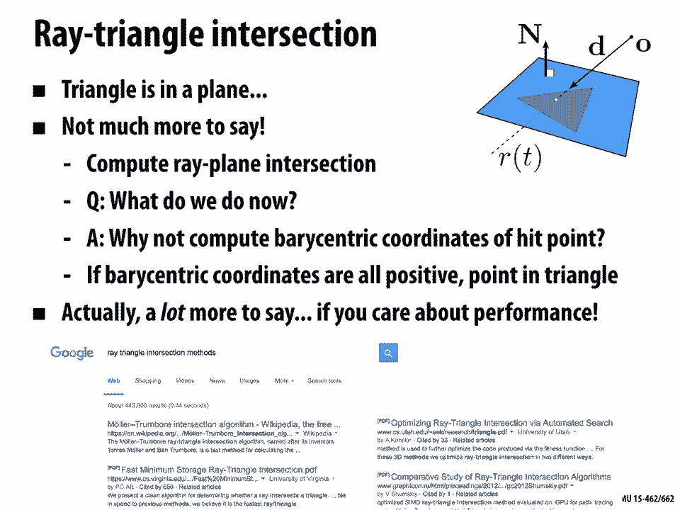
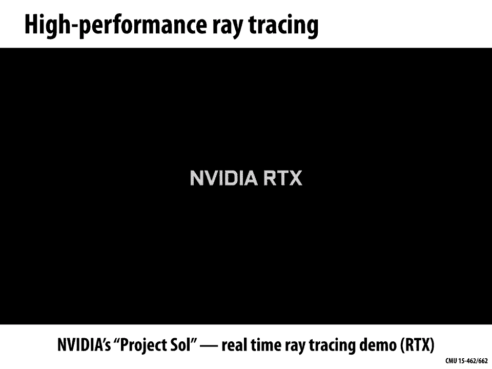
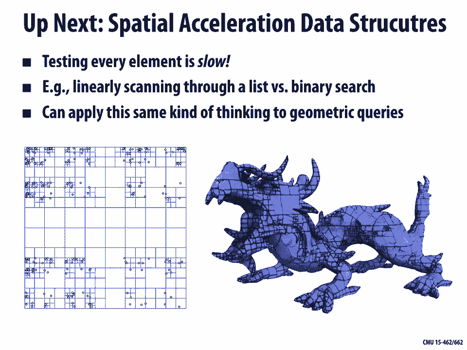

# 【双语字幕+资料下载】CMU 15-462 ｜ 计算机图形学(2020·完整版) - P13：L12- 几何查询 - ShowMeAI - BV1Pf4y1E7GJ

[Music]，all right welcome back to CMU 15 462，computer graphics today we're going to。

be talking about geometric queries so in，the last few lectures we were talking。

about geometry in general what are，different kinds of representations。

implicit versus explicit and then also，getting into a lot of the details about。

mesh data structures and doing geometry，processing today we want to talk more。

about how do we answer specific queries，about geometry things like the distance。

to a point or the intersection with，array and there's actually a lot of ways。

to motivate these kinds of queries not，just within geometry itself but in all。

the other areas of computer graphics so，whether you're doing animation or。

rendering or geometry processing these，kinds of queries show up and are quite。

important today we're going to be，talking about how to do the basic。

queries next lecture we'll be talking，about how to accelerate them how to make。

them fast if you want to do really large，problems just to get a little motivating。

example that's connected to some of the，things we've been talking about is to。

look at geometry processing and think，about what happens to a geometric signal。

as we operate on it so you can imagine，we start out with some nice initial mesh。

this cow on the far left we down sample，it we up sample it we subdivide we do。

various operations and even if we're，very careful about how we implement each。

of these operations what happens over，time is that the signal degrades so it。

becomes something that looks very，different from what we started with we。

get aliasing right we keep talking in，this class about how aliasing is a。

phenomenon that shows up all over，graphics and the question is in this。

geometric context how might we do a，better job of preserving this original。

signal this original shape so there are，a lot of good answers to this question。

but one thing you might think about，doing is saying all right well I might。

have processed my signal I might have，remesh tit and moved the vertices around。

but I can still keep track of what the，input geometry looked like I still have。

my original input mesh and so what I，could try doing is taking every vertex。

of my newly processed mesh right the one，where I'm starting to lose signal。

fidelity and I could take each vertex，and I could try to push it back onto the。

original surface so that at least the，shape the overall shape still looks like。

what I started with in order to do that，well we need to find some point on the。

original surface and not just any point，we might really want to say well where。

should I put the the vertex that's kind，of drifted away from the surface maybe I。

should put it on the closest point of，the input surface if we could do that we。

could get a better looking result so，just one possible way to motivate this。

we'll talk later on about lots of other，places where these geometric queries。

show up so then our whole task here kind，of boils down to just one simple atomic。

question which is given a point in space，let's say we have a sample point P how。

do we find the closest point on the，surface right so maybe we have our mesh。

of a cow we want to find the point，that's that's indicated by the dashed。

line and there are lots of questions you，could then ants ask about how to answer。

this question for instance well okay，what kind of representation is。

appropriate for this task should we use，an implicit representation or should we。

use an explicit representation we'll see，one example at least where an implicit。

representation might make this a little，easier we can also ask things like well。

does it matter so much what choice of，data structure we use is a half inch。

match going to be better for this is an，incidence matrix gonna be better for。

this I would say generally this is not，the main concern when it comes to。

queries like this although you might，find that some of them will help in in。

small ways we can also ask questions，about cost so what's what's the cost of。

doing a naive version of this algorithm，I have this one point and I want to find。

the closest point on the surface well do，I maybe you have to visit every single。

triangle of my mesh to figure out which，point is closest and even if we are just。

talking about a single triangle right，contains，the closest point we still need to。

figure out what is the closest point on，that triangle alright so how do we talk。

about the distance from a point to a，triangle how do we find the closest。

point alright so there are lots and lots，of different questions that we're going。

to need to answer in order to do these，closest point queries beyond just。

closest point queries there's lots of，different kinds of geometric queries we。

might like to apply right suite when we，talking about closest points we might。

like to know other things like do two，triangles intersect and if they do。

intersect where and how do they，intersect we might want to know are we。

inside of an object or outside the，object we might want to know does one。

object contain another so geometric，queries are all just about asking。

relative questions about two pieces of，geometry right the data structures we've。

seen so far are really not designed with，this task in mind right when we talked。

about half edge meshes and incidence，matrices and adjacency lists those david。

structures were really designed from the，ground up for getting local neighborhood。

information for seeing which vertices，are next to which other vertices things。

like this they didn't really help with，these spatial queries so we're gonna。

need some new ideas where again I need，to really examine this problem and see。

what the the fundamental computation，looks like and so today again we're。

gonna come up with some simple，algorithms which are going to be pretty。

slow especially if we have large data，sets but next time we'll talk about。

intelligent ways to accelerate these，geometric queries ok so just as a。

warm-up just as a little hopefully easy，exercise，let's do kind of the world's simplest。

closest point query which is that we，have a point，right we have a point a this one on the。

bottom right here and we want it and we，have a query point P okay so a has。

components a1 a2 P has components P 1 P，2 and I'm gonna ask a stupid question。

which is what is the closest point on，the point a this is a vacuous question，is。

is the point a so the closest point to P，is a but that helps us to start think。

about calculations we'll need to do when，we talk about closest points in。

particular the distance so can you，remember what is the distance how do we。

compute the distance between two points，hopefully the answer is yes we've done a。

lot of of review of this kind of thing，so we can just use the Euclidean。

distance formula square root of the，difference between components squared so。

a1 minus p1 squared plus a2 minus p2，squared the square root of that will。

give us the distance okay so this was，super Elementary you might ask why are。

we even talking about this is so，stupidly simple slightly harder question。

is what is the closest point on a line，so in particular let's say I have this。

description of a line I have a line，described by the implicit equation and。

transpose x equals C where n is the unit，normal vector for this line so this is。

going to be a line in the plane like，this and is this unit normal vector and。

all the points on the line are，characterized by this implicit equation。

that says how do you know if X is a，point on the line well you know if it's。

a point on the line if and transpose X，is equal to some constant C ok and so。

the question is how do I find the point，closest to my query point P well the。

first thing that you should do before，you solve any problem of this kind is。

just to kind of get an intuitive sense，of what the answer looks like so if I。

draw this picture how would I draw in a，little dashed line that tells me what。

the closest point on the line is right，and you know certainly ok it's it's not。

it's not that every point on the line is，the same distance to P all right there。

definitely some that are closer than，others and okay I think it's not this is。

not really that hard of a question right，the closed，point you kind of take the orthogonal。

segments to the line and and slide it，along the line until it hits P all right。

that's the quickest way to get to P from，the line okay so the intuition is。

straightforward how do we actually，calculate it right how do we actually。

write down an expression that gives us，that closest point well there are lots。

of different little calculations you，could do to get the the closest point。

here's one way that I like to do it is I，like to say okay well hmm I can just。

take my implicit equation and transpose，x equals C and I can ask what are the。

X's right what X is am I going to，consider okay so here I'm gonna say all。

right if I start at P and I move in the，normal direction by some distance or I。

move in - the normal direction by some，distance T then eventually I'll get to，the line。

right and so I at this point all I need，to say is figure out is what is that。

distance T or how much time do I have to，travel in the normal direction before I。

hit the line so I can write that by，saying n transpose P plus TN equals C I。

want to move in the direction n by a，distance T until I satisfy the line。

equation from here it's just a little，bit of linear algebra right so I。

distribute the transpose across the sum，I get n transpose P plus T and transpose。

N equals C and now I remember that N is，a unit vector so I can just replace n。

transpose n with one right and transpose，n is just the squared norm of n which is。

one and at this point it becomes very，easy to solve for T I say okay fine so。

now I know the distance or the time that，I have to travel is T equals C minus n。

transpose P great so that's how long I，have to travel or how far I have to。

travel to get from P to the line what is，the actual point that I reach well I。

just take that T value and I，get back into the expression P plus TN。

start at P move this particular distance，T in the direction N and I get P plus C。

minus n transpose P n okay and maybe，that boxed equation means something to。

you maybe it doesn't but either way it，is giving us a very explicit expression。

for the closest point on the line okay，let's make this a little harder so so。

far we've been asking what is the，distance or what is the closest point。

from a given query point to an infinite，line now let's restrict our attention to。

just a small segment ok so again I have，a query point P and I want to find the。

closest point on this segment here what，we can do is we can take advantage of。

knowledge that we've already gained we，can break down the problem of finding。

the closest point to a line segment into，two problems we've already solved right。

so we've noticed that a line segment，kind of has two different types of。

points it has points on the ends the end，points a and B or it has interior points。

and we already know how to compute the，distance to each of these components。

right we know how to find the closest，point to a point like the end points we。

know how to find the closest point to a，line okay and we just have to do a。

little more work to combine these two，steps to figure out what is the closest。

point to the line segment okay so I'm，just gonna let you think for a moment if。

I now have a query point P and I want to，find the closest point on the line。

segment what is a little algorithm I，right um I think it's also helpful at。

least for me it's helpful at this point，to draw a picture of all the things that。

could happen right so here's a bunch of，different possible query points P and。

for each of them I've drawn with a，dashed line the segment that tells me。

where the closest point is on that，original line segment so what you notice。

is there really are these two different，cases points that are kind of off one。

end of the line segment or the other for，those query points it's pretty clear the。

closest point is an end point of the，line for points in the middle the。

closest point is some interior point of，the segment right so there's two。

different kinds of behaviors depending，on where in space the query point P is。

so how can i how can I write down kind，of a high-level algorithm a pseudocode。

that tells me what is the closest point，well here's one way to do it I could say。

how about first I'll find the closest，point on the line just like I did in the。

previous slide I just plug in this，little expression it gives me the T。

value I plug the T value in that tells，me the closest point on the line okay。

and then I have to ask myself is any，point on the line an acceptable answer。

to this query well no because this，closest point on line calculation might。

give me a point anywhere on the infinite，line whereas what I really care about is。

points within this little interval okay，so once I find the closest point on the。

line I really need to check is that，closest point between the two endpoints。

if not if it's not somewhere in the，segment well then I just take the。

closest endpoint right I say uh the，closest point on the line itself is not。

actually on the segment so the best I，can do is say that the endpoint is the。

closest point okay so that's not quite，an algorithm because I haven't really。

spelled out the details of how that all，works so now I have to ask myself well。

how do I know how do I do the check to，see if it's been，the two end points one way to do this is。

we could write down the closest point on，the line as a little linear。

interpolation of the two end points so，if a and B are the two end points then I。

can write any point inside the segment，as a plus T times B minus a for some。

scalar T now just to be really clear，here this T is not the same as the T。

that we used in the closest point on，line calculation right T in this case is。

just a parameter that tells us how far，along the line do we walk from A to B or。

from a toward B and what we know is that，as long as T is between 0 and 1 this。

point is inside the segment right if the，closest point on the line has a T value。

between 0 and 1 it's inside the segment，why is that true well just look at this。

little expression if T is equal to 0，what do we get we get just a if T is。

equal to 1 then we get a plus B minus a，which is B so for values between 0 and 1。

our point can only be between the points，a and B if T is less than 0 or greater。

than 1 we know we're on some point，that's on the line but not on the line。

segment and we have to take one of the，endpoints as the closest point okay all。

right so we're going to keep building，this up more and more and more basically。

you start to see the strategy that we，answer a very very stupidly simple。

question what is the closest point to a，point then we say what's the closest。

point to an edge and we use our closest，point to a point and line to figure out。

that and then we can say well what's the，closest point to a triangle well。

hopefully we can use some of the，knowledge that we gained by asking about。

closest point to a segment to understand，closest point to a triangle okay and。

again a really good thing to ask，yourself before getting into the。

nitty-gritty of the algorithm is just，intuitively or visually what are all the，possibilities for the。

point to a triangle so let's say we have，this blue triangle and it's in the plane。

right this is in two dimensions and I，want to know what are all the things。

that could happen I'm gonna plop down，some query point P somewhere else in the。

plane and I'm gonna try to find the，closest point on the triangle what could，that possibly look like。

well here's a pretty good illustration，again depending on exactly where I put。

the query point in the plane the closest，point on the triangle might be a vertex。

of the triangle or it might be an edge，of the triangle are there any other。

cases is it always going to be on a，vertex or an edge of the triangle well。

no I mean we could have a query point，that is actually inside the triangle。

right so we've almost reduced the，problem of closest point to triangle to。

one of our earlier cases right we could，just say ah all I have to do is call as。

a subroutine the closest point to，segment routine three times for the。

three different edges but actually the，first thing I have to do is check well。

is the point actually inside the，triangle if it's inside the triangle。

then the closest point is the point，itself okay how would I check if a。

points inside of a triangle hopefully，you have a pretty good answer to that。

question because it's exactly what you，implemented in a1 right every time you。

rasterized a triangle you were checking，if sample points were inside a triangle。

this is exactly that same test right so，in some sense you could think of this。

closest point query as a strict，generalization of your tests that you。

were doing your geometric queries you，are doing for your rasterization in that。

case you were just doing simple，inside/outside tests here you're getting。

a little more rich information okay all，right and now that we have conquered。

this challenge in 2d let's go to 3d，let's say，we have a triangle in three-dimensional。

space we have a query point somewhere in，space and we want to find the closest。

point on that triangle and I've drawn a，picture here that's suggestive about of。

the way we can think about this problem，so again rather than reinventing the。

wheel and solving this all over from，scratch again what we can do is say ok。

how can we leverage what we already did，in the 2d case to get closest point to a。

triangle in 3d let you think about that，for just one second how would I find the。

closest point to a triangle in 3d ok，well here's the the algorithm that I。

came up with which is first I'm gonna do，something that's very similar to how I。

found the closest point on a line，segment I'm gonna first take that point。

and I'm gonna project it on to the plane，of the triangle all right I know the。

triangle sits somewhere in in this plane，so I'm gonna first just project the。

query point onto the triangle find a，closest point on the plane and see is。

that point already inside the triangle，ok if if so then I'm already done how。

specifically can I test if the point is，in the plane of the triangle I'm sorry。

if the point that's projected onto the，plane is in the triangle well I could。

try to write down some 2d coordinate，system right I could do a change of。

coordinates but actually a much simpler，thing to do is rather than doing half。

plane tests like you did in your，rasterizer I can now do half space tests。

alright so given the the query point I，can see if is it on the intersection of。

three half spaces whose intersection is，this solid wedge that looks like the。

triangle kind of extruded up and down in，the vertical direction if the query，point is inside that。

solid block then all we have to do is，again project it down onto the plane of。

the triangle and we're done if not okay，then we just in some sense recurse right。

okay if it's not in the triangle it，could be on an edge if it's not an edge。

it could be on a vertex right so again，we take that projected point we find the。

closest point on some associated vertex，or or edge one thing we haven't spelled。

out right the one little detail that，we're missing at this point is how do we。

find the closest point on the plane，itself how do we find the closest point。

on a plane that's very similar to the，question we asked before how do we find。

the closest point on a line in fact the，expression we get out is going to be。

exactly the same this is an important，thing to to realize right it's really。

useful to know when is a calculation，that I did in 2d when can I just easily。

or immediately generalize that to 3d so，let's think about this so how do I。

describe a plane in three dimensions，well an implicit way to describe a plane。

is with an equation that just looks like，our line equation we just say the normal。

transpose times the point x times a，point X that's on the plane is equal to。

some constant n transpose x equals C，right and so then from then on all the。

calculations we did for the line，immediately generalize to the plane。

right the line was just a linear，subspace of the plane the plane in this。

case is a linear subspace of，three-dimensional space they're both one。

dimension smaller than the space they，sit in everything works out the same ok。

good thing to work through if you if you，don't believe it just sit down think。

through it work it out and you'll see，that you get the exact same expression，for the closest point。

the only difference being that now these，are 3d vectors rather than 2d vectors。

okay okay great so we're gonna keep，building up more and more and more we。

figured out how to do closest point to a，point to an edge to a triangle to a。

triangle in 3d finally we want to solve，this original problem what is the。

closest point on a triangle mesh in 3d，well good news a triangle mesh is made。

out of triangles we already know how to，find the closest point to a triangle so。

at least the naive algorithm is，straightforward we can loop over all the。

triangles we can compute the closest，point to each triangle and then do what。

if we know for each triangle what the，closest point is how do we find the。

closest point overall well as we're，walking through our list of triangles we。

can just keep track of the closest point，we've seen so far right for each closest。

point on each triangle we compute the，distance from P to the closest point if。

the new distance is smaller than the，previous distance then that becomes our。

new closest point it's really that easy，so that's an easy easy algorithm if we。

have a closest point to triangle，algorithm but what's the computational。

cost right what's the asymptotic cost if，I have n triangles in my mesh how much。

computation am i doing well hopefully，it's pretty clear that it's order n。

right it's big o of n I have to check，every single triangle in this algorithm。

I don't really have the opportunity to，skip any triangles and so what now if we。

have billions of faces in our mesh which，is actually not that remote of a。

possibility there are plenty of meshes，that have millions and billions of。

triangles or quadrilaterals or whatever，in them this is going to take billions。

of operations just to do a sing，closest point query and so this is。

something we're not going to improve on，this time but next time we'll talk about。

better data structures that in a very，beautiful way will let us accelerate。

these kinds of queries okay so so far，we've been talking about closest point。

queries when we have an explicit，representation of geometry all right a，polygon mesh is an explicit。

representation but we talked about the，fact that there are two major categories。

of geometric representations there's，implicit and explicit so let's change。

gears and think what if we want to do，closest point query on an implicit。

surface representation and we're really，going to start to see what we said was。

true in that that lecture couple，lectures ago we said yeah depending on。

whether you choose implicit or explicit，different algorithms become easier or。

harder well how is this going to impact，our closest point algorithm right so in。

in particular let's say that now our，geometry is represented by an implicit。

surface meaning we have a function，defined everywhere in space where if the。

function is equal to zero those are the，points on our surface if the function is。

different from zero those points are not，on our surfaces now actually we're going。

to be a little more specialized here and，we're going to say the value at any。

point is not just one or zero the value，is actually going to give us the。

distance to the surface so a good，example is this this bunny down here and。

what you can see is this bright white，band that's where the function is equal。

to zero that's where the surface is as，we walk away from the surface the。

distance value increases more and more，and more so we're getting into these。

oranges and dark reds those are larger，values so if you have this kind of data。

it's a nice informative description of，the surface actually it takes quite a。

lot of information how can we do closest，point，in space or in the plane and I want to。

find the closest point on this white，bunny what do I do，well one idea is okay start at the query。

point and I have some very useful，information I know that if I look at the。

gradient of the distance if I look at，the distance in which the direction in。

which the distance is increasing or，decreasing actually in this case as。

quickly as possible that's taking me，toward the surface as quickly as I。

possibly can go okay so I'm going to，compute the gradient of the distance or。

minus the gradient of the distance I，could do this using any technique like I。

could use finite differences on my grid，and then I could take a little step in。

the gradient direction that'll bring me，closer to the surface my distance value。

will go down and then I do it again and，again and again until finally I arrive。

at a point on the surface so this is a，very very different kind of computation。

that when we did with the polygon mesh，right we with a polygon mesh with a。

completely different structure to our，algorithm we looped through all the。

elements for each element we found the，closest point we took the minimum over。

all of them here we're starting at a，point we're using only local information。

to move our query point closer and，closer toward the surface and so you can。

see there's there's different trade-offs，that you you have when you're doing。

implicit versus explicit representations，the algorithms really change in fact you。

know if we take a step back and think，about what we did here we could say well。

wait we're doing a lot of work just to，push this point closer and closer to the。

surface but in the end no matter what，point we start at there's a unique。

closest point on the surface so wouldn't，it be smarter to just store at each cell。

of our grid right every pixel of our，image that stores the distance shouldn't。

we also just store the location of the，closest point right so we can make a。

trade-off between speed and memory do we，just want to store the Distin。

values and run a little algorithm to get，the closest point or do we want to just。

store the cached result directly but now，we have to store more data and this is a。

very common thing in computer graphics，to make the trade-off between speed and。

performance am I willing to use a ton of，memory and just pre compute everything。

if so maybe it's worthwhile to store，that now of course you don't get off。

scot-free at some point you actually，have to figure out those those pre。

computed values right so at the very，beginning of the algorithm you still。

have to run through every single grid，cell and do this same gradient descent。

calculation but the idea is that the，amortized cost may be much lower that if。

you're then doing millions and millions，of closest point queries well perhaps。

that initial pre-computation doesn't，make a difference overall okay so that's。

it for closest point queries the other，direction we can go here is to say well。

what about other kinds of geometric，queries what are other things we could。

ask about when it comes to geometry and，one that's going to be very very。

important for us as we move on to our，next unit is Ray mesh intersection so。

this is going to be really at the core，of photorealistic ray tracing what is。

the problem well first of all what is，array so array when I say array I just。

mean an oriented line or oriented line，segment starting at a point so you could。

really think about a ray of light，traveling from the Sun it's not like a。

line but a line is this whole infinite，line that goes in both directions。

whereas array has a definite starting，point and a definite direction okay it's。

kind of a half line but it's got an，orientation and what do we want to know。

so so what we want to know is give an，array where does it Pierce a surface so。

that the picture the picture is a little，off here but you can imagine that this。

ray travels from the Sun it travels down，to earth and at some point it goes。

through the cow oh right and we want to，know what are the，locations where this ray pierces the。

surface those two black points why do we，want to know this well I already。

mentioned that this is going to be，really important for photorealistic ray。

tracing but actually it's important to，realize that ray mesh intersection shows。

up again all across graphics in geometry，it's used for inside-outside tests so I。

can if I can intersect a ray with a，surface I can actually use that to。

figure out am i inside or outside the，surface how do I do that ah here's a。

here's a really nice observation if I'm，in a closed surface meaning a surface。

that has no holes in it then I know that，if I'm inside a surface the Ray has to。

pierce the surface an odd number of，times to leave it if I'm outside the。

surface it has to pierce an even number，of times right so I can just do a ray。

mesh intersection test and count did I，do an even or odd number of。

intersections am i inside or outside，I'll let you think a little bit about。

why is it even or odd it's helpful maybe，to draw some pictures in 2d in 2d it，works just the same。

of course ray mesh intersections as I，said are also important for ray tracing。

why because they help us test visibility，so here the analogy of the Sun is。

perfect if I want to see is a point in，shadow or is it visible from the Sun。

well I just have to shoot a ray to the，Sun or from the Sun to the point and see。

did it hit anything or not if it didn't，hit anything then there's a lot of light。

shining on that point if it hits，something that that point is in shadow。

alright so this is at the root of very，very basic shadow algorithms in ray。

tracing I'm also in animation so if you，want to do collision detection you want。

to see if two objects are going to，collide there are algorithms that might。

use ray tracing to decide if that's，going to happen if I keep moving along。

my current trajectory am I going to bump，into something one thing that we notice。

about ray tracing that is maybe a little，different from how we were talking about。

closest point queries is that a single，ray may pierce the surf，in many many places it's quite common。

actually almost in some times almost all，rays will pierce you know any given。

surface in more than one place with，closest point queries actually if you go。

back and think about it there are some，very special situations where the。

closest point is not unique right where，there's multiple closest points to the。

given query point we didn't really，address that point so that's something。

that to go back and think about but in，ray tracing it's really fundamental you。

have multiple intersection points for，any single ray query and we'll see。

exactly why that's true okay，so let's get a little more precise about。

our definition of array we can express，array as something like this we say okay。

we have some starting point the origin，oh like the center of the Sun and the。

rate is going to travel in some，direction D and just for convenience。

we'll say that D is always a unit vector，okay and so what we can say is where is。

this ray or we think about this is like，a particle of light leaving the Sun。

where is this particle after a time T so，what is R of T well it's we start at the。

origin and for time T we walk in the，direction D o plus TD okay so that's our。

Ray equation how do we intersect our，array with a piece of geometry well this。

time let's start with an implicit，description so this time imagine that。

our geometry is described by a function，f where the surface is all the points x。

such that f of x equals zero that was，our basic idea for an implicit equation。

so the question is how do we find points，where array Pierce's this surface okay。

and and here is the general strategy，we're going to look at a lot of special。

examples but here is the general，strategy to always keep in mind when。

you're asking where does a ray intersect，an implicit surface well look we know。

that the Ray has an equation R of T，equals o plus TD okay，and so what we can do is just replace。

with X and then solve for T values such，that f of X is equal to zero right our。

implicit function f is a test that asks，is the point x on the surface so what。

we're gonna do is we're gonna consider，all points along array all points X。

along array or all points R along array，and see which one of them are in the。

surface to make this more explicit let's，consider the unit sphere what is the。

implicit description of the unit sphere，what is the function f in this case well。

the function f is just f of X is the，norm of x squared minus 1 any point that。

has unit norm will evaluate to 0 those，points are on the sphere ok so now we're。

looking for points along the Ray that，satisfy this equation we're looking for。

points along the Ray that are on the，sphere ok so we plug our of T in for X。

and we get Oh plus TD squared minus 1 at，any time T now for which this value is 0。

we know that we're intersecting the，sphere we know there were two at a point。

on the sphere ok so a convenient way to，write this out now is to expand this。

quadratic term into three different，terms with three different powers of T。

so we can expand this into norm of d，squared times t squared plus two oh D。

times T plus norm of AX squared minus，one and if we give a name to the three。

leading coefficients if we call norm of，d squared a to OD is B and norm of o。

squared minus one is C then we have a，quadratic equation for T we just have a。

T squared plus BT plus C is equal to，zero aha，so this is an equation that hopefully。

you've seen before actually long before，long before multivariable calculus in。

linear algebra in some algebra class at，some point in your life hopefully you。

learned how to solve a quadratic，equation and maybe you always wondered。

why am i solving so many quadratic，equations what could this possibly be。

good for well it turns out the answer，was computer graphics so do you remember。

how to solve the quadratic equation a T，squared plus BT plus C equals zero maybe。

you remember that there was something，called the quadratic formula maybe don't。

remember the exact form but there it is，quadratic formula says if I have a。

general quadratic equation then in，general it's solution you can have two。

solutions and they have the form T，equals minus B plus or minus square root。

b squared minus 4ac over 2a okay now，what's interesting about this equation。

is it has more in general has more than，one solution it could have only one。

solution or it might in fact have no，solutions at all right so what's going。

on there I mean we have this very，definite geometric problem we want to。

know where does the Ray pierce the，sphere how could we have all these。

different possibilities that this，equation has only one solution or no。

solutions or two solutions what's going，on there geometrically okay well。

hopefully the picture makes it clear in，in the case that we show here on the。

bottom right it's pretty clear that the，Ray pierces the sphere twice it goes。

into the sphere and then back out of the，sphere ah those must be the two。

solutions to the quadratic equation，right B plus square root of blah blah。

blah or B minus square root of blah blah，blah ah interesting，what does it mean if there's only one。

solution to this equation well there's，something very very special that can。

happen which is the rate might just，graze the sphere so rather than going in，and then back out again。

it's just tangent to the sphere at a，single point that's when the quadratic。

formula has only one solution and then，finally there are cases where there's no。

solution in this quadratic equation what，aha okay there's no reason why the Ray。

has to intersect the sphere at all right，the Ray could just fly by and never hit。

the sphere and the quadratic equation，wouldn't have any solutions okay another。

thing to think about is what does it，mean if the T value we get out of this。

equation is negative right T is the，distance that we have to move along the。

direction D starting at O in order to，hit the sphere what does it mean if T is。

negative well if T is negative that，really is telling us that actually the。

Ray also doesn't hit the sphere at least，not for that T value right。

it means I'm moving along a line that，intersects the sphere but not for the。

half of the line that I care about，right so I might be starting on the。

other side of the sphere and going away，from it rather than intersecting it okay。

so really this is a nice example of how，the quadratic formula is not only useful。

but tells us some really important，geometric information about what's going。

on now of course you can go ahead and，write out explicitly the solution to。

this equation right just plug out plug，in a B and C in that quadratic formula。

and you get some nice little expression，blah blah，there's nothing deeper to know about。

this formula other than that's the final，form that's the kind of thing you can。

plug into your code okay，okay so that was ray-sphere intersection。

let's consider a different important，surface which is the plane how do I test。

if a ray intersects the plane，well again I have an implicit expression。

for the plane it's the one that we've，talked about all along we say suppose we。

think of a plane as the set of all，points X such that n transpose X is。

equal to C for some constant C n is，again the unit normal C is some offset。

in the normal direction right so if C is，zero the plane is passing through the。

origin otherwise it's offset from the，origin in some by some amount how do we。

find the intersection of the plane with，array R of T equals o plus TD if we do。

exactly as we did before we just replace，the point X in our implicit equation。

with the position of the Ray R of T，right so we say we want to find now。

times T such that n transpose R of T is，equal to C from there it's just a matter。

of solving for T now this is just，algebra or linear algebra so we expand。

our definition of our R becomes a plus，TD and we're going to look for T values。

such that n transpose au plus TD is，equal to C okay so we can expand we can。

distribute the transpose over the the，sum so we get n transpose au plus T and。

transpose D is equal to C we subtract，and transpose au from both sides we。

divide by and transpose D and we get T，is equal to C minus and transpose au。

over n transpose D okay let's think，about this so now we want the。

intersection point so what do we do we，plug T back into the Ray equation so we。

found the T the time at which the Ray，intersects the plane we want to know。

where the Ray intersects the plane so we，just plug this time value back into the。

in the sphere case we in this in the，sphere example we had all these。

interesting cases to think about if，there's two solutions for tea this。

happens if there's no solutions if，there's one solution what about in the。

case of a plane is this is this just a，lot easier the Ray always intersects the。

plane if I give you any Ray at all will，it always intersect any plane well no。

again we run into this thing about well，what if T is negative what does that。

mean the time at which the Ray first，intersects the plane is less than zero。

that means actually we're just moving，away from the plane and we'll never。

intersect it right what else could，happen here what's another funny case。

well we can either approach it from the，geometric side or we can approach it。

from the algebraic side so from the，geometric side we could say well what's。

a funny case of a ray and a plane and，whether they intersect or not ah a funny。

case for me is if the if the Ray is，traveling parallel to the plane。

right so it's flying above the plane and，it never never intersects the plane it's。

not getting closer and it's not getting，further away so that's another funny。

case where the Ray doesn't intersect the，plane but not because T is negative but。

rather because T is sort of infinite，right it I'll go along this ray forever。

and I'll never intersect the plane after，an arbitrary amount of time how does。

that show up algebraically well we，noticed that this expression for T has a。

denominator and transpose D the inner，product of the normal and the direction，of the ray。

what happens if n transpose T is n，transpose D is 0 right so the direction。

of the normal and the direction of the，Ray are orthogonal well that's exactly。

this case that we described right the，ray flying over the plane in that case n。

transpose D is 0 and T is some number，over，zero so we get infinity T is infinity so。

again the equation that we solve gives，us important information about what case。

we're looking at are we going away from，the plane are we going toward the plane。

did we intersect when did we intersect，where did we intersect or are we going。

parallel so thinking carefully about all，the different cases with these equations。

actually tells us a lot about what's，going on ok so now we can start to do。

something like we did with closest point，queries and build up more sophisticated。

intersections from simpler ones in，particular if we're gonna do ray tracing。

if we're gonna make beautiful pictures，of triangulated surfaces then we need to。

do ray triangle intersection well one，important thing to keep in mind about a。

triangle is that the three points of a，triangle always sit in some plane made a。

triangle lives in some plane that plane，has a normal N and so maybe a first good。

step for finding a ray triangle，intersection is to just first figure out。

where does the Ray intersect the plane，containing the triangle we know how to。

do that right we just did it from there，there's not a whole lot more to say if。

we want to check if a ray intersects a，triangle hopefully you start to see the。

pattern in fact hopefully you've done，enough in this class already that you，can see immediately aha。

if I figure out where the Ray plane，intersection is and I want to know does。

the r8 intersect the triangle I'm home，free I already know how to do the rest。

right why is that the case well okay，let's say we first compute the rain' ray。

plane intersection so we know where this，white point is in the in the plane it。

could be inside the triangle could be，outside the triangle we've drawn it here。

so that it's inside but it could be，outside what do we do now how do we how。

do we know if the rays intersecting not，only the plane but also the triangle。

well this is again one of these inside，triangle tests it's exactly what you did。

in your rasterizer to check if a sample，was covered by a triangle one way we。

could do this there are many different，ways to do this test one way to do it I。

like to think about it this way is why，not compute Bary centric coordinates of。

this hit point right so so we could，figure this out by you know lots of。

different formulas we had for very，central coordinates one way to do it。

would be to compute areas so I compute，the signed area of the three little。

triangles made by connecting the hit，point this white point to the three。

vertices of the triangle I divide those，signed areas by the area of the triangle。

and I get the Bary centric court and，it's okay but you can do it however you。

like I get those barycenter coordinates，and we know that if all the very central。

coordinates are positive if all of them，are positive then it's a point in the。

Triangle right that was our basic，definition of various enter coordinates。

is that their points inside the triangle，have coordinates that sum to one and are。

each positive or a partition of unity，right but no matter how you slice it you。

just do your point in triangle test and，now you know whether the Ray intersected。

the triangle or not okay，so whether whether you are completely。

kind of deeply understand all the little，calculations or not at this point the。

really important thing to say is try to，think when you're doing computer。

graphics about whether you can reduce a，problem you're about to solve to a。

smaller more atomic problem that you，already know how to solve when you when。

you see this picture when you see this，picture of trying to find is a point。

inside a triangle an alarm should go off，in your head that says oh yeah I've。

solved that before rather than writing，brand new code for this we're coming up。

with a brand new algorithm I can try to，use that thinking or that algorithm or。

that code as a subroutine for what I，want to do right，and this is a great thing to do because。

you can benefit from all the knowledge，and from any optimizations and from。

anything you know about this problem now，actually I'll say beyond this very very。

basic description we've given in these，slides there's a lot more to say about。

good ways to do Rea triangle，intersection if you care about making it。

fast and if you care about making it，numerically robust okay so the algorithm。

I've described here will work but if you，want to shoot lots and lots of rays。

millions of rays and you want to make，sure that those calculations work no。

matter which case you throw at your，computer there's a lot to read read。

about it in fact if you just go and，google ray triangle intersection methods。

you'll find all sorts of people who，spend their lives studying and。

optimizing this problem because it's，such an important atomic query in。

graphics why is that true why you know。

why is it so important to optimize ray，triangle intersection well basically。

because if you want to make，photorealistic imagery here's a here's a。

beautiful shot from Pixar's Koko right，this image is made by shooting Ray's。

around the scene millions and millions，of rays that intersect with extremely。

complicated geometry there's interesting，lights and materials and everything。

right but fundamentally the geometric，query that you have to do is。

intersecting Ray's over and over and，over again with geometry even with all。

the engineering effort and the expertise，of people at Pixar making an image like。

this even a single frame like this takes，about 50 hours to compute and then they。

have to crank out 24 of these frames，every second to make animation okay and。

then do that over several hours you can，see this is a huge amount of computation。

so optimizing low-level queries like Ray，triangle intersection is super super。

important for making photorealistic，graphics happen for this reason there。

has been as I kind of hinted that in the，last slide there's been a huge amount of。

work on high-performance ray tracing how，do we do lots of red triangle。

intersections really fast how do we，organize you know batches of arrays and。

in intelligent order so that we're，getting cache coherent acts。

and all sorts of interesting questions，so intel has put a lot of effort into。

this they've made this library called，Embry which does very high-performance，ray tracing on the CPU。

Nvidia is put a lot of time and energy，into this they've created a library。

called optics which is a GPU ray tracing，library and actually ray tracing people。

have finally kind of figured out yeah，ray tracing is super super helpful。

atomic primitive in graphics we're，actually gonna finally bake this into。

the hardware so just in the last few，years，NVIDIA has started putting what's called。

our TX pipeline into their a ray tracing，pipeline into their GPU hardware and so。

this has really enabled a lot of things，that weren't possible before is really。

starting to open the door to using very，different kinds of graphics algorithms。

for real-time computation and so if if，you're interested in graphics you want。

to kind of be on the the edge of the，next big thing I would definitely check。

out kind of real-time ray tracing GPU，ray tracing and see what people are。

doing there here's just one kind of cool，demo this is a ray tracing real time ray。

tracing demo made by Nvidia you can，google this is called project Sol and。

actually the thing I should say about，this first is this is not a hundred，percent real ray tracing。

so what this is is kind of a mash-up，rasterization which you did on。

assignment one and ray-tracing which，we're about to talk about a lot where。

basically they say okay at rasterization，is really good at certain things great。

racing is really good at certain things，let's rasterize an image but then if we。

want to figure out the color of，different fragments animation shoot rays。

to determine things like is there a，SiC effective，[Music]，one last query to talk about so we've。

talked about closest point queries we've，talked about ray triangle intersections。

let's talk about a query that is very，relevant for animation and that is mesh。

mesh intersection actually animation and，geometry you know it's hard to get away。

from geometry because ultimately you，know you have to you have to render。

shapes and you have to animate shapes so，one one question you might ask while。

you're animating shape or working with，the shape is doesn't intersect itself。

I'm modeling a hand or I'm trying to，animate a character who's closing their。

hand how do I stop the hand before it，runs through itself how do I test of a。

mesh has self intersections another one，that comes up in animation is just。

knowing if a collision occurred so I，want to know if a ball hit the ground so。

I can make it bounce or I want to know，if one piece of address ran into another。

piece of the dress so that I can，simulate the right dynamic so I can have。

some kind of contact resolution rather，than just letting the pieces of cloth。

pass through each other okay so how can，we do this kind of test well let's go。

back and play this game again where we，start out simple and we build up toward。

more complexity so the first thing we，want to ask is how do we do point point。

intersection tests I give you two points，P and a and your task is to check do。

they intersect do the do the points，collide well this is a stupidly simple。

test to do it's either if the points，have the same coordinates then they。

intersect and if they don't then they，don't write really dumb or let's say，simple thing to do。

sadly that's going to be the last time，this problem is so easy right point。

point intersection test is easy，everything else is gonna take a little。

work okay so let's make this just a，little bit harder and rather than doing。

point point intersection test we'll do a，point line intersection test so now the。

question is how do we know if a given，point intersects a given line let's say。

again the line is given by an implicit，equation and transpose x equals C and so。

we have a point P we want to know does，that point P，you intersect the line what do I do okay。

hopefully it's not too hard to figure，out I just plug in P for X I want to see。

does the point collide with the line，that's just the same as saying is the。

point on the line and hey I have an，implicit equation that directly tests is。

a given point on the line so I just，evaluate and transpose P and see is it。

equal to C okay I keep promising life，isn't so easy when it comes to these。

these geometric queries okay we're about，to see that it does become harder so。

finally we get an interesting，intersection test which is a line line。

intersection test all right I have two，different lines and I want to see do。

they coincide at some point actually，hopefully this reminds you a bit of。

linear algebra right there's there's，ways of thinking about linear algebra in。

terms of you know thinking about solving，systems of linear equations in terms of。

checking whether two lines or two linear，subspaces intersect or not okay so let's。

say in particular that we have our two，lines ax equals b and c x equals d。

actually let's say that should probably，be a transpose x equals b and c。

transpose x equals d how do we find the，intersection well we just see if there's。

a simultaneous solution we see if，there's a single point X that，simultaneously satisfies the two。

equations a transpose x equals B and C，transpose x equals D okay and hopefully。

this is a connection that you have made，before that I can formulate this as a。

is the same as saying I have a first row，of my matrix with the components of a c。

transpose x equals d i do the same thing，for the second row of the matrix if this。

matrix equation has solutions then these，two lines intersect ok and the lots of。

different techniques for checking if，that system has a solution here's an。

important question though so when you，study linear algebra in a in a math。

class everything is kind of assuming，that real numbers work well like you can。

do operations on real numbers there's，never any numerical problems with with。

working with these numbers this is，unfortunately not the case when you work。

with real computers computers have only，a finite amount of precision if you're。

working with floating-point numbers you，get 32 bits of precision or 64 bits of。

precision but at some point things start，to break down and so on a really really。

important thing to ask when you're doing，calculations with lines is to think。

about what happens in sort of near，degenerate cases for instance in this。

case what happens if the lines are，almost parallel so you have these two。

lines at the bottom and you want to find，where they intersect in fact even just。

looking at the picture it's even hard to，pinpoint on the picture where the。

intersection point exactly occurs right，if I ask you to draw on the screen okay。

where is that that intersection point，you might only get it to within some。

little margin of error you might be a，few few pixels off another way of saying。

this is just a very very small change in，the normal can lead to a big change in。

the intersection point if I were to，rotate one of those lines ever so。

slightly boy that intersection point，might shift really quickly one way or。

the other okay and this this kind of，instability is very very common with。

geometric predicates and geometric，queries so to really do a robust job of。

doing these geometric queries you need，to think carefully about robust。

numerical linear algebra really making，sure that you're you're analyzing this。

matrix in a reliable way，and I won't go into techniques for that，but there's a very nice。

citation down at the bottom which is，kind of a classic and plenty more。

written since then about how to do，robust linear algebra okay，so that being said you know without。

warning out of the way let's get back to，this more geometric picture and say what。

we really wanted to do was find，interesting intersections between。

different different geometric sets we，said how to do a point point。

intersection that was easy point line，intersection that was pretty darn easy。

to line line intersection was well it，was basically what you learned in linear。

algebra but with a little bit more care，about numerix okay but now let's do。

triangle triangle intersection this is，what we really need to do for instance。

if we want to do those applications I，mentioned before keeping the hand from。

going through itself or animating the，dress so how can we do this how can we。

find an intersection between two，triangles well hopefully at this point。

in the lecture I set this enough times，hopefully some of you were thinking oh。

well maybe I should see if I can break，this problem down into smaller problems。

that I've already solved right so a，basic idea，do you have any ideas if I look at this。

picture I have these two triangles and I，want to find out if they intersect or。

not and if they do intersect I'd very，much like to know where they intersect。

so what is a query that we've already，done that really really helps us with。

one way to do this is we can reduce this，to edge triangle intersections so before。

tackling the whole triangle triangle，intersection we can just say how do I。

know if a single edge of a triangle，intersects another triangle ah well that。

sounds very very close to just doing a，ray tracing query right in other words。

we roughly speaking we want to check if，each line passes through the plane of。

the opposite triangle once we've done，that or once we've found where that line。

pierces the plane then we can do an，interval test to check if that。

intersection point is on the edge right，once we found that that point is inside。

the segment or if it's inside the，segment we can finally check is it。

contained in the opposite triangle okay，so for each edge we do a let's say a ray。

tracing or a triangle test we see where，the Ray pierces the plane of the。

triangle we check if that piercing point，is contained inside the edge we also。

check if that piercing point is，contained in the other triangle okay and。

that gives us information about whether，the edge intersects the triangle。

certainly if the edge of one triangle，intersects the other the triangles。

intersect are there any other，possibilities is it possible for two。

triangles to intersect but neither edges，of neither triangle pass through the。

opposite triangle okay I'll let you，think through that that's a really great。

exercise in trying to break down a，bigger problem into these smaller pieces。

going beyond this basic triangle，triangle intersection test something。

that we care about a lot for animation，is not just do they do two surfaces。

intersect or not but but will they，intersect over time right so I might。

know where a triangle mesh is at one，of time and though I might know where it。

is 1/4 of a second later or one，twenty-fourth of a second later in。

between between the initial time and the，final time was there ever a moment where。

the two triangles intersected right so，this is again an important case for。

animation this question of continuous，time collision detection or figuring out。

did two things intersect in time this is，a much trickier question there are nice。

answers to it and again we'll to solve，them you would build up on things that。

we've already seen right so you could，start thinking about well maybe I think。

of time now as an additional dimension I，can think of triangles as at least as an。

approximation I could think of triangles，as some kind of prism in time and then。

that would turn this dynamic problem in，n dimensions plus time into a completely。

geometric problem in one dimension，higher also very interesting about this。

point of view yet again we're saying oh，well you can solve a certain problem by。

going one dimension higher just like we，did with homogeneous coordinates in fact。

there are techniques for doing triangle，triangle intersection tests in time。

using homogeneous coordinates yet again，homogeneous coordinates show up ok so。

that's all I have for today next time we，will discuss spatial acceleration data。

structures so as we saw testing every，single element of the mesh is slow if we。

do it one by one so we want to say how，do we speed up this kind of query and if。

you if you think back to arrays right we，used arrays as an analogy for our mesh。

data structures then we said that if I，have a list for instance and I want to。

if I want to find a certain element of a，list that satisfies some criterion well。

one way to do it is just walk through，the wrists the list and check the。

property for every element of the list，but a more efficient way if I have like。

a sorted list is maybe I can do some，kind of binary search so just as a sneak。

preview the general strategy for，speeding up these geometric queries is。

to generalize this idea of binary search，- higher dimensional problems okay and。

we can really apply this to geometric。

