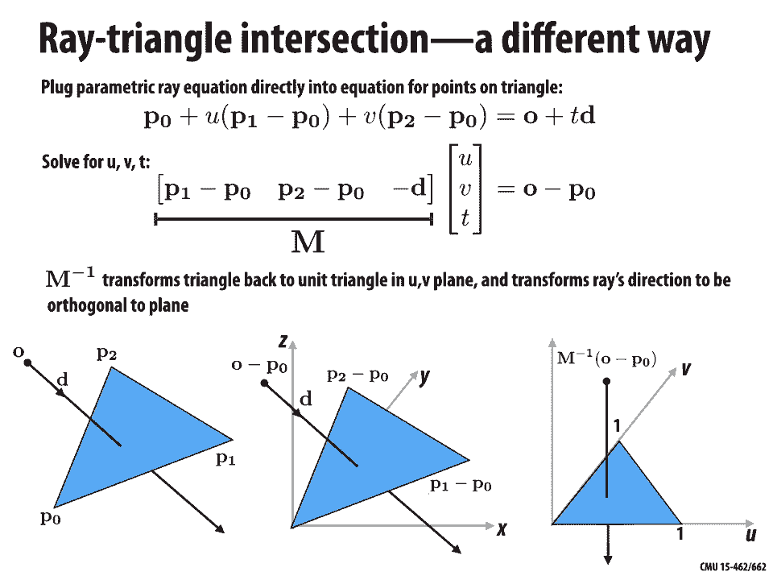
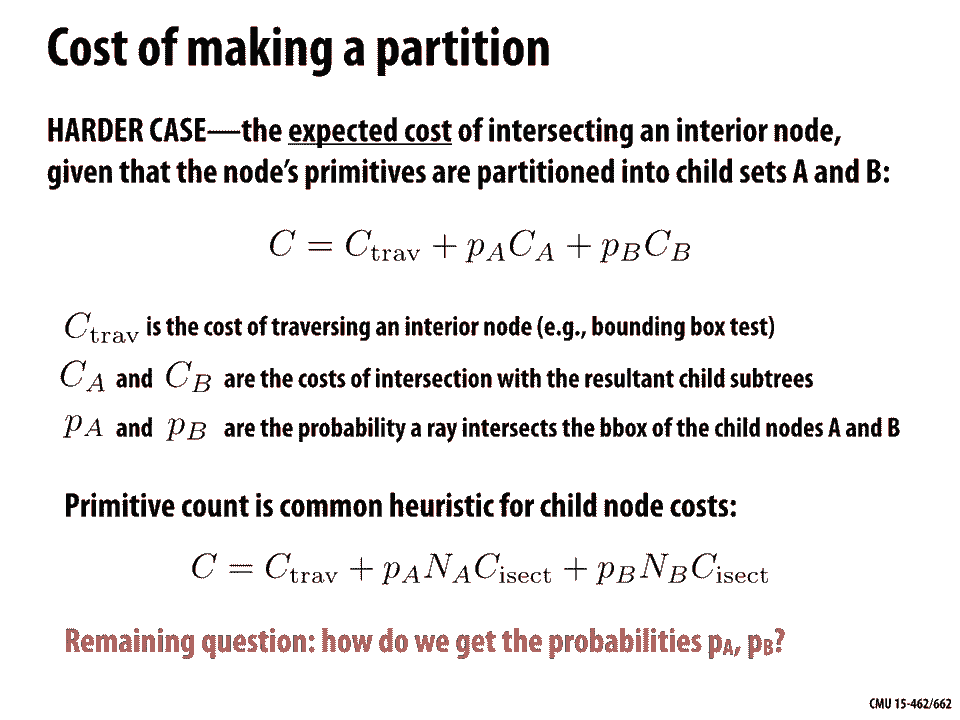

# 【双语字幕+资料下载】CMU 15-462 ｜ 计算机图形学(2020·完整版) - P14：L13- 空间数据结构 - ShowMeAI - BV1Pf4y1E7GJ

okay welcome back to 15 for 62 today，we're talking about spatial data。

structures so last time we talked about，basic geometric queries how do we test。

things like does array intersect with a，scene what's the closest point to a。

given query point and so on and today we，want to talk about doing those same。

things but greatly increasing the size，of problem that we can work with and the。

motivation here is that if you go out，into the world and look at real geometry。

it can be extremely complex it can have，detail at all different scales it can be。

massive and so the question is how do we，deal with this level of complexity from。

a computational point of view so how can，we efficiently perform a geometric query。

on a scene of this complexity and a very，important use case for us as we start to。

move toward doing ray tracing and，photorealistic rendering is intersecting。

array with an extremely large scene so，just to review how that works the。

problem is I have a primitive let's say，a triangle with these three vertices p0。

p1 p2 and I have array starting at an，origin o and traveling in the direction。

D and I want to figure out first of all，does the ray hit the triangle and second。

of all if it if it does hit the triangle，where or how far do I have to travel。

along the Ray from the origin to get to，that intersection point so the way we。

formulated this was to say okay we have，an implicit equation for the plane of。

the triangle something like n transpose，x equals C where n is the normal。

direction and C is an offset in the，normal direction and then we just plug。

in for X the equation of the Ray so we，want to see for any point along the Ray。

is this equation satisfied so that gives，us this second equation and transpose au。

plus TD equals C if we solve for T we，find that it has a nice little Express。

c- and transpose au / n transpose D and，then finally if we really want to find。

that intersection point we can just plug，it back into the Ray equation we can。

plug T back into the equation at the，very top and that'll tell us where the。

Ray is piercing the triangle okay of，course that doesn't completely do it。

that really is only testing does the Ray，pierce the plane of the triangle if we。

want to test if the point of，intersection is actually inside the。

triangle we still have to do a standard，triangle inside outside test basically。

compute the barycentric coordinates and。

check that they're all positive so，that's how we did it last time now。

there's lots of different ways you could，do it here's a different way which is。

also kind of fun to think about we could，parameterize the triangle with vertices。

p0 p1 p2 using our barycentric，coordinates so if we have these very。

central coordinates u v + well the third，one is always going to be 1 - u - V。

because they have to all add up to 1，right so if we have u v + 1 - u - V we。

can write a position on the triangle in，this way 1 - u - V times p0 + u times P。

1 plus P times V P 2 and we can think of，this map really if we think about ok。

what is the set of all coordinates U and，V that are valid barycentric coordinates。

well those are coordinates that are，first of all non-negative right greater。

than or equal to 0 and which sum to 1 so，we can plot the set of valid barycentric。

coordinates in the plane as this little，blue triangle and so we can really think。

geometrically of this map F as taking，that standard right triangle and warping。

it or turning it into the triangle that，we want to talk about that's really what，F is doing here。

ok so how can we incorporate ray，intersection into this picture well we。

can just plug the parametric ray，equation directly into，the equation for points on a triangle。

right we have an equation that says what，are the points on our triangle and we're。

searching for a point on the Ray that is，one of these points so we just say P。

Zero plus okay we write it a slightly，different way，plus you times P 1 minus p 0 plus V。

times P 2 minus p 0 equals o plus TD so，what we're really saying here is now we。

have three unknowns we don't know what，is the time T where the Ray intersects。

the triangle and we don't know what are，the very centric coordinates U and V。

where the ray hits the triangle but，actually we're in good shape because。

even though this looks like just one，equation it's actually three different。

equations notice that this equation，involves vector quantities each of these。

bold symbols p0 p1 p2 o and D those are，all vectors in r3 so actually this。

equation is actually three scalar，equations and that's nice because what。

it means is we have three unknown，degrees of freedom u v and T in three。

equations so we can build a little，matrix equation here's at the bottom we。

have the matrix M and it's columns are P，1 minus p 0 P 2 minus P 0 and minus D。

and we can solve simultaneously for all，three variables u v and T at the same。

time of course we're gonna have all the，same kinds of things go on that we had。

before right we might find a U and V，that's not inside the triangle we might。

find a t-value that's negative which，means what it means the Ray is actually。

going away from the plane rather than，toward the plane right so we still have。

to check all the same things but we can，just solve this little matrix equation。

to get the solution it also has a really，nice geometric interpretation which is。

that if we think about applying this，matrix to the vertices of the triangle，it's really trans。

forming it back into this standard，triangle if we think about applying this。

matrix to the Ray it's transforming it，into a ray that's orthogonal to the。

plane of this standard triangle so，another way of saying this is we're。

reducing our ray triangle intersection，problem into a much simpler problem of。

seeing where it hits this UV plane okay，so hopefully that's a good refresher of。

just the idea of intersecting a ray with，a triangle but let's continue let's。

think about this bigger problem of not，just considering a single triangle but a。

large scene with lots of complexity okay，and so one version of the ray tracing。

problem is this first hit problem which，says given a scene divided defined by a。

set of n primitives and array R we want，to find not just any point where the ray。

hits the scene but we want to find the，closest point of intersection with the。

scene all right so here the ray hits the，cow in four different places we want to。

find the spot on his head okay find the，first primitive the ray hits and the。

point where it hits I mean once we have，the primitive once we know the triangle。

okay we can just do our triangle test，right so what is the what is the most。

simple thing you could do what's the，naive algorithm for solving this problem。

I give you a bunch of triangles you want，to see which ones get hit by the Ray and。

where what do you do I mean the obvious，thing to do is just go ahead and okay。

just intersect the ray with every single，triangle and then as you iterate over。

all these triangles doing all these，intersections you just want to keep。

track of the closest hit point all right，take the minimum T value that you've，seen so far。

what's the computational complexity of，this algorithm so if I have n triangles。

how does this algorithm scale with the，number of triangles well it's pretty。

clear we're not doing anything，particularly clever here right we're。

doing the same amount of work for every，single triangle in our list we have。

opportunity to bypass any of that work，so the complexity is just order and。

linear complexity can we do any better，that's really the question of the day。

when it comes to geometric queries like，ray tracing can we somehow speed this up。

if you've never thought about this，before it's maybe not obvious that you。

can it feels like you need to know about，kind of the interaction of all the。

geometry with the Ray so what could we，possibly do well okay so there's at。

least one simple thing we could do which，is we could do some kind of crude or。

coarse check of whether there's even a，possibility of the ray hitting the model。

before we get going with this long list，of intersections so one thing we could。

do for instance is put a bounding box，around the match we could find sort of。

the smallest cube that encloses all the，primitives okay first of all how would。

we do this well we we still have to do，something that sounds linear right we。

loop over all the vertices in the mesh，and we keep track of the minimum and。

maximum XYZ coordinates of each of the，vertices that we encounter okay and。

that'll give us kind of the corners of，our box okay fine we can make this box。

how does it help us why is this a useful，acceleration strategy well the basic。

idea again is to go coarse to fine first，we do a intersection of the Ray with the。

box there's a chance that the Ray，actually doesn't hit the box at all and。

in that case we know that we're done，because if the rate doesn't enter the。

box there's no way that it could，possibly pass through any of the。

primitives that are contained inside the，box so we can just stop computation。

there and you know return a flag saying，we missed we didn't hit anything on the。

other hand if it does hit the box all we，that it，I hid something inside the box and so。

now we have to go down this whole long，list of triangles again and do the。

intersections one by one so did we，actually do better overall did we。

actually speed things up well maybe in a，practical sense we did maybe just。

depending on the way that our scene is，set up and and you know how our Rays are。

distributed maybe most of the time we，hit the box or maybe not maybe most of。

the time we do hit the box so，asymptotically or in the worst-case。

sense we're not doing any better we're，too still using order and work to do an。

intersection query and in fact if you，think about this we also had to do no。

matter what we had to do order and work，to determine the bounding box right we。

looped over all the vertices first so so，far we haven't done any better you might。

say well maybe the cost of building the，box doesn't matter because you just have。

to do it once whereas you might want to，do millions and millions of Ray。

intersection tests okay so that's a good，point so maybe it doesn't matter that。

it's linear computation to build the box，because the amortized cost of building。

it is very small but we still end up in，the worst case for a single ray doing，linear work okay。

the other thing we didn't answer by the。

way is we didn't actually say how to do，a ray box intersection and if you've。

been following along so far this，shouldn't be too hard right if you know。

how to intersect a ray with a triangle，well you already went through the。

exercise of finding a ray intersection，with a plane if you can do a ray。

intersection with a plane well then you，can probably use that kind of elementary。

computation to build up some kind of，intersection test with a box so how do。

we do that here's our picture we have，our axis aligned box and we have our Ray。

o plus TD okay and we want to know，where and if this ray intersects the box。

so how do we do this again we do a ready，play in the intersection test and。

transpose au + T D equals C where for，each side of the box we have a different。

normal N and we have a different，constant C but in this case the math is。

going to simplify greatly because the，planes are always access aligned so in。

2d for instance the normal is always，going to look something like 1 0 or 0 1。

or 0 negative 1 right and so when we go，to solve that equation for T we get a。

much simpler expression in this case we，get T equals equals x naught minus o x。

over D X where X is just the X component，of the origin and DX is the X component。

of the Ray direction ok so how do we do，a ray box intersection that just tells。

us how to do an intersection you know。

with a with an axis aligned plane the，idea is we just compute the。

intersections with all the planes and，are we done at that point well no not。

quite it's not enough to just know that，the Ray hits the planes because the。

boxes only cover certain pieces of each，of those planes right and so we want to。

take the intersections of T min T max，intervals we know the extent of the box。

along each direction and we can see if，the time that the Ray spends inside the。

box in x y&z if those coincide ok so，just think about that how do we know。

when the Ray misses the box well when，that intersection of intervals is empty。

okay so that's great but I'm still just，distracting you right we are going。

through this calculation of how to do an，intersection with a box but we still。

didn't make it any faster we still，didn't do any better than that original。

linear time performance so we're still，faced with this question how do we speed。

things up how do we do better than the，naive algorithm。

well whenever you're trying to solve a，difficult problem that helps to go back。

and think about a simpler problem one，that you might maybe already have some。

intuition for some some tools for，solving so let's consider a simple。

problem where I just have now instead of，some geometric scene I just have a set。

of integers or let's say I have a list，of integers right there in some array。

and the the task is given some query，integer K let's say K is 18 I want to。

find the element of myarray s that is，closest to K closest in value to K okay。

so here's my array 10 1 2 3 2 106 and so，what's your algorithm well the the most。

naive algorithm the simplest thing I，could possibly do is just walk through。

the whole list for each entry of the，list I compare the value that I have the。

query value K to the value in the list，I take the difference and then keep。

track of the smallest difference and，whatever entry had the smallest。

difference that's my closest value in，this case 20 all right so that sounds a。

lot like our initial naive ray mesh，intersection algorithm what is the cost。

of finding K in terms of the size n of，this list or this set again it's just。

order n I had to test every single，element of my list I didn't do anything。

to speed things up okay so in this，context can we do better for this。

simpler problem do we have any idea of，how we could possibly make this search。

well the thing to realize is that we can，manipulate the array we can restructure。

it so that this problem is easier to，solve right whenever you're doing some。

kind of search a good thought is to say，can I reorder or restructure my data so。

that that search is easier in this case，a pretty natural idea is to sort the。

integers first so just sort them，according to their value from lowest to。

highest why is this useful well now I，can do a binary search so I can cut the。

array roughly in half and I can say okay，is the value in the middle of the array。

bigger or smaller than my query value，right in this case let's say 30 is。

roughly in the middle of the array and，18 my query value is less than 30 so now。

I'm just gonna say okay I don't need to，check anything beyond that entry I know。

that everything after 30 is gonna be，bigger so I already know that it's。

bigger than my query value I don't need，to check it I can just check the first。

part of the array okay and now i recurse，I apply that same algorithm to the。

smaller sub array and I do it over and，over again until I reach a base case。

which is just that I have a single，element left in my array at that point I。

know I must have the value that's，closest to the query value K so that。

seems nice it seems like we eliminated a，lot of computation from that search so。

now let me ask again how much does it，cost using this new scheme to find the。

query value K and you have to be careful，here because we do have to include if。

we're thinking about the total cost of，implementing this scheme we do have to。

include the cost of sorting the array，okay so what that means if we remember。

okay what's the cost of sorting an array，with NL，it's order n log n worst case n log n。

what is the cost of performing the，binary search once it's just log n so。

much smaller than n log N and so the，overall cost is order n log order n log，n okay。

at first glance that maybe sounds fast，cuz uh sorting n log n that sounds fast，but wait a minute。

our original algorithm was just to go，down the list we just had order n work。

so actually this binary search strategy，is even worse than what we had before we。

were more clever and it's in a worst，case sense slower and that's why we。

really have to think not about this，worst case cost but the amortized cost。

of doing a single lookup right so now if，we imagine we have lots and lots and。

lots of queries K we do a million，queries K well we only had to eat the。

cost of doing that sort once so that，cost that order n log n cost of sorting。

gets spread out over all our subsequent，queries and so in terms of the real-time。

performance of this this strategy it，really feels a lot more like order log n。

which is significantly faster than our，original naive algorithm okay so that's。

a great analogy for the kinds of spatial。

data structures we want to develop and，so now we're faced again with this this。

original question of doing queries on，meshes and we want to know can we。

reorganize the scene just like we，reorganized our array to enable fast。

racine intersection queries right is，there some way of sorting the triangles。

in our mesh what does that mean I mean，when we're in more than one dimension。

it's not really clear what it means to，sort right we can't just sort in a。

linear sense like we did with our array。

but we will be able to do something，to speed up our geometric queries okay。

so let's just consider this simple case，we have this scene with a bunch of。

triangles and we have this ray we want，to do an intersection with the scene now。

if we go with this bounding box strategy，that we had before you know life is kind。

of good in this case because okay we，missed the box we can skip checking。

anything inside the box so the cost of，doing this query in the case where we。

miss the box is we do order n，pre-processing right we have to build。

the box we do a constant amount of work，to do the rate box test and again if we。

amortize the cost over mini-mini raise，the amortized cost is again just order。

one so that's good news the amortized，cost for not finding an intersection is。

constant time about as good as we could，possibly imagine doing but let's。

consider the other possibility it could，be that the Ray hits the box right like。

this in this case the cost is well the，pre-processing hasn't changed it's still。

order n the Ray box test is order 1 and，then well all we've said how to do so。

far is we just go in and we test every，single triangle so that's again an order。

n cost our amortized cost is order and，even over many many rate queries still。

know better than then I naive algorithm，we're still testing all the triangles ok。

so how do we do better how do we how do，we solve this problem，well very very much like what we did。

with the array lookup we want to apply，this bounding box strategy。

hierarchically right don't just do it。

once but do it many times have bounding，boxes within bounding boxes and this is。

the idea of a bounding volume hierarchy，ok so what does this look like so a。

bounding volume hierarchy means we have，a collection of boxes arranged in a tree。

like structure and there are two types，of nodes，there are leaf nodes at the bottom of。

the tree those nodes actually contain，primitives right they actually maybe。

contain a small list of triangles all，other nodes in the tree are interior。

nodes so an interior node you can，imagine it's sort of a proxy for a large。

subset of primitives it's kind of，pretending to capture the geometry of。

all the primitives that it contains but，of course it's only doing that。

approximately because it's a box and not，a collection of triangles okay so what。

does the interior node do it actually，stores a bounding box for all of the。

primitives in the subtree which you can，do by just storing the bounding box of。

the bounding boxes that it contains okay，so here actually we've shown two。

different examples of a bounding volume，hierarchy for the same set of primitives。

all right there's not just one way to，organize these bounding volume。

hierarchies you can contrast this with a，list it was really nice in the case of a。

list of integers there's just one，canonical way of sorting it maybe you。

have some ambiguity if you have repeats，or something like that but here we have。

a lot more possibilities of how we can，group primitives how we can group。

bounding boxes into higher-level nodes，in the tree and so forth and so from。

already from this picture you might ask，well is there a sense in which one of。

these bounding volume hierarchies is，better than the other so we haven't even。

really said what the algorithm is yet，how are we going to use this bounding。

volume hierarchy but you can imagine，it's very much like what we did with the。

integer search right we combined the，integer search with this idea of a。

bounding box test so I do the bounding，box test if I hit then I do the bounding。

box tests on the children of that node，and on the children of those nodes until。

I finally reach some primitives so now，it feels like I can skip a lot of。

computation for regions of the mesh that，I don't care about or regions that I'm。

clearly not going to hit，from this point of view you know again。

can we say that one of these bounding，volume hierarchies is better than the。

other well again without knowing exactly，how these rays are gonna look it's hard。

to say but I might guess that the，bounding box on the right is a better。

one right because the further I go down，the tree the tighter fitting these are。

these these nodes really tightly fit，around the geometry on the left for。

instance I have bounding boxes B and C，that have a lot of empty space in them。

so I might easily hit B or C thinking，that I'm gonna hit a primitive but。

discover most of the time that I'm not，okay and we'll talk more a little later。

on about how to build an efficient。

here's another bounding volume hierarchy，example right again it's gonna partition。

the primitives into disjoint sets always，we're gonna put a triangle or a。

primitive in one node or another it，doesn't belong to two leaf nodes for。

instance but what you notice here is，that the bounding boxes themselves right。

the interior nodes or the the bounding，boxes can overlap in space so array。

might hit both bounding boxes it might，hit the overlap of the two bounding。

boxes okay that's gonna be important to，keep in mind and you can imagine maybe。

that the more they overlap the the less，efficient they are if they were。

overlapping almost you know identically，then you're not really gaining anything。

you have to test both of them almost all。

the time okay so what does our Racine，intersection using a bounding volume。

hierarchy actually look like so let's，let's walk through this in some detail。

we'll write some kind of very simple，code that captures the idea of this。

Racine intersection and we're gonna，start by describing a data structure for。

the bounding volume hierarchy node so a，data structure for a single box。

as hierarchy okay so we have this struct，or class BVH node that stores some basic。

data one is a boolean variable that leaf，that says is this a leaf node does this。

contain primitives or is it something，that contains other bounding boxes we。

have a bounding box which just describes，the actual shape of that bounding box so。

again the the minimum and maximum，coordinates bounded by the box and then。

we have two pointers to other BVH nodes，that point to the left child and the。

right child and of course this tree，doesn't go on forever so these pointers。

could be null in particular they're，going to be null when the leaf variable。

is true when this is a leaf node they，could also be node they could also be。

null if the tree isn't isn't a it，doesn't have two children right I could。

have an interior node that doesn't have，both the left and a right child okay。

finally if I am a leaf node I need to，store a list of the primitives inside。

this node I just need a list of the，triangles that are contained in this。

final leaf node all right then we also，have a data structure for keeping track。

of information about where the ray hits，the scene so that's going to be this hit。

info structure and this just stores a，couple pieces of information the pointer。

to the primitive that was hit so which，triangle was hit by the Ray and the T。

value how far along the Ray did that hit，occur okay okay finally we get to the。

algorithm itself so we have our array we，have our BVH node and we want to compute。

the closest hit and store it in this hit，info so how do we do that。

well the first thing we have to do is，just check does the given ray intersect。

the given bounding box node so we just，do an intersection a box Ray，intersection test and the。

hit info data structure gets gets filled，if the primitive is null meaning we。

didn't hit a primitive or a box or the，distance T at which we hit is greater。

than the closest distance we've seen so，far then we can stop or at least this。

particular query didn't find a closer，point to the origin of the Ray okay so。

we just return we don't update the hit，record on the other hand if the node is。

a leaf right then for each primitive we，just have to do an ordinary ray triangle。

intersection test so for each primitive，P in the list we do an intersection test。

of the Ray with that primitive if again，the hit primitive is null meaning the。

Ray missed the triangle sorry if the hip，primitive is not a null meaning we did。

hit some triangle and the distance that，we hit the triangle at is smaller than。

the closest distance we've seen so far，then we assign a new closest primitive。

and a new closest hit time okay，otherwise if we're not a leaf node well。

then we just have to traverse down our，children so we find the closest hit for。

the left child we find the closest hit，for the right child that's automatically。

going to keep track of the smaller of，the two hit times if it hits at all and。

then we're done we've updated the record，closest and the calling of routine can。

now continue okay so that's the basic，strategy there's lots of ways we can。

improve the performance of this，traversal and generally the strategy for。

improving improving performance is to do，traversal in a way that's likely to。

terminate early right think about how，geometry and raise in your scene are。

probably distributed or how this how，this query is probably going to go and。

then think well can I be smart about the，order in which I visit，burnt pieces of this bounding volume。

hierarchy all right can I traverse the，tree in an intelligent way so so here's。

a modified version of our closest hid，algorithm so we have the same inputs the。

Ray the node and the hit record and if，we hit a leaf node we just do the same。

thing we walk through all the primitives，stored in the leaf and we do a standard。

ray triangle intersection otherwise，we're gonna do something slightly，different so we're gonna do an。

intersection of the Ray with the left，child's bounding box we're gonna do an。

intersection with the right child's，bounding box but then we're gonna check。

is the time that we hit the left child，smaller than the right child if so we're。

gonna say you know the first node that，we're gonna consider is child 1。

otherwise the first node will considers，child 2 and vice versa right so if the。

second hit time is smaller than the，first hit time then we want to look at。

child 2 before we look at child 1 okay，next thing we do is we say all right。

we're gonna look at this first node，first whichever one had the smallest hit。

time we're actually gonna go into that，node and find the closest hit within it。

and after we're done with that we ask，okay is the hit time of the second child。

smaller than the closest thing that we，found in the first child if so then we。

go ahead and traverse the second child，okay，and that's that's that so first question。

is why do we still need to traverse the，second child right we already know the。

bounding box of the first child is，closer than the bounding box of the。

second child so why do we even bother，okay and the reason is because we might。

not have hit anything inside the first，child even though the box is closer to。

us the rain I have just gone through，that box without hitting any actual。

primitive you see okay on the other hand，why in general might this be a good。

strategy why might it be good to do this，front to front front to back traversal。

where we traverse the closest child node，first so even though we can miss。

everything in the closer node still a，lot of the time we kind of expect that。

for most reasonable scenes for most，reasonable rays if we hit this if we。

traverse this this closer box first then，it's very likely then we can terminate。

early right if we find a primitive，inside the first box that's closer to us。

than anything in the second box then we，can just skip the second box altogether。

and that's again just like what we did，with our array at some point we have。

enough information to say with a hundred，percent certainty that we can skip a big。

chunk of the search tree okay so in，general again that's one way to improve。

performance in a BVH is to think about，how to switch up my traversal strategy。

so that I can prune out branches of the，tree and reduce my overall computation。

another strategy for improving，performance with a hierarchical data。

structure is to simply build a better，bounding volume hierarchy or build a。

better tree okay but again unlike a list，of integers there are lots of。

possibilities for how I can arrange this，data there's many different ways to。

partition my primitives into this tree，structure and，there's two to the N over two ways to。

partition way more than I could possibly，explore exhaustively right and so we're。

faced with this important question how，do we quickly build a high-quality BVH。

meaning how do we quickly build a BVH，where we're likely to have to traverse。

only a few notes not Traverse a huge，percentage of the nodes in the tree。

okay so let's it let's look at a few，examples so here for instance we have。

some primitives floating in space we，want to build a bounding volume，hierarchy for them。

how would you partition these triangles，into two groups to kind of get a good。

think what I would do probably is I，would just split them up kind of。

left-to-right I would pick you know a，bounding box that's covering the left。

half a bounding box that's covering the，right half and then you know maybe do。

that recursively split those actually，not so different from the way that we。

did our list of integers right just kind，of do a linear hierarchy okay and I'm。

probably would split it right down the，middle to a similar number of triangles。

what's what's a good way to build a，bounding volume hierarchy here so you。

know one thing that's tempting is to say，well I kind of want this tree to be。

nicely balanced I want I want the you，know the weight of each side of the tree。

to be similar but that's not really，gonna help us for ray-tracing right if。

we if we say we want to partition the，child into nodes with an equal number of。

primitives then one of these nodes is，huge，even though mostly it just contains。

empty space so most of the time that，we're hitting the node on the Left we're。

actually not going to hit a primitive so，it's kind of a giving us a lot of false。

positives a much better way to partition，at least in this case is to favor。

tighter bounding boxes so even though，the number of elements in each of these。

boxes is now quite different this is，going to be a much more efficient。

partition when it comes to doing ray，intersection when it comes to traversing。

the BBH okay so that's that's pretty，good intuition that we want to we want。

small bounding boxes without a lot of，wasted space and also we want to。

minimize overlap between children right，we don't want these bounding boxes to be。

doing kind of redundant work okay so。

that's that's the intuition I mean what，are we really trying to do we can think。

about this is kind of a optimization or，minimization problem right a good。

partitioning minimizes the cost of，finding the closest intersection of。

array with primitives in the node okay，so you know we could say that we want to。

consider all these two to the N over two，possibilities and for each one of those。

possibilities evaluate some cost，function and find the absolutely best。

bounding volume hierarchy well even if，we had enough compute power to do that。

we'd still be missing a critical，definition which is what is the cost。

what is the cost associated with a given，bounding volume hierarchy and that's not。

an easy question to answer but there are，out what，cost estimate might be so a really easy。

case is to consider just a leaf node，right in a leaf node we know exactly。

what's going to go on there's there's no，decisions to be made about traversal we。

just have to walk through the list of，primitive stored in the leaf and do an。

intersection so the cost of a leaf is，just the sum over all the primitives。

from 1 up to n of the cost of，intersecting primitive I right and it's。

common to assume just to make this kind，of calculation easy we can just assume。

that all primitives have the same cost，if they're all triangles then we have to。

do the same amount of compute maybe we，invert that little 3x3 system that we。

talked about at the beginning okay a，much harder case is to figure out what。

is the cost associated with intersecting，an interior node so maybe what's the。

expected cost of intersecting an，interior node given that the nodes。

primitives are partitioned into two，child sets a and B right we have this。

binary partition well we can think of，the cost or we can model the cost as C。

equals C trav the cost of traversing an，interior node so just the cost of doing。

the bounding box test for that one node，plus PA times CA meaning the probability。

that we hit the left child times the，cost of traversing the whole left child。

plus PB times CB the same thing for the，right child okay so the cost of。

traversing a given interior node is that，any time we spend on the node itself。

plus the costs associated with its，children weighted by the chance that we。

actually hit its children okay now if，you again we're willing to do a lot of。

computation you could really go and，consider this full recursive formula and。

evaluate those costs CA and CB by you，over，again as we'll see in a second there's。

actually a significant work associated，with evaluating the cost and so we don't。

really want to do that full recursion，right that's gonna be way way more。

compute that we actually can do so a，common of heuristic for the cost of。

traversing a child is - and it sounds，really crude but turns out to work。

really well is to just say the cost of，traversing a child is just proportional。

to the number of primitives the total，number of primitives contained by that。

child so if that node is an interior，node way up in the top of the tree we're。

still going to associate with it the，number of primitives in all the way down。

in all the leaves that it contains all，right so we've written that here as n/a。

times the cost of intersection na is the，number of primitives contained by the。

left child times the cost of，intersecting a single primitive and this。

is actually a heuristic that people，really use in practice after many years。

even decades of ray-tracing research，people have kind of come back to this。

this idea over and over again even，though it sounds like a bit of a crude。

heuristic it really does work well in，practice there is however one remaining。

question which is how do we get these，probabilities PA and PB what is the，child。

or the right child and of course we，can't know for sure right the the user。

whoever's sending us Ray's could send us，Ray's in any possible configuration they。

could send us the same ray over and over，again they could send us completely。

random rays they could send us Ray's，that only touch part of the scene so。

again we need to come up with a，heuristic something that models things。

well enough to capture the average。

behavior and one common way to do this，is to use something called the surface。

area heuristic so the kind of starting，assumption or the kind of model that we。

start with is we say ok here's something，we we do actually know for sure。

is if we have a convex object a inside，another convex object B then the。

probability that a random ray from，outside hits B sorry a random ray that。

hits B also hits a is given by the ratio，of the surface areas of these two。

objects right so the probability that we，hit the interior object a given that we。

hit B is equal to si over SB and you can，understand at least intuitively why this。

is true imagine the object inside is，extremely small like almost scaled down。

to a point then the probability that we，hit that little tiny thing given that。

we've hit the outside thing is almost，zero right and likewise the area on the。

interior is much much smaller than the，area on the outside conversely if the。

interior object almost fills the，exterior object right if it's bumping up。

against it then if we hit the outside，we're almost certainly going to hit the。

inside but you can actually make this，formally you can really show that this。

is the correct probability so even，though the objects in our scene are not。

all convex we can still use this，heuristic to get a sense of what the。

probability is that we're gonna hit the，left and the right child and of course。

we do know that our bounding boxes are，convex right so it's it's at least。

reasonable to say you know if you hit，this bounding box what's the probability。

that you hit the child well that we，really can use the convexity argument。

okay but overall our surface area，heuristic says what's the cost。

associated with a given interior node，the cost is the cost of traversing the。

node itself so doing the bounding box，intersection plus the ratio of the。

surface area inside over the surface，area outside times the number of。

primitives inside the left child times，the cost of intersecting a single。

primitive plus a similar term for，the other child okay now we made some。

assumptions here that may not hold in，practice one is we assumed this whole。

convexity argument assumes that Ray's，are randomly distributed which。

absolutely isn't true we also assume，that there's no occlusion that we don't。

have one object blocking another and，that's also not true in real scenes。

that's going to happen nonetheless if we，need to build a bounding volume。

hierarchy that's gonna work in all sorts，of different scenarios for all sorts of。

ray distributions that we don't know aa，priori this is a surprisingly good guess。

this works about as well as anything，else you can throw at it。

okay so the next question is how do we，actually use this heuristic to build the。

BVH what is the actual algorithm now for，constructing the bvh so there are again。

for computational reasons lots of，simplifications that we make you could。

do an exhaustive search you could try，all sorts of different strategies for。

figuring out how to split things up but，the reality is a lot of the。

sophisticated things you try often lead，to incremental gains or no gains at all。

doesn't really make a difference in the，big sense okay so a pretty good。

practical strategy is to constrain the，search for good partitions to access。

aligned spatial partitions right so we，have a set of primitives we want to know。

how do we split up this set of，primitives into a pair of bounding boxes。

so what we're going to do is choose one，of the axes X Y or Z and then we're。

gonna consider all possible ways at，least conceptually all possible ways we。

could split these primitives along that，axis you can imagine sliding a plane。

from left to right and every moment，right as we slide this plane from left。

to right we're basically saying which，primitives go on the left side and which。

primitives go in the right side and we，can evaluate the cost using our。

heuristic we can evaluate the cost of，that particular split，right and we're trying to find at least。

for this local problem at least for this，you know，this current split that we're doing。

we're trying to minimize that cost now，one thing we can notice is that the cost。

estimate is only going to change when，the plane moves past the triangle and。

that when the triangle goes from one，bucket into the other bucket right so we。

don't have to consider too many but we，still have to consider a little quite a。

large number of possible split planes，for that reason we make yet another。

approximation so modern rate racers will，say look it's really not worth it in。

terms of the overall performance to，consider every possible split plane what。

we're going to do instead is just pick，some small small number of partitions to。

check or or buckets to check so maybe 32，different ways of splitting along this。

axis okay and so then what we do for，each axis XYZ we initialize the buckets。

right we just say okay initially there，are no primitives in any bucket for each。

primitive P we figure out which bucket，it's in we just say okay we take the。

location of its centroid along the，current axis and we divide it and kind。

of find the bucket that it's that it's，in and then we do a union so initially。

the bounding box for that bucket is，empty it's got nothing in it when we put。

a single primitive in it the bounding，box becomes the bounding box around that。

one primitive when we put additional，primitives into that same bounding box。

we do the union of the bounding boxes，meaning we turn we replace the original。

bounding box with a bounding box of all，the things we have so far okay and maybe。

we keep track also of how many，primitives are inside that box then for。

each of the possible partitioning planes，maybe each of the 32 possibilities we。

evaluate the cost using our heuristic or，surface-area heuristic we keep track of。

which partition has the lowest cost and，that's，split that we use and then we recurse we。

recurse on the lowest-cost partition，that we found or if we're down near the。

bottom of the tree if we only have a few，primitives left and we pick some target。

size four or eight or something then we，make a leaf node okay so we really did。

in the end kind of reduce this whole，problem of searching geometrically to。

something that feels like searching our，linear array we kind of have a binary。

search on it right but a lot you know，there's obviously a lot richer。

complexity here a lot more things to。

think about，also there's kind of no answer that，works well in all cases you can always。

find troublesome corner cases that no，matter how intelligently you build your。

BBH you run into poor performance so，here are some really extreme ones let's。

say you have all your primitives with，the same centroid well then as you're。

doing this split right they're all gonna，end up in the same partition there's。

nothing really you can do with the BBH，here other than to test all n triangles。

you also might have different primitives，with the same bounding box right and so。

the REA often ends up visiting both，partitions so in general different。

strategies might work better for，different types of geometry for。

different distributions of primitives，for different distributions of rays and。

so forth and there's a lot of work that，continues to explore these different。

trade-offs so the other thing we can do，from here rather than trying to continue。

to tweak and improve our bounding volume，hierarchy is consider a completely。

different class of strategies so so far，we've been considering what's called a。

primitive partitioning strategy which，partitions the nodes primitives into。

disjoint sets right we build our tree by，recursively subdividing the set of。

triangles let's say a completely，different point of view is to say let's。

recursively subdivide space itself right，let's split up space into smaller and。

smaller pieces and then test Ray's，intersections with those chunks of。

okay classic example this is what's，called a KD tree and this is going to。

recursively partition space via axis，aligned partitioning planes okay so now。

what do the nodes in our tree correspond，to interior nodes are gonna correspond。

to spatial splits leaf nodes are gonna，correspond to these final boxes these。

colored boxes you can you see here and，each of those leaf nodes is still gonna。

reference some set of primitives right，why even bother considering a different。

strategy what is good about this spatial，partitioning strategy basically that no。

traversal now can proceed in front to，back order if we know how to walk。

through the nodes of the KD tree in a，particular order then we can really be。

sure that we're hitting the first thing，first okay and so unlike a bvh we can。

completely cut out as soon as we find，the first hit we know for sure that we。

found the closest thing so KD trees are。

really good at early exits basically，there are however some challenges with。

this approach and the basic complexity，we have to deal with is that objects can。

overlap multiple nodes we can have a，single primitive that's contained in。

multiple nodes of the KD tree right so，what we'd like to do is traverse these。

nodes in front to back orders so that，traversal can terminate after we find。

the first hit but let's let's look what，happens is in this example so we have。

this big long triangle number one that，overlaps multiple nodes and we progress。

in front to back order we started the，array origin and we walk through the KD。

tree looking at the closer nodes first，when we're in this pink highlighted node。

okay that node stores three triangles it，knows about three triangles and so we're。

gonna do a test with all three of them，and we find a hit on triangle one but。

that hit is not in the pink node itself，right the triangle actually occurs in，actually。

than some other node and this is kind of，a problem because even though we already。

found a hit it'd be dangerous to cut out，early we don't know for sure yet that。

this is the closest hit right in fact we，can see pretty clearly in this example。

that the intercept there's gonna be an，intersection with triangle two that's。

closer than the one we found with，triangle one okay so what is the。

solution it's quite simple actually we，just require the primitive intersection。

point to be within the current leaf node，in other words we do the intersection。

with triangle one sure we find a hit but，that hit is not in the pink node so we。

ignore it for now and then if there are，no hits if there are no other hits in。

the current node we're gonna progress on，to the next node in this next node we're。

gonna hit triangle two first and get the，right result so what this means is that。

in the process of traversing the KD tree，we may actually do an intersection with，the same triangle。

multiple times and so one little，optimization we can do to speed things。

up is we can cache the result we can say，ah I visited this triangle before I've。

done this intersection before I'm just，gonna store the hit point rather than。

recomputing it and that's called male，boxing what other spatial partition。

partitioning strategies do we have we，don't have to use a KD tree in fact this。

KD tree might seem pretty pretty complex，in contrast to other things you might。

have thought of so another really，straightforward thing we could do is。

just partition space into equal sized，volumes these volume elements are what。

people sometimes call voxels，and again each grid cell each cell in。

this regular grid is gonna store a list，of primitives that overlap it and we can。

do a similar thing right we walk the Ray，through the volume in order and this is。

really easy to do actually this this，walking a long array in a voxel grid。

really should remind you a lot of，walking along a line in a pixel grid to，do line rasters。

the only thing that changes here is，we're kind of rasterizing a 3d line。

rather than a 2d line and so the good，thing about this is we only have to。

consider intersections with primitives，in the voxels at the ray intersects。

right what is the downside why why is。

this a bad strategy well first of all we，have to make a choice of what the grid。

resolution should be so if we have too，few grid cells right imagine we just。

have one big grid cell that contains our，entire scene then we're really not doing。

a good job of acceleration we're still，looping over a lot of primitives to find。

one hit on the other hand if we use a，grid that's too fine that contains lots。

and lots and lots of cells then we're，gonna have significant cost because。

we're gonna spend a lot of time，traversing through space checking each。

of these cells and not getting much to，show for it so a common turistic is to。

choose the number of boxes to be roughly，equal to the total number of primitives。

with the idea being that we're gonna，then have roughly a constant number of。

primitives per voxel of course that，assumes something very special about the。

geometry assumes that the geometry is，distributed pretty uniformly and there。

are important cases where that's going，to be what our geometry looks like and。

there are plenty of cases where it's not，so you really have to think is this the。

appropriate strategy for the kind of，geometry that I'm working with right。

also we can think about this in terms of，asymptotic cost the intersection cost。

here is order cube root NY cube root n，right basically because if we think。

about what is the what is the number of，voxels in this three dimensional line。

versus the number of voxels in the whole，grid right and what is the number of。

voxels in the whole grid well we said，that that's going to be proportional to。

the number of primitives so we can，contrast this with our earlier data。

structures KD tree BVH which had，amortized law，and performance for doing a single ray。

query and ask which one is better，that's him taught ik Lee right this grid。

seems really appealing it's really，simple and slick but did we actually。

gain anything asymptotically actually no，right log n is gonna grow a lot slower。

than even cube root of n that being said。

in terms of real-world performance if we，have specific kinds of scenes this。

uniform grid strategy can work really，really well in particular if we have a。

very uniform or homogeneous distribution，of primitives of geometry in the scenes。

so some great examples would be we're，trying to rate race a height field we。

have like an elevation map with lots of，detail lots of little triangles so。

roughly the same amount of detail all，over the map or we have a big field of。

blades of grass right we just have，millions and millions of blades of grass。

this really looks like our our kind of，heuristic assumption that the primitives。

are uniformly distributed throughout the，grid on the other hand there's cases。

that are really bad for a uniform grid a，uniform grid can't adapt fundamentally。

to non uniform geometry in the scene so，a great kind of metaphor for this is。

what's called the teapot in a stadium，you imagine you have a scene that's a。

huge football stadium and in the middle，you have a teapot this tiny little。

teapot but actually that teapot has，millions of triangles in it and so you。

have this one grid cell with a huge，number of triangles in it and if an if。

array ever enters that cell if you have，the camera zoomed in on the teapot then。

you're still going to be doing kind of，worst case work to find an intersection。

okay so you really have to be conscious，about what kind of geometry that you're。

you're dealing with when you're deciding。

on what data structure to use here's a，nice example where we have a well sort。

of non-uniform distribution of geometric，detail we have this object with lots of。

hair and fur on it if you think about，just ray tracing the hair maybe。

that's something like our blades of，grass but then this object is sitting。

inside this bigger room which has much，simpler geometry the stool the stairs。

the window and so forth and so maybe，actually you could think about combining。

these strategies right why not have a，uniform grid as a node inside of a BVH。

or a KD tree why not have a KD tree as a，node inside a uniform grid so in。

principle you could mix and match if you，wanted to get really sophisticated you。

could mix and match these data，structures there's other very common。

spatial partitioning data structures one，is called a quad tree or an octree this。

is again a hierarchical partitioning，strategy but now instead of doing a。

binary split we're gonna split each cell，pieces，all right splitting these nodes smaller。

and smaller and smaller until they，contain basically a constant number of。

primitives or in 3d we'd split along all，three axes so every node splits into。

eight why do people like octrees well，for one thing like a uniform grid。

they're really easy to build we don't，have to choose partition planes we don't。

have to go through all this you know，choice of heuristics where should we put。

the split plane and so forth on the，other hand it has some advantages that a。

uniform grid doesn't it's easier to，adapt an octree to the location of scene。

geometry we can solve this teapot in a，stadium problem a little bit better but。

generally in in terms of real，performance walk trees are gonna have。

and and quadratures gonna have lower，intersection performance than a KT tree。

there's only kind of a limited ability，to adapt we can only shrink down the。

cells so fast and and again we don't get，a choice of where to put the splits okay。

and there's lots of others a lot of。

other strategies people use for both，spatial and element partitioning the。

summary as with all of the things we，study in this class is to not get too。

stuck on one way of thinking about this，but really choose the right data。

structure or the right strategy for the，job right and，to recap at a high level we had two。

major categories of hierarchical，acceleration structures we had primitive。

partitioning versus spatial partitioning，primitive partitioning says you have a。

bunch of objects like triangles and，you're going to hierarchically subdivide。

those or partition those a good thing，about this is you know you'll always。

have a clear bound on the number of bvh，nodes right the total number of nodes in。

your tree has nothing to do with how the，geometry is distributed in space also。

interestingly enough it has nothing to，do with dimension right the size of your。

tree is gonna be the same whether you're，talking about things in 2d or things in。

3d for some problems actually you'll，find that you need to do acceleration of。

things in higher dimensions like maybe，you do it in five or six dimensions。

because you're talking about positions，and normal directions simultaneously all。

right so this is a nice feature of B VHS，they don't depend strongly on dimension。

also a really cool feature of BVH is，that if your scene just changes position。

a little bit if things just wiggle，around you have some some animation even。

some moderate animation you don't have，to go through the exercise of completely。

rebuilding the BVH from scratch you can，just do what's called a BVH refit so you。

can just grow or shrink the existing，bounding volume hierarchy nodes to more。

tightly fit the new geometry you can，imagine you start at the leaves。

okay the leaves have have moved around a，little bit you just recompute the。

bounding box the leaves and then you，recurse upward the parent recomputes the。

bounding box of its two children and so，forth so BBH has become a really popular。

data structure especially for like，animated scenes the other big category。

was spatial partitioning schemes where，we partition space into smaller and。

smaller pieces a key advantage of space，partitioning schemes is that we can。

traverse space in order right we're，walking along the Ray and we can。

simultaneously walk through the KD tree，for instance in the same order that，means it's real。

efficient for doing kind of early exits，we find that first hit we're a hundred。

percent sure that's that's the thing，we're gonna hit and we can quit on the。

other hand there are some challenges，like it might intersect the same。

primitive multiple times we might be，wasting work doing that right basically。

in general there's no free lunch every，every hierarchical strategy comes with。

its pros and cons adaptive data，structures like BVH and KD tree are。

generally more costly to construct we，had to go through this whole question of。

where do the split planes go and how do，we estimate the cost of this particular。

split and so forth but the upside is，that after you're done building the tree。

after you've done with that，pre-computation generally the，intersection performance is much better。

then kind of non adaptive strategies，right especially for non-uniform。

distributions of primitives especially，for kind of general handling the general。

case the other possibility we had was to，use a non adaptive acceleration。

structure like a uniform grid the good，news here is it's simple cheap to。

construct right you don't have to do any，splits you just take the primitives and。

you kind of hash them into their，appropriate grid cell so construction is。

almost for free and intersection，performance can be good if the。

primitives are uniformly distributed but，in general it can be worse sometimes。

much much worse if you think about again，this teapot in the stadium example okay。

and then there's many many different，combinations thereof you can mix and。

match strategies you can combine trees，and interesting ways this is something。

that people continue to look at in，high-performance computing how to build。

the right hierarchical acceleration data。

structure for a given problem and in，fact if we step away from a mop for a。

moment from the problem of finding array，intersections these same hierarchical。

questions show up over and over again，throughout computer graphics in。

differing completely different areas so，in geometry for instance we might be，doing lots of inside。

outside tests were meshing or we might，be doing closest point tests for。

something like how store fist ins we，want to know what is the difference。

between two shapes how badly does one，shape approximate the other there we。

have to do lots of different closest，point tests in animation and simulation。

we might be trying to simulate various，kinds of particle systems like n-body。

dynamics or fluid simulation here you，run into some really elegant and an。

interesting algorithms for hierarchical，acceleration things like the barns Hut。

algorithm that's used to approximate，kind of n-body potentials every particle。

wants to interact with every other，particle how do you do that in a。

hierarchical way so you're not doing，order N squared interactions the fast。

multipole method is kind of a more，sophisticated of take on that problem。

and then in rendering which is what，we're really headed towards of course we。

need a hierarchical acceleration to do，things like fast visibility checking and。

ultimately doing lots of ray tracing，bouncing Ray's around the scene to do。

physically-based ray tracing okay so，just to just to set the stage for。

rendering before we wrap up here you，know we can ask this question how，exactly are we gonna use Ray。

intersection queries to generate images，and here we want to recall this triangle。

visibility problem so our basic，questions we had two basic questions one。

is we have these triangles in our scene，one basic question is well what samples。

or what pixels on the screen does the，triangle overlap and that was the。

problem of coverage our second problem，is well it's not enough to just know。

which samples a single triangle overlaps，we also want to know which triangle is。

closest to the viewer or the camera in，each sample so we have the problem of。

occlusion and previously we solved these，problems using rasterization and depth。

buffering rasterization to solve the，coverage problem and depth buffering to。

solve the occlusion problem but we can，also do it using our ray queries right。

so we're going to kind of。

flip things around just as a quick，reminder you know how did this work with。

rasterization the basic idea of our，rasterization algorithm was to say for。

each triangle for each primitive find，the samples that it covers we iterate。

over primitives and for each primitive，find the samples it covers in this。

scenario a sample means a 2d point in，the image plane coverage is saying okay。

we want to check for 2d triangles for，each 2d triangle does it cover a given。

sample point and occlusion is handled by，a depth buffer so we store for each。

sample what is the closest triangle that，we've seen so far okay and we have a。

little kind of pseudocode here for our，rasterization algorithm so what do we do。

we initialize our Z buffer to store，values of infinity or the closest thing。

we've seen so far is infinitely far away，we initialize the color buffer - I don't。

know black some default color and the，outer loop is we loop over all the。

triangles in the scene for each triangle，we do whatever we have to be projected。

onto the 2d plane and then for each，sample in the frame buffer we check is。

this sample covered by the current，triangle if so we compute the color of。

the triangle at the current sample point，and if the depth at the current sample。

point the depths stored in our Z buffer，is bigger than the depth of the triangle。

at that point then we update the depth，the depth buffer we store the smaller。

value and we update the color buffer we，actually write the color into our image。

okay so that was rasterization how do we。

do this with ray queries how can we do，this exact same problem by intersecting。

Ray's with our scene so basically the，interesting thing that happens is we。

just flip the loop order we say instead，it cover，we say for each sample for each pixel in。

our image find all the primitives that，it's covered by and we do that by。

shooting array through the pixel right，so in this case a sample is array in 3d。

finding out the coverage is a matter of，doing 3d rate triangle intersection test。

so we find you know what are all the，triangles hit by that ray and occlusion。

is determined by figuring out what's the，closest intersection along that Ray of。

all the triangles we hit which one has，the smallest T value，okay so here's pseudocode for this。

version of the algorithm we initialize，the color buffer we don't have a Z。

buffer anymore right and for each sample，in the frame buffer right now we're。

looping first over samples we generate，array we construct array that goes。

through the current sample we say that，the smallest T value we've seen so far。

along that Rays at infinity right we，haven't seen anything yet。

and we say that the triangle we've seen，is also null we're not pointing to a。

triangle yet and then we say for each，triangle in the scene we check does the。

ray hit that triangle if it does and the，intersection distance along the Ray is。

smaller than the closest T value we've，seen so far then we update our smallest。

T value and we update our pointer to the，triangle corresponding to that T value。

we just keep track of which triangle did，we hit okay and we when we get done with。

that we compute the final color for that，pixel as just the color of the triangle。

at that closest hit point so both of，these algorithms are going to produce。

the same output it's just a matter of，how did we structure the computation we。

can structure them in completely，different ways you know and flipping。

this loop order you know it's really not，just a matter of flipping two lines in。

our code we really had to switch over，from rasterization to ray tracing。

okay also of course we gave the most，simple naive versions of these，algorithms right when we do。

rasterization we don't test every single，sample on the frame buffer against every。

triangle we might limit the test to say，the bounding box of the triangle when we。

do rate racing we don't test every，single triangle against the given Ray we。

probably use hierarchical acceleration。

like we talked about today okay，so just to kind of give that the。

high-level view you know what is the，basic difference between rasterization。

and Ray casting rasterization proceeds，in triangle order and it keeps a depth。

buffer to store the closest thing that，we've seen at each sample right so we。

actually have to store this extra memory，this extra data on the other hand we。

don't have to store the entire scene in，memory we don't have to store all the。

primitives in memory remember the way，that the graphics pipeline works is that。

triangles come down through the pipeline，one at a time and a process completely。

independently so rasterization really，naturally supports scenes of unbounded。

size keep adding geometry forever ray，casting or ray tracing on the other hand。

proceeds in screen sample order we just，go through the pixels of the image one。

at a time and we don't have this extra，storage cost of storing the depth buffer。

right we just have to store information，about the current ray another extremely。

nice property of ray casting for drawing，scenes is it becomes really easy to。

render transparent surfaces because we，know at each sample what are all the。

triangles that the Ray goes through so，we know all at once what are all the。

samples that could possibly contribute，to the color at the current pixel right。

and so we can just find all those，intersections and we have and then we。

can sort them in front to back or back，to front order whatever we need to do to。

do our alpha blending and we can do，proper transparency no problem you might。

remember this was a huge pain in，rasterization how do we do proper。

transparency on the other hand we have，to store the entire scene in memory all，at once。

right and we probably have to build some，acceleration data structure for that。

scene on top of it in general the，performance of ray casting is going to。

depend a whole lot more on how the，geometry is organized in the scene than。

the performance of rasterization，rasterization doesn't care triangles。

come in okay maybe they get clipped，right but generally it doesn't really。

matter how that geometry is distributed，both strategies if you really want to。

make them high-performance they have，similar techniques things that are in。

spirit similar ways to speed up this，problem because you know at its core。

it's the same problem so you might have，hierarchies of rays or hierarchies of。

samples you might have hierarchies of，geometry you might use a technique。

called deferred shading and so on and so。

on but again there is a really important，difference there really are extremely。

good reasons to use ray casting rather，than always relying on rasterization。

there's things that you can do with ray，casting that you really can't do or just。

takes a lot of work a lot of hacks to，try to approximate with with。

rasterization so the ray casting it's，very natural to ask not only what object。

is visible to the camera this basic，quest this basic question of occlusion。

but also we can do other queries we can，shoot these Ray's out wherever we like。

so we can test what light sources are，visible from a given point if we're。

trying to figure out whether a point is，in shadow or not we can figure out what。

reflection is visible on a surface so if，we have a shiny reflective object how。

should we color it well we have to shoot，out array and see what it hits and see。

what the color of that object is right，these are things that are very hard to。

do with rasterization and so that's，really why we have these two algorithms。

one can be very very fast for simple，tasks for doing things like 2d you know。

SVG rasterization as you did in your，first assignment others are going to be。

helpful for other things like。

photorealistic rendering and so moving，further toward this goal of doing。

photorealistic rendering next time we're，going to do an in-depth discussion of。

color so so far we've had just this，represent，as RGB values but we're gonna go way。

deeper next time and really understand，what color is all about all right talk。

