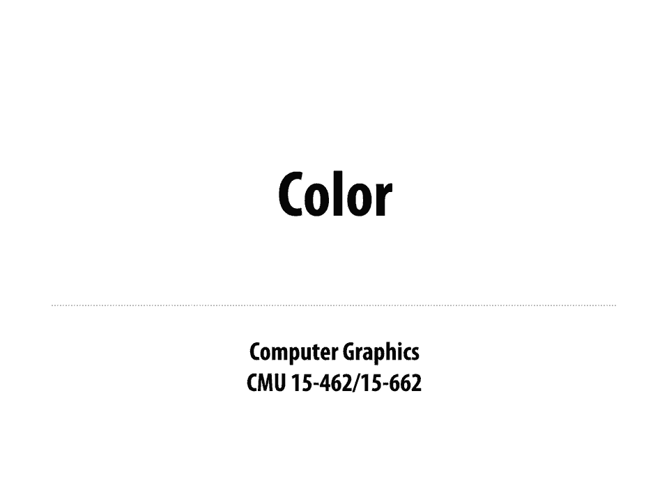
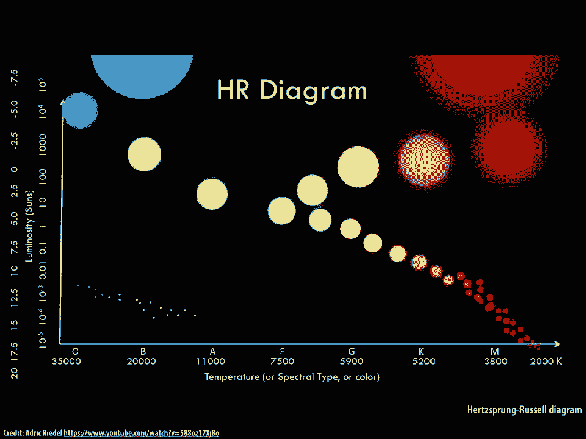
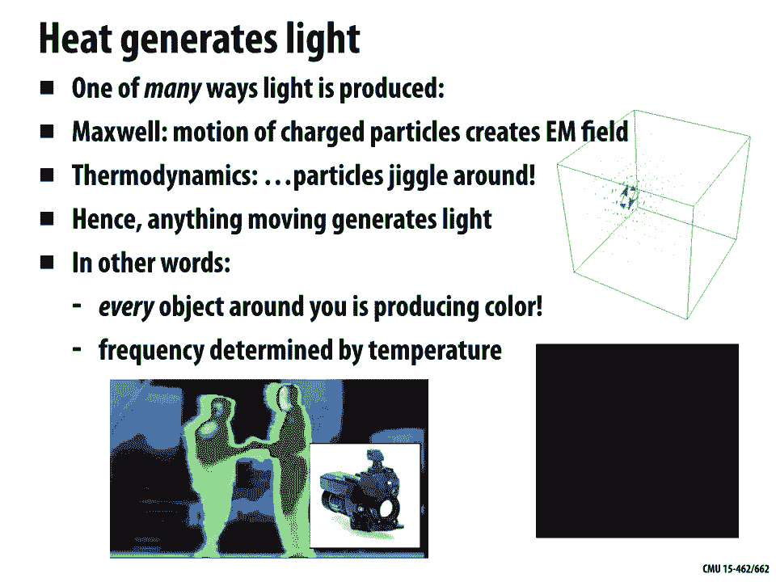
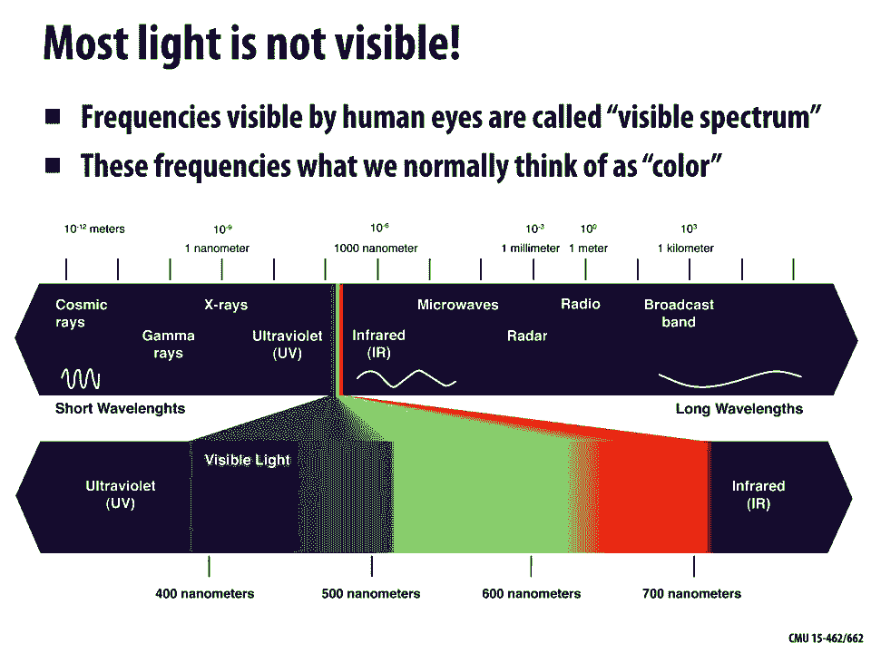
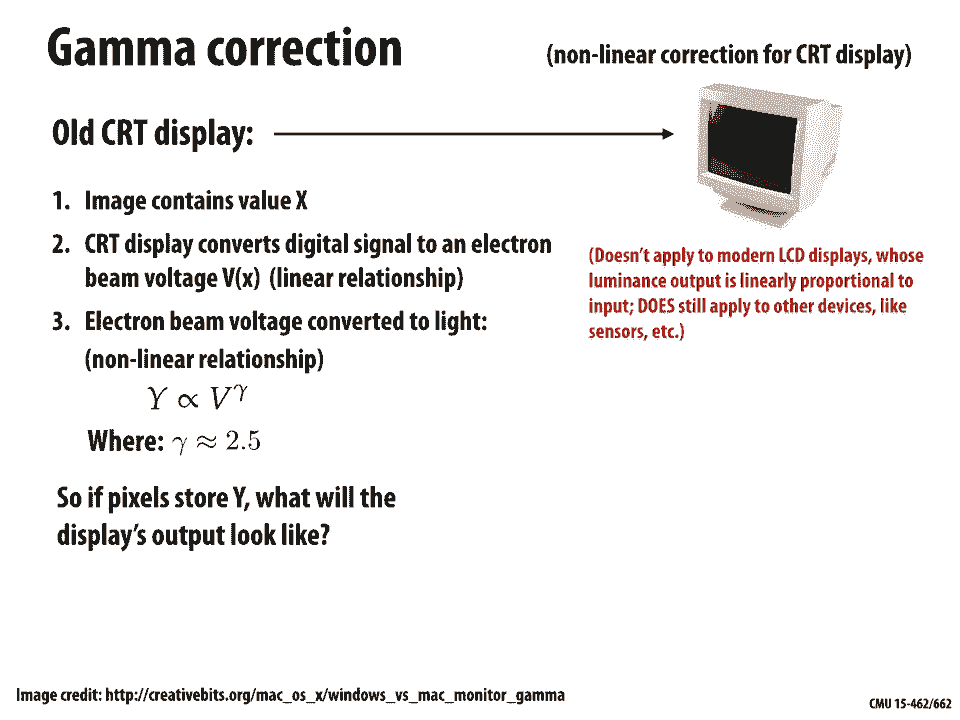
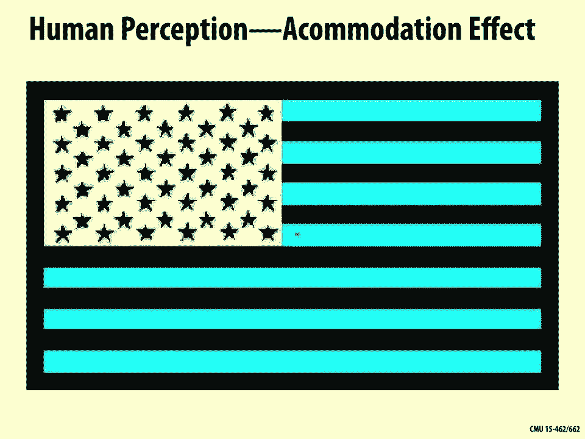
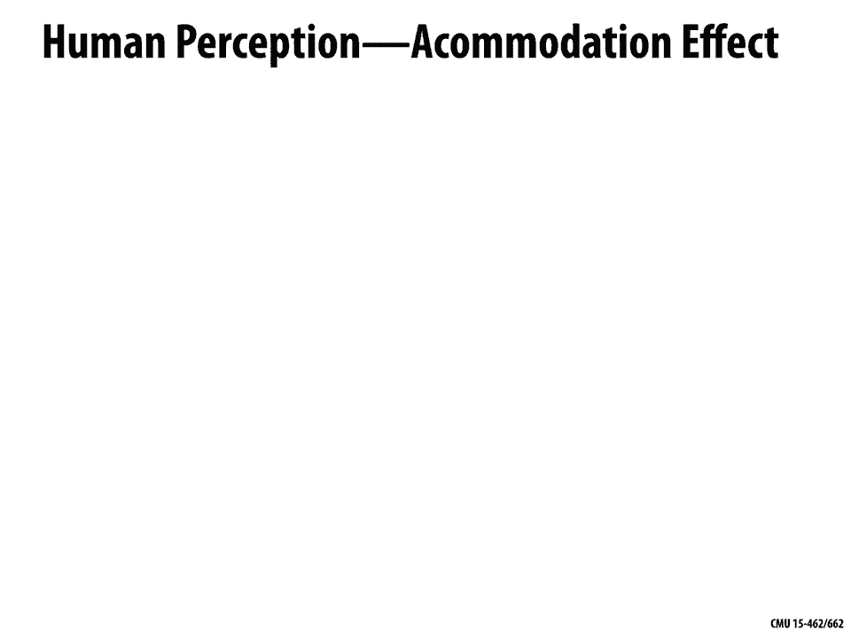
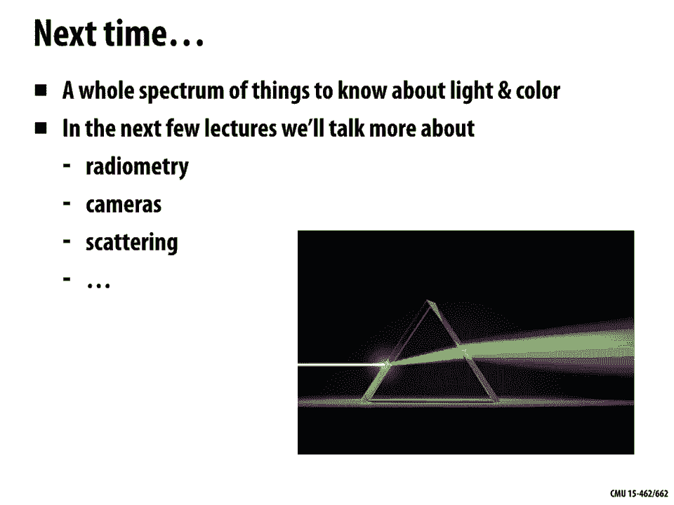

# 【双语字幕+资料下载】CMU 15-462 ｜ 计算机图形学(2020·完整版) - P15：L14- 颜色 - ShowMeAI - BV1Pf4y1E7GJ

okay welcome back to computer graphics，today we're gonna spend the whole day。

talking about color and you might wonder，why do we need to spend so much time。

talking about color it's something that，should be pretty intuitive to all of us。

we've been studying it since，kindergarten，why do we need precise ways of talking。

about color well there are actually a，lot of different reasons that you'll。

really start to recognize after going，through this this lecture that show up。

even in your daily life so for instance，let's say you're trying to paint your。

house you go to the store you find a，color of paint that you really like you。

bring it back home you put it on the，wall and you think oh this really。

doesn't look the way I wanted it really，doesn't look like it did in the store。

why did that happen well maybe there's a，very different kind of lighting in your。

home versus the store and the way that，light and color interact can be very。

unpredictable if you don't have some，understanding of color another thing。

that you'll see if you just go walking，around in an electronics store you look。

at all these different displays and that，really kind of hits you that calibrating。

color across different devices is pretty，hard to do depending on maybe how cheap。

or expensive a monitor is it might have，deeper blacks or more saturated colors。

so when you think about producing，content that'll be displayed on a lot of。

different devices you again have to，think carefully okay what should I。

expect people will be able to see how，might I just the color for different。

displays and so forth this also shows up，in making the transition from digital。

media to print media if I have color on，my screen but I'm using that to design。

something that's being printed maybe in，a magazine or in a newspaper or。

something like that you're gonna get a，very different output from the printer。

than you will from the display so here's，an example of you might have taken this。

picture of a very vivid rainbow colored，umbrellas and when you go to print it。

out maybe you've had this experience you，dull，why did that happen is it just because。

the printer is cheap or is there，something deeper going on their。

understanding color is also extremely，important if we want to do science if I。

have images that are being used for a，scientific purpose the colors can。

indicate really important or really，interesting things about the phenomenon。

being studied so maybe telling me about，different geological eras or in。

astronomy color is absolutely essential，something we'll talk about today is。

blackbody radiation and that the heat of，things in the universe will affect their。

color and so this is something that。

people use to get a sense of how stars，are evolving over time color of course。

also is extremely important in art so，how do you mix colors what happens when。

you mix paints of different kinds how，does the new color come to be and how。

does that color at a perceptual level，affect the way that people experience a。

painting if you're if you're trying to，paint a sunset you might need to。

exaggerate the colors in a certain way，that that kind of is adapted to human。

perception to capture how it felt to，really be there again many of you have。

probably had the experience of going out，seeing this beautiful sunset taking a。

photo with your your camera to send to，your friend and your friend gets the。

photo and thinks well that's okay it's，not that exciting right what was lost。

there and how might you reject that，perceptual experience of the colors that。

you saw in the sunset okay so lots of，good reasons to understand color in。

depth but maybe the first question to，ask sounds sounds kind of like a crazy。

question again because so many of us，have day-to-day experience with this but。

what is color could you actually explain，to somebody let's say somebody who is。

blind could you tell them what color is，well one really important way of。

thinking about colors from a physical，perspective so you might remember from。

your physics class if you take in a，class on E&M，that light is an oscillating electron。

electric and magnetic field it looks，like this these two complementary。

oscillating fields and the key idea what，is color in this setting well color is。

just the frequency at which this field，is oscillating the frequency of this。

this oscillating field determines the，color of the light okay and that's going。

to be really important perspective for，getting our hands on representations of。

color one important thing just to keep，track of as we talk about color is what。

is the difference between when we talk，about frequency versus wavelength of。

light right these these quantities both，essentially capture the same idea but。

they're different quantities and they，have a simple relationship just that。

frequency is 1 over wavelength，wavelength is 1 over frequency ok so if。

I have a really long wavelength the，field is oscillating very slowly then it。

has a very low frequency at very small，frequency and vice versa，right so using this picture this。

physical picture we can start to，understand questions about color like。

why does your stove turn red when it，heats up you know if you have this。

old-fashioned kind of induction burner，you switch it on it starts out black as。

it gradually heats up you might see，especially if you turn off the lights if。

you can do this in the middle of the，night you turn off your lights you go to。

the kitchen you turn on your stove，you'll see nothing at the end at the。

beginning but you then you'll get this，dull red glow and then it'll become a。

brighter red and then maybe it becomes，an orange and if you've really really。

heated it up maybe you start to see kind，of a yellow color so that's something。

we've we've all experienced but why does，it happen and the basic reason is that。

heat generates light this is one of the，places in the universe that color comes。

from one of many ways light is produced，is again we can，think about this picture of electricity。

and magnetism and Maxwell's equations，say that if I have charged particles。

moving around then they're gonna create，or induce an electromagnetic field okay。

so why then does heat generate light，well let's think about this。

thermodynamics if we think about what do，things look like at an atomic scale。

really even solid objects are jiggling，around a little bit and then definitely。

as things heat up this is like an ice，crystal here right so it started out as。

a crystal and we're starting to heat it，up and it's starting to melt and so the。

things are jiggling more and more and，more and you can imagine if we keep。

increasing the temperature maybe it，turns from a liquid into a gas and now。

the particles are really moving around，fast okay well since these particles。

have some charge to them right they are，gonna create an electromagnetic field in。

other words anything that's moving will，generate light and what that means is。

that every object around you in the，universe even if you can't see it is。

producing some quantity of light right，and that light has some color that has。

to do with how fast those particles are，jiggling how hot it is or how cold it is。

so unless you're looking at something，that's at Absolute Zero right it's gonna。

be giving off light and this is why for，instance you can build devices。

that that do thermal imaging you want to，see somebody through a wall okay maybe。

you get their thermal signature you're，seeing the light that's given off just。

by the fact that their bodies are warm，okay and the frequency of that jiggling。

is determined by the temperature the，color is determined by the frequency。

okay one thing to say here is well why，then don't we see everything glowing at。

night right if everything that's hot is，giving off some kind of light some kind。

of color why don't we see it and the，reason is that most light is not visible。

to the human eye it might be visible to，some，device some detector but it's not。

visible to the human eye so actually the，frequencies of light that human beings。

can see are limited to a very very，narrow range of wavelengths and that's。

what we call the visible spectrum so，these these wavelengths are what we。

typically think of as color going from，kind of reds oranges yellows greens。

blues indigo yeah outside of this narrow，range there's lots of other stuff going。

on we have close to the visible spectrum，we have ultraviolet on one end we have。

infrared on the other right and you，might have cameras that pick up these。

signals pretty easily if you go a little，further out and you have x-rays really。

high frequency light microwaves really，low frequency light that actually is。

used to warm your your food right and on，and on it keeps on going and so even。

though we can't see this stuff it's，there even though we don't usually think。

of this as light and color essentially。

x-rays and microwaves and so forth do，have a sort of color to them they have a。

frequency another important thing to to，realize is that when we talk about white。

light when we turn on a really nice，light bulb and it shines this beautiful。

white light that's really not one，particular color of light white is not a。

color of light white is really a mixture，of all colors it means that we have。

energy being emitted in all of these，frequencies simultaneously all the。

visible frequencies a really great，example that is our Sun the Sun is just。

pumping out energy pumping out light in，all these different frequencies and in。

fact if we look at the spectrum so this，plot on the bottom right here is the。

spectrum of how much light the Sun is，emitting in each frequency what you。

notice and is kind of important is this，curve has a peak in the visible range of。

the spectrum in the area of the spectrum，that humans perceive right and in fact。

that is why this is the visible spectrum，why is it that human beings see a，certain range of light。

well because that's kind of the most，advantageous set of wavelengths to see。

though the ones that the sun is shining，most brightly okay so this spectrum that。

we just saw is called an emission，spectrum it's telling us for each。

frequency of light how much light is，produced by whatever source it could be。

by heat it could be by fusion which is，what's happening in in stars in our Sun。

right but whatever the source is the，emission spectrum is saying how much。

light in each frequency and an emission，spectrum is really useful for certain。

tasks for instance if we want to，describe the color of a particular light。

bulb we want to disguise what kind of，illumination it's giving off we might。

show an emission spectrum if we talk，about something like paints we want to。

talk about the color of paint well if I，paint my wall that paint is not emitting。

any light right so we need to talk about，a different kind of spectrum maybe an。

absorption spectrum an absorption，spectrum is saying for each frequency if。

I shine white light on it what fraction，of that light is absorbed or how much of。

that light is absorbed and what does it，mean that it's absorbed it means the。

light hits the paint and rather than，being scattered back off it might be。

turned into heat right it starts，particles in the paint jiggling it turns。

into kinetic energy so absorption，spectrum is useful if we want to。

characterize the color of paints the，color of ink and so on okay here are。

some examples of emission spectra again，which describe light intensity as a。

function of frequency these are，different kinds of light bulbs or，different light sources so we have。

daylight kind of light just coming out，of the Sun and as I claimed before we。

see that it has a pretty uniform，distribution of，light in all different wavelengths we。

have an incandescent bulb which has a，different distribution it looks like。

fewer blues and more reds so if you have，a older style light bulb it has that。

kind of warm orange red feeling when you，turn it on fluorescent light looks very。

different it looks very spiky right and，this actually may be why if you've ever。

been sitting under a fluorescent light，you've been sitting in a cubicle or。

something under a fluorescent light you，think oh this this feels kind of sickly。

it doesn't feel nice it doesn't feel，like sitting outside in the sunshine。

well part of the reason is it really is，not like sitting outside in the sunshine。

the distribution of light even though it，might appear roughly the same color it。

might appear kind of white to you the，distribution of frequencies is very。

different it feels very unnatural and，very icky right and so there are。

different kinds of light bulbs that have，different distributions of frequencies。

and this kind of explains why there are，so many different light bulbs on the。

market if you go to the hardware store，you'll see a ton of different kinds of。

light bulbs if you go online boy you can，find even crazier and wider variety of。

light bulbs why are there so many，different designs for light bulbs why。

don't we just have I don't know one or，two or even a dozen well again it's。

because of the quality of the light，you're really trying to match I mean。

human beings really are used to where，they really like this natural sunlight。

and so the question is how do you build，a light bulb that matches the kind of。

light that you like while still being，power efficient so incandescent lights。

are good because they kind of pump out，light in all different frequencies but。

they're more power-hungry they suck up a，lot of power to do so and so the。

observation is well you can kind of，trick the eye you can fool people into。

believing that a light bulbs showing the，same color of light but with a very。

different spectrum and we'll talk a，little bit about that in a minute why it。

is that you can fool the eye into，believing that to differ，spectra of light are essentially the。

same color so a compact fluorescent bulb，a CFL is gonna be like a any other。

fluorescent bulb it's got this kind of，choppy spectrum but it's more power。

efficient it's based on principles that，use up less energy okay again we can。

also talk instead of about how much，light something's emitting we can talk。

about how much it absorbs right so a，mission was intensity as a function of。

frequency absorption is fraction，absorbed as a function of frequency okay。

so here's here's an example of an，absorption spectrum along the bottom we。

have the wavelength going from short，wavelengths bluer wavelengths to longer。

wavelengths redder ones and in the，vertical direction we have the percent。

absorption if I were to shine a perfect，white light on this whatever this is。

this piece of material what fraction of，that would be absorbed in each frequency。

and just looking at this plot what color，would you say this roughly looks like。

what if I if I were to actually look at，an object that had this absorption。

spectrum under a white light what color，would I perceive right well maybe the。

maybe the the title of this figure give，gives the answer away a little bit it。

says absorption spectrum of chlorophyll，chlorophyll is what's found in plant。

matter right it's what makes plants，green and we can really see that here so。

chlorophyll is going to absorb the Reds，it's gonna absorb the Blues but it's not。

gonna absorb the greens meaning if I，shine white light on a plant what's。

gonna bounce back at me is just the，green light that's why it appears green。

for this reason you might sometimes hear，people saying oh did you know that。

plants are actually red they're not，green it's you know the fact no this is。

not true this is not the way that color，works，things are the color that we perceive。

them to be but what they're trying to，say is that plants absorb the red and。

blue light and they reflect the green，light okay so this idea of talking about。

spectrum this is really the fundamental，description of color if we know the。

intensity or the absorption as a，function of frequency，then we know everything that we could。

possibly want to know about the color，right everything else that we'll talk。

about today every other way we have of，modeling or encoding color is merely a。

convenient approximation of this picture，for practical reasons we might not。

always want to encode this extremely，detailed spectrum but this is really at。

the root of it what color is okay so in，other words if you remember to use this。

spectral description as a starting point，if you always use this as your mental。

model for good what's going on with，color then all these other issues。

surrounding color theory and practical，encodings digital encodings of color。

will make a lot more sense on the other，hand if you always think about color in。

terms of approximate digital encodings，right if you've heard about RGB color or。

CMYK color before and you continue to，think about color only in this way。

there's certain phenomena that you，simply won't be able to understand。

mysterious things will happen in life，and you'll think how could that be。

you know if color is RGB triple how，could that happen I don't I don't。

understand it well it's because really，something's going on with the spectrum。

and not this oversimplified model of RGB，okay one thing to think about carefully。

when you think about color is oK we've，talked about emission and we've talked。

about absorption how do these how do，these two things interact that's really。

going to affect the ultimate color that，we perceive so here's kind of a toy。

a simple but pretty representative model，of what happens when light gets。

reflected and let's say for the moment，that the symbol nu is the frequency so。

we'll say that a light source has an，emission spectrum f of Nu right for each。

wavelength nu we get an amplitude F of E，or an intensity F of V we will also have。

a reflection spectrum right this time，reflection rather than absorption so。

just the complement rather than what，percent got absorbed its what percent。

didn't get absorbed what percent got，reflected so we'll call that G of Nu。

okay so what we have here on the left is，f of Nu is a is a light source and what。

color roughly would you say this light，source is if you had to sum it up into。

one word to me this light source looks，pretty green it's emitting a lot of。

green light or maybe kind of green，yellow because they're these reds and。

oranges and yellows in there too what，color would you say the object is on the。

right the one described by the，reflection spectrum now you should be。

careful here this is different from our，example we saw before with the plants。

with the plants we were looking at the，absorption spectrum here we're working。

it with the complementary reflection，spectrum okay so this one is really。

saying that a lot of the blues and the，greens got absorbed they didn't get。

reflected and a lot of the red light got，reflected right okay and then what we。

want to understand is how do these two，interact if I shine a light of this。

color on a surface of this color what am，I going to see what's going to come out。

well the answer is that the resulting，intensity is going to be a product for，this。

reflected off the object is how much，light got emitted times how much got。

reflected and so in this case we're，gonna get a curve like this it's。

something we're just a very little bit，of kind of red orange light is shining。

off this surface does does that make，sense why that should be the case sure。

right we shown some green light on，something that absorbs most green light。

so we don't see much green the light，still does have a little bit of red in。

it so we see a little bit of red okay，and even from this very simple picture。

we start to understand why is color，reproduction hard right color。

clearly starts to get complicated as we，start combining emission and absorption。

or reflection right so we have this，light it has some interesting spectrum。

we have some paint we're putting on our，wall the light bounces off the paint and。

then also something that's challenging，is that light goes into the eye which we。

haven't even started to talk about so，how do we how do we use you know light。

and paints to get the desired appearance，well that depends on yet another factor。

which is perception right how do humans，perceive color once that light leaves。

the surface and enters the eye and then，gets transmitted into the brain what is。

the signal that we ultimately receive，and how does that affect how we perceive。

color so many of you may have seen this，example of this picture somebody took。

and put on line and said oh this is a，blue dress with black lace and other。

people said no no no this is a white，dress with gold lace you're just kind of。

seeing it in shadow and there was this，online raging debate about whether this。

is a blue dress or whether this is a，white dress I think there's even a a。

Wikipedia page on this if you want to if，you want to look it up I don't know what。

the final answer was but actually it's，not so important the the really。

important thing here is to realize that，color perception is very psychological。

perception of color has a lot to do with，what people think the context is what。

people think is going on beyond just the，raw spectrum that's entering their eye。

right so we have this question how does，electromagnetic radiation with a given。

power distribution end up being，perceived by a human as a certain color。

okay well to understand this question we，have to start thinking about what does。

the human body look like so here's the，eye here's kind of a detailed。

cross-section of the eye and there's all，sorts of interesting things going on and。

the basic thing that happens here is if，we look to the left you know this is。

where the the eyeball is looking light，might be shining in from the right it。

enters through the pupil which is this，little hole in front and travels you。

know through the eye and hits the back，of it hits the the fovea or hits the。

neurons sitting on the back of the eye，okay and actually this is a good moment。

to stop and realize this is not so，different from our pinhole camera that。

we talked about before remember we，talked about a pinhole camera is like a。

cardboard box you poke a hole in it and，put a piece of film on the back I mean。

the eye is just a much more，sophisticated version of the pinhole。

camera so you might have light coming in，from different directions depending on。

where it comes from it's going to hit，different locations on the sensor right。

or it's going to hit different neurons，and that's gonna stimulate our。

perception of what the image looks like，interestingly enough just like the。

pinhole camera that image is going to be，upside down right the image that。

actually hits the back of our I'd back，of our eye is a flipped version of what。

is actually out there in the world so，our brain is actually going to turn that。

upside down image back right-side up and，it's pretty remarkable actually you've。

done experiments where they'll give，people sort of special glasses that turn。

the world upside down and the brain will，again adjust it so that it's right side。

up right so the brains are pretty，amazing，double piece of machinery okay but what。

we really want to understand here is the，color response how does the eye perceive。

color okay so so here's a again a rough，model but one that kind of captures the。

red idea which is talked about the photo，sensor response of the eye or of a。

camera right pinhole camera whatever it，is so the idea is that we have some。

input some photo sensor input which is，light and we can describe that as a。

power distribution over wavelengths for，each wavelength in this case lambda what。

is the corresponding amount of light the，corresponding power and the photo sensor。

output is going to be some response to，this wavelength encoded as maybe an。

electric signal right so depending on，what brand of sensor you have or how。

it's designed or you know how your eye，looks that device is going to respond。

more strongly or more weakly to，different wavelengths of light right a。

digital camera sensor is not going to，capture all frequencies or all。

wavelengths of light equally some of it，it might ignore some of them it might。

really strongly respond to and that's，encoded by this spectral response。

function f of lambda so this describes，the sensitivity of the sensor to a given。

wavelength of light a larger value of f，of lambda corresponds to a more。

efficient sensor right so when f of，lambda is large a small amount of light。

at wavelength lambda will trigger a，large sensor response and vice-versa。

okay so if we think of we can think of a，photo sensor maybe it's just a single。

pixel on a sensor and the total response，of that pixel is going to be the。

integral over all wavelengths we just，walk through from low to high wavelength。

alright this incoming power distribution，fee of lambda times how much the sensor。

responds to that frequency f of lambda，we integrate that up and that's how much。

signal that sensor is gonna report back，to the camera okay that's what we'll。

call R here so what does this kind of，look like for the eye why would the eye。

and respond to different frequencies or，wavelengths in different ways and you。

know how does that work well if we look，even closer at the eye we really zoom in。

to what's going on on the back of the，eye we have these receptors the things。

that are really responding to the，incident illumination and there are two。

kinds of receptors there are rods and，there are cones which kind of describe。

roughly the the geometry or the，morphology of these different types of。

cells and they serve two different，functions rods are things that can help。

us see things when we have very dim，illumination okay so what they're doing。

is they're just capturing intensity they，don't really care so much about is it。

red light is it green light is it blue，light they're just gonna integrate。

whatever light they can get because it's，it's dark outside so they want to forget。

all the elimination respond to any of it，so you can think of these as very very。

sensitive photoreceptors cones on the，other hand are what we're gonna be using。

more of in daylight so when we have a，lot of bright light shining in then we。

can afford to be more picky about which，light we respond to so we might have。

some cones that just respond to red，lights some that respond just to green。

light some that respond just to blue，light I mean this is again a very rough。

analogy it's not exactly red green and，blue but there are three different types。

of cones that respond to different，colors of light okay and you can see。

there's a big difference in the number，of these receptors so there are about a。

hundred and twenty million rods in the，human eye there's only about six。

seven million cones in the human eye so，what does that tell us that tells us。

that the eye is actually a lot better at，discriminating between different。

intensities or brightnesses than it is，at discriminating between different。

colors and that's gonna be really，important when we think about doing。

computer graphics when we think about，how we generate image and what we。

prioritize when we generate images or，when we compress images right that the。

eye is gonna catch it's gonna see，differences in in intensity more than。

differences in color here's another，really interesting view of the eye that。

that might inform the way that we design，graphics algorithms is that the the。

density of these different receptors is，not uniform over the eye so what this。

picture is is saying on the Left it's，saying as we get closer and closer to。

the center like kind of where if you，imagine light just shined straight。

through the pupil and hits the back of，your eye that's that's the center so as。

we get closer and closer to the sensor，this to the center we actually have more。

cones the cones are going up but there's，also this dip in rods okay so what does。

that tell us that tells us that our，color vision should be better right in。

the middle of our field of view whereas，our ability to detect differences in。

intensity is going to be well it's，actually quite good over the entire eye。

just because we have so many rods right，but it's really that we prioritize color。

in the middle of our center of view in，whatever we're directly looking at and。

in fact you notice that these cones they，fall off so fast as we get away from the。

center that really your color vision in，your periphery your peripheral color。

vision is really quite poor okay by the，way there's also another interesting。

thing to notice here right it which is，this gap we have these two dashed lines。

where there's this gap where there's，there's no neurons at all there's no，photoreceptors at all。

why is that well that's the place where，your eye your eyeball is hooked up to。

the rest of your brain right you，essentially this cable called the optic。

nerve that connects your eye to the rest，of the brain and at that place well。

there's you can't put it in any photo，receptors there so that's why you have a。

blind spot even though your brain fills，it in and kind of makes it seem like oh。

there's there's nothing being missed，there there are really things you can't。

see in that blind spot and that's why，you have to be very careful when you're。

in your car when you're driving and，you're changing lanes to look around and。

make sure that there's not you know some，bicyclists in your blind spot so you can。

accept all of this on faith right okay，I'm telling you that there are these。

distribution different distributions of，rods and cones and your eye and all this。

all this fascinating stuff or you could，try to confirm it yourself so here's a。

fun activity that you can try at home，you know if you have somebody else that。

can can help you out with this so what，you do is you go and you grab a bunch of。

colored objects it could be anything it，could be you know I like to do different。

colored markers marker caps because they，come in really bright colors but maybe。

you have colored blocks or you have，colored pencils whatever it is but just。

different very vivid colors and what you，want to do is say okay grab one of these。

I'm gonna I'm not gonna look I'm gonna，not look at which one you're choosing。

please whoever's helping you grab one of，these at random and have them very very。

very slowly bring the object into your，peripheral vision so just tell them to。

stop as soon as you can detect that，they're there that something is there。

and when they stop when you know this is，right all the way out on your periphery。

really far from the center of your，vision you're supposed to guess what。

color is the thing that they're holding，up okay so for this for this reason。

that's actually pretty important that，all these objects have the same shape。

you don't want to be distinguishing，which one it is based on how they're。

shaped right so if they're all blocks，maybe they should all be cubes if。

they're all markers they should all be，markers of the same kind right。

what I claim will happen and it's fun to，try this out is that you will do a very。

poor job of guessing what the color is，you'll get signals from your brain that。

say oh it's it's definitely a color and，it's blue and then you'll turn around。

and look at it and it'll actually be，yellow right and the reason for this is。

that your brain is very good at filling，in the gaps it's good at guessing oh。

well I don't actually have information，from the eye about what color this thing。

is but I'm gonna use context to try to，color in the picture maybe if you've。

ever seen or if you know that old black，and white movies movies that were films。

you know the beginning of the 20th，century sometimes people recolor them so。

they go in and they guess oh you know，this person's hair might be red or this。

dress might be green that's essentially，what your brain is doing all the time on。

your periphery you have this feeling，that you can see color in your。

peripheral vision but you really can't，the reason that that's happening is that。

your brain is running some pretty，sophisticated algorithms to figure out。

what that color might be and that is one，of the reasons why color is so hard to。

deal with in computer graphics because，it's not a linear relationship it's not。

a very simple mathematical relationship，the brain and the mind are doing a lot。

to turn the data that it gets into a，color image in a very unpredictable way。

okay but we can keep going and try to，understand more and more about the。

physiology of the eye and the way the，brain works to get a better better。

handle on this so one thing we can look，at is you know what specifically is the。

spectral response of these cones I said，that there are three different types of。

cones and we can actually call these，instead of RGB we can call these SM NL。

short medium and long wavelength cones，and on the bottom right here we've。

plotted what does the response function，look like for each of these cones，what is the power。

put as a function of wavelength so what，you notice is okay well first of all。

they're different curves they're gonna，pick up different information about。

color but you also notice that there's，two curves that are very similar in。

shape the M and the L cone are very，close together okay and you know why is。

that the case well both of them are，really kind of clumped or clustered near。

kind of a greener part of the spectrum，this first one the S cone is it's more。

near the the blue part right and the，medium one M is more near the green end。

and then L is just kind of getting some，of the red wavelengths off on the right。

okay but really prioritizing green light，why is that well again if you look at。

the spectrum of the Sun the emission，spectrum of the Sun it shines a lot。

stronger in the green region so just as，a matter of efficiency the eye wants to。

pick up on the light that it's most，likely to see in a in a daylight and an。

outdoor scenario okay and likewise this，explains why there's this uneven。

distribution of different types of cones，in the eye about 64 percent of them are。

L cones thirty-two percent of them are M，cones okay and you can see that on the。

this this image on the bottom left is a，close-up view of what the retina looks。

like another way we can visualize these，response curves is to say well okay as a。

function of frequency for as we increase，the as we increase the wavelength sorry。

not the frequency here we can ask what，is the response in s m and L and we can。

plot that response as a point in，three-dimensional space so we get some。

response curve like this right okay so，how overall does the human visual system。

work well the important thing to realize，the important thing to recognize is that。

the human eye simply can't measure，the full spectrum of incoming light it。

doesn't know this complete function of，what what is the intensity as a function。

of wavelength but a spectrum in a sense，contains infinitely many values for any。

wavelength at all that you asked about，it gives you a intensity the eye knows。

only about three values it knows the，integral of the spectrum times the。

response function and those integrals，give just three numerical values SML。

well they're not numerical your brain is，not storing numbers right but you're。

gonna get three electrical responses，coming out of the eye okay so this is。

how it works the spectrum comes in on，the far left it goes into the eyeball。

the light gets focused on to the retina，the cones and the eye measure this light。

that's that's shining on the retina the，response functions effectively say how。

much electrical signal is then going to，come out from these different types of。

cells those responses those electrical，impulses are carried along the optic。

nerve the impulses go into the brain and，then who knows what happens right then。

there's a whole question of psychology，and perception and how do people。

perceive images okay but we can at least，get a pretty good handle on the first。

three steps of this of this process one，question we can answer by even just。

looking at this simple picture is well，is it possible for two different spectra。

to give us the same color right we said，that color is described by a spectrum。

but when it comes to human perception，can two distinct spectra still be。

perceived as the same color well that's，basically asking this question here is。

it possible for two different functions，to integrate to the same value can two。

different curves have the same area，underneath them，yeah of course right there are a lot。

more curves than there are different，areas okay and likewise there are lots。

of different spectra that can integrate，two identical SM and L responses and。

those are what are called meta Murs so，meta Murs are two different spectra two。

different incoming incident illumination，that integrate to the same physical。

response in the eyeball and the fact，that meta Murs exist the fact that we。

can have different spectra that are，actually perceived by a human being to。

be the same color is critical to color，reproduction right it'd be super。

annoying if this wasn't true let's say I，want to go around the world and take a。

picture of a sunset and then take a，picture of a person and then take a。

picture of my you know beautiful food，that I got at the restaurant and I you。

know and I want to then reproduce all of，these by a printer well if I had to。

reproduce the spectrum exactly I'd，really be in trouble I'd have to get。

some super precise printer that could，print inks of all different frequencies。

and exactly reproduce you know how much，light is reflecting off the the surface。

so that it matches how much light was，going into my camera of every single。

different frequency the fact that the，eyeball is kind of a crude measurement。

device when it comes to color is，actually is actually helpful it means we。

can we can cheat right we can find，mixtures of inks that produce the same。

perceived color even though it doesn't，produce the same spectrum okay on the。

other hand this causes us a lot of，trouble it causes a lot of unexpected。

things to happen when we work with color，for instance combination of a given type。

of light bulb and a different kind of，paint could really look wrong it could。

look very different than we expect right，again we go back to the scenario we。

talked about at the beginning we go to，the store we buy this paint we like it。

looks great in the store we bring at，look different，because we're filtering that color。

through a different spectrum there's a，different interaction okay。

one really cool example of this kind of，interaction that that's used for kind of。

a functional purpose is counterfeit，detection so many countries print。

currency or passports or other official，documents with special inks that look。

different under UV light so if you're，trying to counterfeit the the money you。

might think you're getting away with it，because you've produced a good metamer。

right you've produced a ink that you，print on the paper or you look at it。

with the naked eye and you say oh yeah，this looks exactly like the official。

stuff and so the the sneaky way they get，around this is they say aha but we're。

gonna we're gonna print a very special，spectrum of ink so that if you look at。

it using a more sophisticated device or，in a different setting that's not the。

usual setting of the naked eye you，actually see these spectral differences。

all right and you could imagine taking，this even further suppose you had a。

camera that was much more precise in，color measurements than the human eye。

something that had instead of three，responses maybe it has a dozen responses。

these are called hyperspectral cameras，things that have very kind of narrow。

bands of spectral responses around a lot，of different frequencies well that's。

also going to be do be able to do a good，job of detecting is this ink the actual。

ink that was printed by you know the，authority or is it the ink that was used。

by the counterfeiter okay this this kind，of camera this hyperspectral camera is。

actually also used by people who are，studying art history you know what was。

going on what kinds of paints were，people using is this a fake right did。

somebody touch this up with a different，kind of paint a hundred years later lots。

of really beautiful and interesting，stuff you can understand by looking at。

color in the spectrum right same with，looking at morphology of animals of。

creatures of insects over the years or，over different species you know there's。

a lot of different color，distinguishing colors that maybe humans。

can't perceive but animals can people，also use this kind of hyperspectral。

camera for understanding plant growth so，if you're in outer space and you want to。

look down at the earth and you want to，detect what kinds of plants are in a。

given forest or a jungle well that's，hard to do from space everything is。

really really small you're not gonna，look at the leaves and look at the shape。

of the leaves but you can look at the，spectrum you can have a more precise。

spectral camera that picks up on oh well，this is green and that's green to the。

naked eye but this green is very，different from that green if I look at。

the spectrum and if I know ahead of time，which kind of plants give up which kind。

of spectra I can make some good，inferences about what kind of plant。

growth are in a forest okay so that's，really cool and really useful and also。

really complicated color can get really，really complicated and so the question。

is for kind of day-to-day use in，computer graphics for creating images。

displaying things on a computer how do，we encode color in a simpler way so。

we're gonna break it down into two ideas，one is a color space and another。

distinct idea is a color model okay so，first of all there are lots of different。

ways to specify a color and their，different trade-offs we might care about。

how much storage does it take to，represent a sample of color is a。

convenient to specify as a convenient，for a human to specify a color using。

this encoding in general the idea is，we're gonna specify a color from some。

color space using a color model okay so，to make that distinction clear we can。

think about a color space like an，artist's palette it's the full range of。

colors that we could possibly choose，from the entire universe of colors that。

are available to us that's the color，space the color model is the way we give。

names or the way we identify points in，the color space，okay so if we think about just。

traditional painting if I have an artist，palette how might I specify a color I。

might just give it a name I might say oh，please hand me yellow ochre right that's。

picking out a particular point a，particular color in the broader palette。

that's available in kind of standard，digital encoding of color we use。

something different maybe the RGB color，model where we give three numbers two oh。

four one nineteen thirty-four that also，specifies this same color yellow ocher。

right in a different way and it probably，also specifies that from a bigger or。

different color space not necessarily，bigger not necessarily smaller but just。

a different set of available colors，right so in these examples the model is。

how we're specifying the color yellow，ocher or this triple of numbers the。

space is what are we picking from okay，it's also important that depending on。

the task we might be specifying things，in an additive or subtractive color。

model so just like we had emission and，absorption spectra we also have additive。

and subtractive color models right，additive is used for combining。

illumination right let's say we have，colored lights we want to combine。

different colored lights and talk about，their color the prototypical example of。

this would be red green and blue if you，really go out and get a light bulb that。

emits red another one that emits blue，another one that emits green right then。

you'll see something like the pattern on，the right here red plus green light is。

going to give you a yellow light red，plus blue light is going to give you a。

magenta light and so forth a subtractive，color model is appropriate for something。

that absorbs light like paint right so，the idea is that rather than。

illumination adding up to generate some，color every time we paint something on，some。

things something's gonna get absorbed so，if we paint some yellow light or sorry。

if we paint some yellow paint on the，canvas and then over top of it we paint。

some magenta paint then both the yellow，frequencies and the magenta frequencies。

are gonna get absorbed and we're gonna，see red the standard example here is。

CMYK cyan magenta yellow and black which，are common colors used in printers like。

in your inkjet printer and what you，notice something funny about this。

diagram is you notice wait a minute so，if I put down cyan magenta and yellow。

paint then that kind of absorbs，everything and nothing gets reflected。

and I should just see black why then do，I have K in this color model why do I。

have specifically a final fourth color，that specifies black and the reason is。

basically efficiency it's really hard to，get deep blacks by mixing together。

magenta yellow and cyan paint or ink，black is a really obviously common color。

that we want to print so we're gonna，actually inject some black ink into the。

picture as well and that that further，complicates our discussion of color。

right that makes things even a little，trickier than it would be otherwise。

here's just a picture to make that that，idea clear you know what's going on with。

additive versus subtractive light right，so here what I what I did is I created a。

scene you know this is a digital scene，that I've rendered but it is physically。

accurate so I have these three，spotlights red green and blue shining。

down and you see that if red and green，light combine we get yellow if blue and。

red light combine we get magenta and so，forth and then what's floating in the。

air here this is the the only，non-physical part of this picture is。

that they're kind of floating you know，without any gravity these three。

basically filters these three kind of，camera filters so you can imagine it's a。

piece of glass a circular piece of glass，that absorbs light of certain。

frequencies right so we have this，magenta filter the scienter the yellow。

filter and what we notice is in the，middle the red green and blue light that。

are shining from the top add up to give，white light and they're kind of shy。

some light in all frequencies and then，as we pass this white light through。

these three filters they're gonna，subtract out some of that white lights。

so the magenta filter all turns things，magenta the yellow thing turns things。

yellow but if we look at the region，that's absorbing both yellow and magenta。

all that's left is a red light okay so，you you might actually people talk about。

this as a subtractive color model I'd I，think it's better to think about this as。

a multiplicative color model some，percent of the light shining in in a。

certain color is gonna then shine back，out okay there are of course many other。

color models that can be quite useful so，if any of you have tried selecting。

colors using RGB or maybe in your code，you've been writing you know you've been。

trying to pick RGB colors that give a，nice appearance it's really not that。

intuitive unless you've been working，with RGB color for a long time it might。

be hard to immediately translate okay I，want orange how do I turn you know how。

do I get a nice orange color with RGB so，for that reason a more popular way to。

specify a color or another popular way，to specify a color is HSV which is。

giving the hue saturation and the value，so the value is just how bright it is。

the saturation is how rich the color is，so zero saturation would be really dull。

kind of gray full saturation would be，really bright and vivid colors and then。

the hue is just this color wheel that，goes around as I start you know maybe I。

start out blue and then magenta and then，red and then yellow that's just letting。

us pick which color from our pallet SML，is the model we just talked about this。

physiological model right that，corresponds to the stimulus of cones in。

the eye this is nice maybe if we're，talking about perception and psychology。

and and physiology probably not，practical if you want to do real color。

work right colors are gonna get squeezed，together in a way that makes them hard，to specify。

so a model that tries to be a little，more perceptual but still convenient to。

work with for color work is the XYZ，model which has a different kind of feel。

to it then than the other ones which is，to say that Y captures the luminance。

again it's it's like the intensity or，the value so it's not different from HSV。

in that way but X and Z are capturing，what's called chromaticity so they're。

called or they're giving the the，deviation from gray along two different。

directions well we'll talk about that，more in a little bit and so this is。

related to butBut different from from，SML and then another nice color space is。

our sorry color model is lab which is a，perceptual uniform modification of XYZ。

so basically the idea is as I tweak，these parameters x y and z I'd really。

like it if a constant change in my，parameters gives me roughly a constant。

change in the perceived color and that's，what lab and other color spaces try to。

do one thing you'll also encounter when，you start working with color is the way。

that people encode colors digitally so，how do we encode these colors one really。

common encoding that you'll see for，instance in HTML and CSS is these。

hexadecimal values so you have this，strange string pound one b1f 8a or。

hashtag 1 B 1 F 8 a what does a string，mean well this is a common encoding of。

RGB colors so the idea is we have these，three channels red green and blue and we。

want to specify an 8-bit value we want，to specify an intensity of red an。

intensity of green an intensity of blue，in the range 0 to 255 right so 2 to the。

8th is 256 and so rather than using the，digits 0 through 9 we use the digits 0 1。

2 3 or 4 5 6 7 8 9 and then also ABCDEF，so we extend our usual number system to。

this hexadecimal system why do we do，that well now a single character encodes。

sixteen values and two characters in，code sixteen by sixteen values so。

ordinarily in decimal right one digit，corresponds to or lets us specify ten。

values if we have two digits next to，each other that gives us ten times ten，or a hundred values。

we're just enriching that a little bit，and so that lets us pack these eight。

bits per channel descriptions of color，into this hexadecimal number。

okay so just as a little you know check，of our understanding what color would。

would you expect the string to specify，so the first channel is red the second。

channel is green the third channel is，blue so the first two characters FF。

that's how much red we have six six is，how much green we have and zero zero is。

how much blue we have since FF are，really big values that means we're gonna。

have a lot of red since zero zero is，well really small that means we're not。

gonna have any blue and six six okay，we're gonna have a little bit of green。

so what is what does it look like if we，take red light and then we start adding。

in green light well that ends up looking，orange if we go all the way if we had FF。

FF 0 0 we have all the red and all the，green we can have that would be yellow。

alright so this is somewhere between red，and yellow we get this orange color what。

are other ways of specifying color you，know there are plenty of other ways you。

could digitally represent color or just，just name a color right so other color。

specifications are not based on a，continuous color space for instance you。

have something called the Pantone，matching system so there's this industry。

standard for specifying colors that，might be used in in construction you're。

painting the walls in a building so you，have this industry standard of 1114。

colors that if you know you specify the，Pantone you know color you'll always get。

the same you know color of paints and，all of these colors can be produced by。

combining 13 standard kind of reference，pigments of course they're even further。

ways of specifying color that you might，have already seen you know a young age。

right how do you specify a color from，your crayon box you have all these。

wonderful names like eucalyptus and，cedar chest and tulip right so why do we。

have these different color models well，one why do we do it with crayons for。

convenience right is it easy for a user，to choose the color that they want some。

operating systems have even adopted，exactly this cran box model though show。

you show you a bunch of crayons and you，can you can pick that one of them to。

specify your color another reason why we，have different color models is。

the way we are intending to process or，composite colors so think back to this。

discussion of transparency of blending，one primitive over another or one color。

over another if we do B over a with the，over operator doesn't matter what color。

space we interpolate or blend in if we，take two RGB values and apply the over。

operator and then we pork or compute，those values or convert those values。

into HSV and perform the over operator，are we going to get the same color does。

it matter what color model we use when，we're doing manipulations on on pixel。

values yeah it totally it totally，matters right a point that's halfway。

between two points in RGB won't look，anything like a point halfway between，two points in HSV okay。

also our choice of color models is going，to affect the efficiency of encoding。

right so this is why we were saying，certain color models take perception。

into a into account we really want to，use as much of the numerical range as。

possible we don't want all the，interesting colors to be squeezed into。

just some part of the floating-point，range so depending on what color model。

we use we're gonna get more or less，efficient compression a good example of。

this is the Y prime cbcr color model so，there's you know endless different。

variations on these color models this is，one that's used commonly in modern。

digital video so Y prime here is the，luma the perceived luminance so just how。

bright the image is CB is how much does，the color deviate from gray along an。

axis we're in one direction things are，becoming bluer and in another direction。

things are becoming more yellow and C，are likewise is the deviation from gray。

along an axis that goes between red and，cyan，so here on the bottom left we have just。

a little example we have this beautiful，input image and it has all sorts of。

interesting colors in it and we're gonna，break it up into y prime which is just。

the brightness of the image and C B and，C are which are giving information about。

the color or the chroma okay so why why，can this help us with compression why。

does it matter you know whether we do，this color model or RGB aren't these。

things going to compress the same well，here's a great example so let's take。

this picture this is just our original，full-color picture and we're gonna take。

the color channels the c。b。c our color，channels and downsample them by a factor。

of 20 in each dimension all right so we，get this blocky，color image which gives us a 400 times。

reduction in the number of color samples，we need to store to encode this image。

for the luma for the brightness we're，just going to keep the full resolution。

image we're not going to down sample it，at all and then we can reconstruct an。

approximation of the original image by，combining the two we up sample that very。

low res color image or those two color，channels and we combine them with the。

full resolution luma and we get this，image which actually looks pretty good。

right here's the reconstructed image，here's the original picture and again。

here's the reconstructed image so really，quite remarkable this really shows that。

the human perception system is much more，attuned to brightness than it is to。

color you really don't pick up with the，naked eye very much on these blocky。

artifacts in the color channels and that，has nothing to do with the actual。

digital information that's there if you，were a different kind of creature you。

might really think that this image is，jarring if you were a creature that。

perceived color more strong，intensity right but when it does tell us。

is it informs the way we should design，algorithms that work with images that。

compress images that generate images and，so forth by the way you do notice some。

artifacts here so places where the color，shifts quickly you do pick up on these。

little blocks of color right like that，are circled in red what's a really。

really simple thing that you might do to，reduce this artifact and so we generated。

this image by taking our low resolution，color image and up sampling it using a。

nearest-neighbor filter what's a really，really small modification we could make。

to this process to get a better looking，final image well what I would probably。

do is simply use bilinear filtering，rather than nearest-neighbor filtering。

right that's gonna at least smooth out，the edges on that block of color even if。

it doesn't completely give you the，correct color okay so why again why you。

use different color models while one is，convenience is it easy for a user to。

choose the color they want another is，efficiency of encoding as we just saw。

you want to use numerical values that，really fill out the range of。

perceptually significant colors that can，help with color image compression。

another issue is gamut so another，question is which colors can be。

expressed using a given model and here，what we can think about in designing our。

color model is what colors can be used，by our output device right if we're。

trying to encode colors for a display we，might use a different model than we use。

for a printer because we know that the，range of values that our display can。

show will be different from the range of，values that our printer can show so why。

would we bother you know storing values，the thing that this kind of tells us is。

that we should also be careful when，translating between color models for。

different devices for display vs。 print，so for instance here's a picture of the。

pouch bridge with some you know，beautiful light show going on with vivid。

colors in RGB on the top I took this，with my with my cell phone camera and。

then on the bottom we have a what it，basically a preview of what this would。

look like if it was printed out on an，inkjet printer so the colors look really。

muted you know why is that well just，because the printer works differently。

from a RGB display device one is，emitting light one is reflecting or。

absorbing light so this raised this is a，very important question whenever we。

think about color models RGB CMYK we can，return to the spectral picture we can。

ask which actual colors which actual，spectra does a given point in our model。

get mapped to what is it producing the，real world so to talk about this we have。

a kind of reference color space called，the CIE 1931 color space this is a。

standard reference that encompasses，basically all the colors that are。

visible by most human observers kind of，the average human observer The。

Associated color model XYZ captures，perceptual effects for instance。

perception of color chromaticity changes，with brightness luminosity as I increase。

or decrease the the brightness the way，that color is perceived will also shift。

as we discussed this is different by the，way from specifying SML right we're not。

working directly with human response，curves but something that is kind of a。

numerically better version of this in，general this diagram this funny-looking。

picture or shape is called a，chromaticity diagram so chromaticity is。

the intensity independent component of a，color it's it's saying okay for the。

moment let's not think about brightness，because brightness is going to work more。

less the same across different color，models but the chromaticity the color is。

used to visualize the extent of a color，space what colors are available in our。

path in our palette and what we can draw，on this diagram is we can show for a。

given color space how big of a chunk of，visible colors does it does it allow us。

to use so for instance we might have a，display device that has three primary。

colors p1 p2 and p3 some red green and，blue and all the colors that can be。

produced by the device are convex，combinations of those three primaries we。

can mix together p1 and p2 and p3 and，get any color in this triangle inside。

the chromaticity diagram ok a very，standard color space that's used to。

model what we can see on a digital，display is the sRGB color space。

so this CIE 1934 that was this funny，this funny shape that's this this bigger。

piece that captures all possible human，visible colors srgb is a subset of。

colors that are usually available on，most display devices most printers and。

so forth it's just this smaller triangle，there's less rich set of colors that。

explains by the way a little bit why it，is that pictures of sunsets don't look。

as beautiful on your you know when you，take a digital photo as they did to the。

naked eye you're really cutting out a，huge set of the the space of colors。

these really rich reds and greens and，blues another thing to know is that。

there's a nonlinear relationship between，the stored RGB values and the intensity。

right so this is gonna make better use，of a limited set of numerical values。

again we really want to encode these，values in a way that gives us a good。

range so that we're using up most of the，floating-point precision when looking at。

one of these diagrams we can also ask，questions about color acuity so this。

these ellipses or what are called，macadam ellipses are giving us a sense。

of how sensitive people are to changes，in color if I were to pick two different。

colors from this color space would，somebody be able to tell that they were。

different colors and these ellipses are，saying well if you don't leave the。

ellipse around a given point probably，this is too small of a difference for。

somebody to perceive this is also，extremely important in designing，computer graphics and designing。

interfaces you know you want to present，two different objects as having。

different colors you want people to be，able to understand that those are。

distinct well if you put the RGB values，too close together they won't be able to。

discriminate okay this also makes you，realize or make sure you think about the。

fact that not everybody perceives color，in the same way because different。

different human beings are different in，many different ways and in particular。

there are morphological there are，physical differences in the eye that。

cause people to see different ranges of，colors so maybe certain people have only。

two types of cones rather than three or，maybe those cones have a slightly。

different response function even if they，have three maybe they see red shifted a。

little bit in one direction or the other，they'll see longer or or shorter。

wavelengths of red more strongly so for，this reason people have designed all。

sorts of alternative chromaticity，diagrams which help to visualize the。

color gamut the range of colors that are，visible for people with different kinds。

of color vision and this is super，important for designing interfaces that。

are accessible by lots of different，people okay so this all makes you。

realize you know okay all these，different color models these different。

color spaces that as you go between，different devices or different file。

formats or whatever you're often going，to reach a point where you have to。

convert a color specified in one model，or one space to another model right。

maybe you're given a color in srgb and，now you have to convert it to CMYK there。

is kind of an ideal way to do this if，you knew exactly what spectrum。

was going to be produced by the first，device and what spectrum would be。

produced by the second device then you，could kind of optimize the output color。

so that the spectrum that was produced，exactly matches the input spectrum if。

you could do this then you'd be done，because you know no matter what the。

perceptual effects are no matter how the，brain works and you know what funny，things go on inside。

there's no way to distinguish between，these colors because they have the same。

spectra and that would be great，in reality it's sadly not always，possible because different output。

devices have different gamuts they have，different colors that they can actually，display。

I can't display an arbitrary spectrum on，every device most devices it's extremely。

limited right so if I'm trying to match，you know what I saw in my VR headset。

with an inkjet printer that I'm gonna，put on my wall I really have to think。

about this how do I trick the eye into，believing that perceptually the color is。

basically the same this is a really，really complicated task and for this。

reason this is why if you start using，forth，you you quickly see all these dialogues。

and funny things about color management，and color profiles and you think you。

know what is the big deal here well the，big deal here is color management is。

really hard it's a really challenging，problem and it's it's challenging。

because of perception it's challenging，because there's so many different models。

and it's challenging just because，conceptually there's a lot to get your。

head around yet another issue that you，have to deal with kind of for Hardware。

reasons is gamma correction okay so if，you think about an old-fashioned。

computer display like a CRT a cathode，ray tube display it had this kind of。

scanning ray that would shoot electrons，onto the display and there's something。

that's converting the digital signal the，image into an intensity for this。

electron beam okay so it turns it into a，voltage well the relationship between。

voltage and the intensity of the light，is a nonlinear relationship。

it looks roughly something like Y is，proportional to V to the gamma where V。

is the voltage and Y is the light，intensity and so if you're not careful。

and you just say oh I'm gonna store in，my pixel values I'm gonna store the。

light intensities but then I'm gonna。

send them to the device as voltages I'm，gonna get the wrong image right so I。

might have wanted to display this camel，on the right this lighter image and。

because of this nonlinear relationship V，to the gamma I'm gonna get this darker。

image and the fix to this is to kind of，invert this gamma relationship first。

ahead of time before you send it to the，device so raise it to the power 1 over。

gamma right so if gamma is 2。5 you raise，these values to the zero point 4 now you。

might think well big deal we don't have，you know these these CRT displays。

anymore we have these nice LCD displays，where the output of luminance is。

actually proportional to the input but，it's super important because other。

devices like camera sensors still have，this same gamma relationship so if you。

get raw data from your camera which is，something photographers you love to do。

work with RAW images and and really get，all the information from the camera and。

process it the way that they want then，you really have to think about this。

gamma correction okay one final thing to，say about color you know there's so many。

different perceptual things that we，haven't even gotten into one thing。

that's true about the human nervous，system in general and in particular in。

the eye is something called accomodation，so your your neurons are not things that。

just measure of value they're things，that actually respond to change so the。

cones in your eye for instance are not，actually measuring the intensity of。

color they're measuring the change in，color over time and one way we can see。

this we can actually prove this to，ourselves by doing a little experiment。

so here I've got this picture of the，American flag it's been turned into，these。

these kind of ugly colors I promise this，is not a political statement it's really。

just a perceptual experiment and so what，I want you to do is you'll notice。

there's a little dot in the middle of，the flag and what I want you to do is。

just turn off all the lights in your，room you know close the blinds make the。

room as dark as possible and then sit，and stare again I promise this is not。

like a cult indoctrination sit and stare，at that little black dot okay sit here。

and stare at it with me if you need to，pause the video to turn off the lights。

go go ahead and do that now and we're，gonna come back and we're just gonna。

stare at this dot and try not to move，your eyes try really really hard not to。

let your eyes wander off and look at，something else okay and I'm gonna give。

this let's say ten nine eight seven six。

five four three two one okay what did，you see hopefully what you saw is a。

positive image of the flag you saw the。

good old red white and blue why did that，happen it's because the image that we。

were showing before is the inverse image。

it's the inverse of red green and blue，and so when you switch over to white。

your eye adjusts it measures the，difference between the inverse image and。

white which is the positive image so you，have this accommodation effect okay so。

you can see that human perception is，really really important when it comes to。

beyond just color there's a whole bunch，of things to say and know about light。

and so in the next few lectures we'll，talk more about radiometry how do we。

quantify different amounts of light and，then we'll talk a bit about how that。

light interacts with cameras with，materials scattering and so forth，basically building up toward。

photorealistic rendering all right。

