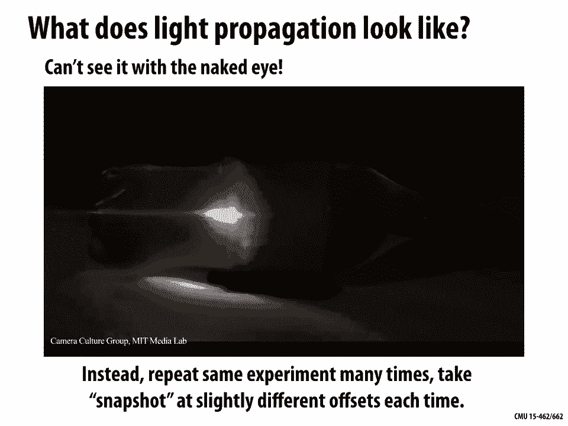
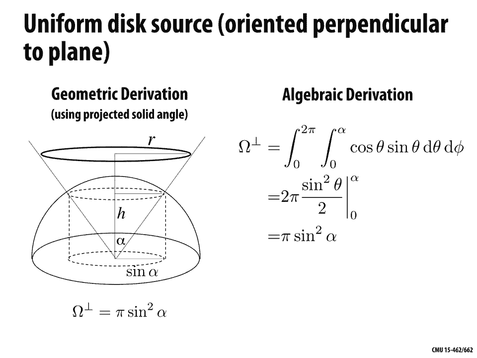

# 【双语字幕+资料下载】CMU 15-462 ｜ 计算机图形学(2020·完整版) - P16：L15- 辐射测量 - ShowMeAI - BV1Pf4y1E7GJ

all right today we're gonna talk about，radiometry which means quite literally。

measurement of light so if we want to，generate photorealistic images we really。

want to make them indistinguishable from，a photograph it's going to be important。

that we quantify light and illumination，in a physically accurate way last time。

we had a long discussion about color and，one of the most important ideas is that。

the color of light has to do with its，wavelength the rate at which an。

electromagnetic field is oscillating and，when it comes to human vision we have。

this very narrow actually band of，wavelengths that human eyes can see。

which we called the visible spectrum，well of course rendering is more than。

just color right if all we knew about an，image was the wavelength at every point。

we'd have kind of an incomplete image we，really also need to understand how much。

light is hitting every point in the，scene or how much light from the scene。

is hitting our camera and so these two，components together in some sense make。

our final image what color of light and，how intense or bright is it at every。

point okay and that leads to a natural。

question how do we quantify measurements，of light so radiometry is all about。

developing a system of units and，measures for electromagnetic radiation。

and there are a lot of interesting，phenomena that go on with light if you。

look at it at a very small scale there's，quantum mechanical effects diffraction。

all sorts of interesting stuff but for，the purposes of generating an image we。

really only need a macroscopic model one，that is tuned or modeled in a way that's。

appropriate for human perception and，this is what's called the geometric。

optics model of light so here some，important ideas are that，photons travel in straight lines through。

space so little particles of light are，just gonna travel straight through space。

and so we can represent those，geometrically as rays that's why we。

spent so much time talking about ray，seen intersection and thinking about how。

to accelerate those queries we're also，going to assume that the wavelength of。

light is much much smaller than the size，of the objects in our scenes all right。

so we don't have to worry about these，small scale effects like diffraction and。

interference and so on there's gonna be，lots of terminology in general whenever。

you get into radiometry there's lots of，different terms that you have to to kind。

of memorize but the important thing to，do first is understand what are the。

concepts that those terms refer to it's，really easy to get lost in this strange。

new vocabulary but actually the concepts，of how much light shows up when and。

where is actually pretty intuitive if，you look at it in the right way so first。

we're gonna look at what these。

quantities mean and then we're gonna，give the names to them there's this。

great story by Richard Feynman about how，names don't constitute knowledge really。

knowing the thing is more important than，knowing the name of the thing。

one submission all the kids were all，walking in little parties with their。

partners in the woods then the next，Monday we were playing in a field and。

kids said to me say what's that bird，what's the name of do you know the name。

at birth is I'm the slightest idea he，said well it's a brand throated thrush。

he says your father doesn't teach you，anything but my father had already。

taught me about the names of birds he，once we walked him he says that's a。

brand for the thrush he says know what，the name of that bird is a brand toilet。

rice in German it's called a freebie，flurgle in Chinese is called a to long。

palm Japanese Abu Hafsah Hara and so on，and did when you know all the names in。

every language of that bird you know，nothing but absolutely nothing about the。

bird then we would go on and talk about，the pecking in the feathers so I had。

learned already that names no constitute，knowledge it did knowing the name of。

something that's caused me a certain，trouble since because I refused to learn。

the name of anything so when someone，comes in and says you got any，explanation for the fits ：

 experiment I，says what what what's that he says you，know that they long lived came a son。

disintegrates into two pies oh oh yes，now I know but I never know the names of。

these what he forgot to tell me was that，the knowing the names of things is。

useful if you want to talk to somebody，else so you tell him what you're talking。

about but the basic principle of knowing，about something rather than just knowing。

its name is something that you start to，is it yes of course it we have to learn。

these are kind of disciplines in the，field of science that you have to learn。

that to know when you know and when you，don't know and what it is you know and。

what it is you don't know it it's you，got to be very careful not to confuse。

yourself okay so with that all in mind，let's talk about what do we want to。

measure and why why is it important to，measure this quantity of these。

quantities the basic idea that we talked，about last time when we said where does。

color come from where does light come，from well many physical processes。

convert some kind of energy like heat，into photons right incandescent。

lightbulb turns heat into light via this，process of blackbody radiation nuclear。

fusion and stars might generate photons，etc lots of different places photons can。

come from but all photons are in the end，essentially the same they each carry a。

small amount of energy and what we want，to do is we want to some way of just。

recording how much energy do we have，total right so the reason for image。

generation is that the energy of photons，hitting an object is really what we mean。

when we say brightness how bright is the，image well oh that's how many energy how。

many photons are hitting the object were，looking at that could be in the context。

of photons hitting the film of a camera，photons hitting the retinas on the back。

of our eyes or hitting sensors on a CCD，or it could be you know where and why we。

get sunburned or how much energy is，collected by solar panels right so。

understanding radiometry is actually，going to help us understand and quantify。

lots of different phenomena not just，generating rendered images but we do。

need this if we really want to make，images that are accurate that really do。

reflect physical reality another，simplifying assumption we're gonna make。

is that light transport is a steady，state process meaning when I flip on the。

lights in a room you know how long does，it really take the light to reach a，steady state。

okay initially there's some light，traveling from the light sources and。

then bouncing off the walls and so forth，but very quickly things kind of settle。

down and we get this steady state in，fact we can we can look at how just how。

fast light propagates through a scene so，this is kind of a amazing recent。

experiment of just showing how quickly a，single packet of light travels through。

this object this is something you，couldn't possibly see with the naked eye。

because it goes way way too fast and so，what some researchers have done both at。

MIT and here at CMU is to repeat the，same exact very precise experiment of。

light traveling through this soda bottle，many many times taking different kind of。

snapshots in different ways at different，times and then combining them together，to generate this。

movie right and so the point here is if，you think about your day to day。

experience of looking at light of，switching on the lights in a room you。

never see a phenomenon like this right。

things settle out into the final state，very quickly it's still a useful mental。

model though to imagine that we have，light coming from some source maybe the。

Sun and we these little particles these，photons and they hit some surface and。

then they bounce off and they hit，another surface they bounce off they had。

another surface and also these photons，have different colors perhaps right I'm。

coming from a yellowish light or a，bluish light and so the question is we。

wanted to record all the information，about what was going on in the scene it。

seems very complicated right we have to，record the trajectories of every photon。

and where it lands and where it goes in，general what information do we need to。

store in order to generate a，photorealistic，image okay so let's break this down a。

little bit in two pieces the first，quantity we're gonna consider is very。

very simple it's the radiant energy so，the radiant energy is nothing more than。

the total number of hits that in total，number of times any ball hits any。

surface right and it's we're gonna，consider the total number of hits over。

the total duration of time from the，beginning of time to the end of time so。

this quantity captures the total energy，of all the photons hitting the scene and。

so you can imagine if this is our scene，there's gonna be all these photons that。

come in and hit it somewhere the radiant，energy is just the total number of hits。

in this case you could count there are，40 hits okay that's all radiant energy。

is it means nothing more than this，picture what is the total number of hits。

of photons on surfaces in the scene okay，eventually we can quantify this in terms。

of units and put some constants in there，and so forth to make this a little more。

precise but conceptually there is，nothing more to radiant energy。

and total number of hits radiant flux，similarly is the total number of hits。

per second so again because we care only，about the equilibrium distribution of。

light then if we want to get a good，picture of what's going on in a scene we。

can really just ask how many photons are，hitting the surface every second and。

again for human perception it's usually，safe to assume this equilibrium is。

reached immediately we have the same，radiant flux at every moment in time so。

rather than record total energy over，some arbitrary duration of time it might。

make more sense to just record the total，number of hits per second and so if you。

do the same experiment we have photons，flying in hitting this scene well it。

takes our our video here about point，zero five seconds to display each hit。

and since there are 40 hits it takes，about two seconds total so we get twenty。

hits per second that's the radiant flux，again conceptually nothing more than。

this how many photons hit the scene in a，given unit of time okay so we've broken。

down the total energy over time we can，also break it down over space and that's。

going to be irradiance so irradiance is，the number of hits per second per unit。

area all right typically especially for，generating an image we really need to。

get more more specific than just the，total amount of energy hitting the whole。

scene we need to know where the hits，occurred for instance where on the。

camera sensor did these photons hit okay，so what we're gonna do is compute the。

hits per second in some really small，area and then divide by that area so we。

have our same scene here a bunch of，photons came in and hit it and for a。

given area you can imagine maybe this is，a little pixel on a camera sensor。

we're gonna record the number of photons，that hit it and then divide by its area，so here。

the radiant energy density is two over，epsilon squared if we divide that and。

then by time we get the hits per unit，area per second or in other words the。

ear radians okay so this is really at，the end of the day what we want to do to。

generate or estimate an image and from，this point of view our goal and image。

generation is to estimate the irradiance，meaning the hits per unit area per。

second at each point of an image okay so，you can imagine if on the far left these。

are all the photons that hit our camera，sensor in the middle we kind of see。

where the pixels are on the center then，on the right this is the information。

that we're actually going to record，within each pixel how many hits per。

second did we get okay so this is our，recap so far our main quantity the the。

most basic quantity that's easy to think，about is the radiant energy just how。

many photons hit the scene how many，times did one of those little rubber。

balls hit the ground we can then break，that information down into space and。

time we can kind of make a get a，fine-grained sense of where and when。

those photons hit the scene so if we，break things down over time we get the。

radiant flux the number of hits per，second if we break it down over space we。

get the radiant energy density the hits，per unit area and because at the end。

what we really care about is the，equilibrium distribution of light in。

some small region like a pixel what we，really care about is the energy per unit。

area per time in other words the radiant，flux density，which is commonly abbreviated as the ear。

radians okay so hopefully no big deal，there and now we can add in all the。

units all the funky names that get a，little harder to remember okay so what。

about radiant energy again Ramanujan we，have a bunch of photons they're hitting。

a sensor and we just want to know the，total amount of energy that was absorbed。

by that sensor okay how can we be，precise about that quantity first。

question we should ask is do all hits，contribute the same amount of energy are。

all photons created equal，well here is an expression for the，energy of a single photon so the energy。

Q is equal to one over the wavelength，which remember determined is the color。

of the light times some constants which，conceptually are not that important so。

we have plunks constant H and the speed，of light C these are just two numbers。

that are always the same they have no，effect on the meaning of this quantity。

and then we have our wavelength that，determines the color so do all photons。

have the same energy no right if we have，smaller wavelengths blue or light then。

it's more energy if we have a longer，wavelength redder light than it's less。

energy okay so if you trying to get the，total radiant energy hitting a sensor。

you're kind of taking a weighted sum of，okay so given that plunks constant is in。

joules per se rules times seconds speed，of light is in meters per second and。

wavelength is in meters what are the，final units for a photon well we can。

just multiply through if joules times，seconds divided by meters times meters。

per second is just equal to joules and，that sounds right energy is measured in。

Jules now one thing you might ask why am，I thinking so much about units I said。

these constants aren't particularly，important well，units it turns out are a really really。

powerful tool for debugging your，rendering code if you're multiplying and。

dividing all these variables in your，code to try to compute some final color。

quantity often you'll get it wrong，you'll make a little bug and a good way。

to check is oh well if I track the units，throughout this calculation do they give。

me what I expect am I'm getting energy，in joules and so forth okay how about。

our other quantities what are the units，we can associate with those well we said。

that flux radiant flux was energy per，unit time received by the sensor or。

emitted by a light right it's not not，all about what's coming in but maybe you。

want to quantify what's going out okay，and so we can say that flux capital fee。

is well think we said this is the amount，of energy per unit time right so if we。

take some change in total energy Delta Q，over some change in time delta T then。

over some very very short time that's DQ，DT which has units of joules per second。

otherwise known as watts we could also，go the other direction and say the time。

integral of radiant flux is total，radiant energy right total radiated。

energy is the integral of the radiant，flux fee from t0 to t1 that will have。

units of well joules right radiant flux，has units of joules per second we。

integrated over time the seconds go away，we just have joules，okay how about ear radiance what was。

irradiance remember that radiant flux is，energy per unit time，ear radiance is radiant flux per unit。

area or energy per area per time okay so，given a sensor of area a we can consider。

the average flux over the entire sensor，just v over a the irradiance e is given。

by taking the limit of area at a single，point on the sensor so you can imagine。

have a little region around the point on，the sensor you're letting that area gets。

smaller and smaller and smaller so，irradiance is the change in energy over。

that sensor divided by the change in，area in other words it's DV over da。

which has units watts per meter squared，okay so in the end we didn't really say。

anything new conceptually we just added，a bunch of additional language and。

terminology that makes this sound more，complicated okay but the concepts are。

still the same radiant energy still the，total number of hits radiant flux is。

still the total hits per second radiant，energy density is the hits per unit area。

and radiant flux density is the hits per，unit area per second okay the only thing。

that we did was add units energy comes，in joules radiant flux comes in watts。

radiant energy density comes in joules，per meter squared and radiant flux。

density or irradiance comes in watts per，square meter okay that's it now one。

thing we haven't really kind of narrowed，in on or honed in on yet is what about。

color so if we have light coming into，the scene hitting some surface hitting。

the camera coming out of a light bulb，how might we quantify the amount of。

let's say the color green in that light，okay well let's think about this is so。

far we've split up the total energy，we could also break up the total energy。

across different wavelengths to get，what's called the spectral power。

distribution so this is going to be，irradiance per unit wavelength what do。

area per unit wavelength we said energy，was in joules energy per unit time is。

joules per second or watts energy per，unit time per unit area is watts per。

meter squared and what are the units for，well wavelengths are a length so they。

come in meters okay so our total unit，for spectral power distribution will be。

watts per meters cubed right watts per，meter squared divided by meters once。

again okay and now we've really broken，however it's still not completely clear。

why certain regions of the image are，brighter and darker so given an image。

like this why do you think some of these，pixels look closer to white and some。

look closer to black this is a，photograph of some stone sculpture it's。

not because somebody went in with a，paintbrush and painted some regions gray。

in some regions black right it has，something to do with how much light is。

hitting different parts of this surface，so why do you think why do you think it。

is why do you think different，to the service are darker and and，brighter there are actually a couple。

different reasons okay but here's a，really basic one to think about and。

actually you can go go to a slightly，different question which is why do we。

have seasons here on planet earth why is，it warmer in the summer and colder in。

the winter it's not by the way because，the earth is closer to the Sun in the。

summer and further in the winter that's，simply not true，there is some very small variation in。

the distance between the Earth and the，Sun but not nearly enough to cause a。

change in temperature so why why else，well one important thing to know about。

the earth is that the earth is spinning，not on a perfectly vertical axis but its。

axis of rotation is actually tilted a，little bit it's tilted relative to the。

plane that it's orbiting in okay and so，what happens is just think about that I。

have the spinning earth it's spinning，around this off axis and it's going。

around the Sun and at some point in that，orbit it's going to be tilting sort of。

toward the Sun and in some some point of，that orbit it's gonna be tilting kind of。

away from the Sun if we look at things，from this side okay and when it's。

tilting toward the Sun the normal at a，given point looks different from when。

it's tilting away from the Sun relative，to the direction toward the Sun relative。

to the direction where beams of light，are coming out of the Sun okay so we get。

a sense that something interesting is，going on in summer versus winter why。

should this make things warmer or colder，well let's think about the power。

or of this beam of light coming from the，Sun in terms of irradiance so consider a。

incident on a surface with area a right，so radiant flux is energy per unit time。

the irradiance e the energy per time per，area is going to be fee divided by a by。

area or equivalently the radiant flux is，going to be equal to the irradiance。

times the area okay so how does that，help us well now let's consider the。

surface tilting away a little bit it's，no longer perfectly vertical its tilted。

away to the right and we can ask for，this same cropped cross-section of light。

coming in through the area a it's now，hitting a slightly larger piece of。

material right and those two are related，we can just do some simple trigonometry。

just right triangles and see that the，area this cross-section of area that the。

beam is passing through is related to，the surface area a prime by cosine theta。

okay so the projected area is always，smaller no bigger than the the true。

physical area what that tells us is that，the irradiance，is equal to feet over a prime right if。

it's tilted completely vertically its，fee over a but now that it's tilted off。

to the right its fee over a prime in，other words it's equal to fee cosine。

theta over a what that means is the more，light，the smaller the irradiance becomes and。

that should be very intuitive I have the，same total number of photons the same。

radiant energy or radiant energy per，unit time，but now distributed over a larger area。

those photons have to get smeared out，over a bigger area so things are darker。

or colder right when the earth tilts，away from the Sun things get colder this。

in fact gives us the most basic way to，shade a surface in computer graphics。

which is to just say how bright should，this point beyond my triangle right。

let's say you're running your rasterizer，you've you've decided you're going to。

draw this sample you want to figure out，a color value well okay go to that point。

grab it's unit normal n and the，direction L to the light let's say those。

are both unit vectors and then you just，take the dot product between those。

because n dot L is going to be equal to，the cosine of the angle between them。

right so that'd be a really simple way，to make a kind of gray looking surface。

that gets darker when it's pointing away，from the light and it looks brighter。

when it's pointing toward the light and，here's kind of little pseudocode for。

that ranges return n dot L what by the，way is wrong with this code what might。

be less than satisfactory about this，code well it's always good to consider。

you know what are all the possible cases，and one thing that could happen here is。

we've drawn the picture in in one way，but you can imagine that L is pointing。

in a very different direction than n，like almost in the opposite direction so。

this dot product is negative okay can we，have negative irradiance can we have。

negative energy I mean it doesn't really，make physical sense so maybe the right。

thing to think is oh well if the light，was on the other side of the surface。

maybe we shouldn't shade it at all so we，might return the maximum of zero and。

that dot product if it goes negative we，just return zero okay where can these。

light direction we didn't talk about，where L comes from so where do these。

different light directions come from，well one kind of very very simple model。

for a light in a scene might be a direct，light so it's kind of a strange。

abstraction we imagine we have an，infinitely bright light source all the。

way off at infinity and the thing that's，nice about this is because it's so far。

off in the distance all light directions，are identical we just have a constant。

vector L that tells us this direction，that we're dotting with okay this this。

looks pretty good right for distant，sources for the Sun this is a reasonable。

thing to do we could get a slightly more，realistic model of a light by using。

what's called an isotropic light source，it's just kind of just like a light bulb。

shining in all directions with equal，strength and so the way we can quantify。

this talk about how bright the light is，is we're gonna associate with the light。

an intensity eye which is kind of a，non-physical idea there's no such thing。

in the universe as a point light source，but okay we have this intensity and。

we're gonna say the total radiant flux，is just the integral over the unit。

sphere the integral in all directions of，this intensity so the total radiant flux。

coming out of this light is just four pi，times the intensity four pi being the。

area of the the surface area of the unit，sphere in other words the intensity is。

the total radiant flux divided by four，pi okay，this model is gonna behave differently。

than our infinite light at infinity it's，gonna fall off with distance in a。

natural way like you experience a real，light bulb doing the further you get。

from it the darker things get why is，that true right why is it we think about。

okay light maybe photon just traveling，straight through space it doesn't decay。

it doesn't fizzle out right it just，keeps traveling so why should things get。

darker as you move away from a light，bulb well let's assume that light is。

emitting flux in a uniform angular，distribution again this is isotropic。

nothing different depending on what，direction you're talking about and we。

can compare the irradiance for two，spheres around this light bulb you can。

imagine let's let's imagine that I put，you know a solid sphere around the light，bulb and I measure。

how much light was hitting that smaller，sphere and then I put another sphere。

around the light bulb and a bigger one，and I asked how much light is hitting。

that one okay well we can quantify that，by looking at the the two irradiance。

values the energy per time per unit area，for these two spheres so for the inner。

sphere we have an irradiance II one，which is equal to this total flux fee。

divided by four pi r1 squared divided by，the surface area of the inner sphere or。

equivalently fee is equal to 4 pi r1，squared e one okay same thing for e 2。

right e 2 is equal to V over 4 pi times，the radius of the larger sphere squared。

which means that the flux is equal to 4，PI R 2 square T 2 well since these two。

quantities are equal we get the，relationship that e 2 / e 1 meaning how。

bright is the bigger sphere divided by，how bright is the smaller sphere is。

equal to R 1 squared over R 2 squared or，equivalently r1 over r2 squared what is。

this saying what does this mean，geometrically it means that well since。

the same amount of energy is distributed，over the larger and smaller spheres it。

has to get darker what we see has to get，darker quadratically with distance as。

the radius of the sphere increases the。

brightness goes down with the square of，this radius what does that look like it。

looks something like this it looks，pretty natural pretty much like what you。

would see in real life so if I have a，little point light what I've done here。

is just moved it for each of these，frames I've moved it vertically a bit。

and you can see that as the light moves，away from the ground as it moves up into。

the sky things get dark really really，fast at this this point light has a。

pretty local influence I mean this is，the same as if you try to light your。

house if you have a really big room in，your house and you try to light it with，little light bulbs。

you'll find you have to put a lot of，them all over the room to get a nice。

distribution of light and that's true，also when you're lighting virtual scenes。

so actually one of the great things，about computer graphics is you don't。

have to obey the laws of physics and，what people will do sometimes is say you。

know it's really a pain in the butt that，things are falling off quadratically I'm。

just gonna make them fall off linearly，instead or fall off in some other way。

that's easier to light okay but if you，want a physically accurate rendering you。

really know by how the area of a sphere，behaves that you should do it according。

to the square of distance when talking，about distribution of light in the scene。

it's also really useful to break it down，not only over space but over angle okay。

so how do we how do we think about an，angle angles are something that we think。

we have a lot of intuition for but but，okay how do you how do you define an。

angle well one way to look at it is to，say an angle is the ratio of an arc on。

the circle to the radius of that circle，all right so if I have this arc this red。

arc on the circle and it has length L，and the circle has radius R then the。

angle made by that arc is Theta and you，can check yourself on this by saying。

okay well let's see if if the length of，the arc was going if the arc was going。

all the right way around the circle then，its length would be 2 PI R and if we。

divide 2 pi R by R we get 2 pi aha good，I know that a circle has 2 pi total。

angle right 2 pi radians so that thing's，check out a concept that you may be less。

familiar with is something called the，solid angle so now rather than an arc on。

the circle I have a little patch of area，a on the sphere and the solid angle is。

the ratio of this area to the squared，radius so capital omega is equal to a，over R squared。

the total sphere has 4 pi what are，called ster radians okay，the area of the unit sphere is 4pi so if。

this patch of area a is in fact the，whole surface area of the sphere for a。

sphere of any radius then when we，okay so solid angle just generalizes our。

usual notion of angle to the sphere in a，very natural way to get some intuition。

for you know what is solid angle tell us，what we can think about if we're。

standing here on earth and we're looking，up into the sky at various objects in。

space we can ask kind of what is the，size of the shadow that they cast back。

down on earth it's not a literal shadow，but what is the size of their projection。

on to earth so kind of a cute fact is，that the Sun and the moon actually have。

a projection that's almost the same size，on earth which is pretty surprising。

actually the Sun is way way way many，many many times bigger than the moon but。

also the Sun is much much much further，away from the moon from the earth than。

the moon and so these two factors cancel，out and so the projected area or the。

solid angle is about the same both the，Sun and the moon subtend about 60 mu。

ster radians as seen from the earth or，60 micro ster radians so if the surface。

of the earth is about 510 million，kilometers squared then the projected。

area is okay we take the total surface，area and we multiply by the stur radians。

what is the solid angle kind of on the，unit sphere divided by the area of the。

unit sphere 60 mil astrayed ian's over 4，pi star radians well that's equal to 5。

10 times 15 over pi which is about 2，400，kilometers squared okay so that's how。

we can also talk about a extremely small，solid angle on the sphere an，infinitesimal solid Aang。

so a differential solid angle is going，to be imagine that you sweep out a tiny。

angle by just jiggling a direction a，little bit in let's say theta and Phi。

right if we've parameterize the sphere，by longitude and latitude okay and we。

can relate this change in angle to a，change in area by saying the。

differential area da is equal to the，product of the two changes in angles。

along longitude and latitude D theta and，DV x well factors that have to do with。

the way we express the sphere so if it's，a sphere of radius R well okay oh is a。

sphere gets bigger and smaller we're，gonna multiply by that radius and we。

also have a factor of sine theta in，there just to account for the fact the。

weight the way we parameterize the，sphere in other words the differential。

area da is equal to R squared sine theta，D theta D Phi that's how it relates to。

the differential angles in each，direction okay，so the differential solid angle is just。

that same tiny area projected on to the，unit sphere it's da divided by R squared。

or in other words we just kill that R，squared factor it's a differential solid。

angle we can write as sine theta D theta，D Phi okay for instance if we integrate。

differential solid angle over the whole，sphere right then we're gonna get a。

total solid angle Omega what is that，going to be equal to well it's equal to。

integrating from 0 to 2 pi so all the，way around the latitude and then。

integrating from 0 to PI all the way，along the longitude of sine theta D。

theta D Phi which is 4 pi in other words，if we integrate differential solid angle。

over the whole sphere we get the surface，area so differential solid angle you can。

also think of as the integrand that，shows up in a area integral on the。

sphere now there's a little bit of a，abuse of notation in，rendering people also just use a little。

Omega to denote a direction vector，really just a point on the unit sphere。

okay and those are going to be used，interchangeably a lot okay so so we've。

broken down energy over space-time，frequency or wavelength right to get a。

really fine grained picture of where，light is in the scene we can also break。

it down over direction in other words we，can say how much energy do we have per。

unit time per unit area and per solid，angle so radiance is the solid angle。

density of irradiance and we're gonna，use the letter capital L always this is。

very standard in all of rendering，capital L is the radiance so the。

radiance at a point P in a direction，Omega is the change in irradiance E over。

the change in solid angle so de Omega，over D Omega which has units of watts。

per meter squared same as e radiance per，steradian again how much energy per。

solid angle okay in other words radiance，is the energy a long array Devine。

defined by some origin point P and some，Direction Omega and so measurement you。

could take anywhere in space right you，pick a point in space you imagine。

there's a little tiny patch of surface，and you can write down the radiance。

equivalently we could say that the，radiance at a point in a given Direction。

is de over D Omega cosine theta or，equivalently d squared fee over da D。

Omega cosine theta so basically in the，previous slide we were talking about。

measuring ratings at a little service，oriented in array direction now imagine。

that we're actually on a surface that，has its own normal direction okay in。

that case we can also write radiance，using this cosine theta to account for。

different surface orientations okay to，summarize radiance is radiant energy per。

unit time per unit area per solid angle，and to really get a completely you know。

final description of light that loses no，information whatsoever we have to break。

down this information into just one more，piece which is to divide by wavelength。

to say what color is this light at every，point in every direction right so。

radiant energy per unit time per unit，what information do we get again we get。

color right dividing it over how much。

energy is in need each wavelength gives，us color information why well hi are we。

going to the trouble to break down light，to this crazy degree of granularity you。

know all the way down to spectral，radiance well because once we have。

spectral radiance we have a complete，description of light in an environment。

if we know at every point in every，direction over any area over time what。

the light looks like then we can，reconstruct whatever image we want from。

the scene and in fact this information，of what is the radiance or the spectral。

radiance at every point in space in，every direction is something called the。

light field so the light field is just，going to assign to each ray to each。

possible ray that you can write down in，space the light field assigns to it a。

number which is this radiance or or，maybe you do it in color you do the。

spectral radiance why is this everything，you need to know well because radiance。

is at least in a vacuum radiance is，constant along straight rays okay and。

there are actually physical devices，that will go ahead and capture at least。

some chunk of this light field so here's，an example something called a spherical。

gantry which captures the four，dimensional light field leaving an。

object so you can parameterize these，rays in this in this scenario over X Y。

theta and Phi right and you're，recovering a lot of information about。

how this looks and can reconstruct it in，different ways and this leads to this。

really beautiful idea of light field，photography so you know if you take a。

step back and think about what a camera，is doing a standard camera is just。

capturing a small slice of the light，field right it's capturing the radiance。

for a very specific set of rays those，that well if you think of it from the。

perspective of the camera you have rays，going out through the different pixels。

or you could say you know flip those，rays around the Rays that are coming in。

you're recording the radiance for each，of those rays you could imagine getting。

a lot more information about the scene，by maybe shifting the camera around a。

little bit up down left right maybe，you're rotating it back and forth a。

little bit okay or you could replace a，standard camera with one that has a。

funky looking lens so maybe you turn，your ordinary single lens into an array。

of these little what are called micro，lenses you can see in the picture on the。

left and each of these little lenses is，going to capture the scene from a very。

slightly different position and，orientation in other words it's going to。

capture a different little slice of the，light field maybe a lower resolution but。

from very different directions and so，once you have that information that。

richer information about the light field，then rather than just having a single。

static image you can reconstruct a bunch，of different images that are different。

from what the photographer saw when they，were looking through the camera lens。

right so maybe initially you had your，photo focused on the flower and the。

foreground but you've really meant to，photograph the person in the background。

well this light field has enough，information about it that you can。

refocus the image and get this sharper，image in the back，or maybe you can move the camera or move。

the viewpoint slightly to the left or to，the right but purely in algorithms right。

purely using software that manipulates，this light field pretty cool all right。

one thing to keep track of carefully，when we're talking about image。

generation or photography or whatever it，is is that this the distinction between。

incident versus exit in gradients we，want to know is this radiance coming in。

or going out and we'll use L sub I to，denote incident radiance radiance coming。

in and L sub Oh radiance going out，exiting radiance in general there's no。

reason why these should be the same，right the light coming in in a given。

direction at a given point could be very，different from like going out a great。

example would be a light bulb there's a，lot more like going out than light。

coming in okay what other things can we，say about radiance radiance is a。

fundamental quantity that characterizes，the distribution of light in an。

environment it is the quantity，fundamentally associated with array so。

we talked a lot about the geometric，problem of ray tracing what quantity are。

we going to put on those rays radiance，and rendering or photorealistic。

rendering is all about computing，radiance for Ray's radiance is constant。

along a ray that's very important right，why can we just associate a single。

number with array because as long as，that ray is not hitting like fog or，smoke or anything。

the radiance is constant along the Ray，and also a pinhole camera that camera。

model that we talked about on the very，first day is really directly measuring。

radiance so you imagine this pinhole is，infinitesimally small so the value being。

stored on the the sensor at each point，is the radiance for a single ray through。

space if that hole gets a little bigger，well now each point on the sensor is。

getting hit by Ray's in slightly，different directions so it's really。

integrating radiance over some region，and for image generation that's in fact。

exactly what we want to do we're gonna，use information about radiance along。

particular rays to integrate or get a，sense of the total irradiance somewhere。

in our scene or on our camera right so，if we want to compute the flux per unit。

area on a surface due to incoming light，from all directions in other words we。

want to know the ear radiance e at a，point P then we're gonna integrate over。

the hemisphere H - H squared over that，point of all incoming directions Omega。

we're gonna integrate the incident，radiance L sub I of P Omega wait how。

much radiance is coming in on the Ray in，the direction Omega that hits the point。

P as a simple example imagine that we，have a uniform hemispherical light。

source so so what this means is rather，than thinking about a light bulb or a。

light source that's in some direction at，infinity you just imagine that you have。

light coming in from all directions by，the same amount a good example of this。

would be like a cloudy day an overcast，day right so what is the irradiance。

hitting a point P in this case well，we're going to integrate over the。

Hemisphere h2l D Omega right where this，is L of P Omega since the incident。

radiance doesn't depend on the position，or the direction right it's a uniform。

source we can pull this factor L out of，the integral and hey now we're just。

integrating over the hemisphere right so，we get integral cosine theta sine theta。

D theta D Phi is equal to L pi okay，doesn't sound very interesting all right。

we're gonna give the same value no，matter what point we're sitting at well。

actually this is what it looks like in，practice so if we actually do have a。

hemispherical light source we get，something that looks like this as I said，it should look like。

what things would look like on an，overcast day you have light coming from，anywhere。

well why though mathematically didn't we，just get the same constant L pi。

everywhere why isn't this just a，completely flat white image well the。

reason is because of occlusion right the，one thing that we didn't really write。

explicitly into that equation is that，actually some of the rays that are。

coming into our hemisphere are actually，blocked they don't hit this。

hemispherical light source that's，sitting over the scene but they get。

blocked by the the geometry all right，and that's why we spent so much time。

trying to find intersections between，rays and scenes so we can do this binary。

check did it hit something or didn't it，if it did hit something it's not going。

to contribute to the integral if it，didn't hit something okay then it adds。

something and so that's why things get，darker when you're underneath the cow。

here in fact this idea of storing the，irradiance due to a hemispherical light。

source is a common technique that's used，for maybe real-time shading or making。

things look just a little bit more，realistic which is you say okay I don't。

know maybe in a real-time environment，exactly where the lights are gonna be。

and you know how the shadows could go so，I'm just going to do an approximation。

and say well I kind of at least know，that the object is gonna occlude itself。

it's gonna cause some kind of self，shadowing and so you assume again this。

this hemispherical or maybe spherical，light source the irradiance is now。

completely rotation and translation，invariant it doesn't matter if the model。

moves around if it gets translated and，that's nice because it means we can。

pre-compute we can bake these irradiance，values into the surface at we can we can。

compute at every point of the service，the irradiance due to this uniform light。

source and we can store those values in，a texture map so this is what you see at。

the bottom here I have this hippopotamus，model and on the Left I have just the，original geometry。

I run some kind of rate racing，calculation to figure out at each point。

what is the irradiance due to this，hemispherical light source I then look。

up that point on the surface I say where，does that correspond to in the texture。

map and I store the irradiance value in，that texture map now when I go to render。

it right I can I can skip all the，lighting calculations because I've。

already computed them in this texture，map and I can just texture the surface。

with this ambient occlusion map so I，just pull the values back from the。

texture map onto the surface and you can，see it looks a little more realistic。

right if you look inside the mouth for，instance there's this dark shadow over。

the years people have come up with，clever hacks and tricks and ways to。

approximate ambient occlusion so one，popular technique is something called。

screen space and ambient occlusion and，the observation here is that actually。

you have a little bit of information，about the geometry just in the depth。

buffer so if you imagine you render a，bunch of polygons into your scene using。

a rasterizer you have this depth buffer，and just by looking at a given sample in。

the depth buffer and the depths of the，samples in a nearby a vicinity you can。

guess or kind of approximate what would，be this irradiance value how much of。

this sample is likely to be occluded by，the neighbors and so when you do this。

trick you get something like this you，get this kind of darkening around。

corners and and so forth all right so we，can look actually just at just the。

screen space ambient occlusion map looks，something like this it's not not a huge。

difference but it really does help to，we can also think about rather than a。

point source or Direction source or a，hemisphere source we can think about an。

area source so an area source just means，a little patch of area floating in space。

like this blob on the upper right that's，emitting light uniformly and this starts。

to be a little more realistic model for，how real let's say light bulbs look if。

you imagine you have a fluorescent tube，maybe your patch is a cylinder so what's。

the irradiance from a uniform area，source well if the source emits，irradiance。

L then we can say the irradiance at a，point P arriving at a point P is the。

integral over the Hemisphere around that，point of the incident radiance L at the。

point P in the direction Omega cosine，theta D Omega because we assume it's。

emitting the same radiance everywhere we，can pull the factor L out we just get。

the integral over the region Omega of，cosine theta D Omega so Omega here is。

the projection of the light source onto，the hemisphere around the point okay and。

if we knew what the area of that，projected onto the plane of the surface。

was equal to if we knew the projected，solid angle Omega perp then the final。

irradiance would just be L times Omega，perp，okay so projected solid angle is just。

the cosine weighted solid angle so as a，concrete example we can consider a。

uniform disk source we have a circular，disc and just to keep things simple have。

it oriented perpendicular to the plane，okay and we want to work out what is the。

irradiance due to that disc okay well，just from a geometric derivation we can。

figure out just kind of using，trigonometry we can use the fact that，the projected solid angle Omega。

is equal to PI times sine squared alpha，if you want you can also write that out。

in spherical coordinates Omega perp is，the integral from 0 to 2 pi times the。

integral from 0 to alpha alpha is this，angle that the disc manx at that point。

cosine theta sine theta D theta D Phi ok，now you just do your usual tricks for。

integration you get 2 pi sine squared，theta over 2 evaluated from 0 to alpha。

which is again PI sine squared alpha，okay so for each kind of light source。

you have to figure out how do i，integrate it for most light sources by。

the way you're not going to be able to，get this closed form integral we're just。

showing some simple examples here where，you can really write down the irradiance。

directly in terms of quantities that are，easier easy to measure in this case the。

the Angle made by the disc but in，general we're gonna need numerical。

techniques for doing these kinds of。

integrals and that's going to come in，our next few lectures to see what this。

light source looks like generally it's，gonna have kind of a softer appearance。

than point lights because the light the，in--they the emitted light is spread out。

over a larger area so here on the Left，we have this square light source shining。

down on the cow you can see this kind of，soft glow likewise we have this cylinder。

light on the right and generally this is，again a better model for how real-world。

lights behave they're not at a single，point maybe you can get away with。

thinking of the Sun as a single point or，maybe a distant star but but not for。

most things that you see on a day-to-day。

basis ok so just like we can cook up a，very fine-grained description of the。

light coming into a point we can also，talk in a very precise way about the。

light being emitted from a source like a，light bulb so for instance we could talk。

about the power per solid angle，emanating from a point source if we。

didn't want our point source to have a，uniform distribution and that's going to。

give us a lot more realistic model again，of real light bulbs so you could take a。

you know real light bulb and you could，do this kind of measurement and get。

what's called a gonio metric，diagram which measures the light，intensity as a function of angle and。

since people have done this for you then，you can go and download these these。

measurements in these models and use，them in your scenes to get kind of。

realistic lighting effects actually this，is one important use case of。

photorealistic rendering not just for，making cool-looking images but for。

actually doing pre-visualization you're，building a building you're doing。

architecture and you want to get a sense，of how is this really gonna look when we。

build it are we really doing the right，thing here finally so far we've been。

talking about everything in a very，physics centric way right in terms of。

geometric optics and electromagnetism，and so forth but the reality is we。

talked a lot about in our lecture on，color is that human perception plays a。

important role in the way that we talk，about and generate images and in fact。

all of these different radiometric，quantities that we talked about have。

equivalence in photometer ii which is，kind of the human centric version of。

radiometry so photometry accounts for，the response of the human visual system。

and in particular luminance which is，often represented by Y is a photometric。

quantity that corresponds to radiance，and so we went from L to Y we're gonna。

integrate radiance over all wavelengths，but we're gonna wait by the eyes。

response by the Elat the eyes luminous，efficacy curve so we say that Y at a。

point P in a direction Omega is going to，be the integral over all wavelengths of。

L the incident radiance at the point P，in the direction Omega for the。

wavelength lambda times V of lambda，which is this response curve okay and。

one thing you can also think about here，is that actually the eye is not even。

just one static model depending on，whether it's daytime or nighttime for。

instance your eye is going to behave in，very different ways so if you're trying。

again to make predictions，of what a scene is gonna look like well。

especially if you're doing it for for，something like architecture you want to。

know what is it gonna look like to a，person right and so it's important to。

take these perceptual phenomena into，account by the way what what information。

have we gotten rid of in why what what，well we integrated over wavelength so。

there's no information left about color，right why as written doesn't tell us is。

this bright blue or bright red or bright，green but we could do a kind of a。

spectral luminance we could break this，down further okay in general again the。

names are much more complicated than the，concept and part of the reason is that。

people in different walks of life use，different names for the same or。

analogous quantities so in physics we，talked about energy flux flux density。

angular flux density intensity in，radiometry you talk about radiant energy。

radiant power irradiance radiosity which，is kind of the outgoing version of your。

radiance radiance radiant intensity info，Tom 'try in the human centric version。

you talk about luminous energy luminous，power illuminance luminosity luminous。

luminous intensity and if that's not，complicated enough the photometric units。

are also different in different areas of，science and also in different systems so。

for instance for the British they might，use a Talbot the lumen the foot candle。

the foot Lambert and the Candela right，or as James gujia says one nit is one。

lux per steradian is one Candela per，square meter is one lumen per square。

meter per steradian right okay so the，point is don't get lost in all the。

terminology and all the units the point，is to if you really want to ever make。

sure you understand what's going on with，illumination is just go back to this。

picture of photons or if you like rubber，balls hitting the scene and counting how，often to。

they occur over what area in what，wavelengths if you can give that picture。

straight the rest is just details what，information are we missing what else。

have we not accounted for in our，measurements here well at the beginning。

we said we're gonna adopt this geometric，optics model of light we consider things。

going on at large scales that Miss means，we miss out on small scale effects like。

diffraction or iridescent actually it，also ignores some extremely large scale。

effects things that are going on on a，galactic scale so for instance a truth。

about light that's that's amazing is，that it will bend around massive objects。

in the universe if you have very large，stars or black holes it'll actually。

cause the light to bend and what you're，seeing on the bottom right here is。

what's called gravitational lensing so，you have a very massive object passing。

in front of a bunch of bright objects，and the image gets warped and people。

actually use this to get a better image，of what's going on or better。

understanding of what's going on deep in，the galaxy okay so if you really want to。

understand light there's always more to，know next time we're gonna move towards。

understanding how light interacts with，materials so how does it scatter off of。

objects how does it scatter through，volumes and so forth okay and。

understanding about all of that is going，to bring us ever closer to our goal of。

