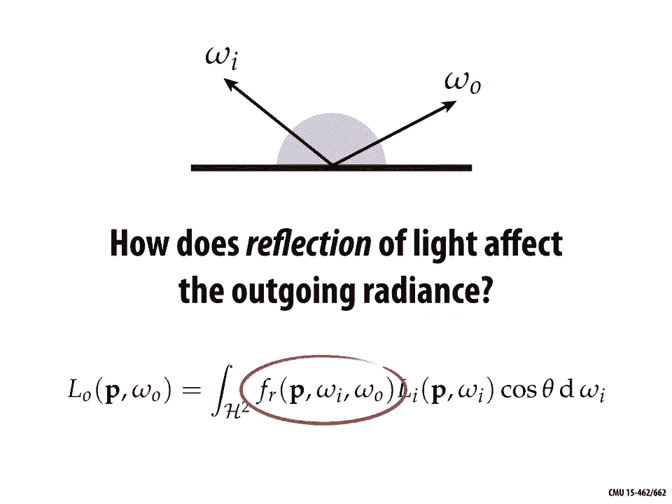

# 【双语字幕+资料下载】CMU 15-462 ｜ 计算机图形学(2020·完整版) - P17：L16- 渲染方程 - ShowMeAI - BV1Pf4y1E7GJ

ok today we're gonna bring together a，bunch of ideas that we've been talking。

about for a few lectures now about color，and measurement of light and so forth。

into the equation that's gonna let us，render photorealistic images just to。

recap a little bit of our discussion，about radiometry from last time we had。

different terms we were talking about，the most important one was radiance so。

he said that radiance really captures，all of the information about the light。

in a scene at least the spectral，radiance so if we know for each point in。

space in each direction what the color，of the light is then we really know。

everything about what's going on and we，can use that to generate images one。

important distinction that we made was，between incident and exit entrer d UNS。

these are not different physical，quantities but they're different。

conventions for how we're referring to，radiance in the scene so incident。

radiance means light coming in if you，imagine I'm sitting at the corner of the。

street and I'm looking up at the sky at，all the buildings in every direction。

there's some different incoming color，whereas if I'm talking about exit in。

radiance I might be thinking about a，light source and depending on which。

direction I'm looking out of the light，source I'm shooting light of different。

amounts in different colors in different，directions right and in both cases the。

important idea is that in both cases the，intensity of illumination is highly。

dependent on direction not just location，in space or the moment in time and what。

that means when it comes to image，generation is that when we want to。

determine the total illumination at a，point we're gonna have to consider all。

the illumination coming in to or going，out of every direction ok。

we also made this distinction between，radiance and irradiance what was the。

difference there well it's exactly this，different or，actions to get the overall illumination。

so in particular the e Radiance e，is always going to be the integral of。

radiance for instance if I want to know，the total light coming in in that。

hemisphere looking up at the sky then，I'm going to integrate over the。

hemisphere H to the incident radiance L，of Omega Omega being the incoming。

direction cosine theta D Omega okay so a，little more precisely what is radiance。

we said radiance at a point P in a，direction N or for a surface with normal。

n is the radiant energy per unit time，per solid angle per unit area。

perpendicular to n right we want to，think about how much radiance comes in。

some little patch on that hemisphere，projected down onto the plane so we say。

that radiance L is the radiant flux fee，meaning energy per unit time per solid。

angle Omega per projected area a cosine，theta so a slightly confusing point here。

is that the cosine here has to do with，the way we parameterize the sphere and。

not Lambert's cosine law so this is a，confusing thing the first time you look。

at the equations for photorealistic，rendering that this cosine theta shows。

up for complete two completely different，and unrelated reasons one is for a。

physical reason due to Lambert's cosine，law which says well if we tilt a little。

piece of material to the side then we，get a beam of the same total energy。

hitting a area that's slightly larger，and so that energy gets spread out over。

a bigger region and becomes darker the，other cosine is coming purely from the。

way that we write down spherical，integrals from the way we parameterize。

the sphere so if we want to integrate，function f over the sphere s - one way。

to write that is to integrate over theta，and Phi latitude and longitude the。

function as a function of those two，angles cosine theta D theta D Phi so。

here the cosine theta term is just，accounting for the way we've stretched。

out our domain of integration Theta Phi，over the sphere okay okay so coming back。

to the main question of the day how do，we use all this stuff to actually。

generate photorealistic images and the，answer really is given by the so called。

rendering equation so the core，functionality of a photorealistic。

renderer is to estimate the radiance at，a given point in a given Direction Omega。

naught the incoming or incident radiance，how do we write this radiance down。

well it's summed up by this rendering，equation which says the radiance that's。

observed or that's leaving a point P in，a direction Omega naught is equal to the。

emitted radiance at that point so how，much light is actually being generated。

and being shot out of that point in that，same direction plus the integral over。

all incoming directions of the incident，radiance Li at that point in well the。

incoming direction the current direction，that we're integrating over we have this。

cosine theta term which is the just the，angle between the incoming direction and。

the surface normal and we have one more，term that we haven't talked about yet。

that's new for today which is this，scattering function f sub R which says。

how much light that comes in from the，direction Omega I actually gets。

reflected back out in the direction，Omega Oh，the key challenge with the equation that。

the thing is so hard about solving or，evaluating this expression is that it's。

recursive so what you notice is we want，on the left side to evaluate the。

outgoing radiance and in order to do，that we need to be able to evaluate on。

the right-hand side the incoming，radiance well what is the equation that。

governs the incoming radiance it's，exactly this same equation right we just。

get another instance of this equation，but at a different point in particular。

at the point we find by tracing that R a，backwards until it hits a different。

point in the scene so this whole task of，estimating or computing radiance comes。

down to recursively evaluating this，rendering equation I want to know how。

much light is going into the eye okay so，I follow that ray I hit a point now I。

want to find out how much light is，coming into that point well I look at。

all the directions above that hemisphere，just like I saw on the city corner and。

for each direction I ask what is the，radiance for that incoming ray well。

maybe I pick one ray and I say okay I，follow that back to where it started and。

at that point I need to know the，radiance and so on how does this。

recurrence terminate well eventually I，have to hit something that's emitting。

remember that the ray tracing or the，rendering equation has two terms it has。

the emissive term and this scattering a，reflection term our base case is when we。

just have something emitting like a，light bulb，okay by the way the fact that this。

equation is so hard to evaluate and it，has to be done recursively and so forth。

this is why we need to do this by ray，tracing we couldn't easily do this by。

running a rasterizer a rasterizer gives，us very little control，for essentially which raise are we。

evaluating okay so this is the basic，task of a photorealistic rendering is to。

measure or compute the radiance along，array and each bounce we want to measure。

the radiance traveling in the direction，opposite the given Ray direction so it's。

kind of a little counterintuitive you'd，think oh we should start at the light。

and trace particles until they hit the，camera but since we know where we want。

our path of light to end up we wanted to，end up at a particular pixel right we。

want a color for each pixel it really，kind of makes sense to do things in the。

opposite direction trace rays backward，through the scene until we hit a light。

okay keeping track for each bounce of，how much light got reflected off a。

surface and so that brings us to this，new term this new topic for today which。

is how does reflection of light affect，the outgoing radiance what is the。

meaning of this scattering term so at，least in our geometric optics model of。

light transport reflection or scattering，is the process by which light that's。

incident on a surface that's coming in，and hitting a surface interacts with the。

surface so that it leaves the same side，of the surface meaning it kind of。

bounces off the surface without changing，frequency it's the most basic thing that。

can happen to light that comes in and，hits a surface，all right bounce is right off it stays。

the same color nothing funky happens，other than it gets reflected and the。

choice of reflection function what do we，use for F sub R that's ultimately going。

to determine what the appearance of the，surface is right did we absorb a lot of。

green light and allow red light to get，reflected or vice versa in what。

directions does light get reflected，strongly versus what directions will it。

be absorbed a lot that's going to，influence the，way that the surface looks so we could。

get different kinds of materials some of，which are illustrated here now one thing。

to say actually is that this is a，simplified model of the way that light。

behaves as usual we're sticking with a，model of geometric optics so remember in。

our last lecture we said we want to pick，a model for light transport that is。

suitable or is appropriate for human，level vision of a scene right I'm。

talking about macroscopic objects I'm，talking about the way that humans see。

things I'm not going to account for，effects like diffraction very small。

scale effects okay so it's just this。

simple reflection function some basic，examples important examples of。

reflection function functions are shown，here so one is what's called a specular。

reflection whenever you hear somebody，say specular reflection it's safe to。

think of something like a perfect mirror，or a mirrored surface right the light。

comes in and it bounces off the surface，in a very particular direction the。

direction that you get by reflecting，around the surface normal another very。

kind of important case is diffuse，reflection which means light comes in。

from some direction but the direction，that it goes out has nothing to do with。

the direction that I came in it gets，scattered equally in all directions so。

something like a diffuse paint on the，wall or a clay terracotta pot is pretty。

similar to a diffuse reflection and then，we have all sorts of things in between。

so you might have a glassy specular，reflection which means light comes in in。

a particular direction and rather than，bouncing exactly off the normal it kind。

of gets smeared or scattered out in on，bunch of directions around that specular。

reflected direction so this slightly，glossy appearance shows up in things。

like plastic and actually most real，materials are somewhere between these，extremes of ideal specular。

and I deal defuse there's also some very，funky kind of reflection functions that。

show up here and they're like retro，reflective materials so if you have a。

reflector on the back of your bicycle，this is really designed so that if a。

headlight of a car is shining on the，reflector it actually bounces back in。

the direction that it came from or，almost perfectly in the direction that。

it came from so that that driver knows，there's something in front of them this。

same kind of behavior actually happens，when you look up at the moon next time。

you look at the moon you might notice，that it doesn't really look so much like。

a shaded sphere right we know that the，moon is spherical but if you look at。

this image it doesn't really get darker，around the side why is that well it's。

because the reflection function is。

something like a retro-reflective，function and you get this different。

appearance here's some examples of what，these different materials look like on。

the same surface so here we have a，teapot and we're showing just two。

diffuse reflectance functions so the，incoming light gets equally scattered in，all directions。

it looks very kind of rough we can use a，material that's a mix of specular and。

diffuse or somewhere between specular，and diffuse and we get this glossy kind。

of plastic appearance we could also，control how much light gets absorbed。

versus reflected in different，wavelengths so here we're gonna absorb。

greens and blues and reflect more reds，we get this semi-gloss red paint and if。

you really start playing around with，this reflectance function doing funky。

stuff you can get interesting appearance，that you might have seen on more exotic。

paints on car paints or something like，that finally if we use a perfect。

specular reflection we get this mirrored，kind of surface this super polished。

surface and you can go on and on write，different glossy materials show up like。

so this idea of having a single simple，function that turns input directions。

into output directions it's kind of a，crude approximation if you look close up。

at a real surface a real material it has，a lot of interesting stuff going on you。

why does a surface look the way it does，why do we have glossy materials well。

maybe at a microscopic level you might，have imagined lots of little tiny。

reflectors that are almost perfect，mirrors but they're oriented in kind of。

random or unpredictable ways and that's，one way of thinking about what's going。

on at a much smaller scale why do we get，these different appearances of light。

bouncing off of surfaces so how can we，model the scattering of light in general。

beyond this simple reflectance function，well there's a lot of different things。

that could happen to a photon the thing，that we've been talking about so far is。

we imagine okay it comes in in some，direction just bounces off the surface。

but it could also get transmitted，through the surface this is what happens。

for a material like glass right the，light might go through more。

interestingly and what happens with a，lot of real materials is that it might。

bounce around inside the surface for a，short amount of time when light hits。

your skin for instance it doesn't，immediately bounce off and it doesn't。

pass through it bounces around inside，the skin and then comes out maybe。

somewhere else also in more exotic，materials it could be absorbed and。

re-emitted after some amount of time and，this is the phenomenon of。

phosphorescence and so on there's a lot，of interesting things that we can do or。

the different models we can have for，scattering even in this geometric optics。

view of light transport one thing that，should always be true is that what goes。

in must come out total energy must be，conserved right and so for that reason。

when we start to mathematically model，these different types of scattering。

we're gonna want to talk about kind of，the probability loosely speaking that a。

particle arriving from a given direction，is scattered in another，direction now it's not really a。

probability because there's not a，hundred percent chance that it leaves。

the surface some light is usually going，to be absorbed right but that's the。

general idea we want some function that。

keeps track of given the light that came，in where does it go out here's a good。

mental model for thinking about what，happens with scattering so if I imagine。

that I'm a little bug on the ground I，can consider the view of the scene from。

this point I can look up and here's what，I see you can see in the upper left part。

of this little image is actually the，back tire of the car maybe you can see。

the the tailpipe in the bottom and so，forth and so we can think about what two。

different scattering functions do to，this incident radiance all right this is。

elsa by the incident radiance what does，the excellent radiance look like well if。

we have a perfectly diffuse reflection，then this incident radiance is going to。

get sent out uniformly across all，outgoing directions it's going to kind。

of get averaged or blurred into all，these outgoing directions on the other。

hand if we have a specular direction a，specular reflection we get a name is。

like this right the incident radiance in，a particular direction goes out in a。

very special direction the reflected，direction and so the only thing you。

notice that happens here is the image，kind of gets flipped right just due to。

bouncing off the mirror if we have a，material that's somewhere between ideal。

specular and ideal diffuse then this，would be kind of the mental model the。

incoming radiance gets blurred out a，little bit it gets flipped and it gets。

sent back out again if we have something，that has some color to it it might look。

like this okay it comes in it gets，flipped around it gets blurred and it。

gets sent out but different amounts in，different wavelengths how do we describe。

this reflectance function well we have，something called the brdf or the。

bi-directional reflectance distribution，function and what this does is it。

encodes the behavior of light that，bounces off，the surface so given the incoming。

direction Omega I how much light gets，scattered in any given outgoing，direction Omega。

oh we're gonna describe this as our，function f sub R and just to make it。

clear what's the in go incoming and，outgoing direction will sometimes write。

it with this little arrow okay here's a，pretty good way of visualizing what this。

function describes or what it looks like，so if we have a green incoming direction。

then we have a lobe of possible outgoing，direction so these are all the different。

directions that that incoming direct，that incoming radiance might get。

scattered out and you can see that in，different directions it has bigger or。

smaller magnitudes so we describe this，as a distribution which is non-negative。

at every for every pair of incoming and，outgoing directions and which integrates。

to no bigger than one over the whole，hemisphere why less than or equal to one。

where did the rest of the energy go why，is it that some light can come in but。

not leave we know from physics that，energies never created or destroyed so。

shouldn't this always be exactly equal，to one and the answer is no because some。

of that light doesn't leave as light it，might get translated into heat so。

remember we said heat is really just，kinetic energy of little particles。

jiggling at an atomic scale and that's，why things get hot in the summer if you。

have black leather seats in your car in，the summer the lights going to come。

through the window and rather than，getting absorbed by the seats。

I'm sorry rather than getting reflected，it's gonna get absorbed and the little。

particles are going to start jiggling，and that's why when you open up the door。

and sit down it's hot right so that's，why we only ask that the reflectance。

function be bounded by one another thing，that is always true about these。

scattering functions is they have a，certain symmetry so if I know the kind。

of amount of light that gets scattered，in the direction，not from coming in in the direction。

Omega I well then that's gonna be equal，to how much light gets scattered out in。

the direction Omega I if it came in from，the direction Omega oh right why should。

that be true why should we get this，symmetry or what's called Helmholtz。

reciprocity well think back to that idea，of at a very very small scale every。

material being made up by little mirrors，right that's the basic intuition to。

understand why Helmholtz reciprocity，works so far our discussion of。

scattering omits any discussion of units，but that's pretty easy to work out。

basically we can just say well for a，given change in the incident irradiance。

how much does the exit entrer D&C change，and just working through the units we。

find that we get 1 over ster radians，okay so as a concrete example let's。

consider a Lamberson reflection again，assuming that light is equally likely to。

be reflected in each output direction，okay well then to evaluate the outgoing，radiance l：

o in a particular direction，Omega oh we integrate over the，hemisphere the scattering function f r。

times the incident radiance L I in the，current direction Omega I times the。

cosine of the angle theta between Omega，I and the normal because a lambertian。

reflection is uniform because it has the，same amount of scattering in every。

direction this function f R doesn't，depend on Omega I or Omega Oh，so we can just pull it out of the。

integral right and what we're left with，is just that constant this this constant。

or reflection basically how bright the，surface is times an integral that's just。

giving us the irradiance e right the，integral of incident radiance over the。

hemisphere is the irradiance there's a，common name for the brightness factor。

which is the albedo so because we want，to think in units between zero and one。

or values between zero and one to talk，about how much got absorbed or or。

scattered we can say that F R is Rho，over PI right just normalizing by the。

area of the hemisphere here's a nice，photograph illustrating the example of。

perfect specular reflection so we're，shooting this beam of light in hitting。

this mirrored surface and we see this，beam of light coming out in this。

direction that looks symmetric in some，way so what exactly is the direction of。

specular reflection well we can express，it in two different ways if we want to。

think about angles then we can think，about two angles one theta the angle。

made with the normal in the plane of，reflection so if we consider the plane。

spanned by the normal and the incoming，direction we have this this angle theta。

to consider and if we view this same，reflection from above then we can talk。

about this angle V kind of the the angle，around the plane okay，so for a specular reflection in this。

side view theta I and theta oh the，incoming and outgoing angle are going to。

be the same we want them to make the，same angle with a normal how do we。

distinguish between the two well the，angle around the plane fee is going to。

be opposite V out is equal to minus V in，another way to write this is just in。

terms of the vectors if we think now of，Omega o and Omega I as the incoming and。

outgoing unit vector then you can work，with this little picture and discover。

that Omega o is equal to minus Omega I，plus 2 times Omega I dot n times and one。

way to work that out is just figure out，what do I need to subtract from Omega I，and。

and then subtract that again and that，will give you your reflected direction。

in terms of the actual scattering，function f sub R we could write the。

specular reflection brdf down like this，so we could say as a function of the。

input and output angles theta and phi f，of r is equal to something involving the。

Dirac Delta so the Dirac Delta is kind，of like an indicator function what it's。

going to do is if I give it a value，that's nonzero it's going to be equal to。

0 if I give it a value that's 0 well，it's going to kind of be infinite and so。

in terms of probability what we're，saying is there's only a chance that。

we're gonna scatter if these angles are，the same if theta and Phi are the same。

or at least theta is the same in in its，cosine okay strictly speaking f sub R is。

not a function but it's a distribution，it's a probability distribution in。

practice because this specular，reflection distribution has this very。

singular behavior there's no hope of，finding it by just sending in Ray and。

then saying okay I'm going to pick some，random direction and see how much light。

gets transported along that direction，right we really should just only。

consider the specular reflected。

direction as we discuss before in，addition to reflecting off a surface。

light might also be transmitted through，a surface which is what happens with。

glass and water and so forth and one，important thing that happens is that it。

doesn't go straight through but it，generally refract when it enters the new。

medium so if I'm going from air into。

water I'm going to deviate in Direction，a little bit in this case the new。

direction can be determined by what's，called Snell's law，which you might have seen in your。

physics class the transmitted angle，depends on the relative index of。

refraction of the materials the Rays，entering or leaving so basically。

different materials have different，densities air is not as dense as water。

right and so as I go from one medium，into the other I get this refraction。

event you can see on the right here the，index of refraction for different。

materials and generally when we're doing，computer graphics a pretty reasonable。

assumption is that light is traveling，through a vacuum you can see that air at。

sea level is not so different from，vacuum okay so in particular if we want。

to figure out the relationship between，the incoming and outgoing angles we have。

this equation at the bottom ada I is the，index of refraction of the incoming ray。

ADA T is the index of refraction of the，transmitted ray theta I and theta T are。

the corresponding angles made within，normal and so depending on whether we're。

coming in or going out we can use this，law Snell's law to determine the。

refracted direction the other angle feed，just stays the same now an important。

thing to realize is though we keep，drawing these pictures of light getting。

transmitted and passing through a，surface Snell's law actually tells us。

that something else can happen so if we，work through what happens with the。

cosine of the angle kind of the X，component then actually in some。

situations if we're traveling from a，more optically dense medium to a less。

optically dense medium right from water，back into air then it's possible that。

light incident on the surface from a，large enough angle might not exit the。

medium in other words instead of getting，refracted or transmitted through the。

surface it's going to bounce off it's，going to behave more like a specular。

reflection and you can see this，phenomenon for instance if you're diving。

under the ocean you can look up and，you'll just see this kind of cone of。

directions where you can see through the，surface of the water all the rest of the。

light is getting reflected back down and，so if there's no light sources。

underneath the water you get this kind，of dark shadow on the outside，there are lots of other optical。

phenomena to account for when thinking，about the behavior of real light for。

instance in a lot of real materials，reflectance is going to increase with。

the viewing angles so something that you，kind of want a model in your your。

scattering function a great example，where all these different phenomena they。

come together is again if you're out on，the ocean and you kind of see look on。

the horizon it looks like you have a，perfect mirror that's reflecting the sky。

or the trees up close where you don't，have this grazing angle you have。

something that looks just like ordinary，kind of transmitted light lights going。

through and getting refracted and maybe，magnifying a little bit the things that。

you're seeing under the water and，likewise when you generate synthetic。

images it really becomes apparent if you，have or if you're missing these。

phenomena so here's an example of two，glass spheres or we're trying to render。

glass spheres sitting on this this kind，of crisscross pattern on the ground this。

is without this fernell reflection just，fixed reflectance and transmission that。

doesn't depend on angle in any way and，here's the the glass with the fernell。

reflection so it can make a really big，difference in the appearance and the。

realism of your materials，another thing that's extremely common in。

real materials is that reflection is，anisotropic so it depends on the。

azimuthal angle this angle P and you see，this really strongly in things like。

brushed metals so if you look at a，polished doorknob or a tea kettle you。

see this kind of orientation of features，on the surface to do this in a renderer。

to do this in a synthetic image what，that means is you actually have to。

decide or determine which directions，should be these directions of anisotropy。

that's something for instance you can，bake into a texture map okay as we start。

to look around the world at more and，more materials we noticed that this idea，of light。

coming in and then bouncing off or，coming in and getting transmitted。

through that same point is really not，sufficient to capture a lot of。

real-world appearance so here for，instance is some thin Jade kind of。

sculpture and you notice there's this，kind of blurring of light as it passes。

through the surface the same kind of，thing shows up when you look at skin。

right another good example is if you，look at somebody's ear that's lit from。

behind it'll actually look red because，you'll see kind of the color of the。

blood and the ear shining through or if，you look at leaves there's this kind of。

translucent material appearing how do we，model this kind of appearance with a。

scattering function so what we're really，talking about here is the phenomenon of。

subsurface scattering the visual，characteristics of many surfaces is。

caused by light entering at some point，and then bouncing around inside the。

material and then leaving at a different，point this idea so far violates a。

fundamental assumption about our，bi-directional reflectance distribution。

function namely that right that light，coming in at that point goes out at that。

same point so we need to generalize our，scattering model to handle these more。

complex phenomena and talk now about a，BSS RDF a bi-directional subsurface。

reflection distribution function okay。

and here's that example of the ear that，I was talking about okay so we can。

generalize the brdf to describe the，excellent radiance at one point due to。

incident differential irradiance at，another point we have a function s now。

instead of F sub R that has four，arguments instead of two it has now the。

input or the incident point X sub I the，incident Direction Omega sub I the。

incident or the outgoing point X sub o，and the outgoing Direction Omega sub o。

okay now to write down the reflection，equation right this term in the。

rendering equation that accounts for how，does light gets scattered we have to。

integrate not only over the hemisphere，but we now have to integrate over the。

entire surface right we have to say the，light coming out from some direction is。

well we integrate over all positions on，the surface and all hemispheres around。

all those positions the incoming，radiance times this BSS RDF that sounds。

really hard right we have to do this，really you know multi-dimensional。

integral over very complicated，geometries or things just if you start。

to think about what it would take to，compute this things started to get。

really expensive okay but they do pay，off so here's a side-by-side example of。

what happens if you have a brdf we're，trying to capture the appearance of in。

this case a marble statue and this is，lit strongly from the side and here's。

our BSS rdf and you notice the second，one really this is a synthesized image。

of course you notice the second one is，much more realistic than the first right。

so this is a phenomenon worth capturing，okay and we're not going to get into all。

the details right now how do we handle，all these different scattering functions。

but the point to get across here is that，scattering is really complicated all。

right this one little term this one，little function inside of our rendering。

equation is itself opening up a whole，can of worms and so we should ask well。

what's a relatively simple algorithm，that we can use to capture a lot of this。

behavior well let's go back to our，reflection equation so basically the。

rendering equation without emissivity，which says again the light or the。

radiance reflected in the direction，Omega R at a point P is the integral。

over the hemisphere H squared or H 2 of，the scattering function times the，incident radians。

cosine theta D Omega okay so this is，really a key piece this is kind of the。

the key piece of the overall rendering，equation and the way we're gonna。

approximate this numerically or，computationally is to use a technique。

called Monte Carlo integration in fact，we're gonna spend the whole lecture next。

time talking about Monte Carlo，integration so in the context of the。

rendering equation the way this works is，we're gonna randomly sample directions。

some number n of directions Omega J from，some probability distribution for。

instance we could just pick them，uniformly at random from the Hemisphere。

and then we're gonna estimate this，integral the reflection equation by just。

evaluating the integrand at these random，directions and then taking the average。

right so that's what this sum on the，bottom says we're gonna do the sum from。

J equals 1 up to n of the scattering，function applied to our random Direction。

times the incident radiance coming from，our random Direction times cosine theta。

divided by probability and then take the，average divided by n this estimate is。

not going to be perfect right the more，samples we take the better it's going to。

approximate the actual outgoing radiance，and so there's going to be lots of。

techniques that we'll use to reduce the，error or the variance in this estimate。

for instance we could make this，probability kind of match up with the。

shape of our scattering function so that，we're measuring more of the integrand in。

regions where there's likely to be a lot，of scattered light okay here's a little。

bit of sort of pseudocode of what the，algorithm for estimating the reflection。

term and the rendering equation might，look like right so we're going to assume。

that we have a ray that hits a surface，at a points hit P we're going to assume。

that the normal of the surface at this，hit point is hit，and we want to know the radiance in the。

outgoing direction W R which is the，opposite of the Ray direction and then。

we're gonna sum up so we're going to，just keep a running total else of R。

which is a spectrum it's something that，keeps track of the intensity in。

different wavelengths right so we're，gonna sum up over our N Monte Carlo。

samples the first thing that we do is we，generate a sample a random Direction to。

represent the incoming direction then we，evaluate the scattering function for。

that randomly sampled incoming direction，and our desired outgoing direction okay。

and then here is the critical step this，is really what makes rendering or。

photorealistic rendering hard is how do，we get this term L I the incident。

radiance well we have no idea how much，light this random incoming ray is。

carrying other than to recursively call，the subroutine that does the same。

estimation and so what we're gonna do is，we're gonna trace array in this incoming。

direction or back along this incoming，direction it's gonna hit a point in the。

scene and then we're gonna run this same，routine to estimate the radiance for。

that direction okay once we have that，estimate once that recursive call。

terminates and returns a value we can，finally add to our running total LR the。

value of the scattering function for，this pair of directions times our。

estimate for the incident radiance times，the cosine of the angle and then divided。

by the probability that we used to，sample this incoming direction some of。

this might be a little bit mysterious，right now why are we dividing by the。

probability we'll talk about that in，detail next time，okay okay so now that we know how to。

handle this this most complicated term，the reflection term how do we solve the。

full rendering equation well a key idea，in rendering is to take advantage of。

special knowledge to break up，integration into easier components and。

this leads us to the idea of path，tracing to really to the the first。

algorithm for that we're going to use，for solving or approximating the。

solution to the rendering equation so，the basic idea is to partition the。

rendering equation into direct and，indirect illumination and indirect。

illumination meaning light that we get，from many many bounces whereas direct。

illumination is the illumination we get，from light hitting the surface and then。

that's what we see from the eye and we，can use the same random sampling。

strategy this Monte Carlo sampling，strategy to estimate each piece of this。

equation separately so we can for，instance say okay we're gonna use one。

sample for each term in this equation，maybe we'll be doing hundreds of samples。

per pixels so that any error kind of，averages out and we're also gonna have。

to think about well what about paths，that never terminate what about light。

that just keeps bouncing around forever，and never hits a light source we can。

deal with that by just kind of cutting，it short at some point now we can do。

that in a careful way so that we still，get on average the right image okay so。

that gives a rough sketch of path，tracing we'll really get into this more。

as we go on just to give a sense of what，these different terms contribute to the。

image right here's an image of two，spheres one that has a perfectly。

specular surface a mirrored surface one，that has a transmissive surface。

something that has a kind of refraction，and if they're sitting under this area。

light source on the top and what we're，visualizing here is just the direct，illumination plus reflect。

and transparency we can now add in pads，that come from our recursive rendering。

equation from following the light around，the scene or the array around the scene。

until it hits a light source and what，you see is this indirect illumination。

really really is important for capturing，the realism of the scene right if you。

don't have this in there it looks way，too dark it looks really synthetic it。

looks like computer graphics if you add，all these pads in it looks more like a。

photograph it becomes easier to fool the，eye okay so that's why we go to all the。

trouble of adding these secondary and，tertiary paths into the equation and why。

it's really important to say well you，know rasterization is cool it's really。

fast but it doesn't get us this level of，realism so next time we're gonna talk in。

greater detail about this process of，Monte Carlo integration how do we。

estimate an integral by adding up a，bunch of random samples and how do we。

