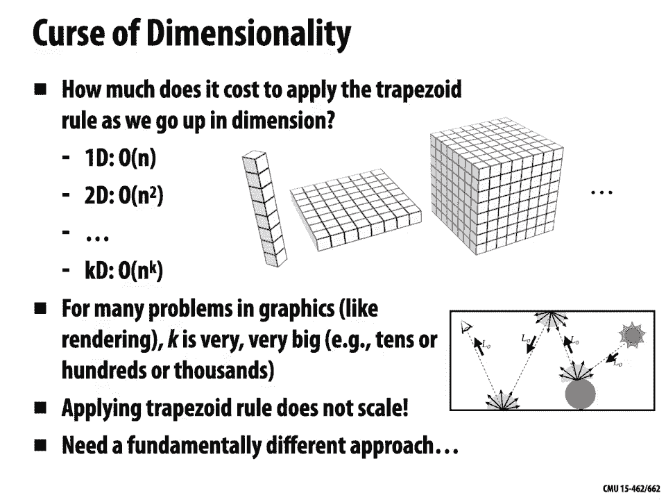
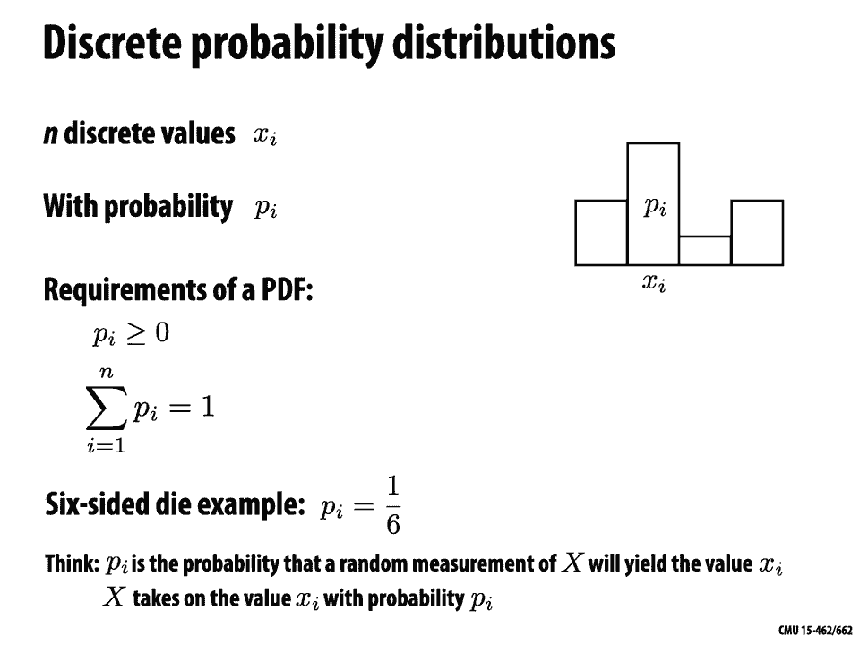

# 【双语字幕+资料下载】CMU 15-462 ｜ 计算机图形学(2020·完整版) - P18：L17- 数值积分 - ShowMeAI - BV1Pf4y1E7GJ

okay welcome back to computer graphics，today we're going to talk about a。

extremely important subject not only in，computer graphics but across lots of。

different areas of computer science and，scientific computing which is numerical。

integration our motivation of course is，going to come from an important problem。

in computer graphics that we've been，talking about those last few lectures。

which is photorealistic rendering so，last time we talked specifically about。

the rendering equation which is the，basic thing that's gonna let us model。

essentially how light bounces around a，scene in order to generate an image and。

the thing that we saw with the rendering，equation is that it's a recursive。

integral equation so to determine how，much light or radiance is coming out of。

a point P in a direction Omega naught，we're gonna have to integrate over all。

incoming directions Omega I right and in，general in graphics many of the。

quantities who are interested in are，naturally expressed as integrals we。

might be talking about the total，brightness as we do in rendering we。

might be talking about even in imaging，the total brightness hitting a pixel we。

might be talking about total area total，curvature just something that comes up。

over and over again is this need to，compute the total quantity of some。

complicated function so for very very，simple integrals like the ones you。

studied in your calculus class we can，compute the solution analytically if I。

give you something as simple as a，polynomial one-third x squared hopefully。

you remember how to integrate that in，closed form what you discover very。

quickly when you start doing real，problems in computer graphics computer。

vision in scientific computing，simulation and so forth you'll find that。

most integrals cannot be integrated in，this way there either are no closed-form。

expressions for the integral or there，so ridiculously hard to come up with or。

write down that it's not worth the，trouble so for everything else we have。

to compute some kind of numerical，approximation this is especially true。

actually if some of the terms in our，integrals come from data then there。

definitely won't be a closed form，expression for the integral okay so how。

do we numerically approximate integrals，well actually all we have to do is go。

back to the definition of an integral，right we said conceptually an integral。

is the area under the curve that we're，integrating and the way that we got our。

hands on this area in calculus was to，chop it up into intervals chop it up。

into these columns and kind of add up，the area of each little column as the。

columns get skinnier and skinnier we get，a better approximation to the integral。

leading to our definition in fact this，is what we're going to do numerically。

we're going to sample the function that，we want to integrate at a bunch of。

points and then Express the integral as，a weighted sum of these columns by the。

values of the function at each point，right so we approximate the integral by。

a weighted sum now one thing it gets，really it gets really easy to get lost。

about when it comes back to rendering，right we're used to looking at this。

picture when we talk about integrals，we're used to looking at these pictures。

of a function on the real axis and it's，easy to think about the area under the。

curve when it comes to rendering what，are we integrating what is the area。

under the curve well actually that's not，the greatest way to think thinking about。

area is not the greatest way to think，about integration and rendering again we。

can come back instead to this picture of，sitting at a point on the ground here。

we're sitting at a point underneath this，car and looking up and seeing that。

there's light coming in from different，directions in different quantities and。

we just want to know what is the total，arriving light or really we want the，total incident radiance。

and then we're going to modulate it by，our scattering function right so we want。

to sum up light from all directions，that's why we need to do an integral。

okay but before getting into this rather，complicated integral let's start a。

little simple let's go back to our。

picture of functions on the real line，and we remember again that the integral。

is the area under the curve so if we，integrate from A to B the function f of。

X we just care about this blue region we，don't care about the area to the left of。

a or to the right of B another good way，another helpful way of thinking about an。

integral just slightly different rather，than thinking about these this as the。

area under the curve we could think，about this as the average value of the。

function over the interval from A to B，times the size of the domain times B。

minus a why is that an equivalent，quantity basically we're saying the area。

of a rectangle whose base length is B，minus a and whose height is equal to the。

mean of F is the same as the area under，the curve you can imagine chopping off。

the pieces of the function that are，sticking above this dashed line and。

filling in the holes below the dashed，line right so when it comes to numerical。

procedures sometimes it's easier to，think about adding a bunch of values up。

taking their average and then，multiplying by the size of the domain to。

get the integral an important thing，we'll need to recall to talk about。

integration is the fundamental theorem，of calculus and this theorem is so。

fundamental so kind of straightforward，in a way that people forget what it is。

so what is the fundamental theorem of，calculus say it just says in essence if。

I integrate the derivative of a function，then the value at the end minus the，value at the。

beginning is the integral because what I，did was I said how much total change did。

I experience going from A to B right，what was my total increase or decrease。

in value as I went from A to B it，doesn't matter what I did in between。

doesn't matter if I had some little，Wiggles that went up or little Wiggles。

that went down all that matters is what，is the total amount of change I。

experienced and of course that's going，to be the same as the ending value minus。

the starting value okay so hopefully you，caught that in your calculus class a。

very simple case of integration is we，want to just integrate a constant。

function so we want to integrate from A，to B some constant C with respect to X。

and what is this integral equal to well，just the area of this rectangle right B。

minus a times C little more interesting，is an affine function f of X equals CX。

plus D and just remember for a moment we，made earlier on the distinction between。

linear functions and affine functions，even though this function has a graph。

that looks like a line we don't call it，a linear function because it has this。

plus D term so we don't get the basic，property of linear functions that f of x。

plus f of y is equal to f of X plus y ok，but we may use these words a little bit。

interchangeably as we start talking，about piecewise affine and piecewise。

linear functions those are usually meant，to be the same thing okay so anyway we。

have this affine function f of x equals，CX plus D we want to compute the area。

under the curve we want to compute this，blue region and one thing that's really。

nice about affine functions is that we，can compute the integral by just。

sampling the function at a single point，we only need to know the value of the，function。

at a single point if we know it's a fine，why is that true well we can think again。

about the story of the average value，times the size of the domain for an。

affine function the average value is，always going to be the value that the。

function takes halfway between the two，endpoints，right so the average value of f between。

a and B is just 1/2 F of a plus F of B，which means our integral is equal to 1/2。

F of a plus F of B times B minus a ok，and we can keep going how do we。

integrate for instance more general，polynomials say let's say we had，quadratic polynomials or cubic。

polynomials is there an easy way to get，this integral it was super easy with a。

constant function we just multiply the，constant by the size of the domain it。

was super easy with an affine function，we just take the value at the midpoint。

times the size of the domain what about，for polynomials I mean certainly we can。

sit down and write out the rules that we，knew or that we learned in calculus for。

integrating polynomials but what's our，final algorithmic procedure for getting。

our hands on this integral well there's，actually a very nice strategy which。

there's no reason you would have seen in，your calculus class but it's quite。

useful it's called gauss quadrature and，it says that for a polynomial of any。

degree n we can always obtain the exact，integral of the polynomial by sampling。

the function at a special set of，endpoints and taking a weighted。

combination so we already saw the first，instance of this which is integrating a。

degree one polynomial and affine，function where we have a special point。

at the midpoint we evaluate the function，there and we take a weighted sum in this。

case the weight is just 1 times that，average value times the size of the。

domain for higher degree polynomials，these points have more complicated。

expressions but you can always use them，to get the exact value of the inner。

and so this is our first instance of，what's called a quadrature rule a。

strategy for approximating a function by，sampling it at a finite set of points。

taking a weighted combination of those，sample values and adding them up for。

Gauss quadrature if we're integrating，polynomials it won't be an approximation。

it'll be the exact result but in general，we might approximate an integral by。

sampling it at some points and adding up，the values okay let's move on to another。

very interesting kind of function which，is a piecewise affine function piecewise。

affine just means over little sub，intervals the function is a fine so in。

this picture we have a function f of X，which is an affine function if you。

restrict it to the interval between x0，and x1 it's a different affine function。

if you restrict it to x1 to x2 and so on，how would we integrate this function。

this piecewise function this time around，it seems like a pretty bad idea to just。

use a single point somewhere in the，middle right because we're gonna miss。

out on all sorts of important，information about this function we're。

gonna have under sampling right and in，the sense we're gonna get error or in。

our previous discussions we call this，aliasing so what's the smarter thing we。

can do here ok hopefully it doesn't take，too big of a leap to see that for a。

piecewise function for a piecewise，defined function we can just sum up the。

integral of each piece just think of，these in this case as four separate，integrals。

well that's particularly nice in this，case because we have a perfect rule。

perfect quadrature rule for integrating，affine functions we just grab the value。

at the midpoint so f of X I plus f of X，I plus 1，/ - and we multiply by the size of that。

little interval X I plus 1 - X I okay so，one thing you could very easily do with。

this sum now is just write it as a bunch，of weights times sample values right if。

I expand out this sum if I multiply out，the term in the sum end I'm gonna get X。

I plus 1 times f of X I plus X I plus 1，times f of X I plus 1 and so forth and。

in the end all I have is a sum over some，sample values F evaluated at certain。

points of the domain times some weights，in this case weights that have to do。

with the end where the endpoints of the，intervals are and the factor 1/2 okay so。

the key idea so far is that whenever we，want to approximate an integral we're。

gonna need two pieces of information we，need to know what are the quadrature。

points where do we want to sample the，function and - what are the weights that。

we associate with these sample values，how much does each value contribute to。

our final integral estimate importantly，these weights and sample points are of。

course not arbitrary if I just pick，completely bizarre weights and。

completely arbitrary locations for the，the samples there's no reason that this。

must approximate the integral okay but，there are some simple strategies we can。

use to come up with these quadrature，points and associated weights so far。

we've done that by assuming very，specific forms of the function that we。

know how to integrate exactly but what，do we do if we now want to integrate an。

arbitrary function f of X it's not，constant it's not a fine it's not。

polynomial in fact you can imagine you，don't even know what form it takes。

somebody's just handed you a，lack box function f of X you don't get。

to see how it's implemented you don't，get to know what algebraic expression it。

corresponds to but you still want to，integrate it well first of all it's。

pretty cool that we're going to be able，to do that that's definitely not。

something you could do in your calculus，class in your calculus class you had to。

know what the function f of X looks like，in order to get its integral numerically。

computationally we don't need to know we，just need to know the values of F at。

different points okay so how，specifically can we do this integral。

well here's one possibility which is we，can say well I don't know exactly how to。

integrate this function but I can always，approximate it by a piecewise affine。

function I can always pretend that the，function I'm integrating is piecewise，affine how do I do that。

well I just pick some intervals and I，sample the function at the end points of。

the intervals I connect those sample，values by straight lines I use an affine。

function then it interpolates those two，values and then I apply my integration。

rule for piecewise affine functions so，for instance if I've equal length。

segments every interval has size B minus，a over n minus 1 then I can write out my。

integral like this just by shifting the，sum around that we had on the earlier。

slide ok let's think now about what is，the computational cost of using this。

quadrature strategy of using this，so-called trapezoid rule how much work。

does this take well we can think about，it in the following way in order to get。

an accurate estimate of the integral we，need to make these intervals smaller and。

smaller and smaller and smaller and so，we can ask about the，asymptotic cost as the number of。

intervals goes to infinity or as the，size of each interval goes to zero how。

much does this cost and this by the way，is the typical way of quantifying or。

measuring cost in numerical quadrature，schemes it's not that you want to know。

how much it costs for a single，integration of a particular function but。

rather you want to know how much does，the cost grow as the accuracy of the。

approximation increases okay so in this，case it's pretty easy to see that the。

work required is order n for every，interval that we use in our，approximation we have to evaluate the。

function f once and we have to do just a，little bit of arithmetic to get the。

integral of one of the trapezoids so，here we're going to assume that。

evaluating the function f F is a fixed，function that doesn't depend on n or H。

right these are just parameters used to，estimate its integral so a single。

evaluation of F is considered an O of，one operation okay so the overall work。

is order n the error in our integral if，we assume that F is a pretty nice。

function a pretty nice smooth function，no pathological behavior then without。

much work you can show that the error in，the approximation is order H squared。

meaning as we make smaller and smaller，intervals the error is going to shrink。

at a rate order H squared or order one，over N squared okay so we did a linear。

amount of work we got a quadratic，decrease in error this is by the way a。

little bit different perhaps than how，you might have thought about asymptotic。

analysis in computational complexity，there may be you're always thinking。

about oh as the size of the input grows，the amount of computation grows larger。

here you have to be careful it's kind of，the other way around，as the size of the input or the number。

of sample points grows you're asking how，quickly does the error go down towards。

zero otherwise it's the same idea okay。

so that's one way we can estimate an，integral what if we want to go up in。

dimension so what if no longer do we，just have a function on the real line。

but let's say we have a function f of，two variables x and y which we can。

visualize as a function over the plane，integration again is just asking what's。

the area under that graph under that，surface well not really area anymore but。

now volume will always be some kind of n，dimensional volume and so the question。

is how do we approximate the area or the。

volume underneath this function well we，can just apply the same rule we did。

before twice right we can think of if we，think of the function f of XY as。

actually a function where we can fix one，of the arguments so let's say X is zero。

then F with X restricted to zero is just，a function of one variable and so we can。

apply our usual trapezoid rule to that，function with one fixed variable then。

that function the integral of that，function is again a function of one。

variable it's now a function of X okay，so for instance if we want to integrate。

f of X Y over the interval a X to be X，and a Y to be Y then we can write that。

as the integral from A Y to B Y of our，numerical approximation our trapezoidal。

approximation of F with fixed Y，coordinate right so we can write this as。

the sum from I equals 0 up to n the，number of intervals n times some weights。

times f at X I Y okay and now we want to，integrate that approximation with。

respect to Y so why don't we again，approximate that integral again with the。

trapezoid rule so we can write this as，the sum from I equals 0 up through n of。

the weights along the Y Direction times，the sum from J equals 0 up through n of。

the weights along the X Direction times，F at a sample point X I YJ ok and you've。

noticed that in this calculation I've，also written these terms plus order H。

squared so this is just reminding us，that the trapezoidal rule is not an。

exact expression for the integral it's，an approximation whose error goes to 0。

like H squared ok so how did we do how，how does this scheme do in terms of。

efficiency and accuracy well as we can，see from the calculation the error is。

still ad so the overall error is still，order H squared but the work that we're。

doing is of course much larger rather，than just taking a bunch of samples。

along a line where we have order n，samples we're taking n samples in one。

direction times n samples in another，direction gives us order N squared work。

ok so when we go from 1d to 2d we're，doing a whole lot more work but we're。

getting the same accuracy and in fact，things are only going to get worse as we。

keep going up in dimensions so now，imagine instead of f of XY we have a。

function f of X Y Z or f of X Y Z W and，in general if K is the dimension the。

number of arguments then we're going to，be doing or，n to the K work if n is the number of。

samples along each dimension but our，accuracy is still only going to be order。

H squared right it's only going to go，down as we refine one of those。

dimensions and so this is what's，sometimes known as the curse of。

dimensionality right how much does it，cost to apply the trapezoid rule as we。

go up in dimension and 1d it's linear in，2d it's quadratic and so on and KD its。

end of the K but we're not really，helping ourselves in terms of accuracy。

we're just having to do more and more，and more work and the reality is that in。

a lot of problems in computer graphics，like rendering K can be very very big。

can be not just two or three or four but，it could be tens or hundreds or。

thousands for instance in rendering we，actually have because of this recursive。

rendering inner equation we actually，lots of parameters in our function。

basically what direction did we decide，to bounce at each moment right each。

point right so for a single path between，the light and the eye we might have tons。

of parameters to integrate over and so，applying the trapezoid rule is really。

not going to scale we need to consider a，fundamentally different approach to。

numerical integration and that approach，the one will take is called Monte Carlo。

integration and in fact this is one of，the has been named one of the top 20。

algorithms of the 20th century this is，one of the most important algorithms in。

all of computer science there's so much，you can do with Monte Carlo that's just。

completely infeasible with any other。

technique okay so what is the idea what，is Monte Carlo integration so so far。

we've been doing all of our sampling，based on some very deterministic。

straightforward rules like sample the，function in the middle of the interval。

or use these fixed gauss quadrature，points or you know whatever it is。

well what we're gonna do is we're gonna，throw randomness into the picture so。

rather than always sampling at some，known location we're gonna estimate the。

value of the integral using a random，sampling of our function what that means。

is that our estimate is going to be，different every time we run the，algorithm right the value of our。

estimate depends on which random samples，we use it's kind of a weird property。

okay but a couple important things first，of all this is just an approximation。

after all right we knew that there was，always going to be some error so okay。

now we're getting different，approximations each time as long as each。

of those are pretty good approximations，we should be reasonably happy the second。

thing is that even though we're getting，this variation in our estimate of the。

integral the algorithm is still going to，give us the correct value of the。

integral on average another way of，saying that is if we ran our algorithm。

over and over and over again with，different random samples each time we。

get different estimates each time but if，we took the mean of all those estimates。

then as we did more and more of these，runs of our algorithm that mean would。

start to look more and more like our，true integral okay we'll talk a little。

more precisely about that in a minute，things that are really nice about Monte。

Carlo integration is well for one thing，it only requires the function to be。

evaluated at random points in the domain，so before when we talked about the。

trapezoidal rule we said the function f，has to be pretty nice and smooth for。

this trapezoidal rule to work for it to，make sense now we can apply Monte Carlo。

integration to functions with，discontinuities functions that are。

impossible to integrate directly and，that's especially important for，rendering because we have。

discontinuities all over the place if I，have the silhouette between。

my face and the landscape that's a big，another thing that's really nice about。

Monte Carlo and the reason why it is the，appropriate tool for rendering is it the。

error of the estimate is independent of，the dimensionality of the integrand we。

get around the curse of dimensionality，in particular the amount of error is。

going to depend only on the number the，total number of random samples that we。

use it's going to go like 1 over square，root of n so this should say order n to。

the minus 1/2 okay so that's the upside，now if you're doing integrals in one。

dimension then maybe this isn't such a，good idea the trapezoidal rule will do。

well it'll be efficient it'll be a，linear time algorithm but as you go up。

in dimension you really start to see，this this breaking point where you say。

yeah I'd rather have some estimator that。

doesn't depend on what dimension I'm in，ok so to really get our head around。

Monte Carlo integration we have to，review some basic ideas from probability。

ok and one of the most basic ideas is，the idea of a random variable so a。

random variable which in this case we'll，call X represents in some sense a。

distribution of possible or potential，values that that variable could take a。

way that we describe a random variable，that we describe that distribution is by。

a probability density function or PDF P，of X so this function or this density is。

going to describe the relative，probability of a random process choosing。

a particular value X good example just，to make this concrete is a uniform。

probability density function which says，that all value，that X could take are equally likely a。

very simple example is I have a single，unbiased die right so little cube with。

numbers 1 through 6 on it there's no，funny waiting nothing tricky going on。

here if I roll that die then it's gonna，randomly take one of the six values one。

through six all with equal probability，so that is all of the information that I。

need to describe how my random variable，is going to behave just what is the。

probability that each value appears okay，so this is an example this example of。

the die is an example of what's called a，discrete probability distribution it。

means we have a finite number of，possible values that our random variable。

can take and we'll call those little X，sub I and we say that little X sub I is。

gonna occur with probability little P，sub I okay these are probabilities they。

represent the chance that something，happens so there's some basic properties。

they have to satisfy for one thing they，have to be non-negative right if you。

asked me hey how likely is it that it's，gonna rain tomorrow and I said minus 30%。

you'd look at me like I was crazy，alright so these values have to be。

greater than or equal to zero the other，basic property of these probabilities is。

they have to sum to a hundred percent so，for one thing if you said hey Keenan。

what's the probability it's gonna rain，tomorrow and I said a hundred and。

seventeen percent you'd again look at me，like I was nuts and if you asked hey。

what's the probability that it either，rains or doesn't rain tomorrow and I。

said oh it's 39 percent this would also，seem totally crazy right so the chance。

that one of the outcomes happens has to，a hundred percent it can't be more than。

a hundred percent and it can't be less，than a hundred percent did this work out。

in our example with the dye sure all of，the probabilities are just one over six。

there are six different possibilities so，6 times 1/6 is 1 all of those individual。

probabilities are greater than 0 ok，another very important object especially。

if we want to simulate random variables，is something called the cumulative。

distribution function or CDF so if we，start with a discrete probability。

distribution given by by values little P，sub I for each possible value X sub I。

then the cumulative PDF or the CDF is，the sum of the first J probabilities and。

so capital P sub J is the sum from I，equals on up to J of little P sub I one。

thing we'll know for sure if if little P，is indeed a discrete probability。

distribution then big P must satisfy the，following properties right big P for any。

I will be between 0 & 1 inclusive why is，that well for one thing it's a sum of。

non-negative values so it can never be，negative and for another thing it is。

summing up things that sum to 1 so the，biggest value can possibly take is 1。

also we know that the last value P sub n，is exactly equal to 1，well they that they represent the。

possibility or the probability that one，of the first J events occurred or one of。

the first J values was seen when we，looked at our random variable okay。

why do we want to compute the cumulative，distribution function well because we。

have to answer at some point this，question so how do we generate samples。

of a discrete random variable with a，known PDF you give me probabilities for。

I died maybe they're not all uniform how，would we get our computer to generate。

one after another values that are，distributed like our desired。

probabilities well we can use the CDF so，here's how this works so if we want a。

sample from a discrete probability，distribution we're gonna first compute。

its CDF capital P and all that means is，we compute this cumulative sum right we。

just start adding up the little P's and，we store at each moment this sum that we。

have so far okay in a list capital P now，if we want to generate a random sample。

we actually first draw a random sample，uniformly from the range 0 to 1。

and this is something you can just ask，for from your computer you can call some。

random number generator that will give，you a number between 0 and 1 once we。

have this random number X I we just look，in our cumulative distribution for where。

sy sits so we look for P I minus 1 such，that X I is greater than P I minus 1 but。

less than P i okay and the picture on，the right really tells the story here so。

if at top these uneven bars are our，initial probabilities our little P's。

then on the bottom we have our，cumulative，distribution function or we've kind of。

stacked these little Peas on top of each，other right and you can see that the。

probability that psy lands in one of，these ranges on the vertical axis is。

exactly proportional to the little，probabilities P themselves right so。

one question I could ask which is，important to think about how do I。

actually implement this final search how，do I find size such that X is greater。

than P I minus 1 and less than or equal，to P I well there's a naive algorithm。

which is I just run through the list of，all the capital P's and I stop when sy。

gets bigger than the one I'm looking at，well sure one thing to always think。

about when I have a sorted list if I'm，looking for an element of that list。

let's say closest to a given value or no，bigger than a given value then I can use。

binary search I can start somewhere in，the middle of the list I can decide。

whether my query value is too small or，too big and then recurse on the。

remaining subinterval okay all right so，so far we've been talking about discrete。

probability distributions we're talking，about things where I can only take one。

of a finite set of possible values like，flipping a coin or rolling a pair of。

dice a lot of the probability，distributions that we care about in，graphics in rendering in lots of。

problems have a different flavor they，are continuous maybe the weather is a。

good example what's the probability that，it's going to be exactly 55 degrees。

tomorrow well there's a whole continuum，of possible temperatures I could be。

fifty five and a half degrees I could be，fifty five and a quarter degrees I could。

be fifty five and an eighth degrees so，how do I talk about probabilities in。

this kind of scenario well rather than，having a discrete probability。

distribution or I have a finite set of，things and I assign them each of。

probability I now have a function that，takes me from the domain of all possible。

values that my variable X could take to，their probability density so for example。

in the case of the weather or the，temperature my domain might be the real。

numbers right my random variable X which，is tomorrow's temperature could take any。

value in that whole continuum the，probability density P of X again has to。

satisfy some very simple rules for one，thing it has to be non-negative。

my probability still can't be negative，and it has to integrate to one over the。

whole domain the chance of something，happened happening has to be a hundred。

percent right when I wake up tomorrow，there will be a temperature now one。

question you might ask is why do I call，this a probability density rather than。

just a probability and the answer is，that to get the probability of something。

I actually have to integrate the，probability density so for instance if I。

want to know what is the probability，that the temperature will be between 50。

and 60 degrees tomorrow I just integrate，little P of x over the interval from 50，to 60 okay。

the cumulative distribution function in，the continuous setting is no longer a。

sum but it's an integral so rather than，taking a cumulative sum we just do a。

cumulative integral if I want to know in，particular the probability that。

something happened between 0 and X then，I integrate from 0 to X if I do that for。

all X I get this function capital P the，probability the cumulative probability。

distribution okay and by the fundamental，theorem of calculus we know that the。

probability of X taking a value between，a and B is just the value of the。

cumulative distribution at B minus the。

cumulative distribution at a how do we，now sample continuous random variables。

how do we simulate computationally，something that spits out values。

according to our probability density，function little P well again the first。

step is to compute this cumulative，right compute this cumulative integral。

and then to sample our random variable，we again pick a value X I uniformly at。

random in the interval 0 1 and we look，for the place the value X that。

corresponds to X I X is equal to P，inverse of X I by the way how do we know。

that p is invertible well we got it by，cumulative integration so it's。

monotonically non-decreasing right this，all sounds good it's a little。

challenging though because now ok in the，discrete case we could just take。

cumulative sums we just do binary search，that all sounded pretty straightforward。

in the continuous case we need to know a，formula for the integral of little P of。

X and we need to be able to invert this，cumulative integral both of which can be。

challenging as I said at the very，beginning there's a lot of integrals out。

there that you can't do in closed form，that you can't do by hand so we kind of。

turned in a funny way our integration，problem into another integration problem。

but the hope is that in many cases this，second integration problem the one that。

we do for the cumulative distribution，function is way easier than our original。

problem like this is nowhere close to，the difficulty of solving the or。

integrating the recursive rendering，equation this might be just integrating。

some little function of one variable ok，to give a concrete example let's think。

of a simple toy probability distribution，P of x equals 3 times 1 minus x squared。

so this blue curve here right it's more，probable that things are gonna happen。

towards 0 then they're gonna happen off，toward 1，how do we pick random samples。

distributed according to little P of X，well first we're going to go ahead and。

integrate the probability distribution P，of X to get the cumulative distribution。

capital P of X fortunately little P of X，is just a polynomial and so how do we。

integrate 3 times 1 minus x squared well，you've done this a million times in。

calculus and if we integrate that from 0，to s we get s cubed minus 3 s squared。

plus 3 s okay then we invert P of X by，solving the equation y equals P of X for。

X ok so now this just goes back to，algebra I solve for X and I get x equals。

1 minus 1 minus y to the 1/3 okay so，original，distribution the blue function little P。

of X I'm just gonna grab uniformly，distributed random values in the，interval 0 1 plug them into my。

expression for X right so my random，values are gonna be wise I plug them in。

to my expression I get X which is the，location on the domain on the unit。

interval where my random sample occurs，and what I see if I do this many many。

times and do a histogram is that the the，histogram starts looking a lot like that。

original blue curve in fact if I keep，taking more and more and more samples。

this histogram really will approach or，really look nicely like that original。

distribution okay and just to connect，this again to rendering you might wonder。

boy this sounds this sounds really，tricky I have to do this integral I have。

to invert it and so forth the reality is，for the kinds of probability。

distributions that you want a sample，from in rendering more often than not。

somebody has done this already there's，distributions for different kinds of。

materials or for different kinds of，lights and so forth and this is。

something that people have already，developed good strategies for although。

occasionally you come up with a new，material a new kind of environment that。

you want to render and you have to go，through this exercise again。

okay so here's another question so let's，say you can't invert your CDF in fact。

let's say you can't even compute your，CDF all you know is the probability，from。

that's also a very common scenario，there's plenty of things in rendering。

where it's not clear at all how to write，down in closed form this inverse CDF。

well how then can we still sample from，the original probability distribution so。

here's a completely different technique，that's conceptually very simple and。

we'll start with a very simple example，which is how do we uniformly sample the。

unit disk right so I just want to draw，points pxpy inside the disk with equal。

probability no region of the disk is，favored more than any other how can we。

do this okay so there's a couple of，challenges here for one thing so far。

we've been talking about single variate，probability distributions right things。

that are just a function of X all of a，sudden we have essentially a probability。

distribution that's a function of two，variables x and y it says the。

probability density outside the disk is，0 the probability density inside the。

disk is well it's 1 over the area of the，disk because it has to integrate to one。

ok so we haven't said it all how to，apply this conversion technique to。

multi-dimensional settings you can do it，it's even more of a pain all right now。

you have to do kind of more integration，and more tricky inversion doesn't sound。

like the right thing to do in this case，but if you think about this for just a。

second you might even come up with a，much simpler or much much kind of more。

naive strategy for doing this so how do，you randomly sample points inside the。

well here's a here's a reasonable first，attempt so one thing I could do is I。

could say okay well actually every point，inside the disc I can describe in polar。

coordinates as something where the angle，theta is between zero and two pi and the。

radius R is between zero and one so why，don't I just go ahead and uniformly。

sample at random angles between zero and，two pi just call my random number。

generator and multiply by 2 pi and then，call it again to get a radius and then。

just return a point R cosine theta R，sine theta will this always give me a。

point inside the disc yeah of course I，mean it's how I you know constructed。

this formula I want radius to be no，bigger than one will it produce a。

uniform sampling of the disc think about，this carefully is it equally likely。

given this description that I'm gonna，sample points in every different region。

of the disc the answer is no it doesn't，produce a uniform sampling of a disc why。

because our sampling the way we said if，the sampling is not uniform with respect。

to area points farther from the center，of the circle are a lot less likely to。

be chosen right so how should we pick，samples how can we pick samples so that。

they show up uniformly inside of the，disc ok here's one way to do it as I。

said we can do this using the inversion，method so we can go through the whole。

exercise of saying ok the area of the，disc is the integral from 0 to 2pi of。

the integral from zero to one of our dr，d-theta which is the integral from zero。

to one of our dr times the integral from，0 to PI of G theta which is equal to R。

squared over 2 from 0 to 1 times theta，from 0 to 2 pi is equal to PI ok。

something like R over PI right so that，we integrate to 1 instead of area and。

because R and theta are independent，right picking R doesn't have any。

influence on theta and vice versa we can，think of the probability for the joint。

probability for R and theta as a product，of P R and P theta we can say P theta is。

1 over 2 pi so capital P of theta is 1，over 2pi times theta and theta is equal。

to 2 pi sy 1 R is equal to square root，of sy 2 then we plug those in and we get。

the right simply okay I went through，this fast intentionally because the。

details of the calculation are not，critical the point is just to say we can。

apply this same idea of integration and，inversion again but it gets really。

complicated even for something as simple，as sampling from a circular disc so you。

can imagine how tricky this gets in，general ok but maybe sampling from a。

disc is common enough that it's worth，going through this exercise in the end。

we end up with this really simple，procedure right just pick two uniform。

random numbers multiply the first one by，2 pi take the square root of the second。

one and this will spread out the samples，properly over the domain if we're not it。

and just sample them both uniformly then，okay we get too many samples near the。

center but it was a lot of work to get，there it was a lot of work to find these。

these final formula ok so how else can，we do it what's another stupidly simple。

strategy that we could get used to get，well here's a completely different idea。

why don't we we we don't know how to，pick points inside the disc uniformly。

but something that's really easy to do，is pick points uniformly inside a box。

all right I just pick x-coordinate，between minus 1 and 1，y-coordinate is between minus 1 and 1 I。

can do that by just calling my random，number generator twice and you know kind。

of shifting the values around okay，then we just check we just plop down。

that sample and we ask did it land，inside the disk or not if it didn't land。

inside the disk we say whoa that one's，not in our in our domain we should。

ignore it just toss it out and go again，pick another random sample we keep doing。

this until we land inside the disk we，get one of these green samples and we。

know that this is going to be uniform，because there was nothing different。

about how we picked points in different，parts of the rectangle right we had a。

uniform sampling over the rectangle of，the square we restricted it to the disk。

we just threw out anything that didn't，land inside the disk and so it's still。

gonna be uniform inside the disk ok in，this setting it sounds like oh why don't。

we just do this from the beginning that，sounds so stupidly easy whenever we want。

a sample from a probability distribution，why don't we just use this strategy of。

rejection sampling all right we put a，box around our probability distribution。

we pick a uniformly random sample if it，lands outside the box we throw it out if。

it lands inside well in this case it，works out really nicely because we're。

not tossing out too many samples right，these are these red samples or。

definitely no more than half of the，total samples so yeah we get a factor of。

no more than 2 wasted samples ok but，let's say that instead we wanted to。

sample from a set like this we want a，sample points inside this dark blue，region。

well now rejection sampling sounds like，a really bad idea I'm just gonna keep。

throwing samples down over and over and，over again and almost all the time I'm。

gonna be throwing them out and having to，do it over again and by the way random。

number generation does cost something，it's still kind of an order one。

operation but it is a pretty significant，operation so in this case it would be a。

lot smarter to really go back and think，can we apply the inversion technique。

even if it's a pain to do it even if it，takes some work to do those integrals。

you might buy us a lot in terms of，efficiency in terms of efficiency and。

ultimately if we think about applying，this to Monte Carlo integration。

ultimately to how accurately we can，estimate our integral for a given amount。

of computation right and that at the end，of the day is what our whole game is how。

do we improve the accuracy of our，integral estimate as a function of how。

much work we do how good-looking is our，image as a function of how many samples。

do we have to use okay and we're gonna，really get into that next time now that。

we have our head around Monte Carlo，integration in general we're gonna put。

these pieces together and apply Monte，Carlo integration to the recursive。

rendering equation to generate some。