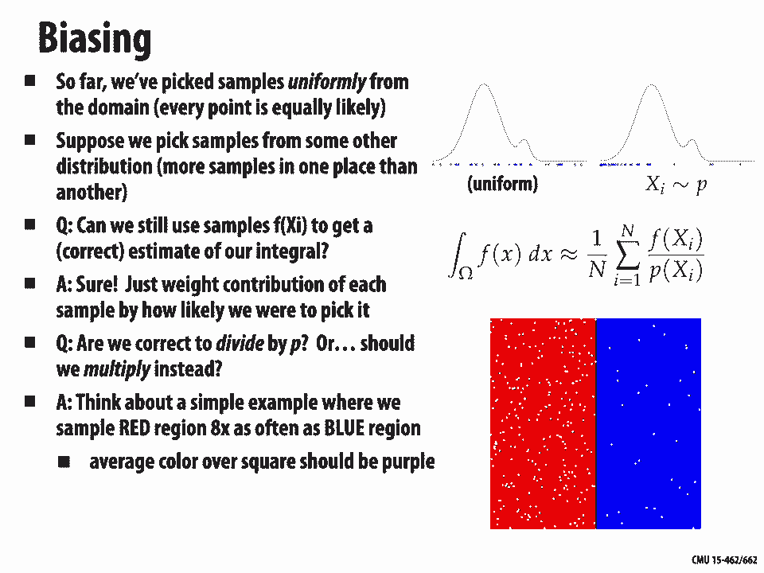
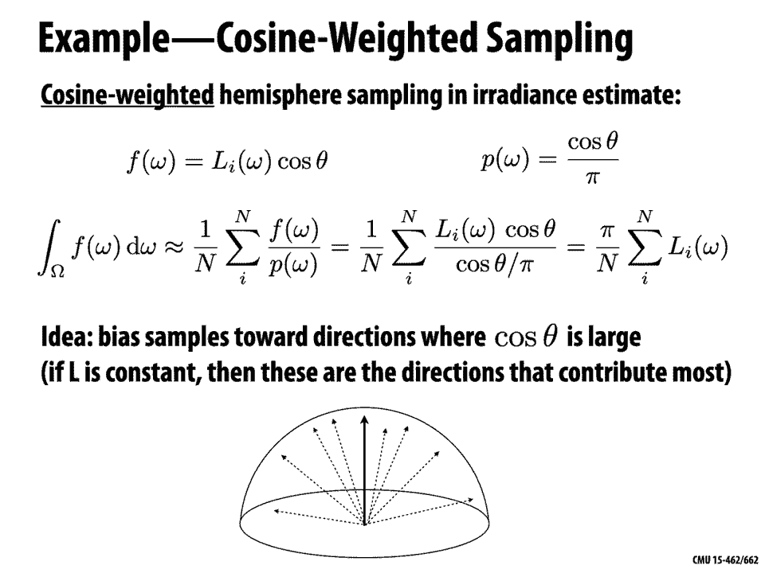
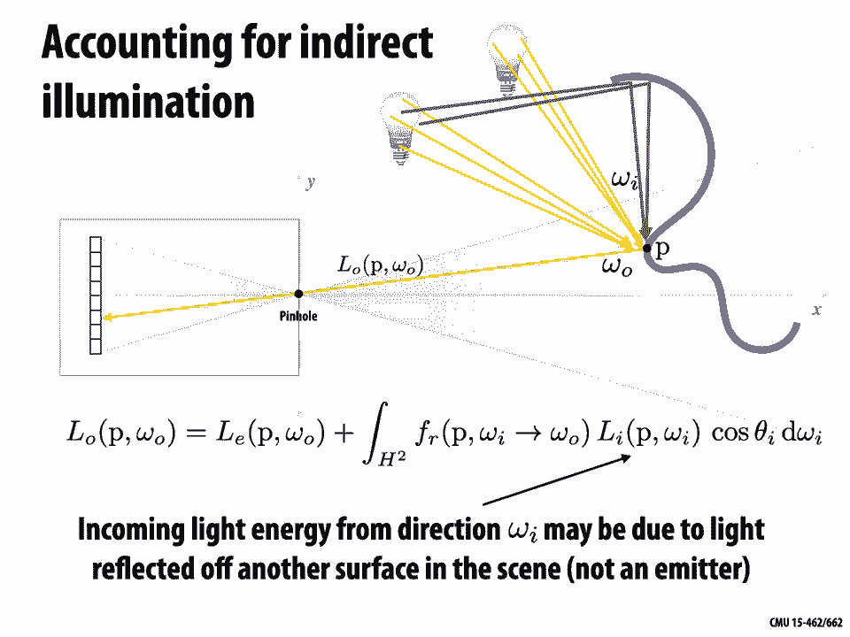

# 【双语字幕+资料下载】CMU 15-462 ｜ 计算机图形学(2020·完整版) - P19：L18- 蒙特卡罗渲染 - ShowMeAI - BV1Pf4y1E7GJ

[Music]，welcome to computer graphics today we're。

gonna talk about Monte Carlo rendering，so we're really getting to this final。

core question of how do we render how do，we generate photorealistic images so for。

instance this image you see here is not，a photograph it is a completely。

synthetic image created starting from 3d，models and running through algorithms。

like the ones we'll talk about today and，generating a picture like this really。

puts together a lot of the ideas that，we've studied in this class our。

discussion of colors of how to talk，about material models of how to measure。

quantities of light radiometry of how to，do numerical integration like we talked。

about in our last lecture we're going to，need geometric queries especially ray。

tracing we're gonna need spatial data，structures to accelerate those queries。

and finally we're gonna bring all that，together in the rendering equation to。

figure out what are the final color，values for pixels in our image okay so。

we're gonna combine this all together to，get our final Monte Carlo rendering。

algorithm and this is in a sense the，second big algorithm we've seen in this。

class for generating images the first，was our whole discussion of，rasterization right a completely。

different path toward image generation，the benefit of doing Monte Carlo。

rendering is we can generate things that，are a lot more realistic a lot more like，a photograph。

usually at much greater cost right so we，have a big quality versus speed。

trade-off but Monte Carlo rendering is，gonna let us render whatever we like to。

be a little more concrete about what are，the inputs and outputs of our。

photorealistic rendering algorithm well，the inputs are going to be a complete。

description of the scene so not just the，geometry of the scene not just where。

things are but also what material each，object is made out of，also a set of light sources and some。

description of how they emit light right，in which directions in which colors and。

so forth and also a camera we have to，talk about what is the final。

illumination going into okay and once we，have all those inputs we're gonna hand。

them off to our ray tracer or our，renderer and it's basic output will be。

an image just a pixel image maybe with，additional data we could output things。

like depth and so forth but our basic。

task is to generate a photorealistic，image of that scene so before we really。

dive into the ray tracing approach let's，look at a little comparison and contrast。

between ray tracing and rasterization so，both of them have the same outputs they。

both generate an image they both have，similar inputs right we have to describe。

the geometry we have to describe in some，way the lights the materials the camera。

so what's the difference same inputs，same outputs well from an algorithmic。

point of view one basic difference is，the order in which we do our computation。

the order in which we process samples so，you'll remember that in rasterization，the high-level。

structure of the algorithm is to loop，over all the primitives maybe all the。

triangles in a mesh for each primitive，we figure out which samples it touches。

which pixels on the screen for instance，and then for each of those samples we。

want to know two things the coverage how，much of that pixel is covered by that。

primitive and the color what color is，sitting under that pixel okay in order。

to determine visibility in order to deal，with occlusion we had something called。

the Z buffer which kept track of the，closest value we'd seen so far the。

closest sample that we'd seen so far and，we just keep the closest one。

in ray-tracing we kind of flip this loop，around right we reorder these two outer。

loops so this time we're going to，iterate over samples we're gonna iterate。

over pixels of the output image and then，at least the naive strategy would be to。

say okay now I'm gonna walk through each，primitive each triangle and see is that。

primitive seen through this pixel is it，visible when I look at this particular。

sample again I need to determine，coverage how much of that pixel is。

covered by the primitives that are seen，and the color and this time if I don't。

want to loop through all of the，primitives I can accelerate this，question of visibility by using a。

spatial data structure like a bounding，volume hierarchy okay so in some sense。

this feels like a superficial change do，we loop over primitives and then samples。

or samples and then primitives but this，little change is going to make a huge。

difference in how sophisticated our，illumination can be right because of the。

structure of these algorithms they're，going to be better or worse at dealing。

with different kinds of illumination so，because a rasterizer processes one。

primitive at a time it's really hard to，answer questions like is triangle a in。

the shadow of triangle be right the，viewpoint of the rasterize are all it。

sees of the world is one triangle coming，down the pipeline at a time a ray tracer。

on the other hand is processing one ray，at a time but that ray knows about。

everything in the scene that it，intersects right each sample knows about。

every primitive and so it becomes really，easy to talk about things like shadows。

or reflections or other global，illumination effects，so here for instance we take the same。

set of objects a sphere a cube a cone，and a plane and we run them through the。

two algorithms rasterization and，ray-tracing same materials same lighting。

same input description and you notice，that ok the images are different so when。

you look at these two images what do you，notice what is in one of the images。

well hopefully you do see some，differences right and and some of them。

are pretty stark for one thing there are，no shadows in the image on the left and。

that makes it really hard to determine，for instance how far above the plane。

these objects are there are no，reflections in the image on the left。

which makes it difficult to appreciate，for instance how close the cone is to，the box。

there's no refraction there's no，transparency on the left so on the Left。

we have no sense that this sphere might，be made out of glass and there are other。

more subtle things going on we'll talk，about indirect illumination the image on。

the right is just slightly brighter than，the one on the left due to light。

bouncing around the scene and eventually，entering the camera okay so it makes a。

pretty different big difference in terms，of the images we can generate which。

algorithm we use I should say you know，as a disclaimer you can do better using。

rasterization over the years people have，come up with different tricks for oh。

here's an approximation for shadows and，here's a kind of hack that looks like。

reflection and here's some cheat that，kind of looks like refraction and。

transparency and so you can build these，effects up one at a time in each case。

there are some gotchas usually some，things that are hard to do and it's。

usually really hard to integrate these，all together at the same time to have。

your reflection trick and your shadow，trip trick and your transparency trick。

all working together and generally what，that means is you're compromising on not。

only the realism of the image but also，maybe the complexity or the kind of。

scene you can render or the scenarios in，which the algorithm will work。

basically these rasterization tricks are，not as general purpose as a。

photorealistic raytracer photorealistic，ray tracers really catch all you hit the。

button it does what it's supposed to，okay and that's what we want to do today。

so to develop a full-blown realistic，renderer we will need to apply。

Monte Carlo integration this technique，we learned about last time to the。

recursive rendering equation the basic，task is for each pixel of our image we。

want to integrate all the incoming light，to be more precise what what are exactly。

are we integrating we're integrating all，the illumination or all the radiance。

incident on that pixel over all possible，different paths of light coming from a。

light source coming from something，emissive into our camera okay when we。

talk about a sample in this context if，we're really thinking about this whole。

picture of light traveling from light，sources to the camera a single sample is。

actually a whole path of light okay so，we want to integrate over all paths the。

incident illumination here again is our，rendering equation just to remind you a。

little bit about what this means and，what the pieces are at a high level we。

have something on the left equals the，sum of two terms on the right this。

something on the left is how much，illumination how much radiance is。

leaving the point P in the direction of，Omega naught the two terms on the right。

are how much light is being emitted from，that point plus how much light was。

getting reflected off that point so the，first term the emissive term is just。

saying how much light light is emitted，from P in the direction Omega naught the。

second term is saying I want to，integrate over all possible incoming。

directions Omega sub I the incident，radiance L sub I on the point P in the。

direction Omega I times the scattering，how much light got bounced off that。

point in that direction versus how much，got absorbed，right and then we have a cosine theta。

term just to account for the way we。

parameterize integration okay so how do，we approximate this integral well we。

started looking at this idea of Monte，Carlo integration in our last lecture on。

numerical integration and the general，idea of numerical integration was to say。

well most integrals will never be able，to do by hand in closed form so our。

general strategy for approximating an，integral kind of goes back to the。

definition of the integral we grabbed，the value of the function at a bunch of。

points and we take a weighted，combination of those sample values to。

get an estimate for the integral monte，carlo says that one possible strategy。

for choosing sample points and adding，them up is to just do it totally at。

random pick completely random points in，the domain and average all the results。

and in some sense this is kind of a，stupid strategy if we have very special。

functions and so forth we can come up，with better rules but the cool thing。

about Monte Carlo is it works in，it，the other cool thing that we saw about。

Monte Carlo is it gets around the，so-called curse of dimensionality so as。

the dimension of your integral goes up，as you have more and more parameters to。

the functions that you're integrating，the performance doesn't suffer to apply。

this idea to Monte Carlo rendering we're，going to need to flesh out some concepts。

that we didn't really get into last time，about probability in particular we need。

to talk about the expected value and the，variance of a random variable so what。

value do we get on average from a random，variable and what's the expected。

deviation from that average and in the，context of Monte Carlo we'll also want。

to talk about a concept of importance，sampling so how can we be a little more。

intelligent about where we place these，random samples so that we're getting the。

most out of our computation，we put samples in more important regions。

of the integrand on the bottom we have，the statement of our basic rule for。

Monte Carlo integration it says if we're，trying to get the value of the integral。

on the right we want to integrate the，function f over a domain Omega then what。

we should do is take more and more and，more random samples X sub I so just pick。

random points in the domain of F grab，the value of F at those points add them。

up divide by the number of samples n and，multiplied by the size of the domain。

Omega okay and this average times volume，will converge to the integral as long as。

F is sufficiently nice doesn't have to。

be very nice but for most functions this，will work，alright so basic concept in probability。

is the expected value the intuitive idea，to remember whenever somebody says。

expected value is what value does the，random variable take on average if I。

keep getting values out of this random，variable what will the average value be。

so in particular if I have a random，variable Y then its expected value a of。

Y can be obtained by summing over the，possible outcomes so in this case this。

is a discrete random variable so I'm，going to sum over all K possible。

outcomes the probability of each outcome，occurring times the value of that。

outcome I'm just taking a weighted，average of the possible values where the。

weights are given by the probabilities，as a simple example we'll consider a。

fair coin where heads is equal to 1 and，tails is equal to 0 all right so I'm。

going to flip a coin look at whether it，lands heads or tails I'm going to add a，1 if it's heads。

0 if it's tails and I'm going to tell，you that the probabilities of heads and。

tails are both exactly 1/2，this is a fair coin it's not no more。

likely to land heads than tails okay in，this case what is the expected value so。

the expected value is then going to be，just the sum of the probability of。

landing heads times 1 plus the，probability of landing tails times 0 1/2。

important properties of expectation，one is that it's linear so if I take the。

expected value of a sum of random，variables that's the same as the sum of。

the expected values of those random，variables also if I multiply a random。

variable by a constant a then the，expected value of that new random。

variable is the same as a times the，expected value of the original random。

variable a nice exercise just to help，you remember all these definitions is to。

go through and show that these，equality's are true using really nothing。

more than the definition that we see on，the left ok maybe pause the video and。

try that out if you like another，important concept when talking about。

random variables is the variance so the，intuition the thing to remember when。

somebody says variance is how far off is，our random variable from its average on。

average how much does it deviate from，average okay，so more specifically we can say the。

variance V of a random variable Y is the，expected value of the random variable。

minus its expected value a of Y squared，so just as a really simple example if Y。

was always giving the same，value if it's a coin that always turns。

up heads what would its variance be well，the variance would be zero because the。

expected value would be one it's always，turning up heads right the value would。

always be 1 Y would always evaluate to 1，and so we get zero saying there's no。

randomness in this variable really，there's no variance ok here's another。

example if we just look at the，probabilities associated with some。

random variable which one of these do，you think has higher variance okay think。

this could be counterintuitive for some，people so if we look at these two。

probability distributions the，probabilities on the right seem more，uniform we have about the same。

probability for every event the，probabilities on the left seem less，uniform we have very different。

probabilities for each event so a first，impulse might be that oh yeah the one on。

the left has higher variance it's，varying more than the one on the right。

but let's think back to this really，simple example I mentioned just a moment。

ago of a coin that always shows up heads，what is its probability distribution。

look like in that case there's just，going to be two bars and one of them is。

going to have height one and one of them，is gonna have height zero right so the。

heights of the bars are very different，but we said that the variance was zero。

right so the probabilities are extremely，different but the variance is zero。

likewise in this case when we see that，one of the probabilities is really big。

on the Left x 4 and the other ones are，pretty small what that tells you is the。

random variable is gonna tend to be，close to that average value it's going。

to be close to X 4 it's going to be，really uncommon that it deviates a lot。

and takes the value X 1 or X 7 on the，other hand in the example on the right。

the probabilities are nearly uniform so，the values that are coming up are spread。

out all over the place and so on average，they're going to be far from their。

average so the distribution on the right，the random variable on the right has。

again we have some basic properties of，variance that you can work out from the。

definition it's not linear anymore but，it has a similar flavor so one important。

thing we can say is that the variance of，a random variable Y is equal to the。

expected value of the square of that，variable minus the square of its。

expected value that's a useful little，formula we can say that the sum of the。

variances of a bunch of random variables，is equal to the variance of the sum of。

those random variables that's nice and，we also have that if we multiply a。

random variable by a constant a then it，doesn't change the variance by a factor。

of a but rather by a factor of a squared，and that we can kind of see you know in。

the definition there's a square so we，expect that really important fact about。

all random variables that you ever，encounter as we do more and more trials。

as we look at more and more values of，this random variable the average value。

that we get approaches the expected，value this is true essentially just。

because of the definition of expected，value okay，another important thing we can notice is。

that the just the decrease in variance，is always linear in n so here's a little。

calculation if we take our random，variable Y we repeat some experiment n。

times we average the resulting value，what is the variance of that well using。

the rules from our previous slide we can，say that's equal to one over N squared。

times the sum of the variances right and，since if the very if all of our random。

variables are the same then they all，have the same variance so that's just n，times the variance of Y。

times 1 over N squared or 1 over n times，the variance of Y okay so again this is。

telling us as we do more and more and，more experience experiments the variance。

is going to zero which means the average，value we're getting is approaching the。

expected value and so we can use this，this is the basic idea behind Monte。

Carlo estimation is we can use this fact，that the variance is going to 0 to get。

our hands on something like the expected，value the average value an integral。

right so here's a fun example well kind，of fun imagine you're stranded on a。

deserted island out in the ocean and you，know it's going to be weeks until。

somebody comes and picks you up all you，have is a big coconut palm with tons of。

coconuts in it so what are you going to，do for fun of course you're going to try。

to estimate the value of Pi how do you，do that well you climb up into the tree。

you grab a coconut and you drop it down，into the sand and in the sand you've。

drawn this little figure you've drawn a，circle unit circle and a square that。

goes around that circle and what you're，going to do is count what fraction of。

the coconuts lands that land in the，square also land in the circle right and。

that fraction because you know that the，area of a unit circle is while it's PI R。

squared but R is one so it's just pi so，you're gonna get a good estimate of Pi。

as you drop more and more and more，coconuts into this square and so we can。

really know ok I didn't do this on a，deserted island but I can easily do this。

on my computer I can pick random points，in the unit square check if their norm。

is less than or equal to one if they are，I add them to my count I divide by the。

total and I see that as the number of，samples goes up from one to ten do。

one hundred to a thousand I approach。

this value of pi 3。14159 important for，Monte Carlo ray-tracing，Monte Carlo rendering well because no。

matter how hard the integrals are if you，have crazy lighting you have crazy weird。

geometry strange materials it might take，you a while to get there but you know。

you'll always get the right image by，just taking more and more samples now。

there is a little bit of an asterisk，here and we'll talk about this。

especially in our next lecture on，variance reduction that you have to be。

careful when you're doing rendering that，you actually draw samples from the。

entire domain in this case meaning you，actually consider all possible types of。

light paths that could go through your，scene and this is a little trickier than，you might expect。

but in general you can do this you can。

get a correct image via Monte Carlo okay，so we've talked a little bit about how。

Monte Carlo can be slow to converge you，have to take a lot of samples to get an。

accurate estimate so how can we do a，better job how can we accelerate this。

estimation strategy well so far we've，done something very simple we've picked。

samples uniformly from the entire domain，every point is equally likely okay now。

suppose we play a little game suppose，that we pick samples from some other。

distribution other than the uniform，distribution so we're going to now。

concentrate our sample points more in，one part of the domain than another so。

we might say that our random variable X，is sampled from a distribution P。

can we use these samples these what，we'll call biased samples to still get a。

correct estimate of our integral sure，all we have to do is account for this。

bias account for how much more we're，taking samples from one region than。

another when we go to write down our，weighted average in particular we're。

going to say now the integral of F over，the whole domain is approximated by 1。

over the number of samples times the sum，over all samples of the function value。

at sample I divided by the probability，that we picked that sample point X I。

this again might feel a little，counterintuitive are we really doing the。

right thing by dividing by P why aren't，we multiplying instead P is how much we。

want to concentrate samples in a，particular part of the domain so why are。

we dividing rather than multiplying well，a good simple example to think about is。

let's say we want to compute the average，color in this square the square is half。

red and half blue so we'd think that the，average value the average color should。

be some purple that's exactly halfway，between red and blue okay so if we do。

this uniform we sample uniformly we'll，get this purple color but now we're。

going to bias our samples so we get，eight times as many samples in the red。

region as the blue region what we want，is still to know the average color we。

don't now want something that's red or，just because we're putting more samples。

in the red part okay so how should we，wait these samples well because we know。

we have so many more in the red region，they're going to overwhelm our average。

if we don't do anything，we really need to divide by this bigger。

factor in the red region and divide by，this smaller factor in the blue region。

every sample that lands in the blue，region should count for more because we。

know we're gonna have fewer of them，every sample that lands in the red。

region should count for less because we，know ahead of time we're gonna have a。

lot more of them okay so again if we，multiply by P instead of dividing the。

average is going to be 2 red we really，need to divide okay so this idea of。

biasing the samples leads naturally to，the idea of importance sampling we know。

that we can shift our sampling pattern，around we can put more samples in one。

region than another but we have to，answer then well where what is the best。

place to put those samples so that we，get a good estimate of our integral。

quickly here's a good way to think about，it all right let's say we want to。

estimate the integral of f of X and we，have two candidate probability。

distributions p1 of X this yellow curve，and p2 of X the green curve if we sample。

according to these two different，distributions what is the behavior of。

the quotient if we if we think about the，quotient of these these functions f of X。

over p1 of X or f of X over p2 of X how，do these different quotients this is now。

really the function we're taking the，average of how do these different。

different quotients behave and how does，this impact the variance of the。

well one thing we can see from this，picture is p1 looks a lot more like F。

than p2 looks like F right and so if we，divide F by P 1 we're going to get a。

function that looks relatively uniform，if we divide F by p2 we're gonna get a。

function that looks very different from，a uniform distribution right and so one。

way of thinking about this is we want to，find a P that makes the quotient look。

relatively uniform we're putting about，the same amount of work into all the。

different areas under the curve right，another way maybe simpler way of looking。

that is to just say we want to take more，samples where the function is large。

because large values are going to，contribute more to the integral so if we。

take more samples where F is large then，those are going to be more useful for。

computing the area under the curve we，can think about this important sampling。

thing not just for functions on the real，line but for all sorts of integrals that。

show up in rendering so for instance if。

we think about the scattering function，the bi-directional reflectance。

distribution function or brdf remember，that's a function that says if I have。

light coming in from a certain direction，how much of it gets reflected out in a，different direction。

and if we parameterize that function in，terms of the let's say outgoing angles V。

and theta then for a lot of materials，it's going to be bigger in some places。

than others here for instance this is，maybe a glassy material where most of。

the light is reflected in some，particular direction okay so here again。

if we're trying to do this integral I，really shouldn't waste time putting a。

lot of samples where there's essentially，no reflection occurring where。

nothing is getting contributed to the，integral I should really try to lump all。

of my samples around this lobe of the，brdf where all the light is getting。

scattered out doesn't help me to add。

zero to my estimate it does help me to，add these interesting nonzero values。

similarly I might have a scene that's，being lit by an image right so rather。

than having a point light source or，something like that I actually have a。

image that wraps around my scene you，could imagine this image gets warped on。

to a hemisphere maybe and now when I go，to say what is the incoming light well I。

just do a look up into this image much，like my brdf important sampling again。

I'm really I'm gonna be better off if I，place samples in regions of this image。

that are really bright putting a lot of，samples in regions the image that are。

dark or black is adding nothing to my，estimate I'm just doing completely。

meaningless useless computation right so，I really want to focus all my samples or。

bias all my samples towards bright，regions of the incoming light here's a。

explicit example of that idea of，important sampling the light so let's。

say we have a light source that's a，little square patch and then we have a。

little piece of material floating in，space and occluder that just blocks the。

light it just absorbs it and then below，that we have a plane that's getting lit。

by this light source now one thing we，haven't talked about so far but is。

obviously really important for，generating an image is the issue of。

visibility if I have a point P on the，ground and I'm trying to determine how。

bright it is then I care very much about，whether a ray that goes from that point。

to a light source hits anything else or，maybe more physically if I imagine I。

have points on the light source they're，shooting out photons do those photons。

actually hit the surface I'm looking at，or do they get occluded，somewhere along the way so we can。

express this idea with the visibility，function V which takes two points P and。

P Prime is input and returns 1 if P is，visible from P Prime and vice versa and。

0 otherwise so in this picture for this，P and P prime V would evaluate to 0 ok。

the question we want to answer for this，scene is how bright is each point on the，ground right。

what is the irradiance for each point P，on this plane on the bottom so how do we。

do this well we can estimate this direct，lighting by let's start out with。

something very simple uniform sampling，so we're just going to uniform uniformly。

sample all possible directions on the，hemisphere around this point with。

respect to solid angle okay so our，probability distribution P as a function。

of solid angle is 1 over 2 pi so as a，function of the incoming direction the。

irradiance integral is going to be the，integral over the hemisphere of the。

incident radiance L at the point P in，the incoming direction Omega cosine。

theta D Omega our way of thinking about，this in terms of random variables is to。

say ok well we have this random variable，X which is giving us the direction in。

which we're sampling so X is really a，direction that sampled from the。

probability distribution P of Omega we，can use that random variable to define a。

another random variable Y which is the，function we want to integrate evaluated。

for that incoming direction f of X I in，this case that function is the integrand。

L of P Omega I cosine，data okay so our integral is just the，expected value of that random variable。

the average value of the integrand times，the volume of the domain of integration。

in this case the domain of integration，is a hemisphere a unit sphere has area 4。

pi so a hemisphere has area 2 pi so we，get 2 pi times the average value 1 over。

n times the sum from I equals 1 through，n of Y sub I okay and that will give us。

a correct and consistent estimate of the，irradiance hitting each point we have to。

of course put a visibility term in there，if we have a blocker an occluder okay。

but this will give us the right result，one thing we have to think about。

practically if we really want to，implement this estimate is how do we。

uniformly pick points on the hemisphere，we ask these kinds of questions last。

time right how do you pick a point on，the unit disk well okay how do we apply。

that thinking to picking directions on，the unit Hemisphere one way to do it。

would be to use rejection sampling okay，so remember for instance if we want to。

pick uniformly points on the unit disk a，really easy way to do that is pick。

uniform points in the unit square so，just get to random values between 0 and。

1 check if that random point has norm no，greater than 1 if so you keep it if not。

you throw it out and try again，ok and because we're picking uniformly。

from the unit square the restriction of，that to the unit disk is a uniform。

sampling of the unit disk how could we，apply this same thinking to uniformly。

sampling the Hemisphere I'll let you，okay well let's start by thinking about。

a easier problem and then modify that，until we get to our original problem。

this is a good general problem-solving，strategy if you don't know how to solve。

a problem try to solve an easier one and，see if that can help you get to your。

original problem okay so let's say，instead I wanted to sample points，uniformly from the unit ball。

so the solid sphere the solid ball all，the points of magnitude less than or。

okay well there I could do something，just like I did for sampling the unit。

disk in the plane I could pick uniformly，points in the unit cube just ask for。

three uniform random values between zero，and one then check if that point has。

norm less than or equal to one if so I，keep it if not I throw it away then how。

do I turn those points in the unit ball，two points on the unit sphere oh well I。

can just take the coordinates and，normalize them so they're norm is one。

right I just divide X Y Z by square root，of x squared plus y squared plus Z。

squared now I get points on the unit，sphere are those points uniformly。

distributed on the unit sphere well yeah，and here's here's why if I believed that。

I had a uniform sampling of the unit，ball then no directions are preferred I。

can forget about the fact that these，came from the cube that doesn't matter。

because I threw away all of the samples，outside the ball and so just by symmetry。

there's no way for these samples to show，up more on one part of the sphere than。

on the other in contrast if I had just，uniform points in the unit cube and。

normalized them without doing any，rejection I'd be in trouble I'd have。

more points near the corners of the cube，and less points near the middle of the。

faces of the cube okay so that gives us，a really simple strategy for uniformly。

sampling points on the sphere how then，might we pick uniform samples on the。

hemisphere okay easy enough，we just throw away samples that are。

below the plane and keep samples that，are above the plane or if you wanted to。

be a little more efficient you could say，just sample from half the box the top。

half of the box before doing this，rejection sampling all right so that。

works pretty well but you are wasting，time by rejecting these samples so。

another way you can do this is in this，case the functions we're dealing with。

they're simple enough that you can apply，this inversion method you can write down。

a map from the square to the hemisphere，you can see how that map distorts area。

and adjust for that area distortion to，get a uniform sampling strategy okay and。

this is something that's a nice exercise，if you really want to understand that an。

inversion method to go through the，exercise of deriving this warping of。

uniform random variables into uniform。

variables on the sphere okay so coming，back to our task of estimating direct。

lighting what do we do well we uniformly，sample the hemisphere of directions as。

we just described right and for each of，those samples we have our random。

Direction Omega sub I we compute the，incoming radiance L sub I at our point P。

from the direction Omega I so basically，we make a call to our ray tracer which。

shoots out array and sees does it hit，the occluder before it hits the light。

source alright so there we can plug in，to our whole bounding volume hierarchy。

and all the stuff we talked about when，we talked about geometric queries if。

there was no intersection before we hit，the lighter if the light source is the。

first thing we intersect then we compute，the incident irradiance due to the Ray。

which is the emitted radiance times，cosine theta and we accumulate these。

estimates into our estimator we add two，pi over N times this value add that up。

and we get our estimate of the direct，lighting here's what that's going to。

look like for our little scene so we our，square light source at top we have this。

square occluder and then on every point，of the plane we've estimated the。

incident illumination in this example we，used a hundred samples so we add each。

point of the plane we chose a hundred，directions on the unit sphere shot them。

out to get this estimate okay and okay，on the one hand you look at this image。

and you think yeah this looks pretty，realistic if I imagine I was really。

there if I really had this light and，this occluder this is basically what it。

would look like but you do notice that，the image is pretty noisy and grainy it。

looks like we took a photograph in a，really low light setting so why is the。

image in the previous slide noisy we，really set this up nicely why did we get。

so much noise and the reason is that，this incident lighting estimator uses。

different random directions in each，pixel right so for every point of the。

plane we're calling this random number，generator it's giving us completely。

different random directions some of，those directions point towards the。

lights some of them don't okay and so，our overall estimate is a random。

variable the estimated value will have，some variance so as we move from point。

to point on the plane or point to point，on the image，we're gonna have this this noise this。

this error in our estimate that changes，from point to point okay how can we。

reduce that noise we want a nicer，photograph of this scene how do we how，do we do better right。

well there's one really really basic，thing we can always do based on the law。

of large numbers which is just to take，more samples we know that if we take。

more and more and more samples，eventually this will converge to the。

true estimate eventually the variance，will go to zero and we won't have any。

noise right so that's our basic idea，take more samples but what's the problem。

with taking more samples well it just，costs a lot we saw even with estimating。

pi we had to take millions of samples，this really simple thing to do estimate。

the ratio of areas of a circle to a，square I mean just take millions of。

samples so we want to be smarter about，this so here's another idea rather than。

integrating over the entire Hemisphere，the plane，most directions are just going to shoot。

off into space they're not going to hit，the light so rather than integrating。

over the entire hemisphere of directions，we're gonna integrate only over。

directions that correspond to the light，shoot rays out only in directions that。

would hit the light source if the。

occluder wasn't present okay so this is，a light source important sampling。

strategy how do we do it for our area，light okay well in general let's imagine。

again we the same setup we've a point in，the plane and we have an area light。

source this funny shape up above the，plane and rather than integrating over。

the Hemisphere we're just gonna，integrate over the light itself so we're。

gonna replace this integral at the top，which was integrating over all in。

directions with this second integral，which is going to integrate over the。

light source itself now we do have to be，careful here we can't just arbitrarily。

change the domain of integration without，modifying the thing we're integrating。

okay so what are we doing here we're，saying that rather than integrating the。

incident radiance in the top integral，we're gonna start integrating the。

outgoing radiance from the light source，that goes from a point on the light。

source to the point of interest to the，point P okay we have our visibility term。

actually we really also have that，visibility term in the first integral。

right either way we have to account for，the fact that the thing the light source。

might not be visible and then we have，this change of variables to account for。

the fact that we're integrating over the，light we're integrating over this blob。

region rather than integrating over the，Hemisphere so the way we can work this。

out is we can say for some infinitesimal，solid angle D Omega well we can write。

that as how much area divided by how far，away it is da over P prime minus P norm。

squared and a little patch of area on，the light has an orientation relative to。

the direction that we're looking or，sorry it relative to the direction of。

the surface so we can also write this as，da prime cosine theta over the distance。

squared write a little patch of area but，so now if we want to do this estimate we。

uniformly sample points on the area，light source okay how do we do that，maybe。

by rejection sampling again we draw a，box around the 2-d light source we pick，uniform Sam。

in the box we threw out ones that don't，land in the light source region okay so。

we uniformly sample by area and then our，task is to estimate the average value of。

the integrand so now we can think about，the integrand as a random variable y sub。

I that gets evaluated at these rent，these uniformly random points okay and。

it has all the same terms that we just，talked about our final estimate for the。

irradiance at P is then the area of our，new domain of integration the area of。

the light source divided by the number，of samples n times the sum from I equals。

1 up through n of a random value y sub I，a random sample of the integrand ok so。

we do all this and it sounds a little，complicated but it's really worth it so。

we do all this and we run our estimator，again wow that image now looks so much。

smoother right here we're doing the，exact same scene we're using the same。

number of sample rays just a hundred，sample rays per pixel per point on the。

plane but the image is way smoother why，why is the variance so much less now。

well because if there's no occlusion，imagine this occluder wasn't there then。

a hundred percent of the directions that，we choose are gonna hit the light source。

and we're gonna have no directions that，go off and hit you know go off into。

space and don't hit anything so every，sample we have contributes something。

useful to our estimate of the integral，again we're biasing our samples towards。

regions where the integrand where the，function we want to integrate is large。

ok so this does much better in fact even，now if we we go back and say well rather。

than a hundred samples let's just try，doing one sample even that looks better。

than what we were doing before so you，really get this idea important sampling。

is really really important it really，makes a huge -，answer can make a huge difference to the。

quality of your estimate to the speed of，your rendering algorithm even if we take。

16 samples we really don't need to go，all the way to 100 hey this is beautiful。

right important sampling really saved，the day here okay so when you think。

about different techniques different，monte-carlo rendering techniques this is。

one of the key questions to ask is about，variance variance in your estimator is。

going to show up as noise in a rendered，image and you can think about how。

efficient a given estimator is by saying，well efficiency is basically inversely。

proportional to both the variance of the，estimator right our uniform estimator。

has much larger variance so it's，efficiency is lower our light source。

important sampling has much less，variance so it's much more efficient but。

also you need to care about the cost，it's not necessarily free to do all that。

work we did to find the samples that，head toward the light right we had to。

somehow uniformly sample the light，source we had to do a slightly more。

complicated or slightly more costly，expression in the integrand probably not。

a big deal right so overall probably we，still got more efficient but you do have。

to balance these things variance from，end cost the kind of rule of thumb to。

remember is that if one integration，technique has twice the variance of。

another then it's going to take twice as，many samples to achieve all the same。

variance right but likewise if one，technique has the cost of another。

technique with the same variance then it，takes twice as much time to achieve the。

same variance so it really is a。

here's another useful importance，sampling strategy so far we talked about。

importance sampling the lights let's，talk a little bit about importance。

sampling the hemisphere right we know，that not all incoming directions are。

going to contribute the same amount to，our integral why is that well because。

when we're computing irradiance were，integrating the incident radiance L sub。

I times the cosine of the，theta between the incoming direction and。

the normal of the plane right what that，means is these directions that are。

really shallow angles are always going，to contribute less to our integral than。

then directions that come in kind of，normal to the plane and so it would make。

sense to try to shoot fewer directions，in these at these shallow angles okay so。

here's how we would do it the naive way，the uniform sampling strategy is we'd，say okay。

we want the probability density with，respect to the direction Omega to be。

equal to 1 over 2 pi just 1 over the，area of the hemisphere we can go ahead。

and work out using the inversion method，some strategy that will take a pair of。

unit random values uniform random values，side 1 and side 2 to three points on the。

hemisphere that give a uniform，distribution right and then we go ahead。

and write down our usual expression for，our Monte Carlo estimate 1 over N times。

the sum over the samples of the function，value in the direction Omega divided by。

the probability that we pick that，direction we can plug in the integrand。

here Li of Omega times cosine theta，divided by the probability 1 over 2 pi。

and we get 2 pi over N times the sum of，samples so you can really see this final。

expression is just saying we multiply，the area that hemisphere times the。

average value of incident radiance，weighted by cosine theta ok how do we。

take advantage of that cosine theta term。

to get more efficient estimation well we，can use this cosine weighted sampling we。

can say now our integrand is the same，we're integrating the same function f。

but our probability distribution let's，let's try using one that looks like。

cosine theta over PI Y cosine theta well，we want to say if the angle is shallow。

if the angle is small we want to sample，there less if theta is close to zero，want to sample。

they're more why do we divide by pie，well we need to make sure that this。

thing integrates to one over the whole，hemisphere so that's just that constant。

of normalization okay and now we run，through the same expression for our。

estimators we want to estimate the，integral of f over the hemisphere that's。

equal to one over n times the sum of F，over P in this case we have the same F。

Li of Omega cosine theta divided by this，new probability cosine theta over pi。

okay and now actually interestingly，enough our important sampling strategy。

is even simpler than our original，estimator now we're just can do PI over。

n times the sum of the incident radians，okay，so if we do this we're essentially going。

to bias samples toward directions where，cosine theta is large if L is constant。

if we have like a let's say a，hemispherical light source also then，these are always going to be the。

directions that contribute the most okay，and this this looks even simpler the。

only thing we have to answer now the，only complexity that's kind of hidden。

here is how do we choose samples from，the distribution P how do we choose。

cosine weighted samples on the，hemisphere okay but that's no different。

from the question we've been asking for，the last couple of lectures of given a。

probability distribution how do you，sample from it so there's a little。

additional cost of generating the，samples but the efficiency of the。

estimator should be a lot better and。

usually this wins out okay all right so，so far we've considered light coming。

from light sources just scattered once，meaning it comes from the light source。

it hits a surface like our plane and，then it bounces into our eyeball or into。

the camera how can we go further how can，we use Monte Carlo integration to really。

get the final color values for each，pixel a，for all the different things that light。

can actually do all the different ways，it can bounce around the scene so here。

we return to the Monte Carlo rendering，equation right which says okay we've got。

some lights in the scene you've got some，surfaces the lights going to hit the。

surfaces bounce around and eventually，hit our sensor well the basic thing we。

need to know when we're estimating this，integral on the right is we need to know。

the incident radiance so far we've only，computed incoming radiance from light。

sources now we want to account for，indirect illumination，all right this incident radiance might。

be due to light reflected off another，surface in the scene and that light。

might have come from light reflected off，a different surface in the scene and so。

forth okay so we come back to this idea，that because the rendering equation is。

recursive we're also going to have a，recursive algorithm for estimating the。

radiance values that come out of the，rendering equation and this algorithm is。

called path tracing so this is perhaps，the most basic algorithm for。

photorealistic rendering for Monte Carlo，rendering what do we do well let's just。

think about this reflectance term all，right so we're integrating over the。

hemisphere around the point of interest，the scattering function f sub R which。

says how much light that comes in from，the direction Omega I goes out in the。

direction Omega o we then multiply that，scattering by the radiance coming in。

from the direction Omega I but we've，written that in a funny way so the。

little observation here is how much，radiance is coming from the direction。

Omega I well we can trace array from the，point P back along the direction Omega I。

and then ask at that point at whatever，point we hit how much radiance is going。

out in the direction minus Omega I right，in the direction，heads towards the current point that。

we're considering then we have our usual，cosine term integrated with respect to。

solid angle okay so what we're gonna do，is sample the incoming direction Omega I。

from some distribution for instance，maybe we use cosine weighted sampling。

maybe we do it proportional to some more，specific brdf okay but whatever we do we。

sample directions Omega I and then we，recursively call this path tracing。

function to compute incident indirect，radiance and actually we're gonna do。

something that seems a little funny，usually we're gonna just do a single。

sample we want to estimate this whole，integral but at a given moment we're。

just gonna trace one ray we're gonna，follow one incoming direction back。

towards the point that it came from at，that point we're gonna follow just one。

incoming direction and so forth it's a，little bit of a funny thing to do but。

what you should remember is that the，expected value of the estimator is。

always going to give us the true value，of the integral so even for one sample。

the expected value we get will be，correct which means if we then average。

this whole path tracing procedure over，many many paths we'll also get the。

correct value for our final illumination，estimate all right so what is this by us。

doing this bouncing around the scene，until we hit a light well here's an。

example here's a nice modeled scene，where we've only used direct。

illumination okay so in this case the，only paths that we consider our paths。

ago from a light source to a point on a，surface to the eye now suppose that we。

add to this image paths that are a，little longer so we now allow the light。

to go from the light source to a surface，to another surface into the eye into the，camera。

here we go so what do you notice here，you notice that things that were。

previously in shadow well they actually，weren't in shadow right if you were。

really there you'd see all the hidden，stuff because you'd have this indirect。

illumination and so that really inspires，you to say okay well let's keep going I。

mean if that was only one bounce what's，gonna happen with more bounces so here's。

two bounces things get a little brighter，but if you look just at these two images。

you might think ah okay this seems like，diminishing returns right we're doing a。

lot more work now but all that happened，was things got a little brighter we'll。

pay close attention now to the the，lanterns that are hanging from the，ceiling。

so if we now go from two bounces to，let's say four balances Wow okay that。

made a big difference look at the top of，the image right what we actually see now。

is that thing that used to look black we，realize is actually glass why is that。

happening well for light to travel from，the light source to the camera through。

that glass it might now have to do，several events it goes from the light it。

hits the glass it reflected it refracts，through it it goes through the inside it。

refract out of it so we realize actually，it's pretty important to keep these。

longer paths in the equation they might，not be super important everywhere if we。

go again and compare two to four for a，lot of the other parts of the image。

didn't make a huge difference you might，notice also in the background there are。

glasses sitting on the table that were，dark and are now light they look more。

like glass okay we keep going here's，eight bounce illumination things got。

again a little bit brighter sixteen，bounce and so on so at some point you。

say okay I think I've done a good job of，exploring the space of paths and I'm。

sending out a lots of rays and I think，that I've captured all the important。

illumination in this scene but how do，you know you know what number should you。

go to before you stop right when do we，stop this path tracing procedure one。

answer is you just pick some some number，and you stop there but。

you'll never be sure that you might have，missed out on some important light path。

so a strategy that is more principled is，something called Russian roulette and so。

the idea is rather than picking some，hard cutoff what you say is every single。

time you do a bounce there's some，probability that gets that that path。

gets killed likewise every time you do a，bounce there's some probability that。

that path keeps going right so even，though the probability gets smaller and。

smaller and smaller there's some chance，you'll keep on going to longer and。

longer and longer paths so you know that，if you keep doing Monte Carlo。

integration you'll ultimately never miss，out on any important paths but you also。

gain some efficiency so the other idea，with Russian roulette is that we want to。

avoid spending time evaluating the，function for samples that make a small。

contribution to the final result most of，the time we're just getting a little bit。

brighter it's not really helping our，image okay，so let's consider a low contribution。

sample that looks like this it looks，like our scattering function times the。

radiance times the visibility term times，the cosine term divided by the。

probability what's Russian Roulette，gonna do right it's gonna say okay if。

the tentative contribution so if meaning，if we forget about visibility for a。

second and say even if this segment of，the path is visible even if there's no。

occlusion how big is this how much does，this matter okay if that tentative。

contribution is small its contribution，of the final image is gonna be small no。

matter what happens with a visibility，term the visibility term is something we。

want to avoid computing cuz it's really，expensive right it's this geometric。

query we have to shoot array into a，scene of millions of triangles and。

figure out you know where it hits okay，so we'd like to be able to skip out on。

some of these computations if we know，they're not going to contribute to our。

image if we just toss these out if we，just say oh whenever，the whenever the radiance is small we。

just throw out this path well that's，going to introduce systematic error。

that's going to introduce what's called，bias into our estimate and we can no。

longer be sure that we're going to，converge to the correct value so instead。

we're going to again use randomness to，help us out and say we're going to。

randomly discard low contribution，samples in a way that leaves this。

estimator unbiased okay in particular，our new Russian Roulette estimator is。

going to evaluate the original estimator，with some probability P sub Russian。

roulette and then re weight the samples，according to this probability if you。

know this if we don't evaluate it then，we just ignore this sample we ignore。

this path right so another way of saying，this is we flip a coin we pick a uniform。

random variable between 0 & 1，and we check is that value between no so。

is that value less than or greater than，piece of RR if it's less than P sub RR。

then we go ahead and keep integrating，otherwise we kill it，to make sure that our final value is。

correct we can write down a new，estimator that has the same expected。

value as the original estimator in，particular we have an estimator that。

says okay if X was our original，estimator our original random variable。

then either one of two things can happen，we're going to contribute X with。

probability P sub R R or we're going to，contribute 0 with probability 1 minus P。

sub R R and so the expected value of，this new estimator is going to be P。

times the expected value of x over P，plus the expected value of 1 minus P。

times 0 which is the same as the，expected value of the original estimator，X ok。

so let's see how this works so here's，our original image where we didn't use。

Russian roulette and this is a scene，where，essentially every light path will。

eventually reach the light if we started，the eye and start bouncing around the。

reason is because the light source is，huge it's it's a image based light。

around the scene so as long as we，eventually bounce off to some point in。

the sky the path will terminate okay，however in this case it takes a little。

while to get all those paths to finish，it takes six point four seconds。

no Russian Roulette now we're going to，go ahead and terminate 50% of all。

contributions with illuminance less than，0。25 all right so on each bounce we're。

gonna flip a unbiased coin if it comes，up heads we keep going if it comes up。

tails we stop weary wait our，probabilities in this case the time went，down to 5。

1 seconds down from 6。4 image，didn't change a whole lot you do notice。

you start seeing a little noise in the，shadows this time we're gonna do。

terminate 50% of all contributions with，illuminance less than 0。5 terminate 90%。

of all contributions with luminance less，than 0。125 and then finally let's。

terminate 90% of all contributions with，luminance less than 1 so what you notice。

each time is the amount of time it took，goes down the amount of noise goes up so。

as with all variance reduction，strategies this is something where you。

need to figure out what's the right，balance between efficiency and accuracy。

and that's also going to depend a lot on，what type of scene you're rendering one。

of the lights look like what are the，materials look like and so forth okay so。

to summarize everything we've talked，about today the basic idea is that the。

light hitting a point on the screen a，pixel is ultimately described by the。

rendering equation which is this，recursive integral equation at the。

bottom and our basic strategy for，solving this equation for getting the。

color of every pixel is to estimate this，integral using Monte Carlo integration。

if we go ahead and apply Monte Carlo，integration we take one sample of this，integral。

and recurse then we arrived at the path，tracing algorithm and we know that。

because the values were getting out of，tracing each path are unbiased the。

expected value or the average value over，many many paths will converge to the。

correct value for this integral we also，saw that depending on exactly how we。

choose this sample how we pick a，probability distribution how we weight。

our samples the estimate will be better，and worse and we can make a huge。

difference in how nice this image looks。

by being smart about important sampling，so next time we're going to talk more。

generally about this question of，variance reduction how do we get the。

most out of our samples and how can we，go beyond the basic important sampling。

