# 【双语字幕+资料下载】CMU 15-462 ｜ 计算机图形学(2020·完整版) - P20：L19- 方差减少 - ShowMeAI - BV1Pf4y1E7GJ

welcome back to computer graphics so，today we're going to wrap up our。

discussion of physically based rendering，with a discussion of techniques to。

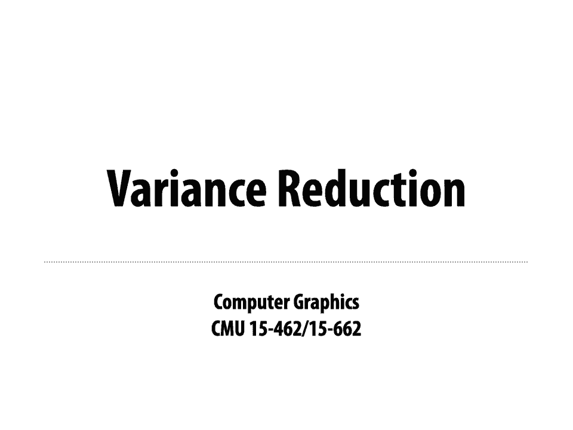

reduce variance so last time we talked，about Monte Carlo ray tracing where we。

said that the basic way we're going to，generate an image is through the。

rendering equation which gives us a，recursive description of the incident。

illumination and because this is a，recursive integral equation it's very。

difficult to evaluate to get any kind of，estimate of what the solution should be。

we really need to go pretty deep into，numerical integration and that leads to。

a lot of sophisticated strategies so，we've been talking about sampling。

strategies we've talked a little bit，about variance reduction and today we're。

gonna see more interesting things Markov，chain Monte Carlo methods and so on。

which help to get a better image with，fewer samples or less effort so today we。

want to get kind of an overview of a lot，of these different kinds of ideas and。

also keep in mind that the techniques。

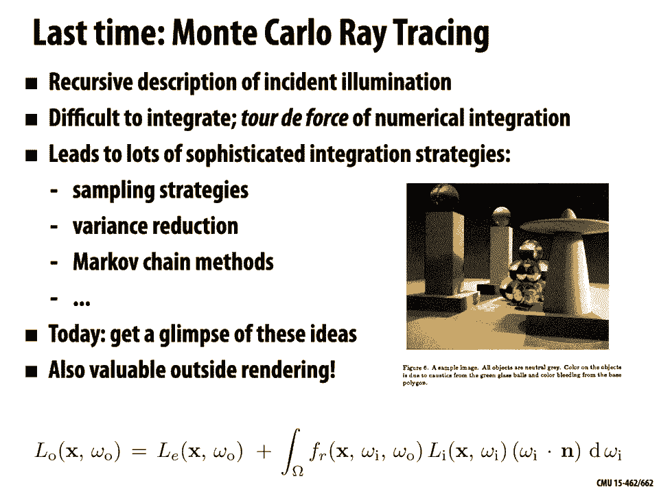

we'll discuss are quite valuable even，beyond computer graphics and rendering。

in fact the Monte Carlo algorithm the，Monte Carlo integration was named one of。

the top ten algorithms of the 20th，century so this is useful essentially。

anytime you need to estimate a difficult，integral ok so just to review what was。

Monte Carlo integration all about well，in general we just want to integrate。

over some domain Omega some function f，this doesn't have to be a function that。

has anything to do with rendering or，computer graphics，right we just want to compute an。

integral so our general purpose strategy，for doing this is something called Monte。

Carlo integration and the way that works，is we pick a bunch of random samples of，the dome。

and we'll call those capital X sub I and，then we can say that as long as this。

function f actually is integral then，summing up the values of the function f。

at the random samples and then taking，the average multiplying by the volume of。

the domain will give us the value of the，integral in the limit as the number of。

samples goes to infinity so of course in，practice we stopped at some point and。

the more samples we use the more，accurate our estimate of the integral。

will be okay so to really understand，Monte Carlo integration it's important。

to recall a few basic ideas from，probability one was the expected value。

so if we have a discrete random variable，meaning a random variable that has n。

distinct outcomes x1 through xn and，those events occur with probabilities P。

1 through P n all of which are，non-negative and all of which together。

sum to 1 then the expected value e of X，is the sum over all the events of the。

probability of that event occurring，times the value of that event。

essentially just the weighted average of，all the events by their probabilities so。

here is a simple example let's say we，have a coin we flip it and we say if it。

comes up heads we assign a value of 1 if，it comes up tails it is assigned a value。

0 we say that this coin is fair if these，two possibilities heads or tails are。

equal in probability they both have，probability of 1/2 so in the scenario。

what is the expected value for the coin，okay hopefully this is pretty simple。

it's just 1/2 times 1 plus 1/2 times 0，is 1/2 we also talked last time about。

continuous random variables as opposed，to discrete random variables so a。

continuous random variable X takes，values little X anywhere in some set。

Omega this could be like a region of the，plane for instance or an interval on the。

real line and the probability density P，gives or describes the probability that。

X appears in some given region of the，domain so it's kind of a silly example。

let's say that this probability density，function P of T gives the probability。

that you fall asleep at different times，T during a computer graphics lecture ok。

so you could think okay in this 90，minute period at the beginning there's。

some cool motivating examples you're，staying awake then we start to get。

deeper into the theory and you kind of，drift off but then maybe the professor。

makes some stupid joke ok you're paying，attention again but then there's more。

Theory you drift off and finally class，ends you get out of there one really。

important thing to appreciate about，continuous random variables is that the。

probability that you fall asleep exactly，at one given time T is 0 it's a little。

counterintuitive how can that be oh you，fell asleep at a certain time if that。

happened how could it be probability 0，that it occurred ok but the idea is that。

when you have a probability density，function P you can really only talk。

about the chance of falling asleep in a，given interval of time or in a given。

region of the set Omega so in this，example if I want to know what chance is。

there that I fall asleep between T 0 and，T 1 then I should integrate from T 0 to。

t 1 this probability density to get the，probability，that's why we call it a density。

essentially okay so in this continuous，context we can still talk about expected。

value so the expected value of a，continuous random variable is in spirit。

again just the weighted average with，respect to probability where the。

probability density is providing the，weights so we could say that the。

expected value of a random variable X is，the integral over the domain Omega of。

the probability density at each point，times the event value right and。

sometimes we'll just call this quantity，instead of Y of X we might just call。

this mu which stands in for that the，mean kind of a weighted mean so what。

about this example for this probability，distribution if you look at this picture。

and I said what what time do you expect，somebody would fall asleep in this class。

I think it's actually pretty natural to，say oh well probably you fall asleep at。

the top of that first peak right that's，the time you're most likely to fall。

asleep but the time that you're most，likely to fall asleep is different from。

the expected time of falling asleep，expected is more like the average time。

of falling asleep so if we compute this，average actually what we'll find is that。

the expected time is 44 point nine，minutes somewhere in the middle we're。

actually the probability density takes a，fairly small value is this is this。

result counterintuitive does it seem，weird that the expected time is actually。

a pretty low time well this is just a，matter of appreciating you know what。

really is the definition saying and also。

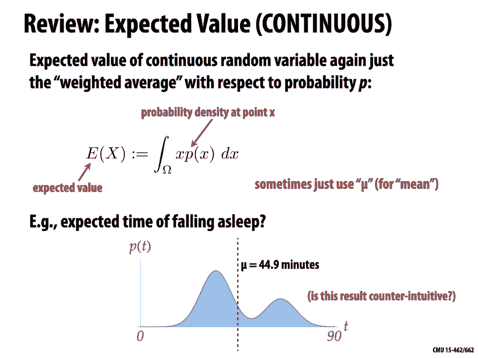

always keeping in mind something called，the flaw of averages so looking at the。

average of a quantity is really throwing，away a lot of information about that。

quantity if you just know about the，average of a probability distribution。

it really doesn't tell you oh is that，distribution fairly uniform or does it。

have lots of you know really high peaks，and and really deep valleys okay so when。

we talk about numerical integration when，we talk about Monte Carlo。

beware the flaw of averages another，important quantity when talking about。

random variables was the variance so if，the expected value is the average value。

then the variance is how far we are from，the average on average we can write this。

by saying the variance of a random，variable X is equal to the expected。

value of the value of X minus the，expected value of x squared right so how。

much does it deviate on average for a，discrete random variable we can write。

this explicitly as a sum over all the，events I equals 1 through n of the。

now we're just applying this formula，again，x-eye the value of that event minus the。

sum over J of the probability of event J，times the value of XJ squared the。

continuous formula looks almost，identical except that we will replace。

the sums with integrals really nothing，other than that happens now there's a。

quantity very closely related to the，variance which is the standard deviation。

the standard deviation which we usually，write as Sigma is just the square root。

of the variance and in some sense this，can be more intuitive so if we're。

talking about our probability，distribution of falling asleep in class。

we know that the expected time of，falling asleep is 44 point nine minutes。

but the variance is pretty big right we，kind of expect that on either side of。

that expected value we may be falling，asleep somewhere in you know plus or。

minus fifteen point eight minutes is a，rough guess for when we might fall。

asleep is this any any better of a，characterization of the probability，distribution yeah maybe。

right this gives at least a little bit，more information about what's going on。

what's likely happen why is variance so，important for photorealistic rendering。

well last time we talked about how if we，use different sampling strategies then。

our estimator has different amounts of，variance different amounts of variants。

equate to different amounts of noise in，the image because we're doing。

independent estimates at every different，pixel of our image we're gonna have。

different random error at every pixel，which shows up as this this noise it。

looks like taking a photograph at night，and if we come up with better variance。

reduction strategies we're going to get，much more smooth beautiful images with。

much lower computational effort that's，what we really want to talk about today。

so how do we reduce variance，well let's go through a really simple。

example so let's consider a region of，the plane Omega just the interval 0 to。

cross 0 2 and we're gonna put a function，on that region f of X Y which is equal。

to 1 if the floor of X plus the floor of，Y is even and 0 otherwise so just looks。

like this checkerboard pattern on the，right okay and then we're interested in。

the integral of f of X Y over Omega okay，so question what is the expected value。

remember the expected value is kind of，the average value and so what is the。

expected value of F well if we associate，black with zero and white with one then。

we see that ok just by inspection the，expected value must just be 1/2 half。

white half black what about the variance，okay well here you might need to get out。

your pen and paper scribble something，but it's just a basic application of the。

calculation we did on the previous lider，the formula we had on an earlier slide。

which is to say we do 1/2 the，probability of one event times 0 minus。

1/2 squared ok times the deviation from，the expected value squared plus 1/2 the。

probability of the other event times 1/2，minus sorry 1 minus 1/2 squared we work。

that through and we get a variance of，1/4 okay here's the critical question。

the variance is 1/4 what can we do to，reduce the variance of this of this。

function right we want to make smoother，better images how can we reduce the。

variance variance is bad we want to。

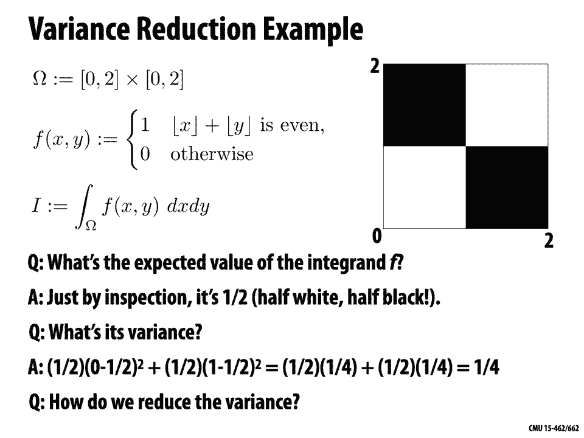

reduce it what can we do okay and the，answer is that was actually trick。

question it's really really important to，realize you cannot reduce the variance。

of the integrand you can't reduce the，variance of the function you're trying。

to integrate you're handed a function it，has some variance you have to integrate。

it the only thing we can do is reduce，the variance of our estimate of the。

integral we can reduce the variance of，the estimator okay this is a common。

point of confusion when you first start，getting into this it's really the Monte。

Carlo estimate whose variance we want to，reduce okay so an estimator in general。

is a formula used to approximate an，integral our key example is a Monte。

Carlo estimate right if we want to，compute the integral I on the Left we。

can estimate it with the Monte Carlo，estimate with the sum on the right and。

the point is we're going to get，different estimates of this integral for。

different possible collection of sample，points so what we want to do is pick。

these samples in such a way that we，reduce the，variants of this estimate again why is。

it that we're trying to reduce the，variance of the estimator and not the。

function we're integrating well because，the integral only has one value right。

the function is a fixed function but，there are lots and lots of different。

techniques for sampling the integrand，for combining those samples to get an。

estimate okay so we're gonna review some，key examples for rendering but a lot of。

these techniques can be applied more。

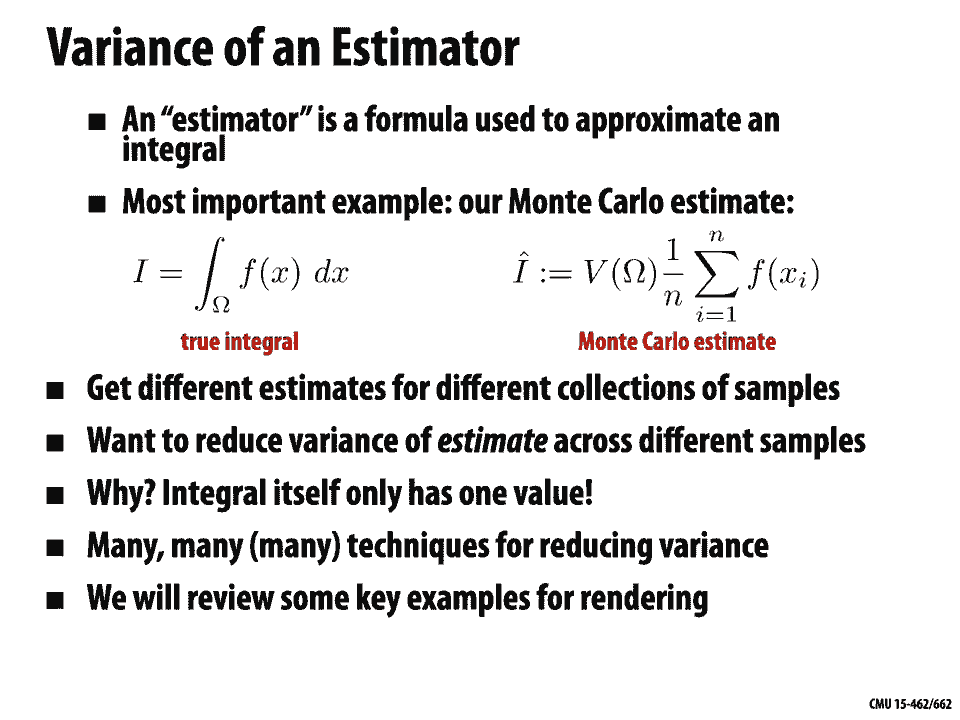

generally okay so two important things，to ask whenever you have an estimator I。

mean these are like the most basic，things that you really want to think。

about is is bias and consistency is it，consistent is it biased okay well what。

do these mean consistency is what you，probably naturally think of when you。

hear the word bias there's a lot of，confusion between these two so。

consistency let's be precise means it，converges to the correct answer if I。

have a consistent estimator I know that，as I add more and more samples to my。

estimate I'll eventually get the right，result to be a little more precise about。

that we could say as the number of，samples approach infinity the。

probability that the estimate deviates，from the true integral approaches zero。

why do we have to be so subtle about，this why can't we just say oh consistent。

means that as we add more samples we get，the right answer well these are random。

samples so there is some vanishingly，small probability that we're picking。

random samples out of a hat and we're，just getting unbelievably unlucky like。

we're always sampling the same point in，the domain right this is really really。

really improvable and that's why we're，saying we need to see that the。

probability of something going crazy，goes to zero as the number of samples。

goes to infinity okay but just take a，step back again the point of consistency。

is that saying are we getting the right，result or not bias is a different。

that a estimator is unbiased is saying，that it is correct，on average okay。

distinct from saying you eventually get，the right result so to be more precise。

we can say an estimator is unbiased if，the expected difference between the true。

integral and our estimator for any，number of samples is equal to zero we're。

saying that on average we're actually，importantly consistent does not imply on。

bias just because you're approaching the，right value doesn't mean that at any，moment。

your expected value for your estimate is，the true value again people get these。

confused all the time it's really，important to see the difference so，here's a good example。

really you know simple trivial example，I'm gonna present an estimator and I'm。

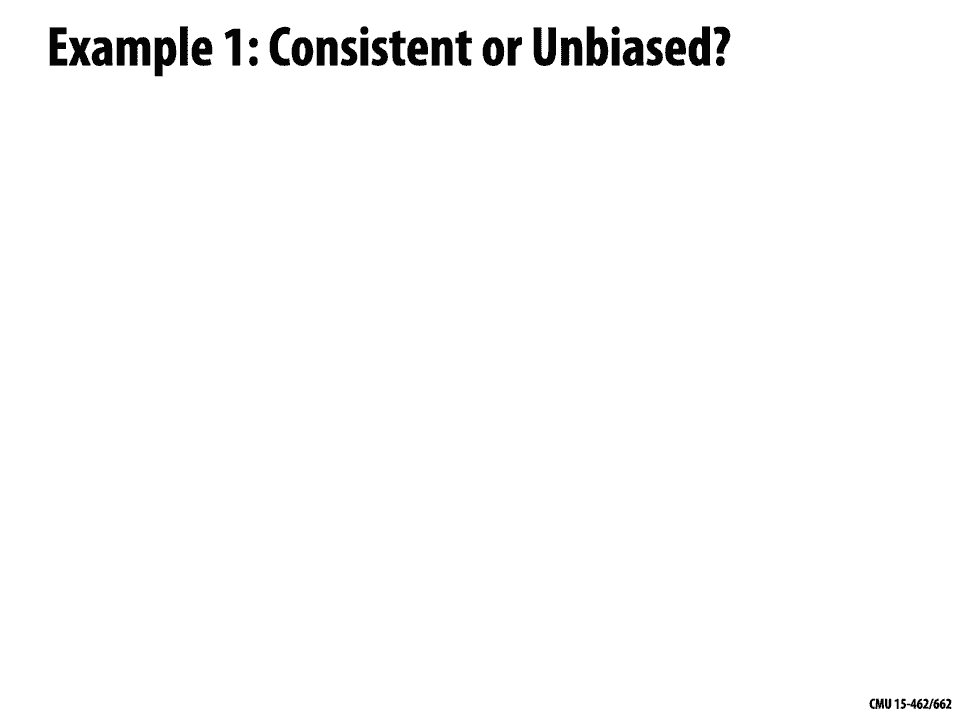

gonna ask you is it consistent or is it，unbiased so here's my task I have an。

image I have a photograph and I want to，just integrate the photograph I want it。

the total brightness of the image，basically okay so here's my here's my。

first estimator my first strategy for，estimating this integral I'm gonna take。

M by M samples at fixed grid points for，some value M and then I'm gonna do kind。

of a Riemann sum I'm gonna sum the，contributions of each box it's some。

really simple quadrature rule and then，I'm gonna let em go to infinity so you。

imagine I have an estimate when M equals，four I'm gonna approximate the integral。

of the whole image by just these 16，blocks add up their total brightness for。

M equals 16 I'm gonna have these 256，blocks and so forth so my question for。

you is is this estimator consistent and，okay let's think about this one at a，time is it consistent。

well consistent means as I increase the，number of samples do I eventually get。

the right result and the answer is yes，eventually the number of samples I'm。

taking is well let's say we can even say，that the final image is actually really。

a digital image so we could say there's，even some finite value of M for which。

I'm really just adding up the pixel，values I'm getting exactly the right。

answer right or even if it was even if，the image was a continuous image right。

this is an image in the real world it，would still be consistent as n。

approaches infinity we're getting the，correct integral is it unbiased so is。

the expected estimate we get always，equal to the true integral even for a。

small number of samples well no pretty，clearly not right if I just keep M。

equals 4 and never increase M my first，estimate will never be equal to the true。

value not even on average right there's，no there's no randomness here so there's。

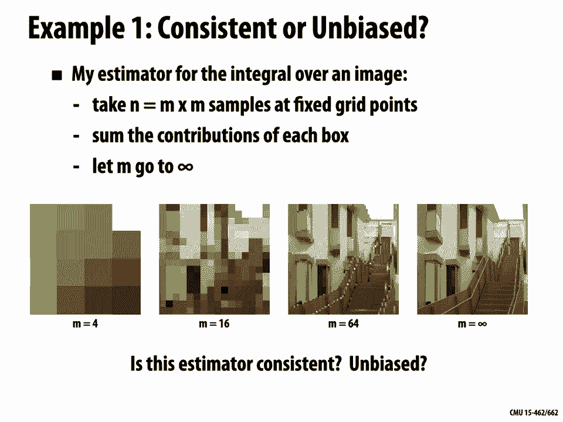

kind of nothing to take the expectation，of okay so let's contrast that with a。

different estimation strategy it，hopefully makes the difference clear。

okay so I have another estimator for the，same problem which is I'm just gonna。

take a single random sample the image，I'm just gonna pick randomly some point。

in the square I'm gonna figure out what，the the color value the brightness is。

there and I'm just gonna multiply that，value by the area of the image okay kind。

of a funny estimator but sure is this，estimate consistent and is it unbiased。

okay so again let's go through one，question at a time is the estimator。

consistent well now we're kind of in the，opposite situation we were before all。

right if I only ever take one sample if，I only ever look at one point of the。

image boy it seems pretty impossible，that I'm gonna be able to ever compute。

the integral over the whole image right，so just to be clear here。

my estimator doesn't have a parameter，there's it's always taking only one。

sample right and so there's no way that，my estimate can ever consider more than。

one point on the image so no it's it's，not consistent it can never give me the。

true value is it unbiased does it give，me the correct value on average now it's。

really tempting at this point to jump to，conclusion and say oh well it's not even。

consistent so how could be unbiased but，let's think about this do I get the。

right value on average if I repeat this，experiment over and over and over and。

over and over again and compute the，average value of all those different。

well yeah because every time I'm picking，a random point in the image even though。

none of those estimates are approaching，the correct value the average estimate。

the expected value for the estimate is，because actually it's just equivalent to。

Monte Carlo integration ok so weirdly，enough this is a strategy that is not。

consistent but is unbiased the last one，was consistent but not unbiased okay of。

course what if I now let n go to，infinity what if my estimate each。

estimate actually gets to take more than，one sample right and it gets to take as。

many samples as you want，okay then this really is our Monte Carlo。

estimator or it's the limit of our Monte，Carlo estimator right and so it is both。

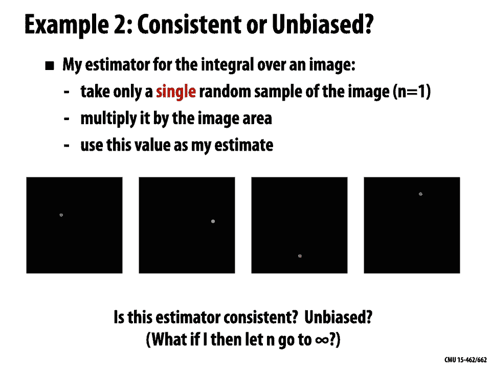

consistent and unbiased great，why does it matter why are we spending，so much time talking about this。

okay well the rule of thumb is that if，you have an estimator that's unbiased。

and consistent I mean you want it to be，consistent always right you want to be。

able to get the correct answer，eventually why does it matter whether。

it's biased or unbiased unbiased，estimator tend to have more predictable。

behavior and you know especially with，Monte Carlo estimator you really know。

that the error is decreasing at some，predictable rate so you really know how。

much computation you need to do to get a，result of a certain quality to bring the。

error below a certain threshold they，also tend to have fewer parameters to。

tweak we'll see that a little bit when，we talk about rendering algorithms that。

Monte Carlo estimators you might be，playing around with how much you know。

variance you have but it's always but，it's always consistent it's always on。

bias other rendering algorithms you，might have to play around with with。

parameters to even kind of get things。

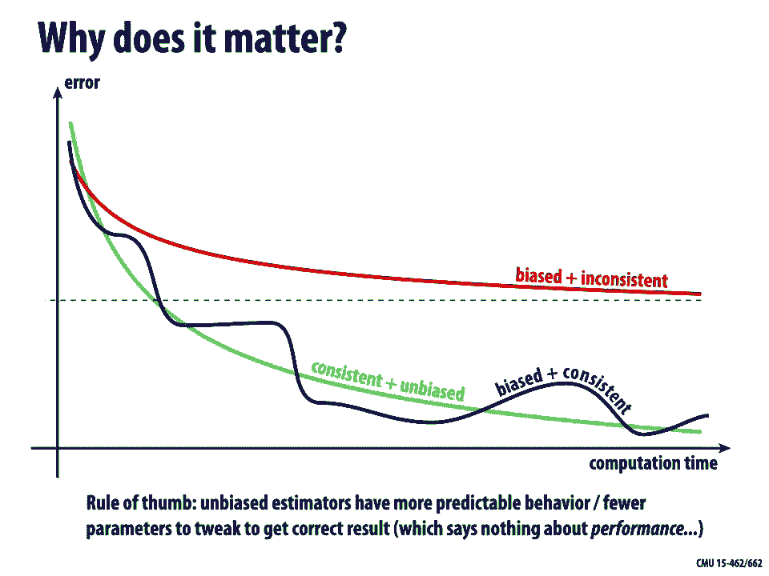

working the way that you'd like okay so，here's a little table of rendering。

algorithms that we will talk about and，whether they are consistent or unbiased。

actually one that we talked about a long，time ago was rasterization or a really。

common way of generating images and，rasterization is neither consistent nor。

unbiased why is that well there's just，no way for it to ever generate the。

correct image because it ignores all，sorts of effects like shadows and。

reflections and so forth I mean maybe，with enough tricks you can get this to。

work but for the most part you're not，gonna get the correct answer why then do。

we use it I mean it doesn't doesn't mean，it's a worthless algorithm just because。

it's not unbiased and because it's not，consistent it has something else going。

for it which is that it is unbelievably，fast we have hardware that will render。

billions of primitives you know in a，fraction of a second so these issues of。

consistency and bias really are，something we care a lot about when we're。

doing photorealistic rendering right but，story，path tracing our basic algorithm for，we。

talked about last time is more or less，consistent and unbiased as we'll talk。

about today there's important types of，light paths that are missed and that。

contributes to some of the bias and lack，of consistency but for the most part。

it's doing the right thing so we'll see，a bunch of other techniques。

bi-directional path tracing and so forth，and think about are these consistent and。

biased so first it's worth understanding，what actually is the challenge with path。

tracing why why is there any problem it，seemed seemed like a pretty good idea。

last time so let's think of this example，of a coffee cup sitting on a table and。

one thing about this cup is it has a，really glossy finish so if we shine a。

bright light on the coffee cup some of，that light is gonna get reflected off in。

an interesting way it makes this what's，called a caustic pattern on the table。

this bright ring of light around the，bottom what's kind of happening here。

okay well if I'm sitting at a place I'm，an observer and I look at this surface。

this kind of mirrored or glassy surface，and I have a point light then what can。

happen is I have a path that goes from，the eye on to the table where that。

caustic is on to the mirrored surface，and then into the light and if this。

surface is a perfect mirror right then，the only path if I now think about going。

from the other direction from the light，to the mirrored surface to the floor the。

only path that's going to carry any，light at all is the one that bounces in。

the reflected direction right the，bounces off at the kind of equal and。

opposite angle so if we think about the，path tracing algorithm what is the。

probability that we actually sampled，that reflected direction we shoot an。

array out from the eye it hits a certain，point on the table because that's a。

diffuse surface we just pick a random，direction if that random Direction。

happens to hit the mirrored surface now，what's the chance that in that process。

we just happened to find array from the，mirrored surface to the point light that。

had an equal and opposite angle to the，ray from the mirrored surface to the。

floor well it's basically zero right we，picked this diffuse bounce completely。

randomly there's just no chance we got，so lucky that we came in at the。

reflected direction also let's say that，on the mirrored surface we didn't。

directly connect it to the point light，but we actually just randomly sampled。

some some direction to go next then，what's the probability that we hit a。

point light source well again it's 0 of，all the possible directions on the。

hemisphere what fraction of them，correspond at this point light none of。

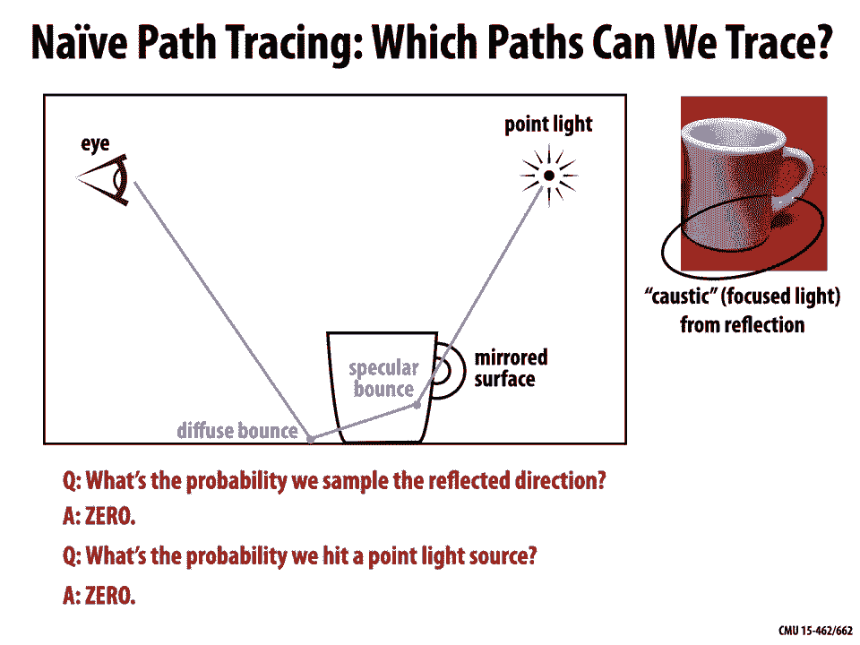

them essentially okay and so what we see，is that naive path tracing misses some。

really important phenomena especially，these extreme cases point light sources。

and mirrors and so forth so formally the，result of path tracing is biased it's。

not correct ok but you might say well ok，but isn't this example kind of。

pathological in the real world there's，no such thing as a perfect point light。

there's no such thing as a perfectly，specular mirror everything's just a。

little bit glossy and that's true so in，that sense ok path tracing does fine but。

the the reality is that real lighting，and real materials can be close to。

pathological so let's think about this，scenario we have a disco ball lit by a。

small directional light source and a，near perfect mirror it's not a point。

source and it's not a perfect mirror but，it's pretty close to the situation we。

described we still want to be able to，render a scene that looks like this I。

need some disco scene and we want to do，a good job of we want to render it。

efficiently so let's think about what，goes on when we try to apply path。

tracing to a scene like this and what，we're gonna learn is that the important。

light and the scene the light that，contributes brightness to objects can。

have a very kind of spiky distribution，it can be，distributed in a very non-uniform way，okay。

so let's consider the view from each，bounce in our disco scene and you see a，3d view of the scene。

on the right and the camera near the，bottom looking up at the the disco ball。

and the light shining on it so we start，out looking from the camera and just to。

make the images a little clearer I've，made the disco ball bright pink alright。

and the light source is this black and，white object okay so I'm looking from，the image。

I shoot out a ray the ray hits the wall，okay and now I'm gonna do the view of。

the room from the point of view of the，point on the wall so imagine I'm a。

little bug on the wall at that blue，point and I'm looking at at the scene。

and what I notice in this image is even，though okay a diffuse surface is gonna。

try to integrate light coming in from，all possible directions but you notice。

that the the only things that are kind，of directly bright or lit in this scene。

are extremely tiny this little tiny pink，dot right being lit by this little black。

light okay well let's keep on going，let's say that we still get lucky we。

shoot out a random ray and it just so，happens to land on that pink dot okay。

here's the view now from the point of，view of the disco ball。

so the disco ball now looks out again at，the at the whole world it has all these。

directions to consider but only this，tiny little fraction is being lit by。

this white light source okay the light，covers a very small percentage of solid。

angle so the light that ultimately，arrives at the camera is a very small。

percentage of a very small percentage of，the light source and you can imagine。

this gets worse the more bounces we take，you can have a very small percentage of。

a very small percentage of a very small，percentage if you're naive about how you。

sample if you just shoot Ray's randomly，in all directions good luck ever finding，any useful light。

right so the probability that a，uniformly sampled path carries light is。

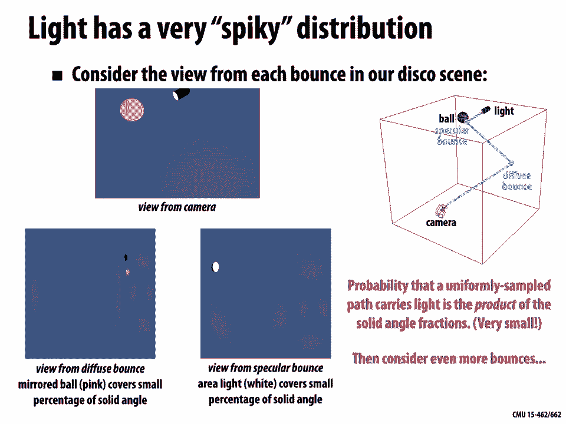

very small okay especially if we，consider long bounces so one answer。

always to reduce variance is to say yeah，but that's okay as long as I know my。

estimator is unbiased I can just keep，taking more and more and more samples oh。

and consistent right keep taking more，and more and more samples and eventually。

I know I'll get the right answer so，let's just try it let's say look we're。

not going to be smart about this we're，just gonna use compute power to solve。

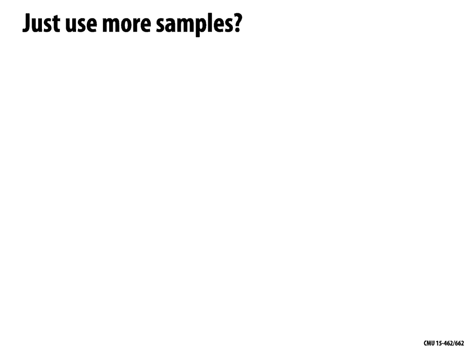

this problem so we start out and we，shoot out for every pixel in the image。

16 samples per pixel and that's what we，get and we look at it and we think what。

is this an image of I don't even really，know is there an object in that image。

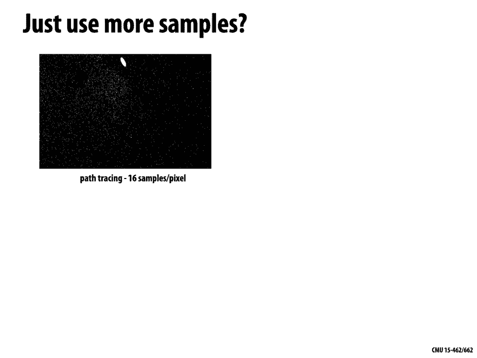

and me looks maybe like there's a light，okay so let's crank up the samples we。

now do 128 samples per pixel oh maybe I，start to see that something's going on。

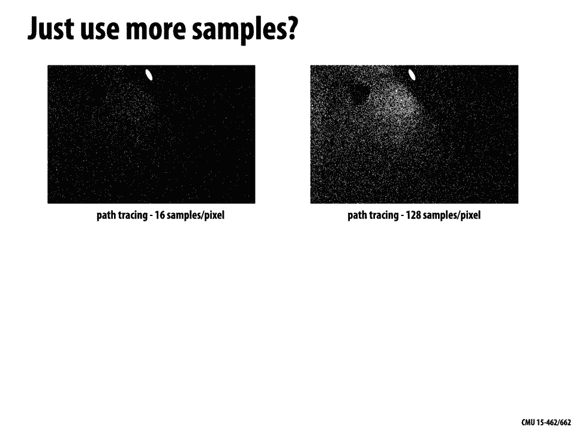

there I'm not really clear but I'll keep，going so now I'm gonna do 8，192 samples。

per pixel holy this is a lot of work，this is a lot of sampling and finally I。

start to see okay there's this ball this，kind of noisy disco ball and it looks。

like it's shining kind of caustics on，the walls how do we get here how do we。

get to a nice smooth beautiful image，without going totally crazy with。

computational effort and the answer is，not that we need you know faster。

processors or anything like that it's，that we need better sampling strategies。

we need to figure out how to shoot Ray's，in places where we have useful。

information useful light in this case，okay，so let's think back to this idea of。

important sampling which we've already，talked about a little we have a simple。

idea just try to sample the integrand，according to how much we expected to。

contribute to the integral so let's say，we have this really complicated。

integrand we want to integrate the，function f our naive strategy is to，sample the domain you。

formerly sum up the values of f at those，uniformly sampled points take the。

average and multiply by the volume of，the domain as we do this what we notice。

is there's really not much reason to put，samples in this flat region of the。

integrand or at least not many samples，because most of the time they're not。

contributing much I mean I'm putting，lots and lots of samples in this flat。

region they're just adding 0 0 0 or some，small epsilon to my estimate so what we。

could do instead is we could say well，maybe we don't know exactly what the。

integrand looks like but we have a，reasonable guess for where the integrand。

is big and where it's small let's call，that function P ok that's now a。

probability distribution different from，the uniform distribution that we're。

going to sample from and this gives us，our importance sampled Monte Carlo。

estimate we pick random samples from the，distribution P we still evaluate the。

integrand f at those random samples but，now we divide by the probability density。

at each sample point we say if this，region was sampled more often we're。

gonna wait it less if this region was，sampled less often we're gonna wait it。

more so that everything balances out ok，if I sample X more frequently each。

sample should count for less if I sample，X less frequently each sample should。

account for more this is gonna help，right we're gonna spend less time。

sampling stuff that doesn't matter more，time sampling stuff it doesn't matter。

what sort of seeing why things get，better well here's kind of an extreme。

case what happens what happens if P is，proportional to F directly what if our。

probability distribution P is actually，just a constant multiple of F what what。

funny thing happens with our Monte Carlo，are important sampled Monte Carlo。

well good thing to think about is what，is that constant of proportionality now。

the thing I remember about a probability，density function is it has to integrate。

to one so if I start out with f that，integrates to something let's call it I。

then in order to get P I need to take F，and divide it by I so actually this。

constant of proportionality is the，integral that I want to compute and so。

even if I take one important sampled，Monte Carlo estimate with P as my。

distribution then the first term in my，sum is going to be the constant of。

proportionality which is equal to the，integral that I want in other words I'm。

gonna get exactly the right answer for，the integral with exactly one sample so。

this would be a perfect important，sampling strategy just sample。

proportional to the integrand itself as，you might guess that's not something we。

could do in practice it's a little bit，of a chicken and egg problem if you。

remember how do we sample from a，distribution well we have to do some。

integration right but in spirit that，tells us why picking a P that looks like。

F is going to do a good job of reducing，variance the closer and closer P gets to。

F the closer and closer this quotient，just looks like the integral that we're。

looking for okay what about in rendering，what kinds of peas what kinds of。

probability distributions can we cook up，to help reduce variance well there's two。

important classes of local important，sampling strategies we talked a little。

bit about last time one is too important，sample according to materials so for。

instance if I know I have a very glossy，material with some really strong。

reflectance in the direction in the，reflected direction or near the。

reflected direction I can kind of sample，a lobe around，reflected direction if it's more of a。

diffuse surface then I know I want to，sample more uniformly but maybe I use。

cosine weighting like we did last time，an important special case kind of a。

limit case is a perfect mirror right if，we if we know that the only light that。

gets reflected is along this reflection，direction then we should really only。

sample that direction we can also do，important sampling of lights。

you might remember last time we did，important sampling of an area light。

right integrate over the area light，rather than integrate over the。

Hemisphere and that really really helped，to really reduce the variance of our。

image again an important special case is，a point light source what should I do if。

I want to important sample point light，source well it'd be pretty stupid to do。

anything other than directly send our，rays toward that point in space okay。

what else can we do how can we go beyond，this local important sampling of the。

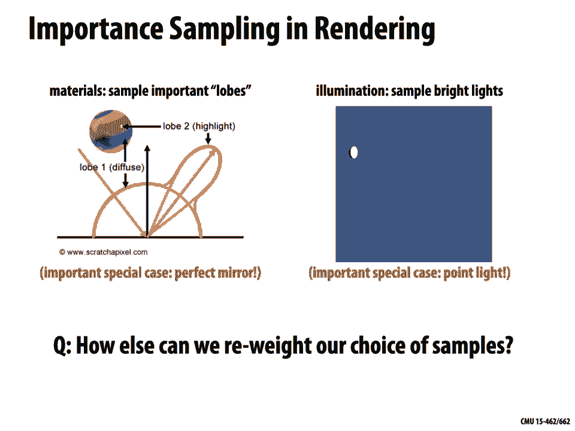

light or the materials to reduce，variance well here's a really valuable。

perspective on rendering is to think，about things rather than in terms of。

sampling the current Hemisphere around，our point we can think about the whole。

space of all possible paths of light，through our scene we think about that as。

the domain that we're integrating over，and then think about how do we pick out。

interesting and important subsets of，that paths that carry light through our。

scene okay so so far we've been thinking，about everything in terms of this。

recursive rendering equation one step at，a time we estimate this integral to。

estimate that integral we have to，estimate another integral that looks。

like it and so forth and so we've tried，to make intelligent local choices of。

each step the path integral formulation，says actually we can think of the。

estimate or the integral I as an，integral over all possible paths to the。

scene each sample is now a whole path，going from the light to the eye。

and F is just how much total light is，carried by this path right so it's any。

light that came out of the light source，and then at each bounce modulated by the。

reflectance function may be adding some，emission on the way there and then we。

have this tricky question of well how，much of the path space does this cover。

how much does that contribute to our，integrand okay but this picture really。

opens the door to much more intelligent，global important sampling strategies。

it's a really nice perspective it's，still hard to do it doesn't immediately。

solve the problem but it lets us think，about this in a broader way so here's a。

nice way to visualize this path space is，to say well look no matter how we're。

doing our our paths however however，parameterizing our paths at the end。

they're always determined by a sequence，of random values in zero one we're。

always making calls to the random number，generator on our computer that thing's。

always returning values in the range，zero one and so we can think of actually。

any path is being described as a，sequence of values between zero and one，or a little more。

I don't know geometrically we can think，about those that sequence of points as。

describing points in a unit cube of，dimension K if I have two random。

variables between zero and one that's，the same as a single random point inside。

the unit square for each point inside，that unit hypercube we have an。

Associated value we have the radiance，carried by that path okay so then our。

whole idea of rendering instead of this，recursive rendering equation becomes。

well we just want to integrate over，cubes of each dimension K so for。

instance let's consider a scene in 2d，just because we can draw the pictures。

right we have a scene that's like a，blueprint for a house the little white。

regions or windows there's some doors，and so forth and we just for the moment。

want to focus our attention on，does that have two bounces okay so we。

start at the eye we shoot out array it，hits somewhere we have to pick a random。

angle theta-1 for the next direction of，our array we hit another point and we。

have to pick another angle theta2 for，the next direction of our right each of。

those angles even though the angle is，maybe between 0 and pi for the Hemme。

circle around that point we initially，generate those values with values in the。

range 0 1 okay so what we can do is。

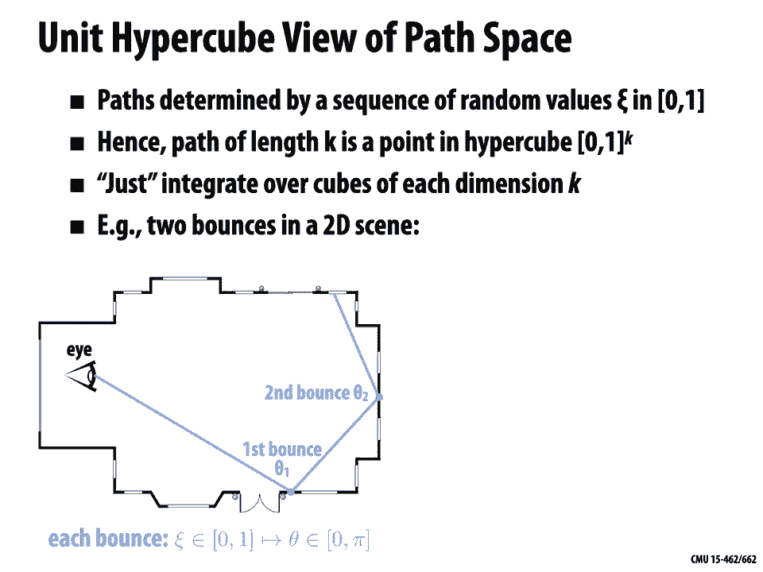

pretty cool is we can plot for each pair，of angles did this ray hit a wall or did。

it hit a window in this kind of，simplified picture we're going to assume。

walls are black they don't contribute，anything and windows are white there's。

just bright light shining through the，window ok and so this is what the view。

of the world looks like through this you，know picture of two bounces in this in。

this square what do we want to estimate，we just want to estimate the total。

brightness of this 2-dimensional image，now we consider all possible paths of。

length 2 then all of the light that it，could pot those could possibly transmit。

one thing we talked about last time is，that as we add longer and longer paths。

we actually get some important stuff in，our image right longer paths do quite。

often carry important stuff important，amount of illumination for instance。

going through glass or water or，something like that so we really want to。

get the whole image we're gonna have to，integrate over a you know 1 dimensional。

cube a 2 dimensional cube a，3-dimensional cube of four dimensional。

cube and so forth and probably use，Russian roulette to decide when to stop。

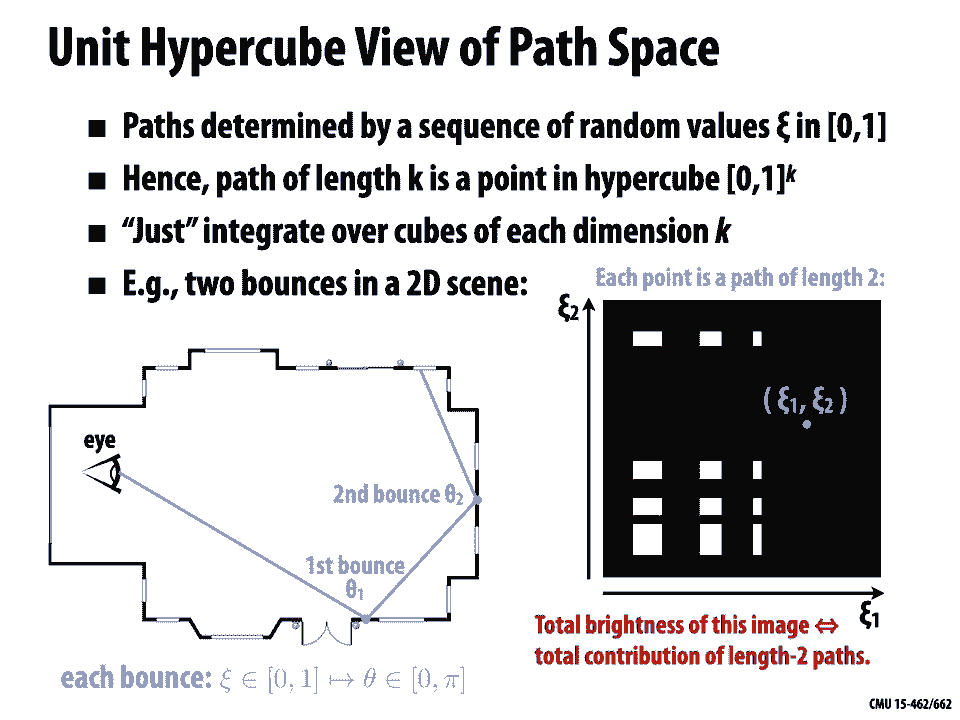

okay but if we want to find good paths，we still have to answer this question。

how do we choose which paths to use and，how do we choose which path lengths to。

use so one nice idea is the idea of，bi-directional path tracing。

so far we've been always tracing paths，from the AI hoping that we'll hit a。

light source now we're gonna go D we're，gonna think about going the other way。

well what if what about starting from，the light source and and seeing if we，hit the eye。

well what about combining those two，strategies somehow so with forward path。

tracing we have no control over path，length right we shoot at array bounces。

around and hits a light after end，bounces or it gets terminated by Russian。

Roulette the idea and bi-directional，path tracing is to connect pads or sub。

pads from the light and the eye so maybe，we start at the eye we do you know one。

bounce we start at the light we don't do，any bounces we just hit the surface and。

then we say okay if we connect to those，two sub paths up we can still compute。

for that total path what is the amount，of light that it carries to correctly。

add that to our estimate we need to，carefully weight the contributions of。

paths according to the sampling strategy，but okay that's something we can sit。

down and figure out and I won't go，through all the details here but you can。

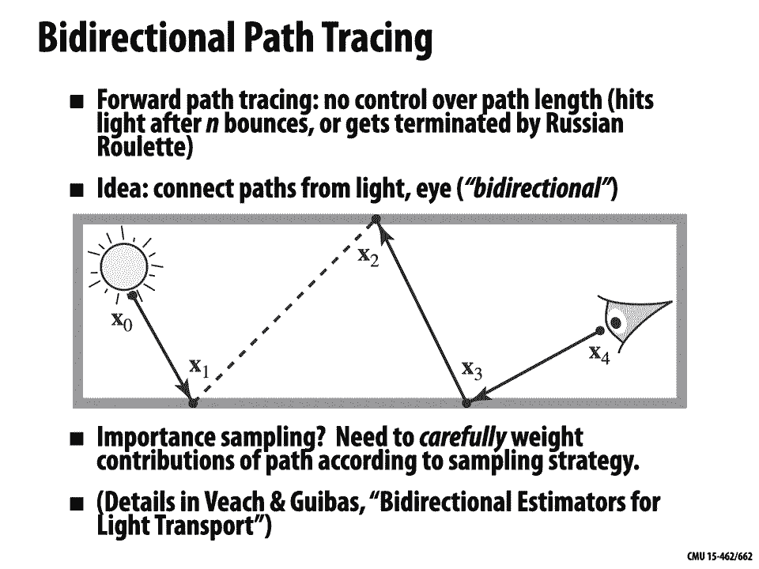

find it in this article it's interesting，to think about bi-directional path。

tracing even in the case where we're，just considering length to path so in。

standard forward path tracing a length，to path would look like this I started。

the eye I hit the surface and then I，bounced and hopefully I hit a light I。

could also have a path where I shoot out，a single ray from the I hit a surface。

and I connect it directly to a point on，the light that's what we do when we do。

direct lighting which is usually a，pretty smart thing to add to your。

estimate or we could go the other way we，could start at a light shoot at a ray。

see where it hits the environment and，connect that directly to the eye or we。

could do full-on backward path tracing，shoot out a ray from the light see where。

it hits the scene bounce it off again，and hopefully it hits the eye okay and，these。

upper left and bottom right strategies，correspond to two kind of important。

failure cases one is well if I just do，this to bounce thing I'm gonna fail。

always to see point light sources，there's just no chance this balance。

actually bounces into a point light，source likewise if I do this backward。

path tracing it's gonna fail completely，for a pinhole camera there's just no way。

that I bounce off the table and，perfectly bounce through the pinhole。

okay so different not only path lengths，but actually different combinations of I。

sub path and light sub path lengths are，gonna contribute different features or。

they're gonna handle different phenomena，here's a nice image that decomposes the。

light by these path lengths or by these，sub path lengths so on the upper right。

we have the final image kind of the true，image that we're trying to render and。

then in each row we're increasing the，total path length and as we go across a。

row we're saying how many edges of the，path belonged to the I versus how many。

belonged to the light okay you can see，all sorts of interesting things going on。

especially with this glass egg on the，table there's some choices of eye and。

light sub path lengths that really，capture the brightness of this egg the。

light that really travels through this，egg but it's not intuitive at all you。

couldn't sit down and write very easily，a general expression saying oh yeah for。

all scenes that I'll ever encounter，these are the kinds of paths that matter。

it's really hard and you can just tell，in general from this image that you know。

good paths are hard to find another，great example that has more to do with。

in some sense geometry then then path，length is this little example again from。

Erik Beach this room so we're looking at，a room from above or a layout for a。

building from above and the eye or the，camera is looking at a table with some，objects on。

and we're gonna do path tracing so we，shoot out a path from the ayat bounces。

our on-the-scene even after multiple，bounces it fails to find this little。

crack this little place where the door，is just barely open and the light is。

shining from the other room right so in，this scene there's no light anywhere。

except in that other room and so that，path is dark it doesn't contribute，anything we try it again。

it bounces around it fails to find this，crack door doesn't get any light you。

know you try this again and again and，again and again it doesn't find this。

crack door well eventually maybe you，find huh finally we found one path that。

carries some light and even if we do by，directional path tracing even if we also。

try to shoot out paths from the light，well they're gonna have the same problem。

they don't go through the door and so if，we even try to connect I subpaths and。

light sub paths that line or that，segment connecting them is usually going。

to be occluded it's gonna pass through a，solid wall and won't contribute anything。

to the result so here's a new idea which，is to say look some paths some good。

paths are really really hard to find，they might carry most of the。

illumination in the scene but they're，really hard to find so what we're gonna。

do is once we find a good path rather，than throwing it away and starting over。

again we're gonna perturb it a little，bit we're gonna just move our degrees of。

freedom a little bit maybe change the，angles ever so slightly to find nearby。

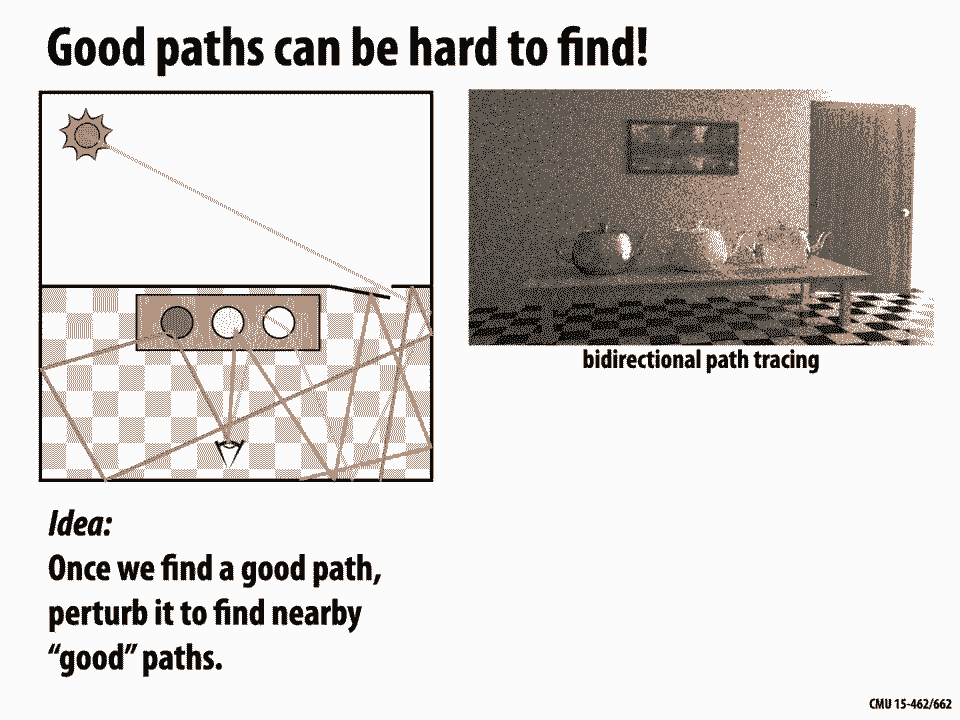

good paths and that's the idea behind，something called metropolis light。

transport so here's an image generated，of the same scene much less noisy and in。

much less time okay so in general，metropolis light transport is based on。

something called the metropolis Hastings，algorithm so in standard Monte Carlo we。

sum up independent samples as we as，we've always been doing in metropolis。

Hastings we are actually going to take a，random walk of dependent samples we're。

gonna start with a sample and then we're，going to change it or mutate it to get，the next。

the basic idea is that we prefer to take，steps that increase the sample value so。

if we found a good sample one that has a，large value in the integrand then we。

don't want to move too far away from，that sample point if we're really at a。

low point in the integrand then we'll be，very happy to walk away from it and go。

somewhere with a larger value okay so，maybe I start at this blue point I start。

wandering around and the probability，that I moved to a new point has to do。

with how much the integrand changes in，particular I could say that alpha is the。

ratio of the function value the，integrand value at the new point divided。

by the integrand value at the previous，point that value is something I'm going。

to call the transition probability now，one thing to be careful of it's not。

quite a probability right because it，could be much bigger than one the value。

of the new point could be a hundred，times bigger than the value of the old。

point okay but what we're gonna do with，it is very much like what we do with a。

probability we'd say okay if we pick a，random number between zero and one and。

it's less than alpha then we go ahead，and actually transition we actually move。

to the next point otherwise we just stay，where we were so if the new point is。

very very small and value relative to，the old point then it's extremely。

unlikely that this random number is less，than alpha and so we'll just stay where。

we are and vice versa，okay and so if we're careful about how，we do all this then as we start。

wandering around in the domain the，distribution of sample points where our。

sample points land in the domain are，actually going to become proportional to。

the integrand itself one thing we have，to be very careful about is to make sure。

that the mutations are air ghatak which，is just a fancy way of saying make sure。

that our paths can actually reach，everywhere in the domain of integration。

so you can imagine maybe there are big，regions of the domain where the。

integrand is zero well based on our，little algorithm here will never pass。

through these zero regions which means，we'll never maybe move into some more。

interesting regions on the other side we，also need to to make this really work we。

need to do this we're all really really，long time so that there's not a bias。

towards values at the initial point，right we picked some initial random。

starting point initially this random，walk is going to be more concentrated。

around that starting point than anywhere，else even though that has nothing to do。

with the actual integrand okay but if，we're careful we really do get the right。

result and here's kind of a simple，example we want to integrate or we want。

to take samples proportional to the，density of an image okay so I have some。

just image F I'm going to start at a，random point and I'm gonna take steps in。

a random direction and how far am I，going to walk in this case well I'm just。

gonna pick the distance that I walk from，a normal distribution from a Gaussian。

distribution every once in a while I'm，also gonna jump to a completely random。

new point to make sure I'm exploring the，whole space so that is a really simple。

strategy for making sure that my random，walk is ergodic is just every once in a。

while I'll say okay I do kind of more，like the original Monte Carlo thing just。

pick a completely random sample the，transition probability is the relative。

darkness I'm just going to look at how，bright is the new point of the image。

versus how bright was the old point of，the image typically if it gets brighter。

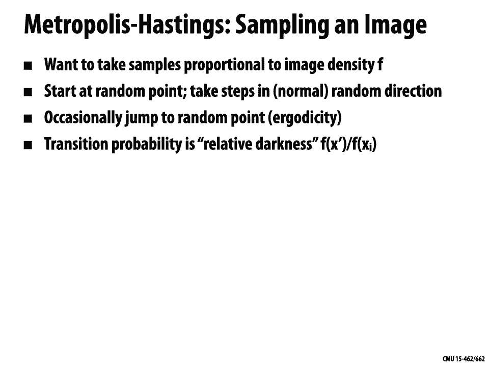

I'll move there typically if it's darker，I won't move there，okay so here's an example of what that。

looks like we started it out at some，point in the middle and what I'm。

plotting here is every single time I，land at the point in the in the domain。

I'm just making that point slightly，lighter and so the longer I walk。

I'm gonna start to see a distribution，emerge brighter points are places where。

I've stayed around longer I've seen，those points more often darker points。

are places where I quickly left those，regions I didn't I didn't think they。

were very important okay and I'm going，really really slow here intentionally so。

you can get it get a feel for what a，random walk looks like now if I speed。

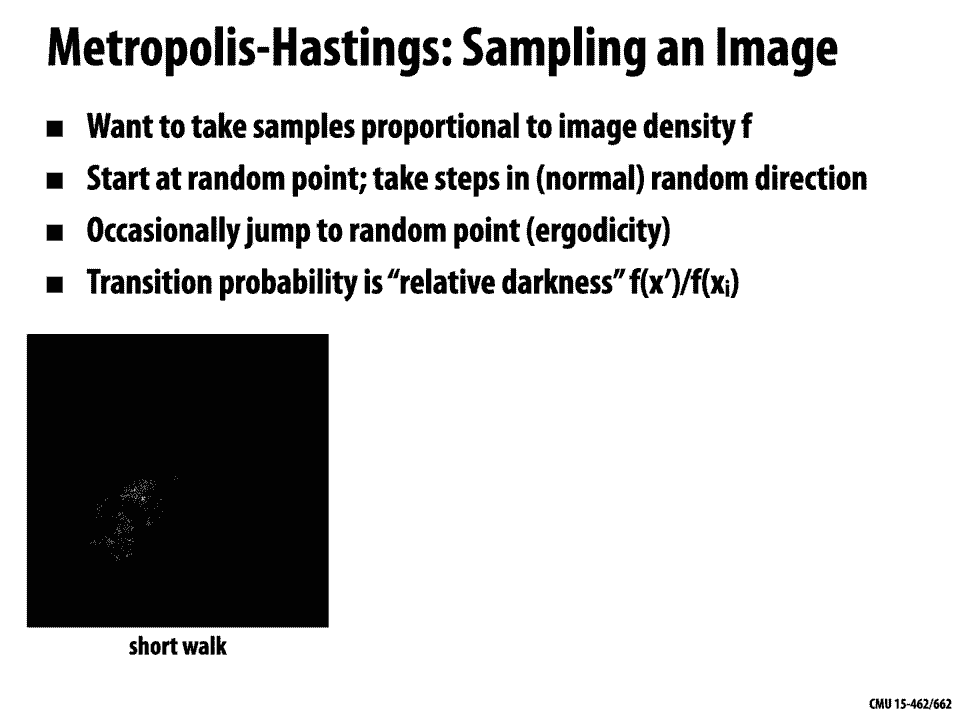

this process up a lot and I start taking，lots and lots of steps over a long。

period of time what you'll start to see，is an image that fades into existence。

again I'm just plotting the distribution，of where this random particle has ended。

up over time okay and at some point，those of you at CMU should be able to。

guess what is the image that I'm looking。

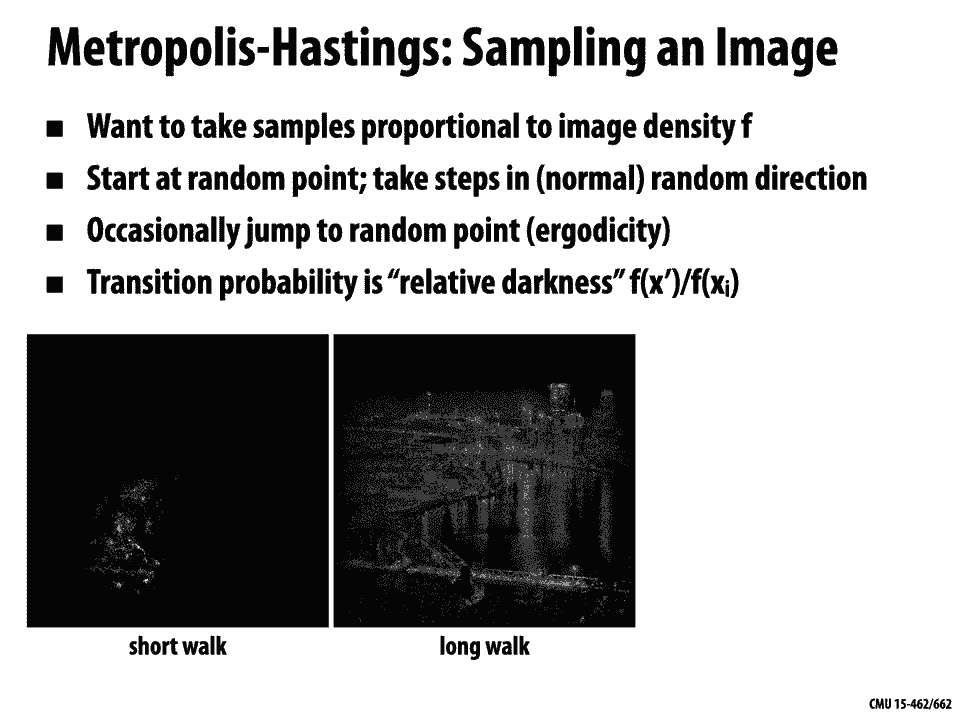

so what is this well you see a lot of，bridges so this must be downtown。

Pittsburgh so pretty cool by just，looking at a very very simple local rule。

oh go places that are brighter more，often this completely random walk ends。

up being distributed proportionally into，this image it's pretty cool and why is。

that useful why is that interesting in，rendering well again because for a lot，of scenes。

I don't really know ahead of time which，paths are gonna compare or are gonna。

carry a lot of light it's a really hard，thing to figure out ahead of time in。

general for all possible scenes so then，the idea is to say well fine I'm just。

gonna start randomly exploring the space，of paths I'll shoot out some random。

paths maybe with bi-directional path，tracing and to get the next one。

I jiggle it a little bit and just like，we were walking around on the image now。

I'm essentially walking around in path，space and I'm gonna spend more time。

integrating places that have paths that，carry a lot of light okay。

and that's about all I'm gonna say about，the the algorithm the details take a。

little bit of work but again you can。

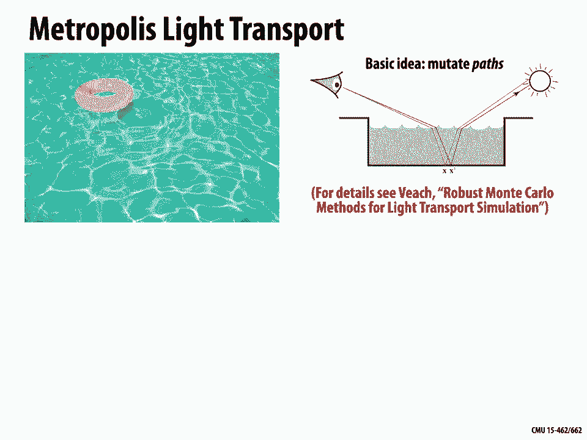

read about it in this article but just，to show the payoff this is a example of。

a swimming pool you know light coming，into the swimming pool it has to hit the。

surface refract in hit the bottom bounce，out refract out hit the eye right and。

with path tracing it's super noisy with，metropolis light transport for the same。

amount of time you get a much clearer，image of what's going on okay what else。

can we do to reduce variance well one，thing we've started to see is that we。

have lots of different important，sampling strategies now right maybe we。

have you know two different functions p1，and p2 which one should we use for a。

given integrand if the picture looks，like this right well maybe we can guess，okay。

well p1 looks like the left lobe of the，function and p2 looks like the right。

lobe but the right lobe seems a little，shorter so maybe we use p2 a little less。

often when we're talking about important，sampling over path space or doing you。

know different kinds of light and，material important sampling strategies。

it's really not so clear there's not，really a picture you can just look at。

and say oh yeah this is these are the，ones we should use and this is how often。

so there's this idea of multiple，importance sampling which is a automatic。

way to combine different important，sampling strategies to preserve the。

strengths of all of them and these are，all a little bit heuristic but you can。

prove that certain heuristics are sort，of asymptotically about as good as。

anything else you could do so one is，called the balanced here a stick which。

says okay I have these different，important sampling strategies I'm gonna。

take samples using all of the important，sampling strategies and then my。

estimator looks like this I have 1 over，N is the total number of samples overall。

strategies I'm going to do an outer sum，over the different possible strategies。

so here for instance over p1 and p2 then，I'm gonna sum over all the samples I。

took with each important sampling，strategy and f of X IJ is the jate。

sample taken with the ice rata I'm going，to divide by the sum over all strategies。

of the fraction of samples taken with a，cait strategy times the Kate importance。

density ok very very simple formula to，plug in and what it does is it make sure。

that no pathological behavior happens if，you have a really bad important sampling。

strategy and a really good one this will，tend to give you something more like the。

good one than the bad one，ok and then there's several different。

ways you can do even better than that。

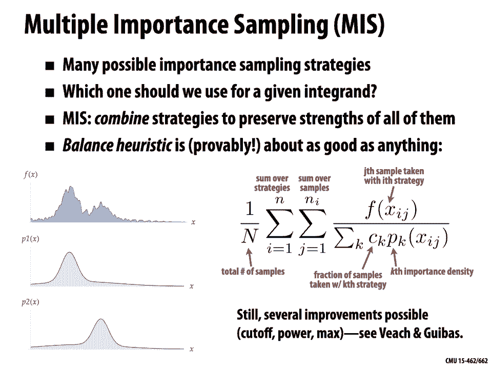

but this is a pretty good technique，here's a nice example showing the effect。

of using multiple important sampling，when you have，either the choice to important sample。

based on the light or on the materials，okay so we have this really kind of。

clever scene where we have lights of，different sizes at the top going from。

small to large and on the bottom we have，these four panels that have different。

materials on them going from really，really almost perfectly mirror like at。

the top to almost a few Slyke at the，bottom these kind of glossy materials in。

between and so if you think about this，for a minute you think okay well for。

which you know which panel and which，light source is it good to sample from。

the light importance distribution versus，the material one so we know that like。

for a point light you know it's it's，really pretty important to shoot Ray's。

directly towards the point for a diffuse，material it really doesn't matter which。

direction you shoot so maybe if I'm you，know a diffuse material and I'm looking，at a point light。

I should be sampling the lights and，that's what you see on the bottom right。

of the rightmost image and so on and，what you see in the middle is that even。

though each of these individual sampling，strategies can kind of fail and not。

really do a good job when I combine them，with multiple important sampling I get。

this beautiful combination the best of，both worlds。

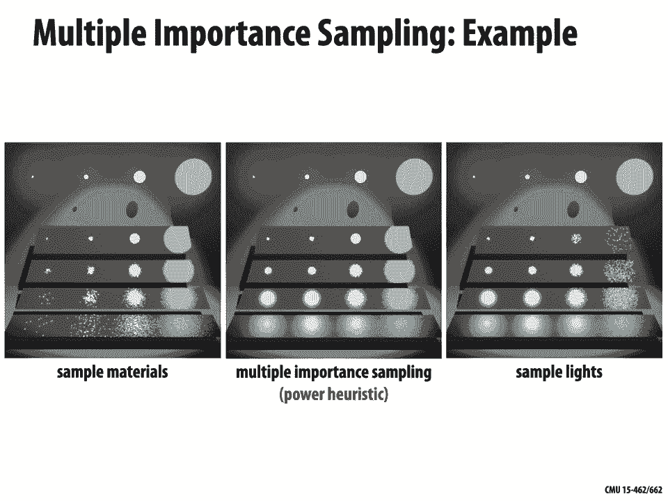

all right so importance is important but，it's not the whole story when it comes。

to variance reduction there are other，questions we can ask completely。

different aspects of this numerical，integration process that can reduce our。

variance for instance we can ask how do，we sample our function in the first。

place how do we come up with samples，okay so in general what we want to be。

able to do when we're doing let's say，important sampling is pick samples。

according to a given density okay and so，far we've been suggesting let's say we。

have a uniform importance then we've，been saying oh just pick a uniformly at。

random values between you know 0 and 1，samples，actually look as random as you might。

expect so I believe that in this array，of three by two boxes in the bottom left。

the bottom right most one is actually，uniformly random and what you notice is。

that samples kind of clump up in an ugly，way if you call R and many times you'll。

see this kind of behavior and because of，that you're gonna get more variance than。

you really should from this uniform，estimator that you you could let's say。

you could try using these other sample，distributions that at least to the eye。

look a lot better look a lot more，uniform same story if I have a。

non-uniform density let's say I want a，sample proportional to this image this。

little image of a face well I'd like to，get a sample pattern that looks roughly。

like the one we see here there's fewer，samples in certain regions than others。

but within those regions they're spread，around nicely and evenly okay so how do。

we get sample patterns that will give us，low variance for our estimator here's。

one basic technique that's almost always，a good idea，so how do we pick n values from 0 1。

again if we just pick them uniformly at，random we get something that doesn't。

look that uniform these are these points，these blue points were caught were。

values that I got by just calling the，random number generator thing is。

supposed to give me a uniform values it，does indeed give me uniformly。

distributed values but uniformly，distributed random values behave in a。

weird way they can have large gaps they，can have clumps okay so a different idea。

is to say no no I want these to be，nicely spread out so I'm gonna split the。

domain into n bins and then pick，uniformly in each bin alright so here。

I've broken up the domain into bins of，size 1/8 within each bin I've picked a。

uniformly random value and by，construction they get spread out a lot。

better fact in fact the stratified，estimate can never have larger variance，than the original。

estimator and typically lower often much，lower why is that true。

well here's some good visual intuition，okay if I'm picking over the whole。

function then I am kind of suffering，from the variance of the whole function。

if I'm picking in these little intervals，then within each interval the function。

has much smaller variance right and you，can actually prove that the stratified。

estimator is never worse just by using a，very basic property that we have seen a。

couple of times now the linearity of，expectation the fact that the expected。

value is a linear map okay so simply，replacing uniform samples with。

stratified ones already improves the，quality of sampling for rendering and。

lots of other graphics and visualization，tasks we can do this not on an interval。

but we could do this on interesting sets，that we need for rendering here what。

we're doing is sampling actually not the，hemisphere but a triangular region on。

the hemisphere so you could think maybe，this is the projection of a triangular。

light source onto the hemisphere and if，we do this with uniform sampling we get。

this clumpy sampling pattern if we do，this with stratified sampling we get a。

much nicer sampling pattern that，actually has less variance so this idea。

of not having clumps in our sample，pattern hints at one possible criterion。

for good sample good set of samples，which is the number of samples in a。

given region should be proportional to，the area of that region sounds very。

natural and discrepancy the enocean of，discrepancy is the measurement of a。

deviation from this ideal distribution，of samples okay so for instance let's。

say I have a box with these black，samples in it and I have a region s then。

I would say the discrepancy of the，sample points X Oh，the region s is equal to the absolute。

value of the difference between the area，of s the area of this blue blob minus。

the number of samples in X covered by s，divided by the total number of samples。

in X so here we're assuming that the box，has a unit area we can then define the。

discrepancy of the sample X independent，of which region were considering by。

taking the maximum over all possible，regions where maybe we consider some。

reasonable family of regions like all，possible boxes or all possible circular。

disks okay and this is something we，generally can't directly evaluate to be。

really expensive to evaluate but this at，least conceptually gives us the idea of。

what does the discrepancy of a sample，mean we can also ask well if we replace。

truly random samples with low，discrepancy samples why should it be。

true anymore that we actually get the，correct value for our integral this。

whole idea of Monte Carlo integration，was predicated on the fact that we're。

using random samples and kind of the，expected value that we get from a single。

random sample is equal to the true，integral with these quasi Monte Carlo。

methods that use just low discrepancy，samples rather than random ones we have。

a different reason why this works called，Koch's most theorem ok which basically。

says that the deviation of our estimator，from the true integral is bounded from。

above by the discrepancy of the sample X，and the total variation of the function。

or integrating so just the integral of，the derivative of that function so。

intuitively if the function is really，really variable and our samples aren't。

doing a good job of spreading themselves，out over the domain we're going to do a，by。

versa okay so for low discrepancy，samples X we approach the true integral。

and this is just a one-dimensional，expression here but similar bounds can。

be shown in higher dimensions one thing，that's maybe weird about this is well。

for the kinds of functions that we want，to integrate in rendering the total。

variation isn't bounded the derivative，of the function is infinite whenever we。

have a discontinuity we go from you know，the the foreground to the background。

something like that still things tend to，work out in the way we expect also this。

theorem only applies if we're talking，about axis aligned boxes assbutt okay。

this is a reasonable notion of，discrepancy even though edges in real。

images can have arbitrary orientation，again discrepancy is still a very。

reasonable criterion in general for，deciding is this or isn't this a good。

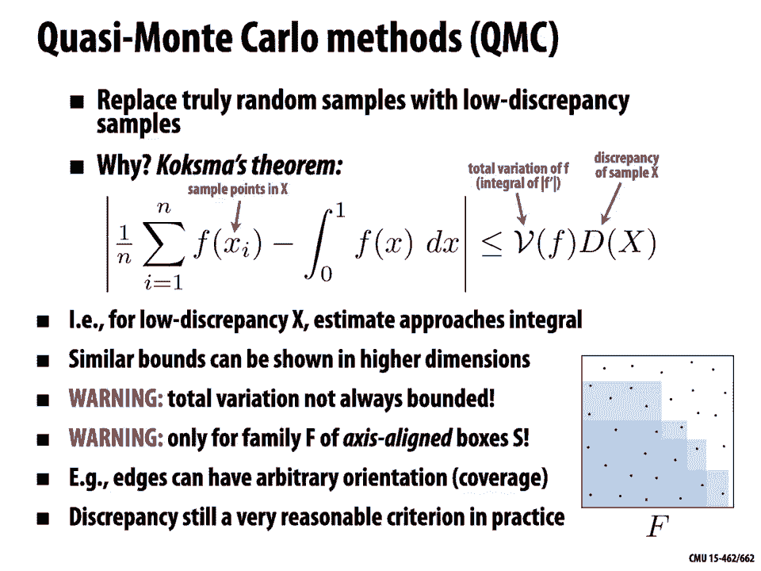

sampling pattern okay so how do we，actually generate some low discrepancy。

samples we can't just call our uniform，random number generator anymore but we。

can actually generate samples with near，optimal discrepancy pretty easily so。

just to sketch this out I won't go into，gross detail about everything but first。

what we're gonna do is define something，called the radical inverse so the。

radical inverse takes an integer I，expresses it in base R and then reflects。

the digits around the decimal so for，instance if I have the integer 1 2 3 4。

1234 i express it in base 10 okay it's，already expressed in base 10 and then I。

reflected around the decimal I get point，4 3 2 1，so I can get a certain kind of low。

discrepancy sample called Halton points，x1 through xn in K dimensions by taking。

this radical inverse function and，applying it to integer I so if I want I。

samples I is the one that I'm looking at，right now and I'm gonna look at the。

radical inverse for all the bases，that our prime from the first prime up。

through the cave prime can I get a set，of samples that look like what we see on。

the bottom why does this work I won't，try to explain but this will give you a。

low discrepancy sample another thing I，could do is use what's called a。

Hammersley sequence so again using this，radical inverse function I do I over N。

and then I do the radical inverse with，respect to the base of the first prime。

number of I second prime number of I and，so forth all the way up through K minus。

1 on the bottom right we see an example，of a Hamersley sequence it actually。

looks a little better than our helton，sequence there's less clumping it looks。

more uniform the downside is we have to，know ahead of time how many samples。

we're going to take so often in Monte，Carlo rendering you want to keep going。

adding more and more and more samples，until you're happy here we have to pick。

that number ahead of time okay so if，you've been paying close attention to。

these definitions this idea of low，discrepancy you might say wait a minute。

this is a lot of work we have to do some，really funky stuff but isn't a regular。

grid already a pretty great example of a，low discrepancy sampling pattern if I。

take a random box and throw it down in，that region the number of samples that I。

contain is really going to be，proportional to the area of that box so。

what's what's so bad about using a，regular grid and the answer is well。

there's there's more to life than，discrepancy there's other things that'll。

cause problems with your estimate so，even low discrepancy patterns can。

exhibit poor behavior especially this。

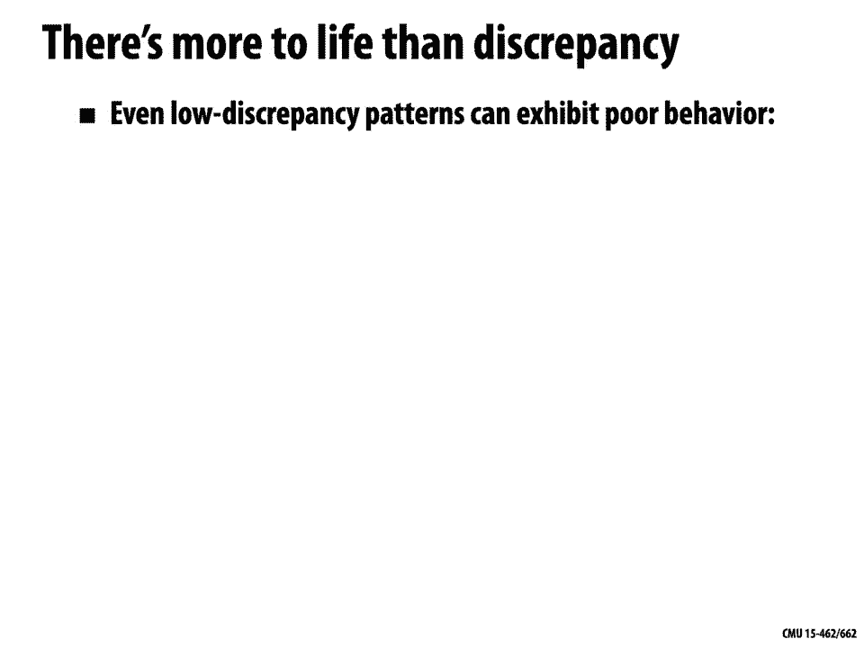

regular grid pattern so just to really，put the finger where it hurts let's。

consider this function this kind of，sinusoidal function and let's say we。

want to integrate that over the square，well if I put down a regular grid of。

samples in just the wrong place I，evaluate the function at those sample。

points and I take their average，depending on exactly how the grid lines。

up with the function I could get，completely different estimates on the，left I'm。

get one if the grid shifts a little bit，or the function shifts a little bit on。

the right I get zero so this is clearly，a undesirable behavior this is gonna。

cause all kinds of aliasing when we go，to render an image and so what we'd。

really like is for this pattern to be at，least an isotropic it doesn't have a。

preferred direction we'd also like it to，be something that doesn't have any。

preferred frequency it doesn't line up，with features of a certain size but it's。

kind of equally treating features and。

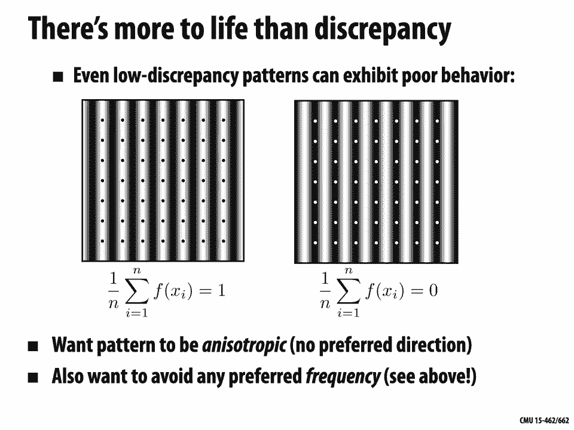

frequencies of all different sizes the，same way so one type of sampling pattern。

that does a pretty good job at this is，something called blue noise and this is。

got some biological motivation that if，you look at the retina of a mammal like。

a rhesus monkey then you'll see that the，cells on the retina have a nice。

distribution and if you plot the Centers，of these cells they're gonna look。

something like this pattern on this on，the right which is known as a blue noise。

pattern we'll talk a little bit about，what that means in just a second but the。

high level is there's no obvious，preferred directions in this pattern and。

there aren't really preferred，frequencies you might say there's a kind。

of smallest scale the seperation between，the points but otherwise I don't see you。

know clear gridlines or something like，that in this pattern how can we be a。

little more precise about this notion of，an isotropy and uniform frequency。

distribution what we can analyze the，quality of a sample pattern in the。

Fourier domain we've looked at a couple，examples of this before where we can。

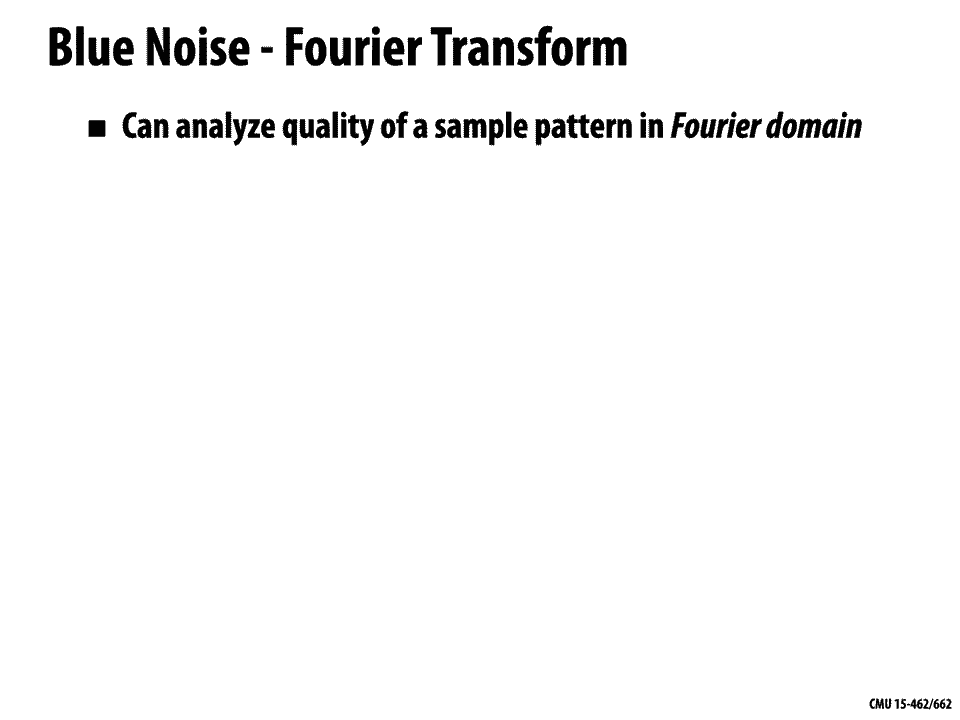

take an image and express it in terms of，its frequencies along different。

directions so here we'll do this for our，different sample patterns we can just。

take an image of our sample pattern and，we can ask in each direction and at each。

frequency how much does that pattern，line up with a kind of sinusoidal wave。

along that direction and with that，frequency with that width so in the，center of our plot。

our is a number just representing how，much does the pattern line up with a。

constant function as we go out from the，center the radius on this plot is。

representing the frequency and the，direction that we go out is representing。

well the direction of this sinusoidal，wave so if we look at the Fourier。

transform for the regular pattern what，we see is that the Fourier transform。

looks really kind of ugly there's some，frequencies that really line up really。

well with the pattern basically anything，that's a multiple of the grid spacing。

along the X in the Y direction we have，some clear preference and so forth if we。

look at this blue noise pattern on the，right it looks a lot more uniform it's。

not perfectly uniform but it looks a lot，more uniform we notice especially for。

higher frequencies there's not much of a，you know preference in direction or in。

frequency and in the middle we have this，very bright ring which really just。

corresponds to the spacing between。

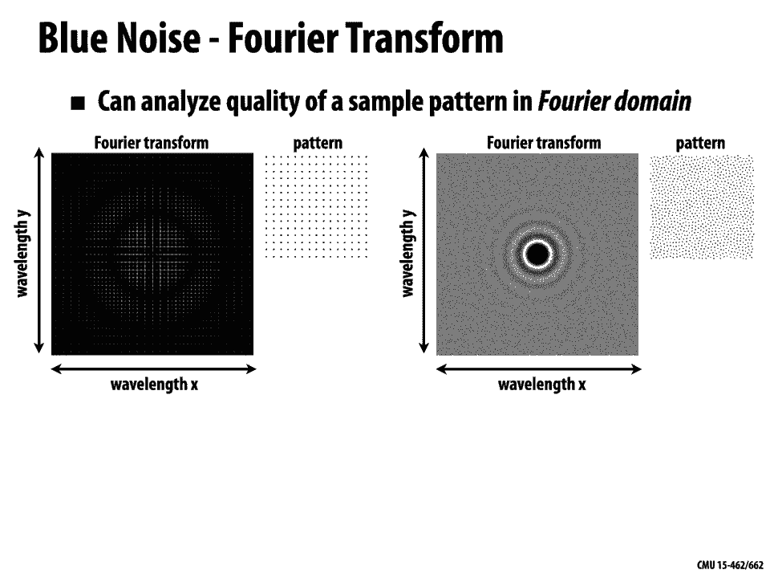

sample points okay so in general you get，the sense that this blue noise pattern。

is going to do perhaps a lot better job，at avoiding aliasing and in fact if we。

use it for some kind of integration task，we'll see that that's really true so at。

the top we have three different sample，patterns something that's uniformly。

random something that looks pretty good，what is not quite the same as our blue。

noise pattern and then on the top right，is the the blue noise to really see kind。

of look under a microscope or get a，sense of are these really good patterns。

we can look at the spectrum and the，uniform pattern actually does really a。

good job in the spectral domain in the，sense that there's no bias but it has。

these other problems we've talked about，it has actually very high discrepancy。

this middle pattern although it looks，pretty nice when we just look at the。

samples you can see it has some，artifacts in the spectral domain some。

preferred directions and if you go back，to the pattern you see actually there。

are kind of these little regions that，are almost regular grids and on the。

right we have this blue noise pattern，that really is uniformly distributed in。

both frequency and direction it has much，better discrepancy than the。

uniformly random pattern right much，lower discrepancy so what are we going。

to do with these patterns we're gonna，take the zone plate image which is just。

oscillating concentric circles of higher，and higher frequencies and where you're。

going to use this pattern to average，that function onto each pixel of our。

image okay and so what you can imagine，that this function kind of should look。

like as the frequency get higher and，higher and higher and higher you'd。

imagine that the values just averaged，out and it becomes a uniform gray color。

the uniformly random sample on the Left，column still has a lot of noise in it。

the pattern in the middle column does a，little bit a better job but you can。

notice in the upper right this kind of，weird stretching artifact it's not。

really clear what that is supposed to be，and in the bottom right things still。

aren't perfect but at least for a while，we do a good job of turning this high。

frequency oscillations into a nice，uniform gray okay so sampling perfectly。

is never an option eventually things are，gonna break down but we can try to have。

low discrepancy we can try to have good，spectral distribution how do we get good。

samples how do we get something like a，blue noise sample well one of the。

earliest algorithms is something called，poisson disk sampling and the basic idea。

is to just iteratively add random，non-overlapping disks of some fixed size。

until there's no space left，so I plopped down a disk I plopped down。

another disk if my new random disk，overlaps one that's already there I toss。

it out and I try it again if you use，this strategy you get a sample pattern。

that has pretty decent spectral quality。

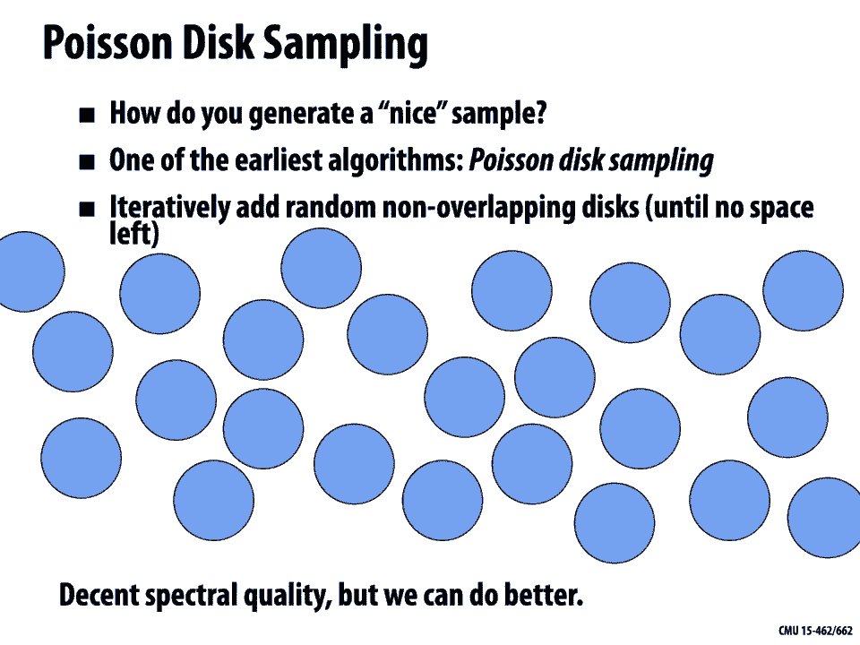

but you can do better so the next best，thing you can do is take these points。

and iteratively move each point to the，center of its neighbor you have its。

local neighbors so kind of try to find，your K nearest neighbors find their。

average try to move yourself toward that，average again without bumping into each。

other do that over and over and over，again but you'll eventually settle into，a nice pattern。

this does a little better it's slow to，converge we can do even better and。

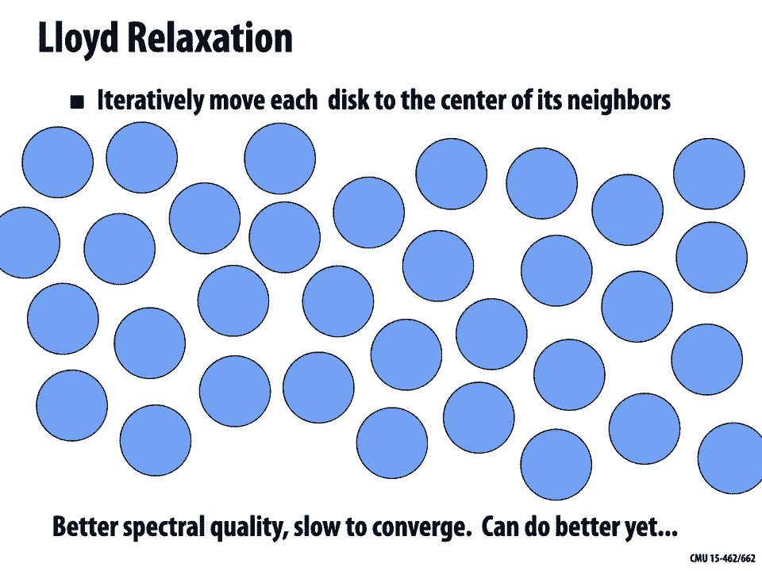

actually drawing from an idea that's，common in geometry which is to use the。

Voronoi diagram so this is a natural，evolution of this Lloyd algorithm which。

is to say we're going to associate each，sample point in the plane with a set of。

closest points with so called Voronoi，cell so here the black dots are our。

Voronoi sites the points that we want to，arrange in the plane and the colored。

regions are the regions that are closest，to each of those points okay and we can。

then optimize qualities of this diagram，so we could say okay this original one。

has cells that have all these different，shapes and sizes well at very least。

maybe what we want is that each site is，at the center of the cell at the center。

of mass or maybe you also want to，optimize these cells so that they have。

roughly uniform area and as you do this，you get a set of sample points these。

sites that look really nicely，distributed so we can do this not only。

for just uniformly sampling the plane，but also if we have let's say image。

based lighting we want to distribute the，sample points over the region of the。

image so that there's more samples and，regions that are bright fewer samples。

and regions that are dark it's low，discrepancy and it has good spectral。

distribution right one at all and here，we have this nice beautiful sample。

pattern the computational trade-offs is，well it's pretty expensive to。

pre-compute but on the other hand once，we have this pattern and we reuse this。

sample pattern over and over and over，again to do lighting the amortized cost。

is a lot lower because we have lower，variance for the same number of samples。

okay okay finally one thing we have to，grapple with especially in an example。

like this image based lighting is how do，we efficiently sample from a large。

distribution and if we're sampling from，an image map that's providing lighting。

for the scene we have a huge number of，variables so when we talked about。

sampling from a cumulative distribution，function before，we had this inversion idea we take our。

probabilities we take the cumulative，sums of those probabilities to get a。

discrete cumulative distribution and，then if we want to sample a value from。

this distribution we uniformly randomly，sample the interval 0 1 and we use a。

binary search to find which event we got，from our CDF how much does this cost in。

terms of the number of possible events，what is the cost of drawing a sample。

from this distribution well if you，ignore any of the pre-computation then。

the cost of each sample is log n doing a，binary search right so if we're doing M。

samples then the cost is going to be，order n log N and if we have a lot of。

pixels in our environment map for，instance this can start to get fairly。

expensive so a different strategy that's，quite nice is something called an alias。

table we can get amortized order one，constant sampling by building this thing。

called an alias table the basic idea is，rather than build a inverse CDF or。

rather than building a CDF and inverting，it we're going to Rob from the rich and。

give to the poor we're going to turn our，probability distribution into something。

in some sense more uniform okay so the，way this works is we have our。

probability distribution x1 through x4，we have these four events and we have。

the Associated probabilities and we're，gonna go through the list and if we have。

a event whose probability is greater，than the average we chop it off and we。

move it into one of the events that has，a lower than average probability and we。

keep doing this until we've filled out a，table where every column has two at most。

two possible events in it，and those two vents have different，labels okay。

and we know that this is going to work，out because there's as much stuff above。

the average as below the average when we，started okay so now we have this table。

this alias table that stores two，identities and a ratio of heights per。

column it's a sample from this thing，it's really easy we just uniformly pick。

a value between 1 and N which column do，we look at we do a biased coin flip we。

get a value between 0 and 1 and we see，is that value less than or greater than。

the ratio stored in that column if it's，less than we store or we return the。

first event if it's greater than we，return the second event super simple in。

some sense even perhaps easier to。

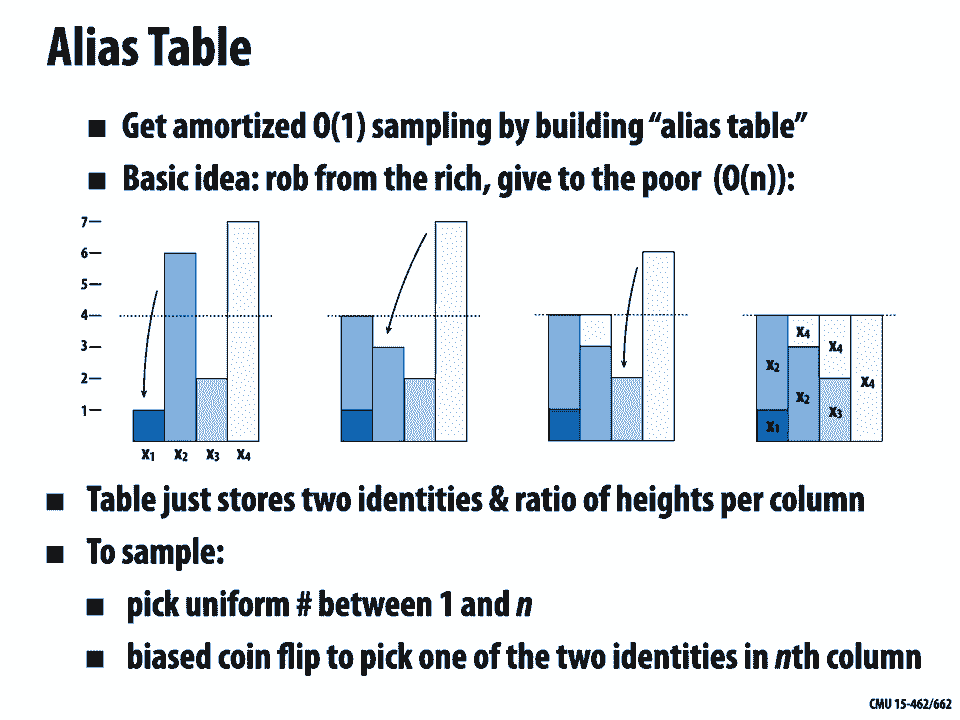

implement than this idea of inverting a，CDF okay all right so that's great so。

now that we've mastered Monte Carlo。

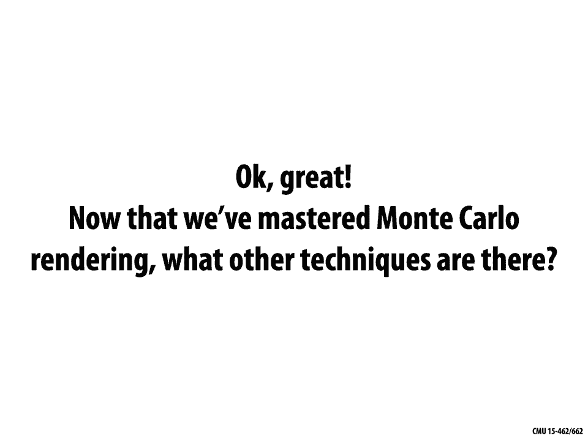

rendering what other techniques are，there just to wrap up you know there are。

a lot of things we haven't talked about，in terms of rendering algorithms one of。

the most popular ones is something，called photon mapping so here the idea。

is really a strategy from the light，source rather than from the eye or。

something that combines the two in in，some sense like bi-directional tracing。

so we trace particles from the light and，rather than immediately constructing。

pads we're just gonna store these，photons these these paths that we got。

from the light in a spatial data，structure in something like a KD tree。

now when we go to render our scene we，shoot rays from the eye and we see which。

photons are nearby and we gather up this，illumination to compute our estimate。

this is especially useful for features，like caustics that really have to do。

with light getting focus through，reflected material it's also useful for。

things like fog participating media and。

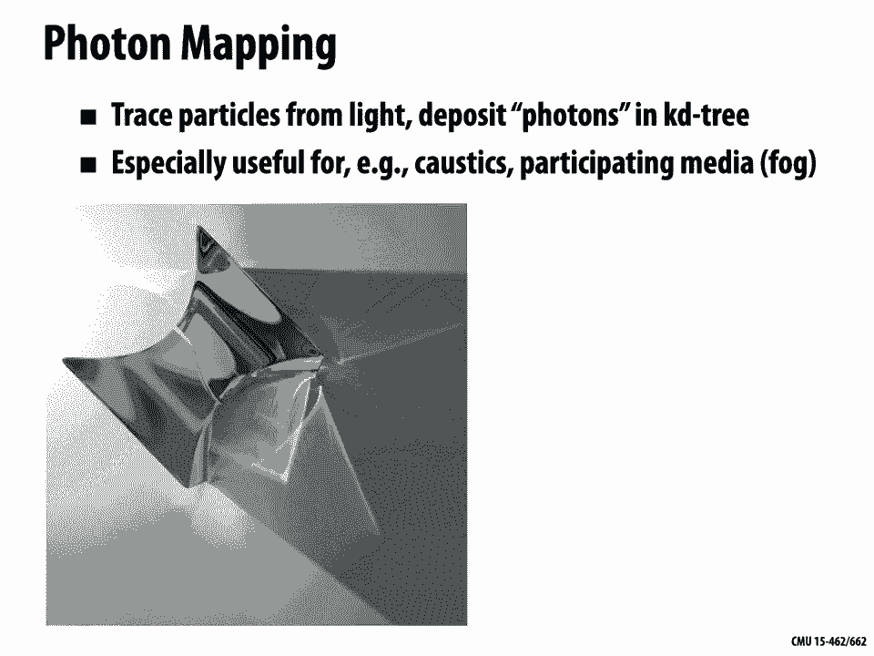

here again we can use these ideas about，sample patterns to improve quality so。

maybe you take the locations of these，photons in the scene and you run some。

kind of lloyd relaxation or Voronoi，finally a strategy that is kind of one。

of the first methods for global，illumination is finite element radiosity。

this is a very different approach rather，than really thinking too much about。

Ray's and ray tracing we're gonna chop，up the geometry of the scene into little。

patches and then ask how much light gets，transmitted from one patch to another。

this sets up a large linear system that，we can solve for the equilibrium。

distribution of light in the scene so，this is really good for diffuse lighting。

if you have mostly you know painted，walls and so forth on the other hand。

it's very challenging because you have，to solve this hard meshing problem you。

have to cut up your mesh or your scene，into nicely shaped elements and that can。

be a huge headache in practice okay so，we can return down to this list of。

consistency and bias and get a sense of，you know how did we do in each of these。

algorithms we said rasterization is not，consistent and it's biased path tracing。

is almost consistent and unbiased but，can miss certain types of light paths。

bi-directional path tracing gets them，all because we can trace from the light。

or from the eye and connect them up in，any way we choose metropolis light。

transport can also capture all paths，usually it's seeded with paths from。

bi-directional path tracing photon，mapping interestingly enough is。

consistent but biased so as we add more，and more and more photons to the scene。

will approach the correct answer but for，a given set of photons the expected。

image we generate is not the same as the，true image and finally radiosity is。

neither consistent or unbiased because，at least in its basic form it can only。

model diffuse illumination just like，rasterization and to some degree path。

tracing it ignores important types of。

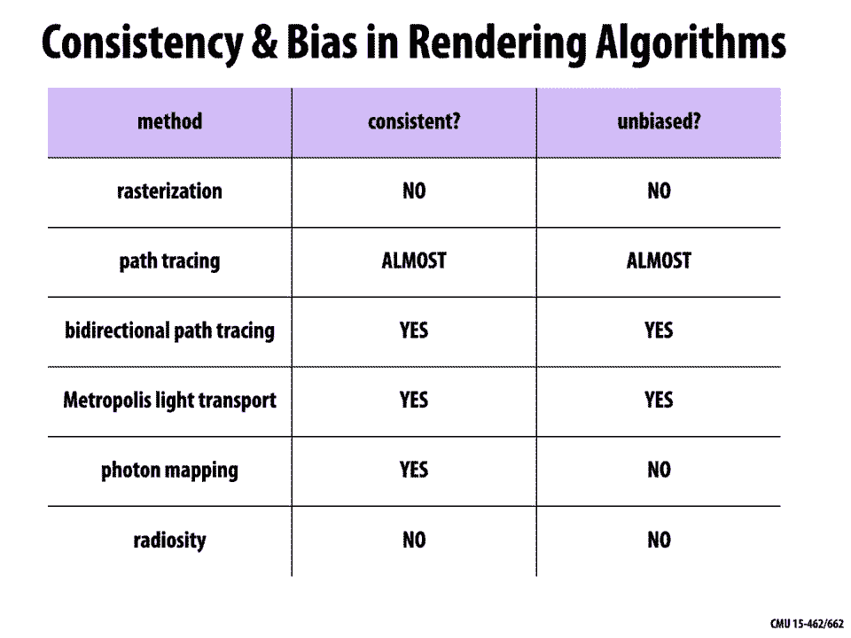

light paths one final question that's，really interesting to think about from。

the perspective of computer science is，can you certify a renderer so can you。

come up with a renderer that，comes with a certificate a provable。

formally verified guarantee that the，image it produced correctly represents。

the illumination in a scene and even，though Monte Carlo estimators are。

consistent and unbiased this is harder，than you might think this is kind of an。

inherent limitation of sampling，something we've been kind of hinting at。

all semester is that if you're sampling，a function you're taking a finite number。

of samples you can never be a hundred，percent confident that you didn't miss。

something important it could be that the，next feature that the important feature。

is just one sample away，all right there's this thing you've，never seen yet but if you just took one。

more sample you would discover something，really important is there so we can。

think back to this example of the two，rooms connected by a small hole or a。

small slit but take that to an extreme，imagine the rooms are connected by this。

absolutely tiny pinhole and in one room，is the observer the other room is an。

incredibly light bright light source and，if you think you have an algorithm that。

works you can always make that pinhole，smaller and you can always make the。

light source brighter right so really。

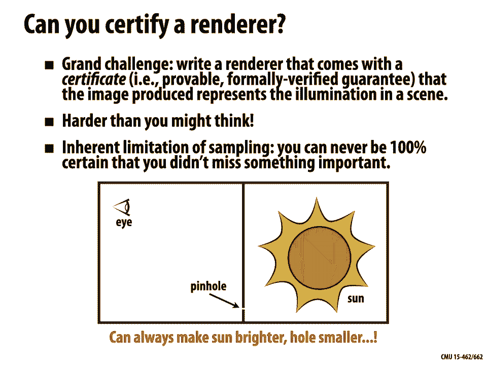