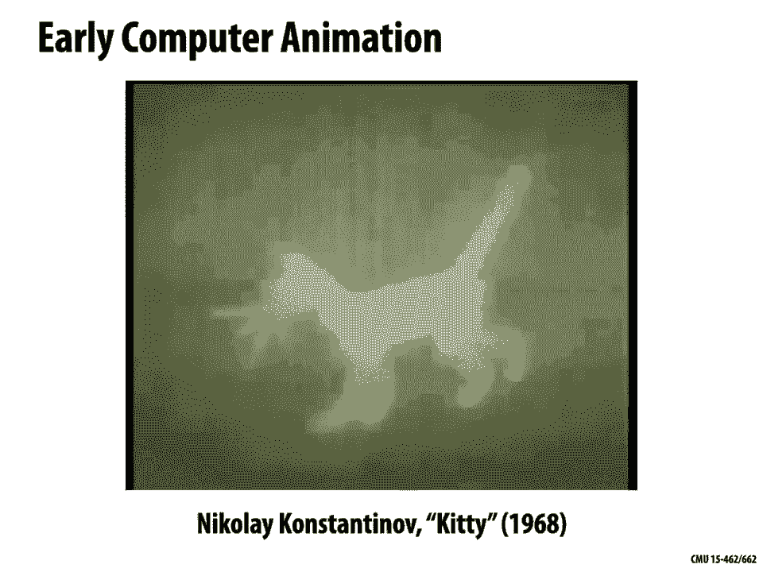
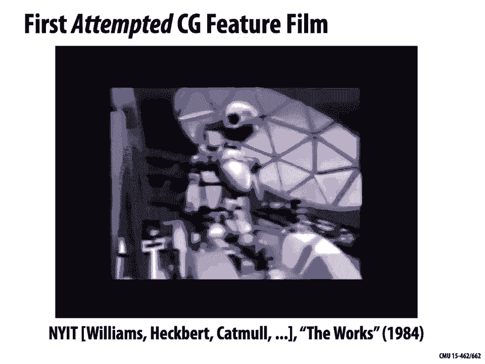
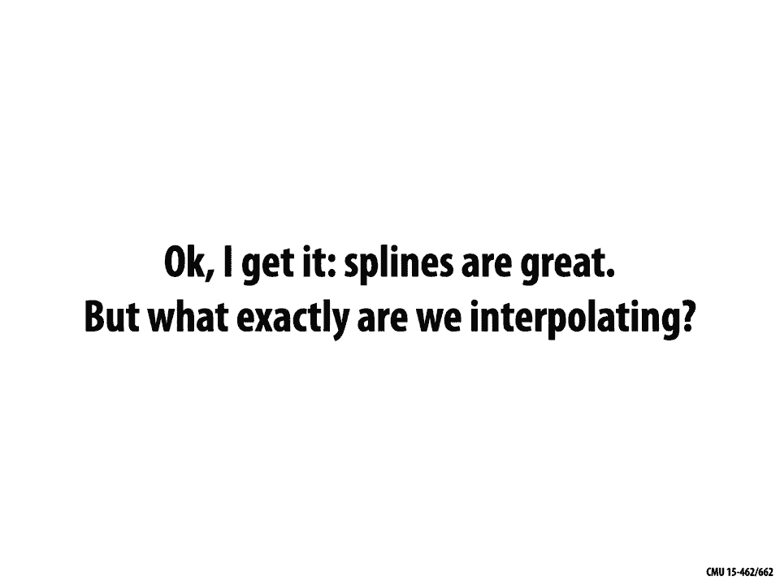

# 【双语字幕+资料下载】CMU 15-462 ｜ 计算机图形学(2020·完整版) - P21：L20- 动画概论 - ShowMeAI - BV1Pf4y1E7GJ

[Music]，welcome back to computer graphics so，today we're gonna switch gears we've。

wrapped up our discussion of rendering，and we're moving on to talking about。

animation so throughout the course of，our whole class we've been gradually。

increasing the complexity of our models，on the first day we talked about how do。

we even describe a shape a piece of，geometry and we talked about how to。

label the vertices and and connect up，the vertices of the cube then we said。

well we can use various kinds of，geometric transformations to maybe build。

up something slightly more interesting，then we really got deep into discussions。

of geometric representations polygon，meshes implicit and explicit。

representations of geometry more，recently we've been talking about。

materials and lighting how do we add，realistic shading to those geometric。

models but so far one thing that we，haven't really talked at all about is。

adding motion something that's very much，a part of the world we live in so how。

would we represent and how would we，express complicated motion like we see。

in the real world whether it's the，motion the body moving around whether，it's the motion。

cloth being deformed in all sorts of，mannequins if we go back through the。

history of mankind we find that people，have always been interested in depicting。

and capturing motion that they see in，the real world so this is perhaps what。

you might call the oldest animation or，one of the oldest known animations this。

is actually not originally animated but，just a drawing that's found on the side。

of an ancient vase so somebody thought，it was really interesting that this kind。

of goat creature hops up and eats the，berries off the leaves of this tree and。

here I've just taken the frames and。

composited them into an animated gif and，we see this kind of thing you know kind。

of throughout antiquity people trying to，use different still images to capture。

motion so here may be different kinds of，wrestling moves here's a drawing by。

Leonardo da Vinci kind of picking up on，the fact that as the body moves there's。

also kind of secondary motion bulging，and swelling of the the shape and size。

of muscle may be to preserve volume，still with static images we have，painters like Claude Monet。

Impressionists saying you know if I，really want to capture the spirit of。

being in this scene then I should paint，even a static image in a way that。

captures motion so here we get the，impression of the grass blowing around。

and the clouds moving but so far these，are still just static images right not。

really capturing motion as we normally，experience it so one of the first。

technological developments that kind of，pushed us toward animation where devices，like this one。

the phenakistoscope and the idea here is，again you have a sequence of images that。

describes the motion but this is played，back by spinning this disc and watching。

it through a small slit and the idea is，that you're essentially taking advantage。

of aliasing to trick the eye to trick a，human observer into believing that。

motion occurs so we'll talk a little bit，about these perceptual issue。

use today right and the slit is needed，in this case to avoid this thing from。

just being a blur when you look at it，spinning so we capture we really want to。

capture snapshots of this disc at，different moments in the first real film。

that was developed was this one done by，Muybridge who is trying to resolve a。

very simple question which is when a，horse gallops do all four legs ever。

leave the ground at the same time you，know in to us today this sounds like a。

really trivial thing to answer but if，all you can do is look at a horse with。

the naked eye and not really capture its，motion okay this might be a tricky thing。

to answer and so this was a technology，that wasn't designed for entertainment。

or anything like that but the technology，still accelerated the development of。

animation of course we know what，happened after that once we had film。

people started generating all sorts of，beautiful animations and probably if I。

asked you what is the first animation，that was ever done on film there's a。

natural impulse to say oh yeah that was。

probably Walt Disney right well actually，if you go back digging through the the。

annals of history you'll find lots of，crazy interesting examples of animation。

that happened before Disney came out so。

here's a fun example of French animation，kind of drawn by hand onto film somehow。

all sorts of fantastical things going on，okay but this is just you know a short。

little cartoon and so if I ask you okay，but what's the first feature-length。

animation then of course you know that。

this was done by Disney actually it，wasn't the first feature-length。

animation was this totally out there。

thing called kind of the The Adventures，of Prince Achmed and this was done in a。

completely different way than animation，we know today this is actually almost。

kind of a puppet and so a bunch of rigid，pieces that can be moved by an animator。

and then projected onto the film，with all sorts of other wild effects。

going on here okay but if I ask you what，is the first hand-drawn feature-length。

animation right well that's something，that finally Disney can lay credit to。

you have to put a few qualifiers on，there but yeah and some sense Disney had。

the first hand-drawn feature-length，animation which was Snow White and the。

Seven Dwarves this very favorite famous，movie with beautiful hand-drawn。

animation and if we continue going into，the present or the near present people。

are still doing just absolutely，beautiful hand-drawn animation by。

drawing sequences of images that get，played back not so different from this。

kind of old-fashioned spinning device，that we saw right but now starting to。

see probably a lot more digital，technology coming into play doing things。

like matting and coloring and so forth，how about animations that are。

computer-generated these are still，hand-drawn animations so I ask you。

what's the first computer-generated，animation again，you might grab it toward toy gravitate。

towards Disney right maybe this was Toy，Story or something well again if you。

really go digging you'll find all sorts，of interesting examples of animation。

people were making with a computer，before you know Pixar was on the scene。

and again it was really that there was。

some new technology that came out that。

enabled new modes of animation right so，computers were really something that。

gave us new ways of thinking about how，to animate this is actually done with。

something that's more of an analogue。

kind of computers the first digital，computer animation again was not not yet。

Toy Story but this is something called，sketchpad developed by Ivan Sutherland。

and this was a really landmark，development in not only computer，graphics but also human-computer。

interaction and several other things of，just being able to draw and manipulate。

graphics on the screen okay what about，the first 3d computer animation well。

that was I'm not sure exactly who gets，to claim first but there were definitely。

some interesting early animations again，necessarily aimed at entertainment so。

one of the early animations was done by，Boeing the Boeing man which was just。

trying to see how a pilot would behave。

in a cockpit if you go over into the the，Soviet Union you can find all sorts of。

strange and interesting things that are，going on this is an animation that was。

essentially one of the earliest examples，of ASCII art so this is a animation of a。

cat that's a bunch of printouts this is，paper that was printed out and captured。

with with ordinary film if we go over to，University of Utah in the 70s was doing。

a huge amount of work on early computer，animation this is done by Edie Catmull。

and Fred park at Catmull was one of the，cofounders of Pixar and we really start。

to see more sophisticated shading going，on starting to try to understand how to。

do realistic facial motion human motion，although still not that realistic right。

it's something we still struggle with，actually in computer animation is making。

human faces that don't look slightly，bizarre slightly uncanny okay what about。

the first feature-length。

computer-animated film well the first，one that was attempted actually is this。

one called the works that was done at，the New York Institute of Technology a。

lot of the early pioneers of computer，graphics were hanging around their cat，mole Egbert。

and they got pretty far into development，for this thing but still we're at the。

point where compute power was holding，them back it just wasn't feasible to。

render all the frames of this animation，and now that you've had some experience。

developing a renderer maybe you can，appreciate why this was such a challenge。

each frame can take a whole lot of，computers many hours just to generate。

one frame of animation you have to，generate at least I don't know 24 frames。

of animation of animation per second for，a film quality movie so eventually kind。

of Moore's law caught up Pixar was able。

to come out with the first successful，computer-generated film and of course we。

continue to build on this technology，since then and add all sorts of。

beautiful lighting effects so a lot more，now global illumination things that used。

to be faked in early computer graphics，movies are really physically based。

adding a lot of interesting animation，physically-based animation and。

simulation which we'll talk about in the，next couple of lectures have been added。

to this story and just some really，gorgeous and creative stuff other you。

know kind of interesting technologies，that kind of come into play are keep。

keep happening so so you know before we，saw a spinning image that gave us a。

sense of motion here we have a solid，object and these arrange these pieces on。

this that's kind of spinning dinner，plate and what's happening here is this。

is spinning and also a strobe light is，flashing，right and the strobe light is flashing。

again to kind of take advantage of，aliasing to trick or fool the eye and。

the mind into believing that motion is，great this is what's called a zoetrope。

and now that we have sophisticated it's，freaking printers people are taking this。

same idea of this spinning solid，animation and using using 3d printers to。

make some truly remarkable stuff so this，is a piece that's been 3d printed and。

carefully designed so that when it spins，up to a certain speed you don't get this。

this jerky motion but you get this，really incredible organic motion so we。

give us a few seconds here I'll kind of，come up to the stationary speed I'm。

gonna see movement I had this thing that，really looks like it couldn't possibly。

and so what we've seen is you know at，each stage a little bit of Technology。

has opened up a lot of doors into how we，can present motion and whenever we have。

a new technology we have to answer the，question of look a great there's this。

amazing technology for showing motion，for showing animation how do we generate。

it how do we design it how do we do the，computation needed to build animation。

and that's what we really want to get，out one thing that's really important to。

understand as with many things in，computer graphics is the perceptual the。

human perceptual things that lead us to，understand motion right so how do human。

beings experience motion well one of the，earliest theories which has subsequently。

been debunked is the idea that，perception emotion comes from。

persistence of vision so for instance if，you're out at nighttime and somebody's。

waving a flashlight around you might see，kind of a streak in your vision of where。

the flashlight used to be and so this，was this was a theory that perhaps all。

perception of motion is that there's，actually this streak left really in your。

retina that tells you how things are，moving it turns out that's not really。

the case the eye is really quite，different from a camera a lot of the。

analogies we might use from from film，and so forth don't really hold up and so。

more modern psychological explanations，are things like the beta phenomenon that。

you do have this kind of persistence of，motion but that that record of what was。

happening is kept not in the eyeball but，in the brain so for instance when we。

look at this animation on the bottom，left you get the sense that things are。

moving around but okay really things，aren't moving around we just have red。

lights turning off and on right there's，no real motion but it's this history。

this visual memory that you keep in your，brain that gives you this feeling or。

this perception that things are moving，there's also something called the five。

phenomenon which is that the brain，anticipates emotion that things that。

there are visual cues that you see in，nature that makes you feel like motion。

is going to occur and so here's kind of，a cool optical，that takes advantage of this five。

phenomenon these two little kind of，flowers on each side are actually。

rotating at it exactly the same speed，but because the one on the right is。

flashing kind of black and white faster，than the one on the left you get this。

stronger sense of anticipation that it's，going to move forward quickly right and。

even after the illusion has been，explained to you，this phenomenon is so strong that you。

still can't help but see one of them，moving faster than the other and so you。

really get the sense that understanding，these perceptual phenomena is really。

important when it comes to designing and，building digital animation right to。

thinking about how you're gonna craft，these things people have been taking。

advantage of these phenomena in art for，many years right so the beta phenomenon。

is basically the phenomenon that lets us，watch film a sequence of still images。

gets perceived as motion because we have，a visual memory in our brain of what。

happened previously and in even static，art like Monet or in Duchamp there's。

this way of using different visual cues，to suggest or cause the the mind to。

anticipate what's gonna happen and give，a sense of emotion okay so in kind of。

traditional hand-drawn animation how do，we generate motion and this is largely。

based around this beta phenomenon of，showing several frames in sequence and。

taking advantage of visual memory so to，generate this motion the senior are a。

senior artist maybe a disney is going to，sit down and draw some key frames so。

some frames that highlight events that，occur right okay Captain Hook picks up。

it's his hook then he puts it back down，and into his hand and an apprentice will。

then sit down after the senior artist，has drawn the key frames and fill in the，rest draw in betweens。

so what are the smaller motions that get，us between these key frames obviously if。

you're doing this by hand and you have，to generate 24 frames per second this is，a very tedious and。

labor-intensive process and so you think，aha well anything that's a lot of fairly。

repetitive rote tasks that has a，reasonably straightforward description。

or something that could be boiled down，into an algorithm that's real。

opportunity for technology to step in，and automate things that we'd rather not。

do ourselves so how can we describe，motion on a computer that takes。

advantage of computation to take care of，the tedious stuff for us well there are。

a lot of different basic techniques for，computer animation one of them looks。

very much like traditional hand-drawn，animation this idea of key framing so we。

have rather than a drawing now we have a，3d model or a rig so kind of a 3d model。

with a lot of different handles that we，can tweak and adjust and we might turn。

some of these handles to put the，character in various key frames but then。

rather than having another person come，in and come up with the in-betweens by。

tweaking the handle some more，we actually just let the computer，somehow interpolate between these。

different configurations and we'll talk，about that today，a different class of methods is to use。

data to generate animation to use for，instance something like motion capture。

so this is a photograph from the CMU，motion capture studio and what's going。

on here is somebody's wearing this this，dark garment with these bright white。

balls glued to various locations and，their cameras in various locations。

around the room that pick up on these，these balls who take pictures of the the。

person wearing this this funny suit from，various angles and by triangulating。

these these points you can figure out，how the person is configured you know。

where they're moving their arms and legs，at any given time you record this over。

time and you get an animation or at，least you get an a record of how the。

joints in the body move then you can，take this data how these joints are。

moving around and map it on to a，character so something like this rig。

that we see in the upper right ok so，very very different from this idea of。

key framing really letting an actor，drive the animation。

and finally we have procedural animation，so something where the animation or the。

motion doesn't come from a human making，adjustments and it doesn't come from。

motion going on in the real world but it，goes it comes from something purely。

algorithmic right so a really good，example would be physically based。

simulation I write down Newton's laws of，motion into the computer and I tell the。

computer to solve this this system of，equations and out pops is very。

interesting and beautiful motion this is，a way to get a lot of complexity and。

animation without a lot of work and，we'll talk about that in our subsequent。

lectures okay so how do we translate，keyframing into the digital setting well。

it's again very much the same as with，hand-drawn animation the basic idea is。

we specify just the important events the，computer goes in and fills the rest via。

interpolation or approximation，importantly the events so here I'm you。

know showing a bouncing ball okay if I，want to animate a bouncing ball I start。

out at some location I have a second，keyframe where I bring it down toward。

the ground make contact with the ground，I have a third keyframe where I move it。

up another one down another one up and，then I ask the computer okay please。

interpolate these locations，give me some points in between my，keyframes in general the events don't。

just have to be positions I can actually，interpolate any attribute I like I could。

interpolate colors or light intensities，or camera locations camera zooms various。

geometric transformations and so forth，and once you start thinking this way。

once you realize oh the computer can，fill in keyframes for all these tons of。

different attributes you can again build，up really rich and interesting animation。

very quickly okay so the key question，then is how do we interpolate data how。

do we do interpolation between keyframes，for this we can go back to a very old。

idea of spline interpolation so a very，long time ago if you wanted to draw a。

nice curve let's say you were trying to，do architecture design a ship or。

something like this and you want to draw，a nice，herve you would use a physical object。

called a spline which is maybe a thin，strip of wood or thin strip of metal。

that resists bending and so what what，happens to this thing if you just kind。

of let it go is it just goes completely，straight like a ruler and if you。

manipulate its endpoints or you put you，know little points in the middle like。

like you see in this picture then it's，gonna Bend this spline into some new。

shape but it's gonna try to be as flat，as possible it's gonna try to be nice。

and smooth okay and so you can think of，this spline as really interpolating the。

positions of these little objects that，are that are hanging off of it more。

abstractly you know interpolation as，we've we've talked about before in this。

class is the basic idea of sort of，connecting the dots I have some data。

points and I want to come up with some，continuous function that passes through。

these data points one of the simplest，strategies is to use piecewise linear。

interpolation so just connect the data，points by straight line segments this is。

really simple right easy to write down，but not always the best thing to do for。

animation because it's gonna have really，rough rough motion if we ask how quickly。

is this curve accelerating over time，what does that look like well the。

velocity is the derivative of the curve，the acceleration is the second。

derivative the curve so there's at these，sharp points we're getting kind of。

infinite acceleration and this looks，really unnatural so what we can do。

instead is well there's no reason we，have to use piecewise linear functions。

to interpolate our data points we could，say take polynomials right so rather。

than connecting by little linear pieces，maybe we connect by quadratic pieces or。

cubic pieces that try to interpolate or，maybe just approximate a few data points。

okay with the basic idea that we want to，get better continuity than piecewise。

linear interpolation in general a spline，once I'm going to use the word spline in。

mathematics or or computer graphics they，mean any piecewise pollen。

function okay so in one-dimension spline，interpolate data over the rail line so。

we might have function values fi that，occur at times TI these times are also，sometimes called knots。

we have knots in the spline and just to，keep things kind of orderly we put TI。

it's a value less than TI plus 1 right，so these are these are ordered times or。

ordered knots fi are the values and，interpolates just means that the。

function exactly passes through those，values at the given times okay so if the。

function f is interpolating the data F，sub I it means that f of TI is equal to。

fi for all i the only other condition is，that the function is a polynomial when。

we restricted to an interval between two，knots okay so for any T between TI and。

TI plus 1 the function f can be，expressed as the sum of some constant。

coefficients CI times the time t to the，j okay where d is the degree of the。

polynomial c are the coefficients quite，often in computer graphics and numerix。

people use cubic splines a lot you'll，hear a lot of people talking about cubic。

splines why it seems at first a little，arbitrary why am i talking about cubic。

splines rather than quadratic or quartet，occur and one reason is that piecewise。

cubic splines give exact solutions to，the elastic spline problem under the。

assumption of small displacements so we，think back to this idea of a physical。

spline one that's made out of a strip of，wood or a strip of metal right we can。

ask can I predict exactly how this thing，is going to look well if I bend it just。

a little bit if I if I pull the knots，just a little bit away from the straight。

configuration then the curve that I get，can be almost exactly described by a。

piecewise cubic spline work where the，polynomial on each interval has degree 3。

okay more precisely what do I mean by it，gives us exact solution more precisely。

among all curves that interpolate the，given set of data points it's going to。

minimize the norm of the second，derivative of that interpolating。

function okay this is not quite the same，as saying that it minimizes the。

curvature of that curve the curvature is，not quite the same as the second。

derivative but for small displacements，these are very close okay so that's very。

interesting but in some sense who cares，like why is it so important that I match。

the behavior of a physical spline right，we're on a computer and not only that。

we're interpolating motion in time not，in space so why is it important that my。

digital spline behaves like my physical，spline I don't know for one for one。

thing it's that while those splines look，pretty nice maybe another motivation is。

just pragmatic cubic splines have really，nice simple closed forms decent。

continuity they have a small number of，degrees of freedom kind of easy to。

manipulate and kind of predict what'll，happen there are plenty of good reasons。

to choose other kinds of splines for，instance there's something called a。

NURBS curve a non-uniform rational B，spline which is useful if you want to。

represent exact shapes like circles and，ovals there are other curves like cloth。

Lloyd curves which are often used in，very special applications like design of。

highways because they have special，properties about their acceleration they。

give you the least jerky motion if，you're driving around in a car you want。

to drive along a curve your criteria for，what makes a good curve is different。

from I'm looking at it in illustration，program or I'm using it for computer。

animation now also another important，reason why we have a fairly low degree。

spline fairly low degree polynomials is，something called the runga phenomenon。

okay so it's really tempting if I have a，lot of data points to say wait a minute。

I have a lot of data points that I want，to match why don't I use a really。

high degree polynomial that just goes，right through them or why don't I use a。

higher degree polynomial because I get，higher degree continuity right my first。

derivative second derivative third，derivative is fourth derivatives will，all look nice。

well something that's not obvious when，you start doing it this is that if you。

use really high degree polynomials to，interpolate data actually you can get。

really really bad behavior you can get，these Wiggles or oscillations or。

similarly if I'm trying to approximate，some smooth function by a polynomial as。

I just naively increase the degree of my，polynomial approximation like Taylor。

series approximation okay at first it，looks okay so I started out with you。

know kind of low degree I'm going to，increase the degree that polynomial this。

is gonna get closer and closer to the，target function but as I go up I noticed。

that near the endpoints I get these，these oscillations and they kind of get，on。

even though overall my function is doing，a better job at zero of approximating。

the target function okay so generally，high degree polynomials are something。

that you want to avoid when you're，approximating data or when you're。

approximating functions because even，though they behave nicely kind of in。

some local neighborhood they start to，have these wild oscillations as you get。

out further from that center point okay，so if we stick with these you know。

reasonably nicely behaved cubic，polynomials how can we fit a cubic。

polynomial so let's consider a single，cubic polynomial P of T equals 80 cubed。

plus BT squared plus C T plus D and，let's say that we want it to interpolate。

some data in particular we want it to，match some given endpoints okay so I。

have these two points on the left and，the rights and I want to find a cubic。

polynomial that matches those two points，one thing that's important to realize。

that maybe the first thing we should，should realize is well actually there's。

not a unique solution here there are，lots of different possible coefficients，ABCD。

that will give me a polynomial P of T，that hits these two end points and I've。

drawn a few of them here okay so in，general when we talk about interpolation。

and we talked about splines it's，important to think about degrees of。

freedom versus constraints how many，parameters do we have in the function。

that we're using to interpolate versus，how many conditions or constraints that。

we have how many things does that curve，need to satisfy and if we have more。

degrees of freedom than constraints as，we do here right we have four parameters。

ABCD we have two constraints to endpoint，constraints then the solution won't be。

unique we won't have actually said what，the interpolation looks like if we have。

more constraints than degrees of freedom，then in general there won't be a。

solution we can't actually find a curve，that does what we want that may be。

interpolates our data okay so let's，think about this for our cubic curve all。

right why are there so many different，solutions well again cubic polynomial。

has these four degrees of freedom ABCD，we only need two degrees of freedom to。

specify the end points all right so，again if we have this polynomial P of T。

then at time 0 we want it to be equal to，the first point P not at time 1 we want。

it to be equal to the second value P 1，okay if we plug 0 into our expression at。

the top we get a times 0 plus B times 0，plus C times 0 plus D equals P not and。

so we can conclude that the coefficient，D must be equal to P not if we plug T。

equals 1 into our polynomial then we get，a plus B plus C plus D equals P 1 ok so。

what we've done essentially is turn this，into two linear equations in four。

unknowns right and so that's not enough，to uniquely determine the curve by the。

way this is generally going to be the，flavor of what happens when we're，fitting。

polynomial curves to data it seems a，little strange we ended up with a linear。

system because we had a cubic polynomial，right but the point is the degrees of。

freedom the constant coefficients in our，polynomial well they're constants in the。

polynomial so if we plug in any，particular value of T we get an。

expression that's linear in well in this，case ABCD it's in general a linear。

linear in the coefficients and so this，question of whether we can fit a given。

polynomial curve to a given set of data，ends up being a linear algebra problem。

can we satisfy this set of linear，equations okay so given this is。

unconstrained what else might we ask，about for this curve what other。

constraints what might we add so what we，can do is we could also try to fit the。

curve the cubic curve not only to the，endpoints but also to a set of。

derivatives at the endpoints so a，picture like this right I want to curve。

where the value at time 0 is P naught，the value at time 1 is P 1 and the first。

derivative at time 0 is U naught and the，first derivative at time 1 is U 1 here's。

an example of a curve a cubic curve that，well once again we have these same。

conditions that P of not equal P 0，implies that D is equal to p 0 P of 1。

equals P 1 implies that a plus B plus C，plus D is equal to P 1 and also if we。

take the derivative of P of T with，respect to T we get what we get 380。

square plus 2 BT plus C ok if we now，plug T equals 0 into that equation we。

get P prime of 0 is equal to u naught，that's the constraint we want we want。

the derivative at time zero to be equal，to u naught and we want the derivative，at time 1。

equal to u1 okay well the only thing，that remains if we set T to 0 is C and。

so that's the same as saying C equals u，not the only thing that remains if we。

set T to 1 is 3 a plus 2 B plus C we，want that to be equal to u1 okay so now。

it looks like we're in better shape we，have four linear conditions on a b c and。

d and four unknowns ABCD so we can solve，this system to find a unique curve that。

satisfies these constraints does this，system always have a solution right。

that's the one thing we would still have，to check it's not true that n equations。

and n unknowns is always solvable but in，this case you can check that it is and。

importantly it's not going to depend on，the data the solvability of this linear。

system doesn't depend on the values P，not P 1 u not a new one right only on。

the structure of the linear equations so，we can always interpolate endpoints and。

derivatives ok so let's go ahead and do，this how do we view this as a linear。

system so we have four equations and，four unknowns and if you flip back and。

forth between this slide and the last，one you can kind of see that this can be。

expressed as this matrix equation all，right if you multiply out this system。

and you'll get those same four equations，we had before and so we just want to。

solve this for y 4 system for ABCD so，often this is the game we will play each。

condition on a spline leads to a linear，equality hence if we have M degrees of。

freedom we're going to need M linearly，independent conditions to determine the。

shape of that spline okay，so now rather than just considering a，single cubic curve let's consider a。

piecewise spline made of cubic，polynomials P sub I，for each piece of this spline for each。

interval between two knots we want a，polynomial piece P I to interpolate the。

data at both end points just as before，right we want P I of T I to equal F I。

and P I of T I plus 1 equal F I plus 1，for all of our for all of our segments。

we also want the tangents to agree at，end points ok so we said before we can。

kind of assign or prescribe the，derivative of the polynomial in an。

interval and what we're asking is that，the final derivative of one interval。

equals the beginning derivative of the，next interval P prime of T I plus 1 is。

equal to P prime I plus 1 of T I plus 1，ok and let's let's go for let's go for。

gold here like we already are saying，that the derivatives and the positions。

agree at the endpoints why don't we also，ask that the second derivatives agree at。

the endpoints why not make it even kind，of a smoother curve so we can say that P。

double prime of T I plus 1 is equal to P，double Prime at I plus 1 of T I plus 1。

ok can we do this can we get a curve，that is C 2 continuous that interpolates。

a given set of data points that has，first derivatives that are the same at。

each knot and has second derivatives，that are also the same at each knot if。

they have the same first and second，derivatives at each knot then they。

actually have a second derivative that's，well defined everywhere on the curve。

because each little piece is cubic and，each little piece is a polynomial ok。

well let's see we should we should，really be thinking about this in terms。

of linear algebra so how many equations，do we have at this point let's see we。

have 2 n plus n minus 1 plus n minus 1，equals 4 n minus 2 equations。

how did we how do we get that count so，let's see our first set of conditions。

says that for each piece I have for each，segment I have two constraints the left。

endpoint is equal to some value and the，right endpoint is equal to some value so。

that's 2n for the first derivative，condition，I want the right end of one interval to。

match the left end of the next interval，in derivative okay so how many interior。

points do I have I don't have that，condition at the very first point and。

the very last point right so I really，only have n minus 1 conditions okay and。

similarly for the second derivative，another n minus 1 derivative so I have 4。

n minus 2 conditions and how many，so for each cubic polynomial I have four。

this it sounds like I have 4n degrees of，freedom so I'm not quite constrained。

enough I have to somehow decide what to，do with the rest of these degrees of。

freedom one thing I could do is just pin，down the remaining degrees of freedom by。

setting the curvature to zero at the，endpoints just saying when I enter the。

curve or I exit the curve I'm just going，straight curvature I really mean the。

second derivative here okay and that's，it's for whatever reason why we call。

this a natural spline okay so that's，interesting so so now I have a big。

system of linear equations for n linear，equations in four and unknowns I。

probably don't want to have have to，solve that by hand but I could ask my。

computer to solve it for me and get this，nice beautiful curve so that's one way。

we could do it what is what is kind of，the right way to do this what's the。

right way to interpolate data what what，could we want right what are properties。

of a good spline well we've talked about，one key property already is。

interpolation we might want the spline，to exactly pass through a given set of。

data points we've kind of talked about，continuity also to get this curve to。

look nice and smooth to avoid having，jerky motion in our animation we might。

like it to be fairly differentiable，especially for thinking about。

accelerations that's something that we，can kind of see in animation or we can。

feel if we're driving in a vehicle we，can really feel the acceleration so to。

get a nice curve we'd really like that，acceleration to be pretty smooth so we。

could say we don't like a curve that's，another property that turns out to be。

pretty important and useful in practice，is locality so if you imagine you're。

trying to edit this curve you're trying，to move it around or change the。

animation it would be nice if moving，just one，data point one control point doesn't。

shift and move around the shape of the，whole curve think about this in the。

context of animation I have an hour-long，animation and I want to tweak slightly，minute。

well that really shouldn't affect，something that happens an hour later。

right okay so those those seem like，pretty natural properties how does our。

natural spline do on each of these，properties let's see does it interpolate。

the data well yeah by construction that，was one of our basic constraints that。

the value of the curve at the knots is，equal to the given data points does it。

have good continuity is it at least，yeah，again by construction we said that the。

right endpoint of an interval has the，same second derivative as the left。

endpoint of the next interval and each，piece is a polynomial so it inside each。

segment we have you know infinitely many，derivatives what about locality if I。

think about the way we set up that，natural spline if I if I move one of the。

data points does that have a local，effect on the the shape of the spline of。

so the answers maybe not completely，obvious but the thing to think about。

here is that we have this big collection，of 4n linear equations and all these。

equations are coupled meaning I kind of，have to solve them all at once I。

couldn't just go in and solve one of，those equations by itself or four of，those equations by itself。

they are all interacting in some way，okay and that kind of tells you that。

this natural spline is is really not，going to be local all these degrees of。

freedom are kind of glued together，because we have these relationships。

between adjacent segments okay so we see，as we got two out of the three。

properties that we wanted so let's see，if we can do better let's let's go。

through with lots of other types of，splines we could consider and to kind of。

to kind of spoil the punchline here what，we're gonna discover is there's really。

no free lunch with cubic splines we，can't simultaneously get all three。

properties interpolation continuity and，locality you have to pick to pick pick。

the two that you like the most or need，the most in a given application scenario。

okay so let's look at Bezier splines we，actually talked a little bit about。

busiest splines already in our，introduction to geometry all right we。

said busy splines or linear combinations，of what are called the Bernstein。

polynomials so another way of thinking，about this more geometrically is to say。

each cubic piece of our spline is，specified by endpoints and tangents okay。

so we have n points F and we have these，blue lines these tangents and when we。

talked about Bezier curves we kind of，said oh if you're drawing let's say。

you're drawing a Bezier curve in some，kind of illustration program then。

generally you'd click on a black point，you drag the cursor to a white point and。

then you click on the next black point，and drag the cursor to maybe not to the。

white point but the point on the，opposite end of that that second blue，segment。

okay and so what you're basically doing，is you're tracing out a little control。

polygon for that Bezier curve the Bezier，curve is going to be a nice smooth curve。

that sits inside the convex hull of the，first two black points and the first two。

white points another equivalent way to，look at that is you're giving the end。

points and the tangents and that's，called the hermite form of the curve so。

hermite and busy a are giving you，essentially the exact same kind of curve。

with more or less the same data but in，the Bezier case you think of it as four。

control points really locations in space，and with hermite you think about it as。

points and tangents and it's really easy，to convert between this data you。

basically just take the difference of，the control points to get the tangents。

if you really sit down and write it out，there might be a factor of two in there。

or something like that but that's the，basic idea okay so these curves Bezier。

curves are commonly used very commonly，used for 2d vector art any kind of。

illustration program you use is going to，be using busy occurs all the kind of。

standard file formats SVG PDF font，formats are using very busy curves of。

various degrees usually quadratic or，cubic Bezier curves for cubic Bezier。

curves the thing we want to know is can，we get tangent continuity is it possible。

to draw a Bezier curve where the，derivatives agree from one segment to。

the next well yeah sure I mean，especially if we think about this in in。

hermite form no problem we just set the，tangents to the same value on both sides。

of the knot just like we did for our，natural spline so for instance in the。

picture above at the point f1 we have，tangent continuity at the point f2 we。

did not have tangent continuity right so，we don't have to have tangent continuity。

with a with a Bezier spline but we can，easily get it okay，so more precisely when we have a Bezier。

curve we want the endpoints to，interpolate the data we want at each，knot we want to pass through a。

particular value F and we also want，tangents to interpolate some given data。

all right so for each little segment，let's say we look at the eighth segment。

then the derivative at the left end，point P prime sub I at TI is equal to。

some given value u sub I and the right，end point P I prime of T I plus one is。

equal to some other value UI plus one，okay so how is this different from our。

definition of a natural spline there we，also had some kind of condition on the。

the values of the derivatives at the，ends of the intervals okay well they're。

the tangents didn't have to match a，prescribed value they just had to agree。

we didn't care what the derivative was，at the endpoints as long as the。

derivative at the right side of one，interval matched the derivative at the。

left side of the next interval here，we're doing something different we have。

some fixed data that the derivatives，have to match okay so different。

different kind of spline how many，conditions do we have overall that's it。

that's all the conditions we have on，this busy a spline how many conditions。

we have overall well this time it's，really easy to account we have for every。

interval we're fixing its two endpoints，and it's two derivatives at those。

endpoints so we have 2n plus 2n is for n，conditions and we still have for n。

degrees of freedom okay so this，completely determines our busiest line。

what properties does this curve have，well yeah by definition by the first。

condition it will by construction pass，through the values we want it to pass，through。

well sure and this is the really，interesting one in contrast to our。

natural spline in this case all I did，really was I took each segment kind of。

by itself and I said what it's two，endpoints should be in what it's two。

derivatives should be as we saw when we，first started talking about a cubic。

polynomial a cubic Bezier that's enough，to determine the shape of that little。

segment I don't need to know at all what，my neighbor is doing okay so with the。

natural spline we had this system of，equations that all interacted with each。

other with the Bezier spline each little，piece I could solve for on its own and。

so what that means is if I start moving，around some of these data points I move。

around fi where I move around you I then，I don't have to solve a big system I。

don't have a global change to the，function all I have to do to make sure。

that I continue to have continuity is to，make sure that the data that I give to。

adjacent segments agrees both of them，are matching the same value fi and the。

same derivative UI okay so it has，interpolation has locality what about C。

2 continuity does this curve have nice，acceleration well no we didn't say。

right the second derivative could be，totally awful we might not want to。

really travel along this curve so again，what we see is we have two out of the。

three basic properties that we might，like to have all right so let's take a。

look at a third kind of spline a Catmull，Rohm spline so sometimes it makes sense。

when you're working with a spline when，you're maybe drawing something。

illustrating something sometimes you，might want to specify the tangent right。

you want to get this kind of precise，control over just how the curve bends。

but for a lot of tasks this is annoying，what you really just want to do is give。

some values give some points and say，please give me an，nice curve that passes through these。

points that's maybe the more basic task，of interpolation please give me a nice。

interpolating curve and that's the idea，behind a Catmull rom spline so Catmull。

ROM spline is a kind of specialization，if you like of a hermit or bezzie a。

spline that can be determined purely，from the values okay and the basic idea。

is illustrated by this picture on the，bottom right which is to say I only know。

the data points nobody's provided me，with any tangents so I'm just gonna use。

the difference between the positions of，neighbors to decide what my tangent。

should look like so if I just hand if I，just hand you a bunch of data points fi。

f1 through FN or FN plus one then I'm，gonna say the derivative at node I is fi。

plus 1 minus fi minus 1 over TI plus 1，minus TI minus 1 how much did the value。

change over that the time over those two，intervals ok and from there I just do。

the same thing that I do for my busy a，spline I just say that the end points of。

each segment interpolate the F values，the tangents of the two end points are。

given by the the data that I just，computed ok so this has all the same。

properties as any other hermite or，busiest line locality and so forth this。

is something that's really commonly used，to interpolate motion in computer。

animation because again especially when，you're talking about motion it may not。

be clear what velocity you want right，you just want to set the camera down at。

different locations in space and get a，nice interpolation so there's lots of。

different variations of this kind of，spline that gave even smoother nicer。

motion but Catmull rom is is usually a，pretty good starting point to get some。

basic animation ok so let's take a kind，of systematic look at what kind of，splines we have so far。

and do they kind of have the properties，that we want we said there are three。

things that we care about the，interpolation property we want c2。

continuity and we might want locality，the natural spline satisfied two of。

these interpolation and continuity but，it wasn't local because we had to solve。

this big linear system the hermite，spline was interpol Ettore and local but。

it didn't have c2 continuity we didn't，say anything about the second derivative。

and so just looking at this table this，naturally suggests well it feels like。

there should be a third option there，should be a kind of spline that has c2。

continuity has local control but doesn't，interpolate what does that mean so。

that's the idea of a b-spline so the，idea where the P spline is that。

sometimes we can get better continuity，and local control by sacrificing。

interpolation we actually saw that a，little bit with subdivision surfaces。

when we talked about geometry so for，instance Catmull Clark and Loop。

subdivision surfaces have local control，if I move one of the vertices around it。

really only deforms a local region of，the surface it aims to have c2。

continuity at most points the limit，surface will be twice differentiable but。

it's not interpol Ettore so if you look，at any of our pictures of subdivision。

surfaces the limit surface doesn't pass，through the control vertices so that。

maybe makes a little counterintuitive，for modeling well a b-spline is a same。

idea but actually lower in dimension，easier to think about right so B splines。

can be manipulated locally I move one，vertex and it just changes a little。

piece of the curve they have good，continuity they're twice differentiable。

but as you can see in this picture they，don't pass through the data points。

they're not Interpol Ettore，they just approximately follow the data。

how do we define a b-spline curve well，we can define the b-spline basis。

recursively so the way we're gonna do，this is much like we originally in our。

lectures of geometry talked about Bezier，curves as linear combinations of。

bernstein polynomials B splines are，going to be linear combinations of。

b-spline basis the first basis B sub I 1，of T is very very simple it's just 1 if。

we're inside the current interval and 0，if we're outside the I interval so it。

looks like this so we have a long curve，lots of knots B I is it going to be。

nonzero only on that interval ok and so，from then on to get higher-order。

b-spline basis we just combine lower，order basis so we already have bi one to。

get VI two we take a linear combination，of some bi ones in general bi K of T is，equal to TI。

sorry t minus TI over TI plus k minus 1，minus TI x bi k minus 1 of t plus TI。

plus k minus t over TI plus k minus TI，plus 1 be I plus 1 K minus 1 of T okay。

what are we doing here we're just doing，linear interpolation we're just linearly。

interpolating between two of the lower，order b-spline basis okay and then the B。

spline itself is a linear combination of，these bases where d is the degree of the。

bases right so bi1 are these piecewise，constants bi2 are going to be piecewise。

Linear's and so forth ok so if we go，back to this table what we'll find is。

that for cubic b-spline curves these are，going to be C 2 continuous by，construction。

they're going to be local by，construction because we're just。

adjusting coefficients in some basis but，they're not going to have the。

interpolation property there's nothing，in this construction that guaranteed。

they would exactly pass through the，given values okay and so the point of。

this table is to say when it comes to，splines there's no free lunch there's。

always some property that you have to，give up on and you have to think for a。

given task which properties matter the，most am i doing illustration okay then。

maybe local control is really important，and interpolation is really important。

but I'm willing to sacrifice a little，bit uncon tenuity if I'm doing animation。

maybe I want really good locality and，continuity and I don't care maybe so。

much about perfect interpolation right，and generally this is a situation that。

you will face in numerical methods and，in discretization that there's no best。

method there's always some kind of，trade-off and rather than clinging to。

what you consider to be the best it's，good to understand these trade-offs so。

you can pick the best method for the，task at hand okay all right so so。

hopefully we get at this point splines，really great there's lots of different，ways of doing it。

but what exactly are we interpolated at，a-- what are these values f that we。

interpolate in order to get animation，and as I hinted at before that data。

could be anything doesn't have to just，be positions but it could be for。

instance in the case of a camera，I might have positions I do want to。

interpolate the position of the camera，over time that's how I fly around this。

city but also to generate an animation，like this I can't just be talking about。

how the position changes over time I，also need to be talking about how the。

orientation of the camera changes over，time so maybe I could animate the frame。

of the camera the direction that I，consider to be right forward and up。

right for the position if we just think，about where the camera is in space what。

I'm really doing is I have three，different values I'm interpolating the。

x-coordinate at each moment in time at，each keyframe the Y location the。

y-coordinate at each keyframe and the Z，coordinate at each keyframe interpolate。

all three of those to get the location，of the camera really easy way to make a。

nice animation if even if I just have a，static piece of geometry in a character。

animation if I have a rig or a kinematic，chain that describes the configuration。

of a character as a tree of，transformations right much like in your。

your fractal trees and then I could be，animating the degrees of freedom in。

those transformations if that tree has，rotations in it or translations in it I。

can now have rather than just constant，values constant angles or constant。

offsets I have a spline that I，interpolate over time to get motion and。

in this rig you can see we have a really，complicated tree of transformations lots。

of different degrees of freedom and by，interpolating those figures freedom we。

get ulcers of interesting animation and，so what you see is the computer is now。

doing all the work of doing the，inbetweening right the animator just has。

to set the the keyframes but actually，now because there's so many degrees of。

freedom there's so many complicated，transformations in this rig even setting。

those keyframes is a lot of work and so，for this reason people come up with。

different techniques for specifying even，those keyframes one of those techniques。

really important one is inverse，kinematics so in both animation and。

robotics this is a technique that you，want to use if you say okay at my。

character has a goal or my robot has a，goal it wants to go and pick up an。

object that's on the desk well I'd，really rather not have to figure out。

what is every single angle in the arm at，every moment in time or every keyframe，happen。

instead what I'd like to say is please，put the hand here at time 1 and。

somewhere else at time 2 and then go，ahead and figure out automatically how I。

should set all those other joint angles，all those other degrees of freedom how。

do I get the computer to do that how do，I get the computer to figure out all。

those other variables well the basic，idea is to use some kind of numerical。

optimization or descent and we will talk，about that in a subsequent lecture we'll。

talk about optimization and how we can，apply that for to things like inverse。

kinematics another technique that's，quite popular in computer animation is。

something called skeletal animation so，some of the characters we looked at。

before looked a lot different from cube，man you know if we think back to this。

really kind of simple character we made，out of cubes it had these disjoint。

pieces that rotated and translated，around independent of of each other they。

didn't deform in any way whereas real，characters human beings animals and so。

forth they had this much more nice，organic deformation how do you get that。

to happen well the secret is that under，the skin you still have kind of a rigid。

skeleton you have a collection of rigid，pieces these bones that you can see in。

the image on the left and those get，transformed in the usual way you apply。

some kind of rotation around some joint，right to get a new configuration of the。

skeleton that skeleton then drives the，configuration of the character how does。

it do that well each bone has a weight，function associated with it。

so for each bone I can assign to every，let's say vertex of a mesh how much。

influence that bone has on that vertex，mesh，I might take let's say a linear。

combination of all those transformations，so for each bone that affects that。

vertex of the mesh I apply the bones，transformation to that vertex I get a，bunch of different。

expositions and I add them all up and，average them to get this deformed。

location so I give this smooth blend，between the motions of different bones。

that's the most basic idea that's called，linear blend skinning but there's lots。

of more sophisticated techniques that，people are still thinking about places。

like Pixar thinking about how to do that，kind of deformation while making things。

look physical so something that you know，for instance with with tissue with。

muscle is that it tends to preserve，volume it doesn't compress very much so。

how do you get that to happen as you're，deforming the shape another nice。

technique is what are called blend，shapes so somebody who's doing 3d。

modeling can go in and model some basic，poses let's say of the face happy sad。

sleepy awake and again take linear，combinations of the vertex positions in。

those meshes to get an animation where，do the splines come in。

well the splines are interpolating the，coefficients in this linear combination。

so I have a function that represents how，happy am I over time I have a function。

that represents how sad I am over time，each of those is represented by a spline。

and I add up those coefficients times，the blend shapes，[Music]。

all right so that's it for spline，animation you can see that's already。

giving us some pretty nice beautiful，animation but taking a fair amount of。

work because we have to set all these，keyframes still we have to manipulate。

this complicated rig so what we're gonna，see in our next few lectures is how。

other modes of animation can really help，to reduce the amount of effort we're。

gonna look at how we can use data，acquire things from let's say motion。

capture and also how we can use physical，simulation how can we just set a。

equation in motion to get really rich。