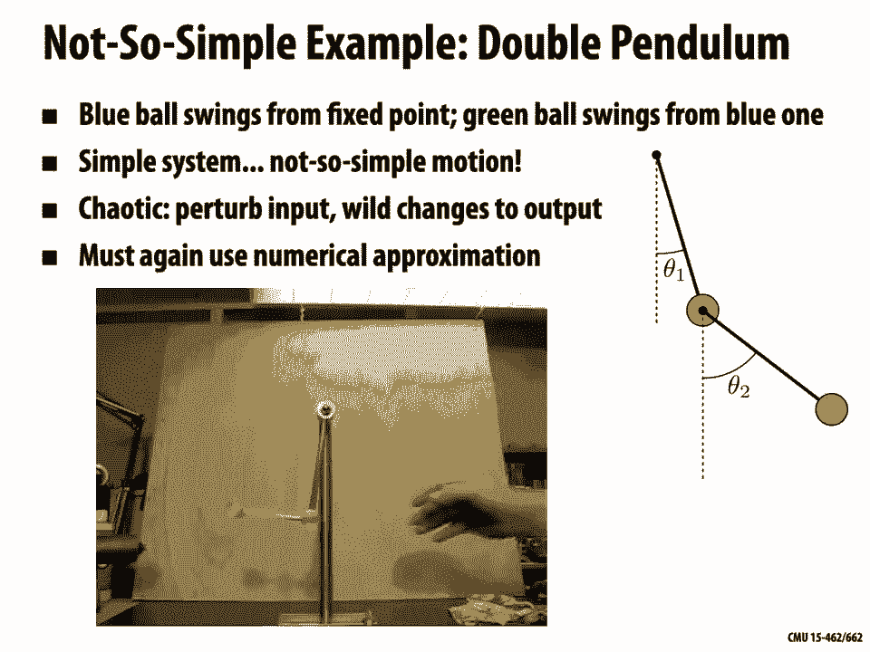
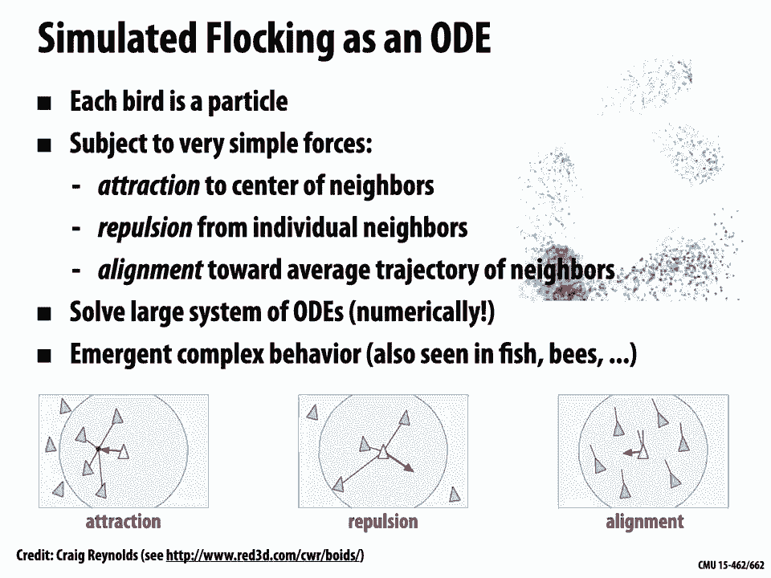
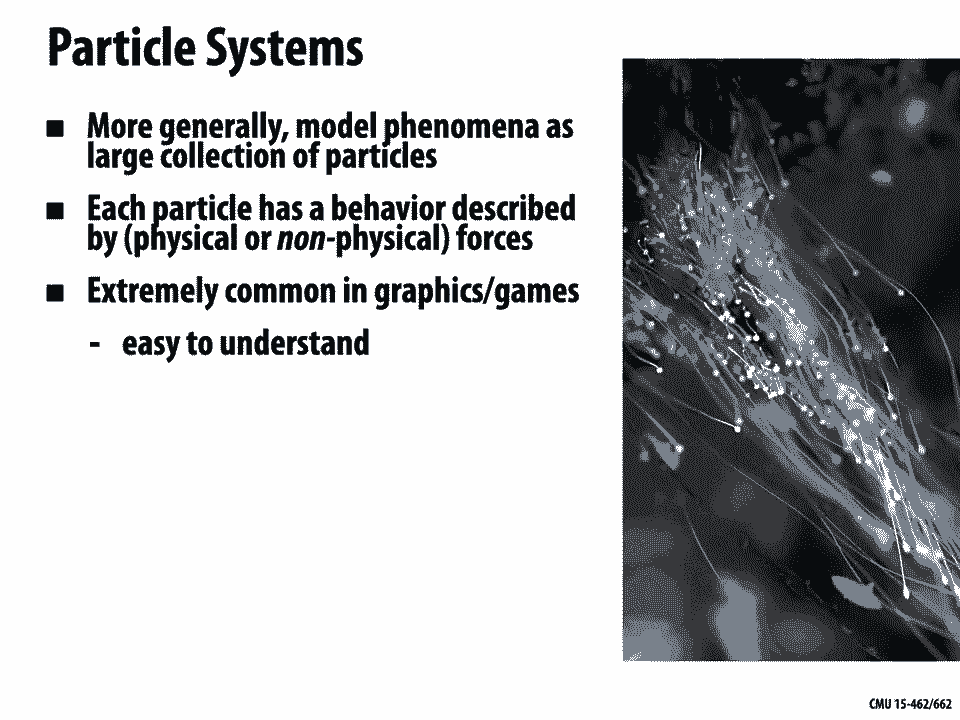
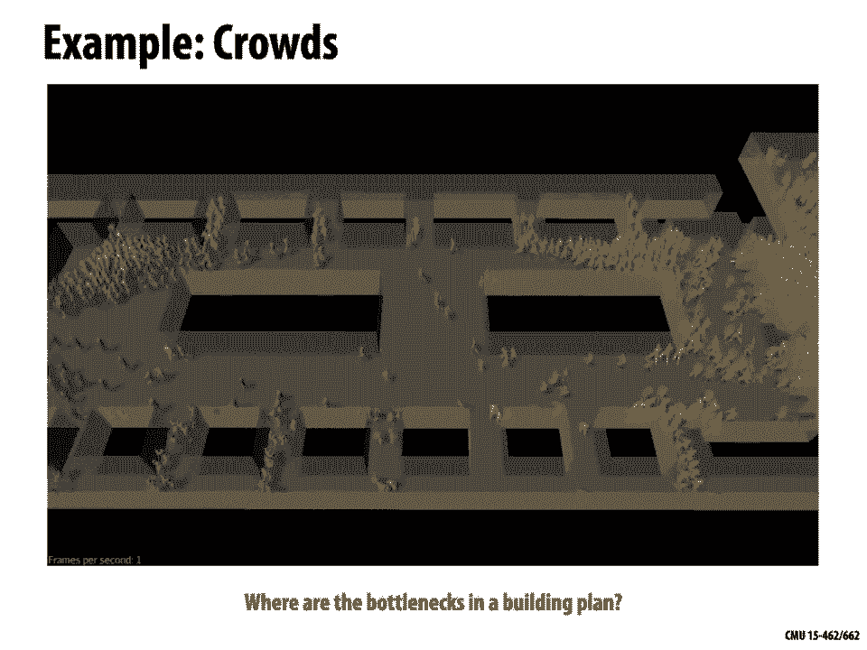
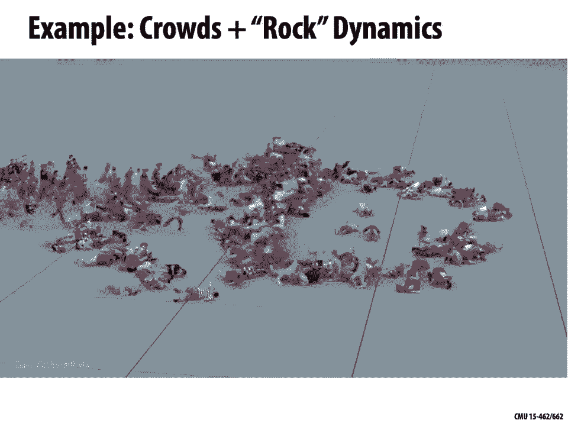
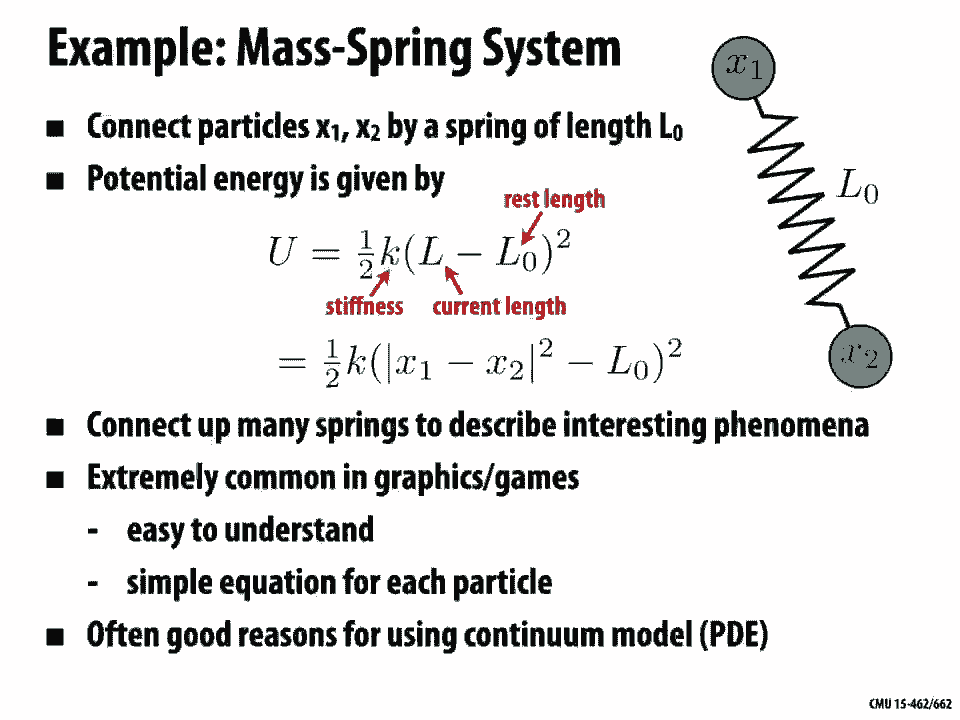
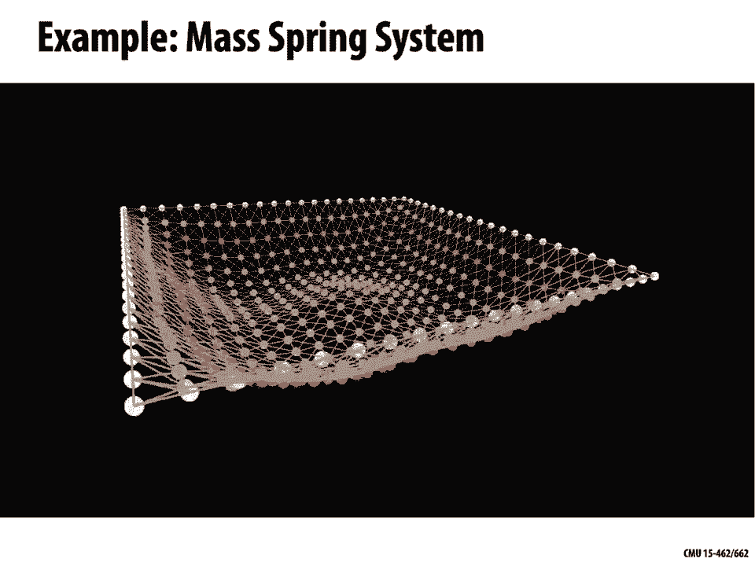
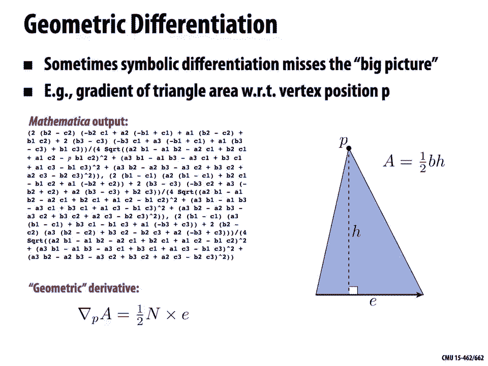

# 【双语字幕+资料下载】CMU 15-462 ｜ 计算机图形学(2020·完整版) - P22：L21- 动力学和时间积分 - ShowMeAI - BV1Pf4y1E7GJ

Welcome back to computer-graphics today we're going to talk about how a numerical simulation can be used。

To generate computer animation，Last time we started talking about animation。

And the basic idea was to add，Motion tour，Models of the world，Talked a lot about how to。

Model geometry how to，Model materials，And interaction of light with those materials in that geometry。

And now we want to，Ring things，To Life by adding motion，Basic technique we looked at last time。

Was interpolation of keyframe so this really，Goes back to the，Origins of animation。

Where somebody would draw，Frames of Animation key poses of animation by hand and then those would be。

Filled in，Or in between，Another artist，Well，In the，Digital age we can。

You are keyframing on three-dimensional geometric models，And get the computer，Fill in，Those。

In-betweens，With spline interpolation we can spend a lot of time talking about supplies last time。

But still，Even this，Semi-automated process is a lot of work。

Because there might still be a lot of parameters to keyframe if we look at this rig on the right。

Is ulcerative handles and controls that need to be set for every key frame to get just the right pose。

So today we're going to look at a different type of，Animation of computer animation。

Which is based on，Physical simulation，The basic ideas we're going to set up maybe some initial conditions and we're going to hit go。

And the computers going to predict all the physical，Behaviors or。

Pseudo physical behaviors that might govern，How the rest of the animation unfolds。

Why is valuable well，One thing is often a lot less，Manual labor。

Right we might only have to set up initial conditions or maybe some，Key events in the，Physical，Scene。

On the other hand，It's，Coughing a lot more compute-intensive。

With splines it was pretty easy to just go ahead and evaluate the spline at any moment in time。

Would this，Physically based animation or the simulation based animation，We're going to have to wait。

Often quite a while，Your computer to churn through all those calculations。

The way that we're going to，Build up tools for this kind of Animation is to，Tools and ideas from。

Physics，So we're going to look at，Dynamical District，Descriptions of，Animation of motion。

So why does motion occur what are the forces that cause it to occur。

Use numerical integration in time，2，Proximate，The solution to these，Dynamical equations。

We already talked about one kind of numerical integration Monte Carlo integration，Kind of，Estimating。

Area under the Curve，We're going to look at，Numerical integration in a slightly different way。

Taking steps forward in time，Appeal to doing all this to working with physical models and doing numerical simulation is that we can get complex and beautiful Behavior。

Something very simple models，Again without doing a whole lot of work，From。

Relatively simple scene descriptions a lot of beautiful complexity can emerge。

And these types of techniques，Have become widely used in film and games because of all the rich complexity。

You can easily get out of them，And because，Computer systems are getting。

Faster and faster it's becoming much more，Feasible，To run large simulations，It was，1520 years ago。

Okay，So what is a，Dynamical description of motion，Well this was。

Really captured nicely by Isaac Newton in one of his famous Laws of Motion he says。

A change in motion is proportional to the motive Force impressed。

Antiques place along the straight line，In which that Force，Impressed，More，Modern。

Description of Dynamics is，Dynamics is concerned with the study of forces，And their effect on motion。

As opposed to kinematics，Food studies，The motion of objects，Without reference，To its causes。

Cancel Dynamics is about understanding，Forces that give rise to motion，Kinematics，Just trying to。

Describe the motion without，Needing to understand，Generating forces。

Given that description and if we think back to our last lecture。

Key frame interpolation on spline interpolation，Would you call that a，Dynamic，For a kinematic。

Description，Motion，Well if you think that's the way we set things up we just said，Oh well we want to。

Motion to go here and then here and then here and then here at these different moments in time。

And we're going to have a nice smooth spline curve，Maybe interpolates，Frames the key moments。

That's not a very Dynamic description we're not really understanding，What forces would cause。

An object to move，For those points，Just saying，That's what we'd like to see。

Key frame interpolation spot spline interpolation，Is a，Kinematics description of motion。

So what's a dinette what's an example of a dynamic description of motion。

Well in rendering we had the rendering equation，It's only natural that in。

Computer animation we have the，Animation equation，And this one is one that you may have actually seen before the。

Animation equation is just，Equals Ma，Something you seen in your physics class Force，Equals mass。

X acceleration，This is ultimately what the equation that we want to solve to generate。

We want to go in and describe what are the masses in our system。

What are the forces acting on those masses，And then we can solve，This equation。

Can solve for the velocity，Respond to this acceleration and then we can。

Solve for the trajectory that corresponds，Velocity we can solve this。

Second-order differential equation，Actually，If we really are honest there are some more equations that we have to think about here。

Let's be more careful，One of you we can take is that any system no matter what kind of，Steinour。

Motion，Remodeling，Any system has a configuration，Is a function of time。

That configuration is just basically a big long list，Of all the variables，Describe，What。

The system looks like at the current moment in time，The system also has a velocity。

Velocity is just the，Time derivative of all those qualities，However we've chosen to，Describe arsene。

Right maybe geometrically，This is the，Change in time of that description。

We also are going to associate with objects in this scene some kind of mass，How heavy is a door。

What's its moment of inertia，You may also be some forces，Acting on objects in this scene，So。

My gravity Erwin's things that are causing things，To move in a certain way，And there also will be。

Typically，Some kind of constraints，Something that says，Rules must be objects obey at all time。

Prince insofar configuration is the position of a roller coaster，Constraint that says。

That roller coaster remains on，Track，And we will be able to express，A lot of these constraints。

With a function that looks like there's a function G，Is equal to 0，Constraint is satisfied。

So you plug in the current position and velocity of the current time。

And if you can straighten this out of spite if you're，On the rails，Then，The function evaluates to，0。

If not you're violating the constrain，In this terminology using this。

Convention we could write Newton's second laws，Hugh，Double。 Equals f。

To the double dots you're just mean，Taking two time derivatives。

Likewise when we wrote velocity we wrote 2。41 time，Why do we write things in this way。

Well it makes a couple things clear，First of all makes clear that。

Acceleration is the second time derivative of the configuration。

Right if we just write f equals ma we might forget the，Acceleration is the second time derivative。

And，Reminder，Ultimately we want to solve for the configuration Q。

If we know the state of the system at every moment of time，Then we have an animation。

We know the state of the system at any moment，What time，Then we can generate。

Animation by marching along in time，Looking up the configuration at that time。

Plugging it into our render and generating a beautiful image。

Andalou sequence of frames that generator animation。

We're going to be describing systems with many many moving pieces，Not just。

Single roller coaster on a track，Maybe，What's the table of，Billiard balls。

They're all bouncing around hitting each other and bouncing off the walls and so forth。

We can keep going with this View，Of encoding，State of our system into a single vector。

Coordinate switch working to call generalized coordinates，For instance in the case of，Billiard balls。

This one vector is going to store，Maybe the location，X Y in the plane，For every single ball。

Whose case we have six balls it'll，12 coordinates，Rather than thinking about。

The evolution of our system，As the individual trajectories of each of these balls in two dimensions。

We can at least，Imagine，Trajectory path，It's moving around。

Higher-dimensional in this case 12 dimensional，Space。

Find me just concatenate the motion of all these different balls，And that gives us some curve。

In a high-dimensional，Space，Why do we want to，Think about it this way will for one thing。

It's naturally maps to the way we actually solve equations。

Computer off and what we'll do is we'll go ahead and we'll stack all the variables that describe the system。

Into a big long vector，And what hand that off to a solver，Noodle updated and return。

New Vector the vector describing，All the positions at the next Moment In Time。

So if this is how we're going to，Write down our algorithms were ultimately going to，Work with。

Racine computationally，Model things this way in the first place，It's going to make life。

A lot easier in in many ways，Just like we，Have a，Notion of generalized coordinates we can also have an ocean of generalized velocity there's not a whole lot more to say that General velocity。

It's just the time derivative of the generalized，Coordinates right。

Each of our billiard balls for instance at a given moment in time，Has its own little。

Two-dimensional velocity vector，X。0x。 One and so forth。

And we can concatenate those all into a big long list，Velocities，Which together we call Q。

So nice mental model here，Used to think will。Shoe。 That velocity Vector for generalized coordinates。

Son of his kind of a tangent，To the curb，Describes the trajectory of our whole system。

In this higher dimensional space，Can we start to see why this is a useful mental model。

When we start to build an algorithm，Numerically approximating this trajectory。

We can do it in a unified fashion we can see as long as we have，An algorithm，Figures out how to。

Trace out that curve，In whatever Dimension were in，We can apply at 2。

Any system we want any kind of Animation we want，This way we can start to see that。

All of life in a nutshell physics is just，Traveling along some curve，So，Advantages of point of view。

A lot of dynamical systems dynamical descriptions of，Physics，Can be described。

Recalled ordinary differential equations，You might have encountered this。

Briefly in your Calculus classes maybe you've taken an intro to，Differential equations。

Basic ideas not too hard to get your，If we keep going with the story about generalized coordinates。

Then the，Equation that we're interested in is the one that says，The change in time。

Positions of the generalized coordinates，Equal to，Some velocity function f，Evaluated。

The current position，Current velocities and time，This OD。

Doesn't have to describe some mechanical phenomenon like，Balls bouncing around。

The simplest example that you'll see an intro to differential equations，Maybe something like this。

It just says，I have the change over time of some scalar value you，Is equal to a constant a。

* the current value of you，So the bigger you gets，The faster I change。

Then get bigger will that means I'm going to change faster，I'm going to get even bigger。

The faster rate I'm going to change even faster，So this is the rate of growth is proportional to。

Current value，Can you guess what the solution might look like，Actually this is。

No different from a problem you，Already solved in intro，Calculus，What's a function，Is equal to。

Derivative of 2 a constant，Well one solution is，Exponential function，Differentiate，PE to the 80。

Can I get，Hey bedat，Okay，To the function you've T equals b e to the 80 is a solution to this。

Differential equation，In fact，This is a really important example of a differential equation because when we start solving。

Linear problems linear differential equations，In generalised coordinates，Often，Solution reduces。

Version，Of this，Exponentiation，Another thing to be。

Where are we still think about will what what is the difference between。

Different values of a how does that change the，Behavior of this equation。

We already said okay if it is some，Positive constant some big constant that means I'm accelerating。

I'm growing faster and faster it looks like exponential growth，Could also have an egg whose value is。

Pretty small less than one，In which case we're getting exponential decay。

Things are getting smaller and smaller and smaller in there。

Drinking slower and slower and slower never quite getting to zero。

The fact that this is called an ordinary differential equation，Means that it involves。

Derivatives in time，But not derivatives in space，Notice we're only talking about how。

Function changes over time，We'll talk about，Spatial derivatives and partial differential equations。

Another lecture，Another really important example for us，Is Newton's second law this thing that we。

Said was，Fundamental，Equation of，Computer animation，Newton's second law is a，Differential equation。

Now the second time to rid of of the configuration，Is equal to the force over the mass。

And by the way，The force，Probably going to depend on。

The current configuration where we are in space or where。

All the objects in are seen are arranged in space，Is going to change how much force。

He's acting on them，5 apart of gold，It's really far，From the Earth。

At a distant planet it's going to have a smaller force on it than the moon which is much closer。

The equation we saw on the previous slide this is a，Second-order，OTE。

Because we take two-time derivatives we have to double。

How do we think about how do we solve second-order，Go to use instead of，First order Odes，Well。

One-trick we can play，Often is，To write，This system rewrite the system as，2，First order Odes。

We can split this up by introducing a new dummy variable for velocity，We can say，Q。 Is equal to V。

Change over time in configuration is velocity，And then V。

Is f / M the change in velocity over time is the force，Divided by the mass。

Why do this mathematically is equivalent right we didn't really change with the equation means。

Splitting things up this way will make it easy to talk about solving these kinds of equations numeric。

Here's a simple example，To think about the gets a little bit more toward，Doing animation。

Let's think about taking a rock，Costing it throwing it upwards and ahead of us。

The only Force were going to consider is the force of gravity。

There might be dragged or wind or something like that but we're just going to assume there's only gravity。

And The Rock has some mass m，Going to stick with our picture of，Driving all our coordinates with q。

And all of our velocities with，Kansas pretty easy to write down these dynamical equations。

We just say that，Q double dot，Is equal to G / m，Split this up into two first order differential equations。

Shoe。 Is equal to V，And Vida is equal to G / m，What's the solution to this equation。

Even if you can't figure it out，Play some what we said today maybe you've seen this in your。

Physics class，Write the solution，Something like this we can first say，Velocity I didn't given time。

Is equal to the initial velocity，Plus，Time，* G / m，Why does that make sense，Well because。

In the system，The force doesn't depend on the velocity。

The right-hand side of the equation VDOT equals g / m is just a constant。

How do you integrate a constant，You're just multiplying by，How much time elapsed。

Plus the constant of integration what was the initial velocity。

What was the velocity that we threw the rock out，Okay，So then what's the。

Solution for the configuration Q，Okay well we just go through the same exercise we copy the solution to the first equation。

The right-hand side of，Equation Q。 Is equal to V，And now we're，Integrating a。

Linear function and we get，Something that is quadratic in time，QT is to not Plus，Betimes vienot Plus。

2 squared / 2 mg，If you don't believe me，You can just go ahead and check，By taking。

The time derivative of Q in checking those people TV。

Taking the time to rid of a V and checking that is equal to，Kyogre，That sounds really really easy。

Right we could do that by hand we've maybe done that a bunch of times in our physics class。

What do we need，Computer for white why do we，Talk about this in computer，Graphics，Choose a。

Slightly harder simulation problem，Simulating a pendulum。

Okay sweetheart amass with blue Mass on the end of a bar。

And the Pendulum just going to swing back and forth，Under Gravity，And what we want to know is。

What are the equations of motion，In fact，This is exactly the same as the problem we just looked at the problem of。

Throwing a rock through the air，It's a bit now we've added，Constraint。

We didn't change the mass we didn't change the forces，You didn't change。

Configuration space we still just have the two coordinates of The Rock，For the end of the pendulum。

We have a constraint now that says，The end of the pendulum has to sit on a unit circle The Rock。

Has to sit on a unit circle，How do we solve an equation like this or how do we，Find。

Equations of motion that describe the behavior of the system。

Well one thing we could do a technique you might have learned is to use，Force diagram。

Like the one that you see on the right this is probably what you did。

For many hours in high school or college if you took a，Physics class mechanics quads。

Let's do something new and different let's do something else，That will。

Generalize a little bit better，Perhaps too interesting，Systems，Also lead very naturally to。

Ways of simulating systems on a computer，And that's to use the techniques of what's called lagrangian。

Mechanics，Dr。 Joseph，La Granja，This technique has a beautifully simple recipe，It's almost。

Surprising that they don't teach it this way in the first place because。

Once you know it you really don't want to go back to these Force diagrams，So what do you do。

Well the first thing is，You write down the kinetic energy of the system，So something like，1/2。

Mass times velocity squared or some，Appropriate generalization of that。

Or whatever system you're working with，You write down your potential energy。

So for instance if you know you have gravity in your system you write down the。

Gravitational potential energy，Something like，Mass times，Gravity X，And then you write down。

Lagrangian l，Which is the difference，Kinetic minus potential energy。

Once you know the lagrangian no matter what system you're looking at。

The Dynamics are then given by the so-called，Euler lagrange equations，Say that as they say。

Time derivative，The derivative of the lagrangian with respect to，Velocity，Is equal to。

The derivative of lagrangian，With respect to the configuration，And if you work through。

Loyola LaGrange equation for a simple system what you，Quickly realize is，His term on the left。

Becomes kind of a generalized version of，Mass times acceleration，And the term on the right，Becomes。

Kind of a generalization of the idea of，Force，Again we have，Basic Law of Newton。

Mass times acceleration equals force，Why is it useful，All we got back at the end was f equals Ma。

Why is useful point of view，We're going to see is first of all it's often easier to come up with scalar energy。

Enforces，Great when I'm talkin about Energies，I don't have to talk about directions。

I don't have to talk about coordinate systems，Harder to make mistakes I just have to figure out。

What is the total，Quantity of energy in the system this scalar quantity。

Another nice thing about this formulation is，That works in any kind of generalized coordinates。

I don't have to treat objects in my，Seen one at a time，I can just think of this picture of。

Single curve driving traveling through a higher dimensional space that describes my entire system。

Finally the reason why，We might like it for computer Graphics printing simulation。

Is it leads directly to a very nice class of，Numerical techniques，4，Simulating the motion。

It makes it really clear what the algorithm is that you should write down，To get an approximation of。

Dynamics，Nephew，Want to go deeper into the subject，Beautiful。

Reference the talks about Busa physical side，Anza computational side。

Let's look at an example let's go back to our，Example of the pendulum。

Language we didn't maybe immediately know how to solve。

The first thing we want to ask is just okay what are generalized coordinates。

What is Q for this system，One thing to appreciate，About。

Kind of promise you can always write down maybe different，Coordinates there's not just one way。

Including the state of a system，Variables in coordinates。

In this case a pretty natural thing to do would be to say，Rather than bothering with X Y。

And then worrying that x squared plus y squared has two equal，Linksquares or something like that。

When we just described the state of the system，Find the angle Theta。

The defender land makes with the vertical，Directions。

So that's a perfectly good encoding of the state and we know it always respect。

Constraint no matter what city we have，Describing a，Point on the circle，Next thing we want to know。

Build up our lagrangian is what is the kinetic energy，I think so，Will assume again that this。

Rock is pendulum and has mass m，And you may remember that the kinetic energy。

Something that rotates like this，Is 1/2，Iomega Square，I is the moment of inertia。

Omega is the angular velocity，Another way we could write this down is 1/2 mass times length squared。

X，State。 Squared，Write it in terms of velocity，In terms instead of，This moment of inertia。

What is the，Potential energy of the system，Again the only Force we have here is gravity。

Force of the rod is already taken care of by the fact that we have the，Angle coordinates。

So our potential energy is just，MGH mass times gravity times height。

Which interstate are we can write as，Mgl，Co state，Just getting the。

Vertical component of the vector from the center of the circle，2，The end of the pendulum，X mg。

Alright so here's the interesting part，Written down the kinetic and potential energy using standard formulas from。

Physics textbook，We can work out the equations of motion the Euler LaGrange equation。

I'm here you can really just，Plug in the formula that I showed。

That you can even get your computer to do it it's simple enough，And，Workout。

What equations of motion are so the lagrangian is，Can you minus you kinetic minus potential energy which in this case。

Those terms have a，Mass and then so we can factor that out，X 1/2 length squared theta。Plus。

Gravitational constant x l，Cosine Theta，How do we get the oiler graduations we want to just now evaluate。

These derivatives，Okay so let's do the first one，Let's，First take the derivative of the lagrangian。

With respect to Q。Okay and this is a partial derivative。

So maybe a good way to think about the partial derivative is。

We want to forget about any kind of secondary dependencies，Variables we just want to say。

Anytime we see，Shoe。 Or in this case stata。In the equation，We just take，Derivative，As we would。

Normally，Variable and we stop there，So what is the，Partial derivative of L with respect to，Sada。

Well stated。 Appears in only one of our two terms，First turn，Associated。 Squared becomes 2theta。

Overall we end up with just，Ml squared SATA。What about the，Partial derivative of Ln，With respect to。

She with respect to the configuration，Our system，Well in this case Q is simply the angle Theta。

So we want the，Partial derivative of this script l，Prospective data，What does that look like。

We only have one term，It directly involve status，DL cosine Theta term。

Derivative of cosine with respect to say that is，Sign or minus sign，And so we get，Minus mg，Sign。

Finally putting this all together，We can easily take the time to Ribbit of of that，First term。

Print oml squared theta。 Becomes ml squared，Double。And，We can then solve for Theta double dot。

Equate those two quantities，Move everything to the right side except for Citadel。 I mean，Citi double。

 Equals - G / L sign theater，This is our，F = MA，It says，Acceleration。

Angular acceleration say the devil。Is equal to minus this，Constant。

Determining the strength of gravity G，Over the length of the rod l，Times the sine of the angle Theta。

It was pretty easy to do we didn't have to do much reasoning about what the system looks like or how dehaes or what direction the forces point。

We just had to write down the kinetic energy，Potential energy，And take a few derivatives。

That's great we have now equations of motion，How do we actually。

Solve them how do we actually know where the pendulum goes，Over the course of time，Well。

This is hard to do by hand，Hopefully you got no sense in this course that a lot of the things that you did in calculus。

Taking integrals especially an even，Taking complex，Complicated derivatives。

Really really hard to do by hand may be impossible to do by hand，When you start to solve。

Problems of real-world complexity like you find in，Computer graphics and computer animation。

It's also going to be true for solving equations of motion，I have this，Equation motion。

Well I don't immediately know how to solve it but，Looks like at least get a sense of what the solution might look like by。

Making an approximation，In particular I could，Consider very very small angles I imagine the pendulum is almost vertical。

Is just moving back a little bit，Back and forth a little bit to the left and the right。

Quote for small angles Sada，Approximate，Sign Sada as，Near-zero sine Theta looks like Theta。

And so we could pretend that this equation was instead，Double。 Equals - G / l。

Thanks for saying that we're looking for a function，Overtime a function。

It looks like it's second derivative，Actually - it's second derivative。

Can you think of any function where if you differentiate it twice，You get the same function back。

Maybe up to assign，What is a function look like，In this case up to sign and。

Scaling we have to scale by G / l，What does that look like，1。

Examples of function that looks like this，Cosine，Interstate of tea is equal to 8，Cosine。

X root G / L + b，If I differentiate this once the cosine turns into a minus sign。

Can I pull out a factor root G / l，If I differentiate it again，The minus sign becomes，- cosine。

How to pull out another factor of root Geo Burrell，Overall I have Jerrell，-，X。

Cosine of the same argument，Solve this second-order differential equation，What is this describe。

If I think of the，Angle as a function of time now what is it what's happening oh well something pretty reasonable is。

Moving back and forth over time，Just a little bit，This is what's called a harmonic oscillator this is also。

Something that describes the behavior of a spring for instance，Idealize spring without any。

Other forces on it，What if we want to go back so and。

Really saw this equation this is this approximation is only accurate for very small displacements。

Just this kind of boring pendulum it's only swimming back and forth just a little bit。

How do we solve the original equation，What is the，Closed form expression for。

Data as a function of time，If you have trouble answering the question。

That's okay because actually in general there is no closed form solution，To this equation。

There is simply no，Function you can just write down that gives you the solution。

The equations of motion for all time，Even with this，Very very simple example we took。

One of the most basic things we could think of just taking a ballistic trajectory a rock flying through the air。

Super simple condition，It just said it has to stay on a circle and as time unit Norm，In already。

We run into trouble already we cannot do this，The way we might have done this in our。

Intro physics class or intro Calculus class，We have to，Actually，Use a numerical approximation。

If we hope to，Animate this system，Even for these very simple case，So you can imagine。

As we want to start to animate more and more interesting and complex phenomena，People moving around。

Dress moving in the Wind，No jumping into the swimming pool wearing your dress and seeing the interaction between。

Water and cloth，Boy that's going to be really hard to do we're not going to be able to。

Solve the way we didn't our physics class we're going to have to use。

Numerical approximation numerical simulation，And，I really tried this way home I mean。

The pendulum you at least have a sense of roughly what it should look like right I mean you should。

Swing back and forth at some reasonably regular predictable rate，Let's just see how quickly。

Things can get really really complicated，Secure，We're going to set up a very similar system。

We have a pendulum this this blue pendulum，Just as before。

Turn off the end of that blue pendulum we have a green pendulum，The first pendulum can swing around。

Pendulums going to swing around on the bottom of that one，Alright and we can。

Grand Rising system weekend，Right on that generalized coordinates state of one and state of two。

Didn't get that much bigger we had one coordinate before now we have two coordinates。

What do you think the system does，If I start letting these pendulum's swing around。

Picture try to picture in your head for a moment，What do you think some motion is going to look like。

Maybe one question you could ask yourself is，What curve does it trace out。

Overtime like I have just one pendulum，Traces out a piece of a circle overtime what。

What shape is this，Trace out overtime，Okay so keep that keep that picture in your head and let's let's see what see what happens here。

Okay so this is a really simple system but actually turns out，Have some not so simple，Motion。

Okay so here's an example of a real physical double pendulum，Swinging motion and。

What is happening there，Swinging all over the place it's really hard to say what it's going to do next。

Okay maybe towards the end it gets damp out and do something reasonable but let's。

Tried again with a different initial configuration，Yikes this is。

Now completely different from what it did the first time。

And in fact if you study the system a little bit what you discover is it say，Chaotic system，Meaning。

Extremely small changes to the initial conditions，Can result in extremely large changes，2。

The trajectory，SO2，Simulator to get any sense of what a system like this，Might do，Even a very rough。

Approximation，We're going to have to use numerical approximation。

How to use some kind of simulation on the computer。

You're so not so simple example of，Dynamic switch，Comes up all the time，Modeling。

Natural world and in computer Graphics as well，N-body problems。

Okay so maybe the one of the earliest examples of this is people thinking about，Bodies in the。

Solar system，Say we have you Earth，And the Moon and the Sun。

Imagine those are the only three bodies in the solar system。

We want to know where they go overtime it's a very reasonable question to ask。

If you want to predict the，Phases of the moon or whatever。

Well this is really really easy to do for two bodies，Babies the Sun and。

Assume one of these bodies is fixed hey why not keep the sun fixed at the，Center of the universe。

I know that's a bit of a，Radical idea but let's do it。

And then we can just solve for the position of the earth well that's really easy in fact that's going to look。

Natsu different，Maybe from our pendulum problem，But as soon as we add that third body in as soon as we put the moon in there we put Jupiter in there or whatever。

We can get chaotic Solutions we get，Dynamics that have no clothes for him that you could never hope to solve。

On pen and paper，So then what if we want to simulate。

We more than three bodies what if you want to simulate，Entire，Galaxies。

In fact this is something that people，Are very very interested in doing if you want to understand what is the。

Origin of，Our solar system the origin of our galaxy，Why did，Mastic shaped the way it did why。

Are stars distributed the way they are wise Earth，Place that we can，Live are there，Places。

Other places in the universe we can leave okay well。

What you what are you do you get out your computer you put，Huge number of。

Bodies little particles are actually，Maybe the size of planets。

And you start simulating the Dynamics and see what happens and you see all this interesting Behavior。

Mass，Frites into dislike formulations，How things might get denser or less dense and stars my form and so on。

Hi this is really something you have to use numerical simulation if you，Everyone。

Any sense of what might happen，Animation 2，Not just for。

Understanding the the origins of life universe and everything but for。

No just fun computer animation we also want to simulate these kinds of，Manometer。

So one nice example is，Flocking of birds this is a real video not a simulation of。

A bunch of Starlings I think is that the kind of bird and if you watch them for a while the exhibit this really really interesting。

Either they just start kind of following each other and forming these shapes in the sky not so different from this。

Idea of having these different bodies in the Galaxy that influence each other and how does emergent Behavior so how would you。

Simulator system like this well we kind of have the tools to do this I mean just today we've kind of set up the right mental framework。

Modeling a system like this is how we can think about simulated flocking。

As an ordinary differential equation，Now on the right this is a movie of，Numerical simulation。

Bunch of particles that are supposed to kind of capture this bird like Behavior，Instead of。

Billiard balls we now have Birds，Every bird is a particle with a configure it with a position in space。

Are generalized coordinates or just a list of all those positions are generalized。

Velocities are just a list of all，The individual velocities。

Particles are subject to very simple forces，This is a really。

Classic Model developed by a guy named Craig Reynolds，And the forces are，Play all the birds。

Want to be attracted they want to move toward，For the average of their，Nearest Neighbors。

So maybe each bird knows about it，K nearest neighbors and wants to move to the center of those work。

Happy Bird knows about，Birds that can see that be more natural right，Every bird knows about。

Birds within some radius around it，Is the one that can look at and see where they are and it wants to move to the center of those。

Another force is，Upper doesn't want to get too close to another bird cuz I know crash and fall out of the sky。

That would be no good，This is going to be a force，Pushing it away from the center，Ann's，Also。

Some kind of force of alignment，I look again at this neighborhood of birds around me。

I want to go roughly in the same direction，I don't want to get left behind I want to。

With the crowd see what they're doing see where they're going，Okay so those are my forces。

Maybe I don't even need to write down the lagrangian I just start with，Fuqua。

A sum of all the forces from all my neighbors，And then I，Solve numerically。

Ordinary differential equations，System of ordinary differential equations you can think of it either way。

You can either think we have，Single generalize particle。

I just need to know the acceleration of that particle or I have all these different particles all these different birds。

I'm solving for each of the accelerations of course these two points of view are。

One way or another I have to solve，Ordinary differential equation，I do this。

Maybe a little bit of tweaking of the parameters right how big are these forces how many neighbors do I use until 4。

Look at this beautiful emergent，Complex behavior and you also see this in。

Other types of swarms in fission B's and so forth，This idea flocking is 1。

Specific example of a more general idea，Computer animation，Particle systems。

Soap more generally there are just a lot of different phenomena that you can，Model。

Has large collections of particles，Fireworks maybe kinds of different kinds of fluids。

Granular materials like sand，Depending on what system you're thinking about each particle has a behavior described by。

Some kind of force，Physics these would all be，Physical forces，Arise from some，Flexible Dynamics。

Model，Computer graphics，You can have more fun and you can just toss and random forces。

And see what happens right，What happens if I use this crazy function as a force that。

Make some nice behavior what if I use this other one all this is kind of boring or blows up in a nasty way。

However you come up with is particle system，Is extremely common model。

It's used in computer Graphics in interactive computer Graphics games and so forth，Why won't。

It's very easy to understand，Right I'm just，I just have all these particles and I'm going to。

Crack them overtime I have a simple equation to integrate，For each particle。

It's really easy to scale up and down，Depending on how many how many how much competition resources I have。

Tycoon，Increase the，Number for Tangles get more detail or decrease the number of particles to get things running faster。

Phenomena，Play fluids，You might need a ton of particles，To really get a good，Juno actress。

Correct looking，Approximation，And you might start to think，About，How do I accelerate these kinds of。

Interactions between，Huge number of particles，Like we didn't that galaxies simulation。

Well if you think back to some of her earlier lectures。

Actually already talked about tools that are kind of appropriate for these。

Systems with lots and lots and lots of，Primitive geometric Primitives that are kind of interacting。

We talked a lot about，Hierarchical，Data structures hierarchical acceleration，Using things like。

Shady trees，And，Bounding volume hierarchies，I think I even mentioned the Barnes Hut algorithm。

And maybe the fast multipole algorithm，These are algorithms that you can use。

To speed up interactions between lots and lots of particles。

Kind of lumping together distant particles if I love，Bunch of。

Interesting particles but the really really far away。

Well maybe it's okay just pretend they're one big particle and compute my forces based on that assumption。

Another thing I can do and we'll talk about this when we talked about partial differential equations is to say。

You know what doing millions and billions of particles at some point gets really expensive。

Don't use a Continuum model why don't we，Think about this in terms of a different kind of differential equation and we'll get to that。

Later on，Another example of，Kind of a particle system or a agent-based system so much like our。

Birds with particles moving around，We might have forces acting on each other，And they might have。

Behaviors as well you might have kind of a little program，Each one of these particles is running。

Cease a certain Behavior a measures a certain quantity in its environment。

Who makes a decision about how to move，Maybe you can think about this is adding a an Impulse Force if you want to keep thinking in a dynamical point of view。

One way or another there's a kind of a policy where this，Article are this agents。

Changes its Behavior here，Is being used to，Model，Crowds I think the idea here is that somebody。

What's to get a sense of，What is a fire in a building。

And you want to see where the bottlenecks where people going to get stuck。

So maybe this is not a perfect simulation of，How，People behave right，You're not。

Really stimulating human psychology and human physiology and so forth。

Still gives a pretty good sense of，A large-scale in Ohio，Things might play out，Answer these kinds of。

Kools even when they're crude，Can you really valuable for understanding，Physical systems。

Even even outside of the domain of，Entertainment。

Having said here's，Really fun example of，Kind of crowds and Dynamics mixed together。

Just For Your Entertainment。

We have a little bit of this ballistic Behavior to when people get，Smacked by this，Spinning rod。

Another fine example of，Particle system I said it's possible to model one way to model。

Fluids with particles，And here this is rendered in a way where you can really see the particle nature。

Tri-Cities red and blue particles，Are willing to be close to each other but not too close。

Horses are constraints to push them away from the solid，Browns。

Can you get the street fluid-like behavior in fact，If you render this in a more realistic way。

Right at you put some material on there that had，High degree of speculative，Also，Had some。

Transmissive nastu it，Write something that tried to model the，Properties of water。

This would look a lot more，Another nice example of granular material so。

Modeling Sandra maybe I think in this case it's supposed to be popcorn perhaps。

Also interacting with some rigid bodies here，It's interesting to think in this senior what are the generalized coordinates what is all the states。

Describes this system，The state of each individual particle wave estate，Maybe the。

Physician but also the rotation of these rigid bodies and we also have the，State the position of the。

Cloud it's driving through，Granular，Another example of kind of particle systems is。

Molecular Dynamics so when people do computational chemistry when they really want to figure out。

What's happening at a，Very very small scale，Simulation of Houston。

Similar way you have little particles which are called，Adams，And you have。

Various models of how these are going to behave，Overtime。

I'm typically here you want to simulate things on an extremely short，Timescale。

I think what this is a Ice Crystal that's melting，And the jiggling around is coming from。

Kinetic energy right we talked about this when we talked about，Color。

Where does color come from will it comes from，Electromagnetic fields that arise from things jiggling around us。

Small-scale，You can also go to，Much much bigger scale in a much much longer。

Timescale going coming back to this，Cosmological simulation，So this is another kind of。

Body type simulation，Just trying to understand now the distribution of dark matter，In the universe。

Sincerely get a sense that this，Idea of simulating lots of little particles interacting with each other。

Super powerful super flexible you can do a lot with it，And it all starts with just。

Sterling one Little Rock through the air，Another example that shows up a lot in computer Graphics is what's called a mass spring system。

Can we have，Particles that are going to move around，Orthogonal trajectories。

This time we're going to add an interesting for us we're going to connect the particles by a spring。

Of length，Nelnet，In this case you might remember if Springs or something。

Talked a lot about in your intro physics class you might remember the potential energy of a spring。

Is given by，U = 1/2 k，X l- l not Square，What is this mean，She is the stiffness of the spring。

For the bigger this number K is the more the spring，He's going to resist，Compressed or stretched out。

L is the current length of the spring，Anel not is the wrestling，Thanks again。

More upon this bigger the potential energy get some more we compress at the bigger the potential energy gets。

We could also write this as，1/2 k x，Norm of the difference between X1 and X2 squared minus L not。

Play we can express the current length，Distance，Between the two endpoints，Why are Springs cool。

Well because we can connect up a lot of strings to describe interesting phenomena。

I just because just like we，Use a lot of particles。

Floating around on their own to get interesting phenomena，We can use lots of Springs。

Is extremely common in graphics in games and so forth because again it's really easy to understand。

What's going on，Is really simple equation for each particle，And。

We can usually numerically simulate this，Mulatto，Cool Springs，Pretty efficient way。

Stanley run we're going to see that for certain things if I'm trying to use Springs to model ATS a cloth or something。

Might be good reasons to think of this room or，Continuous point-of-view to think about partial differential equation。

Hooking up a lot of different Springs，Writing down their total energy working out the equations of motion and so forth。

And then hitting go，To do simulation and we'll get something maybe like this。

I just have a bunch of little particles again but they're connected by these spring forces me this。

I don't know trampoline type Behavior，If you're more common use of this type of thing is in。

Simulating cloth，To hear again we can imagine every vertex of the mesh making up the dress is a。

Particle everyedge in that matches a spring，Oh yeah these spring forces they're keeping them。

Close to each other but not too close，How do we get to work together with the character will maybe we pin。

Some of the，Particles from the vertices two points on，Character model so that，How to pull DeLong。

The motion of the character，What other thing we have to think about for an animation like this is。

How do you avoid，Collisions how do you avoid，Particles from。

Passing through the cloth or passing through the body，So this is，A big challenge in。

Computer animation dealing with collisions，Collision detection and collision response。

We talked at least a little bit about，Collision，Detection，When we talked about geometric queries。

And how do we do inside outside tests and things like that。

Another example of a phenomenon that can be simulated using，Particles connected by Springs as hair。

She can imagine each strand of hair is just a，Holly line along sequence of particles connect by little Springs。

As we move this round in my b，Different forces on different particles but the springs。

Kind of keep them，I'm stretching out too much and you get this beautiful looking，Behavior。

So hopefully you're convinced，Hopefully you're convinced that。

Using Dynamics is a useful way to generate animation that。

Talking about things like particle systems in Mass spring systems。

Create a lot of interesting phenomena，The one thing that we haven't yet answered yet actually。

I swept it under the rug so far is，How do we actually solve these equations numerically we've been writing down。

Equations of motion，I keep saying oh then you just hit play and watch the animation evolve。

How did we numerically solve this equation，So that brings us to one of our。

Core topics for the day which is numerical integration，How do we take a。

Ordinary differential equation for instance，And turn it into an approximation，Of the potion。

The key idea，Is that，Every time we see a derivative，Differential equation。

We're going to replace it with，Differences，Things we can really compute。

In an ordinary differential equation，Actually the only derivatives we need to think about our derivatives in time。

Ordinary differential equation is one that involves derivatives in time。

Partial differential equations one that involves derivatives in time and space。

We're going to replace our，Define continuous function Q of tea，Set the configuration，Overtime。

With samples qcok in time，So basically we're going to have，Bunch of little snapshots。

What's happening at，One second what's happening at 2 seconds what's happening at 3 seconds，Probably。

Finer grain intervals in that maybe we have one snapshot。

Once every 30th of a second to generate animation，Do we have，Differential equation like this。

The time derivative of the configuration Cube，Is equal to，Velocity function f of Q。

What's going to become，Equation that looks like，Configuration at the next Moment In Time。

Fuse of k + 1 which we don't know yet，-，The current configuration which we do know where are things now。

/ a Time step Tao，Meaning how much time elapsed between，Current state in the next day。

That's going to be equal to，Speed，The speed，Evaluated for our configuration，Another one。

Sing were missing from this equation one thing we haven't really，Pin down yet，Which is。

When do we actually evaluate this，Velocity function，The original equation we said that the。

Equation of the top we said，What time do the current time，Sea of the configuration QT，Is equal to。

Velocity function evaluated at，Configuration of the current time。

Numerical approximation of the bottom which one is the current time is the current time，Yusuf k。

Where's the current time Q of K，What's 1，Doesn't this equation need to hold it both moments，K&K + 1。

Actually what happens if we have a choice，Choice of when，To evaluate this，Velocity functions。

Most straightforward thing to do you might think，Seems the answer's obvious right the obvious answer。

It's just evaluate the velocity of the current configuration，We know where we are now。

And we know how to evaluate the function f，Anywhere we like so why don't we just plug in the configuration window into the。

If we do this then the new configuration，Can be written explicitly in terms of known data。

I can see the configuration chew at the next time k + 1，Is equal to the current，Configuration，Yusuke。

Plus，X step，Times the velocity at the current time。

All I did was shuffled around the equation that I had a la slide，Careful to evaluate F at UK。

This is really pretty intuitive，What are we really saying you're always saying is。

Figure out what happens with let's just walk a little bit，In the direction of the velocity。

Walk in the direction of velocity，And how far well，Is Tower big of a times that we use。

We can walk that far，Sounds pretty good，Unfortunately，It's not very stable，What I mean by stable。

I mean is，Consider our case are example of the pendulum。

If we start running the simulation of each starting out，Repeatedly applying this rule 2K + 1。

Cyclic UK plus towel FF UK，2 Q，1 is equal to Q Nautilus out of，2，Not。

Q2 is equal to q1 plus towel fq1 and so forth，Well something。

Kind of surprising is going to happen rather than this pendulum just going back and forth nice and slowly。

Can I have it as it's going to speed up and go faster and faster and faster until it's actually。

Spinning around and around and around and around，That's weird that's not what was supposed to happen。

Original，System the one we really want to simulate，We know this is a physical is a physical。

Alright this this is，Something where energy should never be created or destroyed。

Where is all this extra energy coming from，Well to understand this we can do a little analysis of our forward boiler algorithm。

So let's consider the behavior of $4，For a rather than this。

Pendulum problem was just think about a simple linear ordinary differential equation。

We go back to the equation you。 Equals，What's a -8，For a is a，Positive number，So importantly。

You in this case should decay，In fact we can write down the exact solution，You is equal to，To the -8。

Actually，I should，Pause here for a moment to apologize，Earlier I said，If I have，E to the，80 + 8。

Less than one it'll Decay and if it's greater than one at all，Blow-up actually that's not true。

It's that if a is less than 0 it'll Decay and if a is，Greater than zero it'll blow up。

Okay so in this case we know that the true behavior of this，Equation should be that decays over time。

Let's look at what happens if you apply for boilers so the Ford oil or approximation is。

Do we get our next value for you，By taking our current value and subtracting，Tao，X a，Times UK。

Some constant times，That's the same as multiplying the current value minus，* 1 - x。

Which means that after，Taking n steps，We have one- towel a to the n，X you not。

Knights of the value at types of n is just a multiple of the original value。

By taking the constant and raising it to the nth power。

Use the value at time Step n always going to be，Smaller，Then the value at，Start。

The answer depends on what，Value tatex，How big of a timestamp do we take。

What we can see for this from this equation is，It's going to Decay only if，The norm，Of 1 -。

Call Alpha the absolute value of 1 - 2，Sorry，Is，Less than，1，Is this number，Bigger than 1。

Then of course，Powers going to be，Much bigger than one and so the，Evaluate。

Un is going to be much bigger than the value，You not，If this value is。

Smaller than 1 than a small value raised to the nth Powers much，Much smaller than one。

Answer the value at，Time Savannah is going to be much smaller than the value at，* 0，Particular。

I want to make sure that，How is less than 2/8，What is that Alison tells us that if we want to use for boiler to integrate our equations。

We're going to need to take very small time steps，Especially if。

That constant a is large especially if，You have a stiff system thing about our stiff spring。

At the bigger that constant K is on our spring，Smaller。

Steps were going to have to take with for toilet，Messing with hair，Care doesn't really stretch。

It's like a really stiff string，Spring，From trying to stimulate hair。

These tiny tiny time steps I want to，Generate animation at a rate of 30，X II，I might have to take。

Time steps，Thousands of times per second，To avoid，My simulation from blowing up。

Reason I want to look for other ways to，Integrate this equation。

And another thing I can do is just go back to the question of，When do I evaluate，Velocity function。

What's his go ahead and try something else，Just re-evaluating the velocity at the next configuration。

Rather than at the current，Configuration，What happens in this case is。

I no longer have an explicit equation for our new configuration we have e，Implicit equation。

Remember when we talked about geometry see what the difference between，Elicit，Implicit descriptions。

Implicit，Descriptions give us a sort of test to see，How we satisfy the relationship。

Explicit descriptions tell us exactly how to，Satisfy the relationship。

In this case we have an implicit equation，Where the new configuration is equal to the current configuration。

X step X，Velocity at the next time we don't know，Yet what the configuration is at the next time。

So how could we，Evaluate the right-hand side we can't do it directly，We have to solve this。

Whole equation simultaneously，In general is this can be much harder to solve because。

That can be a very nonlinear function，Mueller hands，Something nice happens if your pendulum now gets。

Stable meaning if we start swing the pendulum back and forth，Bright starts moving of the Union time。

Swing back and forth it won't explode anymore it won't start spinning around and around and around。

Actually what happens is the opposite，So what's going to happen is。

Emotion is going to become damped out it's going to go slower and slower and slower，Stops in。

Doesn't move at all，That's also kind of，Sad，Where did all the energy go。

We weren't modeling friction I mean maybe，In real physical system me a friction some of that。

Energy gets dissipated as heat，But in our，Mathematical model there was no friction energy shouldn't have been created or destroyed。

So what happened to you，Well we can go back，Again into，A little analysis again for。

Are simple linear ode just cuz it's one that's，Easy to really get our hands on，You say。

The time derivative of a scalar quantity is minus a constant a，X you，For a greater than zero。

You should DK，The backward Euler approximation is something like this。

UK + 1 - UK / towel is -8 X UK + 1，That's the same as saying，UK + 1 is equal to 1/1 + Tali X UK。

Which means after n steps we have，UND equals 1/1 + 2 to the nth power，X，You not。

Which means that this is going to DK as long as one plus towel，Is greater than 1。

Well towels a positive number，And he's a positive number so this is always going to be true。

That means is backward Euler is unconditionally stable。

4 linear odie's no matter how big of a Time step we take，He'll never blow up。

Isn't attractive property，Christian computer Graphics you're building a system。

Somebody's going to use to do simulation，A very complicated scenarios。

But you never know what's going to happen will hear you can at least provide them a guarantee。

You're never going to have a simulation，James a huge amount of energy and goes crazy。

Instead of my look kind of damp towel，How do you mitigate that damping。

Well unfortunately the one answer is，Take smaller and smaller time steps，Because。

Going to get a better and better and better approximation。

Of the derivative from your original equation，We said we were。

Approximating time to have it is by taking differences。

If you remember the definition of a derivative what you know is，As Tau goes to zero。

You're getting a better bettor proximation is driven it So eventually you will recover the behavior of the original system。

Are the cost of taking small steps and that's what we were trying to avoid，In the beginning。

We'd like to ideally，Only as many time steps as we need，Art frames of animation。

What's considered one other possibility which is，Called symplectic Euler，So backward Euler，Was。

Nice and stable but we also saw incorrectly the exhibits numerical damping。

Damping that's not found in our，Truphysical equation。

One way to deal with this and this isn't the only way but this is a nice way to deal with it at least four simple systems like this is something called。

Symplectic Euler，The basic idea is，We're going to，Update art velocity using the current configuration。

Thanks for going to go from，Current velocity to the next velocity using。

Data from the current configuration，And then we'll do some a little weird we're going to update。

Configuration，Using our new velocity，So，Simpsons the，Configuration in the velocity。

Moving forward in lockstep，Corrupting the velocity，And then updating the configuration and updating。

Lost even the configuration their kind of stagger，The most confused practice because it's。

Really easily implement，There's really nothing to it it's almost something。

You might do by mistake if you're implementing，Boiler。

And there's other variations on this Leapfrog relay and so forth。

The cool thing that happens now is the pendulum now conserves energy。

Almost exactly forever so you start out，Does pendulums going back and forth and back and forth in。

You can keep on running your simulation for，Forever essentially 4 days 4 hours for weeks。

And it'll keep on going，Back and forth，Basically the same energy as of the beginning。

What's the proof that this happens while it's not，Quite as easy but。

There's a lot of really nice stuff written on，Numerical integrators if you want to get。

Deeper into the subject we really barely scratch the service today，Lots of different integrators。

Why are there all these different integrators will because there's many different Notions。

What it means for a numerical integrator to be good。

You might care about stability the prop the property that we talked about a lot today。

You might care about accuracy，Occasion computer animation if you only care，Emotion，Is pretty。

Play energetic doesn't blow up，Cuz you're doing something for，Engineering of science you might care。

You really get a precise approximation of the true，Solution。

Likewise you might care a lot about consistency，And convergence。

You might care about conservation and symmetry，Right if your stimulating。

Bodies in the solar system you might，Really care that over long long time scales get the right Behavior like our。

Pendulum that keeps going back and forth，Intercourse。

Computational efficiency is very important in all of this，You can't sacrifice。

Competition time for all these other things，You'll never finish your simulation。

In general like Minnie the other things we talked about this class，No one best solution。

You really have to pick the right tool for the job，And that's why it's worth knowing。

A lot about different numerical strategies，A lot of people who work on computer Graphics these days。

I really，Diving deep into numerical methods for，Different types of equations physical equations and so forth compact we could do。

Probably entire course just on time integration，Because a great book，If you want to know more。

Another thing we need to do something practical we need to do，2。

Evaluate descriptions is to take the rivets we keep talking about taking rivets insofar。

Even taking all these rivets by hand，But very often in，Simulation in graphics more generally。

We need to differentiate extremely complicated functions。

We might have some really interesting potential energy that we need to get forces，So there's。

Several different techniques that we can use to calculate these derivatives。

What is the just keep doing it by hand，That bad sometimes to just write out，Formula for the。

Evaluate algorithmically，This is laborious it sometimes error-prone but the good thing is。

If you workout kind of critical derivative by hand sometimes you get really nice fast clean code。

An accurate code，Another one is to do numerical differentiation。

This is what we've been talking about how can I get a numerical approximation of a derivative。

Oh I take a difference，Perturbed，My configuration a little bit I evaluate the energy。

I put the configuration back to where I started I evaluate the energy。

I take the difference of those quantities，I / the size of the perturbation，Excuse me a。

Derivative in the direction of the perturbation，This is in some sense really nice strategy because I can use it no matter how my。

Energy，My potential，Define，95 black box code，Describes my potential energy。

I can still use numerical differentiation so that makes it a very general purpose technique。

It's usually pretty inaccurate，And Beyond just being inaccurate it can be hard to even know。

How big of a probation should I make，Get a reasonably accurate estimate，Of the derivative。

Another thing it's kind of a pain about it is I have to do these little perturbations once，Every。

Variable in my，Generalized coordinates，It's at you lots and lots and lots and lots of evaluations my energy。

Losing it really slow，New technique called automatic differentiation，And I want。

Too much about it these days there's a lot written about it。

Because people are interested in what's called backpropagation soap。

Backpropagation and automatic differentiation are，Somewhat synonymous，Very similar concept。

The way it works is that you actually have to change，Your code。

So if you're working franceandson cplusplus like we're doing in this class。

You might have automatic differentiation Library we have to replace。

Your numerical types like float or double，With types from this，Automatic differentiation Library。

It'll know somehow，When you do calculations when you add up numbers or multiply or whatever。

Rather than just calculating，Value，It's also，Accumulating information about the derivatives。

Along with those calculation，The good thing about this is，It's very accurate。

It tends to be quite fast you might do a little better。

By hand because you can do certain simplifications，Openly very good performance。

Downside is it's a bigger code investment，Said you have to go in and swap out all your variables。

Automatic differentiation very，Something people do a lot，Finally closely related。

Technique is to use symbolic differentiation，If you've used the package like。

Mathematica or Maple or you going to Wolfram Alpha。

You've ever wondered how does it compute derivatives。

Basically what it does it build up an expression tree，Did you write out 2。

Algebraic expression you can imagine encoding that as a tree，Antiderivative on the expression。

And expresses a transformation of that tree，These tools will take the expression perform the transformation。

Nutri that，Represents the，Expression for the derivative and you can evaluate that whenever you need。

Often help，If you're just trying to work through some，Calculation by hand you can。

Run one of these symbolic differentiators you can't quite figure out what you want to do。

You can bacon into your code，A bit slower can be quite a bit slower than automatic differentiation especially large expressions。

And，I'm off and gives you much more complicated results than you get，Doing it by hand。

Bye-bye really thinking about what the dribbler should look like。

Finally there's a technique that I would call，Geometric differentiation which is a，To say。

Look at the quantity you're trying to differentiate maybe just trying to say I want to take the gradient of the area of a triangle with aspect of the location of a vertex。

I can reason through geometrically，What direction that gradient should point and what its magnitude should be。

Without actually going through all the，Standard methods of calculus so you can use geometric intuition。

Very quickly，Arrived at expressions for derivative，Kind of the best of a lot of worlds。

As long as it applies to your problem，What's the different strategies。

What you think a little bit about，It is supposed to have a function f。

Mr R's in ordinary function on the real line，How do I Define it。

First derivative with respect to X at the point x not。

Well hopefully you know this because we've been，Using this idea all along。

We sit at the derivative of F at X not is a limit as Epsilon goes to 0，Of FX not possess salon。

- FX not / Epsilon，Dynamics we often need to consider functions instead，Go from RN to R。

A good example is we have a potential，Say we have，Inbody interaction with something like a particle system。

For every particle，Has some influence on every other particle so are。

Forces of some overall pairs of particles of some kind of，Some kind of，Essential。

The directional derivative，Is a way of talking about，Differentiating multi-dimensional functions。

Text about this in our review of，Vector calculus，The directional derivative looks a lot like the ordinary derivative。

We evaluate the function f at a point，You're not working figuration cunov。

Also evaluated at 2 not plus some，Epsilon x x some little perturbation of。

Configuration in the Direction X，And we divided by Epsilon in the limit of that as excellent goes to zero gives us driven。

Question to think about，Use the resulting quantity a vector or scalar，If f is a。

Scalar value function，Hopefully this isn't too hard to figure out 。

because the quantities in the numerator or both scalars the quantity the denominators the Steelers to the whole thing and better be a scalar。

The gradient then，Is the vector grad f，Yields the directional derivative when you take the inner product with the direction that's a mouthful。

What I'm saying is，Inner product of gratify，Edd appointment，X is equal to。

Directional derivative along X，Love FX you not，Example is the gradient of potential is。

Numerical differentiation，Is against idea of，Perturbing，Function of，Cancel directions。

Subtracting the original value，Dividing by age，This is always going to give you an approximation of the derivative with how good is that approximation the thing。

You have to worry about is how do you pick h，So that you get a，Accurate，Numerical derivative。

Well the first thing that comes to mind is disabled smaller should always be better write the definition of the derivative says。

As H goes to 0，I approached the true value of the derivative。

Unfortunately that is not so when you're working with floating-point numbers which have finite precision。

If you get down to a certain size，There's not any separation between numbers anymore。

Okay so you have to be really careful，Numerical，Differentiation one of flooded here in the bottom right。

Is the error that you get，Smaller and smaller and smaller age so as you go from right to left each is getting smaller。

You see at some point，You get down to pretty small error but then，Shoot back up again when you make。

It's too small，This is part of the annoyance of working with numerical differentiation。

Pictures of very very basic，View of automatic differentiation，This is what you might call，Ford mode。

Automatic differentiation as a，Close to backward mode。

It really starts to give you a sense of how this works。

This is very different from numerical differentiation completely different idea。

Has to do arithmetic simultaneously on a function and its derivative，Rather than work with values。

You're going to work with pairs F and，F Prime，Two numbers one that represents the value the other represents。

How do you operate on these pairs are on these two bulls will you use the chain rule。

Understand how any，Arithmetic operation is going to，Transform，Example is the function。

If x equals x squared raised some constant，So what say we。

Want to know the value and the derivative of f，At x equals to。

What we're going to do is start out with a pair，1，Who is the saying that x equals 2 at this point。

And one is saying，Derivative of x with respect to X is 1，The right now we can imagine this pair to 1。

Just represents，Quanah TX，We evaluated it to we get to，Lottery。

Derivative with respect to X at 2 we get one，How do we multiply pears，Well we use。

Chain rule or in this case the product rule，I know that the derivative of u x v is。

Utenzi prime plus v x u Prime，How do I update the value in my pair If I multiply together to pears。

I multiply together u and v to get the new value，And to get the new derivative。

Uv prime plus Vu Prime，In this case to evaluate the x square terminar function。

At the point x equals to，21 * 2 one is for 4，And then if we。

Finally x a what we know how does a act on the value，Two scales of value by a how does a。

Back on the derivative it's scales the，Derivative by a，So，Get for a，Forex，Did we get this right。

Let's do it the good old-fashioned way what's the derivative of the function f of x equals x squared。

Well it's to LAX，What is the value of 2x，4X equals 2。

Okay and what's the value of the function a x squared and x equals to its，80 * 2 * 2。

Also just happens to be in this case，Yes we got it right，What are the pros。

Good accuracy right we really get up to floating-point error the right。

Results and it's reasonably fast，What are the Collins well we have to redefine all the arithmetic operations in our code。

Using some new，Do we have symbolic differentiation。

Closely related close cousin of the automatic differentiation approach。

He said we can build up an expression tree corresponding to give an expression here I got the expression sign mind as you were x + 5y。

Represent as a tree depicted here，And once I have a tree if I want evaluate the expression I just。

Plug-in values for，X y&z and I，Percolate those values of believes。

If I want the derivative I transform this tree into a tree for the derivative and evaluate in the same way。

Why is this a good thing well I only need to do the work to compute the derivative once。

Once I've completed the，Free representing the derivative I can evaluate it for new。

Now use as many times as I want，Contrast that to forward mode automatic differentiation where I might have to go through。

Cannabis same calculation over and over and over again for different variables。

Not true by the way for，Backward mode but we haven't talked about that today。

Causes that it's a serious development investment most。

Animation packages probably won't integrate something like this so this is something that you tend to use through。

Maybe something like Mathematica or maple，To get some nice Expressions that you then might translate into code。

I'd also say that a lot of current computer algebra system is like mathematic in Maple。

Not very good for whatever reason，Dealing with a giving you nice expressions for，Vectors。

Things involving matrices things you really need for 3D calculations 3D geometry and physics。

The fundamental reason why that should be true just available suffers not crate at it，Using is。

Symbolic differentiation often produces formulas that are unnecessarily complicated。

This is a good example，Do we have the area of a triangle，Which we can write 1/2 as 1/2，And。

We want to know what is the gradient of the area of the triangle with respect to the position of the vertex p。

I do this in a computer algebra system in this case Mathematica maybe what I do is I write out the area as。

Something involving the cross product to veg vectors and then I，It's an arm or something like that。

/ 2，Bring up some standard expression for the area。

Going to go ahead and say mathematical please give me an expression for，Gradient。

Here's what they gave me，At this long jumble of symbols。

Is what mathematical things is the best expression for，Rating of area even after applying。

Simplification，What's another way we can do this what's what's a way we can see that the gradient of area。

Is actually，Pretty simple expression，Let's again think of this area as 1/2 base times height。

And I can ask you what direction，Would I want to move pee。

To increase the area as quickly as possible，That's what the gradient is it's the。

Direction of quickest increase so let's think about in terms of this picture。

How should I move P to increase the area as quickly as possible。

One thing I know I should not do is try to move it parallel，To the vector e，Why。

Because I know area is 1/2，Base times height，I can't change，Length of the base by moving p。

In this case the basis，Length of EU moving。 Isn't going to change the length of。

And also if I move peeper llt I'm not changing，Height。

Write the triangle takes different shape that has the same height。

So I know that the gradient can't be parallel to，Because that doesn't change anything about the area。

And so the only other direction I can go to the complimentary direction of the orthogonal direction is the direction or。

Orthogonal to the base，Directions to 90 degree rotation of e that must be the direction of，Gradient。

How much do I change the area，If I move p，Unit distance，In that direction，How much do I change。

The area if I move PA unit Direction，In the direction of the，Can I just look at the formula。

FH increases by one area increases by，1/2，Like the bass。

I put that all together what I know is that the gradient of area，Most point in the direction。

Perpendicular，I must have magnitude，Proportionality，How do I get a vector，Has the same length is he。

What is，Bunnicula，In the plane，I can just，Cross product of a unit normal of the triangle with e。

Not a rotated 90° in fact，I can do that in the plane but in three-dimensional space。

In general a triangle，In 3D I want another gradient，Merryweather spec 2，Location of a vertex。

No problem I just take the opposite Edge，Crossword for the unit normal，I'm done。

That little expression，So much simpler than what I got out of Mathematica but it when I got out of symbolic differentiation。

By the way，Roughly that amount of calculation，Write all that jumble that Mathematica does。

Also it's Cymbalta that's also an automatic differentiation is going to do。

Can you go through lots of kind of complicated calculations，Sometimes。

Payoff to do little druidess by hand and especially，Think about it geometrically。

One topic that I didn't talk about today but I mentioned was really important is。

Dealing with contact and collisions and collision response。

Is obviously super important in the physical world where，Logix，Pass through each other。

That's for another time，Coming up next weekend to talk about optimization，So，How do I。

Get the best possible outcome，In a given problem weather be in animation or design，Geometry or。

Any number of other things that come up in，Computer graphics，Talk to you then。

