# 【双语字幕+资料下载】CMU 15-462 ｜ 计算机图形学(2020·完整版) - P23：L22- 优化 - ShowMeAI - BV1Pf4y1E7GJ

[Music]，hello and welcome to computer graphics，today we're going to talk about a very。

important topic in not only animation，and not only computer graphics but。

broadly in computing of course we're。

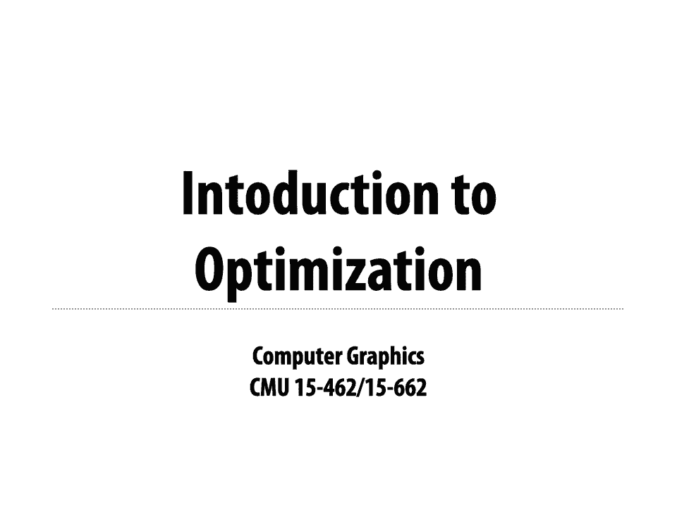

gonna use graphics and animation to，motivate our discussion of optimization。

so last time we started talking about，physically-based animation and saying。

that if we use dynamics to just to drive，motion then we can get a lot of。

complexity we can get a lot of rich and，interesting behavior without doing a lot。

of manual labor right without key，framing lots of different pieces of the。

animation and so we really get a lot of，complexities from some very simple。

models just from essentially solving F，equals MA the basic technique for。

solving those kinds of equations，numerically was numerical integration。

where we formulate the equations of，motion and then we take little steps。

forward in time by replacing time，derivatives with differences right。

that's how we got an update rule to take，us from the current configuration of our。

scene to the next configuration and this，is a really general powerful tool for。

generating all sorts of animation well，today in very much the same way we're。

gonna see another very general powerful，tool that lets us do various kinds of。

animation and that's numerical，optimization so the basic idea is we're。

gonna have some function some objectives，some thing that quantifies how well。

we're doing how good our solution is and，then we're gonna sort of ski downhill。

maybe follow the gradient of this，function to figure out how to get a。

better and better solution again this is，a technique of course that's used not。

only in graphics and not only in，animation but in all sorts of problems。

right so today we will talk a bit about，how，optimization shows up in animation but a。

really really important thing to，understand for graphics in general for。

image processing for geometry for，rendering for all the things we've been。

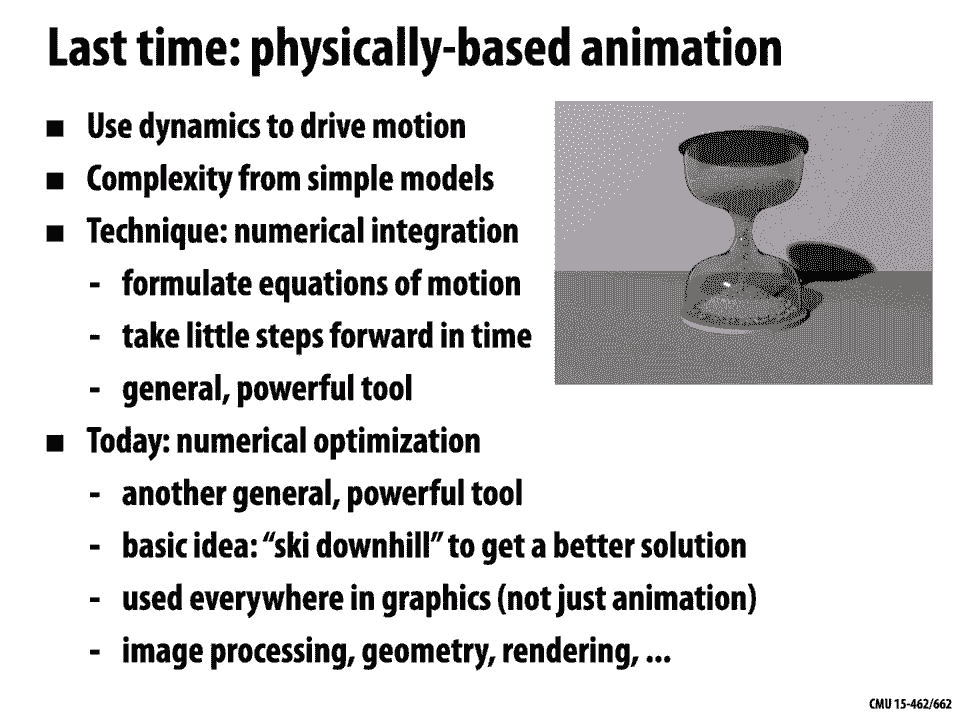

talking about in this class so far so，before getting ahead of ourselves we。

have to really say what what is an，optimization problem and this is a。

pretty natural way that people like to，think about things right you have some。

task at hand some problem you want to，solve and what you'd like to do is get。

the best possible solution among all，possibilities now in reality you。

typically also have some kind of，constraints right you want the best。

possible solution but you have some，amount of money you're willing to spend。

or amount of time you're willing to，spend on it，right so you might want to find the。

cheapest flight the shortest route the，tastiest restaurant whatever it is this。

general idea of optimization has been，studied since the dawn of time maybe the。

one of the first kind of interesting，examples of an optimization problem is。

the so called isoperimetric problem so，there's a little story here basically。

there's this princess Dido who shows up，in a new land and has some really you。

know sorted story but she shows up in，this new land and the people there say。

ok well to kind of honor you will give，you as much land as you can possibly。

enclose with an ox hide kind of a weird，thing to say but ok，and so this princess Dido was very。

clever and she said ok well I I know how，to actually encircle a lot of land with。

this oxide you think it's going to be，small but first of all what I'm gonna do。

is cut it into a really really long，strip and then this is the interesting。

optimization part I'm gonna figure out，what is the biggest piece of land that I。

can enclose with a strip of fixed length，right this really nice geometric。

optimization problem to think about what，is the biggest shape you can enclose。

with a strip or a piece of string of a，fixed-length okay and you may say if you。

think about this for a second you may，some of you might think oh it's obvious。

that the solution is a circle why is，that obvious actually you really have to。

you really have to show that's true but。

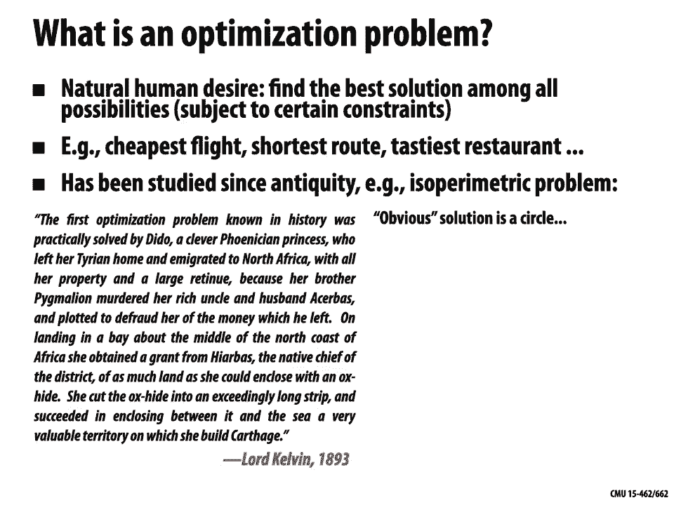

this is indeed what what princess Dido，did she made a circular path with this。

strip and closed a bunch of land and，really made out well of course in this。

picture actually it looks like she，wanted some coastline to ride she she。

wanted a little beachfront property but，in general if you want the most land。

encircled by a curve of fixed length，that would be a circle so this is。

optimizing an objective the total area，maximizing area subject to a constraint。

the length of the curve is fixed okay so，that's a very simple example of an。

optimization problem when it comes to，graphics I pedal characters can be。

easily made to balance on one side my，story justice once the careful balance。

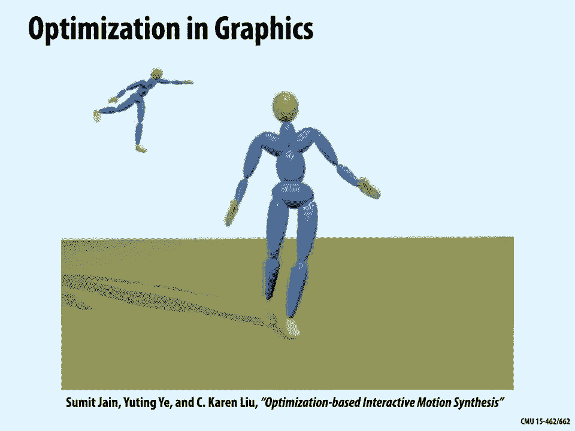

is we had some posing behavior and the，cleaners remember if character wants to。

reach programmer can also lower friction，codes on to generate working hands and。

difference should be placed when we，understand each slide on the floor make。

sure that this character more small，steps are required to recover balance。

actually just when receiving a strong，pleasure use the character decide lay。

some hand on the wall for a consultant's，about yourself kind of not when the wall。

is too far she has to take a step before，me so much that by introducing an。

additional wall the AIRC reminds is，destroyed walls for support problem note。

that in these examples the character is，controlled by the same balance。

controller and received du seigneur，after going in what we're doing and a。

variance in the output motion is，entirely other interesting examples。

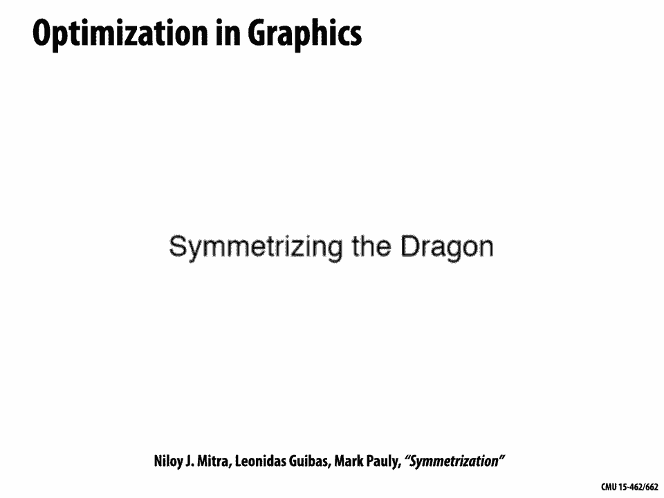

outside of animation in geometry you，know very natural thing is to say I want。

a model that has a lot of symmetry so，here we start with this dragon model。

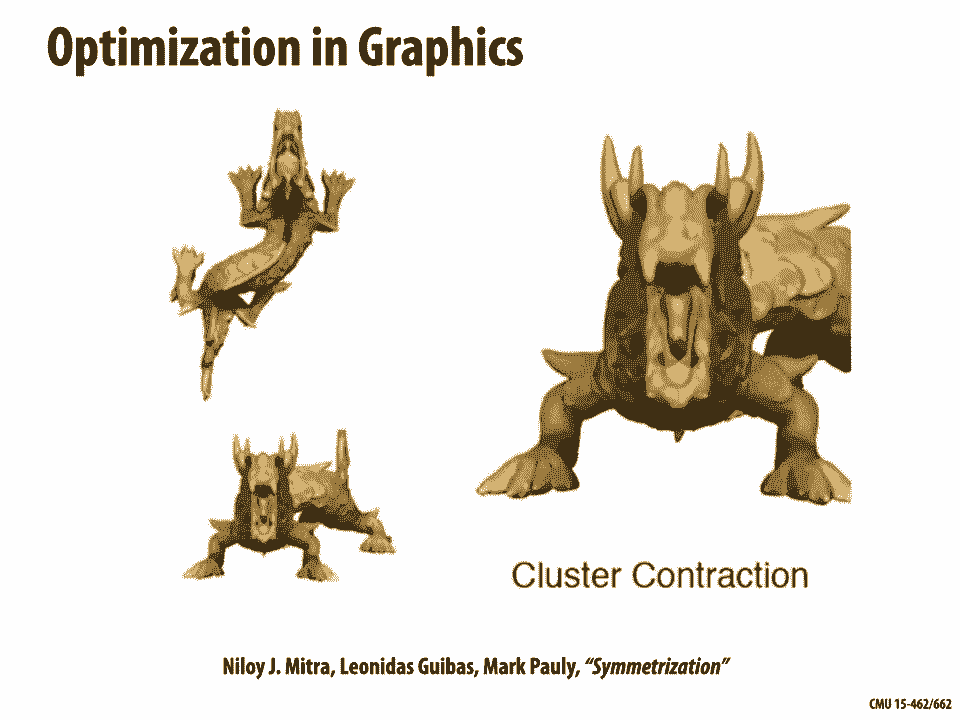

right that's just a triangle mesh with，no clear notion of symmetry and you do，where。

not only where the symmetries are but，how to deform the model to make it more。

and more symmetrical right this could be。

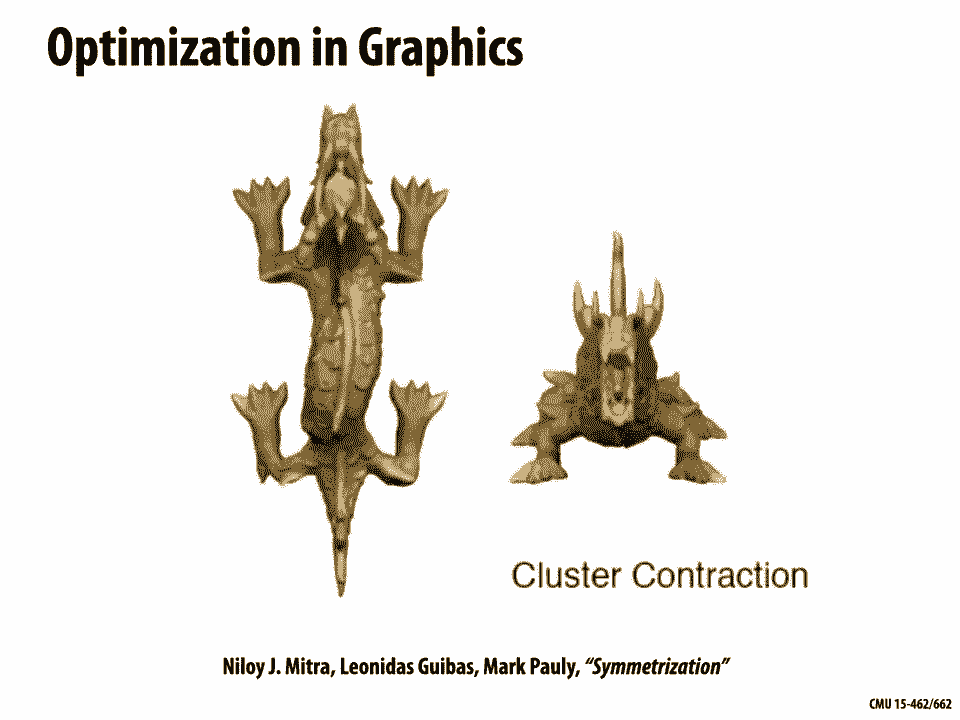

useful for simplification or compression，or fabrication or all sorts of。

interesting things editing right you，want to do edits to the original model。

in a symmetric way well maybe it helps。

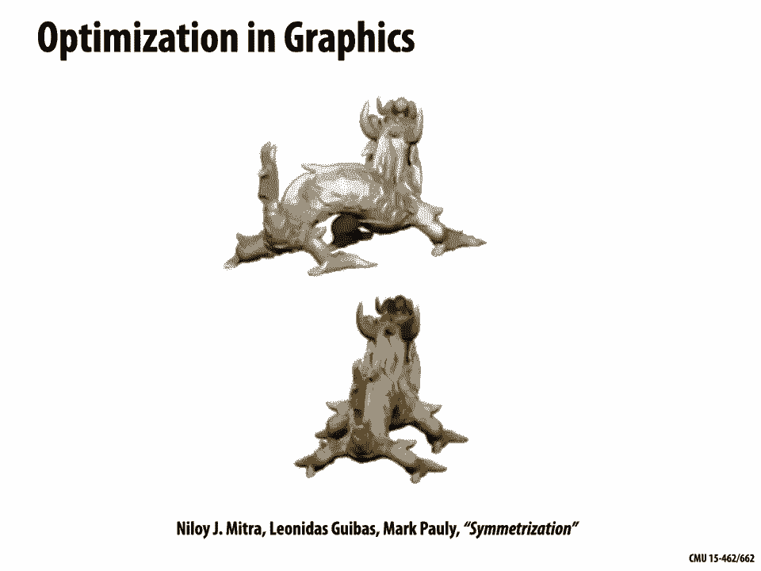

to detect or or produce these symmetries，ahead of time another fun example from。

3d fabrications optimizing dynamical，properties so here the idea is you want。

to take some shape and turn it into a。

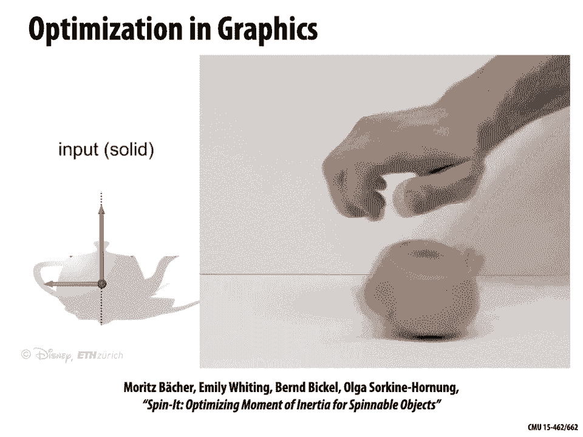

top something that really so here what，you're gonna do is do some kind of。

optimization involving the moment of。

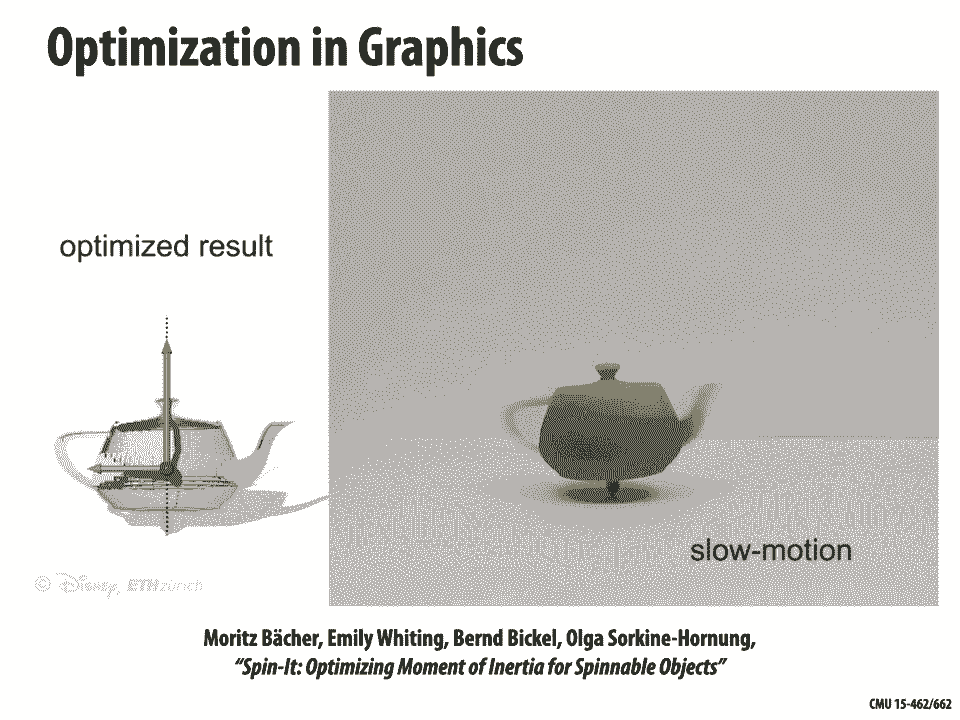

inertia adjust the general moments of。

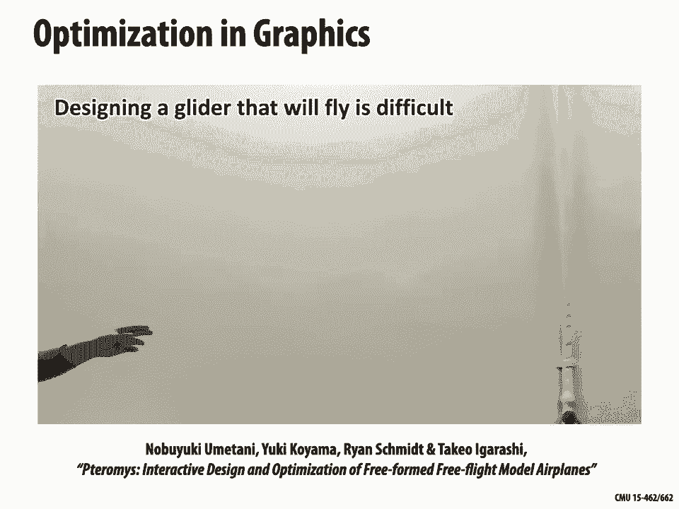

inertia another fun example paper，enables users to design refirm airplanes。

that actually slacklining interesting，shapes thicken bits of two parts and，off-line premutation。

and questions also computation learning，planes，in machine learning is all about saying。

have some model we also use our novel，comes nonlinear relationships between。

shapes so let's talk about different，kinds of optimization let's kind of have。

a little bit of a taxonomy of what，optimization problems can look like so。

for one thing a big distinction between，different types of problems is whether。

they're discrete or continuous so in a，discrete optimization problem the domain。

is a discrete set what does that word，mean discrete well to be precise about。

it a set that's discrete either has，finitely many elements，right or at least elements that can be。

put into correspondence with the，integers okay so that's what we mean by。

a discrete set usually when we talk，about discrete optimization we're，talking about a finite set of。

possibilities but not always a concrete，kind of silly example is what's the best。

vegetable to put in a stew right the the，set of possible vegetables is a discrete。

set what is an optimization strategy，that might work here well the first。

thing that comes to mind the the most，naive strategy is to just try every。

possibility right we put in a carrot we，try the soup we we rate it then we put。

in a potato instead and we try the soup，and we rate it and so forth we try every。

possibility and we assign a score to，every possibility this is obviously a。

bit of a costly procedure right if now I，said for instance okay of all vegetables。

I want to put three vegetables in the，soup which three are the best well now I。

have to do you know and choose three，different soups right this is a huge。

amount of work and that is the basic，flavor of a lot of discrete optimization。

problems then unless you have some，clever idea about how to solve it what。

you have to do is try out these，exponentially many possibilities until。

you find the best score now for a lot of，important problems even discrete ones。

people have cooked up clever strategies，for instance if you look at various。

graph algorithms you can think of graph，problems sometimes as being connected to。

optimization problems so maybe if you've，heard of a minimal spanning tree I have。

a graph and I want to pick a set of，edges that touch all vertices a tree of。

edges that touch all vertices and such，that the sum of all those edge weights。

is as small as possible that's a minimal，spanning tree okay you could do that in。

a naive way you could try every single，possibility every single possible。

subtree of the graph there'd be a huge，number of them right and then just some。

of the weights for all of them，fortunately for this problem people have。

figured out clever algorithms prims，algorithm kruskal's algorithm that let。

you do this in a reasonable amount of，time more often when somebody throws a。

just completely new and arbitrary，discrete optimization problem at you。

chances are it's gonna be pretty hard a，lot of discrete optimization problems。

like the Traveling Salesman problem is，our np-hard you want to know I have a。

bunch of cities to visit basically I，want to visit all the nodes on a graph。

I might cross the same edge more than，once but I want the total amount of time。

I spend traveling to be as minimal as，possible that's NPR not much you can do。

at it okay so that's discrete，optimization problems they give you a。

flavor and there are various ways to，approximate solutions to discrete。

optimization problems that don't look so，bad don't look as bad as this np-hard。

case if you're willing to give up a，little bit on being guaranteed that you。

get act absolutely the best solution，what about continuous optimization。

problems what does that mean well that，now means that the domain is no longer a。

discrete set so rather than values or，variables that take values in a discrete。

set and you might have something like，real numbers they can take any real。

value a kind of again silly example，would be what's the best temperature to。

cook an egg right so there I can't try，all the possibilities I simply can't。

write there's an infinitely many or，uncountably many different temperatures。

I could try to cook the egg at and check，which one is the best well that'll take。

me literally forever right so I have to，come up with a different strategy maybe。

I could approximate it with a discrete，problem right I consider only integer。

temperatures okay but does that really，make it any easier was that the right。

thing to do even within continuous，optimization there's still a lot of and。

be hard problems in fact a lot of，discrete problems can be transformed。

into a continuous problem but there are，also large classes of easy problems so。

one good example is so-called convex，problems so most convex optimization。

problems are things that you can，reasonably solve you can solve in。

polynomial time and get the optimal，answer and so that is a kind of problem。

that people sometimes aim for when，formulating algorithms especially in。

graphics it's nice if you can boil your，graphics problem down into a reasonably。

simple convex optimization problem boy，then you're in good shape because there。

are really good reliable reasonably fast，tools for solving these kinds of。

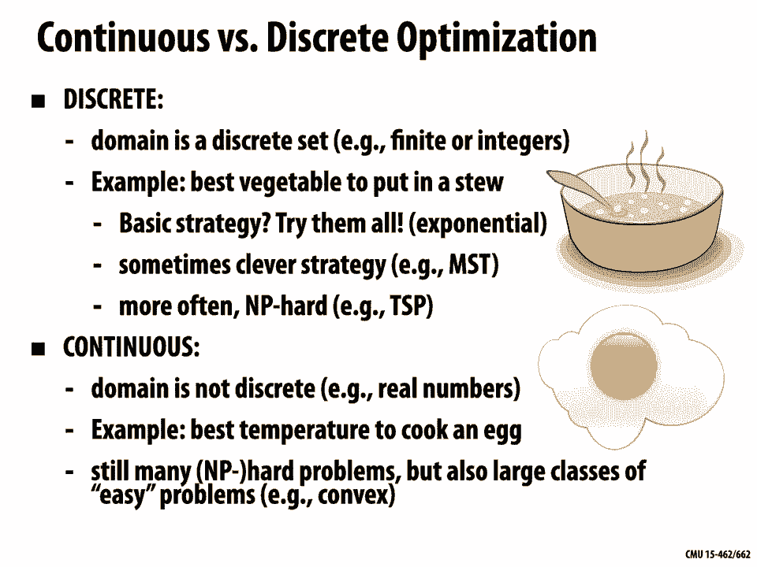

problems ok what does an optimization，problem look like well a really nice。

thing about optimization is that many or，most continuous optimization problems。

can be put into one standard form once，you have it in this form you can kind of。

think about solving many different，optimization problems many problems that。

come from different graphics problems，for instance using the same tools and。

techniques that's why we put it in，standard form this standard form looks。

something like this it says I want to，minimize a function f not with respect。

to a set of parameters X so if we have n，distinct parameters we could think of。

that as a point in RN and we also have，some constraints that need to be。

satisfied so the functions F sub I of X，need to always evaluate to less than or。

equal to B sub I for any X that we，consider one of these functions look。

like well they're often but not always，continuous differentiable functions that。

would be nice if we can take derivatives，of these functions and what they do is，they take our state。

or our parameters X and assign them a，score right the end parameters X in RN。

get assigned a single value in R，likewise our objective is this way it。

takes all the parameters as input and，assigns a score as output okay what does。

this objective represent it represents，basically how much does the solution。

cost or maybe another way of saying this，is how bad is X all right we want the。

best X well how bad is this X the，constraints say what must be true about。

X what are the conditions on X such that，they're such that these parameters are。

feasible their allowable all right so if，we think about this isoperimetric。

problem we might have said oh they're，allowable if they describe something。

that has the given length okay，the optimal solution to this problem X。

star has the smallest value of F not，among all feasible X okay optimal just。

means it's the best we can do while，satisfying all the constraints now when。

you look at this problem you think this，doesn't fuel that general it feels。

pretty specific right maybe we could，write down any objective that we care。

about this way we can always come up，with some function f naught that。

describes our cost or in machine，learning what people sometimes called。

the loss function but what about these，constraints they don't look very they。

don't look very generic I mean they're，all these inequality constraints what if。

I have other kinds of constraints and，also I'm minimizing here what if I what。

if I want to maximize something right I，don't want to find the least bad thing。

but I want to find the best thing I want，to I want to maximize the value of the。

objective well what can we do I mean，what what can we do to this problem if。

we wanted to maximize rather than，okay it's pretty straightforward all who。

do you have to do is change the，definition of f not we just flip the。

sign on the definition of f naught and，now we've turned our maximization。

problem into a minimization problem，there's really no reason to ever write。

an optimization problem as a，maximization instead of a minimization。

okay what if we want different kinds of，constraints what if we want things to be。

satisfied with equality rather than，inequality we don't want to just say。

that the value of some constraint，function is less than a given value but。

we want it to be actually equal to that，okay well one answer is we could just。

add equality constraints to our list but，actually we don't need to do that we can。

just include two complementary，constraints because these are in。

equality constraints that if we want to，get equality we can just have two。

constraints that say let's say G of X is，less than or equal to C and G of X is。

also less than or equal to minus C if，both of these constraints are satisfied。

then we've satisfied something with，equality right and so the point of this。

is not that you always have to write，down your problem in standard form but。

more that when you go to formulate，algorithms for solving optimization。

problems it's nice to be able to reduce，everything to this standard form because。

then you only need to come up with an，algorithm that handles problems in。

standard form and this is how some，optimization packages will work you'll。

state an optimization problem and it'll，transform that problem into a standard。

form and then hand that transformed，problem off to a solver that can handle。

any problem in standard form okay。

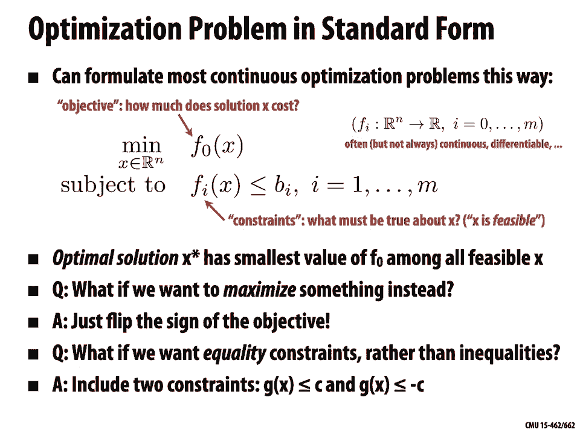

so let's talk a little bit more about，what it means to solve an optimization。

problem and this is something that you，know there's sometimes a bit of。

confusion or misdirection about when，have you solved an optimization problem。

well one one question is are you talking，about or do you want a local or global。

minimum what we've been talking about so，far and this previous slide is global。

minima the global minimum is something，that's absolutely the best among all。

possibilities right you considered all，possible triples of vegetables that you。

threw that you could throw into a stew，this one is the absolute best。

in contrast a local minimum is the best，among immediate neighbors or maybe。

another way of saying that is a local，minimum is something where I can't。

improve the solution by just，perturbing it a little bit I would have。

to make a big jump to ever find a better，solution okay and so you can ask this。

kind of philosophical question does a，local minimum solve the problem are you。

happy with a local minimum rather than a，global minimum and the answer is well it。

depends on the problem for some problems，it's really that you're trying to do the。

absolute best and you want to find a，global minimum for other problems you。

may be happy with a local minimum not，just because it's kind of good but。

because the fact that you're at a local，minimum tells you something important。

about the system you're looking at and，actually you'll find in nature examples。

of things where the kind of solution is，a local minimum rather than a global。

minimum one example is the proteins in，your body try to arrange themselves in。

some configuration that has kind of，optimal energy okay in terms of。

intermolecular forces and the the，proteins that you end up producing are。

often local minima rather than global，minima they're in some configuration。

that's a local minimum and it's actually，really important that they're in that。

local minimum because that shape is what，causes healthy cell function if you went。

to a global minimum you might get a，different way，all right so Global is not always best。

but hopefully it's clear what the，distinction between the two is another。

good example would be machine learning，machine learning essentially never or。

very rarely for you know big complicated，machine learning problems get you a。

global minimum but people are pretty，happy with local minima why is this true。

this is going to be true in for a lot of，graphics problems as well and。

essentially the reason it's true is，because local minima satisfy some。

condition on a derivative right and it's，satisfying that conditional and，derivative that gets。

you the good behavior you're in some，kind of equilibrium okay。

in some cases local minima can be really，bad alright if you're trying to plot a。

path through the city and you take some，crazy crazy route imagine you you start。

at your your home and then you head off，to your destination and all the time。

you're carrying a spool of string when，you end up at your destination you might。

say okay I could make that path a little，bit shorter by pulling the string tight。

right like pull it all the way tight，until I can't pull it tight anymore then。

I'm kind of at a local minimum for that，path I took it might get caught on some。

I don't know buildings or or，streetlights or trees that I passed by。

but if I take a crazy route through the，city right I wind around every city。

block to get to my destination this，local minimum could be really awful what。

I really care about is that the global，path is pretty good and so a lot to。

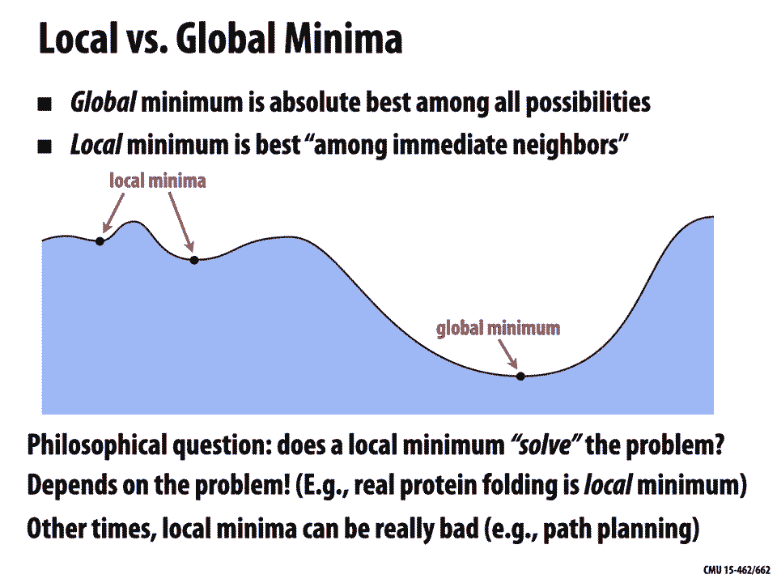

think about in terms of global versus，local minima let's take a look at some。

optimization problems so let's think，about this problem I want to just。

minimize over two parameters X 1 and X 2，the function X 1 squared minus X 2。

squared subject to the condition that X，1 squared plus X 2 squared minus 1 is。

less than or equal to 0 how can we，visualize this optimization problem you。

know typically we won't be able to，concretely visualize optimization。

problems involving a huge number of，variables right it's hard to visualize。

things in dimension greater than 3 or，maybe 4 but if we know how to visualize。

low dimensional problems you know things，involving maybe two variables that at。

least gives us some mental model，something to grasp on to when we think。

about optimization in general so how can，we visualize this，optimization problem well you all know。

how to plot the graph of a function in，two variables right I can think of this。

function X 1 squared minus X 2 squared，okay and you can think a little bit。

about what that shape might look like，and the constraint I can think of as a。

set of allowable points a set of points，over which I want to plot this graph so。

what shape does this describe all the，points such that x1 squared plus x2。

squared minus 1 is less than or equal to，0 this is an implicit description of a。

shape and that shape is of course a，circle or really the unit disk okay so。

if we were to visualize this problem we，might draw something like this a。

saddle-like function plotted over the，unit disk looks like a potato chip by。

the way is this an optimization problem，in standard form just to recall that。

definition is this in standard form yeah，we're minimizing an objective subject to。

an inequality constraint okay a more，interesting problem where is the optimal。

solution where is the globally optimal，solution right where do I find something。

okay and actually even for this simple，problem we see something interesting。

there can be more than one global，minimum here there are two both the。

point 0 1 and the point 0 -1 both have，the smallest value they're both at the。

point where this potato chip，touches the ground ok and so seeing an。

example like this makes us really think，like ok what can happen in general I。

thought you know initially kind of felt，like the global minimum was was maybe。

unique right it's the absolute best one，but now now I'm not so sure what can。

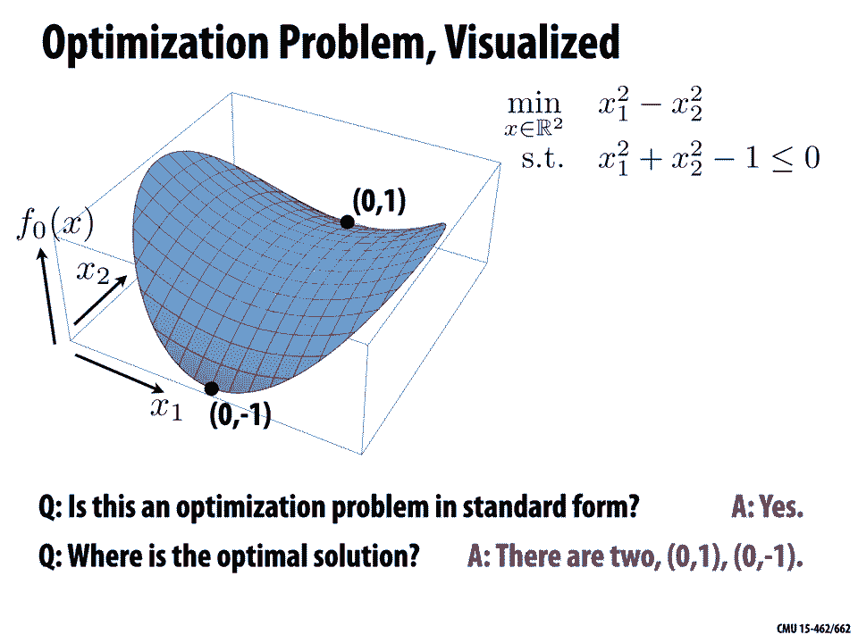

happen so let's talk a little bit about，existence and uniqueness of minimizer's。

and we've already seen that the global，minimizer is not necessarily unique does。

does that tell you anything about，uniqueness of local minimizer's yeah。

sure all global minimizer's are also，local minimizer's so if global。

minimizer's aren't unique then local，minimizer's are not either ok。

so if there are global minimizer's they，may or may not be unique but are we。

maybe we're jumping the gun here a，little bit because we also have to ask。

does a global minimizer always exist why，why should you be so sure that there's。

always a point that achieves the minimum，mean if you go back for instance to this。

point of view of discrete optimization，you could say well of course right just。

consider all the possibilities and take，the smallest one how could it be that。

there's not a global minimizer okay，well let's think about this for。

continuous optimization problems in fact，I'll give you a really simple one let's。

think about minimizing the function X，that's it right I have one variable in。

my problem it's X X is a real value can，take any value on the real line and I。

want to find the point X that minimizes，the objective function f of x equals x。

where's the global minimum and here's a，here's a plot here here's a graph of at。

least part of that function okay so，maybe just in this interval I say oh the。

smallest value is the point on the lower，left but I'm not just considering only。

this interval I'm considering the entire，real line so how could I ever find a。

minimal value I could keep moving X，further and further to the left and the。

value will go down and down and down and，down right so we set up a perfectly。

reasonable optimization problem it，doesn't involve any crazy objective。

functions or any crazy constraints but，it clearly has no solution we can always。

pick a smaller X right so we cannot，always find a global minimizer we can't。

always just take the smallest value or，the smallest input because not all。

objective functions are bounded from，below right and you can think about this。

way you've always heard that you know no，matter how good you are there's always。

someone better than you right that's，very true by the way and it's also true。

in optimization problems you can have，objective functions where you can。

keep going up and up and up and up to，get better or down and down and down to。

get worse okay that's not the only，reason why there might not be a global。

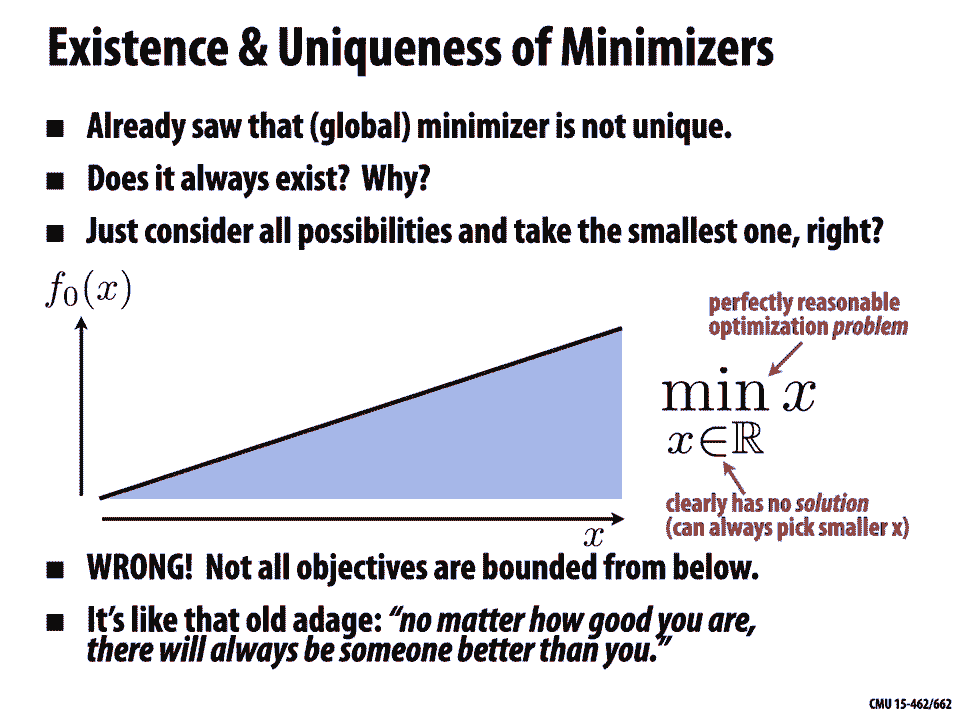

minimum but this is a very important one，let's also talk about feasibility so。

let's say okay fine forget about this，crazy case where the objective is。

bounded there's not bounded from below，imagine that the function itself has，some minimum value okay。

well then surely we can just take the，best feasible solution right I mean if。

the function doesn't just keep going，down forever then okay we can consider。

all possibilities and among all，possibilities keep the one that has the。

smallest objective value so let's，consider another problem let's say we。

want to minimize or solve this，optimization problem minimize the。

function zero okay this is kind of a，funny function I hand it X I handed my。

parameters x1 through xn and it always，just returns zero that's the function I。

want to minimize okay but this is，interesting because I have some，constraints I want to minimize it。

subject to these inequality constraints，whatever points I'm considering have to。

be have to have these functions if I，evaluate to less than or equal to B I。

okay so what the objective doesn't，depend at all on the choice of X any。

feasible solution is equally good our，problem now reduces to simply finding。

points actually any point at all that，satisfies all the constraints okay so。

our optimization problem reduces to，solving a system of inequalities one。

very simple example would be actually，let's say these inequalities are，equivalent to a set of。

equality's right before we said we could，have a pair of inequalities to get an。

equality and let's say that all these，functions F are linear functions okay。

then our optimization problem is no，different than just saying please find。

me any solution to a given system of，linear equations solve a linear algebra。

problem okay can I solve all linear，algebra problems can I always solve ax。

equals B for some matrix a well no no，hopefully you remember from your linear。

algebra class that's not all linear，systems have full rank so if I ask you。

to minimize the function zero subject to，a linear condition that doesn't have。

full rank then there's no solution there，is no global minimum because there's no。

feasible points a stupidly simple，example of this would be minimize 0。

subject to x equals 1 and x equals minus，1 okay that is a problem in standard。

form it doesn't have a solution and so，therefore it doesn't have a globally。

optimal solution okay so we can't just，take the best feasible solution because。

another thing that we get out of this is，to realize that every system of。

equations is an optimization problem so，if you have a general purpose solver for。

optimization problems in standard form，then you also have a general purpose。

solver for systems of equations okay but，we have to be careful here it's not like。

there's some great solver that's gonna，solve all problems for us ever。

especially because not all problems even，have solutions right not all problems。

have solutions and you'll appreciate，this more and more as you get older so。

let's look at a concrete example maybe，make this a little easier to understand。

let's consider the optimization problem，minimize over points in the plane the。

function sine of x1 plus x2 squared，except that we're not actually。

optimizing over the whole plane we have，these conditions we say that x1 minus 2。

squared plus x2 squared is less than or，equal to 1 and x1 is less than or equal。

to minus 1 is this problem feasible are，there points that satisfy those two。

inequality constraints well let's think，about what to those constraints describe。

so the first one certainly looks，familiar it looks a lot like our。

implicit equation for a unit disc except，that we've shifted it right we。

subtracted 2 from x1 which means we're，gonna shift the disc over 2 units to the。

right ok and what about the second，constraint what does that describe。

geometrically what region in the plane，does that describe well it describes all。

points whose first coordinate is less，than or equal to minus 1 so it describes。

a closed half plane where the boundary，of that closed half plane passes through。

a vertical line x1 equals minus 1 all，right so it looks like this ok so is。

this problem feasible what's it asking，us to do it's asking us to minimize this。

interesting-looking objective function，over points that are both in the blue。

disc and in the blue half plane are，there any such points no right these two，sets。

what I'm gonna call sublevel sets have，no common points they don't overlap okay。

so not all problems are feasible even，pretty nice-looking ones may not be。

feasible and so we may not be able to，find minimizer's okay so so far we know。

that if a objective function is not，bounded from below or our constraints。

are not feasible then we can't find，minimizer's is that it right or on the。

other you know other way of saying that，is if the objective function is bounded。

for from below and we have a nice，feasible set there are points that。

satisfy our constraints then surely we，can find a optimal solution we just look。

in that feasible set we look at all，valid points we test the value of the。

objective function and we keep the，smallest one sounds pretty good actually。

it's still not that simple，so even being bounded from below is not，enough how can that be well let's。

consider again a really nice simple，optimization problem really not very。

complicated at all it says we want to，minimize over all possible real numbers。

X the function e to the minus X what，does this look like what is the function。

e to the minus X look like it looks like，that ok this nice smooth curve perfectly。

differentiable to find everywhere on the，real line we just want to find where。

that function is smallest，well sorry we're out of luck right no。

matter how big X gets we never actually，achieve the lower bound of the function。

we never actually achieved the value 0，which is the value we approach as X goes。

to infinity and so this function does，okay so so you see some examples like。

this and you think boy this is this，sounds complicated I thought you know I。

thought it'd be easy to talk about when，there is a global minimum this idea of。

there being a global minimum is so，intuitive but now I don't feel confident。

at all that that I even know given a，problem that it can be solved。

so so what can we say so when how can we，kind of write down a simple list of。

conditions that that gives us a sense，something that can be solved well。

there's two sufficient conditions these，are sufficient conditions right these。

are enough to guarantee that a solution，exists they're not necessary there might。

be other ways to know there's a solution，but these are sufficient one is。

something called the extreme value，theorem okay so we have a we want to。

have a continuous objective an objective，that doesn't jump in value as we change。

X by a small amount and a compact domain，meaning the set of feasible points is a。

closed and bounded set closed and，bounded subset of RN okay and coercivity。

coercivity means that the objective，function loosely speaking goes to。

positive infinity as we travel far far，away in any direction right so this。

example here e to the minus x is not a，coercive function as X gets bigger and。

bigger and bigger the value is not going，towards positive infinity it's not it's。

not looking more and more like a steep，wall right it's getting smaller and。

smaller so coercivity is kind of saying，there's gonna be a global minimum。

because if you allow yourself to get too，big too far from the origin things are。

just gonna keep going up that's not a，good place to look right and the extreme。

value theorem is asking that we have a，compact domain that the set of points。

where we have to look is sort of in some，sense finite I mean it's not actually。

set of finite a finite set of points but，it is kind of a finite region a closed。

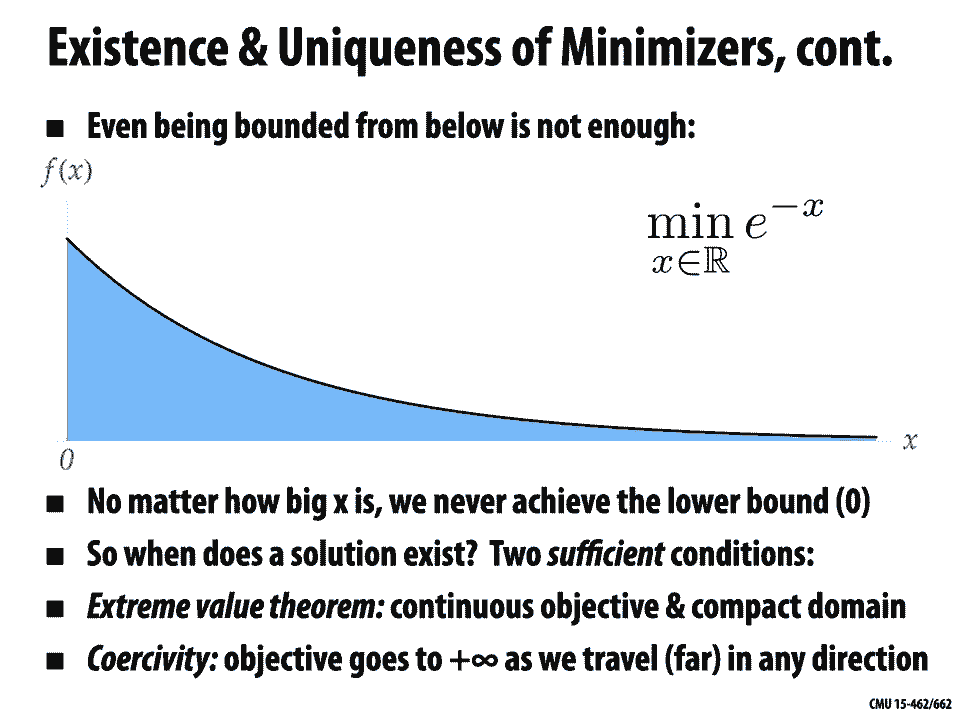

and bounded region of RN ok ok so now we，have some sense of when a minimizer。

might exist but we haven't yet said，anything about how we know or how we。

test whether a given point X is a，minimizer so let's look at this picture。

again we have local minima we have，global minima you know how do we how do。

we know how do I you know how did I how，did I draw this picture how did I know。

to draw points those black points on，this picture why did I think that those。

might be good candidates for local and，global minima maybe the global minimum。

is easy because it was the smallest，value on that curve why am i drawing。

those local minima at those points okay，so in in general I'll actually say that。

checking if a point is a global，minimizer is typically hard if I just。

hand you a point X and I say I claim，this is the global minimum and you want。

to go check is it or isn't it the global，minimum do I believe that this is。

actually the optimal solution that's，usually hard actually checking that a。

given point is the global minimum maybe，as hard as solving the original problem。

you have to just go back and do it，yourself but we can certainly test if a。

point is a local minimum ok so what's，what's a good idea maybe something that。

you have seen in your your calculus，class to figure out whether a given。

point is a local minimum that's that we，okay and this will also by the way help。

us at least determine if a point is you，know a global minimum is has got to be a。

local minimum so this is the first thing，you check if I said this point is a。

global minimum well you can at least，check is it a local minimum if it's not。

a local minimum then you know I'm lying，right but how do I check that a point is。

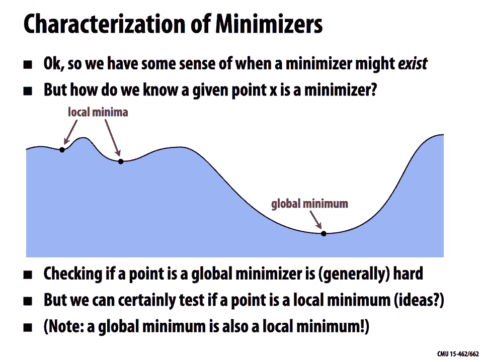

a local minimum okay well let's think，about a function an objective function f。

f naught that goes from R to R just a，function on the real line how do you。

find a minimum of this function how did，you do that in calculus so here's a nice。

function and you might have kind of，memorized how to do this in your。

calculus class but let's let's go，through it we want to find points where。

the derivative of the function is equal，to zero we want to find points x star。

where the derivative is equal to zero so，something like that right if we kind of。

draw what the the derivative or the，gradient of the function looks like at。

that point we get this straight line，this this tangent line okay great so so。

that's the answer right if we want to，find a minimum we just take our function。

we differentiate it we set it equal to，zero and we solve for X right well not。

quite what about this point this point，also has a derivative equal to zero so。

does that mean that that point is a，local minimum no not really。

it means it's a critical point of the，function but it's not necessarily a。

local minimum so what else do we need to，do to know that a point is a local。

right we also need to look at the second，derivative we need a second derivative。

test in particular we want to make sure，that the second derivative is positive。

right it has this convex behavior at the，critical point okay so that's something。

we can easily understand for functions，on the real line what about more general。

functions I mean obviously when we want，to do computer graphics we're gonna be。

dealing with extremely you know big，complicated optimization problems with。

many variables what does it mean to do，these first and second derivative tests。

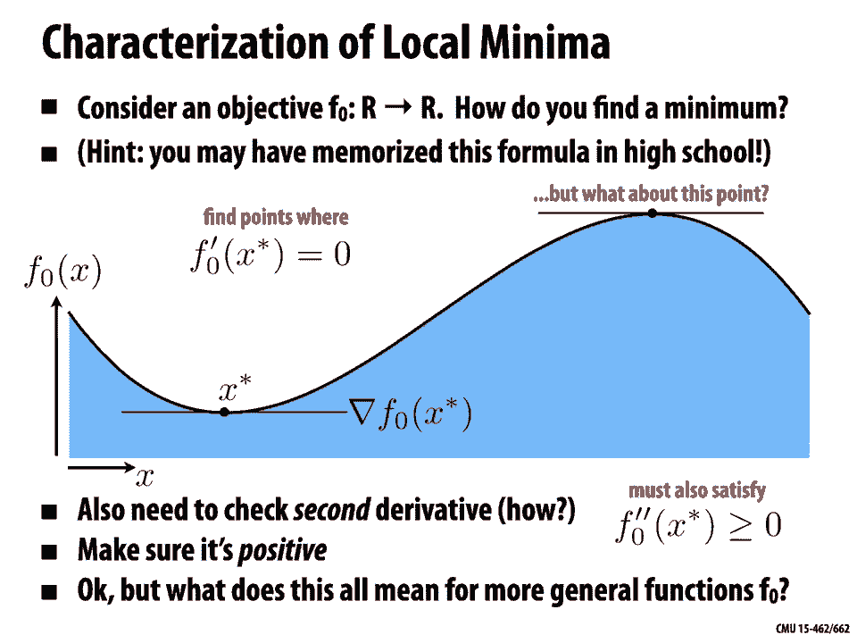

for more complicated optimization，problems so let's talk about these。

conditions what are called optimality，conditions for unconstrained。

optimization problems for now we'll，assume we only have an objective we。

don't have any constraints and in，general we'll think of this objective as。

a function f naught that goes from RN to，r it takes n variables as input and。

assigns a single score okay how in this，case in this multivariable case do we。

test for a local minimum well the idea，is really not so different we still want。

to do some kind of first derivative test，that tells us we're at a critical point。

of the function and we want to do some，kind of second derivative test that。

tells us that this critical point is not，a maximum and it's not a saddle point。

but it's actually a local minimum okay，well the first derivative test is going。

to be something that uses the gradient，rather than just the ordinary derivative。

we already hinted at that and the second，derivative test will involve the Hessian。

of the function which we reviewed at the，beginning but okay let's take another。

look okay so remember that the gradient，of the funk，grad F kind of describes the slope of。

the function or the direction of，steepest ascent that was a good way of。

looking at it so if we're walking around，on a hillside and we keep following the。

gradient to go down and down and down，we're trying to get down to the bottom。

of the valley then there's going to be a，point or there may be a point where the。

gradient vanishes where we can't walk，down any further，likewise if we're going up there may be。

a point where the gradient vanishes we，can't go up any further right okay。

the Hessian is our generalization of the，second derivative to multi variable。

functions and the way you usually learn，this is it's a big matrix of all。

possible second partial derivatives so，if I have variables x1 through xn then I。

take the second derivative of F with，respect to X 1 and then X 1 then I do it。

again with respect to X 1 and X 2 X 1，and X 3 and so forth and what does this。

capture well just like in the，one-dimensional case the Hessian kind of。

captures the curvature of the function，is it concave is a convex it's something。

else happening I can also think of the，Hessian as kind of the change in the。

gradient so if I apply the Hessian to，some direction you then actually what。

that's telling me is how does the，gradient change along the direction you。

okay so what are our optimality，conditions then well they really don't，look any different。

once we've generalized the first and，second derivative we say to be at a。

local minimum of a function f not as，long as it is twice differentiable as。

long as we can define the gradient of，the Hessian gradient imagine then we'll，at that。

point is zero and if the Hessian of the，point is positive semi-definite。

okay importantly this little symbol is，different from just the greater than。

equal to symbol it's not saying the，Hessian is greater than or equal to zero。

it's saying it's positive semi-definite，meaning you transpose au is greater than。

or equal to you I start is greater than，or equal to zero for all you one way to。

think about this is if I have a matrix a，that's positive semi definite and I。

graph the function U transpose au for，all possible u then this looks like a。

bowl right rather than a hat or a saddle，it looks like a bowl and if my Hessian。

is bowl-like at X star at this this，point I'm considering that means I'm。

sitting at the bottom of the bowl I'm，really at a local minimum okay okay so。

that's that's what we can check to see，if we're at a local minimum what if we。

have constraints though is it still just，a matter of checking the first and。

second derivatives well let's consider，this function that we looked at before。

right this kind of potato chip function，and we said that it has two globally。

optimal solutions in fact in this in，this case those are also the only local。

minima of the function do these points，satisfy our first and second derivative。

conditions I mean they clearly are the，optimal solutions we couldn't possibly。

get any smaller than these two points，but do they satisfy these derivative。

conditions for instance is the gradient，of the function zero at these black。

points no right if I was standing at，that point，the direction of steepest ascent is。

taking me upward it's a non zero vector，okay so these points even though they。

are minima don't satisfy our derivative，conditions something changes when we。

have constraints in the problem is the，Hessian positive definite at these。

points maybe not as clear from this，picture but no it's not right，so it's not generally true that a。

constrained optimization problem has，minima where these first and second。

derivatives second derivative tests are，satisfied in general it gets more。

complicated in general any local or，global minimizer must satisfy the so。

called kirusha kuhn tucker conditions or，what people always abbreviate as the KKT。

conditions okay I'll just write these，down so you can see at least once what。

they look like okay here they are so，they get quite a bit more complicated。

you see that there still is kind of a，first derivative condition in here but。

now it involves derivatives of the，objective function and derivatives of。

the constraint there still are，conditions saying oh well we should。

satisfy all those constraints but then，the funny thing is there are these。

additional variables in here we were，optimizing just with respect to X's and。

now we have all these lambdas in here we，have these kind of dual variables that。

help us understand are we at an optimal，point okay so we're not gonna work with。

these in this class but these do show up，all the time in computer graphics when。

you're talking about constrained，optimization problems so I wanted to say。

at least once where to look if you're，trying to understand what optimality。

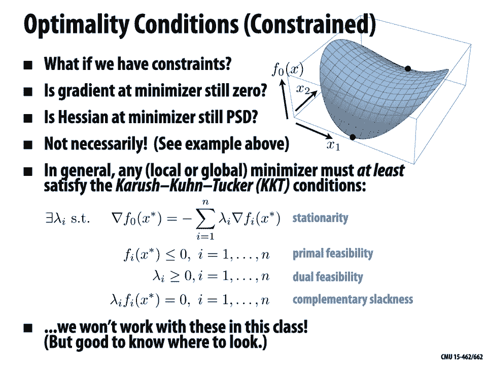

means for constrained problems okay，let's now talk about a special class of。

optimization problems that are ones that，are nice ones that we would like to use。

or like to have to solve right at the，beginning I said in general optimization。

problems can be np-hard they can be，super you know difficult to solve and。

definitely you can't find the global，minimizer convex problems are a special。

class of problems that are almost always，easy to solve in polynomial time what I。

mean by almost always is not that every，time you go to solve it it may or may。

not be easy to solve but rather that，there are kind of harder and harder。

classes of convex optimization problems，and at some point they get hard enough。

that they're not all just nice，polynomial time solvable for more basic。

ones like the ones that often show up in，graphics you can usually solve these in。

not only polynomial time but really，quite fast really in a time that's。

sufficiently fast for making beautiful，images what does it mean for a problem。

to be convex it means that it has a，convex domain and a convex objective。

okay well to make sense of that we need，to say what we mean by convex domain and。

convex objective so what is a convex set，okay here's an example of a convex set。

how do I know it's convex how do I test，whether whether or not a set is convex。

the basic idea is I should be able to if，it's convex I should be able to take any。

two points inside the set and connect，them by a straight line segment that。

doesn't leave that set alright so here，we could take these two points draw a。

straight line segment between them that，segments contained in the blue region。

if you imagine repeating that for any，possible pair of points in the set there。

all of those segments are contained，inside the set so that's a convex set or。

a convex domain here's an example that，is not convex you can pretty easily find。

a pair of points where if I connect them，by straight line segment that segment，goes out。

side the domain so that's non-convex，okay what does it mean for a objective。

or a function to be convex kind of a，similar idea if I look at the graph of。

the function here it is graph of f of X，and I take any two points and connect。

them by straight line segment I want，that line segment to be above the graph。

of the function for all possible pairs，of points so you can imagine if I repeat。

that again for a different set of points，the segment is still above the graph so。

we call that a convex objective here's a，function that is not convex I can very。

easily find a pair of points where if I，draw a straight line segment between。

them that segment is not always above，the graph so this is a non convex。

objective why do we care about convex，problems in graphics well for one thing。

we can make guarantees that we always，get the best solution all right that's。

nice we're really getting a really，really nice result also because we don't。

have little local minima all over the，place we know that the result we get。

won't depend on finding a good initial，guess right at least if the problem is。

strongly convex meaning this line，segment always always strictly above the。

graph of the function this is not，generally true for all optimization。

problems right if I have a general，optimization problem might have lots of。

local minima we can't guarantee we，always get the best solution to try to。

get a solution that's even reasonably，good we might have to think about think。

really hard about how to initialize，optimization what's an initial guess。

that kind of sort of looks like it might，be good and then find a nearby local。

minimum with convex problems strongly，convex problems we don't have to worry。

about this at all we can start with，whatever random guess we want and we'll。

always get the same optimal solution，what this means is algorithm is built on。

top of convex optimization，are also more reliable you can make kind。

of guarantees about their behavior，because you know a lot more about the。

global minimum than some arbitrary local，minimum also convex optimization solving。

these problems is often efficient but，not always okay for kind of simple。

convex optimization problems these are，about as fast as any other problem you。

might have to solve numerical problem，might have to solve for graphics as you。

get into more sophisticated types of，convex optimization problems they can。

actually be quite expensive okay so。

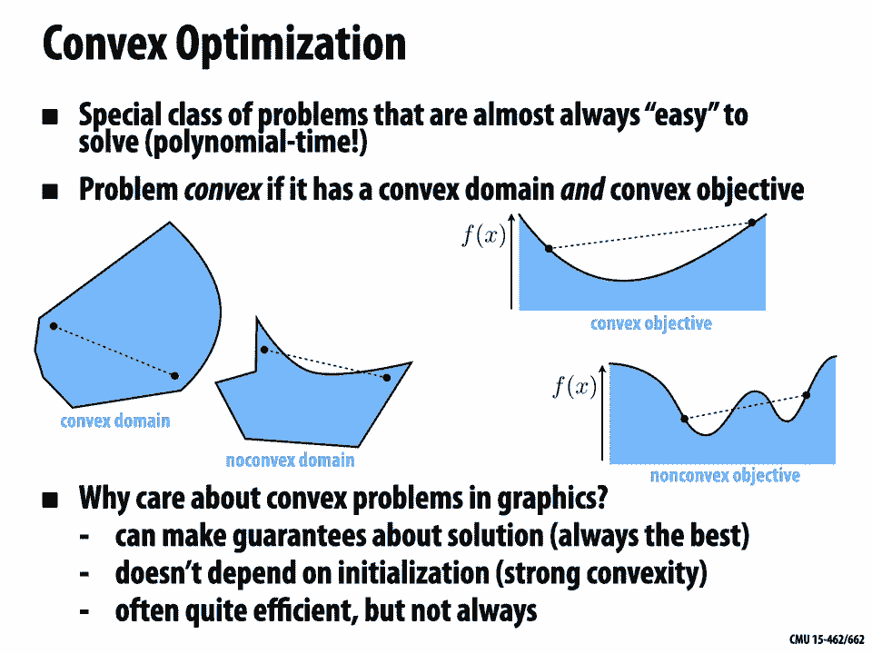

let's take a look at one really，important class of convex optimization。

problems that show up all the time day，and night in computer graphics both in。

animation and in geometry processing and，an image processing all over the place。

which are convex quadratic objectives in，fact we've already seen an example of。

this when we talked about quadric errors，simplification we wanted to place the。

collapsed point we were simplifying a，mesh and we want to place the collapse。

point at the best location what we，defined this notion of best using a。

quadratic form minimizing that quadratic，form was a convex quadratic problem okay。

this is a also a very valuable way of，looking at many common equations there。

are a lot of equations that pop up in，graphics that you might not realize are。

minimizing a convex quadratic problem，but they are and thinking about it this。

way it can help you understand you know，how the solutions behave how to solve。

these things and so forth so how do we，write one of these down we can express。

it via a positive semi-definite matrix，okay so if we have an objective that。

looks like this F naught of x equals 1/2，X transpose ax minus X transpose B where。

a is a positive semi definite matrix，then that is a convex，quadratic objective the degree of the。

highest term is quadratic because it，involves X twice and it's convex because。

a is a positive semi definite matrix if，we drew the graph of this function it。

would look like a bowl and if we drew，little line segments between any two。

points on this graph they would all sit，above the bowl okay all right so here's。

a good opportunity to practice checking，these optimality conditions so what is。

the first order optimality condition for，this function what is our analog of a。

first derivative test well we said we，have to take the gradient of the。

function and set it equal to zero how do，we take the gradient of a function。

involving matrices and vectors this was，actually part of your linear algebra。

review at the beginning so hopefully the，the basic idea that you remember is that。

differentiating matrix valued functions，behaves at least superficially a lot。

like just differentiating ordinary，scalar functions in particular if I have。

an ordinary function ax squared and I，take the derivative with respect to X I。

get to a X here I have a term it kind of，looks like that I have a term that looks。

like X transpose ax and a is a nice，symmetric matrix so what happens if you。

grind through the calculation as you may，have done for your homework is you get。

something very similar you get two times，the matrix a times the vector X okay and。

then that gets multiplied by 1/2 so，we're just left with a X what is the。

gradient of X transpose B with respect，to X again you can kind of remember the，scalar analogy。

what's the derivative of just an，ordinary function be X with respect to X。

it's just B likewise here the gradient，of X transpose is B with respect to X is。

just the vector B ok so putting that all，together we get a first order optimality。

condition of hey ax equals B so that's，interesting if I'm ever solving a linear。

system involving a positive semi，definite matrix a I could also think。

about that as minimizing this quadratic，function as trying to find the bottom of。

a bowl-shaped function cool what's the，second order optimality condition if I。

take another derivative of this，objective what happens well B is。

constant with respect to X so that goes，away and a X depends linearly on X so。

basically I just peel off this last x，factor and I'm left with the matrix a。

and I ask that that is positive，semi-definite okay so now I know that。

for a vector X to be an optimal solution，to this problem to be a minimizer of F。

naught of X I have to find an X such，that ax equals B and such that a is。

positive semi-definite okay well if this，objective is convex that means I already。

know a is positive semi-definite and so，to find the optimal point I just have to。

solve this first order optimality，condition I just have to solve a linear。

system right because I know that the，second condition is satisfied by。

definition okay and I keep talking about，this picture is good to kind of have a。

mental picture of what's going on here，you know why does this work out if my。

matrix a is positive semi-definite，then the graph looks like this cylinder。

in the middle it's going up in some，directions it's maybe straight in some。

other directions if it's strictly，positive definite if it's a strongly。

convex function then it looks like this，bowl on the rat on the far left and if。

it's indefinite alright if x transpose，ax is greater than 0 for some X and less。

than 0 for other X then it has this，saddle like behavior on the right and so。

this kind of gives a sense of why should，it be that convex problems are easy to。

solve well if I have this bowl and I'm，looking for the minimum of the bowl I。

can imagine just kind of skiing down to，the bottom if I keep just going down。

down down following the gradient I'll，get to the bottom this is a coercive。

function if I go out you know that go，out away from this in our bowl it's。

gonna get bigger and bigger and bigger，if I'm positive semi-definite I'm still。

in good shape I can still ski down to，the bottom of this now it's more like。

snowboarding this is like a halfpipe or，something right and I get to some point。

unique point on the bottom there's this，whole line of solutions in this case。

okay but I still get to something that，has a minimum value whereas if my。

objective has a matrix a that's，indefinite if it's not a convex problem。

well then actually in this case there is，no minimizer I can just keep skiing down。

this saddle forever and we'll never get。

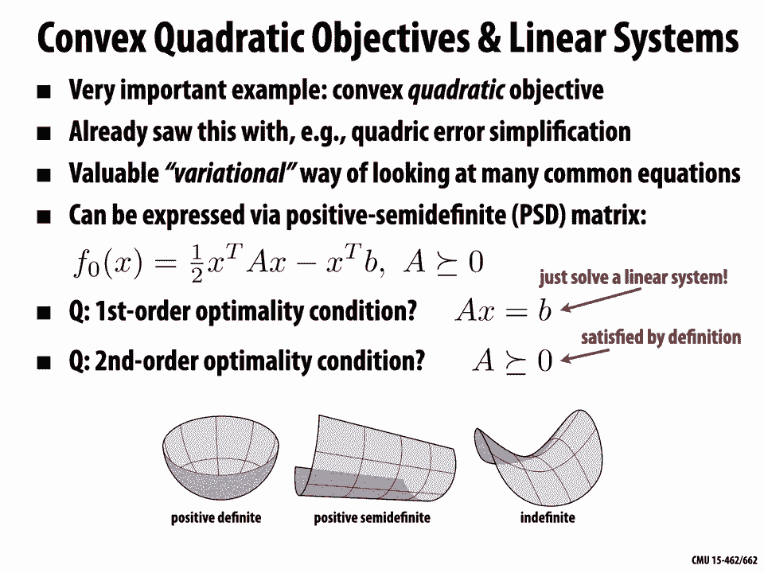

to a minimum value okay so sadly life is，not usually as easy as solving convex。

quadratic optimization problems，unconstrained convex quadratic。

optimization problems if it were we'd be，in good shape because we just have to。

solve linear systems we'd be done the，reality is the kinds of optimization。

problems that show up in graphics are，way more complicated and sadly aren't。

often not convex even if that's a good，of getting our head around optimization。

problems so how do we solve optimization，problems in general and a very old idea。

right very intuitive idea is exactly，what we've been talking about skiing。

downhill following some descent，direction to make our current guess。

better and better and better until we，can't get any better some people like to。

talk about this in the other direction，they say we'll do a hill climbing method。

we'll keep following the gradient uphill，until we get the best value well first。

of all you all know that that's，equivalent to flipping the sign on the。

objective and minimizing instead and，second of all hill climbing sounds way。

more exhausting and painful than skiing，I would much rather ski downhill then。

climb up hill ok so the most basic，version of this descent method is。

something called gradient descent ok and，the basic idea is to follow the gradient。

downhill until the gradient is 0 so，follow the direction that's minus the。

gradient right because we know that the，first order optimality condition says。

we're looking for points at least where，the gradient is 0 those are local minima。

well they may be local minima of our，function ok so here's what that looks。

like in one dimension I have a function，f naught of X I start at some initial。

points on the top left i compute the，gradient which in this case is just the。

first derivative of the function with，respect to X and then the change in my。

guess for the position the change over，time and my guess for the position is。

just equal to minus that derivative or，minus the gradient ok so may be helpful。

to really plot some of these quantities，on the x axis so if I start at the point。

X naught the gradient of the function at，X naught actually points to the left。

so just to decrease the function I'm，gonna start moving toward the right if I。

take just some small step in the in the，direction to the right I'm gonna end up。

at a new point at that new point there's，a new gradient that new gradient tells。

me to travel possibly in a different way，in this case it tells me to continue。

going to the to the right but to go even，faster right there's a steeper gradient。

and then as I keep going as I keep，following the gradient eventually I。

reach a point that's a local minimum，right where the gradient goes to zero。

okay in this case we did really well we，found the absolute smallest value of the。

function do we always end up at a global，minimum no I mean we could have started。

on the right side of this graph and，ended up in that other local minimum on。

the on the right side another important，question how do we how do we compute or。

how do we implement gradient descent in。

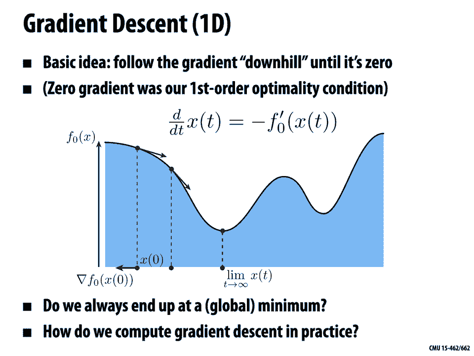

practice okay so let's write this down，gradient descent algorithm in 1d okay so。

one thing that maybe you noticed after，our last lecture is that the gradient。

descent equation the gradient descent，evolution is an ordinary differential。

equation it says the change over time of，the quantity X of T is minus the。

derivative of that function evaluated at，X of T so the function itself or the。

derivative of the function is our，velocity function how do we solve this。

equation numerically we already spent a，lot of time last last lecture talking。

about how to solve in general ordinary，differential equations numerically so。

this should be no no trouble well we，said one way we can do this is to apply。

the forward Euler algorithm the forward，euler time stepping strategy where we。

said okay let's replace this two，rivetted dx/dt with a difference in time。

our next X minus our current X divided，by some time step Tao if we then solve。

for the new point the new location of X，we can write that like this X k plus 1。

our next location for X is equal to XK，plus tau times the derivative of F。

naught at XK at our current point one，thing we didn't spend too much time。

talking about last time is how do we，pick this time step tau when we were。

talking about animation what we observed，is that if we pick a time step that's。

too big we can get undesirable behavior，like our pendulum you know that was。

supposed to swing back and forth gently，actually blew up it starts spinning。

around like crazy so we we have a sense，that it can be dangerous to pick time。

steps that are too large of course we，also want to avoid picking time steps。

that are too small because we're gonna，end up doing a lot of work we're gonna。

have to repeatedly evaluate the，derivative of this function over and。

over again so so the game usually in，something like gradient descent is to。

ask what's the biggest time step we can，take without things going crazy because。

if we're not careful we take a huge step，then we're gonna just start randomly。

jumping all over the domain evaluating，whatever the gradient happens to be。

they're jumping to some new point and，it's not clear we're gonna make progress。

towards the local minimum ok so the，basic strategy is to use step control to。

determine a step size based on the value，of the objective and its derivatives at。

our current point or maybe at our point，and some nearby points there are lots of。

different strategies for step control，one of the most common is to do line。

search ok and if we have a care，carefully designed line search strategy。

for instance one standard one is called，armijo-wolfe then we can be guaranteed。

that we will always at least converge to，a local minimum and if our function is。

sufficiently nice and we apply this line，search strategy we know that our。

gradient descent algorithm will always，reach a local minimum or always we'll。

get within some given epsilon of a local，minimum for now，we're gonna keep things simple rather。

than trying to come up with some fancy，line search strategy we're just gonna。

make tau really small we are just gonna。

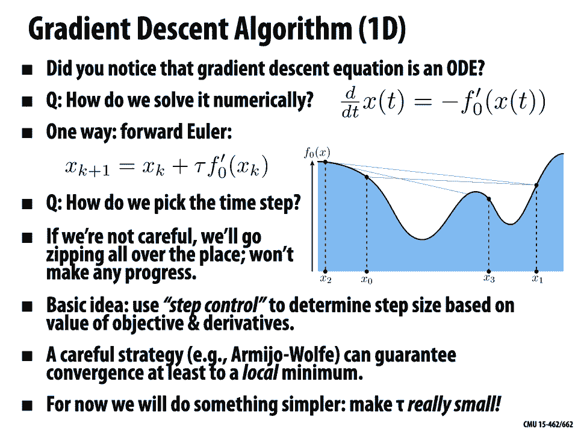

take lots of small steps okay what if we，go up into mention what if we have a。

multivariable function how do we write，down gradient descent I'll really not。

different at all we just replace our，first derivative with guess what the。

gradient okay so we get another ordinary，differential equation that says the。

change in time of our guess X is equal，to minus the gradient of the objective。

function evaluated at the current guess，X of T what's the corresponding discrete。

update again it doesn't look any，different，the next point we want to visit is the。

current point - this small time step tau，times the gradient of the function。

evaluated at the current point okay，sounds pretty good and again if we use a。

reasonable blind search or or whatever，to pick our time step tau or if we just。

set it to be a teeny tiny value then，we'll get to a local minimum life is，good。

okay but now we can start asking，questions about efficiency not only will。

we get to a local minimum but how，quickly will we get to a local minimum。

so a basic challenge as we start going，up in dimension is the gradient descent。

can exhibit some really kind of dumb，behavior so here's a very very common。

phenomenon where our objective，function in the vicinity of a local。

minimum looks like a long slender Valley，and so if I start at a point and I walk。

for a little while along the gradient at，that initial point and then I stop I。

update the Greg find a new gradient I，walk a little bit along that direction。

and then I do it again and again and，again the solution can oscillate back。

and forth right we as people who can see，the global picture know that the best。

thing to do probably would have been to，just head straight for the middle it。

doesn't actually make so much sense to，follow the gradient direction in this。

picture but if all we do is look at the，derivative of that point we just have a。

very very local view of the function，around that black point then it seemed。

like the best thing to do was to go，along that initial blue segment okay and。

so this is the the major shortcoming of，gradient descent it really only gives or。

considers a very very local picture of，the function we're trying to optimize。

and for that reason it can end up taking，many many small steps can be very slow。

to converge so for this reason people，consider lots of descent strategies。

beyond gradient descent one technique is，to consider higher-order derivatives of。

the function not only the gradient but，perhaps the Hessian okay and the general。

idea what we want to achieve intuitively，is to sort of apply a transformation to。

our function or really to apply a，transformation to the domain over which。

the function is defined so that the，local energy landscape doesn't look like。

this long skinny Valley but instead，looks like a nice round bowl right。

because we know if we were optimizing a，function like this that looks nice and。

round then actually the gradient，direction is a good direction it points，right toward the。

minimum okay so the gradient now points，directly toward the nearby minimizer the。

kind of classic strategy the most basic，strategy here is something called。

Newton's method now just a little note，it's easy to get confused when people。

talk about Newton's method normally，you're introduced to Newton's method as。

an algorithm for root finding for，finding places where a function has。

zeros here Newton's method means，something else is a method that means。

something about minimizing an objective，function actually these two algorithms。

are essentially the same they're just，different ways of looking at Newton's。

method but when you use Newton's method，for optimization you actually have a。

little bit more you know the function，that you're optimizing okay so for now。

we want to talk about Newton's method as，an optimization strategy what does it。

look like well it does what we said we，wanted to do try to transform the。

problem so that we have a round bowl，rather than a long skinny Valley in。

particular we do an update now that，looks like this so our new position X K。

plus 1 is equal to our current position，XK minus the time step times well no。

longer just the gradient right before in，gradient ascent we would have just moved。

along the direction of the gradient now，what we're gonna do is instead apply the。

inverse of the Hessian to the gradient，before we take this step why does this。

make sense well it makes sense because，the Hessian gives us a local quadratic。

approximation of the function if we did，a local Taylor series approximation of。

the objective function R round at the，point X it would have a term involving。

gradient and have a term involving the，Hessian so the Hessian is really the。

thing that's making our function look，like a long skinny valley。

right so if we apply the inverse of the，Hessian we're kind of unstretched that。

Valley and turning it into a nice round，bowl this strategy isn't perfect because。

the Hessian at X and the Hessian at the，minimizer X star are going to be a。

little different but as we get closer，and closer to the minimizer we get。

closer and closer to transforming our，problem into this perfectly round bowl。

and in fact as we approach the minimizer，we're gonna get really really rapid。

convergence okay so this is particularly，great for convex problems in fact。

they're even proof showing that in，general you're gonna take only about。

five or six Newton steps to get to a，local minimizer once you're kind of in，minimizer。

okay so super fast for non convex，problems however we need to be more。

careful the reason we need to be more，careful is that the Hessian is not。

always positive definite and so the，point that we find with Newton's method。

might not be kind of a local minimum but，it might be more like a saddle point。

it's not really making progress towards，the minimizer okay but for convex。

problems Newton's method is a rock-solid，strategy in general non convex。

optimization is a black art there's just，no good strategy no good go-to algorithm。

that works for all convex problems no，matter what you might hear right you。

might have a friend who tells you that，they tried out or they heard about the。

new latest and greatest optimization，algorithm you know stochastic gradient。

descent whatever it is sorry this does，not work well for all problems you。

really have to understand something，about your problem structure how it。

behaves to pick a good solver for a，given optimization problem and even then。

different implementation，of different algorithms can behave，differently again it's really a black。

art what should you do what is the，practical approach then to solving。

optimization problems you have some nice，graphics problem you're trying to do。

computer animation you're trying to do，physical simulation you're trying to do。

geometry processing you just want to，solve the dang problem what should you。

do well I wish I had a great answer for，you，unfortunately the the real story is you。

have to just go out and try a lot of，solvers and see what works，you maybe dig up you know some。

literature on people who have tried to，solve similar problems before see what。

they did try that out see if it works，for you and there are tons of different。

optimization strategies far more than we，have time to talk about in this class。

quasi-newton methods which approximate，the Hessian to make things faster or。

make sure that it's always positive，definite you have trust region methods。

rather than doing line search which can，help avoid crazy behavior l-bfgs。

first-order methods that only use the，gradient but try to sort of simulate。

something more like Newton's method，there's just a billion different ways to。

solve optimization problems and the more，you know about optimization the more you。

know about these different algorithms，and different techniques the more power。

you'll have to set up and solve cool，graphics problems ok so so far today。

we've been really focused on just，optimization in the abstract let's look。

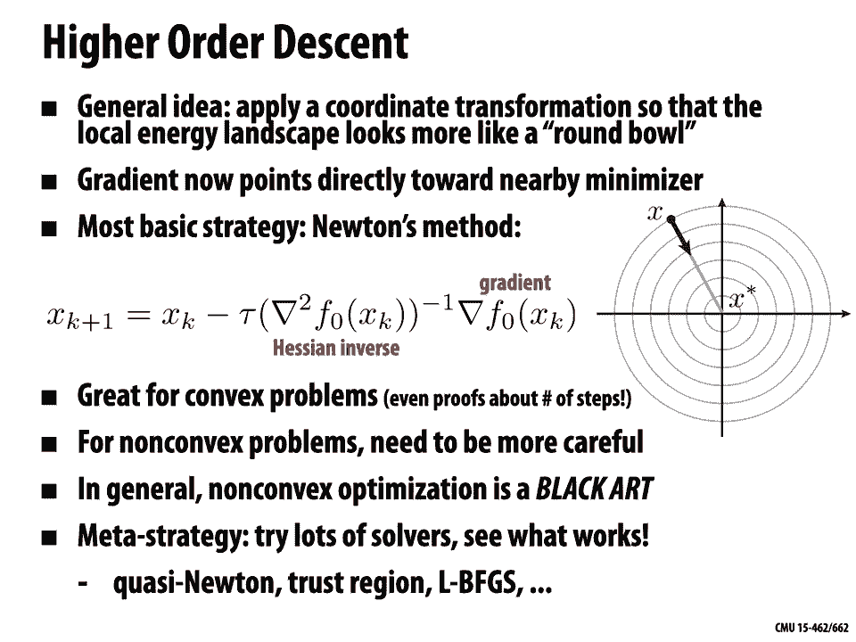

a little bit about at how optimization，shows up in graphics so here's here's a。

great example from animation something，called inverse kinematics so we talked。

last time about how our couple lectures，ago about spline animation and keyframe。

animation where the idea was you have a，rig you have a character that has lots。

of degrees of freedom to animate it you，can go to each moment of time and you。

can set exactly what these degrees of，freedom look like and use splines to。

interpolate between them well that's a，lot of work because you have to set up。

all these joint angles and all these，different variables so the idea behind。

inverse kinematics is to say actually I，just have a simple goal。

for my character in this case I simply，want the robot arm to go and touch one。

of the dinosaurs or grab one of the，dinosaurs once it's done that I wanted，to go put it in the box。

okay and I don't want to have to myself，set up all those little joint angles on。

this telescoping arm that would be a，huge amount of work so what I can do is。

formulate this as an optimization，problem，I want to optimize or minimize the。

difference between the end of the robot，arm and the location of the object that。

I'm trying to pick up and I'm going to，minimize that difference with respect to。

all the variables that control the，configuration of the robot arm maybe all。

of these joint angles or twist angles or，whatever they are okay then I use an。

algorithm like gradient descent to move，me toward that goal that is the rough。

idea behind inverse kinematics okay，so let's talk about this a little more。

precisely let's talk about first before，inverse kinematics let's talk about。

forward kinematics so a lot of systems a，lot of characters in an animation or。

robots or vehicles or whatever are well，described by a kinematic chain which。

just means I have a collection of，objects when your rigid bodies and。

they're connected by joints right so I，could think of the the body as being。

somewhat like this I have different，components my different pieces of my arm。

or different pieces of my leg and，they're connected by joints and these。

joints have various behaviors they might，freely rotate like a ball they might。

move in and out like a piston they might，rotate only around one axis I might also。

have constraints there might be a range，of angles that are allowable for a given。

joint right I can't twist my arm around，by 360 degrees there's a minimum and。

maximum angle that's allowed okay so you，start to see，this idea of an optimization problem。

creep in we have these variables they，have constraints on them we want to。

minimize some objectives subject to，these constraints for a kinematic chain。

we also have kind of a hierarchical，structure the configuration of the leg。

depends on the configuration of the body，if I rotate the whole body the leg。

rotates along with it if I rotate the，leg the foot rotates along with it and。

so forth in animation people often call，this a rig just a short name or a。

colloquial name for a kinematic chain，how do we specify the configuration of a。

rig well again we could go through and，an animator could sit down and at every。

key frame set all the joint angles，individually or we could do this through。

optimization right we could use。

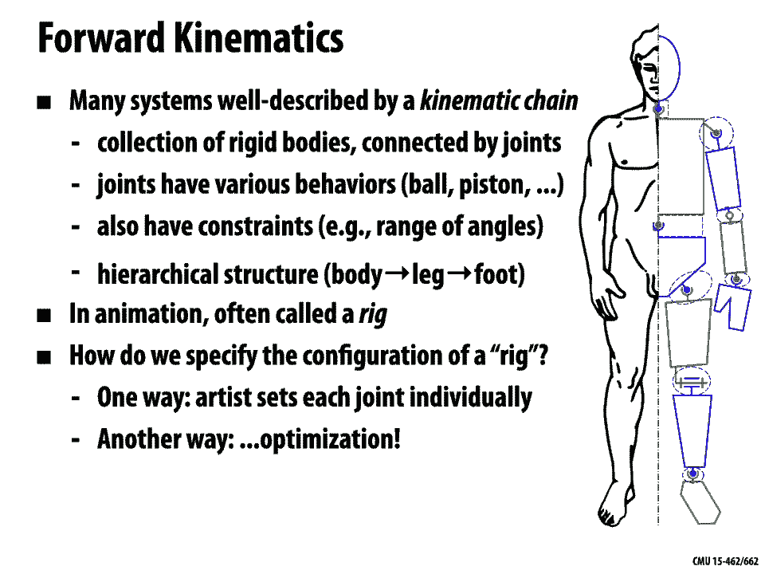

computation to reduce the work required，for the artist or the animator here's a。

really simple example of a kinematic，chain let's just consider a path like。

chain in two dimensions so we're gonna，have these three vertices c0 c1 c2 and。

the vectors u naught and u 1 between，them at any given moment in time we're。

gonna use p0 p1 p2 to denote the，positions of those vertices and the。

angles theta naught and theta 1 to，denote the angles so theta naught is the。

angle of the edge between p0 and p1 with，respect to the horizontal direction and。

theta 1 is the angle of the edge between，p1 and p2 with respect to the current。

direction of the first segment p0 p1，right that's why this is a hierarchical。

chain the meaning of the angle theta 1，depends on what the current angle theta。

0 is equal to if we rotate theta 0 then，the whole rest of the chain rotates，along with it ok。

how do we write down for instance the，location of p1 in terms of the root。

position p0 and all of our angles theta，and all of our vectors u well we can。

write it down this way right we could，say p1 is a translation away from p0 and。

what does that translation look like，well we take the reference direction。

u0 which has some length that has the，length of that edge and we rotate it how。

much do we rotate it by we rotated by，theta 0 here we've just written down a。

little 2d rotation matrix we could also，do this remember we talked about how。

complex numbers are really nice way to，write down rotations simplifies。

conceptually a lot what's going on we，could just write this down as p1 equals。

p0 plus e to the I theta naught u0 what，is this either the I theta not mean it。

means nothing different from that，rotation matrix it just means a rotation。

by the angle theta or not it's just a，nicer expression okay so then how do we。

write down the location of p2 well this，is why we did this in complex numbers。

just to make these expressions a little，more concise so we do a similar thing we。

can say p2 is an offset from p1 which is，itself an offset of from p0 in。

particular p2 is p0 plus e di theta u，naught so p1 plus and now I have a。

product of these two rotations e to the，I theta naught e to the I theta 1 right。

so I rotate by both theta and by theta 0，and theta 1 and apply that to the vector。

u1 to get the offset from p1 ok I'll let，you stare at that for just a second。

make sure it makes sense so what we have，now is a kinematic chain where the。

positions P are controlled by the angles，we，need to figure out to generate an。

animation of this chain so let's do this，using a very very simple inverse。

kinematics algorithm the basic idea，behind this algorithm is that we want to。

write down the distance between the，final point and some target right we。

want to make an arm reach for something，in the environment so we want the point。

P to to kind of meet up with some given，point in space and to make this happen。

we're gonna compute the gradient of the，position of that end point with respect。

to the angles and then apply gradient，descent to move it closer and closer to。

those angles okay what is the objective，that we use in this case all right what。

would be a simple objective well let's，say that for endpoint or for for point P。

n we want it to get as close as possible，to a given point P n tilde then we can。

just say that the function the objective，function f naught of theta is equal to。

one-half P n tilde minus P n norm，squared just the distance between those，two points。

squared what about the constraints so in，this case we'll just say there aren't。

any right the joint can just take any，value it wants but we could if we wanted。

to limit the joint angles okay and so，the cool thing that's gonna happen now。

and this is what you'll do in your final，assignment on animation is if you build。

some complicated character that has all，these joints and angles and so forth and。

simply run gradient descent on let's say，the location of the hand right you say。

oh PN is the location of maybe the one，of the fingertips and you want to move。

it towards some object in the，environment if you now take gradient。

descent with respect to all variables in，this character the whole body is going，to move and deform。

to do a good job of reaching out for，whatever object you want to touch okay。

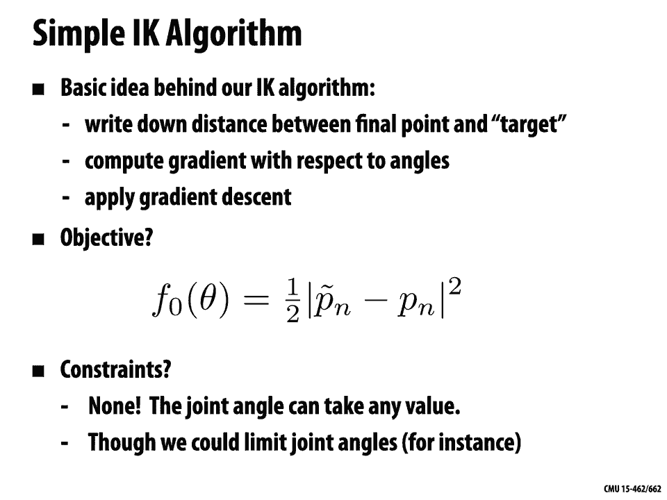

so I'll I'll let you see how that，unfolds as you implement your final。

assignment next time we're gonna go back，to our discussion of differential。

equations but this time talk about，partial differential equations talking。

about things that have derivatives in，both space and time and this is gonna。

let us model all sorts of amazing，phenomena like crashing waves and and。

other physical phenomena that you see a。