# 【双语字幕+资料下载】CMU 15-462 ｜ 计算机图形学(2020·完整版) - P24：L23- 基于物理的动画和 PDE - ShowMeAI - BV1Pf4y1E7GJ

[Music]，welcome back to computer graphics so，today we're talking about。

physically based animation and how we，can do that by solving，partial differential equations so just。

to recap last time，we got a brief introduction to，optimization really just saw the tip of。

the iceberg，maybe the most important message is that，modern computer graphics。

really does use optimization in many，different ways，and there can be many many complex，criteria。

and constraints that show up in graphics，optimization problems。

but the basic technique tends to be the，same we want to do some kind of。

numerical descent to minimize，an objective function so we pick some，initial guess。

we start skiing downhill and we sort of，keep our fingers crossed。

that if we follow the downhill direction，long enough we'll get a good，solution if we think back。

even one lecture earlier what we realize，is that gradient descent。

and other descent strategies are really，just examples of，ordinary differential equations right。

and so today we're going to return to，our discussion of differential equations。

previously we had been talking about，these odes that involved。

only derivatives in time and today we're，going to add a lot of，richness to that story by considering。

partial differential equations，pdes that also have derivatives in space。

why do we want to study pdes and，graphics well they describe，lots of natural phenomena water smoke。

cloth hair all sorts of things that we，experience in the physical world。

and there's been kind of a recent or，maybe not so recent revolution。

in computer graphics and visual effects，because we've been able to solve these，really，hard pdes to。

capture a lot of what goes on in the，physical world，okay so again the basic idea of an。

ordinary differential equation，is that we're going to implicitly，describe a function。

in terms of its time derivatives so for，instance，let's say we wanted to model a rock just。

flying through the air，along a ballistic trajectory we might，say that the position。

of the rock x at any time t，has a second time derivative，equal to the direction of gravity so。

we're saying that the，the position or the rock is accelerating，according to。

gravity now why do i say that this is an，implicit equation，well just like our implicit descriptions。

of geometry，we haven't actually said where precisely，this rock is at any moment in time。

we've just given a relationship that has，to be satisfied，in order for this to be a valid，trajectory。

right okay likewise，to be，a implicit description of some，phenomenon。

but now involving both time derivatives，and，spatial derivatives so you can imagine。

this rock flies through the air，and it lands in a pond and now some。

ripples spread out from this pond，and so the equation we might use to。

describe the height of these ripples at，every point in space，could look something like this that the。

second time derivative the acceleration，of this height is equal to the laplacian。

of the height so the sum of the second，derivatives，in the x and the y direction。

okay again this is an implicit，description we would，have to actually go ahead and somehow。

solve this equation，in order to see what the water is doing，and that's exactly what we。

want to do today okay，so we're going to talk a lot about how，this all works but to kind of make a。

long story short，you know we said the most basic strategy，for solving an ode。

is to sort of add a little velocity at，each time step so if we have some。

current configuration qk and we know，that the velocity，at q is some function f of q then we add。

just a little bit of that，tau some small number of tau times f of，q to get our new state。

q k plus one okay，and solving a pde doesn't look so，different we're still going to be。

marching forward in time，but now our velocity function，is going to do something like take some。

weighted combination of neighboring，values，okay so for instance in our wave。

equation it's going to turn out，that our combination of values is going，to look something like。

add up my immediate neighbors and，subtract 4 times my own value，looking。

equation right this next state q k plus，1 is the old state qk，plus tau times this little velocity。

function，okay obviously there is a ton more，to say about solving pdes and lots of，different。

techniques but we just wanted to give，you a flavor first of how this works。

before getting into all the details in，fact，it's surprising how very very simple，code。

can give rise to some quite beautiful，behavior and this is really why，people like to use pdes for。

graphics so again it can get really，intimidating to see all the terminology。

and mathematics and so forth，and feel like how could i ever possibly，do this kind of simulation。

but when you actually look at the code，step，through a little example we won't。

completely you know understand，why everything is going the way it is in，this code but。

at least this will give us a flavor for，what this kind of code，looks like so if we want to simulate。

the wave patterns that we see in the，background here，then we can write a little routine where。

we say okay first of all，we're going to solve our problem on a，grid let's say it's a。

128 by 128 grid and we're going to keep，track of just，two values at every grid point we're。

going to keep track of the，the height of the wave so how far it is，from a flat surface。

we'll call that u and a velocity，v how quickly is that height changing。

over time we're also going to pick a，step size，tau that says how quickly do we want to。

march this equation forward in time，and just for fun i've added this little，damping factor alpha。

that's going to cause these waves to，dissipate over time right this is what。

happens with real waves they eventually，fade out okay so what do we do well。

we're just going to run a loop forever，just keep running an animation loop。

and at a few random times we'll check，you know what frame are we at okay if。

we're at a multiple of a hundred，we're gonna imagine we're dropping a。

stone at some random location so we're，gonna set the height of the wave u。

to minus one everything else is zero，okay and then the interesting part we're。

going to update the velocity，okay so what should the velocity of the，the wave look like。

well we are going to iterate over all，the grid cells from i，and j from 0 to n we're going to look。

to our left our right our bottom and our，top，so look at the grid cells you know one，index away。

and here i'm i'm just using this mod n，to wrap around the grid so i don't have。

to think about what happens when i get，to the to the boundary，okay and here it is this is the only。

complicated equation in this this whole，code，i'm going to say that my velocity i'm。

going to add to my velocity，the time step times some function，okay and what is this function doing。

basically it's measuring，the deviation of the height at the，current point。

from the average height of the，neighboring points，so if i'm flat then there's no velocity。

nothing interesting is happening，if i have a big bump i'm going to add a，lot of velocity。

okay that's just like if i toss my stone，in the pond it's going to cause。

stuff to start moving if the pond is，just sitting flat and still there's no，change。

i'm also going to multiply the velocity，by my damping factor just to gradually。

slow things down over time，height，the actual thing i'm going to see well，i'll just。

again iterate over all the grid cells，and，now really simple how much does the，height change in each。

step well it changes by the time step，size tau，times the velocity at that grid point。

pretty easy okay，and then i go ahead and somehow display，this you know i've displayed this as a。

pixel image you could also draw it as a，height function or something，okay so that's it pretty。

pretty simple code and pretty beautiful，behavior and obviously it gets a lot。

more complicated like this if you want，to do real，you know interesting uh graphics but，write is。

is right here on the screen so let's，look at a few examples of some。

real stuff some really interesting uh，graphics you can create with partial。

differential equations here's a much，much more sophisticated，liquid simulation this is involving。

liquids of different densities，so you can kind of see these interact in。

interesting ways and then at this moment，the density of one of the liquids is。

changed artificially so this is，something you couldn't do in physical，reality so now it。

floats to the top and now we drop，another ball of different density on，there。

there's lots of different，representations that could be used，for simulating fluids so this last one。

was using a grid，here what you're going to do is，something totally different you use a。

polygon curves in space to define the，vorticity of the fluid basically。

how much it's spinning around so you get，these。

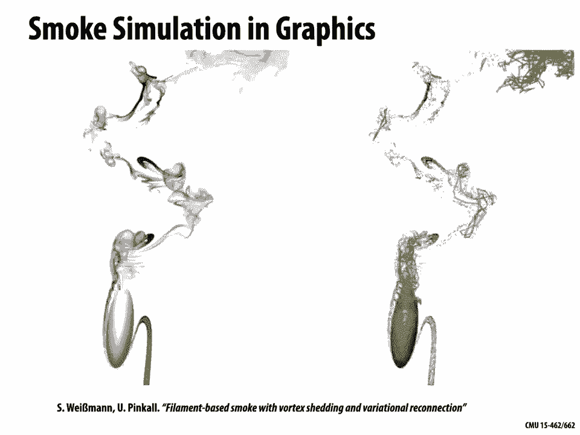

nice wispy smoke you might，simulate other phenomena here simulating，cloth。

so the wrinkling and and buckling of，cloth as these pillows are dropped from，the air。

or elastic bodies so a lot of the，physical objects，that we interact with are pretty well。

modeled by elastic bodies things that，can deform but like to restore their，shape。

if you bend them they want to go back。

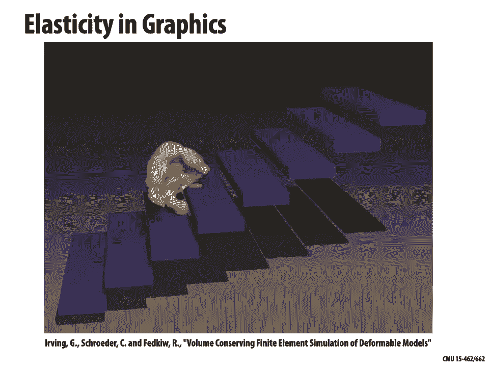

okay so here's a fun，example of that or hair hair is，you could think of it as another elastic。

body but it's kind of one-dimensional，you have these strands，maybe they're able to bend and twist a。

little bit but they want to restore，their，their shape you can also think about，what happens。

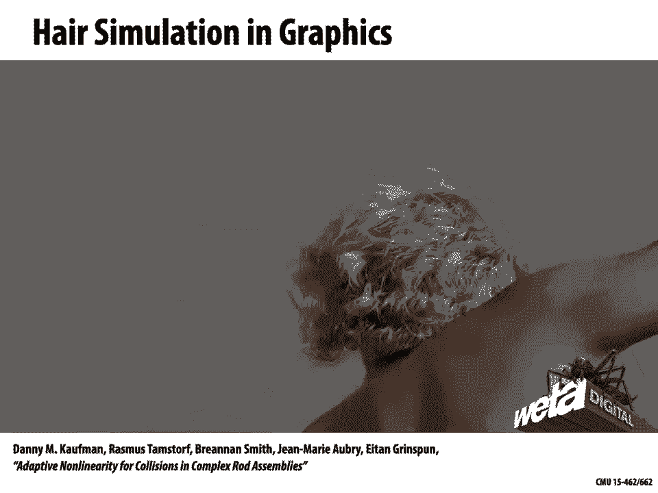

with elastic bodies when they go past，the point，of how far they want to be stretched so。

if they go past，a yield point they'll fracture and，you'll get all this interesting and，beautiful。

behavior or，you could simulate viscoelastic，materials things where if you bend them。

far enough if you push them hard enough。

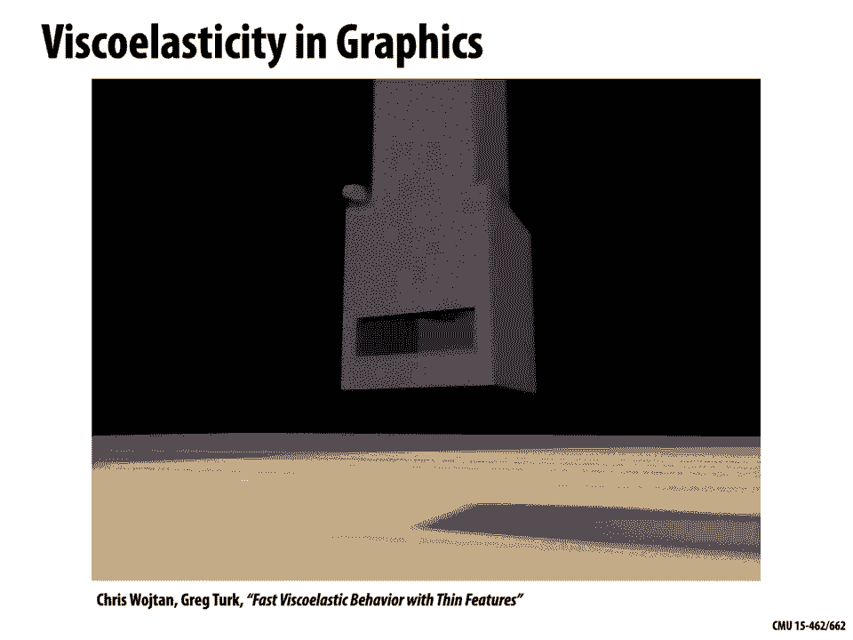

they actually permanently change，uh shape so pushing this poor bunny，through the box。

recently there's been a lot of interest，in what are called material point。

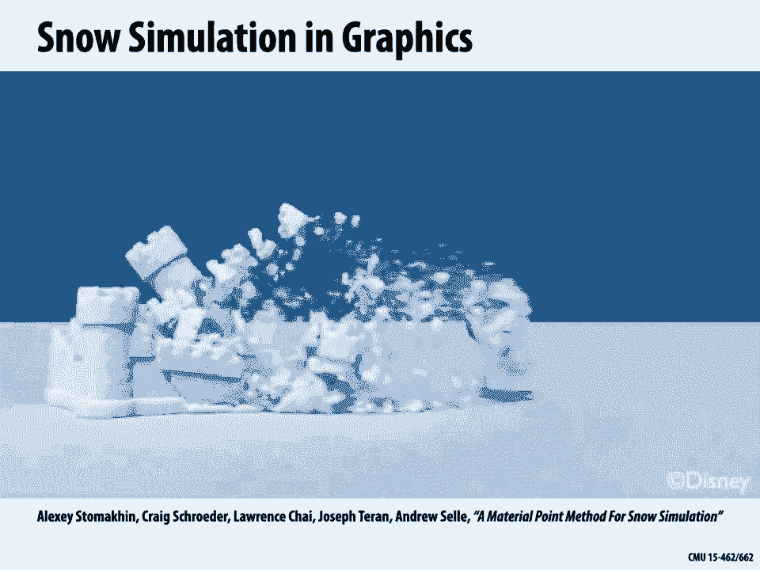

methods，this was one of the early examples used，in in film，for doing snow simulation by disney for。

frozen，so using particles and grids mixed，together in an interesting way to get，some。

very rich effects，we，get to this point how do we how do we，develop these kind of techniques。

well let's go back to the basics and，think what really is，a pde so we said a pde。

is something where we're really trying，to solve for a function that depends，both on time。

and space for our rippling wave for，instance，uh we were saying what is the，displacement，in space。

right so we could call that u of t and x，where x could be any number of spatial，u。

is given implicitly in terms of，derivatives of u，and so we could have time derivatives of。

meaning the，first time derivative u double dot，meaning the second time derivative。

and so on and also spatial derivatives，partial u partial x1 partial u partial。

x2 the second derivative of u along，x1 and x2 and so on so just as a。

example of some random pde that mixes，together space and time derivatives it's。

kind of a classic equation，berger's equation which says that the，the time derivative of u。

plus the value of u times the space，derivative of u，equals some constant alpha times the。

second spatial derivative of u，and what does this describe well it kind，of describes a。

wave that is gradually forming a shock，and this alpha parameter is。

governing how quickly this wave gets，diffused or dissipated，okay just as some example。

so there are a lot of different terms，that we can use a lot of different。

jargon essentially we can use to talk，about different kinds of pdes that have。

different kinds of behavior，and this behavior is going to inform how。

hard and easy it is to solve these，problems and what kinds of computational，techniques we might use。

so one very basic question you could ask，about a pde is，is it linear or is it non-linear how are。

derivatives combined，so for instance we have this berger's，equation。

and we have let's say the diffusion，equation something that looks。

similar to the wave equation which one，of these is，well generally we're going to say that，if。

we have things like the function being，multiplied by，itself or multiplied by one of its。

derivatives or you push the function，through some function like。

sine or cosine or or whatever then this，is a non-linear equation。

right in berger's equation we have this，non-linearity of u，times u prime so it's kind of quadratic。

in u，the diffusion equation on the other hand，is linear we have。

one instance of the time derivative of u，on the left side we've got。

two space derivatives of u on the right，side and then we just have a constant a。

okay so linear equations generally，easier to solve，we can also talk about the order of a。

pde when people talk about order they，mean，how many derivatives in space and time，versus。

okay how about the wave equation so we'd，say this this first one is well it's，first order in time。

it has one time derivative and it's，second order in space because the，highest order。

spatial derivative is a second，derivative，okay likewise the wave equation。

is second order in space it has at most，two spatial derivatives and second order，in time it has。

at most two time derivatives okay，and again the rule of thumb is that if。

an equation is non-linear it's harder to，solve also if it's，higher order it tends to be harder to。

solve when you first start learning，about pdes it can seem like there's。

a whole sea of possible equations and，that's true there are so many。

pdes and and no completely orderly way，to organize them，but there are some really basic model。

equations that give a feel，for different kinds of pdes and really。

understanding these model equations will，give you a really really good sense。

of what different equations are like and，also what kinds of，solvers you might need to attack a given。

problem，so one of the most basic，equations is the laplace equation。

which says that if i apply the laplacian，to my function u it's equal to zero at，every point。

and this is the canonical example of，what's called an elliptic equation。

so intuitively what is this equation，asking it's saying，if i have some boundary data so if i。

have some known values on some part of，my domain，the function u is going to be sort of。

the smoothest function，that interpolates these known values，okay we'll talk more about the laplacian。

later，we can change this equation just a，little bit into something that now，depends on。

time something that says the change in，time of the function u，the。

heat equation which is the canonical，example of a parabolic equation。

intuitively it's saying how does an，initial distribution of heat。

spread out over time alright so if i，turn on the stove，how is the heat from the stove going to。

radiate into the rest of the room，over time okay，and then finally we have the wave，equation。

again really not so different you know，really artificial change to the。

the algebra but really very different，character，of this equation so the wave equation，u。

is equal to the laplacian of u this is，the classic example of a hyperbolic，equation。

and this is like our wave we were，talking about before if you throw a rock，into a pond。

how does the wave height evolve over，time，okay so we can think about how。

easy or hard it is to solve each of，these equations and they're put in this。

order for a reason which is that，elliptic problems are generally the。

easiest to solve generally speaking，parabolic equations are a bit harder but。

still have some very nice properties，hyperbolic equations get pretty advanced，and now if we go into。

non-linear hyperbolic high order，equation，well these get really difficult to solve。

also by the way non-linear hyperbolic，show up，all the time in graphics so we're really。

going to want to build up，our ability to work with these kinds of，equations。

okay so let's look at these equations in，more detail，so we said first we have the laplace。

equation an elliptic equation，that basically asks what's the smoothest。

function interpolating given boundary，data，so you can imagine in each of these，pictures initially i。

only knew the height of the function，around the outside around the boundary。

and when i solved this equation laplace，u equals zero i got values on the，interior。

that give me a nice smooth interpolation，of the boundary data，we've talked a little bit about。

interpolation before if i have you know，two values in one d how do i interpolate。

them well maybe i connect them by a，straight line segment，but it's not so obvious as you go into。

higher dimensions and you have funky，shaped boundaries，how you should be doing interpolation。

well laplace equation gives you，one answer to that question okay。

what does the equation really say how，does it get this interpolating，that。

every value should be in some sense the，average of its neighbors。

and you can see that by looking at this，picture if you look at any point。

you know the neighbors nearby kind of，have a average that looks like the，height of that that value。

why is this a easy equation to solve why，is this nice numerically well。

one way to think about it is if the，solution is is found by just。

you know looking for the average of my，neighbors，then this is kind of robust to errors i。

can just keep averaging my values over，and over and over again。

until things converge and if i make some，little mistake along the way。

no worries that's going to be averaged，out okay，the heat equation is。

somehow related to the the laplace，equation so the heat equation says。

how does an initial distribution of heat，of，turning on the stove and seeing how the。

heat spreads throughout the room，or i could think about this uh。

bunny i i touch a hot needle to a point，on the surface of this bunny。

and if this bunny is made out of some，kind of like conducting metal。

then that heat might spread out over the，surface and i can see where it goes。

okay how is this related to the，laplace equation well if i keep letting，this heat flow。

longer and longer and longer really，interesting point，to，the laplace equation right so if i pin，the。

heat on the boundary here i have some，in，black and i let that heat diffuse onto。

the interior of the domain，well then in the long run the solution。

is going to be the same as the laplace，equation，how do i know that well。

the heat equation says that the time，derivative of u is equal to the，laplacian of u。

the laplace equation says the laplace，equation is equal to zero，u。

is no longer changing in time we have，laplace u equals，zero this heat equation is。

really important or this kind of，diffusion term is really important in a，lot of problems beyond。

diffusion itself because it's used to，model，damping or viscosity in a lot of，physical systems so any。

real physical system will have some kind。

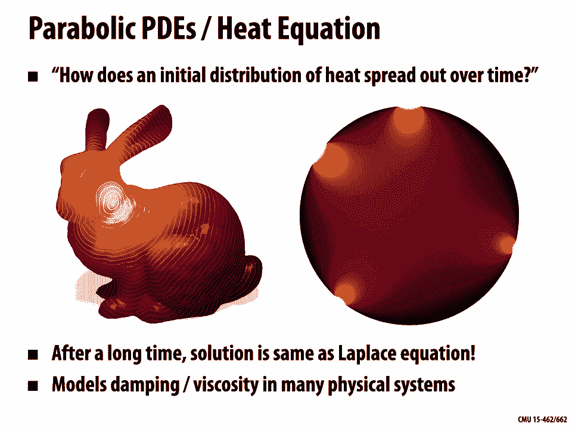

of friction or energy loss that can be，modeled by diffusion，okay and finally we have the wave。

equation。

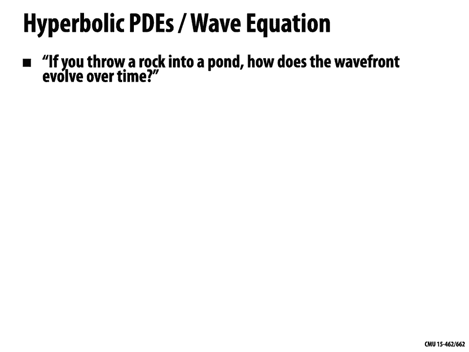

which is this idea of okay if i throw a，rock into a pond，or i'm standing at my swimming pool and。

i just touch it，very gently on the surface how does the，wave，okay and why might this equation be a。

little bit，harder to solve well one thing，you notice even from looking at this，that。

little bumps in the surface kind of get，carried along the wave for a long long，time。

and so what that means is if you make，any kind of numerical error。

when you're solving the wave equation，those errors also，will be propagated in kind of a nasty。

way forward through time，okay so that's kind of one intuitive，reason why。

wave-like equations might be a bit。

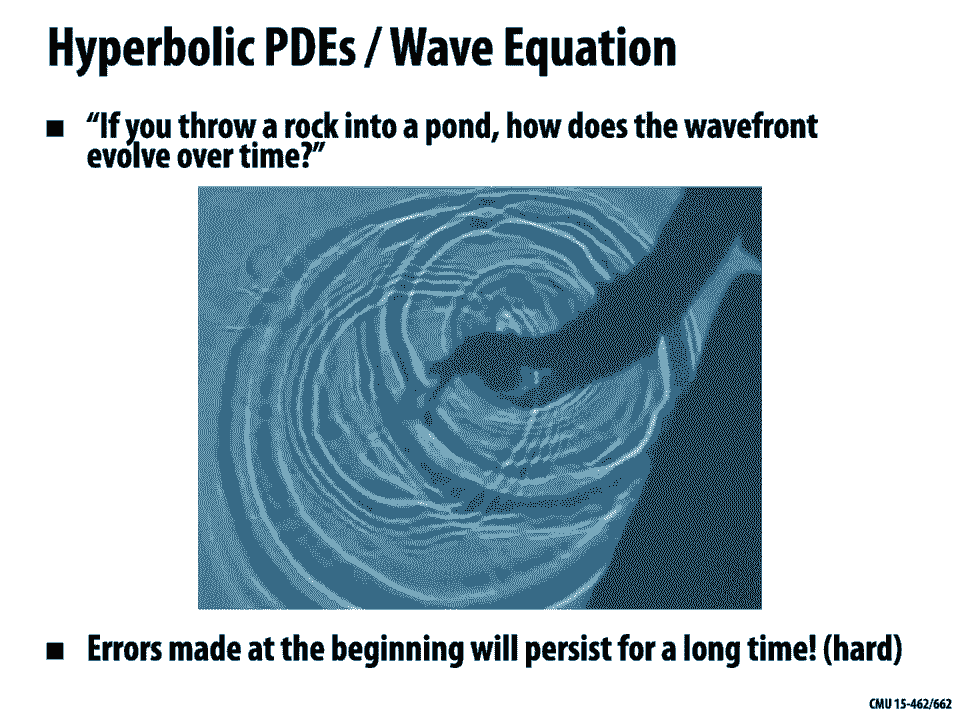

harder to solve，okay so again we said a couple times，that，pdes really only give me an implicit。

description of the solution they tell me，what are some properties that the，solution has to obey。

but if we actually want to draw this on，the screen we want to make。

make movies we need to compute the，function explicitly so how do we do that。

okay so like ordinary differential，equations，most pdes are impossible to solve，analytically。

remember with odes we have this example，of okay the pendulum，you know it's not so bad but you go to。

the double pendulum and now things get，totally crazy，right and especially if you want to。

incorporate data you have，user interaction you have you know，models or scans or whatever it is。

you're not going to be able to write，down an answer on pen and paper you need，to do this numerically。

okay so the basic strategy，is going to be well we pick a time，discretization。

when we talked about odes we talked，about forward euler versus backward oil，or and so on。

that's going to be exactly the same and，we also need to pick a spatial。

discretization how are we going to turn，those derivatives，with respect to x into numerical。

quantities that we can really compute，okay，once we've made those choices well。

there's not much left to do，as with odes we're going to perform some。

time stepping to advance the solution，and historically because you know you。

need to do this on a really big high，resolution grid for many many time steps。

this has been really expensive so it was，a long time before，pdes started to get used in the movies。

maybe late 90s early 2000s，and even then people were only using，them for。

real hero shots really important moments，in the movie like there's a wave，crashing into。

this boat and poseidon right but，computers are ever faster people keep。

coming up with clever ways to make them，faster and faster and faster。

and so what we're seeing is more and，more use of pdes，in animation and games and interactive。

tools and，well anywhere that graphics is used so。

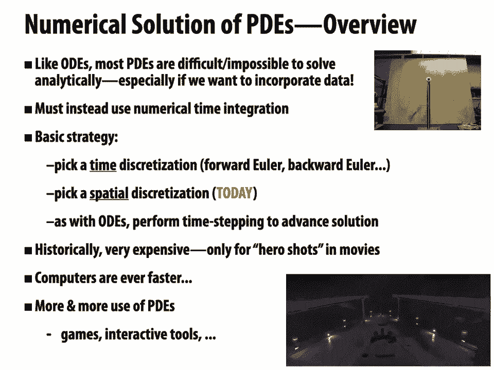

here，is a just a recent example of，pde，come，a long long way from just having that。

one hero shot in a movie，maybe not quite the same fidelity but，actually pretty good。

here's another example of fluid，simulation water simulation，being done on the gpu again not。

perfectly realistic but pretty amazing，to be able to do this kind of stuff。

in real time and this is already uh，pretty old i mean things have gotten，even better since then，ways。

that we could discretize our spatial，derivatives a lot to talk about there。

one basic distinguishing feature of how，we're going to break up space。

is to talk about lagrangian versus，eulerian discretization，so good example is suppose we want to。

encode the motion of a fluid，right like we just saw on the previous，slide the lagrangian description。

the lagrangian view of the world is that，i have，particles maybe i can imagine they're。

almost like little water particles，and i'm going to track their location in。

space over time i'm going to，follow them along and see where they go，okay。

a kind of dual viewpoint is，actually，gonna stand in one spot i'm just gonna，stay still for all time。

and i'm going to look and see how things，pass me by，right how many of these particles are。

passing me per unit time，something like that okay and，with these two very different。

perspectives come different，computational trade-offs so，for a lagrangian discretization well for。

one thing this is，conceptually easy right if you're，comfortable with polygon super。

maybe better yet point clouds this is，very familiar，you have points they have ordinary。

coordinates x y z，and you track how these coordinates，change over time。

the resolution of the simulation isn't，fixed a priori by some choice of grid，size。

you're also not forced to stay inside，the bounds of some grid。

so that's nice on the other hand getting，a good distribution of particles that，resolves。

all the features that you care about can，you put，particles when um and if you want to。

do some kind of spatial derivative you，might need to find your neighbors。

finding your neighbors can be expensive，right so there's some good things and。

there's some bad things likewise with，eulerian discretizations on one hand，from a。

computational point of view you get very，fast regular computation。

we talked a lot about wire images on，regular grids because you know you。

always have a left right bottom and top，neighbor well same thing here this can。

be very cache friendly and so forth，it's easy to represent for instance nice，smooth surfaces。

using things like level sets we talked，about that when we talked about implicit。

representations of geometry，on the other hand your simulation is。

kind of trapped inside the bounds of，this grid，and also the grid itself will cause some。

numerical artifacts so the fact that you，have finite resolution。

means that high frequency features are，going to get blurred out a little bit。

you have aliasing right i think also，grids are a little more challenging when。

you first get started because，you need to understand maybe a little。

bit more about pdes to start making，some interesting dynamical simulation，that's。

the point of what we want to talk about。

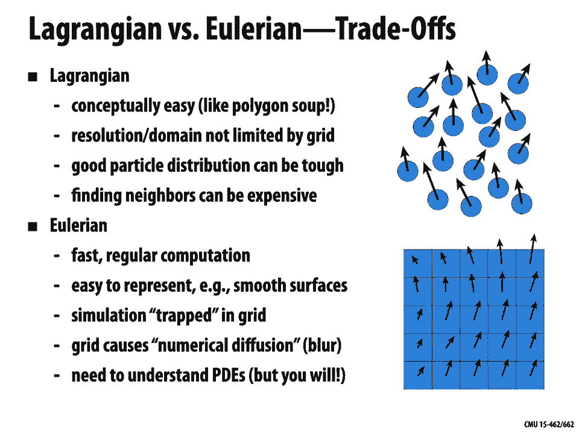

today and of course，as with all things of lu in life it's，not a decision between。

you know one or the other you can mix，these things uh together。

and many modern methods do mix together，lagrangian and eulerian descriptions so。

for instance for fluids，you have things like flip and，material point methods you have particle。

level sets you have mesh based surface，tracking voronoi based。

arbitrary lagrangian eulerian and so on，and so on，and so as with everything else that。

we've learned about in this，this class the goal is to really pick，the right tool。

for the job right to learn about these，things as deeply as you can。

and make the best judgment about which，kind of discretization which kind of。

algorithm is appropriate for the problem。

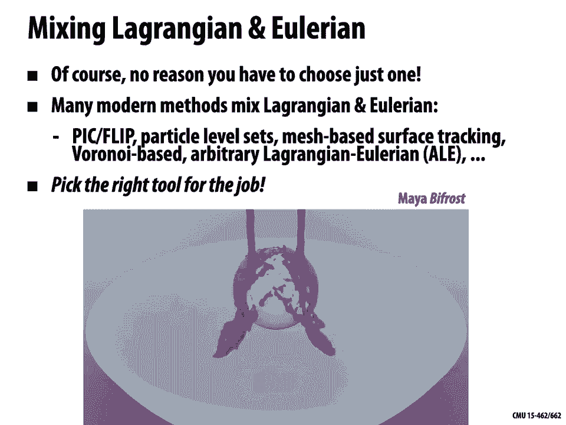

at hand，okay another choice you can make we，won't get too deep into this。

is you can make a lot of important，choices about how to formulate，the pde in the first place so many。

different，partial differential equations have，other mathematically equivalent or near，equivalent。

partial differential equations and so，you don't even，really need to assume that the equation。

you're given is the one that you have to，solve you're allowed to apply。

transformations to that equation to get，something，that's computationally easier or better。

in your setting，so again taking this example of fluids，there are a couple different quantities。

you can consider one is，the velocity very intuitive how fast is，each particle moving。

another is the vorticity maybe less，familiar，how fast is the fluid spinning at each。

point so what is the curl of the，velocity，okay mathematically these are not。

super different computationally it can，make a huge difference，you can for instance get much better。

maybe swirling smoke with vorticity，than a velocity formulation okay so，again try to。

understand these different trade-offs so。

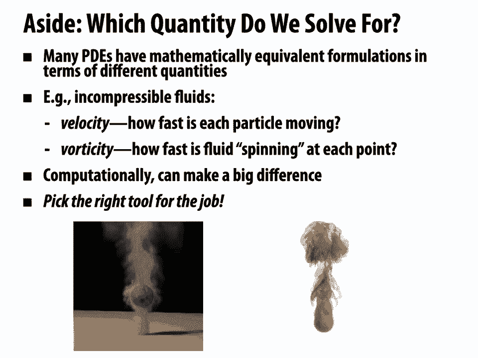

you can pick the right tool for the job，okay but we are getting way ahead ahead，of ourselves here。

what we'd like to know first is how do，we solve easy pdes，what is the basic strategy so。

the strategy is well okay first we have，to decide what our pde。

formulation is right which quantity do，we want to solve for for instance，a。

spatial discretization how are we going，to approximate derivatives in space。

and then we're going to pick a time，discretization how do we approximate，derivatives in time。

so for instance when we talked about，ordinary differential equations。

we had to choose when do we evaluate，forces leading to forward euler or，backward euler or。

whatever okay finally all of those，choices，give us an update rule they tell us。

what is the relationship between the，data that we have and the。

unknown data at the next moment in time，update，rule or update equation to generate our。

animation okay，so let's dig in a little bit to these，basic equations we saw before。

and all of our model equations featured，the，laplace operator and laplace operator is。

pretty fundamental in physics and in，geometry and，in image processing and in graphics in，general。

there are different symbols can be a bit，confusing different symbols that people，use。

to denote the laplacians some people，like me like to use，capital delta okay。

but some people don't like that because，they use delta to mean a finite change。

other people like to use nabla squared，but other people don't like to use that。

because that can be used for the hessian，and optimization so there's。

there's really no good choice just pick，one that you like and stick with it。

more important than how we write the，laplacian is，what it means the laplacian is。

unbelievably important，in physics and geometry and signal，processing，and it has many different。

interpretations，okay and the more you understand these，different perspectives the different。

interpretations，the more power you'll have to understand，and solve these equations。

so maybe the most basic thing to say，about the laplacian is it's a，differential operator。

meaning it takes a function as input and，it spits out，its second derivative some kind of。

second derivative as，output okay so，in particular let's consider a function，u from r n to r。

how can we write down the laplacian well，one way is we can，say the laplacian of u is the divergence。

of，the gradient of u okay so we first look，at，the the vector field that tells us，what's the。

direction of steepest increase of u，okay that vector field has a curl we，take that curl and get。

the laplacian another one maybe the most，uh basic one is it's the sum of second，derivatives。

and so i have let's say coordinates x1，through xn i'm going to take the，derivatives。

second derivatives along all those，coordinates and add them up，one thing i don't like about this。

expression is，from this expression it's not clear that，your choice of coordinates doesn't，matter。

right if i had a different set of，coordinates y one through y n，actually the laplacian would be。

unchanged and that's important the，laplacian is，is not going to depend on a choice of。

coordinates okay，more intuitively the lotion of a，function u，is really telling us what is the。

deviation of u，from the average value in a neighborhood，okay and that we kind of started getting。

at with our，our wave equation right how fast is this，wave going to start moving well if，there's some。

kind of perturbation if if somebody，threw a rock in the pond，then there's a big difference between。

the height of，the water where the rock landed and the，height around that rock。

and so okay it's going to start moving，there the laplacian is big。

in places where the pond is flat every，value is equal to the average。

value in a neighborhood and nothing，zero，no motion okay so，if you want to get a lot more intuition。

about the laplacian in fact i have a，whole，video lecture about that that you can，get at this link。

okay so how do we，discretize the laplacian right to solve，any pde we need to approximate。

our spatial derivatives with some finite，thing that we can actually compute。

so let's start easy with the first，derivative，rather than the laplacian so let's say。

we know a function u of x，only at regular intervals h right so，this。

blue curve is the true function u but we，only know the value of u，at x1 x2 and x3 and so forth。

and those points are separated by，distance h，so how can we approximate。

the first derivative of u let's say we，wanted to know，the first derivative at x2 how could we。

approximate that，well what we can do is just remember，what is the definition of the derivative。

we can recall，that it is expressed in terms of a limit，right the derivative of u，zero。

of f of x plus epsilon minus f of x，over epsilon rise over run if you like。

okay so we can approximate the，derivative，using values that we know we can say all。

right i want to know the derivative，at x i i know the value at x i。

and i don't know a value infinitesimally，close but i can at least just look at my。

closest neighbor u i，plus 1 take a difference divide by，h the spacing the distance between these。

and as you might imagine this，approximation will get better and better，and better。

as the grid gets finer，okay what about the second derivative，we approximated the first derivative。

surely we should be able to do the，second derivative，what do you think。

well one idea is to say hey we，know how to take a first derivative we。

know how to approximate a first，derivative，so why don't we approximate the first，derivative。

of our approximate first derivative，right we still have sample values at，same。

approximation again so we might say，the second derivative at x i，is approximately equal to well the。

difference，between the derivative at ui，and ui minus one you know shifted things，slightly so that。

we end up with a nice expression okay，and if i then approximate each of those。

terms in the numerator by my differences，then i get ui plus 1 minus ui over h。

minus ui minus ui minus 1 over h，all over h okay and if i simplify that a，little bit。

i get an approximation that says the，second derivative at x，i is roughly well the sum of the values。

to my left and to my right，minus twice my value divided by，by the way this starts to sound a little。

bit like what we said about the，laplacian we're comparing，kind of the the values in a neighborhood。

to the values，at the center right okay，but in general this approach of，approximating。

derivatives with differences is called，the finite difference，approach to pdes。

this is not the only way to do it there，are finite element methods there are。

finite volume methods there's a lot of，interesting ways，to approach pdes but finite differences。

are very natural and work very well，for regular grits okay，so if we keep going with this finite。

difference idea okay how do we，approximate the laplacian，well we have a choice we could use a。

grid we could use a mesh，we could be eulerian we could use，something like lagrangian。

but there are some very common ways to，discretize the laplacian in graphics。

one is to stick with this finite，difference idea so we're now on a，two-dimensional grid。

and if you work through the arithmetic，you think about，taylor series and so forth you say yeah。

a good approximation a little caution，is i add up my four immediate neighbors。

i subtract four times myself，and i divide by the square，of the spacing the grid spacing。

if on the other hand i'm on a let's say，on a triangle mesh well i need to do，something else。

right if i'm on a triangle mesh，especially if the triangle isn't all。

equilateral triangles but let's say they，could be any kind of triangles any，angles。

well here there's a well-known formula，for the laplacian called the。

cotan formula so it says if i want to，know the laplacian of a function u。

at the vertex i then i'm going to sum up，over all neighbors j the difference，between u j and。

u i times a，special weight a weight that depends on，the two angles。

alpha and beta so cotan alpha i j plus，cotan beta ij，and there's all sorts of ways to derive，this。

expression interestingly enough if we，which is，a regular grid split along diagonals。

this formula will become exactly our，grid formula，okay so all of these things do kind of。

fit together it's also not too hard to，cook up laplacians for point clouds and。

polygon meshes and other，kinds of representations of geometry，that we talked about earlier。

in the class okay all right，so now that we know how to discretize，space。

how do we go ahead and solve some of，these model equations so let's say。

again we want to solve the laplace，equation laplace u equals zero，well we could plug in one of our。

discretizations let's say we liked，doing things on a grid okay so。

we know now that the laplacian can be，approximated by this，finite difference formula we just set。

that finite difference to zero，at every grid cell or equivalently what。

we're really saying if you rearrange，this equation what you realize is。

oh what we're looking for actually，is a function u where the value of u at，every grid cell。

is equal to the average of the four，neighbors，that's what i keep saying laplacian is。

measuring the deviation from the，neighboring，values so if we say laplacian equals。

zero i want my value to be equal to the，average of my neighbors。

if i have a function u where every value，is equal to the average of the neighbors。

that's called a harmonic function a，function that is in the kernel of the。

laplacian is a harmonic function，what would you do if somebody said okay。

i wanted i want this to be true at every，point in space i want every value to be，equal to。

the average of the neighbors what what，well there's a natural thing that's，pretty tempting to try。

and actually it works so you could just，keep averaging your value with the value，of your neighbors。

right go to every grid cell and replace，that value with the average of the。

neighbors if you do that enough time，enough times it will converge to a，harmonic function。

this is called the jacobi method jacobi，iterations，this is correct but it's really really。

slow it's going to take forever，especially on a really big grid to，converge。

to a solution and you can kind of，understand why if i have a grid that's。

a million cells wide well then i need to，do at least a million averaging，operations。

to get this to work right information，has to have time，to go from one side of the domain to the。

other otherwise how could every，grid cell know that it's the average of，you know of its neighbors。

so there's much much better ways to，solve big systems of linear equations。

and what we want to do generally is turn，apd like this turn the system of，equations into some。

matrix equation that we can hand off to，a linear solver，so how for instance would we do that。

with a laplace equation well again we，have a bunch of equations that look like，this。

and 4 times uij minus ui minus 1j blah，blah blah，so to get this into matrix form the。

first thing we need to do，is assign a unique index to each of our，grid cells。

so maybe i'll just label them top to，bottom left to right one two three four。

five six seven eight nine，okay and then we can substitute instead，of u i j。

now we'll just talk about u with a，single index referring to these。

these indexed grid cells and we can，a big，matrix equation and then if you read off。

you know one of the rows of this，equation you'll see oh yeah that that，looks like。

what we want to be true at that grid，point okay you get this big matrix with。

a very regular structure right 4，minus 4 is along the diagonal and so，forth。

from here you can just hand this problem，off to some existing，package some sparse linear solver like。

well these days there's，something called sweet sparse or eigen，or you know whatever you like。

but the point is that these packages，have been optimized like crazy。

to solve systems that look just like，this so you'd be crazy not to use them。

and you should not try to do jacobi，iterations but really try to use a real。

a linear solver it's also very important，by the way for an equation like this，that you use。

sparse matrices we talked about those，when representing，that，most of the entries of this matrix are。

zero，so you're going to waste a ton of time，and and，compute power storing and computing with。

all those zeros，right asymptotically works by the way，some important food for thought what is，wrong。

with our problem set up here right so，i'll，claim that we correctly converted the，laplace operator。

into a finite difference expression we，correctly encoded that as a matrix but。

there's still something wrong，can you，well one really basic thing you can，have。

a bunch of zeros and now we're looking，for values u，such that when we apply the laplace。

matrix to u we get，zero there's a trivial solution to that，problem which is why don't we just set。

all the u values to zero，right so what i'm really saying is，that this equation that we've set up so。

far，doesn't have an interesting solution and，actually，it doesn't even have a unique solution i。

could also put a constant，constant value for all the u's and also，get zero，okay and so the reason。

has to do not with our matrix setup but，but with the equation that we set up to，solve and we。

we kind of said that well what's the，idea of a laplace equation laplace，equation is supposed to take。

boundary data values on the boundary and，interpolate it into the interior。

so far when we talked about the laplace，equation we said okay you take。

your left neighbor right neighbor top，neighbor bottom neighbor and you want to，equal。

the average of those values and to get，this matrix to work out we okay we said。

we wrap around if we go off the left，side of the grid or the right side of，the grid。

okay but to get some interesting，behavior we need to actually，say what the boundary values are。

compute，averages near the boundary so let's say，we're at a boundary point a。

right and when we look to the left to，grab our neighboring value。

what do we do there okay so our average，is sort of，1 4 b plus c plus i don't know。

plus e and the answer，to what to put there is well you get to，choose you get to choose。

what data to put along the boundary this，is exactly the data，that you want to interpolate so these。

could be height values they could be，color values，whatever you like in general。

there are well there are lots of，different boundary conditions you might。

encounter in pdes but there are two very，basic ones that show up over and over，again。

one are what are called dirshley，boundary conditions，and that just means we want to set these。

boundary values to fixed values，i want to replace the question mark with，some known。

constant the other very common，boundary condition is a neumann boundary，condition that says。

rather than the value we want to specify，the derivative，the change in value as we go from a。

to this question mark node，sorts of，other interesting boundary conditions，you have a。

linear combination of values and，derivatives and so on，but these will really get us started now。

one really basic question that you need，to ask，when you start prescribing boundary data，is。

can i do this am i allowed to prescribe，this boundary data if i fix the values，and the derivatives。

at the boundary to certain constants，will this system of equations actually，have a solution。

it's really easy to fool yourself when，you first start working with。

pdes to say okay i'm just going to put，this data here i'm going to hit solve。

and i'll get my solution，and often the problem is your solver is，not smart enough to tell you hey。

wake up this is not a real problem this，is not a well posed problem。

right you can't actually solve this so，it's really important that you。

understand what you can and can't do，when it comes to boundary conditions。

okay so let's look at this in a little，bit more detail in，just one dimension we're just going to。

go back to functions on the real line，and for the moment we won't even think，about a pde。

right we just want to look at what do，these different boundary conditions。

mean okay so we said dear schley，means we want to prescribe the values so。

for instance if we have a function，fee on the unit interval from 0 to 1。

our boundary points are 0 and 1，and we might prescribe constants a and b。

at those boundary points okay we can ask，are there functions that interpolate，those。

boundary values well，sure there are tons of them i just put，my pen down at a and i draw any curve。

over to b right there are lots and lots，of possible functions，okay what about neumann conditions。

neumann meant we want to prescribe，the derivatives rather than the values，so for instance。

we might say at 0，the derivative of phi is equal to u at，one the derivative of phi is equal to v。

okay are there functions that have，prescribed derivatives does that，restrict kind of what these。

things can look like well just a little，bit but yeah there's still a lot of。

functions that have these derivatives，right again i just put down my pen i。

start going along the initial slope，exit，when i get to the right side of the。

domain i have the desired outgoing slope，okay otherwise many many possible，functions in between。

what about both neumann and deersley，values，right does it make sense to think about。

prescribing some values and some，derivatives，like i want to prescribe the slope at，zero and the。

sure nothing wrong with that right i，could think of a lot of different。

functions that start out with a certain，could i prescribe the derivative。

and the value at the same point，at one，sure why not all right for instance i，could take any function。

that satisfies the derivative condition，it，satisfies the value condition okay。

what about other interesting things so，we could also maybe ask about。

you know setting the value plus the，derivative，is equal to some constant and that's，what's called。

robin conditions and you can convince，yourself yeah that's that's also，something that's。

not too hard to satisfy as long as we，have no other conditions right again。

it's pretty easy to draw this kind of，curve，okay so what you kind of see is that in。

the absence of any，pde to solve satisfying boundary，conditions，is no big deal where this gets。

interesting is when we actually have，some equation that we want to satisfy at。

every point of the interior，so in particular let's look at a very，simple pde the 1d。

laplace equation in one dimension the，laplace operator is just the，this。

laplace equation says the second，derivative is equal to zero，okay what do solutions to this equation。

look like，if i if i'd asked you on the first day，of class，you know what's a function that has no。

second derivative，what would you what would you think what，well basically all functions kind of。

have to look like this，right cx plus d something that is linear，okay can such a function。

can a solution to the 1d laplace，equation satisfy，any given dirschlay boundary conditions。

so let's say i tell you that at the left，endpoint i want the function to be equal，to a。

at the right endpoint i want it to be，equal to b，can we always find a function fee。

that hits these points and solves the，well sure we said that these solutions，look like。

straight lines so we have two values to，interpolate we draw a straight line，through them。

we're done right a line can interpolate，any two points，okay so so far it sounds good we can put。

whatever data we want in，what about neumann boundary conditions。

can we prescribe the derivative at both，endpoints，and satisfy the laplace equation。

so let's say i want phi prime of 0 to be，equal to u，v prime of 1 to be equal to v and。

i want the second derivative to be zero，well one thing to think about is okay if，the。

incoming derivative is different from，the outgoing derivative，and the second derivative is zero。

then i'm in trouble because the second，derivative is telling me how much does，the derivative change。

and if the derivative can't change then，i can't go from，one derivative at the start to another。

derivative at the end，put that more simply a line only has one，slope i can't have a slope of u。

and v right and so this is our first，example of a pde that does not have a。

solution for all boundary conditions i，it，and hope that things work out，okay so this。

gets even more interesting if we go up a，dimension，and we talk about two-dimensional。

problems so let's，talk again about the laplace equation，but now we're in two dimensions。

and we have dirschelle boundary，conditions right so we want a function，fee。

on some let's say region of the plane we，want the laplacian of that function to，be。

equal to zero and we want to know，can i satisfy any given dirichlet，boundary conditions right so for。

instance maybe i'm on a，circular disk and i've prescribed some，temperature values on the boundary。

and now i want to interpolate those，temperature values onto the interior。

can i always find a function fee that's，harmonic，so laplace v equals zero and。

okay so here for instance i've put some，hot values some cold values and。

interpolated them to the interior，why do i claim that this will always，work out。

well because i can think of this，solution as the solution to a long-term。

heat flow i can really think of this as，a physical，metal plate with heat on the boundary。

and if i just let this heat flow for a，long enough time i'll reach a steady，state。

and that's the solution to my laplace，equation，okay not a rigorous proof but at least。

some intuition for why it's true，i can always find a solution to the。

laplace equation that interpolates given，dirichlet boundary data because this，function。

is just the steady state of a very，natural physical process okay。

so we again want a harmonic function a，function satisfying laplace phi equals，zero。

but now we're going to prescribe the，derivative in the normal direction。

so if we're standing at a boundary point，and n is the unit normal。

then we want to prescribe the value of，n dot grad phi how much is the。

function changing as we move in the，is it always possible to prescribe，whatever。

derivatives we want and，now remember this was not possible in 1d。

doesn't mean for sure it's not possible，or is possible in 2d but，okay it wasn't possible in 1d。

so how can we start thinking about this，this question，well one thing you may remember from。

vector calculus is the，divergence theorem so the idea of the，divergence theorem。

is okay i have some vector field on a，domain，like these black arrows on the right and。

i can measure two things i can measure，the，total flux through the boundary so if i。

go to a boundary point i see how much，sticking，into the domain and i take the normal，dot the vector。

and i integrate that up over the，boundary that's telling me you know kind。

of what's coming coming in or going out，and the other thing i can measure is the，total divergence。

so i go to every point on the interior，of the domain，and i measure how much is the vector。

field spreading out，or converging in okay，and the divergence theorem says these。

two quantities are equal，the amount of stuff that i'm pumping，into the domain or sucking out of the。

domain，is equal to the total flux into or out，okay so more precisely it says that if i。

integrate over the boundary，the normal dot the vector field then。

that's equal to integrating over the，interior the divergence of the vector，field。

and we can use this to understand the，situation with our，neumann boundary conditions because we。

can notice okay，the normal derivatives on the boundary n，dot grad，phi if we integrate those over the。

boundary well by the divergence theorem，that's the same as integrating。

over the whole domain the divergence of，the gradient of our function。

phi ah but the divergence of the，gradient is the laplacian，and in order for this function to be。

harmonic we need the laplacian of phi to，be equal to zero，okay so what we can conclude，be。

valid it must integrate to zero，capturing this idea of the divergence，theorem kind of what goes in。

must come out there must be a total，flux in and out of zero，because on the interior the divergence。

is zero everywhere，okay so our pde can't have a solution，unless the。

net flux through the boundary is zero or，if the integral of，n dot grad phi is zero over the boundary。

okay it's important to understand this，again because，numerical libraries will not always tell。

you if there's a problem，you can certainly go ahead and throw，whatever numbers you want into the。

solver，right and often these solvers will just，come back and say。

okay thanks for thanks for this great，problem here's the solution，and you might go about your your。

business using that solution to do the，next step of your algorithm。

never knowing that this this solver，actually failed you，okay so really important thing to do。

when writing numerical code is，trust but verify you've made a call out。

to this library that somebody else wrote，it's it's trusted it's it's well used，and well loved。

still go ahead and verify so after you，solve，the linear equation ax equals b for，instance。

just go ahead and compute the residual b，minus ax，and see if that's equal to zero if not。

it may not be a problem with your solver，it may actually just be a problem。

with your boundary conditions okay，that's our brief glimpse at boundary。

conditions boundary conditions can get，pretty hairy，maybe the hardest part of working with。

pdes is figuring out and，managing the boundary conditions but。

in a lot of the common cases it's not so，bad，so we can come back now to。

solving our three model equations，we've already talked a lot about the。

laplace equation let's now think about，the heat equation which was our basic，model of parabolic。

equations so the heat equation says，rather than laplace u equals 0 it says。

that the time derivative of u is equal，to the laplacian of u okay。

and we're in pretty good shape to solve，this we already know how to discretize，the laplacian。

we also know from our discussion of，ordinary differential equations。

how to do time integration how to，replace this time derivative，with backward euler scheme or forward。

euler scheme or whatever，so perhaps the simplest one is forward，euler we say okay if we know the。

solution at，time step k we have uk how do we get the，solution at time。

k plus 1 well we just take uk and we add，laplace of uk to it or maybe some small。

time step times laplace of uk，okay so on our grid what does this，update look like well the new value。

of u at any grid point i j at time k，plus 1，is equal to the old value uk ij，tau。

divided by h squared times okay all this，this stuff that represents our laplacian。

okay and this is really not hard to，implement if you look at this formula。

you realize okay i could i could do that，right i have a grid of values i。

go to each one i plug in this little，formula，and i iterate and this is going to give，going to let us。

watch the heat diffuse from the boundary，to the interior of the domain。

about the wave equation this was our，final example，in fact that we already wrote a little。

bit of code for at the beginning of the，lecture，not superficially so different from。

the heat equation right so now instead，of saying the first time derivative is。

equal to the laplacian of u，we're saying the second time derivative，is equal to the laplacian of u。

actually as much as this looks like a，minor change it completely changes the。

character of the equation right the way，that this thing behaves，diffusion of heat versus waves。

propagating have very different behavior，so how do we do this we now have a。

second derivative in time，and we actually know already two，different techniques。

for dealing with a second derivative，the first one we learned about in our，lecture on ordinary。

differential equations we can split up，a equation that's second order in time，into。

two first order equations so we can say，the time derivative of u is equal to，some new function v。

and the time derivative of v is equal to，the laplacian of u，okay and from there we can just go ahead。

and solve these equations as we normally，would，the other possibility is to use a。

second order finite difference in time，right when we went to discretize the，laplacian。

we said we can get a second derivative，by taking the first derivative of the，first derivative。

and get a formula like this one right so，if we knew，know，two previous steps then we can just plug。

in the formula for this，centered difference and solve，for uk plus one right move the rest of。

that stuff to the right hand side，now one interesting thing to think about，here is。

in either case we need some initial data，in the first case we need to know what。

is the velocity at the beginning of time，how quickly is the wave moving。

at the start of our animation in the，second one we need to know，two consecutive steps of the wave。

equation，so what was the displacement from time，zero to time one。

okay all right the only other thing we，have to do to make this a real。

numerical integrator is discretize，discretized laplacian，but we have all sorts of knowledge about。

that now and in fact there's lots and，lots of other ways to discretize。

space and time that we didn't discuss。

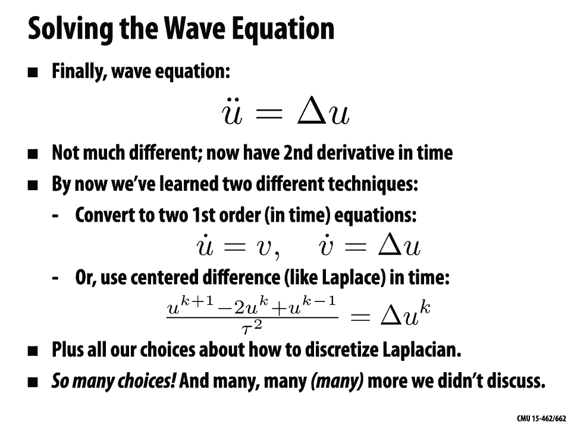

but this will get us，a pretty good wave equation solver so，here's。

an example of what that looks like the，one on the left is the one we coded up。

at the beginning of the lecture on a，grid the one on the right。

is running on a triangle mesh using this，cotangent laplacian，apart from swapping out different。

expressions for the laplacian these two，pieces of code are，exactly the same the same time。

integrator and so forth，right so it's pretty cool that these。

general principles of pdes can be easily，ported to different geometric，representations。

and actually this is a very powerful way，to develop algorithms if you can，formulate。

your graphics algorithms your simulation，algorithms your geometry processing。

algorithms your image processing，algorithms，in terms of pdes rather than in terms of。

discrete data then it becomes kind of，easy to port those algorithms。

to different contexts without much，effort，if you start out by always thinking of。

things as a graph or a grid，well then it might not be as clear how。

to translate an algorithm from one，domain to another，can，build this kind of behavior into all。

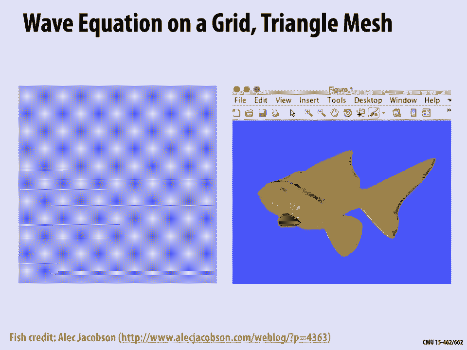

sorts of fun and interesting，graphics applications so here's just a，fun interactive demo。

that solves a wave-like equation in fact，this is not just solving the。

linear wave equation but it's doing some，other interesting stuff it's doing a。

low res thin shell simulation using a，technique called position based dynamics。

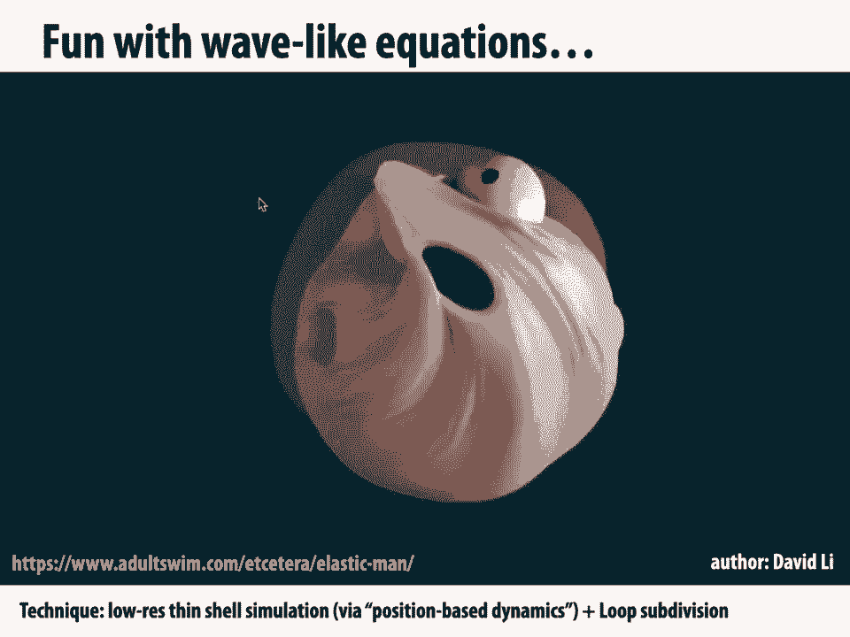

and then up sampling that low res，simulation using，something you already know about loop。

subdivision so that lets this run in，in real time okay，so that's great but what about all that。

other cool stuff we saw we saw these，beautiful movies of，fluids and hair and cloth and and so on。

how do you do that well the good news is，there are，some really good books about physically。

based animation there's lots of good，papers and，blogs that talk about this um and。

it's also worth considering you know if，you think oh this is really cool i want。

to make stuff that looks like this i，want to invent new techniques。

you should think about well what did the，read，how did they figure out how to do all。

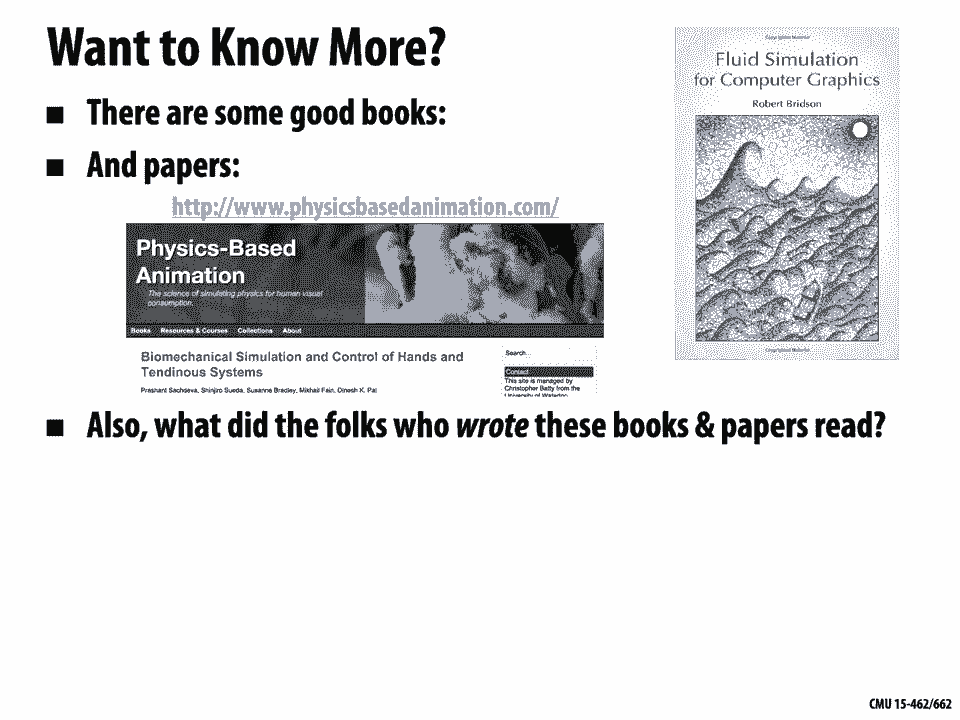

this cool stuff，very likely they didn't start out by，reading graphics papers they started out。

by going and digging deep，into the literature from computational，physics and applied mathematics。

and geometry and so forth，so if you really want to do cool new，stuff i'd encourage you to dig。

deep and learn about these these，subjects which aren't，beautiful and satisfying all on their，own。

okay so that's it for。