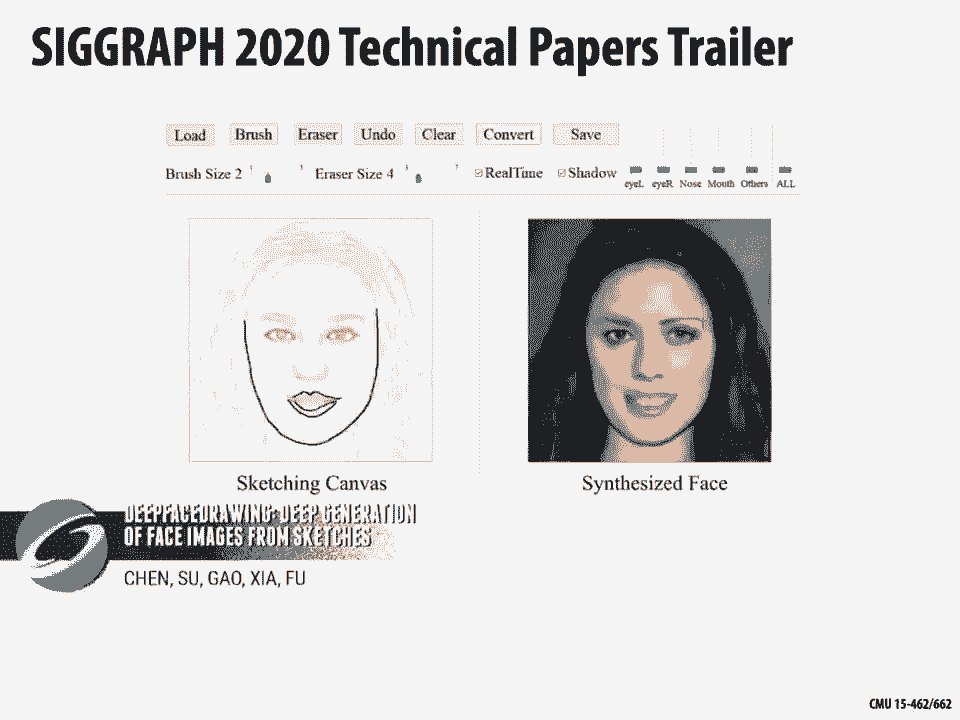
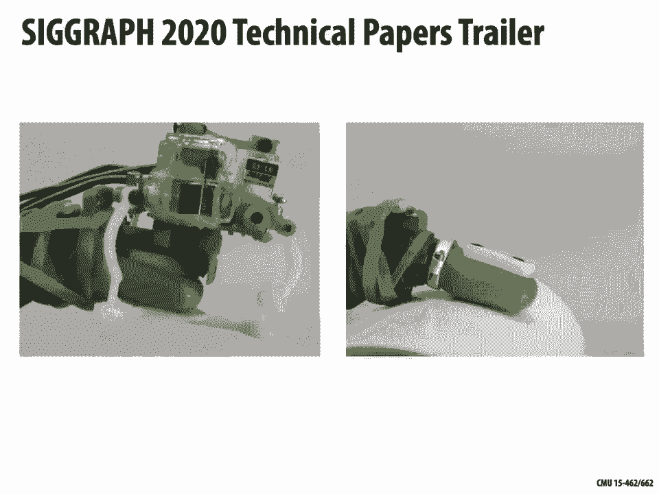

# 【双语字幕+资料下载】CMU 15-462 ｜ 计算机图形学(2020·完整版) - P2：L1- 课程概述 - ShowMeAI - BV1Pf4y1E7GJ

[Music]，all right welcome to our first lecture，on computer graphics today we're just。

gonna do an overview of computer，graphics with two main objectives one is。

to try to understand broadly what，computer graphics is all about where。

does it show up in the world and we're，actually also gonna really get our hands。

on a first algorithm for making images，from 3d shapes also I should say all。

information about course logistics is on，the webpage today I'm really gonna dive。

into the content okay so what is，computer graphics why are we here what。

do we want to talk about this semester，when you think about computer graphics。

probably an image like this one comes to，mind something from maybe an animated。

movie visual effects but what we really，want to study in this class more。

fundamentally is how computer graphics，shows up broadly in computer science。

what its function is in digital，computation and why we need it so if we。

think back to the earliest computers，they look something like this these huge。

machines that took up an entire room and，the way that you could interface with。

these machines was very crude you might，have to punch holes in a card that gets。

fed into the computer it does some，calculation and then it spits out some。

card also with holes punched in it and，this takes a lot of time obviously to。

set up the program but also to interpret，the results to understand what is it。

that came out of the computer and so you，think okay well there must be a better。

way to get digital information in a form，that we can understand in a form that we。

can digest so if you start looking at。

the history of computation you'll see，that over time very naturally people。

gravitated toward having some kind of，visual display to convey what。

information was being stored or was，computed by a machine and eventually we。

got to the point where people really，started thinking about this problem of，display and interaction。

as a study or topic all on its own so，this is one of the earliest examples of。

somebody who really was starting to，think about computer graphics。

human-computer interaction so this is a，demo of something called the sketchpad。

which was developed by Ivan Sutherland，all plays a short little clip here how。

do you actually go about communicating，with a computer in a graphical sense。

well we are using an oscilloscope here，which is much like a TV set except it's。

being driven by the computer in order to，get the information into the computer we。

have to draw somehow I miss display and，we use the light pen right so people had。

really started thinking about how to get，information into and especially out of。

the computer and so if we fast forward，to 2020 right we had all this。

development of display technology，getting higher and higher resolution。

getting richer color to the point where，we're no longer just getting a little。

punch card with holes with a tiny bit of，information coming out of the machine。

but now a single image on a monitor an，8k monitor might convey about 95。

megabytes of information right so we can，really pump out a lot of information。

from the machine and if we start looking，at even newer devices that are coming。

down the pipe like virtual reality，headsets augmented reality headsets。

these are the devices where we have to，supply a phenomenal amount of。

information in order to drive them so a，headset that you might purchase today。

has two displays one for each eye that，are each 2160 by 2160 pixels they have。

some number of bits to convey color and，they have to display an image to get。

some kind of realistic reproduction of，something visual they have to display an。

image 90 times a second so if you do a，little computation that's saying we're，pumping out about 2。

3 gigabytes per，second of information from the computer，a lot more than we were at the dawn of。

computing so one natural question asked，here is why is visual information。

so important right there are a lot of，other ways that we could have tried to。

get information out of the machine we，could have played sound or had some kind。

of vibration right why are we so focused，on visual information in computer。

science and computer graphics well one，big reason is that's just the way your。

brain works about 30 percent of your，brain is dedicated to visual processing。

and so if you think about it from a kind，of system system level point of view。

your eyes are kind of the highest，bandwidth port into the head so if。

you're trying to get information from a，machine into your mind it's doing。

something visual makes a whole lot of，sense okay and so this kind of explains。

perhaps why computer graphics was，developed why it was such an important。

part of computer science and we can，start to put together at least a。

tentative definition of computer，graphics what is computer graphics well。

we might say that computer graphics is，the use of computers to synthesize。

visual information right we have digital，information just ones and zeroes and we。

want to perform some kind of computation，to turn it into something that human。

beings can consume some kind of visual，information now if we frame it that way。

if we say the point is to create，information for human beings to consume。

then it's also natural to ask well why，only again why only concentrate on。

visual information sure the brain has a，lot of visual computing power but there。

are other things that we could do and in，fact graphics has evolved a lot since。

its early days to focus on a much，broader set of problems and questions。

than just the question of how to turn，pixels on and off on a high-resolution。

display so there have been people who've，worked on simulating sound right。

generating sound from fictional or，virtual 3d models there are people。

who've worked on synthesizing or，simulating touch so that you could feel。

the way an object might feel if it，existed in，physical reality and so we can broaden。

the definition of computer graphics and，say really weren't interested in using。

computers to synthesize and manipulate，sensory information okay you could go on。

and maybe think about taste and smell，and other senses might be fun but the。

key word here is synthesis computer，graphics is kind of the unique。

discipline in computer science that，takes information and synthesizes。

perceptual stimuli there are other，disciplines let's say computer vision。

that look at the inverse problem I have，stimuli in the real world and I want to。

consume them I want to interpret them，and convert them into digital。

information so in that sense you might，think of computer graphics and computer。

vision as being kind of inverses of each，other and the invert the interplay of。

those two disciplines actually is very，important something that is very。

contemporary going beyond turning pixels，on the screen is turning digital。

information into another thing we can，experience which is physical matter so。

there's a lot of working computer，graphics for instance on 3d printing I。

have a digital model and I want to print，it out here I'm printing this bunny。

rabbit slice by slice until I have a，solid physical model I can hold in my。

hands but it goes much further than just，3d printing people are looking at all。

sorts of different ways that you can，turn digital models into physical models。

whether that's turning digital objects，into food or into clothing or into。

buildings the bottom right example here，is a duck who was born without one of。

their feet and so somebody went and，scanned the other foot reflected it on。

the computer printed it out to create a，prosthesis right so there's a lot of。

interesting things you can do with the，technology from computer graphics that。

goes beyond image generation and is，really starting to have a major impact。

on the broader world ok so this is going，to be our working definition for this。

class how to use computation to turn，digital information into sensory stimuli，all。

I'd say if you talk to somebody who does，a lot of computer graphics they they。

would still say you know that definition，is still a bit too narrow I don't think。

it really captures all the interesting，things that go on in computer graphics。

and so if you want a really good picture，of what's happening in computer graphics。

a great place to look is at the ACM，SIGGRAPH conference where all of the new。

results in computer graphics are，presented every year lots of exciting。

new research papers and they produce a，nice technical papers trailer that just。

highlights some of the cool stuff that's，going on in graphics so let's take a。

let's take a look at that welcome to the，SIGGRAPH 2020 technical papers trailer。

will present clips from just a few of，the exciting breakthroughs in the。

technical papers program a learning，based approach to keyframe video。

stylisation enables this artist to craft，a personal look in real time by using。

four fisheye monochrome cameras we can，track someone's hands in space enabling。

them to sort these blocks and win the，game，using clever hinge design a flat lattice。

of thin flexible strips can be deformed，into a complex 3d structure and then。

flattened back out again to create a，realistic knit bunny this algorithm uses。

an energy density function to drive a，thin shell simulator it can also knit。

armadillos by interpolating a sparse，series of 3d poses this algorithm。

produces smooth complex motion that，still allows for artistic control，[Music]。

this algorithm supports immersed bubbles，and free surface flow simulators。

producing the familiar glugging action，of a water cooler a method for managing。

the dynamics of nonlinear deformable，objects lets us bounce this hairy。

elastic toy against the wall narrow，networks can improve photographs of，people's faces。

by removing external shadows and。

simulating a soft fill light efficiently，coupling the interaction between solid。

objects and turbulent flows lets us，generative adversarial networks and deep。

reinforcement learning help this，quadrupeds Avigail amazed to find。

by animating the dynamic fracturing of，isotropic and orthotropic materials we。

can pull off the top layer of a piece of，pork belly an algorithm that exploits。

tunnels and configuration space can，solve complex puzzles made up of。

entangled rigid shapes a method to。

implicitly model the space of plausible，faces lets us discover new faces by。

sketching or by merging existing parts，by planning the motion of its two robot。

arms holding a deformable hot wire this，device can cut complex 3d shapes like a。

bunny，this system measures the forces we'd。

feel in real and simulated worlds and，then applies those forces with a。

fingertip device so we can feel what we。

see this block of soil was simulated by，a massively parallel material point。

method for physical materials it can。

also collide armadillos，device，this algorithm wets us view our scenes。

from novel viewpoints this technique，models large numbers of colliding。

elastic bodies with friction so running，a particle based approach to fluid。

simulation lets us apply neural textures，to fluids even while they're moving a。

material method for two-way coupling of，nonlinear solids and fluids lets us draw。

walls full of water and orange juice，[Music]，okay so hopefully from that you get the。

sense the computer graphics is really a，rich and diverse discipline that goes。

far beyond just turning pixels on and，off on the screen and it touches all。

sorts of different areas of life。

computer graphics really is everywhere，so a lot of us again first think of。

computer graphics is something that，shows up in entertainment in movies and。

games and that certainly is a very，important use of computer graphics but。

even within entertainment it shows up in，places you might not even be thinking。

about so not just kind of cartoon，animation but lots of movies you go to。

see these days might have effects in，them that are so good you don't realize。

there there may be removing wrinkles，from the skin or inserting somebody into。

a old photograph who wasn't really there，kind of scary，computer graphics of course is used a。

lot these days in art and design people，in addition to traditional media are。

almost always doing some kind of digital，media painting or modeling or something。

in similarly industrial design you want，to make products that are not only。

beautiful but have some particular，functions so you're balancing aesthetic。

aspects with functional or engineering，aspects that's very core to the kinds of。

questions people look at in computer，graphics how do you balance the the。

physical and mechanical constraints with，aesthetic considerations also in trying。

to do engineering you might just need to，visualize data that's a very important。

thing you do a car tech crash simulation，you need to understand what happens。

there's so much data that goes on in，these simulations it can be hard to。

really understand what happened and，visualization techniques are very。

important for that architecture is being，revolutionized by techniques from。

computer graphics in particular an area，called discrete differential geometry，has a lot to say about。

structures that can be easily built but，still can be designed in a very freeform。

way in scientific and mathematical，visualization again you have tons and。

tons of data that might come out of some，high-resolution simulation okay it's。

great that the computer can do all that，it's great that we can build systems。

that can solve problems at that scale，but once you've solved those problems。

how does a human being interpret the，answer there's just so much information。

to make sense of likewise in medical or，anatomical visualization right we have。

devices that can take very very detailed，scans of the body how do you come up。

with techniques and algorithms that lets，you efficiently look at all that data。

and understand what's going on computer，graphics plays a huge role in navigation。

in the way that you get around the world，right anything from just simple 2d maps。

to more sophisticated to 3d maps to，autonomous vehicles doing autonomous。

driving or interesting things like，taking collections of photographs that。

are taken by different tourists and，assembling them in some way that lets。

people get a sense of what that location，looks like lots of interesting things。

you can do there and just broadly in，communication there are things that you。

don't think about as computer graphics，but are require some pretty amazing。

technology so actually every single，letter that you see drawn on your screen。

when you're reading the newspaper when，you're reading a website there's some。

pretty sophisticated algorithms that are，needed to draw all that typography and。

draw it very very quickly，and it kind of works like magic you，don't even realize that there's some。

sophisticated algorithm running because，where people have done such a good job。

at developing this technology but it is，sitting there in the background likewise。

people are exploring all sorts of new，mechanisms for communication for。

telecommunication beyond the written，word so like virtual avatars that you。

might sit in front of your camera and，turn you into 3d model I mean the。

possibilities are endless，so there's so much to do what are we。

gonna do in this class when we're really，going to look at the Foundation's behind。

all of this the computational，foundations behind all these different，applications。

right because all these applications，whatever domain you're excited about。

demand sophisticated theory and a，sophisticated treatment of computer。

systems so in the theory category we're，going to talk about things like basic。

representations how do you digitally，encodes a poor motion a big theme in。

this class is going to be sampling and，aliasing so how do you navigate。

acquiring a signal and reproducing a，signal so that the thing you reproduced。

faithfully represents the thing you，acquired we're going to talk a lot about。

numerical methods so how do you，manipulate signals numerically how do。

you solve equations numerically in a lot，of computer science education there's a。

focus on discrete combinatorial problems，working with integers and so forth this。

is really going to be a deep dive your，first real hands-on experience perhaps。

in working a lot with floating-point，representations of numbers which can be。

a little tricky we're gonna talk about，radion radiometry and light transport so。

how do we in a very precise way talk，about how light is looks how what color。

it is how bright it is how its，distributed in a scene right these。

questions are all very important for，trying to create photorealistic images。

and we're also going to connect us a，little bit at least to perception right。

remember again the goal is to take，digital information and convert it into。

stimuli that a human being can consume，well if that's the case then。

understanding how human beings perceive，visual information and other stimuli is。

really going to factor into our，algorithms in an important way for。

instance if we say we want to compress，an image so that a person doesn't notice。

anything changed we really have to，understand something about human。

psychology on the system side you know，if we want to create algorithms that。

pump out gigabytes of data into a VR，headset well then we really need to。

think about performance and the way that，information is exchanged by different。

processes and algorithms in our pipeline，so we're going to talk，out things like parallel or。

heterogeneous processing that might be，needed to run fast graphics algorithms。

we're going to talk a little bit about，graphic specific programming languages。

like shader languages and more generally，we're going to talk about how we can。

formulate problems in computer graphics，in terms of a pipeline what are the。

right primitives to break down our，problems into so that we can efficiently。

stream computation through a piece of，hardware okay so that's it for the the。

high-level overview let's really dig in，and get our hands on some concrete。

problem and so what we're gonna do for，most of the rest of this lecture is。

we're gonna try to think about how we，can model a three-dimensional object。

encode it as digital information and，then turn that digital encoding of the。

object into a picture into a，two-dimensional picture that we can look。

at okay and in particular we're going to，think about a very simple piece of。

geometry just a cube okay so we want to，generate a somewhat realistic drawing of。

a cube and we want to do that，algorithmically not just by sketching it。

on paper so we have these two key，questions we'll have to answer one is a。

modeling question how do we describe or，encode the cube on the computer and then。

we have a question of rendering that，word rendering will come up a lot in。

this class when we say rendering we mean，something about how do you take a。

digital description and convert it into，a concrete picture so how do we。

visualize the model of our cube okay so，just to get us going，this is obviously a simple example but。

just to get something concrete let's say，that we have a cube that's centered at。

the origin 0 0 0 in three-dimensional，space it is a 2 by 2 by 2 cube 2 wide by。

2 tall by 2 deep ok and the edges of the，cube are going to be parallel to the XY，and z axes。

kind of an axis aligned cube so the，first question we could ask you know how，sense。

we've already encoded the cube we've，given a description of the cube。

that's pretty precise we know where it，sits in space we know how big it is we。

know how its oriented okay but this，description doesn't generalize very well。

if we want to start describing other，objects like a face or a car it's not。

really enough to just give the position，the rough size and the orientation right。

somehow we're going to need to encode，more detailed information about the。

shape in order to eventually make a，picture of it to render it so maybe you。

think for just a moment what's a more，explicit description I can give of the。

cube it really spells out in great，detail what its geometry looks like what。

okay well it's a little bit of a tough，question it's kind of an abstract。

question but let's try this so one thing，we could do that's pretty concrete is we。

could say first of all what are all the，corners or what are all the coordinates。

of the corners of the cube or the，vertices of the cube so given this。

description of the cube we should be，able to figure out where in space it's。

eight corners live okay and what might，be an example maybe you think about。

what's the coordinate for just one of，the corners can you think of anyone okay。

so if you think about this for a second，you think okay it's two by two by two。

but it centered at the origin so it's，kind of kind of a radius at one and and。

so at least one of the corners will be，at one one one another one might be at。

minus one minus one minus one and then，we have all the other possible。

combination of signs right we have three，coordinates two possible signs two to。

the three is eight so we get the eight，vertices of the cube and kind of the。

point here is again if we think okay，this was easy for the cube and it seems。

almost unnecessary for the cube but，again if I was trying to convey the。

shape of a face or a car I could also，list a bunch of points on that shape so。

the point here is that we have a，description that will generalize to more。

interesting geometry okay but we're not，quite done yet it's so far we don't。

really have a description that captures，the essence of a cube we just had these。

eight points that are floating out in，space right and if I just show you these。

eight points if I drew a picture now if，I rendered these eight points on to a。

two-dimensional canvas it might be，pretty hard to tell that this is a cube。

I would just have these eight dots，that's it's sort of somewhat strange。

locations so what additional information，might I provide to really capture。

okay well there are a couple of natural，possibilities here one that's pretty。

straightforward is I could list all the，edges I could say not only where are the。

eight corners in space but which of，those points are connected to each other。

by an edge of the cube and one simple，way to specify that would be to say okay。

an edge has two endpoints so if I have，these eight points A through H I'll。

specify an edge as just a pair of，letters so for instance a B is an edge C。

D is an edge EF is an edge and so forth，you can pause the video if you like and。

and check me on this what do you want to，check how do you know if I got it right。

with one of these edges well I guess，what you you should check to see is that。

only one of the coordinates changes when，I go from one endpoint to another the。

edges are aligned with the XY and z axes，meaning as it go from one edge endpoint。

to another only the x coordinates，changing or only the y coordinate or。

only the Z coordinate okay but I I'm，pretty sure that those are all the the。

right edges for my cube okay so we now，have a digital description of the cube。

right it's no longer a concept it's no，longer just of a word or the string cube。

but it's a very very explicit digital，encoding of the cube and we could encode。

this if we like all the way down to，binary data right rather than these text。

strings that we see on the slide okay，but this is what we mean by a digital。

encoding of the geometry or the scene，that we're working with so we're kind of。

done now with the modeling task it was a，little bit of a pain right we probably。

in general don't want to describe our，models this way and later on in the。

semester we'll see how to build tools，that give us a lot more ability to，easily design and and model。

three-dimensional objects but for now we，have a reasonable digital。

digital description of our cube so the，next question is how do we draw this。

cube as a flat 2d image how do we render，it well what do you think I mean the。

basic problem here is we have three，coordinates for every vertex but if we。

want to draw it on a 2d piece of paper，we need two dimensional coordinates so。

how could we take these three，coordinates and turn them into two。

that's our basic rendering problem at，okay well there are a lot of。

possibilities here for one thing we，could just throw away one of the。

coordinates right we could just say if I，want to plot a three-dimensional point。

on a two-dimensional plane I'll just，toss out the Z coordinate I'll just draw。

X and y and that works okay but we don't，really get a three-dimensional sense of。

this cube if we do that right we would，just see what would you see in that case。

let's say I threw away the Z coordinate，I plopped these points in the plane and。

then I connected any pair of points that，belong to an edge well you just see a。

square right I'd be looking it'd be like，looking at the cube from the side but。

without any perspective it'd be this，really boring image so we want to do。

something a little more interesting so，our basic strategy is going to be to map。

the 3d points to 2d points in some way，in some interesting way okay and then。

we're gonna connect those 2d points with，straight lines is that an algorithm is。

that really something we can go and，implement not really it's not yet an。

algorithm because we haven't really，broken it down into atomic operations。

that a computer knows how to do but it's，a good sketch of the algorithm that we。

want to design okay so let's talk in a，little more detail about how each of。

those steps is going to look the first，one is perspective projection so we said。

that this really really simple idea of，just tossing out a coordinate that's not。

going to give us a very interesting，image what we'd like to do is capture。

things that we know are true from our，day-to-day experience of looking at the。

world so one thing we know from walking，around the world is that objects tend to。

look smaller as they get further away，this is the phenomenon of perspective。

and you know it's such a natural thing，it's it's such a thing that is just。

obvious the most people never really，think about well why does that happen，why is it that if。

I'm looking at a building downtown and，I'm I'm off up on a high hill top why。

does the building look really small is，it actually that that building shrinks。

hmm when I walk up to the top of the，hill no I mean this is crazy right the。

building doesn't change so so why does，it look so tiny have you ever thought。

about this so let's really think about，this and one way we can get our heads。

around what's happening is to consider，what's called a pinhole model of a。

camera actually this is a real kind of，camera you can build so the way this。

works is you can imagine you have a a，cardboard box that's completely dark。

inside and then you poke just one tiny，little hole to let light in and on the。

opposite side from where you poke the，hole you put a piece of film okay so。

traditional film was a photosensitive，material that had silver halide crystals。

in it or something like that and and the，way it works is every time light comes。

in every time a photon hits that film it，causes a chemical reaction to occur。

those little crystals get stuck to the，film paper and anywhere that light。

doesn't hit the crystals don't get stuck，and so then you go into your photo。

laboratory and you wash the film in some，particular chemical all of the stuff。

that didn't crystallize gets washed away，all the stuff they got stuck remains on。

the photo paper really this is your，negative right and it creates an。

impression of the brightness or darkness，that was shining through that hole。

that's how traditional photography，worked before digital cameras came。

around okay so not super important，actually all this chemistry and how the。

film works but that's that's what's，going on in your pinhole camera what we，want to understand。

and again is this phenomenon of，perspective why is it given this setup。

that models that are or objects that are，closer look bigger and smaller look。

further away if I move the box away from，the tree or toward the tree why should。

the size of the tree change in my，two-dimensional image maybe this is a。

little easier to understand if we look，at it from a side view okay so the。

pinhole now is along this horizontal，axis it's on the right side of the box。

along the horizontal axis and we can ask，for any point P equals XYZ in。

three-dimensional space so maybe the tip，of some leaf on the tree where is that。

gonna end up on the image if there's，green light kind of shooting off of that。

leaf you can imagine there's some light，that bounces off and shoots off of that。

leaf into the camera what is the，position it's going to end up at on the。

film the position Q equals u V all right，so we're going to say the point P is。

where it starts Q is where it ends up，but where exactly does it end up how。

well maybe easier to think just for a，moment about just where it ends up。

vertically right so if V is the vertical，coordinate on the two-dimensional film。

how could you figure out the V，coordinate of this point Q based on this。

okay well some of you may have thought，ah actually this is something about。

similar triangles I can notice that，there are sort of two similar triangles。

in this picture right there's the one on，the right with base Z and height Y and。

there's the one on the left with base，one and height V okay so what do we know。

about similar triangles similar means，for instance that the ratios of edge。

lengths are the same right so we know，that Y over Z is the same as V over one。

right so if we assume that the camera，has unit size it's a one by one by one。

box and it's pinhole is at the origin of，space zero zero zero then we just need。

to solve the equation v over 1 equals y，over Z for the coordinate V well that's。

a pretty easy equation to solve right we，divide V by one and we get V and that's。

equal to Y over Z in other words the，vertical coordinate on the film is just。

the slope Y over Z okay how do we get，the other coordinate how do we find the。

U coordinate where the light hits the，film well that's easy we just do exactly。

the same but we look at the box from the，top this time rather than from the side。

again we'll get the same kind of picture，with two similar triangles we carry out。

the same calculation and we'll discover，that the horizontal coordinate is x over。

Z okay hopefully that makes sense if not，pause rewind take another look but the。

important thing is the result we got，agrees with our day-to-day intuition。

what do we notice that if we have this，point on the tree，XYZ，and Z starts getting bigger and bigger。

and bigger and bigger what happens to X，right U and V start getting smaller as Z。

gets bigger as the tree goes off into，the distance the coordinates on the。

image plane shrink the apparent size of，the image shrinks as he gets smaller x。

over Z gets bigger and Y over Z gets，bigger and the image gets bigger okay so。

this actually gives some real concrete，explanation for why it is that things。

look bigger when they're closer and，smaller when they're far away the same。

kind of thing is happening in your，eyeball your eyeball is not quite the。

same as a pinhole camera but it's not so，different either you have a pupil which。

is like the pinhole and you have a，retina on the back of your eyeball which。

is kind of like the film in your camera，and exactly the same kind of calculation。

explains why things get smaller in the，distance okay the good news too is that。

this is an easy calculation if I want to，go from 3d to 2d now all I have to do is。

divide by Z so now we can really go，ahead and draw our three-dimensional。

cube as a two-dimensional image and we，can do this by a completely algorithmic。

procedure something that doesn't require，that we're good artists we don't have to。

have any background in painting or，sketching or anything like that to get。

this illusion of perspective we just，have to repeat the same simple algorithm。

12 times and I will encourage you to，actually do this because it's a lot more。

fun to see that this works out at home，to actually do the calculation draw the。

picture and see that yes indeed the，algorithm works then to just sit there。

and you know nod your head and believe，it should，okay so what you're going to do is。

repeat the same very simple algorithm，twelve times once for each edge of the。

cube this is a little monotonous so if，you want to write a little piece of code。

you know by all means to carry out this，calculations for you or you can do it。

with a calculator it doesn't matter，so for each edge we're going to imagine。

that we have a camera sitting it to 3/5，okay so some interesting location in。

space not zero zero zero just because we，want a better view of our cube and we're。

going to convert the three-dimensional，coordinates X Y Z of each end point to。

two dimensional coordinates UV in the，following way the first thing we're。

going to do is we're going to subtract，the camera location C from the vertex。

location X Y Z so we have our vertices，listed at the bottom those are our。

capital X Y Z right so we're going to do，for instance 1 1 1 - 2 3 5 and that。

gives us the 3d locations of those，points relative to the camera you see。

how that works if our camera was sitting，at the origin 0 0 0 then the vertices。

we've listed are already the coordinates，we care about but if we move the center。

of the camera a little bit we also have，to change the coordinates of the。

vertices we're working in a different，coordinate system now centered around。

the camera ok so subtract C from capital，XYZ to get lower case X Y Z then how do。

we go from 3d to 2d we divide the little，x and y coordinates by the little Z。

coordinate to get U and V and if you，want to plot this on a piece of graph。

paper you'll make your life a little，easier by just writing it out as a。

fraction ok once you have those，coordinates just draw a line let's say。

on a piece of graph paper between the，two coordinates you computed that's the。

little subroutine that'll draw a single，edge of the cube your overall rendering。

algorithm then is to just do a loop over，all the edges and execute this。

subroutine twelve times ok and so then，you could go ahead and draw this on，graph paper。

in fact if you don't have graph paper，but you do have a printer you could。

pause the video and you could print out，this moment of the video on your printer。

right lots of ways you could do it or，you could draw in a drawing program on。

your computer but give it a shot okay，and if you go ahead and do this maybe。

you make a mistake or two but that's，okay probably you're gonna get an image。

that looks something like this okay so，that is the output of our first graphics。

algorithm it turns a digital description，of a cube into a real two-dimensional。

image and you can check here if you got，the same 2d coordinates but what's。

really cool about this is it looks，pretty good right this really does look。

like a three-dimensional rendering of a，cube and we did it completely by a。

algorithmic deterministic procedure we，let you know math do all the hard work。

for us eventually we'll let code and，computation do all the hard work for us。

so if we now wanted to make an animation，of this cube if we wanted to imagine the。

camera is moving around the world we，would get this beautiful perspective。

correct image of the cube from different，points of view it's pretty cool here's。

just a fun picture produced by a，previous class where everybody。

contributed a different edge so twelve，different students sat and computed。

twelve different edges and hey they got，it right okay so again the point here is。

you don't need higher-level reasoning to，come up with these these images it's。

really about breaking down the rendering，process into lower and lower level。

subroutines and components that can be，used to execute this kind of drawing。

algorithmically okay so success we，turned purely digital information into。

purely visual information using a，completely algorithmic procedure that's。

what we want to do in this class in，general but actually it's a little bit。

of a lie right there was one part，of our process that was not really very。

digital it was pretty analog let's say，because we didn't really talk about how。

you would draw lines on a computer we，relied on maybe drawing lines with a。

pencil on paper okay so to even start，thinking about this question how do we。

draw lines on a computer we have to，start talking about how an image is。

represented on a computer and in fact，you can start getting an answer to this。

question if you just just come closer，come come closer to the screen come。

really really really close to the screen，okay，so if you came really close to your。

computer monitor and especially if you，have a low resolution monitor you're。

gonna see that the display is actually，not a continuous image like you might。

see in the real world but it's actually，this grid of little picture elements。

which are called pixels pixels really，means picture elements and they look，something like this。

so they look like these little blocks of，lights that have been turned on or。

turned off or turned on to varying，degrees that generate the image and，actually you notice even some。

interesting and weird stuff about these，pixels which is they look like they're。

striped in three colors they have red，green and blue stripes like a little。

flag all right so they're not just a，continuous color and we'll talk a little。

bit later in the class about color and，how it is that little red green and blue。

lights managed to produce all sorts of，different colors but it's worth knowing。

that this is kind of what's going on，when you look at a screen whether it's。

your laptop or your cell phone or，whatever it is so even though displays。

are pretty complicated we can come up，with a pretty simple abstraction for。

displays or for digital images that's，good enough for working with with，algorithms okay。

and this abstraction is to say that we，have a raster，display meaning things get drawn or。

rasterized onto a grid with some number，of rows and columns the image is。

essentially comprised of the values that，are stored in this grid the numerical。

values that are stored in this grid and，each little cell of the grid represents。

some color some color value okay again，we'll talk a little bit later on about。

how exactly to encode colors right if I，said please give me the digital value。

than numbers encoding the color orange，or green you may not know exactly how to。

do that but later on we'll see there's a，very straightforward mapping between。

these colors or maybe sometimes not so，straightforward mapping between these。

numbers and color values okay but this，is what you should think when you think。

of a digital image you think of a grid，with some numbers in it maybe the easier。

version is to think not about colors but，just a grayscale or black and white。

image where you have a one if the pixel，is white and a zero if the pixel is，black or 0。

5 if the pixel is a medium，gray okay so that's how we think about a。

digital image the next question is if we，want to draw a line into a digital image。

which of these pixels should we turn off，or on if you hand me only the two end。

points of the edge you say that the UV，coordinate of one end point and the UV。

coordinate of another end point which，pixels in the grid，need to get turned on that process of。

turning the high-level description of，the line segment into a set of pixels is。

called rasterization rasterization is a，process of converting a continuous。

object to a discrete representation on a，raster grid or pixel grid okay so how。

might you answer this question the，question at the top of the slide right。

what pixels should we turn on to depict，well there's a lot of different answers。

in fact there's no right or wrong answer，here but one reasonable answer might be。

how about just turning on any pixel that，touches the line so if the line passes。

through that pixel at all that's gonna，be part of the the image for the line。

okay that works okay you might you might，notice that in this example the line。

looks maybe a little chunky right，there's some pixels that are barely。

touched by the line but still the whole，pixel gets turned on so is that gonna。

look funny there's another rule a rule，that's actually used by a lot of real。

modern graphics api's and hardware and，so forth called the diamond rule which。

says you should turn on a pixel not if，the line passes through the square box。

around the pixel but if it passes，through the diamond made by connecting。

the midpoints of the pixel this is，called the so called diamond rule okay。

so you notice compared to the previous，rule or simpler rule this line is a。

little thinner right pixels that are，just grazed by the line don't get turned。

on and maybe looks a little nicer um you，could also ask you know is there really。

not a right answer is it really not a，best way to rasterize a line well one。

way to answer this question is to say，well what properties would you like that。

algorithm to have what should be true，about a line rasterization algorithm for。

instance you might say oh if the two end，points are in the same location only one。

pixel should get turned on or maybe no，pixels should get turned on you could。

come up with criteria for what it means，to have a good line rasterization。

algorithm first and then try to figure，out if there is a good rule or a good。

algorithm for drawing lines that satisfy，all those criteria another perspective。

that we're going to talk about a lot，when it comes to rasterization is to，think about coverage so。

you could say how about we turn on a，pixel with intensity proportional to。

what fraction of the pixel is covered by，the object we're drawing now this is a。

weird question for a line because a line，is it's like infinitely thin right it。

covers 0% of any pixel so maybe you say，well okay but I'm gonna give my line a。

width I can think of my line not as an，infinitely thin line but actually a。

little skinny skinny rectangle that has，some width ah so now I could start。

asking well what fraction of each pixel，is covered by this skinny rectangle and。

lighting up the pixel by that amount，that starts to sound pretty reasonable。

and it also sounds nice because I can，deal with things like thick lines and so。

forth okay but I'm really getting ahead，of myself I just want to stress that in。

computer graphics there's often many，many ways to do things you shouldn't。

just believe that there's one right way，lots of different possibilities to。

explore so let's go back to this simple，view of a line as this thing that has。

two endpoints and is somehow no，thickness okay and let's say we care。

about something like this diamond rule，so if we do that how algorithmically now。

could we find the pixels that satisfy a，given rasterization rule let's say we've。

already decided what we think is the，right way how do we actually turn on the。

right pixels so one stupidly simple，algorithm would be we just check every。

single pixel in the image to see if it，meets our rasterization rule okay so for。

instance let's say I have an 8k monitor，you know millions and millions of pixels。

in my my huge high-resolution monitor，and I just want to draw one little line。

segment one short line segment let's say，my image in fact is n by n for some very，large N。

and I'm gonna rasterize it by going to，every single cell in my pixel grid every。

single pixel in my pixel grid and，checking does the line pass through the。

diamond in this pixel in terms of n the，size of the image how many operations do。

okay I have to do N squared，operations I have to check all n times n。

pixels in the image and this is a little，weird because I expect that a line or a。

line segment is gonna cover at most，about n pixels a line is a linear kind。

of thing it can't cover the whole image，if it has no width so it feels like I'm。

doing way more work than I need to be，doing there must be a way to do better。

there must be a way to do an amount of，work proportional to the number of。

pixels in the output rather than the，number of pixels in the image okay so。

this leads to an idea of incremental，line rasterization so let's say a line。

is represented again with two endpoints，u 1 v 1 and u 2 v 2 there they are and。

we're gonna for simplicity assume that，these are integer coordinates and those。

integer coordinates correspond to these，centers of pixels the slope of the line。

hopefully you remember about slope slope，is rise over run in this case it's V 2。

minus V 1 over u 2 minus u 1 okay and we，want to light up the pixels along this。

line segment how do we do that well，let's consider an easy special case just。

one of many things that could happen，let's assume that u 1 is less than u 2。

and V 1 is less than V 2 so u 1 V 1 is，at the lower left and u 2 V 2 is the。

upper right as in this image okay in，this case the slope is between。

zero and one there's more change in X，than there is in Y and so we can come up。

with a pretty simple little algorithm，for walking along the line and figuring。

out which pixels to light up in，particular we can start at height v1 and。

then going from left to right from u1 to，u2 we're just gonna increment one column。

at a time in each column we're gonna，increase our height by the slope s okay。

so for a unit change in U V changes by s，we're gonna draw the pixel R we're gonna。

light up the pixel at U and round V so，round V is going to give us the integer。

closest to our current V value and then，repeat so we move from left to right we。

gradually increment V and we just draw，the closest integer to our current V。

value until we finally reach the end of，the line segment pretty straightforward。

this is not a general algorithm because，have to think about these different。

cases okay what if there's more change，in V than there isn't you well then we。

need to write a little piece of code，that looks very similar to this one。

right but where some use and Vees are，swapped out around and so forth but。

that's the basic idea so there you go we，have a concrete algorithm now for。

actually drawing the lines okay and in，fact this out of them is pretty easy to。

implement it's not by the way how lines，are really drawn in modern graphics。

software or in modern graphics hardware，there are a lot more clever and。

interesting things you do to draw lines，you want to handle things like lines。

with width as we've already talked about，but this is a really nice algorithm a。

nice idea of incremental line，rasterization that actually does show up。

in lots of other algorithms in computer，graphics most importantly we now have a，complete。

computational procedure for turning our，digital information just a list of。

vertices and edges and maybe the camera，location into a two-dimensional image。

into a collection of pixel values color，values on a grid on an image grid okay。

so really just from this one lecture，alone you really could go home and write。

up pretty easily a piece of code that，draws three-dimensional images or draws。

three-dimensional models into a，two-dimensional image it's pretty cool。

right and now you have the freedom you，can change the input you don't have to。

draw the cube you could mess around with，the vertices you could mess around with。

the edges you could draw all sorts of，interesting cool 3d models okay so this。

whole exercise that we've just gone，through is really what computer graphics。

is all about how do we encode visual，information digitally how do we turn。

that digital information into an actual，image or sensory stimuli so so far we've。

only talked about a very very simple，line drawing of a cube okay if we want。

to generate more realistic pictures，we're gonna need a much richer model of。

the world we're gonna need to talk about，geometry we're gonna need to talk about。

materials right how do you distinguish，leather from paint from carpet or。

whatever we need to talk about lights，different kinds of illumination we need。

to talk about camera models we need to，talk about motion we need to talk about。

all sorts of things and all the，algorithms to translate that data into。

images and we will see all of this and。

more as our course progresses just to，give a little taste of how things will。

go in this class how will you learn all，this stuff of course part of it will be。

by lectures and conversations and so，forth we're also going to learn a lot by。

making and doing so a big part of your，assignments in this class is going to be。

building up what's called the Scottie 3d，package this is a software package。

that's kind of a toy software package，that's meant to emulate real。

3d packages that people use for creating，visual effects and so forth so we're。

gonna give you kind of a skeleton code，for scottie 3d and you're gonna fill in。

all the essential algorithms and this is。

broken up into four major assignments，the first one is on rasterization on the。

kinds of things that we've been talking，about today but not just drawing black。

lines on a white image really drawing，much more rich and interesting graphics。

that you might find for instance in a，what's called an SVG file a standard。

vector graphics file and why do you want，to do this well because it lets you。

display all sorts of beautiful images，and animations like you might see around。

the web like you might see on posters，and again typography just text itself。

involves a process of rasterization the，next assignment is it going to be about。

geometric modeling so we've already seen，a little bit of this today okay we。

wanted to model the cube so we input the，vertices in the edges we're gonna talk a。

lot more about tools to generate and，design interesting 3d shapes and then to。

process those shapes you created the，mesh in one way but a certain algorithm。

needs it to be broken up in a different，way the motivation for tools like these。

is to create models like these models，coming up not only again in。

entertainment but also in product design，and engineering and in all sorts of。

other things and even with the simple，subdivision modeler that you're gonna。

build in scottie 3d you actually going，to be able to create some pretty。

sophisticated models people have made，some really cool 3d models with their。

own 3d modeler in previous years the，third part has to do with our rendering。

process we saw a again really simple，rendering process of drawing lines but。

the third part is going to be about，photorealistic rendering if I have a。

description not only of geometry but，also of lights and materials and cameras。

how can I predict what that scene would，look like in real life，there's lots of difficult questions。

about light bouncing off the wall and，hitting a surface and shining this way。

in that way to create this beautiful，reality that we，live-in and this kind of technology gets。

used all over the place again in the，movies of course to make you know。

virtual environments look real but also，in architecture you've designed a house。

and you want to see before you build it，hey does it look right if the light is。

shining in through the South window does，the room look the way that I'd really。

like it to or if I'm doing some kind of，product design or engineering how can I。

get a sense of how this thing will look，before I even build it all right that。

gives you a lot of freedom to design and，explore without having to sink millions。

of dollars into actually building the，thing and finally we're gonna want to go。

beyond static images and talk about，motion talk about animation so just like。

we need digital encodings of 3d geometry，what kind of information do we need to。

encode to describe to the computer and。

animation okay and again the motivation，is lots of different things。

Moda animating characters in movies of，course but not only the bodies of the。

characters you also have to think about，complicated things like how does the。

hair of a character move around and，respond to its environment and this。

starts to get into connecting computer，graphics to physics and actually taking。

laws of physics that you might have，learned in your intro classes and。

breaking them down into numerical，procedures that you can actually use to。

approximate how things move in the real，world animations show up also in other。

places like robotics so here we're，seeing an example of sort of animating a。

robot that but that animation is being，used to actually control a physical。

object so talking about digital，encodings of motion is really really。

important beyond just you know making，animations for the movies okay so that's。

it for today next time we're actually，going to start diving in to a review and。

preview of the kind of mathematics that，you'll need for this class so the。

prerequisites are some background in，linear algebra and vector calculus but。

there are a few things that we'll need，to review there are a few things that。

show up a lot in computer graphics that，might not quite，have been emphasized in the courses you。

took previously so we want to make sure，you will have the right tools to。

