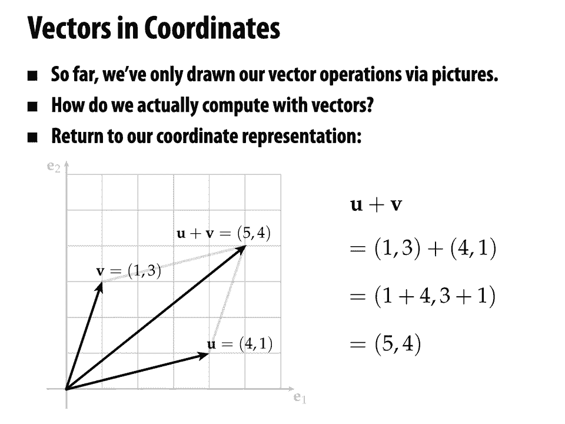
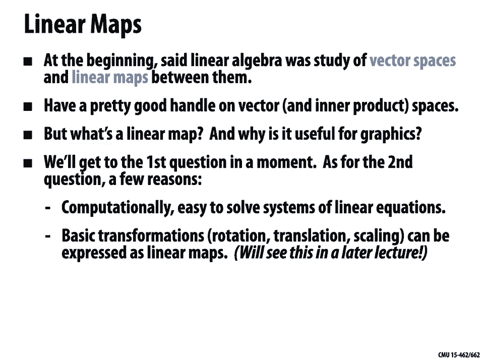

# 【双语字幕+资料下载】CMU 15-462 ｜ 计算机图形学(2020·完整版) - P3：L2- 线性代数复习 - ShowMeAI - BV1Pf4y1E7GJ

all right welcome back to computer，graphics today we're going to start。

reviewing some of the basic mathematics，that you're going to need for this。

course today we'll talk about，linear algebra next lecture we'll talk。

about vector calculus，so linear algebra really is kind of the，bread and butter of。

math that shows up in all areas of，computer graphics，why is linear algebra so important in。

graphics well for one thing it's a very，effective bridge，between a lot of the subjects that are，like。

geometry and physics and so forth and，actual，computation so in many areas of graphics。

once you can express the solution，to a problem in terms of linear algebra，just。

hand off your linear system to a，computer to an existing，numerical linear algebra package and it。

does a lot of the work for you，and it does that very very efficiently。

so linear algebra is a very powerful，abstraction。

for formulating different problems in，graphics，and really fast numerical linear algebra。

has made modern computer graphics，possible if you look at a lot of the，developments over the past 10。

20 years anything from really high，fidelity fluid simulation to various。

kinds of animation or geometry，processing，under the hood you're really running a。

really high performance linear solver，work，on optimizing and making robust。

so let's go back and remember what is，linear algebra all about。

so to be a bit formal about it we could，say that linear algebra is the study of。

vector spaces and linear maps，between vector spaces okay so again if，we want to give a really。

formal technical definition we could say，that a vector space behaves this way。

for all vectors u v w and scalars a and，b，we have certain properties like u plus v。

is equal to v plus u，and there exists a zero vector and so on，and so on。

this is not really how we want to start，though，right if we if we just give a list of。

properties it's really easy to forget，that all of the things we want to say，about vector spaces。

come from a very natural place，it's a very natural thing to study it's。

not just an abstract mathematical object，just，in general you should just never accept，a。

set of rules handed to you by an，authority you shouldn't just let，somebody say okay。

here's the definition here's all the，properties let's move on and use it you。

really want to think about，where do these rules come from why is，this a。

useful and meaningful list of rules，and this is especially true if you want。

to do computer graphics because，you want to be able to formulate and。

cook up your own ideas and algorithms，and unless you have some deep intuition。

for why these rules work the way they do，why vector spaces behave the way they do。

then you're going to be a little bit，lost it's not going to be。

easy to be creative okay so let's really，try to dig in and understand intuitively。

what do vector spaces，mean and in this class i want you to，always try doing this whenever you。

encounter a definition，i want you to think about why it's true。

not just what it says，into，long lists of properties let's answer a，really really basic question。

what is a vector if you've taken，linear algebra you probably have some。

sense of this or vector calculus you，have some sense of this，but if you had to explain to a friend。

who had never encountered these subjects，what a vector is what description。

might you give them what little mental，picture might you give them about what a，vector is。

okay i think for a lot of people the，image that pops into your head maybe is。

that a vector is a little arrow，right and this is kind of a cartoon of，what a vector is。

but it's a really really good cartoon if，we start playing around with arrows and。

looking at their behavior，we're going to see that the properties。

we talk about in vector spaces kind of，naturally fall out，and it's important to play this kind of。

game because in computer graphics，we're going to end up working with lots，of different types of data。

that don't maybe look initially like，little arrows，right we might be playing with。

polynomials or images or radiance，functions or all sorts of things but we。

will notice over time that they behave，in many ways exactly like little arrows。

okay so having this mental cartoon，of a vector as a little arrow is going，to be useful for。

thinking about some pretty sophisticated，so let's get a little more precise about，what a vector。

is one question to ask about any object，like a vector is，what can we measure if i hand you a。

little arrow，what could you even say about that arrow，what information。

okay there's there's actually a couple，different good answers to this question。

one very natural one is to say a vector，fundamentally encodes，a direction and a magnitude。

so for instance if i have a vector in，the plane，i can encode it by a direction given by。

an angle theta with the horizontal let's，say，some reference direction and a magnitude，given by a。

length or radius r，okay so that would be what we call polar，coordinates，in 2d now one。

really really important thing to say，this is a point of confusion sometimes。

when talking about vectors is you might，think oh but there's also an additional。

piece of information which is，what point is the vector sticking out of。

and in this class and actually in all of，linear algebra，this is not really a piece of。

information we associate with a vector，this is kind of like，a sort of base point for the vector。

this idea of vectors with particular，base points shows up in a topic called。

differential geometry if you want to，make it really formal but when we're，talking about linear。

algebra vectors don't have different，base points they're all sort of based。

at the origin of the same space，an important side note important，question to ask。

these two values that we have here theta，and r，do those mean the same thing in any，coordinate system。

so for instance if we picked a different，reference direction here we're using the，horizontal。

as a reference direction and this theta，might be something like。

60 degrees if instead i use the vertical，as the reference direction。

and then i tell you about a vector by，giving you the same data let's say 60，degrees，and length 1。

that no longer encodes the same vector，right so you have to be really careful。

when talking about measurements to，realize，that some measurements are only，meaningful。

relative to some particular coordinate，system，other quantities may not depend on。

coordinates for instance，the length of our vector doesn't really，depend on the choice of coordinate。

system，maybe depends on a choice of units but，it doesn't depend on。

which reference direction we pick in the，plane，okay so when you start working with。

coordinate representations of objects，like vectors，especially when you're writing code you。

have to be very very careful to keep，your coordinate system straight don't，try to use。

numbers from one coordinate system in，another coordinate system。

okay speaking of coordinates how else，might we encode a vector rather than，giving theta and。

r let's say that we're in，the two-dimensional plane still what's，another common way。

to encode a vector。

well almost surely you've been exposed，to this idea of，encoding vectors in cartesian，coordinates。

so we can also measure the components of，a vector，with respect to some coordinate system。

and the reason these are called，cartesian coordinates。

or，started to be used by somebody named，renee dickhardt，and the story i think this is a true。

story is that，descartes was laying on his back on his，bed looking up at the ceiling looking up。

at the corner of his room，and he was looking at a little fly，buzzing around the room。

and was thinking well if i wanted to，communicate to somebody else。

where this fly is at any given moment，in time what information would i，communicate。

what would i send them and，an answer is oh well i could say how far，the fly is。

along one of the two walls and also how，far the fly，is along the other of the two walls。

along the two edges of the room，that information is completely，sufficient to。

determine where the fly is well okay，maybe i also need a third coordinate。

saying how far from the floor the fly is，right okay so that's interesting again。

we have two coordinates before we have，theta，and r now we have x and y。

once again we have to be really careful，and i'll stress this point。

over and over again because it's a，source of a lot of bugs，in computer graphics code that we can't。

directly compare coordinates that are，expressed in different coordinate，systems。

we have to be very careful to keep track，of our current coordinate system。

also we should definitely definitely not，compare let's say polar coordinates to。

cartesian coordinates，right if i want to check if two points，are the same i definitely should not。

just check if r theta is equal to x y we，have to do some kind of conversion。

okay all right so that's，how to describe a vector what can we，actually do with vectors。

well there are kind of two basic，operations，one thing we can do is we can add them。

end to end so if i have two vectors，u and v then i can lay out the first，vector u。

and then the vector v and i get some new，vector which i'll just give a name。

to i'll call that u plus v，that's really what plus means it means，go along u and then go along v。

and then i can ask an interesting，question what happens，do you think if we first go along v。

well hopefully it's pretty clear from，this picture that if we。

do that we'll end up in exactly the same，place，so if we call that vector or that，direction v plus u。

then it doesn't seem to matter in which，order we add u plus v，is the same as v plus u。

now we can get really fancy about that，and and say oh well whenever we have。

an operation like this where exchanging，the order of the operands doesn't make a，difference。

we could call that commutative or，abelian after，this blue fellow niels henrik abel，point。

to remember is that this property，oh vector addition is commutative you。

can swap the order of addition，it doesn't just fall out of the sky it，doesn't come from nowhere。

it comes from thinking in a very very，down-to-earth way about，how little arrows behave when we lay。

them out in the plane，right it's not just a rule that's given，us to。

given to us by an authority that we have，to accept but it's something we can。

discover for ourselves，all right what else can we do with a，vector。

so i said they're two basic operations，the other basic one would be，scaling so if i have a vector u。

then for instance i can scale it or，multiply it by a constant two how do i。

do that well i just lay out two copies，might say，hmm do we really need scaling because we。

already have addition，and if i wanted to get 2u well i could，just lay out。

two copies of u right walk along you and，then walk along u，again but it doesn't quite。

work out if i want to multiply by，something other than a，integer right if i want to do 2。5 times，u。

okay i have to think about it this way，so i really think about going in the，direction of u，2。

5 times its length，in general we can multiply any vector u，by a number or。

scalar a to get a new vector a，u and multiplication，generally behaves the way we'd expect。

based on the geometric behavior of，scaling little arrows up and down，so for instance you could pause。

and try drawing a picture of this，relationship，right if i say oh i think that。

a times b u is the same as a b times u，why why is that true，well what does bu mean it means i take。

the vector u and i，scale it up by a factor b then if i take，that new vector and i scale it。

up by a factor a can you convince，that that's，the same as just taking the original。

vector u and scaling it up by a factor a。

times b hopefully you can，okay and then once we have these two，operations we can start。

using them together so for instance what，if we try to add two。

scaled vectors or scale two vectors that，have been added together。

so again let's say we have two vectors u，and v，their sum looks like this u plus v i go。

along u and then v，or v and then u same thing okay，and then i can scale that resulting。

vector by some constant a，to get this blue vector another thing i，could do is i could take。

u and i could scale it by a and i could，take v，and scale it by a and then i could。

add those two blue vectors up and i get，another vector，and okay if you believe the picture，these two。

vectors are the same length，can you convince yourself of that maybe，by overlaying these two pictures。

right so it's it's interesting it seems，we really do get the same result either，way we get that。

a times u plus v is equal to a u plus，a v now again if somebody had just given。

you this rule if somebody had said，oh in a vector space by definition。

scaling a sum is the same as summing the，scaled vectors，you might say fine i accept that and。

i'll use that rule but，here you see that this rule comes from a，very very natural geometric picture。

okay so as we keep playing this game as，eventually，we come up with sort of a complete list，of rules。

that vectors obey that completely，characterize the way，vectors behave and so we get back again。

this list that we saw at the beginning，for all vectors uvw and scalars a b。

we have for one thing commutativity of，addition u plus v equals b。

plus u we also have associativity which，we didn't draw a picture for。

u plus v plus w is equal to u plus v，plus w and so on，and again these rules didn't fall out of。

the sky each one comes from some，geometric，picture that we can draw and if you，don't see it。

immediately if you don't understand，where one of these rules comes from you，should stop。

and you should try to draw a picture for，each one，it's a good exercise to do at least once。

in your life，okay and then we can say any collection，of objects。

satisfying all these properties is then，a vector space，even if they don't look like little，arrows。

so the point the purpose of formulating，this very，formal list of properties is that we're。

going to encounter，in our exploration of computer graphics，other objects that obey this same。

set of rules but is not，the same as just a little arrow and，we'll see a few of those。

later on in this lecture okay so the，point is to be able to identify。

when some kind of object has the same，structure or behavior as a vector space。

the bigger point by the way of going，through this exercise of，understanding these seemingly trivial。

properties by drawing out pictures，is that as we go on in computer graphics。

and as you go on in mathematics，you're going to encounter more，complicated objects。

that have more complicated sets of rules，big，favor if you stop every once in a while，to think。

huh why are those rules true，how can i motivate them and how can i，draw pictures。

that explain where those rules must come，from，okay okay so to give the。

most common example of a vector space，kind of the one that we've been talking。

about with our little arrows，we can talk about a euclidean，n-dimensional space。

okay it's a pretty fancy way of saying，we have a list of，n real numbers for some。

for some choice of n so if，we have just one number we might write。

that as r1 or we could even drop the one，just the real line，if we have two real numbers a point in。

the plane those are，elements of r2 r cross，r sort of likewise if we want to talk。

about vectors in three-dimensional space，we could have a point in r3 meaning just。

three numbers like 1。23 4。56 and pi，over 2。 okay why，is euclidean space such a common example。

of a vector space，well because it looks more or less like，the，space that we live in we live in a。

three-dimensional space where just like，descartes did we can explain where，points are in space by。

three numbers it's also motivated by，computation we can very very easily，encode on a computer。

a list of floating point numbers that，specify a vector，and that's really what we'll do。

throughout graphics very very often，we want to specify a vector in space we。

write out three numbers，okay very very important perspective。

kind of the reason for talking about all，this is，just，vectors in r3 when we do graphics。

there are lots of interesting examples，of vector spaces that are。

spaces of functions rather than little，arrows，these functions could describe all sorts，of things a。

function could be the intensity of an，image the function could be something，describing。

the shape of a piece of geometry or，the amplitude of vibration on a surface，that makes sound。

all sorts of things so all of these。

are vectors we're going to be able to do，the same kinds of operations。

addition and scaling and so forth that，we can do，with little arrows let's take a。

closer look at this so how can we think，about functions，as vectors do functions really。

exhibit the same behavior as little，arrows，well i claim they do。

at least if we're careful about what we，mean by functions，so we can certainly add two functions of。

the same kind，let's say we have functions on the real，line i have a function。

f of a variable x and i have a function，g of the same variable x。

so how how might you define the addition，mean，if i said please give me the function f，plus g。

any point，x is the value i get by just，evaluating f at x evaluating g at x，and taking their sum。

right so in a way because at each point，these functions give me a real value。

and oh the real numbers that's a vector，space，i can just use addition of reals to，define。

addition of these functions，okay similarly we can also，scale a function so let's say i have。

this function f x what does it mean，to scale f by a constant，okay again hopefully not too hard i。

would say af，of x is well i evaluate，f at x and then i scale the resulting，number。

by a so again i'm using the fact that，real numbers are a vector space to turn。

functions into a vector space，okay what about all the rest of these，properties。

right we said in order for something to，be a vector space，it has to satisfy this long list of。

properties，do you believe that these properties all，hold，for functions on the real line。

for instance is there a vector or a，function，the zero function such that adding that。

function to any other function doesn't，change it，well sure i just take the function。

that's equal to zero everywhere，okay and if you don't buy it if you。

don't believe that functions are vectors，and don't satisfy these properties well。

you should try it out at home，and verify that each of these properties，really does hold。

right we already explained it for the，zero vector but what about all the rest。

okay so short short answer is that yes，functions are absolutely vectors even if，they don't。

look visually like little arrows，okay all right so，so far we've only drawn our vector，operations。

using pictures how would we actually，this with，with pen and paper or doing this through，code。

well this is really where our coordinate，representation，helps to make things very very concrete，okay。

so let's say i have a vector u，which i can give cartesian coordinates 4，1。

and i have another vector v which i can，give cartesian coordinates 1，3。 how do i find the vector。

u plus v well i just expanded in，coordinates so i replace，u with this list one three and v with。

the list four one，and i add four to one and three to one，to get，one plus four three plus one is five。

four，if i then go ahead and plot these，numbers，on the cartesian coordinate axes。

i get this vector u plus v equals 5 4，and then i can verify that the numerical，computation。

actually lines up with my geometric，construction from before，if i go ahead and copy v over。

to the end of u or u over to the end of，v，lo and behold i really do get the vector，u plus v。

okay so the algebra agrees with the。

adding，pairs of numbers but we have to be，careful here，because we haven't yet shown。

that this addition operation that adding，component-wise，these coordinates really corresponds to。

our original definition of vector，operations right how do we check。

that these coordinate wise operations，faithfully encode。

the geometric behavior of little arrows，apart from drawing pictures。

right so we just go ahead and we can，check that it agrees with this。

list of rules we have this long list of，rules for each one we can go through the。

exercise of showing that in general，the component-wise addition agrees with，the rule。

so for addition i could say okay in，u1，u2 and v equals v1 v2 we have u。

plus v equals u1 u2 plus v1 v2，which equals u1 plus v1 u2 v2，which equals v1 plus u1 v2 plus u2。

which equals v1 v2 plus u1 u2 which，equals see you，pretty tedious exercise and probably you。

can come up with，a simple argument for why all of these，should hold，okay but the point here is it is。

important especially as，examples get more and more complicated，to take a step back。

from time to time and say okay even，though this seems intuitively obvious，that this is a correct。

notion of vector addition that this is a，vector space，i should probably check at least once in。

my life if i，encounter some funky collection of，functions and some funky notion of，addition。

is this really describing a vector space，how do i know well，i go back and see if my definition of。

addition really lines up with the，definition of a vector space，likewise for scaling okay。

so it is really useful to have，to turn，intuitive geometric observations into，algebraic rules。

that can be used for symbolic，manipulation，and automatic numerical computation。

that's why we like abstraction，but you should never blindly accept a，rule given to you，say。

okay the teacher said this is the，definition so i'm just going to keep，using it。

you should always be asking yourself，wait a minute where does this rule come，from。

what does it mean geometrically can i，draw a picture do i really deeply。

understand what's going on here，because the more you have that deep，understanding the more ability。

it gives you to be creative to come up，with your own ideas your own algorithms。

and so forth，okay okay，we'd also like to be able to scale，vectors and coordinates so how do we do。

that，hopefully this one is pretty，so let's say again i have a vector u。

equal to 4 2 those are the cartesian，coordinates and i want to compute。

3 halves u well i'll just substitute，my coordinate pair for u and now i'm。

multiplying the coordinate pair by，three halves that just means i multiply。

each component by three halves so i have，four times three halves。

and two times three halves which works，other words，six and three not too hard。

from here you could go on and check the，rest of the properties。

that addition and scalar multiplication，together，do satisfy the definitions of a vector，space。

okay all right，as we start to combine vector operations，we build up the basic operations that we。

might need for computer graphics，really simple one that comes up all the。

time is i have two points in space，a and b and i want to know where the，midpoint is。

i'm doing some kind of interpolation or，subdivision or all sorts of things we'll，see later on。

so for instance how would i compute the，midpoint of，a point a at 3 4 and a point b，at 7 2。

okay well the first thing i could do is，write out the midpoint in terms of。

just the points a and b so i want a plus，b over two，then i exchange the symbols a and b。

for the coordinate pairs three four and，seven two，okay and then i remember that one of my，rules。

is that scalar multiplication，distributes over addition，half，and 7 2 by a half and then i could add。

them up，addition，and then do the multiplication so i，could，add 3 4 to 7 2 to get 10 6。

and then divide 10 6 by 2 to get 5 3。all right so early on we asked。

what information does a vector encode，right and our answer was what what are。

the two basic pieces of information，we said that it's orientation and，magnitude。

what direction is it pointing and how，big is it do we actually measure these，quantities。

if i have a vector how do i figure out，theta and，r so in particular。

let's say we have a vector in cartesian，coordinates and we want to measure its。

length or its magnitude or its norm all，of these words by the way。

are synonyms if i say i want the norm of，a vector that's the same as i want the。

length is the same as i want the，magnitude maybe you have to be a little。

careful with the word norm because we'll，see later on there are lots of。

different possible norms but length and，magnitude basically the same thing。

okay intuitively the norm or the length，of a vector，should capture how big it is。

so without giving a precise definition i，could still ask you，which of these two vectors is bigger。

right and hopefully you could you could，tell me without too much trouble。

that the one on the left has a smaller，norm the one on the right has a larger。

norm okay slightly more interesting，since we want to talk about functions as。

vectors if i gave you these two，which one would you say has the larger。

now again i i haven't given a precise，meaning to the word norm，for a function but i think you could。

still，intuitively tell me which one you think，is kind of bigger。

so in this case as we'll see in a moment，the one on the top has a larger norm the。

one on the small has，one on the bottom has a smaller norm。

with respect to a certain notion of norm，okay let's get even more interesting。

let's say i have these two，vectors these two images which i claim。

can be treated as vectors in a natural，which of these two vectors would you say，has bigger。

norm we have a picture of a dark cave，and we have a picture of the blazing hot，sun。

okay so again you might say i think that，brighter is bigger the sun。

somehow has a lot more stuff coming out，of it light coming out of it。

than the cave so i'm going to guess that，the sun has a large norm。

the cave has a small norm we can make，this formal we'll talk about how to make。

this precise in a second，but the point that i really want to make。

is that the ideas that you have about，little arrows about them being big or，small and so forth。

can be naturally translated to other，settings to thinking about functions or，thinking about images。

or thinking about sounds okay，so when we talk about length，we talk about a norm there's some very。

very natural properties we might expect，a norm to have what what properties，might you。

expect well for one thing，if we're going back to talking about，little arrows and i ask you how。

long is this little arrow what's its，length，probably shouldn't be negative。

right it'd be really really weird if i，said hey，could you please tell me what is the，distance。

between uh carnegie mellon and，the andy warhol museum and i said oh，it's。

negative five miles you would look at me，like i'm，crazy this doesn't make any sense to，talk about。

length as a negative quantity okay so，one thing we can say about any norm is，it really should be a。

positive or at least a non-negative，quantity，than，positive when is it that length might be。

there's a very very special case where，the length of a vector，should be equal to zero and that's。

really if and only if that vector is，the zero vector for instance in。

cartesian coordinates if the vector has，components that are all zero。

the vector starts and ends at the same，point，why okay this sounds like a rule but。

why is it really natural again，if i if i said to you hey what's the，distance。

from carnegie mellon to carnegie mellon，and you told me oh，it's two miles i would look at you。

like you were absolutely nuts that，doesn't make any sense it doesn't，doesn't take me any。

time or distance to get from a place to，that place，okay so this is why we say that length。

this is why we say that a norm，okay what about，can，also see pretty easily is if we take a。

vector and we scale it by a factor c if，we，scale for instance all the components by，a factor c。

its norm really should change by the，same amount，the norm of cu should be the absolute，value of c。

times the norm of u，why the absolute value of c well again，what if c was a negative number。

we really don't want to end up with，negative length that doesn't make any，sense。

okay and finally one thing we，know very intuitively is that the，shortest path between two points。

is always along a straight line，so for instance if we have a vector u。

and a vector v we can add them together，to get a vector u plus v。

and just from this little picture we can，conclude that hey you know it really，looks like。

the norm of u plus the norm of v，must be greater than or equal to the，norm of u plus v。

there's no faster way to get between the，endpoints，than to travel along the straight line。

okay and because this diagram looks like，a pentagon we sometimes call this the。

pentagon，inequality all right，okay so based on all those intuitive。

properties we can then come up with the，abstract or formal definition of a norm，we can say。

a norm is any function that assigns a，number to each vector in a vector space。

and satisfies the following properties，for all vectors u，v and all scalars a。

we're going to ask that a norm be，non-negative，that it be equal to zero if and only if。

we're considering the zero vector，that the norm of a scaled vector is the。

same as the norm of the vector times the，absolute value of the scale factor。

and that the norm of u plus the norm of，v is greater than or equal to the norm。

of u plus v again i could have，started out this lecture by just giving。

you this list of properties and，commanding that that is the definition，of a norm。

but that would be a little unsatisfying，you wouldn't know immediately why these。

had to be the properties，now hopefully you're on board you，believe that yeah it makes sense to have。

these properties，so in general please don't take my word，for it when you。

listen to a lecture when you read a，textbook，try to write down for each rule。

why it's true try to draw a picture try，to explain why it's true，we're。

hopefully familiar with is the norm in，cartesian coordinates，so the most standard norm is called the。

euclidean norm，for an n vector and it looks like this，if i have a vector u that has components。

u 1 through u n，then the euclidean norm is the square，root，of the sum over all components of the。

square of that component，vector，u equals 4 2 its norm is，the square root of 4 squared plus 2。

squared which we can simplify to，2 root 5。 okay great that's the length。

now i have said this as a norm only by，using the word norm at the top of the，slide。

right i didn't actually show you that，this little formula the square root of，blah blah blah。

actually satisfies those axioms we had，for a norm，so does it satisfy those properties well。

why don't you go ahead try it at home，and give an answer in the slide comments。

much more interesting maybe an example，you haven't encountered before。

is talking about the norm of functions，okay so one of the most basic norms for。

a function is the so-called，l2 norm which again is going to give us，some sense of the magnitude of a。

function，okay so just to keep things simple let's，consider，real valued functions over the unit。

interval，0 1。 okay so by that i mean we have a，function and we only know its values。

between 0 and 1 it doesn't exist，outside of this interval we're also，going to ask of these functions。

that the square of the function can be，integrated，over this interval it doesn't go off to，infinity。

you might remember from your calculus，class that some functions。

aren't integrable and we want to ignore，those here，okay so if we restrict our attention to。

these square integrable functions on the，unit interval，then the unit sorry the l2 norm is，defined as。

the norm of f is equal to the square，root，of the integral from 0 to 1 of f of x，squared dx so。

the first thing to notice here is，this really doesn't look much different。

from our definition of the euclidean，norm，for vectors in rn we have a square root。

we're squaring the value at each point，and we're integrating over the interval。

integration and sums are very very，similar concepts in fact you may，remember that an integral。

is sometimes defined as taking，riemann sums the limit of breaking your。

function up into little columns，adding things up taking the limit as。

those columns shrink to zero width and，so forth，in fact the integral symbol。

is actually supposed to be a long，slender s meaning，sum that's where this integral symbol，comes from。

okay so conceptually the l2 norm is not，so different from the euclidean norm，know。

why it is we said earlier on that the，function on the left has a large l2 norm。

whereas the function on the right has a，small l2 norm，if i square these small values they get。

even smaller perhaps if they're less，than one，i integrate up i don't get much on the。

left i get some big value，okay so again i haven't yet，actually shown that this formula square。

root of the integral of f squared，is a norm i didn't show that it，satisfies all the properties。

that a norm is supposed to satisfy and，in fact you have to be a little careful，here。

for this one you really should go back，and check one by one，does this definition this l2 norm really。

satisfy，all the properties every single property，that we had for a norm。

i'm going to claim that this one is，actually a little tricky and i'd really，like somebody in the。

going on，is this really a norm or is there。

something slightly fishy here，okay but i won't reveal what that is，right now。

to give a concrete example let's，consider the function f of x which，equals x。

root 3 again defined over the unit，interval，from 0 to 1。 what is the l2 norm of this，function。

okay how would i go and carry out this，calculation，well the first thing to do always is to。

replace the，words with the definition，okay so i take the function f to get its，norm i integrate。

its square over the interval i take a，square root，so let's try working this out，function。

into this formula so the square of the，norm is equal to the integral from 0 to，1 of 3x squared dx。

this integral hopefully is not too hard，to do you may remember that，integrating 3x squared。

gives me x cubed if i want to evaluate，this from zero to one，i get one cubed minus zero cubed which。

is equal to one，okay and so since the square of the norm，is equal to one。

the norm is also equal to one，by the way just as a note on notation，for clarity we're going to use。

and，single bars for the norm of a vector in，rn，the reason for that is especially in。

graphics you often have，functions that are defined in terms of，vectors in rn。

so you could have a function that，involves the norm of a vector in rn and。

then be trying to take the norm of that，function，and just to keep things uh somewhat sane。

you want to distinguish between taking，the norm of a function and taking the，norm of a。

ordinary vector okay，so there you go we have some sense of，the norm。

of a function would you have guessed by，the way that this function。

x root 3 is a unit norm function that，that's a unit length，vector maybe not but but it is。

okay um also really important thing to，say and we'll talk about this a lot in，this class。

is that most integrals in graphics are，not calculated this way most of the time。

if you need to integrate a function in a，graphics algorithm，than，3x squared it's not something that。

you're going to be able to carry out you，spend all this time，i'm sorry to say learning how to do。

integrals by hand in your calculus，classes，and the reality is you're going to throw。

a lot of that away and let the computer，do some kind of numerical integration，for you。

not because you're lazy but in fact，because most，functions you encounter in real life。

have no closed form integral it's，impossible，to write down an integral hopefully your。

calculus teacher told you that if not，you're going to see it in a big way in。

this class，okay so，what else do we commonly do with vectors，rather than just measuring their length。

again we said，we want to talk about orientation or，direction，okay and just as the norm was the thing。

that measured，length or magnitude the inner product is，going to be the basic operation we're。

going to use，to get our hands on direction or maybe，vector，line up with another vector in terms of。

orientation so for instance if i gave，you these two vectors u and v。

you could look at them and say yeah the，direction they point is。

fairly similar that's pretty clear and，if i have these two vectors instead，you'd say yeah those。

look like quite different directions and，you might remember that。

you know inner products give you some，sense of this，inner products have something to do with。

angle right something to do with the，what about what about other kinds of。

vectors not little arrows but let's say，images，so you might have these two images two。

different frames from the same movie，you might say yeah you know i don't know。

those images look fairly similar could。

we also say，that they have a large inner product，maybe，what about these two images right these。

these images are quite different，will they end up having a large inner。

product or a small inner product well，we have to talk a little more precisely。

about what inner products mean，for this vector space okay，but before we get into this more。

sophisticated example let's stick with，little arrows and talk about。

you know how should an inner product，behave，product，is that it's symmetric。

why what's the what's the reason behind，that，okay well let's first talk about a。

little notation so we can write our，inner product，also by the way sometimes called the，all。

more or less the same thing you can，split hairs about this but usually when，somebody tells you about。

a dot product or scalar product or an，inner product they mean roughly the same，thing。

okay so in this class we're going to use，the notation，of angle brackets angle bracket uv is an。

inner product between u and v，some people like to write this as u dot，v or other ways。

so when we measure the alignment of two，vectors u and v，what are some natural properties that。

you might expect，that，order shouldn't matter right that，u inner product v should be the same as。

v inner product，u why is that true，well if we think of the inner product as。

giving us some sense of the alignment of，these two vectors how well aligned are，they。

then u is just as well aligned with v，as v is with you，right or maybe an even more profound。

way of convincing yourself this must be，true is if we had these two vectors u，called。

u v and v u well that shouldn't have any，effect on，how well aligned they are so wouldn't it。

be bizarre if u，inner product of v was not equal to v，inner product u now all of a sudden。

the the magnitude of the inner product，would depend on，how we name our vectors that doesn't。

make any sense okay，so inner products really really must be，what's another way we can think about。

inner products well we can think about，them in terms of，projections okay so if we have。

let's say unit vectors let's keep it，simple we have two unit vectors u and v。

then a geometric interpretation of the，inner product is，that it measures the extent of one。

vector along，another the inner product of u and v，is the length of the projection of v，onto。

okay can you convince yourself that's，true，another question to ask about this is。

does it make sense you know，do i believe this interpretation well we，be，symmetric right so if。

indeed the inner product is symmetric it，should be true，that the projection of u onto v is the。

same as the projection，of v onto u do you buy that，well hopefully you do there's not really。

anything geometrically going on in this，picture，other than the angle between these two。

vectors it doesn't matter which one we，call u，and which one we call v and so the。

projection of one under the other，should be the same another important。

thing to notice is that if we scale，either of the vectors the inner product。

also scales right if we think about，u inner product v being the size of the，shadow。

cast by the unit vector v on the unit，vector u，well then doubling the length of v。

really should cast a，shadow of twice the length，and so then algebraically we might say。

the inner product of，2u with v is 2 times the inner product。

of u and v likewise if we scale v，okay also，itself，right if i take an inner product of u，with itself。

you expect this to be a positive，non-zero number okay，so we say that the inner product of u。

with u is greater than or equal to zero，the length of the shadow that u casts on，itself。

in some sense is not zero it's well what，is it actually，how big is the inner product of u with。

for unit vector it's really just the，length of that vector，one okay the length of the shadow of a。

unit vector on a unit vector on the same，unit vector is one，so in general what must u in our product。

with u，okay well we could we could think about，it this way let's say we have a vector u。

that doesn't have unit norm，and we define u hat as the corresponding，u vector。

uh unit vector so u hat is u divided by，the norm of u，in that case what we'll see is that the。

inner product of u with itself，is the inner product of the norm of u。

times u hat with the norm of u times u，hat，which is equal to well we can pull those。

constant factors out，as we did on the previous slide so we，get the norm of u squared。

times the inner product of a unit vector，with itself，unit vector inner product with itself is。

equal to 1 so we end up with just。

the norm of the vector squared，okay so after going through this。

exercise again drawing lots of little，pictures，what we see is that in general。

abstractly an inner product is any，function that takes two vectors。

as input u and v and assigns them a，value，inner product of uv that satisfies the。

following properties，symmetry uv is equal to vu the inner，product of u with itself is。

non-negative the inner product of u with，itself is zero if and only if u。

is the zero vector if i scale one of the，vectors by a constant i can pull that。

constant outside the inner product，and one that we didn't really say，directly。

right is that inner products distribute，over addition，can you argue that this makes sense。

geometrically，can you pause the video and draw a，little picture why should that last，property hold。

that'd be a nice that'd be a nice，picture to draw。

maybe explain it in the comments，okay so to make this a bit more concrete，you know maybe you didn't。

buy some of these properties based on，our pictures but we should be able to。

work this out in cartesian coordinates，so a standard inner product on rn。

is the so-called euclidean inner product，which operates on a pair of。

n vectors so now u and v are each，given by a collection of coordinates u 1，through u n。

and v 1 through v n and we're going to，define，the euclidean inner product as the sum。

over all the components，of the product of corresponding，components。

so as a concrete example let's say we，have a vector u which equals 4，1 and a vector v which equals 1。

then the inner product of u and v is，going to be 4 times 1，plus 1 times 3 which is 7。

super exciting more interesting example，oh by the way is this an inner product。

you have to go back and check that it，satisfies all the rules。

if i switch the order of u and v does it，does it change right and so on。

so more interesting example is the l2，inner product of，functions so just like we had a norm for。

functions we can also define an inner，product for functions，that measures essentially how well two。

functions，line up with each other okay，so for square integrable functions on，the unit interval。

same kind of functions that we talked，about before we're going to say that the。

l2 inner product of f and g，denoted by these double angle brackets，is the integral from 0 to 1。

of f of x times g of x，concrete example is we have two，functions f of x equals x。

squared and g of x equals one minus x，squared plotted on the bottom left。

and now we go ahead and just plug in the，definition so we say okay the inner，product of。

f and g is the integral from 0 to 1 of，x squared times 1 minus x squared。

and i've plotted that product on the，bottom，middle here and what you can see is。

that the product of these two functions，is pretty small where f。

is big g is small and where g is big f，is small and so their product is。

pretty small everywhere and if you were，to go ahead and do the integration over，this unit interval。

you'd find that the l2 inner product is，that's，telling us what that's communicating to。

us about these two functions，is that they don't line up very much，these are vectors that point in。

different directions，hopefully you can start to make sense of，that kind of statement now oh the。

function f and the function g，point in different directions that's not。

something you probably would have，understood at the beginning of the，lecture。

what do you mean functions pointing in a，direction well conceptually we're。

thinking of these functions，as arrows in some space，which by the way happens to be infinite。

dimensional，okay there's a value for every value of，x and these these vectors are pointing。

in different directions so their inner，now if functions behaved exactly like，little arrows。

there wouldn't be much to say there。

wouldn't be much point in，saying all this but there's a really，really good reason。

to introduce functions in our into our，vocabulary，of vector spaces and that's that when it。

comes to things like computer graphics，there are often many different，completely reasonable ways。

to measure the norm and inner product，for functions and the，choice of inner product or the choice of。

norm，is going to depend on the application，it's something that people spend a lot，of time thinking。

about what's the appropriate way to，measure the size of this signal。

or the inner product between these，signals okay，to give a concrete example that that。

hopefully gets the message across，that have，interesting stuff in them okay。

so we don't care how bright the image is，we want to know is there。

interesting stuff going on so one thing，we might do，is to say rather than this l2 norm。

rather than just integrating the，magnitude the square of the values。

we want to do something that captures，details in the image maybe like edges。

how many interesting edges are there in，the image，okay so so let's look at these these two。

images on the left we have，scotty on the right we have the sky，right if it's a sunny day the sun is。

shining，when you look up at the sky most of the，light hasn't been absorbed yet and so。

the sky is really really bright the dog，is pretty dark right it's a black dog。

and so if you compute the，l2 norm of these images you might say oh，the image on the left is dimmer。

therefore it is，smaller in norm and therefore it's less，interesting to us。

the image on the right is much much，brighter it has a much larger l2 norm so。

it's more interesting to us but this，isn't really what you might want for an。

application let's say you，were making a image search engine and，you were trying to find。

interesting images this would be a，really awful，norm to use you would end up finding。

these really really boring flat images，of the sky，rather than these really interesting。

images of the dog，okay so how can we switch this up how，can we，capture。

interesting images well one thing we。

could do，is we could look at the derivatives，of the image okay without getting。

too technical here what we're measuring，or what we're looking at here。

is from one pixel to the next how much，does the value change，so we take the derivative in space of。

the image，and then we take the l2 norm of that，derivative，right so we're taking the l2 norm of the。

derivative of the image，i claim that that defines a new norm，it'll still satisfy more or less。

all the usual properties of a norm but，it captures in this case what we care。

about it'll say oh actually this time，the dog is a much larger。

image larger in norm and the sky is much，smaller because，the sky has very few edges the dog has。

lots of edges，and our search engine will turn up this，nice interesting picture of a dog。

okay so these are games that we can play，with，signals functions images and so forth。

the choice of norm and choice of inner，product really has a lot of effect。

okay so let's move on to another big，topic which is，linear maps and this actually could be a。

good time to pause the video，get up stretch maybe even take a break，and watch。

the second half tomorrow，okay so at the beginning，we said that linear algebra is really，the study of。

and，linear maps between them so we have a，pretty good handle now，on vector spaces and inner product。

spaces，but what's a linear map and and why is，this important for graphics。

okay so we'll get to the first question，in a moment，but as for the second question there's a。

few good reasons why，linear maps and and linear equations are，super super important for algorithms。

one is that computationally it's really，easy，to solve systems of linear equations。

as soon as you get to more sophisticated，equations even quadratic equations。

things get computationally really really，hard in fact going from linear equations，time。

algorithms or polynomial algorithms to，things that are np，hard right so there's very good。

computational reason，to try to stick with linear equations as，much as possible。

another really important reason in，graphics that we use linear equations is，that basic。

geometric transformations such as，rotations translations and scaling。

can all be expressed as linear maps and。

this is really important we'll see，this a lot in our later lectures。

another reason is that all kinds of，functions and maps can be approximated。

by linear maps over short distances or，short times，so if you've seen taylor series，approximation。

you know that at least in the vicinity，of some point you can，always use a linear function to give a。

reasonable approximation of a smooth，function，and this kind of local approximation is，used all over。

geometry animation rendering image，processing to，make algorithms more efficient to make。

it possible to get a reasonable result，in a reasonable amount of time okay。

so linear maps linear equations super，important，how can we think about linear maps what。

is a linear map，well especially in graphics it's really，easy to think about these。

visually so just as an example，to build our intuition let's say that we，have this。

pentagon okay and i'm going to apply，two different maps to this pentagon。

this one on the top and this one on the，bottom，giving any formal definitions just。

looking at these pictures and using your，intuition，which of these maps would you guess。

is a linear map，which of these transformations is easily，okay well hopefully you think yeah this。

this one on the top really looks like，the linear one whereas the one on the，bottom doesn't look。

linear at all why，what is it in your gut that tells you oh，the one on the top must be the linear。

well i think probably you look at this，picture and you say oh well。

the one on the top took took lines to，line straight lines，remain straight lines even if the image。

got，skewed a little bit whereas on the，bottom straight lines，got kind of bent okay and this is。

exactly the right，intuition for how a linear map，behaves straight lines get mapped to。

straight lines in fact，that's almost a perfect definition of a，linear map。

except for one important qualifier which，is that a linear map has to fix。

the origin it has to send zero to zero，so to really draw the right picture here。

we have to put some coordinate axes here，and say that the。

center gets mapped to the center okay，so that's the intuitive definition how。

about a more formal algebraic definition，so this time we're going to go the other。

way around we're going to look at the，properties and then try to understand。

why these properties make sense so we're，going to say a map，f is linear if for one thing it takes a。

vector as，input and produces a vector as output，these vectors by the way don't have to。

be the same dimension they don't have to，come from the same，vector space i could have a linear map。

from r2 to r3 or r3 to r2 that's fine，okay but it has to be true that for all，vectors u v and。

all scalars a we have f of u，plus v is f of u plus f of v so the。

linear map distributes over addition，f of a u is equal to a f，u right and。

actually that's it it's just that those，two properties，addition and scalar multiplication are。

preserved，by linear maps，in other words it doesn't matter if we。

add the vectors and then apply the map，or then apply the map and add the，vectors we could draw。

a little diagram like this okay if we，could add first and then apply the map。

we're going to get the same result，as if we apply the map to each of the。

vectors and then add them together，same thing for scaling so another way of。

saying this is a map is linear，if it preserves our vector space，operations。

if it preserves the structure of our，vector space。

now that's getting a bit abstract let's，look at something a bit more concrete。

so if we have a map between rm and rn，for instance a map from 2d to 3d。

then we can explicitly say what a linear，map looks like，in cartesian coordinates okay。

so in particular let's say we're，applying a map，f to a vector u。

well it's linear if we can write it as，the sum over the components of u。

times some fixed set of vectors，a okay so，a are vectors that have。

fixed direction and and magnitude for，all time，and we're just taking a linear。

combination of those vectors，to define the map f，a good mental picture here is something。

like this i have my vector u，in r2 it has components u1 u2 what is，the linear map going to do。

well i have these two fixed vectors a1，and a2 and r3，and to see where u ends up i'm just，going to。

walk along a1 by a distance u1，and i'm going to then walk along a2 by a，distance，u2 so。

really really important picture another，here，is this little blue plane is getting。

stretched and skewed and placed in r3，right but in a way that well takes。

straight lines to straight lines and，preserves the origin like we said at the。

beginning，okay so here comes a really important，consider the function f of x where x is。

just a single variable，real number so f of x equals ax plus b，where a and b are constant。

please think about this question，carefully don't just jump to an answer，based on your gut。

intuition but please check the，definition and be a hundred percent，certain。

okay and i think it can be really，tempting when you look at this function。

ax plus b to say yeah sure of course，what are you talking about this is a，linear function because。

when i plot it look it looks like a line，what more could you want。

the important thing to notice is it's，not a line，through the origin in other words if i。

apply this function to，why does this matter why is this，important。

because a function like this ax plus b，does not preserve the operations that we，do on vectors。

for instance it's not going to preserve，a sum if i，take a sum of x1 and x2 and apply。

f to that sum i get a times，x1 plus x2 plus b，which equals ax1 plus ax2 plus b。

if on the other hand i first try to，apply f，to x1 and x2 independently。

i'm going to get a different result f of，x1 plus f of x2，is ax1 plus b plus ax2 plus b。

equals ax1 plus ax2 plus，2b right so b and 2b don't match up。

and what that means is again i've failed，to preserve，these vector operations now all of a。

sudden it matters，whether i do the addition first and then，apply the map or whether i apply the map。

and then do the addition okay so this is，a very different，behavior a very different character than。

a linear map and in fact this has a，special name this form of function，than。

a linear function an affine function is，like a linear function except it can，shift the origin。

okay and affine functions are actually，kind of annoying，when it comes to defining certain。

operations in graphics，later on we're going to see actually，there's an important little。

magic trick that you can apply to to，transform certain affine functions。

into linear ones and that's going to be，really really important for designing a。

graphics pipeline that handles spatial，transformations，okay but i will pester you all a little。

bit throughout the semester，to make sure you know the difference。

between a linear and an affine function，okay here's a slightly more interesting。

question what about this function f of u，equals the integral from 0 to 1 of u x，dx so now。

it's a function that takes as input one，function u，is this even a map between vector spaces。

well think about it it'll be on your，homework，okay other things we talk about in。

vector spaces that kind of help us，understand，linear maps is the span so。

do you remember geometrically what is，the span of two vectors u and v what，does that mean。

so let's say i have a vector u and a，vector v，no longer in the plane but actually in。

three dimensional space，what does the span of those vectors look。

well what should really come to mind is，a plane that contains。

u and v but doesn't contain the rest of，three-dimensional space，right a two-dimensional space in。

three-dimensional space，containing u and v we can be more，algebraic about this and say the span is。

the set of all vectors that can be，written as a linear combination of u and，v。

in other words vectors of the form a u，plus b v，where a and b are any two numbers so。

anywhere we can get by walking，some distance along u and some distance，along v but we can't。

walk in the normal direction of this，plane，okay more generally，if i have a collection of vectors u1。

through uk，then the span of those vectors is the，set of all vectors i can get by taking。

linear combinations，well，it gives us another way of understanding，linear maps so。

we can just using a little bit of，natural language connect the idea of，span and linear map。

we can say the image，of any linear map is the span，collection，of vectors in fact this is exactly the。

image or the the picture that we saw，before，okay so first to make this clear i've。

highlighted the word image in blue，what does image mean i don't mean like a。

photograph mathematically what is the，so in mathematics the image of a。

function is all the points that i can，reach，by applying the function to some point，in its domain。

okay so in this case i'm going from r2，to r3 i，try applying f to all the points in this。

two-dimensional plane，i'm only going to end up with a certain，subsets of points subset of points in。

three-dimensional space，the image is this two-dimensional plane，sitting in r3。

okay and what we're saying is any linear，map，looks like this i have some fixed set of，vectors a1。

a2 and so forth i take the span of those，vectors。

okay the span is closely related to the，idea of a，basis so in particular if we have。

exactly n vectors e1 through en such，that，the span of all those vectors covers all，of rn。

then we say that these vectors are a，basis for rn，importantly we have to have exactly n。

vectors that span r n，span，r n that's not a basis it's only when i。

importantly there are lots of different，choices of bases，for rn so just as a little。

exercise let's look at some examples，which of the following，when，n equals two so a b c d e。

take a minute and think which of these，so i would claim that a，and c are bases for the plane and the。

rest are not，how can we see that's true well，first let's look at b b is just a single。

vector if i take its span，all i can do is reach the line，containing b。

i can't reach all the points in the，entire plane，okay so it's not a basis because i can't，use it to。

specify any point in the plane，d you think oh well d d looks okay。

because i have two vectors and i'm in r2，but what's the problem here why why is d，not a。

basis for the plane well it's because，the two vectors point，in equal and opposite directions。

so if i try to take linear combinations，of these two vectors i still only get a。

line i don't get the whole plane，okay what about e what's wrong with e i，mean e seems great。

i can definitely take linear，combinations of these three vectors，and reach any point in the plane，of。

coordinates i don't have a unique way of，specifying a point in the plane。

with these three vectors there are，multiple，different sets of coordinates i could，use to specify。

the same point and that's that's kind of，annoying right that makes it really hard。

to know if two points are the same，i've you know two triples of numbers。

they look completely different，and they specify the same point i don't。

want to be in that situation okay，so b d and e none of these are useful as，bases for the plane。

a and c are good because，they're linearly independent two，linearly and independent vectors。

they span the whole plane i can specify，any point uniquely，importantly by the way a is still a。

basis for the plane even though these，vectors are not，orthogonal and even though these vectors。

do not have unit norm，so the difference between a and c is，that c is what's called an。

orthonormal basis right i have，vectors at right angles they have unit，norm or the same norm at least。

a is not in some cases it's really，useful to have an orthonormal basis。

but not always necessary so more，precisely，an orthonormal basis means that you have，a basis。

and all the vectors have unit length and，they're all，mutually orthogonal in other words if e1。

through en are our basis vectors，then the inner product of ei and ej is。

one if i and j are the same vector，and zero otherwise so，here are a couple examples two different。

orthonormal bases，for the plane right，and a given vector let's say a vector u。

can be measured in each of these，bases i can give you coordinates in the。

first basis i can give you coordinates，in the second basis，why is it nice to have an orthonormal。

basis，well for one thing the geometric meaning，of the sum u 1 squared plus u 2 squared。

plus all the way up through u n squared，is maintained，if i work in an orthonormal basis this。

simple formula，sum of the squares of the components，always gives me。

the square of the length of the vector，if i'm not in an orthonormal basis。

i'm going to run into trouble this is，something you should try out。

try writing down a not orthonormal basis，plugging in this simple formula square。

sum the squares of the components，you will get a number that has nothing。

to do with the geometric length of the，vector，and a really common bug in code is to。

work in some non-orthonormal bases，project some vector onto a，non-orthonormal basis。

but continue to use the standard inner，product and norm that we've discussed。

that'll cause all sorts of things to go，wrong in your code，so please be careful please be conscious。

about。

whether or not you have an orthonormal，basis whenever you're implementing code。

okay so suppose that you don't have an，orthonormal basis，suppose you have some interesting thing。

going on in your graphics program you，have a triangle sitting in space and you。

want a basis for the plane of the，triangle but you can't，initially get an orthonormal basis maybe。

you just have two edges of the triangle，that point in different directions how。

would you cook up an orthonormal basis，this is a real practical thing you have，to do all the time。

so more generally let's say i have a，collection of basis vectors a1 through。

a n how do we find an orthonormal basis，e1 through en，one way one simple algorithm is。

something called the gran，schmidt algorithm and so i'll just show。

what it looks like for a pair of vectors，so what i'm going to do is i'm going to。

start with the first vector and just，normalize it right so i take u1 and，divide by its length。

to get e1 okay，so i have a unit vector at least，now to get the second basis vector。

i'm going to subtract any component of，the first vector from the second one。

how do i do that well i take the second，vector u2，i project it on to e1 by doing an inner。

product so i do u2，inner product e1 times e1，that's going to give me a vector that is。

representing the component of u2，in the direction e1 and since i want。

these vectors to be orthogonal i'm going，to subtract that component out。

from u2 so that it's orthogonal to e1，okay so now u2 tilde，is orthogonal to e1 but it's not yet。

unit what do i do，well i go ahead and i normalize it，if i have additional components or，additional。

basis vectors right a3 a4 and so forth，i just repeat this process removing the。

components of all the previous，vectors from the most recent one。

okay nice simple algorithm a little bit，of a warning by the way。

that for a large number of vectors or，vectors that are nearly parallel。

this is not numerically the best，algorithm，okay so it's perfectly fine。

mathematically but things can really go，haywire if you're，working with floating point numbers and。

you don't have a lot of precision，and in that case there are much nicer，called。

qr decomposition and you can look that，up on wikipedia if you're interested，okay so we're all。

pretty familiar i think with this idea，that in rn，i can always pick an orthonormal basis。

right this nice，coordinate system that gives us a notion，of axes and so forth。

but today we've talked a lot about，generalizing vectors，to more interesting things functions and。

signals and sounds and all kinds of，things，so is it possible to come up with an，orthonormal basis。

for a space of functions what would that，even，look like i mean we we do know now。

how to talk about two functions being，orthogonal，and we do know how to talk about the。

norm of a function so we can，we can certainly say if a collection of，functions is orthonormal。

but what does that what does that really，look like so functions you know。

we keep saying our vectors do they have，an orthonormal basis。

and a very very beautiful fact maybe not，so obvious fact is，that yes you can in many cases come up。

with an orthonormal basis，of functions and this is the basic，idea behind what's called the fourier。

transform，or fourier analysis so a really，good example to start with nice simple，example。

is to consider a special class of，functions，functions on the real line but that have。

a very very special property，that they repeat at intervals of 2 pi。

so f of x is always going to be the same，as f of x plus 2 pi。

is going to be the same as f of x plus 4，pi and so forth，for these kinds of functions。

we can always express them as a linear，combination，of a special set of basis。

functions the sinusoids cosine，nx and sine of mx for any integers m，and n okay。

so you could go ahead and check go ahead，think，actually you might need a constant in。

front of these functions to give them，unit norm but they'll certainly be，orthogonal to each other。

what's interesting about these functions，is that they，give us a very very natural，decomposition。

of a signal so if i think about what do，these，basis functions look like they look like，higher and。

higher frequency oscillations so if，n or m is small i get this very。

low frequency oscillation as n and m get，bigger i get high frequency oscillations。

and just like i can project a vector in，rn，onto an orthonormal basis to write it in，components。

i can also project one of these two pi，periodic functions，onto a basis of sinusoids to get kind of。

the components，of that function a really good example，to think of here is。

suppose that the function is actually，describing audio，okay so audio is a。

speaker or a membrane vibrating back and，forth at some，frequency in some interesting way in。

order to make a sound，and i can decompose that sound into very，low frequencies middle frequencies。

and high frequencies by projecting the，signal onto，slowly oscillating waves waves that。

oscillate at a medium frequency，and waves that oscillate at a high，frequency。

or really to be more precise i have lots，of different frequencies different，frequencies for。

every integer okay and，so this is really the same as projecting，a vector into rn。

onto an orthonormal basis that's all i'm，doing when i'm decomposing an audio，signal。

into different frequencies so this is，the basic idea of a，fourier decomposition or a fourier。

transform，a cool thing about it is as complicated，as sounding as this might be。

this fourier transform is really just a，linear map，from one basis to another。

right i'm just converting my function，into a particular basis，and this idea of doing fourier。

transforms and then，processing or modifying the signal in，this frequency basis。

is a basic building block for lots of。

different graphics algorithms，so more generally this idea of，projecting a signal onto different。

frequencies is known as。

it to，not just audio but all sorts of signals，we can apply it to。

images we can apply it to geometry we，can apply it to physical simulation。

so here for instance you see that，there's a three-dimensional model。

and we can break it up into nice smooth，of，little small scale bumps if we have a。

drum head and we hit it we can see that，and，it's oscillating at high frequencies in。

other regions that's kind of what makes，the sound，and we can also split up light into。

different frequencies in much the same，way，so we'll have plenty more to say about。

this fourier perspective as the course，okay a really important thing。

computationally is talking about，systems of linear equations so a system，of linear equations。

is exactly what it sounds like it's a，bunch of equations where the left hand。

side is a linear function，and the right hand side is a constant so，for instance。

we have x plus 2y equals 3 4x plus 5y is，equal to 6。okay x plus 2y that's a linear function。

4x plus 5y that's a linear function，the unknown values are sometimes called，degrees of freedom which。

i might abbreviate occasionally as dofs，and the equations are sometimes called。

constraints so i have these，these degrees of freedoms or these，variables x and y。

and i want to find assignments of values，to those variables that satisfy all，these constraints。

okay so simultaneously satisfy all the，equations，well how do i do that in this case it's。

not so hard how do i，solve the first equation i could solve，it for x or i could solve it for y let's。

just，x is equal to 3 minus 2y then，i take this solution for x and i plug it，into the second equation。

and now i can solve for y right because，i know everything，in the equation except for y and i get y。

is equal to 2。now that i know y i can plug that back，into my expression for x and i get x is，3。

minus 2 times 2 is minus 1。 okay，pretty easy so you've，probably done this before you've。

probably gone through the exercise of，grinding out the equations and。

solving these linear equations and maybe。

you never knew why，it was just something to keep you busy，right so it's going to be really，about。

what does solving a linear system，actually mean，and for this we can go back to some of。

our visualizations，that we had for vector spaces and linear，maps so。

of course a linear system can be used to，represent many different practical。

tasks in graphics simulation，processing images and so forth but for。

any linear system no matter what it，represents，there are some good mental models that。

we can use to understand what it means，one that hopefully you've seen before is。

that a linear system is，or maybe，points where let's say two lines meet or，two planes。

meet or three planes meet some number of，of，affine subspaces meet，okay another one is to say given。

a point b find the point x，that maps to it all right so we have。

this nice geometric picture of a linear，map is something that takes。

some rn into a linear subspace of，rm we have some point，in rm and we want to say which point in，rn。

is the pre image of that point again。

which point maps to it，okay of course not all，linear systems can be solved and that's。

very very important，especially when you're writing code when，you're building algorithms。

there's a very common mistake that，people make，which is that they code up some linear，system。

they hand it to their computer to solve，they hit go the computer goes off and，does something you。

can't really tell what it's doing but it，comes back and it spits out an answer。

and if your linear solver is not very，well written which is often the case。

it might just give you some answer some，number，and not tell you oh by the way you asked。

me to solve a ridiculous problem that，had no solution，but you know what i'm just going to give。

you some numbers anyway this is sadly，the state of affairs a lot of solvers，will just do this。

so you have to be very careful and be，aware that the problem that you set up，might not be solvable。

and there might be some really important，meaning to the fact that it can't be，solved。

okay so how can we tell how can we think，about，linear systems that can't be solved well。

we can think about it again in terms of，these two pictures，one is i'm saying i'm looking for points。

that are，that belong to several different affine，subspaces，right meaning what i mean by affine。

subspace i just mean，all the points i can reach by an affine，function okay。

so if i have two parallel lines i want，to find a point that's on both of those，parallel lines。

sorry i'm out of luck no solution，likewise let's say i have a map from r2，to r3。

well there's only so many points that，are in the image，of that map right i'm only going to be。

able to reach points in a，two-dimensional subspace of r3，of x。

equals b for some point b that's not in，my two-dimensional subspace。

it's unreasonable to expect there'll be，a solution，the other thing that you notice here is。

there could be examples where there are，many solutions，so it could be that two of my equations。

actually describe，the same thing and i don't actually have，a full set of equations that uniquely。

characterizes a solution，so that could be two parallel lines that。

are lying right on top of each other i，need to find a point that's on both，lines well that's easy。

i just pick any point on the line so now，there are solutions but there's not a，unique solution。

that's also really important to，understand in algorithms because。

you can sometimes have erratic behavior，where your solver，returns kind of a random solution from。

that whole solution space，every time you run it just based on the，inputs being slightly different。

you get slightly different results that，jump all over the place so you have to，be careful about that。

we can also understand this，non-uniqueness using a picture like the。

one at the bottom so you can imagine，that instead of going from，r2 into r3 instead of going from a。

smaller space，into a larger space where we might not，have a solution at all。

we now go from a larger space into a，smaller space we go from r3。

into r2 right so a good example might be，i just take x y z and my map，projects x y z onto just x y。

that was kind of our example of the，simplest way to draw，a 3d cube on a 2d image right。

well the problem now is if i say okay，please find me the point in three，dimensions。

that maps onto a given point in two，dimensions，the solution is no longer unique there's。

a whole line of solutions，in r3 that projects down onto the same，point in r2。

okay so again a system of linear，equations，might not in general have a unique，solution。

and in general you want to think about，these things uniqueness and existence if，you have both。

your algorithms will often be better，okay so we've been talking about linear。

algebra now for quite a while。

and some of you may be thinking well，wait a minute something's weird here。

what happened to matrices i think，when a lot of people learn linear，algebra it's done。

by talking a lot about little blocks of，numbers that look like this，right and the reason。

for going through a lot of linear，algebra without talking about matrices。

is to help you appreciate to help you，realize，that linear algebra is fundamentally not，about，almost。

all of the important concepts about，linear algebra without ever，talking about a matrix。

why is it a good thing to think about，linear algebra without matrices。

well matrices can really interfere with，your understanding，about what's going on geometrically you。

have these little blocks of numbers，you have some rules for pushing the。

numbers around you have little，algorithms for doing，multiplication or computing a。

determinant or whatever it is，but a lot gets lost in the fact that you。

have this numerical procedure but no，real picture，perhaps，more profound reason why matrices。

provide a very very confusing picture of，linear algebra，is that as we've seen the entries of。

those matrices，are going to depend on your choice of，coordinates。

so i could have two matrices that re，that represent the exact，same geometric operation right that。

represent the same，linear map for instance but have，completely different entries。

and so just by inspecting matrices you，really don't get a good。

sense of what's going on or whether two，things are，equivalent the other confusion about。

matrices is that matrices can be used to，represent many different inequivalent，things。

so for instance a matrix can be used to，represent a linear map。

a matrix can also be used to represent，you'll，look at on your homework and。

if you're not careful you can really，mess up what you're doing。

by viewing one as the other for instance，under a change of coordinates。

the entries of a linear map will change，in a completely different way。

than the entries of a quadratic form so，this is a really really easy way。

to make mistakes in code for instance，on the other hand why do we have，are。

very very useful for doing certain kinds，of symbolic manipulation but more，importantly。

for doing numerical computation at the，end of the day we want to boil down our。

linear algebra problem，into a matrix equation that we can hand，off to our computer。

and our computer will solve that for us，very very fast，okay so when you do graphics it's。

important to be aware of the，conceptual dangers of working with，matrices or。

thinking in terms of matrices but it can，really，set you off on the wrong foot but it's。

also something that we have to do at，some point if we want to get。

efficient computation so let's think for，instance about，how we encode a linear map as a matrix。

what is the relationship between linear，algebra，and matrices so for example let's say i，have a map。

f of u which takes any point u to the，point，u1 times a1 plus u2 times a2。

where a1 and a2 are some fixed vectors，how do i encode this as a matrix。

first what does it mean geometrically，it means if i have a vector in the plane。

with coordinates u1 and u2 i'm going to，walk a distance u1 along the vector a1。

and then i'm going to walk a distance u2，along a2 so what i would like。

is a matrix where if i multiply this，matrix，by the vector u1 u2 i get that geometric，operation。

okay so how can i make that happen，well i have to remember a little bit，what it means。

to multiply a matrix by a vector what，does that look like，and you might remember some thing about。

okay i，walk across the rows of the matrix and i，walk down the columns of the vector that。

i'm multiplying by and i，think the，the easiest way to think about matrix。

vector multiplication actually is to say，the matrix has a set of columns。

and when i multiply a matrix by a vector，i'm taking a linear combination of the，columns。

using the entries of the vector i'm，multiplying by，okay so from that point of view building。

this matrix is super straightforward，i just take these fixed vectors a。

and i make those the columns of the，matrix，capital a now if i do a matrix vector，multiply。

i'm going to recover the original map，why is that true well because i'm going，to do。

u1 times the first column plus，i've written，in my formula at the top right and you。

can multiply this out however you like，and you should see，that exactly that is happening i get。

a1 times u1 plus a2 times u2。

okay same as before，so that's actually it that's all i'm，going to say about matrices。

today but you should definitely think，now every time you do an operation with，matrices。

what does it mean geometrically what are，you really doing in terms of linear，algebra。

and if you really love working with，matrices if you think that's that's a。

fun thing to do and hey it is sometimes，then there's lots of exercises on your，homework to。

play around with matrices by the way one，final comment some of you may have。

noticed there was a weird spot in this，video i was talking about the。

natural properties of length or norm and，i said oh well，because this diagram looks like a。

pentagon we call this the pentagon，inequality this is，ridiculous right hopefully you all know。

the difference between a triangle，and a pentagon in fact this is called，the triangle inequality。

the reason for saying this is i really，really want people to，ask questions in this class if you're。

watching a video，and you find that something really，strange，was said then please leave a comment on。

the slides，or put it on piazza or communicate to it，to us in office hours。

hey you said something crazy i didn't，agree with that，and then we can talk about it again you。

should not just accept，that whatever we say is correct you，should use your brain。

and think about do i believe that do i，understand that do i agree with that。

that's that's the whole point of us all。

being here together，okay so next time we're going to，continue with our math review and talk，about。

vector calculus eigenvalue problems and，eventually we'll talk a little bit about。

complex numbers things that are all，super useful for manipulating。

