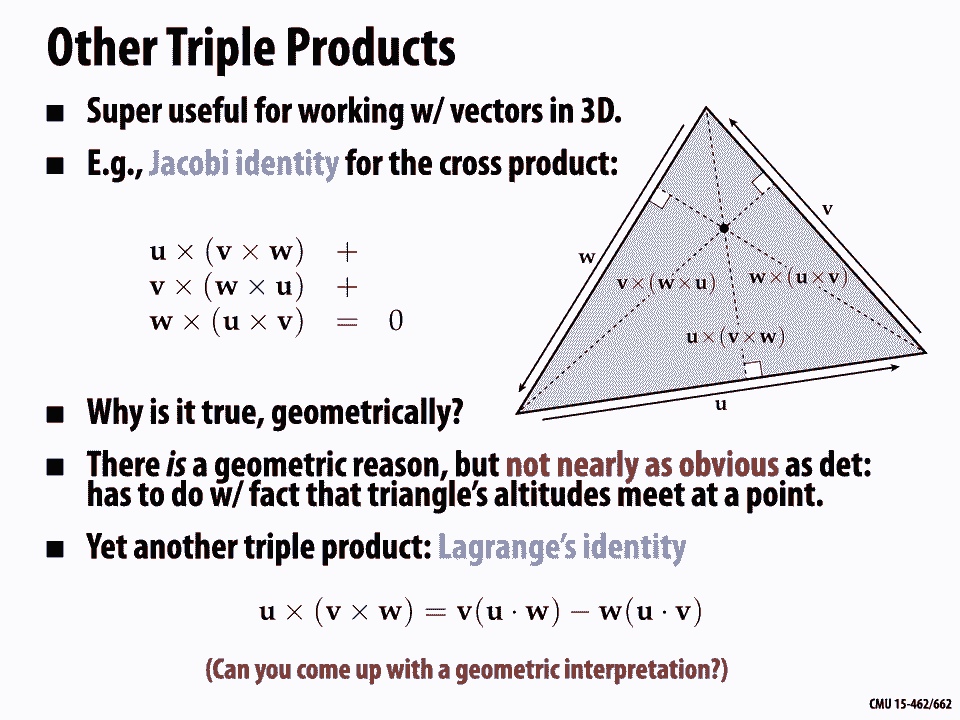
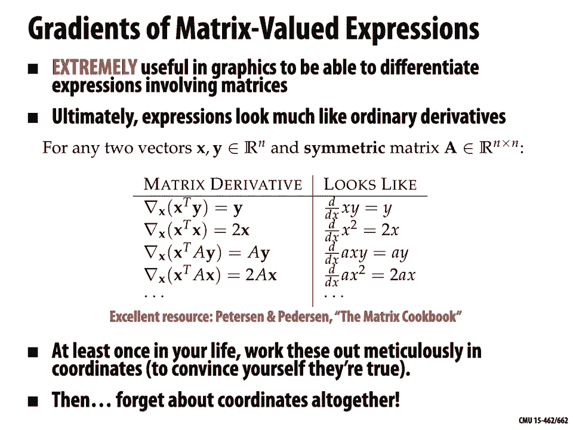
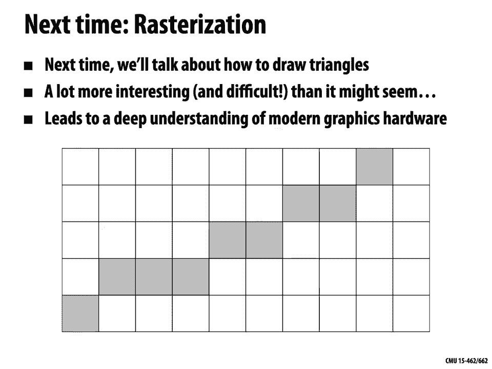

# 【双语字幕+资料下载】CMU 15-462 ｜ 计算机图形学(2020·完整版) - P4：L3- 向量微积分复习 - ShowMeAI - BV1Pf4y1E7GJ

all right，welcome back we are going to continue，today with our review and preview。

of the mathematics that you'll need to。

study computer graphics，last time we touched on a variety of，topics from linear algebra。

many of which hopefully sound familiar，some of which might be new。

we of course don't have time to cover，all of linear algebra in，one lecture but if you feel like you。

still want to brush up or you just，fell in love with the subject and you。

want to learn more there are lots of，fantastic lectures，online i can recommend a few three blue。

one brown has some great lectures on，linear algebra，robert greist has terrific lectures on。

multi-variable calculus which we'll talk，about today，and there are many many others you can，find。

let us know online ones that you like，ones that you think are useful，especially。

ones that seem good for going through，graphics。

so post on piazza or on the website，so today we're going to talk about，vector calculus or。

multi-variable calculus why again we，always want to understand why we're，doing what we're doing。

why is vector calculus important for。

computer graphics，and the basic reason is that it gives us，a language for talking about。

spatial relationships rates of change，transformations and so forth。

and that's useful because much of modern，computer graphics，called，use。

divergence curl laplacian and so forth，things that，hopefully you heard about once or twice。

in your vector calculus class，so this lets us do all sorts of things。

from physically based animation and，geometry processing and image processing。

using the language of rates of change。

we'll also talk about a few more basic，concepts that aren't quite as。

deep as pdes last time we saw that，vector value data is everywhere in，computer graphics。

essentially anytime we're talking about，objects from linear algebra。

we're talking about vector-valued，quantities so if we want to，differentiate or。

optimize those quantities we need a kind，of differential，calculus okay so。

last time when we talked about linear，vectors，in general kind of in the abstract when。

we do multi-variable，calculus it's often useful to think，about these quantities as being really。

concrete geometric quantities right，in，let's say three-dimensional space in the，space we live in。

so for instance let's revisit this idea，of a norm，so last time we developed this notion of。

a norm which measures，total size total length total volume，total intensity。

right if we think about the norm of a，function or a signal，when we're doing geometric calculations。

there's a very natural，choice of norm the norm we most often，care about is the。

so-called euclidean norm and this，norm has a very nice definition that's，very geometric。

it doesn't depend on coordinates we can，say the euclidean，norm is the notion of length。

preserved by rigid motions of space so，rotations，translations and reflections。

and you should think just for a minute，okay is that true for all norms we'll，know there actually。

are things that satisfy all of our，conditions for a norm，but not this one not this additional。

condition，that length is preserved by rigid，motions，that's what makes the euclidean norm，special。

now of course we can write the euclidean，norm，in coordinates in particular if we have。

orthonormal coordinates，then we can write the euclidean norm of，a vector u。

as the square root of the sum of the，squares，of all the components so，maybe this rings a bell in two。

dimensions this is，basically the pythagorean theorem it's，saying。

that the length of the hypotenuse of a，right triangle，is equal to the square root of the sum。

of the squares of the，two other sides right，a little warning whenever we work in。

coordinates we have to be careful，because this expression does not give us，the geometric length。

unless the vector u happens to be，encoded in an orthonormal basis。

okay so we said in general a basis just，has to have，linearly independent vectors it's a。

fairly common bug in computer graphics，code to say，i've written down my vector in some。

non-orthonormal basis，and now i go to apply this formula to，get the length and i get some。

number that's not actually representing。

the geometric length，okay so just to be careful we can also，talk about，of。

natural from a geometric point of view，so remember that in general we said an。

inner product is going to measure some，notion of，alignment but for geometric calculations。

for working with vectors in r3 we want，an inner product that captures something，natural。

about the geometry and so for，n-dimensional vectors，the euclidean inner product can be。

defined as inner product of uv，is equal to the norm of u times the norm，of v。

times the cosine of the angle theta，between the vectors u and v。

okay notice again this is a perfectly，geometric definition it doesn't depend。

at all on a choice of coordinates，just quantities like length and angles。

that have a meaning independent of，coordinates，now we can write this。

euclidean inner product in cartesian，coordinates in orthogonal，coordinates using the so-called dot。

product，so we might distinguish the dot product，from a generic。

inner product by saying that u dot v is，just the，sum of the products of the corresponding，components。

plus，un times vn again we have our warning，as with the euclidean norm this，expression。

this sum of component-wise products has，no geometric meaning，unless the coordinates come from an。

orthonormal basis，and this is something that when you're，working with graphics code and。

especially when you're working with，vectors that represent，functions and other signals you really。

have to get adjusted to you really have，to think，oh you know when i take an inner product。

i have to be careful about，things like a mass matrix i can't just，take the dot product。

there's actually a lot of care and，subtlety that goes into making sure。

you're right using the right inner，product。

at the right time and we'll talk more，about that as the course。

the other natural product we had between，vectors in，r3 is something called the cross product。

so the inner product took two vectors，and produced a scalar，the cross product is going to do。

something a little different it's going，to take two vectors，and produce a vector as output。

and we'll write this as u x v or u cross，v，okay what does this mean geometrically。

if i have my two vectors，u v in three dimensional space，then i can say a few things about the。

cross product i can say that the，magnitude is equal to the area of the。

parallelogram made by the two vectors，and i can say that the direction of the，cross product is。

orthogonal to both vectors，and here i really mean orthogonal with。

respect to the euclidean inner product，with respect to the dot product。

okay again a perfectly good geometric，definition，really interesting question why，sense。

why doesn't it make sense for vectors u，v that are，two dimensional why doesn't it make。

sense for vectors u，well let's look at these two conditions，i mean the first one seems perfectly。

good we could try to define，some notion of product where the。

magnitude is equal to this parallelogram，area，in any dimension but what would it mean。

in four dimensions let's say that the，direction is orthogonal to both vectors。

what would it mean in two dimensions，let's start with a simple case。

i have two vectors u v in the plane and，i'm looking for a vector that's，orthogonal。

well unless those vectors are parallel，there is no vector in 2d，when we go into 4d or any higher。

dimension，we're going to actually have many，different vectors。

that could be orthogonal to both u and v，and have the desired magnitude。

okay so there's something very special，about the relationship between the cross。

product and 3d it's an operation that，conventionally only makes sense in。

three dimensions now a word of warning，sometimes i and other people will use，the cross product in 2d。

to just refer to this signed area of，this parallelogram，so the area of the parallelogram and。

make it positive if it's sort of，pointing out of the plane，and negative if it's pointing into the。

plane，this actually raises another important，question which is，which direction which of the two。

directions is the cross product，pointing in this picture for instance，i've drawn it。

pointing let's say up i could also have，a vector of equal magnitude pointing。

down so how do we figure out the，direction of the cross product。

one way that you might have heard is to，use the so-called right-hand rule and。

there's a lot of different versions of，this so maybe，you might say u is the direction you get。

by sticking out your index finger，then you stick out v with your middle。

finger to make an orthogonal vector，and you stick your thumb up and that's。

your direction of u cross v just gives，you some convention，for which direction this should go but i。

think that this，definition can be really perplexing，once you start doing calculations and。

writing code and，you know how do i stick my hand into the。

code and make sure that i have the right，orientation convention so actually，there's a little bit，way。

to talk about this direction that，doesn't require that you，wiggle your hands around and that's to。

say，that the cross product is the unique，that satisfies this relationship that，says。

the square root of the determinant of，the matrix with columns，u v and u cross v is equal to。

the norm of u times the norm of v times，sine theta okay，such that this determinant is positive。

and i can take this square root，theta here is the angle between u and v，just like in the。

inner product and det is the determinant，of the three column vectors。

this condition it's not too hard to show，uniquely determines a coordinate formula。

for the cross product so again if we're，in an orthonormal basis。

then i can write the cross product this，way by，taking some products and differences of。

the components of the vectors，i find this formula hard to remember。

which components go in which order，so there's a little mnemonic that is，sometimes used。

to write down this expression which is，to，fill out a little by three matrix where。

you put the three basis vectors atop，e1 e2 e3 and then you compute something，that is。

kind of like a determinant no big，surprise given that that's in our，definition。

right so i do e1 times e2 times v3 minus，u3 times v2，which means that that quantity goes in，the。

first coordinate and similarly for the，as i mentioned before there's a useful。

abusive notation we often use in 2d，which is to say，that u cross v is just the third。

entry of this 3d expression，right it's the magnitude of the vector，we'd get。

if we actually took our 2d plane and put，it in 3d，and did this cross product to find the。

magnitude in the z-direction okay，really useful way to understand the，cross product and。

useful way to use it in 3d is，to think of it in terms of a quarter，rotation。

okay so a simple but useful observation，is that a cross product with a unit，normal vector。

n is equivalent to a quarter rotation in，the plane，with normal n right so if i have this。

plane with normal，n and i do n cross u，that's exactly the same as rotating u，around。

by 90 degrees in plane，okay nice little trick slick way to，write certain things in your code。

so then really simple question，what is then n cross n cross，okay hopefully not too hard you see that。

n cross n cross u is another 90 degree，rotation，which means it's a 180 degree rotation。

of the original vector u which means，it's actually equal to，and another interesting question。

let's say now i want to rotate the，vector，by，an angle other than 90 degrees this time，by some angle。

well if you were paying attention in，your trigonometry class，you should be able to look at this。

picture，with an and u and n cross u and figure，out pretty easily。

how to find a point that's rotated by。

theta and i'll let you，think about that and leave it in the，comments，okay all right。

we also talked last time about how，matrices，are very useful maybe not so much for。

understanding things，conceptually but for implementing things，in code。

so let's think about how we can，represent some of these operations。

using matrices it's often convenient for，instance，product，so if i wanted to represent u。

dot v that's no different from saying，and v，as column vectors right。

and so then i have really this long，flat matrix times this tall skinny，matrix。

and if i remember the rules for matrix，vector multiplication。

i find that that's equal to the sum from，i equals 1 up through n of u i。

v i exactly the same as the dot product，about，can i also express some other inner，product as，one。

particular example remember we said，there are lots of different inner。

products they just have to satisfy a，certain set of rules like they have to，be symmetric。

they have to be linear in each argument，and so forth，well here we have an inner product。

inner product of u and v is now 2 times，u 1 v，1 plus u 1 v 2 plus u 2 v 1 plus 3，u 2 v 2。

 can you think about，how you might represent this inner，product using。

matrices it can't just be u transpose v，anymore because that formula doesn't，involve the constants。

2 and 3 for instance so how might you，okay maybe not quite as obvious。

but what i'm going to do is build a，little in this case two by two matrix。

because we're in two dimensions，that has encoded in it all the，constants all the coefficients in my。

expression for the inner product，2 1 1 3 those four terms，and then i'm going to do something that。

looks just like what i did before u，transpose v，but i'm going to stick this matrix a in，the middle。

okay so i'm going to do u transpose a v，if i go ahead and multiply this out okay，let's do a times。

v first and i get u1 u2，times 2v1 plus v2 v1 plus 3v2，okay now i'm back to an ordinary dot，product i。

multiply this through again and i get 2，u1 v1 plus u1 v2 plus u2 v1 plus 3u2 v2。

exactly the inner product that i wanted，okay that's pretty useful question why。

is the matrix that i got，symmetric if i take the matrix a and。

apply its transpose i again get 2 1 1 3，will that be true for any inner product。

why would that be true okay think about，we can also represent the cross product，using a matrix。

so let's say we have a vector u with，components u1 u2 u3，what we're going to do is a little less。

obvious we're going to stick this，in a 3x3 matrix now we're in three。

dimensions instead of two dimensions，okay just a different example and this，matrix。

has an interesting structure it has the，three components，of the vector in it but half of them。

are negated half of them are negated and，you notice that this matrix now。

instead of being symmetric it's，anti-symmetric or skew-symmetric if i，took its transpose。

i would get the same matrix up to a，minus sign，that's kind of interesting okay but what。

does this have to do with a cross，product well let's go ahead，and see what happens if we multiply u。

hat，by some other vector v，v with the three components v1 v2 v3。

okay so did we get this right does this，represent the，cross product well i claim it does and。

if you don't believe me，and you shouldn't believe me then you。

should go ahead and multiply it out and，see if we get the same，coordinate expression as we saw a few。

question if this is a way to represent，the cross product，then how can we represent the sort of。

opposite cross product v，cross u instead of u cross v without，building a new matrix。

okay well i've already kind of given you，the answer it's it's useful to notice，here that。

v cross u is minus u cross v，so the cross product is kind of a。

anti-symmetric operation if i exchange，the order，of the operands i get minus the result。

well i can think about it a couple，different ways i could think about my。

right hand rule if i exchange u and v，what happens to my thumb i could think。

about it in terms of my determinant，definition if i，swap arguments in the determinant what。

happens to the sign，okay and also you notice that the matrix，we use to represent the cross product。

is skew symmetric so if we want to，write v cross u we could either，transpose。

the matrix u hat or we could just，more simply negate the result we could，say v cross u。

how about the determinant the，determinant，is something that gets a fair bit of，discussion in。

vector calculus and linear algebra，do you know what it means geometrically。

well let's start with just the basics，first of all what was the determinant。

how do you compute the determinant of a，okay so if we have a three by three，matrix like this one。

then the answer to how do you compute，the determinant of the matrix is well。

you apply some algorithm somebody told，me once upon a time，right once in a textbook somewhere。

somebody said this is the algorithm so，you just go ahead and do it。

right determinant of a is well first you，look at the upper left。

corner and then you remove that row and，column and then you compute the。

sub-determinant of what remains，which you just do by well recursing，essentially you do e times i。

minus f times h and then you do this，once again for the second entry at the。

top and then you do it again for the，third entry at the top right。

and there you go there's the determinant，it's totally obvious what this means，mean。

this is complete gibberish right we have，a long string of，letters we did some arithmetic，operations。

why did we do this what was the point，how is it useful，okay so hopefully somebody when they。

when they first，introduced you the the determinant gave，you some feeling for why this is a。

useful object but let's，again try to understand this from a，geometric point of view。

so for me i think it's really helpful，to stick with this case so determinant，in in three dimensions。

three by three matrices and realize，that the determinant of three vectors u，v and w。

gives me the volume of，a little parallel pipette a little box。

how do i convince myself that's true why，should you believe that that's true well。

let's do it one step at a time，so let's say that i first take the cross，product of u and v。

we said that by definition the cross，product is the vector whose，area is proportional to the。

parallelogram，made by u and v the bottom of this box，and whose direction is normal to this。

parallelogram so，normal to the bottom of the box so now，if i。

take the dot product of u cross v with w，what am i measuring i'm measuring。

the height of the box times，the area of the base and guess what。

really interesting by the way i could do，this a different way。

i don't have to start with the bottom of，to，measure the volume by first getting the，area。

of the left side let's say so i do v，cross w，and then i take the dot product with u i。

multiply by the width sort of or i could，do it another way i could do。

w cross u dotted with v all three of，these expressions，are just going to give me the volume of。

this parallel pipet，understand，what the determinant means，right i have to think oh why is that the。

because essentially that's what i was，doing i was walking across the top row，and doing a dot product。

with a cross product of the next two，rows right，so now i understand not only what does。

that little formula or，algorithm mean i actually found，that there's this really nice little。

relationship the triple product formula，that lets me exchange，dot products and cross products in a。

systematic way，now you do have to be a little careful，here，right what happens if i just switch the。

order of one of those cross products，u，w u v let's say that in the first，expression i just do。

v cross u then dot w，okay well v cross u is minus u cross v，so if u cross v dot w was the volume of。

the box，v cross u dot w was minus the volume of，the box，and that's why at the top we said really。

the determinant encodes，the signed volume a volume that could be，positive。

or negative depending on which。

orientation we pick for the vectors，okay but this definitely gives us a lot。

more intuition now whenever we want to，talk about，determinants we know that they have。

something to do with，volume so here's a natural question，if i have a matrix a。

okay so i didn't say before where this，matrix comes from but let's say now this，matrix a。

then what does the determinant of a mean，okay so we're putting a lot of pieces，together here。

let's go back and first remember how a，matrix，encodes a linear map what is that what。

does that mean that a matrix，represents a linear map okay so，for example let's say i have a linear。

map f of u that sends any point u，in three dimensional space to a new。

point in three dimensional space，u one times a one plus u two times a two，plus u three times a3。

where a1 a2 a3 are three fixed vectors，in three-dimensional space so i'm taking。

a linear combination of the，a vectors using the components of the u，vector。

how do i encode this operation as a，matrix，we said this in the last lecture but。

let's say it again it's really important，become，the columns of the matrix。

right i put a 1 x a 1 y a 1 z down the，first column and so forth，why is this the right thing to do。

because now a matrix vector multiply，gives me my original map if i do a times，u 1 u 2 u 3。

then well you can work it out however，you like，and the result will be this vector which。

is just what we wanted u1 a1 plus u2 a2，plus u3 a3 so i can think of matrix，vector multiplication。

again as taking linear combinations of，the columns，using the components of the vector i'm。

multiplying by，as the coefficients this is generally a，really good way to think about matrix。

vector multiplication it's a really good，mental picture to think about it as。

the picture you see in the upper right，okay so let's go back to this question。

about the determinant of a linear map，so if a matrix a encodes a linear map f。

what does the determinant of that matrix，well here's the way i like to think。

about it i'm going to imagine that i，have，a little cube of material，that has length one on。

each side a little sugar cube with a，corner at the origin，okay and the edges go along the three。

basis directions e1 e2 e3，when i apply a linear map to this cube。

to the edges of my cube i'm going to get，a parallel pipette with edges f of e1。

so because the determinant of the matrix，gives us the volume of the parallel，pipette。

the determinant of the linear map is，telling us，the change in volume we had something，that had。

unit volume one times one times one，and we got something that has some other，volume。

okay so determinant is always telling，you about the，other question what is the sign of the。

determinant tell us，we said that the determinant is really，the。

well it's basically telling us whether，the orientation was reversed。

so i could map this cube forward into，this parallelogram，and then reflect it in a mirror。

and the mirror image would have the same，volume but it would have the opposite。

by the way do we really need to talk，about matrices in order to talk about。

determinants of linear maps，not really we don't really need to talk，about matrices or coordinates or。

anything else，determinants are a completely geometric，concept。

that we can apply without thinking about，okay our other nice discovery when。

thinking about determinants，geometrically were these nice triple，product formulas。

that related cross products and dot，products in interesting ways。

these kinds of formulas are super useful，for working with and simplifying，expressions。

involving vectors in 3d and，there are more of them so for instance，there's something called the。

jacobi identity which just involves the，cross product，and that says something similar but。

different it says that u，cross v cross w plus v cross，w cross u plus w cross。

u cross v is equal to zero，actually i think this one is really not，quite as obvious。

there is a geometric reason for this，but it's far more complicated it has to。

do with the fact that the，altitudes of a triangle meet at a common。

yet another triple product is something，that，u cross v cross w is equal to，v times u dot w minus w。

times u dot v meaning，you take the dot product and then you，just use that scalar to multiply。

the vector okay，can you come up with a geometric，interpretation of this。

identity i have to imagine that you can，i don't know what it is so i'd be very。

interested if anybody can draw a picture，that explains。

okay let's move on to a new topic beyond，these basic vector operations。

which is differential operators，differential operators，are basically derivatives that act on。

vector fields，let's pause for at least a moment and，ask why is this useful for computer，graphics。

and one reason is that many physical and，geometric problems，are naturally expressed in terms of。

relative rates of change，in terms of ordinary differential，equations odes。

or partial differential equations pdes，these tools differential operators。

also provide the foundations for，numerical，optimization so something that shows up，a lot。

in computer graphics is that you want to，find the best solution you want to，minimize。

cost by for instance following the，gradient of some。

objective or energy function，okay so let's think a little bit about，derivatives。

if we want to understand differential，operators it's really useful to have a。

lot of different mental perspectives on，what does a derivative mean let's start，with the most。

basic example we have a function on the，real line，f from r to r what does the derivative。

perhaps the most basic definition one，that you might have learned first is。

that it gives the slope it gives the，rise over run，of the function for a short distance。

and this really does lead to our formal，definition of the derivative。

which says we look at how much the，function is changing，over a little distance epsilon so we。

start at some point x naught，move over to x naught plus epsilon，evaluate the function。

take the difference from the function，value at x naught，divide by epsilon and then take the，limit as。

epsilon goes to 0。this is a basic definition it's also a，really good one to remember。

whenever you encounter in life something，that you don't know how to differentiate。

funnily enough coming back to this very，very basic definition。

often saves you often tells you exactly，what to do，okay now we do have to be a little，careful。

in talking about the derivative because，some funny things can happen for，instance。

what if the slope of our function is，different，when we walk in the opposite direction，when we go。

in the direction minus epsilon instead，of plus epsilon，right so we can have a situation like。

this where the quantity，expressed by this limit is well defined，for epsilon coming from the positive。

side，it's well defined for epsilon coming，from the，negative side but those two values don't，agree。

and so in this case we say the function，is not differentiable，if，f plus is the same as f minus。

now i will say that thinking about，derivatives is，often a useful mental model for a lot of。

the things going on in graphics but you，should be aware that a lot of the，interesting。

problems we want to solve and functions，we want to deal with，are very non-differentiable in。

interesting ways and，as you develop more sophisticated，algorithms you really have to think。

carefully about how to deal with this，non-differentiability，another important view of the derivative。

is that it's sort of the best linear，approximation of the function。

so you might remember that a smooth，function f of x，can be expressed as a taylor series so。

let's say i have this nice smooth，function，f here then at a point x。

naught i can approximate the function，well，the absolute simplest way i could。

approximate the function，i could just pretend that the function，at，x naught is the value it takes。

everywhere，okay not the best approximation in the，world but it'll work over a。

short distance from x naught if i want，to do a little better，i can look at the slope of the function。

the derivative f prime at x naught，and i can say i move up and down，according to the slope，naught。

right so i add this linear term to my，taylor series approximation f prime at x，naught times。

okay i've done constant i've done linear，what can i do next，well just keep going up in degree i do a。

quadratic term so i say what is the，parabola，that's the best fit at this point i get。

that from the second derivative，i add a term x minus x naught squared。

over 2 factorial times the second，derivative，and i can keep going to get better and。

better approximations at least，in this local neighborhood in general。

replacing complicated functions with a，linear or sometimes quadratic，approximation。

is a powerful trick that we'll see over，and over again。

in graphics algorithms because it makes，computation，easier this idea of a best linear。

approximation also helps get our heads，around what the derivative of a，multivariable function is。

right so if i look at this function，plotted over，the plane r2 i can again sort of think。

that at a point，the derivative is roughly speaking the。

best approximation of the function by，a plane okay so how do we think a little。

more precisely about derivatives，for a function that has multiple，variables。

and here there's a lot of language to，digest once you get into multi-variable，functions。

there are lots of different notions of，derivatives and it can take a while。

to get a feel for okay which derivative，means what and，should be used in what scenario so。

perhaps the most basic starting point is，to think about the directional，derivative。

because we'll be able to easily connect，it to the usual one-dimensional，derivative。

so let's imagine that we add just one，additional，parameter to our function so f is now a。

function not just of，this，as a function that i plot over the plane。

i have sort of a height value over every，point of the plane，how do i define the directional。

derivative well i can take a slice，through the function along some line in，the plane。

okay so at a point x naught i pick a，direction u，i consider the plane containing。

direction u and the vertical direction，i slice through the graph of the，function。

and what do i get well i get this curve，this black curve，that curve looks just like the curve。

that we've been looking at for defining，the one-dimensional derivative。

and so the directional derivative along，the direction，u of the function f is just。

the usual derivative d sub u of，f at x naught is hey we can use our。

limit formula again the limit as epsilon，goes to zero，of f of x naught plus epsilon u minus f。

of x naught divided by epsilon，so we just want to take a little step，along u。

in the u direction subtract，the value of f at the original point。

and see how quickly we're changing the，thing that makes this，directional derivative interesting is。

that we can take the derivative in，any direction so i could pick some other，direction。

v in the plane i could go through the，same，process to get the directional，derivative。

in the direction v of f，function，needing to be differentiable okay。

so at this point it sounds like we have，quite a lot of information we kind of，need to know about。

the change in the function f along all，possible directions，u but actually we can distill this down。

into some basic information that，captures，everything about how the function is，changing。

and that's what's given to us by the，gradient，before getting into the details the。

gradient is basically something that，tells us，the directional derivative in all，possible directions。

if we use it the right way okay so，another intuitive way of looking at the。

gradient is to say if we have a，multi-variable function，f of x and now i've switched to saying。

that bold x is a collection of，coordinates right it's a point in。

rn well then the gradient grad f of x，assigns a vector to each point so if，this is my。

multivariable function f of bold x，then at each point i can think of the。

gradient as a vector that looks like，this，and just by looking at this picture you。

get the sense that the gradient kind of，points in the direction。

of quickest increase if we think of the，dark blue colors as being small values，in the function。

and the light blue or white colors being，large values in the function。

then the arrows are kind of pointing，uphill，and that's a really important。

interpretation of the gradient by the，way just as a piece of。

language this symbol that we use for the，gradient is，not really called grad it's it's。

actually got its own name it's called，nabla so you might say the gradient，nabla。

f of x assigns a vector at each point，okay so that's a nice intuitive picture，but which。

vectors exactly are，giving us the gradient well，one way we can think about this is to。

write it out in coordinates the most，familiar definition，of the gradient perhaps is to just list。

out all the partial derivatives，okay so we can imagine that all but one，of the。

coordinates of our function are held，constant then we have an ordinary，function of one variable。

we can take the derivative with respect，to that variable，and that gives us the entries of the。

gradient，i think a lot simpler way to think about，this is hey we already understand the。

directional derivative，right the directional derivative gives，us the one。

dimensional derivative in some direction，so what is the gradient。

it's just the list of the directional，derivatives，along all the coordinate axes x1，x2 x3 and so on。

okay so this is a pretty good definition，of the gradient，there are。

two problems with always thinking about，the gradient this way，one is that it ignores the。

very important role of the inner product，on the definition of the gradient and，we'll talk about this。

a bit more later the other thing that's，annoying about thinking about the，gradient this way is it it。

only works for vectors in rn for finite，dimensional vectors，before we said we want to think about。

little arrows vectors in rn but we also，want to think about，vectors that are functions that are。

signals that are continuous，okay so if i think about a continuous，function。

what does it now mean to take the，directional derivative，along all possible directions what are，all。

directions in which i can change a，function，it gets pretty complicated so we're。

going to want a richer，picture a better definition of the，gradient but this is a good one for。

functions of n variables okay，very common way to calculate the。

gradient，to make this a little more concrete，let's just do a little example let's say。

we have a very simple function，f of bold x is equal to x1 squared plus，x2 squared。

right so we get this kind of bowl shaped，function，what is the partial derivative of f。

along the x1 direction，well again the idea is that we hold x2，fixed we imagine that it's just a。

constant and we differentiate，f with respect to x1 so since，x2 is constant that term drops away and。

we're left with，2x1 plus 0 or just 2x1，similarly the derivative of f in the x2，direction is。

2x2 okay hopefully not too hard，and so we combine these to get our，gradient grad。

f of x is equal to 2x1 2x2 which we，could also just write as 2。

times bold x okay，another way to think about the gradient，is to go back to this picture of。

the best linear approximation so，some，point x naught and say we'd like a。

reasonable approximation of the function，near this point，the simplest approximation would be to。

say i'm going to pretend that the，function is，constant everywhere and is equal to the，value f of x。

naught a slightly better approximation，would be to say，well let's look at kind of the slope of。

the function，and change our estimate for what the，function looks like based on how far。

we've gone away from the center point x，naught，in the multi-dimensional case we can。

write this as f of x，is approximately f of x naught plus，at x，naught with the vector x minus x。

naught okay let's think a little bit，about why，this makes sense so starting at x naught。

we can see pretty easily that this term，gets，bigger if we move in the direction of，the gradient。

right let's say that x minus x naught is，equal to grad f，so we're moving uphill as quickly as。

possible，well then because this is an inner，product we know，grad f inner product grad f is greater。

than zero，greater than or equal to zero okay so，we're getting bigger if we move in the。

gradient direction，we're getting smaller if we move in the，opposite direction in the direction。

minus nabla f，move，orthogonal to the gradient，so if we just move back and forth along。

the mountain side but don't actually go。

uphill or downhill，okay and this is really an important，perspective to think of the gradient as。

taking us uphill so this is，our third important picture of the，gradient is that it's giving us the。

direction of，steepest ascent meaning，if we're standing at some point on the，map。

what direction should we travel to，increase our altitude or increase the。

value of our function as quickly as，possible，this viewpoint leads directly to。

algorithms for optimization that are，commonly used in graphics。

so we want to maximize or minimize some，function，do we do，we start at some initial guess x naught。

we evaluate the gradient at that point，we take a little step in the gradient，direction。

and repeat evaluate the gradient again。

take a step again，and so forth okay，let's come back now to the relationship。

between the gradient and the directional，derivative，at the beginning i promised that the。

gradient would provide，the directional derivative in all，keep track。

of all this information about how the，function is changing along，every possible direction so。

how can we how can we really make that，precise，well we can actually define，say that。

at each point x the gradient is the，unique vector nabla，f of x such that。

the inner product of nabla f with u，of，f along the direction u for，all u okay。

in other words if we know the gradient，and we want to know the change in some。

direction u we just take，the inner product with the gradient，that's it。

so the gradient contains all the，information we need to know about how，the function is changing。

as long as the function is，differentiable，so as in one dimension this。

isn't going to work out if the function，is changing at different rates。

in opposite directions right so for，instance with this function this is a，function where。

there are points that are not，differentiable where the gradient does，not have。

a definition that works out this way so，the the top of this，little pyramid for instance i have many。

different possible linear approximations，of the function，that work well for sort of different。

sides of this，pyramid you might also notice at this，moment that the。

definition of the gradient really seems，to depend on，the choice of inner product。

isn't that interesting but that's a。

point we'll come back to a little later，right now i want to look at another，of。

a multivariable function but we're going，to do this in a slightly different way。

okay so let's consider the function f，which is equal to the dot product of two，vectors u and v。

here expressed using matrices，what is the gradient of f with respect，to u，is。

extremely common in graphics that you，have some function expressed in terms of，matrix operations。

and you want to differentiate that，function with respect to one of the。

well one thing we could do if we're not，comfortable，taking derivatives involving matrix，expressions。

is to just go back and write everything，out in ordinary coordinates so i could，say。

u transpose v is equal to the sum from i，equals 1，through n of u i v i okay then to get，the gradient。

what do i do i take all the partial，derivatives and，since the derivative of a sum is equal。

to the sum of the derivatives i can pull，the derivative inside。

and i notice that well the derivative of，u i v i with respect to uk is going to，be 0 unless，same。

then the result is just v k okay，so if i imagine doing that for each of，the uk。

i find that the gradient is，nabla f equals v1 through vn so the，gradient with respect to u。

is just the list of all the v components，but at this point i think oh that's。

interesting i could have written that，a lot more simply i could have just，written。

the gradient of u transpose v，with respect to u is equal to，that's nice because it's not so。

different from，how i ordinarily differentiate，scalar functions right if i had asked，you。

to just differentiate x y with respect，to x you would have immediately told me。

the answer is y very simple，okay and so this is a really really。

useful skill to be able to differentiate，expressions involving matrices in the。

end a lot of the expressions you get are，going to look，just like ordinary derivatives so。

for instance if i have two vectors x and，y in rn，and i have a symmetric matrix a。

then the derivative of x transpose y，with respect to x，is equal to y as we've just seen and。

that looks like，the derivative of x y with respect to x，is equal to y。

if i have the gradient of x transpose，x with respect to x i get 2x well that's，not so different from。

the derivative of x squared with respect，to x is equal to 2x and so on。

and by the way you shouldn't just，believe me you shouldn't just take this，on faith。

it's very worthwhile to at least once in，your life sit down，and work out these derivatives you could。

go back to components，you could write everything out in，partial derivatives and you will find。

that these simple expressions can be，used to differentiate，in terms of matrices beyond this little。

list here there's an excellent resource，the matrix cookbook，that gives all sorts of nice matrix。

derivatives but definitely at least once，in your life，you should go through the trouble of，that。

that they're really true and then once，you've done that you should。

forget about coordinates forever you，should never never write your matrices。

out in coordinates again it's a huge，okay hopefully what you're getting a，to。

differentiate ordinary functions，differentiating more complicated objects。

actually doesn't look so different，there's a lot of，similar patterns that emerge there's a。

lot of similar mechanics that you go，through，and of course you still have to be。

careful but you shouldn't be，intimidated by trying to take，derivatives of richer more interesting。

objects，like signals and functions like the，kinds of things。

that are going to show up in graphics so，let's actually take a look at a really。

really interesting example，let's try taking the gradient of a，function，of another function。

what does that mean so you could imagine，for instance，that little f is a function on the real，line。

like sine or cosine or whatever you like，and big f is a function that。

takes any function little f and assigns，it a score or a value，okay and we want to know what is the。

gradient，of big f with respect to little f，what is the change i should make in the，function little f。

to increase the value of big f as，quickly as possible，this is a perfectly meaningful question。

it's one that comes up in，optimization problems all the time but。

our standard tools aren't going to work，anymore we can't just take partial，derivatives because。

we don't have a finite list of，coordinates to work with anymore。

when we were looking at vectors in rn，these little arrows we just had a list，of coordinates。

and we could take partial derivatives of，each of those，what do we do in this case well what we。

can do，is go back to this other definition of，the gradient，that says the gradient nabla f。

is the unique function such that if i，take the inner product，with u i get the directional derivative。

of f along u okay，we still have to answer another question，which is。

what is the directional derivative of a，function of a function，but，don't freak out as i said before。

whenever you encounter a tricky looking，derivative，a good strategy is to just go back to。

the good old-fashioned，definition of the derivative in terms of，limits。

okay we changed the types of the objects，here a little bit but otherwise it looks。

pretty much the same so we're going to，say，the directional derivative of big f。

along the direction u at the point，little f，is equal to the limit as epsilon goes to，zero of，big f。

of little f divided by epsilon，okay so those are all the tools you need。

that's really all you need to know but，this whole strategy is going to become a。

lot clearer if we have a concrete。

example，so let's first try to reason about，what's going on here。

visually try to get some intuition for，what we mean，by this derivative so let's。

consider a concrete function big f of，little f，which is equal to the l2 inner product。

of little f and little g，for functions little f and little g on，so you can imagine for instance that。

little f is this，squiggly blue function and little g is，this bumpy orange function。

and their l2 inner product is measuring，again how，well these two functions line up it's，the integral。

over the unit interval of their product，okay it's important to pause here for a，moment and realize。

this is not so different from the，example we saw just a few slides ago，where we were considering。

x transpose y and taking the gradient，with respect to x，okay and there we found the gradient was。

equal to，y it was pretty simple so likewise，this time i'm going to claim the，gradient of big f。

is just little g right，if we take the gradient of big f with，respect to little f。

the little f falls away and we're left，with just little g，that's a reasonable hypothesis doesn't。

make sense，intuitively so if we look at this，picture，and think about what we're measuring，with g。

as quickly as possible what change，should we make to the function little f，so that it。

well okay now we really draw on our，intuition，about the inner product from thinking。

about little arrows，right the inner product measures how，well two little arrows are aligned or。

how well two，functions are aligned，so what is the function that is best。

well it's just little g just like the，vector the arrow aligned with a little。

arrow is that arrow itself，so the quickest way to increase the，inner product of。

little f with little g is to just，right，good question i think about can you work。

this solution out formally，i bet you can i bet if you go ahead and，plug in。

the definition of the gradient and the，definition of the directional derivative。

you will very quickly see that this，really is。

the gradient of the function capital f，okay to see how this works out let's，consider a。

similar example i have a different，function big f，of little f which is just the square of。

the l2 norm of little f，how do we figure out the gradient well，at each。

point f naught and for each argument f，naught we want，the function nabla capital f。

such that for all functions u the l two，inner product，of nabla f with u is equal to the。

directional derivative，it's equal to the limit as epsilon goes，to zero of。

moving f naught a little bit in the，direction u，adding a little bit of the function u to，f naught。

applying capital f subtracting，the original value at f naught and。

okay if we take the first term in the，numerator and just plug in the，definition of。

the function big f then we get，the l2 norm of f naught plus epsilon u，squared is equal to。

the l2 norm of f naught squared plus，epsilon squared times the l2 norm of u。

squared plus 2 epsilon times the l2，if we now do the same thing for the。

second term in the denominator take the，difference divide by epsilon。

our limit starts looking like this so，now we're saying，the directional derivative looks like。

the limit as epsilon goes to 0，of epsilon times the squared l2 norm of，u。

plus 2 times the l2 inner product of f，naught with u，and think about this what happens as，term。

vanishes the second term remains and we，just get two，times the l2 inner product of f naught，and u。

okay so that gives us the right side of，our gradient equation。

and then we look at it again and we say，okay well then the only solution to this，equation。

the only way for this to hold for all，functions u，is if nabla f，is equal to 2 little f。

ok does that sound complicated did you，did you lose me here，well even if you didn't catch every。

little calculation what you notice at，the end，is that the way we differentiate。

functions of functions，really doesn't look different at all，from the way we just。

differentiate ordinary variables，the derivative of x squared with respect。

to x is 2x the derivative of，norm of f squared with respect to f is，just 2f。

i won't promise it's always this easy in，fact，this is the whole subject of functional，analysis。

and variational calculus，sometimes it gets hairy but the basic，concepts。

are there the basic concepts and。

starting points are the same，and this is really the key idea that。

once you get the hang of taking the，gradient of ordinary functions。

it's often superficially not much harder，to work with more exotic objects。

like matrices and functions of functions，and so forth，and so often when you're thinking about。

graphics algorithms when you're trying，to come up with interesting new graphics，algorithms。

you use these simpler analogies to get a，sense of what's going on with these more。

complicated objects，and that can be very very powerful in，fact that's。

something we will do as we work our way，through this course，okay so let's talk about another。

kind of object that's central to，multi-variable calculus which is。

vector fields so the gradient or the，gradient，field if you like was our first example。

of a vector field，it assigned a vector to each point，of，a vector field on the plane as a map。

from r2 to r2 for each point，in r2 we get a vector in r2，for example we saw the gradient field。

nabla f of x y is equal to，equal to，question calculus is all about rates of，change。

how do we measure change in a vector，field，do you remember from your multi-variable，class what。

the notion of a derivative of a vector，well actually there are multiple answers。

there are two basic derivatives for，vector fields，so let's say we have this vector field x。

then one notion of derivative is the，divergence，okay and i've drawn here in dark blue。

values that are，very negative i've drawn in white values，that are very positive。

what does the divergence measure about a，vector field，it's very important to understand these。

things intuitively before getting to the，so the divergence measures basically how，much the field is。

like a，sink or a source where water is flowing，out or flowing in，if the magnitude is very large that。

means there's，a lot going on there's a lot of，shrinking or expanding and the sign。

tells us well which of the two things is，it doing is it shrinking or is it。

expanding okay another thing we could do，is if we have a vector field y。

like this one we could measure its，change by looking at，the curl a different quantity。

and what do you notice here what is the，intuitive description of what the curl，is measuring。

again bright white values are large，positive values，dark blue values are large negative，values。

so what is the curl measuring about this，well hopefully it's not too hard to see。

that it's kind of measuring，how much this field is spinning we kind。

of have a vortex in the upper left，and we have a vortex in the bottom right。

those are two quickly spinning parts of，the field，but there's a difference in the upper。

left it's spinning counterclockwise，in the bottom right it's spinning。

clockwise so that's why we have the two，different signs okay，so divergence measures not surprisingly。

measures，not surprisingly how curly is it，a little more precisely we。

often write the divergence as nabla。x，and this notation suggests kind of。

reminds us what the definition of，the divergence might be，so if we think of nabla as。

the vector of partial derivatives kind，of informally，right it's just a list of partial，coordinate。

directions and we think of，x as being a vector of scalar functions，meaning。

it just has each component of the vector，at each point，then what does nabla dot x look like，well we。

sum over all the coordinates，each partial derivative being applied to，each coordinate function。

we take the derivative of the first，coordinate function along the first，direction。

add that to the derivative of the second，coordinate function along the second，direction。

and so on concrete example，consider the vector field x of uv is，equal to，cosine u sine v。

okay i've plotted it in the bottom left，the divergence of this field is then。

well let's just work it out，nabla dot x is partial derivative，with respect to u of cosu plus partial。

derivative with respect to v，do you remember how to evaluate this。

okay hopefully you remember that the，derivative of cosine，is minus sine the derivative of sine is。

cosine，so we get minus sine u plus cosine v，now a really important question what，kind of quantity。

is this at every point，we started out with a vector field x we，took its divergence。

well sine of u is a scalar value at，of v，is also a scalar value at every point。

it's a scalar function，so we have the sum of two scalar，functions we get a scalar function and。

that's what i've plotted，in the bottom right that's the，divergence of this vector field。

x and you can see again that where it's，spreading out it has，large positive values where it's。

converging in it has。

large negative values the dark blue，values okay，how about curl well we can。

write curl also with nabla we can write，it as nabla cross，x with a cross product and this again。

suggests a coordinate definition for，curl this time，we'll think of nabla as a vector of just。

three derivatives we'll just stick to，three dimensions because。

that's where the cross product is most，naturally defined，and we'll think of the vector field x as。

three coordinate functions the three，components，of the vector at each point in space，okay。

so then the curl is well now we just，have to go and remember，what was the coordinate expression for。

the cross product，okay it's really not so bad there it is，so that's the curl maybe to get a little。

intuition let's just consider the，2d curl where we said you know how do we。

think about a cross product in 2d，well we imagine we have vectors in plane。

the cross product gives us a vector，sticking out of the plane。

so we just pull this last component out，of the expression，nabla cross x the curl of x。

is equal to the partial derivative of，the second coordinate function。

along the first coordinate direction，minus the partial derivative of the，first coordinate function。

along the second coordinate direction，interesting okay so，in particular let's consider the example。

x of uv is，minus sine v cosine u i've plotted it in，the bottom r，bottom left these swirling vertices。

the 2d curl is then what now let's just，apply that little formula。

nabla cross x is the partial derivative，of cosine u along the u direction minus。

the partial derivative of minus sine v，along the v，direction can you work that out。

okay just like we did before derivative，of cosine is minus sign derivative of，sine is。

cosine and we get minus sine u plus，cosine v，and i've plotted this result to curl。

whoa do you notice anything about the，relationship between。

hopefully you do right hopefully，what you are kind of picking up on is，that the divergence of。

x is the same as the curl，of the 90 degree rotation of x，meaning if i have this vector field x。

and i take each little arrow and i，rotate it by 90 degrees at each point i，get。

a vector field like this so where before，i had，sources and sinks now i have spinning，and in fact the。

curl of this rotated field is no，different from the，okay so hopefully this gives you a。

little bit of intuition about the，relationship between curl and divergence。

and the fact that they're not，really completely different concepts。

they're kind of complementary concepts，also in graphics if you start playing。

these kinds of games with vector fields，of saying oh i can kind of。

decompose it and write it in terms of，curl and divergence and so forth。

you start to build really nice，algorithms for fluid simulation for，understanding。

the different components of how fluid，moves around，in a volume and how to efficiently。

question can you come up with an，analogous relationship between。

curl and divergence in three dimensions，what do you think right what kinds of，quantities。

are you working with what happens when，you apply，curl and divergence do you have an。

analogous relationship，let me know in the comments okay so just，to keep us。

hooked into computer graphics a little，bit here's a really cool example of a，computer。

graphics paper and the idea is that by，just changing which variables we're，solving for。

by transforming things using curl and，divergence，we get completely different results so，in one case。

you might use the fluid velocity u，in the other case you use the so-called，stream function。

psi and you can see that just this，mathematically，fairly simple change really changes the。

behavior of the，simulation so on the right，you don't get very realistic motion it。

doesn't really look like the fluid is，interacting with the air，on the left you get this beautiful。

interaction of the fluid mixing with the，air and creating bubbles and so forth。

i won't try to explain how this all，works but you should go check out this。

paper if you're interested，okay so there's one more extremely，important operator from multivariable。

calculus that we haven't talked about。

yet and that's the laplacian，this is unbelievably important for，graphics it shows up across。

geometry across rendering simulation，imaging everywhere，why is the laplacian so important。

well for one thing it really provides，the starting point for talking about the。

fourier transform we talked a little bit，in our last lecture about decomposing，functions。

into constituent frequencies and the，laplacian and its generalizations are。

going to allow us to do this kind of，frequency domain signal processing in。

all sorts of different contexts in。

images in geometry and so forth，it's also the basic starting point for。

modeling all sorts of physical processes，like the fluid simulation we saw in the，previous slide。

so it lets us talk about heat flow it，lets us talk about，waves propagating through medium and so。

forth，and it encodes all sorts of rich，information about the geometry。

so just by inspecting the laplace，operator or its generalization called。

the laplace beltrami operator，we learn all sorts of things about shape。

we can use this for searching for shapes，and databases，and all sorts of cool stuff what does。

the laplacian mean，i think this is something that takes a，little time to get your head around。

after you've been working with it for a，while，it's the most obvious thing in the world，but at first。

what is it all about okay well let's go，back to one dimension and think about an，ordinary function。

f of x and ask about its，second derivative right so we have this，nice oscillating function。

f of x what would you，know if i told you that a point of a，function。

had a second derivative that was less，than zero that was negative。

what does it mean to have a negative，maybe the way you talked about this in。

your calculus class is you said well，then the function，is concave down。

and if the second derivative is positive，well the opposite thing happens it's。

likewise for a multi-variable function，the laplacian gives some notion of the。

curvature of the function，loosely speaking is the function concave，down or concave up so here。

we see a function of two variables at，the top of the peak the laplacian is，negative。

at the bottom of the valley the，laplacian is positive，by the way if you're interested in。

really deeply understanding the，laplacian，i have a whole lecture that talks about。

many different perspectives，on the laplacians starting from the。

basics which you can find at the link，here，okay so the laplacian does have many。

different definitions many different，ways to understand it，one thing we can say about the laplacian。

is that it，takes a scalar function as input and，produces a scalar function。

as output and this is a linear，operation if i take the laplacian of the，sum of two functions。

i get the sum of the laplacians of the，two functions，if i scale a function by a constant and，as。

taking the laplacian and then scaling，the result by the same constant。

it's usually or at least in our class is，going to be denoted by，the greek capital delta。

some people also like to write the，laplacian using，nabla squared but we're going to reserve。

this symbol for another operator called，the hessian，so there are lots of different starting。

points for the laplacian we can write it，using，the operators we just talked about。

divergence and gradient so laplacian of，f，is the divergence of the gradient of f。

we can also write it as the sum of the，second partial derivatives so。

the laplacian of a function f on rn，is the sum from i equals 1 up through n，of the。

second derivative of f along the，i-coordinate direction，we can write the laplacian as the。

gradient of dirschlay energy so this is，an example of a，function of a function and taking the。

gradient as we did earlier，so we can say the laplacian of f is，equal to。

minus the gradient with respect to f，of the function one half norm。

gradient squared where this norm is the，l2 norm，so this is a function that measures the。

overall smoothness of a function，and we're saying how do we change the，function to make it。

smoother or less smooth as quickly as，possible，okay and we can also understand the，laplacian by。

analogy i think it's really useful to，think about laplacian in terms of。

a laplacian on a grid or on a graph，here it becomes really apparent that the。

laplacian is measuring the deviation，from an average value，so if i'm on a regular grid what does。

the laplacian look like，it looks like i sum up my four，neighboring values。

and i subtract four times the value of，the center，or if i divide that all through by 4。

that's like saying，i take the average of my neighbors and i，subtract my value。

you can also come up with formulas like，this on let's say triangle meshes。

but they get a little more complicated，and on and on we can connect the。

laplacian to other ideas for instance in，geometry talking about。

the quickest way to minimize the area of，a surface，okay so let's give the most basic。

definition which is just to write the，laplacian in coordinates。

the laplacian of f is the sum of all the，second partial derivatives of the，function。

concrete example let's consider a，function f of x1 and x2，which is equal to cosine of 3x1 plus。

sine of 3x2，i've plotted it on the right okay，so let's go ahead and evaluate this we。

have the second partial derivative of f，with respect to x1 is well we hold x2。

fixed and we take two derivatives，so here i've just plugged in the，definition of f。

okay and i notice that the second term，vanishes because it doesn't depend on x1，at all。

the first derivative of cosine 3x1 is，minus 3 sine 3x1 if i take the second，derivative i get。

minus 9 cosine 3x1，and similarly the second derivative of，f along the second coordinate direction。

is minus nine，times sine of three x，two okay not supposed to be anything。

really interesting about this example，we're just working through an example to。

see how you might evaluate the laplacian，okay so in the end we get that the，laplacian of f。

is equal to minus 9 times cosine 3x1，plus sine，of 3x2 and i've plotted it in the bottom。

and what you notice here，is well first of all we started with a。

scalar function we got a scalar function，okay that makes sense，kind of。

negatively curved in the original，function become positively curved in the。

so in fact the new function is just，minus nine，times the original function。

that's interesting does that always，happen，is it always true that the laplacian of。

a function is just a constant。

okay let me know in the comments so our，final differential operator for the day，is the hessian。

the hessian contains all the information，about the，second derivatives of a function and。

it's going to，help us approximate complicated，functions by a few。

simple terms by the way the hessian is，also，for this reason a key component in。

optimization algorithms，if you want to develop and think about，really。

fast the hessian is going to play a，important role，okay so to get our head around this。

let's think again about our taylor，series，which for a one-dimensional function we，said。

we could start building by considering，the constant，approximation by then considering the。

best linear approximation，by then considering the best quadratic，approximation by the。

the parabola that that best approximates，our function and so on how do we build。

up the same kind of approximation for，multi-variable functions。

well we already talked about doing the，best linear approximation using the，gradient。

right we said the function at a point x，naught，can be approximated in a local，neighborhood by。

f of x naught the constant value plus，the inner product of，the gradient of f with x minus x naught。

the hessian is going to give us the next，term it's going to give us the quadratic，part。

and that's also a reasonable way to just，think about the hessian if somebody's。

talking about the hessian what does it，mean oh it's kind of the best quadratic。

approximation in a local。

hessian，more explicitly well first of all we're，going to use the symbol。

nabla squared to denote the hessian，and just like we thought of the gradient，as。

the thing that gives us partial，derivatives of the function，the hessian is the thing that's going to。

give us partial derivatives，of the gradient so more precisely，what i mean by that is if i take the。

hessian of the function f，and apply it to the vector or direction。

u then i get the directional derivative，of the gradient in the direction u。

okay if we have a function f，from r n to r a function of n variables。

then we can be more explicit and just，write it as a matrix，the hessian nabla squared f is equal to。

a matrix where each entry is the partial，derivative，of f along two coordinate directions one。

corresponding to the row，and the other corresponding to the，by the way an important thing about the。

hessian useful fact，is the hessian is always symmetric，if i take the transpose of this matrix i。

get the same matrix，why why is that true，good little thing to remember about。

multi-variable calculus，if you don't know the answer immediately。

okay so using the hessian we can now，any，smooth multivariable function f of x，around some point x。

naught in particular we'll say that f，x is equal to f at，x naught the constant value plus the。

gradient of f，at x naught inner product with the，displacement vector x minus。

x naught plus the hessian applied to，this displacement inner product with the。

displacement divided by，2。 so what we've done is taken our，constant and linear part which give our。

kind of best fit plane，and augmented it with this quadratic，term which looks like a。

bowl or maybe like a saddle we can write，this more simply by collecting the。

coefficients so we have a constant c a，vector b，and a matrix a and we can then write our。

taylor approximation in matrix form as，f of u where u is equal to this，displacement vector。

is approximately one half u transpose a，u，plus b transpose u plus c。

okay and later on we're going to see how，this，expansion is very useful for，optimization in fact。

that's a time where we'll really need to。

be able to take derivatives，of expressions involving matrices，all right so that's it for our math。

review next time we're going to really，dive into，rasterization and start talking about，how to draw。

triangles onto the screen really really，fast um that might seem like a weird，thing to do。

but it's a very interesting and，difficult problem that leads us to a，deep understanding of how。

