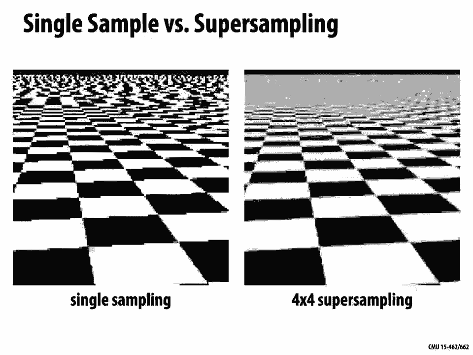
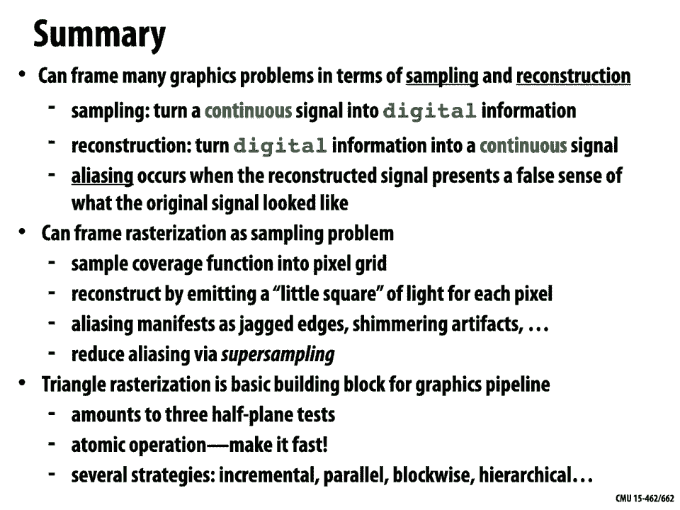

# 【双语字幕+资料下载】CMU 15-462 ｜ 计算机图形学(2020·完整版) - P5：L4- 绘制三角形和采样介绍 - ShowMeAI - BV1Pf4y1E7GJ

[Music]，welcome back to computer graphics so，today we're going to talk about。

a seemingly basic task how do we，draw a triangle on the screen but，actually this。

problem is going to expose a lot of the，deeper challenges，of computer graphics so over the next。

few lectures we're going to talk about，the process of，rasterization which is one of the two。

major techniques in computer graphics，for getting stuff on the screen。

so the first one which we'll talk about，today is rasterization。

and it basically says for each primitive，we want to draw each triangle or line，segment or point。

which pixels of the image should get lit，up，this technique is extremely popular，made。

extremely fast we can get billions of，triangles on the screen，every second if we're using modern。

graphics hardware，on the other hand rasterization has a，significant。

shortcoming it's very very hard with，rasterization to generate，photorealistic images things with。

beautiful shadows and reflections and，all the kinds of lighting effects，so。

that makes rasterization a really good，match for things like，2d vector art cartoon images。

fonts doing quick 3d previews of a scene，but it doesn't take us all the way there。

so later on in the class we're going to，talk about，the second technique of ray tracing or。

doing photorealistic rendering based on，tracing rays and the atomic。

operation there is to ask well for each，pixel，which primitives again which triangles。

or other shapes are seen，through that pixel and as we'll see，generate。

photorealistic images on the other hand，ray tracing is a lot slower we might，have to wait。

minutes or even hours to generate one，image rather than drawing，billions of triangles per second or。

having hundreds of frames per second on，the gpu，okay so we'll get deeper into ray。

tracing later on in the semester，today i want to talk about the，rasterization。

pipeline so we can talk about image，generation，in graphics in terms of a pipeline。

so what is a pipeline this is an idea，that shows up all over computer science。

you see this in processor design and，compilers and so forth，and the basic idea is to structure your。

computation，as a series of stages，each one of these stages is going to，request。

data as input in a very structured way，some really simple regular description，of the input data。

and likewise it's going to have some，simple regular structure for the output，data。

and because this data is highly，structured and highly predictable。

you can really go to town and simplify，and optimize，the computation within that stage okay。

so that's the kind of structure we want，to have for，image generation algorithms。

to do this we need to understand a few，things we need to understand for，instance。

what are the inputs to the pipeline what，image do we want to draw。

right what kind of data describes the，three-dimensional scene that we're，interested in。

we need to choose a decomposition of our，computation into a series of stages。

we need to think about how can we，transform the original input，into some intermediate output that。

becomes the input to another stage which，becomes the intermediate output。

for another stage and so on until we get，as output，the final image maybe the final。

array of pixel values that gives us，fact，we've already seen one example in this。

class of a graphics pipeline it's，what we did in our very first lecture。

so there we said we want to draw a，picture of a cube，right we have a cube in three dimensions。

and we want to make a very simple，perspective drawing of the cube。

we cooked up an input representation so，we said we could represent the cube or，any other。

kind of three-dimensional shape as two，things a collection of vertices。

vertex locations in space and a，those，vertices get connected together to make，line segments。

we then fed that data into the first，stage the，perspective projection stage which。

mapped the three-dimensional vertices，onto two-dimensional locations in the，image plane。

right and we we did that in a way that，captured the notion of perspective of，things getting。

smaller as they go off into the distance，that data then was fed into our line。

drawing stage so we knew where the，points were on the plane and so we could，just connect them by。

a line segment and the output of that，final stage，was our final image our drawing of the，cube。

okay so obviously this pipeline's a bit，simple it's a little bit of a toy。

graphics pipeline so what we want to，build up，is the rasterization pipeline modern。

image generation is based on，this technique of rasterization and the。

basic input to our pipeline instead of，points and edges is essentially just。

going to be points and triangles，everything we ever want to draw actually。

is going to be just points and triangles，but possibly with additional attributes。

so instead of just knowing，the locations of vertices in space we，know。

the color of each vertex or we might，have something called a texture。

coordinate which we'll talk about，a lot later we then feed this data into。

the rasterization pipeline this kind of，black box，and the final output is a bitmap。

image it's an array of pixel values，which store，one color per pixel possibly again with。

some additional attributes like，depth so how far into the screen。

is that pixel and alpha how transparent，is that pixel，so our goal is going to be to build up。

the stages in between how do we go from，that very basic input，into this beautiful image that you see。

on the the far right，and one thing to note actually is，that although we'll describe this at the。

level of software and，algorithms real rasterization is，typically performed by what's called a。

graphics processing，unit or a gpu so this is a，real physical piece of hardware that。

sits inside your computer，and it has a chip on it that's different，unit。

that's highly specialized to actually，just implement the rasterization，pipeline。

okay that's part of the reason why，rasterization is such a，fast technique because we're able to。

boil down，all the computation we want to do into，several，simplified stages we can really go to。

town and optimize，the heck out of this process not only，in terms of algorithms but in terms of。

actually designing hardware that。

executes each of these stages，okay so one really，important question to ask is why，triangles。

you know people thought about the design，of the graphics pipeline for many many，years and。

and somehow they decided that the basic，atomic primitive that should get sent。

down the graphics pipeline，make，sense right so for instance if we're，trying to draw this。

skull this ram skull we're actually，going to be drawing a big jumble of。

triangles that you see in this，zoom in in fact even if we draw things，as simple as。

points and lines those are actually it's，kind of weird，these are actually going to be drawn as。

really really small，really really skinny triangles right，that split up a。

square or a quadrilateral or something，why do we do that that seems，like kind of a funny choice well。

actually there's some really really good，reasons to use triangles for，rasterization。

one is that they're pretty good at，approximating，any shape you can think of so we've。

already seen here we have this very very，complicated，model of a skull with all sorts of。

interesting details，and if you have enough triangles then，there's no problem representing that。

complicated shape，so you can kind of think of this in，analogy to images。

right what is the atomic unit of an，image，color，why well if i have a little block of。

color if i have a，huge number of them i can draw pretty，much whatever image i want。

another thing that's good about，triangles is that they're always。

planar they always have a well-defined，plane passing through the three。

vertices that's not true by the way for，other polygons i could take，four points in space defining a。

quadrilateral，and they may not sit in a common plane，who cares about this property of sitting。

in a plane，actually it's extremely important for，shading so if i want to shade a surface。

i often need to know what is the normal，direction what is the direction，orthogonal。

to the surface and so for a triangle，that normal is always well defined it's，the normal of the plane。

containing the three vertices okay so，that sounds like a pretty good reason。

it'll also turn out to be very easy to，interpolate，data at corners so if i have three color。

values at the corners of a triangle，and i want to smoothly blend those color。

values across the rest of the triangle，it's going to be really really simple。

and efficient to do that using something，called，barycentric coordinates which will show。

up over and over again，throughout our course so，really the key reason why triangles are。

used in the graphics pipeline is，once we've reduced everything to，triangles once we've。

expressed how all different kinds of，shapes and lines and points can be。

drawn using triangles then all we have，to do is focus on making a really。

really well optimized pipeline for，triangle drawing right so you could，really think of the。

rasterization pipeline or the graphics，pipeline as kind of the，triangle pipeline it's this super。

optimized machine，that does one thing really really well，and that one thing。

is drawing fancy triangles okay and，we'll see that you can actually draw。

some really fantastic images，just with that one basic primitive just。

like you can draw some really beautiful，images，with pixels okay。

so what does the rasterization pipeline，and，and we're going to walk through each of。

these stages in great detail，over the next few lectures but to just，give the high level view。

the first thing we're going to do once，we have our list of triangles is we're，going to。

transform and position these things in，the，world in the scene where we want them to，be，house。

and you know that house is sitting on，top of a planet we have to。

arrange all of those in the way that we，want them to be arranged。

in our scene we're then going to project，those objects，onto the two-dimensional screen this is。

just like we did with our，cube right we turn our three-dimensional，coordinates。

into two-dimensional coordinates that we，can draw，for each triangle we're then gonna。

sample the triangle coverage we're gonna，see which pixels of the screen are。

covered by that triangle that's what，we'll talk a lot about today。

once we've done that we can interpolate，attributes at vertices across the，triangle。

so here i'm smearing the colors red，green and blue，across the middle of the triangle to。

give it some nice shading，i might also in addition sample，images onto the triangle to give it some。

texture，a lot of other things we could do at，this stage and finally，combine the colors。

of each pixel of each triangle into the，final image，right so we're going to composite all of。

those triangles，into our output which might also have，things like the。

depth and the transparency and this is a，pretty good cartoon of real world，graphics pipelines。

so if you ever interact with something，like opengl，or direct3d or vulkan these are all。

effectively application programming，interfaces ways of，communicating with different stages of。

the graphics pipeline，discuss，in detail how these different apis work，it's not really。

core to the topic of computer graphics，these apis are just really wrappers，around the core。

algorithms and so we will talk about，this in，recitation okay but it won't be a big。

part of our lectures，okay so let's go ahead and try to draw，some triangles on the screen。

and to do this we have to answer a，couple questions one，is for a given triangle for this red。

triangle here，what pixels does the triangle overlap，that's the basic question。

of rasterization the question of，coverage，another important question is well okay。

we know that the red triangle covers，this pixel，we might know that another triangle the。

blue triangle covers this pixel，which one is closer to the camera which，color value do we finally。

see and that's the question of occlusion，okay so this，second question this question is called。

the visibility problem and we can think，about this actually in terms of the。

pinhole camera model that we saw in our，first lecture，so if you remember we had this idea that。

we have a camera，that's made of a box with a little tiny，hole in it and a piece of film sitting。

on the back，back of the box and light comes in，through this hole。

and it hits some point on the back of，the box and makes a mark on the film，this。

pinhole picture is a little confusing we，flip things around and we just imagine，there's a virtual。

sensor sitting the same distance from，the pinhole but in the opposite，direction that's our。

our image right and we're kind of asking，well what do we see as we peer out from。

the pinhole through each of those，pixels we can also think of this，question in terms of rays and ray。

tracing，so if i imagine shooting a ray from the，pinhole out into the scene。

through one of the pixels what scene，geometry is hit，right what is the list of triangles that，i hit。

that's going to give me coverage，information which triangles cover this，pixel，well。

okay the ray might hit a lot of，different triangles which one is hit，first。

that's the question of occlusion okay，hopefully those two，concepts are clear so。

the problem of triangle coverage is what，we'll focus mostly on today。

and again what we want to know is for a，given triangle which pixels does the，triangle overlap。

so the input to this stage of the，pipeline would be，the projected two-dimensional positions，of our。

triangle vertices we could call those p0，p1 p2，each，pixel in the grid we just want a binary。

value we want to know，was this pixel covered by the triangle，or not。

so maybe something like this blocky，to actually implement this stage of the。

pipeline we need to understand a basic，question which is，what does it mean for a pixel to be。

covered by a triangle，right so if we really really zoom in，here we just look at one big pixel。

in the middle we could ask which of，these triangles，cover the pixel and what do you think so。

we have triangles one two three four，which of these triangles would you say。

okay i mean some of these it's pretty，clear right triangle number one。

doesn't intersect the pixel at all so it，seems really weird to think。

that that triangle covers the pixel，definitely not，triangle four is also pretty easy four。

covers the entire pixel so it's really，easy to say，yeah for sure the pixel is covered by。

triangle four，what about triangles two and three do，they cover the pixel。

right what is the binary value that we，we'd output for those，those triangles do they or don't they。

and maybe what this tells us is yeah，maybe we need to refine a little bit。

our description of the output so，instead of just recording a binary value，yes or no。

maybe one option is to say really what，we want to know is the fraction of the，pixel area。

covered by the triangle right that seems，like useful data if we know what。

fraction of each pixel is covered by the，triangle，then we can adjust the brightness of。

that pixel according to this，10，of a pixel it should be 10 red if it，covers 60。

it should be 60 red and so on，this question of coverage is not always。

so easy to figure out it gets really，tricky，when we start considering multiple。

triangles in the scene and we have，right so what if we have two different。

triangles covering the same，pixel well maybe it's not so hard like。

in the upper left we might just say okay，well，pixels covered 50 by triangle one。

right but actually determining this，coverage actually computing this，coverage can be really hard。

in general so let's say we have two，triangles interpenetrating each other。

how do we actually figure out this，fraction，right how do we determine what fraction。

of that pixel is covered by two versus，we might have non-convex regions where。

they overlap and so forth，so rather than trying to answer this，question exactly。

right rather than trying to figure out，exactly what percent of the pixel is。

covered by triangle two and exactly what，percent，is covered by triangle one what else。

might we try what's what's a way we can，get a rough，idea of how much of the pixel is covered。

so our basic strategy is to acknowledge，that real scenes are very very，complicated as we've。

just seen we can have occlusion which，can make it hard to figure out these，exact fractions。

we can have transparency so if these are，both semi-transparent，triangles what do we mean by covered。

and we'll talk a lot about these，different complexities in it in the，future，but the main point is。

that covering the exact fraction of，coverage is really not，do，is view this problem of determining。

coverage as a，sampling problem what i mean by that is，okay we're not going to compute the。

exact or analytical answer，but instead we're going to test a，collection of sample points。

right and we're just going to say for，each sample point，which triangle do we see if we have。

enough points，and if we are smart about where we put，these points。

then we can start to get a pretty good，estimate of coverage，okay so before really drilling down and。

answering this question for triangles，let's talk a little bit about sampling，in general。

and usually good place to start is in，one dimension，signal，as just a function i have a function f。

of a variable x，sampling all that means is i pick some，values，x x1 x2 x3 and so on。

and i ask what is the value of the，function at those points，two。

are samples of the continuous function f，x，a great example of this would be an，audio file。

so an audio file that you use to listen，to music，stores samples of a one-dimensional。

signal what is that signal，it's the amplitude it's the amplitude at，which you drive。

the speaker cone so over time that，speaker is going to be moving in and out。

at a certain amplitude and you want to，know that for，lots and lots and lots of points in time。

so in fact most consumer audio is，sampled 44 000 times a second。

to get a realistic reproduction of sound，okay and what the picture that you see，here is actually the。

sampling of that sound it's the，amplitude as a function of time。

so once you have that data once you've，brought that information into。

the computer and recorded it as a，sequence of numbers，you have kind of the inverse problem how。

do you turn those numbers back，into a continuous signal that you can，listen to。

and that's the problem of reconstruction，right so given a set of samples how can，we cook up。

some continuous function some function，where we know the value。

at every point in time rather than just，at the sample times what do you think so。

if i have just these values f of x，naught through f of x，4 how do i make a。

continuous function that roughly looks，okay well one really basic idea would be，to use。

a piecewise constant approximation，i don't know what the function is equal，to for every value of x。

so what i'm going to do is just say okay，find the closest value of x where i do，know。

the function value and just use that one，right and that gives me my approximate。

function which i've called f，how could i do a little bit better this，looks like kind of a jagged。

approximation how could i just do，slightly better，in approximating or reconstructing this。

okay so one thing i could do is i could，then connect the sample points by。

rather than these constant plateaus i，could draw，straight line segments between them so i。

could do what's called a piecewise，linear，approximation okay，now this looks smoother but you notice。

something funny about it what's，what's strange about this approximation。

right there's something really kind of，bad that happened here which is that，i've。

completely missed some of these big，bumps in the function，especially near the end i have these two。

huge bumps between x2 and x3，that don't show up at all in my，piecewise linear approximation。

so what would you do how can we，represent the signal more accurately。

okay well the most basic thing we could，do is we could just say，how about we sample the signal more。

densely how about we just，take more sample points if we missed，certain features。

then we should just sample more，frequently and，we'll capture those features right so we。

can increase the sampling rate this is，why your audio is recorded at 44 000，times per second。

is to make sure you don't miss anything，important about the way that the。

the music sounds right and so now we，this，from piecewise linear。

approximation right and we do capture，use，piecewise linear approximation again we。

capture the bump so if the function's a，little smoother，right so that's the basic technique if。

you have under sampling if you have too，few samples you miss out on features。

how do you get them back in there hey，you take more samples okay，and this is true not only for。

one-dimensional signals but this is，going to be true for any other kind of，signal we want to sample。

so for images it's a similar story，sample values are going to measure，image intensity or image color。

at each let's say center of a pixel，to then take those values stored at the，centers of the pixel and。

reconstruct an image over the entire，image plane，we're going to apply some kind of。

interpolation or reconstruction filter，right so we could again do piecewise。

constant we could go to the nearest，pixel，center and use that color or we could do。

something like linear interpolation we，could use，a linear function in each direction and。

get what's called a bilinear，interpolation okay so just a quick，summary of the basic concepts。

of sampling sampling is basically just，the process of，measuring a signal and distilling it。

down into a discrete or，finite set of samples，and in principle the idea is that these，sample values。

represent the true continuous function，is，any real measurement device doesn't。

quite give you that it's really hard，to get just the value of a continuous，signal at a single point。

usually there's some kind of blurring，out of the signal，reconstruction is the opposite process。

we have this finite set of samples we，have numbers，sitting on our computer and we want to。

construct a function，to，create a continuous signal okay，so we saw a piecewise constant or piece。

was linear，reconstruction but there are many many，more possibilities and especially as we。

start to look at more sophisticated，kinds of signals that show up in，computer graphics so going from。

audio to images to three-dimensional，surfaces，the questions about sampling and。

reconstruction get harder and also a lot，more interesting，so let's try to tie this back to our。

main problem of，rasterization for rasterization what，function are we sampling how do we think，of。

rasterization as a sampling problem，well we can imagine that what we're，trying to do is。

actually sample the coverage function，so the coverage function is a function。

defined at every single point in the，entire plane，right not just at pixel centers but。

really everywhere on the plane，and it's equal to one if that point is，contained inside the triangle。

and it's equal to zero otherwise okay。

and the goal of rasterization or the，simple approach to rasterization is to，say we want to。

sample the coverage function onto our，pixel grid right，so i have some sample point x y。

and maybe i put it you know halfway in，the middle of the pixel。

and for each triangle i'm just going to，evaluate the coverage function for that，triangle。

at the sample point，now even this basic sampling process can，be。

tricky we come back to this example i，have two triangles，meeting at an edge and that edge passes。

exactly through my sample point，so what do i do is this is a sample，point covered by。

triangle one or is it covered by，triangle two，of them，[Music]。

you know it seems like a little bit of a，pedantic problem but actually if you。

get this wrong in real image generation，you can get some really nasty looking。

artifacts in your image things don't，look quite right，and so people have thought long and hard。

about you know what is a what is a good，way to break，ties when it comes to drawing triangles。

so if an edge falls directly on a screen，sample point，for instance you could say the sample is。

classified within the triangle if，the edge is a top edge or a left edge。

so top edge meaning a horizontal edge，that's above all other edges，a left edge is an edge that's not。

exactly horizontal is on the left side，of the triangle，okay the details here are not super。

important if you're really interested，you can go，look it up in the reference at the。

bottom but just knowing that when you go，to write real code when you go to，develop real algorithms。

you want to have crystal clear，definitions of，the behavior you really want to。

understand ahead of time how should this，work and not just kind of。

leave this up to well whatever falls out，of the implementation is what happens。

right because you really want to be able，to guarantee that one stage of the，pipeline。

produces output that the next stage of，the pipeline can rely on，okay so。

what does it look like once we've once，we've sampled triangle coverage so let's，again zoom in。

on our pixel grid we've got this red，function，onto each pixel center and so now。

some of these centers are turned on，they're colored red some of them。

are turned off they're colored white and，actually all i'm left with if i think。

what data have i actually really，recorded i've just recorded this data。

right i just have this grid of of，pixel centers and i have a one or a zero，at each center okay。

so how do i now go in the opposite，direction i have my，sampled data and i want to turn it into。

an image i want to，reconstruct it so that i can look at，this approximate signal。

okay and that's really what your display，is doing that's what your monitor is，doing。

so each image sample sent to the display，is converted into roughly speaking a，little square of light。

and maybe you get to specify the color，of that light，right in other words each little sample。

value gets，displayed by turning on a pixel by the，way the word pixel。

is just an abbreviation for picture，element，right you have a picture it's your your，is a，pixel and。

if you really really zoom in on your，screen，what you'll discover is that pixels。

don't look quite as simple as you'd，think they don't just look like。

constant blocks of color you can see，that there's kind of a blurring。

for some reason on the left it looks a，little，redder right there's all sorts of。

interesting stuff going on with real，pixels，about，sampling and reconstruction and in。

rasterization it's helpful to just think，of each pixel as being a solid color。

and for the most part that's a good，enough，get，reconstructed so for instance if we send，the display。

these sample values then we look at the，screen，we'll get something that looks roughly，like this。

okay so there you go we sampled our，triangle，we reconstructed it by turning each。

sample into a little square of of light，but are we happy with what happened i。

mean sure we get some image but the，the thing that we really were trying to。

draw trying to reconstruct is this，signal，right so there's definitely some。

approximation error between our，reconstructed signal and our。

original signal so this，leads us into a discussion of something。

that's really core to computer graphics，which is the phenomenon of aliasing and。

we'll talk a lot about aliasing，throughout the semester in every，possible context not just in。

rasterization but also in geometry in，photorealistic rendering and animation，and so forth。

so to understand aliasing let's let's，take another look at this。

idea of sampling and reconstruction okay，we have a pretty good handle on this now，the idea is。

we start out and there's some continuous，signal that exists，let's say in the real world like an。

audio signal the voice，on this recording to turn it into，a digital format to turn it into。

something that we can store on our，computer that we can send over the，internet。

we sample this continuous signal into，a list of values maybe just a long list，of numbers。

right 44 000 numbers per second，that's all we have after we've done，sampling just these numbers。

okay and then we have to go through if，we want to listen to the audio some，process of。

reconstruction we need to turn that list，of numbers，back into a continuous signal。

and the goal in this whole process，is to reproduce the original signal as，accurately as possible。

here for instance you can see we didn't，do a great job right there's。

lots of little wiggles in the original，signal that are not present in the，reconstructed signal。

so how can we talk about this kind of，error，in a little more sophisticated way。

well one really really important，perspective when it comes to。

signals of any kind is that they can be，decomposed into，frequencies so a 1d signal like audio。

can be expressed as a superposition or a，sum，of different frequencies，a frequency here just means an。

oscillating sine wave，that has a certain，well frequency so the，oscillating sine wave at the top goes。

very slowly，it might represent a very low pitched，the next one is oscillating a little。

more quickly and might be a medium pitch，sound，and then the next one goes even faster，sound。

ah right and if we add these all，together，then we start to make different kinds of，sounds。

voice music and so forth，this might explain if you've ever seen，on a stereo。

a spectrum analyzer something like this，so as the music is playing these little。

bars are moving up and down，what does that mean well it's telling。

you how much low frequency stuff is，there so if there's a lot of bass。

right you might see a bunch of bars on，the left moving up and down，if there's a lot of really high。

frequency sounds somebody's playing the，trumpet or something，you might see bars going up and down on。

the right side，okay so this is a good way of thinking，about our signal as being。

made up of low frequencies medium，in audio again we can get a constant。

tone by playing a sinusoid of frequency，omega so if omega is something like。

4000 we get a sound like that if it's，5 000 we get a sound like that and if，it's。

6 000 we get a sound like that，okay so here's a really interesting，question。

what do you think is going to happen if，we increase the frequency omega。

over time right so rather than making，omega，just this constant number four thousand。

five thousand or six thousand，what happens if it changes if it，increases over time so if we say。

omega as a function of time t is let's，say six，000 times t what would you think that。

okay my guess is that it would sound，like a rising pitch，right it would start out low and then as。

time goes on，it'll get higher and higher and higher，just like we see in this plot。

so let's try it out let's play the sound，okay that was weird why did that happen，that's not at。

all what we thought it would sound like，right rather than just going from。

low to high and higher and higher and，higher it went，from low to high back down to low back。

up to high back down to low，well the important thing to remember is。

that we're always taking whatever this，signal is this，quickly oscillating sine wave and we're。

sampling it onto，a finite set of points and，if we under sample if we have too。

few points to capture all of the little，wiggles in that，sound wave then we're going to get。

aliasing we're going to get a，sound that doesn't actually represent，the original continuous signal。

so we could think about this by thinking，about sampling，each of these individual tones onto。

a finite set of samples，if we have this really low frequency，tone at the top。

everything's fine i can sample these you，know black dots i connect them by。

straight lines and i get this dashed，blue curve that looks，pretty much like f1 of x it's a little。

different but，more or less the same but now let's go，all the way to the bottom if we sample。

the function f5 of x onto the same set，of sample points，what happens well here we got。

really really unlucky right these sample，points，show up at just the wrong locations so。

that when we now connect them by，straight lines it looks like we have。

a sound that's much lower frequency than，the one we were actually listening to。

right and so in this case this is what，we mean by，aliasing high frequencies in the，original signal。

quickly oscillating waves，masquerade as low frequencies after we。

perform the reconstruction because we've，under sampled and that's exactly what。

happened with the sound we played on the，previous slide，at some point the frequency got so high。

that we sampled it onto something that，sounded，much lower and just because of the。

particular way that function looked it，ended up sounding like it went up and。

down and up and down rather than just，going straight up，okay so this is a really important。

picture to think about decomposing，think about，things like aliasing how do we。

think about frequencies for images，actually images，can be decomposed into frequencies。

but it's a lot trickier to think about，okay so what i'm showing here on the。

left is the input image you could think，of this as a continuous signal。

and what i'm showing on the right is，something like，the analyzer that you look at on your，stereo。

remember that on the stereo if we look，all the way on the left we're looking at。

low frequencies the bass，in the music if we look all the way on。

the right you're seeing high frequencies，that the treble，so this image that we see on the right。

is kind of like the analyzer，the spectral analyzer for the image that，we see on the left。

except this time all the low frequencies，are dead center，and as we go out in any direction up。

down left right or even off in some，diagonal direction，we're looking at higher and higher。

frequencies，so bright values here means we have a，lot of amplitude in that frequency。

and dark values mean we have almost no，amplitude in that frequency。

okay there's still some things that are，mysterious about this figure why。

are there two directions what do，frequencies mean，in images and i think it helps mostly to。

just start looking at some examples so，let's say we take this image and we，actually cut off。

all of the frequencies except for the，ones in the very middle，so we keep what i would call the low。

frequencies，and what you notice is that the image，got really really blurred out。

all the sharp features all the high，frequency detail all the little。

you know interesting things have been，removed and we're just left with this。

this blur in fact you can imagine that，if you just，took one row of the image and plotted it。

as a one-dimensional function what you，would see is，than，a rapidly oscillating high frequency，wave。

okay let's go out a little bit further，and look at some mid-range。

frequencies so we're going to ignore，these low frequencies we're going to，keep things that are。

slightly higher in frequency and，we start to see things that actually，look a bit like。

edges in the image but kind of blurred，out versions of the，edges if we go even higher frequency we。

definitely start to see the edges and，if we go super high frequency that's，kind of all we see。

just the edges the place where you see，the silhouette，of objects in the image okay。

so interestingly enough we can decompose，an image，into these different frequency。

components just like we can decompose，audio into different frequency，components。

and that starts to help us understand，you know what do we mean by aliasing。

well the same kind of thing if we have，really really high frequencies in the。

image but if we have a really，coarse pixel grid we might miss out on。

some things we might not，faithfully capture the original signal。

here's an extreme synthetic example of，that，that phenomenon so what we're going to。

do is we're going to，build a function intentionally that has，crazy high frequencies in it and that。

function is sine，of x squared plus y squared where，x y equals 0 0 is on the the far left。

middle of the image okay so how does，this function behave well as we depart，from the origin。

it starts oscillating faster and faster，and faster and faster right so you'd，think。

these wiggles or these rings should be，getting thinner and thinner and thinner。

and thinner as we go away from the，but what do you notice you notice for，instance all the way on the。

far right it looks like we again have，these low frequency，rings why is that happening。

well it's not happening because they're，really there it's，it's a complete fiction the reason we。

perceive these rings on the far，right is because we've gone so far past。

what we can represent on the image，that we just have sampling and，reconstruction artifacts we have。

aliasing，that makes it look like we have features，that aren't really there in the middle。

also we just have no idea what's going，on right there's so high frequency we，just。

can't resolve with our few pixels in，this image，what's really going on with this，function。

the same phenomenon shows up in video，this is this one might be more familiar。

to so if it's ever been，nighttime you're looking out the car，window at a。

car next to you and you stare at the the，hubcaps you'll see an effect like this，so。

maybe as the car leaves uh through the，stop light the wheels start spinning，faster and faster and。

rather than looking like they're，spinning forward they start spinning，backward。

but then as they go even faster they，start looking like they're spinning。

forward again and perhaps if they get，fast enough i don't know if we'll see it，here but they'll。

maybe start looking like they're，spinning backwards again，right why is that happening。

well in this case because our video is，only being taken at 30 frames per second。

so if the wheel is spinning around much，faster than that rate，we're just going to catch kind of a。

random image，of the wheel at different moments in，time which makes it look like it's doing。

all sorts of other，funny stuff this is exactly what，happened with our，our audio signal okay。

so how can we be precise about when this，called the，nyquist shannon theorem okay really。

important theorem in，signal processing so it says let's say，that we have。

a band limited signal meaning we don't，have any frequencies above。

some threshold right if we think of，audio as a sum，of fundamental you know sine waves we，stop。

adding terms that are past some，frequency，so for instance in our audio if we band，limited that。

sound or that music we we listened to，before it might sound like this。

if we band limit our image it looks like，a blurry image we saw that before。

and what the nyquist shannon theorem，says is，well if your signal happens to be band，limited。

then it can be perfectly reconstructed，as long as you，take samples at a rate that's twice。

as frequent as the highest frequency in，the signal，and once you have those samples you can。

reconstruct exactly the original signal，by using something called a sync filter，so rather than。

piecewise constant or piecewise linear，what you do，is for each audio sample or for each。

pixel in the image，you add up one of these oscillating sync，filters where the amplitude is。

determined by the sample value，okay so this is a an ideal，filter it doesn't get rid of any。

frequencies and it also，has this property that has infinite，extent so the sink filter is。

1 over pi x times sine pi of x which，just means it's this，oscillation that goes on forever and。

just gradually falls off，okay so that's cool i mean，there's this theoretical way in which。

you can get perfect reconstruction，but there's a couple problems with this，i mean one is that。

real signals that we want to deal with，in computer graphics usually aren't band，limited。

you know why why is that true i mean，first of all we could just have a lot of。

high frequency stuff going on in an，image，but if we look at even something simple，like。

the coverage function for a triangle we，immediately run into a problem here's，here's our。

our triangle our coverage function how，do i express，something like a hard edge as a sum of。

sinusoids well actually it turns out，that what i have to do，is add an infinite series。

of higher and higher and higher，frequencies until i can eventually，approximate something like。

a piecewise constant function okay，so whenever you have discontinuities in，an image。

whether it's the coverage of a triangle，or it's the silhouette。

on the side of a face you have infinite，frequency in your，input signal the other problem has to do。

with reconstruction because this sync，filter has，infinite support it goes on forever。

it makes it really hard to efficiently，reconstruct，an image from or using this filter why。

is that the case，well think about what i have to do for，every sample in my image if i have n。

samples in my image then i'm making，contribution to all，other n samples or n pixels and so。

this is an order n squared algorithm。

just to draw the image on the screen，super expensive okay so，what does that mean in practice that。

means that things are going to go wrong，right imperfect sampling and imperfect。

reconstruction are a fact of life，and that means we're going to see，artifacts and images。

how do these manifest for things like，the coverage of a triangle or sampling，basic geometry。

well really really common artifacts in，graphics or you have let's say jaggies。

in a in a static image if i draw a line，segment it has these jagged edges。

in animated uh images and movies i might，have，roping or shimmering artifacts so if you。

look at the horizon on this checkerboard，you see all sorts of crazy patterns。

moving around that aren't really there，this isn't really how a checkerboard，should look。

it's just because we're doing really，crude sampling and then a really crude，reconstruction using。

a piecewise constant approximation，and there's lots of other kinds of，artifacts we also saw this。

this moire pattern in the the sine of x，squared plus y squared and so forth。

so what can we do about this how can we，reduce aliasing，well again no matter what we do aliasing。

is a fact of life，right any sampled representation，eventually fails to capture。

frequencies that are too high but we can，still do our best to try to match。

sampling and reconstruction so that the，signal we produce looks as much as，possible。

like the signal we acquire so for，instance if we think of a pixel as。

a little square of light then what we，want is that the total light。

emitted from that pixel to be the same，as，the total light that we had in our。

original continuous signal in other，words we want to，integrate the input signal over the。

pixel to get the sample value，okay and we already said that's that's。

hard to do it's hard to get that exact，coverage value。

so let's approximately integrate the，coverage by，sampling okay so we come back to our。

coverage problem yet again，we want to figure out for each pixel of，the image。

how much of it is covered by the，triangle the simplest possible thing we，function。

once at the center of the pixel and we，get，coverage values like this what did we，say is the basic。

thing to do if we have errors in our，reconstruction what is the absolute。

simplest thing we can do to reduce the，well we can just increase the frequency，of sampling。

right so we could just take more sample，points and，sort of have a higher resolution image。

if you like，but actually at the end of the day we，still have to display，same。

monitor for instance so so what we're，really going to do is，use a technique called super sampling。

rather than just taking one，sample of the signal the coverage signal，at each。

pixel we're going to take several，samples right here we take four samples。

in each pixel in some sort of nicely，chosen location，and then we need to convert these。

sampled values back to final sample，values that we're going to use to，reconstruct。

the image okay so we start with the，original signal this，coverage function we do a dense sampling。

of that coverage function onto a，very fine grid and，then we turn those find values back into。

course values，that we can use to draw the image on the，screen，and so you can imagine that each of。

these four values if they're all for a，hundred percent covered，then we average them down and say yes。

this pixel is 100 covered，right if none of them are covered then，okay we say。

the pixel's not covered at all but if，some fraction of the samples are covered。

let's say half of them are covered well。

then we say okay 50，of that pixel is covered right so we，just use the fraction of sample values。

that are covered to get an approximation，of the fraction of the pixel that's，covered。

okay so now we've done a little bit。

better job of，recovering our true coverage function。

that was our original，coverage function that we wanted to，reproduce this is。

our reproduction okay it's slightly，better than what we had before。

i think this becomes a little more，interesting to look at if we look at a。

real image so let's go back to this，checkerboard example and so if we just，do。

single sampling we just sample the，center of each pixel we get again these，we。

run exactly the super sampling procedure，that we did before so we have four。

sample values per pixel and then we，average them to get the coverage。

then we get something that's a little，bit better but you still notice there's，some pretty。

nasty shimmering artifacts so how can we，make this，even better well how about we do even，more。

samples per pixel so now in each pixel，we have 4x4 or 16 samples things get a。

little bit smoother，okay still not perfect how do we make it。

perfect well let's just add more samples，okay so now we do。

32 by 32 we have 1024 samples taken for，every single pixel。

and we average them back down so，even though this looks a lot better you。

notice it's still not perfect。

right and that's what nyquist shannon，was telling us，is that while you have infinite。

frequencies in your，signal no matter how many samples you。

take you're always going to have some，error in your reconstruction。

right now i should say that in this very，very special case of the checkerboard，there happens to be。

an exact solution you can analytically，integrate，the checkerboard over a pixel and get。

this beautifully，smooth image and if you want to know how，that was done there are a couple。

references at the bottom，but the real point to make here is that，such cases are extremely rare。

it's really really hard to work out the，exact coverage or the exact integral。

over a pixel and so the reason that we，use sampling in computer graphics。

is that we want solutions that work in，the general case，right we don't just want to talk about。

checkerboards on planes，but we want arbitrarily complex geometry，with interesting signals things are。

intersecting and overlapping and there's，transparency and and so forth and really。

the only general purpose solution to，that is，to try to sample and reconstruct。

by taking finitely many sample points，okay all right so，coming back to the actual graphics。

pipeline if we think about this stage of，the pipeline that's responsible for。

sampling the coverage function for a，triangle，how do we actually do it right what's。

kind of the the algorithmic approach，so the most basic thing that we need to，do。

is say okay we have this triangle we，have this pixel grid we want to know。

which pixels are covered by the triangle，we can just break this down into an，atomic query which is。

how do we check if a given point q is，inside，what do you think what would you do you。

know a little bit of vector calculus and，linear algebra，what would be your approach to solving，q。

is inside a given triangle，okay well there are several different，ways you could think about this but。

they all essentially amount to asking，whether that query point is contained in。

three half planes associated with the，three edges，so we've broken down this problem even，further。

how do you test have a points inside of，a triangle well，i know that if it's contained in the。

half plane made by the bottom edge，and the right edge and the left edge，then it must be。

inside the triangle how do i do that，test how do i check if a point is inside，a half plane well。

that's just a little exercise in linear，algebra and vector calculus。

given two points p i and p j along，an edge and a query point。

q how do i determine whether q is to the，left or，the right of the line from pi to pj。

now you have to be really careful here，because you have to think okay well，which。

which side is left and which side is，right you have to make sure you get the，order of。

pi and pj right also you probably have，to think carefully about the。

edge rules if i'm exactly on an edge，what should i do。

okay but that's what we do to test just，a single point just a little，little uh calculation。

so now if i want to rasterize a whole，triangle what do i do，i need to in some order march over the。

pixels in the image and for each of them，check whether the center of that pixel。

or the sample points contained inside，that pixel，are contained inside the triangle。

and one kind of traditional sort of，older approach is to say well。

i can make this a little bit faster by，noticing，that the half plane check looks very，similar。

for nearby points so i can save myself，some arithmetic by not going through，these。

points in a random order but by marching，let's say along，rows of the triangle and incrementally。

updating，my calculations to decide whether each，pixel is，is turned on this incremental approach。

is also nice because it improves，uh memory coherence so actually in。

real modern hardware the bottleneck is，typically not，doing arithmetic doing math but the。

bottleneck is，reading or writing to memory so if you，can traverse the pixels。

in a pretty coherent order that can，actually speed things up significantly。

and there are lots of different ordering，patterns here a more，modern approach is to recognize that。

real hardware is also increasingly，parallel，a，grid and incrementally updating some。

values is a very serial idea，what we're going to do instead is just，test all the samples。

in the bounding box around the triangles，so it's kind of the tightest fitting box。

around the triangle，we're going to test all those samples in，parallel。

and because of the way that parallel，hardware works because we have，wide parallel execution units。

the extra cost that we incur by testing，more sample points，is overcome by the efficiency of the。

hardware this is especially true when，when super sampling there's some common。

calculations that have to be done for，all of these tests so we can save a，little bit of time there。

and also modern graphics processing，units because they，know that you know the whole reason for。

these things to exist，is to do lots and lots and lots of point，and triangle tests。

they actually just have hardware built，in that will efficiently perform this，calculation。

right so that's part of the reason we，can draw billions of triangles per。

second that's what the hardware is，designed to do，okay so that sounds nice but，what's。

what's the case you can think of where，the naive parallel approach is still。

really really inefficient，and i fit the tightest bounding box。

around this triangle and then i test all，the sample points in parallel。

well you can imagine for instance that i，had just one，long skinny triangle that stretched all。

the way across，the screen right and so now if i'm，testing all the points in the bounding。

box almost none of them are going to be。

covered i'm wasting a lot of time，so i can take kind of a hybrid or，or course define approach。

and first ask if large，blocks of pixels intersect the triangle。

so before testing any individual pixel，i draw some kind of medium size square i，ask。

does this block intersect the triangle，or not，and if not i'm in good i'm in good shape。

right if i know that this gray，box in the upper left doesn't intersect。

the triangle at all then i don't need to，do any more work，none of those none of those pixels are。

covered，similarly if i actually know that the，block is contained entirely inside。

the triangle then i can do an early，in i can say immediately that all of the。

pixels inside that triangle，are turned on right otherwise i'm in，box，neither。

completely outside or completely inside，i still have to go ahead and test。

those individual pixels but i saved，myself a lot of work，right i'm only doing this fine grain。

check kind of along the boundaries of。

this big triangle，okay and this is how real graphics，hardware works。

again it's super tuned to do these these，checks in，in parallel and to do them with great，efficiency。

by the way how would you check if a box，intersects a triangle。

that's an interesting question to think，about you already know how to check。

that a point or whether a point is，inside or outside a triangle，can you use that test as a starting。

point for checking，if a box intersects a triangle，that's interesting to think about okay。

so so that's a little better and so now，we can imagine if we have this long，skinny triangle we've。

broken it up into these boxes and we can，quickly skip a bunch of them。

but still looks pretty inefficient right，i mean there's still a lot of boxes。

that we're checking and we do an early，out but it was kind of wasted，computation。

and this leads to another really really，important idea，in all of computer graphics which is to。

take a hierarchical strategy，okay so we're going to apply this same，course define。

thinking but we're going to do it，recursively，rather than picking just one box size。

we're going to start out by saying okay，first i'm going to check is the triangle。

on the screen at all，if for instance all three vertices，of the triangle are way off the screen i。

shouldn't bother doing anything，okay but let's say i find that it is on，the screen then i can。

check whether the triangle intersects，these four big boxes，okay and for each of them okay if it。

if it does intersect the box then i'll，split that box into，four smaller boxes and i'll check if。

each of those four smaller boxes，intersects the triangle，okay and i've skipped a lot of empty。

space already，and if i know that one of these smaller，into，even smaller boxes。

and kick out or ignore the ones that，don't intersect the triangle and i can。

split those into even smaller boxes，okay and i could keep doing that forever，but at some point。

actually it's faster to just stop and，check the individual pixels。

inside a box so maybe i do this down to，four by four，pixel blocks so this is pretty cool i've，really。

focused all the computational effort，exactly where it's needed。

now i will say this is actually not what，happens in real graphics hardware，because。

there's still quite a bit of overhead to，doing this hierarchical traversal。

so having just one course to find，level is is kind of a nice sweet spot。

but you can still think about you know，how could you improve this this process。

a bit if we just look at the pattern，of blocks that we finally checked you。

think well isn't there a better way to，find，the finest scale blocks do i really need，to do this。

this hierarchical thing well again given，how simple a triangle is and how。

how kind of a standard case this is，maybe you could do some kind of。

incremental traversal so now we're all，the way back to where we，started maybe there's some kind of。

incremental algorithm where i just go，which ones，i need to check at the finest level okay。

and so playing these kind of games is，exactly，the activity of computer graphics trying。

to think how can i structure the，computation how can i break things down。

to really match the computation to the。

problem structure，okay overall today what we saw is that，we can frame a lot of。

problems in computer graphics in terms，of sampling and reconstruction。

sampling is the process of turning a，continuous signal into digital，information。

reconstruction is going the other，direction we have，the sample digital information and we。

want to turn it into a continuous signal，aliasing occurs when there's a mismatch，when。

the reconstructed signal presents a，false sense，of what the original signal actually，looked like。

we can frame rasterization as a sampling，problem，right so what are we sampling we're。

sampling the coverage function onto a，pixel grid，and we're reconstructing the sampled，function by。

emitting a little square of light for，each pixel so basically by using a，piecewise。

constant reconstruction of the sampled，values，in this context aliasing manifests as。

well we saw it jagged edges shimmering，artifacts，when things are in motion and so on。

our basic strategy for reducing aliasing，at least for rasterization was。

to use super sampling right and this was，really inspired in a way by this nyquist。

shannon theorem like，shannon said if you want to reconstruct，the signal perfectly。

you'd better sample it at a rate that，looks like the highest frequency。

well we can't always sample it at the，highest frequency but we can at least。

bump up the frequency a bit to get a，better sampling，and hence a better reconstruction，that。

triangle rasterization is the basic，building block for the graphics pipeline。

so weirdly enough we're going to reduce，all of drawing images on the screen。

to just drawing triangles really really，fast，and we saw that drawing a single，doing。

three half plane tests okay and this is，an atomic operation so we want to make，it really really fast。

and we talked about several strategies，we can do it incrementally this is kind，of the。

the old-fashioned way that might be，implemented in software，we can do it in parallel，days。

where we use blocks to do early ins and，early outs to save ourselves a lot of，tests。

you could also imagine doing，hierarchical schemes and all sorts of，other things。

no reason that you couldn't improve on。

existing designs，okay so that's it for that stage of the，pipeline next time we're going to talk。

about another important stage of the，pipeline was how。

