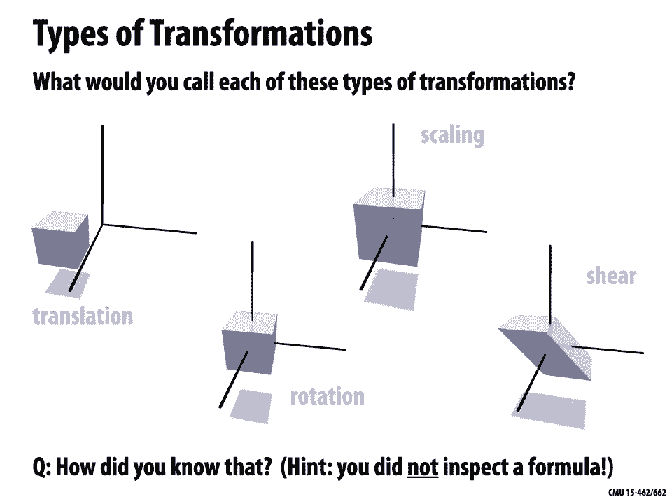
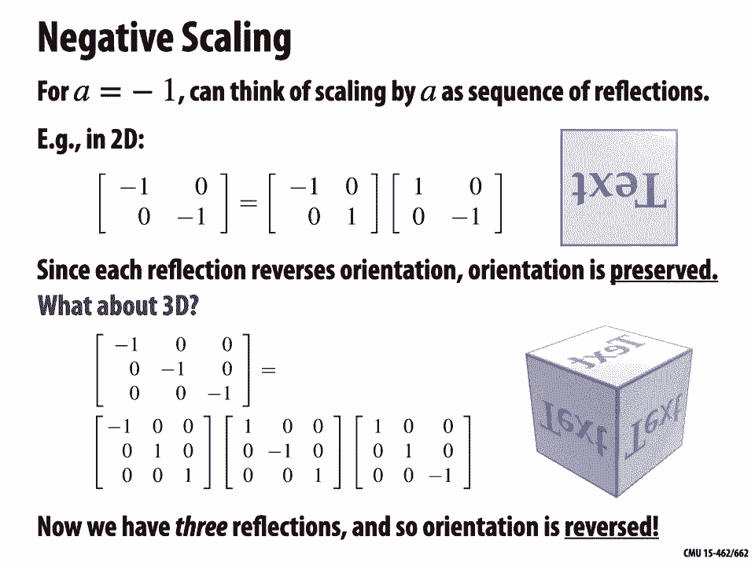
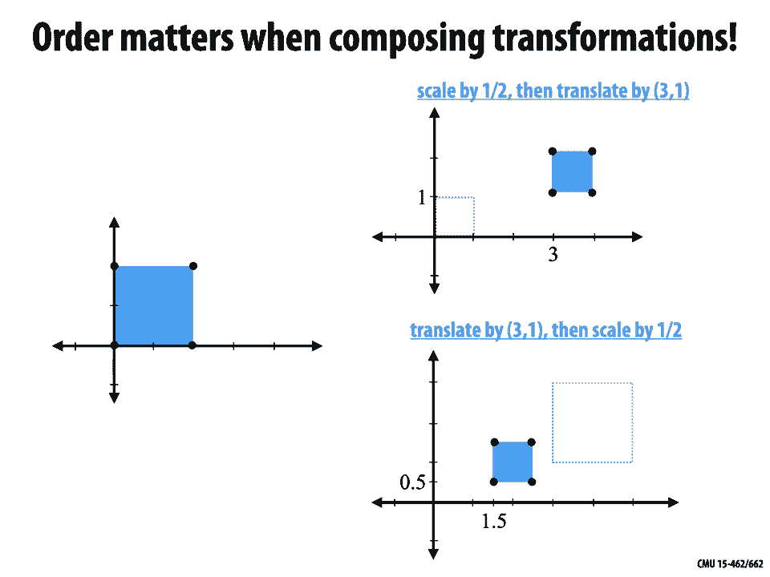

# 【双语字幕+资料下载】CMU 15-462 ｜ 计算机图形学(2020·完整版) - P6：L5- 空间变换 - ShowMeAI - BV1Pf4y1E7GJ

welcome back to computer graphics so，today we're going to talk about a very。

basic part of computer graphics，which is applying transformations to，objects in space。

so when we talk about a spatial，transformation what we really mean。

is basically any function that assigns a，new location，to each point so we could think of that。

for instance as a function f，that takes points in rn to points in rn。

today we'll focus specifically on，transformations，of space like rotations and scaling and，so forth。

that can be encoded by linear maps，and we'll see that that is actually a。

pretty rich class of maps that lets us，do the kinds of things we see，going on at the bottom here so。

where do linear transformations show up，in computer graphics the answer is。

all over the place we use them to，position or deform objects in space。

to move the camera around in an，animation，to animate objects over time。

they are related to projecting 3d。

objects onto 2d images，we use them to map 2d textures on the 3d，objects。

we use them to project shadows of 3d，objects onto other 3d objects，where。

linear transformations are needed，in the context of the rasterization。

pipeline that we've been developing，linear transformations actually show up。

all over the place maybe the most basic，thing is，when we have the geometry at the。

beginning we need to transform it or，position it somehow，in space before we go through the rest。

of the rasterization，process okay so，we said that we're interested in linear，transformations。

let's just review for a moment what does，it mean for a map，f from rn to rn to be linear。

and if you remember we had a couple，different ways to look at this，one before getting to the formal。

definition was to say well what does it，mean geometrically or visually。

so geometrically a linear map is one，that maps，lines to lines so every line becomes a，new line。

and also preserves the origin，that's very important the origin remains，fixed。

okay an equivalent definition algebraic，definition，is that we can think of a linear map as。

one that preserves，our basic vector space operations of，addition and scaling。

so for instance if i add two vectors and，then apply，the map to their sum。

i should if the map is linear get the，same thing if i first，apply the map to each of the some ends。

and then add them together，and likewise for scaling okay，so why do we care about linear。

transformations why are we making this，restriction，to just linear functions well for one，thing。

linear maps are really cheap to apply，well，so we can kind of go the other direction。

almost as easily as we can，apply them a big reason why，linear transformations are used in a。

graphics pipeline is that the，composition of linear transformations，is linear right for instance。

if i have a bunch of different matrices，each of which represents a linear，transformation。

then i can just multiply them all，together，to bake all of those different。

transformations into a single，transformation matrix this is really。

nice because it gives us a uniform，representation，of lots of different kinds of。

transformations which，simplifies graphics algorithms it，simplifies graphic systems like gpus and。

apis，and it simplifies our thinking about。

linear transformations in a lot of ways，for instance it's going to let us get a。

really clear picture of what，kinds of linear transformations we can，work with。

that we can piece together to transform，our object or our space，let's take a look at some common。

examples if you just watch these little，movies，you know without writing down any。

equations or formulas，what would you call each of these types，of transformations。

can you can you put a name to each of，okay well i would say the one on the far，left looks like。

the one next to the right looks like a，rotation，the one next looks like a。

scaling and finally we have a，shear right，how did i know that how did you know。

that we didn't figure this out by，inspecting a formula，or noticing that a matrix satisfies a。

certain property，but there's something about looking at，this picture that lets our brain。

know what kind of transformation each of，how could you have possibly figured that。

out by just looking at these pictures，well the answer essentially is that，transformations。

at their core are not defined by，formulas，or matrix properties or anything like，that。

but each type of transformation is，really determined by，the invariance it preserves so as the。

transformation is applied，what quantity or quantities remain fixed。

and so for each type of transformation，that we just saw，we could think about okay what's not。

changing，when we apply that transformation for，instance we said we。

we almost defined linear transformations，as those that preserve，straight lines and the origin。

likewise we could say a translation is a，transformation，that preserves the differences between。

any two pair of points，we could say that scaling is something，that preserves。

lines through the origin and the，direction of vectors，and so forth right and so in some sense。

this is really how your brain knows，what kind of transformation you're。

it knows that something about the object。

is remaining unchanged，so let's look at this in a little bit，more detail for rotations how can we。

define，too，technical well rotations fundamentally，properties，first they keep the origin fixed。

right so when we talk about a rotation，especially today，we mean a rotation about the origin。

a rotation will also preserve distances，so for any two points in space。

the distance between those two points is，going to be preserved by。

a rotation and finally very important a，rotation also preserves orientation。

so if we have text that we're reading，from left to right and we apply a，rotation。

we can still read that text from left to，right it doesn't look flipped around or。

the first two of these properties，are，linear okay it's not too hard to。

convince yourself that if you preserve，the origin，and you preserve the distance between。

any two points，well then a line must always get mapped，to a line。

and we'll have a lot more to say about，rotations，in the next lecture today we're just。

going to cover the the very basics，so if we want to compute with rotations，we will have to。

write out formulas we will have to give，them some kind of representation。

so what does this look like well one，thing we know about rotations the only，thing we know so far。

is that they preserve distances and the，origin，and so a 2d rotation by an angle theta。

is going to map each point x to a point，which we'll call f x or f sub theta of x。

on the circle of radius norm x，how do we know that well the norm of the。

vector has to be preserved the distance，from the origin to the vector，up，okay next question。

where does x go if we have an x at 1，0 where does x go if we rotate it by。

an angle theta in the counterclockwise，direction，and what i mean is how would you write，this out。

in sort of a trigonometric expression，okay well hopefully you remember。

that if i go an angle theta around the，circle，i get to cosine theta sine theta。

in fact it's really really important to，remember，that these words cosine and sine cosine。

theta sine theta，all they actually mean is the x，coordinate on the circle at an angle，theta and。

the y coordinate on a circle at an angle，theta，i think it's really common to mentally。

imagine that cosine and sine，are these oscillatory functions that go，up and down on the real axis。

much much better to always remember that，cosine and sine are，just the x and y coordinates on the。

circle，okay so with that knowledge in hand，what would you say about the point x。

equals 0 1 if i apply a rotation，well there are a lot of different ways。

we could write this one is to say，it ends up at cosine theta plus pi over，2 and sine。

theta plus pi over 2。 why well because，we started out，at an angle pi over 2 right that point 0。

1 and then we added a further angle，theta，and we can also simplify this by，noticing。

that the x component of our，second point looks like minus，y component of our first point and the y。

component of our second point，looks like the x component of our first，point。

right so always a useful trick if i want，to take a vector in 2d and rotate it by，90 degrees。

i swap the components and negate the，first one，why does that work well because。

now the dot product between the two，vectors is zero that means i made a。

90 degree rotation they're orthogonal，right okay so we can write this more。

simply as minus sine theta，cosine theta all right interesting。

but what if we want to rotate a general，vector x equals x1 x2，what happens if i rotate that by theta。

well let's let's think about it this way，i can always take any vector。

x and decompose it into the two，basis vectors i can write a vector x 1 x，2 as，x 1 times 1 0 plus x 2。

times 0 1。and because i know already how to rotate，we just did that on the previous slide，and。

i know that rotation is a linear map，then all i have to do is apply that，rotation to。

0 1 and 1 0 and i get f of x，plus，x 2 times minus sine theta cosine theta。

okay so can we summarize this somehow，well how would we represent。

this 2d rotation function using a matrix，right i now want a 2 by 2 matrix so that。

if i hit the vector x1 x2，theta，okay so hopefully you remember that if i，want to do a。

matrix vector multiply what i do is i，take a linear combination of the columns。

using the entries of the vector as the，coefficients so，x1 times the first column plus x2 times。

the second column，and so i can write a 2d rotation as a，matrix cosine theta。

minus sine theta sine theta cosine theta，okay very famous formula that's not hard，at all to derive。

what about in three dimensions how do we，work with rotations so。

as i said we're going to talk a lot more，about rotations in our next lecture。

rotations are an extremely rich subject，especially once we get to 3d。

but for now we can at least think about，rotating around a single axis。

so let's say for instance i'm in three，dimensions，and i want to perform a rotation by an，angle theta。

around the x3 axis the new axis，what do you think that matrix，well the key idea is that to rotate。

around an axis i want to keep that axis，fixed i don't want to change the axis at，all。

so we're just going to apply the same，transformation of x1 and x2 that we did。

in two dimensions and keep，x3 fixed in other words we can build a，matrix that looks exactly like our。

2d matrix but we've added a row and the，like they come，from the identity matrix right the。

things that are just going to preserve，x1 okay and we can do this for。

the other axes as well if i want to，rotate around x1，i have a matrix that has cosines and。

sines in the entries，and the rows and columns corresponding，to x2 and x3 if i want to do it around。

x2 right i put those entries in，rows and columns for x1 and x3。

okay so those give us some pretty basic，really important fact about rotations。

important and useful thing that comes up，all the time，is that the inverse of a rotation can be。

expressed using the transpose，okay if you don't believe me that's，great let's let's see it happen。

so the first thing to realize is that a，rotation is going to map，the standard basis one zero，some。

new orthonormal bases e1 e2，e3 how do we build a matrix that does，that。

well we just stick those basis vectors，in the columns，of our matrix which i'll call r。

right so now if i apply r to 1 0，0 i'm just getting the first column 0 1。

0 i'm getting the second column，and so on the transpose of this matrix，is then。

the matrix r transpose that has，the basis vectors the new basis vectors。

as rows so e1 transpose e2 transpose e3，transpose，what happens if we multiply these。

together right so we can，write out all the products so we have，inner products of。

pairs of these orthogonal bases，and i think it's really helpful to just。

replace these symbols with the，actual drawings right so now we have our。

three basis vectors and we're asking in，each entry what's their inner product。

how much do they line up，they're，always perpendicular we have two，different basis directions and so。

their inner products are zero and along，the diagonal we have two copies of the，same。

basis vectors and so we get ones，along the diagonal right in other words。

we get the identity matrix so，r transpose r is equal to the identity，or equivalently。

our transpose is our inverse the thing，that turned r，into the identity was r transpose。

so that's a really useful fact now is it，the case，that every matrix whose transpose。

is that true well remember that，rotations，have to preserve three things they，preserve the origin。

they preserve the distance between pairs，of points，and they preserve orientation。

so text that was read left to right，remains left to right so is that always。

going to be true well let's take a look，at this matrix，q is equal to minus 1 0 0，1。

 this matrix does satisfy the，relationship，at the top so if i do q transpose times，q。

it's really easy i'm just squaring the，diagonal elements，i get minus 1 squared 0 0 1 which is。

equal to the identity，well you just have to think for a moment，about what happens to。

some shape or object if i apply q，to all the points in that object。

so if we apply it to this image on the，right well what you notice is it gets，flipped。

the y-coordinate remains where it is so，this matrix actually describes。

a reflection rather than a rotation，something that fails to preserve，orientation but in。

all other ways behaves like a rotation，preserve，distances and the origin are called，orthogonal。

transformations right and orthogonal，transformations are，in one-to-one correspondence with。

matrices q，whose transpose is their inverse，rotations additionally preserve，orientation。

so we can say that the determinant of，the matrix is positive，and reflections reverse orientation so。

the determinant is，negative so rotations and reflections，really split。

the set of orthogonal transformations。

let's look at a different basic，transformation which is scaling so what，does scaling do。

well each vector u gets mapped to a，scalar multiple，for instance we could write this as a。

function f that takes a vector u as，input，and produces a u as output where a is a，real number。

what is the basic invariant of scaling，well it preserves the direction of all，vectors。

right you might remember we said a，vector fundamentally encodes two pieces，of information。

a direction and a magnitude，rotations changed directions while，preserving magnitude。

scaling preserves directions while，changing magnitude，so the way we can see this is true is。

that if we toss out the magnitude if we，divide the vector by its norm，then we get the same vector。

at the beginning and at the end，question is scaling a linear，so i would say the answer is yes。

but if you really want to be convinced，we should look at the two。

properties of a linear function so first，let's think about addition。

if i have two vectors u and v and i，add them together and then i scale them，by a factor of a。

well i could distribute this a across，the sum and get a u，plus av right and that is the same as。

what i'll get if i independently scale，u and v and then add them together。

okay so that checks out what about，scalar multiplication so if i have a，vector u。

and i scale it by a factor，b and then i apply my scaling，map then i'm going to get a。

b u which of course is the same as，bau okay，and that's what i would have gotten if i，had。

first applied the scaling，to the vector u and then multiplied by，the constant。

a okay so everything checks out scaling，is indeed a，linear transformation how do we。

represent scaling，as a matrix so for instance let's say we，want to scale a vector u。

with components u1 u2 u3 by a factor，a how do we represent this operation as，a matrix。

well it's pretty straightforward we can，just build a diagonal matrix d。

with the number a all along the diagonal，okay so now if we multiply d by，the column vector u1 u2 u3。

we're gonna get a u1 u2 u3 which is the，same as just，a times the vector u。

okay so here's another question what，happens if a is negative，in particular what happens if we。

multiply by，a equal to negative one，specifically is that going to give us。

a reflection right minus one sounds like，we're flipping things over。

is that going to give us a rotation or，is it going to do something else。

entirely so think about that for a，okay so i would say that for a equals，negative 1，of。

reflections for instance in 2d，if i have this negative scaling matrix，minus 1 zero zero minus one。

i can actually write that as a product，of two matrices minus one zero zero one。

which just changes the x coordinate and，one zero zero minus one，which just changes the y coordinate。

going to，flip the x coordinate and i'm going to，flip the y coordinate。

and since each of those reflections，reversed the orientation。

right i reverse the orientation and then，i reversed it back，the orientation is preserved。

right and lengths distances didn't，change i preserve the origin。

so it looks like actually in this case a，negative scaling，right i just rotated that box 180。

that's kind of surprising well what，about in 3d is it the same thing。

so let's say i do a scaling again by，negative one，i'm going to flip all three components。

if i like i can think of that as a，sequence of，three operations flip x flip y flip z。

in whatever order i like okay so i do，that to a 3d object，and when i get done something surprising。

happens in this case，the text is backwards it looks mirrored，right why did that happen well in 3d。

this negation is actually an odd number，of reflections we have three reflections。

so we reverse orientation we restore it，and then we reverse，it again so overall orientation is。

reversed，okay this is a little bit surprising and，working，with two and three-dimensional vectors。

that just negating，the vector is a rotation，in even dimensions and a reflection in。

odd dimensions，okay we can also think about，scaling each axis by a different amount。

no reason we have to scale all three，components by the same number。

right so we could have a non-uniform，scaling that looks like this，f of u1 u2 u3 is equal to a u1。

bu2 cu3 for three numbers a b，and c easy question，what's the matrix representation of this，operation。

well what we're going to do is just go，ahead and put a b and c on the。

diagonal right so if we multiply now by，the column vector u1 u2 u3 we get，as desired au1 bu2。

cu3 okay，so that lets us do a non-uniform scaling，along the，three standard axes but what if we want。

to scale along some，other axes right in general we might，want to stretch something out along some。

arbitrary direction，so here's an idea what we could do，is we could say let's first rotate。

to the new axes to the new coordinate，system where we want to do the，stretching。

then apply a diagonal scaling like we，just did，and then rotate back to the original，here。

by the way i've written that rotating，back as r transpose，right so you should remember that the。

transpose of a rotation is the same as，the inverse if i do r transpose i'm，reversing。

that first rotation okay so that looks，something like this，i take my cube i rotate it i stretch。

along，the standard axes and then i rotate back，and i get a very different effect。

than if i just stretch along the，something else you can notice here is。

that the overall transformation is，represented，now by a symmetric matrix。

so we could call the composition of，those operations a，which is equal to r transpose times d，times。

r why is that symmetric well if i，transpose the matrix a then what i，should do is。

transpose all the factors and write them，in the reverse order，so i'll get again r transpose times。

d transpose times r but since d，is a diagonal matrix d transpose is the，same as。

so that's interesting a non-uniform，scaling along some，set of axes is represented by a。

symmetric matrix，do all symmetric matrices represent，non-uniform scaling。

well surprisingly enough the answer is，yes，there's this beautiful theorem called。

the spectral theorem，that says a symmetric matrix so matrix，satisfying a equals a transpose。

will always have orthonormal，eigenvectors，e1 through en and real eigenvalues。

lambda 1 through lambda n，so you may remember what does that mean。

eigenvectors and eigenvalues it means，the eis are vectors such that if i hit，them with a。

i just get the same vector back again，scaled，by a factor of lambda sub i，okay so we can write this。

same relationship rather than writing，that out once for each of the，eigenvectors and eigenvalues。

we could write it as a matrix equation，ar equals，rd where r，is a matrix whose columns are the。

eigenvectors e1 through en and d，is a diagonal matrix with the，eigenvalues。

along the diagonal and you can check，that，that expression is the same as the one，in the box。

okay equivalently we could move，r to the right hand side and say that a。

right so in other words every symmetric，matrix，indeed performs a non-uniform scaling。

along some set of，orthogonal axes this is really nice，because it gives us a geometric，interpretation。

to symmetric matrices whenever i see a，symmetric matrix i can think ah i know，what that's doing。

all it's doing is going into some，coordinate system and doing a，non-uniform scaling okay。

by the way if a is positive definite，meaning if all the eigenvalues are。

positive then that just means we're，doing a positive，scaling along every axis so we're not。

flipping anything around，all right now one last，kind of basic linear transformation。

we'll look at is a shear，so what is a shear a shear it's a bit of，a funny one a shear。

is going to displace each point x in，some given direction u and，the amount by which it's going to。

displace it，is equal to its distance the distance of，x along a fixed，vector v okay so the。

further x is in the direction v the more，we displace it in the direction。

u we can write that explicitly by saying，f sub u v of x is equal to x the，original point。

plus a displacement which is the inner，product of v，with x how far along v is x。

question is this a linear transformation，i said it was but do you believe it。

well yeah one way to see this is that we，can represent it as，a matrix which is i。

plus u v transpose if i apply，i plus u v transpose to a vector x，what's going to happen。

well the first factor i's is going to，give me a copy of x，v transpose x is going to give me the。

inner product of v with x，and then i'm going to multiply that by u。

okay so because i can represent this，operation as a matrix vector。

multiply i know it must be a linear，transformation，here's a little example let's say that i，want to。

displace the point in the direction，maybe t，is time and i'm going to displace it。

according to its distance，okay so the bigger the y component is，the more i move it along。

that direction u the size of the，direction u has to do with what time it，is。

okay so that's going to give me a matrix，a sub uv，which is equal to 1 cosine t 0。

0 1 0 0 0 1 so you can see it doesn't do，all that much it looks like an identity，matrix except。

well it does a little shear。

all right so from these basic，transformations rotation reflection，scaling and shear。

we can now build up composite，transformations by，using matrix multiplication right we。

know how to represent each of these，transformations these linear，transformations as matrices。

we want to put them together we just，multiply them so for instance let's say。

i have a rotation around the x-axis，a rotation around the y-axis and some，kind of。

interesting non-uniform scaling，then i can put them together by saying a，at any time t。

is the x rotation at time t times the y，rotation at times t，times the scale at time t by the way。

something to always remember is the last，matrix gets applied，first right because we're going to take。

the matrix on the left and hit，the vector on the right so you can。

really kind of see that in this movie，the scaling must happen first because，we're scaling。

along the axes of the box if we did a，rotation first，we'd be scaling along some other axis。

okay so that gives us a way of building，up interesting complex transformations，from。

more basic ones what if we want to go，the other direction，how would we decompose a given linear。

transformation，into pieces right so you come along with，some interesting matrix a。

and you say i'd really like to express，this in terms of rotations and scalings。

so actually interestingly enough，in general there is no unique way to。

write a given linear transformation as a，composition of，basic transformations and。

hopefully it's it's really easy to see，this for instance，have，come up from rotating by 45 degrees。

twice，or by one degree 90 times right，obviously there's a lot of different。

ways to break down even the most basic，transformations，however there are many different ways to。

decompose a given linear transformation，and these will give you a lot of power。

not only when working with，transformations of space but in general，when doing。

numerical linear algebra so one，is the singular value decomposition this。

shows up a lot for instance in signal，processing，there's the lu factorization which is。

really helpful for actually，solving linear systems of equations and。

there's the polar decomposition which，we'll see it，in a minute is really useful for working。

with spatial transformations，and on and on and on that's really just，the very tip of the iceberg。

okay so how can we actually do this kind，of decomposition，well let's consider for instance this。

linear transformation so i take，this cow and i apply a matrix a。

that i got by literally just calling a，random number generator，right i don't know what this。

transformation does and what i would，like to do is break it up into some，components that tell me。

you know how much did i shear and how，much did i rotate and how much did i，scale。

this kind of thing okay so，one really nice decomposition is the，so-called polar decomposition。

which writes any matrix a as，an orthogonal matrix q and a，symmetric positive semi-definite matrix，p。

so i can write a is equal to q times p，mean，what did i learn about the matrix a by。

breaking it up into these two pieces，well what we can remember is that an，orthogonal matrix q。

always represents a rotation or，reflection，and a positive symmetric，matrix p always represents a。

non-negative possibly non-uniform，scaling，along some orthogonal set of axes。

okay and i've drawn what these look like，if i only apply p，or i only apply q what happens and so。

what you'll see is that the，transformation we get from just，q looks like the original transformation。

we have except，with no squashing right just a rotation，and，and p kind of is the complement p looks。

like just the squashing but doesn't，rotate us，into the final orientation。

pretty cool now since p is a symmetric，matrix we can，take this one step further using the。

spectral decomposition，right we said just a few minutes ago，that any symmetric matrix。

can be written as v dv transpose，where v is an orthogonal matrix of，of，eigenvalues so now we have a。

is equal to qvdv transpose，and actually since q and v are both。

orthogonal matrices we can write them as，a single orthogonal matrix u，so this just becomes u d v。

always，pick the sine on d on the entries of d，so that this is a rotation followed by。

a positive axis aligned scaling，followed by another rotation this time，not the inverse of v。

transpose just some other rotation，okay and this result udv transpose is，called the。

singular value decomposition so，just like every symmetric matrix has an，eigendecomposition。

every matrix whatsoever has a，singular value decomposition okay and，here i've drawn。

what happens if i apply just d just the，scaling，to my cow why does this look so，different from。

well it's because if we just apply d，we're ignoring the rotation。

right we first have to rotate the cow，into position，and then scale it by d to get the same。

effect as a，okay all right so all of this is really，interesting but。

how are these decompositions actually，useful for doing computer graphics。

well one really basic task is i want to，interpolate between two different linear。

transformations of some initial model，for doing some kind of animation so。

let's say i have again my cow，and at time zero i want him to be here。

rotated and stretched into this position，and at time one i want him to be rotated。

and stretched into this other position，and for all intermediate times between 0，and 1。

i would like to generate some nice，transition，some nice continuous motion that goes，from a0 to a1。

so how can i do that，say，i'll just take a linear combination of，these two matrices，could say。

a at any time t is 1 minus t，times a0 plus t times a1，the closer t is to 0 the closer i am to。

a0 the closer，t is to 1 the closer i am to a1 that，that sounds pretty good。

all right good way of shifting between，these two different transformations well，whoa okay so。

the good news is we did hit the start，and end points right we started with the，the other。

transformation we wanted but it looks，awful in between this is really not，giving us good。

animation so let's do it a different way，let's consider for instance our polar，decomposition。

and then separately interpolate these，different components，okay so the first thing i'm going to do。

is just decompose the starting and，ending pose，into q and p factors into orthogonal and。

positive definite matrices and then i'm，going to interpolate between these，factors。

independently so for scaling i'll say，at any time t my current matrix p。

is 1 minus t times p naught plus t times，is that always going to be a positive，definite matrix。

sure you can actually check that，if i do x transpose px at any time t。

that's always a positive number，okay what about the rotation well again，i could try to。

linearly interpolate between the，rotation matrices q，zero and q one but there's a little bit。

of a problem which is，that in general a weighted combination，of rotation matrices is not。

a rotation matrix it won't necessarily，be，that the transpose of this interpolated，matrix q。

tilde of t is equal to its inverse，but i can play a sneaky trick and i can。

just apply a polar decomposition again，to get the matrix q of t，the rotation matrix q of t that's as。

close as possible to q tilde，so i factor q tilde again into q and x。

q is orthogonal x is positive definite i，just throw away，x okay now by the way this is actually。

not the best way to，interpolate between rotations you might，isn't。

constant and we'll talk a bit more next，time about，how to do a better job of interpolating。

between rotations，okay but for now it'll do fine and our，final interpolation is then given by。

saying at any time，t we multiply q of t by p of t，motion，where we just rotated and squashed and。

scaled like you might expect，beyond just moving around a single，object。

this question of how to interpolate，between different，transformations is really really。

important in lots of areas of graphics，so for instance，there's the question of skinning i have。

some articulated character who，has arms and legs and they're twisting，around and so forth。

and if i do a naive interpolation of，of，such a character i can get some pretty，nasty artifacts here。

something called the candy wrapper，artifact where the interpolated，transformation in the middle。

have，worked a lot on thinking about different，kinds of transformations different kinds。

of decompositions，that when you interpolate between them，you get much，more natural realistic looking。

motion and deformation，all right so here showing some examples。

of different failure modes of different，okay so you might have noticed by the，way that so far。

we've ignored a pretty basic，transformation，we looked at scaling we looked at。

shearing we looked at rotation，but we've ignored what seems to be kind，of the simplest。

transformation which is just to move，something to translate it，you know so what is a translation a。

translation simply adds an offset u，why have we kind of skipped over this，well here's a。

important question is translation，linear i mean it certainly seems to move，us along a line。

well let's just carefully check the，definition，all right remember again that a linear。

function has to，have，addition and scaling okay so let's check，additivity if i translate。

by u the sum of x and y then i get，x plus y plus u，on the other hand if i first translate x，by u。

and then translate y by u and then add，the results together，then i'm going to get x plus u plus y。

plus u which is x plus y，plus 2u i get a different result，okay so it seems that interestingly。

enough translation does not preserve，our addition operation similarly with，scaling if i。

scale x first and then apply a，transformation and get ax plus u。

if i first apply a transformation and，then a scaling i get a，x plus a u a different result。

so no translation is not a linear map，it's an affine map another way we can。

see this is to just notice that the，the，translation is going to move the origin。

to the point u，okay so，this is kind of annoying in a way，because so far we've been able to。

compose linear transformations，by just multiplying matrices together。

and it's easy enough to compose just，translations if we only had translations。

well that would also be easy we could，just，add together the displacement vectors u1，u2 u3。

to get a new translation but what if we，want to mix together，linear transformations and translations。

well，it gets more complicated right if we，have a，linear transformation a1 and then a。

translation b1 and then a linear，transformation a2 and then a b2。

things start to get a bit more funky we，might say okay we could keep track of a。

matrix and a vector and that might work，but we're going to see later on that，this。

encoding of just working with a matrix，and a vector isn't going to work out so。

well for other important cases，like prospective transformations。

but it turns out there's a better way，there's a way out of this mess and that。

comes from a，fairly strange idea which is that maybe，we can turn。

translations into linear maps if we go，okay at first this sounds totally crazy。

but bear with me for a second，so this idea of going into the fourth，dimension。

leads to what are known as homogeneous，coordinates homogeneous coordinates。

came from the efforts of people to study，really study perspective to study。

perspective in drawing and painting，and the homogeneous coordinates，themselves were introduced by a。

mathematician named mobius as a way，of assigning coordinates to lines okay。

but in computer graphics homogeneous，coordinates show up in a surprising。

number of places some places，that seem pretty natural if you think，okay this is somehow related to。

perspective，but other places that really seem to，have nothing to do with。

lines or or perspective that you would，never have expected them to show up so。

certainly they show up in 3d，transformations and perspective，projection。

they also show up in mesh simplification，which we'll talk about they also show up，in。

pre-multiplied alpha blending images。

together they show up in shadow match，mapping projective texture mapping。

discrete conformal geometry hyperbolic，geometry clipping directional lights。

and on and on and on okay so，this seemingly weird idea is probably。

worth understanding if you want to do，computer graphics，so what is the basic idea of homogeneous。

coordinates，well what we're going to do is we're，just going to consider。

first a little picture so imagine we're，in three-dimensional space。

and we have the origin o somewhere in，three-dimensional space，and we want to consider a plane that。

does not pass through the origin just，take any plane，that's moved away from the origin。

and one thing that's that's pretty clear，is that，if we draw a line through the origin。

just take any line l through the origin，in，a point a point p，okay so the basic basic idea of。

homogeneous coordinates，is that any point p hat along this line，right it's a funny idea why don't we。

point p，why do we consider this line l and，any point on it okay but this should，remind you。

of a very natural construction that we，looked at before，and that's the idea of perspective。

projection，so hopefully the story is reminding you。

a little bit of our pinhole camera，right we said if we have this pinhole。

camera looking out at the world through，this little hole，then objects along the same line through。

space，all project to the same point on the，film，so in other words if you if you take a。

photograph and all you see is one little，dot，you couldn't possibly know where it is。

in space you only know。

which line in space it belongs to，okay and that's the basic idea behind。

homogeneous coordinates so more，explicitly，let's consider a point p with，coordinates x and y。

and the plane z at height one，in three dimensional space okay，and we're going to say that any three。

numbers p hat equals abc，such that a divided by c and b divided，by c，are the same as x and y give us。

homogeneous coordinates for，p p hat is not the same point as p。

but if we divide by the third coordinate，we recover p，so for example x y one。

is kind of a canonical choice of，homogeneous coordinates for the point，p and in general。

any coordinate c x c y c where c，is not zero give us a representative for，p okay another。

way of looking at this is to say if we，have two different points p hat and q。

hat in three dimensional space，not including the the origin by the way。

because we don't want to divide by zero，okay if we have any two such points。

then they describe the same two，dimensional point if，p hat is equal to q hat up to some。

okay so so that's interesting we now，have a way of putting coordinates on，lines。

right the coordinate for a line is the，coordinate of any point along that line。

but how does this help us with，transformations，in particular how does this help us with，translations。

well let's think about what happens to，our homogeneous coordinates p，hat as we translate。

a figure around in the two-dimensional，plane，so let's say we have this triangle and。

we translate it left and right，left and right and left and right，what happens to the corresponding。

homogeneous coordinates so if we think，of，all the lines that pass through。

the three vertices what's happening，to those lines as we translate。

hopefully this reminds you of some，three-dimensional transformation that。

if you look at the movie on the right，what kind of transformation does that，look like。

well hopefully it reminds you of a sheer，we're taking this kind of cone made by，the。

triangle and we're shearing it across，the xy plane，according to the distance in the z，direction。

the further we go in the z direction the，more we move it，okay that's really interesting because。

shear，can this be right i mean we just got，done saying that translation is。

a affine function it's not a linear，function，and yet when we draw this picture in 3d。

our translation looks like a shear，okay well let's let's check in，coordinates is this is this really。

linear so suppose we translate a point p，in the plane by a vector u well that，gives us p1 plus u1。

p2 plus u2 the，homogeneous coordinates p hat，from our original point cp1 cp2c。

then become cp1 plus cu1 cp2 plus cu2，and again we can notice that we're，definitely shifting。

p hat by an amount c u that's，proportional to the distance c，along the vertical axis the third axis。

yeah this is definitely a shear the，transformation going from p-hat。

to p-hat prime that is a shear of our，three-dimensional coordinates。

so what does that mean if we want to，perform a translation，in 2d we perform a shear in 3d and then。

we，divide at the end by c，and if we do this then using homogeneous，coordinates。

lets us represent this affine。

transformation in 2d，as a linear transformation in 3d，okay if we wanted to write this as a。

matrix we could remember that a shear in，the direction，u1u2 according to the distance along the。

direction v，v，with x times u in，matrix form we can write this as a，matrix i plus。

u v transpose and so in particular，when we're working with homogeneous，coordinates。

v is always going to be the vertical，direction v is，0 0 1 right we're always displacing。

our homogeneous coordinates according to，how big that third component is。

so we're going to end up with a matrix，that looks like this，it looks like well the identity matrix。

plus，some stuff in the upper right which is，our displacement vector u1 u2。

does this really give us a translation，yeah let's check it out so if we apply，this。

matrix now to any point representing the，2d point p1 p2 right cp1 cp2c。

then we just multiply it out and we get，c times p1 plus u1，c times p2 plus u2 and c in the third。

slot，and this is good news because if we now，divide out by c，we do this projection back to the 2d。

plane，this homogeneous projection we get p1，plus u1，p2 plus u2，we。

played this weird trick to be able to，write，2d translations as 3d sheers。

but is that gonna mess with everything，else actually no，so what we can think of is imagine again。

we have some shape，in 2d and we can imagine that that，shape becomes many different scaled。

copies in 3d where，the scale factor is just how far we are，along，the x3 direction。

so performing a two-dimensional rotation，of our original shape，is going to be equivalent to rotating。

that whole collection of shapes，around the x3 axis，and so we can express a 2d rotation as。

just a 3d rotation that fixes，the vertical axis a，2d scaling is now going to become just a。

non-uniform scaling where we scale x1，and scale x2，by the way why is that why why are we。

not scaling x3 what would happen to the，2d shape if we，were to scale x1 x2 and x3 all by the。

same amount，okay good to think about and finally as，we just saw。

a 2d translation can be represented by a，three-dimensional shear。

okay so this is really nice because it，means we can now compose。

all of these different transformations，both the linear ones and translation。

by multiplying together three by three，matrices。

right we get back this nice unified，representation，if we want to go up a dimension well。

actually not much changes in three，dimensions or even in more dimensions。

we're always just going to append one，homogeneous coordinate to，the first three to the first n。

okay so what that means for our matrix，representations，is they just get an additional identity。

row and identity column if they were，linear transformations，so for instance if we want to rotate a。

point in 3d xyz，around the y-axis by an angle theta we，just go ahead and build the same 3x3。

matrix we would before，and we tack on this identity row and，column。

if we want to do a three-dimensional，shear like we want to shear x and y，by z in the st direction。

we just again build our three by three，shear matrix tack on the。

identity row and column if we want to，perform some scaling，same deal the only one that looks。

different is our，translation our translation let's say we，want to translate x y and z by u v and w。

looks like a shear of the four。

okay，another really good reason to use，homogeneous coordinates is，between。

points and vectors so as kind of a，motivating example let's think about a，triangle。

that has vertices a b and c and has，a unit normal vector n，okay so we could try to。

transform this triangle by，appending one to all these coordinates，turn these three-dimensional。

coordinates into four-dimensional，homogeneous coordinates，and then multiplying by some。

transformation matrix，and so if you've been following so far，you look at this matrix and you think。

okay it's got kind of a rotation，component in the upper left，and then the upper right uvw that looks。

like a translation，okay so we're going to apply this matrix，to a b c and，like，it got。

translated but something funny happened，to the normal the normal。

is no longer orthogonal to the triangle，that seems really weird because if i if。

i rotate and translate a triangle its，normal should still always be orthogonal，to the triangle。

okay well let's think about what happens，when we multiply，the normal vector by our 4 by 4 matrix。

right so this upper left component is，going to rotate the，normal around the y axis by the angle。

theta nothing wrong with that，but then this other component this this。

column on the right is going to，translate the normal，by uvw it's going to add uvw。

to the three components，okay but that's wrong when we，rotate and translate a triangle it's，normal。

should just rotate remember that，when we talk about vectors we really。

mean things that only have direction，and magnitude they don't have a base，point。

our normal vector doesn't know where it，sits in space it only knows。

what direction it points and how big it，is，so a transformation that includes both。

rotation and translation really should，just be doing，rotation to the normal。

how do we get this to happen easy we can，just set the homogeneous coordinate to，zero。

and so now translation gets ignored and，the normal is orthogonal to the triangle。

as desired okay，so in general a point，will have a non-zero homogeneous，coordinate for instance。

c equal to one and a vector，will have a zero homogeneous coordinate，for instance c。

equal to zero okay，that seems fine at some basic level but，something。

funny is happening here because what，what does division by，c mean when c is equal to zero right our。

is，that to go from the homogeneous，coordinates back to the ordinary。

coordinates we divide by the last，actually this is still going to make，some kind of sense for，as。

c approaches 0。 let's let's take a，smaller and smaller and smaller，homogeneous coordinate。

right so if we divide x and y by 1 we，get the original vectors if we divide by。

a half they get a little bigger if we，divide by a quarter they get even bigger。

if we divide by a much much smaller，number，then they start shooting off toward，infinity。

right and kind of the limit is that，these，vectors become points at infinity or。

what are sometimes called ideal points，okay so by working with homogeneous。

coordinates that have both zero，and non-zero values at the end we've，kind of enriched our space by。

letting us talk about points in the，plane，and directions in the plane or vectors。

by the way as a practical matter if，we're working with homogeneous。

coordinates and we know that we'll，encounter both zero and，non-zero values in our code we just，check。

are we about to do it divide by zero is，the last component zero，and if so okay do something slightly。

okay one more fundamental use for，homogeneous coordinates is，perspective projection how can we。

perform perspective projection，using homogeneous coordinates so let's。

think again about our pinhole camera，and just for simplicity we can imagine。

it's sitting at the origin zero zero，zero the pinhole is sitting at the，origin。

and we're looking down the z axis and we，want to project，onto a piece of film sitting a distance。

one away from the pinhole，so this was the exercise we went through，on the first day of class。

and what we discovered is just by law of，similar triangles，that the 2d coordinates on the film we。

get by just dividing x and y by z，okay how can we use our homogeneous，coordinates to。

achieve the same effect well we can，build a matrix，the，homogeneous coordinates something like。

this okay kind of funky looking thing，but if we go ahead and apply this to a，column x y z one。

what happens well x becomes x y becomes，y z becomes z，and whatever our homogeneous coordinate。

was now becomes，z okay and so if we then take，our four homogeneous coordinates and do。

the divide by the fourth coordinate to，three dimensional coordinates then we，get x over z y over z。

one right we get a point that has the，projected location，on the plane at distance one。

on the film right。

pretty cool okay，so that's it for homogeneous coordinates，now in terms of our whole。

rasterization pipeline we've transformed，our 3d objects，we've done a perspective projection onto。

the 2d plane，one last transformation we need to do is，turn these coordinates on our viewing。

plane into actual pixel coordinates，for us to draw on the screen so for。

instance let's say we wanted to，draw all the points that fall inside the，square the unit square。

from minus one to one on the z equals，one plane，into a width by height pixel image so we。

wanna go from，this picture the back of our little cube，into the actual。

then hopefully by now in the lecture you，should be able to answer this question，what transformations。

would you apply to go from the，coordinate system on the left，to the coordinate system on the right。

and there may be multiple ways to do，way，that in one coordinate system y points，up。

and in another coordinate system y，points down，basically for very stupid historical。

reasons in computer graphics images are，often indexed in a way。

where you start at the top left and go，down，as y increases this has something to do，with uh。

scan lines on a cathode ray tube，monitor which is something that doesn't，even exist anymore okay。

but you usually have to account for this，when you're drawing images by the way。

if you do graphics for a while this will，happen eventually you will write some，code。

generate some beautiful image read it，out open it up and your image will be，flipped upside down。

okay this is common that people don't，agree with。

all right so so far we've been talking，about transforming just one。

three-dimensional object but for complex，scenes like we have scenes that are more。

interesting than just，deforming a cube something called a，scene graph can really help to organize。

motivation，let's say that we want to build a cube，creature by。

taking multiple copies of the unit cube，that we described on the，first day of class and moving them。

around space to get this，kind of cube creature with these blocky，arms and legs。

so this would be really really annoying，if we had to describe，each transformation for all the。

components every single time，and so what the scene graph is going to。

let us do is it'll let us build up，transformations，of some of the lower parts from the，upper part so。

we might first give a transformation，that positions the body in space。

and then provide a transformation that，says，what does the upper arm look like，relative to the body。

right and then a transformation that，says what does the lower arm look like。

relative to the upper arm and so on，and the good thing about this is now if。

we go back and we transform the body，right we want to just move the body left，and right。

well then the upper arm and lower arm，are going to go along with it we don't，have to go and。

figure out what the new transformations。

for those parts of the body are，okay so a scene graph in general stores。

relative transformations in a directed，graph，right so each edge of this graph。

and the root node stores some linear，transformation，as a four by four matrix。

and then a composition of those，transformations，get applied to the nodes to figure out。

where everything sits in space，so just to give a concrete example if we，wanted to know where the。

left upper leg was we might apply the，body transformation a0 first。

and then apply the transformation a1，that says how is，the left upper leg oriented relative to。

the body to get the left lower leg we'd，apply one further transformation，a2 and in practice。

often it's nice to keep these，transformations on a stack，to reduce redundant multiplication so as。

you traverse the scene graph，you might push a new transformation onto，the stack。

apply it to draw some object and then，pop it to go back up。

here's just one nice example of a scene，graph that's being used to build up some。

very complicated rig right so we have，exactly this kind of hierarchy and as we，move around。

different parts of the body the rest，reacts you notice that the again the。

upper parts of the hierarchy affect the，lower parts of the hierarchy。

here also we're doing something that we，haven't talked about yet which is，skinning。

how do we take this mesh and deform it，nicely and smoothly along with these。

transformations that's something we'll，talk about much later in the course when。

we get to animation and in fact you'll，your。

in your final assignment，okay so in general。

the scene graph might include not only，the position of the model but also，things like。

models and lights and cameras and so，forth，in fact one really useful thing about。

the scene graph is，many，copies of the same object so let's say，that you've modeled。

a few different kinds of grass and，leaves and flowers，and now you want to draw a whole valley。

full of these。

full of this vegetation well rather than，actually having literally multiple，copies of the geometry。

in memory in your in your computer what，you can do is you can just put a pointer。

in the scene graph that says okay i want，to draw，a copy of this object but i'm going to，do it with a。

different transformation than i did，before right so i might have a scene。

graph a little mini scene graph just for，the dandelion，and then in my global scene graph one of。

my nodes，might be a pointer to this smaller scene，graph，okay like any other node you can specify。

a different transformation on each，incoming edge，which means you can position each copy。

of this thing at a different place in，so here's just a fun example of。

instancing we have this character，that's been replicated many times maybe。

with different patterns on them，in each case and we use some kind of，physical simulation to。

transform that node of the scene graph。

okay so when you're describing a scene，graph when you're describing a sequence。

of operations that positions things，in space something very very important。

to always remember is that the order of，operations matters the order of。

transformations is going to give you，different results，so there's one very simple example let's。

say i have this blue square，if i first scale it by a half，and then translate it by 3 1。

i end up with a square that's size 1 on，each side，and has its lower left corner at the，point，3 1。

 if on the other hand i reverse，these operations and i，first translate by 3 1 and then。

scale by one half well i get a square，that has the same size it's still size，is now，at 1。5 0。5。

why is that well essentially by putting，the scale，second i kind of scaled my initial。

translation down，okay so you really have to be sure of，which order you're putting your。

transformations in and this，will at some point in your life if you，if you keep doing graphics。

okay，so it's good to it's good to get some，practice so，one thing you can do at home is look at。

this slide and ask yourself how would i，i，start with the square on the upper left。

what sequence of operations could i do，to get each of these different figures。

on the on the right and on the bottom，and something to remember actually is。

that there's always more than one，way to do it so you might even try to，write down。

multiple ways of getting each of these，figures，a，useful example is rotating an object。

around its center，so let's say that i wanted to rotate，this blue box around。

it's very tempting to just say okay well，i just apply a rotation matrix。

right cosine theta minus sine theta sine，theta cosine theta，couldn't be easier actually i'm going to。

do something a little different what i'm，going to do is i'm going to first。

translate it by minus x so that it's，centered at the origin，then i'm going to rotate by some angle。

theta，and then i'm going to put it back i'm，going to translate back。

why did i do that what happens if we，were to just rotate without translating，first。

what would the picture look like okay，something interesting to think about and。

maybe something to answer，all right so now let's put this all，together so starting just with our。

little 3d cube that we specified on day，one，we want to make a 2d perspective correct。

image of a cube creature，so the first thing we're going to do is，use our scene graph to apply。

transformations to several copies of，this cube to turn it into the，apply。

additional 3d transformations to，position our，camera actually what we're going to do。

is we're going to，simulate the motion of the camera，by applying the inverse transformation，to。

the cube creature if we want the camera，to move left we，translate the creature right and so，forth。

right so it's the camera is always，staying fixed，it's the rest of the world that's moving。

around you can imagine that you're，always，living in one spot in the universe and。

when you go walking around your，neighborhood it's actually the，earth that's rotating and translating。

around，okay then we're going to apply a，perspective projection，to flatten the object onto。

the 2d image plane and finally we need，to convert these into our actual pixel，coordinates。

so if our perspective projection took，everything to a square of size 2。

we need to stretch out and flip that，square into the size of our，target image okay。

hopefully that all starts to make sense，every step of that process。

involved applying different kinds of，basic linear transformations or，at least transformations that。

inhomogeneous coordinates are，so overall what did we do today we saw。

that transformations are fundamentally，defined by，their invariance different kinds of。

transformations are defined by the，quantities that they preserve，we looked at some basic linear。

transformations scaling rotation，reflection shear，as well as some basic non-linear。

transformations translation，and perspective projection but saw that，these。

non-linear transformations can actually，be represented by，linear transformations in homogeneous。

coordinates，we also saw that homogeneous coordinates，are super cool and useful because they。

let us clearly distinguish between，points and vectors，finally we talked about ways to compose。

basic transformations to get more，interesting ones and the nice thing。

from kind of a system design point of，view is that all of our transformations，reduce to。

just four by four matrix multiplications，okay so this gives us a simple unified，representation。

it leads to efficient represent uh，implementation and so on，really important to keep in mind that。

the order of composition matters，when we're building up complicated，transformations。

and likewise that there are always，many different ways to express the same。

transformation so we saw different，examples of decomposition like polar，decomposition。

singular valid composition which help，with interpolation，and finally we talked about how a scene。

graph can use，can be used to organize the complicated，transformations in a scene。

in kind of a hierarchical way also scene，graph's really nice，because it lets us eliminate redundancy。

make many copies of。

the same model very easily all right，so that's it for today next time we're。

