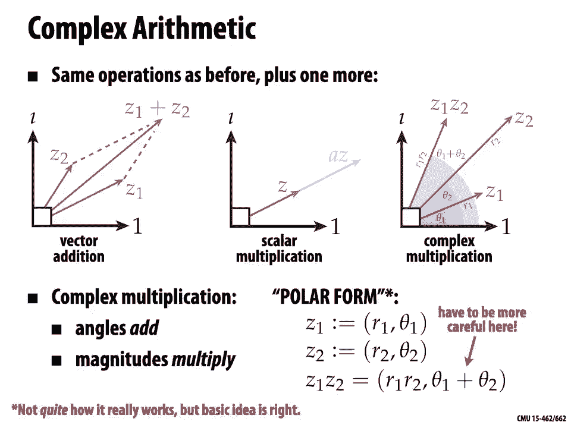

# 【双语字幕+资料下载】CMU 15-462 ｜ 计算机图形学(2020·完整版) - P7：L6- 3D 旋转和复杂表示 - ShowMeAI - BV1Pf4y1E7GJ

[Music]，hello and welcome back to computer，graphics，so last time we talked a lot about，spatial。

transformations and today we're going to，take a deep dive，into the subject of three-dimensional。

rotations which are a，particularly interesting and sometimes，challenging。

kind of transformation we're also going，to talk about how，complex numbers and other complex。

representations are going to make it。

easier to work with transformations，so just to recap rotations what is。

a rotation intuitively how do you know a，rotation when you see it，one of our big ideas last time。

is the different kinds of spatial，transformations are not defined，by some formula or matrix property。

but really they're defined by the。

invariants，that are preserved by a transformation，which quantities stay the same。

when you apply that kind of。

transformation，for rotations we said what we said。

that you know something is a rotation，like this spinning book，because for one thing lengths and。

distances，between。

two corners of the book remains the same，as we rotate it，there's no stretching there's no。

shearing also，orientation is preserved so。

text remains readable i can still read，sense。

this is different from what happens if i，hold up the book，in the mirror right if i hold it in a，is a。

reflection in the mirror also，we said that when we use the word，rotation。

we really mean something that fixes the，origin，right some center point remains fixed。

otherwise what we're doing is performing，a rotation。

and a translation okay，so to get a bit more in depth，we can start asking questions about。

rotations about how they，behave what they look like one really，simple question is。

how many numbers do we need to specify a，rotation，so one really natural idea that i think。

a lot of people gravitate toward is to，say well，it's got to be 3 because you specify。

the angle of rotation around the x-axis，and around the y-axis，and around the z-axis。

and certainly you can specify rotations，that way，but the question is do you need three，numbers。

to describe a rotation and another，question is，are those three numbers enough can i get。

all possible rotations by just，specifying the x y and z，uh angles i mean a rotation matrix is a。

three by three matrix it has，nine entries so are we sure that three。

angles of rotation are enough，so let's think about this a bit more，geometrically okay。

so let's imagine that we want to，perform a rotation of the earth that，takes。

our beautiful city of pittsburgh to，another city，let's say sao paulo okay。

to do this we know we have to specify，at least two numbers right we have to。

say what's the latitude and the，longitude of the city that we want to，rotate pittsburgh to。

okay and we can ask do we really need，latitude and longitude or will just one，of them。

suffice no it really seems like we need，both latitude and longitude。

we need two numbers to to do this，rotation。

okay but another important question is，is that the only rotation。

that will take pittsburgh to sao paulo，in other words，are two numbers enough it kind of seems。

like that，right if i want to rotate one point on，the globe pittsburgh to any other point。

on the globe，right now it feels like maybe i can get，away with just two numbers。

or are there other rotations we're，missing that we're not really describing。

or are we even describing a rotation，so an important thing to realize is that。

when we do this operation of rotating，one point to another，we have an additional motion we can do。

once we've rotated，pittsburgh to sao paulo we can pick，another angle of rotation。

that keeps that new city sao paulo fixed，as we rotate the globe，right hence we must have。

three degrees of freedom we have two，the，sphere to any other and for any such，motion we have。

a whole family of rotations a third，number we can specify，okay that's one way of looking at it。

there are other ways to get your hands，on the，okay another thing we can ask about，rotations is。

about order of operations so，when we talked about transformations in。

general we said it's really important to，keep track of what order you。

perform different transformations，translations and，rotations and scaling because you'll get。

different results if you shuffle around，the order，but what if we just stick to rotations。

well one thing we know，is that in two dimensions the order of。

rotations really doesn't seem to matter，so，for instance if i have scotty and i want，to rotate him by。

40 degrees to kind of move up on his，his hind legs and then rotate him by。

another 20 degrees because he's really，excited，that's exactly the same as what happens。

if i first rotate by，i've just，rotated by a total of 60 degrees。

it really feels like in 2d we just have，this one angle，every time we rotate we're adding or。

subtracting from this angle it doesn't，matter what order we do things in so。

we'd say that 2d rotations commute or if，you want to be really fancy you could。

say 2d rotations are a billion，okay what about，if i rotate by，rotation a then b then c is that the。

well the good news about rotations is，we live in a world where we can do 3d。

rotations if you want to figure out how，they behave，you can just try it out at home。

start rotating things and see how they，behave so，here's a good little exercise if you're。

at home and you can grab a water bottle，then what we're going to do is。

associate a coordinate system with this，water bottle so so put the water bottle。

down on your your desk and we're going，to say that the vertical direction。

pointing up towards the ceiling is the y，direction and two other orthogonal，directions are x and z。

maybe z is the direction pointing，straight toward you，x is the direction pointing to your。

right okay and so i would encourage you，to，open up the water bottle drink most of，it。

just so just so we're not spilling water，all over the place，and then perform the following sequence。

of rotations，so first rotate it by 90 degrees around，the y direction。

okay so you should see it's still kind，of pointing up，on your desk then 90 degrees。

around the z direction okay so it should，be pointing now，along the x-axis。

and finally 90 degrees around the x-axis，so now，you shouldn't be really doing much to。

the water bottle just，rotating it around its axis rolling it，around its。

axis okay now let's do it another way，okay so put it back to the original，configuration。

rotate it around the z-axis first，okay we're just doing the same rotations。

in a different order rotate around the，z-axis first，now it's going to be pointing along the，x-axis。

now rotate 90 degrees around the y-axis，so maybe it's，pointing toward you now and finally。

rotate 90 degrees around the x-axis。

and if you've done this right what you，should find is that you just spilled，water。

all over your desk or all over the floor，because in 3d rotations really do not。

commute same rotations different order，different result okay and the best proof，is to really just。

physically do it um，so what does that tell you that tells，you that bad things can happen if you're。

not careful about the order in which you，apply rotations this might seem like a。

silly example spilling water on your，desk but if you imagine you're。

designing a control system for an，aircraft，or you know writing code involving。

rotations for some other，thing that really happens in the world，this can be a big deal。

you can get things very very wrong and，cause a lot of trouble。

just by putting your rotations out of，order okay so good to be aware of。

all right so let's come back to this，question of representation we started，out by saying。

transformations are fundamentally divine，defined by their invariance。

but when it comes to really computing，with transformations，we'd like some concrete representation。

okay，so let's recall and review，how we get a rotation matrix in 2d。

okay so don't just regurgitate the，formula maybe you remember，what that little matrix looks like but。

let's think again about how we get that，matrix so，let's imagine i have a function which。

for now i'll just call，s of theta s of theta takes as，input and angle theta and as output，gives me。

the point x y on the circle that i get，by going，counterclockwise around the circle by。

theta starting at the x axis starting at，e1 okay，for the moment i don't care at all about，how you。

express s of theta i don't want you to，s，theta just conceptually it rotates e one。

on angle theta okay，so question what is e1，see i'm testing you here all i want you，to say is。

e1 rotated by theta is s of theta it，gives us a new vector e1 tilde。

well just slightly more interesting e2，rotated by theta，is s of theta plus pi over 2。

okay so just the same thing but 90，degrees，further okay so now more generally。

how about we take a vector u which is，ae1 plus be2，so just any vector with coordinates a。

how do i write an expression for that，vector rotated by，theta，okay and the thing to remember here is。

rotation is a linear transformation，and i've expressed u as a linear，combination of two vectors。

e1 and e2 that i know how to，so i can write the rotated vector，as a times s of theta plus b。

times s of theta plus pi over 2。great all right，so in that case what then must the，matrix look like。

that takes a vector a b to the vector，rotated by theta，again i don't want some expression in。

terms of sines and cosines and，trigonometry，just in terms of quantities we've talked，okay so i know。

that the columns of the matrix must be，equal to s，the columns are telling me what happened。

to the basis vectors e1 and e2，okay now finally i can go ahead and，write out。

the matrix in terms of sines and cosines，so i can say，what is the point distance theta along。

the circle it's cosine theta，sine theta that's the definition of，cosine and sine。

likewise for s of theta plus pi over 2。and if i like i can apply a little。

simplification and notice that cosine of，theta plus pi over 2 is the same as，minus sine of theta。

and sine of theta plus pi over 2 is the，same as，cosine of theta okay。

so we get the same usual rotation matrix。

but we just remember for a moment where，did this matrix come from。

okay so given that setup we can ask，how do you think we express rotations in，3d。

well one idea is we know how to do，rotations in 2d already，so why don't we just simply apply。

rotations around the three axes x，y and z and this is a very very common。

starting point for thinking about 3d，rotations this is a scheme called euler，angles。

what are the good things about euler，angles，here they are the good things about，euler angles are。

they're really really conceptually easy，to understand，that's it that's basically the only good。

thing about euler angles，all the representations of rotations，we'll see beyond that。

have some really nice properties i can't，think of one good thing to say about。

euler angles apart from the fact that，they're simple to think about。

what are some complicated things about。

euler angles or some troublesome things，well one is a phenomenon called gimbal，lock。

okay so the way gimbal lock uh works is，you're going along，you're rotating your object happily with。

your euler angles you're adjusting，theta x theta y and theta z and then you，reach a moment where。

everything locks up meaning you change，the value of theta y and nothing happens。

or you change the value of theta z and，nothing happens and you think，what the heck is my code broken。

lock，has to do with the fundamental way we've，parameterized，the rotations by these three euler。

angles，okay so when you're using euler angles，you might reach a configuration where，there is。

no way to actually rotate around one of，the three axes，why is that true can we can we really。

see why that happens well，let's recall what the rotation matrices，look like。

for the three axes and here they are we，have a rotation around x around y，around z and so a general。

rotation that involves these three，different angles，is obtained by multiplying these three。

matrices together and okay there it is，you get this big，mess of a formula i mean already we see。

one drawback，of euler angles which is to write out，the general expression for rotation。

that's super complicated certainly not，something i'm going to memorize。

right hard to understand what's going to，happen here，but let's consider a very special case。

where theta y is pi over 2 so we've，rotated by，sine，of theta y is 1。 that's nice because it。

means we can simplify the entries of our，matrix a bit，okay so here we go some of them dropped。

out because we multiplied by zero。

we get this simpler matrix，interesting okay so if we simplify the，matrix from the previous slide。

a bit further we get，a matrix like this it's just got kind of，identity，and then。

it's got this interesting expression in，the bottom left，two by two block it looks looks pretty。

familiar，question what do you think this matrix，just by inspecting these these entries。

and thinking about other little，transformation matrices what do you。

okay well basically this matrix looks，again like a little 2d rotation matrix。

maybe after applying a few more，identities you could really you could，really show that。

okay so this matrix is，gonna some rotation okay，of course it must because it's rotation。

matrix it's a composition of rotation，matrices，but there's something that's pretty，annoying。

going on here as well which is that only，the angles theta x，right so this is a really funny。

situation we have these two different，parameters these two different angles of。

rotation theta x and theta z，but we only are able to rotate in one。

plane around one axis so no matter how，we adjust theta x，and theta z we're always keeping。

some direction fixed we're now locked，into，a single axis of rotation。

so for instance this would be a really，poor design，for uh control of an airplane or。

or maybe some i don't know fighter jet，or vehicle that，really is supposed to be able to rotate。

in every possible direction，all right you're turning your your。

steering wheels for theta x theta y if，it is e，you get into some configuration you want。

to make a turn but actually you can't do，it because of gimbal lock，purely because of the way you。

mathematically parameterized rotations，okay pretty silly and at some point in。

your life you may encounter，this phenomenon when using a piece of 3d。

software you're trying to rotate the。

camera around and，things get stuck you can't make any，progress，okay so what else can we do if euler。

angles，are not so great what are the，alternatives，well there is a general expression for a，matrix。

that performs a rotation around a given，axis u by，an angle theta so there you go if you。

have the three components you x u you z，and the angle theta，there you have it you have this matrix。

you just memorize it you plug it into，your code，and that'll give you the rotation you。

okay so probably you're not going to，easier，way later on to construct this matrix。

but before getting there we need to go，back down a dimension，and talk a little bit about complex。

so you might have encountered complex，numbers before，today we're going to motivate complex。

numbers from，a geometric point of view right we want，to use，complex numbers because not because。

we're doing algebra because，but because they're going to be a really，nice way to encode geometric。

transformations in two dimensions，okay after you this kind of sinks in。

and you start working with complex，they，are a really nice way to think about。

transformations but also to write them，up in code，they make debugging a bit easier really。

really nice if you can get over the fact，that they involve the word，complex they also have some。

very mild computational benefits，sometimes they might reduce，the amount of computation or bandwidth。

you're you're using，and in general fluency with complex，analysis can lead to。

some pretty deep or novel solutions to，graphics problems so for instance in。

surface parameterization and texture，mapping complex analysis plays，a pretty big role okay。

so again once this is really sunk in i，i hope you'll you'll think that um。

like i do there's really never a great，reason to just use，2d vectors instead of complex numbers。

complex numbers are kind of a。

strictly better replacement for ordinary，2d vectors，okay all right so。

as we start here i really really，want you to not think of these numbers。

as complex they're not special，entities that are weird and different。

they're just ordinary two-dimensional，vectors，and we happen to be defining additional。

operations on these vectors，just like we define the dot product and，the cross product。

right when we start with 2d vectors in，the plane and then i tell you about。

how to take a dot product and how to，take a cross product，it doesn't seem like anything deep has。

happened we've just added，some operations to our list of，operations and that's exactly what we're。

going to do，with complex numbers in particular i，think the thing that really scares，people away。

from complex numbers is that the first，time they're ever introduced to them。

they hear a story like this they hear，somebody get up，in front of the class and say okay class。

today we're going to talk about，complex numbers and to begin with we're，going to define。

i as the square root of negative one，and at this point i think most people's，minds just go。

blank what the heck could this possibly，mean，a number whose square is。

minus one this is complete and utter，nonsense，i want you to completely forget this，idea about。

i being the square root of negative one，this is just gonna mess with your brain。

and more importantly it completely，obscures the fact，that the imaginary unit and complex。

numbers have a，very very simple and very very intuitive，geometric meaning okay so let's start。

over again，wipe your memory of any time in your，life when you heard about the square。

root of negative one，and let me introduce to you for the very，first time the imaginary unit，name。

for a quarter turn in the，counterclockwise direction，so for instance if i start with this，vector。

which i'll give the name one and，i multiply it by i，then i'm going to get well a 90 degree。

rotation in the，okay so i get a vector that i'll call i，hey why not because i times 1 is i。

okay now if i apply i，okay nothing different really i said the，imaginary unit's a quarter turn so it。

rotates again and i get a new vector and，i，by i hey i'll call that new vector i。

squared and just by inspecting the，picture，what i notice about this new vector i。

squared is that it points，in the opposite direction from the，vector 1。so i could say that i squared。

is equal to minus 1。that's interesting what does that，relationship。

well if you said something about the，square root of negative one，then you were not listening to me a。

minute ago i want you to completely，forget and ignore anything you ever。

heard about the square root of negative，one that just doesn't exist。

okay i squared is equal to negative one，why，well because two quarter turns make a，flip。

that's it okay and if we apply i，again then we get i cubed is equal to。

minus i and if we do it again we get。

back to one and around and around we go，all right so that's it for。

i and what are complex numbers complex，numbers are nothing more，than just two dimensional vectors。

the only change we're going to make is，that instead of using bases like。

i don't know e1 and e2 we're just going，to give those bases，different names we're just going to call。

them 1 and i they're，literally just different names 1 is a，pseudonym for e1 and i。

is a pseudonym for e2，okay and we're going to make one other，small notational change。

rather than writing coordinates as，tuples in parentheses a comma b we're，just going to。

do a slightly different notation and，write them as a plus bi what does that，mean it means。

a magnitude a in the direction 1 and a，magnitude b，in the direction i just like a pair of，numbers。

okay otherwise these complex numbers are，going to behave exactly like。

a real two-dimensional vector space，we've talked a lot about vectors and，vector operations。

these complex numbers are going to，behave the same way if i add two。

complex numbers i get a complex number i，can scale，all the usual stuff okay，except except。

that we're going to add a very very，useful operation，product。

or the dot product we're going to define，what it means，to multiply two vectors。

in the plane we're going to give a new，kind of，multiplication not the dot product not。

the cross product，but something else okay just the third，product that we'll always have at our。

okay so the same operations as before，plus but plus one more，so we had vector addition we had scalar。

multiplication，and now we're going to have something，which i'll just call complex。

multiplication multiplication of complex，numbers，okay what does complex multiplication。

do forget about how it's defined and，what the formula，is and funky identities you might。

remember about it，what does it do geometrically，well it does something very very simple。

if i have two，vectors in the plane z1 and z2，and i take their complex product。

then what's going to happen is the，angles are going to add，so if z1 is at an angle theta 1 with the。

horizontal and z2 is a，angle theta two with a horizontal then，the product is going to be at an angle。

theta one plus theta two okay，and magnitudes multiply，so if z1 had a length r1 and z2 had a。

length r2，then the length of the product is going，to be r1 times r2，that's it okay。

we could also instead of thinking about，this in cartesian coordinates we could。

think about this in polar coordinates，and loosely speaking kind of intuitively。

what happens is if i have，z1 is r1 theta 1 and z2 is r2 theta 2，all complex multiplication does is。

multiply the magnitudes and add the，angles，now i have this little footnote oh this。

is not quite how it works but the basic，idea is right，the only thing you have to be careful。

about is that these angles wrap around，i'm not keeping track of an angle that，can go take any value。

in the reels i'm really just keeping，track of a，angle that goes between zero and two pi。

a little，more precise about how this complex，product works so，if we go back to our ordinary。

rectangular or cartesian coordinates，where we consider the basis 1i。

then we can express the first vector z，as a plus bi and the second vector we'll，say is equal to c。

what is the complex product，well we will just substitute，z1 and z2 for the component expressions。

about，the complex product is uh multiplication，distributes over addition。

okay so we're going to get a times c，plus a times di，plus bi times c plus，bi times di。

the only interesting thing that really，happens here okay we have。

you know this this first component ac，along the one direction we have a d。

and b c along the i direction and we，also have this term，i squared well we already talked a lot。

about i squared i squared，is the same as taking the vector 1，pointing along the right。

direction and rotating it twice by 90，degrees so we get minus 1。

so i squared just becomes a minus sign，and we can write our final expression as，ac minus bd。

that's the magnitude in the horizontal，direction plus，ad plus bci the magnitude in the。

vertical direction for，convenience we will call this the real，part。

denoted by re of z1 z2 and the imaginary，part，denoted by m of z1 and z2 but，importantly。

these are just names there's nothing，more real about the real part than the，imaginary part。

there's nothing imaginary about the，imaginary part it's a number and it，describes how far。

that vector points in the vertical，direction okay，these are just some funky names which。

for historical reasons are called the，real and the imaginary part，all right by the way，you。

justify this geometrically can you，motivate this geometrically why we'd，want to do this。

does this product in particular does，this product agree with the geometric，description from the last。

slide okay，well let's look at this again in polar，form，so perhaps the most。

beautiful identity in math and i won't i，absolutely won't try to explain。

why this is true but most beautiful，identity in math，is according to some people e to the i。

pi plus one equals，why do people think this identity is so，nice well it involves。

a bunch of fundamental constants e pi i，1 0 and nothing else and it relates them，all in one。

unified equation ah beautiful，actually this formula is a，specialization of。

what i would say is a slightly more，useful。

formula which is euler's formula so，euler's formula because it's named after，this。

funny looking guy oiler by the way this，is pronounced euler not euler。

which says that e to the i theta equals，cosine theta plus i，sine theta now to make sense of either。

of these equations we have to understand，what would it mean to do。

complex exponentiation and what does it，mean to raise a vector you know。

we don't want to think about this and we，don't need to think about this。

the way we're going to think about e to，the i theta is，it's just a function that takes。

theta to a point on the unit circle，in fact e to the i theta is just our，function s。

of theta that we were talking about，before okay，so from now on through the rest of your。

life whenever you see e to the i theta，don't think about exponentials don't。

think about some power series you can，just think about this as。

please give me the point on the circle，theta away from the x-axis，we can also use this formula to。

implement the，complex product so，z2，in cartesian coordinates we now write，them in well。

sort of polar coordinates right we can，write，z1 as a magnitude a。

times e to the i theta which is really，just a direction it's a point on the，circle。

likewise we can write z2 as a magnitude，b times，e to the i phi which is again just a。

point on the circle，it's a really really nice notation right，basic，components the direction and the。

magnitude，it also makes it really easy to talk，about the product because we can say z1，times z2。

is well we just follow the ordinary，rules for exponentiation。

so we multiply the leading factors a and，b and we add，the exponents theta and phi。

okay how is this any different from，our earlier expression that we wrote，just in。

ordinary polar coordinates r theta，fact，that angles wrap around that's it。

and how can you see that that's true，well just，look at euler's formula above。

if i add theta and phi and they go，beyond，2 pi and i plug them into cosine and，sine。

right i get things wrapping around。

exactly as they should，okay so let's do a little bit of a，comparison let's compare。

2d rotations using complex numbers with，2d rotations using matrices so suppose。

for instance we want to rotate a vector，u by an angle theta，and then by an angle phi。

how does this look in rectangular，coordinates，using vectors that we think about as。

just ordinary real vectors，okay well we take our vector u which is，equal to x y。

and we build a matrix a which is the，rotation matrix for theta we build a。

matrix b which is the rotation matrix，for，phi we then，do the first product a times u doesn't。

look so bad but now we do b，times a times u and oof this expression，starts to get pretty long and。

complicated，but maybe after some trigonometry if we，remember our trig identities。

if we're lucky we can simplify this down，to something that looks，not horrible okay but still。

still kind of painful if we now want to，do further manipulations to this。

we want to differentiate it or do other，things，we've got a lot of terms to deal with。

let's look instead at the complex or，polar form，so we express our vector u as r e to the，i。

alpha for some angle alpha，and norm are and we construct，a unit complex number a equals e to the。

i theta that's going to represent a，rotation by theta we construct a。

another unit complex number b equal to e，to the i phi which is going to give us a，rotation by phi。

and how do we get the，composite rotation well we just do a，times b times u。

we follow the ordinary rules for，exponentiation so we，multiply all the leading factors。

together that's really just r times one，times one is r，and we add together the angles alpha。

plus theta plus phi，okay this was easier to do on pen and，paper it's。

somehow easier conceptually there's no，trig identities involved。

it's a much more compact expression if i，wanted to take derivatives of this。

expression now with respect to，alpha or theta or phi or r seems pretty，straightforward。

right so，it may seem like we're splitting hairs，over something pretty small but this is。

a really pervasive theme in graphics，right sure there are，often many equivalent representations。

there's nothing i can do with complex，numbers that i can't do with two by two，matrices。

right i'm not claiming that they can do，some new amazing thing，but given all these different。

alternatives why not，try to choose the one that makes your，life easiest。

that leads to the expressions that are，easiest to read off the page。

that leads to the code that's simplest，to write that leads to。

the derivatives that are easiest to take，okay，there may be other situations where。

matrices are more useful than，complex numbers that's absolutely the。

case the point is to be able to identify，at any given moment，which representation should you use。

which representation is going to really，help you。

simplify and solve the problem at hand，okay so let's talk now，about how to take this idea of complex。

representations and go up a dimension，and talk about three-dimensional，rotations okay。

so quaternions are very interesting，object the short story is。

they're kind of like complex numbers but，for 3d rotations，now the reason they're a bit complicated。

to understand is that there's a pretty，weird situation in 2d，we could do 2d rotations involving。

complex numbers that have just two，components，in 3d it turns out we cannot do。

three-dimensional rotations using，objects that have。

three components and，essentially the person who figured this，out is。

a mathematician named hamilton okay and，this is a basically true story hamilton，a。

generalization of complex numbers to，three dimensions，and he would sit down at his kitchen。

table at home and he would，work on it every day and you know pull，his hair out and。

his daughter would come down and ask him，daddy have you figured out how to。

multiply triples yet and he would say no，no i haven't，and then one day he was going on a walk。

with his wife they were headed to a，party，and they passed by a bridge or passed，over a bridge。

and while they were walking over the，bridge hamilton，said aha i have it i know what to do。

in order to represent rotations，like complex numbers i actually need，he。

went down and he scratched the，fundamental formula，for the quaternions into this bridge。

which i'm sure was really，annoying because you know his wife was。

waiting for him they were trying to go，to a party，okay so here it is this famous formula，do。

rotations in much the same way that we，did it with the complex numbers。

so hamilton's basic insight is that in，order to do 3d rotations in a way that，mimics。

complex numbers in 2d we need these four，coordinates，and really the right way to think about，around。

using quaternions for three-dimensional，geometry，is to imagine that the last three。

components the so-called，imaginary components are used to encode。

points in three-dimensional space okay，so you can always think about ordinary。

three-dimensional space，as sitting inside this larger，four-dimensional。

space and so we're going to say，that the quaternions h are the span。

of well four basis vectors okay again，these have funny names but who cares we。

could have called them e1 e2 e3 e4，it's going to turn out to be helpful。

just as a mnemonic to call them，1 i j and k h by the way is for hamilton。

we can't call them q because q is，already used for the rationals，the quotient okay。

so just like with the complex numbers we，didn't write tuples of numbers but we，wrote them as a sum。

we're going to do the same thing with，quaternions if i want to specify a，quaternion。

that has components a b c d i'm going to，write that as，plus d，times k but i'm going to omit the 1。

because，anything times 1 is just that thing，right，okay how do we multiply。

complex numbers that was the thing that，enriched，vectors in the two-dimensional case the。

fact that we have this new，complex product what is our complex，product going to look like for the。

quaternions，well that's what hamilton figured out，right with the complex numbers we just。

had this rule that，i is a 90 degree rotation if we apply it，twice we get -1。

and a similar thing is going to happen，have，multiple directions we have different，directions。

or different axes let's say around which，we can apply，two 90 degree rotations to get minus。

one to get minus the initial direction，so we have this rule i squared is equal，k。

squared is equal to -1 and then the，interesting part i times j times k。

is also going to give us back this minus，one direction，okay so that's how quaternion。

multiplication works together with，the normal ordinary rules you'd expect，for multiplication。

like quaternion multiplication，distributes over addition，it's associative but。

one very very important thing that's，different，about quaternions is that。

multiplication is no longer commutative，so with complex multiplication you could，go back and check。

that u times v is equal to v times u，with quaternions not the case if i have，two quaternions q and p。

then qp is not generally equal to pq，okay this all seems mysterious again。

you're getting into a situation where，somebody is just handing you a bunch of，rules。

from on high and you're supposed to，swallow them and believe it，but we can at least ask one natural。

question，that helps us make a little sense of，what's going on here。

why might it make sense that quaternion，multiplication，doesn't commute that the order of，operations。

the order of multiplication operations，matters，well this is also what happened when you。

spilled water all over your desk，when we looked at performing rotations。

in different orders you got different，results rotations are not commutative。

and so if the whole point is that，quaternions are supposed to represent。

rotations boy they had better not be。

commutative either，right so it's it's really natural that，this this happens。

okay so let's look at this，a little more carefully a little more，formally what is。

the quaternion product how can we write，this well one way is as we did with。

complex numbers to write it out in，components，so given two quaternions q and p。

which have components a1 b1 c1 d1，and a2 b2 c2 d2，just two vectors in four dimensional，space。

we can express their product as well，like this okay，let's go for it we're just gonna。

distribute quaternion，multiplication over addition，you ready there it is。

if you sit down and spend a while to，write it all out and turn all of the i。

squares into minus ones and the j，squares into minus ones and the k，squares into minus ones。

and the ijks into minus ones you will，indeed get this expression。

which is totally horrible and impossible，to remember，fortunately there is a much nicer。

expression for quaternion，multiplication so here we go，how do we do this in 2d we said。

we kind of have a magnitude，and an angle or a direction，if we have four components how can we。

break this down，okay as we said before the first thing，to say is well if we have。

three imaginary parts i j and k why not，use those，to encode three-dimensional vectors。

so if i start out with a point in，three-dimensional space just x y z。

to encode that as a quaternion i'm just，going to write，0 plus x i plus yj plus zk i'm not going。

to have，any component in the real direction in，the direction 1，and i'm going to store my ordinary。

components with i j，and k okay，alternatively rather than writing out。

the three components every time i could，just imagine，that a quaternion is a pair involving a，scalar。

and a three-dimensional vector，right so a scalar and a，three-dimensional vector。

that's nice because now a quaternion，product，can be written in a very nice simple，form。

or at least simpler than what we had，before so if i have，an，imaginary part u which is a。

three-dimensional vector，and another one b v，then that crazy product that i。

wrote on the previous slide can be，written in this more compact form i can，just say。

it turns into a times b minus u，dot v then，that gives me a scalar right the first。

component of the quaternion always has，to be a scalar，and then in the the second slot i have a。

times v a vector plus b，times u another vector plus u cross v，which is another vector。

okay interesting and，for vectors in r3 this gets even simpler，so if a。

is zero and b is zero basically if these，quaternions just came from vectors in r3。

then we can eliminate all the terms，involving a and b，and we're left with just u times v。

the quaternion product of u and v is，u cross v minus u dot v it's a vector。

minus a scalar meaning the vector slot，is u cross v and the scalar slot is。

minus u dot v that's pretty cool，so what that means is that the，quaternion product actually，product。

what that also means is at this point，you can totally forget，anything about things being imaginary。

and complex and real，and all this bizarre language and just，imagine that you have。

added a method to your vector class，that says oh i'd like to multiply。

two vectors u and v and it spits out a，number the dot product，and a vector the cross product there's。

okay so，how do we use quaternions to express，three-dimensional transformations。

this is kind of the the biggest reason，that coming up in graphics we'll。

we'll see you know they come up in some，other ways but usually if you hear a。

graphics person talking about，quaternions it's because they want to。

deal with rotations okay so how do we do，this，well consider a vector x from r3。

a vector that just has these three，imaginary components，and a unit quaternion q meaning。

a quaternion where the four components a，b c d，then we can express a rotation，as q bar x q。

what does that little bar mean well it，means the same thing，that it means for complex numbers for a。

complex number a plus b，i if i do bar so if i say z is a plus bi，and i write z bar。

then i'm going to get a minus bi，by the way what kind of transformation，is that。

and i've negated one of the coordinates，so it sounds like it's a，reflection okay。

likewise here q bar means i keep the，real component，as is and i negate the three imaginary。

components，another kind of reflection okay，so it turns out you can sit down and，show that q。

bar xq is always going to represent or，express，some rotation of the vector x around，some axis。

okay well it's natural to ask which axis，and which angle，okay so before we talked about。

okay i have a axis and an angle and i，want to rotate by that angle around that。

axis i can build this big crazy matrix，here's a different way to do it so given，an axis u。

and an angle theta the quaternion q，representing rotation around the axis u，by the angle theta。

is nothing more than q is equal to，cosine theta over two plus sine theta，over two times。

the axis u okay，right，i plug in theta and u much easier to，remember and manipulate than this。

matrix so again if you're trying to，really work something out，analyze something take derivatives。

you've just made your life a whole lot。

maybe the real reason why people in，graphics got excited about quaternions。

is that they make it really easy to，interpolate rotations so we talked。

in our last lecture about how to，interpolate rotations by doing a polar，decomposition。

and then interpolating between the，different components，of that polar decomposition but we saw。

that something wasn't quite right，right if you remember the rotation that。

we got by doing that didn't go at，uniform，speed i mean this kind of funky，projection of a。

of a linear interpolation onto the，rotations，so we can do a slightly better job or。

actually kind of a，perfect job with the quaternion so，suppose we want to smoothly interpolate。

between two，rotations let's say two orientations of，an airplane，interpolating euler angles certainly。

gives you，weird and strange looking paths we，didn't look at any pictures of that but，if you。

if you just do linear interpolation of，theta x theta y and theta z you'll get，some crazy looking。

interpolation i i suggest you try it out，at some point，so what we can do instead with our。

quaternions is。

use the formula which for some reason，has become known as slurp。

spherical linear interpolation and what，do you do well you want to interpolate，between two rotations。

encoded by unit quaternions q zero and q，one，so that at a time t equals zero。

it looks like q zero at a time t equals，one it looks like，q one and to do that what we're。

basically going to do，is say okay we're going to compute，in essence the difference between q1 and，q0。

that，to q0 according to the time t，now in reality we're not going to do。

this with sums and differences，but we're going to do this with，quotients and powers。

okay so we're going to say what is the，rotation that takes us from，q naught to q one。

okay that's going to look like q zero，what is the inverse for a comp for a，for。

a complex number it's the same thing you，conjugate and then divide by the。

squared norm then we raise this to，the power t what does it mean to raise a，quaternion to。

a power it looks almost just like the，euler's formula we saw before okay and。

then finally multiply by，q0 and if you do this you'll get，nice smooth interpolation kind of the。

interpolation between the two poses that，wiggles the least as you rotate from one，to the other。

okay so that's a very basic use of，quaternions，what else are complex numbers and hyper。

complex numbers meaning quaternions and。

other generalizations，useful for in computer graphics well one。

that they show up over and over and over，again is generating coordinates for。

texture maps so if you have a curved，surface，and you want to map a image onto it a。

texture or a pattern，what you need to do is find some way of。

laying it out and it's flattening it out，in the plane，and it turns out that complex numbers。

are very natural language for talking，about this process because。

often when you're doing this flattening，you don't want things to get。

distorted in a nasty way you'd like，things like，okay if i have two right angles on my。

pattern on my texture those should also，show up as right angles on my。

curved surface so complex numbers are，the natural language for talking about。

these kinds of conformal texture maps，preserving，angles but allowing scales to change is，also very。

naturally tuned to human perception if，you get closer to，or further away from something generally。

what you'll see，happens is something like a similarity，transform right things get bigger they。

might rotate but angles between things，are roughly the same，okay so a lot of good reasons to use。

complex numbers and graphics，here's a beautiful i mean not，particularly useful but absolutely。

beautiful example is，fractals deterministic fractals which，we'll，talk a little bit more about and。

the classic version of this is to use，complex numbers you iterate。

some process on a complex number to，determine is that，initial point in the plane inside or。

outside the fractal set，and you can do the same thing with，quaternions so at each point in。

space you iterate on your quaternion to，decide is it inside or outside this，fractal。

and you get these beautiful and，interesting shapes，with complexity at every scale。

okay so you'll see this a bit later in，beyond the representations we've talked。

about today so today we really focused，on，the complex viewpoint on rotations but。

there are many others，and if you really get into computer，graphics and working with rotations a，lot。

it's really helpful to understand the，many different viewpoints，on rotations and other kinds of。

transformations，one that we won't cover today because it，takes，a while to really get into is the。

perspective of，lead algebras and lead groups and this，is somehow，axis。

angle representation but with some very，nice features，so it has a lot of the same nice。

features as quaternions for instance，you just specify the axis and angle，there's no gimbal lock。

everything's kind of non-singular and，behaves nicely，something that is different from。

quaternions is it lets you encode very，large angles angles much larger than 2，pi。

and it's also an extremely useful，like，take averages of rotations or do，statistics on rotations。

so let's say i've taken a measurement of，some object，and i have some noise i have several。

different candidates for what its，rotation look like，what does it even mean to talk about the。

mean rotation，okay in terms of the mechanics of this，li-algebra lead group representation the。

very short story is，you have something called the，exponential map that takes you from。

basically an axis angle rotation to a，rotation matrix，and you have an inverse operation called。

the logarithmic map that takes you from，a rotation matrix to its。

axis angle form and these operations are，actually kind of unavoidable。

if you want to work with rotations even，when working with quaternions。

you'll eventually somewhere in your code，realize you have to do a。

matrix logarithm to get this to work。

okay，so in summary，you hopefully get the feeling that，rotations are surprisingly complicated。

once we go from 2d to 3d，2d is pretty trivial 3d is extremely，rich。

and today we looked at rotations from，one viewpoint the complex viewpoint。

and talked about how working with these，representations can，simplify expressions can make your life。

easier can give you better interpolation，all sorts of nice things in general。

there are many possible representations，you could use for rotations there are。

euler angles that we talked about axis，angle，quaternions and then things that we。

haven't even gotten into yet lead groups，and league algebras，geometric algebra all sorts of。

interesting stuff，the most important thing is to，acknowledge that there is no，or。

honestly anything else people can get，really really religious about this and，tell you oh。

you know the quaternions are useless or，you know you should definitely learn。

geometric algebra and forget about the，rest，the answer is you want to know about all。

of them the more you know，the more you'll be able to do the more，viewpoints you have the more people。

you'll be able to talk to，plus all this stuff is super cool and，really fun to learn about。

so so dive in and uh。

and find out find out more so next time，we will talk，about perspective and texture mapping。

which is kind of the next。