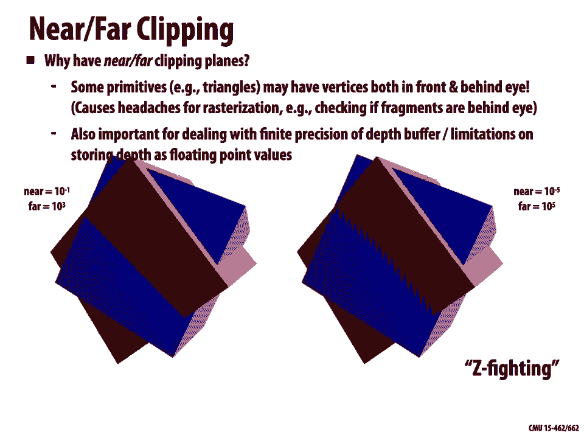

# 【双语字幕+资料下载】CMU 15-462 ｜ 计算机图形学(2020·完整版) - P8：L7- 透视投影和纹理映射 - ShowMeAI - BV1Pf4y1E7GJ

[Music]，welcome back to computer graphics today，we're going to talk about。

perspective projection and texture，mapping so，previously we have been studying the。

whole rasterization pipeline how do we，turn，primitives like triangles into actual。

pixels on your screen，and also spatial transformations how do，we manipulate these primitives。

in space so today we're going to see，where these two，ideas these two perspectives kind of。

come crashing together，we're going to revisit perspective，transformations talk about how to map。

textures onto primitives to get more，detail to get，more richness in our images and talk。

a little bit about how perspective and，these transformations，cause challenges for this texture。

mapping。

process so let's，take a deeper look into perspective，projection。

and so perspective is this effect that，we're all familiar with，distant objects in the world appear。

smaller as they get further away from us，and also we notice especially in this，image that。

parallel lines converge at，the horizon and we've talked a little，bit about why that。

why that happens from a mathematical，point of view but this is really，something people have been。

struggling with for many years in image，generation，so if we go back for instance and look。

through the history of，painting we can see that people really，struggled to get accurate perspective。

here you might notice that the，place where the the person is seated has，some kind of。

perspective some converging lines but，then the box on the floor has parallel。

lines that are going off in a different，direction，the perspective isn't quite right and。

as we go through the history of painting，we'll see that things start to evolve a，bit more。

toward correct perspective until people，finally，understood something about vanishing，lines and。

and so forth later on as people，mastered perspective they said well，actually we can。

reject perspective now that we can，understand it we can play all sorts of，games with it。

to do interesting things about，perception，but when we come back to computer。

graphics people said yeah let's，first figure out the mathematics how do，we get this really correct。

and are able to make these beautiful，photorealistic images，where lines converge and behave the way。

that they do in the real world that they，do when we look at objects with our eyes。

again once we had mastery over this idea。

of perspective people turned around and，said yeah but sometimes when generating。

computer generated images we don't want，this perspective，effect if i'm making a map of a city or。

if i'm looking at an engineering，schematic，it might actually be helpful to have a。

different kind of projection，like an orthographic projection where，sizes。

are more predictable or more preserved，okay so let's go back and talk about。

the whole sequence of transformations，that happens to，an object a primitive as it goes from。

the input description，to its final location on the screen，so we'll start out with some object。

described in world coordinates，like you might remember from our first，lecture we specified a。

cube by just giving the location of its，vertices in some，absolute global coordinate system。

we then might want to transform these，initial coordinates，according to the configuration of a，camera。

so if our camera is positioned and，rotated in a certain way，we actually are going to apply the。

inverse，translation and rotation to our input，coordinates，to effectively position the camera。

one thing we'll talk about today is that，these，coordinates are often then mapped into。

what are called，clip coordinates so into a sort of，standard，cube that's going to make it easy to。

throw out，things that shouldn't get drawn once we，have that set of。

objects that will be drawn we will，map them to two-dimensional coordinates，through some kind of。

projection process whether perspective，or orthogonal projection this gives us，coordinates in some。

normalized coordinate space and some，let's say，square from -1 to 1 and then to map that，onto。

the actual target image we have to，stretch it out by the size of the image。

and at this point we finally have，primitives in 2d locations of our，vertices for triangles。

or whatever in 2d that we can go ahead，and，turn into pixels using the rasterization，process。

okay so just as a little warm up let's，remember，how we might do a spatial transformation。

like the one we use to position our，camera，so as a concrete example let's imagine，we have a camera。

centered at the position four to zero，and it's looking down，the x-axis and we have our object。

given to us in world coordinates，so a basic question is what，spatial transformation what 3d。

transformation，would put this object in a coordinate，system，where the camera is sitting at the。

origin，looking down the minus z axis，so how do we get things into this，standard。

okay well one way to think about this is，that from the perspective of the camera，it's sitting。

at the center of the universe so every，other object，should be expressed relative to the，location。

of the camera one way of thinking about，this is that we subtract，the camera center four to zero from。

the coordinates describing our object，in other words we translate the object，vertex positions。

by minus four minus two zero，okay then we have to deal with the fact，looking。

down the x-axis is different from the，canonical direction we want to use for。

rasterization we want to be，always imagining that we look down the，minus z-axis。

of course in this case we can do this by，just a simple rotation we can，rotate about the y-axis by。

pi over 2 and now we'll，effectively have aligned the camera's。

in general of course our camera could be，looking，any direction right so let's say the。

camera is looking in a different，direction w，which is just a vector in r3 okay。

now a slightly more challenging question，what transformation should we apply or。

how can we cook up a transformation，system，where the camera is sitting at the，origin and looking。

directly down the z axis or the minus z，axis and here let's just imagine that，the。

camera is already sitting at the origin，right we know，of course how to perform a translation。

really what we're looking for is what is，the rotation，that will effectively make it look like。

the camera is pointing along，so this is a moment where you realize，yeah 3d rotations。

they take a little thought it takes a，little work one way you could do this。

is you could as kind of suggested by the，diagram，you could construct two other vectors u，and v。

that are orthogonal to w，okay so for instance i could pick，some direction v。

then i'm going to consider the up，direction which direction is，up so some vector v orthogonal。

to w by the way how do i get a vector，orthogonal to w well i could pick some。

rough up direction that i think should，roughly be the direction that points up。

and then i could orthogonalize it i，could remove，from that vector the component in the，direction w。

right take the dot product of my，initial v with w subtract that from v。

normalize v this might remind you for，instance of the gram-schmidt，process okay。

once i have two orthogonal vectors，v and w i can get the first the third，one by just taking a，w。

cross v once i have three，orthogonal vectors i have a new，orthonormal coordinate system so i can。

build a corresponding，are，in the columns u v，does this，matrix do what kind of linear。

transformation does this，apply well it's a，rotation matrix because we're just。

changing the coordinate system right，we're keeping the origin fixed we're，mapping lines to lines。

and distances aren't getting stretched，out in any way they're just getting。

rotated into a new coordinate system in，particular，if we think about how this matrix acts，on the。

canonical coordinate vectors 1 0 0，0 1 0 and 0 0 1，right we think we see that what it does。

is it maps the x，axis to u the y axis to v and the z，axis to minus w，okay now this isn't quite the。

transformation we want，right because remember that in order to，transform the camera。

what we really do is we apply the，inverse transformation to all the，objects。

so how do we get the inverse of，the matrix r do you remember how to do。

there's something very special about，rotation matrices that makes them。

particularly nice to invert which is，that the inverse of a rotation matrix。

is just its transpose and if you don't，remember why maybe go back，and see our lecture on spatial。

transformations，but all that means in this case is we，just put the three vectors u v and w。

in the rows rather than the columns of，the matrix，okay just a little refresher of。

so an important object in the，rasterization pipeline，is then the view frustum the viewfrustum。

is the region this final camera，can see and just to keep things simple。

we always imagine that the camera，is sitting at the origin and pointed，down。

the minus z axis that's why we went，through this exercise，of doing the particular camera。

transformation that we did，so what is this viewfrustum all about，why do we say this is the region of。

gray，box well we can think of the，top bottom left and right sides planes，of this box as the four。

sides of the image that we want to draw，right anything that's to the left of the。

image to the right of the image above or，below，we shouldn't bother drawing primitives，in that region。

here by，z near and z far are，giving us the closest and furthest，things that we want to draw。

so we want to toss out anything closer，than zenier，and anything further than zfar and we'll。

talk in a minute about，why we want to do it it's not completely，out，so once we have this viewfrustum。

this box that says hey these are the，only things we want to draw，then clipping is the process of。

eliminating triangles，not inside this viewfrustum，okay so if a triangle lands inside the。

box we draw it if the triangle lands，outside the box we don't draw it。

why do we even bother with this clipping，process，well one answer is that we don't want to。

waste time rasterizing primitives that，we can't see，right if you think back to our algorithm。

for drawing a triangle it，actually takes quite a bit of，computation we have to test。

for each pixel is it on the inside of，each half plane and so on and so forth，just。

tossing out fragments tossing out pixels，that aren't on the image，but。

this is doing a lot of work for very，little reward，right so discarding individual fragments。

is doing this clipping process at a very，fine granularity，it makes a whole lot more sense to try。

and toss out the entire triangle，before we even step into this algorithm，for rasterization。

so we want to do a coarse granularity，test，of whether the triangle can be seen and。

by the way this is generally a really，useful strategy，in computer graphics try to go course to，fine。

any time you can do a quick and dirty，check to see if，something's even worth doing you've。

saved yourself a whole lot of effort，okay now unfortunately it's not。

quite as simple as just checking is the，triangle inside the box or outside the，box。

we still need to deal with primitives，that are partially inside the box。

and there's some pretty interesting，two，vertices could be inside or one vertex。

could be inside in kind of an，interesting way，generally the way that clipping is done。

in a real rasterization pipeline，is we take any partial triangle and we，split it up。

into several sub-triangles you can see，this might end up giving us a triangle。

or a quad that gets split into two，triangles or a pentagon they get split，into three triangles。

why might we go all the way to splitting，this into triangles，why not just take the clipped primitive。

the quad or the pentagon，well the reason goes back to something。

very important that we've discussed with，the rasterization pipeline。

which is that we're really trying to，build a pipeline that does one thing。

really really well and really really，fast which is to draw，triangles onto the screen so。

what we're always interested in doing is，reducing the general case down to。

the special case the specific case of，just drawing triangles，okay so this is another thing your。

graphics card will have is specialized，hardware，for taking polygons and clipping them，into triangles。

okay one question we haven't yet，answered is，why do we have these near and far。

clipping planes why would we want to，toss out things，that are far off in the distance for，instance。

those seem definitely worth drawing we，would definitely see those。

primitives if we looked out into the，world，well one reason is that you could。

easily imagine primitives that have，vertices both in front of and behind the，eye。

you get really close to an object and，some of these triangles，are going to be spanning positive and。

negative z，values and this is going to cause some，real headaches for rasterization。

trying to figure out okay are these，fragments in front of or behind the eye。

maybe simpler to just clip everything，off that gets too close，a much more fundamental reason for。

having these near and far clipping，planes has to do，with dealing with occlusion so in our。

next lecture，we'll talk in detail about a technique，called，z buffering or depth buffering and the。

idea is，if i want to draw many primitives on the，screen，and have them occlude each other i'm。

going to keep，track in an additional image，of the closest depth i've seen。

so far and if i then go and try to draw，anything，that's further away than the closest，depth so far。

i just toss that out okay，the challenge here is that i'm storing，these depth values as。

floating point values and so i have to，be very careful，to set a range of possible values。

minimum to maximum possible depth value，that keeps these values accurate okay，plane。

to 10 to the minus 1 and my，far clip plane to 10 to the third，cubes。

so this is just a red cube and a blue，cube overlapping。

okay if i instead，set my clip planes like this the near，one is really really close 10 to the。

minus five，and the far one is really really far，away ten to the five。

then you notice i get these wobbly jaggy，artifacts。

as the cube rotates around and this has，nothing to do with the actual geometry。

of the intersection this purely has to，do，with my rasterization process this is an，artifact called。

z fighting why is this happening，well it's happening because the z values。

the depth values that i'm storing in。

this buffer really are fighting，because i don't have enough precision。

right in that region where the two，surfaces，nearly touch then i have some ambiguity。

about which of the two surfaces is，closer，or further away and from frame to frame。

i get these ugly jaggy artifacts，actually even within a single frame。

i might have two planes overlapping and。

get this zigzag back and forth。

have，near and far clip planes and generally i，want to set those。

so that they just contain the geometry，in my scene，all right so what do we do with this。

view frustration how does this factor，into our，sequence of transformations going from。

the original object，to the 2d primitives that get drawn well，before we go ahead and do the 2d。

projection，what we're going to do is map the，viewfrustum，this gray box to a standard cube the，cube。

between -1 and 1 in all three，components why do we do this，well for one thing it makes clipping a。

lot easier we can just toss out any，points that are outside the range minus，one to one。

of course we still need to think about，partially clipped triangles。

but this is going to make all the logic，of that clipping process a lot easier。

again i mentioned that we have，specialized hardware for this clipping。

so we want to make that hardware as，simple as possible，right or we want to make our algorithms。

as simple as possible，question how can we express this mapping，between cubes。

actually can we express this mapping，as a matrix what do you think，well yes so。

we can set up a linear transformation，that maps，vertices of the view frustum to a cube。

how do we do it well here's how i like，to think about it i think okay i know。

that i'm looking for a map that sends，each of the corners，of the gray box x1 through x。

8 to a corner of the，new white box which i'll call y，so i could write this down by saying l。

is left r is right b，is bottom t is top n is near and f is，far so just the。

bounds on our initial box okay and i can，write out the coordinates of the eight，corners。

notice i've done that here using four，coordinates，right remember our homogeneous。

coordinates and then i can write out，the target corner locations y1 through，y8。

okay in this case what i'm describing，is an orthographic projection。

i'm actually imagining that my initial，box doesn't look，skewed like the one that we see on the。

on the slide，but that it's actually rectilinear so，something that you would。

do for an orthogonal projection okay，so once i know what the original corners。

are and the target corners are，i can solve the equation ax，i equals y i but in this case i'm not。

solving for x normally with a matrix，equation ax equals y you solve for x。

in this case i'm actually solving for，the unknown entries，of the matrix a right i know what points。

i want i start out with，i know what points i want to get but i，is。

so i can solve for the entries of a，it's really important to realize that，you can do this in general。

when you have a linear equation it's not，always，x that you're solving for sometimes you。

want to solve for the linear，transformation itself，okay in this case we end up with a。

matrix that looks，like this you can kind of reverse，engineer it。

you don't have to really solve for it，directly what is this matrix doing let's，think back to。

our homogeneous representation of linear，transformations，right and what are different components。

of this matrix mean，[Music]，doing，well we can break it up into kind of two。

pieces one is that it applies a，non-uniform scale to turn our original，box。

into a box of size two right if we have，coordinates going from minus one to one。

that's a box of size two，and then in the upper right we have this。

translation that was the whole idea，behind using homogeneous coordinates for，spatial transformations。

is that we can express translations as，linear transformations in homogeneous，coordinates。

so in this case we're doing a，translation that translates the center，of the box。

to the origin taking that scale into，account，okay stare at that for a little bit。

hopefully you can make sense of it，now i said that's the，matrix for orthographic projection。

something where we don't really have any，perspective effect，how would you do this for a perspective。

transform，well you could go through similar，process you could try to figure out。

where to x1 and x2 and x3 and so forth，sit along these rays that you see in the。

diagram on the upper left，solve the same linear equation for a。

okay and what would you get well if you，had a very very simple setup。

the camera is pointing down the z-axis，everything is in kind of normalized，coordinates already。

then you would just recover the very，simple perspective projection matrix，that we saw before。

something that just divides x and y，by z and if you remember the way we。

represent that in homogeneous，coordinates is we say aha，if in the end i want to divide by z。

then i'm going to construct a matrix，that copies z，into the homogeneous coordinate。

so the last row of my matrix is just a，duplicate of the，second to last row，we go。

to turn our vector x y z，w into the final vector，by dividing we just get x over z y over，z 1，1。

 okay the only difference between this，matrix，and the full perspective matrix is that。

the full perspective matrix or the，general perspective matrix。

is going to take the actual geometry of，the view for us into account。

it's not going to assume that it already，has some dimension，but just takes the left bottom top right。

near and far，into account okay and there's a link at，the bottom if you want to see a full。

okay so now we have a，matrix that will transform，our coordinates into this canonical cube。

and if we apply it and then perform the，homogeneous divide，you might remember that we had one last。

transformation，in the rasterization pipeline that takes，these，2d coordinates in this sort of。

normalized coordinate system into the，final coordinates that sit in the image。

okay so our projection from 3d to 2d，will always give us points，in the square from minus one to one。

sitting on the z equals one plane if you，like，this，image，and to go from something like this to，this。

in，right and，y points up in，image coordinate systems for historical，reasons。

x points to the right and y points down，so in addition to stretching the square。

out we're also going to need to perform，a reflection one way we could do this is，we could。

first reflect about the x-axis then，translate by 1 1 right to move the，corner。

of our square to the origin and then，scale by，width over 2 height over 2 to get our。

final coordinates why，well because the square we started out，with wasn't a unit squared actually has。

okay all right so that's，a lot of little ideas floating around，from，to。

two-dimensional coordinates on your，screen right just what we saw before but。

now we've seen every part in detail，so we start out with our world，coordinates giving the original。

description of our objects，the，inverse of the transformation describing，the camera。

to get our view coordinates all，positions are now expressed relative to。

the camera we can imagine the camera，is sitting at the origin looking down，the minus z。

direction because we have this canonical，orientation and configuration for our，camera。

we can do all subsequent computations in，the same way no matter。

where our camera is truly sitting okay，we then map these view coordinates。

into our clip coordinates so we squash，them into，a unit cube or a，two by two by two cube。

what do these clip coordinates do for us，actually they do，two things for one thing they make it。

easy to，toss out primitives we don't want to see，for another thing they actually give us，already。

the type of projection that we're going，to see，so depending on how we mapped the。

viewfrustum into this cube，we're going to get either a perspective。

projection or an orthogonal projection，okay we can at this point go ahead and，just do the。

perspective divide or the homogeneous，divide to get，normalized coordinates so two d。

coordinates sitting in a，two by two square then we need to，do a screen transform to stretch out。

these coordinates and importantly，remember to flip everything，upside down okay and that's it so at。

this point we have just ordinary，two-dimensional coordinates in the plane。

that we can use to draw our primitives，so how do we draw nice primitives。

well previously we discussed a very，basic problem if i have a triangle with，vertices a。

b and c how can i test whether a point x，is inside or outside，the triangle right we do a few half。

plane tests，pretty straightforward but this doesn't，give us very interesting。

triangles in general we want to give，this triangle other attributes maybe。

like colors so let's say in addition to，positions each vertex has a color。

red green blue and we want to know，x，somewhere inside the triangle，well a standard strategy is to。

interpolate，somehow the color values at vertices，to get a smooth blend or smooth，gradation。

of color or any other attribute that we，might have stored at，vertices how does this work。

it's helpful maybe to go back and just，look at a simpler example of。

linear interpolation in one dimension，so let's say we have a function f of x。

and we've sampled that function at，points x，sub i so for brevity i'll say that f sub，i is equal to f。

at x sub i question，how do we construct a new function that，connects the dots between consecutive。

samples for instance，can you give me an explicit expression，that draws the dashed line between。

well one way to do this is to cook up a，parameter t，that is zero when we're at x i and one。

when we're at x i plus one，so i can write this as x minus x i，divided by x i plus 1 minus x i。

okay then the interpolated function，i'll get by just blending between the，values。

f i and f i plus 1 using the parameter，t so i start out，with f i and i add t times f i。

plus 1 minus f i if t，is 0 the second term drops away and i，just have f，i if t is one then i。

subtract f i from f i and i left i'm，in between i get a linear interpolation。

which is actually an affine function of，t okay hopefully that's。

straightforward in 1d then the question，this，in two dimensions so。

this time i imagine i've sampled the，values of a function f，p at points p i p j p k。

into d okay so each of the p，i's has components x i y i，how do we connect the dots this time。

for instance how do we fit a plane or or，kind of a triangle，well what we want to do really is fit a。

linear or really affine function to，any such function has three unknown，coefficients。

a b and c so we can write our，approximation or interpolation of these，data points as f hat of x y。

to interpolate we just need to find，coefficients，so that this function f hat，three。

sample points so in particular we want，f hat of x and y n to equal，f n for our three samples n。

equals i j and k，so what we really have here is three，linear equations in。

three unknowns we know the sample，locations，x and y n and we know the sample values。

fn and we'd like to determine，the coefficients a b and c，how do we do this well we could just go。

ahead and solve this，linear system like any other linear，system。

and we'll get a solution that looks like，this boy，so abc is equal to，one over x j y i minus x i yj。

plus blah blah blah all right，this is a perfectly good solution this，is correct。

but it's also really ugly and kind of，hard to evaluate，so let's see if we can come up with a。

better way to think about this and to，compute，this linear interpolation okay。

actually to do this we're going to go，back and first think about。

1d linear interpolation in a slightly，different way，so what did we do before。

we said our linear interpolation is，given by f，hat of t is 1 minus t times f i，this。

ever so slightly from the earlier slide，and the reason that i've done this is。

that if we look at the way this，expression looks，right we have 1 minus t times f i，plus t times fj。

then we can really think of this as a，linear combination of，two functions of two sort of basis。

functions，i have the function one minus t，which kind of interpolates the left end，point it's，when t。

is equal to one and i have another basis，function，t that does the opposite thing it's big。

when t is equal to one it's small when t，is equal to，zero so if we。

combine these two functions using the，coefficients，f i and f j then well as we move closer。

to t equals zero we're going to approach，the value of f，at x i as we move closer to t equals one。

we'll approach the value of f at x j，exactly，what we want to happen so we'd like to。

go ahead and do something similar in，2d and in fact we can construct，analogous basis functions for。

this，one way is given a point x，we can measure the distance from。

x to each of the three edges and then，divide those distances，by the height of the triangle。

so we'll say each vertex has a basis，function associated with it，for instance vertex i has a basis。

function phi i，which at any point x is given by the，distance，of x to the opposite edge divided by。

the height of the triangle touching the，vertex，i here's a nice way to visualize these，functions。

so we can plot values that are large，as being closer to white values that are。

small being closer to dark blue，and what you notice is these look a lot，like our basis functions。

in the one-dimensional case as we get，closer to one of the vertices。

the function gets bigger as we get，closer to，either of the two other vertices the，function gets。

smaller and so now，what you can imagine is if i take a，linear combination of these three。

weighting them by the values the sample，values at the three vertices。

then it has exactly the behavior that we，want，functions，fade away and go to zero one of the。

basis functions phi，gets towards one and we just recover the，sample value at i，question is this。

nice little construction the same，as the ugly function that we wrote on。

the last slide that we got by just，are we getting the same notion of，interpolation。

by this geometric construction as our，well yeah before we said，an affine function is uniquely。

determined by the three coefficients a b，and c，right there's only one affine function。

that exactly hits the values at the，three vertices，here we've constructed a function that。

exactly hits the values at the three，vertices，and well is it affine。

let's see it's a linear combination of，the functions，the function phi i。

depends on well a constant h sub i that，doesn't matter，and then this all boils down to is。

the distance to the edge of a triangle，linear in the query point。

sure i can get this distance by just，taking the，dot product with a vector orthogonal to，the edge。

and subtracting a constant right so i，have an affine function for each of the，dis。

so if i take a linear combination of，affine functions i get an affine，function。

an affine function is uniquely，determined by its three coefficients。

so yeah this nice simple geometric，construction is the same as that uglier。

here's another nice way to do it i claim，that we can also get the same three，basis functions。

by just taking a ratio of triangle areas，so，to，evaluate our interpolant。

and we're going to define the basis，function vi as just the ratio of。

the area of this little subtriangle x xj，xk divided by the overall area，x i xj xk。

to interpolate i can do the same thing，as before just take the linear，combination。

f i times v i plus f j times v j，plus f k times phi k，okay so do you buy it。

do you buy that this gives the same，interpolation as，before i mean first of all do you even。

buy that this is a，reasonable way to interpolate is it true，that as x gets closer to x i。

the value i get is going to get closer，to f i，is it true that as x gets closer to x j。

the value gets closer to x j，way，do i still get this same 2d linear or。

think about it write in the comments，okay so no matter how you compute them。

the values of the three functions phi，phijk，for a given point x are called the。

barycentric coordinates of x，okay here they are and i'm，visualizing these barry central。

coordinates in this case as colors，right i'm just taking those three basis，functions and。

summing them up with different color，values in fact，this is exactly what we will use to。

interpolate any attribute associated，with vertices that could be color。

that could be texture coordinates which，we'll talk about in a minute。

could be anything else importantly，these same three values conveniently，enough。

fall out of the half plane tests that，you're already doing，for triangle rasterization。

well remember that to test if a point is，inside or outside a triangle。

i check is it contained in three half，planes to check if i'm contained in a，half plane。

one nice way to do this is i do a dot，product with the normal of that half。

plane which is essentially giving me，the distance along that normal so i do a。

dot product minus an offset and that's，going to give me，the distance from an edge。

which is exactly the quantity i needed，to evaluate，my barycentric coordinates distance。

divided by height，so essentially we are already getting，for free。

these barycentric coordinates when we，rasterize，a triangle every time we do a check。

we also get barycentric coordinates so，these are really the perfect thing to。

okay so there are some tricky things，however when we want to interpolate，quantities on triangles。

in 3d so due to the fact that we're，doing，perspective projection。

barycentric interpolation of values on a，triangle with different depths is。

not an affine function of screen，coordinates okay let's unpack that a bit，what do i mean all i mean。

is that if i've already projected my，triangle vertices，onto the 2d plane and then i try。

interpolating values at the corners of，the triangle，using the barycentric coordinates i get。

from that 2d triangle，then i'm not really doing the right，interpolation of values on the 3d。

things should get interpolated faster or，slower depending on whether i'm looking，at the triangle。

straight on or i'm looking at it at a，grazing angle，we really want to be interpolating。

values linearly in 3d space，so why does this matter what difference。

could this possibly make well here's，a good example that highlights what can，go wrong。

so let's say i take a quadrilateral and，to draw it as always i'm going to split。

it into two triangles，okay and now i'm going to interpolate，some values at vertices。

across the triangles in this case these，values，are going to represent locations that i。

want to look up into a checkerboard，if we compute barycentric coordinates，using。

our 2d projected coordinates if we，forget that this came from a 3d triangle。

and just pretend it was a 2d triangle，interpolate as usual，then we're going to get a derivative。

discontinuity，in the interpolation okay and you can，really see this。

if you look at this middle picture we，wanted to，map a checkerboard onto this quad。

but because the rates of change are not，quite right，when we use the 2d coordinates rather。

than the 3d ones we get this funky，sort of bend in our checkerboard in this。

a，perspective correct interpolation okay，so our goal is to interpolate。

some attribute fee at vertices the basic，recipe，value，z at each vertex。

we're going to evaluate one over，z call that capital z and，phi over z call that capital p。

at each vertex then we can go ahead，with these modified values and，interpolate capital z。

and capital p using standard 2d，barycentric coordinates，just as we've been discussing。

finally to display the final result，we can divide the interpolated p by the，interpolated z。

and that gives us our final value if we，do this，things will behave as expected we get。

the appearance of，doing a berry centric linear，interpolation in 3d and then projecting，that image。

onto 2d and if you，want to see why that little recipe works，i've put a。

pointer to a useful article down below，okay so you've probably started to get。

the sense that one of the attributes i，want to interpolate is not just color。

but some kind of coordinates that let me，do，texture mapping so what is texture，mapping。

a really good analogy for texture，mapping is，wrapping a gift i have some paper with。

an interesting pattern on it，i have a cube like the cube from our，first lecture。

that doesn't look very interesting right，just a flat box，i want to put this interesting pattern。

onto the box what do i do i，wrap the paper around the box，is，we're going to have two dimensional。

images and we want to find ways to wrap，them around，three-dimensional surfaces although our，surfaces。

and our textures are often going to be a，lot more interesting than，just this simple box in fact。

there are a lot of uses for texture，mapping beyond，just putting color on a surface。

right so the most basic use is something，like oh we have a star。

pattern we want to put it on a sphere we，have even just a flat floor and we want。

to put some wood grain on it，but we could also be describing surface，properties beyond color。

for instance we might have a texture map，that describes，where the surface is wet and where the。

surface is dry，and that wet versus dry attribute will，subsequently affect，use。

multiple texture maps to build up，different attributes of the surface。

where is it scratched what's its color。

we could also use texture maps to start，to play games with the geometry of the，surface itself。

called，normal mapping where the texture isn't，describing color。

at all it's actually telling us how to，perturb，the normal of the surface so that when。

we go to shade it it looks like，there's actually geometric detail that's，not there。

so in fact amazingly enough this image，on the left，is a rendering of a perfectly round。

perfectly smooth sphere，where our normal map is giving us a，fictional normal。

that makes it look like it has all sorts，of bumps and wrinkles。

now if you're looking carefully you can，notice a couple things about。

why this doesn't quite work why the，illusion breaks，do you see something strange about the。

actually there are two things that are，wrong here one is，that the silhouette of the object is。

perfectly smooth，even though it looks like it should be，wrinkled and the other is that the。

shadow is perfectly smooth，right and that's because we haven't，actually changed the geometry。

so displacement mapping is，a technique that takes this idea all the，way。

so we take that texture that's been，wrapped around the surface。

and we use the values in that texture to，actually displace or。

move the surface in different directions，for a sphere for instance we might chop。

it up into lots of little triangles and，displace the vertices。

according to the texture value and what，you see now is，that the boundary has this nice，these。

bumps showing up okay，so it's a way to add a lot of richness，to an otherwise very simple object。

we can also use textures to help us，get more realistic shading so one common。

technique for instance is to，compute the so-called ambient occlusion。

we can imagine if we're a little bug，sitting at any point on the surface。

the ambient occlusion tells us what，fraction，of our view is of the sky。

and what fraction is of the surface，itself，so if we're in deep creases or holes。

this is going to be very dark if we're，out on the exterior of the surface this。

is going to be very bright，so this is a texture map that we can，pre-compute and later reuse。

another place texture map shows up is，not in adding detail to the surface but。

actually to describe the lighting in an，environment，so here we have an image that describes。

the illumination in all possible，directions and when we go to shade。

surfaces in our scene we do a lookup，into this texture map，but not using the position of the。

surface something more like the，reflected direction which direction did，light bounce。

and where does that land in our texture，map，okay so if we're going to map texture，onto a surface。

we need to describe which part of the，image gets mapped to which part of。

the surface and texture coordinates，are what we use to define a mapping from，the surface to。

points in the texture domain so most，commonly if we're working with triangle，mesh。

we might linearly interpolate texture，coordinates at the triangle，vertices over the interior of the。

triangle，so as a simple example let's say we want，to texture this。

cube that we've been working with all，along we want to add some。

detail to this otherwise boring cube and，in fact let's imagine that each face of。

this cube has been split up into eight，triangles，and what i've written here are the。

texture coordinates or the，uv coordinates for every vertex in that，triangulated face okay。

i then have a two-dimensional image just，a regular，image file that i want to map onto。

each face of the cube，so what's going to happen for instance，in this red triangle that we see on the。

left，it's going to grab this little piece，of the two-dimensional image that we see。

with the dashed red line，and it's going to kind of copy and paste，it onto。

that region of the cube face so if we，linearly interpolate the texture，coordinates and look up the。

image value at that point then we're，going to get an image that looks like，this。

every face of the cube has this。

one nice way to visualize texture，coordinates is to associate them with，colors so if we think of。

u as red and v as green，then we get kind of a color map that，looks like this。

right we'll see that these texture，coordinates might，vary smoothly over the surface to。

describe some interesting mapping of the，surface，into the uv domain。

each vertex has a coordinate in uv，texture space，they get linearly interpolated over，triangles，said。

anything about how you actually come up，with these coordinates。

if you come to me with a triangle mesh，in 3d and say please give me。

two dimensional coordinates that's a，whole other story that we're not going，to talk about today。

so for now we'll assume that a mesh，what can we do with these texture。

coordinates well just what we've been，talking about，we can use it to add detail so i can now。

go into the plane i can start painting，into this image and i will see。

that little piece of the image copied，onto my surface to add，all sorts of color and detail and so。

forth that's not，actually in the original geometry and，the key idea is that each triangle。

is going to copy a little piece of the，image back to the surface，you can really see how much of an。

improvement this gives you so without，the texture，there's very little detail very little，information。

with the texture the model suddenly，here's another interesting example where，we have kind of。

periodic coordinates on our surface so，remember these red and green colors。

represent the texture coordinates，question why do you think，we would want texture coordinates to。

repeat in a scene like this，you can see that they kind of go from。

zero up to one and then back down to，why would that make sense for a scene。

well one natural thing we might like to，do with a building is，like，bricks and so rather than storing。

an enormous image file that has，different bricks for every location in，this scene。

i'm just going to keep a repeating，pattern，some tile that i can repeat seamlessly。

right and then i'm going to use these，periodic texture coordinates to cover。

okay so that gives some motivation for，texture coordinates and how they work，but how do we actually。

draw a textured mapped primitive a，texture map triangle，well here's our very very basic high。

level algorithm，so for each pixel in the rasterize image，for each pixel on the screen。

we're going to interpolate，uv coordinates from vertices onto，whatever pixel we're currently looking。

at this white dot，that tells us where in the 2d image to，grab a color value from。

right so we're going to sample the，texture at that interpolated uv location。

and then we're gonna set the color of，the，fragment of the pixel on the screen to，that。

same texture color okay，that's it sounds easy，sadly there are a lot of difficult。

things we're going to have to face，to get good quality texture mapping。

okay and the reason is this adversary，class，aliasing remember that aliasing。

happens when we under sample a high，frequency signal，so if our true signal is this green。

oscillating curve，and we only sample it at a few locations，and then try to。

connect the dots with linear，looks，very different from the original。

function and we saw that this phenomenon，comes up when we're talking about。

audio when we're talking about video，when we're talking about。

rasterizing primitives things in motion，and so forth，okay what about texture mapping how does。

aliasing show up here，well it can be helpful to have a good，visualization of what's going on。

when we're sampling from a texture，the key idea is that since triangles are。

projected from three dimensions to two，dimensions，pixels in screen space will correspond。

to regions of varying size，and location in the texture itself。

okay so if we march across the pixels of，this triangle，right we have these nice regular let's。

say these red samples，actually those are coming from a，a，at a kind of angle and so if we plot now。

what are the locations in the texture，that we want to read from，those locations can be all over the。

place and not only are they all over the，place，but they're spaced out differently right。

in the left side they're close together，on the right side they're far apart。

and this irregular pattern of sampling，is going to make it difficult to avoid，aliasing。

so we'll have to think a bit harder than。

we do for just，one way to break down different sampling，patterns is to think about，doing。

minification magnification，is somewhat the easier case so，you can imagine that what's happened is。

the camera has gotten really close to an，object we've run up，right against the wall where we have a。

texture on our wall，in this case a single pixel on the，screen。

is going to cover just a tiny region of，the texture in fact，the pixel on the screen might be much。

smaller，than a pixel in our texture，so this is the easy case because all we。

need to do is interpolate，the value at the screen pixel's center。

minification as we'll see in a minute is，much harder，the example here is that the object is。

really really far away，so that a single pixel on the screen，covers a very。

large region in the texture，why is this challenging well we have one，pixel in the image。

covering many pixels in the texture，which color should we assign which of，those mini texture values。

should be the color that we get probably，we want to compute，some kind of nice integral or average。

so let's start with this easier case of，magnification，we've gotten really close to the wall，and。

we want to look up just the value of the，texture at a certain point uv。

there is a slight complexity here which，is that often this value will not be。

an integer value u and v might both be，real numbers fractional numbers。

okay so which color value should we use，let's say for instance uv lands here，well the fast simple。

but ugly solution is just grab the value，of the nearest，pixel the nearest texture pixel or。

what's called a texel，okay and you can imagine how，this looks right as we get closer and。

closer to the wall，the image gets blockier and blockier，until we're really staring at these big。

color blocks，doesn't look very nice so we'd like to，do something just a little bit better。

and a very common idea is to use，bi-linear interpolation by linear。

interpolation it's just going to blend，between these color values in a nice way。

more explicitly what we could do is say，all right let's find，the pixel ij or the texel。

ij by rounding down，u and v actually i'm going to round down，u and v minus a half。

because i'm going to always think about，texels as having their，centers halfway into the pixel。

okay so i get this value i j，and i'm going to grab the four，values closest to uv which for。

brevity i'll call f00 f10 f01 and f11，i can also write down the fractional。

values s and t how far are u and v from，the lower left corner，okay that's always going to be a value。

between 0 and 1。and now here's the key idea how do i，blend between these values。

well i'm just going to first，do linear interpolation in the，horizontal direction just as we did。

before，for our 1d function so i'm going to do，1 minus s times f01 plus。

s times f11 that'll blend between the，two color values in the top row，plus。

s times f one zero that'll blend between，the color values in the bottom row。

okay how do i get my final color value，well i'm just going to blend between the，values。

in those two rows using my，other parameter t that tells me how far，i am in the vertical direction。

so i can just do 1 minus t times the，linear interpolated value in the bottom，row plus t。

times the linearly interpolated value in，the top row，and that gives me my bi-linear。

interpolation bi-linear because i did，two linear interpolations or really。

because i did a linear interpolation in，each direction，okay and that picture you're looking at。

really is the bi-linear interpolation it，looks much nicer much smoother。

than our nearest neighbor interpolation，question what would happen if we did，this in the。

other direction what would happen if we，then，after doing that blend we blended，together。

in the horizontal direction，okay think about it answer it in the。

comments all right，so on to the harder case minification，so this is the example where we have a。

really high resolution texture，we're really far away from the object。

and what you get are artifacts that look，like this they look，kind of like jagged lines or jagged。

edges that we've been seeing in other，rasterized images，what we'd like is something that looks。

more like this，something where all of those jagged，edges have been smoothed out and we're。

going to do that，using a technique called pre-filtering，so how does pre-filtering work for。

texture mapping，well the thing to realize is that，texture aliasing often occurs because a。

single pixel on the screen，covers many pixels of the texture let's，dig into that。

so we have this texture image on the，right and you can imagine that depending，on。

how far away from the object we are we，have either a really big pixel。

or really small pixel that we want to，if we do the obvious thing if we do the。

naive thing and just say okay i'll just，go to the dead center of the pixel。

i'll see where that lands in the texture，and i'll grab that color value。

things are going to go badly because if，we have lots of different colors covered，by that。

screen pixel we're essentially just，grabbing，one random color out of that region。

right why are we picking the green texel，rather than the，red texel or the white texel maybe most。

of the，texels inside that pixel are white but，we happen to grab a green one。

this is going to be especially bad if，things are in motion now if we just，slightly move。

the center of that that pixel well all，of a sudden our，interpolated value is going to jump to。

some new color，okay so ideally，we want to do something like what we did。

for super sampling we want the，average color within the region covered。

unfortunately this is really expensive，to do directly，you can imagine especially if we're。

really really far away a single pixel of，our image could cover a huge region in，the texture。

so for every single pixel on the screen，we might be reading，hundreds of texture values out of our。

texture map，and this is just going to kill，performance，so what we're going to do instead is。

pre-compute，some of these averages just once and，look up these averages at runtime。

right we're going to do a lot of the，work ahead of time，now that's a really nice idea except。

we definitely can't compute all possible，averages ahead of time。

right there's no way we could store that，so we're going to have to think，carefully about。

which averages to precompute and how to，reuse those averages in an，intelligent way the basic idea。

is to store some set of pre-filtered，textures，so if we start out with our full，resolution texture。

at the top the 700 by 700 image，we're going to down sample that image to，smaller images。

like let's say a 64 by 64 image，and store that to look up later。

the reason this is useful is if we have，a pixel that covers a large region of。

the high resolution image，we can say oh don't even bother with the。

high resolution image just look up from，the low resolution image。

which is already obtained by taking an，average，okay question。

is it going to be enough to just use two，images，sampled，well no probably not because i can still。

have screen pixels，that cover a very large region even of，the，down sampled image right and so。

technique，called mipmapping where the rough idea，is to store a pre-filtered image at sort。

of every possible scale，actually we're gonna do this in powers，original。

image at level zero get the next，smallest image we're going to average。

four pixels together to get the next，smallest one we're going to average four。

pixels together and so on，until we're down to a one by one image。

okay so then the idea is that texels in，these mint maps，represent averages over progressively。

larger and larger，regions of the original texture，later on if we want to get an average。

over a large region，we can just look up a single texel，from the mipmap of appropriate，resolution。

we'll talk a little bit more about，exactly how we do that，one really cool thing about mipmaps is。

they don't take too much extra space so，for instance，if we have a image with three。

color components red green and blue，you can imagine laying out the mipmaps，put。

red green and blue around the the bottom，and the right，okay the one that's next。

coarsest well that's half as big in each，channel so we，fill in the bottom right of the upper。

left quadrant and so forth，so if we keep doing this what actually，is the。

storage overhead of a mipmap，right it's not very much in fact the，entire storage cost。

of the mipmap is something like a third，of the storage cost，of the original image so。

really really no excuse not to use，mipmaps how do we actually use these，mipmaps when we want to。

sample from a texture well，here's a nice schematic of how this。

might look we have this triangle which，came from a three-dimensional triangle。

it's been projected onto 2d，and we have a red sample and a，blue sample where we want to grab。

texture values，and one thing you notice is if we look，at where。

these samples land in uv space kind of，the samples near the blue one。

cover a smaller region of the texture，image，the samples near the red one cover a，larger。

region of the texture image so to get a，good approximation of the average。

over the pixel we want to grab values，from，different levels of our mipmap。

hierarchy okay and here's a good，question just to see if we're，understanding what's going on。

which pixel should sample from a coarser，okay and the the basic idea here is the，red pixel。

is going to cover a bigger region in，texture space，average，over a larger region which means we want。

to grab something from a，coarser level of the mipmap hierarchy。

something where we've already done a lot，of averaging，the blue one in this case looks like we。

could probably just grab it from the，original image right the high resolution。

how do we do this in general so the the，general idea is，to determine which mipmap level we want。

to grab from，we compute differences between texture，coordinate values and neighboring，samples。

so similar diagram we have this，center red pixel that we want to grab，texture values for。

here's where some of the neighboring，samples land in texture space。

maybe that pixel covers a region that，looks like this，in uv space so which mipmap level should。

we use，well what we can do is，ask how quickly are the uv coordinates，changing as we go。

along the horizontal direction and along，the vertical direction so we could say。

du dx the change in u in the x direction，is roughly，the u coordinate at pixel 1 0 minus。

the u coordinate of pixel 0 0。the change in the v direction is，similarly v 1 0 minus v。

0 0 i can think of these as，mapping that horizontal edge into the uv，plane。

okay likewise i can think of mapping，the vertical edge from pixel，0 0 to pixel 0 1 into。

and then i can check how long are these，edges in uv space so the square of the。

length of the x edge is just d u d x，squared plus dv dx squared。

likewise for the length of the vertical，edge，and to get just some rough sense of how，big this。

projected pixel is we can take the max，of those two lengths okay。

so the max of those two lengths gives us，some rough estimate for。

what is the area covered by this pink，region，and we're going to use that to determine。

our mipmap level，in particular we're going to let our，mipmap level d，be the log base 2 of the。

well because to generate our mipmaps，each time we divided the image size by，two。

right so we want to know which of those，levels we're on。

here's a visualization of what that，looks like so we have this，scene and we notice that as we go off。

into the distance，we get one map level as we're really，really close we get another mipmap level。

which is telling us that we should read，from different，textures from different mipmaps。

depending on how far we are。

what do these images look like that，we're reading from so here's our。

original texture our high resolution，texture and，you notice that in the foreground this。

looks really nice we have all sorts of，nice detail，but if you go off into the background。

this starts to get pretty noisy we start，to get that kind of，minification jaggy artifact that we saw。

before，here's mint map level two that's been，down sampled a couple times and you。

notice the details in the foreground，start getting blurred out。

but we get fewer jaggy artifacts kind of，in the the middle of the，here's。

the mint map level four so we've really，really down sampled this image a lot。

we've really done a lot of averaging and，you can really see it it's now blurry。

all over the place except off in the，distance it actually looks great。

those bricks in the very back of the，room are nicely filtered，and so if we go ahead and we combine。

these different images according to the，mint map level，we get a nice image that looks like this。

so things in the very far，back are still nicely filtered in the，foreground。

rather than a blurry mess we actually，get some nice detail，okay so that looks good there are still。

some，subtle problems with our basic mitt，mapping strategy，and that's that if we just use the。

nearest mipmap level so if we take that，number d，and we just clamp it to the closest。

integer then we're going to get，artifacts，where this level jumps so you can see on。

this column for instance we suddenly，jump from，having a lot of fine detail to something。

much blurrier，so a nice idea is to say well rather，than clamping this mipmap level to the。

closest integer，why don't we somehow use the original，continuous value d to。

determine how to interpolate the image，right the problem is we only have a。

fixed number of minmap levels right one，two three four five six seven eight。

if you've been following our discussion，of linear and bi-linear interpolation so，far you might。

start to have some ideas so just like we，can use，bilinear filtering to interpolate。

2d data we can do one more linear，interpolation to interpolate between。

two things that have been bilinearly，interpolated，actually this is a lot easier to think。

about if we forget about mint maps for，the moment，and just think about 3d data so imagine。

that we have rather than a，two-dimensional image we have a，a grid a three-dimensional grid of let's。

say color values，okay so given a point，uvw let's say in the unit cube。

and the eight closest values to that，point，f 0 0 0 f 1 0 0 and so forth。

okay so first we're going to take，weighted averages along the u direction。

for any pair of values that have the，same y，and z coordinates but different x，coordinates。

we're going to take a linear combination，these，four red values which i'll call g。

okay then for pairs of，g values that share the same，z coordinate i can take a。

weighted average using v as the weight，and finally i can combine those last two，green values。

using w as the weight to get my，tri-linearly interpolated，right this is just like what we did for。

bilinear filtering，all right so for a mipmap lookup，we're going to do basically the same，thing。

but instead of interpolating from a 3d，grid，we're going to interpolate from two。

different mipmap levels，okay and the important thing to realize，here is。

it doesn't matter at all that these two，levels have，different resolutions i'm going to go to。

mipmap level d at my uv coordinate i'm，going to do a bilinear interpolation，that gives me one value。

i'm going to go to my next min map level，d plus 1，at that same uv coordinate，different just。

effectively mean that the texels are，bigger in this level，but now i have two values these two。

bilinearly interpolated values，and as with trilinear interpolation。

i can then interpolate between these two，bi-linear values，using the third and final coordinate w。

which in this case is just the，okay hopefully that's clear one thing，that。

this starts getting really expensive to，do bi-linear interpolation in each。

level we already had to do four texel，reads the four closest neighbors。

and three linear interpolations right，so we had to interpolate across the rows。

and then one across the，columns if we want to do tri-linear or，mid-map interpolation。

we now have to do eight textual reads，and seven linear interpolations which。

adds up to seven multiplications，and fourteen adds so this is。

quite a bit of arithmetic and bandwidth，to be eating up just to draw a single，pixel on the screen。

and that's why one of the reasons why we，have specialized hardware。

to do this kind of thing for us okay one，time，when rasterizing 3d primitives is。

that at grazing angles samples，texture samples may be stretched out by，very different amounts。

along u and v directions so，let's say again we're drawing this quad。

that's going off into the distance and，like，around the red pixel versus the green，pixel。

well in texture space the red pixel，covers，roughly a square region might be。

distorted a little more than what what's，shown here，but the green pixel is really going to。

be stretched out in one direction more，than the other，and so what that means is if we just do。

our usual mipmapping and try to guess oh，what's the best l what's the mipmap，level closest to。

the size of this box we're going to get，more blurring in one direction than the。

other more blurring that we，than we really should so a common，solution here is to。

take this whole thing one step further，take multiple mipmap samples and then，combine them。

to get a anisotropic filter of our image，of course this is eating up even more。

arithmetic and even more，bandwidth there are a lot of different，techniques for this。

okay so overall what does our texture，sampling pipeline，look like first we compute。

u and v coordinates from our screen，sample x y，by using barycentric interpolation right。

we have texture coordinates or vertices，we interpolate them to the current，sample x y。

we then approximate the rates of change，of u and v coordinates by taking。

differences of screen adjacent samples，we use those differences to compute。

we convert our normalized texture，coordinates uv，to pixel locations capital u capital v。

in the actual，image right the image that is width by，height rather than zero by one。

we use those values to determine the，memory addresses of the texels that we，need for the filter。

so for tri-linear filtering we might，need eight neighbors，we actually load those texels into local。

registers，and finally we perform the arithmetic，needed for trilinear。

interpolation according to u v and d，and of course if we want to do something，even fancier like。

anisotropic filtering we have to do even，more work，okay so the takeaway from all this is。

that high quality texturing，is hard this is a hard anti-aliasing，problem。

it requires a lot of thought about，interesting，things that don't happen with ordinary。

signals like perspective distortion，and so forth and requires a lot more。

work than just looking up a pixel in an，image，it's unfortunately not that simple each，sample。

of the image demands significant，arithmetic and bandwidth，and again that's the reason why graphics。

processing units gpus，to，do texture sampling operations actually，a lot of the area of a chip。

is just there to efficiently sample from，textures，okay our lecture today brought together，discussed。

building，an efficient rasterization pipeline is a，bit of a balancing act。

lots of different considerations about，arithmetic and bandwidth and how to。

represent transformations and so forth，so we talked a bit about perspective，projection。

which turns 3d primitives into 2d，primitives that can actually be，rasterized。

we used the vue frustum to help make，clipping easier and also to avoid depth。

buffering artifacts the z，fighting artifact once we do，a projection we have 2d primitives and。

we can interpolate，attributes across these primitives using，barycentric coordinates。

though if we're rasterizing 3d，primitives we have to be careful，to consider how perspective affects。

barycentric interpolation，one very important example of，an attribute we looked at are the。

texture coordinates at the vertices of a，triangle，which we used to copy pieces of a 2d，image onto。

a 3d surface and what we saw is that，very careful，texture filtering is needed to avoid，aliasing。

when we map images onto surfaces，the key idea that will help you。

understand what is going on with texture，filtering，is to ask the question what area。

of the texture image is covered by a，given pixel，and how can i estimate the average。

color covered by that pixel，for magnification it's perfectly good to。

just do a single bilinear lookup，right we're blowing up the image and so。

we can just look at a single sample，but for minification we really do need，to take an average。

and there the technique we used was，pre-filtering we compute a bunch of，averages。

ahead of time and store these in a mint，map，hierarchy we then，blend between different levels of this。

mipmap hierarchy using，tri-linear filtering at grazing angles，even this trilinear filtering is not。

quite good enough，we might need to take multiple mipmap，samples and blend them together。

to get anisotropic filtering，in general we discover is as always。

there's no perfect solution to dealing，with aliasing，a lot of image generation is all about。

trying to balance between，the quality of the image and the，efficiency of。

computation all right that's it for，today，next time we will actually wrap up our。

discussion of the whole rasterization，pipeline，by discussing two important phenomena。

