# 【双语字幕+资料下载】CMU 15-462 ｜ 计算机图形学(2020·完整版) - P9：L8- 深度和透明度 - ShowMeAI - BV1Pf4y1E7GJ

welcome back to computer graphics so，today we're going to add some important，features to our，fact。

we're going to wrap up today our entire，discussion of the rasterization。

pipeline so just to take a step back and，think about，what we're trying to do here the。

rasterization pipeline the graphics，pipeline is，going to start with some inputs。

let's say a list of triangles and some，other data maybe colors or textures。

and the goal is to push this data，through several，stages of a pipeline which these days。

shows up in your graphics card。

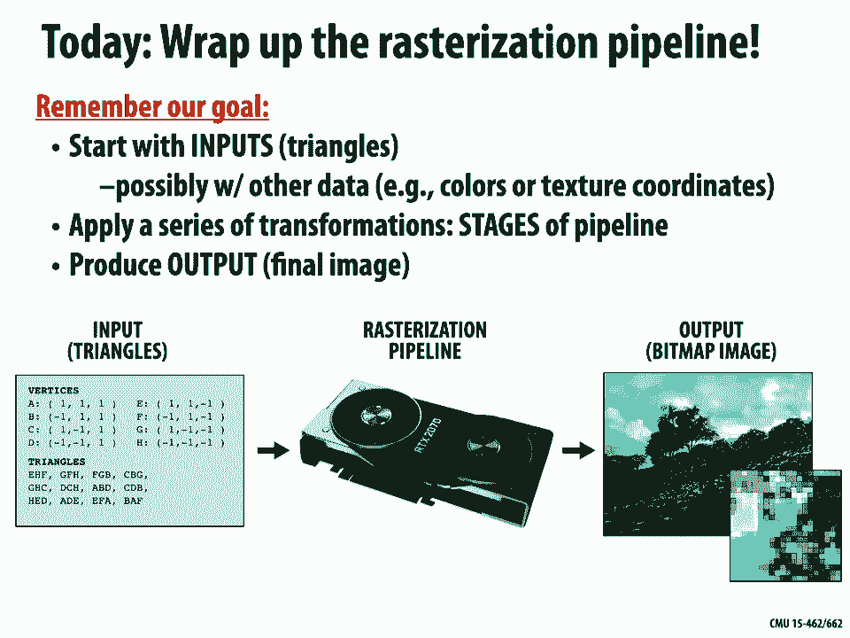

and produce as output a final，bitmap image okay and，we already know how to do a lot of。

this process we know how to position，objects，in the world using three-dimensional。

spatial transformations，we know how to project objects onto the。

screen to get the effect of perspective，we know how to take a 2d primitive。

that's been projected onto the screen，and sample its coverage using the，process of rasterization。

during that process of rasterization we，get barycentric coordinates that can be，used to interpolate。

attributes like color or texture，coordinates across the triangle。

using these attributes we can shade the，triangle in some interesting way so for，instance we can。

sample from a texture to get more，interesting color，and then finally the thing we want to do。

today is talk about，how we take those samples generated from，each individual primitive。

and combine them into the final image，while taking into account effects like，depth and transparency。

so let's take a look at the first of，those phenomenon，depth or occlusion so the question of。

occlusion，is okay we're rendering a bunch of，different triangles。

into our image which of those triangles，is visible，at each sample point and we can think，about this。

question for opaque triangles things，that are completely solid，we'll also want to think about this。

question for semi-transparent triangles，and their things really start to get。

interesting so let's start out，and assume that we have a triangle given，by。

the projected 2d coordinates of each，vertex right so we've already done our。

perspective projection but we've also，kept track of for each vertex。

what is the depth what is the distance，of each vertex，from the viewer okay。

and the first question we have to answer，is，how do we compute the depth d at any，given sample point。

x y so if we only know at the beginning，the depths at the three corners x i y i，x j y j and x k y k。

how do we get a depth somewhere in the，well something we discussed a lot in our，last lecture was。

interpolating attributes using，barycentric coordinates，and that's exactly the right thing to do，here。

because depth varies linearly over the，triangle，okay so that's great it's。

easy enough to get the depth at any，sample point，and now we're faced with this challenge。

of figuring out，which triangle should show up at each，sample point right。

we want the triangle with the smallest，depth，to actually be drawn at that sample，point。

well an important thing to remember，about the rasterization pipeline。

is that it processes things one triangle，at a time that's kind of one of its，biggest strengths，some。

computation projection rasterization and，so forth，and then we forget about it we don't。

have to keep a list of，all triangles in the scene in our，pipeline all at one time。

on the other hand that makes it，challenging to figure out，okay which thing should go in front if i。

only know about the current triangle，how could i possibly figure out which。

ones should get drawn and which ones，should get occluded，and the solution to this is a very nice。

idea called the depth buffer or the z，buffer，so the idea of the depth buffer is that。

at each sample point，in addition to a color we're also going，to keep track of the depth。

of the closest triangle or the closest，primitive，seen so far so in all my drawings here。

i'm going to use a grayscale，color bar to indicate the depth，values that are close to white are very。

far away values that are close to black，are very，nearby so you might imagine that，initially we。

initialized the depth buffer to have，very very large values you can imagine。

you set these all to infinity or the，maximum。

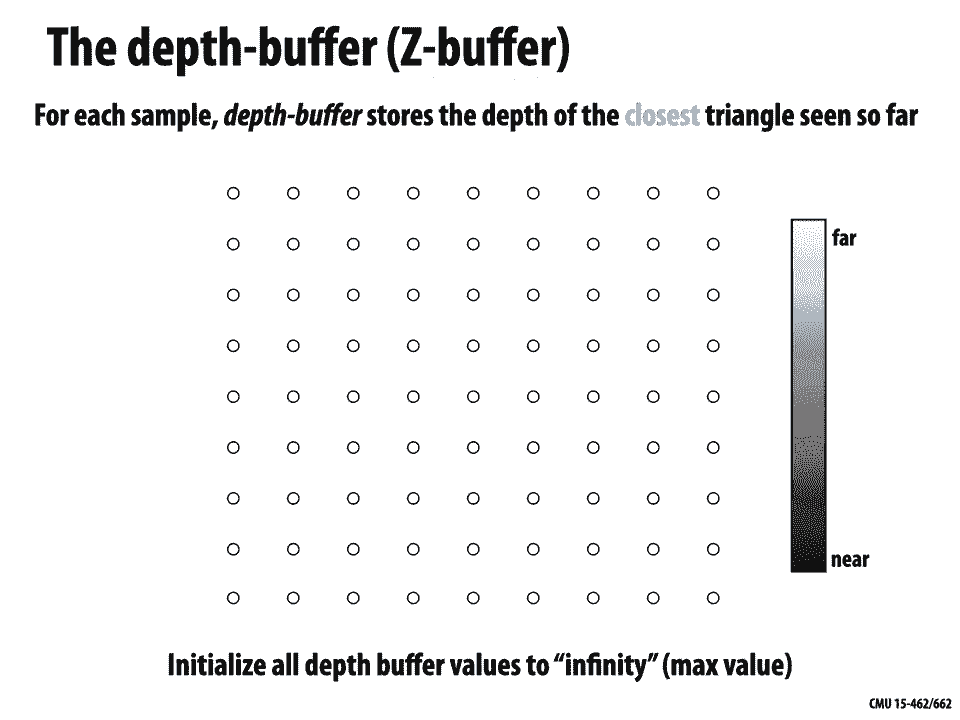

possible value that you can represent，here's an example of a depth buffer from。

an actual scene so this，is some buildings sitting in front of，kind of a jungle。

and you notice exactly this pattern the，buildings which are very close to us are，very dark in color。

the trees which are further away get，lighter and lighter，off into white it almost looks like a。

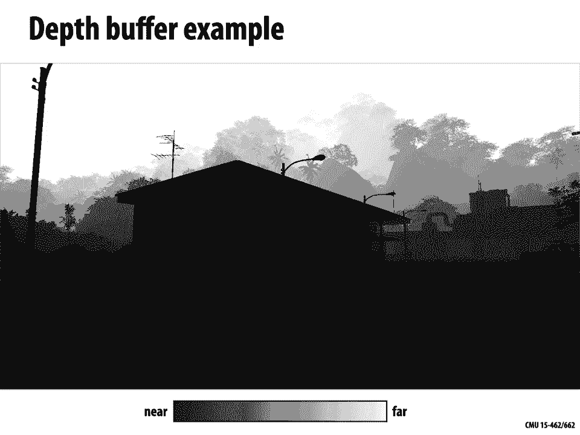

fog going out into the distance，so how can we apply the depth buffer to，render。

several opaque triangles let's start，with the easy case，so we'll start with any of the three。

triangles and，as we'll see very importantly it doesn't，matter which one we pick，start。

drawing it onto the screen we go through，the rasterization process。

for each sample we figure out is it，inside or outside the triangle。

okay but now we have an additional check，that we're going to perform before。

actually putting the color of that，triangle，into our sample buffer we're going to，check。

is the depth of each sample，closer or further away than the depth，stored in our。

z buffer in this case we started out，with，samples that are all really really far。

away right the depth buffer we，initialized it to infinity，so when we draw this yellow triangle in。

all of those samples，pass our depth test they're all，closer than what we had before and so we。

can go ahead and say yeah those，samples pass we should write the color，yellow into the color buffer。

and we should update our depth buffer，to keep this new closer depth value。

so you notice these values are gray，rather than white indicating that，they're a little closer。

okay we now draw another triangle we，pick any triangle we like，doesn't matter which order and。

this triangle is a bit further away，than the yellow triangle so what you，notice here is that only。

some of the samples marked with the red，dots pass the depth test。

the other samples in this triangle are，closer than the values at infinity。

but they're further away than the first，yellow triangle that we drew。

and we know that just by comparing the，depth value of the blue triangle with，the depth value。

stored in the depth buffer we don't need，to know anymore，about the shape and size and position of。

the yellow triangle，right that's gone okay，so for the samples that pass we do the，same update we。

update the color buffer we put the blue，color in those samples we update the。

depth buffer you notice there's some，light gray，where that new triangle came in。

and finally we take the third triangle，we rasterize it the same way。

this one is now closer than the first，two triangles so all the samples pass，the depth test。

we write the colors into the depth，buffer and we also update all those。

samples in the depth buffer so now we，have these，almost black dots where that new，triangle showed up。

right easy enough now one thing i kept，order，i process the triangles in do you，believe that。

or did i trick you did i pick those，three triangles in a very special order。

think about it why or why not might it，matter，what order the triangles come in。

in this process and leave some comments，in the slides，okay so here's some pseudo code that。

might help you think about that question，more clearly，so let's say we want to draw a new。

sample into our，color and depth buffer so we have a new，sample with depth d。

and color c at a screen location x y，this sample came from rasterizing a，triangle。

okay and what do we do well the first，thing we do is we check。

does this new sample pass the depth test，so we compare the new depth d to。

the depth stored in the z buffer at x y，what does this depth test do it's very，simple it just says。

if d1 is less than d2 return true，otherwise return false okay，if we pass the depth test well that。

means the triangle we're drawing is the，closest object we've seen so far。

at this sample point x y and so we，should go ahead，and update the depth and the color。

and that's it otherwise we've seen，something closer already and we don't，need to update。

the color or the depth we simply，do nothing all right，so some questions about this process。

for one thing does the depth buffer，algorithm as we've described it。

handle interpenetrating surfaces our，earlier examples，we had each triangle is entirely in。

front of or behind，each other triangle but what if we have，two triangles like this this green and。

yellow triangle that intersect each，other，are we gonna draw these correctly if we。

rasterize these into our color and depth，buffer using depth testing。

do we light up the samples that you'd，expect，yeah of course and the reason is it's。

kind of one of the beautiful things，about this z-buffering idea。

is that this occlusion test is based on，the depth of the triangles，at a given sample point right。

so the relative depth of triangles can，be different at different sample points。

we're considering things only on a，sample by sample basis，not on a triangle by triangle basis。

the alternative to this by the way is，really，awful right if i had to。

always draw things in sort of some，particular order let's say i had to draw。

all my triangles from back to front to，ensure that i got the right。

occlusion well then what would i have to，do in this this example probably what。

i'd have to do is actually find，where these two triangles intersect each。

other split them up at that intersection，point into other，funky polygons right and then draw those。

polygons in，sorted order actually do a sort so the，depth buffer avoids all of that，complexity。

by just treating things on a sample by，sample basis，rather than a primitive by primitive，basis。

so in this case for instance at this，sample we have the green triangles in。

front of the yellow triangle，at this sample the yellow triangles in，run。

our depth buffering algorithm we get，samples that look like this exactly what。

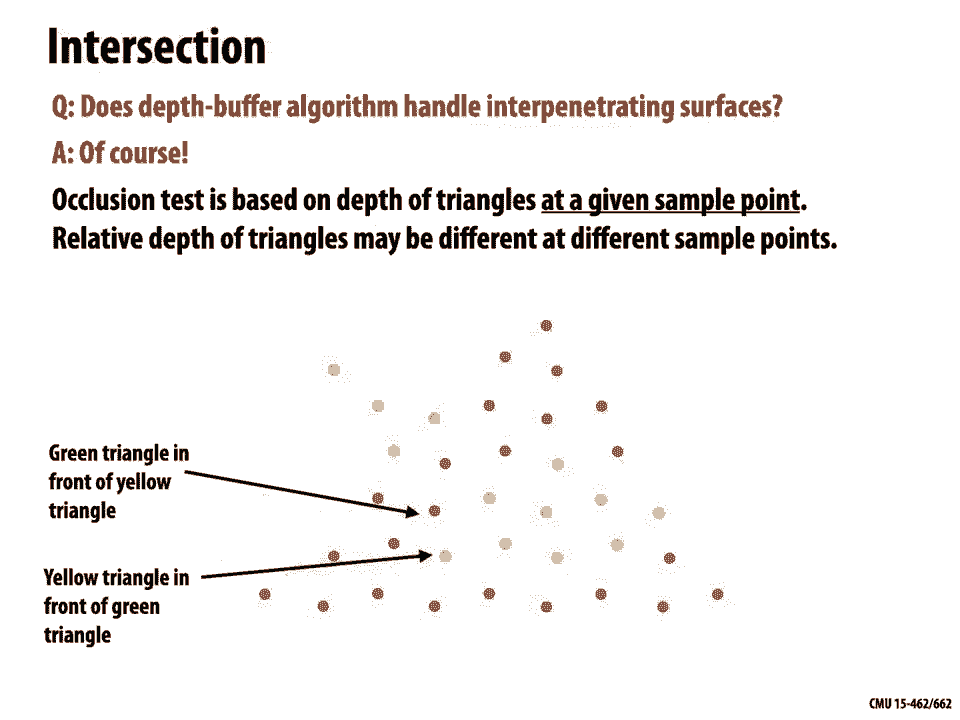

we wanted，all right what about the interaction，between，depth buffering and super sampling。

we talked before about using super，sampling to reduce aliasing。

so what do you think if i try to apply，depth buffering with super sampling is，this going to work。

am i going to get weird artifacts am i，going to have to work a little harder。

to get better anti-aliasing what do you，well the key idea here is yeah this will，work fine it'll。

work fine to do depth buffering with，super sampling as long as we。

have one depth sample per sample in our，super sample buffer，again if we're doing things on a sample。

by sample basis，well then we should have one depth，sample for every color sample。

okay so in this example we have for，instance a green triangle occluding，yellow triangle。

if we run our depth buffering algorithm。

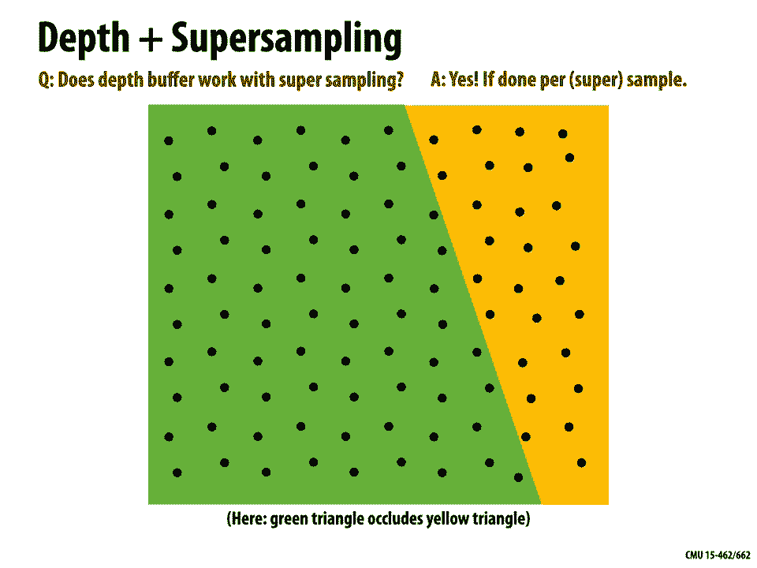

on all these samples which are the，samples of our super sample buffer we，get something like this。

okay and now we just have ordinary，colors we don't need to think about，depth anymore。

those colors contribute to，our original pixels so maybe we have，four super samples per pixel。

and to get our final colors we can just。

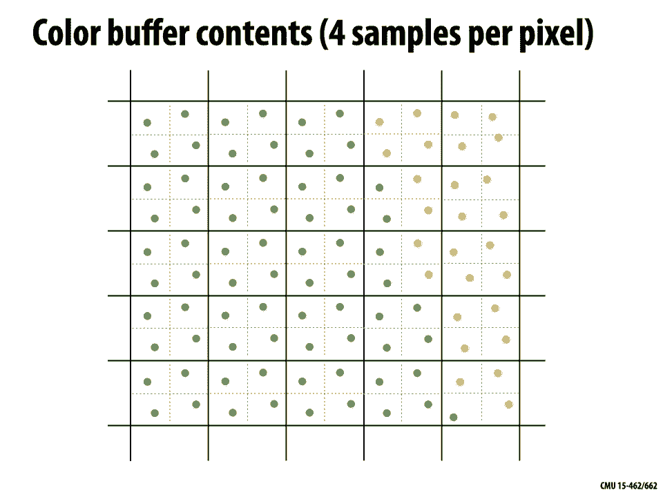

average these，colors in the usual way so we average，them down to something like this。

so we do get a nice smoothing or，blurring of，the color between green and yellow。

if you step back from this picture and，look at it at a，fine scale this will look really nice。

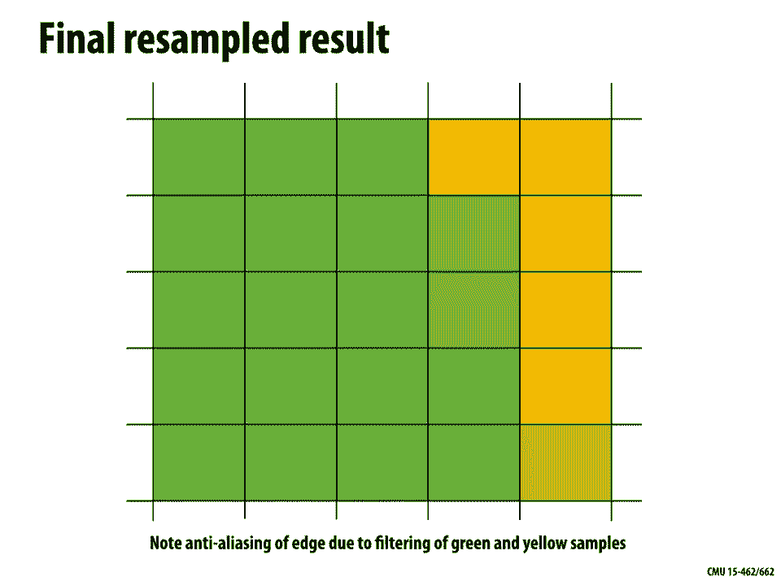

you'll have a nice smoothed out edge，okay all right so to summarize。

our depth buffer is going to store one，depth value per，super sample not just one per pixel。

right because we could have different，depths of different super samples。

and what that means is we're adding，constant，additional space per sample we used to。

be storing a color value which might be，three values red green blue now we're。

adding just one additional value a depth，so what that means is overall we're just。

adding constant space，for our depth buffer this doesn't depend，at all on the number of。

overlapping primitives there's no fancy，data structure to keep track of ordering，right just。

one value the minimum depth value at，each sample point，we're also adding something that only。

takes constant time，to do an occlusion test per sample right，we just。

read from the depth buffer we do a，little check，we might modify it and write back a new，value。

or if the depth pass depth check fails，we just read we're not。

going to sort a bunch of depth values we，don't have a list，of values that we look at right really。

really simple，by the way the depth buffer idea is not，specific to triangles。

all it requires is that we be able to，evaluate，the depth of the object that we want to，rasterize。

so for instance you could imagine，drawing a sphere into your image。

and it's not hard at all to evaluate the，depth of a sphere how far into the。

screen is a point on the sphere，so you could write a rasterizer that。

directly allows you to rasterize spheres，into your color and depth buffer without。

tessellating them into triangles that's，pretty cool all right，buffer。

works extremely well solves a lot of，problems what about，semi-transparent surfaces。

okay so to really understand this we，have to first just understand，how to composite semi-transparent。

surfaces over each other，forgetting for the moment the question，of depth，so what is our model for。

semi-transparent surfaces，the basic idea is that we're going to，represent the。

opacity or transparency of a surface，by a value alpha so just a real value，between 0 and 1。

that describes how opaque we are，so if alpha is equal to one that means。

we have something fully opaque，and as alpha decreases okay three，quarters，to，fully transparent。

this is obviously a very simplified，model of how things work in the real。

world if you were to look at，real transparent objects glass and water，and so forth。

there'd be a lot more interesting，phenomena，and parameters that you need to describe。

that behavior than just a single，alpha value and we'll talk a little bit。

more about that when we get to，photorealistic rendering，but for now we just have this single。

parameter that says essentially，how much of this object you see what。

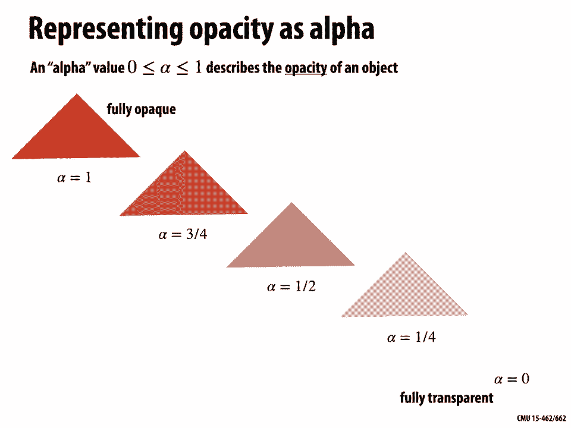

fraction of this object do you see，rather than just having a single alpha，value for the whole object。

you could also have a single alpha value，for each，pixel in an image so this is something。

you might want to do，if you're trying to composite one image，on top of another。

you have a leaf or you have this picture，of a koala bear and you don't care about。

the background you want to specify，what's in the foreground，well for something like the koala you。

especially notice，that some parts of the image don't，cleanly divide into just。

foreground or background if you have，little wisps of hair that might be。

semi-transparent or might be very very，thin，so that many small hairs pass under a，single pixel。

then you want an alpha value to give a，sense of how much of the background，should show through。

okay now when you go to composite，images for the first time and you try to。

mix together foreground and background，images。

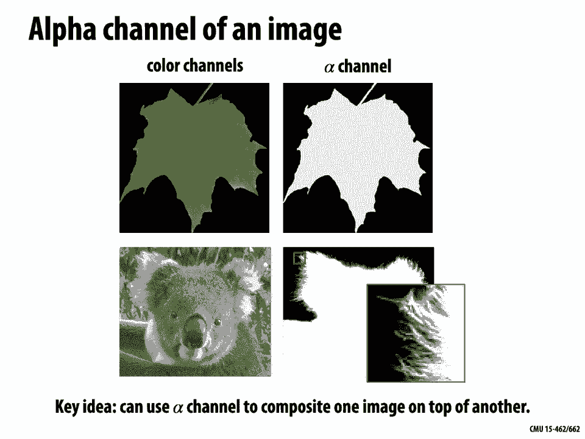

using these alpha values you might be，surprised that you get some pretty ugly。

artifacts so one of the，most common ones is this thing called，fringing。

so if you don't treat your color and，alpha just right you get。

these nasty dark halos around the image，so here we have，the foreground color this pink ball we。

have the foreground alpha，right this white area is telling us，which part of that。

image on the left is actually the thing，we want to show，we have the background color the。

swimming pool，and you can composite you can use these，different channels combine them。

using different formulas to get the，composite image，if you do it right you'll get something。

like this it looks like the，ball is sitting on top of the swimming。

pool almost as if we had taken that，photo originally like that you know。

nobody would know that this wasn't the，original photo，but if you're not careful you'll get。

something like this you'll get a dark，halo around the parts that are。

semi-transparent and if you watch，movies and tv especially if you watch，older。

movies you'll often see this kind of，artifact，and wonder you know what's going on。

there why is there this obvious artifact，that reveals that this wasn't the，original image。

so let's look a little bit at the，mathematics of how we combine。

different semi-transparent objects and，our basic operation is going to be，something called the。

over operator so the idea of the over，operator is to composite an，image b that has opacity alpha b。

over or on top of an image a，that has opacity alpha sub a，so informally this is going to sort of。

capture the behavior of tinted glass，if i blend b over a and b is red and a。

is yellow and b is mostly opaque，then the color i get is mostly red with。

a little bit of yellow showing through，conversely if i blend a over b。

i'll get mostly yellow with a little bit，of red showing through，now what that tells you is。

that this over operator is not，commutative，right a over b is not in general the，same as b。

over a and it's really important that，you blend things，in the right order to get the right。

if we do this over operator for an image，we get a similar effect so let's say we。

have our koala with its，alpha channel and we have a，picture of new york city then。

okay here's what the koala over new york，city，should look like what actually is the，over operator。

what am i doing to combine these pixel，values，okay well again we want to composite。

image b with opacity alpha b over image，a with opacity alpha a，and our first attempt at this over。

operator is going to look like this so，let's say that a，is described by three color channels the。

red green and blue component，likewise b has three color channels red，green and blue。

then a simple way to composite would be，to say，the new color c is，alpha b times b so we're saying。

okay the color of b times how much of b，should show up，plus 1 minus alpha b。

times alpha a times a so how much，color or light does b let through。

times how much of a do we see the color，of a times，its transparency that's very natural，that sounds。

pretty reasonable okay，another thing we'll have to do is figure，out what the new。

alpha value is so we'll just say that，the new alpha value，is however much of。

b we had plus however much of，a b lets through times however much of a，we had。

okay that's one option and we'll see in，a minute that this actually，results in some kind of fringing。

artifacts some things we don't like，so the alternative is to use something，called。

pre-multiplied alpha we want to do the，same，composition operation but we're going to。

do it in a slightly different way，so rather than working with the color，values directly。

we're going to multiply or pre-multiply，those color values by，the alpha value so we're going to。

construct a new color，a prime which is equal to alpha a，a r alpha a a g alpha a a b。

and we're going to tack on to the end of，that the alpha value，alpha a likewise for b。

okay so now conceptually a prime and b，prime，store kind of a darkened version of the，original color。

right darkened by the alpha value but，they also keep，track of the alpha values so we。

know how much we darkened the color by，to combine these two colors we're going。

to compute a new value c，prime equal to b prime plus 1 minus，alpha b。

a prime okay a similar idea here we're，saying，b is going over a so we're going to show，you b。

which has already been adjusted by alpha，and then we're also going to show you a，prime。

but modulated by how much b lets through，notice by the way that this operation。

composites alpha in exactly the same way，as how it composites。

the red green and blue channels right we，don't have separate operations for color，and alpha。

okay after we're done，doing this composition we're going to，sort of unpremultiply to get the final。

color we're going to divide，the color channels from c by the alpha，channel of c。

to get the final color all right why，does this make sense well we can think，back to how we defined。

a prime for instance we said a prime，we're going to take the color value。

we're going to darken it by alpha，and we're then going to tack on the。

alpha value so if at any moment we，wanted to recover，a the original color we could just。

divide through by alpha，and that's what we're doing with c here，as well。

by the way does this division remind you，of anything does this division。

and adding a fourth coordinate onto our，vectors does that remind you of anything。

well hopefully it reminds you of our，discussion of homogeneous。

coordinates because that's exactly what，this is，we're expressing our colors and our。

alpha values in homogeneous coordinates，right so now we can think of colors as，different directions。

and different opacities of those colors，as points，along the line in that direction。

and this is going to fundamentally，change the way，colors and transparency behave when we。

blend them together when we do averages，okay so as an example of this let's try。

doing some compositing with and with，without pre-multiplied alpha，so suppose in particular that we。

are going to up sample an image we have，a small image we make it bigger and then。

we want to composite it onto a，background，so we have an image b there's a very，simple image。

originally it's alpha looks like this，and its color looks like that so it's。

basically just a blue blob，which we happen to have stored on a，green background，the，using。

bi-linear interpolation just like we，talked about in our previous lecture。

and now we want to compose the blue blob，onto a gray background。

so i'm going to go ahead and use that，alpha blending，operation the first one the。

non-premultiplied one，and so i do alpha b times b plus 1 minus，alpha b。

times a by the way i'm not writing alpha，a here because alpha a is equal to 1。

okay and i get this result and you，notice it looks，almost right i have a blue blob on a。

gray background but there's this，green halo around my blue blob。

that's no good all right so what if i go，the other route so what i'm going to do。

is i'm going to pre-multiply i'm going，to multiply，the original color by the original alpha。

to get the，pre-multiplied color and i'm going to，b，times b time with alpha b on the end。

i then go ahead and i up sample this，pre-multiplied color，okay so you notice that where things。

were green that got darkened by my alpha。

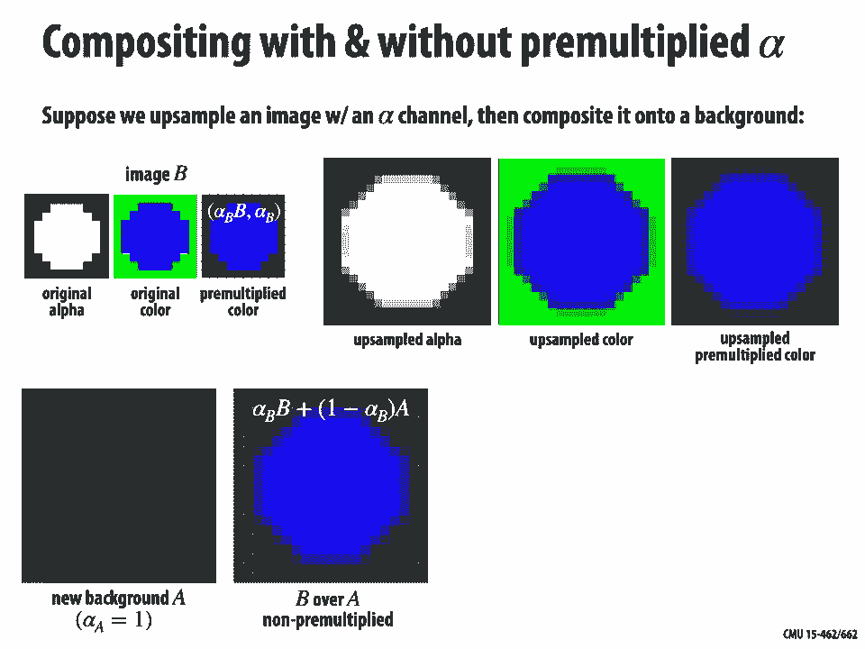

value and i just have black，and now i go ahead and i do my，pre-multiplied。

over operation b prime plus 1 minus，alpha b，a prime and voila i get the blue。

blob on the gray black background with，why why is that true why did we get the，green fringe。

when we don't pre-multiply why did we，eliminate the green fringe。

i'll let you think about that and you，can try to answer and discuss，okay here's a similar problem。

with using non-pre-multiplied alpha，let's go the other direction，we want to down sample a texture。

maybe we're going to do this for，pre-filtering we want to build，mipmaps right but we want to build a。

mint map of，a texture that has an alpha value，this is a very natural thing to want to。

do right i want to render，leaves in my scene i have trees made of，polygons i want to draw。

as just quads with textures on them okay，and to do this in a nice way i want to。

map my textures so i get nice，filtering so i'd like to build mint maps，like this。

what's going to happen if we don't，pre-multiply alpha well let's see。

so if we're right next to the edge of，the leaf，then the input color might look like。

this we have green pixels on one side we，have red pixels on the other。

the input alpha is you know 100 opaque，on one side it's，completely transparent on the other if。

we just go ahead，in a completely naive way filter the，color so we just。

take the average of the four color，values we'll get kind of this。

murky brown color if we take the average，of the four alpha values we get kind of，a 50。

opacity and then if we take this murky，brown color，and composite it over the white。

background like we see on the upper，right，then we're going to get this kind of，yellowish color。

if on the other hand we were to，pre-multiply the color so we multiply，color by alpha。

right so now we get just green and black，then we average the color down to just a。

single pixel we get a dark green and a，50，gray right but remember。

that this isn't really a dark green，because we have this dark gray so if we，divide the dark green by。

this this medium gray that's actually，going to，multiply it it's going to make it，brighter。

and then when we composite it over the，white background we get this nice light，green color。

kind of what we would expect to see at，the edge of our。

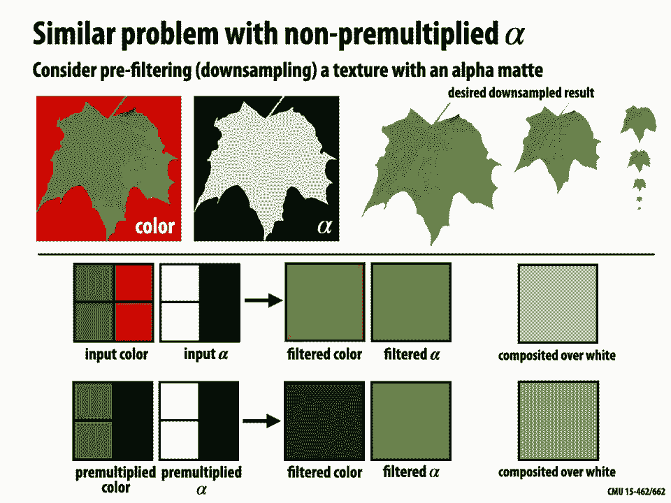

all right so pre-multiplied alpha really，seems to work well for upsampling and，down sampling。

here's another problem is if we want to，repeatedly，compose uh images on top of each other。

we have lots of，semi-transparent primitives in our scene，and we want to draw them on top of each。

other okay so let's say，for instance we want to composite an，image c with opacity alpha c。

over b with opacity alpha b over a with，opacity alpha a，well pre-multiplied alpha is going to be。

closed under composition，non-pre-multiplied alpha is not so，here's a。

example let's say i want to compose a 50，bright red primitive over a 50 bright。

red primitive where bright red，is just 1 0 0 all red no green no blue。

and alpha in this case is going to be，0。5，so if we do this with a，non-pre-multiplied alpha。

how does this go well we start out with，our color blending so we have fifty，percent。

times the first bright red color plus，one minus 50，times 50 times our second bright red，color。

if we do the arithmetic here we get，0。7500，and our alpha gets blended like this 0。5，plus 1 minus 0。

5 times 0。5 is 0。75，so what is the appearance of this，blended image。

well it's going to be a dark red color，at 75 opacity，in effect what we've done is kind of。

blended red with black，a little bit and then we draw that at 75，opacity。

it's not quite what we expected what if，we do this with pre-multiplied alpha。

well let's just go through the，arithmetic there so we have，0。500。5 so i've already。

pre-multiplied by alpha plus 1 minus 0。5，times the same color i work that out。

and i get well it looks like i get the，same thing right it looks like i get，0。7500。

75 it looks like i get a dark red，with a 0。75 alpha but remember。

that to recover the original color i'm，going to actually divide by alpha so the。

color i get is bright red 1 0 0，and the alpha i get is still that 。75。

okay so in this case i get something，more reasonable i blended together two，bright red things。

the color itself hasn't changed it's，still bright red，it's only the alpha that's changed it's。

increased to become more，is，pre-multiplied alpha did a much better，job of separating out the idea of。

blending colors together，so overall there are some nice，advantages to working with。

pre-multiplied alpha，first of all compositing treats all the，channels the same we're doing the same。

thing to color and alpha that could be，nice for implementation for performance。

we have fewer arithmetic operations for，the over operation，that we did than we did for the。

non-pre-multiplied representation，it's closed under composition so if we，do repeated over operations。

we're going to carry through the color，without distorting it right that bright。

red color will stay bright，red it gives us a better representation。

for filtering if we're doing up sampling，and down sampling，of images with alpha channels we don't。

get this fringing artifact，and also it fits naturally into the，rasterization pipeline we've already。

built so we've already said，homogeneous coordinates are a good idea。

we're going to work with 4x4 matrices，our graphics card is built that way。

so it's pretty cool that our color，blending works out the same way。

all right so let's go back to this，bigger picture，of how we draw and blend together。

semi-transparent primitives okay，so assuming that all of our primitives，are semi-transparent。

and all of our color values are encoded，with pre-multiplied alpha。

here's a little strategy or pseudo code，for rasterizing an image，okay so we want to update our color。

buffer at a location x y，if we，pass the depth test then，well actually here's a question。

how should we update the depth and color，buffers，we already know how to update color we。

can just use our，over operation that we just talked about，with the pre-multiplied alpha that's no。

but what about depth if i draw a，semi-transparent triangle，should i change the depth value is that。

the closest thing i've seen now，can't i still see triangles that i've。

already drawn through that triangle and，shouldn't i care about their depth。

how am i going to deal with occlusion，there right so，what is an assumption that we're。

essentially making here，in order for this code to draw a correct，image。

what is this what is the only situation，in which，this this code will actually draw our。

semi-transparent primitives in the right，well the key word here is the word over。

because we're compositing our colors，using this over operation，we're assuming that a is over b。

right that we're drawing things in the，and we're not worrying about occlusion。

only if things are drawn in back to，front order，and，try to draw your scene by first sorting。

all of your，triangles according to their depth from，the camera，but this is annoying for a couple。

reasons for one thing it's just annoying，to have to do this sort all the time。

it's not something actually that's very，easy to do on a on a graphics card。

and also we have to deal with these，issues of primitives intersecting each。

other if we have two triangles，intersecting each other there may be no，ordering。

that gives us the right answer okay so，in general，drawing transparent primitives is a real，pain。

in the rasterization pipeline and people，come up with all sorts of tricks，to do this one。

idea is to store an additional buffer，called an alpha buffer，that actually does start storing more。

than one，value per pixel maybe a list of values，but you can imagine that starts getting。

expensive right now you have different，numbers of things at different sample。

values you don't have really，kind of contiguous memory blocks and so，forth。

okay so that's something that people，don't really do much maybe you can。

implement it in your software rasterizer，but it doesn't work too well on a gpu。

a more modern approach is to come up，with techniques for order independent。

transparency so there's things like，depth peeling is one technique you can，go read about。

but in general dealing with，semi-transparent primitives is，and。

we'll see this is one of the strengths，of，ray tracing when we get to ray tracing。

we'll see that dealing with，semi-transparent primitives is，no problem at all okay。

so let's still try to put this all，together as well as we can so。

let's say that now in instead of just，having a list of semi-transparent，triangles。

we actually have a mixture of both，opaque and transparent triangles so，here's one way we can do this。

we can first render our opaque，primitives，in any order we want using the depth。

buffer to deal with occlusion，if we pass the depth test that triangle，over。

writes the value in the color buffer and，also updates the，z value the depth value in。

step two okay after we're done drawing，all of our opaque triangles。

we're going to disable the depth buffer，update we're no longer going to change，the depth values。

we're just going to go ahead and render，semi-transparent surfaces。

in back to front order we're still going，to check if we pass the depth test。

so if the semi-transparent triangle that，we want to draw，is behind an opaque triangle we。

definitely shouldn't draw it，okay and likewise if the，semi-transparent triangle is closer。

than the opaque triangles that we've，drawn we should draw it，to composite the color we use our usual。

over operation，but the difference now is that we don't，change the depth values at all。

and as before in order for this to work，we really have to sort。

the semi-transparent triangles from back，to front order，which we can only do if they don't。

okay so that's the basic idea，all right so that's it so that's the，final。

thing that we had to do to build our，rasterization pipeline we needed to know。

how to finally get our samples，into the image and now we can think，about the。

end and pipeline we can think about，everything we've learned，a，rasterization engine so the most。

important thing to remember is what is，our goal what are we trying to do here。

we're trying to turn some inputs into a，final image，what are the inputs really here are a。

pretty complete list of inputs our，inputs are，a list of positions for the corners of a，triangle。

right so we have sequences of，three coordinates each of which specify，a triangle。

and we have corresponding texture，coordinates，okay so for every vertex we also have uv，coordinates。

and we have a texture map that we're，going to look up into like this brick，texture map。

we might have an object to camera space，transform so something that tells us，effectively。

what is the transformation we should，apply to our objects to make it look，like we moved the camera。

we can represent this by a four by four，matrix in homogeneous coordinates by the，way all of these。

positions are also in homogeneous，coordinates，we have a perspective transform。

something that tells us how would we，like to，project from 3d to 2d would we like to。

do an orthographic projection would we，like to do a，to know，something very basic just the size of。

our output image the width and the，height，that's it that really is something that。

is sufficient to describe a，fairly interesting scene okay，and in fact at this point we have all。

the tools we need to turn that，data that discrete data pretty simple，stuff。

into a beautiful rasterized image，so let's review that process what are we，going to do。

well the first thing to remember is，we're just going to send one triangle at。

a time down the pipeline，so at any moment our rasterization，pipeline knows about three positions。

right xyz and two texture coordinates uv，and the camera and perspective transform。

okay what do we do first to each，triangle，we transform the triangles into camera。

space by applying the inverse of the，camera transform，then we apply our perspective projection。

to transform these，3d vertices into our well，we go to our our normalized coordinate，space into this。

cube so we take our view frustum and，turn it into this cube，we perform clipping so we discard。

triangles that lie，outside the unit cube if they're，completely inside，the unit cube we keep them and。

if they are partially contained in this，cube，well we have to do a little work to cut。

them up into smaller triangles that are，contained，inside the cube so that we can keep just。

working with triangles contained in the，view，okay so now we know about all the。

triangles that we're actually going to，see，we can go ahead and transform them into。

2d coordinates by performing a，homogeneous divide，and that leaves us with points that are，in。

the square from minus one to one so we，still need to stretch this out by the。

width and the height of our image，and probably we need to flip this upside。

down because of the different，conventions for what up means in image，coordinates。

and our normalized coordinates，okay now we're on to the business of，rasterizing this 2d triangle。

and in fact before going through each，individual sample we can compute some，data that will be used。

for every single fragment or every，simple every single sample point。

so we know we're going to need to do，lots of checks with the，triangle edges are we inside or outside。

these half planes so we can write down，the triangle edge equations。

and attributes and so forth basically，look at our，code that does the rasterization and say。

is there something that's getting，recomputed over and over and over again，for every sample。

that we could just pull out of that loop，and compute once ahead of time。

in fact that data is going to give us，our barycentric coordinates that we're。

going to use for interpolation，okay so now we go through our samples we，evaluate。

all of the attributes right any，attributes that we're，interpolating and we check for coverage。

is the sample contained，we then have our interpolated，texture coordinates we can use those to。

look up into our texture map，maybe if we want to do filtering we also。

go through this whole process of，generating mipmaps and so forth and，computing。

map levels okay but at the most basic，level we just use the uv coordinate。

to look up a pixel in our texture map，grab it using bi-linear interpolation。

once we know what color the sample，should be we actually have to figure out。

should we even bother writing it into，the color buffer so we perform a depth，test。

if the thing that we're drawing is，closer than anything we've seen before。

we write the new depth into the depth，buffer，otherwise we do nothing right so we。

update the color buffer if the depth，buffer，test passed and that's it we've written。

values into our image，now we just repeat this process for all。

the remaining triangles in our list and，we're done，okay and at this point all of those。

steps should feel pretty concrete to you，you know maybe we didn't go completely。

into the details of some of the things，like clipping，but from the lectures you've seen you。

probably can go back，and implement from scratch a basic 3d，rasterizer pretty cool。

in fact the thing that you now know how，to implement is not so different from。

the true opengl or direct 3d graphics，pipeline，that's used in modern graphics hardware。

so if you go and start reading about，this idea of，of opengl and how gpus are designed you。

will find that it is a very very similar，to what we have been discussing。

here in class you have input vertices，they go through some，vertex processing stage where they get。

transformed in space，these then generate primitives which get，rasterized those fragments get blended。

into the，frame buffer in various ways and you get，an output image，this。

graphics pipeline over the years and if，you do start，going and learning about this you'll。

encounter all sorts of funny things like，geometry shaders and tessellation。

shaders and things that don't，really sound like what we've talked，about but what you should know。

is that at its core the modern，rasterization pipeline and pretty much。

any real-time rasterization pipeline you，encounter，will be very very much like what we've。

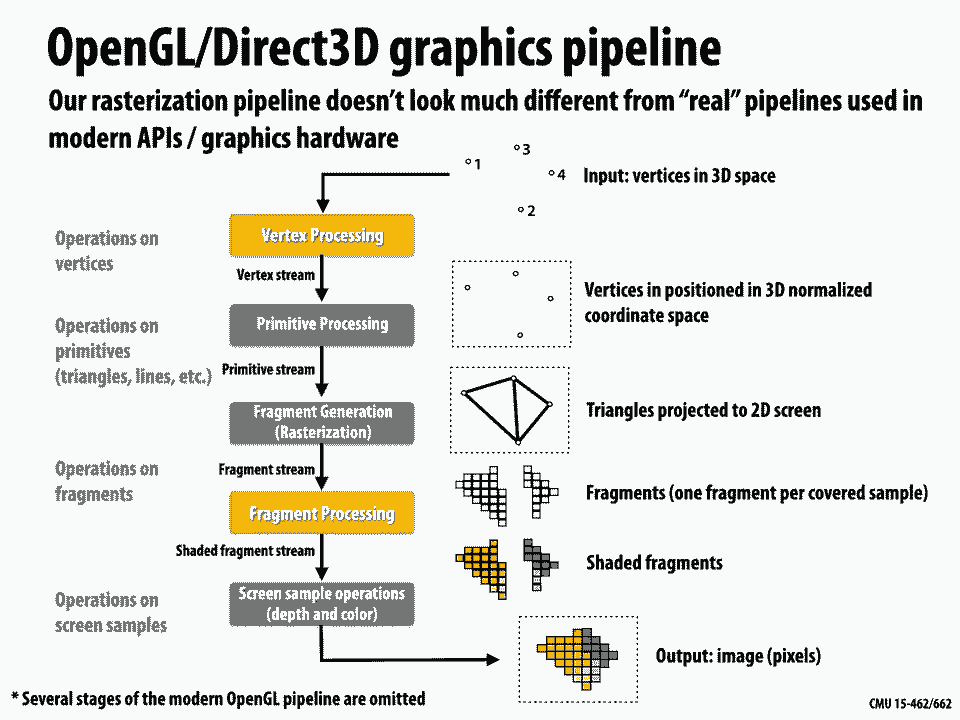

discussed in this class，the other thing that's a bit different，is that well。

the goal of these rasterization，pipelines is to render scenes。

with extremely high complexity they need，to render，thousands and millions of triangles with。

complex transforms and shaders and you，have really high resolution outputs。

right 10 megapixels with super sampling，if you're doing this for a vr headset。

right you're trying to pump out frames，hundreds of times per second。

and so these rasterizers are not going，to be implemented in software people，aren't writing them。

on their you know cpus like you're doing，for this class，but they've actually been baked into。

hardware，these days this hardware comes in many，different flavors you could have。

a discrete gpu a real card that you buy，and you open up your computer and put it。

in to make your graphics go faster，days，is going to have in some part of the，chip。

an integrated gpu so just a little piece，of the chip area that，serves the function of running the。

rasterization pipeline，and same deal with cell phones if you，in it，probably it has an integrated gpu。

if we take a little closer look at these，chips they look，something like this so a gpu is really a。

heterogeneous，multi-core processor so it's not，just a big bunch of cpus glued onto a，single chip。

it also has some highly highly，specialized，hardware that does some of the。

operations that you now know and love it，has，hardware for doing bilinear filtering of，textures。

it has hardware for clipping triangles，it has hardware for doing，blending operations like the over。

operation and so forth，and this is actually a pretty，significant part of。

the chip area if you are running your，gpu if you're using kind of a general。

purpose language like cuda or opencl，you're actually only using a fraction of，the chip's power。

a lot of that power is still captured by，these fixed function，units okay so although gpus have gone。

more and more toward programmability。

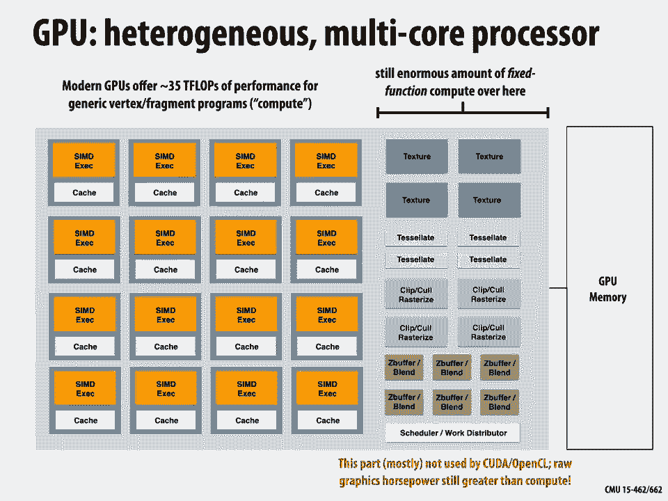

toward flexibility they still benefit，from having some very，specialized components。

okay and so that's kind of the evolution，of the modern rasterization pipeline。

there's been a trend toward more generic，but still，highly parallel computation。

the different stages have become more，and more programmable，so what transformation gets applied to。

your vertices do you just do the camera，inverse，transformation or do you do something，else well now。

the programmer can tell the card what to，do，right how do fragments get shaded and so，forth。

and even more flexible scheduling of，stages so rather than just going linear。

down linearly down the pipeline，you can now tell the gpu hey take the。

data that you computed in this stage，and actually feed it back to an earlier，stage of the pipeline。

so people have thought long and hard and，these。

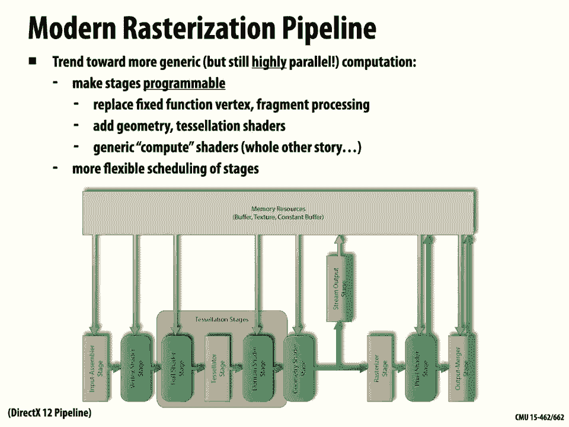

also as much as you know the the idea is，to，go generic and just process triangles。

over the years people have realized you，know there are，other rendering algorithms that are very。

very useful，in particular the ray tracing algorithm，which we're going to talk about。

later in the class it's a completely，different way，of looking at image generation that has。

some very very important benefits and so，finally just in the last few years。

people started to build this，idea into graphics hardware so now the，graphics hardware also has。

a dedicated ray tracing pipeline，and the images that you can generate，with this pipeline。

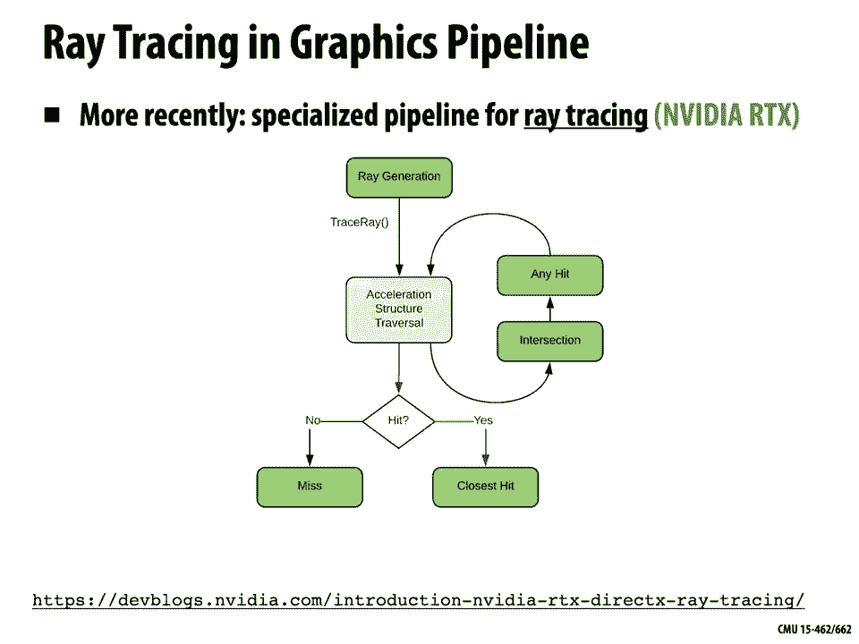

are absolutely stunning so here，i'm going to show a demo from nvidia。

of rendering things in real time and i，think you look at this and think。

okay this looks like a marble rolling，around is this really so impressive well。

the thing to realize is that all of，these，lighting effects all these shadows and。

the light bouncing off，various surfaces is all being done in，real time。

and this is stuff that you really can't，pull off very easily with rasterization，you can pull。

various tricks to kind of get these，effects，but to get the true physically based，appearance。

you really need this ray tracing，technology，and it'll be really exciting to see what。

happens with this in the coming years in，so what else do we need to know。

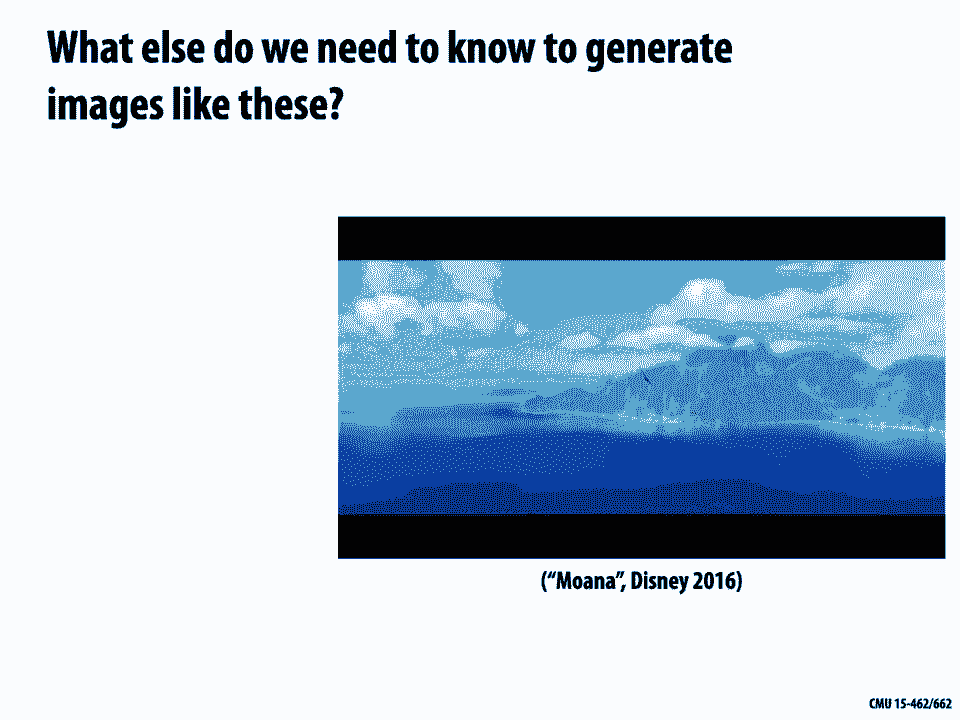

to generate images like these like the，ones that we，see when we go to the movies we've hit a。

lot of topics but we still have a long。

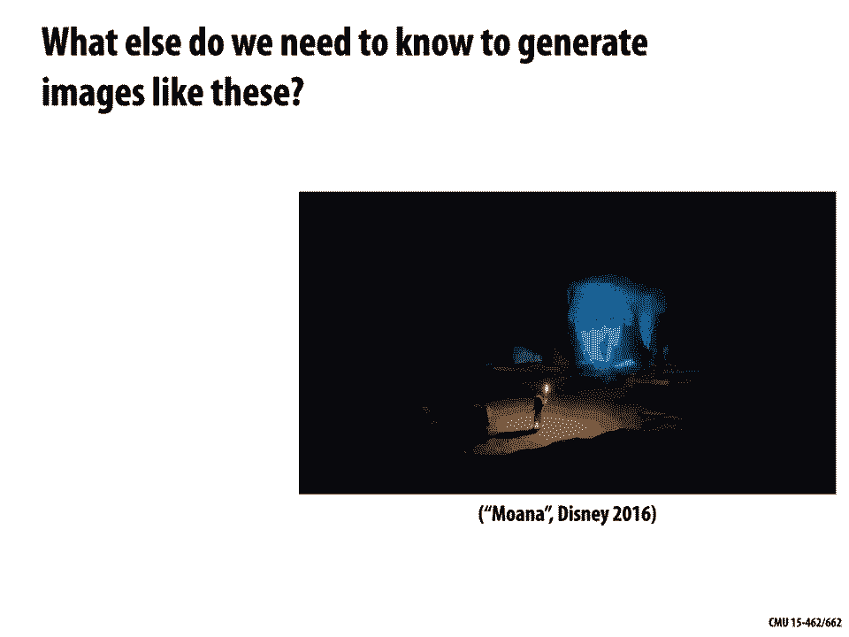

way to go so we still need to talk about，geometry how do we describe complex。

shapes so far we've just been dealing，with individual triangles we don't have。

any idea how to model those triangles or，make them look interesting，we need to talk a bit about。

photorealistic rendering，how does light actually interact with，materials to produce color how do we。

describe。

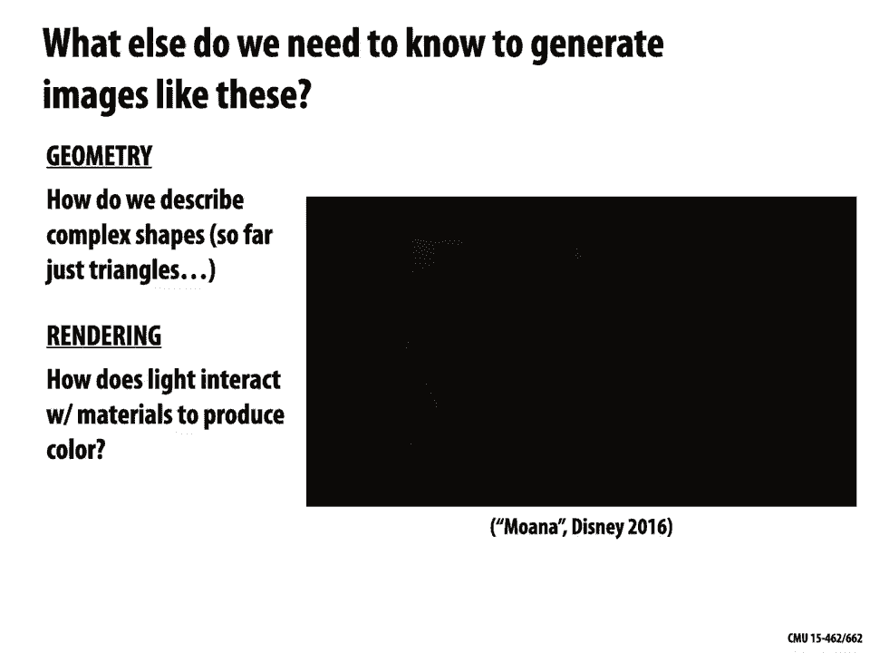

materials how do we describe light，right and animation how do we describe，motion。

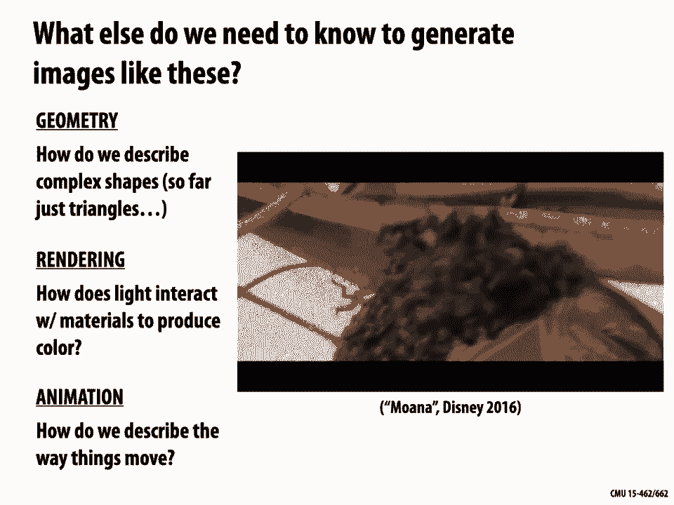

we've talked a little bit about digital，encoding of shape we at least understand。

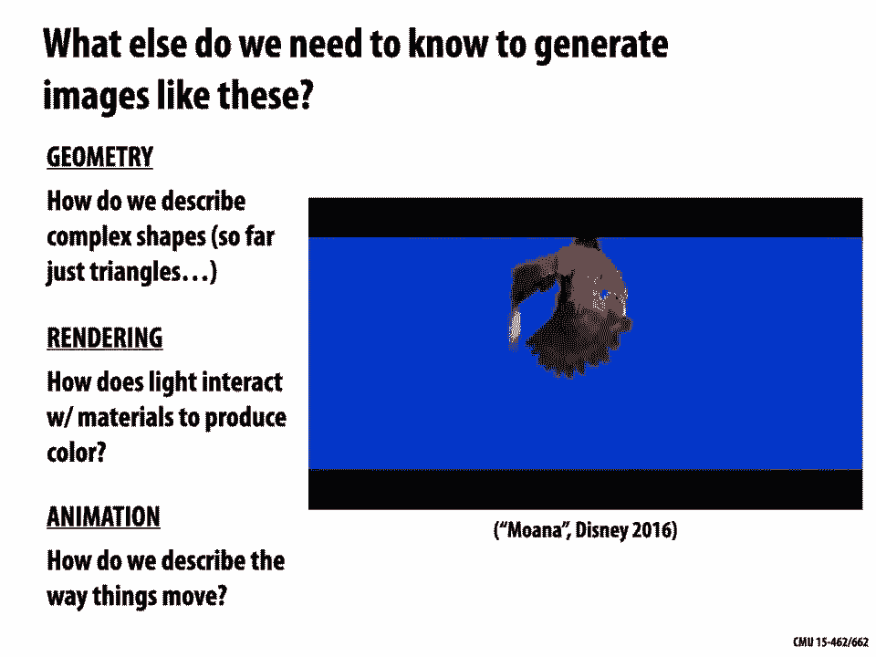

the idea of vertex positions and，triangles but how do i digitally encode，the way things。

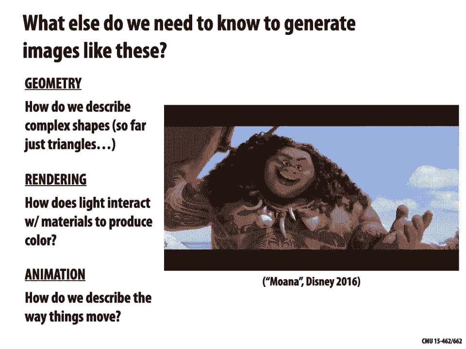

move so here's a little glimpse at our，near-term course roadmap next time we're。

going to start talking about，geometry and then we're going to move on，to materials and lighting and。

photorealistic rendering and finally，near the end of the course we'll talk，about animation。

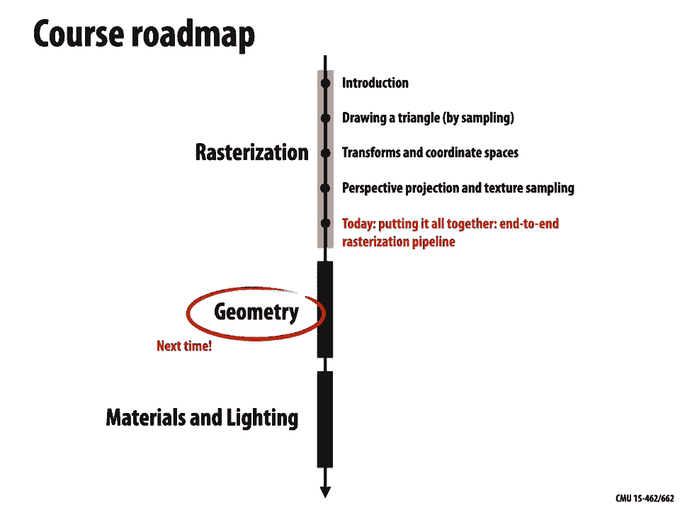