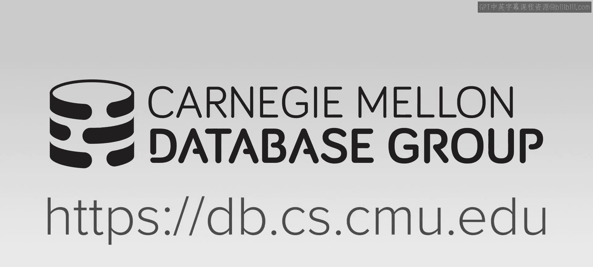
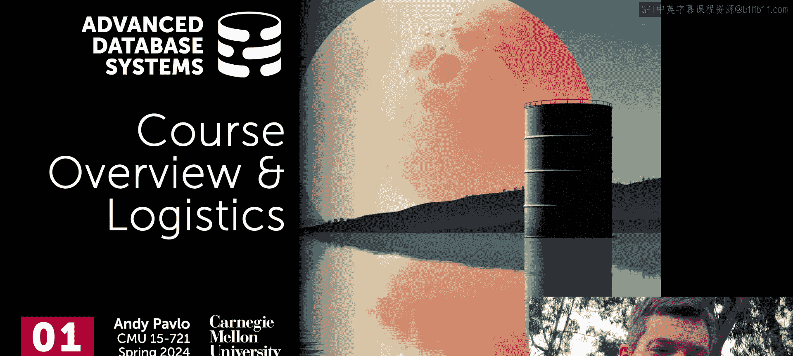
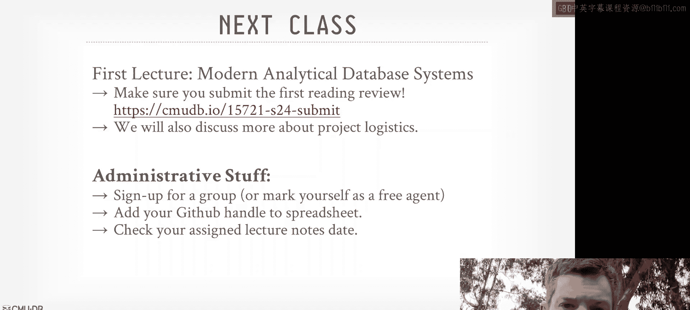
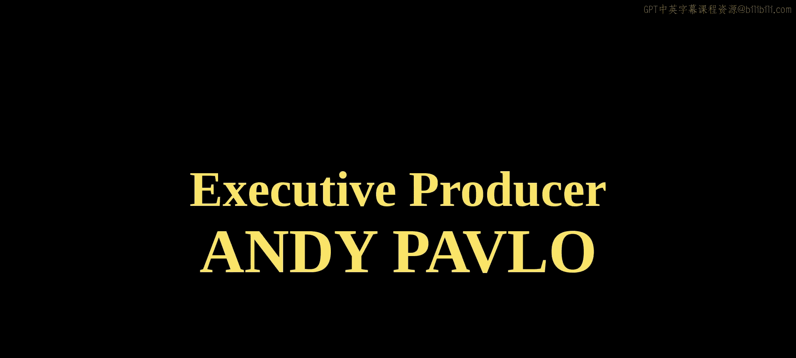

# 高级数据库系统：00：课程概述与安排 🗓️

在本节课中，我们将要学习卡内基梅隆大学《高级数据库系统》课程的整体介绍、课程目标、核心主题以及本学期的项目安排。

## 课程概述

卡内基梅隆大学的高级数据库系统课程正在现场观众面前录制。由于一些个人原因，我无法在第一周亲临匹兹堡的课堂，目前身处加利福尼亚。因此，本次讲座不会深入课程具体内容，而是重点介绍课程的整体方向以及本学期的项目安排，因为项目将是本学期课程的重要组成部分。

### 为何选择这门课程？

数据库系统仍然需求旺盛，它们构建和维护起来极其复杂，优化难度高。数据处理、查询执行和分析领域存在大量未解决的有趣问题。本课程将为你从事数据库管理系统相关的职业或研究做好准备。即使你未来不打算从事数据库系统工作，本学期学习的内容也将对你未来的职业生涯大有裨益。如果你能为数据系统编写代码，那么你几乎可以为任何关注性能的系统编写代码。你需要理解数据、工作负载以及如何充分利用硬件。此外，从事这方面工作通常能获得丰厚的报酬。过去五六年里，修读721课程的学生最终都进入了优秀的公司，从事数据系统相关工作并获得高薪。

### 课程核心目标

本课程旨在探讨如何构建现代数据管理系统的实践、技术和方法，重点是系统编程。本学期我们将特别关注**分析型工作负载**，即如何处理大型数据集并快速执行查询以从中提取新信息和知识。课程目标不仅在于理解构建现代分析型数据库系统的方法和技术，还在于学习如何编写**高效、正确**的代码，以及如何为代码编写**文档和测试计划**。我们还将涉及代码审查以及在大型代码库上工作的经验。

### 课程主题特色

本课程专注于前沿主题，不会重复介绍性课程或教科书中的内容。我们将研读最新的研究论文和文献，探讨如何将这些思想应用到我们自己的系统中。课程的核心模型在高层面上类似于经典数据库系统，但重点是融入过去十年左右出现的、用于加速查询执行的新思想和方法。

## 本学期核心主题

以下是本学期将要涵盖的主要主题或章节。

*   **数据格式与编码**：讨论数据应呈现的格式，以及如何进行编码和压缩，以加速数据访问并减少数据库的存储占用。
*   **查询处理加速**：探讨向量化查询执行、代码生成或查询编译等方法，学习如何最高效地在数据上执行物理查询计划。
*   **系统调度**：从更宏观的视角审视系统，探讨如何处理单个查询内部以及整个工作负载的调度。
*   **连接算法与网络协议**：学习如何高效运行连接算法，以及如何处理节点之间、节点与客户端之间的网络协议。
*   **查询优化**：花费大量时间讨论查询优化。无论我们构建的数据库系统有多快，如果查询计划不优或质量低下，之前的所有努力都将白费。
*   **实际系统剖析**：用大约四分之一的课时，通过阅读业界主要参与者和初创公司的论文，来研究真实数据系统的实现，并观察他们如何应用我们讨论过的技术。

## 先修知识与课程政策

### 先修知识要求

本课程假设你已经修读过CMU的15445入门课程或具有同等水平的本科背景。这是一门关于现代数据库系统的研究生级别课程。我们会讨论经典算法（例如哈希连接），但重点是在现代硬件环境下的实现方式。我们不会涵盖关系代数、存储模型、基本内存管理、缓冲池等背景知识，默认你已经掌握。

### 课程政策与安排

请始终参考课程网页获取最新的课程政策和时间表。时间表在本学期初已基本确定，后续部分阅读材料可能会有所调整。请遵守学术诚信，不要抄袭、剽窃或作弊。如有疑问，请与我沟通。

我的办公时间定在每周课后，地点在Gates楼九层。如果时间不便，可通过邮件与我另约时间。在办公时间，我们可以讨论项目进展、论文中超出课堂范围的深入问题，或者职业规划（例如寻找数据库相关的工作）。

本学期我们有一位助教，我的博士生William Zhang。他本科毕业于CMU，曾在大二时修读此课程并表现出色。他将与我一同为各项目小组提供帮助。

关于课程的技术问题，请在Piazza上发帖，以便全班共同参与讨论。个人问题或与项目无关的后勤事宜，请直接发送邮件给我。

## 课程评分构成

本学期成绩由四个部分组成，其中贯穿整个学期的项目占主要比重。

### 1. 阅读摘要

除小组进行项目汇报的课程外，每节课都有一篇指定的阅读论文（课程表上带有皇冠图标）。这是你需要负责精读的主要文献。在每节课前，你需要通过指定的Google表单提交一份摘要。摘要的目的是迫使你思考并理解论文的核心内容。它不应是一篇长篇报告，而应简洁明了，包含以下部分：
*   **核心思想**：用三句话总结论文的主要观点、提出该方法的背景以及关键发现或结论。
*   **评估系统**：用一句话描述论文中用于评估的系统（例如，他们是在Snowflake的背景下讨论，还是修改了Postgres或某个DBMS）。
*   **工作负载/基准测试**：描述他们在评估中使用了哪些工作负载或基准测试来验证其想法。这部分很重要，因为它将为你自己项目的测试和评估提供参考。

请注意，严禁使用ChatGPT等工具直接生成摘要或抄袭网络上的总结。这无助于你的学习，且一旦发现将构成学术不端行为。

### 2. 课堂笔记

每位学生需要负责为一节课撰写详细的课堂笔记。这可以看作是阅读摘要的扩展版，但需涵盖课堂上讨论的所有观点，包括可能未在单篇指定论文中涉及的内容。笔记应基于课程幻灯片，总结其中的关键要点。我们会将笔记发布在GitHub和课程网站上，供本届和未来的学生参考。

每位学生在本学期只需完成一次。我们会通过管理表格分配日期。你可以使用ChatGPT等工具辅助整理（例如处理视频转录文本），但**你**必须对笔记的最终内容和准确性负责。如果AI工具产生错误信息（例如编造不存在的技术），而你没有核实并提交，你将为此负责。

### 3. 期末考试

期末考试为开卷、长答题形式。我将在课程最后一天发布试题，并在期末考试周进行项目最终演示时提交。考试目的不是复述论文内容，而是考察你是否能够综合整个学期讨论的各种材料中的思想，并将其应用于新的情境或理论系统中，以检验你对这些思想如何协同工作构成更大系统的理解。

### 4. 学期项目（核心部分）

学期项目是本课程的核心。我们的宏观目标是开始在卡内基梅隆构建一个新的数据库管理系统。本课程将是充实这个更大系统中某些组件的起点。

#### 项目总体设计

我们决定本学期使用**Rust**语言进行开发。课程不会专门教授Rust，我们需要在实践中学习。系统的名称尚未确定。项目的 overarching theme（总体主题）是**自适应性**，即系统能否在运行时根据所见数据或硬件特性自动调整查询计划，并能否随时间推移进行增量式调整。

#### 项目组织方式

学生将被分为3人一组。共有五个项目主题（系统组件）。我们将有大约30名学生，组成10个小组，其中**每两个小组会被分配构建相同的组件**。他们需要协作确定该组件的规范（API），但同时也要竞争，努力构建出更快、更好的实现。学期末，我们将通过投票决定两个实现中哪一个胜出，胜出的实现将被用于未来的研究和项目中。

**查询优化器组件是个例外**。由于查询优化极其复杂，一个学期内很难由一个小型团队构建出可用的原型。因此，优化器小组需要比其他组进行更紧密的协作。

#### 五个项目主题

1.  **调度器**：负责决定如何将查询分解并发送到不同节点，以及在查询执行过程中如何持续向节点输送任务以保持其饱和忙碌状态。
2.  **执行引擎**：负责接收查询计划的任务并实际执行数据处理。为简化，我们假设执行引擎在单节点上运行。
3.  **目录服务**：作为内部数据库，跟踪数据库文件、模式等信息，为查询优化器和调度器提供元数据以生成物理计划。
4.  **I/O服务**：负责从磁盘或对象存储中检索系统所需的数据块，并将其分发到各个需要的地方，同时维护本地临时缓存以减少昂贵的远程调用。
5.  **查询优化器**：接收SQL查询，结合基于规则的优化/启发式方法和基于成本的搜索，确定该查询的最佳物理计划。我们有一个上学期学生开发的现有原型（OpD，基于DataFusion的分支），优化器小组将在此基础上协作开发。

对于前四个主题，我们鼓励从零开始实现，但可以大量借鉴开源项目（如DataFusion、Velox、Meta的Blocks）的思想。对于优化器，则是在现有原型上协作开发。

#### 项目里程碑

本学期项目分为四个里程碑：
1.  **项目提案**：1月31日截止。需要提交一份1-2页的Markdown设计文档，并在课堂上进行5分钟演示，阐述实现计划、使用的库以及测试方法。
2.  **两次状态更新**：每月一次，在课堂上进行5分钟演示，汇报进展、计划变更、遇到的挑战、测试覆盖率等，并可进行演示。
3.  **最终演示与代码提交**：在期末考试周进行最终演示，比较两个竞争实现的性能。最后，必须在GitHub上提交完整的代码，包括所有注释、解决的代码审查问题、测试用例和文档，以便后续交接。

#### API规范与协作

每个组件都需要定义清晰的API（应用程序编程接口），以便不同组件像微服务一样相互调用。**构建相同组件的两个小组必须实现相同的API**。为此，每个小组需指定一名联络员，与另一组的联络员协商确定统一的API规范。联络员还需要与其他组件的联络员沟通，确保数据格式和输出符合预期。

为了节省时间，我们鼓励尽可能重用现有的成熟API（例如，目录服务可复用Apache Iceberg的API，执行引擎可参考Velox或DataFusion的接口）。这将简化集成和测试。

#### 测试与评估

在状态更新和最终演示中，需要报告测试覆盖率。学期末，我们将使用CMU的专用机器，在相同的基准测试下，对构建相同组件的两个实现进行“苹果对苹果”的性能比较。联络员将负责协调测试时间。

#### 学术诚信

再次强调，严禁抄袭。可以参考开源项目的设计思想，但不得未经许可直接复制代码并声称是自己的作品。我们必须清楚所有添加到项目中的源代码的来历。

## 总结与下一步安排

本节课我们一起学习了《高级数据库系统》课程的总体框架、学习目标、核心主题以及贯穿本学期的团队项目详细安排。项目是本课程的重中之重，旨在通过实践构建一个现代分析型数据库系统的核心组件。

对于下一节课，我们将开始第一讲，讨论关于现代分析型系统的第一篇论文。请在课前通过指定链接提交第一篇阅读材料的摘要。同时，请关注Piazza上关于如何分组以及启动项目提案的进一步说明。请检查分配给自己的课堂笔记撰写日期，并做好相应准备。

希望本周的课程介绍对大家有所帮助。我们下周一课堂上见。