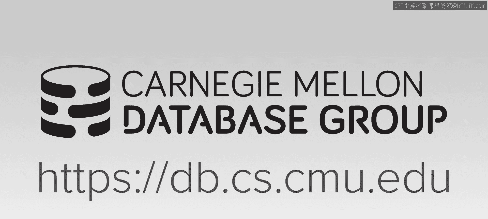
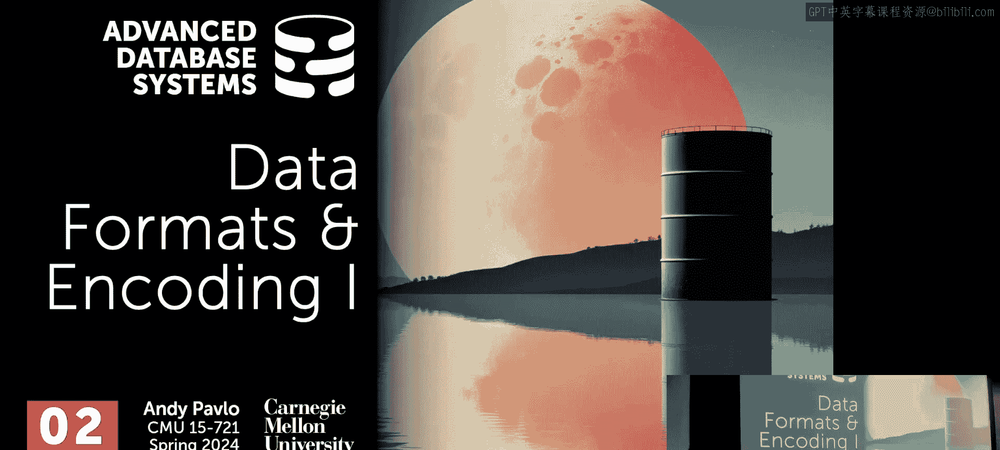
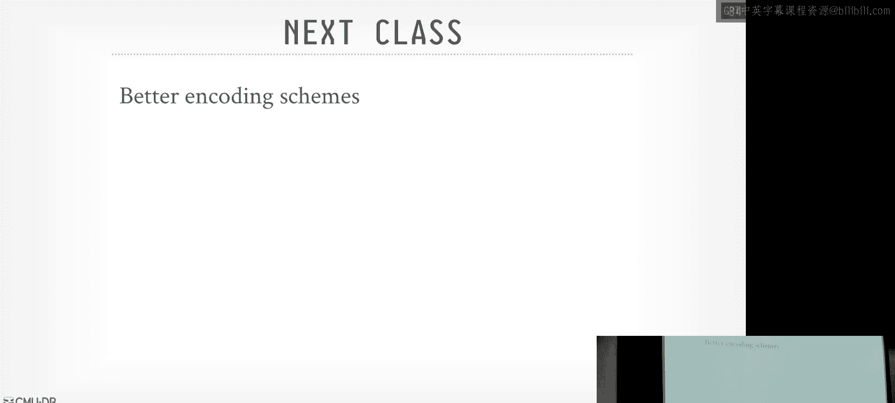

# CMU《高级数据库系统》：03：数据格式与编码（第一部分）

在本节课中，我们将从数据库系统栈的最底层开始，探讨数据在物理存储和内存中的实际形态。我们将从存储模型入手，逐步了解如何为分析型工作负载设计和优化数据布局。

## 概述

我们正在构建一个概念上的数据系统。从系统栈的底部开始，我们将逐步向上，最终能够运行查询并产生结果。本节课，我们从系统的最底层开始，描述数据的实际形态。

首先，我们需要再次理解我们针对的工作负载类型。我们一直在讨论OLAP系统，其工作负载与OLTP系统不同。这将指导我们如何设计数据，包括如何在磁盘或内存中布局数据，以及需要哪些辅助功能来支持这种设计。

## 存储模型

上一节我们介绍了课程目标，本节中我们来看看数据存储的基础——存储模型。存储模型定义了如何在物理上（磁盘和内存中）存储元组。这不仅仅是存储的实际字节，而是指如何组织同一元组内的属性以及跨元组的属性。

以下是三种主要的存储模型：

### 行存储模型

大多数系统默认的存储模型是N-ary存储模型，即行存储。这是PostgreSQL、MySQL、SQLite、Oracle等系统使用的模型。其核心思想是将单个元组的所有属性连续地存储在页面中。这种模型非常适合OLTP工作负载，因为这类应用的事务和查询通常只关心获取单个元组（例如，获取Andy的订单记录）。插入、更新和删除操作也很简单，只需在页面中找到空闲槽位并连续写入即可。在这种模型中，页面大小通常是4KB的常数倍（例如，PostgreSQL默认为8KB）。

然而，行存储对于OLAP工作负载来说效率低下。在OLAP中，我们通常对表的一个子集列进行大规模顺序扫描。如果表有100列，但查询只需要其中4列，我们仍然需要将其他96列读入内存，因为它们都打包在同一个页面中。

### 列存储模型

分解存储模型是一种纯粹的列存储。人们认识到，对于OLAP这类不同的工作负载，连续存储所有属性并不合理。相反，应该根据属性来分解元组，然后将该属性在所有元组中的数据连续存储。这为压缩和其他优化技术打开了大门。

我们能够这样做，是因为OLAP工作负载主要运行只读查询，通常不担心如何对数据库进行增量插入。如果必须更新一条包含100个属性的记录，在分解存储模型中，我们可能需要更新至少100个页面，这在事务处理中会非常缓慢。

在列存储中，文件通常更大（可达数百MB）。文件内部会被分割成更小的块（称为行组），以标识实际需要处理的部分。

### PAX模型

PAX模型是行存储和列存储的混合体，旨在同时获得两者的优势。它解决了纯列存储的一个问题：大多数OLAP查询很少只访问表中的单个列。如果采用分解存储模型，每个列存储为单独的文件，那么在需要将结果重新组合以处理查询时（例如，WHERE子句可能引用四个列），就不得不在不同文件间跳转。

PAX的解决方案是：将表水平分区为行组。在每个行组内，我们连续布局单个列（或属性）的数据，完成该列所有元组的数据布局后，再跳转到下一列。这样，我们既获得了列式存储的所有好处（如更好的压缩、向量化执行），又保持了行存储的空间局部性（即与单个元组相关的数据彼此靠近）。

## 现代文件格式

十年前，早期的列存储系统（如Vertica、Greenplum）拥有自己的专有数据格式。大多数数据库系统（如SQLite、PostgreSQL、MySQL、Oracle）在磁盘上存储数据时，也使用专有格式。这意味着无法在不同系统间共享数据。将数据从一个系统转移到另一个系统的唯一方法是使用SQL查询将其转储出来，然后转换为CSV、TSV、JSON或XML文件，再通过批量插入操作将其转换到另一个系统的专有格式中。

随着Hadoop和云计算的兴起，出现了对通用文件格式的需求。这就是Parquet和ORC出现的原因。它们旨在成为一种通用文件格式，允许上游应用生成数据，而无需进行额外的转换即可读取，同时获得列式存储或PAX布局的二进制编码优势。

以下是两种主流的现代文件格式：

*   **Apache Parquet**：由Cloudera和Twitter开发，采用PAX布局，默认使用字典编码压缩所有类型的数据。
*   **Apache ORC**：由Meta（原Facebook）为Apache Hive开发，同样采用PAX布局，但默认仅对字符串进行字典编码。

这些格式都是自描述的，意味着解释文件中字节所需的所有信息都包含在文件本身中，无需读取外部目录。它们使用Thrift或Protocol Buffers等框架来序列化表模式（schema）信息。

## 文件格式设计要素

设计文件格式时，我们需要考虑以下几个关键要素：

### 元数据

文件需要包含解释数据所需的元数据。这包括表模式、行组的偏移量和长度、每个行组中的元组数量以及区域映射图。区域映射图存储了每个行组中列的最小值和最大值，可用于在读取文件其余部分之前确定是否需要读取该行组。

一个重要的设计选择是将元数据放在文件末尾（页脚）。这是因为这些文件通常很大，并且在批量加载数据时，只有在处理完所有数据后才知道完整的元数据（如全局最小/最大值）。此外，这源于HDFS等仅追加文件系统的传统，在这些系统上无法进行原地更新。

### 类型系统

类型系统定义了如何存储类型本身以及字节的表示形式。
*   **物理类型**：是给定值的最低级表示。对于整数和浮点数，通常使用IEEE 754标准。字符串的处理则更为复杂。
*   **逻辑类型**：建立在物理类型之上，定义了如何将逻辑类型映射到物理类型。例如，时间戳可以存储为从某个起点开始的秒数或毫秒数（一个`int64`物理类型），然后通过逻辑类型说明如何解析这些位。

Parquet的类型系统非常精简，只包含少数几种物理类型（如`int32`、`int64`、`float`、`double`、`byte array`），字符串被解释为字节数组。ORC的类型系统则更为丰富和复杂。

### 编码方案

编码方案指定了如何为列块内连续或相关的元组存储物理和逻辑类型的实际比特位。目标是减少存储空间。

以下是几种常见的编码方案：

*   **字典编码**：这是最常见的编码方案。用较小的固定长度字典码替换列中经常出现的值，这些字典码来自一个较小的域。这允许我们将可变长度数据（如字符串）转换为可以存储在列中的固定长度值。字典本身存储在行组的头部。
*   **游程编码**：当连续出现多个相同值时，不重复存储该值，而是存储该值及其出现的次数。
*   **增量编码**：存储连续值之间的差值，而不是值本身。
*   **帧偏移编码**：一种增量编码的变体，选择一个起始点（如列块的最小值），然后存储与该全局值的差值。
*   **位打包**：当值的范围远小于其类型允许的最大范围时（例如，值在0到20之间的`int32`），可以使用更少的比特位（如5位）来存储每个值。

不同的格式在触发这些编码方案的策略上有所不同。例如，ORC在出现3个或更多相同值时就会使用RLE，而Parquet则需要8个或更多。

### 块压缩

在编码之后，还可以使用通用的压缩算法（如Snappy、Zstandard）对整个行组块进行压缩。这可以进一步减少存储空间，但会增加压缩和解压缩的计算开销。在现代硬件上，网络和磁盘速度已经很快，而CPU可能成为瓶颈，因此需要权衡是否使用块压缩。

### 过滤器

为了在读取数据前跳过不相关的部分，文件格式可以包含过滤器。
*   **区域映射图**：如前所述，存储列的最小值和最大值，用于范围查询。
*   **布隆过滤器**：一种概率数据结构，用于检查某个值是否**可能**存在于行组中。它可以明确判断某个值**不存在**，但可能会误判某个值存在（假阳性）。

## 嵌套数据支持

对于半结构化的嵌套数据（如JSON、Protocol Buffers），简单的将其存储为文本字段并在查询时解析效率很低。现代文件格式采用了一种称为“记录粉碎”的技术。

基本思想是将嵌套数据按路径拆分，每个路径级别被视为一个单独的列。同时，存储额外的“重复”和“定义”级别列，以跟踪每个值在原始文档层次结构中的位置。这样，我们就可以像处理普通列一样，对这些拆分后的列进行编码、压缩和快速扫描，而无需每次都解析整个文档。

## 实验评估与启示

通过对真实数据集（而非合成基准测试）的实验评估，我们得到了一些有趣的发现：

1.  **字典编码对所有类型都有效**：不仅对字符串，对浮点数等类型进行字典编码也能获得很好的压缩效果，这有些反直觉。
2.  **简单的编码方案更适合现代硬件**：Parquet由于编码方案更简单（主要使用字典编码和位打包），在运行时需要更少的分支判断，从而减少了CPU的分支预测错误，在现代超标量CPU架构上表现更好。ORC支持多种编码方案，运行时需要根据元数据选择不同的解压路径，这种复杂性可能导致性能下降。
3.  **考虑避免通用块压缩**：在现代高速网络和存储硬件上，使用Snappy或Zstandard进行额外压缩所带来的CPU开销可能超过其减少I/O带来的收益，原生编码方案可能更优。
4.  **现有格式的局限性**：尽管Parquet和ORC非常成功并被广泛使用，但它们设计时未考虑某些对OLAP查询处理有益的特性，例如更丰富的统计信息（直方图、草图）、增量模式反序列化能力等。此外，各种编程语言的实现库对规范的支持程度参差不齐。

## 总结

本节课中，我们一起学习了数据库系统底层的数据表示。我们从存储模型（行存储、列存储、PAX）开始，探讨了它们如何适应不同的工作负载（OLTP vs OLAP）。接着，我们深入了解了现代通用文件格式（如Parquet和ORC）的设计，包括其自描述性、类型系统、关键的编码与压缩方案（尤其是字典编码），以及用于数据跳过的过滤器。我们还简要探讨了嵌套数据的处理策略。最后，通过实际评估，我们认识到编码方案的简单性对现代硬件性能的重要性，并指出了当前主流文件格式的一些局限性。下一节课，我们将学习为现代硬件设计的更先进的编码方案。