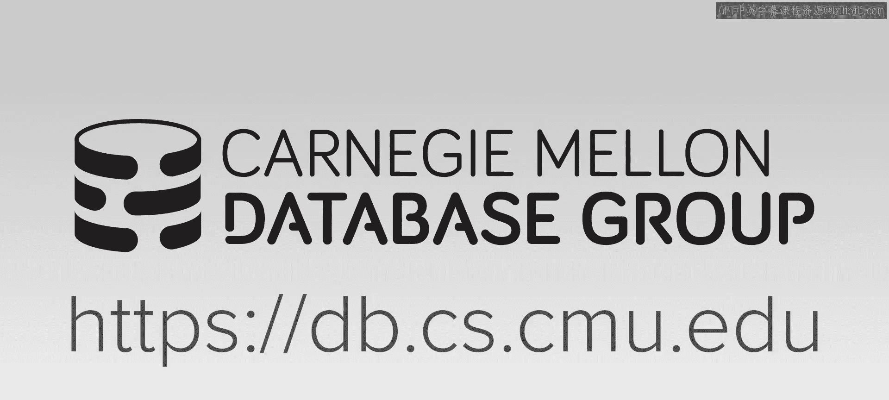
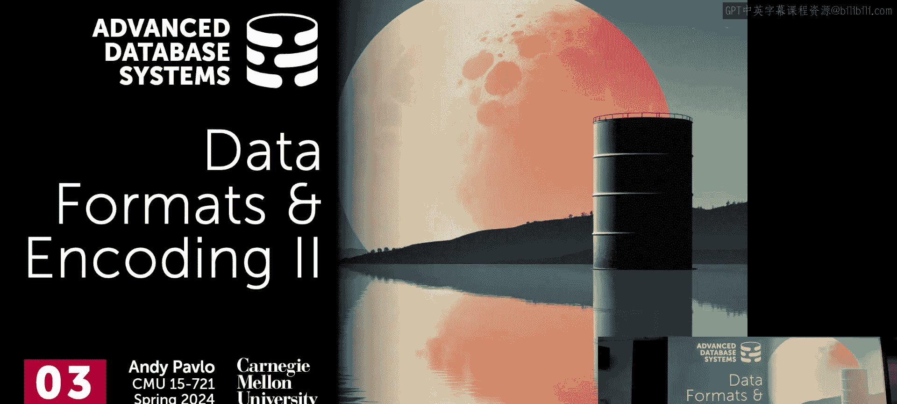
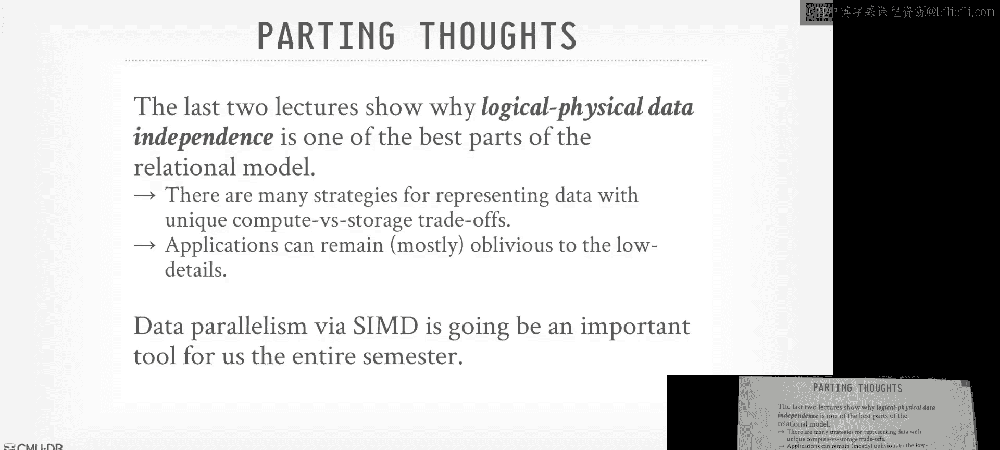

# CMU《高级数据库系统》：04：数据格式与编码（第二部分）





在本节课中，我们将继续探讨数据库系统中的数据格式与编码。我们将深入了解如何高效地存储和访问复杂数据（如JSON），并学习几种前沿的编码方案，这些方案旨在利用现代硬件特性（如SIMD指令集）来提升性能。我们将重点介绍数据分片、Better Blocks、FastLanes以及位交织等技术。

---

## 数据分片与嵌套结构处理

上一节我们介绍了行存储、列存储以及混合存储模型。本节中，我们来看看如何处理现实世界中常见的半结构化数据，例如JSON文档。

如果我们将JSON文档作为文本或二进制大对象直接存储在一个列中，虽然可以使用JSON函数进行查询，但会丧失列式存储和向量化执行的所有优势。因此，我们需要一种方法，将JSON文档“分解”并存储为独立的列。

### 分片的基本概念

分片的基本思想是，将JSON文档中的每条路径存储为一个单独的列。我们通过两个额外的整数列来记录结构信息：
*   **定义层级**：记录到达当前路径需要经过多少个可选元素。
*   **重复层级**：记录在当前层级上，重复结构（如数组）已经重复了多少次。

以下是处理一个简单嵌套文档的示例：

```json
{
  "docId": 1,
  "name": [
    {
      "language": {"code": "EN", "country": "US"},
      "url": "example.com"
    },
    {
      "language": {"code": "FR"},
      "url": "example.fr"
    }
  ]
}
```

通过分片，我们会为 `docId`、`name.language.code`、`name.language.country`、`name.url` 等路径创建独立的列，并辅以定义层级和重复层级列来重建原始结构。这样，当执行类似 `SELECT ... WHERE name.language.code = ‘EN’` 的查询时，我们可以高效地扫描 `name.language.code` 列，而无需解析整个JSON文档。

### 分片的优势与开销

这种方法虽然增加了存储列的数量，但我们可以通过之前讨论的编码和压缩技术有效减少空间占用。主要的优势在于查询性能：针对特定路径的查找可以快速在单个列上完成。当然，将分片后的数据重新拼接回原始形式会有一定开销，但这是为了优化最常见的查询模式（即按路径查找）所做的权衡。

---

## 现代编码方案：应对硬件变迁

传统的文件格式（如Parquet、ORC）设计于约十年前，当时网络和磁盘是主要瓶颈。如今，网络速度已极大提升，硬件格局发生了变化，我们需要重新审视编码设计。

这些传统格式存在几个对现代数据库系统不利的问题：
1.  **变长数据块**：导致解码时需要条件判断，不利于SIMD向量化。
2.  **急切解压**：将压缩数据完全解压后才暴露给查询引擎，无法在压缩状态下进行操作。
3.  **值间依赖**：如差值编码，使得相邻值相互依赖，难以并行处理。
4.  **可移植性**：依赖特定的低级SIMD指令，难以在不同硬件架构间移植。

接下来，我们将介绍三种旨在解决这些问题的现代编码方案。

---

## Better Blocks：智能嵌套编码

Better Blocks 是一种类似Parquet++的文件格式，其核心思想是采用更积极的嵌套编码策略，并通过一个贪心算法为每个列块选择最优编码方案。

### 编码方案选择算法

该算法会从整个列块中均匀采样（例如，跳转到10个不同位置，每个位置读取64个连续值），然后尝试所有可用的轻量级编码方案（如字典编码、帧偏移编码、游程编码等）在样本上的效果。选择压缩率最高的方案应用于整个列块。

某些编码方案（如游程编码）会产生新的派生列（如“值”列和“长度”列）。算法会递归地对这些派生列再次应用选择过程（最多递归三次），以进一步压缩。

### 支持的编码方案

Better Blocks 支持多种编码：
*   **游程编码**：适用于连续重复值。
*   **频率编码**：存储最常见值及其出现位置的位图，其余值单独存储。
*   **帧偏移与位打包**：存储最小值，然后存储每个值与最小值的差值并进行位打包。
*   **FSST字符串压缩**：将频繁出现的子字符串（最长8字节）替换为1字节代码，支持快速随机访问。
*   **Roaring位图**：一种高效的压缩位图索引，用于处理稀疏数据。

Better Blocks 避免了不利于SIMD的差值编码，并致力于在列块内部保持编码的一致性，以减少解码时的条件分支。

---

## FastLanes：为SIMD而生的重排序编码

FastLanes 不是一个完整的文件格式，而是一种低层编码方案。它通过巧妙的重排数据，确保在利用SIMD指令时总能最大化有效工作量。

### 核心思想：统一转置布局

关系模型基于无序集合，这给了我们在物理层自由组织数据的权力。FastLanes 利用这一点，对列中的值进行重新排序，使得解码过程（即使是像游程编码、字典差值编码这类有值间依赖的编码）能够被完美地向量化。

它定义了一套虚拟的SIMD指令集（假设有1024位寄存器），并基于此设计所有操作。在实际运行时，这些操作可以映射到真实的AVX-512或SVE指令，或者通过标量代码模拟。

### 工作示例

假设一个列经过游程编码和字典差值编码后，其索引向量是 `[0, 7, 14, ...]`。传统上，解码需要串行计算每个差值。FastLanes 会将这些索引值重新排序，使得在SIMD寄存器中，可以同时对一个“窗口”内的多个值进行差值加法运算，并将结果“散射”到输出内存的正确位置。尽管这可能会增加一些存储开销，但换来了极快的解码速度。

---

## 位交织：基于位片的查询优化

前面讨论的方案都是基于“整个值”进行扫描。位交织则采用了截然不同的思路：在比特级别拆分数据，以实现查询时的早期剪枝。

### 位切片

位切片是一种古老的技术。它将一个列中所有值的第1个比特连续存储，然后是所有值的第2个比特，依此类推。这可以看作是列式存储的极端形式。

### 位交织：水平与垂直布局

位交织技术在此基础上进行了扩展，提出了两种布局以适应向量化：
1.  **水平位交织**：在存储段内，以行为单位存储比特，并预留一个“填充比特”来记录操作结果。它使用标量位操作就能实现类似SIMD的数据并行效果。
2.  **垂直位交织**：即传统的位切片，但按处理器字长对齐。它可以直接利用SIMD指令，并且能在比较操作中实现早期终止。

例如，要查询 `zip_code < 15217`，系统可以从最高位比特片开始检查。如果发现某个元组在最高位为1（而15217的最高位为0），那么无论低位比特是什么，该元组都不满足条件，可以立即跳过，无需检查该元组剩余的比特片。

### 优势与应用

位交织特别适合范围查询和聚合查询。对于求和操作，可以通过计算每个比特片中“1”的数量（使用POPCNT指令），再乘以相应的2的幂次，快速得到总和。虽然这项技术目前未被主流系统广泛采用，但它提供了一种极具启发性的数据存储和查询处理视角。

---

## 总结

本节课中我们一起学习了处理半结构化数据的分片技术，以及三种面向现代硬件的先进编码方案：
1.  **Better Blocks** 通过智能的、递归的编码选择算法，在保持列式存储优点的同时，实现了高效的压缩。
2.  **FastLanes** 通过重排数据顺序，巧妙地将有依赖的编码解码过程向量化，充分发挥了SIMD的并行能力。
3.  **位交织** 从比特层面重新组织数据，使得查询能够提前终止，特别适用于过滤和聚合操作。




这些技术都深刻体现了数据库系统中**逻辑与物理数据独立性**的重要性：应用程序员使用SQL进行查询，而数据库系统可以在底层采用任何最优的存储和编码策略，无需修改上层应用，即可获得巨大的性能提升。同时，**利用SIMD实现数据并行**已成为提升数据库性能的关键工具，我们将在后续课程中继续看到它的应用。