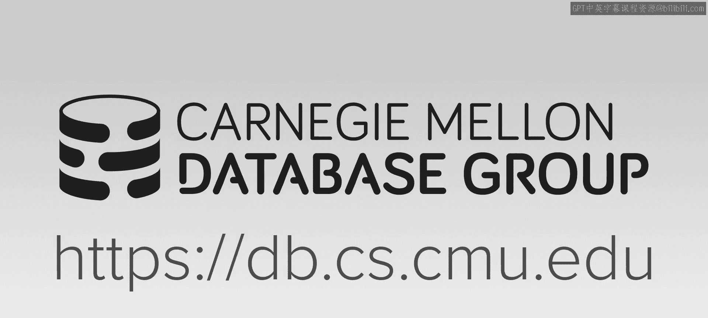
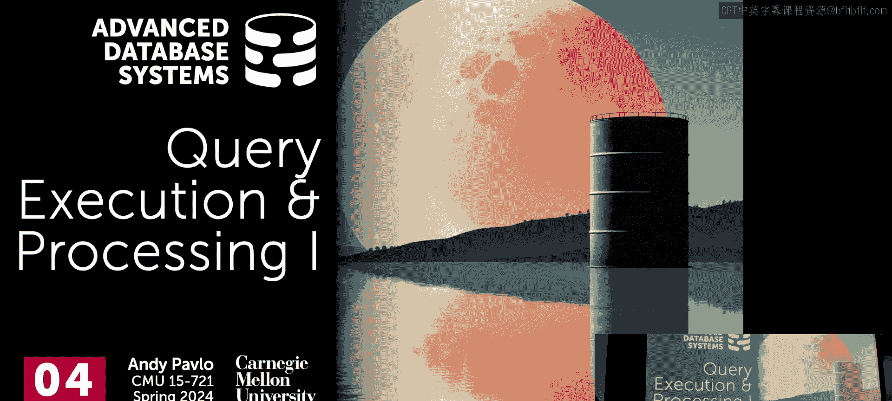
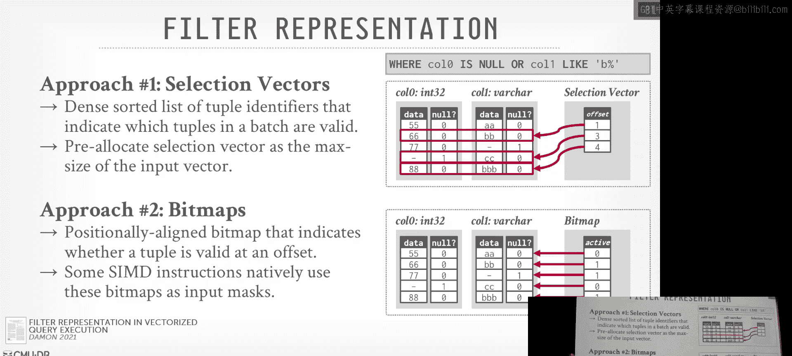
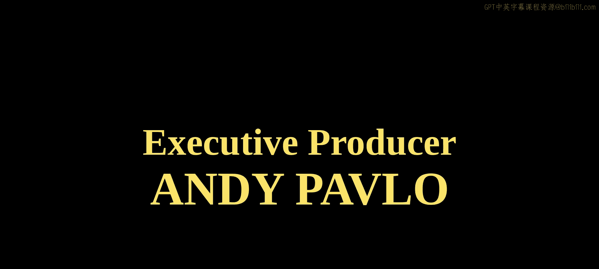

# CMU《高级数据库系统｜CMU Advanced Database Systems (15-721 Spring 2024)》中英字幕（豆包翻译） p05 -05-S2024 #04 - Query Execution & Processing Part 1 .zh_en -BV1HZ421N7WZ_p5-

🎼Carnegie Mellon University's advanced database systems course is filmed in front of a live studio audience。

😊。

🎼。All right， so today we're not to start talking outing queries so the last two classes。

The last few classes were focusing on。What the data is actually going to look like and we were designing our encoding schemes in such a way that when we actually start running the queries。

 we would minimize the amount of data we had to fetch from disk or our remote object store and bring that into memory and we can be clever about encoding our data in certain ways that we can ideally do our processing on it in its encoded form or in its compressed form。

 RLEs and obvious one but there's other ways we showed how to do this as well。And so。

For the next couple weeks， we're to talk about how we actually are going to execute queries and again。

 in the O that world， it's all about sequential scans。 We're not good new index lookups。

 We're ignoring bitmap indexes and other things， there is't gonna to be a BB tree to go find us single things。

 single records， we're going to have to scan through large chunks of data。

So this is again a list of what I showed a couple weeks ago of here's the bag of techniques or tricks we can do to make sequentialial scans run faster as I say we're not going to discuss make sure theres view and clustering。

 sorting in this semester but we've already discussed data encoding and compression we've already discuss a little bit about data skipping like how to use zone maps to say here's the minm of this giant block of data and check to see whether the people you're looking for or any that that could be could be in that block based on that in zone map so for the rest of semester we're going to go through all of these and it's not going to be like here's a lecture on test parallelization。

 here's a lecture on query parallelization it's going to come up in different in different points throughout the entire semester because sometimes we'll delay discussing certain things and then we'll have to bring in this bag of tricks for discuss how to do joins efficiently or how to do cospecialization。

 other other things so again， we'll go through these throughout the semester。So at its core。

 what this class is somewhat really about is how to build a database system to run efficiently on your data for for a given set of queries and the idea here is that we want to make the full use of the hardware that's available to us so again we can run queries fast at at lower cost than otherwise than doing something stupid and so all of the things I show on the last slide。

 there's not one am I going point to and say hey if you're building a brand new system。

 here's the one thing you want to do above everything else just briefly going back to it all these things matter。

 all these things are going to be a cumulative or multiupplicative where we can add them on top of each other and get better results make things run faster。

😡，And so it's really about understanding from an engineering perspective。

 what are the tradeoffs that one of these techniques could make。

 both in terms of the performance costs and actually the engineering costs。😡。

Like how much time is it going to take for actually to build this and maintain it is another big problem as well。

So the spoiler is going to be just in time query compilation， amazing results。

 you'll get really fast， but it's a big pain to maintain and build。And so therefore。

 most systems are going to use pre compileed periitives or operations。

This is actually with the vectorwise paper， I don't think they didn't mention in that paper。

 but it's one of the techniques that they used。So this is not a scientific list of what I think the top three optimizations from the previous list。

So these aren't the ones that I think they are going to matter the most in the context of query execution。

 these are going to matter obviously data skipping like if you're looking for a thing that's not in any possible block and your Zoom app can can help you avoid reading any data like nothing and go faster than that and reading nothing but if you actually do have to run queries。

 these are the ones that I think are going to matter the most。

 so we'll spend a little bit time talking about vectorization not actually the vectorized algorithms to do our query operators that'll come in a week。

 today is really setting up the query processing model so that we can then feed data in such a way that we can vectorize them。

Task parallelization we'll talk a little about today is basically how to take a query。

 break it up to disjoint tasks and run them in parallel on different cores， different threads。

 different nodes。And then code specialization， again， well。

 this will be a big thing starting next week， basically how can we avoid giant switch statements and indirection in our database system by having exactly what the query wants to use or the instructions that the query wants to use process the data。

Again， we'll see the two ways to do this。So at a high level。

 optimization goals are going to be the following three things。So in order to get queries run fast。

 the most obvious thing we can do is just reduce the number of instructions we have to use to execute it。

 right， We want to use fewer instructions on the CPU to run the query in the same amount of work。

The compiler can help a little bit。If you pass into the O2 flag， I don't know what the Cl is in rust。

 but you pass O2 and GCC and Klang， it'll be more aggressive in trying to optimize things so that you'll get few instructions。

As far as I know， people typically don't ship production databases with O3 enabled O3 compilations because things can get kind of hairy that can reorder things in a way that would be incorrect。

 and so instead what we're going to do is try design our database system and to design their execution engine just to use fewer instructions。

And if you don't take my word that don't want to ship03。

 this is from the Linux mailing list two or three years ago， and basically Linus is saying here。

 he thinks03 is generally unsafe。嗯。So again， sorry as than most database systems will ship a O2 enable for compilation。

So after we've reduced the number of instructions that we want to use to execute queries。

 the next thing we can do is try to reduce the number of cycles per instruction。

And the idea here is that when we actually have to execute instructions to run a query。

 we want the data that it's going to need to operate on the process to be in L1， L2 cache。

 even better would be CP registers。Right and that means we want to reduce cash misses due to memory loads in stores。

 we want to maximize locality of the data that we're going to process on in our operators in our query plan so that they're going to sit in the CPU caches and we'll see how to do this through pipelining and more aggressively with operator fusion in push-based query execution。

Right。So。The， the weird thing about this， not weird。

 But like the thing why this this one's would be tricky。 Like everyone can start a reason about this。

 right， The first one， like， yeah， run fewer instructions， Don't do stupid things。

 don't make library calls and start computing pie unnecessarily ready running a query。

 right That's obviously stupid。 But like know， things like that。 This one's a bit more tricky。

And the reason why this can be tricky is because we as humans。

 the way we naturally write system code or code is not going to be always the best way that the CPU actually wants that code or wants you run instructions。

Because the out of order superscalear CPU， which we'll cover in a second。

 like what is ideal for humans for us to reason about and maintain software may actually be the worst thing for the CPU。

 so we'll have to look at what the algorithms we're going to use when we run out queries or build our system to make sure that we account for what the CPU expects or once and try to design the code in such a way that it generates that for us because the compiler isn't always going to magically do that for us。

And the last one is sort of obvious as well， We want to parallelze execution。

 Moore's law is more or less ending， and we're not getting faster clock speeds。

 although Intel's more recently is rating that up， but we're going to get lot more quas。

And the cool thing about this is that on newer CPUs。

 there's a mix of the high performance core and the efficiency cores。

 so now we can in theory start scheduling things based on one core versus another。

 and then you throw in GPUs and those things have tens of thousands of cores， which is insane。

Right so I'm going to cover。We're going to cover all of these throughout the next weeks today we'll talk a little bit about how to do this one。

 the second one， and this last one a little bit， the first one will see this when we talk about cospecializations so query compilation and both precomplied and jded。

😊，All right， so just make sure we're all in the same using the same terminology of vernacular when we're describing queries and what we're actually going to be executing。

 you can think of a query planet as a daer operators。Right， so we have a SQL query here。

 and we converted it into a physical plan。 We have scans on the bottom。

 Then our projections feeding to a join， followed by a。That's a projection side of the filters。

Join and then projection。So these are the operators that we're going to have an a query plan。

 and then the database system is going to convert them into operator instances that are going to be invocations of that operator。

😡，And the reason why we had to distinguished between operator instance and operator is because we could have an operator run in parallel。

If this table is a billion tuples， I could divide it up this scan operator into 10 operator instances that are each going to scan different row groups or different files in S3。

A task is going to be a sequence of one or more operator instances。

this will basically be the same thing as pipelines， but not always。

 basically you're gonna recognize that， oh， soon as I do the scan。

 I immediately want to do the filter so I can combine these two operator instances together in a single task。

 And that's what's getting scheduled by the system to run。

And then a task set will be just a collection of these exweal tasks we could have for this pipeline that we could then ship out to the different course。

So the pipelines are going to be an important part of what we talk about today and going forward right and so again the pipeline is a boundary in our query plan that specifies how much we can process a single tuple or a batch of tuples or a set of tuples up through the query plan to at some point we reach an operator where we need to see all the other tuples within our pipeline before we can proceed up into the query plan。

So in this side here we're doing the scanner A， then the filter。

 and assume the build side say the hash join， the build side here is part of this pipeline。

 like I can't send it any tuple up beyond the join until I see what comes on the other side。

assuming I execute pipeline1， again， whether it's a single a single task or multiple tasks running parallel。

 it doesn't matter at this point。 And then once that's complete， I can then run pipeline 2。

 and now pipeline2 could do the filter So I do the scan on B filter it and then do the probe in the hash join and now we know that any tuple that matches in the join can then be pushed up to the projection operator as part of the output I don't want to start running the join I start probing the join on this for this query until I populated everything on the a side because otherwise I could have false negatives。

Now， I'm showing this in this sort of this pipeline wheel all the way up on one side。

 That's ideally what we're going want to do to maximize the the reuse of data。

 like to minimize the number of cycles for our for tu as we go along。

 But I could have just done the scan A and then filter it。You know， materialize the output。

 scan on B， filter， materialize the output， and then have these be two separate pipelines。

 and then a third pipeline could then be， okay， let me let me actually do the join。

 That actually would be slow。Because you're basically writing much of data between these two pipelines。

 where it's better off to do a pipeline that tries to get all the way to the top。Again。

 we'll see why this matters when we start doing operator fusion and other techniques。 Yes。

 going allow you to potentially start executing the join on the。

while you're still filterSo you're sayingt start can you start running the join at the same time or you're still scanning A and B。

 where there would be more bandwidth use certainly but it may be that the whole thing finishes faster because we're taking better advantage of。

So let's say that the very last tuple ignore parallel threats， so ignore multiple opera instances。

 this things running to myself， the very last tuple that you see in A is the only tool that's going to imagine B。

 but if I start probing into this hash table before I finish scanning A。

 I could have a false negative because I didn't put that tuple last tuple in yet yeah you can't do that。

what that？You're still building A， but you can't check to see whether something exists until it's populated。

😡，Are you about to start pipeline two？that's his question。

 can you start pipeline two before you start pipeline one？That would be， again。

 the problem said I said earlier where like， if I start scanning B， start filtering it。

 what do I do with that output， It's got to go somewhere right， So I start writing disk and memory。

 then that's that's this pressure for。You know， for the overall system。

 where would have been it's a better idea to maybe run this in parallel。Populate the hash table。

 then run B。Okay。So。lot of discuss today， but I want to first start talking about the paper you guys read。

You know， it's an older paper， but it's very important。

 it's very seminal about why the designs of database systems at the time when the paper is written 2005 are insufficient for。

For you， if you want to run OL queries， high performance OE queries， now you may be thinking。

 why am I making you read a paper that is almost old as some of you guys here or like is that 19 years old now。

Because that paper is seminal， meaning every OLAP system that's out today。

 for the most part followed the design guidelines that was laid out by that paper and everything。

With some exception about the itineium stuff， which we can talk about in a second。

 like the core ideas still matter a lot。Right。Then we'll talk about processing models。

 the plan processing directions， whether bottoms up or top down or push over pull。

 filter the representationization we'll talk about that little bit this we'll about when we talk about vectorization next week。

 but basically when I start applying predicates and I start matching tus and get match。

 what do I actually store when I go from operator to the next and then if we have time we'll finish up the different modes of parallel execution the idea is again。

 we're going to talk about how do you architect the system so that you can run operator these tasks or the operator instances in parallel and then in a few weeks we'll then cover how do you actually implement the algorithms within the implementation itself to do parallel parallel execution like for joins and sorting。

All right so again， the MoDBX100 paper it's from 2005。

 and it's essentially a low level analysis for inMeory workloads。

What are the bottomnes you're going to face when you run OLB queries and the the big idea they to breakthrough was they looked at all these existing systems at the time and showed how if you want to run OLB queries running large scans over and doing joins and so forth that the existing systems at the time were certainly not welldes for the modern out of order superscalear CPU architectures that Intel was putting out at the time。

And the idea is that if you can redesign your database that to better target for what the CPU wants from you。

 what if you design the system itself， how data flows through it。

 what instructions you're calling and when， then you can get much。

 much better performance because you're designing the system in such a way that the CPU is happier。😡。

Instead of you as a programmer trying to make things easier for yourself and it is harder for the CPU。

 you make life slightly harder for yourself and the CPU can run much， much more efficiently。

So what happened was the background of this story is that there was this project out of CI where this paper came from for called Mon be the date in the 90s and basically they were doing some experiments on and they realized that oh the way the way they're going to do the processing model and send entire columns from one operator to the X that's terrible for the CPU and there's all this indirect。

 things much lower so they built this X100 prototype they then spun it out as a startup called vectorwise that was acquired by acting in 2010 they then rebranded as vector which I think it's a terrible nameframe database because you search vector database you're not going to get this thing you're going to get weviate and Pine cone and all these other ones but then the cloud version of vectorwise is now called avalanche。

 then acting got bought by I think Indian holding company H two years ago and so it's still there acting is also the original is what Ingressre became so InGgress got bought and sold over the various years。

And then at some point it got rebranded to Action and they sort of had these older databases and then then vectorwise was sort of the high performance column column store engine for Ingress and then got it got rebranded by anyway so again the reason why I had you guys read this paper even though from 2005 is because this is this is how you want to design assessment even today now there's all this other stuff about ittanium which I'm assuming that's a CPU architecture that actually who here has heard ittanium。

One three right's basically it was like it was another superscalealar CPU from Intel in collaboration with HP in like the 200s。

 it was meant to replace X86 right but it had like this massive like pipeline it did things a little bit different than how Xions work today。

 but it didn't go anywhere。 they code it off and so we'll say this maybe some other papers too。

 there's other intel hardware that people sort target that doesn't exist anymore we don't care about。

 but the high low ideas actually matter。And again， just to show you that this paper。

 even though it's from 2005 is still timely earlier in this year at Cider this paper won the Test of Time Award because the Davis research community recognized that how important this paper was and how has massive influence in in the database marketplace for Oquez So thats right there that's Peter Bos。

 that's it's the guy that did the early work of an ADB did the early work in vectorctor wise。

 now he's technically an intern at Mother Duck， but he did early work on DDb。

 Neils is I think he's the CEO of the Mo EDb Company。

 that's Mars Sowski So after Vectorwise got bought by acting and he then went and formed Snowflake。

 and a lot of the ideas that are in this paper is what Snowflakes based on we'll cover him later。

 that's Magda Pat Helen， she's a U of。 He's at Salesforce。 That's the guy that then Volker。

 he then an Apache Flink。😊，We're not going to cover our a flank， but anyway。Again， this。

 this paper is super， super influential。All right， so this is sort of a crash course in what CPUs look like and just for what it matters for us as database people。

 so is there everything you need to know in two slides at a high level？😡。

So the CPU is basically can organize the execution instructions through these pipeline stages and the CPU's basic goal is to try to keep this pipeline busy at all times there's always something to do so that means that if there are instructions that you can't complete in the single cycle。

 it's going to try to keep executing things in the pipeline because there's a cache message。

 it's got to fetch single memory， So it's always going to try to keep executing things right and in a superscale CPU architecture。

 there's be multiple pipelines running at the same time in parallel and so they're going to run slightly out of order。

 meaning like the instructions may execute differently than the order that they appear in the code。

 but then the CPU， at least the case of Xons are going to do a bunch of extra work to make sure that once you get all the data that you needed。

 you then check to see whether the output of these add order instructions would have matched the same as if it ran in order。

AD is doing such same thing， like all the super scalealless CPUs are doing essentially the same thing that GPU cores are not。

 yes。Precisely what does is a superscale just multiple cores no multiple pipelines。

 so within one core you'll have multiple pipelines。Yeah。One core， yes， but anyway。

So would you say that？The the '90s。But GPU core course， I don't think do this as well。

 right they're in order。Right， because this this is actually very complex to do。

 you're like basically， it's the same thing as like optimistic her control for transactions。 You're。

 you're assuming everything's going to be okay。 You let things run sort of speculatively。

 And then you have to check at the end。 Did it actually match out， right。

So this is fantastic right everything works great when you get it right and if the CPU recognizes that there is a a dependency。

 like I needed to node with the output of one instruction， but more to do the next instruction。

 or if I do a mis predictiondiction。Meaning there's an if clause。

 it sees that and it says a branch instruction， it sees that and tries to predict which path down the branch you're going to go。

 like if then else， it tries to pick which one you're going to go and then specly executes whatever thinks the path that you're going to take。

Then if you get it wrong， you have to flush the pipeline and roll everything back and restart。

And that's really expensive。So， again， these stairs can occur in the two ways I just said about。

 So one is dependencies， right， If one instruction depends on the output of another instruction。

 then you can't。You can't immediately put that in the same pipeline right you can have to stall and wait yes does pipeline correspond to one because in each cycle you take one work item from。

Now the question is does one pipeline card that's currently to each one court no。

 every core has multiple pipelines。The pipelines are short， I think like。

I think the latest y there are like 20 instructions in a pipeline not。In I think the X 100 paper。

 they talk about how like， I think the penium  fours or one of them had like 31 instructions。

 It was insane right they're now more reasonable。 But again， if you still have one of these。

 if it predicts something wrong。You got to flush the pipeline。

 undo stuff and install until you bring back the instructions so that you should have executed。Right。

So in the case of this first on dependencies， this could occur when there is if we're scanning a Tple and we need to store the data in an output buffer before we can execute anything else。

 like we need to know what the result of that computation was before we can go on to do the next thing。

Yes。Its the same pipeline， so does that mean you can click it on it？It question。

This says the first one says then it cannot be pushed immediately into the same pipeline。

 no because you can't like you basically have to wait until you figure out what's going to happen then you put it in。

Yeah， but I actually， I don't know whether you could have like here's the pipeline I'm really running。

 but here's the pipeline。 soon as I find out with the first one， then I can run the other one。

't I don't know if it does that。 I don't like it does。The second one is for branch prediction。

 and this is basically means that if as I said， there's an if clause or some kind of conditional statement。

 it's going to try to predict what you're going to do and this part is super sophisticated in CPUs like AMD and in Intel。

 like this is like the secret sauce of the CPUs and they don't share what exactly the branch predictor is actually doing。

Because the intels its very very sophisticated。 actually， they all are。 So again。

 the idea is that if we build our system in such a way that we have a lot of conditionals。

We may end up making things worse for us because。You know think of like your scanning data。

 you don't actually know what path you're going to take because it's going to depend on what the query is。

 like the conditionals or the where clause depend on what your data looks like。

 So there's no way easy way to really predict for every single query。

 what path you're going to take down for different conditionals。Right？So for this last one here。

 we'll talk a little bit about how to have that fixed it。 So again。

 because we have these long pipelines， we're try to spec execute per because it wants to stall the sorry。

 what to hide these long stalls between spending instructions and going， fetching things from。

YouL3 cache or L2 cash into our registers， right？The the one part of the data this is going to come up a lot is just the basic filter operations when we do sequential scans。

 as I said， because it's going to depend on the filter basically conditional like where something equals something。

 that's an if clause and whether or not that predant is going to buy up to true depends on the data。

So this is nearly impossible for。Even us as the database system。

 we're actually running the code to predict let alone the CPU because the CPU doesn't know anything about what a database system is or what a  query is。

You many know a compiler hint could potentially used to resolve this。

I don't know how to do it in Bras， but in C++， there's something in the standard。

You can call likely and unlikely。So they have these compiler directors where you can specify whether a conditional clause is going to be or code path is going to be likely or unlikely。

 right？C doesn't have this。 I think they avoided this。 Again。

 I don't know whether the rust has this this is。I did some quick searching to see what systems actually supported。

 Clickhouse has this。 I know DDB does not because they're trying to be portable。 Postgress has this。

 right。But the。These are not hints actually to the CPU。😡。

You can't tell this CPU like the branch hey I'm looking going to go down this the path right。

 I think Intel had had some capabilities in the early days to do this。 but 2006。

 they took it out right So this this is just a hint of the compiler for for it to potentially reorganize your code itself so that the likely path is maybe at the top of something。

 right。And then if you read this blog article from a， I think he's a compiler engineer at Intel。

 he basically says， don't use this， it's going to make sometimes it's going to actually make things worse。

 and it's not often going to actually make things better for you， right。

So I think the interesting thing we clickhouse， take all these systems that do use this like because they're all just pound to fines so you can just hide it。

You can see whether it actually makes a difference， I have no idea。Okay， it's unstable， yes。Yes。

But not again， it doesn't help the CPU branch predictor。I mean， for A6s or is it like for embedded。

 is it what's that？It's for A6。and like。so that's like specialized hardware， I have no idea for Zons。

 this doesn't do it I' sorry for the CPU， at PGA， okay。

 so you're saying for the network hardware stuff or for the network boxes。

 they take heavy advantage of this。But again， I'm telling you you can't tell the CPU that yeah。

 so I don't know what they're doing。No， it's a compiler director it' the oh sure。

 it's just changing the order of the assembly so that the likely path are closer to the top when you go to the conditional。

😡，Again， I don't know whether if this is custom harder or not， yeah。

I don't know whether this matters for database systems， not every system there actually uses。😡。

Posgres does， clickhouse does and a few others do。Yes。

 or were there ever any architectures where you could give a hint to the branch prediction？呃。

There used to be an op code that you could tell the CPU， but that was like 2005 and earlier。

Intel supported of it。Back in the day， but not now。It was making things also。Yeah。

Because people just like are stupid with it， too。Also。

 databases are too volatile for you to actually take advantage CPU or the CPU is well designed to know that that secret source I use supplement that's been designed for 2。

30 years。Is really good at figuring out which branch to take the branch。So when you do this。

 you kind of mess with that。But let's look at a case where even if you had it， it wouldn't help。

 right？So let's say over typical order here， select start from table where key is greater than low value and key and less than high value。

So this is how you probably would write this code again I don't like to show code in slides。

 but this is simple enough I think you guys can get it。

 this is how you'd write this code in Btub or a basic implementation right you have a for loop。

 iterates over to every s in the table， you go grab the key。

 then you have the if calls if key greater than low and key less and high。

 then you copy it in the output buffer， then you iterate whatever the buffer offset by one。😊，Right。

So what's the problem for the CPU？In this code。The F clause， right yeah。So you can rewrite this。

To not do any branching， the if clause is going to find a branch and the CPU is going to try to predict。

 am I going to go down this path or not。So you can write it like this as a Braial's version。

 where the very first thing you do as you scan scan the table。

 you immediately copy the tool in the output buffer。

You don't check to see whether it's going to satisfy the conditional， the clause。

Then you have this clause here where you then check the low and the high。

 but these are ternary operations where it's going to return 1 or0， you add the bits together。

 and then that tells you whether the delta is 0 of 1。And then in that case， if it's zero。

 then you would loop back around and just overwrite the last thing you copied and again。

 we said all our columns are fixed length， so I don't have to worry about am I going to overflow the buffer or underflow it based on one to what to the next。

 I just take the bits， plop it down and overwrite the previous one。

Now I'm missing a little piece at the end where it says， okay。

 if I when I come out of the for loop is the last thing was the last delta 01 and make sure I don't include that as the output。

 right？So this seems bizarre， right， as humans， we were like， this seems super wasteful。

 you're copying every single time。 It's surely that's more expensive than than the if clause， right。

 but it's not because the CPU knows how know this is just deterministic straight line code。

 It can rip through that way， way faster than than the brainprint prediction。

 Yes is there any advantage instead of just like implicitly dealing with it return。So it question is。

 is there any advantage of using ternaries versus like？I mean。

 the compiler might just converted it ones and zeros anyway， if you would use bulloles。Right。

So I'm saying is why is the turnernary？Just iss there any reason beyond just making it clear？

just remove everything but key greater than。Oh， if I did a key greater than low and key less than high。

1 or0， yeah I to。Yeah， you， the compiler this part I'm not worried about。

 The compiler compiler can fix that No， the thing I again， I'm trying to iterates like。

 you're always copying。 that matters。😡，So again， you think this would be terrible because the CPU is blindly copying。

 but it actually helps。 So this is this is one of the vector wise people。

 but this a few years later in I think 2013 or 2012。

And this is showing you for the two different approaches I showed like here's the performance different you get as you vary the selectivity of that wear clause。

 so if no tus are matching，on this side here， up to roughly about5% selectivity right the branching case is actually faster because this CPU is going say not gonna match。

 not going to match over and over again and avoiding that extra copy cost every single time is way faster。

 the red line is essentially flat because you're just doing the same work every single time。

 no matter whether the peopleil is going to satisfy the predicate or not。

 but then you see this nice this arch here where the height sorry the top is roughly on 50% and at this point it's a flip of the coin every single time。

 the CPU is predicting just getting it wrong over and over again。And then again。

 it becomes more selective， the CPU can figure it out better。So I had students reproduce this graph。

 I don't have it in the slides， basically six years ago， five or six years ago。

 we basically saw the same thing on newer CPUUs。Right？So again， the。This is just showing you again。

 which seems like bizarre or waitsful thing for humans to do is actually going to be better for the CPU。

In the case here， we're counting CPU cycles per tub bowl， it's not exactly runtime。

It in terms of how to produce instructions， and again， we'll talk more about the semester。

 but the idea here is that we want to specialize our database system。

Data systemss code so that when we operate on data， we know exactly the data type， the size。

 and then whatever it is， the operation that we want to do on it。

And so we don't have to have these giant switch statements that says if my data type is in 32 versus in 64 or float whatever。

 then here's my instructions to do addition or subtraction or whatever it is， likewise。

 I don't want to have to traverse the expression tree when I have my wear clauses predicates to say know is it a greater than the less than and again which is usually advocate implemented as giant switch statements？

So we're going to avoid all of that as much as possible and just have exactly the code we want to during our query because again。

 now there's no conditionals， there's no branching we're just giving the CPU， we're just feeding it。

 here's the exact instructions we want you to execute over and again。

So an example of doing this wrong or not wrong， but like well wrong in the context of like the worst way to do it for a modern CPU is you can look at postgs numeric type。

 And so it's just function to add two numerics together。 And so what do we see。

 we see bunch of these if clauses to check to see whether it's a positive number or negative number。

 whether it's not a number and they have this giant switch statement here have to deal with all the different variations of how to do the addition。

 again， this is just adding two numerics together If I have a billion numbers of my column and try trying to add it to another billion numbers。

 then I'm get execute the instructions over and again。 this can be terrible for on a modern CPU。

 I it the same like the match thing。The question is is it the same thing of the matching rust。

 that's like a compiler time thing， right？It gets like。Compil to their。But I think switch is better。

Yes it doesn't matter， it's a jump table， yes。😡，Jumps， that's bad， jumps are bad。😡。

Function calls are bad， jumps are bad。Right。But we do need to verify the types if you don't have branches I'm not sure you would his question is like you do need to get the types。

Yes， so if you had to rewrite this without the switch。

 I'm not even sure how you would do that because you need to do the stuff that they want to accomplish。

Well， ignore numerics， right， because that。We know online how to optimize this。

Just think of like if you had。Number plus a number。 So like， is it in 32 is it in 64。

 and you would have to have different branches for all those。

 But because we're it's sQL declared language， we have a catalog。 We know exactly the data types。

 So we if we set up the system in such a way that we know exactly the instructions we want to execute that we we can。

We can design things ahead of time and be way faster。

And whether or not we precompile the primitives we want to use to operate on different data types。

 or we just in time compile it。We'll cover that later。All right， so now with all that in mind。

 now we want to talk about how we want to design the execution and processing model to then lead us to the path of enlightenment of what everyone call it being able to achieve those three goals。

 right？So this would be a somewhat of review from the intro class。

 but I'm going to go a bit more detail of how the system is actually going to operate beyond what we cover the intro class。

 and then that'll segue into discussing the direction of how we move data between different operators。

So the processing model is going to define essentially how the data system is going to execute a query plan。

Meaning how it's going to tell what operator to run next and then where that operator is going to send data to data to。

😡，Or where that operator is going to get data from， so to speak。

And there'd be different tradeoffs we have for OTP systems。

 OLAP systems or OOTP workloads and OLAP workloads。

 and we'll see how in the case of the volcano model， the iterator model。

 that's the default choice are most database systems like row stores， and that's great for OLTP。

 but it's not going to be so great for OLAP。So every processing model is going to be defined in terms of execution paths。

AndThe two types of execution path we can have are the control flow and the data flow。

 so the control flow is going to be how the dataE is going to tell an operator or operator instance。

 OK， now it's your turn to run。And then the data flow is going to specify for each operator instance。

 where does it send data to and where does it getting data from？

And so the output of these operators can either be whole tuples in the case of the row store or a subset of columns。

 and in our case， what we here to care about in the OL world is going to be NSMs。

And we can ignore late materialization， whether or not it's the all the columns or subset columns。

 we can worry about that later。So the three processing models we're going to care about are iterators materialization or the columnar1 from the X100 paper。

And then that'll lead to， again， the vectorized model。

 and the explosion can to be this last one here is well every OAP system。

 except for a few exceptions are going to implement this approach because it's sort of the best of both worlds of the iterator model and the materialization model。

😊，So the itator model， or calls it called the volcano model or the pipeline model。

 I'll often probably just say volcano model again， is basically how every database system up until the MoAD paper or the vectorwise paper you guys read。

 this pretty pretty much everyone implemented their query processing model。

So in your source code and your system， you're going to have all your operator implementations and each ones can to provide this next function。

And so what's going to happen is every time you want to get a tuple from an operator on the control flow path。

 you would then invoke the next function on that operator who then be responsible for producing either a single tuple or some kind of end of file or null marker to say。

 I have no more tuples， never ask me for more data。Right。

And you can sort of think of like within that operator it's just going to be a for loop that's going to retrieve all the tus that it needs from its shot operators and depending on whether it's a pipeline breaker or not。

 it either gets all the data from its children if it is a pipeline breaker or it can just get one tuple。

 and it longs as it satisfies whatever that operator wants to do in it and can produce the output。

 then it's done。So you sort of thinking of like again the way you actually implement up on this is youd have these open closed functions on the operator is like constructors or deconstructors for your operators。

 and then so you open it， call N X X X on it， get all the output you want and then when it says I'm done。

 then you call clothes and that cleans everything up。So let's look a high level example。

 so we want to join RNS， and we have a joint conditional on RID， SID。

 and then we have an additional wear clauses where S value is greater than 100。

So you can sort of think of each of these operator are going to have these implementations。

 as I said， they're going to be basically just four loops that's going to make calls to its children operators to pull data up or move data up and then produce output when it's available。

So you can think of these blocks of code here， these are all the next functions。

So we're to start off the database that says， okay， I want to run this query。

 assume we're going from the top to the bottom，re called next on the first operator here and then immediately inside that we have this for loop that says called next on my child operator so that would be the blocking call so the control flow would move from the top operator to the second operator here to do the hash join where immediately inside that when we have a for loop that says called next on his child because it wants to build the hash table so then the control flow takes us down here and now we're just iterating over the table R and we're callinging emit which is the return control we' sending one tuple back up to the calling function and so there's some state inside each to these operators that keeps track of the last time you called next here's where I was here's where my cursor was when I was scanning the table。

So we're going to keep calling next on the bottom operator here until we get all the data till we can end a file and at this point here we know our hash table has all the two pools we need。

 so again we won't have how many false negatives， so then I go down to the next block in my operator and I'm calling next on my child on the right child so I come down this side same thing scan over R pass it up to the next operator。

 it applies the predicate， if that gets satisfied predicate then it sends it up to do the probe。

So you sort of data you chain these things up like this。So again。

 going back to this notion of pipelines， sort of think of like this block three and the first half of block2。

 that's pipeline pipeline1， and then this 5，4， the bottom two and1， that's pipeline2。

 so I execute pipeline1。系。Ideally， and then。I'm sorry， in this case here。

 there's pipeline boundaries but you're not doing any optimizations because implicitly the code is set up so you know that you can't run the second pipeline until the first part it's actually done。

Right，So again， this will different when we see the operator fusion technique or the push based approach。

 because they're actually going to try to combine these within a single operator instance。

And not have these calling next within themselves。So I said。

 this is pretty much what everybody implements in sort the first database systems that they build a Road store systems。

 bus T is based on this， yes。wouldn't you want to build a hash table on the table that has？A filter。

INext question is， should you want to build a hash table or the one that has the filter？

You don't know， right。 First of all， this is a logical diagram。 It's PowerPoints slide。

 I don't have stats here， but。What if this thing is like one tuble？Right。So anyway。

So the iterative models approach every implement， output control is really easy for this because if you know you've gotten enough tus that's the output。

 you just stop calling next and you finish， right？😊，The downside， though。

 is that we're basically mixing control flow with data flow again， going back quickly。

There's no way to sort of say， okay， I don't want to execute this thing anymore。

Because I've gotten enough data or stop exceeding certain parts because I'm calling next to get things up。

Right。Everything is if I call next on this and political it's going to call next on its children。

 because that's sort of how the query plan has been set up。

That's how the iterator model allows you to control the behavior of the execution。

It's going to also us do pipeing again the idea here is that we want to have for every single tubo that we get from a know from a child operator。

 we want to do as much processing as we can up the query plan until we get a pipeline breaker or produce the final output the idea is there we can maintain or。

We can achieve good cash locality because we bring a tuple in and we do as much work as we can while it's in memory before we go off to the next tuple。

Until we hit a pipeline breaker， which again， we know we can't have an operator complete until we get all its shown on to emit their tuples。

 so the billsideder joins， we have this problem， subqueries depending whether they get rewritten or not into joins。

 you have this problem in order by or sorting obviously has this problem some aggregations。

 mini and max same thing。So the。The downside though。

 is that you're basically calling next for every single tuple， if I have a billion tuples。

 I'm calling a billion function calls to just call next times the number whatever operators that I have or number tus that are being sent up。

 right。So。An alternate approach that was pioneered by Moon D B in the late 90s。

 of the 2000s was to do what is called the materialization model where every operator。

Produces all output all at once。 Anytime you call next on it。

 it generates all the output and then hands that off to the next operator。 So once you call next。

 you never go back and ask for more data for it。Right？

The idea is that callization model because youize each operator is materializing all its output in a single result。

And again， the output could either be a single row， a single column or the entire table， Yes。

 white of basically materialization right because we end up materializing the entire result。

HisDavi is pipeline breakers are essentially the same thing as。

Pipeline breakers because you materialize it in the entire result， not necessarily， right。

 because I could call next on a pipeline breaker。Well。You're like， to point， yes。

 like I could produce all the output and then something's going to feed into that pipeline break of result。

I could just get a single tuple， I wouldn't pass because it's still like one two by at a time called Next。

 I wouldn't have this giant app shoved all the way up， all of a sudden switch the processing model。

But to your point， like the pipeline breaker， like you're materializing all the results at that point there。

 yes。Yes， but in the case of materialization model。

 every next call moves the entire result always off。

So it's not as simple as saying that Majormon is just saying em operate as a Pth breaker。

 it's not as simple as just saying that。诶。His David is。

 it's not a simple saying in the model that every operator is a pipeline predicter。That's okay。 Yeah。

 that's fine。 Yeah， it makes sense， yeah。You wouldn't describe it that way， though。

 but it makes sense， yes。嗯。Right right so let's see how to go back to our original query we had before and again now in our operator implementations now we see that like again we have this output buffer and we just keep adding tuples and then there's a return calls where again all the output goes up to the next guy So just like before we start at the top the call the root operator calls child out output。

 calls this guy who then has to build a hash table。

 calls down to the scan on R again we populate the entire output buffer。And then shut the result up。

And again， if I have a billion tuples， even if I want one column for a billion tuples。

 my output buffer is going to be a billion tuples in this approach。And then again。

 same thing all the tus， I go down the other side， I call the filter， which then calls the scan on S。

 and the same thing that the data gets moved up like this。Right。

So an obvious optimization here is that。For this side of the query plan。

 I'm scanning S and then materialize the result and then neatly handed off to a filter operator who then basically throw throwing much stuff away。

 So an obvious optimization is to inline these two or fuse them together so that as you scan S。

 then you evaluate the predicate And then if that value is true， then you pre them the output。Right。

Again， you could do that branchless technique we saw before， I'm showing with the if calls。

 but you could do that optimization we just solve。So this is great for OLTP because in that world。

 the queries are accessing the single tuple， so even though you're materializing the entire result it's going to be one tuple。

😊，And then it's just one less next call， to go before you get the end of file。

 like you got everything you would ever need for an operator and you can move on。

You have to do that in lineing and make sure you're not passing up more data than you actually need。

 but it'll works great， and then when we built H store that became BTB we used this approach。

But I would argue and the paper you read argues that this is bad for OL because。

you may be coalescing or printing out a bunch of data in higher parts of the query plan。

 but you're moving these large columns from one operator to the next。So it's great that again。

 you have fewer next calls， but you're moving more data than you potentially actually need。

So the vectorization model is an obvious optimization， or it's obvious now but at the time it wasn't。

 that's sort of getting the best of both worlds， that you're still going to have this next call that's going to move tuples up or move tus from one up to the next。

 but instead of moving a single tuple you would an iterator model。

 you're going to move a batch of tus or a vector tuples。Again， the naming is bad because you say， oh。

 it's the vectorized query processing。Now now with vector database is that people may think you're doing sending embeddings or something like that。

 which we're not doing。So we're going to make a batch of tus instead of a single tuple。

 and then we're going to have our operator， the loops themselves cells be designed to operate on these batches of tus at a time。

Right and the size of the batch can vary depending on what the data looks like。

 what the query action wants to do， or what the hardware looks like。

 I think of the paper they were talking about 1024。

 that's usually roughly what I think most systems are using。Some systems might be a bit smaller。

 we'll see examples of that later on。And again， the batch is get either be going to be one column or subset of columns based on whether or not you're doing late materialization or not。

 or you've already done projections on it， right？So if we go back to our query one more time。

 now within on our implementation， we still have an output buffer and we're going to add things to it。

 but now we're going to have this conditional clause that says when we've accumulated enough tuples for the size that it's expected for our vectors。

 then we can emit it up or send it up。So same thing we called that before。

 fill up our vector output buffer， and then we use that to send it up。

I sent a tu a batch and then same thing down on the other side here。Yes， implicitly。

 if you run out of things to iterate over wheelels， just up whatever。tょ okay。

His question is or save it is， if I'm at the end of R and if the size of the output buffer is less than n。

 but if I'm done， then yeah you send it up， so you would have a little thing outside the full cost。

 yes。And then you。We'll talk about this in a second， but you basically keep track of like， okay。

 here's the rows that are actually active and whether you use that bit mapps or offsets。

 we'll you that in a second。哎，O。So as I said， this is the。

This vectorized pre processing model is what every modern OLAP system is going to use today。嗯。

And as big its can greatly reduce the number of next calls we have to have per operator。

 and it's going to allow a out of order CPU to be able to efficiently execute our operators over batch of tus。

 assuming we've designed our system in a way to operate on these vectors。Right， so again in。

The authors of the paper talked about， they could have called it the array processing model。

 but that's essentially what it comes down to what you're doing。

 These batches of two posts are just arrays。And then within each operator as you get the input input vector from your child。

 now you have a for loop of going over array arrays and that's the ideal scenario for out of order superscale CPUs。

 they love processing arrays right so you can do all of the specs execution check tricks we talked about before you can do vectorization with Cdy。

 which we'll see more about next week all these things we can take advantage of because we know we're doing the same operation opener again within a tight kernel on the data that's going be the same type same length for the most part knowing strings。

 but like we can crush that Yes to understand the distinction betweenizing vector because in both cases it seems like you are sending a bunch of data the time it's the form arrays but still。

Like like so statement， his question is， what's actually。

 what's the fundamental difference between materialization model and vector vectorized that like the size of the output isn't everything so that we can。

诶。We can take advantage of other， We can take advantage of pipelining for our vectors because we don't we can take we're taking batch toism in sort of digestible bites。

It's having this whole thing and I process it for the entire operator。

 then move into the next operator。 I can have this like pipeline execution where I'm just taking some vector tus and ripping through it and only going back to the next vector。

 either when I reach my final output or all the tuples got thrown away or something like that。

 material still use limit to say I want so manys here you're。

His statement is in case of materialization model， you can use limit to say， I only want certain tus。

But like oftentimes like that limit clause is applied near the root of the query plan。

 like give me the top10 you know top 10 accounts you know based on some number。

 some column I got to sort them before I can get the top 10 So that means that if even though I'm going to throw away most of the data。

In materialization model， I got to pump a lot of that data up。 Now you say， okay。

 in retroization model， you still have to do that， right。

 But like the implementations of the operators themselves。

Can deal with these these chunks of data that can fit in L L2 caches。

 you're not dealing this giant blob of data be that's going to have a bunch of cache misses。Yes。

Can you clarify what the？ね。What the different options？

So his question is what's difference between control flow and data flow？So。O sorry。So control flow。

 again， is how the。The part of the data system that says， OK。

 time to execute this query and how it tells an operator to say， start running。And in the case of。

 in all the pictures I'm showing here， we're using top to bottom。

 so we're calling next and that's the control flow so we call next on the top operator。

 it then calls next on this chat operator， that's the control flow。

And then the data flow is where the data is moving back。

'll see a distinction a better distinction when we talk about pushers as a pool and the pushers as pool。

Where the execution of one operator versus the next operator is not embedded in the execution of another operator that we can then say。

 okay， now it's time to execute this pipeline and there's an asset system that makes that call and then that operator then does not or pipeline does not call the another pipeline。

 there's something else that's centralized that's managing all that。Whereas like good yes。

 so the two different options for a control flow。呃。Yeah， yes。 But like， you wouldn't say it that way。

 right， that you would have a different approach for doing control flow if you're doing a push first approach versus a poolver approach。

We'll come to that in a second。 And what are the different options for。Is it twofold versus？Yeah。

 to his point， his question is， what's a different option for dataflow？

You can think of like a pricing processing model as defining that。That as well。

 the purchase of the pool is part of that as well。's， but like， yeah， do you use the dataflow。

 is it a single tuple， all the tus or a batchger tus。Okay。嗯。

So another great thing to also too because we we have these tight kernels and' processing these batches of tus。

 all the tus that were to execute for that。What's inside that kernel。

 every single iteration is going to be in our， you know instruction cache。 All right。

 And that's going to be super fast。 We'll have very few data dependency control dependencies because we don't need to。

We don't need to see the output of a。Of another tuple within our batch to determine what the next thing we need to execute。

 right。It's not always entirely true， but like you can。You， in most cases， this will be the case。

 whether or not a predicate， a predicate doesn't matter whether the last two will sanit that prediiccate or not。

Again， not always true， window functions complicate things， but we can ignore that。Again。

 and we'll see this next week， the great thing about having these tightpho loops is over arrays。

 that's the CPU wants and's what the compiler wants to be able to vectorize this using S。😊。

We'll see how to explicitly do that in next week。So this is from Peter Boons's slide when he won the Test Time Award for this paper。

But。In discussion of why。Why they saw the vectorized model be so much faster than the iterator of the volcano model or the materialization model that was used in ODB in case the volcano model。

The interpretation overhead we'll cover later on that's precoc periods。

 but now you don't have this per tu navigation of again calling next and X and next or every single tuple。

 it's now if I if I'm 1024 sized batches， I'm just reducing the number of calls by 1024。

 it's pretty significant。In the case of Moon ADDB， we'll see this more later on。

 but the query plans went much more simpler because it's just like as was in the iterator model。

 except now you're passing batches of two bowls， whereas in MoonADB they were sort of keeping track of implicitly。

 here's all the columns I'm passing around and it was way more complicated and then all the optimizations you get from the compiler or CD that's just。

It's in addition to all the other things， just by designing this in itself。

To pass around batches of data， things run faster， but then oh， by the way。

 the compiler can also rip through it much the better as well。Okay。

So leading to his question about pushes to the pull， but in all the examples that it showed。

 there was this next function。whether it was vectorized， materialized or。Or iterator。

 there's this next call that I'm making per operator， and I'm always starting at the top。

 calling the root and going down and bringing things up。And again。

 this is how most systems are going to implement through ex engine， but it isn't the only way。

And this gets into the distinction of top to bottom， the pole based approach to the bottom and top。

 so again， the top to the bottom is what I just showed， if you want to start exceeding the query。

 you call next on the root and then that will then call next on his children and propagates down to pulling data from the bottom of the query plan up to the top to the root and that produces the final output。

Right。And the。You're always going to be calling next to get the next Tple unless it's a pipeline breaker because that'll stage data in a sort of intermediate result that you then go access。

 but you're always passing Tups by passing data by calling next and that's going to be a function call that's a jump instruction and again that's bad for a superscalealar CPU。

Alt approach is the push base model where you start with the leaf nodes in the queryrry plan。

And you have some outside controller or scheduler， initiate the invocation of that operator。

 that pipeline。And then it's going to take the data that it generates and push it to the next operator。

😡，Yes， we'll get that in a second， yes。So this is rare， it's probably more common now but again。

 when this paper the paper you guys wrote in 2005， this approach didn't exist。

 this shows up in a paper that you're assigned to read in a few weeks from the Germans in the system called hyper。

 that dude is insane， it's a oneper author paper， he invented or didn't invent。

 but he showed how to do just time query compilation with the LLVM in hyper plus also he invents the pushbased model in the paper as well。

 and he's got three cls， he teaches two classes a semester and he doesn't do drugs， it's insane。

The exact opposite he's very straight anyway， so let's see how to do this， Okay。

 so here's our same query we had before。😊，And now here's our two pipelines。

 but now instead we have a bunch of different operators that we're going to have to implement the individual or the blocks that code that implement the individual operators。

 now we're just going to have two for loops。And so for the first pipeline。

 we're're going to scan R and then populate the hash table。But in the second pipeline。

 we're going to scan S， and now you can see where that we're going to try to do is ride every single tuple all the way up to the top of the query plan。

Before we go back and look at the next tuple or the batch of tus。

 even though I'm showing this opportunity in a single tuple， you could do this on a batch as well。

 right So for every tu and S， then you evaluate the predicate， if that matches。

 then you probe the hash table then if that matches， then you put it as the output。

Yes this is fusion right here。 how did even end up how did it happen？

You want the abstraction to be an operator。Like would you literally hard code every single combination of operators I could possibly Okay。

 So his question is basically。How do you do this， would you have to hardcode every single possible combination of query plans to execute this。

 no？But so how would you have that two weeks？The answer is going to be just in time and compile this。

 you literally generate the code on the fly for the query plan that fuses this together。

 then compile it with the LLVM or GCC or clang。😡，Then run that。That's approach number one。

Approach number two is that you recognize I only have so many data types in my database system and there's only so many things I could do to them。

 So each of these are just functions and I just put them an array。And I execute one by one。

That's what vector Y does。That's code specialization。Give me two weeks， that。Yeah。

 your mind looks blown。 in fact， you can compile us on the fly， Yeah， that's what they do。

They're German， right？The Swiss are a good too， Swiss a good too。So it's hard， right？

I don't get too head。 It's even crazy in that the new version he like in this version they will in hyper。

 they would generate the elements IR， then compile that single store will generate C code。

 then compile that at least the version of the version in the latest version。

 the new system they're building called Ura， He doesn't generate IR。

 he generates literally X 86 assembly。like C macros， then he runs that through the December。

 Then on the background， he's running the LL VM compiles the assembled code into a shared object。

 And when that's done， he then links it in。Yeah， German， yes。

 so when you're talking about like compiling each of those a fixed number of functions you compile them one array or these like function pointers and you when you want to fuse them together。

 I need this like function A function D， and then you rearrange everything in your array that you。

Yes， the question is the way I way to do this if there are a bunch of function pointers would be a bunch of arrays where I'm putting in。

 I need to do this， the followed by this， followed by this。

 And then would you just invoke this function point as you go along， yes。

And that would suck if you're doing it on a per basis。

But if you do batches of tuples in the vectorized model， then that amortizes the jump call。

And then now you don't have giant switch teams of like， what branch should I go down， yes？

Ihy can we achieve it。So I said， why can't you do this in a pool based model？Ha。Good question。

 toward the fusion part。I mean， at a high level this the same at a high level is it the same。

 more or less yes， right because like you couldn't say， okay， do the scan。

Then the next call does this， the next call does that， but again， in the pull based approach。

 the way the software is actually engineered and designed is the abstraction is through these next functions。

So could you take a pool based model and then code Gent to turn it into this， yes。

Would you say this is the main reason pushes might have been told or are there other factors that I'm not so the control flow matters too right so like when I want to actually get X to this。

 there's some outside scoutul that says okay run this once this populates the hash table right and then you can then also specify where the output's going and say some output buffer and then that this thing's gonna know about when that's done then I schedule the next one and it produces the output right？

So you have complete control over everything。Yes。 and also like it kind like a DG， right。

 like you can like since sort pushing the data。How does the scheduler specify like forward to？

Like we need to emit like， let's say R feeds into two different phci pipelines so it。

So the question is， how if R needs to go to two different places。

 how do we handle that the scheduler tell us or just treat？Like， so the the way would it。

The schedule something before we actually start executing would specify where this output is going to go。

 So it's got to go to two locations。 you tell it， by the way， send it to two locations。

And it can either be。Like the operator itself， the executionion could be responsible for sending it exactly to the location needs to go to。

 or you could have like a shuffle service which we'll cover later that says like， okay， well。

 I don't know exactly where how to get it to where it needs to go。

 but if I know a send it to this other service， it'll then distribute it for me。Okay。

 I don't want to get too far ahead of like， yeah， its stuff is really really cool。

 but not everyone does exactly the。That again， as I said before the。

Coodegeing this on the fly is going be is to be hard to maintain。 The Germans can do it。

 few others can。 and then else no， no。No。Again。You know， I'll leave a little mystery， right。

 we'll see why。And at beyond， we implemented this here， right， We implemented it twice。

 And even the second time was meant to be easier for other people to use。 And it was still like。Yeah。

 it's not impossible， it's just harder。All right so again。

 this is just reiterating whatever to said top to bottom， we have complete control。

 we control the output via limit and basically the child operator has a block until the parent operator blocks until the child comes back with the results and the。

Again， the next functions aren't cheap because there's essentially going to be virtual function lookups in C slots because I'm stitching together this query plan。

With pointers。 And then at runtime， I have to do the virtual function and look up and say， okay。

 what is the actual location of the function I want to execute for that for that given。

For that given child operator， and then of course， these next call is going to be jumps and that's going to suck for us in the CPU。

In the case of the bottom of the top， you can have tighter control of the caches and registers and the pipelines in the case of the Hy paperper。

 can not only they're going to keep data in L1 cache， they're going to keep in CPU registers。

Can't go faster than that。Right。So the only challenge is that in some cases。

 you may not have complete control of limiting the size of an output buffer because you need to your。

 your。You have no way to sort of， you know， in the case of like the next call。

 if I got enough data at the top of my query plan， then I just don't call next anymore。😡。

But in the case of the， the pushb model， even though I may be still sending entire batches。

Instead of all the output， I may get more data in a batch than I actually want。Yes。

Poole benefit only comes if you're using。Otherwise。

 I don't think there's any other operating building。The data that it wants， right？

statement is the only benefit you get from having Apple control at the top is through limits。

 I think that's true， yes。Meaning window functions。Supficially， I say yes， but I might be wrong。

In the case of push it's actually tricky to do also start merge because you need two iterators at the same time and you have to keep extrat。

 I mean that's not impossible， you can do it， it's a little bit more tricky。

Because it's not that nested for loops ripping through a single tube board within a batch。Yes。

 if we're doing push base。Theres still a distinction between iterator Dutch。Mater。

His question is if we're doing pushbase is there still a distinction between two at a time tire output versus the tire versus a vector。

 absolutely yes， so my example here I'm iterating ever a single tuple and I call eVval predicate and again assuming that their function pointers。

 I'm jumping every single time to eval predicate for one tuple where you could do is like you could pass a batch of tuups call this vectorized version of eval predicate and then it gets a batch process is those。

So they're compatible。Okay。I don't think we're going get through parallel execution。

 but let's finish up with we'll cover that next class， but let's finish up with。

With how to it represent。Fill their did them。In the。And the iterator model。

 because we're operating or every operator is going to process one two at a time。

 if something doesn't match like a predicate， something's not meant to be produced as an output。

Then we don't send it up to the parent operator， either call next and get the next tuole from our child or whatever the local thing we're processing。

Or we return back into to file， meaning we have no more。

So that means that at no point in the query plan， will we send up data that we know has been disqualified or thrown out。

Because we wouldn't have emitted it up。Right。But in the vectorized model， you can't do that。

Because you're operating on batches or tuples， so you may have。

 based on what your predicate is or whatever the operation you're trying to do。

 you may end up filtering out or throwing away some tuples inside the vector while other tus still need to be passed up。

So now the question is how do we handle that， basically we have a vector whos going to have things。

 half the data as we want to keep， half the data we know we want to throw away。Oop sorry。

So let's save it with a query like this where the wear clause is where column 0 is null and column 1 or column 1 is like and then being a wild card。

 so say this my data， I have column  zero， column 1。And so if I now do the filtering。On this data。

 say this is coming in as a batch， this is the output I really want。Because logically。

 this is the correct result。But how did that get there？

Because I don't want to have to copy everything out and then put it back into another buffer。

 that's going to be slow。And so I need a way to represent logically that these are the tus that have been filtered out。

 even though physically， I may still be passing along dead tus or tus that I don't need。

So there's two approaches that do this the first is use what's called a selection vector。

 sometimes also called a position list and the idea here it's just going to be a densely packed array of the offsets of the two pools within my vector I'm patching from one operator to the next that are still valid are still alive or still active。

Right。So again， going back to my example here。My select vector would just be a list of offsets，1，3。

 four， because they correspond to the two poles that satisfy the predicate。

So now this is what gets passed as the output of next or if I'm pushing along in the pushbase model。

 this is what the next operator is going to process on。 so now when I start doing whatever it is。

 I get this batch of data， I have this selection vector。

 I to then account for some of the data may have been discarded and some of the data that's still active。

These most affect70s somewhere right？Why do this？His question is this must affect Cdy。

 or his question is， why do this？RightBecause the answer is going to be yes and for Cindy and for other operations。

 it's just。It's actually going to be faster for us just to pass along garbage。Right。

 and then if the case of like， if the selection vector goes 0。

 then I know everything' is discarded And I， and I just throw the entire thing away and jump out。

 but。It's going to be faster for us to not have to say after every single step。

 saying it's easier visualize this in the fusion model or the fusion approach。

 it's easier from going from one sort of line to the next line within my nest for the。

 to not have to go allocate memory resize and stuff。Right。

The alternative approach is to do bit mapps。And this is just going to be a bit map that correspond has the same length as the number of tuples in my vector that I'm passing along。

 and it's just a 01 that specifies whether the tuple at the given offset is validalor or not。

And again， as he brought out up， this is going to matter- doest make our life easier in CIdy in some cases。

 because some CID instructions in AVX 512 will actually take this as input as a mask and you can use it to tell it。

 hey， don't process the data on these lanes because I don't care for the output。So again。

 we'll see more of this later on actually。How to design。

 CD optimize operations or algorithms for a query plans or database system that can use all these things。

The current research literatureer actually says the top one is the faster way to do this。

So the photon paper from databs we'll read later on， says this。 and then our own research paper。

Why would this even be relevant if you're doing a fuse thing， because if you're doing a  few thing。

 it's just one or whatever it's a nested layer of problems because you used all the pipeline of operators？

That means that there's a pipeyon ra at the end of it。We don't need to use vectorization data flow。

 if we just。Are dealing in that abstraction。Sonior statement is if we're doing。Doing this。

 why do I even need that so literally like。Say send it T to it's being a single2。

 says it's a batch a vector。 I call this eval predicate。 right。

 It's gonna to then populate either the position list， the selection vector or the output the bitmap。

 right， If it's the bitmap， I do pop count， tell me how many zeros I have or how many ones I have。

 if it's， if I have at least1，1， then I know I want to do this。if you don't do that。

 then I gotta go copy， go iterate over every single tuple within my batch。

 populate a new output buffer， then feed that into my probe hash table。Right。

It's just faster to do zero copy operating on the data as it exists。

 I'm just updating bits or a position list to say which tros actually matter。

 And then all these implementations of these operators， which we'll cover later。

 take as input whether the selection vector or the bit mask and know whether or not to even consider2 an offset。

 What if we had S was the batch and there was out loop that was actually looping through a bunch。你喂你。

Do you see how that could be much- yeah， but don't do that。

We can do CoJ and they can do all of this stuff， they can't do that Yeah but that's going to be scalar instruction。

 Siti， we can vectorize all of this。We can recognize the evil Abol， Yeah， that's yeah。

That's why these course exist and why people pay you a lot of money to do this stuff， right。

 It's hard。はい。Yes。You know pull based support couldn' possibly like wait for the have a a to fill up and then pass it along。

So David is。If going back to the。嗯。So could you do in a pull based approach？

H let's just wait for the vector to fill up completely I only then pass it。

So you pulling a batch of tuups， a vector turups are a single tuple。So yeah。

 so statement is cant if I have in my example here。

 So I have three out of three out of what5 three out of five match。 So I have two empty slots。

 Can I as just call next below me， get the next vector。

Then at least find two matches then I then put in this vector here。

But that's a more bookkeeping to keep track of like， how many spaces do I have。

 Then I still got to maintain， the intermediate result of the child thing I call before me。

 It's not worth it。Its this way more indirection， way more branching， way more conditionals。

 If I just blindly just keep track of here's what it doesn't match， this is way faster。

Again as humans， this goes back to the branchless conditional I show before for this branchless scan as you're all coming with examples of like。

 hey， this seems kind of wasteful， you're passing along tuples like what if I have 1024。

 my exercise is 1024， all but one of them are thrown away。

 well again it's just faster to pass along the other 1023 useless tuples。

Then rather than having to do what he's proposing of going。

 getting any results and filling in the empty space。 right， it's not worth it。

 do exactly if you do the same thing that's very straightforward。

 And even though you may end up executing more instructions。

 but you end up using fewer cycles because again， there's it's set up in a way that the CPU wants。

Yes。The selection factor was essentially like。So David with the selection vector getting shorter and shorter。

 well depends on the query， depends on the data， but you would typically size it for the exact size of the vector passing along so like 1024 and they just have a length to say where the offset is where the end actually is。

Right。And again， these aren't had to be 64 bit IDs， if you only have 1024 possible values。

 you can store that in  16 bit numbers， so it's not that big。Yes， the size of the？

The size meaning like the。The allocated size or the actual contents， but why？Theyre all empty。

But it's not， I think what you're saying is like。Could you basically do almost like slab allocation to say like。

 here's my 10 value vector。 and here's my 30 value vector or whatever， like 32 value of 64 and like。

As I get full in one vector， then I go use the other one。 and therefore things hang around in L3。

 right， sorry， L1 more。But it's not that big， 10，24 times 16 bits， it's not that big。Yeah。Again。

 what you're proposing is you could do。Is that what the CPU once， though， no？

Because the worst thing that possible to do is call Maloc why we're doing any of this。

Because who are we talking here we call Malick。The operating system， right，'s he's going to screw us。

 over So like we don't want， like we precate everything ahead of time。 Yes。

 there gonna be weights of space。 but like it's better than having， again this。

It's better than having code to figure out， okay， try to be clever。Simple is better in this case。

 because again， it's just ripping through tus as fast as possible。😡，Okay。All right。

 we're over time we'll cover。Pll execution bidding class on Wednesday， okay？

Okay， see you。a to get the 40 spot get a quick take a sip and you'll be picking up models ain't the puzzle because I more man I telling the 40 young got Thor can。

St and six packs on the table and I'm able to see saying I on the way。No short with the clutch。

 you know what happened them， I take off the cap but first I' tap on the bottom。

 don about three in the freeze it so I can kill it， cat for with the bottle baby。

the down with the take back the pack of nuts，vo somens to to thes， Billy De to silly to weak God。

 be a manic of。