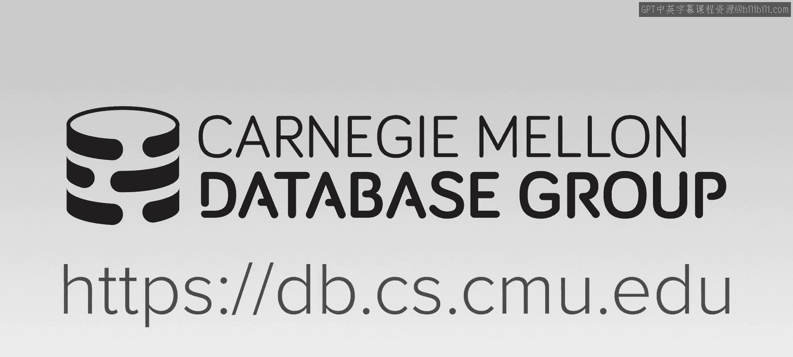
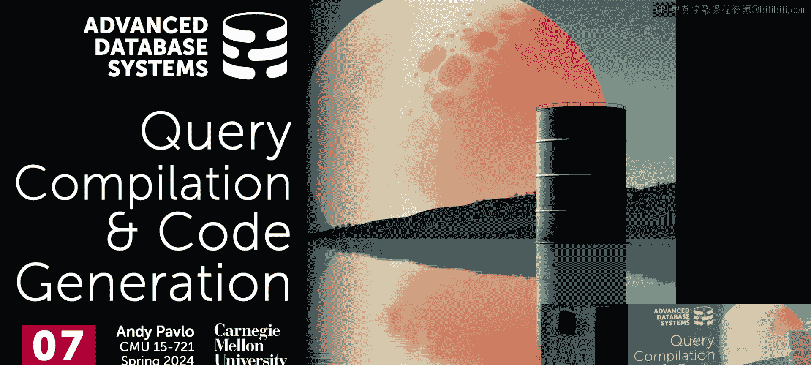
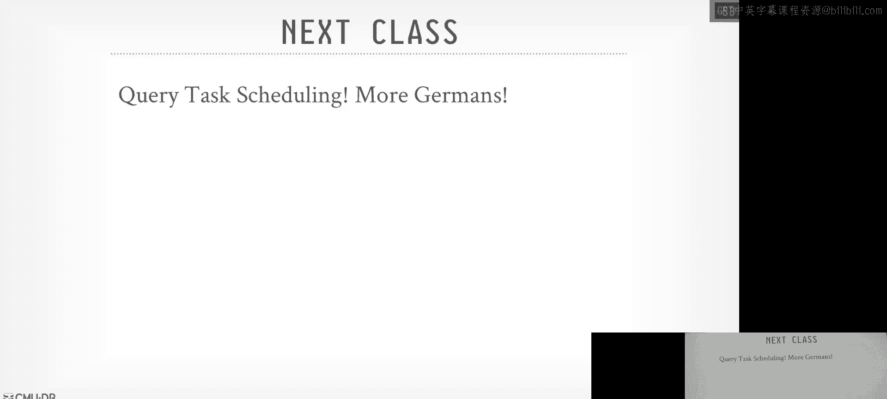

# 高级数据库系统：08：JIT查询编译与代码生成





## 概述

在本节课中，我们将学习如何通过即时查询编译与代码生成技术来提升数据库系统的查询性能。我们将探讨两种主要方法：源码到源码编译和基于LLVM的即时编译，并分析各自的优缺点。

---

## 背景：为何需要代码生成

上一节我们讨论了如何通过向量化技术实现数据并行。本节中，我们来看看另一种提升性能的核心技术：代码生成。

其核心思想是：与其让数据库系统在运行时通过庞大的 `switch` 语句或虚函数表来动态解释查询计划，不如为每个具体的查询“硬编码”生成一个只执行该查询的专用程序。由于SQL是声明式的，我们可以预先知道数据的模式、查询的确切意图以及数据类型，因此可以生成高度优化的、无分支跳转的代码。

这种专门化可以显著减少CPU需要执行的指令数量。一个关键目标是：**减少不必要的指令**。公式化地看，我们希望最小化执行查询所需的总指令数 `I_total`：

```
I_total = I_necessary + I_overhead
```

代码生成的目标就是尽可能消除 `I_overhead`，这部分开销来自于类型检查、虚函数调用、表达式树遍历等通用逻辑。

---

## 两种代码生成方法

以下是实现查询编译和代码生成的两种主要技术路径。

### 方法一：源码到源码编译

这种方法涉及在数据库系统内部编写代码，以生成另一种高级编程语言（如C++）的源代码。然后，使用传统的编译器（如GCC）将此源代码编译为机器码，并作为共享库链接到数据库进程中执行。

**优点**：
*   **易于调试**：生成的代码是高级语言，可以使用标准调试器（如GDB）进行调试，堆栈跟踪清晰。
*   **系统集成简单**：生成的代码可以直接调用数据库系统的其他部分（如缓冲区管理器、网络层），无需特殊的桥接代码。

**缺点**：
*   **编译成本高**：启动外部编译器（如GCC）进程开销大，包含读取配置文件、初始化等步骤，不适合在查询关键路径上执行。

早期系统如**Haiku**采用了这种方法。它将查询计划转换为C++代码，调用GCC编译，并链接结果。实验表明，其生成的代码性能甚至优于手工优化的代码，但编译延迟可能高达数百毫秒。

### 方法二：低级IR与即时编译

这种方法不生成高级语言代码，而是直接生成一种低级的中间表示，然后使用嵌入式编译器框架（如LLVM）将其即时编译为机器码。

**核心流程**：
1.  查询优化器产生物理计划。
2.  代码生成器将计划转换为LLVM IR。
3.  LLVM的JIT编译器将IR编译为优化后的机器码。
4.  数据库系统执行生成的机器码。

**Hyper**系统是这种方法的代表。其关键创新在于结合了“推送式”执行模型，它不再是操作符间通过迭代器“拉取”元组，而是将查询计划组织成一系列嵌套循环（即流水线），尽可能让单个元组在CPU寄存器中完成所有操作，减少内存访问。

**性能对比**：在TPC-H基准测试中，Hyper的LLVM JIT方法相比传统的解释执行或向量化系统（如VectorWise），以及相比其自身早期的C++源码生成版本，都取得了显著的性能提升，特别是在复杂查询上。

---

## 编译延迟的挑战与解决方案

无论是哪种方法，一个共同的挑战是：**编译本身需要时间**。对于短查询，编译开销可能超过其执行时间，得不偿失。

**解决方案：自适应执行**
Hyper在后续工作中提出了自适应执行策略：
1.  **立即启动**：生成LLVM IR后，首先用一个轻量级字节码解释器开始执行查询。
2.  **后台编译**：同时，在后台线程启动LLVM的优化编译流程。
3.  **热切换**：如果查询执行时间较长，当优化后的机器码编译完成时，系统可以在处理完当前一批数据后，无缝切换到编译版本继续执行。

这种方法确保了短查询能快速启动，长查询能获得最优性能，同时编译过程对用户透明。

---

## 各系统实践概览

以下是不同数据库系统在代码生成方面的实践，按技术路线分类。

### 源码到源码编译派
*   **System R (1970s)**：最早使用代码生成的系统之一，将查询编译为IBM System/370汇编代码。但因工程维护困难而被放弃。
*   **Amazon Redshift**：采用类似Haiku的方法，生成C++代码。其关键创新是维护一个**全局查询片段缓存**。任何Redshift实例上运行过的查询片段都会被编译、缓存，并可供其他实例复用，命中率极高，有效分摊了编译成本。
*   **Oracle**：将PL/SQL存储过程转换为受限制的C方言（Pro*C），然后编译为本地代码执行。

### 低级IR与JIT编译派
*   **Hyper / Umbra**：先驱和集大成者。从生成LLVM IR演进到直接生成汇编代码，再辅以自适应执行和高级调试工具，将性能推向极致。
*   **SQLite**：采用轻量级虚拟机（VM）模型。查询计划被编译为一组字节码操作码，由内置的解释器执行。这种方式牺牲了一些性能，但获得了极佳的可移植性和简洁性。
*   **Java生态数据库 (如Spark Tungsten, QuestDB)**：在JVM平台上，它们生成Java字节码，然后依赖JVM的HotSpot JIT编译器将其优化为机器码。

### 预编译原语派
*   **VectorWise**：不走运行时编译路线。它在**系统构建时**，就预编译好所有可能用到的数据操作原语（如各种数据类型的比较、算术运算），形成庞大的函数库。运行时，查询计划通过组合调用这些预编译好的函数来执行。这避免了运行时编译开销，但需要维护庞大的预编译代码库。

---

## 总结



本节课我们一起学习了即时查询编译与代码生成技术。我们了解到，通过为特定查询生成专门的、无分支的代码，可以极大减少指令开销，提升CPU执行效率。我们分析了**源码到源码编译**和**低级IR即时编译**两种主要技术路径的优缺点，并看到编译延迟是主要挑战，可通过**自适应执行**和**全局缓存**等策略缓解。最后，我们概览了从早期的System R到现代的Redshift、Hyper、Spark等系统在该领域的实践，认识到没有一种方法适用于所有场景，工程上的可维护性、调试便利性与极致性能之间需要权衡。对于现代OLAP系统，结合向量化与智能的即时编译策略，往往是获得最佳性能的关键。