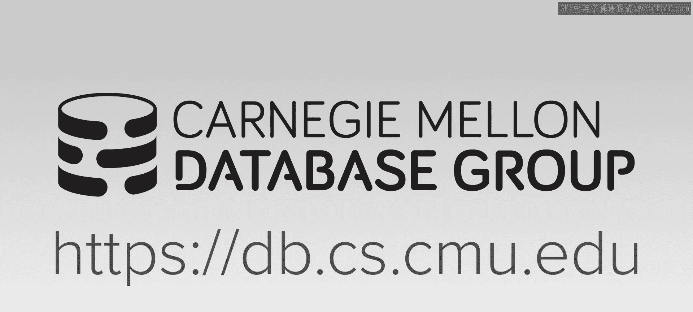
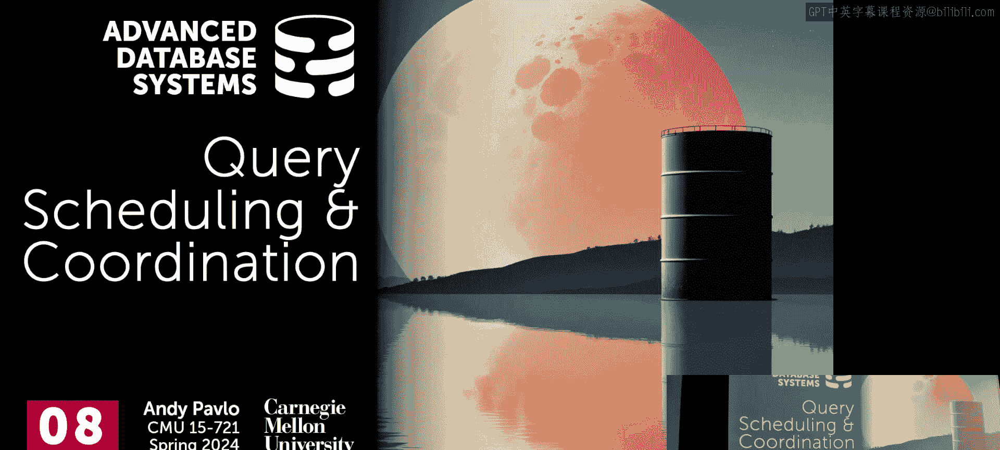

# 高级数据库系统：09：查询调度与协调

## 概述
在本节课中，我们将学习如何将查询计划分配给系统中的不同工作线程并实际执行。我们将探讨调度系统的目标、不同的调度模型，并深入分析几种有影响力的调度器实现。

上一节我们讨论了如何优化执行引擎以尽可能快地运行顺序扫描查询。本节中，我们来看看如何调度这些查询计划。

## 背景知识
首先，我们需要明确一些术语：
*   **查询计划**：一个由关系运算符组成的有向无环图。
*   **运算符实例**：在要扫描的部分数据上实例化的一个运算符。
*   **任务**：一个计算工作单元，通常包含同一流水线中的多个运算符实例，可以分配给工作线程执行。
*   **任务集**：为给定查询需要执行的所有任务的集合。

调度系统的核心思想是：我们知道流水线中断点在哪里，因此可以将这些流水线转换为独立的任务，然后分发和执行。调度系统需要决定使用多少任务、将它们分配到哪些CPU核心上，以及任务生成的中间结果应该存储在哪里。

## 调度系统的目标
以下是构建高性能数据库调度系统的目标：
1.  **最大化吞吐量**：处理尽可能多的查询，保持系统持续运行。
2.  **维持公平性**：确保没有查询因资源不足而饿死，即使长查询优先级较低，最终也应完成。
3.  **保证响应性**：减少尾部延迟，特别是对于短查询，使用户能快速获得结果。
4.  **降低开销**：调度器本身的开销应尽可能低，避免复杂的调度计算占用过多时间。

## 进程模型与工作线程
现代数据库系统通常是多线程的。工作线程是一个通用术语，指可以被分配任务以执行查询或数据库内部操作的计算资源。

关于CPU核心分配，主要有两种方法：
*   **单工作线程/核心**：每个CPU核心只运行一个工作线程，避免了缓存争用和上下文切换开销。
*   **多工作线程/核心**：当一个线程因I/O或缓存未命中而停滞时，其他线程可以运行。但对于CPU密集型的数据库工作负载，关闭超线程并采用单工作线程/核心的模式通常能获得最佳性能。

## 任务分配模型：推送 vs 拉取
将任务分配给工作线程有两种基本方法：
*   **推送模型**：一个集中的调度组件掌握全局视图，主动将新任务推送给空闲的工作线程。
*   **拉取模型**：一个调度组件维护所有可能任务的队列。工作线程在需要工作时，主动从队列中拉取下一个任务。

拉取模型更简单、更常用，因为它减少了协调开销，并且工作线程可以自主决定下一步做什么，无需中央调度器持续跟踪每个线程的状态。

## 数据放置与分区
调度时，确保工作线程处理的数据在本地（局部性）至关重要。
*   **分区**：根据某些键值将数据集分割到不同文件中，以便在并行查询时均匀分配工作。
*   **放置策略**：决定分区实际存放的位置。在共享磁盘的“数据湖”架构中，通常采用基于文件的轮询分布。

理想情况下，我们希望将任务分配给拥有该数据本地副本的工作线程或节点。

## 从查询计划到任务执行
对于OLTP查询，通常只有一个流水线，调度很简单。对于OLAP查询，由于流水线之间存在依赖关系，调度更复杂。不能在一个流水线完成并产生中间结果之前，启动依赖它的下一个流水线。

最简单的调度类型是**静态调度**：优化器或调度器在开始时静态地将任务分配给工作线程。但这种方法无法应对任务执行时间的意外变化（例如，数据倾斜导致某个任务成为“掉队者”），从而拖慢整个查询。

## 调度器实现分析
接下来，我们分析三种有影响力的调度器实现。

### 1. HyPer的Morsel驱动并行
HyPer的Morsel论文旨在动态调整任务分配，以应对任务运行时间的变化。

以下是其核心设计：
*   **Morsel**：数据表的水平分块（类似于行组）。
*   **架构**：每个核心一个工作线程，关闭超线程。一个任务负责处理一个Morsel。
*   **拉取模型**：使用全局任务队列进行拉取式任务分配。
*   **数据局部性**：任务标注了其处理的Morsel所在的NUMA区域。工作线程优先选择处理本地Morsel的任务。
*   **工作窃取**：如果没有本地任务，工作线程可以窃取处理非本地数据的任务，以避免资源空闲。

**优点**：动态性好，能有效缓解掉队者问题。
**缺点**：
*   全局任务队列可能成为可扩展性瓶颈。
*   假设Morsel内所有元组的执行成本相同，这不总是成立。
*   缺乏服务质量保证，长查询可能阻塞短查询。

### 2. Umbra的优先级感知调度
Umbra的调度器是对HyPer Morsel的改进，旨在克服其缺陷。

以下是其核心特性：
*   **动态任务大小**：任务与Morsel不是一对一关系。一个任务可以在其时间片内处理多个Morsel。目标是让每个任务运行约1毫秒，以平衡开销与灵活性。
*   **优先级衰减**：查询的优先级随时间呈指数衰减。长查询优先级降低，为短查询让路，确保系统响应性。
*   **可扩展的任务队列**：避免单一的全局锁。使用全局任务槽数组和每个工作线程本地的位掩码（变化掩码、返回掩码）来高效通知变更，减少了争用。

**优点**：引入了优先级，更好地处理了混合工作负载；任务队列设计更具可扩展性。

### 3. SAP HANA的精细化线程管理
HANA的方法代表了另一个极端，它试图对线程进行极其精细的控制，甚至替代操作系统的部分调度功能。

以下是其核心设计：
*   **工作窃取与池化扩展**：支持在单个NUMA区域内动态增加线程。
*   **软/硬队列**：
    *   硬队列：任务必须在其套接字或NUMA区域内运行（如垃圾回收）。
    *   软队列：任务可以被工作窃取（如扫描）。
*   **多状态工作线程池**：
    *   活跃：正在运行任务。
    *   非活跃：在内核中阻塞（如等待锁）。
    *   空闲：主动寻找工作。
    *   暂停：被解除调度，进入操作系统内核休眠；需要时可唤醒。
*   **主张关闭工作窃取**：在大型NUMA机器上，他们认为跨NUMA区域窃取工作的成本太高，不如关闭窃取。

**优点**：对硬件资源控制力极强，适合超大规模系统。
**缺点**：实现复杂。

## 分布式调度
分布式环境下的调度面临相同的基本问题，但增加了网络因素。核心思想依然是：决定在何处运行任务，以及中间结果去向何方。像Snowflake这样的系统会在每个流水线中断后进行“洗牌”阶段，以重新组织和校准工作线程。

## 总结
本节课我们一起学习了数据库查询调度的核心概念与不同实现。关键要点如下：
*   **自主调度**：现代高性能数据库系统倾向于自己管理调度，而非依赖操作系统。
*   **核心权衡**：需要在任务粒度、局部性、工作窃取、优先级管理和调度器开销之间进行权衡。
*   **演进路径**：从HyPer的Morsel（基础动态调度），到Umbra（引入优先级和可扩展队列），再到HANA（极致的线程控制），体现了调度策略的不断精细化。
*   **通用原则**：无论是单节点还是分布式系统，调度的核心问题都是决定在何处运行任务以及数据的存放位置。

数据库系统是复杂的，但通过精心设计的调度器，我们可以充分发挥硬件潜力，高效地处理各种工作负载。