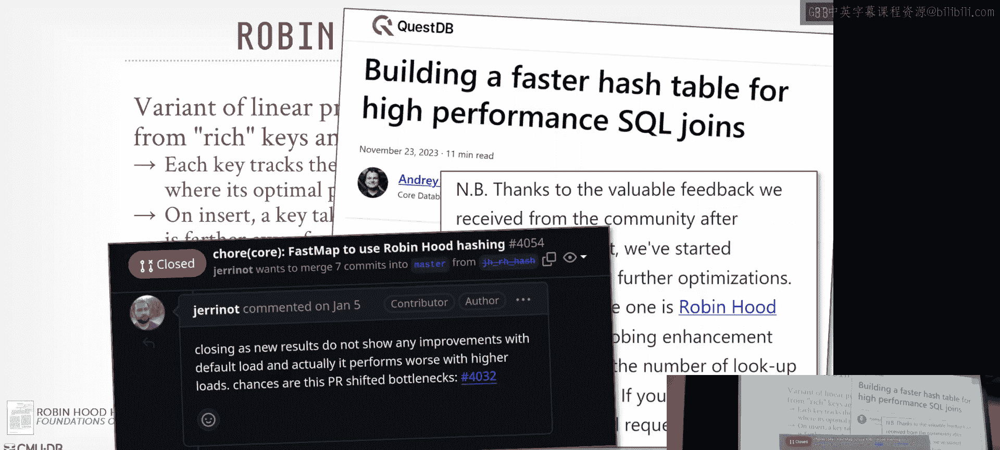
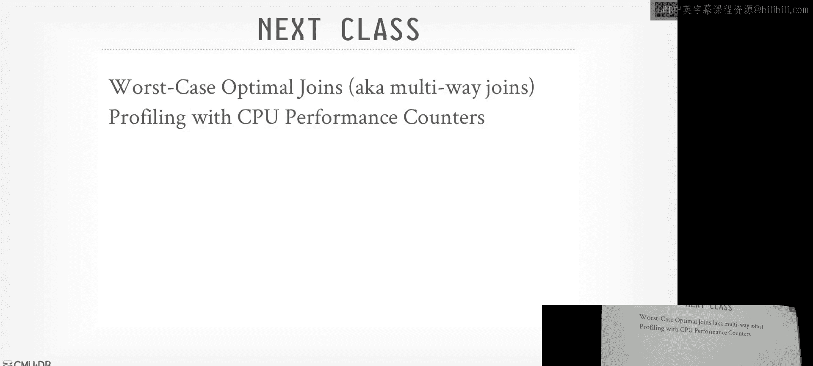

# 高级数据库系统：09：并行哈希连接算法

## 概述
在本节课中，我们将学习如何在现代硬件上实现高性能的并行哈希连接算法。我们将重点讨论单节点系统，并假设数据已通过某种方式（例如分布式调度）被移动到所需位置。核心目标是理解如何最大化并行性，同时最小化线程间的同步开销和内存访问成本。

## 并行连接算法背景
上一节我们介绍了如何将查询计划分解为更小的数据单元（称为“morsels”）进行调度。本节中，我们将聚焦于连接操作，特别是哈希连接，并探讨其并行化策略。

在传统的数据库课程中，我们讨论连接算法时通常不考虑线程或工作线程，只计算基于磁盘页读写的复杂度。然而，在现代硬件（多核、大内存）环境下，我们需要利用所有可用资源（如CPU核心）来尽可能快地运行连接操作。

我们将专注于二元连接（两个关系）。下一节课会讨论多路连接（三个或更多关系）。目前，两种主要的连接方法是哈希连接和排序合并连接。由于哈希连接在绝大多数情况下（约99%）性能更优，我们将主要讨论它，而忽略嵌套循环连接（因其性能通常最差）。

## 哈希连接 vs. 排序合并连接：历史视角
哈希连接并非一直被认为优于其他方法。在1970年代，早期的数据库系统运行在原始硬件上，处理大于内存的表时，Grace哈希连接（一种可以溢出到磁盘的分区连接）尚未发明，而外部归并排序算法已经存在。因此，排序合并连接是处理大数据集的首选。

到了1980年代，硬件改进，日本的一个名为“Grace数据库机”的项目发明了Grace哈希连接，这是今天我们将讨论的分区连接的前身。当时还有专门为哈希连接设计的定制硬件（数据库机）。

1990年代，Volcano模型、迭代器模型、交换操作符的发明者Goetz Graefe发表论文，指出在当时硬件条件下，这两种算法是等效的。

自21世纪以来，哈希连接被证明更具优势。当前的核心问题变成了：是否应该进行分区？你们阅读的论文表明分区通常更快，但也有其他研究（例如Hyper团队）指出，虽然分区更快，但正确实现它非常困难，因此不分区的方法对大多数场景来说“足够好”。

## 现代哈希连接算法设计原则
设计并行连接算法时，我们需要考虑两个主要目标：

1.  **最小化同步**：由于涉及多个并行工作的线程，我们希望减少线程间的通信，避免一个线程因等待另一个线程填充缓冲区或哈希表而被阻塞。这并不意味着要实现无锁或无闩锁，而是需要谨慎地获取锁，避免频繁争用。
2.  **最小化内存访问成本**：我们希望每个线程操作的数据尽可能本地化，最好在其缓存中。如果不在L1/L2缓存，则在共享的L3缓存中；如果不在最后一级缓存中，则应在本地内存中。目标是避免跨NUMA（非统一内存访问）节点的互连访问。

设计思路类似于我们在介绍性课程中的原则：当从磁盘将数据页读入内存时，我们希望在丢弃该数据前尽可能多地对其进行操作，以避免再次访问磁盘。同样，我们希望在一个数据元组位于CPU寄存器中时，尽可能多地在流水线中对其进行操作，然后再获取下一个元组。

## 哈希连接的基本步骤
哈希连接通常包含三个步骤，其中第一步是可选的：

1.  **分区阶段（可选）**：对构建侧（内关系）和探测侧（外关系）的元组，基于连接键的哈希值，将它们划分到不同的“分片”或分区中。然后，工作线程可以基于这些子集构建哈希表或进行探测。
2.  **构建阶段**：使用内关系（构建侧）的数据构建哈希表。我们假设存在一个逻辑上的单一哈希表（尽管底层可能有多个物理表）。
3.  **探测阶段**：使用外关系（探测侧）的数据探测哈希表。如果找到匹配项，则将内关系和外关系的匹配元组组合，并作为输出向上传递。

你们阅读的论文正确地强调了最后这个**物化成本**（将匹配的元组组合成输出）实际上非常重要。许多早期论文忽略了这一步，但这在真实系统中是必须的，并且会给CPU缓存带来额外压力。

接下来，我们将深入探讨分区阶段，尽管在最终实现中可能选择不分区，但理解其机制对于把握系统设计中的权衡（如缓存一致性）非常有用。

## 分区阶段详解
分区阶段的目的是获取内外关系，基于连接键将它们放入分区缓冲区。这些分区将被重新分配到不同的核心上，这样在构建和探测阶段，工作线程只需处理分配给它们的分区内的数据，进行顺序扫描，从而获得更好的数据局部性。

目标是：在现代新架构上，执行额外分区步骤所带来的指令开销，能够被因数据局部性提升而减少的缓存未命中开销所抵消，从而整体上更快。

以下是两种高级分区方法：

### 非阻塞分区
这种方法允许多个线程同时访问数据并填充分区，无需复杂的预分割。线程可以直接写入共享的全局分区缓冲区（需要锁同步），或者先写入线程私有的分区，最后再合并。

以下是具体变体：

*   **共享分区**：所有线程直接写入全局分区缓冲区。为了防止数据损坏，在写入每个桶时必须使用锁（闩锁）进行同步。
*   **私有分区**：每个线程维护自己的一组私有分区（例如，最终需要10个分区，每个线程就维护10个迷你分区）。线程写入自己的私有分区时无需同步。之后，需要一个单独的合并阶段，由某个线程负责将所有线程中属于同一分区的数据合并到全局分区中。

私有分区的缺点是合并阶段可能需要访问位于其他NUMA节点的数据，导致远程内存访问。如果进行早期物化（携带所有列），移动的数据量会很大，开销更显著。

### 基数分区
这种方法（也称为Radix Join）的目标是只物化结果一次。它通过多次扫描输入关系来实现无锁分区。

1.  **第一遍扫描**：计算**直方图**。对于每个元组，根据其连接键哈希值的某些位（称为“基数”）确定其所属的分区，并统计每个分区中的元组数量。
2.  **计算前缀和**：根据直方图计算前缀和。前缀和是一个累加序列，用于确定每个分区在最终输出缓冲区中的起始偏移量。
3.  **第二遍扫描**：再次扫描数据，根据前缀和提供的偏移量，将每个元组直接写入输出缓冲区中正确的位置。由于每个线程都知道其写入的偏移量是唯一的，因此无需任何同步。

如果数据分布严重倾斜，导致某个分区仍然很大，可以递归地对该分区再次应用此过程（查看哈希值的下几位）。

为了优化性能，可以采用以下技术：
*   **软件写合并缓冲区**：在分区阶段，不直接写入最终的远程位置，而是先写入一个小的私有缓冲区，当缓冲区满时再批量写入。这有助于减少缓存污染。
*   **流存储（非临时存储）指令**：使用特殊的CPU指令直接将数据写入内存，绕过CPU缓存。

## 构建阶段：哈希表设计
分区完成后（或者不分区直接开始），我们进入构建阶段。此阶段使用内关系的数据构建哈希表。哈希表包含两个核心部分：哈希函数和解决冲突的数据结构。

### 哈希函数
哈希函数将任意字节的值映射到较小范围（通常是32或64位）的整数值。选择哈希函数时需要在速度和冲突率之间权衡。
*   **最快的哈希函数**可能总是返回同一个值，但冲突率极高。
*   **完美哈希函数**能保证每个唯一键都有唯一哈希值，但通常速度较慢，实现复杂。

大多数系统使用现成的哈希函数。例如：
*   **CRC32**：历史悠久，但有专用的CPU指令，速度很快，适用于整数。
*   **MurmurHash**：一种现代、快速的哈希函数，某些实现支持向量化查找。
*   **xxHash**：Facebook开发，在性能和冲突率方面表现优异。

通常，根据数据类型（如整数、字符串）选择不同的哈希函数。

### 哈希方案
我们需要一种数据结构来处理哈希冲突。以下是几种常见方案：

*   **链式哈希**：每个桶指向一个链表。发生冲突时，将新条目添加到链表末尾。实现简单，但指针追逐可能导致缓存不友好。Hyper团队曾利用x86指针中未使用的位来存储布隆过滤器，以加速查找。
*   **开放寻址哈希**：只有一个大的条目数组。发生冲突时，按某种探测序列（如线性探测、二次探测）查找下一个空槽。这是哈希连接中最常用的方案。
*   **罗宾汉哈希**：开放寻址的一种变体。在插入时，如果新条目的“理想位置”距离比当前位置的条目更近，则“窃取”该位置，被替换的条目则继续寻找新位置。目标是减少所有条目的平均探测距离，优化查找性能。但插入成本更高。
*   **霍普斯科奇哈希**：罗宾汉哈希的扩展，但限制条目只能在固定的“邻域”内移动。如果邻域已满，则需要调整哈希表大小。设计目标是使查找一个邻域的成本恒定（因为整个邻域可能在一个缓存行中）。
*   **布谷鸟哈希**：使用两个（或多个）哈希函数。插入时，如果两个位置都被占用，则随机踢出一个现有条目，并尝试重新插入被踢出的条目。查找只需检查两个位置，速度很快，但插入过程可能复杂。

在实际系统中，线性探测（开放寻址）因其简单性和良好的缓存局部性而被广泛使用。罗宾汉哈希在某些情况下能提升性能，但并非总是有效，需要根据具体工作负载评估。

### 哈希表内容
在哈希表中存储什么也是一个设计选择：
*   可以存储完整的元组，但如果是变长数据则不适合开放寻址。
*   可以只存储指向元组（在独立堆中）的指针或偏移量，这样调整哈希表大小时只需移动指针，但查找时需要间接引用。
*   通常，除了存储连接键或整个元组，还会存储计算出的哈希值，以便快速比较，避免昂贵的字符串比较。

## 探测阶段优化
探测阶段相对直接：扫描外关系，对每个元组计算哈希值，查找哈希表，如果找到匹配则输出。

一个重要的优化是使用**布隆过滤器**。在构建哈希表的同时，可以构建一个布隆过滤器。在探测时，首先检查布隆过滤器。如果过滤器指示键不存在，则肯定不在哈希表中，可以跳过昂贵的哈希表查找。这是一个典型的“侧信息传递”优化，被许多系统（如Hyper、Umbra）采用。

## 性能总结与工程实践
根据相关论文的基准测试，可以得出以下观察：

1.  **分区 vs. 不分区**：进行基数分区通常比不分区更快，但正确实现它非常具有挑战性，需要对硬件有深入了解。
2.  **哈希方案选择**：对于大多数工作负载，简单的线性探测（开放寻址）哈希表在实现得当的情况下，性能已经“足够好”。更复杂的方案（如罗宾汉哈希、霍普斯科奇哈希）可能带来边际收益，但增加了实现复杂性。
3.  **哈希连接并非唯一瓶颈**：在完整的查询执行中，哈希连接本身可能只占总时间的10%-30%。其余时间花费在数据读取、过滤、物化输出等其他操作上。因此，虽然优化哈希连接很重要，但它不一定是系统性能的“主要瓶颈”。

因此，许多生产系统选择一种简单、稳健的实现（如非分区线性探测哈希连接），并将其性能优化到可接受的水平，而不是追求极端复杂、难以维护的优化。

## 总结
本节课我们一起深入探讨了并行哈希连接算法。我们回顾了哈希连接与排序合并连接的历史演变，明确了在现代硬件上哈希连接的主导地位。我们详细分析了并行哈希连接的三个核心阶段：分区、构建和探测，并重点讨论了分区阶段的不同策略（非阻塞与基数分区）及其权衡。在构建阶段，我们探讨了哈希函数的选择和各种哈希方案（链式、开放寻址、罗宾汉、霍普斯科奇、布谷鸟）的特点。最后，我们了解了探测阶段的布隆过滤器优化，并认识到在工程实践中，简单、稳健的实现往往比极端复杂的优化更具实用价值。理解这些底层机制和权衡，对于设计和实现高性能的数据库系统至关重要。