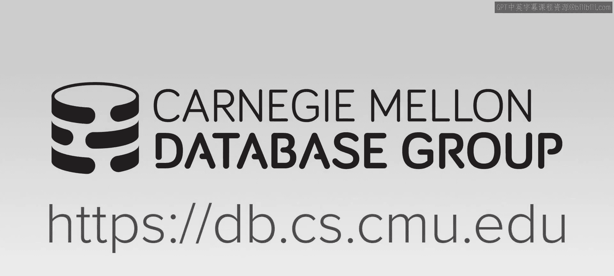
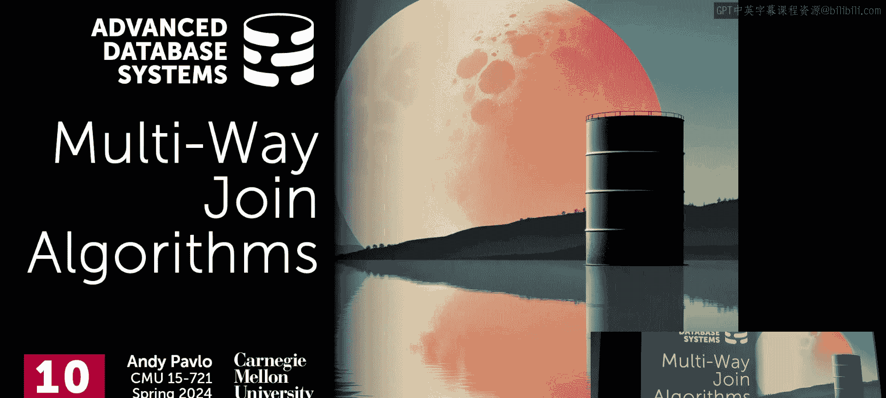
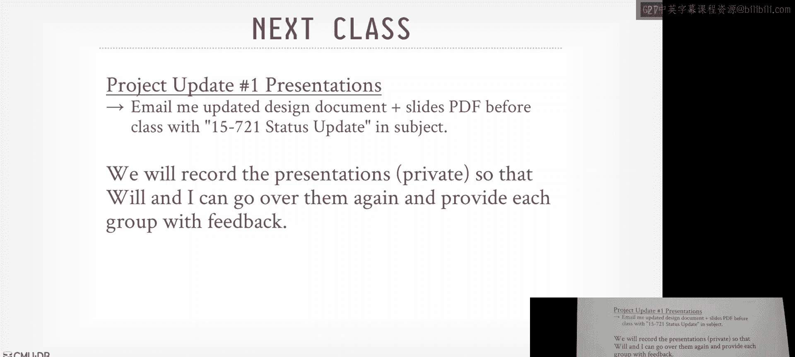
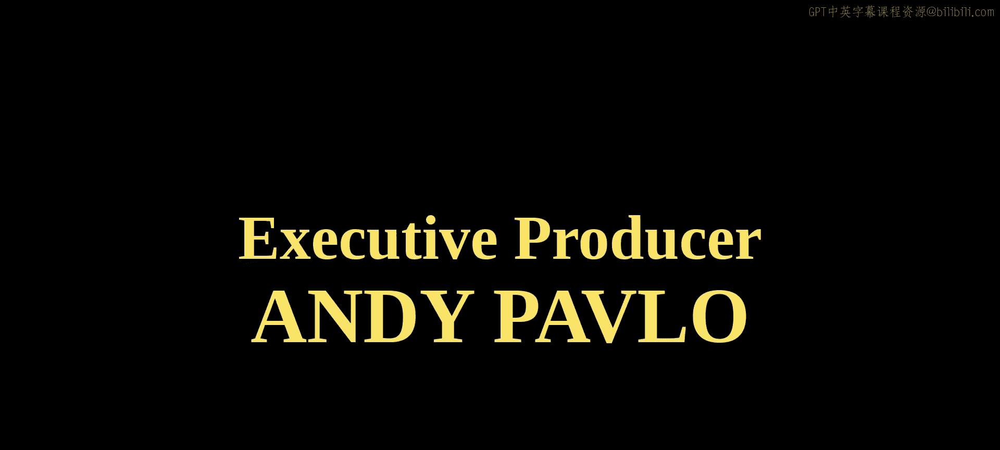

# CMU《高级数据库系统｜CMU Advanced Database Systems (15-721 Spring 2024)》中英字幕（豆包翻译） p11 -11-S2024 #10 - Multi-Way Join Algorithms _ Worst-Case Optimal Joins .zh_en -BV1HZ421N7WZ_p11-

🎼Carnegie Mellon University's advanced database systems course is filmed in front of a live studio audience。

😊。

🎼。If you able to about cultural hasslines， this can be a lot different than kind of joins you see in the intro class and even in the last lecture we just had about parallel hasschelines and we'll sort of see sort of motivate why we want to do this。

Discuss the sort of。One of the first invitations of it。

 And they'll see how the Germans are going to prove on it。

 And then I'll finish up with something from D D B， that basically says。

You may not actually need any of this if you build other things correctly。

嗯。Alright， so last class， we spent the entire lecture on how to do hash joins as fast as possible And the big focus was on how to run this in parallel。

 again， not across multiple nodes， but across multiple workers running on the same box。

 And it was really about trying to minimize the number of cycles for instruction。

 minimize the remote memory access to the different nu regions， just trying to run fast as possible。

 And then although there were some examples in some results that showed that the partition hash join was going be superior to the other approaches。

 getting the engineering right for different hardware， different workloads。

 different data sets is really challenging。 So oftentimes。😊，She just do a nonpartition hash one。

 And that's gonna be good enough get， you know， to get you maybe 95，990% to 95% of the benefit。

 without again getting into the low level details of performance things。So。Again， for this。

 last lecture， this was doing what is called a binary join。Or joining two tables。

RightAnd as you can imagine， these things are super common in pretty much every database system。

 a relational database system， there's been years and years and years。

 decades of research and try to make hash joints go as fast as possible， as I said。

 I had a Ph student spent a little time trying to make the hash join go faster and we were literally trying to count from going from 12 cycles per tuple to 11 cycles per tuupple you're really getting down to the bone of bareri metal performance that there's not much else you can optimize。

😊，So the。Binary joints are going to be the preferred approach。

 the better approach when we know that the output of the join operator is going to be smaller than than its inputs。

 right， so in this case here， we're joining R S and T。 We're taking S and T。 We do a join。

 and then we're going to produce 10 tus， These imaginary numbers。 They're small。

 but thinking thinking like orders of magnitude bigger， The output is going to be much smaller。

The problem is going to be， though， and what we're going to try to adjust today is when the output of the joint operator is me larger。

😡，Then the inputs， so say for whatever reason， based on the data and what we're trying to join on。

 this thing offered is not going to produce 100 tuples。Right。

And this is the problem we this is the worst case scenario ever for database is because now we have to materialize that。

 And even though like it's producing 1000 peopleples here， when we do the join on this output and R。

 now we're going to produce 10 tuples。 So we had a bunch of data that weve materialized or synthesized from the join operator that we now have to deal with。

Even though we're end up still ending up throwing a ton of it away。

So another way to think about it or look at it is like this。

 where you actually start using real twobos， again。

 same query trying to do a cycle join between our S and T。😊。

So the problem is going to be that no matter what order that I choose to join my tables。

 if I choose to join RNS first， then join join T， this intermediateit result is going to get ballooned up and get bigger。

 same thing if I try to join R& T， and then join S， ballooned up， same thing。

 do S& T balloons up in the end。😡，So again， the reason why this is going to be a problem for us is I've already said。

 it's been wasted storage because now again we have to materialize these results。Somewhere in memory。

 and then if it gets too big， we had end up having to spill a disk。

 and that'll be typically the local disk on on the worker node。 Worth case scenario error。

 we spill to S3 of the object store。 that's even slower。Then then， of course。

 obviously it's going to be a bunch of wasster computation because。

You know we're materializing tuples， we're passing them along。

 and then we're going to do we do the next join on the last table。

 it's not going to match we're end up throwing it away。So ideally。

 we want to be able to identify if we can which of these tus we actually don't need。

When we're going to join at the third table or any other additional tables to avoid having to materialize it。

So that's the high level approach I with the problem trying to solve today。

 is how to avoid this blow up of the intermediate results。Right？

And the what we'll see in the multi way join， the way it's going to work is that rather than sort of。

Fing the join operator in terms of like I got this table and this table， let me join it together。

 you're going to think of terms of attributes。And now you don't care where the attributes are coming from。

 whether it's table one， table  two， table three years and so forth。

 And now you want to do comparison on these attributes。

 and then have that be what you synthesize as part of the output。

So that's the big picture of what the multiway joint is going to try to do for us。

So first start of background what worst case optimal joins are， again。

 the lecture I'm calling multiway joins because that's the idea like we're joining more than just two tables so the class algorithms are going to be multiway joins and then these category of the implementations that we'll see will be called worst case optimal joins。

 but typically the terms are used interchangeably。😊，By multiway joins。

 the idea multiway joins existed in the literature。😡，I think back to the '80s。

 but the worst case optimal implementations that came along in the late 200s。

All right so first again high level idea what where case optimalin joins are。

 then we'll look at one of the earliest implications of leapfrog join， leaffrog trijo。

 and then we'll see the Germans hash try join， which is sort of an optimization of the data structures that're going to use over the leapfrog join but at high level the methods still going to be the same again and then we'll finish up some quick optimization from DDB and then I want to briefly talk about how to do system profiling in a data system and then talk a little bit about the hardware counter stuff that he had a question about a few weeks ago。

All，So again， the idea of a worst case optimal to join is that we want to join。

three or more tables at the same time。 And again， the way this is going to work is that rather than taking the entire tuple from one table and the entire tuple from another table and then comparing all the attributes in our join key。

 we're instead going grab a single attribute for our join key be multiple columns from all the tables we want to join together。

 matchsh them up， figure out whether we have any matches and only proceed with doing additional comparisons for a given attribute for given tuple。

 if we know that the subset of the values on our join key are actually matching already Again。

 we want avoid a waste of work of like doing a bunch of comparisons for things that aren thrown away。

 So as soon as we can identify that there isn't gonna be a match on a given tuple as we're doing our join。

 we can throw that way as soon as possible。😊，So as I said。

 the idea of a multiway join has existed for a while。

 but in terms of proving that you can have a worst case worst case optimal join。

 and I'm define what that is in a second came from these other Germans in 2008。

 which I think was for this paper I think actually was Thomas Nomanson Thomas Noman' PhD advisor。

 but I might be wrong， but then the first two implementations of this will be empty headed at a Stanford and then a commercial system called logic blockss。

 which like it's answering database system that you use data log instead of SQL Data log is another declared query language。

But very few people actually use it other than logic blocks。Right， so again， the， the。

 what's be interesting about these worst case optimal joins that are rather than thinking about the computational complexity in terms of the。

You know， the size of my input tuuppleles， its going to be the performance is going to be bounded by the size of the output and the number of attributes we're actually going to compare against。

😡，And this is hard to actually have an exact estimation without selectivity information about the the three attributes to say here's how much long things are gonna take。

 Where like something like a。Like a hash joint for example， you know you got to build the hashable。

 there's a cost to that and you got to probe the hashable。

 there's another cost to that and you can more or less ignore the selectivity of the hash joint itself because you're always going to do that work whereas in the worst case optimal join because we get short circuit comparisons once we know an attribute within the joint key is not going to match then it actually is it'll vary。

😊，So what's also interesting about too is that the more tables we're going to throw it at our worst case optimal join algorithm。

 the better its performance is actually going to be relative to the input because the idea is that we're going to try to compare as much as we can all at once。

Again， rather than having these stages in the。You know， in a binary joint， yes。

 all things you're talking about would also a if the was just。

statement is the question is would all the things I'm talking about here is still hold if it was joint keep was just one attribute？

In terms of would you well， you want to get the benefit of circuiting additional comparisons for additional attributes。

Eas your problem with this。His question is is it an easier problem if it's one attribute to do a multiway join？

嗯。No， I mean， you wouldn't。How does this？You wouldn't get any benefit of some of the data structures that they're going to build。

 like the tries or in case of empty heads， like nested hash tables。Yeah。

 I actually don't know the complexity of this thing。If it's one attribute。If it's one attribute。

 I still think this is going be better if the intermediate results are going to balloon up because again。

 you're not materializing it， but all those optimization that we'll see from the paper you guys write of how to do singletons and fastpass down to the leaf node of the try。

 like those obviously don't make any sense if it's only one level。

So we'll see this a little bit and the hyper paper you guys read or theumbboard paper you guys read talk about this as well。

 like in the same way that we had to get the join order right for binary joins。

 like make sure A join B join C， we have to get that ordering right。

 we had to get the ordering correct in a worst case optimal join。

 but the thing we have to worry about is not so much the ordering of the tables themselves。

 It's actually the ordering of the attributes。 So we want to do comparisons on attributes that we know there would be most selective soon as possible So again。

 we start throwing away data and not doing useless computations。😊。

So the definition thats sort of floated around the internet and actually comes turned this professor up in Waterloo for he's building an embedded graph database called Kuu。

You think think of like。Thinkhing of like，duct D B or SQL for graph database， right。

So his definition of a worst capital optimal join is one where the worst case runtime of the algorithm meets a known lower bound for the worst case runtime of any joint algorithm。

So I read this and like what the hell he's talking about because you're kind of using the definition of the thing using the word you're trying to define in the definition itself。

 So an alternative would be something like this where worst case opera join is one where the runtime of the Jordan algorithm is better than all other join algorithms where the query and the data represent the worst possible scenario。

 So if if you have the situation where the interview decides going balloon up massively。

 they think of like a Cartesian product as the worst case scenario。

 then we want to choose an algorithm where it's not going be magically log in。

But it's still going to be better than just doing all the approaches with a binary join。

 no matter what ordering you have for your tables in a binary joint。So again。

 if you that's why I I called this lecture the multiway join because that one。

 I think is easy to wrap our hand around。 This one is a bit screwy。 and don't take my word for it。

 Also， for this guy's blog article， he has this anecdote where he talks about where he met Don Canuth And he told Don Kanuth。

 he was working on worst case optimal join algorithms。

 And Kauth was like what the hell you talking about either right So as he says。

 are they so good that they are optimal even in the worst case performance。😊，Yes。So anyway， so again。

 if you understand that like this is going be the best approach for the worst case scenario when we have this again ballooning up in results。

 thats， that's the thing we want to solve。So as I said。

 there's not very many systems that are actually going to implement this。

So the logic blocks was the one I mentioned before， that's going to be。

 we'll see this when they do comparison in the UmRA paper， again。

 this was an early reasoning system that was trying to do graft virtuals and they they had an early invitation they had a leaffrog haselline。

Amra， what you guys read about relational AI is the follow up to logic blocks。

 So logic Bs got bought。 All the key people left the company ever got acquired and then then built relational AI。

 It's written in Julia。 It's a relational database system that's doing。系。

doing a graph representation on a relational database system。

 and they're using their variant of a newer version of the leapprog join。

 and the code is this ist matter of waterlo that I mentioned before。

So the reason why this is going to be important and we're not going to go too deep into the latest SQL extension SQL PGQ。

 but last year in March of February， the new specification for the SQL standard came out and in it they have this thing called SQL PGQ so it's an extension。

 a new capabilities in the SQL standard that allow you to define property graphs over relational tables and then do pattern searching your graph traversals directly in SQL。

So the extensions are inspired by Neo4j's cipher， I think Tiger Graph has their graph query language。

 like there's bits and pieces of existing graph databases。

 but now all this exists in the SQL standard。嗯。The only system that I knew that actually supports this is Oracle。

 Oracle was on the Standard Committee。Eximental development branch of， of。

 ofduct D B that has some portions of this。 But they're all。

 the language is all sort of slightly different， so。

We're're going to need the worst case optimalinal joints in order to implement this efficiently for these kind of  querys。

 do graph tra reversals on relation databases。So that's why this matters。

 So even though in Oracle only export it now， I think in the next five years。

 every major overlap lap system will have will have support for this。

 And you're in to need to do a worst case optimal join to make that run efficiently。Alright。

 so let's go to the first implementation or first one of the first implementation leafrog leaffrog trijoin and then then we'll see how the Germans extended this to make it make it run faster。

 So the idea is that to do a multi join， the leaffrog trijoin is going to assume that either the data is already presorted。

😊，Or that you're going to build an index data structure on the join keys right before performing the join itself。

So as we talked about in our world， we're accessing bunch of partque files， sitting in S3。

Those things are unlikely to be sorted。And in theP and orc file specifications。

 you can't store additional data structures， so either we have to precompute these things and store it as a bunch of separate files that we load back in。

 or as we're scanning data， we're building these tries on the fly。And the Uber paper you guys read。

 they're going to be doing the same thing， they're going to be building the trials on the fly too。

 but they're going to do a bunch of tricks to try to do lazy evaluation or lazy materialization in the data structure。

So no big red。😊，When I call create index in Postgres or whatever， is what's going to happen。

 well the data does a sequential scan， reads every single row and then populates the index。

 and so the Uber guys are going to try to avoid having to do that。

These guys are going to build everything。So in this try， we'll see in a second。

 they're going to have a separate data structure per table per we're trying to join。

 and then each level in this try is going to correspond to one attribute that's in our join key。

For that table。Each level will correspond to an attribute that it has that's involved in the joint operator。

So as I said， logical blocks men this in 2010 or 2013， I think 14 paper came out。

 they have their new company relation to AI。 They have anly a better version of the leapfrog has join called a dovetail join。

 I can't actually figure out what they're doing because there's a five minute there's this blog article here and a five minute YouTube video that doesn't like say anything deep。

 right。😊，But they claim it's better than what these guys had。Alright， so the。

 the way to think about this is that we are， again， we're going to。

Sort our data or build it in export。 and then we need a way to iterate through all the tables are're trying to join at the same time and then do comparison across the attributes to see whether we have a match。

 And because the things are sorted we don't have to backtrack on our join keys So let's say we have three tables X。

 Y， Z first step， we're just going sort it。 So that's fine。😊，And then for now for this demonstration。

 I'm going to switch to a horizontal view， and I'm going to put spaces into where there's actually no values corresponding to the sequence like zero to 10。

So at the very beginning， we're going to have an iterator for each of three tables。

 So in this case here， we're trying to join in one attribute ID。And so。For x， the first value is 0。

 so the x iterator is pointing is 0， y is pointing at 0， and then z is pointing at 2。😊，So。

We're going to start with the at the top， and we're going to sort of。

We're going to do comparisons with。The， what the iter is pointing at across the different。

The different tables because we know what they're pointing at too。

 and if we find it that the value that our iterator is pointing at is less than what the other iterators are pointing at。

 then we know that there isn't a match for us here。

 and therefore we're going to leaffrog or jump to some other point in in our value list that's going to be equal to or greater than the maximum what everyone else is pointing to。

So in this case here，0 is less than2， so we need to jump over and find the next value for x that is greater than or equal to 2。

 in this case here， it's  three。 so the iterator is going to jump over there and we update that that。

Now， because this guide now did a jump， we then need to come down to the next one and do the same comparison here。

 So the xuator is pointing at0。 So Nia finds a since0 is less than 2 and3。

 we need to now jump to another position where the next value is greater than equal to3。Right。

 so even though it has a two， So we know this guy is putting at three。

 So we know that there isn't going to be a match because otherwise。

 this thing would have been putting at two as well。 So we skipped this。

 So he's now going to leap for log or jump over to6。Same thing come down here， he's at two。

 two is less than6， two is less than  three， so we need to find something that's going to be greater than or equal to6。

 which is eight here。Then we loop back around and do the same thing now the x iterator comes up to8。

 the y aerator comes up to 8， and then lo and behold， we have a match。So at a high level。

 this is the conceptual of what we're trying to do。

But obviously the devil's in the details because how am I doing this jump， right？

Because user much of scan would be stupid and slow。 And I'm also only showing how to do this for a。

 single attribute。Right。So the way they're going to represent these。

These values in sort of manner is through a try。Iing everyone here knows what a try is， right。

 because that's the project zero， so I'll skip what a try is。Actually。

 the guy that coined the name Edward Franken， he was his faculty at CMU。

 I think he just died last year， so the Tri guy died。H。O。So。

We now need to build a try for every single table and where we're gonna have each level in the try is going to represent a single attribute。

 So like。This would be slightly different than the tribe representation we think of in databases like to replace a B plus tree because in a try。

 you would take a say a string value and you'd break it up into different digits or reddixes and store those as a single level。

 and here we're can store the entire value in a node at a level for corresponding to a tuple at a table。

But we're not going have any duplicate values， right。

 So if we see the same value for a given attribute over and over again。

 well just we'll have one instance of it， but we'll have multiple pointers coming out of it for the different subvalues for the next attribute。

Right， so again， I'm gonna just flip it on its side to make it easier to visualize。

 So we have two attributes A and B。 So in the first step here。

 we want to build a want to add an entry in our try for these three zeros。

 So we always start with the root to first down。😊，And generate the zero node。

And then we come down to the B， and then for all the B values that correspond to the zero values。

 we're going to have edges coming out of them and have those three values。

And just scan down the line， do the same thing for one and0， and then for two and zero。So again。

 anything at this first level here ignoring the root， right， this corresponds to attribute A。

 everything below that at the second level was attribute B。

 And then depending on how many attributes I have my joint key this keeps going down and down。Right。

And then in his leaf node here， obviously when they have the same parent。

 they're going to be in sorted order。Alright， so now let's put it together in a。In。

 in a complete complete example to do a join between R S and T here。

So I've already built the tries for the three tables。 and again here in our join。

 we're trying to join S& T， we're trying to join R dot a equals t A。

 R do B equals S dot B and s dot C equals t do C。 So in this case here。

 every one relation does not have all of the attributes that we need to compute the join。

And so assuming that the optimize has figured out that the optimal optimal evaluation ordering for attributes is going to be A B and C。

So for this， say we start with table R。And we started the root traverse down。

 the first entry is going to be at first level is me a， the first value you can see for a is0。

So then we can use this value to now do a lookup in the table T again students are joined as r。

 a equals t。 a。So then now， as an entry point going into the root of this try， we come down to。

 to the first level。 we have a value。 We have a equals equals 0。

 We have a value matching value there。So now what we need to do is traverse down at this point here。

 since we know we have a match in for r dot a equals 0 and t do a equals 0。

 then we need to now go to the level below them and actually start comparing the tuples of the values for the different attributes at the next level。

So in this case here， the next level for table R is going to be B。

So we when we go down to go down the left side， the first value we're going to hit is0。

 so we can use that now as the probe into the try for table S because we're trying to do R dot B equals s dot B right。

And I where up that。So same thing we enter R sorry we enter the tri for S traverse down。

 now we at for B。 Great， so now we know that we have for a match of at least an attribute for R dot A to t do A and R do B into s do B。

 So the last step now is to do the comparison for where S do C equals t。 C。😊，So to do this。

 we're just going to have iterators in in the region that or the link list or the list that's below the first attribute in the tribe for T and S。

 and we're just going to scan along and accumulate all the values for C across these for these two different tables。

 right。And now we have a set。We just do the intersection。And it tells us whether we have matches。

And we know how to fill in the values for A and B， because we know how we got into our try in the first place。

So we probe here， got a equals 0。 we had a match there， then we had B equals 0。

 had to match over there。 So when we fill this out， we know what the values of A and B are。

 So we're just doing the intersection over C。Yes。P the order in。His question is。

 what if the ordering of the。The city goes。don't if C goes on top of B， what do you mean？

So it's like the thing。try。Oh， sorry so if I put this above this， you can't do that。

Because I I I know the global evaluation ordering， ABC。 So in my try。

 even though I don't have all the attributes in for a given table。

 I still have to follow that ordering。SoB's got to come before C。我。

The order is determined by the query optimizer before you start running this。

It's the same as join order when you' do doing a binary join。Yes， is okay to have one tribe or table。

We need one for。Like possible ordering。ささ。His question is。

 is it okay to have one tribe or table or do you need to have one tribe for every possible join ordering？

 So the， this brings up a good point。 The， I think the empty headed paper。

 And I think this paper says you'd want to。Pre compute these ahead of time。

 So all possible join orderings you would have to pre compute them。

 The Uber guys claim and they think they're corrected it like， that's super wasteful。

And you would just build it on the fly， and that's better than trying to prepulate everything。Okay。

 so we did a match where a equals 0， B equals 0， and they got all the C's for that。

 So now all we need to do start back over here with our B iterator in table R。

 Just go to the next one， do the same thing probe into table S。😊，F along the path get to B。

 now we have an iterator for the C value over here。For this one here。

 because we're still at the same a value that we don't need to know we don't need to switch over to another another leaf leaf node。

 We just restart and go back at the beginning of our link list here。 Same thing。 scan along。

 And so now we would only end up with one entry for S dot C。 and then three entries for T dot C。

 you obviously could cache this because you it's gonna be the same thing every time。

 Comp the intersection and then we end end up with one tu。Then do the same thing。

 move over to the next one。Tverse down into the S， get our sets of C values， intersect。

 and produce the tubbal。So again， now at this point here， since we've exhausted all the B's。

 and so we're done with this a， we go back out of the root， come down to the next side。

 Now we get a equals one probe into the try for for T。 A equals 1。 We got to match。

 do the same thing。 scan along and then then do the intersection right。

 same thing comm to 2 and so forth like that。😊，Not so bad。So。Related to his point。

 either pre computingut or building a try on the fly for every time you want to do this join is going to be expensive。

And always think in extremes， so we have billions or two bowls。

Having to build this try and across every single table every single time， is going to be slow。

And even though in our world， we're assuming our data set is read only。

 whereas the hyperha they were talking about supporting micro updates。😊，Again。

 trying to figure out all possible joins ahead of time and then materialize them and then fetching them from disk every time youre to join is going to be impracable。

 yes。What do you mean by building for every joint order。

 don't you just have like one toe order over the attributetro？😔，the tribe。His question is。

 what do mean what I mean by building over every possible joint ordering。

 Would't you have one ordering in the addresss， No， right So in my example。

 ABC was the optimalim ordering for given data， But what have I added a bunch of wear clauses or conditional predicates that start filtering from A。

 filtering B and C or RS and T before I join。 So now the ordering can be completely different one query to the next。

Yeah。So trying to figure that out for every single possible combination is。wasteful。

So the empty head approach from Stanford， what they're going to claim that's going to be better than this try is just use na hash tables。

 but again， this is going to be expensive to do as well。Evenm you' building on the fly。

And this is part because the hash table， despite how great it was for doing a binary join me saw less class。

In this world is going to be really expensive because you're just doing so many different hashlockups。

Open over it again。And a lot of it and going to be wasteful so the Oberg guys would argue that if you use hash tableables for this you're going to least to do one key comparison to see whether you have a collision and your hasht want to do a lookup and then but you still need to store the actual keys with the pointer to the tuples to deal with collisions and now you're just trashing your CPU cache because you're jumping on to random locations over and over again for all these hashable data structures。

Right in the case of the binary hash join， it's one hash table now it can be big enough where's complete my CPU cache。

 but there will be still some locality in that because I'm not。

Tversing different paths and reading a bunch of different random things all the time。

The argument that they're going to claim is that。If you have variablele length keys or strings。

 then you dont need to use dictionary encoding to make sure that you can keep things all nicely aligned in your data structure。

And that means potentially still having to do lookups in the dictionary to go figure out what the actual value is when you want to do maybe deeper comparisons。

So these are all the flaws of the early worst case Homo joint approaches。

That the Uberg guyss are trying to fix with their implementation。

And the key idea of what they're going to do is that it's basically going to be the leapfrog hash joint we just saw。

 the leapfrog tri hash join。m sorry， leapfrog try join。

 but instead of now storing the actual values of the attributes in the tribe themselves。

 they're going to store the hashes for the values。Just 64 bit values。

And the idea is there that's going to be good enough to do a quick comparison to see whether two possible values could match at all so that we end up throwing away as much as we can without having to go maybe do deeper。

 deeper investigations to go read the actual data themselves to see whether there's gonna to be a match or not。

So again， know about this is like。You're trying to。

Make the of first peak to see whether these two attributes are going to be the same or not。

Be that cheap as possible because you know you're going to end up throwing most things away。

So within the Tri itself， each node is just going to be another hash table and they do some tricks of storing things that are raised to do quick lookups inside that。

 and that's be it's going to have the map is going be or the hash table is going to map a hash value for a given attribute to a pointer to the other parts of the Tri data structure and that pointer could be either a child node or a pointer to the actual tuole that's represented by that value。

And now because everything's going to be in doing hashes， which are going to be 64 bit integers。

 we don't need any additional logic and our lookups and insertions when we build this try。

Just to deal with the different data you could have。

 So it's going back to this code specialization idea。

 But rather than code generating stuff at the very beginning or you know。

 they were generating code and then compiling it， they just make sure that the data itself is always gonna be one data type so that you can have one implementation that has no indirection or no lookups or no branching to deal with different possible data types。

And obviously if it's hashing， we could have false positives。

 they argue with something like Murmur hassh， I think they mentioned Aqua hassh or XX hash from Facebook。

 that's going to be good enough where most of the times you're not going to have collisions。

And so if you do have circulation， you have at the very end。

 you to check to see whether the actual the tuless themselves actually match。

 even though the hashes don't。So this is the diagram from the paper。

 this is the data structure they're proposing， and I'm going to go through a bunch of different optimizations that they have in here。

 but again it's。The try itself is not fancy， like they have another data structure called art。

 the art index， the Ader Vx Tri that was an early Hyper。

 that thing is having different allocations for different nodes， different sizes。

 I don't think they're doing any of that here， that the real magic is in how they're going to store the pointers and try to do lazy materialization。

Right。So you're always going to have to build the root of the try and these are going to be 16 byte buckets they're used 8 bytes or 64 bits for the hash。

 and then 64 bits forers the actual tu themselves or the pointers to the next level in the tree。

But as I said before， the Germans like sticking things in pointers where they have unused bits。

 And that's， that's the key thing that they're gonna to do here。

 So so I want to go through a couple optimizations of how you going use these tag pointers and then how to do late materialization because to me。

 that's the really clever part of what they're doing because the the hash join itself。

 like the leaf fog tryjo。 that's that's been already proposed， they're making it。😊。

You know work actually efficiently。So as I said， Germans love sticking things and pointers。

 we said before X 8664 only use 48 bits for memory addresses。

 the hardware ignores anything else for the other 16 bits so because you got to allocate 64 bits。

 they want to put something in there。So within the pointer itself。

 they're going to use 16 bits to record three additional things。

So the first is they're going to have a single bit flag that corresponds to whether something is a singleton or not。

Meaning there isn't going to be a path through the。Through， through， sorry， single demean。

 like there isn't anything in between the， the root node and the bottom node。 It's a direct path to。

 to the leaf nodes。And then they're going to use a another bit to。

 for this expansion flag just to mean that has the， the。

Has the nose below it have they been allocated and expanded because again they're trying to do lazy materialization。

 so even though the data structure will have a pointer to something to lower levels in the try。

They're not actually going materialize it until you actually try to go look it up。

 So if this flag just says， hey， by the way， youre about to jump some location that hasn't been know。

 expanded or allocated yet。 So go do that first， then flip this bit and then traverse down。

And to know how to expand， they're going to maintain the 14 bits for the chain length so that you know when you're traversing along the leaf node。

 what's the number of elements you expect to see because everything's fixed length。

 It's always going be 16 bit or 616 bys。 You know that the size of the chain length can be computed from this。

You know， from this counter here。And the rest is there's going to be the 48 bits that the hardware is going to use for memory addresses。

We saw this example with the hash table， they would store a balloon filter in the 16 bits。

 There was another example too I'm blanking on to as well。呃。Yeah， can。There was another。

 another example from the Germans that we doing this as well。 I forgot what it was。But okay。

 so let's go through the single team install and have expansion stuff works。😊，Right， so again， the。

The size of the hasioos in the try is going to get smaller and smaller as you go down because there end up being。

Oftentimes the， the for， for single。You know， a single tu or sorry。

 single pair of values for an attribute。 There isn't going to be a lot of too much duplication as you go down。

 So you end up with these paths through your try where each node is only have one entry。Right。

So the idea is that instead of storing the， you know， it's a whole separate hash table。

Or node within the try for a node that only has one entry at a level。😡。

Then you just bypass that and skip down to the bottom right so in this case here for when the hash value say is somehow value is zero。

 when we jump down here， we only have one entry inside this。

So then now rather than storing this digital node， just again， follow the pointer， go down。

 look at it， only find one thing and the tracing down here。Instead。

 what they do is just have a fast path pointer that takes you directly down here。

So then you would use that that this expansion bit or sorry。

 the singleton bit set at the one to know that if you're at the root。

 there isn't going to be anything else below you。 you can just jump right down to the node at the bottom。

Now， you obviously still't need to store the。The information that was in this guy so that you can actually do the comparison to whether you actually have a match or not。

嗯。But again， that's just done down the leaf note。 Yes。

 then the that can be used anywhere down the tree。 So the moment that you。

Yes David is the singleton bit used at any point of the tree so that at any moment you look at it and you know that the next thing the point you're going to follow is to take you to the bottom。

 yes。So the next optimization we can do the lazy child expansion。 Again， the idea here is that。

Unlike in the logic box。You know， multi join， in the worst states I' going join where they're populated in the entire try before you start even start joining the idea here is that。

You。😔，Re populate the first， the root node。You still have the， obviously have the tubs at the bottom。

 But then the idea is that。If nothing， when you do the join itself。

 if there isn't any comparisons along a path in the try。

 then why instantiate the memory for it and why try to allocate it。

Only when you actually go to need it， then you populate it。

So this limits the overhead of trying to build the try beginning because you're just building the first level。

And the bottom level， right？So the way it works is like。Say in the very beginning。

 my tribe would look like this。H。This is kind of confusing here， but you would have。

think the bottom is a linked list that tells you the ordering of things。So。

If now someone comes along and tries to do a look up down this path and say this is we're trying to you join on two attributes。

 So I'm missing that second level。So I look inside this， I see that the expansion bit is set to zero。

So I know that I'm。I don't have anything below me at this point。

So then I could go do now comparison sorry fastfa down to the bottom。

 I need to do deeper comparisons and I scan along the leaf and define find what I want。

 but then now I go ahead and populate what the values actually were and I know how many things I should be looking at because my chain length would tell me when when the expansion bit is set to zero this is going to tell me how many things I need to look at of the bottom so I can then allocate that node。

 put that here and then I update the new node pointers to point to different parts of the list of the bottom。

Then I go ahead and flip the bit to be one。 So now that anybody else comes along。

 follow down the same path。 They'll know that they're actually looking at expanded dose below me and not the。

And not directly to the bottom。 Yes， Why is an optimization， Sure like don't you want to do as much。

Builddside， or is that not relevant？This question is why is this an optimization。

 don't you want to do as much work as you can on the build side to make the probes go fast as possible？

But yes， but like。You're trying to join。3 or more tables all at once。

 So there's gonna be so much memory pressure for that data structure。

 Think of like trying to build like。Build complete hash tables for all three tables at the same time。

 that would be super expensive。Again， thinking of extreme each table is 10 petabytes or 10 terabytes。

Right， so this is just trying to。Minimize the amount of work that minimize the explosion of memory and storage for your data structure for parts that you're never actually going to need。

Would you mind explaining the arrow？Yeah， this is sort of not clear， so this is all in sort order。

And I think this is going down here， this is going over here。

 and this is just saying that think of this as again the link list of how to follow along for the rest of the tubs。

 yeah。Actually， I think so this is actually not in sort of the order， right， you have 1，3，1，2，2，3。

 So this is this is how the original twoup appeared。 And now you're just keeping in that order。

 but then you're storing linked list， yeah。Exly case point like when you。

I said I think you have to do one pass。You have to do one pass with the data anyway。

 at the beginning， because you have to hash it and figure out what the root is。

And I think that's when they construct this linked list。I'd have to double check that。All right。

 so I'm going to show one graph from their paper So this one they're comparing against empty headed。

 which is the thing from Stanford early prototype， logic blocks。

 and then the original version of umbumb with the leapfrog try join from the logic blocks guys and then the umbbra with their hash try and for this one they're trying to compute a three query sorry three clek。

😊，Graph or subgraph from a graph data set from Google+ ORCID and Twitter。A。Google+ was like early。

 Google' was attempting doing Facebook。Okay， or cut was the Brazilian Facebook， yeah。

Who bought and Google bought these， right and then Twitter is this way。Alright， so again， the。

The main takeaway is that like the。For these， these larger graph data sets， the。You know。

 in the case of the Twitter 1， I think the graph is highly connected。

 So building those data structures in the beginning you just it's super expensive and and just timing out。

 whereas the the late materialization shows the real benefit here because you you know。Yes。

 it it' not going to run as fast as if you built everything ahead of time， but you have。

You don't have too much memory pressure of trying to maintain， again， this data structure to do this。

To do the joint， right？So again， just just showing you that the Umber has try is preferable over than the leaf frog try。

 so the real comparison is like this one versus this one， right？Empty headed is a academic prototype。

 large blocks was the only commercial system at the time they compare against。

This is what they care about if you German's building your hash try and's building your leaf frog try。

Then the hash drives better。All right， so the。The challenge is， though， and the paper brings us up。

 which is a good point is that。You still need binary joints。😡。

And so I think there was had a bunch of experiments that showed that for workloads and like TBCH and the join out a benchmark。

 if you're just doing binary joins， even when it's not unfiltered。

 the multiway join is actually not going to be as good。

It's not going to be as performant as the binary join。

 it's only the case when the immediate result size is going to blow up is when you want to use the worst case optimal join again。

 as we define in the very beginning。So what you really want is a system that can support both。

And then when a query shows up， be able to determine which joins within your query plan should be using one algorithm versus another it's no different than trying to figure out whether wouldn you use assortments join or a hash join or a nest live join which you typically don't to use that。

You want your optimize be able to figure this out。And so in the paper。

 they talk about how umbrella was able to extend their optimizer using heuristics to basically figure out on the fly。

 based on the statistics they've collected， whether to use one versus another。

And no system can do this， and I'm not trying to advertise for Ubra。

 but larger blocks only did multiway join。The Kzu only does an multi joint。 Yes。

 the they discovered in the paper， it seemed pretty easy to do。

He if it's like there are a lot of binding joints are all cascading， then you should just do them。

But nobodybody else does that。Well so we just hard hard know that if you're like， for example。

 joining on binary Kes neck or join them。Our primary keys。

 then like you know that the data can't blow up， it'll just be the size of this small。

So say it is if you do an echojoin，jo innerjoin or equijoin with on primary keys。

 do you know it's not going to blow up Yeah， but that'ss like he was saying it's so much a heuristics to figure things out right one of the use cases they say。

 I know I want to use a binary join。It's like really this has problems when， again。

 you're doing graph revversals with a lot of self joins。

Because you're looking up edgere doing joins on the edge table and over again。

 or if you're joining on non far key primary key attributes， then things can blow up。Again。

 it's not that they're not as common as pharmkey primaryate key joints。

 that's probably the most common use case， but they still exist enough where this all falls apart。

Okay。So I'm going to quickly finish up and talk about one additional optimization from。

From the DB guys， so it's the guy who wrote the Fast lanes paper， the people at CWDI。

 they had an experimental branch of DTB where they added support for the SQL PGQ extensions own a relational database system and in this great paper which I post I can post on Piazza they basically lay out。

 here's all the things you'd want to have in a relational database system to make a to officially support SQL PGQ queries。

😊，And that they basically opine that all these specialized graph databases that are out there。

 the Ne4Js and so forth are just fundamentally flawed because they're based on storing edges and vertices。

In these inefficient data structures， that it don't take advantage of all the last 10。

 20 years of developments and optimizations that we've been talking about in this class to make relational queries run faster。

So the independent of worst case happen to join。 There's a bunch of stuff that we've already covered like vectorization。

 better query optimization we'll cover in a second or cover later in the semester or compression。

 all those things is which you need to make a graph query went faster and that the existing graph databases basically ignored all those developments and went down the own path and they're going to lose out to relational databases。

😊，And I agree to that。I agree with that that with that statement。

So I'm going to show one optimization that we haven't really covered。

 it doesn't really fit into other parts of the that we talked about。

 and you kind of need to understand okay， when you have the balloon up of these in results in these graph or triangle queries。

 like this is when you actually want to apply this technique for binary joins。

 that doesn't make sense。And so the technique is called factorization。😊，The idea is really。

 really simple。 basically， rather than materializing duplicate tuples over and over again。

 for a join and whatever operator you're trying to generate。

 you just figure out here's all the actual unique values and maintain a column of a counter。

It just says， how many times have I seen this tuple？

So now going back to my example I had before when I was doing those joints and the intermediate results was blowing up。

 is that of again， to having to materialize all those results。

 I could distort it in a factorized form and have a counter。But now the challenges in my limitation。

 all the operators in my system need to be aware of that they're operating on factorized tus and be able to account for that if I'm running a count query。

 know this can't to be something internal something that just gets synthesized and ignored。

 treated like any other column， the system needs to know， oh。

 this is a counter column and adjust the computations accordingly。Simple trick， nobody does this。

But again， I think this is something the relational guys is well eventually to eventually have to add。

So here's graph， here's some graphs from again， the paper that I mentioned from the Deductee guys。

 where the comparing is neo4j。They're comparing against the extended version of WDB with PGQ or SQL PGQ。

 and I think they only implemented worst case optimal join。

And they already have vectorized execution and compression and all the stuff that we talked about so far that DB has。

And then they compare it against Ura with their tri hash。

And the main takeaway is that the neo4j basically gets crushed。 like these are all log scale， right。

 And so they're running the same same queries for this。It's the linked data benchmark。

 this is something that the CVDI is created with the other graph databases。

 So this is a bunch of workloads that are trying to do pattern matching on graph structures or the logical graph。

And。Again， just going down the line for different scale factors， Neo4j gets crushed。

 and they'm not trying to like， dunk on Neo4J。 but like， that's the oldest graph database。

 They've raised the most money。 And then probably like 200 million， right？

 And this is when you think of graph database， people think of Neo 4J。And for millions。

 millions of dollars， they're getting crushed by ragtag group of Germans。

 although they're the best Germans， and theyducted E。Right， and that's because， again， the system。

 even though it wasn't， they were not originally designed for。Doing graph analytics。

By taking advantage of all the optimizations we've talked about so far。

 plus the worst case optimal will join， they can crush the you over jam。Neo4j， as far as I know。

 they store like there's a separate data structure for the vertices。

 and then you have pointers to another data structure that keeps track of edges。

Right yes in query too， why is Ura's scale factor at 30？Lower than scale factor 10。So。

The question is why is Ubra slower in scale factor 100 than so why is it faster here than here？

I don't know， I have a good look。Okay。So this is both a。

I think you think both of an advertise type for why you want worst case optimal join。

 you want to support these kind of queries， but also like why you don't want to use a specialized graph database。

Right。So this is an very active area of research。😊，And as I said。

 only a small number of systems actually support worst case a joints。

 But I think that's going to change over time。 And there's new papers coming out all all the time。

 Theres there's a new paper out of。Univers College in London for their sonic join which beats the hashstr join。

 I can post a link to that， but people are actively working this trying to make this go better and I think that industry typically is three or four or five years behind academia and this kind of stuff but I think now it'll be again with the sta extension for graphqueries。

This will start rolling out in more systems。And like I said， once you support SQL PGQ。

 why would you ever want to use a G database？All right， so next class。

 before we jump into the system profiling stuff again， we're gonna to have on Wednesday。

 we're gonna to have project presentations。 everyone's gonna to get five minutes。

're going to try you more strict on the time so everyone gets through this we're gonna going to reverse order then we went last time I promised and then what we're gonna do is're going to record or resume the talks so that William and I can then watch it again and then provide you guys notes and feedback because I didn't do that last time we lost track of everything which is so much so we're going to record it on my laptop we won't share it outside won't post on YouTube and then we'll。

😊，And then we'll give you feedback this weekend。Second good。All right。

So there's a quick run through of how to do basically data system profiling。 And this。

 so these slides are a few years old。 but all the techniques are basically work。

 Its be referencing a system that the previous system we were building。

 But if the high low ideas are are still the same。Okay。And this is all being sequence plus plus。

 I don't know， I'm assuming rust works the same way。All right， so say we have some programs。

 so David says we have two functions， full and bar。

And so we want to be able to speed it up with only debugger。So。

The really simple way to do this is literally open up GDP。Run you know， run。

 run the program and just click， you know， pause it， stop it， then do turn out the stack trays。

 figure out what function you're in and just record it in the spreadsheet。It's ghetto。

 but it would work， right？So if we do this。😊，And say that we we pause it 10 times， get the stackrays。

 and then six out of the time times we were in the function Fo。

So we can basically say that roughly 60% of the time of our program。Based on the data reflected。

ItsIn food。It's bad， but like like it would work。You just do it more and more。

 and then you get better samples。get， yeah， basically， yes。 It came。 is is what Perf does。 Yes。

 but it has hardware support， not you sitting with， you know， your keyboard like this， right。😊。

All right， so if we say， all right， well foo is we're spending all our time in fo。

 we going to make that run faster。What do we do？Well， this is Odos law， right。

 So if we say we're gonna make food run two timesn faster。

 we want to compute what the overall potential speed up is gonna be， right。😊。

So we get 60% of our time food drops in half， the 4% of our time for the functional bar we leave alone。

 And so Amda's law basically tells us that。You know， it's going to be whatever the formula here。

 one over one over the percentage time we're in the thing we're trying to optimize what we're speeding up and then one minus the percentage time there。

 So to plug and chunk of the number means that our program will run 1。4 x faster。Back in your mind。

 Amna's law actually works and you want to keep this in mind when you try to figureuring out what you actually want to optimize for。

So now the question is， how do we actually do something better than hitting with the keyboard， right？

And a high level， there's two approaches。There's me Valgrind and Perf。

So Valalgriine is a a a heavyweight instrumentation of the actual binary itself to basically introduce。

呃。So timers， if you will， for different function calls and that it's just going to collect this Wild the actual program runs in user space。

 and then at the end it spits out of a report you can then visualize and figure out what's going on。

Yes， is that what you do for code coverage as well？More or less， yes。

But code coverage will tell you what lines are being executed。

It's not going to tell you where you're spending the time。

The idea is you wonder know what the time is， that's what this is。

And then Perf is going to basically be a better version of this that's going to use hardware encounters。

 which again， the CPU is maintaining these encounters about like everything， L1， L2 L3 cache misses。

 how many times how many branch mis predictions， cycles per instruction， number of instructions。

 way more things the hardware is collecting all this information so you can actually get it for your program wantss running and if you compile a symbols。

 you can then have in the PEf report actually see what the lines are have code and how many times you're running them and how much time you're spending in them。

So Valgri would be a。Valgan is what you use back in the day。 It's look good。

 Sometimes the visualizations a lot better。 It depends on the tool and it perfect what you want to use in a modern。

 you know， modern systems。 But it's， it's good to at least look at both of them。

So Valgr is actually a collection of tools that you can use to do dynamic analysis。

 MemCh would be again looking for leaks， call grinds。

 which you want to use to figure out how much time you're spending in different parts of the code。

 and then if you wanted to keep track of like what parts of the code or allocating this memory over time。

 you would use the tool called massive。So。To use call grind， you basically would run your program。

With the Val grinder command command line， tell it I want on the call grind tool。

 There's additional flags of how。How verbose or how detailed you want the report to be when it runs your code？

And then this is going to spit out this callgri dot out file。

 and then you can use a visualization tool like Kc Gr to see something like this and you get a nice as visualization for here's all the functions。

 the functions is calling this， this other function， how many times has been invoked。

 what percentage of the execution of the program was spent in that time right？

So here you see that again the cuid distribution of all the time being spent in different parts of the code。

 again， you'll see when you call libraries that are precomplid that you don't have symbols for。

 you might just see the library name and like a memory address So there there's ways to try to get that if you can use libraries that you compile it yourselves。

And again here we see the call graph view and they can drill into each of these and see additional information。

But again， so this is gonna to be done like it generates this information while your program is running。

 It doesn't have any special privileges。 there's no hardware to make make things run better so that your program is actually going to run slower。

So the timing could actually be quite off like the wall clock time versus what the real like when you。

 when you run with call grind turned on versus like just running， you know， by yourself。

 the timing could be off and so for。This matters a lot for race conditions and other things you may not experience the problems you would see when you run without car Ryan because it's just running so much slowly。

 or you may see issues in this run that you wouldn't see in the production run。

So the better approach is to use PEf。😡，Again， for this one。

 I think you need root privileges because you you have to have permission to get the counters from the hardware。

 But the basic idea is that you're going to start your program with word Perf。

 you can specify how many cycles how often you want to go check for events and how much detailed you want the traces to be there's bunch different flags for these things and then it's going to run your program。

 I think it runs about the same speed again it has to materialize these results somewhere so it has to start to disk for this dump file So if your program is sensitive to like diskIo。

 then this can interfere with a little bit， but it's not as heavy weight as call run。

So then after you run your program in the directory where you ran Perf。

 that'll be like a dot dump file where it has some kind of dot Perf name。

 and then you just use this Perf report tool and then that'll give you a sort of visualization like this where again you'll see this is actually measuring the time being spent so you'll see the rank list at the top。

 the ones you're spending most of the time and then you can drill into them and if you compile symbols。

 you'd actually see the lines of code that generated these things。Right。

 commmute events and then additional things。 So you can click enter， and you'll see how things。

 you know， what's actually Where are you spending your time Sam in call ground。

 you can see lines of code。 But again， this is， this is gonna be way better。

So this is probably two or three， maybe four or five years old because before we named this as a noise page。

 we named it out for my dog， so that's why you see the tear name in there。

But this is some benchmark we added to see how fast we can do reads across multiple threads。

And there's other third party tools likeHospot and that you can see nice things like this。

 you ever see these flamegrass， these flamegras are being generated by tools based on Perf and now you can see where you're spending most of your time in。

RightAnd then this is what this is just saying what initial things you want to measure is that this one to imagine cycles。

 last level cache misses， sea utilization， all bunch of stuff。

 you can tell perfect what you want to collect。你看。So a bunch of these links and slides here。

 you go follow along in。I'm assuming there's hooks to do this in rust。

What now if you use Cargo flamelameb。He says if you use cargo flamemeb， you get a nice flameb。

And that I'm assuming that's running Perf yeah， underneath the covers。But you need root privileges。

 I think， to remember， I think you actually just look at an environment group。Okay。つ。File， I think。

Yeah， I think it's different on the。I only did it on。I think for low level Harvard counteries。

 you need administrative privileges。Okay。Any questions about performance counters？

JustSa one specific。Like I went talk to myself stuff。What do you mean sorry？InUsing PE。

 let's say you have a huge problem setup up and there's one specific function that you want to。

So the question is， how would you use PEp to optimize one single function？

So you would say you use the command line and you get the per port at the end is one function。

 so one you can find the function in here。But then you can drill that。This is obviously a screenshot。

 but you can drill into that function and it'll show you the lines of code and how much time you're running and how much time you're spending in it and they can use that to figure out where where you're wasting your time and it could be because like you're calling Malck a lot or something stupid in a way you' think you're calling and then you can then refactor and optimize that。

You can count by cycles， if visual utilization， cache misses。

I think I don't know if you can get memory allocations in this。

 T L B's would be another one you would care about。And those are all the。

The plan I' trying to make perfect can record things not that call grind can't about why your program is slow。

 Call grind will tell you how much time you're spending and how much times you invoke a function。

 but it actually can't tell you why that function is slow other than looking at looking the lines of code。

This will give you like the low， little hardware things that we care about， yes。

What you can do There is a。Victor lies。They have a router where you wrap。

 you're like you're called with some calls。And you can specifically measure。方式。Yeah， his point is。

man。Yeah。I know other thing went like this is basically， this gets everything。😡，And yeah be too much。

 And so his point you can basically put， I don't know if they're like kernel probes or whatever whatever their invocations to tell pers start recording now and then when you leave the function。

 you turn it off but like just running this or everything first for like a small portion of your system。

 at least tell you what the high level things you want to target first。

And then you can then drill that into that and say。

 why am I spending too much time with many cycles in this park？我想了都 question去拿天。Yes。Haveり。

Which much you can keep debug symbols on even。Yeah。Syms are separate than compilation optimizations。

Right， because again， you need this。Because it's going to optimize your whole logic away。😔。

So you're forced stupid， they'll show you the lines of source code。

Then you can then get assembly view。 You can actually then see the assembly。

 So then you got like if you want to start thinking what。

 what did03 do to change my my my beautiful C Ru code to something bizarre。

 You gotta look at the assembly。There's no way to do it。I mean。

 I guess maybe they could be a compiler。はいです。I just。

Oh statement is is there a way to prevent 03 from majorly rewriting your function so that you can debug it especially？

Are you talking like in lighting or you can just tell if not？Yeah， we okay，民在。But in that case。

 the compiler might be doing the right thing。有别的情人。甚至都 sorry甚至。We can take this online。

 but like yeah， all right other questions。Okay， awesome。 right， Again， next class， presentations。

And then I mean， I office of hours now， I'm happy to talk if you guys want。

 and then just make sure you send me the slides and your document before class starts， okay？

Right， and I don't think it should be 60 degree weathers in February， but enjoy it。

to get the 40 spot get a quick take and you'll be picking up models a the puzzle because more man town the 40 young got can。

Steps is six backs on the table and I'm able to see saying I on way。

No short with the cross you know what got them， I take off the cat but first I' tap on the bottom。

 don' about three the freeze so I can kill it， cat for with the bottle baby whoop don' feel itca they know I can say it' pain I way you drink it down with the guy in my head。

Take back the pack of ths， itvo some now for trick to the ths。

 Billy De affiliate Chief to tell weak go， be a man to get a can of state pie。

