# CMU《高级数据库系统｜CMU Advanced Database Systems (15-721 Spring 2024)》中英字幕（豆包翻译） p12 -12-S2024 #11 - User-Defined Function Optimizations .zh_en -BV1HZ421N7WZ_p12-

🎼Carnegie Mellon University's advanced database systems course is filmed in front of a live studio audience。

😊。

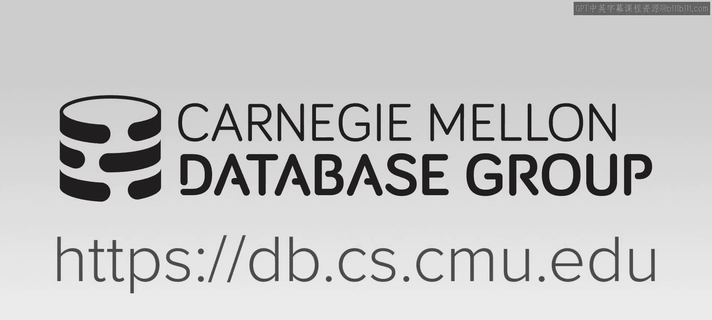

🎼。🎼留给你。Mo is there。Okay so today's class has be a little bit different than what we've talked about throughout the semester because so far we've mostly been discussing about。

 okay， here's the internals of a database system at the lowest levels and how to make queries run faster and so today's different a different topic where that we're going to be further up the stack now in the system。

 where we're going to do a bunch of tricks up in before we even get to the query optimizer when the SQL query shows up and how to the query runs faster given the architecture we design below。

😊，And so this will then be from this point going into the semester， like for this lecture。

 our next lecture will be about getting things in and out of the database quickly。

 then next week we'll spend a lot more time on the query App and I know I need to update finally post the papers we'll be reading for next week。

 but I'll take care of that today or tomorrow。😊。

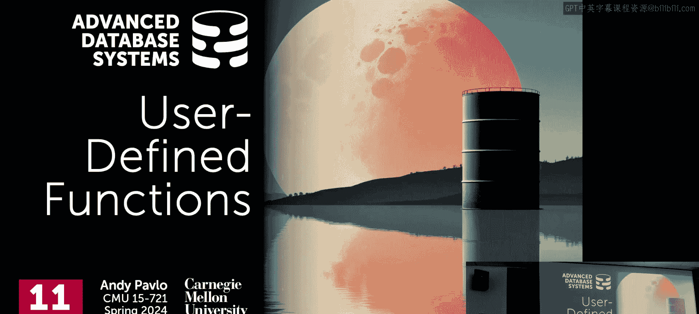

So just a reminder， before the break， we spent two lectures discussing joint algorithms and we discussed how to do parallel hash joints because I said that's what every database system needs to do able to do hash joints。

 if you're relationalally sort SQL。You need joins and hash joins is going to be the fastest and then we spent a whole lecture talking about worst case optimal joins and although very。

 very few systems do this now， this is something they're all going to to support within the next decade as people start doing more graphlike things on their databases。

😊，Right so today's lecture again， we're be focusing on。😊。

How to embed more complicated things inside of our database system to execute queries。

 and I'll loosely categorize these as an embedded database logic。

And so we've made the assumption that the scenario that we're supporting in our conceptual database system is that there's an application or some tool that the user is using。

 and they're interacting with the application， they're either typing raw SQL queries in or they're using a dashboard and then the application is sending over SQL queries that we then compute in their entirety and then send back the result。

 and so the scope of what those queries can can execute or operate on。

 the computation they could perform on our data is limited to whatever the database system itself actually supports。

And so in some cases very common， especially in the Python pandas world。

 you'll see people just do select star queries to get all the data out of the data system。

 then break it into your Jupyter notebook or pandas， whatever you want。

 then do some additional computation on it and then push the result back to the database server And so if we can avoid that some cases we can in some cases we cannot if we can avoid that then obviously the data system will have a complete view of what you're trying to do in your query on your data and it can optimize accordingly assuming you have some of the techniques that we'll talk about today but it is always going to be a better position to。

😊，It's always better to operate on the data where it resides rather than than always having to bring it out to an external application。

So this is what I mean by embedding the database logic。

 So the benefits are kind of obvious right for your network around trips， as I said。

 like if I can just do one query， have all the computation and E for whatever the result I'm looking for being that single query request。

 then that's fantastic。 rather than having to go back and forth。😊，Obviously， if now， if know。

 if I'mcorporating changes， this maybe not so much matters in the Lakehouse world on we're talking about。

 but like rather than me having a sort of a stale snapshot on my data that I'm processing locally。

 if I'm push all my computation to the database server， then as new things arrive， new data arrives。

 then I'll see those updates immediately。Then we're not going talk transactions。

 but in the transaction board if I call begin， run a query， get back result。

 do some processing on the application side， the database server is holding locks while I'm doing that computation。

 so if I can push all my computation to the database server。

 then I don't have to go those around trips。This one is debatable whether like you。

When not you're to allow your developers to not have to reimple functionality by using a better database logic and I say it's deba because oftentimes in sort of large corporations or enterprises。

 the people that write the application build that software aren't the same people managing the database servers so the application developers might be on one sort of engineering cycle but database developers are usually very conservative and you may say。

 hey here's here's my new you defined function， UDF or short procedure。

 but the DB is like well I got to vet this is going to take a couple weeks before this actually happens。

 so you end up having developers just reiming the same thing just in different code bases。😊。

We certainly saw that in the case of the the V paper， right。

 They talked about how there's what 11 implementations of substring in all the Facebook。

And then this last one again， is this encompasses all of this。

 But now we're gonna be able to extend the function out of the data system to go beyond what the built and capabilities is。

 And this last one here is what the one of the original motivations of user defined types。

 the user defined functions that Sternberg likes to talk about like when he was building they built Ingress。

 they started giving trying to start selling it to a bunch of banks。

 But all the banks were computing interest for accounts on the Julian calendar。

 whereas know the rest of the world was running the Goorian calendar。 So in Ingress at the time。

 they didn't have a Juliaian date type。😊，So that meant the developers had to go modify the data system to add this new data type。

 But if you can allow them to support， you could find types to to find functions and other things。

 then the developers can extend the system without having to recompile the binary。Right。

So the there's different categories of types of embedded database logic。

 the most common two are going to be used to find functions in store procedures。

 they're conceptually the same thing like it's a function of some kind of procedural code you can run in your database server the difference is that in a store procedure you don't need you can invoke it outside of a SQL query like I can call execute and then the name of the function and it just run it like an RC call。

 whereas in EDF it has to be embedded inside inside of select statement or a SQL query。

In some systems like SQL Server， they make the distinction that user defined functions cannot update tables。

 like you can call insert， update delete into UDF， PostGre doesn't let you do that whereas in a store procedure and SQL server。

 you can link that's where you can call update queries。Right， so again。

 a bunch of these everyone should be mostly familiar with。

 But the one we're gonna care about today is use red functions。

 And this survey comes from the a follow up paper from the Fud paper you guys read where they actually did a survey of real customer databases on Azure。

 And it is counted。 know， what a real EDF and store procedures look like。

 And that's where they came with this pie chart like this。😊，Alright。

 so user drive function this this should be review for everyone here。

 user drive function is basically it's gonna be a function that's be written by the application developer that allows us to extend the functionality of the database system beyond its built in operations built in functions So the SQL standard specifies。

 there's a substring function。 and every system thats most support SQL standard its going to have their own implementation of it。

 But if I have some weird wonky substr version that I want to use for whatever reason。😊，Right， it's。

 it's not realistic for me to assume that my data S is gonna have that。

 But I can write it as a user drive function that have the exact capabilities that I want。

And then I can put my application technically anywhere。

A lot of times when you see people that have migration services where like I'm running an Oracle。

 and I want to switch to Postgres， I'm running a Ter， I want to switch to Postgres or something。

 they'll take whatever the custom functions you're using from the different proprietary database server and they'll reimplement them as user defined functions to ensure compatibility。

So the function is pretty straightforward， you' can take some input arguments， always as scalrs。

 you can perform some kind of computation on it， and then you can return a result either as a scalar or a table。

😊，For our purposes here， we're going to assume that the the UDFs are。Not pure functions。

Another neighborhood， but basically you can't， they're not going to call it outside things in some database servers。

 you can actually make RPC calls to remote services to keep things simple today。

 we're going to assume that everything is going to run inside of the function itself and doesn't escape。

Although we can call one function can call other functions。Alright。

 so again conceptually looks like this。 This is our application。 wants to execute some SQL。

 that has some kind of program logic， conditional clauses。

 whatever calling whatever libraries it wants， execute more SQL。

 and then some program logic and so forth。 So what would happen is that if we can take maybe these two portions here and then embed them as functions inside the database server and then now we can rewrite our application just to invoke the queries and the functions like this。

 then now there isn't this back and forth where maybe pulling a bunch of data processing it and then passing it on the next query so forth。

 I could keep everything always on the server side。😊，Again， obviously。

 for some things like if calling machine learning libraries， like Pytorch。

 this doesn't quite make sense to express everything as as a as a UDF in like the native native UDF language of the Davis server。

 there are tools that are extensions to Postgres and other systems where you can make you。

 calls into Pytorch。 they basically have UDF rappers for that。Like I said。

 we're going to ignore that for today。rightSo today we're talking about the background of the challenges with UDFs。

 then we'll talk about three techniques to optimize them the first one is gonna to be the inlining approach from Microsoft that you guys read。

 then there'll be a followup work from other sets of Germans to convert UDFs into common table expressions or CDEs with lateral joints and then we'll finish off with bashing and some numbers of vote。

Wch systems can support these various techniques？All right， so I've already said this。

 just defined function basically is going to be take some input。

 do some processing and compute the output， but there's broadly two categories of UDFs that we're going to care about the first of these sL functions where the inside of the function is literally just going to beque is one after another separated by as sending colons and then the output of whatever this the function will be when you evoke would be whatever the output of the last query is。

Right。And sos input arguments， you， take integers。Theres this return argument that defines what you can return。

 So in this case， we're going return a， a。The tus that have the same schema as the table Fo。

 and then we have our computation， the function body down here。So for this example here。

 I can either invoke it as a query without a from clause or embedded inside the from calls up。

 or some cases I can put in the where， you can put these function calls anywhere。😊。

So this is not that interesting from our perspective today because we can more or less treat this as like a macro。

 so like in this case here， you know they're calling getF inside the like query。

 I can the data server Li will take all the SQqueries inside the function body and just embed it。

 inject it inside of this thing instead of an a nesttic query。😡，And then at that point。

 the optimizer knows what it's operating on because it's dealing with SQL queries。

And you can do whatever wants。 Now you can see why SQL server doesn't allow you to do update queries。

 because I update queries inside of this thing， then that can certainly change the order。

 which I execute things。 And if it's a select query with updates inside of it， then things get weird。

The types of Us that we're going to care about today are going to be ones that are written in an external programming language。

 so the SQL standard specifies something called SQL PSM as persistent stored modules and that goes back to like the question when updates are permitted in the sequential SQL functions Yes the。

strict ordering on when they execute his question is whether data doesn't enforce strict ordering when you update。

 I think yes， like it literally the blind leads copy it in yes。

I actually don't know what Postsg does if you have updated in there。Or little lonelyly copiedian。

 It's almost like， you can think it's like almost like a view。And in that case。

 there's rewritingite those on presss they literally drop it in。 but a big query。

 I don't know what they do。 But yeah， you want to keep the order incorrect。All right again。

 so the SQL standard specifies this thing called SQL PSM and in all cases in SQL， there's a standard。

 but nobody exactly follows it， everyone is going to do slightly different。

 but at a high level they're all going to look the same all these the built in or the standard proban language for UDS is going to look very similar to Ada because the story goes。

 the guy that invented or UDS to store procedures was really into Ada if you've never heard Ada it's like a modern variant at Pascal。

😊，Right，It's an older language in the 70s or so。 By， that's why you have like。

 you have declare barrels in the beginning， It's all it's very archaic， but。

So the SQL standards specify by SQL PM。 Oracle has got their own PL SQL Postgs has their own dialect of PL SQL called P PG SQL。

 It has some Postgres idioms in there。 DB2 has had their own UDF language。

 but now I think you can install SQL PL modules that look like the Oracle1。

And the one we're gonna spend most of the time talking about today is this thing called transact SQL from Cys。

 Again， it's going look a lot like。The PL SQL or SQL PM in the SQL standard。

 just there's those at signs arere going to use everywhere to declare variables。

 whereas the PL SQL doesn't have that。😊，So again， from more circle background， Cybase came first。

 Cybase was at of 1980s and I think they were the first I think they were one of the first8 systems that supported UDs。

 Ingress had UDts in the 70s。 but Cybase had UDs， Microsoft bought a license to the source code of Cybase in the early 90s to put it to Windows N to competing as IBM。

 and then since then they they forked it's a hard fork of the source code SQL server has basically been rewritten。

 Cybase is still around， they're still making a lot of money， but no news started with say， hey。

 I'm going to use Sibase used a lot of the banks。 but for historical reasons because Cybase had transact SQL。

 that's why SQL server has transact SQL。😊，There's other programming language you can get like in Postgreds。

 you can get like you can get tickle， you can get Python， you can get pearl。

 you can get PDs and any arbitrary language， if you're crazy。

 you can get you can get write UDS and C。Which is a bad idea， right。

 because if if you're operating the data system， because now you're linking in a shared object and C。

 which can touch anything in your dress space。 And for security reasons， it's a nightmare。 obviously。

 for civil reasons， it's a nightmare。 So in some cases， like in in Oracle， for example。

 you can write。UDS in C， but then again they transpo them to prostar C， which is their dialect。

 and then they run you as a separate process， so if you crash you take down the UDF not the whole system。

Al right so let's look an example here of what a PL SQL will look like or sorry a UDF written in this case here it's transact SQL。

 So this is really simple simple UDF where we're going to take a customer ID and a customer key and then we're going to discount the number of orders that they purchased over the lifetime of being a customer and then depending whether they spend a certain amount of money。

 they'll get a platinum level or a regular customer。😊，RightAnd so in this case here。

 we're emvoking the UDF inside of the。Inside of the。

 the the projection output of the select statement。

 So you sort of think of this as like a for loop iterating every every single customer。

 And then they're gonna to evoke this customer level， level function by passing in that customer key。

Right。And again， because it's based on Ada， a Pascal， we declare our variables in the beginning。

 and then the at sign tells us that it is transact equal。

All so a lot of these I already said it right UDFs are great because they're going allow us to break up complex logic in our application into separate functions and potentially allow different parts of the code in our application to be able to reuse those capabilities some scenarios also too。

 you see applications written in different languages like there's the mobile app and then there's the web server app in that case they're usually always talking to a standard application server。

 but in some cases you can go directly to the database server and now instead of having to reimplement logic in the different programming languages。

 if they're all UDFs and you can just reuse that。😊。

We're already talking about reducing network round trips。

 and then for some things where UDs can to be very helpful is that it's easier to write some complex logic in UDS versus like SQL。

😊，Right。So data analysis stuff is very common with this。All right， so this all sounds great。😊。

Why aren't UDS maybe more common then？Well， the number one problem that we're going to face is that the query optimizers。

 if the UDF has written in external probing language like PL SQL or PLBG SQL。

 doesn't know what's inside of that function。Again， SQL was declarative。

 so the SQL query itself is specifying， here's the answer I want。

 and now the data system optimizer can reason about the expressions of the operators within that query plan to make estimations on selectivities of the various computational steps in the query plan。

😡，But now if I have this function that I'm calling in some language that isn't SQL。

What is the cost of things？RightSo if I have like in my where， where of value equals my UDF 1，2，3。

Well say UDF 1，2，3， this My UDF is written in C。Or even PL SQL。

Do I know with the selectivity or what pretends I'm going to imagine this？You don't。

 because you don't know what's inside of the function。Right。

So that's going to be the one number problem we're going to face。

The other challenge is going to be that' it be hard for us to paralyze our UDS and take advantage of in a vectorized query processing model or even running the query across multiple threads。

 because again， we don't know what's inside of the function。

It may just be like we may end doing an implicit nested loop。

 nested loop join because the outer query is invoking the function once per tuple and inside of that now I'm just doing another lookup inside of that function to another table。

 it's basically doing a join。And because there's a separation between the SQL side and the UDF side。

 the optimizer can't have a holistic view of the entire query itself and do all the optimizations we know how to do about switching the hash joins and so forth。

When things get really nasty， but unfortunately they're not that common。

 is that some UDFs actually will construct a string inside of the UDF。

 like to incrementally build up a select statement and then invoke it。

You're allowed to do that in PL SQL， meaning I declare string with select。

 like with a bunch of conditionals， I'm adding a pending literary SQL to it， and then I execute it。

 In that case， you have no idea what you possibly could possibly be doing because you don't know what the SQ query is going to be you actually run the function。

To your screw。And for this one here， no one's going to solve this。Again。

 we we did a survey where we scraped Github and we try to see how common this was。 It's less than 5%。

 It's not that common。 At least again， that's for a static evaluation of just looking at the UDS。

 We don't have numbers to say how often they're invoked， but we don't think they're very common。

All right， so the。Related to what I was saying before about this parallelization stuff。

 so if you can't figure out what's inside the UDF and now you're just going to be looping over the outer table or the calling SQ query to the outer query and for every single tuple inside the outer query you're invoking the function。

 you're literally calling the UDF one at a time for every single record so in the Microsoft world they call this row by agonizing row R bar。

😡，はい。And as I said， if you don't if inside a UDF， you're invoking other queries that you can't see until you actually run it。

 then the optimize has no way to be able to say， oh， this is just a join。 Let me。

 let me combine these together。 or I'm re executing the same query over again。

 Let me cache it and leave it oruse it。Right。So， the。

So it's sort been well known for a while that UDFs are bad。

 right they're gonna make your queries even slower。

 And so there's this sort of semifaous blog article from 2006 where they're very very blunt and say TsQL that's transact SQL Sc of functions are evil in SQL server and they give a bunch of examples that cite a bunch of the problems that I just talked about right So here's one query that takes22600 milliseconds。

 So that's 2。6 seconds。 But then if you add the UDF it goes to。😊，38 seconds， just by adding a UDF。So。

So the， the sort of the developers and DBs of of SQL server and other systems。

 This is not just a SQL server problem。 every system has this problem。You know。

 this has sort went for a while。 And then Microsoft actually just came out and said it in themselves in 2008。

 So a few years after this one。 So this is an updated article where they introduced a new way to do compiled UDFs。

 But in here they basically use their term like oh yeah， R bar， the row by exiting row。

 that's gonna make your queries go slow。 scalar UDs or I think the SQL incarnate or something or evil incarnate。

 like evil personified。 They're very blunt。 And so so Microsoft is trying to solve this problem for a while。

😊，RightSo again， this what I'm telling you is not any big secret。

 People have known this for a long time。 and like。UDFs are so important and make developers lives a lot easier that we want to figure out a way to try to optimize them。

So here's another example from Microsoft this is from the F paper， this is from TPCH query 12。

 and they basically took the where clause that is just checking to see the customer key as null and they made a UDF that just does a look up on the customer table and to see whether it returns back a valid customer key so this is like contrived to example because you're taking the original TCH query that didn't have this UDF and you're adding this one piece here。

😊，And so without this UDF， the query is gonna take 0。8 seconds。 So 800 milliseconds。

 But if you add in just this UDF， which is really not doing that much。Then it goes to 13 hours。

Because again， the database server doesn't know that for this I'm evoking this function。😡。

And I'm just checking to see what the output is null。 What's the customer key， right。

 Am I doing the look on the customer table here， No。

 it so it's the customer key from the order table。 It's not going to be null。Right。

But because it doesn't know what the computation is inside of this thing， the optimize gives。

 throws up his hand says， okay， well I probably should need。

 I'm just going to execute this for every single row。And then now you get the overhead of， you。

 that's pretty significant。So we'll say Freud in a second。

 Freud is going to be able to take this in line it back into this function and get this query back down to 900 milliseconds。

 so not exactly as it was without the without introducing the not exactly what it was before you added this piece here。

 but it's certainly not the 13 hours that they're getting before。 Yes is strictlyQ。

Because you're in life。Yes， so same as this example here as a C D F， But I don't think that。

In this example here， I don't think， because I'm declaring variables。And have a return clause。

 This is not considered a SQL UDF， A SQL UDF， you don't have variables or returns。

 It delivers just the SQL queries by themselves。So in that case， yes， if I got rid of the declare。

 I got rid of their term。does it。And just got rid of this， this assignment to the variable end。 If。

 it was just this， then that would get in line。 and the optimize could figure that out。Okay， so。

How can we optimize this？ Well， there's four basic approaches。Compilation we've talked about before。

 right， We could just take our interpret， take our UDF。 we'd normally interpret it。

 We could compile it to native code， and that'll run faster。

Doesn't solve or optimize a problem because now we have， although the function now。

 capal is me much faster。It's still going to be a black box through the careerapptizer。As I said。

 Oracle does this and SQL S already does this now， I' did it since 2016。

Another approach is to extend the programmingbing language for the UDF to introduce Pgmas or directives or other hints to the database server that could tell it what portion of the query could be optimized。

So SQL store or sorry S store has their own variant of a PL SQL called。😊。

It came out when they were called Mm SQs， it was called MPL， the me SQL programmingbing language。

 but they have a parallel version where you can write UDS and you can use them and that's additional hints of the optimize to figure out how to parallelize stuff。

But again， as far as I know for that programmingbing language。

 the optimizer still sees a black box through the UDF。

Inlining is the person that we're going talk about today is how to convert the UDF into some kind of declarative form that is that we can natively embed into our query plan as if it was just Montesql queries and then let the optimizer optimize that accordingly。

And then the last one is actually predates inlinning。

 but it was rediscovered by us and other Germans a few years ago。

 you basically take the UDF and you convert it into a bunch of SQL queries that run in batch over multiple toolss at a time。

And then now you don't have thevocation cost of evoking this single function。

 And now you're operating things all altogether together。 Again。

 I'll show examples of that as we go along。 So today's class， we're gonna focus on these two。

Because again， this is quite different than everything we've talked about so far。拜。So Uiv inlining。

 again， the idea here from Freud， and again we'll use the term Freud describe because that's it's called in the paper。

 I think in the obviously in the when you pay for SQLS server download SQL server。

 it's not called Freud， if you look for Freud in the documentation， you're not going to see it。

 I think they call it UDF inlining。But again， the research name of the project was floodd。

SoThe idea is that we're going to take our UDS， and we're to converter them to relational algebra expressions that we can then inline into the SQL queries themselves。

 and we're going to do this before we get to the actually cost based search for the joins and other parts of the query optimizeizer。

😊，So you can third of these these static transformation rules that we can do this conversion。

 there just transformation of the UDF into relational algebra。Without needing a cost model。

Because we'll just and then let the query optimizeizer handle as if it was any other query。

So as I said， we're going do this in the rewrteite phase before we get to the cross base optimizer。

 because our cost base optimizer in theory， we'll cover this later。

 should be able to handle these subqueries effectively。SQL server is not going to able to do that。

The Germans can the hyperumbbra Germans can do this， DTB can do this because we did a forum。

 we'll cover that in a second。All right let's talk actually real quickly about these these sub careers Again。

 Again， Im not gonna to say how to actually how to do it exactly the German way to do it。

 but this is gonna to be the challenge。 this is， this is the。

This is what the inlining approaches are going to leverage because they' going assumed that the optimize will be able to take care of these。

These SS subques， and then we're going introduce lateral joins because that's how we're going to chain these things together to ensure that things execute in the order that need to execute in the UDF。

But again， things will fall apart if it gets too complicated。So again， subqueries is basic idea。

 this is just a refresher from the inclass that we just have a nest query。

 like of a select query inside of that， there's another select query。

 and it can be anywhere it can be the projection output it can be the from clause。

 can mean the where clause， it can be having， like group I， anywhere you want。😊。

And so the two ways to handle them is to rewrite the query to derelate and flatten them to joins。

And this will be the best case scenario this is what you always want to do， but not not everyone can。

 or you just pull out the nestA query， run at once。

 put its results to a temp table and then join that temp table against the the calling table。

Or in the call query。Again， some systems do this， I think of like if I have my wear clause。

 I have something that wants an aggregate， like the max value of a column。

 I can run that once materialize that as a temp table and then just join against it later on。

And people， you have to do this when you don't we can't support dags in your query plan。 again。

 we'll cover how to do this all more thoroughly next week and well talk about career optimization for the Germans。

Question， sorry，All right， so rewriting as I said before， we take this guy。

 this is some query and we have inside of our where callss， we have a nest query。

 and then we can pull this out and basically do a join and we see that we're doing a join on the orders table with on the user table。

😊，In this case， this person here we would recognize that there's a。

 we know the relationship between the order table and the user table and we realize， oh。

 we don't even need to access the user table because everything we need is in the order table itself。

 So in this case here， this is the best case scenario we went from a nestA query。

 instead of having to invoke this nest query for every single row。

 every single record on the order table， we can just remove the accessing the order table entirely the user table entirely。

😊，AndThat'll be a big win。Alright， so the other thing I want to rely on in addition to the nest queries is through lateral joins。

 I think we cover that also in the interclass as well。

 I think the first homework required it and the idea here a lateral join is that it's going to allow a subquery in our from clauses to reference a values or attributes in other other nested queries at the same sort of nesting level again。

 you can't do this in joins typically if you have a subquery join a subquery。

 those two subqueries can can't peek into each other and see what they actually what they have。😊。

A lateral join allows you to do that， and this is how you're going to be to guarantee that again。

 we'll execute the queries in the order that they're specified in the UDF。

So they just think of that as like a bunch of sort of for loops where for each clause and a lateral join。

 I'm iterating over every single tuple， and if necessary。

 I can then invoke look do lookups on the previous， the previous table。

So let's look at an example like this。 So here I'm specifying that I have an inner join with a lateral and then inside of this nested query here。

 you can see that I'm allowed to reference the select query up here。

 I can reference like the order user ID and other things up in here。😊。

Right so this reference here OI UIZD is this one up here， and this first order is this one up there。

And again the query optimizer just knows that， okay。the binder needs to figure out， okay。

 I'm referencing these things here， and the later joins allows me to peek up to the one above me and be able to see what they have。

This example has a bit abstract when we walk through the UDF， I think it'll make more sense。

All right， let's go through the five steps of fluid。

 So the very first thing we did do is take our UDF and we're going to transform the T sQL sta or PLC s。

 whatever is written into SQL queries。😊，And for everything that that that's in the the SQL standard with some。

 some exceptions of like。Like you can't use exceptions， you can't use other constructs。

 in the case of Freud， they're not be able toha wild loops or conditional loops。

 but if calls and other things， you can convert all of those things into the corresponding SQL queries。

 SQL statements。Then we're going to break our UDF up into regions。

 and allows us to reason about their contents and understand the dependencies between these regions。

 because their dependencies are then get expressed through these lateral joints。

Then we're going to go and merge these expressions based on trying to combine the multiple expressions within one region。

 and then we're going to link them together with lateral joins。

And then we take our UDF we put together through lateral joints。

 take our SQL query that we've generated with all the lateral joins。

 we can then embed that now into the calling query。

 the thing that was invoking the UDF so we're doing at runtime。

 and then we run this now through our query optimizer。😊，So in all my examples here。

 I'm going to show it through SQL statements or like the conversions will be from the UDF statements into SQL。

 as I said in Freud， they're going to be based on relation algebra。

 but the upFll approach well see afterwards， they're going to do everything at the SQL level。😊。

So this is that example we have in the beginning where given some customer ID。

 where theyll look up and say how much money have they spent with us and then what customer status are we going to give them？

So again， the first step is we're just trying to transform the contents of the UDF。

 literally the lines of code with semicolons。Into corresponding SQL queries。

So in the first case here， we're declaring a variable called level and we'll set it the value to regular。

 Well， that's just a select query without a from clause。

Where we pass the constant string regular and assign it to an attribute called level。

Nothing special there。In this case here， next query， we're taking。

 we're taking the computing the aggregation on the orders table， and we're going to assign it to the。

 to the the total variable。That's the same thing as just taking the the query in here。

 just nesting again inside of a select query， and then just assigning the renaming the output to be total。

Then that assigns it to the variable total。And the last one here。

 SQL itself does not have if clauses， it has case wins。I think my SQL might break that。

 My SQL might have if statements， but case wins into the SQL standard。

 so I convert this if clause into a case when when total is greater than the million then the get platinum。

 otherwise we set the output to null， and again， then we assign that to the level variable。Yes。

 later His question is， do we lateral join all these yes， when not there yet two more steps？Right。

 so this part seems pretty simple。 Right， Like， I， I can I can conceptually see how I can map things like。

 oh， a variable name of that's just an attribute name in in my projection output。

 my select select statement。😊，So。In this example here。

 it's basically one to one mapping between a statement in the UDF to a SQL query doesn't have to be that way。

 it could be multiple statements could get combined into a single SQL query or you could have one SQL statement sorry one UDF statement get's split out and across multiple SQL queries for our purposes here to keep a symbol。

 we're assuming one to one。Al right， so next thing is now we want to take this UDF and break it up into regions。

Right。And then for each region， we're going to do the transformation I just showed where we're converting the statement inside the statements inside of that UDF or the statements inside that portion of the UDF region into a corresponding SQL queries。

 So in this case here， I declare two variables， total and level。

 and then I have this nestA query here where I signed the output of the agggregviation to the total variable Well that's the same thing as in my I generated SQL query where first I I assign the level variable to null。

And then I have this nest query here where I'm going to compute the aggregration。

 and then I assign that to totalem。And then now for this region。

 I'm going to assign the output of this nest portion of the query to this temp table called ER1。

It's an ephemeral temp table， in theory， should reside entirely in memory。Right。

 it's not in the catalog。 It it disappears once the query is over。 So I can assign it into this。

 It's like a table A this in， in a query。Do the same thing with the next region here， right。

 convert this into this the case when statement and then do the same thing and then sign the output into。

Into this temp table， ER2。But notice here now that。My。

 I have this variable total that I'm now referencing。In the region above me。Right。

 so that's where this is where the lateral joins going help us because I have basically seeking now 2。

2，2 nest queries，2，2 separate queries here。 But one of them needs to reference that the other one has a dependency going up。

 So the lateral joins is how we're gonna connect them together。Same thing for level here。

And then I have this next piece here， again， the else clause。😊。

 and it's just the inverse of that where， where if the total is less than a million。

 less than equal to a million then then my status is regular。 right， Same thing。

 total can reference the one up there。 And then level。

 this level here is actually referencing what was passed before us。In that one。

Havere we done at this point？What what's the last one。Return， exactly yes， so how do we handle that？

😊，Well， what's that， finger， He's thislical。 Yes， it's just another know another nest of query。

 So we can take all these now regions。 We've turn a sQL statements。

 and we put them all together into one giant sQL query now right and so。😊，Yes， I know。

 I just talk about lateral joins in the SQL standard in the SQL standard。 It's not lateral join。

 The SQL standard is apply or cross apply。 SQL server uses cross apply， Postgres and。Sqel light and。

 and and oracle。 They all use lateral join。 They're basically the same thing， right。So right。

 so she said， like the last step was through the return clause。 What again。

 that's just a return sorry， that's just the output of the select statement up above that wraps all this together。

 And again， in this case here， at the very top， I'm referencing ER R3 and that's generated down here for this nest query here and they're linked together through the lateral joints。

Yes。Why is the else block different？His question is。

 why is the El locked a different region because I think basically Sstmo goes like in theory。

 it should just be this， right？😊，Because in this there's trying to be pedantic in this example of like showing you the different regions。

 but also， too， you could have going back to the original UDF。

You could have arbitrary things inside of this that you couldn't be able to express through the case went exactly。

But yes。In this case here， I think there's being overly rebose because they're going to say later on。

 once I get it to this form。To my query optimizer， the query optimizer can figure out， oh。

 this is referencing this。 And you know here's here's this case statement and here's this case statement。

 while there therere just， you know， there are disjoint regions， I could just merge these together。

Because the optimizeizerr already knows how to do that for wear causes anyway。

But they just settled it up like this。Other questions。So I have you guys read this paper。

 but we'll see the app paper in a second。 This  one I feel like I can understand。

 because it's transforming SQL， that's all fine in Danny。😊。

The the F of one to be way more complicated is basically convert to IR IR that's used in compilers in that and PL stuff。

 which is not my area。Okay， so now we want to actually inline the expression。

 So this is the original calling query that call called this UDF， right， So when。

 when this thing shows up， we then just wrap this， this。

 this customer level invocation that just basically gets replaced with the the entire。😊。

This entire block here， which is the convertedive form of the UDF， yes。

I don't know why you would ever do this， but if you go to the previous example and in the if condition。

 right？If you go to the equal instead of having that the people do stupid thing not which reference you if I rid of this else cause and it's just than。

No no no so。Oh， so should be give rid of the else and just had this be without it？And no matter what。

 you just overwrite it， So it would be， it would be this。

I would just take set level equals regular and I would generate this regular as level so then now in here for my third region here。

 I would have that select regular as level， and then as ER 3。So no matter what happens here。

 then it just gets over written。The question is the compiler sorry is the queryatr smart enough to figure out。

 oh， this this thing， whatever happens here， it gets overwritten by this。

But who knows we'd have to open singles over and two what happens。But it's。

It'll still have to use ER2 level Okay， So it'll still be。No， no。

 it literally it would be select content regular as level as ER3。😡。

The are three level So the else in that exactly No， this case when goes away。 If goes away。

 If your example， it's just set， set level as regular， this goes away。 It's， it's this。 It's。

 it's this query up here。Select regularized level。then did overrdes it。And then going forward。

 when I put it all together。😊，Here， then as I do my select ER R3 level， well。

 that's just whatever came out of this one。Okay。So now if you throw this with the query atr and in the sea server。

 what you end up with is all this cross supplies get torn out and simplified into just a left outer join。

😊，AgainAgainst the order table。Right， so you're loopping over every single customer customer record。

 and then you do a left ater join to compute the maximum number of the total amount of items that they bought。

If they don't haven't bought anything， you get null， that's fine。

 Otherwise you didn't compute what the the true output is。그리고。Again， I'll say this next week。

 for most things， SQLS Ser will have the best query optimizeizer in the world。Not for some things。

 right？For joins， for nest queries， the  Ubro Hy1 will to be better。AndductB is getting there。

We I'll talkll give a preview of what we'll talk about next week again this class today。 right。

 So in this case， this case here now， what do we have， right。

There was an implicit join in our UDF that because we converted it into this cross supply of this lateral join。

Contractption here that the kotizer was able to figure out。

 oh it's actually it is a join against the between the orders and customer table and in particular it's a left outer join because I may not always have an order record for a customer and so now I can just in line or just do a join as I normally would do the hash join really quickly that we know how to do。

😊，All the operations that were previously a black box inside of our UDF are now embedded as SQL。

 and the query optimizer can use all the statistics and other information that it has to be able to reason about the activity estimates for our query。

It's parazable now because we know that's there's no weird dependencies between evoking this function sorry this query from one record to the next。

 so all my threads could be running in parallel at the same time。

There's no function call overhead of setting up the call stack to go into some function for every single record。

And further， though they claim in the Freud paper， one of the big advantages of their approaches didn't require any engineering changes or changes to the query optimizer itself。

that's a whole complicated piece of a machinery inside the Davis server。

 and then if you can avoid having to modify that， and therefore you know there won't be any regressions for anybody else。

Then this is fantastic。So if your query optimize is very sophisticated， in the case of SQL Ser1 is。

 you actually get a lot of the same optimization advantages you would get in a what I'll call a traditional optimizer or compiler optimizing compiler like for clang or GCC。

 you basically can get the same benefits now inside your UDF。😊。

So let's say I have a really simple UDF for given some integer and I return back whether it's a high value。

 the string high value or low value， so I would invoke it as select get vow as a passing in some kind of constant here。

 right？😊，So if I Freud this Mofo， I'm going to get at least in the first version of something like this。

 we have the case when statement， if the value is greater than 1000 set up high。

 otherwise give it low， and then we do an outer apply。

 We can ignore what that is on that and we get returning back the string high value low value。😊，Well。

In a query optimize sorry a traditional optimizer， it would be able to recognize that because I'm invoking this with a constant value of what was it？

5000， yes， yeah，5000 that。I can do dynamic slicing and identify that I'm never going to go down the the else clause for low value。

 And I just remove that dead code entirely。Right， in the case of the SQL query。

 it's the same thing as I've removed my case when。 and I just have。

It does spit out the constant value high。Furthermoremore。

 I can do constant propagation and folding again， a traditional compiler optimizer would recognize that well I dont need to I don't need to concatenate high in value as separate steps。

 I can just put them two together at the very beginning by propagating the constant up same thing in our SQL query。

 the query optimizer could figure out， oh， well， this is just taking high appending it to the string vow。

 So why do that as an out and imply with separate SQL queries。 Let me just do it in one statement。

Even further， you need do more dead code elimination saying， well。

 I don't need to declare an out query return value or setting up the variable of returning it。

 its just select high value。So again， you get all the same benefits as if it was a traditional optimizer。

 but the query optimizer is doing this because it already can do this for queries today。😊。

SQL server can， not everyone can。And I don't think Postcasts can do this。RightYes。

If this works so well， can we just stop teaching people SQL and use UDS for？😔，Stved is。

 if this works so well could we just stop teaching people SQL and use dodes or everything so again。

 it doesn't support everything so as in 2019， this is what you can do， you can do declares and sets。

 you have select queries if then or if LCF if return clause in multiple locations of the function which they can handle that and they do all basic relation operators。

 out operators exist not exist is no in any and so forth。😊，They don't support exceptions。

 They don't support dynamic SQL queries， and they don't support updates。 Again， in SQL server。

 that's not a big deal。 but in， in。And know， Postcodes and other queries or other data systems could。

 So your original state question is like， why do we need SQL instead of using UDS？😊，You want you。

 you still need both， right， There's certain things you would not like。

To do the things you would want be able do on your database server。

Like your UDF is going to start making SQL query calls in it。😡，Right。

So a secretequel doesn't go away。So this is the result they had in the paper that they share。

Where they。They had a bunch of different workloads from real customers and I think they got permission to extract out the UDS and sample of the data and they showed what benefit they're getting for a bunch of UDs by inlining it with Freud so for the first workload it had 90 UDFs and the 82 of them could be in line with Freud and the second one was 17 UDS and 150 were compatible and so。

You can sort of see the long tail here for the first customer here。

 with only one UDF actually had a regression。And I think it's going to be because the SQL server is going to choke on the。

You， going choke， and handling a large amount lateral joins。 same thing for the other one here。

 But like， this is pretty significant， right， Some customers are getting almost 1000 x speed up。

Right， that's huge。 That's insane。 Like that almost never happens in databases unless you like rewrite your application or like switch vendors to go from like。

 you know， a row store to a column store to without having to make any changes to the UDF itself。

Just with Freud inlining， the performance win is significant。RightAnd the eventventor Freud。

 is guy Karthik， he was a Ph student at IAT Mon Bay， which is the best database school in India。

 and then he he was at the gray systemss labb in Madison。

 Wisconsin with Jamesh and he worked at Microsoft on this。 So they got the paper came out。

 I think in 2016，2017 think the paper preds， but they got it shipped in SQel7 in 2019 in like three years which was is insane。

 So there's a bunch of his tweets that shows that like people were talking about how the benefit they're getting with Freud is 28 faster significantly more the query went from four minutes to 99 seconds。

 but just turning on the flags says use Freud。😊。

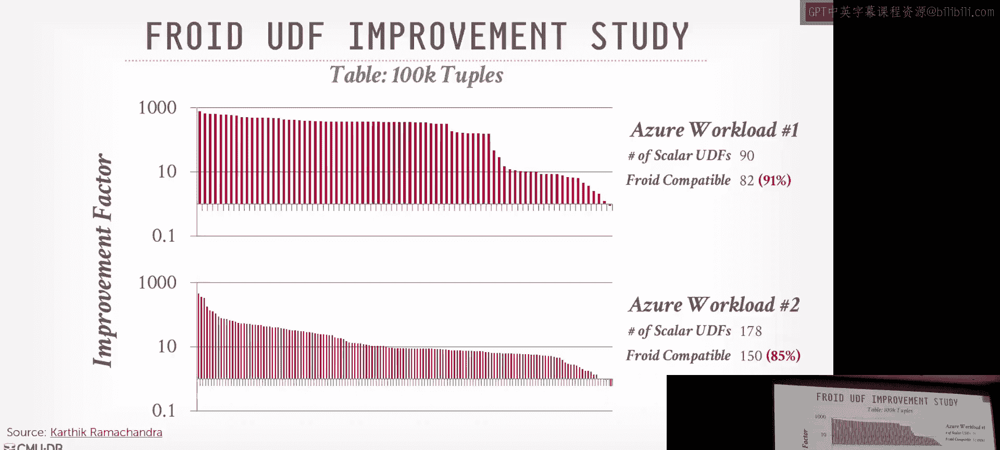

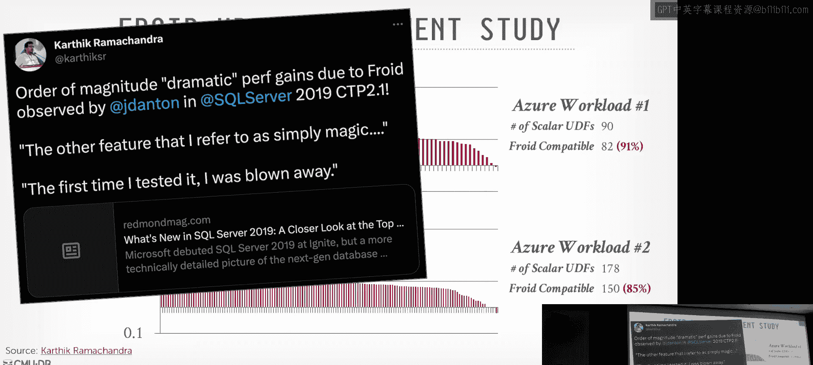

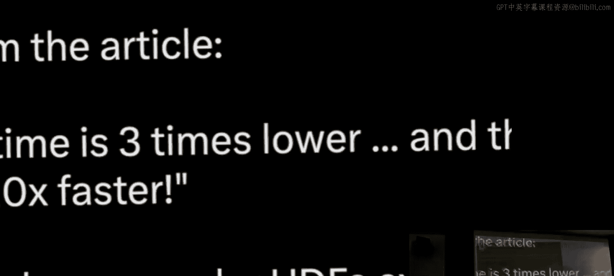

Again， that's a huge wind without having to make any change in your application。😡，Right。

I think in the paper， they talk about the overall compatibility or support for UDS in all of the top 100 Azure databases。

 I think was about like 60%， so 60% of the UDS converted into could be in line with Flo。All right。

 so this is one approach， is like this is how to again take the UDF。

 convert it into relation algebra。And then inline that and I showed you how to do it through SQL。

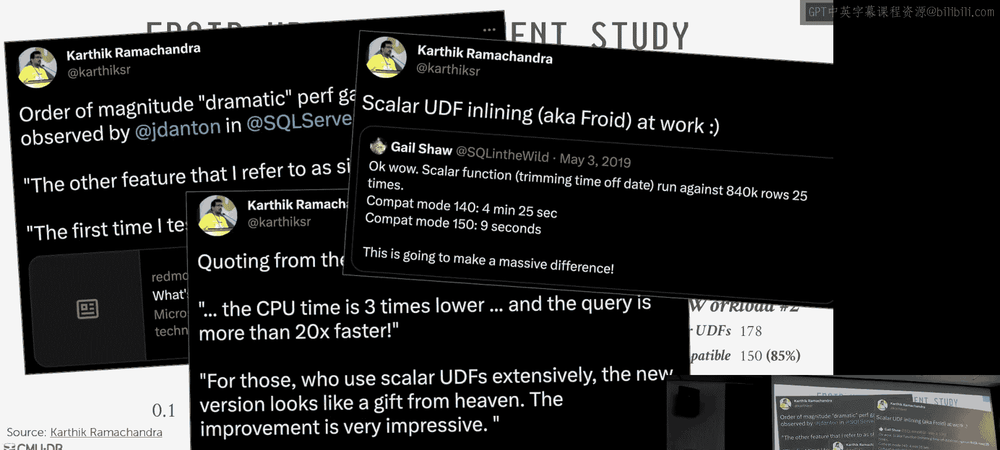

There's a yes question。What are the challenges in taking the same approach with vector UDS healing？

the question is， what is the challenges dealing with scalar UDIS or it's induct UDS？发明。

He's done it for Scalar UDFs， but he's limited in the scope of the Scar UDFs。

additional challenges that prevent them from just going into Sc UD is a construct in UDS。

 like they return a single value。If you return multiple values that are called table value functions。

 yeah。😊，E questionially is like why can't you do this for everything？I don't know。Yes a question。

 I don't remember。Those functions out there are scalary D anyway。Yes。

Chuncllor need to make sure they always。Her question is。

 are there restrictions on UDS to make sure they already terminate。

 That's usually a construct of the execution engine itself， like how long a query can run。

 So you set your time out to say the query can run for one minute。

The data set doesn't care whether you're spending all your time in UDF or not， So yes。

 could you write an infinite loop in the UDF。The question is。

 is that why they can't convert four loops， I don't think it's a limitation of。

what a time outs there's a follow up paper we're not kind to covered called Agaify where they show how to do aggregations like with loops in a UDF for that one。

 they're actually going to rewrite your portion of the UDF as a user run aggregate and evoke that。

That's。That's like due to translation。We don't want to focus on that。

And that far as they never made a production。Exceptions are the other way to one， too。

 because they know they' to sport because that's literally like it's like a goTo statement。

 you're jumping to another part and they don't support that。All right。

 so again I want to talk about how to do SQL to SQL or UDF into SQL using this F approach from other set of Germans。

At to Bgen， and then when F up I'm talking about batching。

 which is another approach alternative to inlining。

So for this FL approach what they're going to do is're going to take your UDS and they're can convert them into common table expressions。

 basically SQL statements， and this is going allow them to do the looping that Freud can't do and additional constructs that Freud can't handle so instead of actually embedding this and how the database server。

 they actually wrote this as a separate middleware as a standalone compiler。I can give a quick demo。

So if you go to that website here， you have on one side， you have the UDF。😊，They make it where to be。

They a fool me？特别高一来。What's that， Yeah， they always got the car level。

 they're going to be CTs for this as well。 So again， so this is the original UDF。

 And then this is what it'll it'll spit out right， And you see a lot of lateral joins and messer queries。

 So like I knew something really stupid。😊，You know X。Int。And then it spits it out。

 and then you see now like including X variable and it's doing some of the same things like it's setting up the variables in the same way that we saw before。

 It's like changes the 99。Right， then you get。Very similar to what we saw in foot。

 then if I actually run this though。

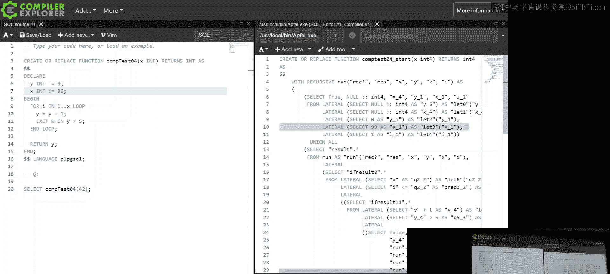

So this is Postgres。So I've already installed it， so here's the。Here's the， the real simple function。

 And then I execute it as。You can't see no。Right， so if I run it out。

It takes about half a second to do the original UDF， but if I run there giant。A。

DidThe later join one like this？Whatever that， that's how that's how took to install it。

 It was a create function。 So now I invoke it。A。Now we're taking what two milliseconds。Yeah。

So in this case here， the UDF call in Postgres is actually faster than using the Freud one。Tele。Yeah。

Yep， yep， y， y， y， I get it。That' is why I always use my laptop and when I give demos in the class。

I want to keep it quick。Right。And in this case here， there's the cost of just invoking that function。

 you see how Postgres at the optimizer level can expand the SQL query because it's embedded inside that UDF。

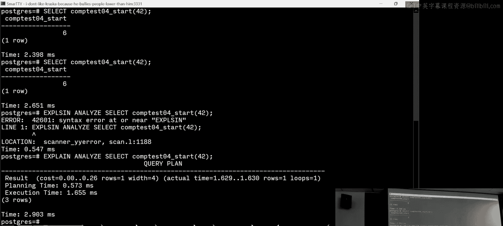

Right。And again， the links in the slides if you guys want to play with it？All right。

 so this is a great little PLE and compileilery。 So bear with me。 And again。

 I'm not an expert in this in this area。 So like I know enough how it maps for the SQL stuff。

 but beyond this， you know， this， this is all， you know， I can't go too deep in this。

 So the idea is that we're gonna take our our our UDF and we're going convert this into。😊。

To a phone call SSA。static single assignment form， and this is going to allow us to basically convert the arbitrary code that we had in our UDF into some form that's going to use go tos to find blocks of things。

And then we're going to take this SSA thing and convert it into administrative normal form。

 which is going to use mutually tail recursive functions to allow us again to simplify the blocks of the regions themselves。

 then we convert the administrative normal form， which is using mutual recursion into direct conversion recursion and then that gets converted into SQL using with recursive CT tos and then that produces our SQL query and we run a re query optimizeizer。

😊，So buckle up， we'll go through the exams。All right， so this's save a really simple function。

 this power function given an x given an n， we just have the part we care about is this loop here。

 which is get a or every I and multi multiply x by itself but to some power。😊，So in the first step。

 when we want to convert this to SSA form， it's going to look something like this where we define these blocks with these labels。

 and then we're using GoTos to jump around where we need。Right。He's happy， look how happy you are。

 see you undergrad。Right。This is what they do to you。嗯。All right， so again。So in SSA form。

 as far as they know， we're only to find each variable once we're all shaking their head。 Yes。

 same say or yes， this basically a traditional compile we do on the inside。

 So then now we're going to take our our SSA form and we can convert this into administrative normal form and this is gonna allow us to have tail recursion。

 meaning in at the last statement of every sort of function that we we can call another function and we're allowed to call recursly ourselves and other functions and those functions can then call us back right so you have this you can have this you can have cycles in this right。

😊，So in this case here for our while loop， you know。

 we're going to loop through and do our computation。 and then we're cur calling ourselves。

 But then once we finish the last one， then we break out right and then whatever the return result is whatever the。

😊，The last iteration was， yes。For this notion of tailcursion。

 it's just like the calls to go to the other labels that is recursive。

 you're still allowed to do computation。Or those calls。Yes， yeah。I the question is， like。

 are we allowed to do computation before the other calls， Yeah， so I mean， that's what this is。

Down here。Right， so again， this is doing mutual recursion， meaning。

One function can call other function， that function can call you back。

We want to convert this to direct recursion。😊，And that's just doing another transformation。

 And that's going to basically now where we only have recursive calls in the as the tail is the last thing we do within our function。

 and then the。The sort of the embedding， the recursion call is going to look in one direction。

 So run can call run。 P can call run， but run cannot call p。

And the reason why we're going to do this is because we care about getting the last output of whatever this in our tablecursion calls call stack。

 and that then gets as produced as the output to the select statement within in our nest queries。

 right？So the outermost query is produced the output。

 that's what would be the innermost recursive call。So all right。

 so then we take this thing and now we convert this into SQL。😊，So again。

 I'm not gonna go through all the details of what it all is。 But basically think of like。

 here's the this， the setup， all the variables。 Well that's this nest query inside of this。

 And then we have our， our FN else。 And then this this percursion calls here。

 And that corresponds to this， this sQL statement like this。😊，Right。

And then compiler magic happens and then this works。All right， so does it make a difference？😊。

For this one， they didn't， they didn't have Freud。 So they can't compare against， you know。

 is their approach better than what what Microsoft is doing。

 They just compared how much faster their approach using all these SSTs is versus。You know。

 letting Postgres just you know called U as it normally does。 And in my example before。

 I showed how the trial has showed before， like for that really simple function。

 it's actually faster just called the UDF。 And sure for real simple things， this doesn't make sense。

 But you if you're gonna evoke the UDF over over a very large table。

 then now you can start to see the divergence between the different approaches。I would say also， too。

 that the。I would say that the reason why this is not the performance gap is not as more significant is because again。

 the Postwe query Opmire is not as sophisticated as as Microsoft。

 so therefore it's not going to be able to do all the optimization that I was showing before。

 breaking it down， removing De code and other things。All right。

 so the last one approach I'm going to show you is bashing。Again， so the background here。

 this actually came out of a 721 project at Sam and another student we working on last year and the CMU undergrad sort of independently。

😊，Developed this technique， and then we found a master's thesis from the Germans that did AtFL that they invented the batchching technique。

 but then we found another paper from the Freud guyss PC advisor from 2008。

 who actually invented before anyone else， but then that version 2008 required changes to the query optimizer itself to make this all work in our version that they developed here and with the Tobogan Germans。

 the A Germans， you don't have to make any changes to the optimizer。

So the idea here is that we're going to translate the UDF into a series of update statements。

We're not connecting them together with lateral joins。

 it's literally like it's going to be one query evoked after another。

And what they're going to do is they're going to do some amount of computation in the set clauses to then set values in a state table that's going to be as if we're maintaining there's equivalent to the variables that are in the UDF itself。

So when we invoke the UDF， we first create this temp table。

 we instantiate all the attributes for each variables that are in the UDF。

 then we have a series of updates that then update these variables corresponding to the computation that would be in the UDF。

 so we're doing that same translation we saw with Freud of we' converting the UDF procedural statements into corresponding SQL queries。

So this is gonna to be useful for any database system。

 which we'll obtain the second that is not able to do the decorrelation stuff that。

 that Freud and up fell rely on be able to convert those lateral joins and get them down into the to nest queries。

So this is this is a UDF from Proc benchch which we'll talk about in a second。 this is a paper。

 a follow paper that the40 guys put out of a real benchmark that's based on all this UDF they were seeing in real customers。

 So it's sort of a synthetic version of what wrote UD look like。 So this is from their example here。

 So the gist it is that you're doing a lookup on on an item I to figure out what manufacturer has sold the most of it。

😊，So you have this s query here。I say there's three portions here there's three nest select queries here in these different blocks and then say this is the call and query that's going to invoke it right and so inside of this you have some additional competition you're doing and then for every single record within this query here because you're trying to get all the first 25。

000 most bought items then you're going tovo the UDF up above。😊，So。

I'm not going to go through all this in a low little detail。

 but if you think of this as like the combination of the UDF plus the calling SQL query will get converted into a sequence of SQL queries like this。

And you can always treat this as， again， like a SQL function， although it has updates in it。

 But like just think of like a macro this thing would get embedded when when you call the outque like this。

So in the first step here at the top， here's that temp table we're creating。

 and inside of that you see that we're declaring attributes inside our temp table that correspond to all the variables that we defined right so we defined a man variable。

 count1， count2。😊，All those are getting defined in the in the create table itself。

 But then we're also going to have this special return bullolean that's going to tell us whether this we want the value of this。

 want this record within this temp table corresponding to a tu that was passed into us should have get returned。

😊，Or not， right？So you can sort of think as like every single tuple in the temp table is going to correspond to a tuple that would get passed into the UDF。

So if I have 1000 tus， like  a0。What is this web sales of000 web sale items or item IDs that I have1 thousand items in my temp table and I'm just basically updating just giant state table as I go along。

And now when I do all my computations。😡，These， these。

You know what was done at sort of one record at a time in my original UDF。

 I can now invoke across all of the the the twoples that are being passed into the UDF at the same time。

 and they're all independently updating their state table。And so the way I would invoke this。

 this generate series is in SQL standard， basically you can generate a list of numbers from1 to whatever or0 from whatever and doing a later drawing to that So I'm sort of seeding the computation to invoke to generate the result that I'm looking for I produce the output that I need and that's equivalent to invoking it the original UDF。

Yes， but you cant probably you probably can't do this for every single。You're batizing stuff。

 I don't think that's going to work up。 I'm not clear that。

 but I don't think it's going to work up every UDF right。

 this's not work for every work out for every UDF。 I think it does，Because even exceptions。

 you could handle that through the state table。I think it is more generalizable than fluid or upfill。

诶。Becauseuse again， so you actually， you could potentially handle dynamic queries because you just put the string that you're concatenating to to the SQque。

 You can put that in the state table。It's a little weird， but you could do it。Okay。So。

I think I've already mentioned this so these are slides from Sam from last year so the Microsoft guys wrote the Freud paper。

 they wrote this follow paper Aquiify， and then they put together this open source benchmark called Seqel Proc Bench that was they argued was a faithful representation of what real UDF actually looked like because prior to this wasn't anything。

😊，And you can sort of classify the UDFs into sort two categories in the PRC benchch。

The first are going to be UDS without any input parameters so select max return reason web。

 nothing gets passed into it， and I'm just invoking this once。And so in this case here。

 there isn't actually any advantage of using inlining or batching because this UDF is just invoked once。

There's really nothing special about it right The ones that matter the most is you have things like what we tell before。

 you are passing in some kind of input value that you're iterating over in the calling query in the outside。

 right。So I think that when Sam did his analysis looking for a Pro bench。

 despite Microsoft inventing the inlining technique with Freud。

 they could only inline a small portion of what's in their benchmark of these queries because a bunch of them just couldn't reason about and wasn't able to handle it or in some cases that it did do it。

 it didn't actually get a performance benefit。Because it wasn't able to do that decocorrelation of the subqueries if conditions were too complex declare wasQ that not。

Yeah， so I guess Andy's going to explain this。Essentially。

 the problem is that when you get your PDF app and then you inline it。

 you get a very complicated subgroup with a bunch of later。

And then when you put that into SQL sub as optimizer， it's unable to delate that sub。

And then you go very bad。Whereas if you use the German way of deating subqueries。CanDecarlate any of。

You got a really good。Yes。We'll cover that。 maybe we'll cover this more detail next week as well。

Alright， so this is， this is a table we had in the paper that we just came out two months ago and we compared it against C server oracle。

 DDB and Postgres。 So Postgres， again， just can't handle any of these things because the optimizer is not as sophisticated as as the commercial ones。

 Oracle we will just ignore。 But in the case of here DD B Well，ductD B got could handle everything。😊。

How is that the case， Well， because last year， this Sam 721 project with two other masters students added support for flattening nesttorlateral joins so that they can support the inlining and the bashing stuff that we we've been talking about sorry and furthermore。

 they actually submitted the PR toductDB that actually got merged。 So when you download D D B。

 you're getting SAs and other 721 students code to handle the inlining stuff， right。

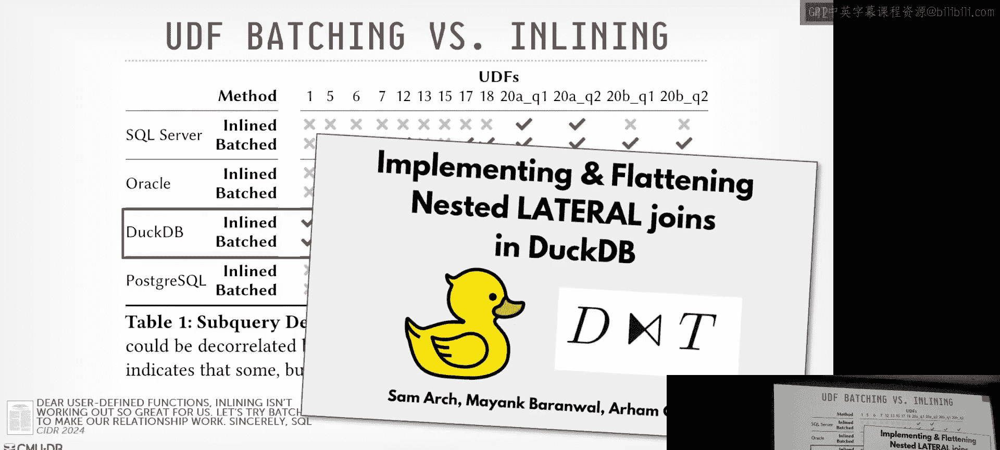

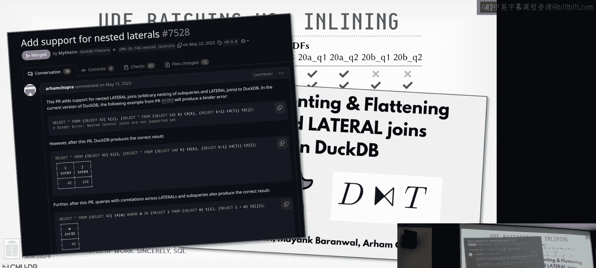

Well what about Microsoft so in linening you can see for these select UDS in Proc bench。

 again the Microsoft benchmark based on their UDS， they can only handle two of them。😊。

So what's going on？And the issue is that because as Sam Marty said。

 they're not as sophisticated as their approach to decocorrelating subqueries is not as sophisticated as this German approach which we keep alluding to instead they're going to basically have these handwritten rules that allow to do the rewriting inside the query optimizeizer for different use cases。

 but not all of them。And you can this paper came out in 2001 before Freud and these computer generated monstrosity queries of all these ladder drawings existed。

 so I guess they didn't know these things they didn at the time。

 they didn't try to cover them in their rule base and they haven't updated it since then。

So in this case here， Microsoft just simply the SQ Service simply can't handle the kind of monstrosity queries that something like Freud or AtFel is going to generate。

And so the German approach， which we'll see next week， it can handle any possible。You know。

 de correlationrelation for subqueries。Because one they're going to be able there's to convert dags instead of trees in the query plans it allows them reuse the computation for one nestA query for another part of a query and they're introduce these additional constructs like a dependent join to keep track of the dependencies between two different from clauses and so forth。

 and therefore they can take any possible subquery combination you can think of and throw it out the query optimizer and it'll be able to handle this。

Duck De Be can do this because they're based off of what Umra did or Hyper did。

 and then Sam and his team came along and extended sort of the lateral joint stuff that we needed。

So that's the preview for next week， we're going to talk about how this works in hyper。

So the main takeaway going back to。know this table here。

 in mininging is fantastic if your database server query optimizer can handle the large queries that these things are going to spit out。

And few can。O。So again， I said this before， but this is a big deal if you can get your career appr can handle the kind of things that Appfel or Floud is going to generate。

 then you get a huge win for speeding up a UDF without making any changes to your application code and that rarely happens in the world CS of software so that's a big deal。

 but again you need to be the German style， the Uber style decolation。😊。

We talked a little again about how to compile the machine code。 this is going to help some。

 some performance slowdown。 but again， since it's still going to look like a black box of the optimizer。

 it's be not going to get the best performance。All right， any questions？Yes。

 so it we have some still have some time can I ask a question about the code that we looked at for the conversion。

Sure， yes， I mean this one。Yes， no， actually the one day we drew out for the the fud example。

So they're going back like this。not be possible if we have instead that else clause right there。

 the third one， if we replace that else with a simple if condition。

That just says if at total is less than a million， yeah a million。In that case。

 if you look at the block over there， it says ER2 dot level。

 it won't be able to do ER2 dot level It will need to do ER1 or ER2 depending on whether that condition is true。

 so it'll become。It won't easily translate from the left to the right。So its David is。

 if you have now inside of this， another if it nested if calls not nest。

 just replace the else if replace the Oh， so this， this， this， this if ends。Then you have another if。

 And then in that case， if it's less than this。if it's less than a million， set it。

 set it to regular。And in that case， implicitly， then the value is ER1。

 which is nulls staticable because don'。If it exhaust both branches and you can have it uninitialized。

Total bird level。These actionsctors how really have。But the level is initialized as no。好问。At the top。

 so you just manage return no。嗯。Okay， do you see your arrow there is the ER2 do right Yes。

 my problem is that the E2 do No that Yes exactly that one。But we need to change。 Yeah， that's okay。

 You can call it year1。But that's not the logic that the UDF would。This kind。

if level less than a million， set the regular。RightSo that that would just be similar to this。

I's see what you're saying because it would be it's changed in ER is Er I understand your point。呃。

You can imagine， I don't know if it does this， you can imagine it combining them if then else go it。

W will have a call。And then you have another table。Which is going to say， okay。

 if this condition is true。New value， otherwise it's the level from the previous table。

And you can arbitrarily keep doing this。So each thing is just a region that refers to the column from the previous region。

So it's basically doing the update。是。Okay，'ll use another case within the slide you said。

 basically you choose between those。没有。We are over time so La me。Jump to。All right。

 so next class we're to talk about database connecting protocols and the reason why I'm doing this after UDS is because this UDF idea is like okay。

 I have my application logic， let me try to embed that in the database server。

 the arrow guys andductTB guys are saying no， no， no， it's actually to the X opposite。😊。

Embed your database system inside of your。Your application。

 and then use something like arrow to get the data in and out very quickly。Okay。

So the paper you'll read is from the DDBe guys I think it's on MoonDB like before DDB was invented。

 but it's basically showing how terrible existing networking protocols are for database servers and for OAPqueries it's not the ideal。

 and then we'll see howarrow will fix this and then another project out of Simon Fraser University okay？

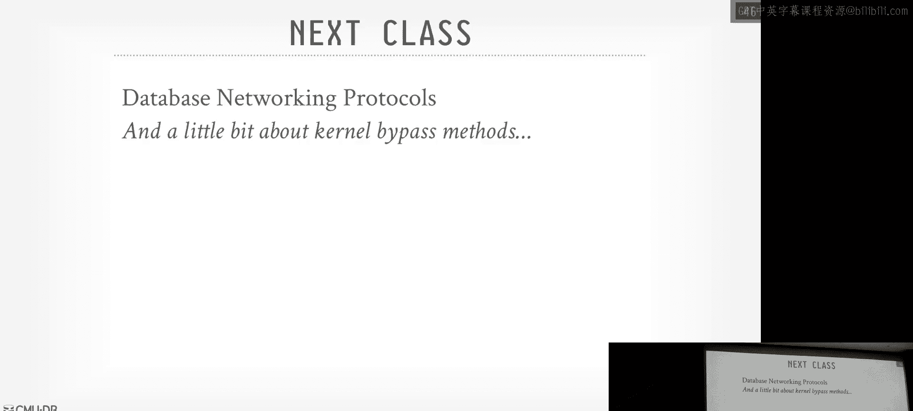

Hi guys， see it。

a to get the 40 young spot get a quick take and you'll be picking up models ain't puzzle because I more man I telling the 40 young got Thor can。

Steps and six snacks on the table and I'm able to see San I。

No short with the cl you know what got them， I take off the cat but first I' tap on the bottom。

 don about three and the freeze it so I can kill it。

 cat full with the bottle baby don't fill itca they now to the pain off went you trick it down with the god little wife hands。

 take back the pack of nuts， and don't get you some samens to trick it to the sts。

 Billy de to silly cheese to tell the weak God， be a man to get a can of same time。

