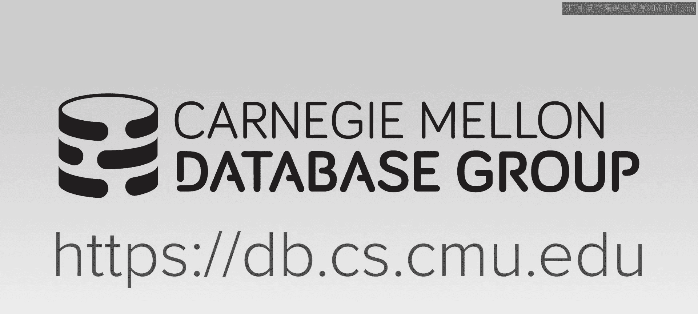
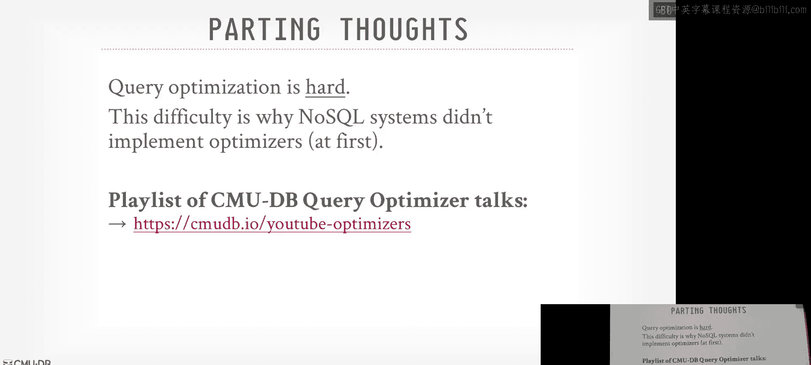

# 高级数据库系统：14：查询优化器实现 1

## 概述
在本节课中，我们将要学习查询优化器的核心实现方法。查询优化器是数据库管理系统中最重要也最复杂的部分，其目标是为给定的SQL查询生成一个正确且成本最低的物理执行计划。我们将从最简单的启发式方法开始，逐步深入到基于成本的搜索策略，并探讨现代优化器生成器的设计理念。

## 逻辑计划与物理计划
上一节我们概述了优化器的目标，本节中我们来看看其核心工作流程中的关键概念：逻辑计划与物理计划。

逻辑计划是查询的高层表示，它基于关系代数，指明了需要执行哪些操作（例如扫描表、连接表），但并未指定执行这些操作的具体算法。

物理计划则定义了如何实际执行查询。它依赖于数据的物理存储方式（例如是否已排序、是否压缩），并指定了执行每个操作的具体算法（例如使用哈希连接还是归并连接）。

优化器首先将SQL解析树转换为逻辑计划，然后通过一系列转换（逻辑到逻辑，或逻辑到物理）来寻找最优的物理执行计划。一旦进入物理形式，通常不会再转换回逻辑形式。

## 启发式优化器
对于从零开始构建的新数据库系统，启发式优化器通常是首选方案，因为它实现简单。

以下是其基本工作原理：
*   它基于人类对查询优化的领域知识，将经验编码为一系列规则。
*   这些规则通常是寻找SQL查询或逻辑计划中的特定模式，然后无条件地应用转换以改进计划。
*   常见的启发式规则包括：尽早执行最具选择性的谓词（谓词下推）、下推投影以最小化传递的数据量、将笛卡尔积转换为等值连接等。

历史上，Ingres和Oracle的早期版本都采用了这种方法。它的优点是简单快速，对于OLTP类简单查询足够有效。但缺点是无法处理复杂的连接排序，也难以扩展以支持更复杂的查询特性。

## 基于成本的优化器：System R
在同一时期，IBM的研究人员构建了System R，它引入了第一个基于成本的查询优化器。

其工作流程分为两个主要阶段：
1.  **启发式重写阶段**：首先应用一系列逻辑转换规则（类似于纯启发式优化器），将查询转换为更好的初始形式。
2.  **计划枚举与成本搜索阶段**：这是核心。优化器为逻辑操作符生成所有可能的物理实现（例如不同的连接算法、访问路径），并尝试找到成本最低的组合。

为了控制搜索空间，System R采用了**自底向上**的动态规划方法，并且通常只考虑**左深连接树**，而忽略右深或浓密连接树。

**搜索过程示例**：
假设查询涉及表A、B、C的连接。
1.  首先，独立地为每个表选择最佳访问路径（例如顺序扫描或索引扫描）。
2.  然后，自底向上构建连接计划：
    *   枚举所有两表连接（A⋈B, B⋈C, A⋈C）的可能物理实现（哈希连接、归并连接等），计算每种组合的成本，并为每个连接结果保留成本最低的计划。
    *   基于上一步的结果，枚举所有三表连接的可能物理实现，同样保留成本最低的计划。
    *   最终，从根节点回溯，即可得到完整的、成本最低的物理执行计划。

**处理物理属性**：
System R的一个局限是，其动态规划搜索最初并未原生考虑数据的物理属性（如排序顺序）。例如，如果查询要求结果按某个字段排序，优化器会分别跟踪“已排序”和“未排序”的最佳子计划，并在最后比较“未排序计划+显式排序操作”的成本与“已排序计划”的成本，从而做出选择。

## 优化器生成器：声明式规则
前述方法通常将优化规则硬编码为过程式的`if-then-else`语句，难以编写、维护和扩展。

更好的方法是使用**优化器生成器**。其核心思想是：
*   使用一种高级领域特定语言来**声明式地定义**优化规则（要匹配的模式和要应用的转换）。
*   由系统自动生成执行模式匹配和转换的代码。
*   将搜索策略与规则定义解耦，使得优化器引擎和优化规则可以独立开发和扩展。

这催生了两种主要的现代优化器架构：分层搜索和统一搜索。

## 分层搜索
分层搜索将优化过程清晰地分为多个阶段。

以下是其典型阶段：
*   **阶段1：基于启发式的逻辑重写**：应用一组确定的逻辑-逻辑转换规则，不考虑成本模型。这些规则通常是已知总是有益的转换。
*   **阶段2：基于成本的搜索**：将重写后的逻辑计划转换为物理计划，并使用成本模型和动态规划等方法搜索最优的物理执行计划。

IBM的Starburst项目（其技术仍用于DB2）是分层搜索的代表。它甚至引入了一个额外的“关系演算”中间表示层以进行更高级的重写。

## 统一搜索与Cascades优化器
统一搜索试图将逻辑转换和物理实现的选择融合在一个统一的、基于成本的搜索框架内。最著名的实现是**Cascades优化器框架**。

Cascades采用**自顶向下**的搜索方式，并引入了几个关键概念来高效管理搜索空间：

1.  **表达式与组**：
    *   **表达式**：查询计划中的一个操作单元。
    *   **组**：所有能产生相同逻辑结果的**逻辑**和**物理**表达式的集合。组是记忆化和等价性管理的核心单元。

2.  **多表达式**：作为组内具体表达式的占位符，允许在未完全展开子树的情况下进行成本估算和决策，支持增量式搜索。

3.  **规则与任务**：
    *   **转换规则**：定义逻辑表达式到逻辑表达式的转换。
    *   **实现规则**：定义逻辑表达式到物理表达式的转换。
    *   每个优化任务都是一个自包含的数据结构，包含模式、转换逻辑、所需的物理属性以及搜索优先级。

4.  **记忆表**：记录对于每个组，在给定物理属性要求下，目前找到的最佳物理表达式及其成本。这避免了重复计算和无限循环（例如，反复应用交换律）。

**搜索过程简述**：
优化器从目标（查询的根组）开始。它应用规则为当前组生成新的逻辑或物理表达式（子任务）。当探索一个物理表达式时，它递归地要求其子组提供满足特定属性要求的最佳计划，子组则通过查找记忆表或触发新的优化任务来响应。通过始终优先探索有希望的低成本分支，并在当前路径成本超过已知最佳计划成本时剪枝，Cascades能够高效地搜索庞大的计划空间。

## 搜索终止
由于查询优化是NP难问题，优化器需要明智地决定何时停止搜索。

以下是几种常见的搜索终止策略：
*   **挂钟时间**：设置一个固定的超时时间。
*   **成本阈值**：当在给定时间内找到的计划改进幅度低于某个阈值时停止。
*   **穷举搜索**：当确认没有更多可考虑的变换时停止。
*   **变换次数**：基于已考虑的优化规则应用次数来终止，这使得策略与硬件性能解耦。

## 总结
本节课中我们一起学习了查询优化器的多种实现方法。我们从最简单的启发式优化器开始，了解了其快速但有限的能力。接着，我们深入研究了System R开创的基于成本的自底向上动态规划方法，它引入了成本模型来指导搜索，但为了效率做出了妥协（如左深连接树）。最后，我们探讨了现代优化器生成器的理念，特别是分层搜索和统一搜索架构。以Cascades为代表的统一搜索框架，通过自顶向下的搜索、基于组的记忆化以及声明式的规则定义，提供了强大而灵活的优化能力，成为许多现代数据库系统的选择。下一节课，我们将继续深入Cascades的细节，并探讨随机化搜索、超图动态规划等更前沿的优化技术。