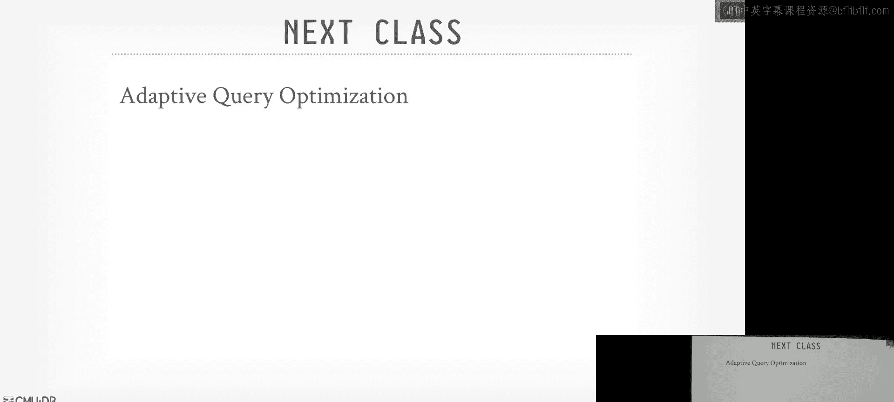

# 高级数据库系统：15：查询优化器实现 2

## 概述

在本节课中，我们将继续深入探讨查询优化器的实现。我们将回顾上一节课未完成的Cascades优化器内容，并详细介绍其工作原理。接着，我们将了解随机化搜索算法，并探讨一些开源与闭源查询优化器的实际案例。最后，我们将学习如何将嵌套子查询转换为连接操作，以提升查询性能。

---

## 回顾：Cascades优化器

上一节我们介绍了分层搜索与统一搜索的区别。本节中，我们来看看Cascades优化器的具体实现，这是一种采用自顶向下方法的统一搜索优化器。

Cascades是查询优化器的第三代版本，由Goetz Graefe提出。其核心思想是使用分支定界搜索，并增量式地物化查询计划中表达式的可能表示方式，以避免搜索空间爆炸。

Cascades的四个关键思想如下：
1.  **数据结构表示**：所有内容（如规则、模式）都表示为数据结构。
2.  **属性显式定义**：明确定义运算符所需的属性（如数据排序方式），以确保查询计划的一致性。
3.  **动态重排序**：基于已知的查询计划成本，动态调整搜索顺序以更快找到最佳计划。
4.  **统一模式匹配**：在同一个搜索引擎中，使用相同的规则定义语言来处理表达式转换和逻辑到物理运算符的转换。

### 核心概念定义

在Cascades中，我们需要理解几个核心概念：

*   **表达式**：表示查询计划中的一个操作，可以有零个或多个输入。例如，一个连接A、B、C的逻辑计划。
    *   逻辑表达式：`Join(A, Join(B, C))`
    *   物理表达式：`HashJoin(SeqScan(A), IndexScan(B))`
*   **组**：将基于关系代数规则等价的表达式组合在一起的容器。一个组包含所有能产生相同输出的等价逻辑表达式和物理表达式。
*   **多表达式**：一个占位符，表示查询计划中下方存在某个子表达式，但在当前搜索节点尚不清楚其具体形式。这有助于避免过早物化所有可能性。

### 规则与记忆表

规则用于定义如何将逻辑运算符转换为其他逻辑运算符或物理运算符。每条规则包含一个要匹配的模式和一个要执行的转换。

为了避免转换规则陷入无限循环（例如，反复左右交换连接顺序），Cascades使用了**记忆表**。记忆表记录对于给定的多表达式，目前找到的最佳物理运算符及其成本。如果在搜索过程中发现某个转换路径的成本已经高于记忆表中的最佳记录，就可以剪枝该路径，无需继续探索。

### 最优性原理与搜索过程

Cascades依赖于**最优性原理**：如果一个计划是最优的，那么它的任何子计划也必须是最优的。基于此，可以进行分支定界搜索。

搜索过程是自顶向下的：
1.  从根节点（最终查询输出）开始，应用逻辑转换规则生成不同的逻辑多表达式。
2.  选择其中一个逻辑多表达式，向下探索，将其转换为物理多表达式并估算成本。
3.  在向下探索子节点时，如果记忆表中已有该子表达式的最佳成本，则直接复用，避免重复计算。
4.  在搜索过程中，如果当前路径的累积成本已超过已知最佳计划的总成本，则剪枝该路径。
5.  通过这种方式，逐步构建并比较不同的完整物理计划，最终选出成本最低的计划。

---

## 现实世界中的优化器

了解了Cascades的理论后，我们来看看它在实际系统中的应用以及其他流行的优化器。

### Microsoft SQL Server

Microsoft在1995年左右聘请Goetz Graefe构建了基于Cascades的查询优化器，并用于其多款数据库产品（如SQL Server、Cosmos DB）。他们的实现采用分层策略：
1.  **基础简化与规范化**：首先应用总是有益的启发式规则（如谓词下推、常量折叠）。
2.  **预探索**：在开始成本搜索前，用一些可能有益的表达式“种子”填充记忆表，以引导搜索方向。
3.  **基于成本的搜索**：这是一个多阶段过程。首先考虑简单计划（如单表查找），如果时间允许，再逐步扩展搜索范围，考虑更复杂的连接和并行计划。
4.  **引擎特定转换**：最后应用针对特定存储或执行引擎的转换规则。

SQL Server的优化器使用**转换次数**而非挂钟时间作为超时依据，这确保了在不同负载的硬件上，对于相同的查询和数据库，总能生成相同的执行计划。

### Calcite 与 Orca

接下来，我们看看两个作为独立服务存在的查询优化器。

**Apache Calcite** 是一个用Java编写的流行框架，提供SQL解析、优化和查询生成功能。许多大数据系统（如Apache Flink, Apache Beam）使用Calcite。用户可以通过Java代码定义自己的规则、成本模型和运算符。

**Orca** 是Greenplum数据库的优化器，后来也发展为一个独立的优化服务。Orca的一个有趣特性是能够导出优化器在生成某个查询计划时的完整搜索状态，这有助于开发人员调试为什么优化器做出了特定选择。此外，Orca会运行成本排名前几的查询计划，以验证其成本模型的准确性，并据此进行调整。

### CockroachDB

CockroachDB使用Go语言从头编写了一个类Cascades优化器。它更纯粹地遵循Cascades模型，提供了一个领域特定语言来定义转换规则。对于无法用DSL表达的复杂转换，可以回退到Go代码中实现。

---

## 随机化搜索算法

除了自顶向下或自底向上的系统化搜索，另一种思路是使用随机化算法来探索查询计划空间。

### 遗传算法

PostgreSQL在连接超过12个表（默认阈值）的查询中，会使用一种**遗传算法**进行优化。
1.  **初始化**：随机生成第一代查询计划（不同的连接顺序和算法）。
2.  **评估**：计算每个计划的估算成本。
3.  **选择**：保留成本较低的计划，淘汰成本最高的计划。
4.  **交叉与变异**：对保留的计划进行“基因”交换和随机改动，产生下一代计划。
5.  **迭代**：重复评估、选择、生成的过程，直到达到迭代次数限制。

这种方法在连接表非常多时，可能比穷举搜索更快地找到一个足够好的计划，尽管不保证最优。目前，这种随机化方法并未被广泛采用。

---

## 子查询解嵌套

嵌套子查询是SQL中一个强大但可能导致性能问题的特性。本节中，我们来看看如何将嵌套子查询，特别是关联子查询，转换为高效的连接操作。

### 关联 vs 非关联子查询

*   **非关联子查询**：子查询不引用外层查询的任何列。可以独立执行一次，结果物化后供外层查询使用。相对容易优化。
*   **关联子查询**：子查询引用了外层查询的列。逻辑上，需要为外层查询的每一行都执行一次子查询，可能导致性能极差（O(N²)复杂度）。

### 传统方法：基于规则的改写

过去几十年，数据库系统通过大量手写的启发式规则来解嵌套特定模式的子查询。例如，SQL Server有大约22条规则来处理不同情况。这种方法有效，但难以覆盖所有复杂的嵌套情况，且维护成本高。

### 统一方法：基于依赖连接

2015年的一篇论文提出了一种通用的、基于关系代数转换的方法，可以将所有关联子查询转换为常规连接。核心思想是引入一个逻辑运算符——**依赖连接**。

**依赖连接** 在逻辑上类似于笛卡尔积，但它标记了右侧表达式对左侧表达式的依赖关系（即关联性）。优化器的目标是通过一系列代数变换，将这个依赖连接“下推”并最终消除，将其转换为普通的等值连接或外连接等。

**转换示例**：
考虑查询：“查找每个专业中成绩最高的学生”。
1.  **初始计划**：外层查询扫描学生表，WHERE条件中包含一个关联子查询（计算每个专业的最高分）。
2.  **引入依赖连接**：将子查询提取出来，与外层扫描构成一个依赖连接。
3.  **下推与转换**：
    *   将依赖连接下推到子查询内部。
    *   在子查询内，通过添加分组聚合（`GROUP BY major`）和去重操作，确保每个专业只返回一个最高分。
    *   继续下推依赖连接，直到它作用于基表。
    *   此时，依赖连接可以安全地转换为一个普通的笛卡尔积，然后与其上的过滤条件合并，最终形成一个标准的等值连接（学生表与按专业分组聚合的结果进行连接）。
4.  **最终效果**：将原本可能需要为每个学生执行一次子查询的嵌套循环，转换成了一个高效的哈希连接或归并连接。

这种方法首次提供了一种系统性的方案来处理所有类型的关联子查询。目前，已知完全实现该方法的系统包括HyPer、Umbra和DuckDB，Databricks实现了大部分功能。

---

## 总结

本节课我们一起深入学习了查询优化器的核心实现机制。
1.  我们回顾并详细分析了**Cascades优化器**的自顶向下、基于记忆表的分支定界搜索过程。
2.  我们探讨了**现实世界中的优化器**，包括Microsoft SQL Server的分层Cascades实现、以及Calcite和Orca这类独立优化服务。
3.  我们了解了使用**遗传算法**进行随机化搜索的替代方案。
4.  最后，我们学习了将**嵌套子查询**（特别是关联子查询）通过引入和消除**依赖连接**的方式，统一转换为高效**连接操作**的先进方法。这代表了现代查询优化器处理复杂SQL语义的一个重要方向。

下一节课，我们将探讨当成本模型估计不准或缺乏统计信息时，查询优化器如何通过**自适应查询执行**来动态调整计划。