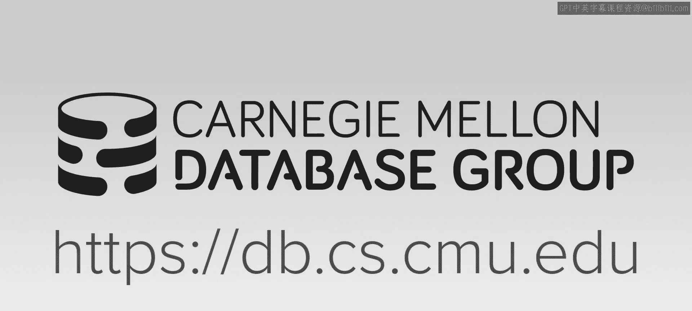
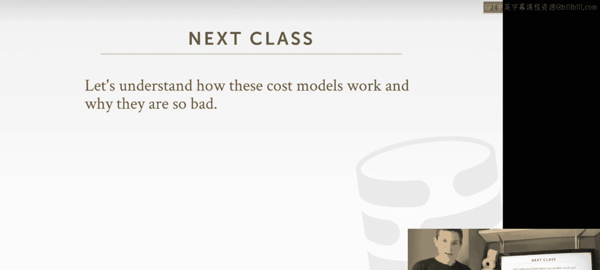

# CMU《高级数据库系统｜CMU Advanced Database Systems (15-721 Spring 2024)》中英字幕（豆包翻译） p16 -16-S2024 #15 - Query Optimizer Implementation 3 .zh_en -BV1HZ421N7WZ_p16-

🎼Carnegie Mellon University's advanced database systems course is filmed in front of a live studio audience。

😊。

🎼。

The type of optimizes we've talked about so far have been the sort of classic query optimizes where the query shows up。

 we parse the SQL and we run it through the optimizer and we generate a plan before we even begin executing the query this is how most query optimizes work right obviously you can't run the query unless you have a query plan so you have to put it through the optimizer。

😊，But the challenge is going to be that what we think is the best plan during under this optimization phase before we even start running it may actually be incorrect。

Becauses since we can't actually run the query without a plan。

 there's some assumptions we have to make about what the database and what our environment looks like。

 but these things can change over time for various reasons right so the physical design。

 the database can change because the administrator of the application could add and drop indexes or change the partitioning scheme。

the database itself could get modified， people could insert tus or delete tus。

 and that could change the distribution of values for our columns。

If we're invoking our queries as prepared statements。

 then the behavior of the query for one set of parameters might be different for another set of parameters。

 and then of course， every time we run， analyze or whatever the command is in our database system to recollect the statistics that we use in our cost models。

 every time we update them then the decisions we'll make in our optimizer could be entirely different。

So。The sort of focus today is sort of understand how can we potentially improve our optimizers。

 the efficacy of or the quality of the plans that we're generating by maybe relaxing this requirement that we only generate a plan or only revisit our assumptions。

Or we never visit our assumptions once we generate the plan at the beginning。So to do this。

 we want to understand a little bit what a bad query plan looks like or why query plans can be considered bad and then end up with less than optimal performance。

So we'll cover this more on Wednesday when we discuss cost models， but in general。

 I say the high level， the biggest problem we're always going to have is the we're going to get the join orders incorrect。

 Joins are almost always the most expensive thing， we're going to execute in a analytical workload。

 And so if we get the ordering incorrect。 that can lead to poor performance。

And the reason why we're going to make select incorrect ordering is because we're going to have inaccurate cardinality estimations。

 meaning we think that our join is going to produce x number twoples。

 but it's really going to be you know。X times y or you know， some， some， some。

 some larger multiple than what we thought was going to happen。 Again。

 we'll discuss why this occurs more in in the next lecture。 But this， this。

This issue is going to be reoccurring theme that we're going not have to overcome and today's discussion is sort of see techniques to do this。

So。😊，But since we know things are going to go bad， like we just know。

 we can just assume that our cost model is going to be inaccurate。

 our optimizer is going to make bad decisions。Then ideally。

 if we can detect how bad a query plan is once we start running it。

Then we can make a decision to adapt the plan to modify potentially to account for these differences and what we're seeing in the real data versus what we assume we're going to see。

And then we can then try to convert our plan into something that's closer to the optimal plan。

So what I mean like that is say we have a simple query like this。

 it's a four way join between eight tables， A，B，C and D。

 and then we just have a simple where clauseuse for the B and D tables。

 So let's say that we' run this query through our query optimizer and we generate this plan。😊。

It's a bunch of hash joins and nothing but sequential scans。

But let's say that when we generate this plan for this particular join。

 we estimated the cardinality of that operator to be。1000 right。

 this is an arbitrary number that I'm using for this illustration。

 the cardinality is the number of tuples that this operator will emit。

But let's say when we actually start to run it， we see that we're actually generating 100，000 tus。

 so our actual cardinality is two orders of magnitude greater than the estimate1。

So the question we're trying to deal with today is if we knew what the true cardinality was。

Before we started executing it， I'm sorry， while we're executing it。

 then could we change some aspect of this query plan to get us closer to a more optimal plan， like。

 could we change the join ordering where we want to choose a different algorithm to do our join where we want to change maybe the access methods that come below the join to use maybe an index or a different different type of stem。

So this is sort of what we're focusing on today is how to then maybe adapt this kind of plan when we know something about what the data looks like once we start running it。

So the high level idea again， is that we want to be able to execute the behavior of a plan in order to determine estimate the behavior of a plan to determine its quality relative to other plans。

 this is what the cost model is doing， but the tricky thing is going to be back here before I started executing this。

 I had to derive this cardinality from from statistics that I had maintaining my catalog about what my table looks like or what these two tables look like when you join them together。

So。These stats are going to be based on histograms and possibly samples that we're collecting from the data。

 we can also make decisions about what the hardware looks like， what kind of cache sizes we have。

 and what kind of maybe algorithm we want to use what other queries are running at the same time。

 like the cost model will' cover next class， but the main idea to think about is what we're talking about today is before we run the query we only have an estimation of what the data looks like and how our query will perform。

And if we get that wrong， we want to then try to be able to correct ourselves。

So the technique we're talking about today is called adaptive query optimization。

 it's sometimes called in the research literature adapter query processing。

 they're essentially synonymous， and it's everything I said so far。

 the idea is that this technique is going to allow the database system to modify the query plan for a query to better fit what the actual underlying data looks like。

😊，And we can be modifying for the query plan by just generating an entire new query plan。

 like throwing away the old one and starting over， or we could try to modify a subset of the query plan of our query plan by introducing new sort of subplans or almost like a pipeline at different points where we had to materialize people where we could potentially switch from one plan strategy to another。

And this one here， you basically go back to the optimizer and start over。

 this one here is that you can try to have the optimizer only replayplan a portion of it or provide these alternative strategies at the beginning。

So， the main。The main sort of takeaway approach。 what we're doing here is that。

Rather than just relying on our statistical models that are estimations or approximations of what the data looks like。

 we're trying to use the data we've collected while we actually execute the query to then help us make a decision about what the right plan should be for our particular query。

Right， and this data we're going to collect is could be used for helping our current query or。

We can mergege it back into the statistics we've collected through our analyze operation and have it be used for other queries。

So again， we'll cover the various ways you have to do this。

When you think about what a query actually is doing， or what Ana does。

 analyzers is doing a sequential scan to compute some statistical models about what the data looks like。

And so if we're doing the sequential scan on a table。

 that's essentially the same thing as analyze and so rather than just evaluatinguing prediccateates or using the tus as we scan them to generate the result we need for that particular query。

 we can piggy piggyback off of those off of that scan operator and sort of or maintain or update and update the statistical models with new information and the question here is whether we just update that models for ourselves。

 make our query go better or we share this with other queries in the global catalog and now other queries can benefit from from the data we collector from this。

All right so there's sort of three broad categories that I want to cover using AQO or adaptive query optimization。

 one is that we can use AQO to benefit future invocations of our query。

The second approach is to try to make our current invocation of our query better and then the last one would be well this is like helping your current query。

 this is also helping your current query， but this one would be sort of starting over from scratch and running through the optimizer all over again。

 this would be adding locations in the query plan that allow you to change one strategy versus switching one strategy the next with again out having to go back to the optimizer。

So we'll go through each of these one by one。So， the。

So the most simplest form of adaptive query optimization is， as I said where as we execute our query。

 we also collect some information about what the data looks like and then we can use that information to decide whether our query is wrong and want to replan it or we can then merge that back into the the sort of global catalog again。

 when you think about this right what if the optimize are actually doing you have much histograms or statistical models about what your attributes look like So for a given predicate and your where clauseuse。

 you want to estimate the selectivity of that predicate because that'll determine how many tuples your scan will emit and you can use that to make decisions about joint orderings and other things above in the query plan。

So as you execute the scan， if if you actually know the true selectivity because you're applying the predicate and the twos and you know the number the number of tu or percentage of the twoups are going to match。

 So if you then determine that the cost model estimated my selectivity was 1%。

 but when I run the real query and I run the query and actually do the evaluation of the predicate。

 my selectivity is 99%。 then I wanted to use that information to help me decide whether to replan my query or that future queries come along。

 they can you know exploit the knowledge that I've gained。Again。

 the one approach is to try to fix my current query or the other one is just merging it back into the overall。

The statistical of models in the catalog so that I can then help queries in the future。

So the most basic approach to do this is called reversion based plan correction and the idea here is as I said is just every single time I invoke a query。

 I keep track of what query plan I generated for， I keep track of the cost estimations I had for and then I'll have all my metrics of what happened when I ran it how many tus I selected and how much CPU and memory that I used。

😊，And I'm going to maintain this history inside the databases itself。

 so you'll see this in the commercial systems like in DB2 Oracle and SQL Ser。

 they have this built-in repository of the history of every single query that ever got invoked and they can use that information to help decide how to do query planning in the future。

😊，So let's say that we have a prepared statement or we have a query that's invoked all the time。

 and we have a cache query plan。 So rather than maybe run through the optimizer every single time。

 we can just use the cache query plan that we've already generated from previous invocations。So。😊。

If now there's a change in the statistics or something about the database physical design that changes。

 and we recognize that we maybe want to for this particularle query， we keep invoking。

 we want to run it back through the optimizer and see if we generate a new plan。

ButThen when we run that new plan for this query， if we see that the performance of the query is worse than the old plan that we had before。

Then we just want to revert back to it。If there's a regression in the performance。

 we switch back to the plan that we know actually performed better for us。

 despite the change in the physical design or the statistical models。

So if we use that simple  query example that I have a four， right the four way join。😊，Say again。

 this is my original plan。And I'm doing nothing with sequential scans and a hash join and say that my estimated cost is 1000 and my cost estimation is pretty good。

 so my actual cost actually matches up these are just synthetic numbers here。😊。

So I'm going to store in my execution history for my database system that I generated for this query。

 I generated this plan。 And when I ran it， I had this cost。

And this is just another database or another table in my database system。

 you're sort of eating your own dog food rather than having an auxiliary store。

This is just another table that you record this information。Al right。

 so now let's say there's a change in our databases on。

 say the Dba comes along and adds to indexes on the B table and the D table。

 which we're using in our word clause。 So now when we invoke the same query again。

 we would recognize that the design the database has change in such a way where we may not want to reconsider the query plan for this particular query so this query touches B dot v and D dot v。

 well I just happen to create indexes on those columns。

 So I want to run this through my optimizer again and see what plan I get。😊。

Let's say now for the new plan it's completely different。

 so now we're instead of running hash joints， we're running index nest loop joints and we're doing an index scan on B on D。

 which we can now do because we have an index on that， which we didn't have before。

And so now we're going to pick this plan for our query because the estimated cost is 800。

 which is less than the estimated cost that'll be had over here。

 but when we actually run it for whatever reason that we don't care about at this point。

 the actual cost is 1200 this could be that we incorrectly estimated that the cost of these nestAlube joints would be cheaper than the hash joints。

 so we picked in nestA lube joins。So just as before， it's when we actually put this， excuse me。

That's not corona。If we actually now put this in our ex history， we would recognize that。

The for this plan here， again， it performed worse than this other one here。

 So the next time we invoke it， we want to make sure that we use this plan and we want to revert back to the one that we know performed better。

So for this approach here， this is something that Microsoft has had in SQL Server。

 and I think Oracle has something similar since maybe 2012， 2013。😊。

But this is pretty coarse grainined right this is pretty brain dead heuristic， It's basically saying。

 oh， this query plan is bad， let me just switch back to this one so it's look at all our nothing thing。

So the paper you guys were signed reading from Microsoft is called plan stitching and the the high level idea is exactly the same where if we recognize that our query is running slower。

 than query plans we saw in the past， rather than potentially。😊。

Just throwing away the entire query plan， the new query plan and reverting back to the old one。

 maybe。There are elements or aspects or subplans within the newer plan。

We actually wouldn't want to retain because。And then that'll help us lead us towards a better plan。

 a more optimal plan。Right， and the other interesting interesting thing about plan stitch as well is that the subplans you're going to borrow from other queries don't need to be actually from the same query。

 like in this case here， I can only reuse the plan in the simpleyphilis form。

 I can only swap between plans if they're running on the exact same query。But with plan stitchitch。

 because I can excise out subplans or portions of the query plan。

 as long as I know that they're logically equivalent， I can take bits and pieces from other queries。

Right。The other interesting， too is that。If there is a change in the physical design where a new plant query plan becomes invalid。

 meaning like it defined that it want to do index scan， but then I drop that index。

 rather than just getting thrown away the entire query the query plan in its entirety。

 I can maybe again pull out pieces of it So the basic approach they're going to use is or the way they're going to generate these stitched plans is a dynamic programming search method using a bottom up approach where you check the see from going from one level to the next and the same way we do a system R going one node to the next。

 you pick which which which subplan is the best and then once you reach the end goal you find the cheapest path So this means that it's not guaranteed to find a better plan then the best plan you have so far and it is not guaranteed to always produce a valid plan。

And， but there's some basic heur that use to make sure that happens。

So going back to our example here， say that。This is our new plan and say it was working just fine。

 right like it was actually faster， so we really want to use this。

But now if I come along and I drop one of the indexes that I'm using。

 this plan now becomes invalid and under sort of course grain reversion， I can't reuse it。

 but with plan stitching， I actually want to figure out what components of this subplan of the query plan here that I may want to use in the new plan。

 even though overall it's invalid， there's still portions that are still usable。

So in that case case there， say this portion of the subplan the subplan or this of part of the query。

 the execution cost is 600， and we would know this because we can keep track of the actual runtime cost of all the operators in our query。

😊，And for this one here， this cellplan over here has a cost of 150。

So now if I combine these together into a stitch plan， the total cost of this case would be 750。

 whereas before， if I didn't run this， it was 1000。 so again。

 the idea is that we want to be able to borrow bits and pieces of different query plans to and help us produce a more optimal plan and this is being done separately from the regular optimizer in the case on Microsoft's SQL server they're running cascades that they're actually doing a topdown search。

 but this is sort of this auxiliary search that's running on the side that in the background it tries to find plans that can stitch together。

So let's talk about how they actually do this。The first step is you need to identify which portions or which cell plans in our queries are logically equivalent。

We talked about this before under with Cascades when we had multiexpression groups。

 we want to know that the output of a given subplan is the same or equivalent to another subplan。

And again we have to rely on the rules of relational algebra to recognize which operations can be commutative or associative so in this case here。

 this portion of the sub plan the output is that A join B join C。

 this portion of another sub plan is the output is C join Bs join A。

 but since joins at least inner joinins here are commutative。

 we know that these are logical equivalent。Now， as I said， the well。

 one challenge with this is that determining whether any arbitrary logical expressions or logical cell plans are equivalent。

has been shown to be undecidable， meaning like the question is like are these two sub plans logically equivalent。

 it's a yes or no answer， but there's no algorithm that exists as been proven that can be guaranteed to always give the correct answer。

So in the plan stitch phase， they're going rely on some additional heuristics to identify things like。

 oh， I know that these two subplans are accessing different tables。

 so therefore they can't be logically equivalent。 you obviously can do more complicated things。

 The optimizer itself in SQL server also has those kind of checks in place And so they rely on that as well。

 So they have their own heuristics to prune things that you never be logically equivalent and they rely on the SQL server optimizer to identify that。

😊，the logical cell plan you're trying to mash together or the cell plane trying to mash together in the stitch plan is invalid。

So the heuristics are providing them with this sort of sweet swap balance between the difficulty and the implementation。

 it much enforcer rules， the accuracy of the determination whether they equivalent and then the performance it's not an exhaustive search and exhaustive evaluation of all possible inputs to different sub plans。

 it' just rules based on the relational algebra。😊，So now once we identify that we have a bunch of equivalent subplans。

 we to figure out we want to sort of combine them together into one giant query plan that where you're going to add some additional operators to determine that you can have branches to go down different paths in the subplan。

So this is how they're going to encode all the different combinations of the cell plans for you could stitch together so the way this is going to work is they're going to introduce this new or operator which is not actually being used for execution and this is just something for the search and the or basically indicates that the cell plans below it are logically equivalent so we could choose either path。

So starting from the top we have an the or clause at the very beginning and then we have the two for this particular query。

 we have the either doing the hash join or the nestA loop join and again these are logical equivalent because this is a join B。

 join C join D， and this is C join B， join A join D。

 and those are the joins are commutative so therefore these are logically equivalent。😊。

So then now say go down， we're going to go like a depth first search going down on this side for this one here。

 same thing we do the hash join on A and B followed by C。

 this is the next loop joint on C followed by C join B join A again these are logically equivalent so that's why we can have orac claws we can choose either one。

And then we're going to keep going down until we get to our leaf node in sequential scan。

 and then here we don't see there's another option for us。

In in this portion of the query plan because the one we stitch from。Only had a hash join。

So now in this case here for the hash don A， we can do a sequential scan as we saw on the first plan。

 or wenew the index scan on B because that came from the second plan。

 And so we have an or operator to express that going back up here。

We can only do a sequential scan on C， so that's a straight path going back up here for the NA loop join。

 can only thing we can do below it is another N loop join。 and then for this。

 we can either do a sequential scan on A or again for B。

 we can either do the sequential scan or the index scan。Going back up here for the hash drawing。

 again， that's feeding a special scan of D feeding in。

 and then we just complete the rest of the tree like this。

So this is a bit more simplified version of what they showed in the paper。

 but these are actually the possible options you can have。And so。What I think， remember in the paper。

 what they talked about is that this approach in doing the search within this to find a stitch plan that they're able to stitch about 75 to almost and 100% of of all the plans together for for the workloads that they looked at。

Al， so now that we've encoded our search base， we actually want to do our search。

 And this is just starting from the bottom and going up and same way we did with the system our dynamic programming search where we just for every single leaf node。

 we start off with。😊，Figuring out what the cost is for going to the next operator。

 we pick which one is the best and then once we complete all the we do this search for all the nodes at our current level。

 we then go up to the next level and complete this process。

So let's say we start with a sequential scan on a， it only has one option first， which is just the。

Oh either the hash join or AB or the nestA loop over here， say the hash joint is cheaper。

 so we pick that。Now we do Sc scan on B。 This has an or operator。 All right。

 so this is either doing a hash join or the nest loop join and let's say the hash join is cheaper so we pick that。

Now we do this for the index scan on B， again， there's an or operator。

 we need the hash join the nest loop join， and so because we have an index。

The nested loop joint actually would be cheaper here so we would pick that and we just keep going down the line and do this for all our leaf node and then we're done。

 we go up to the next level and then again now we have a cost for all these paths leading up and we just pick which one is the cheapest rust and then we reconstruct we construct the stitch plan that way。

Right。So again， I think this is an interesting approach。

 I don't think Microsoft is actually running this in production like this was a research paper that was published in Sigma。

 I don't know of any other system that's doing similar like this， from an engineering standpoint。

 the fact that you have to run this separately from from the query optimizer and sort of have separate infrastructure for that。

 Terry， what are you doing？嗯。So rather than having separate so search infrastructure。

 if this is integrated into the query optimizer like a component itself。

 I think this would be a really interesting approach。

So there's another system that does something similar to this plan stitching。

 but they're actually working on a sort。Sort of a cogenn level rather than called physical query plan level。

So Amazon has their Redshift data warehouse service and it's based on a par Excel and they use actually a they it's a transpolation engine。

 so the database system for a given physical plan， generate C++ code or C code。

 which they then compile and then they run they invoke the shared object that comes out of the compiler and then that's how they do query compilation。

So obviously the most expensive part of cogen and engine is the compilation。

 right in their case they're actually 14 GCC or whatever compile they're using to actually generate the machine code。

So they want to try to avoid that for every single query。

So what they can do is they say you're doing you want to compile the scan on B where you want to see what B dot v equals some input parameter。

 So the code jam bat piece， run it through the compiler。 that generates X 86 code。

 and then they'll go ahead and cache it。And then now anytime you reinvoke this query。

 you can just reuse the compiler version of the scan on beam。But similar to plan stitching。

 what they can also do is they can recognize that if you have another query with the same kind of predicate。

 Bta vow equals some parameter。It'll co end the exact same thing， so rather than recompiling it。

 which is again the expensive part， they can identify that they have a cash plan fragment for this scan here and they can reuse that。

And so they actually can do this across all possible or press all their customers。

 So like this you know， the scan on a table to do one， you know。

 something equals something on a var chart field。 that's gonna be the same from one table to the next because it's a column you're just ripping through the column So they can actually share these little fragments and stitchs these physical query plans of a compiled query plans together from all possible customers。

 So now for a given query that they've never seen before。

 if it has the same pattern of access methods and joins and other things as queries from another customer。

 they just pull from the code into cache and stitch together。😊，So that's kind of cool。

All right so there another interesting system to talk about is IBM's Leo the learning optimizer。

 and so this is an example of where you have a feedback loop being used to improve the accuracy of the cost models in the system so the idea is that。

Again， I keep track of what my cost model estimates were when I generated the query plan。

And then when I run it， if I recognize that those estimates are way off。

 I start recording information about what I'm seeing in the real datatum。

And then when my query completes， I return the result back to the user or the application that request the query。

 but I also go update my cost model。Statistic with the new information that I've collected。

So IBM's Leo was is actually shift in production at DB2 today。

 but this is one of the earliest examples of a commercial system applying one of these adaptive query processing techniques。

All right， so the。The plant teaching stuff that we talked about or the Virgin stuff is。About。

Fixing future invocations of a query to improve them based on the results that I'm seeing when I actually execute my query。

But now we want to talk about how do we fix my query。

 like if I invoke my SQL query and I determined that I have a Bay a plan。

 what do I do how can I fix that because I don't want to wait for the nextvocation。

 I want to fix the one I have right now。So I'm calling this the replayplan the current invocation again。

 the idea is that if I've determined that the observed behavior of the query plan。

 as I'm executing it is way off or divergent from what the estimated behavior was that the cost models produced。

 then I can decide to。Potentially either stop the query and go back and generate a new plan。

 or I can decide to maybe how much smile。Recognize that I've already produced some work for me and keep that portion of the data that I've already processed and then return back to the optimizer and ask it to just generate a subplan。

 So again the just start from scratch and you you decide that continue with the same query plan that I have now is going be worse than just starting over。

 obviously if you're at the last two the last operator then it's the bad idea just let it finish So striking right balance of this is difficult。

 And then the other approach is determining that well。

 I'm doing 100 joins and I've already done one of them then me keep that one that I have because that was expensive and then I'll replan the ordering for the other 99 And the whole idea here is that you're going back to the optimizer and saying。

 hey， generating me a new plan。So let me give an example that does something sort of similar to like this。

 So this is from Apache Quickstep quickstep was or is a embedded analytical engine sort of similar to DDB but I don't think it's supported SQL It came out of University of Wisconsin and then it's been。

😊，It's been turned over to the Apache Foundation， I think it's been kicked out of the incubator program because I don't think they've updated it recently。

 I don't know what's going on Jnash and his team， but I haven't really seen any updates in a while。

 but they had this really interesting approach called Look ahead information Pass where I can do some work at the beginning of my query and pass that along to other operators or other portions of my query plan and help me make a decision about what the right ordering is for things Up ahead。

So for this example， say we have a simple data that says three tables。

 so this would be star schema so this approach only works for star schema we have a fact table in the middle and then you have dimension tables coming out of it right so it's not for arbitrary star schemas those are arbitrary like treebased schemas。

😊，So the way it is going to work is， say this is my SQL query like this。

 I'm doing a three way join between the fact table and the two dimension tables。

So what I'm going to do is。Before I start scanning the fact table and start computing the hash tables for my join。

I'm going to scan through the dimension tables and generate a balloon filter。

 We saw this similar technique being used when we talk about joins right this this idea came from vector Y that you can generate a balloon filter and pass it on to。

To the other side of the queryrry plan so so that maybe avoid a hash table probe and we this。

 So the joins are going to be on the dimension tables。

 these are going at the hash tables and the fact table which just going to do a probe。

 So I want to generate the balloon filter and then check the balloon filter to see whether the key I'm looking for can even exist in the hash table。

 which is cheaper than doing than the hash table probe。😊。

But what we're going to do differently here is that we're actually going to pass these bloom filters and when we pass it over here to the fact table。

We're going to。Do some sampling to determine the selectivity of the different bloom filters for these different tables。

And then if we determine that， well， the second second table here。

 the second dimension table is actually more selective than the first one then I。

 I want to reshuffle the。Reshuffle my joins so that I do the probe on this hash table first because I'm going to end up throwing away more tuples。

And we can do this before we actually even start running anything because we've already built the hash tables。

 we don the balloon filterer， and we can make the decision before we start scanning and doing the probe。

So I think this is a really interesting idea as far as you know。

 Quickstep is the only one that does this， and I don't know whether it actually made it into the open source version。

The last adapt to query optimization techniques sort of or category you want to talk about is。

What what are call sort of plan pivot points and the idea here is that we want to introduce additional sub plans in our query。

And then have a。Have a sort of special synthetic operator that we put into our query plan that allows us to pivot or switch which query。

 you know， which path in that query plan we want to do。 And the idea here is that we can。😊，嗯嗯 응。

ItPut conditions in our the switch operator or the change plan operator that。

If we determine that our data looks one way， we'll go down one path， if it looks another way。

 we'll go down the other path。It doesn't have to be too， it can be multiple ones。

So the sort of two most famous techniques for doing this are parametric optimization or productive reapization again at a high level they're going to work exactly the same way。

 it's just the sophistication of their technique is slightly different。

So parametric optimization was actually developed in the late 1980s in the 189。

 this actually came out of the volcano project， again。

 the same one that does the volcano query optimizeizer， the volcano iterator model。

 they also did early work on adaptive query optimization， which is again。

 as I'm saying that work is very influential。😊，So as I said。

 the idea is that for each pipeline in a query that we think that there's different alternatives we could have that would make a big performance difference will generate different cell plans for them。

And then now in our query， we'll have this choose plan operator that basically has an if clause that says if the cardinality of the operator below me looks one way or of a certain size。

 then I want to choose the first plan， if it looks another way， then I'll choose this other plan。

And in this case here， if I know that my data is really small。

 then maybe I want to do a NAA loop join because that's going to be cheaper than having to build a hash table and probe it。

 but if my data is really big， then I maybe want to build a hash drawing or do the hash drawing。

So again， I think this is actually an interesting idea， of course。

 obviously the tricky thing is determining what conditional this condition should be and you know there's。

It's of sort of through trial and error as you develop the thing and it's actually very dependent also on the hardware。

 but the nice thing about this is like there's nothing we end up like not having to go back to the optimizer and sort of replay everything。

The and we don't throw away any of the data that we've collected， right， so we do this hash join。

 and then we just determine whether we want to go down one path versus another。

A more recent sophisticated approach to this is called proactive reoptimization。

 and this is actually combining the ability to go back to the optimize and generate new plan as well as to tweak it in the same way we saw in the previous example so they actually can do both。

And so at a high level it works like this， so query shows up。

 we generate the optimizer and so we'll generate different switchable plans just like before。

 but we're also going to generate bounding boxes that allow us to determine whether the assumptions we're making inner decisions about whether to go down one path versus to another are actually going to match up with reality。

😊，It's basically trying to put a balance on the uncertainty we're seeing in the data as we run。

So now we start executinging the query and just like before in Leo and other techniques。

 we execute the query， collect statistics about the data that we're seeing for our particular query。

 and then we can switch the query plan just as we saw before。

 if we determine that know one plan path might be better than another。

 but then if we also determine based on our if we sort of exceeding our estimations in our in our bounding box thresholds。

 if we see that we're way out of know way out of。😊，Wack and our estimations are way off。

 and we just go back and it can re optimizetimize and then you can determine whether to pin the portions of the query plan that you've already executed because you know they're expensive or you can just say throw everything away and start over。

So this is sort of a crash course on adaptive query optimization。

I actually really like these techniques and for obvious reasons it doesn't rely on getting it right the very beginning。

 like you can sort of correct yourself as you actually run in the query So again we'll see a next class when we talk about cost models of how bad things can actually get。

 but the way you actually need to implement this is super important that it's just not you don't want to implement your optimizer and your execution engine completely separately from each other it's sort of a symbiotic relationship where you have to know what kind of strategies could be employed by the execution engine and the optimizer in terms of like switching pass and throwing away intermediatemedia results or not。

 and then you build your optimizer or build optimizer around what your execution engine can actually do。

So for this reason， I think like the I think applying this technique for or using this technique with sort of this optimizer as a service like OrCA or Calalcite could actually be tricky because there's different approaches for how you can actually support adapt to query execution in the system itself。

So， the。In addition to having sort of more robust or more。More sophisticated query optimizers all。

 you know， versus the open source one， open source systems。

 all the major database vendors now support this within the last。

Actually mostly in the last three or four years， like DV2 had this Leo thing in early 2000s but really in the last three years of both Oracle and SQL server and now Terra data also include the ability to do that query optimization but the best my knowledge at Postgress and MySQL simply that can't do this and none of this sort the newer open source systems that have come around in the last decade support anything like this so。

All right， so again， this was just sort of to show you that you don't have to build the optimizer the way we describe it where you sort of plan once and run it。

 there are techniques to actually modify the query why it's running and then get feedback from execution。

 put it into the system， T what you doing。All right， sorry。

 so next class we'll then start discussing how cost models work and we'll see A why they're so bad okay？

a battles to get the 40 young spot get a quick take a sip and you'll be picking up models ain't no puzzle because I more man I telling the 40 young sword got Thor can。

St is six packs on the table and I'm able to see saying I on the way。No short put the cloth。

 you know what got them I take off the cat but first on tap on the bottom。

 don on three in the freezer until I can kill it， cat full with the bottom baby。C they laugh says。

 or paying off way， you trick get down with the God little wild pass， take back the pack of glove。

L just some same now for T to the Fl Billy De is the Phil piece delicate weak Go。

 be a manic get can of fake time。