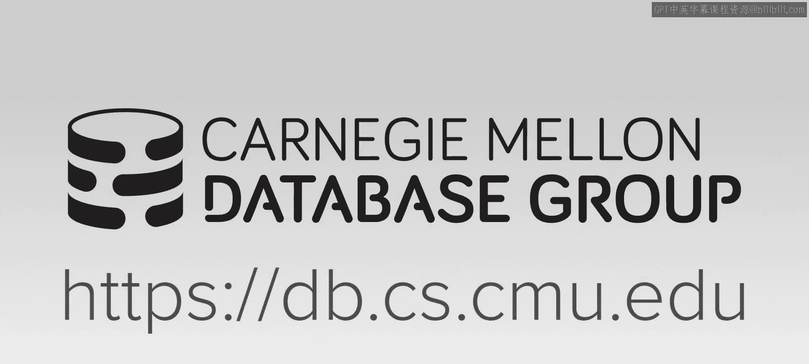
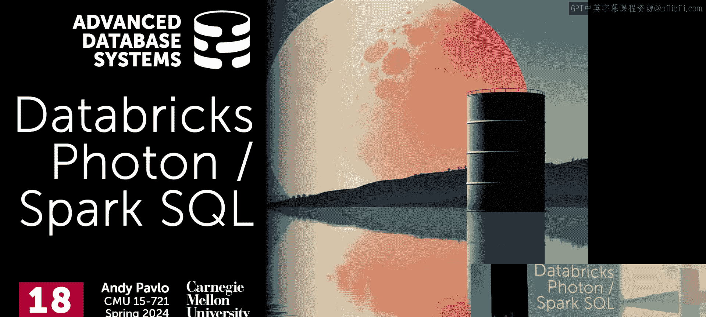

# 高级数据库系统：18：Databricks Photon 与 Spark SQL





在本节课中，我们将学习 Databricks Photon 系统，这是一个为加速 Spark SQL 而设计的向量化执行引擎。我们将回顾 Spark 的历史背景，理解其早期 SQL 支持（如 Shark）的局限性，并深入探讨 Photon 的设计目标、架构、关键优化技术（如表达式融合和自适应执行），以及它如何与 Spark 运行时集成。最后，我们会简要了解其他 Spark 加速方案和数据湖表格式（如 Delta Lake、Iceberg）如何改善查询优化。

---

## Spark 的历史背景与 SQL 支持演进

上一节我们讨论了 Dremel 的系统架构。本节中，我们来看看 Spark 的演进历程，这有助于理解 Photon 的设计动机。

Spark 起源于 2000 年代末，作为对 Hadoop MapReduce 模型的改进。它将计算与存储分离，并支持迭代算法。由于 Spark 使用 Scala 编写，因此运行在 Java 虚拟机（JVM）上。早期 Spark 仅支持基于弹性分布式数据集（RDD）的低级 API。

随着 Spark 的流行，用户开始要求 SQL 支持。最初的解决方案是 **Shark**，它复用了 Facebook Hive 的代码，将 SQL 查询转换为 Spark 程序。然而，这种方法存在限制：SQL 无法与 Spark API（如 Python 代码）灵活混合，且 Hive 的优化器是为 MapReduce 设计的，无法充分利用 Spark 更丰富的 API，导致生成的查询计划效率不高。

2015 年，Databricks 团队推出了 **Spark SQL**，实现了 SQL 与 Spark 运行时的原生集成。它引入了列式内存缓冲区、字典编码、位打包压缩等技术，并对 `WHERE` 子句进行了部分查询编译（将 Scala AST 编译为 JVM 字节码）。然而，Spark SQL 仍面临挑战：复杂的查询编译受限于 JVM，系统逐渐从 I/O 密集型变为 CPU 密集型，且需要大量工程工作来规避 JVM 垃圾回收和内存管理的开销。

## Photon 的设计目标与高层架构

上一节我们看到了 Spark SQL 的局限性。本节中，我们来看看 Databricks 如何通过 Photon 来解决这些问题。

Photon 不是一个独立系统，而是一个可以嵌入现有数据库系统（如 Spark 运行时）的库。它甚至比我们之前讨论的 Velox 更底层，提供的是细粒度的**算子内核**，而线程、内存管理等仍由上层运行时处理。

Photon 的核心设计目标如下：
*   **无缝集成**：与 Databricks 运行时（DBR）集成，无需重写现有基础设施。
*   **语义兼容**：完全支持 Spark SQL 和 DataFrame API 的语义，确保结果一致。
*   **性能透明**：对用户透明地加速查询，仅在支持的操作上启用加速。
*   **向量化执行**：将 Spark 运行时逐行处理的数据转换为列式或向量化处理，以提升性能。

其基本工作原理是：查询的某部分可以由 Photon 加速执行。如果某个算子没有对应的 Photon 加速实现，则自动回退到原有的 Spark SQL 慢速路径。通过 Java 本地接口（JNI）在 JVM 中调用 C++ 代码，调用开销与 C++ 虚函数查找相当。

Photon 的高层架构与 Dremel 类似：查询提交给**驱动器**（协调器），驱动器生成查询计划并调度任务到**执行器**。执行器从分布式文件系统读取数据，进行计算，并通过**洗牌**阶段将数据传递给下一阶段。Photon 的核心则运行在每个执行器内部。

## Photon 的核心执行模型

了解了 Photon 的整体定位后，本节我们深入其核心执行模型。

Photon 采用**基于拉取的向量化执行引擎**。它使用预编译的**算子内核**（或称**原语**）对数据向量执行小型计算任务。这些原语用 C++ 编写，并根据数据类型和操作进行模板化。

以下是 Photon 做出的一些关键工程决策：

**1. 选择向量化而非即时编译**
尽管 Spark SQL 已尝试过即时编译（JIT），但 Photon 团队选择了向量化模型（类似 VectorWise）。原因在于，维护和调试一个 JIT 引擎需要编写复杂的工具来定位由生成代码引发的崩溃，这需要高度专业化的工程师。而使用预编译的原语，虽然初始性能可能不如 JIT，但更易于开发、调试和团队协作，并能通过迭代达到接近甚至超越 JIT 的性能。

**2. 使用位置列表而非位图**
在向量化执行中，需要跟踪批次中哪些行是有效的。Photon 选择了**位置列表**（一个存储有效行偏移的向量），而非记录有效性的位图。论文指出，除极端情况外，位置列表性能更优。这一结论也被后续研究（包括 CMU 的工作）所证实。

**3. 表达式融合**
Photon 没有采用 Hyper 那样的**垂直融合**（将管道中的多个算子融合），因为这会使性能剖析和调试信息难以映射回用户可理解的查询计划。相反，它采用了**表达式融合**（或称水平融合）：在单个算子内部，将连续使用的多个原语融合成一个单一的原语。例如，一个检查日期范围的过滤器，可以将“大于等于”和“小于等于”两个原语融合为一个。Databricks 作为云服务商，可以分析所有查询日志，智能地决定哪些表达式需要融合。

**代码示例：表达式融合思想**
```sql
-- 原始查询片段
WHERE date_column >= ‘2023-01-01‘ AND date_column <= ‘2023-12-31‘
```
未融合时，需要分别调用两个比较原语，然后取交集。融合后，生成一个单一的原语直接执行整个范围检查。

## 内存管理与自适应执行

上一节介绍了 Photon 的核心执行策略。本节中，我们来看看它如何管理内存并适应动态变化的工作负载。

**内存管理**
Photon 本身不实现独立的内存管理器。它复用 Spark 现有的、基于 JVM 的内存管理器。Spark 的内存管理器分配内存块，并将指针传递给 Photon 的 C++ 代码使用。这样可以利用现有的内存分析基础设施。所有算子都支持**溢出到磁盘**的能力。当算子需要更多内存时，它会向内存管理器请求。内存管理器会找出当前占用内存最少的任务，要求其释放内存（可能涉及溢出到磁盘），然后将内存重新分配给请求的算子。

**自适应执行**
Photon 在两层上实现自适应：
*   **查询级自适应**：在洗牌阶段之间，根据收集到的统计数据（如数据分布），动态调整后续阶段的执行策略，例如在广播连接和洗牌连接之间切换，或调整执行器数量以处理数据倾斜。
*   **批次级自适应**：在算子内部处理单个数据批次时，根据实际数据特征动态选择最优的原语实现。例如：
    *   如果字符串列全是 ASCII 字符，则切换到更快的 ASCII 专用字符串函数。
    *   如果向量中无效行很多，则进行压缩，使有效数据更紧凑，提高缓存效率。
    *   利用原语的模板特性，如果已知某批次数据没有空值或所有行都有效，则调用无需进行相应检查的特化版本函数，消除分支预测开销。

**公式/代码示例：基于模板的原语优化**
```cpp
// 模板函数，根据编译时常量选择优化路径
template <bool has_nulls, bool has_active_rows>
void process_batch(...) {
    for (int i = 0; i < size; ++i) {
        // 编译时，如果 has_active_rows 为 false，此条件判断会被优化掉
        if (has_active_rows && !is_active(position_list[i])) continue;
        // 编译时，如果 has_nulls 为 false，此条件判断会被优化掉
        if (has_nulls && is_null(null_vector[i])) continue;
        // ... 实际处理逻辑
    }
}
// 运行时根据批次特征调用特化版本
if (batch_has_no_nulls && batch_all_active) {
    process_batch<false, false>(...);
}
```

**处理溢出分区**
与 Dremel 动态增加分区不同，Photon 采用另一种策略：它最初分配比预期更多的分区。当某些分区即将被填满时，系统会识别出未被充分利用的空闲分区，将溢出的数据重新导向这些空闲分区，从而实现动态平衡。

## 查询优化与集成

了解了执行引擎的细节后，本节我们看看 Photon 如何集成到 Spark 的查询优化流程中。

Spark SQL 使用名为 **Catalyst** 的级联优化器。由于数据湖环境中缺乏准确的统计信息，Catalyst 需要高度自适应。其独特之处在于，在生成物理计划后，还有一个**物理到物理**的转换阶段。

Photon 的集成正是在这个阶段完成的：
1.  Catalyst 先生成一个标准的 Spark SQL 物理计划。
2.  然后进行一个**自底向上**的额外遍历，识别其中哪些算子可以被 Photon 加速版本替换。
3.  替换时，一个关键目标是**最小化 JVM 与 C++ 代码之间的切换次数**。因此，优化器会尝试在查询计划底部形成尽可能长的、连续运行的 Photon 算子段。
4.  在 Java 与 C++ 边界处，需要**适配器**将行数据转换为列格式，以及**转换器**将结果转回 Java 期望的格式。这些操作涉及数据复制，应尽量减少。

## 性能、替代方案与数据湖演进

最后，我们来审视 Photon 的性能表现，看看市场上的其他替代方案，并了解数据湖表格式如何改善整体生态。

**性能表现**
根据论文，在 TPCH 3000GB 基准测试中，启用 Photon 后，查询性能获得显著提升，部分查询加速效果尤为明显。Databricks 也公布了其官方审计的 TPCDS 基准测试结果，并位居榜首。不过，需要注意的是，获取官方 TPC 审计是一项耗时的工作，其市场影响力如今已不如前。

**其他 Spark 加速方案**
Photon 是 Databricks 的专有技术。开源社区也有其他加速方案，但其集成方式通常与 Photon 不同：
*   **Apache Gluten**：将整个查询计划从 Spark 运行时卸载到其他后端执行引擎（如 Velox、ClickHouse）。
*   **NVIDIA RAPIDS**：利用 GPU 加速。
*   **Apple Comet**：基于 Data Fusion 执行引擎。
这些方案大多是“全有或全无”的卸载，而非像 Photon 那样进行细粒度的算子替换。

**数据湖表格式的作用**
数据湖的一个核心挑战是缺乏统计信息。**数据湖表格式**（如 Delta Lake、Apache Iceberg、Apache Hudi）的出现改善了这一点。它们充当了数据摄入与管理层：
*   在数据写入对象存储（如 S3）时，会将其转换为高效的列式格式（如 Parquet）。
*   在此过程中，系统可以收集并维护详细的表统计信息（如最小值、最大值、空值计数），并更新到元数据目录中。
*   查询引擎（如 Spark、Presto、Snowflake）在优化时，可以查询这些目录获取统计信息，从而生成更好的查询计划。
这为 Photon 这类引擎提供了更丰富的优化上下文。

---


本节课中，我们一起学习了 Databricks Photon。我们回顾了 Spark SQL 的发展及其面临的 JVM 瓶颈，深入探讨了 Photon 作为向量化加速库的设计哲学、其基于预编译原语和表达式融合的执行模型、巧妙的内存管理与多级自适应机制，以及它如何与 Catalyst 优化器集成。我们还看到了其他加速方案的不同思路，以及数据湖表格式如何为优化器提供关键统计信息。Photon 展示了如何在兼容庞大现有生态的前提下，通过精细化的工程实现性能突破。