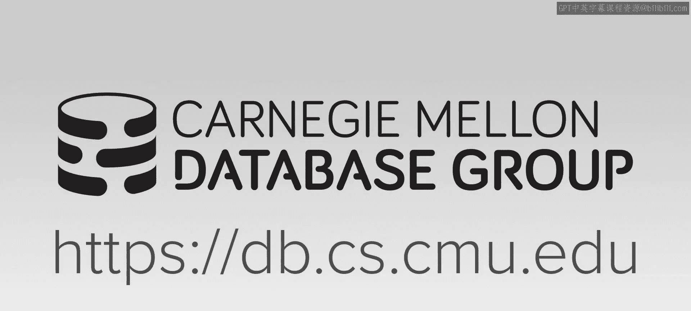
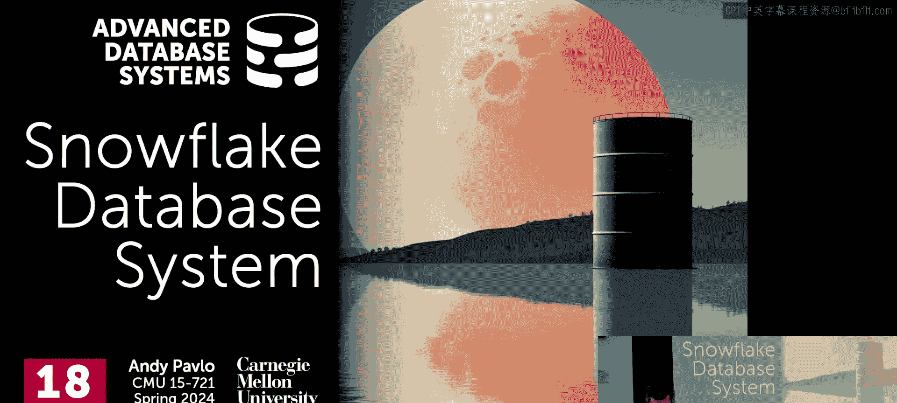
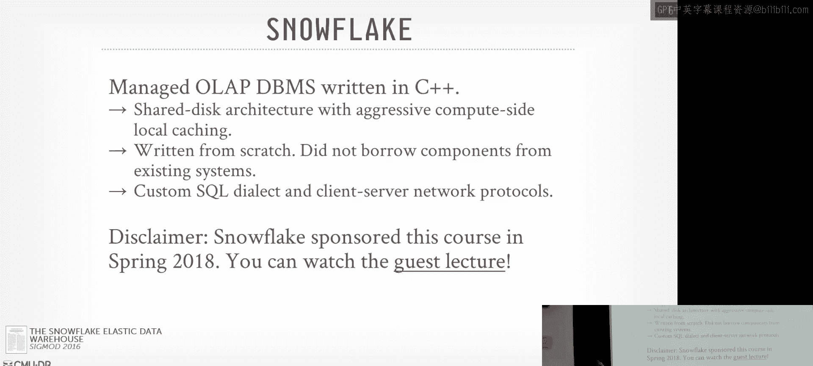
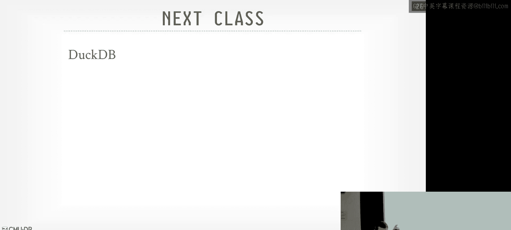

# CMU 高级数据库系统：19：Snowflake 数据仓库内部原理

## 概述
在本节课中，我们将深入探讨 Snowflake 数据仓库的内部架构与设计原理。Snowflake 是一个完全在云上运行的、托管式 OLAP 数据库系统，它实现了我们整个学期讨论的许多概念。我们将重点关注其独特的共享存储架构、向量化查询执行、计算层缓存策略以及查询优化技术。

---

## 课程管理与期末安排
在开始今天的讲座之前，先处理一些管理事务。项目的最终演示将安排在我们预定的期末考试时间进行，预计在周四上午 9 点开始。

书面期末考试将于 4 月 24 日发布。这不是关于特定论文的多选题考试，而是要求你们综合整个学期讨论的各种思想，并将其应用于新的场景。这是本课程希望你们掌握的核心能力。

期末考试允许使用 ChatGPT 等工具辅助作答，但直接复制提示或输出内容而不加检查将导致问题。去年我们设置了一个匿名 Google 表单，让学生告知是否使用了 ChatGPT，我会尝试猜测答案，这很有趣。

---

## 背景：Snowflake 诞生时的数据库格局
在深入 Snowflake 之前，有必要回顾一下它诞生时的数据库领域格局。

*   **2000年代**：出现了专为 OLAP 工作负载设计的专用系统，许多都采用了列式存储、数据压缩和向量化处理等思想。例如 Vertica、Greenplum、MonetDB 以及 ParAccel（后来成为 Amazon Redshift 的基础）。
*   **同时期**：Hadoop 变得流行，人们尝试在 HDFS 上存储大量数据，形成了早期的“数据湖”概念。出现了 Presto、Hive 等系统。
*   **当时的商业模式**：主要供应商的销售模式是让客户下载软件并在本地硬件上运行（On-Premise）。

2011年 Dremel 论文发表，展示了在云原生环境中构建系统、直接处理对象存储上文件的可行性。Facebook 在 2012 年开始构建 Presto。Amazon 在 2011 年获得了 ParAccel 的许可，并于 2013 年发布了 Redshift，比 Snowflake 早几个月面市。

大约在同一时间，硅谷风投公司 Sutter Hill 决定创建一个新的云原生数据库初创公司。他们汇集了来自 Oracle 的两位杰出工程师和来自 Vectorwise 的 Marcin Żukowski，投入大量资金，指示他们去构建一个云数据仓库，这就是 Snowflake 的起源。

---

## Snowflake 是什么？
Snowflake 是一个用 C++ 编写的、托管的 OLAP 数据库系统，**仅**在云上运行。这在十多年前是非同寻常的决策。他们决定从头开始编写一切，以实现完全控制。

其核心特点包括：
*   **共享存储架构**：类似于 Dremel。
*   **基于推送的向量化查询处理**：依赖于预编译的原语，类似于 Vectorwise。
*   **计算侧缓存**：在计算节点上进行积极的缓存，以减少从 S3 等对象存储读取数据的成本和延迟。
*   **独立的元数据**：将表数据与元数据分离。
*   **专有列式存储格式**：使用微分区（Micropartition）进行数据组织。
*   **Cascades 风格的查询优化器**：利用自适应优化技术。

---

## 整体架构
Snowflake 采用三层架构：

1.  **云服务层**：这是系统的前端，包含协调器、调度器、目录（Catalog）和查询优化器等所有组件。目录构建在 FoundationDB 之上，以提供事务语义。
2.  **计算层**：由“虚拟数据仓库”组成。用户指定计算容量，Snowflake 会分配相应数量的工作节点。每个工作节点是一个云实例（如 EC2），拥有本地 SSD 缓存，用于存储查询的中间结果和从持久存储读取的文件。
3.  **存储层**：使用云提供商的对象存储（如 S3、Azure Blob Storage）。最初只支持 S3，现在支持所有主流云存储。

**虚拟数据仓库**是核心计算抽象。传统模式下，一旦开启就会持续计费。2022年后，Snowflake 增加了无服务器部署支持，可以在不运行查询时自动缩减，但会收取溢价。

**工作节点与进程**：工作节点是云实例。当查询到达时，会在节点上启动一个新的工作进程来执行任务。查询结束后，进程终止。工作节点上的本地缓存使用一致性哈希来管理，以确定哪个节点负责缓存哪些持久化数据文件。

---

## 查询执行
Snowflake 采用基于推送的向量化执行模型，使用预编译的 C++ 模板原语。

*   **序列化/反序列化**：仅对节点间传输的数据进行代码生成（Codegen），以实现快速序列化/反序列化。
*   **Shuffle 策略**：与 Dremel 和 Spark 不同，Snowflake 没有显式的、集中式的 Shuffle 阶段。工作进程可以直接将数据推送给下一个需要处理的节点，或者本地继续处理。
*   **容错**：如果一个工作节点失败，Snowflake 通常会终止整个查询并重新开始，而不是尝试局部重试。这是因为查询通常运行很快，故障概率较低，增加复杂的容错机制会带来工程复杂性。
*   **工作窃取**：类似于 Morsel 驱动执行，空闲的工作进程可以从落后于进度的其他进程那里“窃取”任务。为了避免加重落后节点的负担，窃取任务的工作节点会直接从 S3 读取所需数据，而不是请求落后节点从其本地缓存发送。

---

## 弹性计算与查询结果缓存
Snowflake 支持一种称为“弹性计算”的优化。

*   **原理**：当系统识别出一个查询的某部分可能需要较长时间时，可以将这部分子计划的任务分配给其他客户闲置的计算节点（这些客户已付费但未使用）。
*   **执行**：在“借用”的节点上执行的任务，其输出会作为表写回 S3，而不是写入借用节点的本地磁盘（因为该节点随时可能被其所有者使用）。上层查询操作符像读取普通表一样从 S3 读取这些结果。
*   **优势**：查询运行更快，Snowflake 无需额外成本，闲置资源得到利用，对客户透明。
*   **缓存复用**：写入 S3 的中间结果可以更新到目录中，作为物化结果供后续查询复用。

---

## 存储与数据格式
Snowflake 最初使用其专有的列式存储格式。

*   **微分区**：数据被分割成微分区，类似于 Parquet 的行组。每个微分区压缩后大约 16MB。系统会在后台根据查询模式（如连接键、访问键）自动重组和排序微分区以优化性能。
*   **半结构化数据处理**：支持 `VARIANT`、`ARRAY`、`OBJECT` 类型来处理 JSON 等数据。与 Dremel（运行时识别）和 Photon（运行时自适应）不同，Snowflake 在**数据摄入时**尝试解析并推断数据类型，转换为内部二进制格式，同时保留原始字符串以备需要回退。
*   **外部表支持**：随着数据湖概念发展，Snowflake 增加了对 Parquet、ORC、Apache Iceberg 等开放文件格式的支持，通过“外部表”功能进行查询。
*   **混合表**：2022年推出的 Unistore 服务支持事务性工作负载。数据以行式格式写入日志，后台转换为列式存储，为 OLTP 和 OLAP 查询提供统一视图。

---

## 一致性哈希与缓存管理
Snowflake 使用一致性哈希来组织系统，确定哪个工作节点是某个表微分区文件的“所有者”。

*   **优势**：当添加或移除计算节点时，只需移动少量文件，无需全局重新洗牌数据。这有利于快速弹性伸缩。
*   **缓存策略**：工作节点优先在其本地 SSD 缓存中保存查询的**中间结果**，因为这对查询性能至关重要。对于持久化文件，则使用 LRU 等策略管理。缓存已满时，中间结果可以溢出到 S3。

---

## 查询优化器
Snowflake 的查询优化器是 Cascades 风格的自顶向下优化器，他们称之为“编译器”。

*   **统计信息**：对于其专有格式的数据，会收集分区级别的简单统计信息（如区域映射 Zone Map，即 Min-Max），但不维护直方图或草图。对于外部表，统计信息可能更少或没有。
*   **运行时自适应**：严重依赖运行时自适应来调整查询计划。优化器会注入一些默认禁用的特殊操作符（如下推聚合），当运行时触发器检测到数据量超过预期时，再启用它们。
*   **表达式评估**：优化器需要评估谓词表达式以决定能否剪裁微分区。Snowflake 尝试复用运行时表达式评估的代码库，以便在优化器内部也能以相同语义推理复杂表达式，而无需实际执行查询。
*   **聚合下推优化**：这是一个重点优化。在确定连接顺序后，优化器会判断是否可以将聚合操作下推到连接之下，先在扫描侧进行部分聚合，减少连接的数据量。这通过注入可动态启用的下推聚合操作符来实现。

---

## 性能基准争议
2021年，Databricks 发布博客，宣称其 Photon 引擎在 TPCDS 基准测试中击败了 Snowflake，并附上了对比图表。

Snowflake 很快回应，指责 Databricks 的测试方法不当，例如使用了 Snowflake 的企业版但未启用企业级功能，且测试的是经过其专有格式优化预处理的数据，而非原始数据。

Databricks 则反驳称，TPCDS 规范要求包含数据准备时间，而 Snowflake 展示的优异性能依赖于其专有格式的预处理，如果使用原始文件，性能会如他们所示。这场争论凸显了不同系统设计哲学（专有优化存储 vs. 开放数据湖查询）和基准测试方法论的差异。

---

## 总结
本节课我们一起深入学习了 Snowflake 数据仓库系统的内部原理。作为最早商业化的云原生、存储计算分离的 OLAP 系统之一，Snowflake 的创新之处在于其三层架构、虚拟数据仓库抽象、基于一致性哈希的缓存管理、专为云设计的弹性计算与工作窃取机制，以及在查询优化和半结构化数据处理上的独特方法。

尽管其设计始于十多年前，并且如今核心的向量化引擎已趋于 commoditized，但 Snowflake 通过其生态系统（如 Snowpark、Snowpipe）、对开放格式的支持以及向混合事务/分析负载的扩展，持续保持其竞争力。它展示了如何将学术思想（如 Dremel）成功转化为商业产品，并深刻影响了现代数据仓库和云数据库的发展方向。