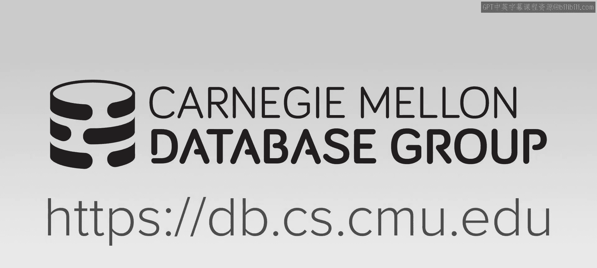
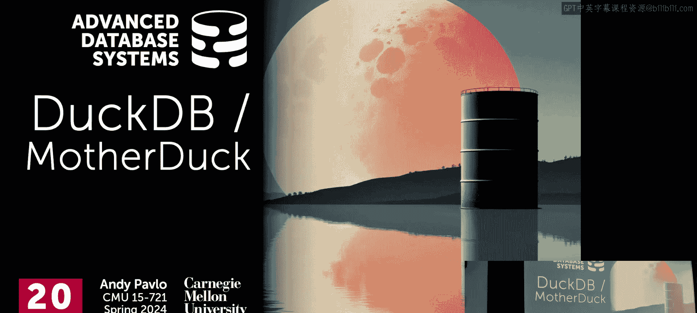
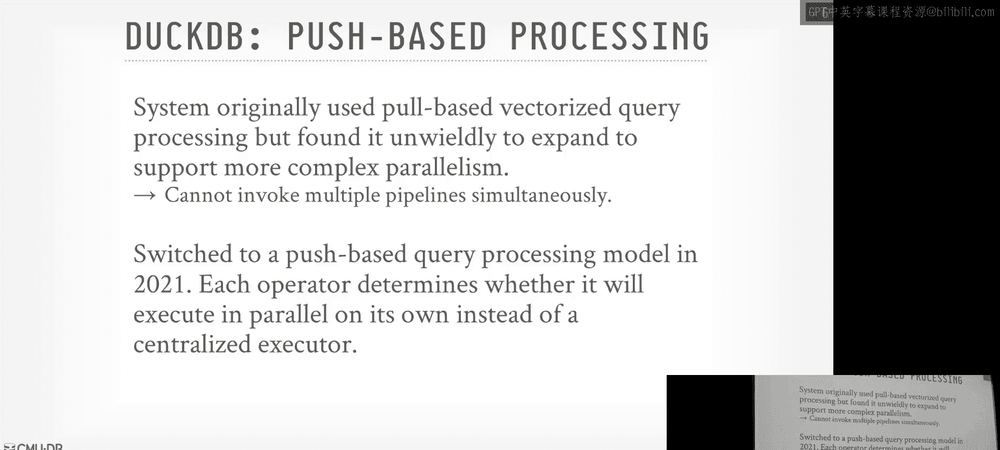
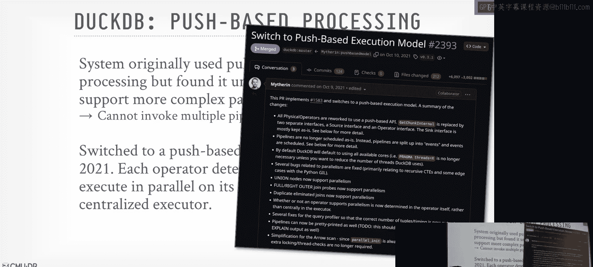
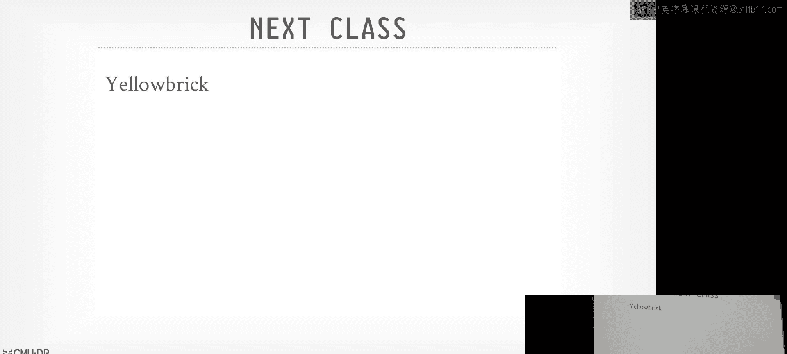
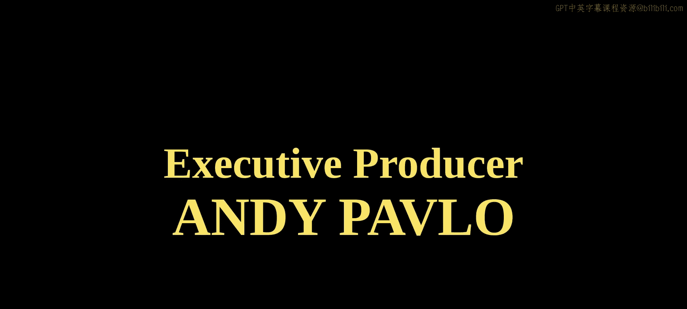

# CMU《高级数据库系统｜CMU Advanced Database Systems (15-721 Spring 2024)》中英字幕（豆包翻译） p20 -20-S2024 #20 - DuckDB Embedded Database System .zh_en -BV1HZ421N7WZ_p20-

🎼Carnegie Mellon University's advanced database systems course is filmed in front of a live studio audience。

😊。

🎼。🎼他。🎼Let's to the discussion today on DDB and again， as I said last time。

 this this is a lot different than all the other systems that we've been talking about。

 at least in the last week or so because all of those are these giant distributed or warehouses running in the cloud and then now how you got to read a paper about DDB wants to run on a single node。

 but we'll talk about Mother Duck at the end， how they not necessarily go distributed。

 meaning fanning out， scaling out the queries themselves cells。

 but at least now be able to leverage cloud compute infrastructure for query execution。

 but we'll see that at the end。

I said last class， we were talking about the Smith like Gator warehouse。 And as I said。

 this was along with Drremo， so that one of the first。

This is what I call classical cloud native O lab engine that did all the various things we talk about through the entire semester like precomp primitives pushbased execution separatepar in computing storage all those nice things And so this showed up actually。

 I think yesterday， which I think works just looking at because I think somebody else asking me like okay all these systems at a high the look of the same。

 how do you pick them So data engineering subredit is's actually really good。

 because there's people actually using the systems I'm talking about like the pros and cons of them。

 So I highly recommend it。 And so somebody is asking， hey。

 how do I pick between snowflake Databricks， BigQury and Redshift。

 We haven't talk about Redshift yet， that'll be next week。 And this basically says like hey。

 don't worry about the native good details。 the way to really think about whether you one system another is first of all。

 what cloud are you already running if you're already running on GCP or Google。

 then just use BigQury。 if you're already running on A。

 you could probably just use Redshift otherwise And then if you're already using Spk。😊。

Use databricks。 And then if you have a lot of money， I'm looking for a good time。

 then that's snowflake。And I would say that's one of the differentiators。

 I think that snowflake has done really well that separates them from the other systems is just that the user experience is much。

 much better and cleaner than these other cloud systems so even though again the core architecture might still be the same underneath the covers at a high level based on the things that we talked about as I said before。

 the user experience is going to la matter a lot and also how good the query optimizer is。

Is there like no tuning in snow？His question is as there's no tuning something， yeah，'。

 they don't expose really any novel。 You can't even do cur plan hints。

I think there's one knob you can jack up with the compute size。

You can turn off auto scaling as it's like， I think there's three things。 Now， that doesn't mean in。

 in the actual implementation itself， there aren't a bunch of other knobs。 And they told me this。

 They're like， yeah， we have hundreds of knobs on the inside。 They don't expose them to the users。

 So then typically， what happens is。They said if somebody calls a sales engineer。

 says my query is running slow， the sales engineer can then get in touch or the customer service can get in touch with a database system engineer。

 and then they'll recommend like， hey， tune these three，4 nobs for this one particular customer。

RightBut it's very ad hoc at least this is what they told me a few years ago。

 So underneath the covers there's all the tuning knobs that they would expect。

 but they' to make it your life easier as the user of it， they don't expose it to you。

So how are they actually tuning it themselves， it must be really hard to do that。

The question is how are they actually tuning it themselves。

 What do you mean like how are they tuning themselves and So their sort of design philosophy would be like you want things to be adaptive？

So。Again， it's hard to quantify this， say how much it is actually adaptive。

 But you can think about it like。Instead of being lazy， not lazy in not the right word。

 but instead of saying， okay， here's some， some value for a knob I need to know about how to set correctly for the workload。

Instead of just saying， all right， well what's a pound to， somebody else has set it for me。

 you could， there's ways to make try to make things adaptive， it's more engineering certainly。

 but it makes you more robust， yes。Fridship， not a positive experience。The question is。

 why is Redshshift not a positive experience？嗯。We'll come into that next week。IAgain。

 I think there's nothing particularly wrong with the architecture itself because they fixed a lot of it。

Again， it's the user experience。 And that's hard to quantify， right？ It could be like， okay。

 my query went slow。 I writing the right tools for me to figure out why it ran slow。 Or is it。

 you know， how stable is the system in terms of performance。 I run the query today I run it tomorrow。

 And like it's an order magnitude to difference of performance like。😊。

You know is that what people seeing， Okay， this is purely anecdotal， right？

I just thought thought it was an interesting quip， and like I said， the data engineering。

 this is where you see a lot of people with the sort of bleeding edge talking about health and using these systems and also the ecosystems around it like airflow。

 DBT and things like that and how they integrate with these cloud vendors。Okay。All right。

 so for today's discussion， we needed to sort go back a time just a little bit to talk about what led to the creation of DDB and you actually already read one of the papers that was a precursor or a catalyst for what set off the development ofductDB and that was the networking paper like don't hold my data hostage and that paper came out of this project they were building at CwiI to make an embedded version of MoadDB called MoDB light。

 basically MoDB again was one of these early column store systems at academia at a CWI that then it was open source that people actually using but it was like was like a post Postgss or any other sort of share everything system。

 you had to prop put up configure it set up and it would connect to it through JDBC over the network。

And so what they were trying to do was to make it faster or easier for data scientists to use a database system inside of like Python pandas or R。

 I think this explicitly for R they were doing this。

 they tried to make an em embedded version that ran in process。

We haven't really talked about what an embedded database system looks like， but basically。It's。

 you know，s there's no main function like you would starting like Postgres or MySQL。 It's running。

 it only runs whenever the the hosting app process then invokes insight down into it。

Now it can spin up its own threads in the background and do other stuff。

 but it's not something you would just start like as a demon on your server and just run all the time。

So they were trying to make this run directly inside of the R runtime or Pan's runtime。

 and they were trying to reduce the cost of going back and forth between the R L infrastructure and the database system。

😡，Because typically very often help data scientists use databases is they just grab a giant CSV or parquet file or whatever from the server itself。

 bring that down to your local laptop and do all the crunching on that。

 And so they're not leveraging the database system to do all the fast calculations and stuff that we know how to do really well。

 they're basically rolling all that crap themselves inside of their set of user code。

Ps is in particular known to be very swift or fast。

So that was the goal they're trying to have a embedded version of MoV light that got all the advantage of the column store that would expose that to the data scientists。

 but the problem motivated to me， at this point， it was 15。

 20 years old and it had too much sort of legacy infrastructure and legacy code that it was too much to rip things out and strip it down to get it to be a more simplistic package that again you could then embed。

So that's what LED the CedI researchers to develop Dy B。 Right， It's basically the time the the。

Their efforts that they took for the moon to be light。

 they learned a bunch of lessons from that and said， okay， we。

 we should build a system from scratch specifically designed from the beginning to be embedded inside of you know。

 other applications。So。You could call this an embedded data system。

 sometimes it's called it in process， you could technically call it serverless， because again。

 it's not a demon that's always running， but the idea is that they're trying to be provide a fast SQL execution engine on any possible data file you could find that you possibly want to query。

RightAgain， this is sort of the same idea the Dremel。

 they want to be able to take any data file that someone may have in their object store and you want to run queries real fast on it。

So there' the SQL dialect search support is based on Postgres。

 They did what we did in our early system， we took the Postgres grammar file and just embedded that inside of our system。

 but then over the years what I've liked is that。Well， this is how you get。

 why there isn't a single SQL standard， they've added some nice quality of life enhancements that are specific to DDB。

Like you just type from and then the table name that does the same thing as the select star。

 things like that。And the pitch， which I think is fantastic from a marketing standpoint to really understand what DDB is trying to be is it's trying to be the SL light for analytics。

 by SGgel light is the most widely deployed embedded database system it's on all your phones in your laptops right here right now。

 it's running satellites and space， it's in every plane that it's designed to do transactions。

And so they wanted to sort of have the same ubiquity of SQL light。

 the proliferation of it being used by everyone， but specifically for doing fast analytics。

 Now Jgnesh has a paper with his students I think came out two or three years ago。

 they've added some enhancement to SQL light to improve the its support to do analytics。

 but I don't think it comes close to what DDB can do。

So another important design decision in terms of the implementation of it is that it's all gonna be custom C plus plus code that they've written forductDP。

 So that means they're going try to avoid bringing in third party dependencies when necessary。

 I think for encryption， SSL stuff like that stuff you want to bring and you don't want to write that yourself。

 But like a bunch of other stuff， they're not going to rely on third party packages or libraries。

 they're going to write everything themselves。And this is going to make the system more lightweight。

 easier to manage from the engineering side of things。

 and you have the additional capability of like now because it's all C P plus code that you wrote and not some weird party third party library。

 they can actually compile out it on the WasM and can run in your browser very easily。

There's been attempts to get like Sgel light and actually， seagel light will run them wasom。

 people would try to get postcard run wm。 And it always always seems like a huge hack to get that to work。

 whereasas in productive， it's quite simple。😊，And so the way they're going to be able to expand what the system can actually do beyond the sort of core runtime engine。

 they're going to rely heavily on a extension ecosystem we'll talk about in a second。

 And so they'll have like the official ones that they support。

 but also you can download arbitrary ones and install them。And and again。

 that makes the core engine lightweight and easier for them to manage。So again。

 like we talked a little bit about when we talked about photon， like the design philosophy of like。

 okay， they had to maintain all the spark Java crap and they would to avoid Java。

 So photon was a supposed engine that they invoked down through J and I。

 by what exactly we mean are we like Lada function reason Yeah。

 so server would be like a Lada function， meaning like the process goes away when like if nothing is actually using it。

It's not so。Embbedded， I think embedded is a better one。 Like embedded is sort of the same idea。

 Like there has to be some other process already running that then links into the data system。

 And then it is。I don't think you hand it threads the way you do in single light。

 I think you spin up its own threads， but it's all within the same address space as the host process。

It's like a library， yes， it's a library， yes。Al right。

 so here's at high level what the the major features that are in inductD B。 And again。

 the number one difference at the top is going to be that it's shared everything versus all the shared disk or disaggregated storage stuff we talked about before because again。

 it's an embedded database system。 it has no notion of a separating computing and storage。 I mean。

 you'll see they can use extensions to talk to the cloud platforms and so forth。 but the。

You know at its core， it is sort of just like just just the query engine。

 not to to too because they new transactions， they have their own file format but again。

 it's not the like scaled out architecture that we saw in Dremmel and others。Their new pushb。

 vectorized query processing， we'll spend most of our time talking about this because they actually started doing pool based and then they switched over two years ago。

 three years ago to pushbase， and they talk about all of the challenges they face scaling out a pool based model and why switching to a pushpa1 was better。

Again， given the provenance of coming from CwiI， where vectorctor Y was invented。

 they're going to be preco primitives，s not a surprise。

 They use a solid MCC that's actually based on what the Germans do in Ura or sorry in hyper。

 we're not going to cover this paper， but actually a lot of these are based on what the Germans did。

 some ways you say like they literally just took the papers and we implemented the stuff all the papers we talked about today。

 For example， they're doing morsels。 They're going to do the un nesting arbitrary subqueries。

 They're the only database system other than hyper andumbra that can do this。Yes。

Why would you want more so peism for something that？Like on it。PaSo question。

 why would you want more so parallelism if you if you intend to be running on a pizza box。

 but a pizza box with nowadays has a shit little cord， right。When it's a pizza box， I mean。

 like one unit rack unit， you can put like multiple sockets in those things。😡，Or even， the AMD。

 the rise the latest one， it's a ton of cores， the thread I forgot the exact number now。

You can get a ton of cores。So why wouldn't you want to use them？😡，Specifically it's like not new。

So it's just like all the cores are on the same software。Actually。

 I don't know whether this is actually new moreware。 I don't。 The paper doesn't say。But， I imagine。

It's not hard to figure that out， right， they also tell you。um。Like seaequL light is again。

 I would say， seaequL light really was designed to run on like a one core very permanent CPU。

 like from the mid 2000s。Theres a。Even more stripped down data assessment called extreme DB that's running on like SOCs in like missiles and shit like that where you don't even have an operating system so the system be more like low level than that SQL lights a little bit more and in that case。

QL SQL light can't do parallel  query execution like whatever thread makes the SQL request。

 that's the one that runs it， I'm fairly certain whereas induct DB。

 like one thread would make the request， but then if you tell it how many threads you' spread the  query across and they use mores to do that schedule。

嗯。Right， so the PA stuff that we've covered that many， many times。

 the sort merges joint and hash joins， and then the stratified query optimizeizer is looks very similar to what we talk about Forgan you're running on arbitrary files that you may not have any statistics for。

So they're using a bunch of rules to figure out some basic joint note or heuristics or things like that。

But the one thing they do well is the un nestesting arbitrary subqueries。They didn't support。

 they didn't support uning arbitrary subqueries for lateral joints。 as I said last year in 721。

 the students actually did that like Sam Arch， the Ph student here they got that merge in aductV so they can handle all possible subqueries now。

All right，So we're to spend most of our time talking about the pushb architecture because they're going to talk about it's public about actually how they're going to pass data between the operators。

 which is something we haven't really discussed。So as I mentioned。

 the original version of DuckDB prior to 2021 was using a pool based vectorized execution model with again。

 precomp primitives。嗯。But then over the years， they found that it was turned out to be cumbersome to maintain and work on because every single time that you wanted to add a new operator and make it parallel。

 you had to sort of modify this control plane piece to say。

 okay here's this parallel thing we can we can outrun。

 it was more infrastructure that they had to maintain every single time to added something new。

The other challenge they had is that。Because now， since they want to be able to support reading data from not necessarily local disk。

 right， a remote file system， they can support H TPS or S3 and so forth。

 Now you have this challenge where some pipeline may be blocked because it's getting data over the network。

 but there are other pipelines you could start running。Because they don't need to wait for that data。

 But if you do a poolbased model， like the volcano approach， where you're calling get next。

 get next connects， the call stack down between in the query plan。

 that's essentially the state of where things are being executed。

 So if you reach the bottom to a leaf node and and that leaf node wants to go get remote data。

 you have no way to like pause it， unwind it， go back up the stack and then maybe call down another pipeline。

Basically the control flow of the execution of the query plan is implicitly within those that call stack。

And so if they switch you a pushb model， then now you have this centralized scheduler using morsels that can say are these are the pipelines or tasks that I can run right now。

 go ahead and run them， and here's the ones where I know I'm waiting for IO for whatever reason and maybe me pause them and wait。

So for them， they found out it was not just in terms of performance。

 but in terms of the engineering of not assuming that data is always readily available。

 switching to a push based model turned to be a much better approach for them。

And the great thing about it is you can read the actual PR or Mark， the co creators of it， added。

 you， added the push base model and now talks about know all the great things they were able to achieve with it。

Right。What's wrong？Was that？Yeah， I mean because they ripped out all the pull based stuff and switched to a push based stuff。

こビ。哎。Anyway， it's probably a bunch of view。There's other that just didn it pull at once。

They played it all at once。MarMar's amazing。 is like like， I think this point， 2021。

 I think he just stole postdoc。Right， the， the Dutch model is kind of weird as a teacher student。

 like there， like C C WY is not a university。 It's like a。

Like a research consortium of a bunch of other universities。

 So technically all the people there like Peter Bonds， Hans， well， Martin， he died。

 but like they were had affiliations with other universities。

 but like they didn't teach classes really and they just wrote code at CWY， right。again。

 this is one of the the pros and cons of like the American， you。

 the academic model versus like the European one， like in case of German， the German the Germans。

 like they get six free PG students a year。Right， yeah。Each PC student here cost me $125，000 a year。

RightSo they're getting a ton of money and their top student centers can write a ton of code for them。

 whereas it's hard to scale at the same sort of level。嗯。

And I said CWI same sort of thing Mark just basically wrote code full time on DDB。

 so it doesn't surprise me that he did this entire PR。It means he's also very smart。 It's not like。

 you know。I'm not surprised that he did it。 Just been saying like he had the opportunity to do this。

 The though he was a P student。

O。So because now they switch to a pushb model， they talk about how this opens up a bunch of opportunities to do additional optimizations that you would be very difficult to do again in a pool based model again some of these I think we talked about。

 but not all of them。So the first one is that because now you have explicit control of when you can basically pause a。

A pipeline， right if， if you， if you， since all the tasks are in the centralized schedule or cable。

 if you will， or list， you say， okay， well， this thing is going too fast or going too slow。

 let me just prevent any， any more tasks for that pipeline from from executing。

So you can do things like if I。If I if my scans running't too fast。

 actually that that's back pressure。 But like you could do things like if my scan is producing not a lot of data as it's going up rather than having the the filter send up a bunch of data that's not。

on half empty or semifo vectors， you basically pause things。

 have it buffer the output between the filter and the aggregate。 and then when that fills up。

 then you can say， okay now you can start executing again。Right。

We talked a little bit about media relaxed operator fusion。

 We talked about vectorization and query compilation。

 This is a paper that we wrote where in order to maximize the vectorization between operators in a pushb model。

 you have a little buffer in between。 So they can introduce that。

 but then not just fill it up and then pass it along。 They can say， okay， well。

 this thing's not not full yet。 You're allowed to keep executing or it is full。

 Let me go ahead and pause you。😊，They can also do scan sharing because all the query plans are dags so you could have a you have your scan。

 start producing results， fill up some buffers that you can then reuse for maybe this parent operator and this parent operator again in a poolbased model if you're calling get next get next every child has to have one parent So how do how you pass along that information。

 it would have to be this weird sideways information passing。 So in this case here。

 they just fill the buffer up and say， okay， well the buffer's fool。

 this parent task can run okay before I throw away the intermediate result from this child and they go invoke the other one And again through the centralized coordinator you can turn these things on and off as needed。

RightAnd then the last one is。If you recognize that the the。

The operators on the top of the query plan can't consume or process the data you're passing up as quickly as possible。

 you can just pause things so you can introduce a buffer here it says okay。

 when this thing gets0 more than 10 mebytes， even though I have more memory I could keep going rather than let thing balloon indefinitely。

 I just can pause the whole pipeline and don't let any more tasks execute for it。

The other one that also super useful is because again you're reading remote data like over HTTP。

 instead of having like this entire task just paused while the thread being blocked while you're fetching this。

 you do the background IO， fill out some buffer， and then when the data is available。

 then you can kick off the execution again。Again， think about how you would do that with get next like I would have to have I call get next down in here。

 they make a remote call at HTP to go get some data， and then I need a way to go back up and say。

 okay I don't have the data you're looking for， but call me back again when it's actually available。

 you have to make another get next call it gets really awkward and weird whereas the push based model because now the control flow and the data flow are separate this makes us all much easier to do。

The next thing that's interesting is how they what their intermediate result vectors look like so theres there's the data obviously on disk we'll talk about in a second like that's going to be more heavily compressed because you want to reduce the size of the data itself but once everything's in memory when you're going from one operator to the next。

 they want to do a lightweight encoding similar to what we talked about before to pass data from one operator to the next。

And they're basically going to have four vector types that are specialized。

 or three of them are specialized to different types of data。So without any compression。

 they call the vector uncompressed or flat， and it's just the listing and columnar order of the values。

But if they recognize that within the vector you're passing along。

 it only has one value rather than passing that repeated value over and over again。

 they can have what's called a constant vector， and just a single value says this entire vector has 100 tuupples and they all have one single value。

They have a dictionary vector like we talked about before。

 the selection vector just says what offset in the dictionary corresponds to the data you're looking for？

And they have what they call as a sequence vector。This is basically some variation of。

 of a special case of Delta encoding where you have the starting value is the base。

 And then you just say for every single value that comes after that， incremented by by this amount。

 So you have like a。Sometimes you have auto increment keys as the primary key for a column。

 or like a sequence， it's like 12，3，4，5，6，7，8，910， if you recognize that you just need to store two values to say。

 here's the base and here's how it' being incremented。So again。

 they'll figure this out on the fly while you're actually processing the data like between one up to the next。

 which of these versions you can use， and then the default is always fall back to flat because it's just the simplest one。

So they actually in memory layout is they actually design this in conjunction with Velloox。

 so they're actually compatible with the vectors that Vlocox passes around。

 and again at a high level it smells like arrow， but my understanding it's not exactly completely 100 but the memory layout isn't 100% compatible。

So now the challenge， though， is that because it's a pre compilelied primitives。

If you have all these different variations of these different vector types for all the possible combinations of data types you could have。

 now you have this combator an explosion of the number of possible primitives you would actually need。

 and even if you template it everything， now this is going to balloon up your code base when it gets compiled。

 which makes compilation slower， but also expands the size of the code in memory。

ItMakes the process more heavier。So what they want to do for three of these vector types is that they want to get them into what they call unified format。

Where there is a now you have a single primitive that knows how to do whatever processing you need one that。

Or in that data without having to do any conversion or memory copying。So for the flat one。

 it's super easy because it's just exactly the same。

 but then now they're going to add the selection vector just to say here's the data and then for here's the offset that corresponds to the data the tu that offset matches for。

Right， now looks a lot like dictionary encoding。 So this is actually how。

 how they'll represent things in memory and pass things along。

 And then now they don't have to decode it if if， you know。

 they're matching up like against another dictionary one for constant same thing， right。

 it's basically dictionary encoding。 I have。That's backwards， sorry。Yeah， sorry。 That's constant。

 But the constant  one， again， is just， I had a single value as my data as。

 as as if it was a dictionary。 And then here's the selection vector。

 which is all theres because they're all pulling to the same one。 And then the dictionary  one。

 it's basically the same thing。So again， like even though they have different compression schemes for for these three different vector types。

 the sequence ones， I think they always have to unroll into the flat one。

 but it all this looks the same now， then you have a primitive that operates exactly on this data and you don't have to do any extra memory copying and you get the benefit of like。

 if it's constant， know you're passing along less data than before。

So this is what they call theified unified vector format。

 and again this is for the8 results that are going from one operator to the next。But the。

 I think they have to unroll it。But that might be a year out of a date， I haven't looked。

So the other interesting that we're talking aboutductD B。

 the way I haven't really talked about before is how they can work with this。

 the nonsco ecosystem that data scientists are coming using。And so， you know。

 if you of Python pandas， people are operating on data frames and they。

 data frames provides this API to do the manipulations， but at a high level。

 it basically looks like relational algebra。And so what they want to be able to do is for people that can link in or instantiate DDB within their Python or R program。

rite to some common API based on data frames and then have that get translated into the corresponding SQL command that can then retrieve the data that you're looking for。

And so they support two different libraries， one for R， one for Python。

 one's called DPlier Pyr and they'll called Ibis， Ibis was developed by the guy that invented Apache Ar。

 I forget where DPlier came from has anybody ever heard of these before or now no I can show you what it looks like。

Com。But basically， it's a， again， it's a。It looks like if youve ever used like Sp Piparks。

 and things like that， it's going to have APIs that manipulate data frames like this， right。

And sort of like that。 see fashion things get the head， right。 And then this is the output。 So again。

 it's like a procedural language to manipulate data frames。

 which are just basically relations or tables in the database。um。And then a deep per。Sorry。

What's wrong， Yes， something that is built on top of the Apache era？actually area integrated。

His question is， is data frames what first Apachearrow some？So data frames came came from pandas。

I think。And the guy that invented a panda has also then an arrow。 Yes， that's the connection there。

 But like the idea， like through like the panda's API or Py or Ibis， like you can。

 you can manipulate what you think are data frames and memory。That could be though。

 in the Apache arrow format。Because the whole point is like like again。

 going back to that paper you guys read， don't hold my data hostage like they make a big deal like okay。

 well， if you just use JBC to go run some query on a database， you're gonna get back a bunch of rows。

 And then if you're using like pandas or some Python program， then that's got to then do a pivot。

 convert it now to a column store。 So what you really want to be to do is hand things off as arrow。

 And then now your your Python code or R code can manipulate directly on the arrow buffers。

Even though you're still operating on the data frame API。So that's the idea with these integrations。

I mean the deep pilot one has it。First quarter on， you see they have these basic primitives。

And then they have different backends， and then here's the one for DDB。

 right D replacement for Dpir that use the same API。

 But what's going to happen is when I write code against this thing。

 it's actually not going to generate SQL。Where is something to look at？Yeah， here。

And that's the data frame here's query so here's some query here there more or less looks like some bastardized version of SQL。

 which is instead of where calls it's called filter it right instead of average it called mean。

 but at a high level this basically looks like SQL and so what these integrations do with DDB is that instead of converting these commands into SQL。

The the the library will convert this action to a logical plan of the internal representation that thatductDB has for queries。

And then as if it got parsed from the SQL from the command line or whatever。

 and then it hands that off now to the optimizer who can then convert that to the physical plan。

Dd is， do people hate writing SQL that much？You're talking the wrong， dude。So， I mean。Yeah。

 so so it's， it's。Symtry we saw with UD S， right， There' are certain things that are hard to express in。

 in SQL。 Yeah， but like， yeah， so like。There's a lot of data scientists that prefer to use pandas。

And， and Python APIs and Python notebooks。 And certainly for some things， like。

 it doesn't make sense to run them in the database。 like， if you're gonna it Pytorrch stuff。Like。

 it may not make make sense to have that run。 The database system could run that locally or farmer down to。

 to。嗯。To like spark。 And actually， that's one of the， one of the。

One of the advantages of like databricks。Snowflake has has snowpar。

 I forget what the Google one is like this， this， this single environment where you could do run your SQL query on like the O lab engine。

 plus also run like scale out machine learning jobs all together instead of one one interface。

 That's， that's very common now。 But it's also very common like。😊。

if you're running a one off experiments， just to download the whole file locally。

 crunchn on it using Python and then maybe upload the results or hands off to somebody else。

The idea here is now， like， instead of having。Like the panda's runtime is actually very slow。

But so now if you want to manipulate data frames， if you put your data in like parquet files。

 then let DDB do the crunching of those parquet files instead of pan as itself。

 you get all the advantages of a modern OAP system that we've talked about in entire semester directly in your Python notebook。

So that's the idea here。😡，Right。And again， it the zero copy is， is the big idea。

 This is what Apache arrow sort of。This is what was the original foundation or the motivation of Apache E that you could pass around data between disparate applications running the same address space without having to do serialization or desilization。

But now， as I said， it's basically being used as the transport。

Protocol or format between different nodes running in a system。Right。So but in this case here。

 DDB is in process， you can get data in and out ofductDB back and forth between DDB and Python R through these different APIs through all Apachearrow。

Because again， same dress base， if I malloc in DDB and hand you some buffer。You know， how actually。

Keep track of who has to free it。 That's all that's a separate thing。 But like， I don't have to。

me copy to be able to manipulate it in Python。DuckDB also supports the execution of substrate plans as well。

 But I think that's done through， that's done through an extension。

So I think you can take a substrate serialized plant and then hand of the Dy bee just as if it was a logical plant generated by one of these guys。

 and then it'll convert it to its physical plant that it can then execute。嗯。

So this I mean it kind of goes back to the very beginning we were talking about before that Reditpost。

 like quality of life things or like the ease of use。

 like if I have a bunch of Python notebooks and I want to use some data that I have stored out in my object store。

 but I want to be to run them look at OAP engine or something like that。If I can reduce the friction。

 how much manipulation I have to do for this existing code then that's a better user experience。

 I that of saying， okay， rewrite all your Python stuff to SQL， like no one's gonna do that。Willingly。

All right。I've already been into multiple times that like DD B does support reading a bunch of different file formats that we we've covered。

 but it also has its own proprietary custom file format similar to like， you know， if you create。

 know， open up SQL light and you call create table。 It'll write out like a dot D B do SQL light file。

 You'll get the same thing。 D D B has its own proprietary file format。 It's meant to run is a single。

 generate everything is a single file。 Now， when you do updates on it just like a SQL light。

 they'll maintain a。😊，I'll maintain a right ahead log as a separate file and for temp files or temp data that'll get spelled through separate files as well。

 but the core database itself that you attach to is always mean a single file。

So no surprise there's going to be packs that a row group is set to be 120，000 tuples。

And the important thing to understand is that they're going to be more aggressive with the compression schemes that they're going to use when it goes to disk versus when it's in memory in particular。

 they're going to do bit packing or the frame of reference optimizations that we talked about before。

So when you actually start writing data at the disk。

 doing much inserts are copying into DDB that then writes out to the database。

 they're going do something sort of similar we all with better blocks where they'll have a sort of initial pass to look at the data。

 figure out what it looks like use some kind of ranking algorithm to decide which is the best most efficient encoding scheme for that data。

 and then once they figure it out， then they compress it and then write it out to disk and they're going to do this on a per column basis。

 I think within a rowgue group itself。So this table is a bit out of date， this is from 2022。

 but you can see over the years over the different versions where they've added different compression schemes。

 and even the latest one I think just came out in March have they had the latest compression scheme from another project at CWI called Alps that we didn't cover for floating point numbers。

 but you can sort of see how they compare against base compression in parquet with Snpy EZ standard for the different lightweight coding schemes。

Yes， sorry， the columns are， these are different like well known data sets or benchmarks。

 So the tech。What's that， Light item is TCH， TBCH， Tax is the New York City taxi database。

 It's like every single taxi。Everything single will taxi ride over like a one year period like and like what you know。

The pickup and the drop off location。And then all in time， I think that's a flight data。

 but I'm not sure。But， so again this is the own disk format。

 They only have those four vector types once everything is in memory because you went back to that processing to go as fast as possible。

So in addition to be able to support again reading their own proprietary file format on the local disk。

 as I said， they can read data in other file formats。 You know， parquet is not surprising。

 I don't know I don't think they support OrC， he said I don't see it here。Obviously。

 can support arrow。 Another cool thing they can do is they're going attach to a SQL light database and actually read that directly。

 and they can manipulate it directly。😊，And， you know。

 you attach it to the database and you see it as if it was a， you know， you see the catalog。

 you see all the scheme and everything。 know， from you， from your perspective。

 you don't see that you don't know that it's， it's actually S light data。

 a S light database versus a。Vus aductDB database。They also support obviously reading JSON。

 and then for the Postgre one， I think they connect to the Postgre。Over like JDBC。 But again。

 it sucks in all the catalogs。 So within WDB， you can see all the the tables you have in。

 in Postgress and run queries on them。But I don't know how much like they push and pull between pushing down the query into Postgres where' sucking the data in and running more quickly inside a DDB。

Because the DDB query engine is be way faster than。Then Postgreds for doing analytics。

So these are the， if you call from， it's hard to see from DDB extensions。

 like this will give you all the listing of the official built in ones and whether they're learned or not and as I was saying before。

 they're trying to minimize the sort of。The size of the core engine binary itself。

 for not bringing in additional binaries， additional code， but if you do need it。

 then you get it through through these extensions。One in particular is ICU like that thing is super important。

 that's like the international timetamps and time zones and things like that and date formats that when you don't want to write yourself。

The Germans did。 I'll talk about that in a second。 But like so but a lot of people need it。

 So like you get it through one of these extensions because it's going to be a third party library。

The Germans told me that one time they were going to do a sales call。

 this is back when it was hyper and they needed the customer。

 they were living on the plane flying to meet some customer。 I don't know where in Europe。

 and they were running queries with the ICU library， and it was super slow。

 So then Thomas within the flight without Internet， rewrote the ICU library on the flight。

 and they had it 10 times faster when they landed。The same。Right。

 so the one I want to point out though here is this one called Mother Duck。 And again。

 this is like you just download duck T B and you call show extensions。

 These are all the things you can get。 And I think some of these they're not they're not shipped in the binary。

 You say load them。 it'll pull them down from the D B website。 But this one here， again， this DD B。

 comes along with this thing called mother duckuck。So where is that？Right is like inducting。一客户。然后他。

No。How do you load these extensions， It's shared objects。

 You call load and then load or create extension， the naming that you want。

 And then I think it it'll pull down for you。From the website。I think when you call create extension。

 yes。I think。Becauseuse I think the binary， you know， when you download it， it's not that big。

Prety in like。Yeah，Correct， yes， I think actually， I think。 I think some of them are shipped with it。

 but they they're not they're maybe not loaded automatically。 I mean， some say built in。

 And that would be equivalent to like in Postgres within the Postgres source tree。

 They have a contri directory And that has like official third party extensions that are shipped with Postgres itself。

 But obviously， things like Pg vector， you just download that from Gitthub and install install yourself。

 So a similar model。can do on the fly。It all wallets like running。Yeah， you can。 of course。

You can do that the Postscos too， It's just linking in a shared object。

And then that shared object has to implement this change extension API。

 They know the entry point when you want to book something。 Yeah， that's。Yes。The question is like。

And they maybe you're asking， like， when you download D D B and you get the executed or does it come with these built in。

 I think some of them， yes， other ones I， I think you get from their website。

There actually is at least one extension。There's one that overrdes the malocet。Over the what。

 sorry Joey Malck， Yeah， but that comes with it automatically。Yeah， sorry。

 we actually did not say that。We don't really talk about MalO。

 you never want to use LipsC Maloc for your database system。

 you almost always want to use JE Maloc in rare cases maybe want to use TC Maloc and that one's from Google。

 JE Malocs from Facebook meta it's just like'，It's just way more efficient， it's less。

It's more scalable for multiple cores， like it takes less the latches are less expensive。

 T C Maloc is thought to be better for， for multi threaded applications。 if you have a lot of cores。

But G emailmail was always the right choice。So pretty much everyone uses this in their data system。嗯。

We didn't talk about huge pages， that's another one that most assessment don't do that。

 but you never want to use transparent huge pages in the OS， that's always a nightmare。

 but I think it's gotten better but we can about if people are curious about these things we can talk about it a bit more。

 but when in doubt just use email， yes。What's the problem？😔。

Li question what is the big problem with the Lipsse Maloc？pagesジ。No， no。

 because there's too many lates inside it it J J Alex is basically designed for like taking lightweight latches。

 small critical sections to be able to scout multiple chds。水はわ。So question is。

 is there any reason why it's not the default in Linux？啊。be clear。

 J Malek is not written explicitly for databases， because all the data people use it because it's much better。

 pretty much any high performance application is going to use J Malik。嗯。I that we could look at。

 I have no idea。 right， licensing， maybe licensing issues。

 Maybe this is like MI T and it has to be GPO or whatever。Yeah， there's a paper we we didn't。

 We didn't read this year。 but there's a system called scuba at at Facebook。

 And basically it was an M memoryory database。 And one of the things they do is。

They want to do rolling upgrades， we want to ret the server。 So they since it's memory database。

 if I kill the process and start it back up， I get a little all the data back in。

 So the trick they do is they write everything all the content of memory to shared memory in the OS。

Kill the process。 Come back， retach to that shared memory and everything's there。

 And they they talk about how they tried having because they own they own they employ the person that writes J E Malick。

 They had tried write some tricks in J E Malck to make it better。

 So they could shared memory restart。 And it was a huge nightmare。 for that case。

 they just relied on O to do it。 But so so there are some optimizations。

 I think in J Malck that are typically for databases that are rolling because I knew Facebook puts stuff in there。

 Yes， because memory。 Malik a lot uses a lot of memory。 eagerly allocates ahead of time。😊。

justused your email account。All right， sorry， yes， because mother duckuck thing， what is that？

This is during the pandemic， the Hanas and Mark were thinking about doing a startup on DuckDB。

 but at least when I talk to them what they really wanted to do is just keep building DDB as is running on embeddedbed devices and so forth and all the VCs were one of them to make a cloud version of it that end up looking something like snowflake。

But that would be a major rewrite and go against the ethos of the original design of， of D T B。

 So there isductD B labs。 And that's basically the spin off of CWI that is doing most of the development onductD B and employees a bunch of former students。

 Mark and Ho to build， keep， you know， building DD B。 And that's where you get official。

 If you need official support for DD B， you contract out to them。Then a year or two ago。

 there was a spinoff there was a startup that was created。

Called Mother Duck to provide a cloud version of DD B。 But again， it's not a。It's not a scalable。

 you know， scal up version of D D B， like a snowflake or dreemmel。 Instead， it's more like a。

Remote compute option that you can get now in DDB where。You still run DTB locally。

 but if your datas already in the cloud， you basically can run a query locally that then gets shipped over the wire to Mother Duck。

 who's running DTB there and do some processing and then send back the result to you。はい。So again。

 going back here。When you download DTB， this， this comes along with it。

 this official mother duck extension。 And so that means everybody's running DTB now can connect directly to to Mother duck。

 assuming they have account and API key。And so the motherDch sends down to the local DDB。

 like here's the catalog of everything all the files that I'm available。

 and then I can write queries on them as if it was a local file and the system figures out what part of the query needs to run in the cloud and what part of the query needs to run run locally。

Yes，Why would someone use this instead of like any other old apps？It' question。

 why would anybody want to use this versus some eapse system？呃。I mean， again， but if like。

 if you're already like doing much analytics locally in Dy B。

Because it connects to Python or whatever。Like to stop that whatever you're doing。

 then switch over to Bigque and where the query might actually work anymore。

 you might mean not even running SQL anymore because you can use an Ibis or Dpler， right。

So it's the seamless integration， like it's still theduct toB clientside interface。

But you don't know necessarily where that query's going to run anymore。Yes。

 there's no in parallelism。Going on here， like it won't split to multiple nodes at all。It question。

 is there any， scale horizontally to multiple nodes in the cloud as far as they know。

 at least sub term version no， right， Is there a reason why not。In question， is's the reason why not。

 because yeah， you'd have to rewrite a lot ofduct D B to make that work。

Maybe you could just if they're just sending the query plan up to the cloud。

 maybe you could identify pipeline break。Yeah， right parts of the and then just run different。

 Yeah so to point， actually， you're right。 they could do that。 I don't know whether they do that。

 though。 I'll show that in the next slide。 Basically they know what parts remote and local。

 And then the localduct B instance is responsible of figuring out， okay， like this data is remote。

And it's too big for me to suck down locally。 So I'll send my plan find over there and process that and get back the result。

So yes， in that point you could say， okay， I could take portions of this。

Fanan are across multiple deputy instances。I just don't know whether they do that or not。

RightSoSo this is from the paper that came out this year。

 the idea is that again you have the client side， ofductDB。

 you install that motherdug extension that then can send query plans up to the Motherd cloud service。

For you， they're running duck D B inside of Docker containers that。

 and they're doing client side caching similar to what we saw in。I think in Dremmel， sorry。

 sorry sorry， in snowflake。 and then of course， you can always read data from your office store。

 whatever you want。And how the clients sorry the mother duck service is aware of what data is in here。

 I think they can connect to iceberg and other things that suck out that metadata as well。So the。

The way this is going to work is that they're going to introduce what they call a bridge operator in the query plans now that is capable of sending sending and receiving data from the localductB instance to the cloud version of it。

And so again， when you invoke a query on the local side。

 it'll do all the planning that it normally would， and then with the mother duckuck extension installed。

 they'll then take a second passel on it and say， okay。

 well this data you're trying to access and this pipeline is local， this data is remote。

 and then they do a cost calculation decide， is it better to push the query to the data out on the remote storage or pull the data down to the local machine。

So say I'm doing a join between some customer table and a sales table。

 the customer table is remote the sales data is local， and so to say the customer data is huge。

 which is typically the opposite of this， the sales one is always much much bigger so Dee would say。

 okay well since I already had the customer data and that's remote。

 let me go send the sales data over the wire up to the remote service。

The remote service then computes the hash join using the aductB instance that's running in the cloud。

 Then it has to get the result back to you and the client。

 So then they send the data back to they added source and sync operators in between these things。

Again now you see they don't have to do anything extra to support this in terms of scheduling and running these pipelines because we just made a big deal about how they switch to the pushbase model。

 they can pause things or asynchronous IO because now the control flow is separate from the data flow so I can I can have this thing start running setting data up and not have to have this weird call stack thing where like pause and unpause as I'm pushing data。

哎。And so that cost model for that second pass to decide whether what runs remote or local is based purely on not computational complexity。

 but transfer cost of the data， or the transfer time of the data。Obviously， if I have。

10  TBabytes in the cloud and a 1 kiloBte file locally， I don't want to suck down the 10  TBabtes。

 I want to send the1 kiloBte data up and run everything remotely there。Yes。

Besides Dr be having this client layer that connects to the other Dukinson with。

 what's the difference between this and something like neon？Where neon is。Deally like scaling out。

Postgreds， I think they actually have a lot of horizontal auto scaling。Going on， right。

His question is， what is the difference betweenductDB and Nen？I mean， neon is doing。

Nenta ripped up the storage layer of Postgress can make it basically make a shared disk architecture that can scale out horizontally。

 but I'm pretty sure that the compute side for the queries themselves are still running on a single node So that would look like this the horizontal standings having the storage layer nothing。

So that's why going back here。うや。It's clearly a shared discd。

I'm just trying to understand why auto scaling isn't viable here， but something like neon does。

So I misspoke， I don't know whether they're actually there' scams on on the compute side。

 but you could as you said， you say if I have like four pipelines that I'm all going run remotely instead of hand them all be on a single instance ofductDB。

 you could have them run a multiple instance container。Yeah， you could do that， yes， yes。

 I don't know whether they're doing that though。I answer my question。

I think again I think the initial version of it just it's just here' the whole here's you know。

 here's the pipeline， just run it because you would need that extra step to say， okay。

 chop it up and scale it out and then stitch it back together。

And that's eventually they could do that， I'm sure。The neon architecture is more similar to Aurora。

That you have a single primary， all the rights go to。

And then you propagate the updates through the storage layer。

 and then you would have read only replicas， service service those queries。

In a transaction consistent manner heavy。No， I'm saying that。The the neon is。

The neons trying to have a primary multiple replicas。So the primaries absorbs all the rights。

 because it's an old to be workload。And then the changes get propagated to the replicas and you can run readal quiries on those in a transaction consistent manner or snapchshot isolation。

And then when Amazon does when Aurora is。Or Nen does all that propagation of the updates。

Through code potentiallyity sitting above the file system。

Amazon puts that propagation like directly within like E， B， S itself。

And they can do that because they control show the whole stack， not exactly directly EBS。

 but just a little bit above it， yes。A bit of a tangent we just out if you do the primary thing aren't you you're doing eventual consistencyency rather than asset statement if you're doing if you're doing what I've seen before during primary。

Because I could do a commit on the primary。And then not acknowledge the commit until all the replicas have acknowledged that they got the update。

 right？And then， but， again， for read on inqueries， sometimes you don't maybe need。

You don't need that sort of strong consistency or the the better higher guarantees。

 like snapshot snapapshot isolation might be enough。 So I don't care that I'm reading data that's。

10 milliseconds behind， long as I have a consistent snapshot。That's a whole， yeah。

 that's not this cost。嗯。O。Alright， so to finish up myduct B。

And then I'll talk about the worst distributed system， the worst idea I've ever seen a database Fs。

I think Dr D is amazing， right， the amount of adoption that they they've had in the last couple years is phenomenal。

 And I think it was a combination of three things。 right。

 It was they were at the right place at the right time where people。😊。

The pendulum has sort of swung back where SQL is now the default choice for a lot of applications。

 he was sort of asking why people would not want to write SQL and that's a I think artifact of data scientists and people in the NosQL world assumingswing SQL back of the day。

 but it definitely has changed over time， so they were at the right time for this。

 they were solving the right problem like hey， we another we need an embedded database to do analytics。

 not another dremble， not another snowflake and they basically。

Borrowed took a lot of the ideas that the Germans were developing， meanhan is German， but I mean。

 the Mua Germans， the hyper guyss。Took those papers and built an open source implementation of it and had hyperumbra been open source。

I mean the embedded one is also that was a great idea too。

 like SQLLi analytics to be embedded is hyper numberumber or not。

 So then the combination of that packaging plus the ideas from hyper andumbbra and improvements it certainly phenomenal was a really good idea。

And for me， we were building a system that I wanted to be adoption outside of CMU。

 but I was putting all my eggs in the basket in memory databases。

And that certainly did not pan out because DM prices could have stayed stagnated and SSDs got really fast and really cheap。

 And so Emory databases aren't in Vogue anymore。 Everything is always SSD based。

And we had we other complications I can take offline。 So， I think DDB is a great system。

 And I use it。 this is my default choice of like oh， I got a CSV。 I got to do some analyzing on it。

 It used to be open up Excel or whatever Google sheetets。

 Now its DDB So she should have that in your mindset throw DTB at everything for quick quick and dirty things。

😊，All right， so next class we're to read about yellowel brick and as I said before。

 the reason why we're reading this paper which also just came out in 2024 is they're going to do a bunch of low level things that nobody else does that we talked a little bit about this semester but you see how they're just gonna to be super hardcore about it it's a very fascinating system and like I said they have real numbers in there that nobody else does。

😊。

Okay。All right， so I'll cut this。The worst idea I've ever heard。

Sts and six attackss on the table and I'm able to see San I。No short put the clutch。

 you know what got them， I take off the cat but first' tap on the bottom。

 don about three in the freeze it so I can kill it。

 cat full with the bottle baby whoop don feeling it。

 because they nice and says the pain nice went you drink't get down with the guy's in head。

Take back the pack of th， itvo to some no for T to the ths。

 Billy De and to teeth to tell with weak Go， be a man and get a kind of faint God。🎼。

