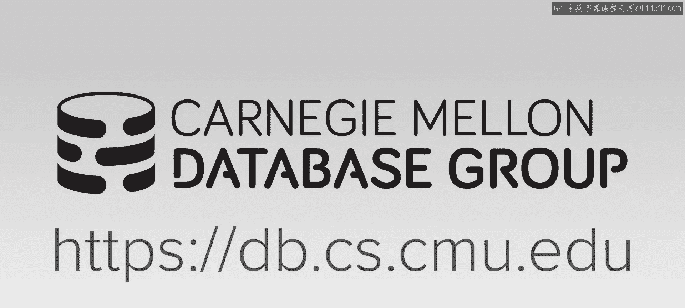
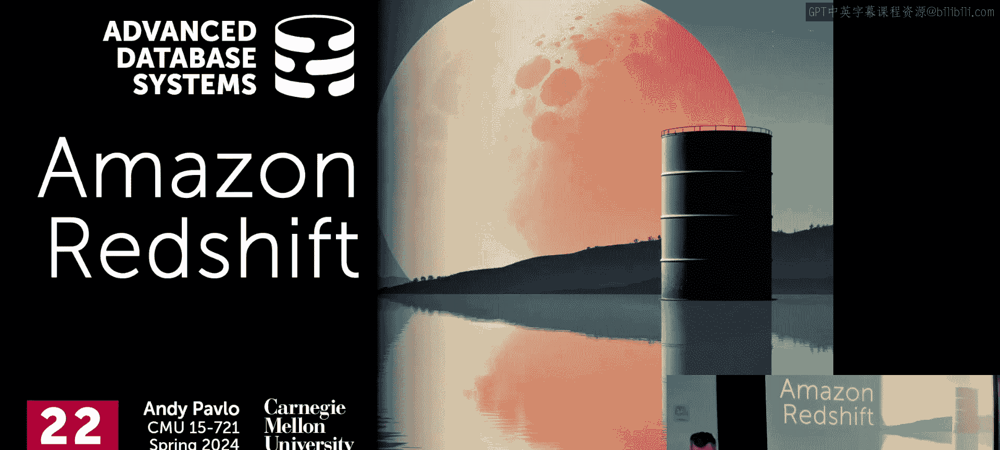
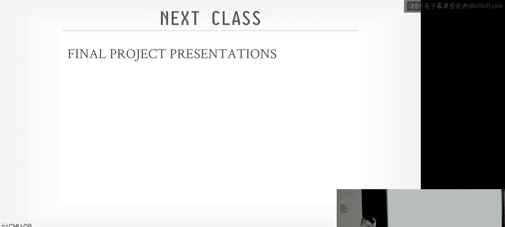
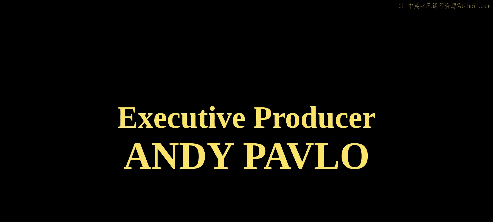

# 高级数据库系统：22：Amazon Redshift 数据仓库系统

在本节课中，我们将学习 Amazon Redshift 数据仓库系统。Redshift 是亚马逊的旗舰级 OLAP 数据库管理系统，它基于 ParAccel 构建，并演变为一个共享磁盘架构的系统。我们将探讨其独特的架构设计、查询执行策略以及一些关键的优化技术。

## 系统背景与演变

上一节我们介绍了 Yellowbrick 系统，它通过绕过操作系统来获得极致性能。本节中，我们来看看 Amazon Redshift，一个在云端提供的数据仓库服务。

Redshift 源于 ParAccel，这是一个基于 PostgreSQL 的共享无状态（shared-nothing）分支。在 2010 年左右，亚马逊希望为其云服务增加一个数据仓库产品。当时，许多早期的 OLAP 系统（如 Greenplum、Vertica）已被收购，而 ParAccel 是少数未被收购的系统之一。亚马逊选择投资 ParAccel 并获得了其源代码的使用许可，而非直接收购。这个决策被证明非常成功，Redshift 如今为亚马逊带来了巨大的收入。

Redshift 的设计目标与 Snowflake 类似，旨在尽可能地将管理职责从用户身上移除，实现自动化。最初，它是一个共享无状态的系统，数据存储在计算节点本地。后来，它逐渐演变为支持共享存储（如 S3）和 Serverless 部署模式。

以下是 Redshift 架构的几个关键版本和组件：
*   **Redshift 经典版**：基于 ParAccel 的共享无状态架构。
*   **Athena**：基于 Presto 的独立服务，用于直接查询 S3 上的数据。
*   **Redshift Spectrum**：作为 Redshift 的扩展，允许通过 Redshift 接口直接查询 S3 上的数据，而无需先加载到 Redshift 托管存储中。

## 核心架构与执行引擎

Redshift 的整体架构融合了多种技术。其高层设计包括共享磁盘存储、基于推送的向量化查询处理，以及独特的代码生成策略。

系统架构图展示了其核心组件：底层的存储层（包括 S3 和 Redshift 托管存储）、可选的硬件加速层（Aqua）、用于查询 S3 的 Spectrum 节点、计算节点集群以及独立的编译服务。

### 向量化执行与代码生成

Redshift 的查询执行引擎采用基于推送（push-based）的模型。与基于拉取（pull-based）的模型相比，这减少了需要维护的状态量。在执行过程中，系统会小心安排操作顺序，以避免耗尽 CPU 寄存器。

在代码生成方面，Redshift 采用了一种混合策略，这与其他系统不同。

以下是其代码生成策略的两个核心部分：
1.  **预编译原语**：类似于 VectorWise，系统为扫描、过滤等底层操作准备了手工编写的、使用 AVX2 指令集内在函数（intrinsics）优化过的预编译代码块。这些原语被内联到生成的查询代码中。
2.  **整体查询编译**：类似于 Hyper，系统也会为整个查询计划进行即时编译（JIT）。为了降低编译开销，它并非编译所有内容，而是将预编译的原语“缝合”到生成的代码中。

为了减少因数据未就绪导致的 CPU 停顿，Redshift 在生成的扫描循环中使用了**软件预取**技术。系统通过启发式方法，在代码中精确地插入预取指令，以便在需要下一批数据之前，就将其加载到 CPU 缓存中。这通常在一个软性的流水线断点（例如，一个缓冲器被填满时）处完成。

### 自适应执行

与其他一些现代系统（如 Snowflake、BigQuery）相比，Redshift 在查询执行过程中的自适应能力似乎不那么激进。

以下是论文中提到的两个主要自适应优化点：
*   **字符串函数选择**：系统可以选择向量化的 ASCII 字符串函数实现，如果不适用（例如遇到 Unicode 数据），则回退到较慢的通用版本。
*   **布隆过滤器大小调整**：在哈希连接中，如果构建端发现哈希表过大并可能溢出到磁盘，系统会动态调整布隆过滤器的大小，以减少假阳性并避免不必要的磁盘读取。

## 编译即服务与全局缓存

Redshift 的一个显著特点是其“编译即服务”架构。与 Yellowbrick 类似，它将查询编译任务卸载到独立的专用服务节点上，而不是在 worker 节点上完成。

该服务维护着一个多级缓存系统，极大地减少了编译开销。

以下是缓存系统的层次结构：
*   **本地缓存**：每个计算节点缓存它已编译过的查询计划片段。
*   **全局缓存**：一个跨整个 Redshift 服务集群的共享缓存。如果一个查询计划片段在本地缓存中未命中，系统会查询全局缓存，看是否有其他用户编译过相同的片段。

根据论文数据，全局缓存的命中率非常高。对于所有查询，本地缓存命中率约为 99.95%。而在本地缓存未命中的情况下，有 87% 的几率能在全局缓存中找到。这种设计几乎消除了即时编译的性能成本，并且只有在云服务这种集中式、可控的环境中才能有效实现。

## 硬件加速与查询优化

Redshift 曾引入一个名为 **Aqua** 的硬件加速层。这是一个位于计算节点和存储层之间的计算存储层，包含 FPGA，可以执行谓词下推和聚合下推等操作。然而，有迹象表明该组件可能已被整合或替换为基于亚马逊 Nitro 系统（其定制硬件和虚拟化平台）的底层加速。

在查询优化方面，Redshift 的优化器仍然深度基于 PostgreSQL 的优化器，并进行了大量修改。它包含一个基于规则的查询重写框架和用于连接顺序选择的空间搜索算法。

一个特别的组件是**查询重写框架**，它是一种基于领域特定语言的系统，允许工程师（甚至实习生）轻松地定义模式匹配规则和相应的查询计划转换，以快速修复特定查询模式的性能问题。这对于处理“一次性”的查询性能问题非常有效。

对于存储在 Redshift 托管存储中的数据，系统会收集统计信息以进行基于成本的优化。对于通过 Spectrum 查询的 S3 外部数据，系统主要依赖文件元数据（如 Parquet 文件的区段图）进行过滤下推，并可以缓存这些元数据。

## 性能考量与总结

本节课中，我们一起学习了 Amazon Redshift 数据仓库系统。Redshift 是一个在商业上非常成功的云原生 OLAP 系统，其架构体现了从传统共享无状态设计向云原生共享存储模式的演变。

其核心特点包括：
*   **混合代码生成**：结合了预编译原语和整体查询编译。
*   **编译即服务**：通过全局缓存极大降低编译开销。
*   **持续演进**：基于全系统的遥测数据驱动优化（例如，优化更新查询性能）。
*   **查询重写框架**：提供了灵活的方式来应对特定的性能问题。

需要指出的是，评估商业系统的基准测试数据需要保持谨慎。厂商提供的对比图表（例如，展示 Redshift 相对于 BigQuery、Snowflake 在 TPC-DS 上的性能）通常用于市场宣传，实际选型需要基于具体的业务需求、数据生态和成本进行综合评估。

Redshift 的成功也部分源于其进入市场较早，并且背靠亚马逊强大的云生态系统。它展示了如何通过持续投入和基于实际使用数据的迭代，将一个获得授权的初始代码库，发展成为一个行业领先的服务。