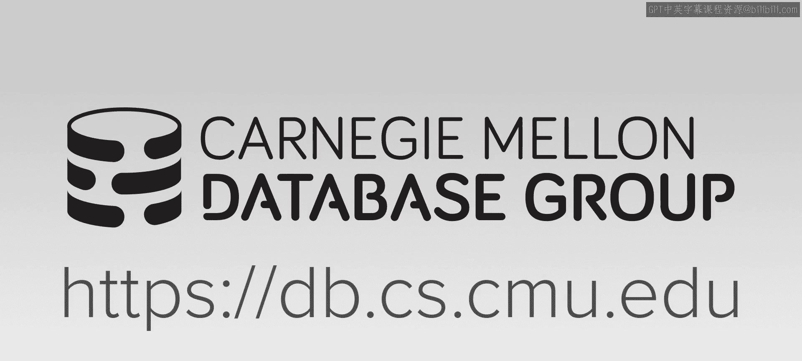
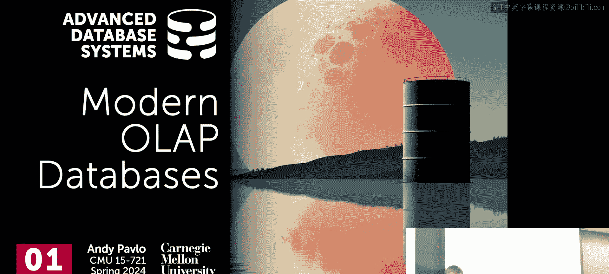
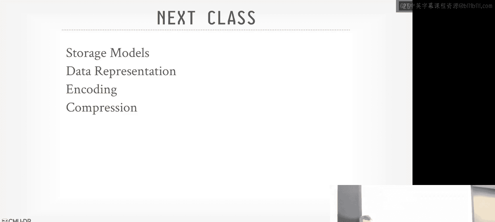

# 02：现代OLAP数据库系统概述





在本节课中，我们将要学习现代在线分析处理数据库系统的基本背景、架构演变以及核心设计理念。我们将从历史系统谈起，逐步过渡到当前主流的共享存储架构，并概述一个查询在这些系统中的执行流程。

## 系统架构的演变

上一节我们介绍了OLAP系统的基本目标。本节中，我们来看看其系统架构是如何从早期的单一系统发展到今天的云原生形态的。

### 早期：单一数据库与数据立方体

最初，人们使用**单一数据库系统**来处理分析工作负载。这类系统（如PostgreSQL、MySQL）将所有组件（存储、执行引擎）集成在一个软件中，并采用面向行的存储和基于页面的磁盘管理。对于分析查询，这种架构效率低下，因为它需要读取整行数据，即使查询只涉及少数几列。

为了提升分析查询性能，人们引入了**数据立方体**。其核心思想是预先计算聚合查询（如GROUP BY）的结果，并将其以类似数组的形式物化存储。当分析查询到来时，系统可以直接查询这些预计算好的立方体，从而避免昂贵的全表扫描。

以下是数据立方体的基本使用模式：
```sql
-- 管理员预先创建数据立方体（物化视图）
CREATE MATERIALIZED VIEW sales_cube AS
SELECT region, product, SUM(revenue)
FROM sales
GROUP BY CUBE(region, product);

-- 用户查询时，优化器会重写查询以利用立方体
SELECT region, SUM(revenue) FROM sales WHERE product = ‘X‘ GROUP BY region;
```

然而，数据立方体需要管理员手动定义和定期刷新（例如通过夜间定时任务），且难以处理增量更新。

### 发展：专用数据仓库

21世纪初，人们开始构建专门为分析工作负载设计的**数据仓库系统**。这些系统（如Vertica、Redshift的前身ParAccel）大多源自PostgreSQL等行存储系统，但对其内部存储和执行引擎进行了彻底改造，转向**面向列的存储**。

这些系统通常是**无共享架构**，即集群中的每个计算节点都拥有本地连接的磁盘、内存和CPU，并负责存储数据库的一部分数据。数据通过**提取、转换、加载**工具从操作型数据库定期同步到数据仓库。

### 现代：共享存储与湖仓一体

2010年代左右，随着云计算的普及，**共享存储架构**成为主流。其核心思想是将存储职责卸载到独立的服务（如云对象存储S3），而计算层则专注于查询处理。

这种架构带来了关键优势：
*   **存储与计算分离**：可以独立扩展计算和存储资源，计算节点变得无状态。
*   **降低运维复杂度**：存储的持久性、可用性由云服务商保障。
*   **灵活的数据接入**：数据可以作为文件（如Parquet）直接放入对象存储，然后被系统“发现”并查询，这催生了**湖仓一体**的概念。

湖仓一体架构在数据湖（灵活的文件存储）之上，提供了类似数据仓库的管理能力（如事务性更新、模式演进、目录服务），试图统一数据科学与数据分析的体验。

## 现代OLAP系统的设计考量

在构建或选择现代OLAP系统时，需要牢记以下几个关键趋势和挑战：

以下是构建现代OLAP系统时需要考虑的三个核心方面：

1.  **支持多样化工作负载**：用户不仅需要运行SQL查询，还可能运行机器学习（如PyTorch）或其他自定义计算。系统需要提供灵活的数据访问接口（如Apache Arrow格式），以高效支持这些模式。
2.  **拥抱开放存储格式**：得益于共享存储架构，数据以开放文件格式（如Parquet、ORC）存储在对象存储中。这意味着数据可以绕过数据库前端直接写入，但也要求系统具备强大的目录服务来跟踪数据资产、模式及其版本。
3.  **处理半结构化/非结构化数据**：大量数据是JSON日志、文本或多媒体。系统需要高效地处理这些半结构化数据，例如通过动态解析、自动生成列或其他优化技术。

## 系统内部组件概览

了解了宏观架构后，我们深入看看一个现代OLAP系统内部如何处理一个查询。其内部组件通常以服务化方式构建，并通过定义良好的API进行协作。

下图展示了一个查询请求在系统中的流转过程：
```
用户 -> 前端/SQL解析器 -> 查询规划器 -> 调度器 -> 执行引擎 -> I/O服务 -> 对象存储
                     ↑          ↑          ↑         ↑
                     └───目录服务────────────┘         └───目录服务
```

以下是各核心组件的职责：

1.  **前端/SQL解析器**：接收用户SQL查询，将其解析为初始的中间表示。
2.  **查询规划器**：
    *   **绑定器**：验证表名、列名等标识符的有效性。
    *   **优化器**：基于从目录获取的统计信息和成本模型，进行基于成本的优化，寻找最优执行计划。
3.  **目录服务**：系统的元数据中心。存储关于表、列、数据类型、文件位置、数据统计等信息，供规划器和调度器使用。
4.  **调度器**：接收物理执行计划，根据目录中数据的位置信息，决定在哪个计算节点上执行哪个任务，并负责协调整个分布式查询的执行状态。
5.  **执行引擎**：在计算节点上实际执行查询计划中的物理操作符（如扫描、过滤、连接、聚合）。执行过程中可能需要从存储读取数据。
6.  **I/O服务**：负责与底层存储（对象存储或本地磁盘）交互，获取数据块。在一些系统中，它还可以将谓词下推到存储层（如S3 Select）。

## 查询执行模型

现在，我们具体看一个查询是如何在计算集群中执行的。现代系统通常采用**流水线执行模型**。

执行过程可以概括为以下步骤：
1.  查询计划被组织成一系列**流水线阶段**。
2.  **工作节点**从持久化存储（对象存储）读取数据，开始执行流水线的第一个阶段，并产生中间结果。
3.  在**流水线中断器**处（如需要进行数据重分发的Shuffle阶段），中间结果根据分区键被发送到**Shuffle节点**。
4.  Shuffle节点将数据重新分发到下一组工作节点，进行后续阶段的处理。现代系统通常支持流式Shuffle，无需等待前一阶段全部完成。
5.  最后一个阶段的结果被发送到**协调节点**进行最终聚合或整理，然后返回给用户。

在这个模型中，需要区分两种数据：
*   **持久化数据**：存储在对象存储中的源数据文件（如Parquet）。它们是数据的唯一来源，具有持久性和容错性。
*   **中间数据**：查询执行过程中产生的临时数据。它们是短暂的，通常缓存在计算节点的内存或本地磁盘中，查询结束后即被丢弃。

## 数据访问模式：推与拉

在分布式查询中，数据如何在计算节点间移动是一个关键设计决策。主要有两种模式：

*   **将查询推向数据**：将查询计划（体积小）发送到存有数据的节点执行。这适合**无共享架构**，能减少网络传输的数据量。公式可以表示为：`传输成本 ≈ 查询计划大小 + 中间结果大小`。
*   **将数据拉向查询**：将所需数据从存储拉到计算节点执行。这在**共享存储架构**中更常见，尤其是当存储层（如S3）无法执行复杂计算时。公式可以表示为：`传输成本 ≈ 原始数据大小`。

实际上，界限正在模糊。例如，云对象存储（如S3 Select）现在支持简单的谓词下推，使得共享存储架构也能实现一定程度的“查询下推”。

## 共享存储 vs. 无共享架构

最后，我们系统性地对比一下两种核心架构：

| 特性 | 无共享架构 | 共享存储架构 |
| :--- | :--- | :--- |
| **存储位置** | 数据分区存储在计算节点的本地磁盘。 | 数据集中存储在独立的对象存储中。 |
| **计算节点状态** | 有状态。节点存储部分数据，故障会导致数据不可用（需复制）。 | 无状态。节点不持久化数据，可以随时启停。 |
| **扩展性** | 扩展计算容量需要添加节点并**重新分布数据**，操作复杂。 | 计算和存储可**独立扩展**。添加计算节点无需数据迁移。 |
| **数据局部性** | **强**。计算直接在数据所在节点进行，网络开销低。 | **弱**。计算节点需要从远程存储获取数据，但可通过缓存缓解。 |
| **运维管理** | 数据库系统需自行管理数据复制、重新平衡等，运维复杂。 | 存储的持久性、可用性由云服务商保障，运维简化。 |
| **典型系统** | 早期Vertica, Teradata | Snowflake, BigQuery, Databricks Lakehouse |

现代OLAP系统普遍采用**共享存储架构**，因为它提供了卓越的弹性、可扩展性和运维简便性，其潜在的性能损失可以通过智能缓存、高效网络协议和存储层优化来弥补。

## 总结




本节课中我们一起学习了现代OLAP数据库系统的演进历程与核心架构。我们从早期的单一数据库和数据立方体出发，经历了专用数据仓库阶段，最终到达当前主流的、基于共享存储和湖仓一体理念的云原生系统。我们剖析了这类系统的内部组件及其协作方式，了解了查询的流水线执行模型，并对比了“推”与“拉”两种数据访问模式以及无共享与共享存储两种架构的优劣。这些基础知识为我们后续深入探讨存储格式、执行引擎、查询优化等具体技术细节奠定了坚实的上下文基础。下一节课，我们将从底层开始，深入研究现代OLAP系统使用的列式存储文件格式：Parquet和ORC。