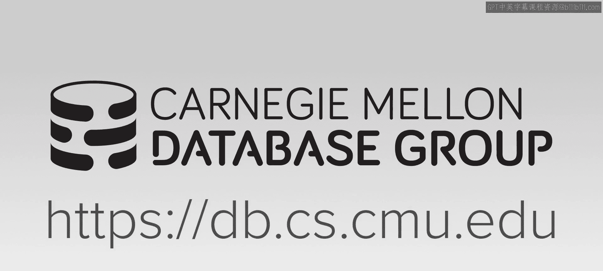
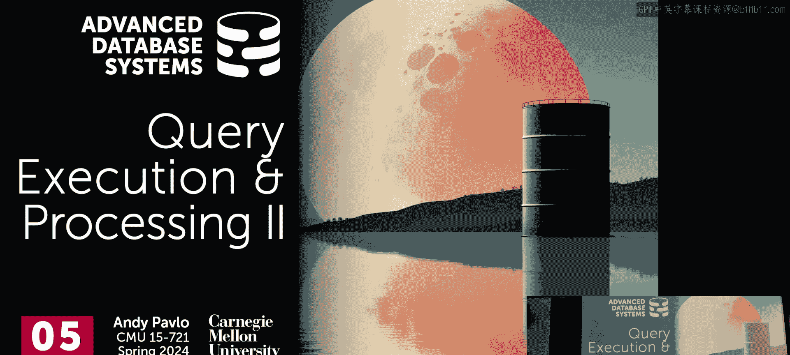
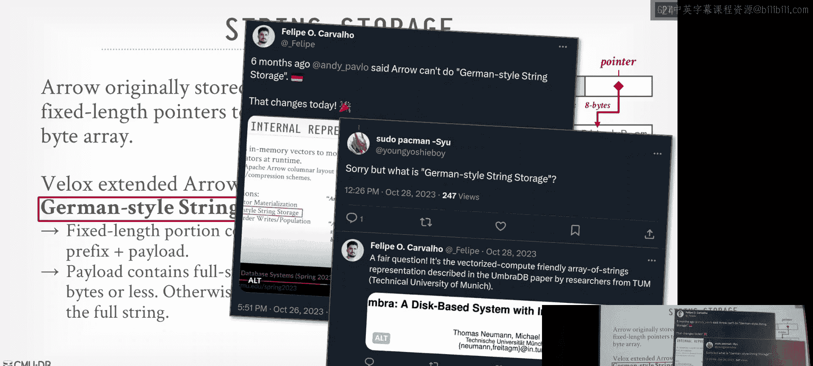
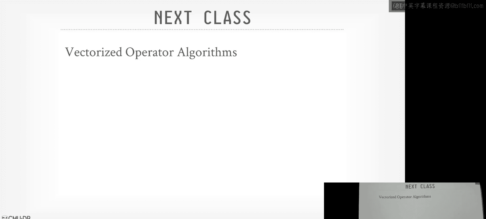

# 06：查询执行与处理（第二部分）

在本节课中，我们将继续探讨查询执行，重点学习如何并行执行查询、数据在算子间的表示与传递、表达式求值，以及自适应查询执行的基本概念。

---

## 并行执行概述

上一节我们讨论了查询处理模型，本节我们来看看如何利用并行性来加速查询执行。现代硬件（多核CPU、多节点集群）要求数据库系统能够同时运行多个任务。

并行执行主要分为两类：
*   **查询间并行**：系统同时执行多个不同的查询。
*   **查询内并行**：将一个查询分解，在多个资源上同时执行。

对于查询内并行，最常见的是**算子内并行**（水平并行），即创建同一个算子的多个实例，每个实例处理数据的不同分区。

以下是实现算子内并行的核心组件：

*   **交换算子**：作为并行执行管道的“断点”，用于合并或分发来自多个并行算子实例的结果。它有三种主要变体：
    *   **收集**：将多个工作线程的输出合并为单个流。
    *   **分发**：将单个输入流分发到多个工作线程。
    *   **重分区**：在多个输入流和多个输出流之间重新组织数据（例如，基于哈希键进行洗牌）。

另一种并行类型是**算子间并行**（垂直/流水线并行），即查询计划中不同的流水线阶段可以同时运行，形成生产者-消费者模型。这在流处理系统中更为常见。

---

## 数据表示与传递

在向量化、推式执行的系统中，我们需要决定数据在算子间传递的形式。核心决策点是**物化时机**。

*   **早期物化**：在扫描数据时（查询计划底部）就将整个元组的所有列组合好并向上传递。后续算子无需回查原始数据，但可能传递了大量不需要的列。
*   **晚期物化**：仅向上传递查询计划当前阶段所需的最少列（通常是记录ID或偏移量）。当后续算子需要更多列时，有能力向下游请求获取。这减少了不必要的数据移动，是现代列式存储系统的常见做法。

为了高效处理来自不同文件格式（如Parquet、ORC）的数据，系统需要一种**内部统一的数据表示格式**。理想情况下，这种格式应支持：
*   固定长度编码以利于随机访问。
*   零拷贝内存访问，避免序列化/反序列化开销。
*   在不同系统或进程间高效共享数据。

**Apache Arrow** 项目正是为此而生。它是一个用于内存数据的跨语言开发平台，定义了列式内存格式，支持高效的向量化计算和数据零拷贝共享。

一个关于字符串存储的优化是 **“German-style”字符串存储**（源自Umbra数据库）。其核心思想是：在固定长度的列值中，不仅存储字符串大小和指针，还存储一个短字符串前缀。这样，对于许多字符串操作（如前缀匹配），无需解引用指针即可完成，显著提升了性能。

---

## 表达式求值

表达式求值负责处理`WHERE`、`JOIN`等子句中的谓词和计算。SQL解析器会将表达式转换为**表达式树**。

原始的遍历树方法对每个元组进行求值效率很低。优化方法是**将表达式树编译为可执行的函数**。系统可以：
1.  **预编译原语**：为常见数据类型（如`int32`, `float`）和操作（如相等比较）生成高效的机器码函数。
2.  **即时编译**：将整个表达式树编译成机器码（例如，通过LLVM）。虽然编译有开销，但对于长时运行的查询是值得的。

即使不进行完全编译，执行引擎也可以进行优化，例如：
*   **常量折叠**：预先计算表达式中的常量部分。
*   **公共子表达式消除**：识别并复用重复计算的子表达式。

---

## 自适应查询执行

查询优化器依赖成本模型和统计信息来生成执行计划。如果估计不准（例如，在数据湖环境中缺乏统计信息），计划可能很差。**自适应查询执行**允许系统在运行时根据观察到的数据动态调整计划。

本节课我们聚焦于表达式级别的自适应优化技巧：

*   **谓词重排序**：根据谓词的计算成本和选择性，动态调整多个谓词的求值顺序。
*   **公共子表达式预取**：在计算一个表达式时，异步预取另一个表达式所需的数据。
*   **空值快速路径**：如果检测到某列没有空值，则跳过所有空值检查逻辑。
*   **ASCII快速路径**：如果检测到字符串列全是ASCII字符，则使用更快的ASCII处理函数，而非通用的UTF-8函数。
*   **缓冲区复用**：对于原地修改数据的操作（如`UPPER()`函数），直接覆写输入缓冲区，避免分配新内存。

---

## 总结

本节课我们一起学习了构建现代查询执行引擎需要考虑的几个关键方面：利用并行性（算子内/间并行）来充分利用硬件；通过晚期物化和统一的内存格式（如Arrow）来高效表示和传递数据；将表达式编译为高效的原语函数来加速求值；以及引入自适应机制（如谓词重排序、快速路径）来应对优化器估计不准的情况，提升执行鲁棒性。这些概念为理解后续更深入的算子实现和查询优化打下了基础。