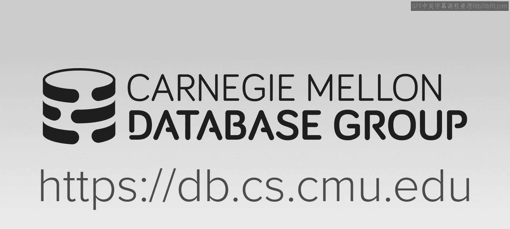
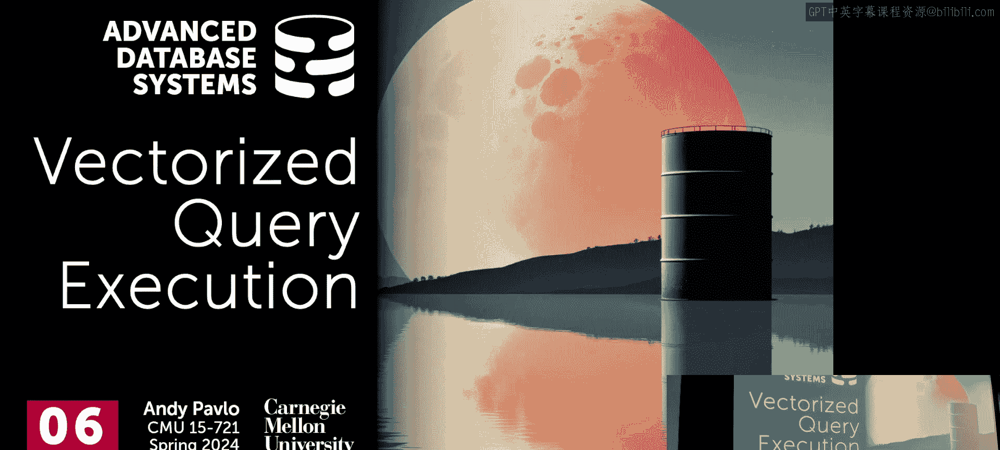
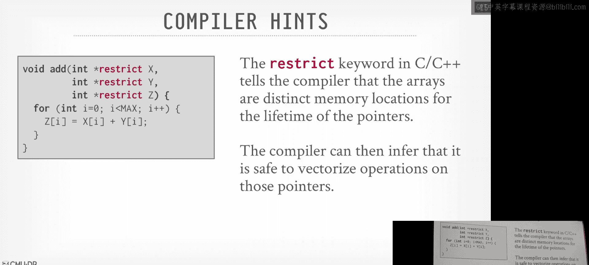
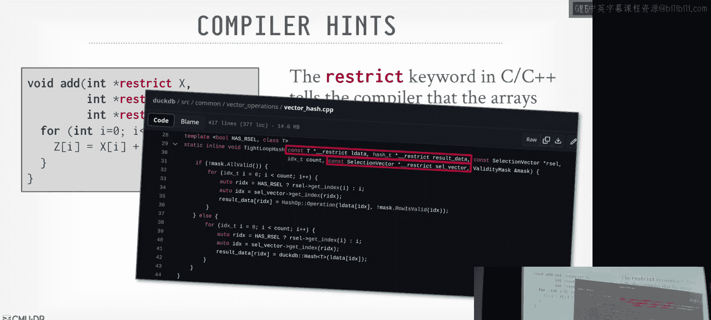
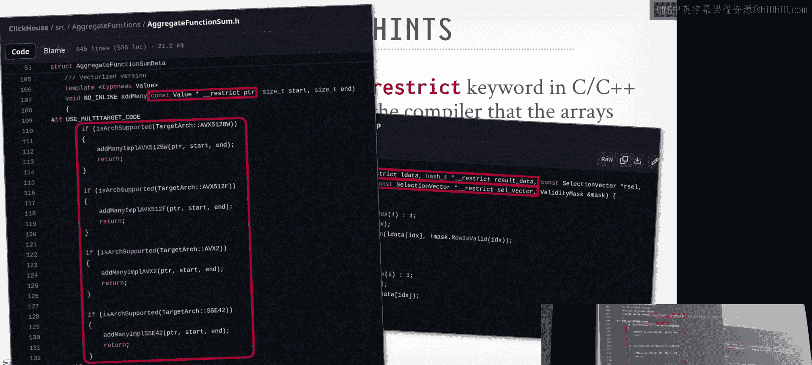

# 07：使用SIMD的向量化查询执行





## 概述
在本节课中，我们将要学习向量化查询执行。这是现代数据库系统获取高性能查询的关键方法之一。我们将探讨如何将标量算法转换为向量化形式，并利用CPU提供的SIMD指令，在单个操作符或表达式中同时运行多个操作。

---

## 从任务并行化到数据并行化
上一节我们介绍了如何将查询计划划分为流水线并并行运行，这被称为**任务并行化**。本节中，我们来看看**数据并行化**。其核心思想是，我们希望将每次处理单个元组的标量算法，转换为向量化形式，并依赖CPU的SIMD指令，在单个操作符内同时处理多个数据。

**公式**：`数据并行化 = 多个计算 + 多个数据 + 同时发生`

这很重要，因为它能带来额外的性能提升。例如，在一台32核机器上，如果能将任务完美划分为32个独立任务，理论上可获得32倍加速。如果部分计算能使用SIMD指令（例如一次处理4个数据），则理论加速可达 `32 x 4 = 128` 倍。当然，由于数据移动等开销，实际很难达到理论峰值，但即使获得1.4倍的加速也是值得的。

---

## SIMD简介
SIMD（单指令多数据）是一类CPU指令，允许处理器同时对多个数据执行相同操作。它依赖于特殊的SIMD寄存器来输入和输出数据。

我们的目标是尽可能长时间地将数据保留在SIMD寄存器中，进行尽可能多的处理，只在必要时才将数据写回CPU缓存或内存。

我们将主要关注**AVX-512**指令集，它提供了对数据库系统更友好的新特性，例如**谓词掩码**，允许我们指定操作应用于哪些特定的“通道”。



---





## 向量化的三种方法
以下是实现向量化的三种基本方法：

1.  **自动向量化**：依赖编译器识别紧密循环并将其重写为向量化指令。这只适用于简单循环，且编译器在指针别名等问题上可能非常保守。
2.  **编译器提示**：通过关键字（如C中的 `restrict`）或编译指令（如 `#pragma ivdep`）给编译器提示，告知其内存不重叠等信息，鼓励其进行向量化。
3.  **显式向量化**：使用**内部函数**直接调用特定的SIMD指令。这提供了最精确的控制，但代码与特定CPU架构（如x86）绑定。

**代码示例（显式向量化）**：
```cpp
// 使用AVX2内部函数进行向量加法
__m256i vec_a = _mm256_loadu_si256((__m256i*)a);
__m256i vec_b = _mm256_loadu_si256((__m256i*)b);
__m256i vec_c = _mm256_add_epi32(vec_a, vec_b);
_mm256_storeu_si256((__m256i*)c, vec_c);
```

---

## 向量化原语与操作
为了构建更复杂的数据库操作，我们需要理解一些基本的SIMD原语。AVX-512引入了关键特性，如**谓词掩码**，允许操作只应用于掩码位为1的通道。

以下是核心原语：

*   **谓词操作**：使用位掩码控制操作应用于哪些通道。
*   **置换**：根据索引向量，将输入向量中的值复制到目标向量的指定位置。
*   **选择性加载/存储**：根据掩码，将内存中的数据加载到向量寄存器，或将向量寄存器的数据存储到内存。
*   **压缩/扩展**：压缩操作根据掩码将有效数据紧凑地排列在向量前端；扩展操作是其逆过程。
*   **聚集/散播**：聚集操作根据索引向量从多个内存地址收集数据到单个向量；散播操作将向量数据分散到多个内存地址。

这些原语使我们能够高效地在SIMD寄存器和内存之间移动并重组数据。

---

## 基本操作：选择扫描
让我们看一个基本操作——选择扫描的向量化。标量代码逐个检查元组是否满足谓词。

向量化方法是：将一批元组的键值加载到SIMD寄存器，使用SIMD比较指令生成位掩码，然后通过“与”操作组合多个谓词的掩码。最终得到的掩码指示了哪些元组满足所有条件。

**核心步骤**：
1.  SIMD比较（`key >= low`） -> 掩码1
2.  SIMD比较（`key <= high`） -> 掩码2
3.  SIMD与操作（掩码1 & 掩码2） -> 最终掩码
4.  使用SIMD压缩操作，根据最终掩码生成匹配元组的列表。

---

## 挑战：通道利用率与向量重填充
向量化处理中的一个关键挑战是**通道利用率**。当一批元组中部分不满足谓词时，对应的SIMD通道就被浪费了。简单地携带这些“无效”元组会降低效率。

解决方案是**向量重填充**。其思想是在流水线中引入“人工断点”。当发现向量中有无效通道时，不立即将结果传递给下一个操作符，而是先将有效结果暂存到缓冲区。然后，返回获取更多元组来填充这些无效通道。一旦缓冲区填满（即获得一批全有效的向量），再将其送入流水线的下一阶段。

这种方法可以减少计算浪费，并可能为软件预取提供机会。

---

## 哈希连接的向量化
哈希连接的传统实现（线性探测）对SIMD不友好。有两种向量化方法：

1.  **水平向量化**：在每个哈希桶中存储多个键值对（例如4个）。查找时，将查询键复制多份，与整个桶的内容进行SIMD比较。这种方法简单，但桶内可能未填满，造成利用率问题。
2.  **垂直向量化**：同时处理多个查询键（例如4个）。使用SIMD哈希函数为这些键计算哈希值，然后使用SIMD聚集指令从哈希表的不同位置获取对应的键。接着进行SIMD比较。对于未匹配的键，需要记录其状态并在下一轮迭代中继续查找。

垂直向量化通常更优，但它可能改变输出元组的顺序，这在调试时需要注意。

---

## 一个巧妙的技巧：直方图构建
构建直方图时，多个输入键可能映射到同一个直方图桶，导致更新冲突。

一个巧妙的SIMD方法是：为每个SIMD通道维护一个独立的直方图副本。这样，通道0的键更新副本0，通道1的键更新副本1，依此类推，完全避免了冲突。最后，使用SIMD加法指令将所有副本的计数汇总，得到最终的直方图。

这种方法充分利用了SIMD的并行性，同时避免了同步开销。

---

## 现实考量：AVX-512与降频
虽然AVX-512功能强大，但在实际使用中需要注意一个关键问题：**降频**。某些CPU在运行密集的AVX-512指令时，可能会降低时钟频率以防止过热，这反而可能导致整体性能下降，甚至不如使用AVX-2指令集。

因此，数据库系统需要谨慎选择：
*   检测CPU支持的指令集和特性。
*   在代码中可能包含条件分支，针对不同CPU选择不同的实现（如使用AVX-2而非AVX-512）。
*   对于通用软件，可能倾向于使用更稳定的AVX-2。

---

## 总结
本节课中我们一起学习了向量化查询执行。我们了解到：
*   向量化通过**数据并行化**，利用SIMD指令同时处理多个数据，是提升数据库性能的重要技术。
*   实现向量化主要有自动向量化、编译器提示和显式向量化三种方法，通常需要结合使用。
*   我们学习了一系列SIMD原语（如置换、聚集、散播、谓词掩码），它们是构建向量化算法的基础。
*   我们探讨了选择扫描、哈希连接和直方图构建等操作的向量化实现，并分析了其中的挑战（如通道利用率）和解决方案（如向量重填充）。
*   最后，我们认识到在实际部署中需要谨慎考虑硬件特性，例如AVX-512可能引发的CPU降频问题。


向量化是构建现代高性能数据库引擎的核心技术之一，它需要与任务并行化、查询编译等技术协同工作，才能充分发挥硬件潜力。