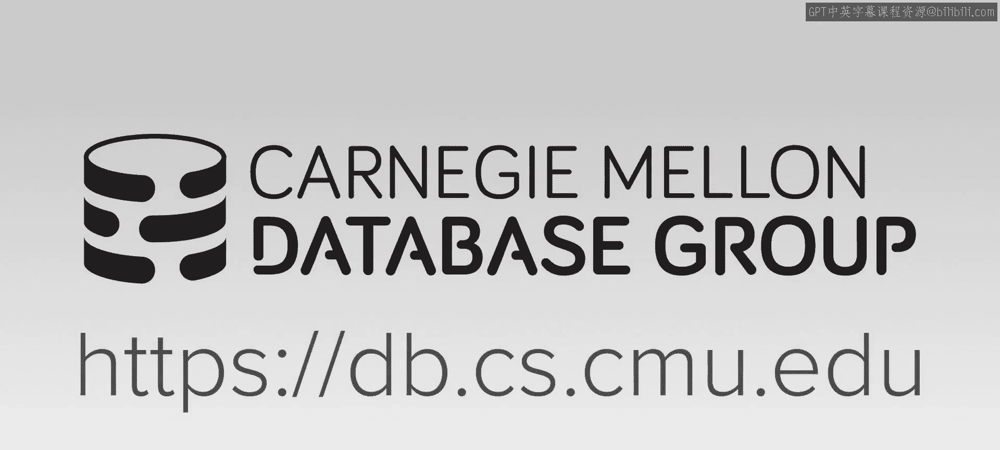
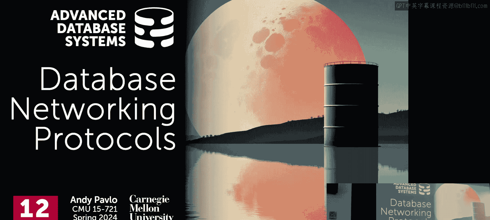
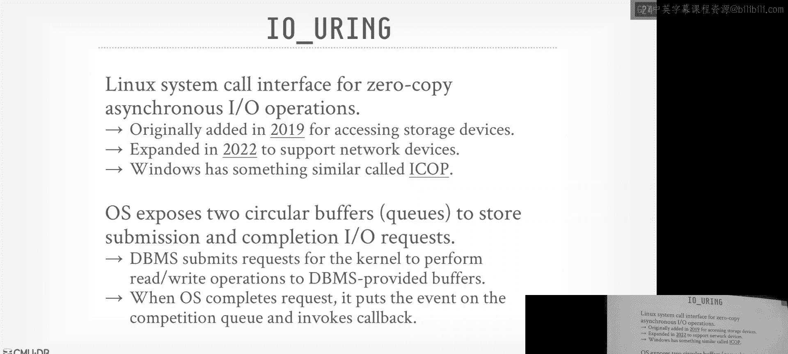
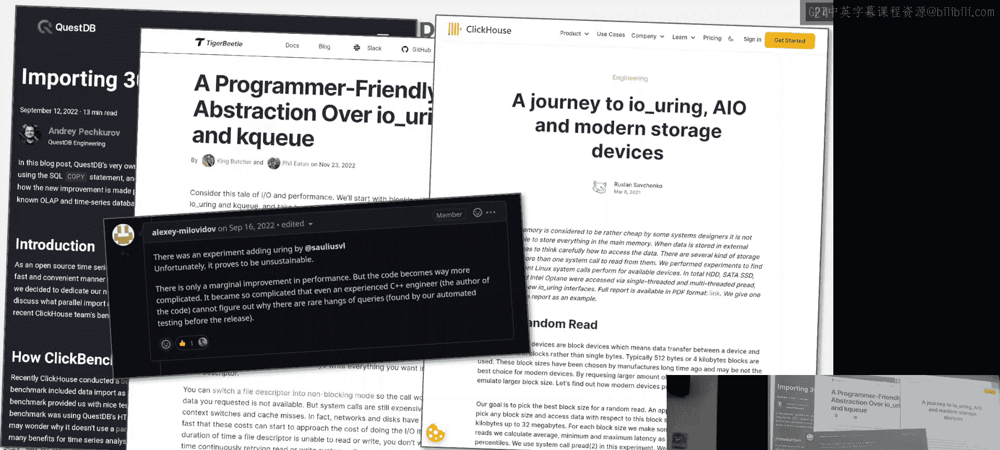
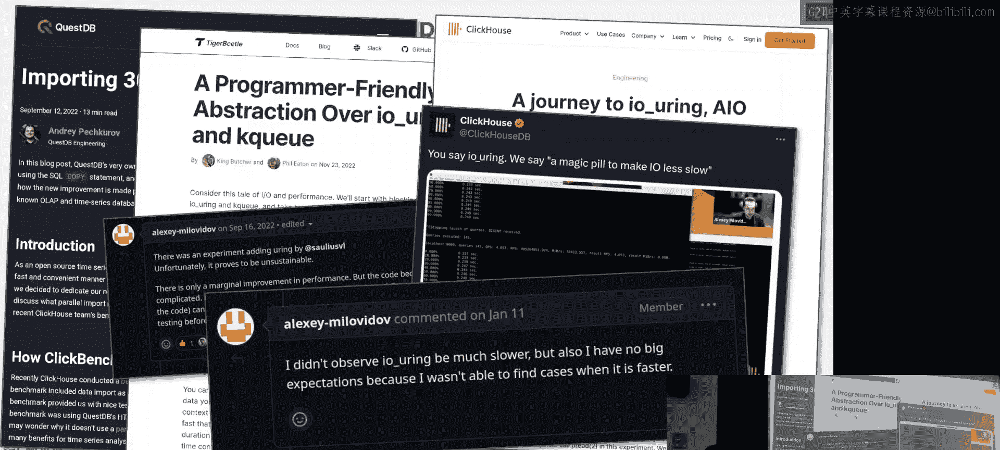
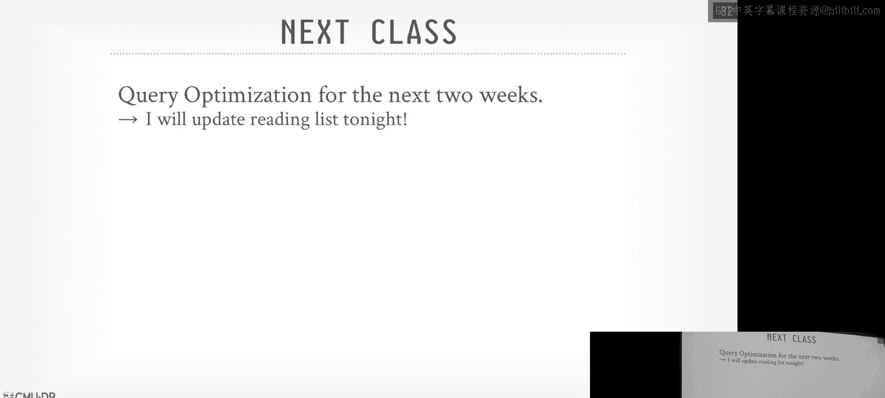

# 13：数据库网络协议

## 概述
在本节课中，我们将学习数据库系统与客户端应用程序之间如何进行通信。我们将探讨不同的数据库访问API、网络协议的设计选择，以及如何优化数据传输效率，特别是针对现代数据分析场景。

上一节课我们介绍了如何将用户定义的函数内联到数据库系统中执行。本节中，我们来看看相反的过程：如何将数据从数据库系统高效地传输到应用程序端进行处理。

## 数据库访问方法
大多数查询并非在终端中运行并返回人类可读的文本。应用程序通常需要二进制格式的数据，以便进行进一步处理。因此，我们需要通过编程接口与数据库交互。

以下是几种主要的数据库访问方法：
*   **原生C API**：数据库系统通过C库暴露的专有API。通常用于编写驱动程序，而非直接编写应用程序。
*   **ODBC**：一种基于C语言的、数据库系统无关的API标准。它采用设备驱动程序模型，数据库厂商提供符合ODBC规范的驱动程序。
*   **JDBC**：Java语言的数据库连接标准，概念与ODBC类似，旨在为Java应用程序提供数据库无关的访问方式。
*   **对象关系映射器**：如Django、Rails、SQLAlchemy等，它们为特定编程语言提供了更高层次的抽象。

我们主要关注ODBC和JDBC这类标准。它们的核心思想是提供一个数据库系统无关的API。理论上，更换数据库服务器时，应用程序代码无需更改。当然，不同系统的SQL方言差异是一个实际问题。

ODBC采用驱动程序模型。应用程序向ODBC驱动程序发送请求，驱动程序负责与数据库服务器通信，并将结果整理成ODBC规范要求的格式返回给应用程序。我们关心的核心部分是驱动程序与服务器之间的通信，即**网络协议**。

## 网络协议基础
客户端与数据库服务器之间的通信通常基于TCP/IP，使用专有的网络协议。流程一般如下：
1.  客户端连接数据库，进行身份验证。
2.  客户端发送查询。
3.  服务器执行查询，序列化结果，通过网络发送回客户端。

我们关注的重点是结果数据的序列化和网络传输效率。对于大型数据导出场景，这通常是性能瓶颈。

## 协议设计的关键决策
我们将讨论网络协议设计的四个关键方面，这些决策会影响性能和工程复杂度。

### 1. 行格式 vs. 列格式
ODBC和JDBC本质上是面向行的API，因为它们诞生于列式数据库普及之前。即使数据库内部使用列式存储，为了满足客户端协议，服务器也需要将数据重新组装成行格式。

**解决方案**是采用向量化或批处理模型。Apache Arrow及其数据库连接标准ADBC提供了向量化的API，允许数据以原生的列式格式传输，避免了转换开销。

### 2. 压缩策略
在传输前压缩数据可以减少网络带宽消耗。有两种主要方法：
*   **通用压缩**：如GZip、Snappy。简单易用，但可能带来CPU开销。
*   **轻量级编码**：如字典编码、增量编码。针对数据类型，效率更高，但需要在客户端驱动程序中实现相应的解码逻辑，增加了工程复杂度。

选择取决于网络速度与CPU能力的权衡。网络慢时，压缩收益大；网络快时，压缩的CPU开销可能不划算。

### 3. 序列化与编码
这决定了数据在网络上以何种二进制格式表示。

*   **二进制编码**：以数据库内部存储的二进制形式发送数据。客户端负责处理字节序等问题。可以自定义序列化格式，也可以使用现有库。
    *   **自定义格式**：更高效，但需要自行处理空值、数据类型等元数据。
    *   **使用库**：如Protocol Buffers、FlatBuffers。提供版本管理等功能，但可能引入额外开销。
*   **文本编码**：将所有数据转换为字符串形式发送。不关心字节序，但会显著增加数据量，不过结合压缩后可能效果不错。

### 4. 性能权衡
实验表明，不同的设计选择会导致显著的性能差异。例如：
*   使用Thrift等RPC框架会因额外的缓冲拷贝和元数据而变慢。
*   某些专有协议可能过于“啰嗦”，在慢速网络上性能下降严重。
*   简单的文本编码配合压缩，有时能获得不错的性能。
*   原生支持Apache Arrow格式进行传输，能获得最佳性能，因为它避免了数据格式转换。

## 内核旁路优化
网络协议本身并非唯一的瓶颈。操作系统的TCP/IP栈和上下文切换可能带来巨大开销。内核旁路技术旨在绕过操作系统内核，直接与硬件交互。

以下是三种主要方法：
*   **DPDK**：允许用户空间程序直接与网卡交互。需要自己实现TCP/IP栈等网络功能，工程复杂度高。
*   **RDMA**：允许直接读写远程机器的内存，仿佛访问本地内存。性能极高，但设置复杂，通常用于后端服务器间通信。
*   **io_uring**：Linux的异步I/O接口，通过环形缓冲区提交和完成I/O请求，减少了系统调用的开销。它并未完全绕过内核，但提供了一种高效的异步方式。

内核旁路技术潜力巨大，但实现复杂，且并非在所有场景下都能带来稳定收益。

## 用户空间旁路与eBPF
另一种思路是将部分数据库逻辑下沉到内核中，即用户空间旁路。传统上通过内核模块实现，但编写困难且危险。

**eBPF** 是一项变革性技术。它允许将经过验证的安全代码动态加载到内核中执行。这为数据库优化提供了新可能，例如，可以在内核中实现网络协议处理、代理等功能，避免数据在用户空间和内核空间之间的拷贝。初步研究表明，这对于某些特定任务能带来显著的性能提升。

## 客户端优化
即使服务器高效地发送了数据，客户端仍需将数据转换为应用程序所需的格式。对于数据分析场景，将数据载入Pandas DataFrame可能非常耗时。

如果数据库支持ADBC并返回Arrow格式，客户端可以直接在Arrow数据上操作，无需转换。否则，可以使用像Connector-X这样的工具，它通过将查询拆分为多个并行子查询，并让多个线程并行构建DataFrame，来加速数据加载过程。

## 总结
本节课我们一起学习了数据库网络协议的核心内容。我们了解了ODBC/JDBC等标准API的作用，深入探讨了网络协议在设计时面临的格式、压缩、序列化等关键抉择及其性能影响。我们还审视了通过DPDK、RDMA、io_uring进行内核旁路以提升性能的复杂性和潜力，并介绍了利用eBPF进行用户空间旁路的新思路。最后，我们看到了客户端数据接收和转换的优化手段。理解这些协议和优化技术，对于构建高性能的现代数据库系统至关重要。