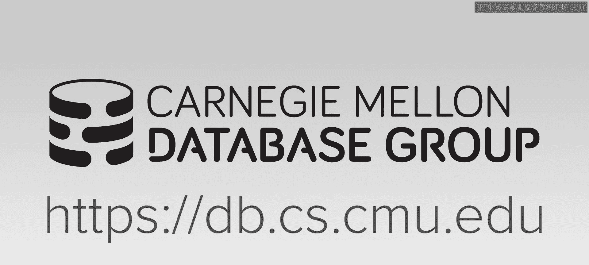
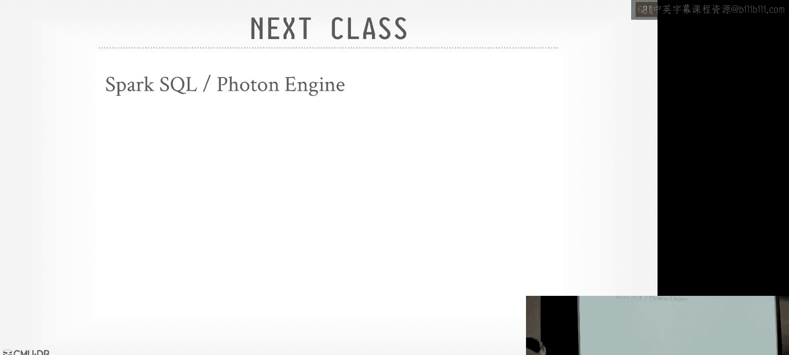

# 17：Google BigQuery 与 Dremel 架构解析 🗄️

在本节课中，我们将学习 Google 的 Dremel 系统及其商业化产品 BigQuery。我们将探讨其核心架构、关键技术，以及它对现代数据湖/湖仓一体架构的深远影响。

## 概述

从本节课开始，我们将转向研究基于本学期所讨论技术和算法的真实工业系统。目标是学习如何解读工业界的论文，理解它们如何应用我们所学的知识解决实际问题，并能够透过营销术语洞察其技术本质。我们将以 Google Dremel/BigQuery 作为第一个案例。

## 系统背景与影响

在2000年代，Google 对数据库系统的设计和开发产生了巨大影响。每当 Google 发布一篇关于其内部系统的研究论文，都会引发广泛关注和开源克隆项目的出现。Dremel 是其中专注于分析型工作负载的系统。

**为什么关注 Dremel 而非其他 Google 系统？**
因为 Dremel 是 Google 体系中专注于在分离式存储上进行数据分析的系统。其他系统如 Megastore、Spanner 主要处理事务，而 Dremel 的架构是现代湖仓引擎的基础。

Dremel 始于2006年的一个“20%时间”项目，旨在解决 Google 内部大量工具和服务在 GFS 上生成数据后，用户需要运行 SQL 查询而非编写复杂 MapReduce 作业的需求。其2010年重写版本转向了分离存储架构，并于2012年商业化成为 BigQuery。

## 核心架构与技术

现代湖仓引擎的许多特性已成为“标配”，Dremel/BigQuery 也不例外。以下是其核心组件：

*   **分离式存储**：计算与存储分离，数据存放在 Colossus（GFS 的演进）等共享存储上。
*   **向量化执行**：采用向量化查询处理以提升性能。
*   **专有文件格式**：使用名为 Capacitor 的列式存储格式，支持嵌套数据（Protocol Buffers），并能在压缩数据上直接进行谓词下推和部分表达式求值。
*   **索引与压缩**：利用区图、布隆过滤器、字典编码和游程编码等技术。
*   **连接算法**：主要使用哈希连接。
*   **查询优化器**：结合基于规则的优化器和轻量级的基于成本的优化器，并在缺乏统计信息时严重依赖运行时自适应优化。

## 分布式执行与 Shuffle 服务 🔄

Dremel 架构中最独特和关键的部分是其基于内存的 Shuffle 服务，这使其能够进行一些其他系统难以实现的优化。

查询会被转换为逻辑计划，并划分为多个阶段。每个阶段包含多个任务，分发到不同的工作节点执行。关键要求是每个任务必须是**确定性和幂等**的，这为容错和应对慢任务（拖尾任务）奠定了基础。

执行流程如下：
1.  协调器（根节点）批量从元数据目录获取所有文件信息，并嵌入逻辑计划中，避免工作节点直接冲击目录服务。
2.  第一阶段的工作节点从共享存储读取数据并进行处理。
3.  处理后的中间结果不是直接发送给下一阶段，而是写入一个**分布式、可水平扩展的内存 Shuffle 服务**（可视为内存键值存储）。
4.  Shuffle 服务将数据统计信息反馈给协调器。
5.  协调器根据这些统计信息，动态决定下一阶段需要的工作节点数量，并调度它们启动。
6.  下一阶段的工作节点从 Shuffle 服务中拉取所需数据继续处理。

**为什么需要独立的 Shuffle 服务？**
*   **容错与弹性**：工作节点可以设计为无状态且易于销毁。如果节点故障或任务执行过慢，可以安全地终止并在新节点上重新执行幂等任务，数据可从 Shuffle 服务重新获取。
*   **全局视图与自适应优化**：Shuffle 服务集中了中间结果，使得协调器能够在阶段之间“暂停”观察，根据实际数据特征动态调整后续执行策略（如缩放工作节点数、改变连接算法）。
*   **简化通信**：避免了工作节点间复杂的点对点通信和数据依赖关系管理。下一阶段节点只需知道从 Shuffle 服务的哪个分区获取数据。
*   **工程简化**：将复杂的分布式数据交换逻辑抽象到一个独立服务中，简化了工作节点的实现。

## 自适应查询优化

面对经常查询从未见过的数据（缺乏统计信息）或查询外部数据源的情况，Dremel 采用自适应查询优化技术，其可行性正是建立在 Shuffle 服务提供的“检查点”能力之上。

以下是两种主要的自适应优化场景：

**1. 连接算法动态选择**
假设一个查询需要连接表 A 和表 B。初始计划可能采用 Shuffle Join（双方都重分区）。
*   如果第一阶段后发现表 A 的数据量远小于预期，协调器可以将计划改为 **Broadcast Join**。将小表 A 的数据广播到所有处理大表 B 分区的工作节点上，从而避免对大表进行昂贵的 Shuffle 操作。

**2. 动态分区调整**
如果在处理过程中发现某个数据分区异常巨大（可能导致溢出到磁盘而变慢），系统可以执行**动态递归分区**。
*   协调器会指示负责该热分区的工作节点，将其输出数据进一步哈希到两个新创建的分区中。
*   随后，可以添加一个新任务来专门处理这个热分区的重新分布，从而平衡负载。

## 文件格式与生态系统

BigQuery 使用内部列式文件格式 **Capacitor**。它与 Parquet/ORC 类似，但支持更高效的谓词下推，可直接在压缩数据上进行过滤。其元数据也以列式格式存储，便于快速扫描。

在 SQL 方言方面，Google 内部曾推动统一的 **Google SQL** 标准，并开源了其实现 **ZetaSQL**。然而，该开源项目活跃度不高，这反映了当前 SQL 生态的碎片化，即使像 Google 这样的巨头也难以确立事实标准。目前，PostgreSQL 的 SQL 方言因其广泛的采用和开源解析器，成为了更常见的兼容基准。

## 影响与衍生系统

Dremel 论文催生或深刻影响了许多开源系统：

*   **Apache Drill**：直接受 Dremel 启发，旨在为 HDFS 提供查询引擎。
*   **PrestoDB / Trino**：Facebook 开发，用于替代 Hive，提供更快的交互式查询，支持多数据源连接器。
*   **Apache Impala**：Cloudera 开发，特点是在数据存储节点（HDFS）上部署轻量级执行引擎，以实现更极致的谓词下推。
*   **Dremio**：一个商业化产品，直接借鉴 Dremel 架构，并提供了名为“Reflections”的物化视图加速功能。

此外，**独立 Shuffle 服务** 的概念也发展起来，例如阿里巴巴的 **Apache Celeborn** 和 Uber 的 **Uniform**，它们为 Spark/Flink 等计算框架提供高性能、容错的数据交换层。

## 总结

本节课我们一起深入探讨了 Google Dremel 和 BigQuery 系统。其核心贡献在于将**向量化执行**与**基于内存 Shuffle 服务的分离式架构**相结合。尽管 Shuffle 服务看似引入了额外开销，但它带来了显著的工程优势和运行时优化灵活性，例如容错、弹性伸缩和自适应查询优化。这种架构模式，结合高效的文件格式，奠定了现代“湖仓一体”分析引擎的基础。Dremel 的成功案例也展示了在云原生时代，通过解耦系统组件、专注优化独立服务（如 Shuffle），从而构建高性能、可维护大型系统的有效路径。