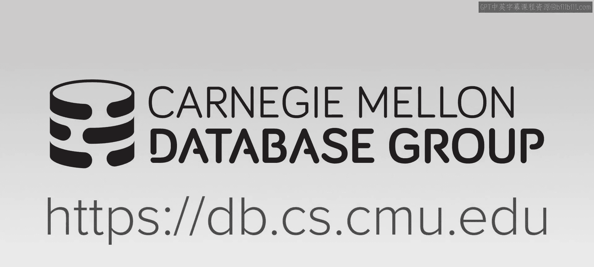
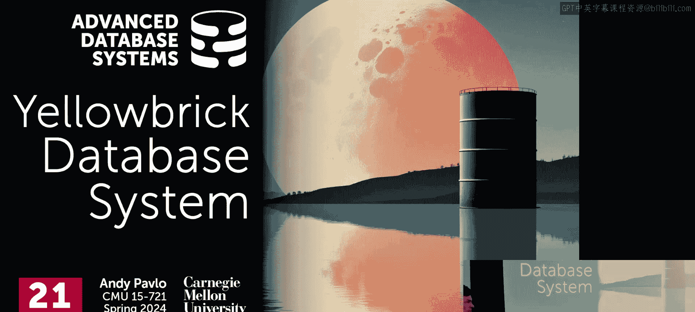
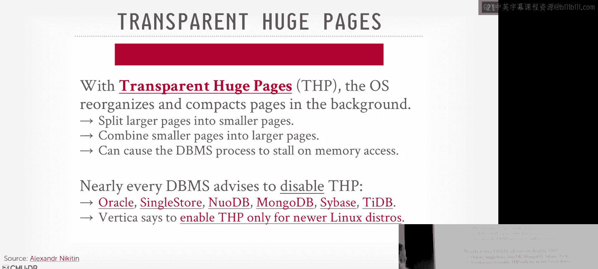
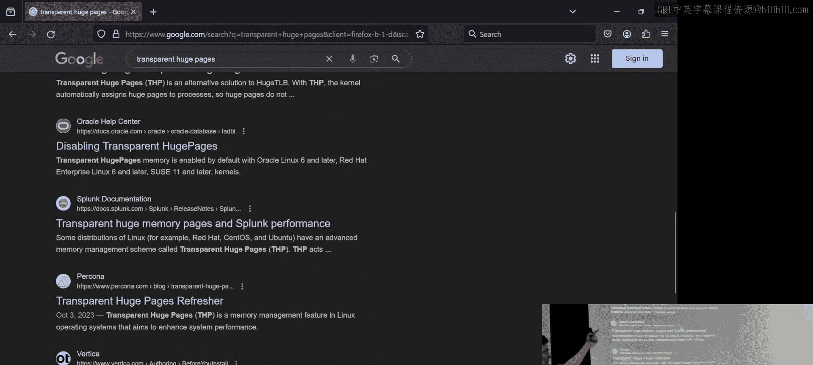
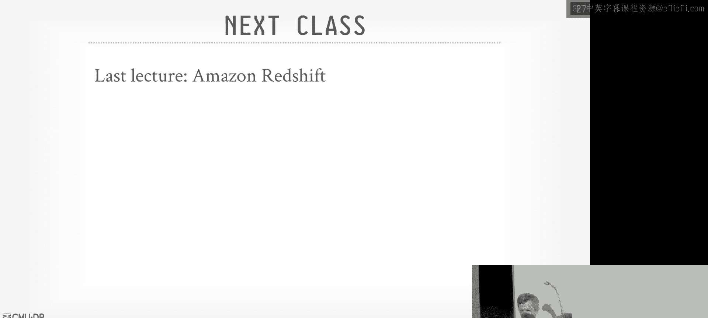

# 21：Yellowbrick 数据仓库系统 🧱

## 概述
在本节课中，我们将学习 Yellowbrick 数据仓库系统。这是一个非常独特的系统，它最初是为专用硬件设备（一体机）设计的，后来成功转型到云端，并在此过程中实现了一系列极致的底层系统优化。我们将探讨其架构、查询处理、存储管理，以及它如何通过绕过操作系统、编写自定义驱动等方式来最大化性能。

---

## 系统背景与演变

上一节我们讨论了 DDB，一个广泛使用但并非为横向扩展设计的系统。本节中，我们来看看 Yellowbrick，一个在专用硬件和云端都追求极致性能的系统。

数据库系统利用专用硬件加速的历史可以追溯到 20 世纪 70 年代的“数据库机器”。当时的挑战在于，定制硬件的开发周期长，等产品上市时，通用 CPU 的性能提升可能已经抵消了定制硬件的优势。因此，除了大型云厂商，如今很少有人尝试定制硬件，更常见的是利用 FPGA 和 GPU 等硬件加速器。

另一种方式是销售“一体机”，即预配置和调优的硬件机架，例如 Oracle 的 Exadata。Yellowbrick 正是以此起步。在其一体机版本中，他们不仅使用了现成的 CPU 和 SSD，还集成了 FPGA 加速器，用于哈希计算、数据解压缩和行列转换等操作。

本课程阅读的论文聚焦于其云版本。其核心动机是：如何将原本在自有硬件上获得的加速优势，在转向云端共享磁盘架构时依然保持。这就是 Yellowbrick 的背景：一家成立于 2014 年的公司，其云版本大约在 2020-2021 年推出。

---

## 核心架构概览

Yellowbrick 是一个 OLAP 数据库系统。它最初采用经典的**无共享**架构，在转向云端后，切换为**共享磁盘**架构，并部署了类似于 Snowflake 的客户端缓存机制。

以下是其关键架构方面的概述：
*   **计算与存储分离**：采用共享磁盘架构。
*   **查询执行**：基于推送模型的向量化查询处理。
*   **查询编译**：全程使用代码生成查询编译，采用类似 Hyper 的“源码翻译”方法，将查询计划转换为 C++ 代码并编译。
*   **缓存**：在计算侧进行缓存，类似 Snowflake。
*   **存储格式**：独立的行存储和列存储组件。支持以行格式进行数据摄取，后台进程再将其转换为优化的列格式。
*   **连接操作**：支持排序归并连接、哈希连接和嵌套循环连接。
*   **查询优化器**：基于 PostgreSQL 9.5 分支，在其优化器基础上注入自己的优化规则。
*   **系统优化**：进行了大量底层系统级优化。

其中，查询编译和底层系统优化是本文讨论最有趣的部分。

---

## 组件与服务

Yellowbrick 的云版本严重依赖 Kubernetes 来编排所有服务。

**主要组件包括：**
*   **前端服务**：管理整个数据仓库实例。包含 PostgreSQL 的部分组件，用于连接处理、SQL 解析、查询优化，以及行存储。
*   **工作节点**：轻量级的容器，执行被分配到的查询任务，维护本地缓存（使用 NVMe 驱动器），并在需要时在节点间移动数据。
*   **后台服务**：运行编译、`ANALYZE`、批量加载等维护任务。

**高层架构流程如下：**
1.  查询到达，经过 PostgreSQL 前端层进行解析和规划。
2.  查询计划被交给**调度器**和**编译器服务**。
3.  集中式调度器每 100 毫秒协调一次，将任务分发给各个工作节点。
4.  编译器服务将查询计划转换为 C++ 源代码，利用 LLVM 并行编译，并维护编译缓存。
5.  工作节点执行任务，若缓存未命中则从对象存储（如 S3）获取数据。
6.  使用类 LRU-K 算法管理缓存淘汰。
7.  支持工作节点间的数据移动。
8.  批量加载服务允许直接将大量文件写入对象存储。

关于架构的一个关键点是：论文中称其为“无共享”，但根据其描述（数据主要驻留在对象存储，计算节点通过缓存获取），它实际上更接近 Snowflake 的**共享磁盘**模型。

---

## 存储管理

与之前讨论的“湖仓一体”系统不同，Yellowbrick 采用**托管存储**。用户不能直接在 S3 中的任意文件上运行 SQL，而必须将数据批量导入到 Yellowbrick 系统中，由系统管理存储格式和元数据。

**存储特性包括：**
*   **专有格式**：使用自己的列式存储格式（包含字典编码等优化）。
*   **数据组织**：可以指定分片键和局部排序列。文件大小约为 100 GB，内部包含 2 MB 的块（这个大小与后续性能优化有关）。
*   **批量加载**：支持 Parquet 文件直接批量加载到列存储。
*   **行存储**：用于处理新的插入/更新操作，后台会将其转换为列格式并写入 S3。
*   **事务更新**：支持对列存储数据进行事务性更新，通过维护更改日志实现，并定期进行压缩。

**文件到工作节点的分配**：Yellowbrick 使用** rendezvous 哈希**（一种一致性哈希的变体，更简单）而非 Snowflake 使用的经典一致性哈希。其基本思想是：对每个文件，将其名称与每个工作节点标识符拼接后哈希，得到一个“优先级”分数，然后将文件分配给分数最高的工作节点。当节点增删时，只需重新分配少量文件，避免了大规模数据重排。

---

## 查询处理与优化

**执行引擎**采用推送模型的向量化处理。扫描操作基于列式数据向量化执行，但在数据向上传递进行连接等操作前，会通过一个**转置运算符**将数据转换为行格式（即早期物化），目的是让处理一个元组所需的所有数据都能放入 CPU 的 L3 缓存。节点间数据传输也采用行格式，以减小数据块，使其能适配接收端的 L3 缓存。

**查询编译**作为一个独立服务进行。他们将查询计划拆分为多个片段，并行编译，然后动态链接起来，以克服 LLVM 核心编译器单线程编译的限制。编译服务会缓存编译好的代码片段以供复用。

**查询优化器**基于 PostgreSQL 的优化器，但增加了自己的成本模型扩展和优化规则。特别包括更积极的对象存储文件过滤（利用区域映射等信息）。由于采用托管存储，Yellowbrick 可以像传统数据库一样收集详细的统计信息（直方图、高频值、HyperLogLog 等），供优化器使用。它目前似乎没有像 Dremel 或 Snowflake 那样的运行时自适应优化能力。

---

## 极致的系统级优化 🚀

Yellowbrick 最引人注目的特点是其极致的底层系统优化，其哲学是：**将操作系统视为敌人，并尽可能绕过它**。他们构建了一个“unikernel”风格的运行时，启动时进行少量系统调用获取资源，之后便不再与操作系统交互。

以下是他们实现的一系列自定义组件：

**1. 自定义内存分配器**
*   启动时即从操作系统申请并锁定所有所需内存。
*   在用户空间实现自己的分配器，管理这块大内存池，避免运行时调用 `malloc`。
*   声称比 Linux 的 `glibc malloc` 快 100 倍。
*   使用**大页**（2 MB 或 1 GB）来减少 TLB 未命中，提升内存访问效率。他们警告不要使用 Linux 的**透明大页**，因为其后台重组会导致不可预测的性能下降。

**2. 自定义缓冲区管理器**
*   使用近似 LRU-K 算法进行页面淘汰，类似于 MySQL 的方法：维护年轻子列表和老年子列表，首次访问的页面进入老年列表，再次访问则提升到年轻列表。

**3. 自定义任务调度器**
*   基于协程实现非抢占式的协作式多任务。
*   集中式调度器每 100 毫秒协调集群任务。
*   为了最大化缓存利用率，设计上倾向于让集群在同一时间只全力执行一个查询，并且一个工作节点上的所有线程执行相同的任务（处理不同数据分片），使得指令缓存高度有效。
*   声称其线程调度比 Linux 线程调度快 500 倍。

**4. 自定义设备驱动与网络协议**
*   编写运行在用户空间的 NVMe 和网卡驱动，避免内核态到用户态的内存拷贝。
*   因为觉得 TCP 太慢，基于 UDP 实现了自己的可靠网络协议，在用户态处理可靠性保证。
*   利用 DPDK 进行内核旁路，让线程直接管理硬件队列。
*   为 S3 访问实现了自定义客户端库，声称比亚马逊官方库快 3 倍。
*   在 TPC-DS 基准测试中，这些网络优化带来了平均约 20% 的性能提升（某些查询可达 70%）。

---

## 性能与总结

论文提供了 TPC-DS（SF=1）基准测试结果，比较了 Yellowbrick、Snowflake、Redshift、BigQuery、Synapse 和 Databricks。Yellowbrick 在总执行时间和计算成本上都显示出优势。

然而，需要辩证地看待这些数字：基准测试配置（硬件抽象）、查询计划差异、工作负载特性等因素都会影响结果。真正的性能取决于用户的实际工作负载。

**本节课总结**
本节课我们一起深入探讨了 Yellowbrick 数据仓库系统。我们学习了它从一体机到云端的演变，其基于 Kubernetes 的共享磁盘架构，以及独特的行列混合存储和查询处理模型。然而，最核心的内容是其一系列极致的底层系统优化：自定义内存分配器、缓冲区管理器、任务调度器、设备驱动和网络协议。这些优化体现了通过绕过操作系统、深度控制硬件来榨取极限性能的设计思想。虽然对于新数据库创业公司而言，这种深度优化路径风险很高，但 Yellowbrick 的成功实践展示了在数据库系统中追求极致性能的可能性与代价。最终，所有这些底层优化都必须建立在优秀的查询优化之上，否则低效的查询计划将使得任何底层加速变得毫无意义。