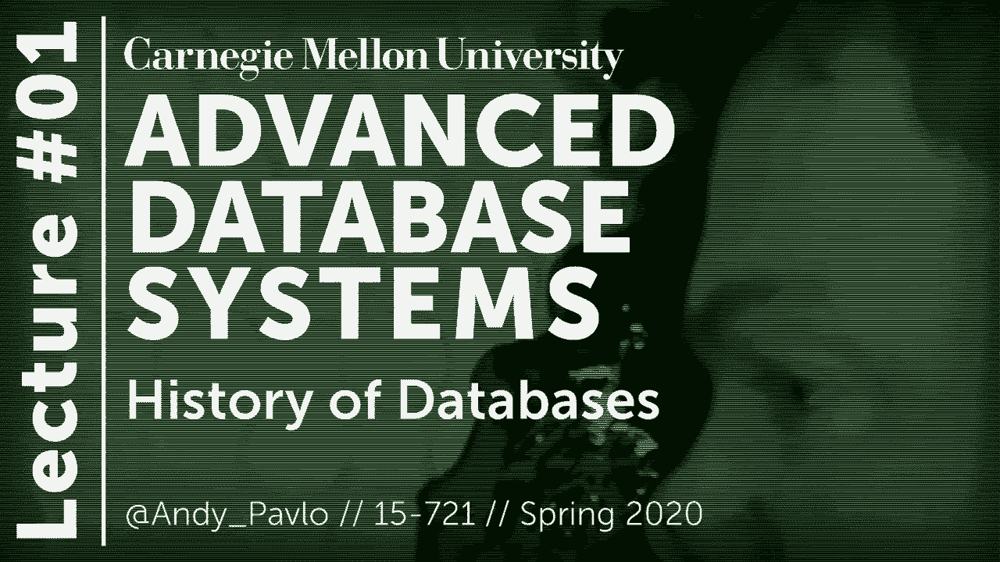
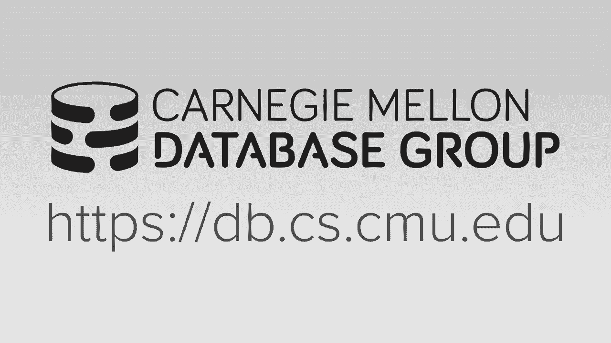
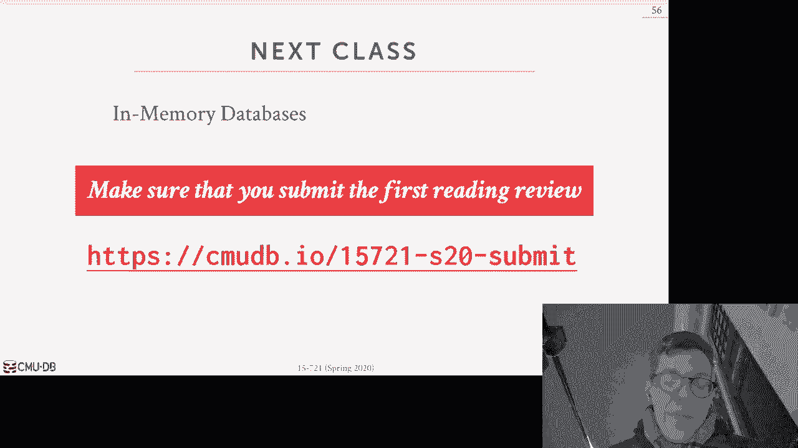

# 数据库系统进阶：1：数据库历史 📜

在本节课中，我们将一起回顾数据库系统的发展历史，了解从早期模型到现代系统的演变过程，并理解为什么许多核心思想在今天依然至关重要。

## 概述

本节课将首先介绍CMU 15-721课程的总体安排与目标，然后深入探讨数据库系统的历史脉络。我们将看到，尽管硬件环境发生了翻天覆地的变化，但许多数据库领域的核心挑战和设计理念，如并发控制、索引和事务处理，自上世纪六七十年代以来一直存在并持续演进。

## 课程介绍与目标

本节将介绍CMU 15-721课程的结构、学习目标以及对学生未来职业发展的帮助。

### 为什么学习数据库系统进阶

当前，全球范围内对数据库系统开发者的需求都非常巨大。数据管理领域存在大量尚未解决的问题，许多公司急需相关人才。学习本课程将使你具备立即受雇于相关岗位的能力。

即使你未来的职业生涯并非专门从事数据库系统开发，你在本课程中学到的知识和技能也将广泛应用于计算机科学和信息技术的其他领域。具备数据库系统（以及操作系统或嵌入式系统）编码能力的人，几乎可以在任何应用领域找到工作。

### 课程核心目标

本课程的核心目标是让你掌握构建数据库系统的背景知识和最佳实践，并在此过程中提升你的底层系统编程能力。到学期结束时，你将学会如何在数据库的语境下编写**正确**且**高性能**的系统代码。

在实践中，虽然正确性优先于性能是理想情况，但现实世界有时并非如此。例如，MongoDB或MySQL等非常成功的数据库系统，最初就是优先追求性能，然后再解决正确性问题。

此外，本课程还将教你如何为数据库系统进行**正确的文档编写和测试**，学习如何进行**代码审查**，以及如何在**大型代码库**中协作。这些技能对于你在任何大型科技公司的职业生涯都至关重要。

### 课程核心主题

本学期将围绕一个核心主题展开：**单节点内存数据库系统**。这意味着我们将主要忽略将数据写入磁盘的挑战（这是磁盘数据库系统的一部分），也暂时不考虑分布式数据库系统带来的问题。

这并非说分布式数据库不重要，而是本课程将专注于让单节点系统尽可能快速且正确地运行。在尝试水平扩展（分布式）之前，先垂直扩展（单节点优化）通常是更好的选择。

本课程不是关于经典数据库管理系统的入门课。我们将假设你已经掌握了如两阶段锁、B+树等基础知识，转而关注现代系统中使用的**前沿实现**和**新兴主题**。

我们将讨论的主题包括：
*   并发控制
*   索引数据结构
*   存储模型
*   数据库压缩
*   并行与向量化执行模型
*   网络协议
*   日志与恢复
*   查询编译与优化

### 先修知识要求

我们假设你已经修读过数据库入门课程，并掌握以下核心知识：
*   **SQL**：因为我们将专注于关系型数据库。
*   **可序列化理论与并发控制理论**。
*   **关系代数**。
*   经典数据库的基本算法和数据结构，如**B+树**、**两阶段锁**等。

## 课程政策与安排

本节将介绍课程的具体安排、评分方式以及学术诚信政策。

课程的所有政策与日程安排均可在课程网页上找到。关于学术诚信，请务必遵守学校的相关政策。如果你不确定某项行为（如复制代码）是否构成抄袭，请务必先询问我。我宁愿与你提前讨论，也不愿事后因抄袭问题对你进行处理。

我的办公时间是周一和周三下午1:30至2:30，地点在我的办公室。如果这个时间不合适，请通过邮件与我另约时间。在办公时间，我们可以讨论项目实现、论文理解、职业发展（如如何成为一名数据库工程师），甚至是一些个人事务。

本学期我们有一位助教：Matt Pavlovich。他是一名博士生，也是CMU正在开发的数据库系统的首席架构师/开发者，你们的所有项目都将基于这个系统。任何我无法回答的开发问题，都可以去问他。

### 课程评分构成

本学期成绩由以下几部分构成：
1.  **阅读作业**：15%
2.  **编程项目一**：10%
3.  **编程项目二**：20%
4.  **编程项目三**：45%
5.  **期末考试**：10%
6.  **额外学分**：最高10%

与往年相比，今年取消了期中考试，增加了第二个编程项目，并多了两篇阅读作业。

### 阅读作业

课程网页的日程表中，为每次课都列出了阅读材料。其中标有橙色或黄色星号的论文是**必读材料**，也是课堂讲解的重点。

在每次课前，你需要通过一个Google表单提交对该论文的**综述**，内容包括论文概述、主要结论、评估所用的系统与方法，以及他们使用了哪些**工作负载**进行评估。最后一点对于你完成期末项目非常重要，你可以参考这些论文中的工作负载来评估自己的系统。

综述需在**上课当天上午11:59之前**提交。没有补交机会，但整个学期你可以**跳过4次**提交。最终成绩将基于你实际提交的作业计算。

**请勿抄袭**。我们会使用MOSS等工具进行检查，一旦发现抄袭将按校规处理。

### 编程项目

我们正在CMU构建一个新的数据库管理系统（目前内部代号为Terrier）。这是一个用C++11/14/17编写的现代代码库，支持多线程，使用LLVM进行查询编译，完全开源，并设计为与PostgreSQL兼容，方便通过终端交互。

所有项目都将基于此系统，并使用GitHub进行管理。下周初将有一次辅导课，介绍系统源代码结构和如何开始第一个项目。

开发将在你的本地机器上进行。该系统可以在Linux和macOS上构建。对于Windows用户，我们提供了Vagrant配置文件，可以在Linux虚拟机中运行。

对于项目一和项目二（可能包括项目三），建议使用Amazon EC2机器进行性能测试和基准测试，因为它们通常比本地笔记本电脑拥有更多核心。我们将为每位学生提供亚马逊云服务的抵扣券。

*   **项目一**：个人完成。我们将提供测试用例、脚本和清晰的修改说明，并教你如何使用性能分析工具。
*   **项目二**：以**三人小组**形式完成。
*   **项目三**：小组项目。你需要选择一个与课程主题相关的、需要大量编程工作的独特项目，并需获得我的批准。在春假后，我也会提供一些示例项目主题供选择。

**请勿在项目中进行抄袭或相互抄袭**。如果对使用第三方库有疑问，请与我讨论。

### 其他事项

期末考试将是开卷考试，包含基于课程和阅读材料的长问答题。考试将于4月22日下发。

额外学分机会是撰写一篇关于某个特定数据库系统的维基百科风格文章。我们正在CMU编写一个数据库系统百科全书，目前已知有超过683个系统。你可以选择一个感兴趣的系统，描述其实现方式，并提供引用和出处。这是完全可选的。

课程的所有讨论将在Piazza上进行。关于项目的技术问题（如编译、代码理解）请发布在Piazza上，以便集体讨论。其他非学术事务（如请假）请直接给我发邮件。

## 数据库系统历史

上一节我们介绍了本课程的整体框架，现在让我们深入历史，看看数据库系统是如何一步步发展到今天的样子的。

本节内容主要基于两篇论文：Mike Stonebraker在2005年发表的《What Goes Around Comes Around》，以及我与一位行业分析师合著的《What’s Really New with NewSQL?》。核心观点是：**早期数据库系统面临的许多问题在今天依然相关**，只是硬件环境不同了。历史常常重演，例如当前关于SQL与NoSQL的争论，就与1970年代关系模型与CODASYL（网络数据模型）的争论如出一辙。

### 早期系统：IDS与IMS

最早的数据库系统之一是1960年代在通用电气（GE）内部开发的**IDS**。它采用了**网络数据模型**，并且在执行查询时，需要编写循环来**一次处理一个元组**。GE后来将其计算机部门卖给了霍尼韦尔（Honeywell）。

IDS的主要贡献者Charles Bachman后来帮助制定了**CODASYL**标准，这是一个为COBOL程序访问数据库定义的标准API，同样基于网络数据模型和单元组处理方式。Bachman因其工作获得了图灵奖。

**网络数据模型**要求程序员通过复杂的循环来遍历预设的“成员集”指针以查找数据。这不仅使查询编写复杂，而且由于当时磁盘不可靠，一旦这些指针集合损坏，整个数据库就可能无法恢复。

与此同时，IBM开发了**IMS**，用于管理阿波罗登月计划的零件供应链。IMS使用了**层次数据模型**，并允许程序员定义物理存储格式（如哈希表或有序树）。同样，查询也需要通过循环遍历层次结构，一次处理一个元组。

层次模型会导致**数据冗余**（例如，同一零件被多个供应商供应时，零件信息会被重复存储）。此外，它也没有实现**物理数据独立**，即逻辑数据模型与物理存储结构紧密耦合，一旦存储结构改变，应用程序代码就必须重写。

### 关系模型的革命

IBM的研究员Edgar F. Codd目睹了程序员因模式或布局变更而不断重写IMS和CODASYL程序的情况。他认为这是一种浪费，并提出了**关系模型**作为解决方案。

关系模型有三个关键思想：
1.  **简单数据结构**：数据以**关系**（即表）的形式存储。
2.  **高级声明式语言**：通过高级语言（后来发展为SQL）操作数据，该语言可以处理**集合或包**，而非单个元组。
3.  **物理数据独立**：关系的物理存储方式由DBMS实现决定，对应用程序透明。这避免了因存储结构改变而重写应用代码。

回到之前的例子，在关系模型中，我们会有Supplier、Part和Supply三个表，通过外键关联。要查找某个供应商提供的所有零件，只需执行一个**连接**操作即可。这种基于集合的操作方式非常强大，也是本学期讨论的基础。

尽管关系模型在今天看来是理所当然的，但在当时却颇具争议。人们怀疑高级声明式语言生成的查询计划能否达到手写代码的效率。

### 关系数据库的崛起与固化

1970年代，关系模型在与CODASYL的争论中逐渐胜出。几个重要的关系数据库系统被开发出来：
*   **System R**：IBM研究院开发，使用了SQL。
*   **Ingres**：加州大学伯克利分校开发，由Mike Stonebraker领导，最初使用QUEL语言。
*   **Oracle**：商业公司，早期就采用了SQL。

IBM最终发布了**DB2**（而非System R）作为其商业产品。由于IBM的市场地位，SQL成为了事实标准。Ingres后来也增加了对SQL的支持。

1980年代，许多其他商业关系数据库公司涌现，如Informix、Sybase、Teradata等。Stonebraker在Ingres的商业化经验基础上，回到伯克利开发了**Postgres**，即今天PostgreSQL的前身。

### 对象数据库与“历史重演”

1980年代末，随着面向对象编程语言的流行，出现了**对象-关系阻抗不匹配**问题：需要将内存中的复杂对象分解才能存入关系表，查询时再组装回来，这很麻烦。

作为回应，出现了**对象数据库**，旨在直接存储对象。然而，它们未能广泛流行，主要原因包括缺乏标准查询语言、与特定编程语言绑定等。但值得注意的是，它们的技术（如存储复杂嵌套数据）以另一种形式留存了下来——现代关系数据库中对**JSON或XML字段**的支持，本质上实现了类似的功能。

这正应了Mike Stonebraker“历史重演”的观点。

### 互联网时代与专业化趋势

1990年代，数据库领域相对平稳。微软获得了Sybase源代码的授权，移植到Windows NT上，发展成了**SQL Server**。MySQL作为mSQL的替代品出现。PostgreSQL增加了对SQL的支持。SQLite由一个开发者创建并广泛应用。

2000年代，互联网爆发式增长，数据量和并发需求远超从前。昂贵的传统企业级数据库和功能不完善的早期开源数据库（如MySQL最初不支持事务）难以满足需求。于是，大型公司（如Facebook、Google）开始开发自定义的中间件来分片和扩展数据库。

同时，针对海量数据分析的**数据仓库**兴起，如Netezza、Teradata（更早）、Greenplum、Vertica等。这些系统通常是**分布式、共享无**的，并且很多采用了**列式存储**，这对分析型负载更高效。

### NoSQL与NewSQL

2000年代末，Google、Amazon等公司为了满足Web应用对**高可用性**和**可扩展性**的极致需求，选择牺牲传统数据库的**事务、联接和SQL支持**，推出了如Bigtable、DynamoDB等系统，引发了**NoSQL**运动。

作为对NoSQL的回应，出现了**NewSQL**系统，它们旨在为事务型工作负载提供与NoSQL相当的性能和可扩展性，但同时**不放弃事务、关系模型和SQL**。例如Google Spanner、CockroachDB等。

### 现代趋势：混合系统、云原生与专业化

2010年代至今，数据库领域呈现以下趋势：
1.  **HTAP系统**：混合事务/分析处理系统，试图在一个系统中同时高效处理事务和分析，如SAP HANA、MemSQL（现SingleStore）、Hyper。
2.  **云原生数据库**：专为云环境设计，通常采用**共享磁盘架构**，将计算与存储分离，可以独立扩展。例如Snowflake、Amazon Redshift、Google BigQuery、Azure Cosmos DB。
3.  **持续的专业化**：针对特定场景优化的数据库不断涌现，如**时间序列数据库**（InfluxDB、TimescaleDB）、**图数据库**等。其中，ClickHouse是一个在分析领域表现卓越的开源列式数据库，我们会在课程中提及。

需要指出的是，许多专业化的系统仍然基于关系模型和SQL，只是在存储、执行等底层做了针对性优化。

## 总结与展望

本节课我们一起回顾了数据库系统从1960年代至今波澜壮阔的发展历史。我们看到，从早期的IDS、IMS，到关系模型的革命，再到互联网时代催生的NoSQL、NewSQL，以及如今的云原生与专业化系统，数据库领域始终在应对数据量、并发性、可用性、扩展性等核心挑战。

一个关键的启示是：**许多核心思想历久弥新**，硬件的变化推动了同一思想的不同实现。关系模型和声明式查询语言（SQL）因其强大的抽象能力和工程实践价值，依然占据主导地位。

展望未来，我认为专业化的数据库会随着用户增长而逐渐扩展其功能范围。同时，在一个组织内，使用关系模型和声明式语言进行数据工程，相比于一堆临时性的脚本，更有利于协作、维护和知识复用。

下一节课，我们将正式进入课程核心，介绍**内存数据库**，探讨它们与磁盘数据库的区别，以及为何它们成为现代数据库设计的重要基础。请记得查看课程日程，完成第一次阅读作业并提交综述。