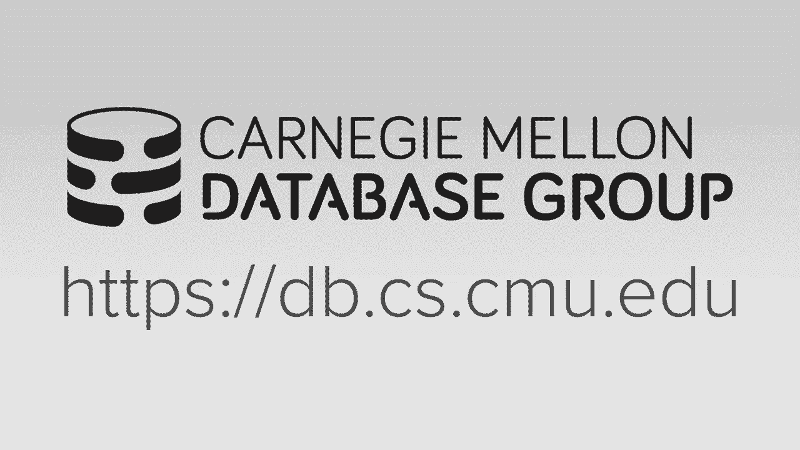

# 2：内存数据库 🚀



在本节课中，我们将要学习内存数据库的核心概念。我们将探讨为何传统的磁盘数据库架构在数据完全能放入内存时，性能依然无法达到最优，并深入了解内存数据库的设计哲学、关键优势以及面临的挑战。

## 从磁盘数据库到内存数据库 🔄

上一节我们回顾了数据库系统的发展历史。本节中我们来看看硬件限制如何塑造了数据库架构。早期的关系型数据库系统设计基于当时的硬件条件：单核CPU、容量有限且昂贵的RAM，以及相对缓慢的磁盘。因此，整个系统架构都围绕着从磁盘高效检索数据来构建。

在现代，硬件已发生巨大变化。许多数据库可以完全放入主内存中。虽然像谷歌、Facebook这样拥有PB级数据的公司是例外，但对于99%的应用而言，其数据库大小在GB到TB级别，完全有可能放入内存。

要理解这一点，需要区分结构化数据和非结构化数据。结构化数据具有明确定义的模式和属性，通常规模较小。非结构化数据（如视频、音频）或半结构化数据（如日志文件）通常规模更大。本课程主要关注结构化数据，因为只有结构化数据才能应用我们讨论的查询优化技术。

## 磁盘数据库架构的瓶颈 ⚙️

你可能会想：如果我的数据库能完全放入内存，那么直接给一个传统的磁盘数据库系统分配足够大的缓冲池，让所有数据常驻内存，不就能获得最佳性能了吗？答案是否定的。我们需要理解原因。

首先，我们来定义什么是磁盘数据库系统。这类系统的架构基于一个核心假设：数据库的主要存储位置在非易失性存储设备上，如硬盘或SSD。因此，系统的所有算法和数据结构都必须考虑到随时可能需要从磁盘获取数据。

数据库被组织成固定长度的页（或块），并使用内存缓冲管理器来缓存从磁盘读取的页。其工作流程的核心是缓冲池管理。

以下是查询访问一个元组时的简化步骤：
1.  查询通过索引找到目标元组所在的页ID。
2.  系统检查该页是否已在缓冲池中。
3.  如果在，则直接返回内存指针。
4.  如果不在，则需要选择一个空闲帧来存放该页。
5.  如果没有空闲帧，则需根据淘汰策略（如LRU）选择一个页驱逐。
6.  如果被选中的页是“脏”的（已被修改），则必须先写回磁盘。
7.  完成驱逐后，从磁盘读取目标页到空闲帧。
8.  更新页表，记录新页的内存位置。
9.  释放相关锁存器，允许访问。

**问题在于**：即使数据全在内存中，每次访问元组时，系统仍需经历查找页表、地址转换、获取锁存器等过程。执行淘汰策略、更新内部访问统计信息也成了无谓的开销。此外，为处理磁盘I/O导致的线程停顿而设计的复杂并发控制、日志恢复机制（如维护独立的锁管理器、记录重做/撤销日志等），在纯内存环境下都可能显得冗余和低效。

一项2008年的MIT研究量化了这种开销。他们在一个数据全在内存的磁盘架构数据库上运行TPC-C基准测试，统计了CPU指令在不同组件的分布：
*   **34%** 用于缓冲池管理（页表查找、元数据更新）。
*   **14%** 用于锁存（保护内部数据结构）。
*   **16%** 用于加锁（两阶段锁定的开销）。
*   **12%** 用于日志管理（准备日志记录）。
*   **16%** 用于B+树遍历（必要的键值比较）。
*   仅有 **7%** 的指令用于执行事务逻辑等“实际工作”。

这清楚地表明，即使数据常驻内存，传统磁盘架构带来的固有开销仍会严重制约性能。

## 内存数据库系统设计 🧠

现在，我们转向内存数据库系统。这类系统假定数据库的主要（甚至永久）存储位置在主内存中。这意味着查询可以假设所需数据始终在内存中，从而避免了磁盘架构中的大部分检查和管理开销。

内存数据库的概念并非新事物，早在20世纪80年代就已提出，但直到近十年DRAM容量和成本达到合适水平后才真正可行。早期的商业系统包括TimesTen、DataBlitz和Altibase。

在内存数据库中，数据仍被组织成块或页，但处理方式不同：
*   **直接内存指针**：索引可以直接返回内存地址，而非磁盘页ID和偏移量。
*   **固定长度与可变长度数据**：固定长度数据（如整数、日期）存储在固定长度的块中，通过简单的内存算术即可定位。可变长度数据（如字符串）则存储在独立的数据池中，固定长度块中仅存储指向它们的指针。这与磁盘上使用槽式页（Slotted Page）来内联存储可变长度数据的策略不同。

以下是内存数据库在设计上的一些关键差异：

**索引结构**
*   现代内存数据库需要考虑CPU缓存与主内存之间的速度差异，因此索引结构需要优化以减少缓存未命中。
*   **有趣的是**，尽管B+树最初为磁盘设计，但由于其缓存友好性，在内存数据库中依然表现优异。
*   许多内存数据库在重启后选择**重建索引**，而非将索引更改记录到日志或写入磁盘。因为从磁盘加载数据后，在内存中重建索引的CPU开销，远小于在运行时维护索引日志的开销。

**查询处理**
*   磁盘I/O不再是瓶颈，因此需要关注函数调用、分支预测、数据移动和复制等CPU层面的开销。
*   顺序扫描与随机访问的性能差异变小，一些为最大化顺序I/O而设计的算法可能不再是最优选择。

**日志与恢复**
*   由于没有“脏页”需要写回磁盘，日志记录的内容可以更精简（例如，可能不需要存储撤销信息）。
*   标准技术如组提交（Group Commit）仍然适用，但可以设计更轻量级的日志方案。

## 内存环境下的并发控制挑战 ⚔️

当磁盘I/O不再是关键路径上的瓶颈时，其他瓶颈就会凸显出来。并发控制（锁、锁存器）便是核心挑战之一。

在磁盘数据库中，停顿主要源于等待磁盘I/O。而在内存数据库中，停顿则源于多个事务争抢同一数据对象上的锁。由于所有数据（包括锁信息）都在内存中，访问锁表的成本与访问数据本身的成本相近。因此，理想的设计是将锁信息与数据本身紧密结合，以便一次性完成访问。

现代CPU提供的**原子操作**，如**比较并交换**，是实现高效无锁（lock-free）或无锁存（latch-free）数据结构的关键。其基本逻辑用伪代码表示如下：
```cpp
bool CompareAndSwap(int* address, int compare_value, int new_value) {
    if (*address == compare_value) {
        *address = new_value;
        return true;
    }
    return false;
}
```
这条指令能原子性地完成“读取-比较-写入”操作，是构建高性能并发协议的基础。

接下来，我们回顾两类主要的并发控制协议：

**1. 两阶段锁**
这是一种悲观协议，假设冲突经常发生。事务在访问任何对象前必须先获得锁。
*   **阶段**：增长阶段（获取锁），收缩阶段（释放锁）。实践中，许多系统在事务提交时才释放锁（严格两阶段锁）。
*   **死锁处理**：可通过**死锁检测**（后台线程检测并解除）或**死锁预防**（如“无等待”或“等待-死亡”策略）来解决。

**2. 时间戳排序**
这是一种乐观协议，假设冲突很少发生。它使用时间戳来决定事务的串行顺序。
*   **基本时间戳排序**：每个数据记录维护读时间戳和写时间戳。事务的每次读写操作都需检查时间戳，若违反时序则中止事务。
*   **乐观并发控制**：事务在私有工作空间中读写数据的副本。提交时进行验证，若无冲突则将修改合并到全局数据库。

在低冲突场景下，OCC等乐观协议性能优于2PL，因为它们避免了不必要的锁开销。但在高冲突场景下，所有协议都可能退化为近似串行执行，浪费大量资源在冲突处理上。

## 高并发下的协议性能研究 📊

为了深入理解高并发下的瓶颈，我们借助一篇论文（基于DBX 1000可插拔并发控制测试平台）的研究结果。该实验在模拟的千核NUCA架构CPU上运行YCSB键值存储工作负载。

以下是核心发现：

**1. 只读工作负载（无冲突）**
*   死锁检测和“无等待”协议几乎能线性扩展，性能最佳，因为几乎没有锁开销。
*   OCC性能最差，因为复制私有工作空间的开销较大。

**2. 中等写冲突工作负载**
*   死锁检测协议性能变差，因为死锁更频繁，检测和解除死锁成为瓶颈。
*   “无等待”和“等待-死亡”协议表现最好，因为它们在检测到潜在死锁时立即中止事务，重启开销低。
*   时间戳排序类协议（基本T/O， MVCC， OCC）性能相近。

**3. 高写冲突工作负载**
*   **所有协议的性能在千核规模下都急剧下降**，接近零吞吐量。这表明在高争用环境下，现有协议的扩展性存在根本瓶颈。
*   “无等待”协议在达到一定核心数前相对较好，但最终也崩溃了。
*   OCC在低核心数时最差，但在高争用下反而相对最好，因为它本质上退化到确保至少一个事务能提交的串行验证阶段。

性能剖析显示，在高争用下，系统时间主要花费在：中止事务（“无等待”）、等待获取锁（2PL）、等待时间戳分配或死锁检测线程上。

## 识别与应对瓶颈 🎯

该研究指出了几个关键瓶颈及其潜在解决思路：

**锁抖动**
*   **现象**：一个事务等待锁的时间过长，会导致后续等待同一锁的事务形成“车队效应”，使系统吞吐量急剧下降。
*   **实验验证**：通过强制事务按主键顺序加锁的实验，可以观察到随着争用加剧，吞吐量出现经典的下滑曲线。

**时间戳分配**
*   在极高并发下，为事务分配全局唯一时间戳可能成为瓶颈。
*   解决方案包括使用**批处理原子递增**或硬件时钟，避免使用互斥锁。

**内存分配**
*   对于OCC等需要复制数据的协议，频繁的内存分配（如使用默认的`malloc`）可能代价高昂。
*   应使用高性能内存分配器，如`jemalloc`或`tcmalloc`。

## 总结与展望 🌟

本节课中我们一起学习了内存数据库的核心知识。我们了解到，内存数据库的设计与磁盘数据库有显著不同。虽然概念模型相似，但实现细节必须针对内存访问特性、CPU缓存、高并发争用等新瓶颈进行优化。

内存数据库已不再是 exotic 的系统，而是被广泛接受。然而，近年来DRAM容量和价格的进步似乎放缓，而SSD的发展迅猛。因此，未来的一个有趣方向是如何在利用SSD大容量优势的同时，避免引入传统磁盘数据库的全部开销，即设计出能智能利用存储层次结构的新型数据库系统。


下一节课，我们将深入探讨现代数据库中最主流的并发控制技术——多版本并发控制，它如何优雅地应对许多我们今日讨论的挑战。