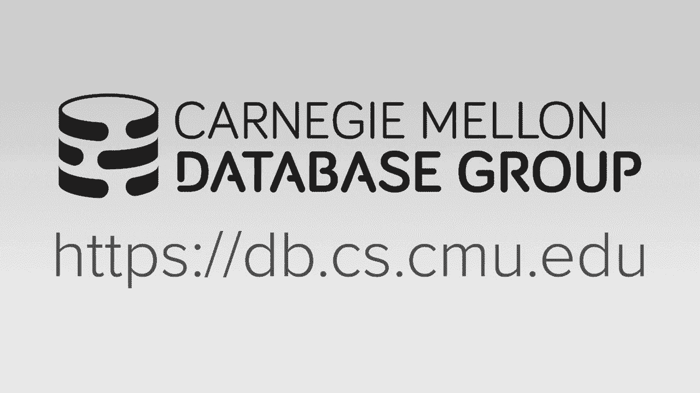
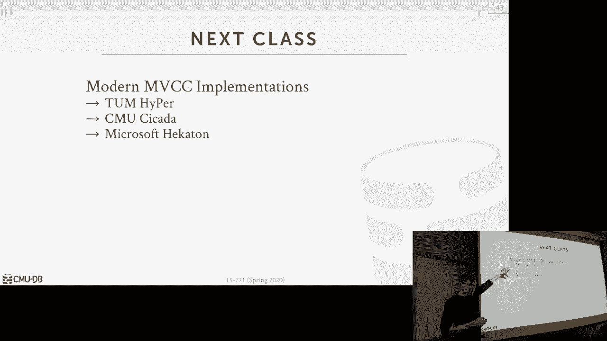

# 数据库系统进阶：P3：L3- 多版本并发控制 1 [设计决策] 🧠

在本节课中，我们将深入学习多版本并发控制（MVCC）的核心概念与设计决策。MVCC是现代数据库系统中实现高并发的一种关键技术，它通过维护数据的多个版本来允许读写操作互不阻塞。

## 概述 📋

多版本并发控制（MVCC）并非一个具体的并发控制协议，而是一种数据库系统设计范式。其核心思想是：对于数据库中的一个逻辑对象（如表、元组或属性），系统会在底层维护其多个物理版本。当一个事务写入对象时，它不会直接覆盖现有值，而是创建一个包含本次更改的新版本。当读取数据时，数据库系统需要根据事务的上下文，决定应该读取哪个版本的数据。

## 多版本并发控制基础

上一节我们概述了MVCC的基本思想，本节中我们来看看其具体的工作原理和带来的优势。

MVCC的主要优势在于：
*   **写操作不阻塞读操作，读操作也不阻塞写操作。** 这与两阶段锁（2PL）不同，在2PL中，写操作需要获取排他锁，会阻塞所有其他操作。
*   **对于只读事务，它们可以获得数据库的一个一致性快照。** 这意味着事务可以看到在其开始时已提交的所有数据版本。
*     **支持“时间旅行”查询。** 理论上，如果保留所有旧版本且不进行垃圾回收，可以查询数据库在历史某个时间点的状态。

**快照隔离**是MVCC常提供的一种隔离级别。事务启动时，会看到数据库在该时间点的一个一致性快照。这意味着事务只能看到在其开始之前已提交的事务所做的更改。对于写-写冲突，通常采用“先写者获胜”的简单规则：第一个写入某个对象的事务成功，后续尝试写入同一对象的事务将中止。

然而，需要注意的是，快照隔离本身**并不保证可串行化**。它容易受到“写偏斜”异常的影响。我们将在后续课程中探讨如何增强MVCC以实现可串行化隔离级别。

## MVCC设计决策 🔧

实现一个现代MVCC系统涉及一系列关键的设计决策，这些决策会影响系统的性能、存储开销和复杂度。主要包含以下四个方面：

### 1. 并发控制协议

尽管MVCC是一种版本管理机制，但它仍然需要与传统的并发控制协议结合使用。关键在于如何将这些协议适配到多版本环境中，特别是在内存数据库的上下文中，我们希望避免全局数据结构，而是将元数据（如锁信息）存储在元组本身。

我们将重点讨论**时间戳排序（MVTO）** 和**两阶段锁（2PL）** 在MVCC中的实现。

每个元组都需要一个头部来存储元数据。一个典型的头部可能包含：
*   `TXN-ID`: 创建此版本或正在修改此元组的事务ID。
*   `BEGIN-TS` 和 `END-TS`: 此版本的生命周期时间戳。
*   `NEXT/PREV`: 指向版本链中相邻版本的指针。

这些字段通常都是64位整数。虽然这带来了存储开销（例如，每元组约32字节），但为了获得细粒度的并发控制，这通常是必要的。

**时间戳排序（MVTO）示例：**
假设一个元组初始版本`A1`的`BEGIN-TS=1`，`END-TS=INF`。
1.  事务`Txn@10`读取`A1`：检查`TXN-ID`为0（无锁），且`10`在`[1, INF)`区间内，故版本可见。然后尝试用`CAS`操作将`READ-TS`更新为10（或更大值）。
2.  事务`Txn@10`写入`B1`：首先用`CAS`操作将`B1`的`TXN-ID`设为10（获取锁）。然后创建新版本`B2`，将`B1`的`END-TS`设为10，并将`B2`的`BEGIN-TS`设为10。最后，释放锁（将`TXN-ID`设回0）。

**两阶段锁（2PL）示例：**
使用`READ-CNT`字段作为共享锁计数器。
1.  读操作：使用128位`CAS`原子地检查`TXN-ID`为0并增加`READ-CNT`。
2.  写操作：使用128位`CAS`原子地将`TXN-ID`设为自身ID（获取排他锁）。完成后释放锁。

**事务ID回绕问题：**
当事务ID计数器达到最大值并回绕时，新事务的ID可能小于旧版本的时间戳，导致版本可见性判断错误。解决方案之一是像PostgreSQL那样，引入一个“冻结”位，标记非常旧的版本，使其在任何事务看来都可见（即属于过去）。

### 2. 版本存储

如何物理存储多个版本对性能有巨大影响。版本通常组织成无锁的单向链表，索引指向链表的头部。头部可以是**最旧版本**或**最新版本**。

以下是三种主要的版本存储方案：

**追加存储**
*   **描述**：新版本作为完整的元组追加到主表空间中。
*   **优点**：实现简单。
*   **缺点**：即使只更新一个字段，也需要复制整个元组，存储开销大。如果版本链从旧到新，读取最新版本需要遍历。

**时间旅行存储**
*   **描述**：主表空间始终存放最新版本。旧版本存储在单独的“时间旅行”表中。更新时，先将当前版本复制到时间旅行表，然后在主表空间原地创建新版本。
*   **优点**：对原有非MVCC架构侵入小。主表和历史表可以采用不同的存储格式（如行存 vs 列存）。
*   **缺点**：仍然需要复制完整元组。

**增量存储**
*   **描述**：主表空间存放最新版本的完整数据（或基础版本）。更新时，只存储被修改字段的增量记录（Delta），并将它们链接成版本链。
*   **优点**：存储空间最优，尤其是当更新只涉及少数字段时。垃圾回收更简单，只需清理Delta记录。
*   **缺点**：读取旧版本时需要“回放”Delta链以重构数据，增加CPU开销。但考虑到大多数查询访问最新版本，且存储优势明显，这通常是更好的选择。

对于包含指向变长数据池指针的元组，在追加存储模式下，即使字符串未修改，创建新版本也可能需要复制指针或整个字符串，这可以通过引用计数或字典编码等技术优化。

### 3. 垃圾回收

随着版本不断创建，需要回收不再被任何活跃事务访问的旧版本（即已“过期”的版本）所占用的空间。垃圾回收需要解决三个问题：如何找到过期版本、如何确定回收是否安全、以及在哪里寻找它们。

两种主要的回收策略：

**元组级回收**
*   **后台清理**：专用线程（如Vacuum）扫描表，根据活跃事务的最小时间戳，识别并回收过期版本。可以通过位图记录被修改的块来加速扫描。
*   **协同清理**：工作线程在执行查询遍历版本链时，就地回收遇到的过期版本。优点是无须后台线程，但可能增加查询延迟，且可能遗漏长期不被访问的“灰尘角落”。

**事务级回收**
*   **描述**：事务在提交时，记录下它使其失效的旧版本指针，并将其加入一个待回收队列。后台垃圾收集线程异步处理这个队列。
*   **优点**：将回收工作移出关键查询路径。但需要保证回收速度能跟上版本生成速度，否则可能耗尽内存。

### 4. 索引管理

索引如何指向正确的版本是一个挑战，其策略与版本存储方案紧密相关。

*   **主键索引**：始终指向版本链的头部。如果更新了主键属性，则视为删除旧元组并插入新元组。
*   **二级索引**：
    *   **物理指针**：直接存储指向版本链头部的内存地址。**优点**：访问快。**缺点**：当版本链头部因更新而改变时（特别是采用“最新到最旧”链表时），需要更新所有相关的二级索引，开销巨大。这是PostgreSQL采用的方式。
    *   **逻辑指针**：不存储物理地址，而是存储一个稳定的逻辑标识符（如主键值或合成的元组ID）。通过一个间接层（如主键索引或映射表）将逻辑ID转换为当前版本的物理地址。**优点**：版本链头部变化时，只需更新间接层，无需更新所有二级索引。**缺点**：引入了一次额外的查找开销。这是MySQL/InnoDB采用的方式。

**重复键问题**：
在MVCC中，即使在唯一索引中，相同的键值也可能在不同快照中存在（例如，一个事务删除键A后，另一个在更晚快照中启动的事务又插入了键A）。因此，索引查找可能返回多个指向不同版本链的指针，需要遍历每个链来找到对当前事务可见的版本。

## 总结 🎯

本节课我们一起深入探讨了多版本并发控制（MVCC）的核心机制与关键设计决策。我们了解到：

1.  MVCC通过维护数据多版本实现了读写不阻塞和高性能的快照隔离。
2.  实现MVCC时，**并发控制协议**（如MVTO、2PL）需要与版本元数据结合。
3.  **版本存储**方案（追加、时间旅行、增量）在存储开销和读取性能之间有重要权衡，增量存储通常是更优选择。
4.  **垃圾回收**对于管理存储空间至关重要，有元组级和事务级等不同策略。
5.  **索引管理**，特别是二级索引，需要谨慎选择物理指针或逻辑指针，以平衡更新开销和读取性能。

这些设计决策共同塑造了一个MVCC数据库系统的行为、性能和资源消耗。理解这些权衡对于构建或有效使用现代数据库系统至关重要。在接下来的课程中，我们将继续探讨如何增强MVCC以实现可串行化，并深入研究垃圾回收等主题。