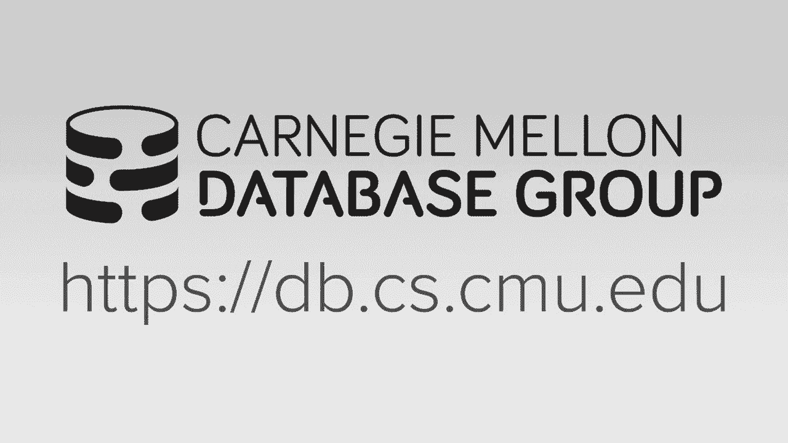
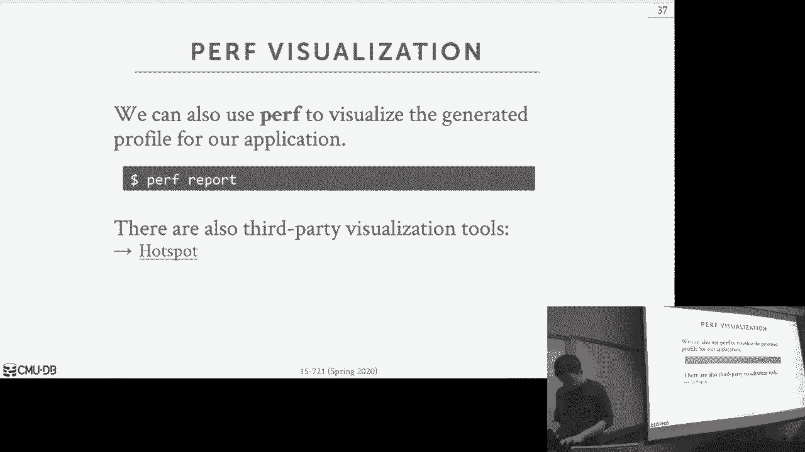
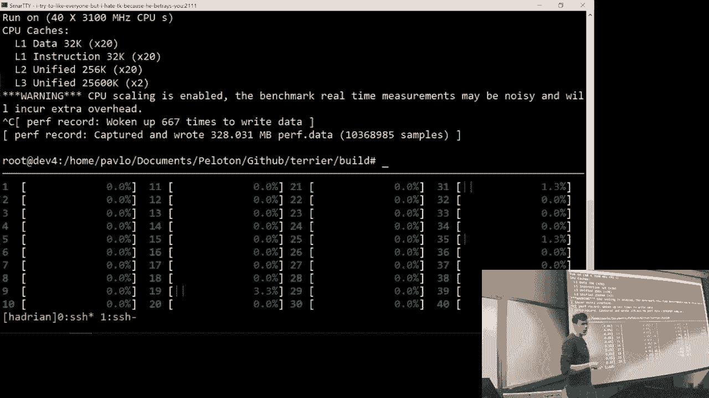
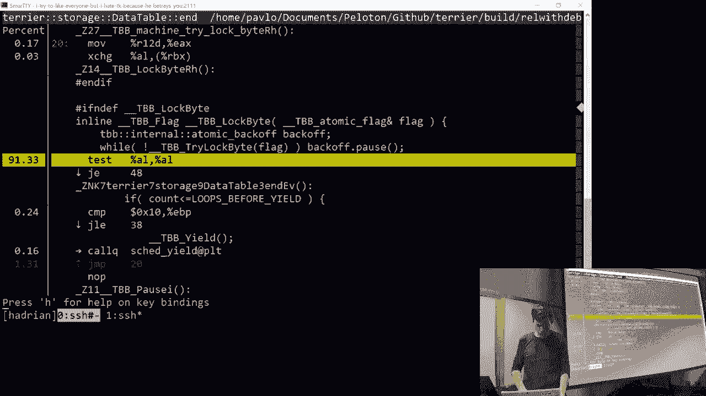
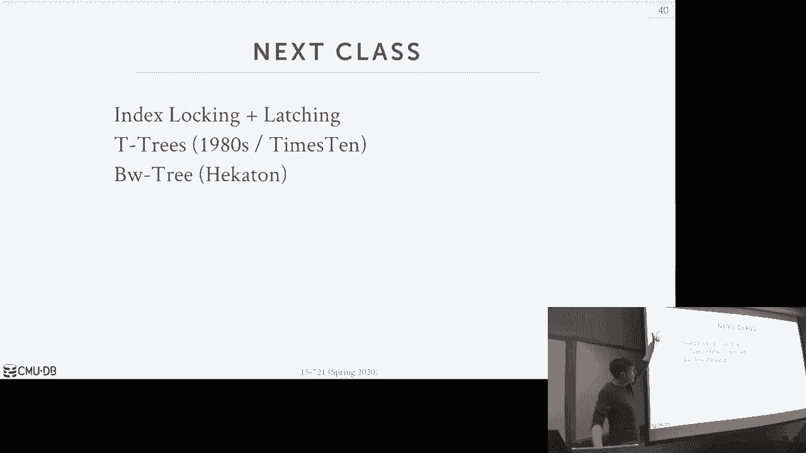

# 5：多版本并发控制 3 [垃圾收集]

## 概述

在本节课中，我们将深入探讨多版本并发控制（MVCC）系统中的垃圾收集机制。我们将了解为什么垃圾收集至关重要，讨论处理删除操作的方法，并分析垃圾收集的不同设计决策，包括版本跟踪、触发频率和回收策略。最后，我们将简要介绍性能分析工具，以帮助识别和优化系统瓶颈。

## 垃圾收集的必要性

在MVCC数据库系统中，垃圾收集是必不可少的。我们需要识别可回收的物理版本并将其移除，否则系统将耗尽存储空间。例如，早期的PostgreSQL为了支持时间旅行查询，最初没有实现垃圾收集，但随着数据更新频率增加，空间迅速耗尽，最终不得不添加垃圾回收功能。

可回收版本的定义是：系统中没有活跃事务能够看到该特定物理版本。这意味着在快照隔离级别下，该版本对任何事务都不可见。此外，由中止事务创建的版本也需要被清理。

MVCC的优势在于，我们用于提供快照隔离的时间戳同样可以用来确定元组何时可见。用于确定事务全局顺序的时间戳也定义了物理版本的生命周期。如果没有人能看到某个版本，我们就可以将其移除。

## 长事务带来的挑战

在OLTP环境中，事务通常是短期的。然而，当引入分析型工作负载和长时间运行的查询时，情况就变得复杂了。在快照隔离下，长时间运行的查询需要看到其开始时已提交的数据库快照。如果查询运行一小时，它就需要看到那一小时内数据库的状态。

这带来了传统垃圾收集方法的问题。传统方法通过比较时间戳和所有活跃事务的最小时间戳来判断版本是否可回收。但如果存在运行一小时的查询，那么很多版本在很长时间内都无法被回收。

## HTAP与隔离级别

在2000年代，人们意识到需要为OLTP和OLAP工作负载分别构建专门的系统。HTAP（混合事务/分析处理）是一个较新的概念，其目标是在数据到达后立即运行分析查询，而无需通过ETL过程将数据从OLTP系统卸载到另一个数据库。

在学术界，通常假设事务在可序列化隔离级别下运行。然而，在现实世界中，大多数数据库管理员使用读已提交隔离级别，因为这是PostgreSQL和MySQL的默认设置。虽然某些分析查询确实需要快照隔离或可序列化隔离，但大多数情况下并不需要。

## 旧版本存在的问题

假设我们希望对分析查询实现快照隔离，旧版本会带来几个问题：
1.  **内存使用增加**：创建新版本会使版本链变长，且无法回收内存，导致数据库存储空间无限增长。
2.  **内存分配开销**：如果无法重用旧版本的内存，就需要通过`malloc`向操作系统重新申请内存，这在多线程环境下可能成为瓶颈。
3.  **版本链遍历变慢**：版本链变长意味着事务需要遍历更长的链来找到所需的版本。对于OLTP事务，如果采用从新到旧的遍历顺序，这通常不是大问题，但对于需要找到特定旧版本的分析查询，性能会下降。
4.  **性能波动**：长时间运行的查询结束后，垃圾收集线程需要清理大量旧版本，可能导致CPU使用率激增，影响同时运行的其他查询的性能。许多组织对数据库性能的稳定性有很高要求。
5.  **缓存局部性与压缩**：旧版本分散在表空间中会破坏数据的局部性。当我们需要压缩只读数据时，如果相关数据没有在物理上聚集在一起，就需要额外的工作来合并它们。

## 删除操作的处理

我们讨论了插入和更新，但尚未详细说明如何处理删除操作。删除操作有些棘手，因为需要记录逻辑元组已被删除，即使之后可能插入相同的元组，也不应重用旧的版本链。

以下是两种基本方法：

**方法一：删除标志**
在元组头或单独的位图字段中维护一个标志，表示该逻辑元组已被删除。事务在读取数据库时，需要首先检查此标志。

**方法二：墓碑元组**
在版本链的末尾（或开头，取决于方向）存储一个特殊的物理版本（墓碑元组），用以表示该元组已被删除。这个特殊版本包含时间戳信息，记录了删除发生的时间。任何早于该时间戳的快照仍然可以看到旧的版本。

对于仅追加存储的系统，如果为每个被删除的元组创建一个包含所有属性的墓碑元组，会浪费大量空间。更好的方法是使用一个特殊的、可跨表共享的数据池来存储墓碑元组，因为它不存储任何属性，只记录删除事件和时间戳。

## 索引清理

当事务创建新版本时，也需要更新索引，以便后续读取能够找到新写入的数据。问题在于，如果事务中止或需要清理版本时，必须确保从索引中移除与旧版本对应的键。

Hyper系统采用的方法是：每当更新一个被索引的属性时，就将其视为一次删除后跟一次插入。这样就不需要去查找并更新索引中的键指针。

在Peloton系统的旧版本中，我们采用了一种有问题的做法：对于同一逻辑元组的多次更新，会在索引中创建新条目，但后续更新会直接覆盖前一个索引条目。这导致在中止事务时，我们无法清理所有被插入的键，从而造成索引键“泄漏”。这是一个设计上的教训，凸显了正确跟踪所有索引变更的重要性。

## 垃圾收集的设计维度

接下来，我们讨论垃圾收集的几个关键设计决策：如何跟踪版本、触发垃圾收集的频率、检查版本的粒度以及如何判断版本是否可回收。

### 版本跟踪

主要有三种版本跟踪方法：

**1. 基于元组的清理**
垃圾收集线程或单独的后台线程（如“vacuum”线程）扫描表并识别需要修剪的版本。或者，查询在执行过程中如果遇到对任何事务都不可见的版本，就立即进行清理（“协同清理”）。Hekaton采用了后一种方法。

**2. 事务级跟踪**
事务记录其创建的所有版本，提交时将信息传递给垃圾收集器。垃圾收集器根据系统中活跃事务的时间戳信息，判断哪些版本可回收。Peloton的旧系统采用了这种方法。

**3. 基于周期的跟踪**
将事务分组到不同的“周期”中。当系统从一个周期前进到下一个周期，并且确认没有事务会访问前一个周期中的数据时，就可以回收该周期内失效的所有版本。这种方法在Bw-Tree等数据结构中也有应用。

### 触发频率

垃圾收集的触发频率需要在空间回收速度和事务性能之间取得平衡。

*   **积极回收**：可以更快地释放空间，但垃圾收集线程会消耗CPU周期，可能拖慢事务。
*   **消极回收**：数据库大小增长更快，版本链变长，查询找到正确版本的时间增加。

具体策略包括：
*   **周期性触发**：按固定时间间隔或在可回收版本达到一定比例时触发。
*   **持续/协同清理**：将垃圾收集过程集成到正常的事务处理或查询执行步骤中。例如，Hyper在事务提交时进行清理；Hekaton在查询遍历版本链时进行清理。这种模式具有“自我调节”特性。

### 回收判断与“区间”回收法

判断版本是否可回收时，系统需要检查活跃事务，理想情况下不应获取锁。Hyper论文中描述了一种无锁链表来高效维护活跃事务列表。

一个重要概念是，对于垃圾收集，我们可以允许一定的“宽松性”。如果一次垃圾收集运行中漏掉了一些可回收版本，下次运行时再回收即可，这不会影响正确性。

**传统时间戳比较法**
记录所有活跃事务的最小时间戳（低水位线）。任何时间戳小于此低水位线的版本都不可见，因此可回收。

**区间回收法**
这是Hyper论文的一个重点（概念源自HANA论文）。该方法不是简单地比较单个最小时间戳，而是检查时间戳区间。如果某个版本的生命周期区间与所有活跃事务的可见区间没有交集，那么即使其时间戳大于最小活跃时间戳，也可以被回收。这种方法可以更早地回收某些版本。

对于仅追加存储，实现区间回收相对容易，只需更新版本链指针。对于增量存储，则需要进行“合并”操作：将多个增量记录合并为一个新的记录，包含所有属性的最新修改，并赋予合并记录中最大的时间戳。然后更新版本向量指向这个合并后的记录。

## 内存碎片与压缩

回收内存后，如何处理这些空闲空间？是立即归还给操作系统，还是留在数据库内部重用？

对于变长数据池，我们总是可以重用内存空间。对于定长数据槽，如果立即重用，新老数据可能会在物理存储上交错，破坏“时间局部性”。如果数据在创建时间上相近，那么它们被更新的概率也相近。将“冷”数据（几乎不再更新）集中存储，可以对其应用压缩而无需担心解压更新。如果新旧数据混合存储，压缩效率会降低。

因此，通常需要一种“压缩”机制：将多个有“空洞”（空闲槽）的数据块合并，以提高空间利用率并减少碎片。确定哪些数据可以压缩的方法包括：
1.  **基于最后更新时间**：利用元组头中存储的起始时间戳。
2.  **基于最后访问时间**：如果系统记录了读取时间戳，可以利用它。否则可能需要维护额外的块级元数据。
3.  **基于数据关系**：利用外键等语义信息，将可能被一起访问的数据放在一起，以便统一压缩。

`TRUNCATE`命令是一个特例，它可以被优化为直接删除并重建表，从而避免复杂的清理和碎片整理过程。

## 存储与计算的权衡

垃圾收集是计算机科学中经典的存储与计算权衡的体现。更积极的垃圾收集可以降低内存占用，但会增加计算开销，可能减慢事务速度。更消极的垃圾收集节省了计算资源，但消耗了更多内存。

在与运行MVCC系统（尤其是内存数据库）的从业者交流中，发现大家通常更愿意接受一定的性能损失，以换取内存占用的降低。因为内存不仅购买成本高，维护（能耗）成本也高。因此，像Hyper那样将垃圾收集集成到查询执行中的“协同清理”模式受到青睐。

## 性能分析简介

最后，我们简要介绍性能分析。为了优化系统，我们需要知道时间花在了哪里。一个简单但不切实际的方法是：在调试器中反复暂停程序，查看调用栈。

**阿姆达尔定律**可以用来估算优化某部分代码后系统的整体加速比。公式为：
`整体加速比 = 1 / ((1 - P) + P/S)`
其中，`P` 是可优化部分所占的时间比例，`S` 是该部分的加速比。

我们需要工具来获取`P`的信息。主要工具有：
*   **Valgrind/Callgrind**：通过二进制插桩进行分析，可以给出代码级别的耗时分布，但会使程序运行变慢。
*   **perf**：利用CPU硬件性能计数器，可以收集周期数、缓存未命中等低级信息，开销相对较低。

使用这些工具时，需要以“发布模式但包含调试符号”的方式编译程序，以便在分析结果中看到函数名和源代码行号。通过分析，可以识别系统中的瓶颈（例如，在项目一中，瓶颈可能是一个被频繁争用的自旋锁）。

## 总结

本节课我们一起深入学习了MVCC系统中的垃圾收集。我们理解了垃圾收集的必要性及其在长事务下面临的挑战。我们探讨了删除操作的实现方式、索引键的清理，并分析了垃圾收集在版本跟踪、触发频率和回收策略等方面的关键设计决策。我们还讨论了内存碎片整理、数据压缩以及存储与计算之间的权衡。最后，我们介绍了性能分析的基本概念和工具，为后续的性能调优奠定了基础。下一节课，我们将开始讨论索引结构。