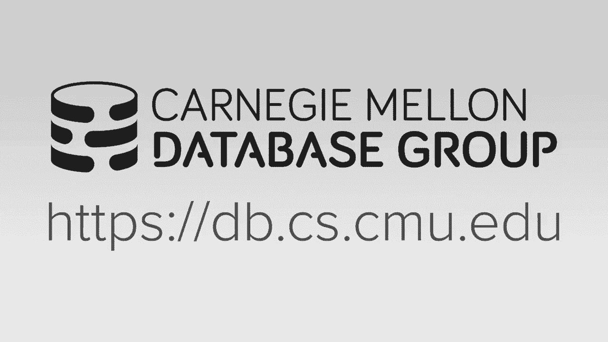
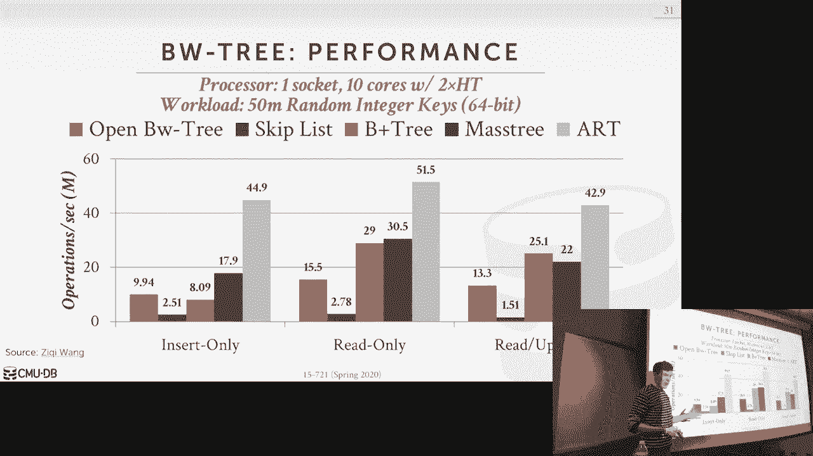

# 6：OLTP索引 1

## 概述

在本节课中，我们将学习用于OLTP工作负载的索引数据结构。我们将首先介绍“全键”数据结构的概念，并以B+树为例。接着，我们会回顾一种历史性的内存数据库索引结构——T树。最后，课程的核心将深入探讨一种无锁的B+树变体——BW树的设计理念、核心机制（如增量记录和映射表）及其面临的性能挑战。

---

## 全键 vs. 部分键数据结构

本节课主要讨论“全键”数据结构。所谓“全键”，是指数据结构是顺序保持的，并且**键的所有位都一起存储**在数据结构的各个节点中。例如，对于一个键“ABC”，在叶子节点中，键“ABC”是完整存储的。当需要进行比较时，可以直接访问节点内完整的键值。

这与我们将在下节课讨论的“部分键”数据结构（或称字典树）形成对比。在部分键结构中，键的各位被拆分并**分别存储**在树的不同节点中。这种方式可能减少比较操作和存储开销，但有时可能需要回查原始元组来获取完整的键信息。

为了便于理解，今天我们将主要围绕B+树展开，并重点讨论BW树，这是当前我们数据库系统中使用的无锁数据结构。

---

## 历史背景：T树

在深入BW树之前，我们先了解一个历史背景。在20世纪80年代，随着内存数据库的早期研究，人们开始寻找比B+树更适合内存环境的数据结构。其中最著名的是**T树**。

T树类似于AVL树，其关键区别在于：**键分散存储在树的各个节点中**（包括内部节点和叶子节点），但节点内部存储的**不是键的副本，而是指向原始元组中键的指针**。

在20世纪80年代内存有限的环境中，这种方法通过避免存储冗余的键副本来节省内存。虽然这带来了额外的指针跳转开销以获取实际键值，但当时CPU缓存与DRAM的速度差异不像现在这样显著，因此这种开销是可以接受的。

T树由威斯康星大学的Toby Lehman等人于1986年提出。有趣的是，“T”来自于发明者Toby的名字，而非其形状。

### T树节点结构

一个T树节点包含：
*   **数据指针**：指向表中实际元组的指针，这些指针按照其对应键的顺序排序。
*   **子节点指针**：指向左右子节点的指针。
*   **父节点指针**：用于反向遍历。
*   **边界键**：存储该节点所代表键范围的最小值和最大值。

**查找过程示例**：假设要查找键K2。从根节点开始，将K2与节点的边界键比较，决定进入哪个子树。到达叶子节点后，需要遍历该节点的数据指针：依次跟随指针获取实际存储的键，并与目标键K2进行比较。

### T树的优缺点

**优点**：
1.  **节省内存**：不在索引节点中存储键的副本。
2.  **潜在过滤优势**：当跟随指针获取键时，已经访问了元组，因此可以同时评估查询中的其他谓词。

**缺点**：
1.  **维护复杂**：平衡操作（如旋转）比B+树的分裂/合并更复杂，需要更重量级的锁。
2.  **缓存不友好**：现代CPU体系结构中，指针跳转导致的缓存未命中代价很高。
3.  **性能问题**：研究表明，对于现代内存数据库，B+树或其变体通常是更好的选择。

因此，除了某些内存极端受限的嵌入式场景外，T树如今已很少使用。

---

## 无锁B+树：BW树

现在，我们转向现代内存数据库索引的核心——如何实现一个**无锁的B+树**。直接构建无锁B+树的主要挑战在于，更新操作常常需要**原子地修改多个内存地址**（例如，更新父节点和子节点间的指针），而标准的原子指令（如CAS）一次只能更新一个位置。

BW树的核心思想是通过引入一个**间接层**来解决这个问题。

### 核心机制一：映射表

BW树引入了一个中央的**映射表**。该表存储了逻辑页ID到物理内存地址的映射。树中的节点只存储逻辑页ID，而不是直接的物理指针。

**查找过程**：当需要从一个节点访问其子节点时，首先读取子节点的逻辑页ID，然后**查询映射表**获取对应的物理地址，最后再跳转到该物理地址。

**更新的关键**：当需要改变一个节点的物理位置时（例如，应用了增量更新后），只需要**使用CAS操作更新映射表中对应逻辑页ID的物理地址**即可。这个单一的原子操作使得所有后续访问都能立即“看到”新的节点版本，而无需更新树中多个指针。

### 核心机制二：增量记录

为了避免就地更新节点导致的缓存失效问题，BW树采用了**增量记录**。

**更新过程**：当需要插入或删除一个键时，并不直接修改原有的“基础页”。而是创建一个**增量记录**，描述要做的更改（例如，“插入键K0”）。这个增量记录包含一个指向旧版本基础页的指针。然后，通过CAS操作，将映射表中该逻辑页的物理地址更新为指向这个新创建的增量记录。

**查找过程**：当访问一个节点时，首先到达增量记录链的头部。查找操作需要**从最新的增量记录开始，按顺序“重放”所有的更改**，以计算出该节点当前应有的状态。如果目标键在增量链中被找到（如插入），则查找成功；否则，需要继续向下查找基础页。

### 处理并发与合并

*   **并发更新**：如果两个线程同时尝试为同一节点添加增量记录，它们的CAS操作会竞争映射表中的同一个条目。只有一个会成功，失败的线程需要重试其操作。
*   **增量链合并**：随着操作增多，增量链会变长，影响查找性能。因此，需要定期进行**合并**：一个线程会读取当前的基础页和所有增量记录，在内存中创建一个合并后的新节点版本，然后通过CAS操作将映射表指向这个新版本。旧版本的基础页和增量链随后可以被垃圾回收。

### 垃圾回收

BW树需要安全的垃圾回收机制来回收旧节点。常用的方法有：
1.  **引用计数**：每个节点维护一个计数器。访问时递增，离开时递减。当计数器为0时可安全回收。但每次访问都涉及原子写操作，性能开销大。
2.  **基于纪元的回收**：系统维护一个全局递增的纪元号。线程在开始操作时注册当前纪元。当节点被合并替换后，其旧版本被标记为“垃圾”并关联到当前的纪元号。只有当系统确认**所有活跃线程的纪元号都大于该垃圾节点的纪元**时，才安全回收该节点内存。这种方法更为高效，也是BW树常用的方法。

### 分裂操作

BW树的分裂也通过增量机制实现：
1.  创建两个新的逻辑页（例如，Page 105），并将原节点（例如，Page 103）的部分键移动到新节点。
2.  在Page 103的增量链头部安装一个**分裂增量记录**。该记录包含原基础页的指针和到新节点（Page 105）的逻辑指针，并说明键的划分边界。
3.  在父节点（例如，Page 101）中安装一个**分隔增量记录**，直接更新其指向子节点的逻辑指针，将一部分键范围指向新的Page 105。这一步不是正确性所必需的，但可以提升后续查找的效率。

---

## BW树的实现挑战与性能

尽管BW树的设计非常精巧，但在实际工程实现中面临诸多挑战：
*   **代码复杂度高**：实现一个正确的、高效的无锁数据结构极其复杂，代码难以维护和调试。
*   **增量链开销**：即使有合并操作，遍历增量链的重放成本在写密集负载下依然显著。
*   **缓存效应**：增量记录通常存储在基础页的预留空间或附近，更新它们仍然会引起缓存行失效，并未完全实现最初“避免缓存失效”的目标。

在我们的性能测试中，一个精心优化的、使用锁的B+树实现，其性能**显著优于**开源的BW树实现。这也引出了下节课的内容：我们可以采用更智能的加锁策略来优化B+树，而不是追求复杂的无锁结构。

---

## 总结

本节课我们一起学习了OLTP索引的基础。我们从“全键”数据结构的概念出发，回顾了历史上为内存数据库设计的T树及其优缺点。然后，我们深入探讨了现代无锁B+树——BW树的核心设计，包括其通过**映射表**和**增量记录**来实现无锁更新的机制，以及相关的垃圾回收和分裂操作。最后，我们了解到，由于实现的复杂性和实际运行时的开销，一个设计良好的**有锁B+树在实践中可能比BW树更具竞争力**。下节课，我们将继续探讨如何优化B+树的锁机制，并介绍部分键索引结构。