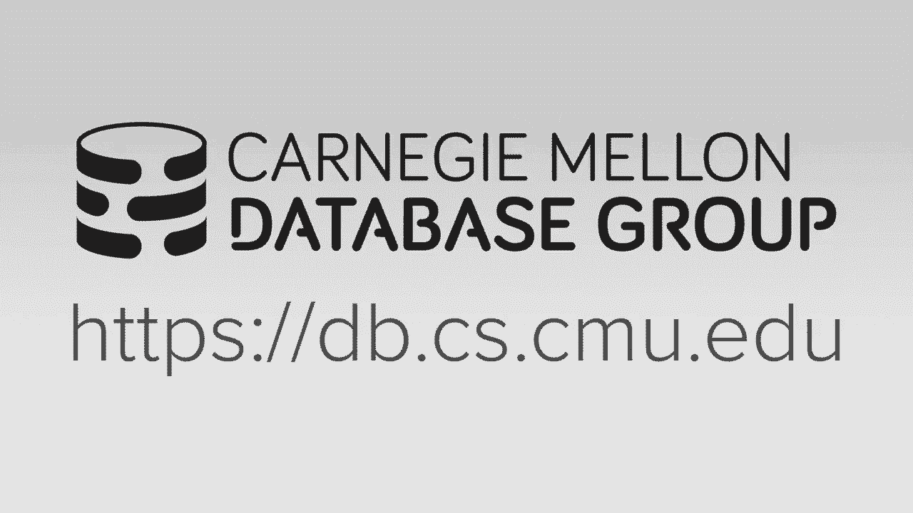

# 7： OLTP索引 2



## 📚 概述
在本节课中，我们将继续探讨联机事务处理（OLTP）中的索引结构。我们将首先深入讨论锁存器（Latch）的实现方式及其在B+树中的应用，然后重点介绍一种名为Trie（前缀树）的索引结构及其变体，包括Judy数组和ART索引。我们将学习如何通过不同的锁存策略和数据结构优化来提升数据库系统的并发性能。

---

## 🔒 锁存器实现
上一节我们介绍了锁存器的基本概念。本节中，我们来看看在数据库系统中如何具体实现锁存器。

锁存器是用于保护数据结构关键部分的低级原语。在数据库系统中，我们需要选择或实现高效的锁存器。以下是几种常见的锁存器实现方式：

### 测试与设置自旋锁
这是最基本的锁存器实现方式。它使用一个内存位置（例如一个字节）来表示锁的状态。线程通过原子操作（如比较并交换）来尝试获取锁。

```cpp
std::atomic<bool> latch{false};
while (latch.exchange(true, std::memory_order_acquire)) {
    // 自旋或执行退避策略
}
// 进入临界区
latch.store(false, std::memory_order_release);
```

### 操作系统阻塞互斥锁
这种实现依赖于操作系统内核提供的互斥锁（如`pthread_mutex`）。当线程无法获取锁时，它会被操作系统阻塞并调度出去。

```cpp
std::mutex mtx;
mtx.lock();
// 进入临界区
mtx.unlock();
```

### 自适应自旋锁
这是一种混合方法，结合了用户空间自旋和操作系统阻塞的优点。线程首先在用户空间自旋一段时间，如果仍未获得锁，则退回到操作系统阻塞。

### 队列自旋锁
为了解决多核环境下缓存一致性的问题，可以使用队列自旋锁（如MCS锁）。每个等待线程在本地自旋，从而减少跨CPU插槽的缓存失效消息。

### 读写锁存器
读写锁存器允许多个读取者同时访问，但只允许一个写入者访问。这对于数据库索引非常有用，因为读操作通常比写操作更频繁。

```cpp
std::shared_mutex rw_latch;
// 读操作
{
    std::shared_lock lock(rw_latch);
    // 执行读操作
}
// 写操作
{
    std::unique_lock lock(rw_latch);
    // 执行写操作
}
```

---

## 🌳 B+树中的锁存策略
了解了锁存器的实现后，我们来看看如何在B+树中应用它们以实现高效的并发访问。

### 锁存螃蟹协议
基本思想是在遍历树时，按需获取和释放锁存器。一旦确定当前节点是“安全”的（即后续操作不会导致该节点分裂或合并），就可以释放其父节点的锁存器。

*   **查找操作**：沿路径获取读锁存器，到达子节点后可释放父节点的锁存器。
*   **插入/删除操作**：沿路径获取写锁存器。仅当确定当前节点不会发生分裂或合并时，才释放祖先节点的锁存器。

### 乐观锁存协议
假设在到达叶节点之前不会发生分裂或合并。因此，查找路径上只获取读锁存器。在叶节点处，获取写锁存器并验证假设。如果假设错误（需要分裂/合并），则中止并重试整个操作。

### 无锁读协议
这是一种更激进的方法，读取操作完全不获取锁存器。它们记录访问节点时的版本号。在操作完成后，检查版本号是否改变。如果改变，说明有写入者修改了节点，读取操作需要中止并重试。写入者仍然使用写锁存器，并配合类似Bw-tree的纪元垃圾收集来安全地回收内存。

---

## 🌲 Trie索引结构
现在，让我们转向另一种索引结构：Trie（前缀树）。与B+树存储完整键不同，Trie将键分解为数字（例如字节），并在树的每一层存储一个数字。

### Trie的基本概念
*   **键**：不被完整存储，而是通过从根到叶的路径来隐含表示。
*   **跨度**：指从一个节点出发的可能路径数，决定了树的扇出和高度。
*   **确定性**：对于给定的键集，无论插入顺序如何，Trie的结构都是唯一的。

一个简单的例子是1位Trie，每个节点存储键的一个比特位。

### Trie的压缩优化
为了减少内存占用，可以对Trie进行压缩：
*   **水平压缩**：对于节点中不存在的数字，不存储空指针，而是使用紧凑的表示（如位图）。
*   **垂直压缩**：对于没有分支的线性路径，可以合并节点，只存储一个指针和数字序列。

---

## 🧮 Judy数组与ART索引
以下是两种基于Trie的高效索引实现：

### Judy数组
Judy数组是一种256路Trie，旨在作为通用的关联数组。它使用“胖指针”来存储节点元数据和子指针。Judy数组根据节点中键的密度，动态选择不同的节点类型以优化内存使用和访问速度。

### ART索引
ART（自适应基数树）是专为数据库索引设计的Trie变体。与Judy数组类似，它也使用多种节点类型（如Node4、Node16、Node48、Node256），并根据子节点数量在它们之间动态转换。ART被设计为指向元组的索引，并采用了之前提到的无锁读协议来处理并发。

### Masstree
Masstree是一种“树的树”结构。每个Trie节点内部使用一个B+树来管理子指针。这结合了Trie的高速查找和B+树的高效范围查询能力。Masstree被用于Silo等学术数据库系统中。

---

## 📊 性能对比与总结
本节课中我们一起学习了OLTP索引的进阶内容。

我们首先深入探讨了锁存器的多种实现策略及其权衡，从简单的自旋锁到复杂的读写锁和队列锁。接着，我们分析了在B+树中应用这些锁存器的不同协议，如锁存螃蟹协议和乐观协议，以支持高并发操作。

然后，我们引入了Trie索引结构，它通过按位或按字节存储键来提供确定性的查找路径。我们探讨了Judy数组和ART索引这两种高效的Trie变体，它们通过自适应节点和压缩技术来优化内存使用。最后，我们简要介绍了结合Trie和B+树的Masstree。

研究表明，对于某些工作负载，特别是点查询，ART等Trie索引的性能可以超越传统的B+树。然而，B+树在范围扫描方面通常仍具有优势。现代数据库系统正在越来越多地考虑采用这些新颖的索引结构来提升性能。


下一节课，我们将讨论系统目录、数据布局和存储模型，开始构建数据库系统的存储层。