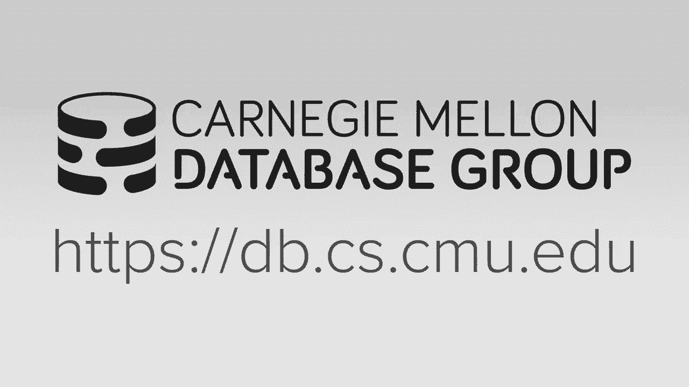
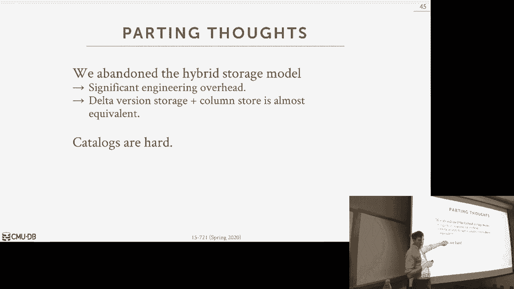

# 数据库系统进阶：P8：数据库存储模型与布局 📚

在本节课中，我们将要学习数据库系统底层的存储模型与数据布局。我们将从最基本的数据类型表示开始，逐步深入到元组布局、行存储与列存储模型，并探讨混合存储方案。理解这些概念是构建高效数据库系统的基石。

---

## 数据类型表示 🔢

上一节我们介绍了数据库系统的整体架构，本节中我们来看看数据在内存中是如何被表示和存储的。数据库本质上是一个巨大的字节数组，我们需要为这些字节赋予意义，即根据预定义的模式（Schema）来解释它们。

数据库系统支持多种SQL标准定义的数据类型，每种类型在内存中都有其对应的表示方式。

以下是主要数据类型的表示方法：

*   **整数**：直接使用C++或硬件提供的对应类型（如 `int32_t`, `int64_t`）。例如，一个32位整数直接占用4个连续字节。
*   **浮点数**：遵循IEEE 754标准，由硬件直接支持。虽然计算快，但存在精度舍入问题。
*   **定点小数**：用于需要精确计算的场景（如金融）。数据库系统需自行实现其表示和运算逻辑，可能比浮点数慢，但无精度损失。
*   **时间戳/日期**：常用方法是从UNIX纪元（1970年1月1日）开始的毫秒或微秒数。例如，可以用一个64位整数表示。
*   **变长数据**：如 `VARCHAR` 或 `TEXT`。在定长数据区存储一个指向变长数据池的指针。如果数据本身小于指针大小（例如短字符串），则可能直接内联存储在定长区。

对于**空值**的处理，常见方法有三种：
1.  **特殊值标记**：在类型的值域中指定一个特殊值（如 `INT32_MIN`）代表NULL。但需要在应用层防止用户插入此值。
2.  **空值位图**：在元组头部或列数据块中，使用一个位图（Bitmap），其中每一位对应一个属性，1表示该属性为NULL。这是最主流的方法。
3.  **独立标志位**：为每个可能为空的属性额外存储一个标志位。这种方法浪费空间且可能导致内存访问不对齐，效率较低。

---

## 元组布局与内存对齐 🧱

了解了单个数据的表示后，我们来看看如何将它们组织成一个完整的元组。元组的布局必须考虑内存对齐，这对性能至关重要。

在定长存储池中，元组通常按顺序存储其属性。例如，一个包含 `ID`（32位整数）和 `Value`（64位整数）的元组，其内存布局为：`[头部 | ID | Value]`。通过 `reinterpret_cast`，我们可以将字节数组解释为特定类型的值。

然而，直接顺序存储可能导致**内存访问不对齐**。现代CPU（如x86）通常以字（例如64位/8字节）为单位访问内存。如果数据没有对齐到字边界，CPU可能需要执行两次内存读取再拼接结果，这会显著降低性能。

以下是解决不对齐问题的两种主要策略：

*   **填充**：在属性之间插入空白字节，确保每个属性都从其类型所需的对齐边界开始。例如，在一个64位字中存储了32位的 `ID` 后，填充32位，再开始存储64位的 `Value`。
*   **列重排序**：在创建表时，根据属性的大小重新排列列的顺序，以最大化空间利用并减少填充。例如，将两个32位属性放在一个64位字中。系统需要在返回结果给用户时，将顺序还原为表定义时的顺序。

通过填充和重排序，可以确保高效的内存访问，从而提升数据插入和扫描的速度。

---

## 存储模型：行存储 vs 列存储 🗃️

现在，我们上升到更高的层次，探讨如何组织表中所有元组的存储。主要有两种模型：行存储和列存储。

**行存储** 是传统的关系数据库模型。
*   **原理**：将单个元组的所有属性连续地存储在一起。
*   **优点**：非常适合OLTP工作负载，因为事务通常只访问少量元组，且需要元组的所有或大部分属性。插入和点查询效率高。
*   **缺点**：对于分析型查询（OLAP）效率低，这类查询通常需要扫描大量元组但只涉及少数几个列。行存储会读取大量不需要的数据，浪费内存带宽和缓存空间。

**列存储** 是分析型数据库的主流模型。
*   **原理**：将表中所有元组的同一属性值连续存储在一起，形成一个个独立的列。
*   **优点**：极其适合OLAP工作负载。查询只需读取涉及的列，压缩效率高（因为同一列的数据类型一致），便于向量化执行。
*   **缺点**：点查询和更新操作可能更慢，因为需要从多个列中分别读取或修改数据来“组装”或“拆分”一个元组。

列存储的历史可以追溯到上世纪70年代，但在21世纪初随着MonetDB、VectorWise等系统的出现而成熟，现在已成为分析数据库的标准。

---

## 混合存储模型与更新策略 ⚖️

在实际应用中，许多系统需要同时处理事务和分析任务，即HTAP工作负载。这催生了混合存储模型。

混合存储的核心思想是识别数据的“冷热”程度：
*   **热数据**：最近被插入、更新或频繁访问的数据，适合用行存储，以优化事务性能。
*   **冷数据**：较少变动、主要用于分析的历史数据，适合转换为列存储，以优化扫描性能。

以下是两种实现混合存储的常见架构：

*   **分形镜像**：维护两份完整的数据副本，一份是行存储（主副本），另一份是列存储（镜像）。所有写操作进入行存储，后台进程异步将数据转换为列格式更新镜像。分析查询被路由到列存储镜像执行。Oracle、IBM等采用此方案。
*   **增量存储**：数据主要存储在列格式中，但近期的更新（增量）存储在一个行格式的“增量区”中。查询时需要合并列主存储和增量区的数据。这类似于MVCC中处理多版本的方式。SAP HANA等采用此方案。

在Peloton系统的早期设计中，我们尝试了更紧密的混合模型，让执行引擎能同时操作行和列格式的数据块。但由于工程复杂度太高，最终转向了纯粹的列存储，并利用MVCC机制来高效处理更新，这被认为是更简洁有效的方案。

对于列存储中的更新，C-Store论文提出了“浅层索引”和“涟漪插入”等技术，通过范围分区来平衡点查询和扫描的效率，并允许在分区内进行高效插入，避免全局重排序的开销。

---

## 系统目录 🗂️

最后，我们简要讨论一下系统目录。目录是数据库的“元数据数据库”，它存储了所有表、列、索引等对象的定义信息。

一个重要的设计原则是“自举”：目录本身也应该作为普通的表存储在数据库内部，从而享受事务（ACID）保障。但这带来了“先有鸡还是先有蛋”的问题——访问表需要目录，但存储目录又需要表。系统需要一段特殊的启动代码来初始化这个最基础的目录结构。

以下是几种常见的模式变更操作在行存储和列存储下的对比：

*   **增加列**：
    *   行存储：通常需要重写所有元组，开销大。
    *   列存储：只需创建一个新的空列，非常简单。
*   **删除列**：
    *   行存储：可能需要重写元组，或仅做逻辑标记。
    *   列存储：直接释放该列占用的内存即可。
*   **创建索引**：在已有数据的表上创建索引而不阻塞查询是一个挑战，通常需要复杂的后台构建逻辑。
*   **序列**：用于生成自增数字。需要注意的是，序列的递增通常不在事务回滚范围内，其值需要持久化到日志中，以保证崩溃恢复后序列的连续性。

---

## 总结 📝

本节课中我们一起学习了数据库存储的核心内容。我们从最基础的数据类型表示和空值处理出发，探讨了元组布局中的内存对齐问题及其优化策略。接着，我们深入对比了行存储和列存储两种核心模型各自的优缺点及适用场景。为了应对混合工作负载，我们分析了分形镜像、增量存储等混合存储架构。最后，我们了解了系统目录的自举设计以及不同存储模型下模式变更操作的差异。

理解这些存储层的设计抉择，是构建或选用一个能够适应特定工作负载的高性能数据库系统的关键。