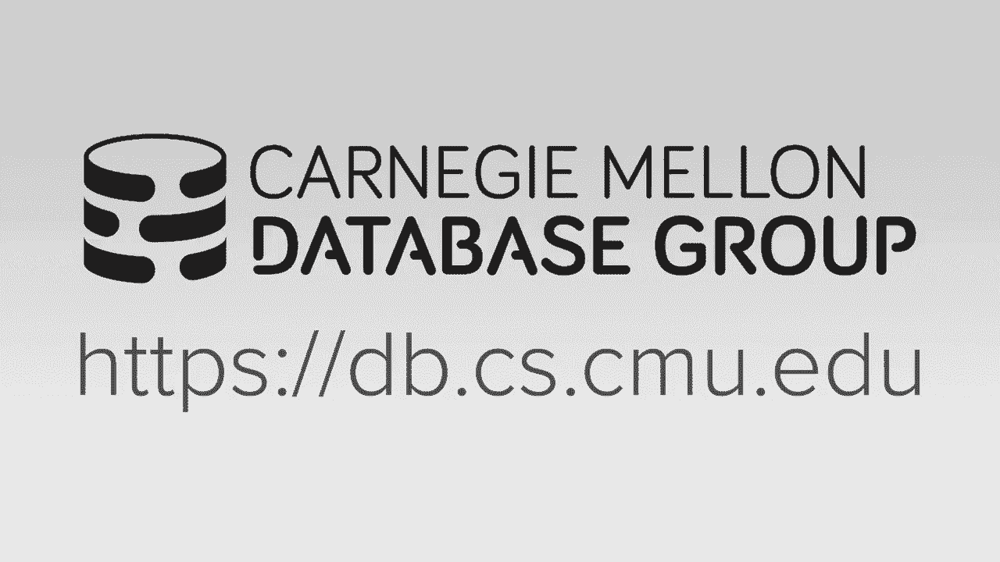
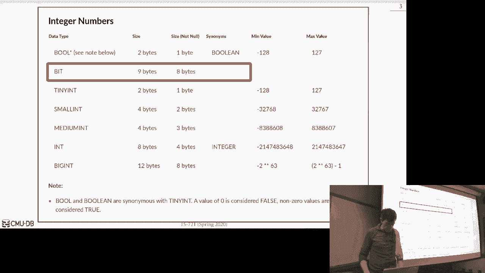
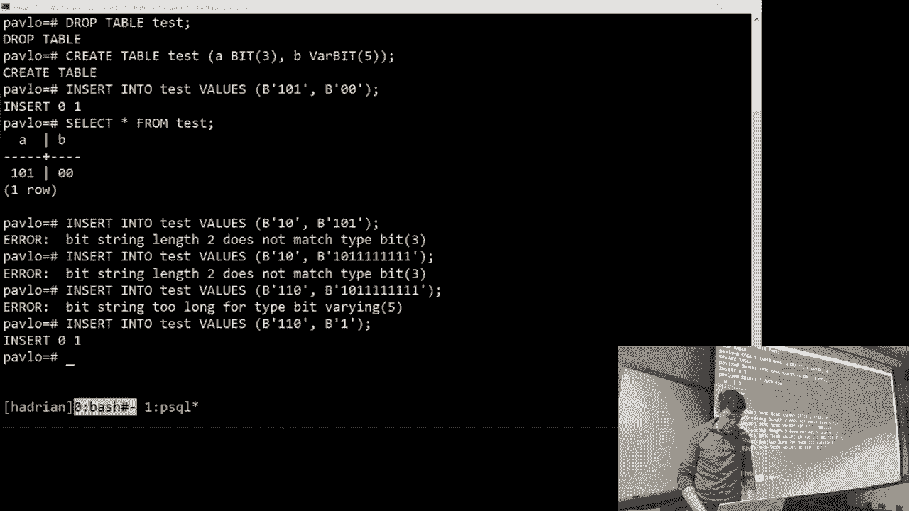
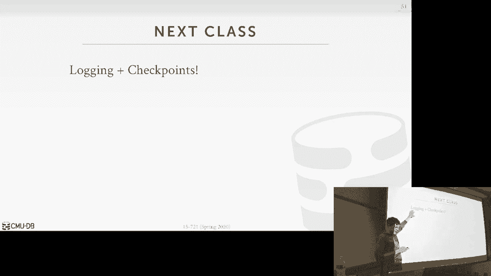

# 9：数据库压缩 📚

在本节课中，我们将要学习数据库系统中的数据压缩技术。我们将探讨为何需要压缩数据，介绍几种不同的压缩方案，并了解数据库系统如何原生地处理压缩数据以提升查询性能。

## 概述

压缩的核心思想是减少数据库中数据的体积，从而节省内存和存储空间。在某些情况下，由于数据布局的优化，压缩甚至能让我们更快地执行查询。我们将从基础的压缩概念讲起，逐步深入到更复杂的列式存储压缩技术。

## 为什么需要压缩？💡

在基于磁盘的数据库系统中，压缩的好处显而易见，因为磁盘I/O非常昂贵。通过付出一些额外的CPU开销来压缩数据，可以显著减少从磁盘读取的数据量，这是一个很好的权衡。

然而，对于内存数据库，这个权衡就不那么明显了。因为所有数据都在内存中，我们不需要支付高昂的I/O代价。但压缩仍然有价值，原因如下：
*   **降低成本**：DRAM并不便宜，减少内存使用可以节省硬件和能源成本。
*   **提升性能**：压缩后的数据可能更适合放入CPU缓存，处理更少的数据量也能计算出相同的结果。

真实数据集通常具有**倾斜性**（某些值频繁出现）和**高度相关性**（同一元组中不同属性的值相互关联）。这些特性使得我们可以采用高效的压缩方案。

## 压缩方案的要求 🎯

一个理想的数据库压缩方案应满足以下几点：
1.  **产生固定长度的值**：为了在固定长度的数据池中进行偏移跳转，大多数压缩值必须是固定长度的。
2.  **支持延迟物化**：尽可能推迟解压数据的时机，在查询生命周期中尽量在压缩数据上完成操作，直到必须向外界输出结果时才进行解压。
3.  **必须是无损压缩**：压缩后再解压必须能完全恢复原始数据。数据库系统本身不应进行有损压缩，这应由应用层根据业务逻辑决定。

## 压缩的粒度 📦

在决定如何压缩之前，我们需要确定压缩的粒度：
*   **块级**：压缩一个数据块（可能包含多行或多列）。
*   **元组级**：压缩单个元组内的所有值。
*   **属性级**：压缩单个元组内的单个属性（对于大文本字段很有用）。
*   **列级**：压缩单个属性在所有元组中的值（主要用于列式存储系统）。

不同的粒度将决定我们可以采用哪种压缩方案。

## 朴素压缩 🧱

朴素压缩是指使用现成的通用压缩算法（如Snappy、LZ4、gzip、Zstandard）对数据字节序列进行压缩。数据库系统本身并不“理解”压缩后的数据内容。

**示例：MySQL的压缩**
在MySQL中，可以创建压缩表。它在磁盘上存储压缩后的数据块，并在内存中维护一个“修改日志”。当需要读取未被修改的数据时，必须解压整个数据块。这种方法的主要缺点是，数据库失去了对数据语义的理解，每次访问都可能需要完全解压。

上一节我们介绍了基础的压缩概念和朴素压缩，本节中我们来看看更高级的、数据库系统原生支持的压缩方案。

## 列式压缩方案 🗂️

对于OLAP（联机分析处理）系统中的冷数据，我们可以采用更高效的列式压缩方案。以下是几种常见的技术：

### 1. 空值抑制与游程编码
空值抑制是游程编码的一种变体，专门处理稀疏数据（即大量值为NULL的列）。其基本思想是不重复存储NULL值，而是记录NULL值的数量和位置。

游程编码则更通用，它利用列中值经常重复出现的特性。对于连续重复的值，不存储每个副本，而是存储一个三元组：`(值, 起始位置, 重复次数)`。

**示例**：
假设一个“性别”列的数据为：`[M, M, M, F, F, F, F]`。
使用游程编码后，可以存储为：`[(M, 0, 3), (F, 3, 4)]`。
如果列预先按性别排序，压缩效果会极佳。

### 2. 位图编码
位图编码为列中每个唯一值创建一个位图。位图的长度等于元组数量，如果某一行具有该值，则对应位置为1，否则为0。

**示例**：
对于“性别”列 `[M, M, F, M, F]`。
*   为“M”创建位图：`[1, 1, 0, 1, 0]`
*   为“F”创建位图：`[0, 0, 1, 0, 1]`

这种方法在列的唯一值基数很低时（如性别、状态码）非常高效。但对于高基数列（如邮编），创建大量长位图反而会浪费空间。

**位图压缩**：位图本身也可以压缩。例如，Oracle曾使用BBC（Byte-aligned Bitmap Code）方案，通过识别全零的“间隙字节”和包含1的“尾部字节”来压缩位图。不过，由于现代CPU分支预测问题，这种方案已逐渐被淘汰。

### 3. 增量编码
增量编码适用于连续值之间差异很小的列，例如时间序列数据。它不存储每个完整值，而是存储第一个值，后续值只存储与前一个值的差值（Delta）。

**示例**：
原始温度读数：`[72, 73, 73, 74, 75]`
增量编码后：`[72, +1, 0, +1, +1]`
可以进一步对`+1`进行游程编码以获得更好压缩比。

对于字符串，可以使用**前缀编码**。如果字符串按字典序排列，可以只存储每个字符串与前一个字符串的共同前缀长度以及不同的后缀部分。

### 4. 字典编码 🗃️
这是最常见和最重要的列式压缩技术。其核心思想是：
1.  识别列中所有重复出现的值。
2.  为每个唯一值分配一个更短的固定长度编码（如整数）。
3.  在列中存储编码而不是原始值。
4.  维护一个字典，用于编码和解码。

**关键优势**：
*   **支持延迟物化**：许多查询（如等值过滤、分组聚合）可以直接在编码上操作，无需解压。
*   **支持范围查询**：如果字典编码的顺序与原始值的顺序一致（使用顺序保留编码，如霍夫曼编码的一种变体），则可以直接在编码上执行范围查询。
*   **快速聚合**：计算唯一值数量只需统计字典大小。

**字典数据结构选择**：
*   **数组**：最简单，编码即数组索引。适用于静态数据。
*   **哈希表**：支持快速编码查找，但不支持范围查询。
*   **B+树**：支持快速编码、解码以及范围查询，是功能最全的选择。

### 5. 其他方案
*   ** Mostly Encoding**：当列中大多数值可以用更小的数据类型表示时，用小类型存储它们，对于少数“溢出”的大值，则用标志位指向一个查找表。Amazon Redshift 使用了此技术。

## 索引压缩 🔑

在OLTP（联机事务处理）系统中，索引本身可能占用大量空间。我们可以压缩索引以减少内存占用。
*   **前缀压缩**：在B+树节点中，不重复存储键的共同前缀。
*   **后缀截断**：在B+树内部节点中，只存储足以区分子节点路径的键前缀部分。
*   **混合索引**：将索引分为动态（可写、未压缩）和静态（只读、压缩）两部分，使用布隆过滤器来指导查询应先访问哪一部分。这是卡内基梅隆大学数据库组的一项研究成果。

## 总结

本节课我们一起学习了数据库压缩的多种技术。关键要点在于，数据库系统可以利用其对数据语义和查询模式的理解，进行比通用压缩算法更智能的压缩。通过字典编码等技术，系统可以在压缩数据上直接执行许多查询操作，实现延迟物化，从而在节省空间的同时，有时甚至能提升查询性能。对于不同的工作负载（OLTP vs OLAP）和数据特性，我们需要选择最适合的压缩粒度和方案。